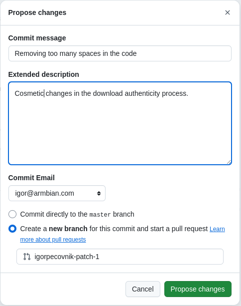
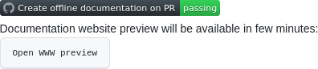

   
  <strong>Armbian Documentation</strong> 
 

**The Armbian Linux Documentation** offers a comprehensive collection of guides, manuals, and resources designed to assist users in every stage of working with Armbian - from installation and initial setup to advanced configuration and optimization. Whether you're a beginner setting up your first single-board computer or an experienced developer fine-tuning system performance, the documentation provides clear, step-by-step instructions and best practices to help you get the most out of your Armbian-powered device.

# Editing

### Online

Documentation edition goes in five simple steps.

|Step|Description|Visuals|
|:-------:|---|---:|
| 1. | Open <a href=https://docs.armbian.com/ target="_blank">website</a> and **find content you want to change**.| 

Expand

 |
| 2. | When you are done with editing, **Commit changes**. | 

Expand

 |
| 3. | Enter title and description of changes you are proposing. Proceed with **Propose changes** | 

Expand

 |
| 4. | Following by **Create a pull request**. |

Expand

 |
| 5. | Verify your changes on **HTML rendered preview** at your pull reqest. |

Expand

 |

### Offline

Please refer to [those instructions](/DOCUMENTATION.md)

### Tips 

<https://squidfunk.github.io/mkdocs-material/reference/>
