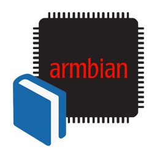

# Armbian Documentation

[](https://github.com/armbian/documentation/actions/workflows/recreate_on_push.yaml)

<p align="center">
  <a target="_blank" href="https://docs.armbian.com">
    
  </a>
</p>

## Overview

Documentation is written in [markdown](https://www.markdownguide.org/basic-syntax/) and stored in the `docs/` subfolder.  Images go in `docs/images`.

This repo is meant for storing and quick glances.  Official output is [https://docs.armbian.com](https://docs.armbian.com).

Armbian Documentation is available in the following formats:

* [Official document website](https://docs.armbian.com),
* [PDF document](https://github.com/armbian/documentation/raw/master/document.pdf)

## Contributing

This site is built with [mkdocs](https://github.com/mkdocs/mkdocs/) and depends on [mkdocs-material](https://github.com/squidfunk/mkdocs-material).

Armbian Documentation naming of document files follows this rules:

`[Parent-Topic-Example]_[Child-Topic]-example.md`

`Parent-Topic-Name` and `Child-Topic-Name` are separated by an underscore `_`.  Hyphens `-` are automatically converted to space.

Please try to avoid creating new parent topics unless absolutely necessary.

Current Parent Topics:

* User Guide
* Hardware notes
* Developer Guide
* Contributor Process
* Release management
* Community

See the [document template](.github/DOCUMENT_TEMPLATE.md) before you writing any content.

## Working on the content

```bash
git clone https://github.com/armbian/documentation
pip install -r requirements.txt
mkdocs build --clean && mkdocs serve
```

You will be able to make edits to existing files and observe the results in real time.

After changing text in an existing file, use this command to rebuild and view the documentation:

`mkdocs build --clean && mkdocs serve`

After adding a new file, either hand-edit `mkdocs.yml`, or re-run `tools/mkArmbianDocs.py` **unless making changes to the structure of the `docs/` folder**. (See below)

## Generate tools

### mkArmbianDocs.py
Generate `mkdocs.yml` based on the contents of `docs/` folder

* Command-line options for input and output directories
* Requires install requirement
* You don't need to run it every time unless making changes to the structure of the `docs/` folder
* See `mkArmbianDocs.py -h` for help

From the parent folder of the repo, run:

`python3 tools/mkArmbianDocs.py && mkdocs build`

This will generate the `mkdocs.yml` and publish built HTML to the `site/` folder.
