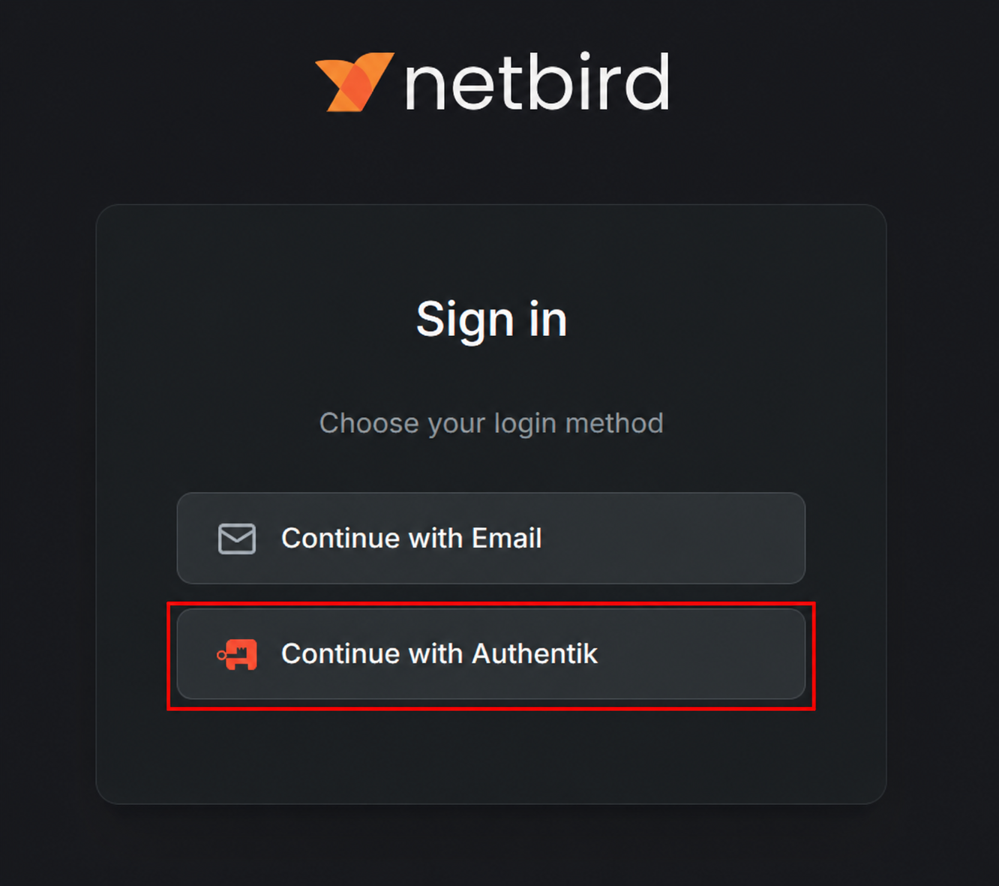
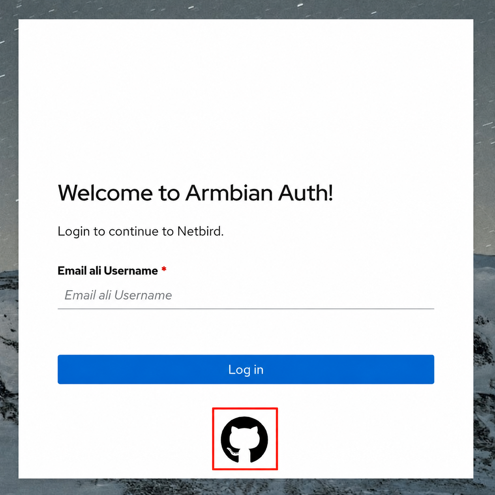

# Datacenter access

Armbian runs a hardware lab — *the Datacenter* — a rack of real boards on real
networks that our CI flashes, powers, boots, tests and measures automatically.
Board maintainers can reach these boards remotely to debug problems, reproduce
issues and validate images on actual hardware.


Access is over a VPN and is available to members of the
[**board-maintainers**](https://github.com/orgs/armbian/teams/board-maintainers)
GitHub team. Everything below (VPN login and board access) only works once you
are on that team.

## Requesting access

The `board-maintainers` team is a *visible* team, so organization members can
request to join it themselves:

- **If you are already an Armbian GitHub organization member** — open the
  [board-maintainers team page](https://github.com/orgs/armbian/teams/board-maintainers)
  and click **Request to join**. A team maintainer reviews and approves it.
- **If you are not an organization member yet** — every contributor is
  automatically invited to become a member of the
  [Armbian organization](https://github.com/armbian), so contribute (e.g. a
  merged pull request) and accept the invitation that follows. Once you are an
  org member, request to join the team as above.

## Connect via VPN (Netbird)

The Datacenter network is reached through [Netbird](https://netbird.io), a
WireGuard-based mesh VPN. Authentication is via **GitHub**: you sign in with your
GitHub account and are let in if you belong to the `board-maintainers` team.

### 1. Install the Netbird client

On Linux:

```bash
curl -fsSL https://pkgs.netbird.io/install.sh | sh
```

On macOS and Windows, install the client from
[netbird.io/downloads](https://netbird.io/downloads) (or via `brew`, `winget`,
etc.).

### 2. Connect to Armbian's Netbird

```bash
netbird up --management-url https://netbird.armbian.com
```

This opens your browser to authenticate:

1. On the Netbird sign-in screen, choose **Continue with Authentik**.

    { width=50% }

2. On the *Armbian Auth* screen, click the **GitHub** icon (the button below
    *Log in* — not the email/username field) and authorize the request.

    { width=50% }

Once GitHub confirms you are a `board-maintainers` member you are connected to
the Datacenter mesh. The management URL is remembered, so next time you can just
run `netbird up`.

Check the connection and your assigned VPN address:

```bash
netbird status
```

To disconnect, run `netbird down`.

## Access boards

Once connected you are on the Datacenter network and can reach the boards
directly by their IP address.

Find the board you need — its model and IP address — in the [Boards](#boards)
list below, then SSH in as **root**:

```bash
ssh root@<board-ip>        # e.g. ssh root@10.0.50.42
```

No password is needed — every board installs the SSH public keys from your
GitHub account (`https://github.com/<your-username>.keys`) into root's
authorized keys, so make sure the matching private key is on the machine you
connect from.

If a board is unreachable it may be powered off or mid-test. For anything you
cannot resolve (missing access, a wedged board), reach out on the
[Armbian Discord](https://discord.com/invite/armbian) channels.

!!! warning "Reflashing is under testing"
    Automated board reflashing is still experimental. If you reflash a board and
    accidentally brick it or leave it unresponsive, please report it on the
    [Armbian Discord](https://discord.com/invite/armbian) so it can be recovered.

## Boards

The list below is refreshed by the reconcile action (`Inventory: scan &
reconcile` in the autotests repo): it scans the Datacenter and opens a pull
request to update this table — the same mechanism used for the
[wireless performance results](../WifiPerformance.md).

<!-- BOARDS-START -->

**74** boards (17 failed).

| Board | Status | IP address | Boot | Link | Switch | Last seen |
|:--|:--:|:--|:--|--:|:--|--:|
| Arduino UNO Q 01 | ❌ | 10.0.20.131 | local | Wi-Fi 5 | Zyxel NWA130BE | 21 Jun |
| Banana Pi CM4IO 01 | ✅ | 10.0.50.10 | local | 1 GbE | Netgear S3300-52X-PoE+ (43) | 06 Jul |
| Banana Pi M2 Ultra 01 | ✅ | 10.0.50.47 | local | 1 GbE | TP-Link TL-SG3428X (13) | 06 Jul |
| Banana Pi M2Pro 01 | ✅ | 10.0.50.43 | local | 1 GbE | Netgear S3300-52X-PoE+ (47) | 06 Jul |
| Banana Pi M5 01 | ✅ | 10.0.50.55 | local | 1 GbE | Netgear GS348 (19) | 06 Jul |
| Banana Pi Pro 01 | ✅ | 10.0.50.52 | local | 100 MbE | Netgear GS348 (8) | 06 Jul |
| BananaPi BPI-F3 01 | ✅ | 10.0.50.70 | local | 1 GbE | Netgear S3300-52X-PoE+ (46) | 06 Jul |
| BigTreeTech CB1 01 | ❌ | 10.0.50.56 | local | Wi-Fi 4 | Zyxel NWA130BE | 30 Jun |
| Clearfog Pro 01 | ✅ | 10.0.50.42 | local | 1 GbE | TP-Link TL-SG3428X (12) | 06 Jul |
| Cubietruck 01 | ✅ | 10.0.50.49 | local | 1 GbE | TP-Link TL-SG3428X (14) | 06 Jul |
| Cubox i2eX/i4 01 | ✅ | 10.0.50.63 | local | 1 GbE | Netgear GS348 (32) | 06 Jul |
| Espressobin 01 | ✅ | 10.0.50.26 | local | 1 GbE | TP-Link TL-SG3428X (11) | 06 Jul |
| Helios4 01 | ✅ | 10.0.50.58 | local | 1 GbE | Netgear GS348 (11) | 06 Jul |
| Inovato Quadra 01 | ✅ | 10.0.50.36 | local | 100 MbE | Netgear GS348 (17) | 06 Jul |
| Khadas VIM1 01 | ❌ | 10.0.50.14 | local | 100 MbE | Netgear GS348 (3) | 04 Jul |
| Khadas VIM1 02 | ❌ | 10.0.20.119 | local | Wi-Fi 5 | Zyxel NWA130BE | 06 Jul |
| Khadas VIM1 03 | ✅ | 10.0.50.71 | local | Wi-Fi 5 | Zyxel NWA130BE | 06 Jul |
| Khadas VIM2 01 | ✅ | 10.0.50.12 | local | 1 GbE | Netgear GS348 (13) | 06 Jul |
| Khadas VIM3 01 | ✅ | 10.0.50.38 | local | 1 GbE | Netgear GS348 (36) | 06 Jul |
| Le potato 01 | ❌ | 10.0.50.37 | local | 100 MbE | Netgear GS348 (12) | 03 Jul |
| Mekotronics R58S2 01 | ✅ | 10.0.50.19 | local | 1 GbE | Netgear GS348 (48) | 06 Jul |
| NanoPC T6 LTS 01 | ✅ | 10.0.50.30 | local | 2.5 GbE | TP-Link SG3218XP-M2 (8) | 06 Jul |
| NanoPi Duo 01 | ✅ | 10.0.50.48 | local | 100 MbE | Netgear GS348 (31) | 06 Jul |
| NanoPi K2 01 | ✅ | 10.0.50.76 | local | 1 GbE | Netgear GS348 (20) | 06 Jul |
| NanoPi M4V2 01 | ✅ | 10.0.50.97 | local | 1 GbE | Netgear S3300-52X-PoE+ (7) | 06 Jul |
| NanoPi M5 01 | ✅ | 10.0.50.35 | local | 1 GbE | Netgear S3300-52X-PoE+ (5) | 06 Jul |
| NanoPi M6 01 | ❌ | 10.0.50.18 | local | 1 GbE | Netgear S3300-52X-PoE+ (39) | 25 Jun |
| NanoPi M6 03 | ❌ | 10.0.60.180 | local | Wi-Fi 5 | Zyxel NWA130BE | 29 Jun |
| NanoPi M6 04 | ❌ | 10.0.60.181 | local | Wi-Fi 5 | Zyxel NWA130BE | 29 Jun |
| NanoPi Neo 2 Black 01 | ❌ | 10.0.50.59 | local | 1 GbE | — | 02 Jul |
| NanoPi Neo 3 01 | ✅ | 10.0.50.20 | local | 1 GbE | TP-Link TL-SG3428X (17) | 06 Jul |
| NanoPi R1 01 | ❌ | 10.0.50.31 | local | 1 GbE | Netgear GS348 (14) | 04 Jul |
| Nanopi R2S 01 | ✅ | 10.0.50.65 | local | 1 GbE | Netgear S3300-52X-PoE+ (12) | 06 Jul |
| NanoPi R4S 01 | ✅ | 10.0.50.25 | local | 1 GbE | Netgear GS348 (39) | 06 Jul |
| NanoPi R6S 01 | ✅ | 10.0.50.40 | local | 1 GbE | Netgear S3300-52X-PoE+ (44) | 06 Jul |
| NanoPi R76S 01 | ✅ | 10.0.50.67 | local | 2.5 GbE | Netgear XS508M (7) | 06 Jul |
| Odroid C1 01 | ✅ | 10.0.50.27 | local | 1 GbE | Netgear GS348 (28) | 06 Jul |
| Odroid C2 01 | ✅ | 10.0.50.87 | local | 1 GbE | Netgear GS348 (7) | 06 Jul |
| Odroid C4 01 | ✅ | 10.0.50.13 | local | 1 GbE | TP-Link TL-SG3428X (10) | 06 Jul |
| Odroid M1 01 | ❌ | 10.0.50.64 | nfs | 1 GbE | Netgear S3300-52X-PoE+ (3) | 06 Jul |
| Odroid N2 02 | ✅ | 10.0.50.66 | local | 1 GbE | TP-Link TL-SG3428X (21) | 06 Jul |
| Odroid XU4 01 | ✅ | 10.0.50.51 | local | 1 GbE | Netgear S3300-52X-PoE+ (19) | 06 Jul |
| Orange Pi 3 01 | ✅ | 10.0.50.57 | local | 1 GbE | Netgear S3300-52X-PoE+ (31) | 06 Jul |
| Orange Pi 5 01 | ✅ | 10.0.50.39 | local | 1 GbE | TP-Link SG3218XP-M2 (5) | 06 Jul |
| Orange Pi 5 Plus 01 | ✅ | 10.0.50.33 | local | 1 GbE | Netgear S3300-52X-PoE+ (8) | 06 Jul |
| Orange Pi Lite 2 01 | ❌ | 10.0.20.125 | local | Wi-Fi 5 | Zyxel NWA130BE | 01 Jul |
| Orange Pi One+ 01 | ✅ | 10.0.50.125 | local | 1 GbE | TP-Link TL-SG3428X (18) | 05 Jul |
| Orange Pi PC + 01 | ❌ | 10.0.50.32 | local | 100 MbE | Netgear GS348 (47) | 04 Jul |
| Orange Pi PC2 01 | ✅ | 10.0.50.68 | local | 1 GbE | TP-Link TL-SG3428X (22) | 06 Jul |
| Orange Pi Prime 01 | ❌ | 10.0.50.61 | local | 1 GbE | Netgear S3300-52X-PoE+ (23) | 04 Jul |
| Orange Pi R1 01 | ❌ | 10.0.50.50 | local | Wi-Fi 4 | Zyxel NWA130BE | 05 Jul |
| Orange Pi Win 01 | ✅ | 10.0.50.24 | local | 1 GbE | Netgear S3300-52X-PoE+ (13) | 06 Jul |
| Orange Pi Zero 02 | ✅ | 10.0.50.46 | local | Wi-Fi 4 | Zyxel NWA130BE | 06 Jul |
| Orange Pi Zero Plus 01 | ✅ | 10.0.50.54 | local | 1 GbE | TP-Link TL-SG3428X (20) | 06 Jul |
| Orange Pi Zero2 01 | ✅ | 10.0.50.74 | local | 1 GbE | Netgear S3300-52X-PoE+ (45) | 06 Jul |
| OrangePi 3 LTS 01 | ❌ | 10.0.50.60 | local | 1 GbE | TP-Link TL-SG3428X (19) | 04 Jul |
| OrangePi 3 LTS 02 | ✅ | 10.0.50.16 | local | Wi-Fi 5 | Zyxel NWA130BE | 06 Jul |
| Pine H64 01 | ❌ | 10.0.50.34 | local | 1 GbE | TP-Link TL-SG3428X (9) | 06 Jul |
| Radxa ZERO 3 01 | ✅ | 10.0.20.185 | local | Wi-Fi 6 | Zyxel NWA130BE | 06 Jul |
| Raspberry Pi 01 | ✅ | 10.0.50.15 | local | 1 GbE | Netgear GS348 (1) | 06 Jul |
| Raspberry Pi 02 | ✅ | 10.0.50.22 | local | 100 MbE | Netgear GS348 (21) | 06 Jul |
| ROCK 2F 01 | ✅ | 10.0.20.164 | local | Wi-Fi 6 | Zyxel NWA130BE | 06 Jul |
| Rock 5B 01 | ✅ | 10.0.50.69 | local | 2.5 GbE | Netgear XS508M (6) | 06 Jul |
| Rock 5B 02 | ✅ | 10.0.50.17 | local | 2.5 GbE | Netgear XS508M (5) | 06 Jul |
| Rock 5B Plus 01 | ✅ | 10.0.50.41 | local | 2.5 GbE | Netgear XS508M (4) | 06 Jul |
| Rock 5T 01 | ✅ | 10.0.50.11 | local | 2.5 GbE | TP-Link SG3218XP-M2 (12) | 06 Jul |
| Rockpi E 01 | ✅ | 10.0.50.28 | local | 1 GbE | TP-Link TL-SG3428X (16) | 06 Jul |
| SpacemiT K3 Pico-ITX 01 | ✅ | 10.0.50.44 | local | 10 GbE | Netgear S3300-52X-PoE+ (52) | 06 Jul |
| Tanix TX6 01 | ✅ | 10.0.50.21 | local | 100 MbE | Netgear GS348 (46) | 06 Jul |
| Tinker Board 01 | ✅ | 10.0.50.29 | local | 1 GbE | Netgear S3300-52X-PoE+ (15) | 06 Jul |
| Tinker Board 2 01 | ✅ | 10.0.50.23 | local | 1 GbE | TP-Link TL-SG3428X (15) | 06 Jul |
| Udoo 01 | ✅ | 10.0.50.62 | local | 1 GbE | Netgear S3300-52X-PoE+ (37) | 06 Jul |
| UEFI arm64 01 | ✅ | 10.0.50.45 | local | 10 GbE | Netgear XS712T (6) | 06 Jul |
| UEFI x86 01 | ✅ | 10.0.50.53 | local | 1 GbE | Netgear GS348 (9) | 06 Jul |

<!-- BOARDS-STOP -->
