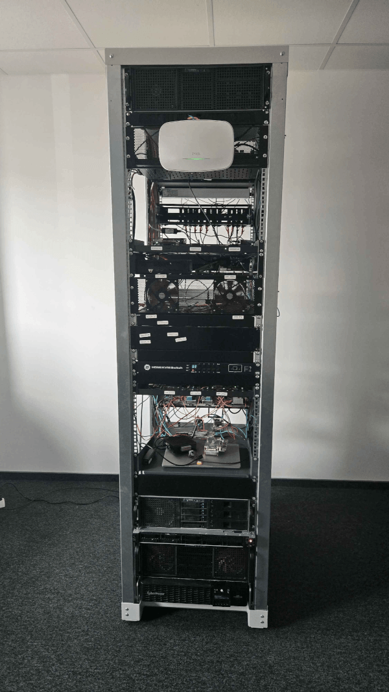

# Datacenter access

Armbian runs a hardware lab — *the Datacenter* — a rack of real boards on real
networks that our CI flashes, powers, boots, tests and measures automatically.
Board maintainers can reach these boards remotely to debug problems, reproduce
issues and validate images on actual hardware.



Access is over a VPN and is available to members of the
[**board-maintainers**](https://github.com/orgs/armbian/teams/board-maintainers)
GitHub team. Everything below (VPN login and board access) only works once you
are on that team.

## Requesting access

The `board-maintainers` team is a *visible* team, so organization members can
request to join it themselves:

- **If you are already an Armbian GitHub organization member** — open the
  [board-maintainers team page](https://github.com/orgs/armbian/teams/board-maintainers)
  and click **Request to join**. A team maintainer reviews and approves it.
- **If you are not an organization member yet** — every contributor is
  automatically invited to become a member of the
  [Armbian organization](https://github.com/armbian), so contribute (e.g. a
  merged pull request) and accept the invitation that follows. Once you are an
  org member, request to join the team as above.

## Connect via VPN (Netbird)

The Datacenter network is reached through [Netbird](https://netbird.io), a
WireGuard-based mesh VPN. Authentication is via **GitHub**: you sign in with your
GitHub account and are let in if you belong to the `board-maintainers` team.

### 1. Install the Netbird client

On Linux:

```bash
curl -fsSL https://pkgs.netbird.io/install.sh | sh
```

On macOS and Windows, install the client from
[netbird.io/downloads](https://netbird.io/downloads) (or via `brew`, `winget`,
etc.).

### 2. Connect to Armbian's Netbird

```bash
netbird up --management-url https://netbird.armbian.com
```

This opens your browser to authenticate. Log in with **GitHub** and authorize the
request. Once you are verified as a `board-maintainers` member you are connected
to the Datacenter mesh. The management URL is remembered, so later you can simply
run `netbird up`.

Check the connection and your assigned VPN address:

```bash
netbird status
```

To disconnect, run `netbird down`.

## Access boards

Once connected you are on the Datacenter network and can reach the boards
directly by their IP address.

The inventory — every board with its model, status and IP — lives in NetBox:
**<https://netbox.armbian.com>**. Look up the board you need there, then SSH in
as **root**:

```bash
ssh root@<board-ip>        # e.g. ssh root@10.0.50.42
```

No password is needed — every board installs the SSH public keys from your
GitHub account (`https://github.com/<your-username>.keys`) into root's
authorized keys, so make sure the matching private key is on the machine you
connect from.

If a board is unreachable it may be powered off or mid-test; check its status in
NetBox. For anything you cannot resolve (missing access, a wedged board), reach
out on the maintainers channel.

## Boards

The list below is generated from NetBox and kept up to date automatically via
pull request — the same mechanism used for the
[wireless performance results](../WifiPerformance.md).

<!-- BOARDS-START -->

_The board list is populated automatically; this placeholder is replaced on the
next update._

<!-- BOARDS-STOP -->
