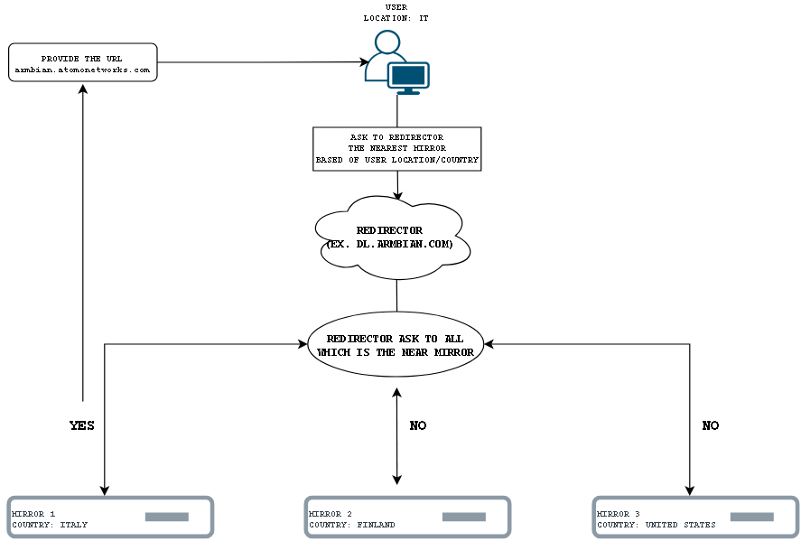

# How the Armbian Mirror System Works  

## Introduction  
The [Armbian mirror system](https://github.com/armbian/armbian-router) is designed to efficiently distribute files, ensuring users get the best available server based on geographic proximity and server availability. This document outlines the mirroring system's operational flow, technical specifications for mirrors, and how to contribute a new server.

## Operational Flow  

1. **User Request**  
   - A user initiates a file download (system image, package, etc.) from Armbian using a standard URL (e.g., `https://dl.armbian.com`).  

2. **Redirector Server Processing**  
   - The redirector server processes the request and determines the best available mirror based on:  
     - User's geographic location  
     - Mirror server status and load  
     - Availability of the requested files  

3. **Mirror Assignment**  
   - The redirector server provides a direct URL to the most suitable mirror.  
   - The user is automatically redirected to the designated server.  

4. **Download from Assigned Mirror**  
   - The user downloads the file directly from the assigned mirror, optimizing speed and reducing load on the main infrastructure.  

## Benefits of the Mirroring System  
- **Load balancing**: Requests are distributed across multiple servers to prevent congestion.  
- **Faster downloads**: Users are served by the closest available mirror.  
- **Redundancy and reliability**: If a mirror is unavailable, the redirector automatically assigns an alternative.  

## How to Contribute a Mirror  
If you would like to contribute to the Armbian project by providing a mirror, follow these steps:  

### 1. Choose the target and set up an HTTP/HTTPS hostname  
   - The mirror must be accessible via HTTP, and HTTPS is preferred.  

### 2. Set up synchronization via `rsync`  
   - Sync files from one of the official repositories using the following commands:  

   | Content | Command | Required Space |  
   |---------|---------|---------------:|  
   | Current images | `rsync -av rsync://rsync.armbian.com/dl` | 556G |  
   | Packages | `rsync -av rsync://rsync.armbian.com/apt` | 84G |  
   | Archived images | `rsync -av rsync://rsync.armbian.com/archive` | 1.9T |  
   | Very old images | `rsync -av rsync://rsync.armbian.com/oldarchive` | 5.4T |  

   - Set up a cron job to sync every **2-4 hours**.  

### 3. Inform us about your mirror  
   - Once your server is configured, contact us via the [contact form](https://www.armbian.com/contact/) to integrate it into the official redirector system.  

Contributing a mirror helps improve Armbian’s file distribution, ensuring faster and more reliable downloads for the global community.  

## Current Mirrors

| Site | Time Zone | Flag | Speed  | Packages | Images | Archive | Rsync |
|:-----|:----------|------|-------:|:--------:|:------:|:-------:|:-----:|
| [Atomo&nbsp;Networks](https://armbian.atomonetworks.com) | Europe/Rome |  | 2500&nbsp;Mbps | :white_check_mark: | :white_check_mark: | :white_check_mark: | :white_check_mark: |
| [Auroradev&nbsp;Chicago](https://armbian.chi.auroradev.org) | America/Chicago |  | 1000&nbsp;Mbps | :white_check_mark: | :white_check_mark: |  |  |
| [Auroradev&nbsp;Las&nbsp;Vegas](https://armbian.lv.auroradev.org) | America/Los_Angeles |  | 10000&nbsp;Mbps | :white_check_mark: | :white_check_mark: | :white_check_mark: | :white_check_mark: |
| [Nardol](https://armbian.nardol.ovh) | Europe/Paris |  | 1000&nbsp;Mbps | :white_check_mark: | :white_check_mark: |  |  |
| [Systemonachip](https://armbian.systemonachip.net) | Europe/Vienna |  | 1000&nbsp;Mbps | :white_check_mark: | :white_check_mark: | :white_check_mark: |  |
| [TNA&nbsp;Hosting](https://armbian.tnahosting.net) | America/New_York |  | 1000&nbsp;Mbps | :white_check_mark: | :white_check_mark: | :white_check_mark: |  |
| [SBC&nbsp;mirror&nbsp;Spain](https://es.sbcmirror.org) | Europe/Madrid |  | 1000&nbsp;Mbps | :white_check_mark: | :white_check_mark: |  |  |
| [Hetzner&nbsp;Germany](https://fi.mirror.armbian.de) | Europe/Berlin |  | 1000&nbsp;Mbps | :white_check_mark: | :white_check_mark: | :white_check_mark: | :white_check_mark: |
| [Kspace&nbsp;Estonia](https://k-space.ee.armbian.com) | Europe/Tallinn |  | 10000&nbsp;Mbps | :white_check_mark: | :white_check_mark: | :white_check_mark: |  |
| [AARNet](https://mirror.aarnet.edu.au) | Australia/Sydney |  | 100000&nbsp;Mbps | :white_check_mark: | :white_check_mark: |  |  |
| [Albony](https://mirror.albony.in) | Asia/Kolkata |  | 1000&nbsp;Mbps | :white_check_mark: |  |  |  |
| [Macarne&nbsp;LLC](https://mirror.ams.macarne.com/armbian) | Europe/Amsterdam |  | 50000&nbsp;Mbps | :white_check_mark: | :white_check_mark: | :white_check_mark: |  |
| [Hostiko](https://mirror.hostiko.network) | Europe/Kiev |  | 20000&nbsp;Mbps | :white_check_mark: | :white_check_mark: |  |  |
| [ISCAS](https://mirror.iscas.ac.cn) | Asia/Shanghai |  | 10000&nbsp;Mbps | :white_check_mark: | :white_check_mark: |  |  |
| [OSS&nbsp;Planet](https://mirror.ossplanet.net) | Asia/Taipei |  | 1000&nbsp;Mbps | :white_check_mark: |  |  |  |
| [Alibaba&nbsp;Mirrors](https://mirrors.aliyun.com) | Asia/Shanghai |  | 10000&nbsp;Mbps | :white_check_mark: | :white_check_mark: |  |  |
| [BFSU](https://mirrors.bfsu.edu.cn) | Asia/Shanghai |  | 10000&nbsp;Mbps | :white_check_mark: | :white_check_mark: |  |  |
| [c0urier.net](https://mirrors.c0urier.net) | Europe/Copenhagen |  | 1000&nbsp;Mbps | :white_check_mark: | :white_check_mark: | :white_check_mark: |  |
| [CSTCloud](https://mirrors.cstcloud.cn) | Asia/Shanghai |  | 10000&nbsp;Mbps | :white_check_mark: | :white_check_mark: |  |  |
| [dotsrc.org](https://mirrors.dotsrc.org) | Europe/Copenhagen |  | 20000&nbsp;Mbps | :white_check_mark: | :white_check_mark: |  |  |
| [Jevin&nbsp;Canders&nbsp;LLC](https://mirrors.jevincanders.net) | America/New_York |  | 10000&nbsp;Mbps | :white_check_mark: | :white_check_mark: |  |  |
| [Lahansons](https://mirrors.lahansons.com) | America/Los_Angeles |  | 10000&nbsp;Mbps | :white_check_mark: | :white_check_mark: |  |  |
| [Nanjing&nbsp;University](https://mirrors.nju.edu.cn) | Asia/Shanghai |  | 10000&nbsp;Mbps | :white_check_mark: | :white_check_mark: |  |  |
| [Shandong&nbsp;University](https://mirrors.sdu.edu.cn) | Asia/Shanghai |  | 10000&nbsp;Mbps | :white_check_mark: |  |  |  |
| [Shanghai&nbsp;Tech&nbsp;University](https://mirrors.shanghaitech.edu.cn) | Asia/Shanghai |  | 10000&nbsp;Mbps | :white_check_mark: | :white_check_mark: |  |  |
| [SUSTech](https://mirrors.sustech.edu.cn) | Asia/Shanghai |  | 10000&nbsp;Mbps | :white_check_mark: |  |  |  |
| [Tsinghua&nbsp;University](https://mirrors.tuna.tsinghua.edu.cn) | Asia/Shanghai |  | 10000&nbsp;Mbps | :white_check_mark: | :white_check_mark: |  |  |
| [USTC](https://mirrors.ustc.edu.cn) | Asia/Shanghai |  | 10000&nbsp;Mbps | :white_check_mark: | :white_check_mark: |  |  |
| [Digital&nbsp;Streaming&nbsp;Co.](https://mirror.twds.com.tw) | Asia/Taipei |  | 50000&nbsp;Mbps | :white_check_mark: | :white_check_mark: |  |  |
| [Airframes&nbsp;St&nbsp;Louis](https://mirror-us-stl1.armbian.airframes.io) | America/Chicago |  | 1000&nbsp;Mbps | :white_check_mark: | :white_check_mark: |  |  |
| [VineHost.NET](https://mirror.vinehost.net/armbian) | Europe/London |  | 1000&nbsp;Mbps | :white_check_mark: | :white_check_mark: |  |  |
| [Yandex](https://mirror.yandex.ru/mirrors/armbian) | Europe/Moscow |  | 10000&nbsp;Mbps |  | :white_check_mark: | :white_check_mark: |  |
| [Netcup&nbsp;Germany](https://netcup-01.armbian.com) | Europe/Berlin |  | 2500&nbsp;Mbps | :white_check_mark: | :white_check_mark: |  |  |
| [Netcup&nbsp;Germany](https://netcup-02.armbian.com) | Europe/Berlin |  | 2500&nbsp;Mbps | :white_check_mark: |  |  |  |
| [Netcup&nbsp;Germany](https://netcup-03.armbian.com) | Europe/Berlin |  | 2500&nbsp;Mbps | :white_check_mark: | :white_check_mark: |  |  |
| [JetHome](https://stpete-mirror.armbian.com) | Europe/Moscow |  | 2000&nbsp;Mbps | :white_check_mark: | :white_check_mark: | :white_check_mark: |  |
| [Xogium](https://xogium.performanceservers.nl) | Europe/Paris |  | 500&nbsp;Mbps | :white_check_mark: | :white_check_mark: | :white_check_mark: |  |
