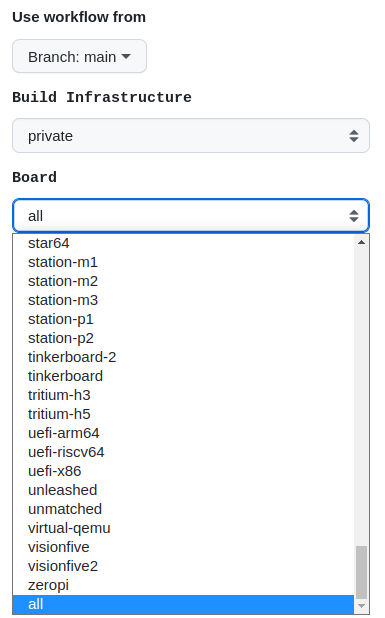

# Automatic or Manual Firmware Compilation

Generates kernels at code push if the code, patches or config were changed in any way. It is also triggered via cron in the middle of Central European Time (CET) night.

The build train is executed only if there are changed kernels. When this happens, it also generates armbian-firmware, desktop and u-boot packages. If the build succeeds it pushes packages to the package repository and increments trunk build version.

- generates all changed kernels,
- generate all boot loaders for all supported hardware,
- generate desktop pacakages,
- generates armbian-firmware, armbian-zsh, armbian-config.

You can change source repository and you can change destination package repository to https://beta.armbian.com (default) or https://apt.armbian.com

Manual Executing rights: [Armbian project member](https://github.com/orgs/armbian/people)

# Official Images Compilation

Regenerate predefined stable images with incrementing patch version for selected board.

Manual executing rights: [Armbian release manager](https://forum.armbian.com/staffapplications/application/11-release-manager/)

# Smoke tests on hardware devices

Smoke testing is preliminary testing to reveal simple failures severe enough to, for example, reject a prospective software release. Our test case is constructed of three steps:

- powering test equipment, consistent from several network switches, power supplies and dozens of hardware platforms
- running upgrade, reboot, repository switch, reboot, ... tests in parallel
- uploading a test report as build artefact following by powering the devices off.

Manual Executing rights: [Armbian project member](https://github.com/orgs/armbian/people)

# Automatic Pull Requests Labeler

Automatically label new pull request based on the paths of files which are being changed. Configuration file can be found in:

        .github/labeler.yml

# Manual Pull Requests rebase

Pull most recent code from master branch and put your work on top of your pull request.

How to use it? Simply comment 

       /rebase

to trigger the action.

- [Advantages of Git Rebase](https://itnext.io/advantages-of-git-rebase-af3b5f5448c6),
- [Automatic Rebase Action origin](https://github.com/marketplace/actions/automatic-rebase).

# Automatic or Manual Desktops Test Builds

Generates all desktops for arm64 and x86 arhitecture to verify if they build correctly. Build is triggered every day, manually (by [any member of Armbian project](https://github.com/orgs/armbian/people)) or in pull requests if label "Desktop" is set. Aim of this test case is to find out if there are troubles in packages relations.

- releases: bullseye, bookworm, jammy,
- desktop environments: xfce, gnome, mate, cinnamon, budgie, kde-plasma,
- builds are not using cached rootfs to force packages assembly,
- included applications paths are "3dsupport browsers",
- builds are done with [Docker image](https://github.com/orgs/armbian/packages?repo_name=build) on public runners.

# Automatic Kernel Build at Pull Requests

Generates kernels at Pull Requests if their code, patches or config was changed. Build starts when label of Pull Request is set to "Ready to review"

# Integrity testings

This action tests package integrity from all stable images at download section.

Manual Executing rights: [Armbian project member](https://github.com/orgs/armbian/people)

# Forked Helper

- Run repository dispatch to default fork branch
- Dispatch event on forked repostitory

# Lint On Scripts

Run [ShellCheck](https://github.com/koalaman/shellcheck) on changed shell scripts and report problems within. Since our scripts are full of shellcheck problems we don't block merging on those errors. Not yet.

Linting is run automatically on pull requests change.

# Scorecards Security Scan

Scorecards is an automated tool that assesses a number of important heuristics ("checks") associated with software security and assigns each check a score of 0-10. You can use these scores to understand specific areas to improve in order to strengthen the security posture of your project. You can also assess the risks that dependencies introduce, and make informed decisions about accepting these risks, evaluating alternative solutions, or working with the maintainers to make improvements.

https://github.com/ossf/scorecard#what-is-scorecards

# Kernel hardening analysis

This analysis checks kernel config if changed.

There are plenty of security hardening options for the Linux kernel. A lot of them are not enabled by the major distros. We have to enable these options ourselves to make our systems more secure.

https://github.com/a13xp0p0v/kconfig-hardened-check/blob/master/README.md
