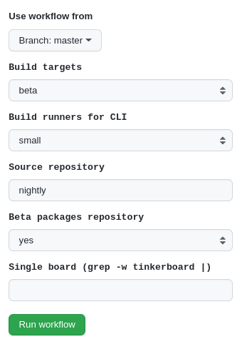
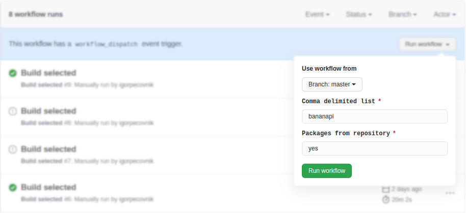
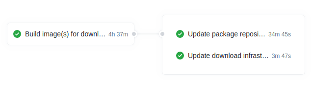

# Automatic Pull Requests Labeler

Automatically label new pull requests based on the paths of files being changed. Configuration file can be found in:

        .github/labeler.yml

# Manual Pull Requests rebase

Pull most recent code from master branch and put your work on top of your pull request.

How to use it? Simply comment 

       /rebase

to trigger the action

- [Advantages of Git Rebase](https://itnext.io/advantages-of-git-rebase-af3b5f5448c6),
- [Automatic Rebase Action origin](https://github.com/marketplace/actions/automatic-rebase).

# Automatic or Manual Desktops Test Builds

This Action automatically generates all desktops for arm64 and x86 arhitecture to verify if they build correctly. Build is triggered every day, manually (by [any member of Armbian project](https://github.com/orgs/armbian/people)) or in pull requests if label "Desktop" is set.

- releases: bullseye, sid, jammy, focal,
- desktop environments: xfce, gnome, mate, cinnamon, budgie, kde-plasma,
- builds are not using cached rootfs to force packages assembly,
- included applications paths are "3dsupport browsers",
- builds are done with Docker on public runners.

# Automatic or Manual Images Compilation

- automatically generates all beta images upon kernel code change,
- it also builds release candidate or stable images upon manual trigger by [release manager](https://forum.armbian.com/staffapplications/application/11-release-manager/),
- can select runners infrastructure: ours or public,
- can select source repository, release branch or leave defaults to "nightly",
- can choose between apt.armbian.com or beta.armbian.com packages source,
- can build single board with targets defined in [this configuration](https://github.com/armbian/build/blob/master/config/targets.conf).

# Automatic or Kernel Build at Pull Requests

Generates kernels at Pull Requests if their code, patches or config was changed in any way. Build starts when label of Pull Request is set to "Ready"

# Integrity testings

By executing "Check images integrity" you can test package integrity of images at download sections.

# Merge request pipelines

On each merge reqest we are running:

- shell script analysis
- creating Docker image
- creating desktop variants 
  - if label is set to "desktop"
  - when PR is switched between "draft" and "ready for review"
  - when PR is approved
- building changed kernels

Those runs are for security reasons executed on public Github runners servers which are [very limited](https://docs.github.com/en/actions/using-github-hosted-runners/about-github-hosted-runners#supported-runners-and-hardware-resources). One build cycle takes around one hour and it produces two types of artefacts:

- script anylysis report
- debian packages for kernel, device treee, headers, sources

Those build artefacts are available up to 14 days.

 

 

## Build beta kernel packages 

 

Pipeline is extended version of merge requests pipeline. Pipeline is scheduled to run every day at 6am CET. It builds all changed kernels and update package repository in case it succeeds. 

What is affected by this pipeline?

- edge branch in stable repository https://apt.armbian.com
- all branches in beta repository https://beta.armbian.com

 
Trigger: every day at 6am CET
 
Condition: change in packages, upstream sources, patches or configuration

## Build all beta images

- triggered manually or uppon completion of nightly / edge builds;
- running the job manual is possible,
- pipeline is always using packages from https://beta.armbian.com repository.

 

## Build selected stable images
 
 

If you have a commit rights to the repository, go to [Armbian build system actions](https://github.com/armbian/build/actions) and select *Build selected*:

 

You can recreate image(s) at main [download location](https://www.armbian.com/download/) from sources - set `packages from repository` to *no* - or from packages that are already in repository (default). In case you choose to build from sources, stable https://apt.armbian.com repository is going to be populated with newly created u-boot, kernel and **BSP packages for all boards** under (patched) stable version (yy.mm.**x+1**) which is incremented automatically if process succeeds.

 

When new artifacts are created for stable builds, content is uploaded to CDN, then download and repository indexes are updated.  The process is typically complete in 1 to 2 days for major releases.
