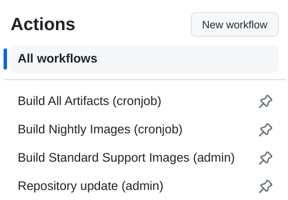

# Build actions for developers

https://github.com/armbian/os/actions

Manual Executing rights: 

- Organisation administrators
- [Armbian release manager](https://github.com/orgs/armbian/teams/release-manager)

## Build All Artifacts (cronjob)

Generates all build artifacts defined in [targets-all-not-eos.yaml](https://github.com/armbian/os/blob/main/userpatches/targets-all-not-eos.yaml). This build job runs **every 8 hours** and can also be run manually when needed.

## Build Nightly Images (cronjob)

Generates all nighly images defined in [targets-release-nightly.yaml](https://github.com/armbian/os/blob/main/userpatches/targets-release-nightly.yaml). This build job runs every day at **9 AM UTC** and can also be run manually when needed.

## Build Standard Support Images (admin)

Generates stable images defined in [targets-release-standard-support.yaml](https://github.com/armbian/os/blob/main/userpatches/targets-release-standard-support.yaml). 

This build run is executed manually:
- making a full set of stable release images
- recreating broken image at the download pages

Images generation can be customized:

- Framework build branch
  - main
  - v24.5 (previous stable release)
- Version override (leave empty for automatic bump)
  - main
  - v24.5 (previous stable release)
- Board (make images only for one board)
- Maintainer (make images for selected maintainer)

Generated images are uploaded to incoming folder: https://netcup.armbian.com/incoming/ and once they are confirmed working, please notify @igor to move them to official download pages. Once images are moved to main download section, automation refresh download pages within 15-30 minutes.

## Repository update (admin)

Action is executed when artifact generations completes or manually.

When
- [ ] Add https://netcup.armbian.com/partial/ to stable repo

is selected, it will include packages that were build during images recreation. It will add everything that is inside this folder https://netcup.armbian.com/partial/

## Smoke tests on hardware devices

Smoke testing is preliminary testing to reveal simple failures severe enough to, for example, reject a prospective software release. Our test case is constructed of three steps:

- powering test equipment, consistent from several network switches, power supplies and dozens of hardware platforms
- running upgrade, reboot, repository switch, reboot, ... tests in parallel
- uploading a test report as build artefact following by powering the devices off.

Manual Executing rights: [Armbian project member](https://github.com/orgs/armbian/people)

## Automatic Pull Requests Labeler

Automatically label new pull request based on the paths of files which are being changed. Configuration file can be found in:

        .github/labeler.yml

## Full distro test builds

Generates all supported build combinations (minimal, cli, desktops) for x86 arhitecture.

Options:

- Framework build branch
  - **main**
  - testing_branch (string)

## Automatic Kernel Build at Pull Requests

Generates kernels at Pull Requests if their code, patches or config was changed. Build starts when label of Pull Request is set to "Ready to review"

## Lint On Scripts

Run [ShellCheck](https://github.com/koalaman/shellcheck) on changed shell scripts and report problems within. Since our scripts are full of shellcheck problems we don't block merging on those errors. Not yet.

Linting is run automatically on pull requests change.

## Scorecards Security Scan

Scorecards is an automated tool that assesses a number of important heuristics ("checks") associated with software security and assigns each check a score of 0-10. You can use these scores to understand specific areas to improve in order to strengthen the security posture of your project. You can also assess the risks that dependencies introduce, and make informed decisions about accepting these risks, evaluating alternative solutions, or working with the maintainers to make improvements.

https://github.com/ossf/scorecard#what-is-scorecards

## Kernel hardening analysis

This analysis checks kernel config if changed.

There are plenty of security hardening options for the Linux kernel. A lot of them are not enabled by the major distros. We have to enable these options ourselves to make our systems more secure.

https://github.com/a13xp0p0v/kconfig-hardened-check/blob/master/README.md
