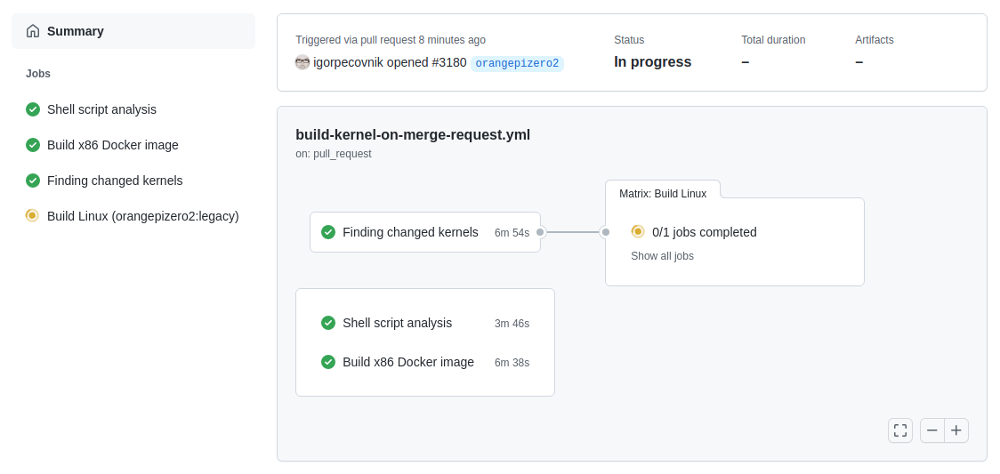
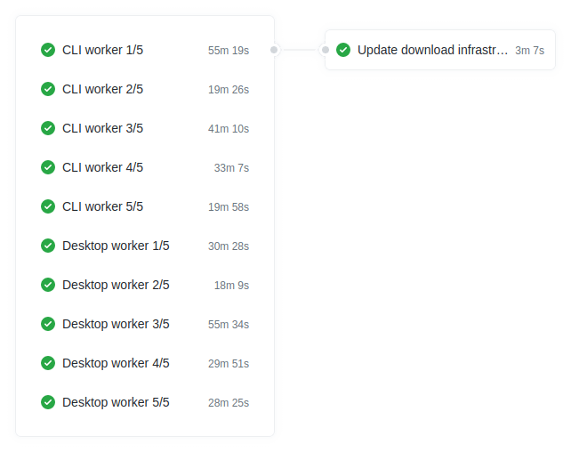

# Build pipelines

 

Armbian Build pipelines are combination of Github Actions and scripts that run on our servers.  Armbian is providing a large quantity of compiled binaries and images which builds are distributed over our self-hosted build farm.

 

## Nightly builds 

 

What is affected by this pipeline?

- edge branch in https://apt.armbian.com
- all branches in https://beta.armbian.com
- rootfs cache
 
 The repository indexes for BETA are updated immediately.

 
 
Trigger: every day at 6am CET
 
Condition: change in packages, upstream sources, patches or configuration

## Updating all beta images

 

 

- triggered manually or uppon completion of nightly / edge builds;
- running the job manual is possible,
- pipeline is always using packages from https://beta.armbian.com repository.

 

## Updating selected stable images
 
 

If you have a commit rights to the repository, go to [Armbian build system actions](https://github.com/armbian/build/actions) and select *Build selected*:

 

You can recreate image(s) from sources - set `packages from repository` to *no* - or from packages that are already in repository (default). In case you choose to build from sources, stable https://apt.armbian.com repository is going to be populated with newly created u-boot, kernel and **BSP packages for all boards** under (patched) stable version (yy.mm.**x+1**) which is incremented automatically if process succeeds.

 

When new artifacts are created for stable builds, content is uploaded to CDN, then download and repository indexes are updated.  The process is typically complete in 1 to 2 days for major releases.
