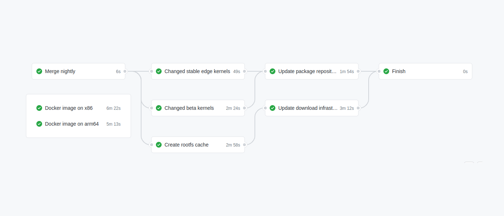
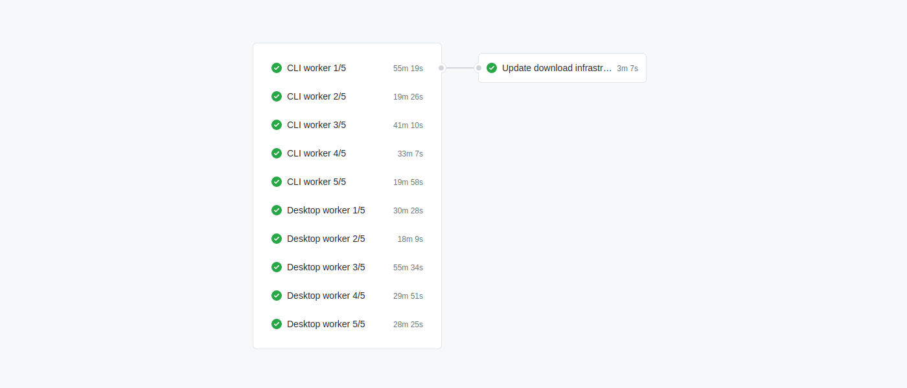
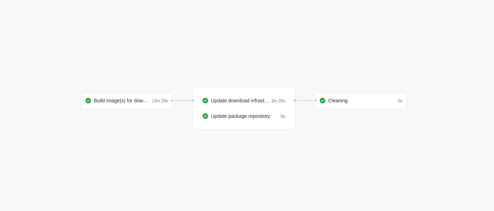

# Continuous integration

They are a combination of Github Actions scrips and scripts that run on our servers. Armbian is providing big number of turnkey binaries which builds are distributed over our build farm.

# Build pipelines

## Build 

- stable repository: EDGE kernels + board support packages are updated if there are any upstream sources, patches or config changes for EDGE kernels.
- beta repository:  all kernels + board support packages are updated if there are any upstream sources, patches or config changes
- rootfs cache: if some package in userland is changed, respective caches are recreated

Trigger: **every day at 6am CET**

In case any files are created in the process, they are uploaded to CDN, torrents recreated.

## Updating all beta images

Builds are triggered automatically after nightly / edge build is finished. It is also possible to run it manually. Builds are always done by using packages from repository.

## Updating selected stable images

You can recreate image(s) from sources or from packages that are already in repository. In case you choose to build from sources, stable repository is going to be populated with newly created u-boot, kernel and **BSP packages for all boards** under (patched) stable version (yy.mm.**x+1**) which is incremented automatically if process succeeds.

Build are triggered manually.
