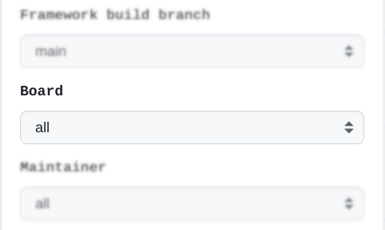
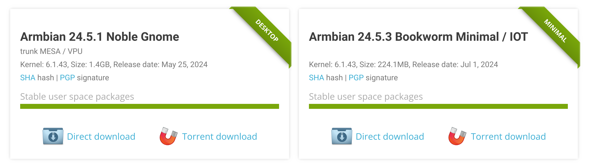

# Build actions for developers and maintainers

Manual Executing rights are tied to [release manager](https://github.com/orgs/armbian/teams/release-manager) role within Armbian organiation. Do you [want to help and take this role](https://calendly.com/armbian/office-hours)?

## Prepare Standard Support Images for release (release manager)

This build workflow is executed manually when making:

- a set of images for specific device
- a set of images for specific maintainer
- a full set of stable release images (default)

**Note**: you can only generate images that are defined in [targets-release-standard-support.yaml](https://github.com/armbian/os/blob/main/userpatches/targets-release-standard-support.yaml) build lists!

### 1. Open [workflow](https://github.com/armbian/os/actions/workflows/complete-artifact-matrix-standard-support.yml) and click

### 2. Select board

### 3. Run workflow

**(Workflow takes around 15 minutes to complete)**

Generated images are uploaded to incoming folder: https://rsync.armbian.com/incoming/ under **your GitHub username** and once they are confirmed working, please notify @igorpecovnik to move them to official download pages. Once images are moved to [main download section](https://www.armbian.com/download/), automation refreshes download pages index within 15-30 minutes.

### Aditional options

Generates stable images defined in [targets-release-standard-support.yaml](https://github.com/armbian/os/blob/main/userpatches/targets-release-standard-support.yaml). This file is [autogenerated](https://github.com/armbian/os/blob/main/.github/workflows/recreate-matrix.yml#L147-L438) from [targets-release-standard-support.template](https://github.com/armbian/os/blob/main/userpatches/targets-release-standard-support.template).

Recommended images are defined via [RegEx mapping file](https://github.com/armbian/os/blob/main/exposed.map).

We are generating several images for each download / hardware target. They are automatically sorted by sections:

- Desktop releases
- Server and IOT releases
- Dedicated applications

Images generation can be customized:

- Framework build branch
  - main (make images from trunk)
  - v24.5 (previous stable release)
- Version override (leave empty for automatic bump)
- Board (make images only for one board)
- Maintainer (make images for selected maintainer)

## Prepare Application Images for release  (release manager)

This build workflow is executed manually when making:

- a set of application images for specific device
- a set of application images for specific maintainer
- a full set of application images (default)

**Note:** you can only generate images for applications that are defined in [targets-release-apps.yaml](https://github.com/armbian/os/blob/main/userpatches/targets-release-apps.yaml) build lists!

### 1. Open [workflow](https://github.com/armbian/os/actions/workflows/complete-artifact-matrix-apps.yml) and click

### 2. Select board

### 3. Run workflow

**(Workflow takes around 15 minutes to complete)**

Generated images are hosted at GitHub and released at once. Automation refreshes download pages within 15-30 minutes after/if workflow finished succesfully.

### Aditional options

Generates dedicated application images defined in [targets-release-apps.yaml](https://github.com/armbian/os/blob/main/userpatches/targets-release-apps.yaml). This file is [autogenerated](https://github.com/armbian/os/blob/main/.github/workflows/recreate-matrix.yml#L147-L438) from [targets-release-apps.template](https://github.com/armbian/os/blob/main/userpatches/targets-release-apps.template). (You always edit template)

Images generation can be customized:

- Framework build branch
  - main (make images from trunk)
  - v24.5 (previous stable release)
- Version override (use latest release number or leave empty for automatic bump)
- Board (make images only for one board)
- Maintainer (make images for selected maintainer)

## Repository update (cronjob/release manager)

This pulls packages from build framework OCI cache located at GitHub and from [various 3rd party repositories](https://github.com/armbian/os/wiki/Import-3rd-party-packages) such as Chrome, Chromium, Code, Discord, (latest) ZFS, Thunderbird, Zoom, ... and pushes them to:

- `apt.armbian.com` (only new packages are added)
- `beta.armbian.com` (whole repository is recreated from scratch)

### 1. Open [workflow](https://github.com/armbian/os/actions/workflows/repository-update.yml) and click

Action is executed automatically when artifact generations completes. Or manually.

### 2. Include [artifacts from generated image(s)](https://netcup.armbian.com/partial/)

When
- [ ] Add https://netcup.armbian.com/partial/ to stable repo
      
is selected.

### 3. Run workflow

**(Workflow takes around 60 minutes to complete)**

## Build All Artifacts (cronjob)

Generates all build artifacts cache for targets defined in [targets-all-not-eos.yaml](https://github.com/armbian/os/blob/main/userpatches/targets-all-not-eos.yaml). This build job runs **every 8 hours** and can also be run manually when needed. 

This build job **needs to be successfully completed** in order to proceed generating any OS images!

## Build Rolling Release Images (cronjob)

Generates all nighly (Rolling Release) images defined in [targets-release-nightly.yaml](https://github.com/armbian/os/blob/main/userpatches/targets-release-nightly.yaml).  This file is [autogenerated](https://github.com/armbian/os/blob/main/.github/workflows/recreate-matrix.yml#L147-L438) from [targets-release-nightly.template](https://github.com/armbian/os/blob/main/userpatches/targets-release-nightly.template)

This build job runs every day at 9 a.m. UTC and can also be run manually when needed. Download pages are refreshed [automatically](https://github.com/armbian/os/actions/workflows/webindex-update.yml) after succesful build.

## Watchdog (cronjob)

Runs every 15 minutes and re-trigger [failed builds](https://github.com/armbian/os/blob/main/.github/workflows/watchdog.yml#L26) six (6) times before finally gives out. This addresses various instabilities when building many artifacts on different hardware: 

- network timeouts
- artifact download failure
- loop devices allocation failure
- runner running low on space

## Smoke tests on hardware devices (release manager)

Smoke testing is preliminary testing to reveal simple failures severe enough to, for example, reject a prospective software release. Our test case is constructed of three steps:

- powering test equipment, consistent from several network switches, power supplies and dozens of hardware platforms
- running upgrade, reboot, repository switch, reboot, ... tests in parallel
- uploading a test report as build artefact following by powering the devices off.

## Automatic Pull Requests Labeler (PR)

Automatically label new pull request based on the paths of files which are being changed. Configuration file can be found in:

        .github/labeler.yml

## Full distro test builds (cronjob/release manager)

Generates all supported build combinations (minimal, cli, desktops) for x86 arhitecture to check package level changes inconsistency and dependencies.

Options:

- Framework build branch
  - **main**
  - testing_branch (string)

## Build All Artifacts (admin/PR)

Generates artifacts at Pull Requests code. Build starts when label of Pull Request is set to "Build". Requires administration privileges.

## Lint On Shell Scripts (PR)

Run [ShellCheck](https://github.com/koalaman/shellcheck) on changed shell scripts and report problems within. Linting runs automatically on pull requests.

## Update Tools in Build Scripts (cronjob/admin)

Some of our scripts download tools from a repo. These can't be bumped by dependabot, so this workflow is a self-created dependabot to bump versions of those tools to stay up-to-date. This workflow only creates a PR if the version was actually updated. To add a new tool, it just needs to be added to the matrix [in the script](https://github.com/armbian/build/blob/main/.github/workflows/update-tools.yml) by filling out all the variables.

## Scorecards Security Scan (PR)

[Scorecards](https://github.com/ossf/scorecard#what-is-scorecards) is an automated tool that assesses a number of important heuristics ("checks") associated with software security and assigns each check a score of 0-10. You can use these scores to understand specific areas to improve in order to strengthen the security posture of your project. You can also assess the risks that dependencies introduce, and make informed decisions about accepting these risks, evaluating alternative solutions, or working with the maintainers to make improvements.

## Kernel Hardening Analysis (PR)

This [analysis](https://github.com/a13xp0p0v/kconfig-hardened-check/blob/master/README.md) checks kernel configs and run if changed. There are plenty of security hardening options for the Linux kernel. A lot of them are not enabled by the major distros. We have to enable these options ourselves to make our systems more secure.
