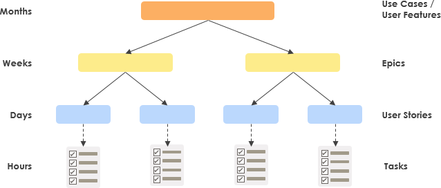
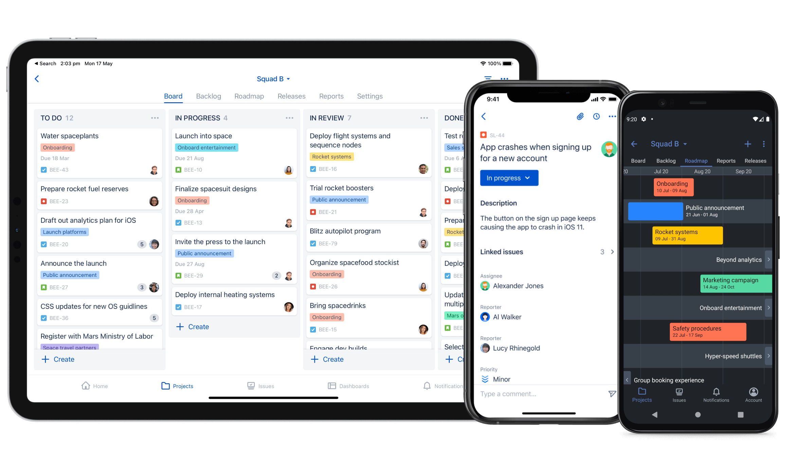

# Jira

Jira where development work is entered and prioritized. https://armbian.atlassian.net/

## Issue Types

When creating issues, try to assign issue type most appropriate.   Issue type _can_ be changed later so don't worry too much.  If possible assign to a "Fix Version" aka Release.

* **Epic** - useful as placeholders for large requirements. Common objective, overall goals, contains several stories.
* **Story** - Smallest units of functionality that can be achieved in one or two weeks. Non-technical language.
* **Task** - Work that is clearly defined usually by people that will do the work. Specific, technical language.

## Special Issue Type

* **Bug** - malfunction of the system, an error, flaw, or a default in the system, that causes an incorrect result.

## Work Queue

The easiest way to follow the work queue [Upcoming Release Kanban Board](https://armbian.atlassian.net/secure/RapidBoard.jspa?rapidView=2&projectKey=AR&atlOrigin=eyJpIjoiM2JlNTliN2ZkNTJiNDYzNGI4YzEzOGE4YjhmOWU3MDQiLCJwIjoiaiJ9).  This board lists only work select for the upcoming release.

Use the filter buttons at top to quickly see unassigned work, work assigned to you, bugs, and work recently updated.

Work is listed in 3 columns, and sorted by priority.

Columns:
* **Todo**
    * Work prioritized to be done next
    * Pick up any task from this column
* **In Progress**
    * Work In Progress
* **Done**
    * Shows **recently** completed work.  Has time limit to keep board clean

## Managing Work

All issues for an upcoming release are assigned a "Fix Version" to indicate release number.

### Backlog

With the Kanban Board, there are 2 states for the Upcoming Release backlog.

* **Todo** - These tasks are visible the **Todo** column of the Kanban board. To keep things simple, there shouldnt be more than 5-10 issues in Todo
* **Backlog** -- Other tasks seleceted for release, but not are not visible on the Kanban board.  The purpose of this is to keep the **Todo** column clean and easy to work from.  As the **Todo** column clears, prioritize next tasks in backlog by moving them to todo.

All issues for an upcoming release are assigned a "Fix Version" to indicate release number.

## Mobile access

You can download the app for [Android](https://play.google.com/store/apps/details?id=com.atlassian.jira.server) or [iOS](https://apps.apple.com/us/app/id1405353949).

