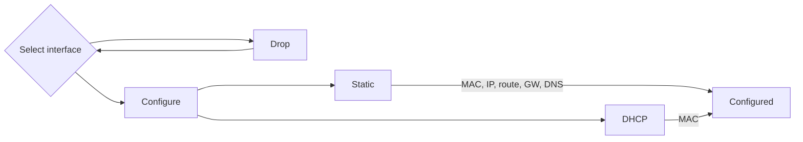
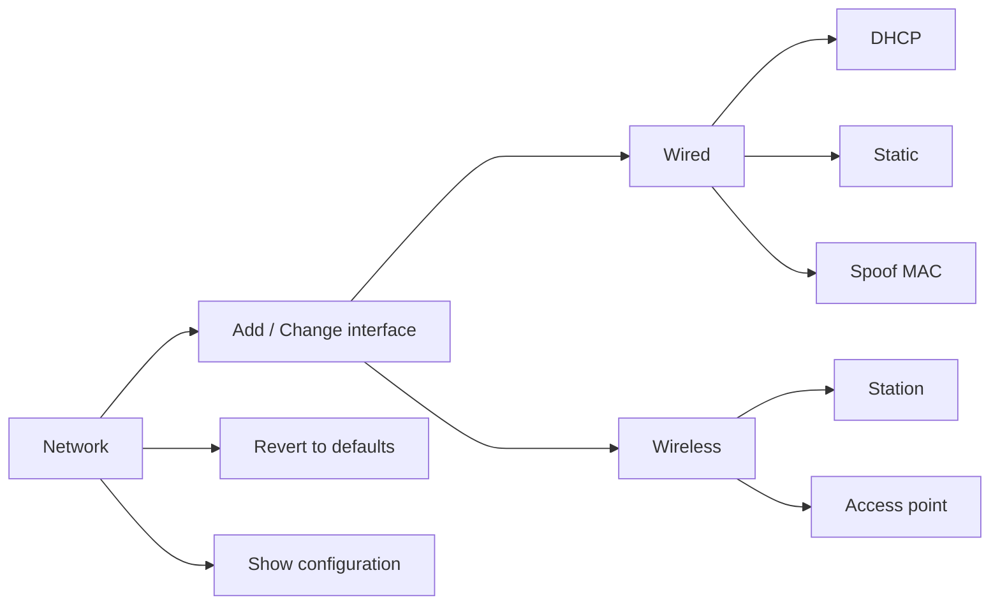

# Fixed and wireless network settings

## Basic setup


Basic network setup


<!--- section image START from tools/include/images/BNS001.png --->
[](#)
<!--- section image STOP from tools/include/images/BNS001.png --->


<!--- header START from tools/include/markdown/BNS001-header.md --->


<!--- header STOP from tools/include/markdown/BNS001-header.md --->

__Status:__ Stable  
__Architecture:__ <span style="background-color:#e0e0e0; color:#333333; padding:3px 6px; border-radius:4px; font-size:90%;">x86-64</span> <span style="background-color:#e0e0e0; color:#333333; padding:3px 6px; border-radius:4px; font-size:90%;">aarch64</span> <span style="background-color:#fff3bf; color:#7c4d00; padding:3px 6px; border-radius:4px; font-size:90%;">armhf</span> <span style="background-color:#f3d9fa; color:#6a1b9a; padding:3px 6px; border-radius:4px; font-size:90%;">riscv64</span>  
__Maintainer:__ @armbian  
__Documentation:__ [Link](https://forum.armbian.com/)  

~~~ custombash
armbian-config --cmd BNS001
~~~


<!--- footer START from tools/include/markdown/BNS001-footer.md --->
**Select Interface:**  
Choose the desired network interface, such as:

- `eth0` for wired Ethernet
- `wlan0` for wireless connections

If selecting a **wireless interface**:

- A list of available Access Points (APs) will be displayed.
- Select your preferred AP and enter the password when prompted.
- Leave the password field empty for open networks.

**IP Address Configuration:**  
Choose between:

- **DHCP (Dynamic Host Configuration Protocol):**  
  Automatically assigns an IP address.

- **Static IP:**  
  Manually enter the following details:
  - **MAC Address (optional):** Specify if you want to spoof the MAC address.
  - **IP Address:** Use CIDR notation (e.g., `192.168.1.10/24`).
  - **Route:** Default is `0.0.0.0/0`.
  - **Gateway:** Typically the router’s IP (e.g., `192.168.1.1`).
  - **DNS:** Default is `9.9.9.9`, but you can specify another.

**Finalize Configuration:**  

- Review and confirm your settings.
- The system will apply the configurations.
- Your network connection should then be fully established.

<!--- footer STOP from tools/include/markdown/BNS001-footer.md --->


~~~ bash title="Remove Fallback DHCP Configuration:"
armbian-config --cmd BNS002
~~~


## View configuration


View Network Configuration


<!--- section image START from tools/include/images/VNS001.png --->
[](#)
<!--- section image STOP from tools/include/images/VNS001.png --->


<!--- header START from tools/include/markdown/VNS001-header.md --->
View Network Configuration allows you to display the system’s active network settings as a Netplan YAML configuration. This shows interfaces, IP addresses, gateways, DNS servers, and other networking details in a clean, human-readable format. Useful for verifying, troubleshooting, or manually editing network setup on systems that use Netplan for managing network interfaces.

<!--- header STOP from tools/include/markdown/VNS001-header.md --->

__Status:__ Stable  
__Architecture:__ <span style="background-color:#e0e0e0; color:#333333; padding:3px 6px; border-radius:4px; font-size:90%;">x86-64</span> <span style="background-color:#e0e0e0; color:#333333; padding:3px 6px; border-radius:4px; font-size:90%;">aarch64</span> <span style="background-color:#fff3bf; color:#7c4d00; padding:3px 6px; border-radius:4px; font-size:90%;">armhf</span> <span style="background-color:#f3d9fa; color:#6a1b9a; padding:3px 6px; border-radius:4px; font-size:90%;">riscv64</span>  
__Maintainer:__ @armbian  
__Documentation:__ [Link](https://forum.armbian.com/)  

~~~ custombash
armbian-config --cmd VNS001
~~~


## Advanced


Advanced bridged network configuration

__Architecture:__ <span style="background-color:#e0e0e0; color:#333333; padding:3px 6px; border-radius:4px; font-size:90%;">x86-64</span> <span style="background-color:#e0e0e0; color:#333333; padding:3px 6px; border-radius:4px; font-size:90%;">aarch64</span> <span style="background-color:#fff3bf; color:#7c4d00; padding:3px 6px; border-radius:4px; font-size:90%;">armhf</span> <span style="background-color:#f3d9fa; color:#6a1b9a; padding:3px 6px; border-radius:4px; font-size:90%;">riscv64</span>  
__Maintainer:__ @armbian  
__Documentation:__ [Link](https://forum.armbian.com/)  
#### Add or Change


Add / change interface


<!--- header START from tools/include/markdown/NEA002-header.md --->


<!--- header STOP from tools/include/markdown/NEA002-header.md --->

__Status:__ Stable  
__Architecture:__ <span style="background-color:#e0e0e0; color:#333333; padding:3px 6px; border-radius:4px; font-size:90%;">x86-64</span> <span style="background-color:#e0e0e0; color:#333333; padding:3px 6px; border-radius:4px; font-size:90%;">aarch64</span> <span style="background-color:#fff3bf; color:#7c4d00; padding:3px 6px; border-radius:4px; font-size:90%;">armhf</span> <span style="background-color:#f3d9fa; color:#6a1b9a; padding:3px 6px; border-radius:4px; font-size:90%;">riscv64</span>  
__Maintainer:__ @armbian  
__Documentation:__ [Link](https://forum.armbian.com/)  

~~~ custombash
armbian-config --cmd NEA002
~~~


<!--- footer START from tools/include/markdown/NEA002-footer.md --->
=== "Wired device check"

    In order to configure your network devices, they need to be supported the kernel.

    To verify, use command:

    ```sh
    ip addr
    ```

    It is usually something like eth0, enp4s3 or lan.

=== "Wireless device check"

    In order to configure your wireless network devices, they need to be supported the kernel.

    To verify, use command:

    ```sh
    iw dev | awk '$1=="Interface"{print $2}'
    ```

    It is usually something like `wlan0`, `wlo1` or `wlx12334c47dec3`. If you get blank response, it means your WiFi device / dongle is not supported by the kernel.

<!--- footer STOP from tools/include/markdown/NEA002-footer.md --->


~~~ bash title="Revert to Armbian defaults:"
armbian-config --cmd NEA003
~~~


~~~ bash title="Show configuration:"
armbian-config --cmd NEA004
~~~


~~~ bash title="Show active status:"
armbian-config --cmd NEA005
~~~


