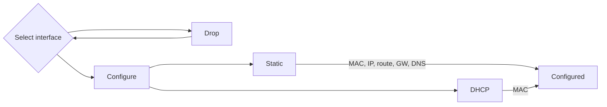
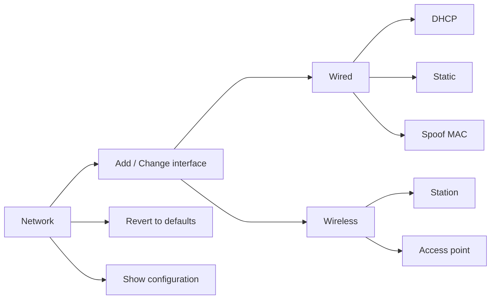

# Fixed and wireless network settings

## Basic Network Setup

**Author:** @igorpecovnik

**Status:** Stable


<!--- section image START from tools/include/images/NET001.png --->
[](#)
<!--- section image STOP from tools/include/images/NET001.png --->


<!--- header START from tools/include/markdown/NET001-header.md --->


<!--- header STOP from tools/include/markdown/NET001-header.md --->


~~~ custombash title="Basic Network Setup:"
armbian-config --cmd NET001
~~~


<!--- footer START from tools/include/markdown/NET001-footer.md --->
1. **Select Interface:**
   - Launch the `armbian-config` utility:
     ```bash
     sudo armbian-config
     ```
   - Navigate to `Network` and choose the desired network interface (e.g., `eth0` for wired or `wlan0` for wireless).

2. **Wireless Interface Configuration:**
   - If configuring a wireless interface:
     - A list of available Access Points (APs) will be displayed.
     - Select your preferred AP and enter the password when prompted. Leave the password field empty for open networks.

3. **IP Address Configuration:**
   - Choose between:
     - **DHCP (Dynamic Host Configuration Protocol):** Automatically assigns an IP address.
     - **Static IP:** Manually enter details:
       - **MAC Address (optional):** Specify if you want spoofing MAC address.
       - **IP Address:** Use CIDR notation (e.g., `192.168.1.10/24`).
       - **Route:** Default is `0.0.0.0/0`.
       - **Gateway:** Typically the router's IP, e.g., `192.168.1.1`.
       - **DNS:** Default is `9.9.9.9`, but can be changed.

4. **Finalize Configuration:**
   - Review and confirm your settings.
   - The system applies the configurations, and your network should be set up.
<!--- footer STOP from tools/include/markdown/NET001-footer.md --->


~~~ custombash title="Remove Fallback DHCP Configuration:"
armbian-config --cmd NET002
~~~


~~~ custombash title="Remove Fallback DHCP Configuration:"
armbian-config --cmd NET002
~~~

## View Network Settings

**Author:** @igorpecovnik

**Status:** Stable


<!--- section image START from tools/include/images/VNS001.png --->
[](#)
<!--- section image STOP from tools/include/images/VNS001.png --->


~~~ custombash title="View Network Settings:"
armbian-config --cmd VNS001
~~~

## Advanced bridged network configuration

## Add / change interface

**Author:** @igorpecovnik

**Status:** Stable


<!--- header START from tools/include/markdown/NEA001-header.md --->


<!--- header STOP from tools/include/markdown/NEA001-header.md --->


~~~ custombash title="Add / change interface:"
armbian-config --cmd NEA001
~~~


<!--- footer START from tools/include/markdown/NEA001-footer.md --->
=== "Wired device check"

    In order to configure your network devices, they need to be supported the kernel.

    To verify, use command:

    ```sh
    ip addr
    ```

    It is usually something like eth0, enp4s3 or lan.

=== "Wireless device check"

    In order to configure your wireless network devices, they need to be supported the kernel.

    To verify, use command:

    ```sh
    iw dev | awk '$1=="Interface"{print $2}'
    ```

    It is usually something like `wlan0`, `wlo1` or `wlx12334c47dec3`. If you get blank response, it means your WiFi device / dongle is not supported by the kernel.

<!--- footer STOP from tools/include/markdown/NEA001-footer.md --->


~~~ custombash title="Revert to Armbian defaults:"
armbian-config --cmd NEA002
~~~


~~~ custombash title="Show configuration:"
armbian-config --cmd NEA003
~~~


~~~ custombash title="Show active status:"
armbian-config --cmd NEA004
~~~

## WireGuard VPN client / server

**Author:** @armbian

**Status:** Enabled


<!--- section image START from tools/include/images/WG001.png --->
[](#)
<!--- section image STOP from tools/include/images/WG001.png --->


<!--- header START from tools/include/markdown/WG001-header.md --->
WireGuard is an extremely simple yet fast and modern VPN that utilizes state-of-the-art cryptography. It aims to be faster, simpler, leaner, and more useful than IPsec, while avoiding the massive headache. It intends to be considerably more performant than OpenVPN. WireGuard is designed as a general purpose VPN for running on embedded interfaces and super computers alike, fit for many different circumstances. Initially released for the Linux kernel, it is now cross-platform (Windows, macOS, BSD, iOS, Android) and widely deployable. Regarded as the most secure, easiest to use, and simplest VPN solution in the industry.
<!--- header STOP from tools/include/markdown/WG001-header.md --->


~~~ custombash title="WireGuard VPN client / server:"
armbian-config --cmd WG001
~~~


<!--- footer START from tools/include/markdown/WG001-footer.md --->
=== "Access to the server from internet"

    Remember to open/forward the port 51820 (UDP) through NAT on your router.
    
=== "Directories"

    - Install directory: `/armbian/wireguard`
    - Site configuration directory: `/armbian/wireguard/config`

=== "View logs"

    ```sh
    docker logs -f wireguard
    ```

# Install server and enable private network on a client

1. Install Wireguard server
2. It will asks you for peer keywords. It will make a profile for each peer
3. Download client to your PC, server or mobile phone. Scan OR code or copy credentials to the client.

Enjoy private network! Its that easy.

More informations:

<https://docs.linuxserver.io/images/docker-wireguard/>
<!--- footer STOP from tools/include/markdown/WG001-footer.md --->


~~~ custombash title="WireGuard remove:"
armbian-config --cmd WG002
~~~


~~~ custombash title="WireGuard clients QR codes:"
armbian-config --cmd WG003
~~~


~~~ custombash title="WireGuard purge with data folder:"
armbian-config --cmd WG004
~~~
