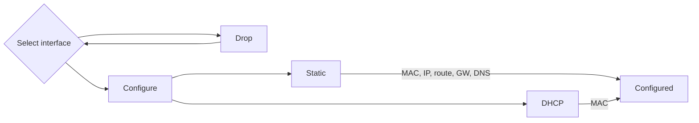
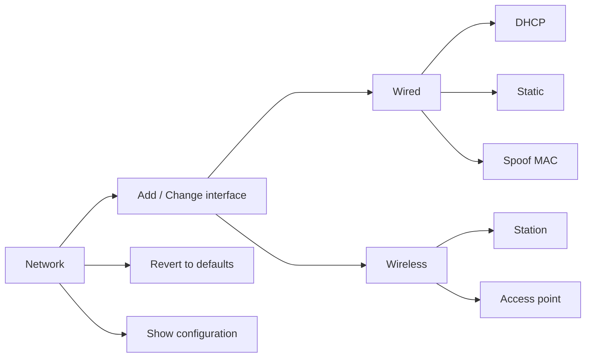

# Fixed and wireless network settings


***

## Basic Network Setup

<!--- header START from tools/include/markdown/BNS001-header.md --->


<!--- header STOP from tools/include/markdown/BNS001-header.md --->

**Command:** 
~~~
armbian-config --cmd BNS001
~~~

**Author:** @igorpecovnik

**Status:** Stable


<!--- footer START from tools/include/markdown/BNS001-footer.md --->
Network configuration is simple and easy to follow:

1. Choose the interface. If it's a wireless interface, you'll be prompted to select an access point (AP) and enter its password. Leave empty for open network.

2. Choose between DHCP (Dynamic Host Configuration Protocol) or static IP configuration. 

- If you select DHCP, the setup is complete. Optionally, you can change the MAC address.

3. If you choose a static configuration, you'll need to provide:

- An optional MAC address change
- A fixed IP address (e.g., x.x.x.x/y)
- A route (default: 0.0.0.0/0)
- A gateway (usually x.x.x.1/24)
- DNS (default: 9.9.9.9)

<!--- footer STOP from tools/include/markdown/BNS001-footer.md --->


***

## Remove Fallback DHCP Configuration
Drop preinstalled automatic DHCP on all wired interfaces after your configuration is setup.

**Command:** 
~~~
armbian-config --cmd BNS002
~~~

**Author:** @igorpecovnik

**Status:** Stable


***

## View Network Settings
**Command:** 
~~~
armbian-config --cmd VNS001
~~~

**Author:** @igorpecovnik

**Status:** Stable


***

## Advanced bridged network configuration


***

### Add / change interface

<!--- header START from tools/include/markdown/NE002-header.md --->


<!--- header STOP from tools/include/markdown/NE002-header.md --->

**Command:** 
~~~
armbian-config --cmd NE002
~~~

**Author:** @igorpecovnik

**Status:** Stable


<!--- footer START from tools/include/markdown/NE002-footer.md --->
=== "Wired device check"

    In order to configure your network devices, they need to be supported the kernel.

    To verify, use command:

    ```sh
    ip addr
    ```

    It is usually something like eth0, enp4s3 or lan.

=== "Wireless device check"

    In order to configure your wireless network devices, they need to be supported the kernel.

    To verify, use command:

    ```sh
    iw dev | awk '$1=="Interface"{print $2}'
    ```

    It is usually something like `wlan0`, `wlo1` or `wlx12334c47dec3`. If you get blank response, it means your WiFi device / dongle is not supported by the kernel.

<!--- footer STOP from tools/include/markdown/NE002-footer.md --->


***

### Revert to Armbian defaults
**Command:** 
~~~
armbian-config --cmd NE003
~~~

**Author:** @igorpecovnik

**Status:** Stable


***

### Show configuration
**Command:** 
~~~
armbian-config --cmd NE004
~~~

**Author:** @igorpecovnik

**Status:** Stable


***

### Show active status
**Command:** 
~~~
armbian-config --cmd NE005
~~~

**Author:** @igorpecovnik

**Status:** Stable


***

## WireGuard VPN client / server

<!--- section image START from tools/include/images/WG001.png --->
[](#)
<!--- section image STOP from tools/include/images/WG001.png --->


<!--- header START from tools/include/markdown/WG001-header.md --->
WireGuard is an extremely simple yet fast and modern VPN that utilizes state-of-the-art cryptography. It aims to be faster, simpler, leaner, and more useful than IPsec, while avoiding the massive headache. It intends to be considerably more performant than OpenVPN. WireGuard is designed as a general purpose VPN for running on embedded interfaces and super computers alike, fit for many different circumstances. Initially released for the Linux kernel, it is now cross-platform (Windows, macOS, BSD, iOS, Android) and widely deployable. Regarded as the most secure, easiest to use, and simplest VPN solution in the industry.
<!--- header STOP from tools/include/markdown/WG001-header.md --->

**Command:** 
~~~
armbian-config --cmd WG001
~~~

**Author:** @armbian

**Status:** Enabled


<!--- footer START from tools/include/markdown/WG001-footer.md --->
=== "Access to the server from internet"

    Remember to open/forward the port 51820 (UDP) through NAT on your router.
    
=== "Directories"

    - Install directory: `/armbian/wireguard`
    - Site configuration directory: `/armbian/wireguard/config`

=== "View logs"

    ```sh
    docker logs -f wireguard
    ```

# Install server and enable private network on a client

1. Install Wireguard server
2. It will asks you for peer keywords. It will make a profile for each peer
3. Download client to your PC, server or mobile phone. Scan OR code or copy credentials to the client.

Enjoy private network! Its that easy.

More informations:

<https://docs.linuxserver.io/images/docker-wireguard/>
<!--- footer STOP from tools/include/markdown/WG001-footer.md --->


***

## WireGuard remove
This operation will remove WireGuard

**Command:** 
~~~
armbian-config --cmd WG002
~~~

**Author:** @armbian

**Status:** Enabled


***

## WireGuard clients QR codes
**Command:** 
~~~
armbian-config --cmd WG003
~~~

**Author:** @armbian

**Status:** Enabled


***

## WireGuard purge with data folder
This operation will purge WireGuard with data folder

**Command:** 
~~~
armbian-config --cmd WG004
~~~

**Author:** @armbian

**Status:** Enabled


***

