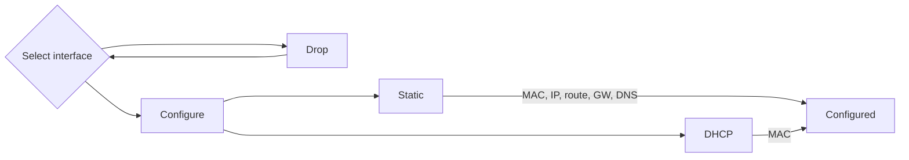

# Console network tools for measuring load and bandwidth

## nload -realtime console network usage monitor

**Author:** @armbian

**Status:** Stable


<!--- section image START from tools/include/images/NET001.png --->
[](#)
<!--- section image STOP from tools/include/images/NET001.png --->


<!--- header START from tools/include/markdown/NET001-header.md --->


<!--- header STOP from tools/include/markdown/NET001-header.md --->


~~~ custombash title="nload -realtime console network usage monitor:"
armbian-config --cmd NET001
~~~


<!--- footer START from tools/include/markdown/NET001-footer.md --->
1. **Select Interface:**
   - Launch the `armbian-config` utility:
     ```bash
     sudo armbian-config
     ```
   - Navigate to `Network` and choose the desired network interface (e.g., `eth0` for wired or `wlan0` for wireless).

2. **Wireless Interface Configuration:**
   - If configuring a wireless interface:
     - A list of available Access Points (APs) will be displayed.
     - Select your preferred AP and enter the password when prompted. Leave the password field empty for open networks.

3. **IP Address Configuration:**
   - Choose between:
     - **DHCP (Dynamic Host Configuration Protocol):** Automatically assigns an IP address.
     - **Static IP:** Manually enter details:
       - **MAC Address (optional):** Specify if you want spoofing MAC address.
       - **IP Address:** Use CIDR notation (e.g., `192.168.1.10/24`).
       - **Route:** Default is `0.0.0.0/0`.
       - **Gateway:** Typically the router's IP, e.g., `192.168.1.1`.
       - **DNS:** Default is `9.9.9.9`, but can be changed.

4. **Finalize Configuration:**
   - Review and confirm your settings.
   - The system applies the configurations, and your network should be set up.
<!--- footer STOP from tools/include/markdown/NET001-footer.md --->


~~~ custombash title="nload - remove:"
armbian-config --cmd NET002
~~~


~~~ custombash title="iperf3 bandwidth measuring tool:"
armbian-config --cmd NET003
~~~


~~~ custombash title="iperf3 remove:"
armbian-config --cmd NET004
~~~


~~~ custombash title="iptraf-ng IP LAN monitor:"
armbian-config --cmd NET005
~~~


~~~ custombash title="iptraf-ng remove:"
armbian-config --cmd NET006
~~~


~~~ custombash title="avahi-daemon hostname broadcast via mDNS:"
armbian-config --cmd NET007
~~~


~~~ custombash title="avahi-daemon hostname broadcast via mDNS:"
armbian-config --cmd NET007
~~~


~~~ custombash title="avahi-daemon hostname broadcast via mDNS:"
armbian-config --cmd NET007
~~~


~~~ custombash title="avahi-daemon hostname broadcast via mDNS:"
armbian-config --cmd NET007
~~~


~~~ custombash title="avahi-daemon remove:"
armbian-config --cmd NET008
~~~


~~~ custombash title="avahi-daemon remove:"
armbian-config --cmd NET008
~~~
