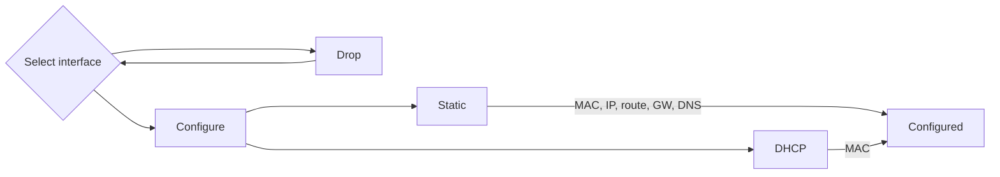

# Run/Install 3rd party applications

## Web server, LEMP, reverse proxy, Let's Encrypt SSL

**Status:** Stable

## SWAG reverse proxy

**Author:** @armbian

**Status:** Stable

<!--- section image START from tools/include/images/SWAG01.png --->

<!--- section image STOP from tools/include/images/SWAG01.png --->

<!--- header START from tools/include/markdown/SWAG01-header.md --->
SWAG - Secure Web Application Gateway sets up an Nginx webserver and reverse proxy with php support and a built-in certbot client that automates free SSL server certificate generation and renewal processes (Let's Encrypt). It also contains fail2ban for intrusion prevention.

After entering required information, your server will have auto updating SSL secured website! To this website you can attach several services, for example: https://my.server.com/netdata will run [Netdata](https://www.netdata.cloud/) instance.

=== "Requirements"

    - this computer port 80 and 443 must be open to the internet
    - your domain name (myserver.mydomain.com) DNS server should point to your router WAN address
    - make sure to set additional .htpasswd username and password as you don't want to expose your services without password

=== "Directories"

    - Config directory: `/armbian/swag/config/`
    - Website root folder: `/armbian/swag/config/www/`
    - Reverse proxy configuration samples: `/armbian/swag/config/nginx/proxy-confs/`

=== "Advanced setup"

    - Please follow this comprehensive guide: <https://github.com/linuxserver/docker-swag>

<!--- header STOP from tools/include/markdown/SWAG01-header.md --->

~~~ bash title="SWAG reverse proxy:"
armbian-config --cmd SWAG01
~~~

~~~ bash title="SWAG reverse proxy .htpasswd set:"
armbian-config --cmd SWAG02
~~~

~~~ bash title="SWAG remove:"
armbian-config --cmd SWAG03
~~~

~~~ bash title="SWAG purge with data folder:"
armbian-config --cmd SWAG04
~~~

## Home Automation for control home appliances

## openHAB empowering the smart home

**Author:** @armbian

**Status:** Stable

<!--- section image START from tools/include/images/HAB001.png --->

<!--- section image STOP from tools/include/images/HAB001.png --->

~~~ bash title="openHAB empowering the smart home:"
armbian-config --cmd HAB001
~~~

~~~ bash title="openHAB remove:"
armbian-config --cmd HAB002
~~~

~~~ bash title="openHAB purge with data folder:"
armbian-config --cmd HAB003
~~~

## Home Assistant open source home automation

**Author:** @igorpecovnik

**Status:** Preview

<!--- section image START from tools/include/images/HAS001.png --->

<!--- section image STOP from tools/include/images/HAS001.png --->

<!--- header START from tools/include/markdown/HAS001-header.md --->
Home Assistant is an open source smart home platform that allows you to connect your smart home devices like your TV, fan, cameras, thermostats, lights, and sensors. As a user, you can build intricate automation using Home Assistant's user-friendly, unified web-based user interface.

Perfect to run on any single board computer with 4 cores and at least 512Mb of memory. Armbian installation is optimised to run from SD/eMMC media, but it is recommended to use SSD.

=== "Access to the web interface"

    The web interface is accessible via port **8123**:

    - URL: `https://<your.IP>:8123`
    - Username/Password: Are set at first web interface login

=== "Directories"

    Home Assistant on Armbian runs supervised in a Docker container. This secures same functionality as stock HAOS.

    - Config directory: `/armbian/haos`

<!--- header STOP from tools/include/markdown/HAS001-header.md --->

~~~ bash title="Home Assistant open source home automation:"
armbian-config --cmd HAS001
~~~

~~~ bash title="Home Assistant remove:"
armbian-config --cmd HAS002
~~~

~~~ bash title="Home Assistant purge with data folder:"
armbian-config --cmd HAS003
~~~

## Domoticz open source home automation

**Author:** @igorpecovnik

**Status:** Preview

<!--- section image START from tools/include/images/DOM001.png --->

<!--- section image STOP from tools/include/images/DOM001.png --->

<!--- header START from tools/include/markdown/DOM001-header.md --->
Domoticz is an open-source home automation platform that allows you to control and monitor smart devices in your home. It supports a wide range of devices, including lights, sensors, thermostats, and cameras. Through its web interface or mobile app, you can set up automation rules and schedules, providing greater convenience and energy efficiency. It’s customizable, flexible, and can be run on a variety of hardware platforms supported by Armbian.

=== "Access to the web interface"

    The web interface is accessible via port **8080**:

    - URL: `https://<your.IP>:8080`
    - Username/Password: admin / domoticz

=== "Directories"

    - Config directory: `/armbian/domoticz`

=== "Advanced setup"

    - Primary USB device passing through (`/dev/ttyUSB0`) to Docker container is enabled by default
    - For more complex setup, please follow this comprehensive guide: <https://wiki.domoticz.com/Main_Page>

<!--- header STOP from tools/include/markdown/DOM001-header.md --->

~~~ bash title="Domoticz open source home automation:"
armbian-config --cmd DOM001
~~~

~~~ bash title="Domoticz remove:"
armbian-config --cmd DOM002
~~~

~~~ bash title="Domoticz purge with data folder:"
armbian-config --cmd DOM003
~~~

## EVCC - solar charging automation

**Author:** @igorpecovnik

**Status:** Preview

<!--- section image START from tools/include/images/EVCC01.png --->

<!--- section image STOP from tools/include/images/EVCC01.png --->

<!--- header START from tools/include/markdown/EVCC01-header.md --->
evcc is an energy management system with a focus on electromobility. The software controls your EV charger or smart plug. It communicates with your vehicle, inverter or home storage to make intelligent charging decisions. The software is open source and community-driven.

<!--- header STOP from tools/include/markdown/EVCC01-header.md --->

~~~ bash title="EVCC - solar charging automation:"
armbian-config --cmd EVCC01
~~~

~~~ bash title="EVCC - solar charging automation remove:"
armbian-config --cmd EVCC02
~~~

~~~ bash title="EVCC purge with data folder:"
armbian-config --cmd EVCC03
~~~

## Network-wide ad blockers servers

## Pi-hole DNS ad blocker

**Author:** @armbian

**Status:** Stable

<!--- section image START from tools/include/images/DNS001.png --->

<!--- section image STOP from tools/include/images/DNS001.png --->

<!--- header START from tools/include/markdown/DNS001-header.md --->
Pi-hole is a network-wide ad blocker that acts as a DNS (Domain Name System) sinkhole. It works by blocking requests to known ad servers, trackers, and malicious websites across all devices connected to your home network. Here's how it works:

- DNS-Based Filtering: Pi-hole intercepts DNS requests from devices on your network. When a device tries to connect to a website, Pi-hole checks if the website's domain is on a blocklist. If it is, Pi-hole prevents the connection from being made, effectively blocking ads, trackers, and potentially harmful sites.

- Customizable Blocklists: Pi-hole allows you to choose from a variety of community-maintained blocklists or even add your own. These blocklists contain domains known to serve ads, trackers, and other unwanted content.

- Device and Network-Level Protection: Once set up, Pi-hole works across your entire network. This means all devices (smartphones, tablets, computers, smart TVs, etc.) that use your Pi-hole as their DNS server automatically benefit from ad-blocking without needing individual apps or browser extensions.

- Web Interface: Pi-hole offers an intuitive web interface where you can monitor statistics, review blocked domains, and tweak settings like adding custom blocklists or whitelisting certain sites.

- Privacy and Speed: By blocking unwanted content at the DNS level, Pi-hole not only improves browsing speed (since ads are not loaded), but also enhances privacy by preventing tracking scripts from running in the background.

Pi-hole is typically installed on a Armbian minimal, but it can also run on other systems. It's a great way to have ad-blocking and privacy protection across your entire network without needing to install anything on individual devices.
<!--- header STOP from tools/include/markdown/DNS001-header.md --->

~~~ bash title="Pi-hole DNS ad blocker:"
armbian-config --cmd DNS001
~~~

~~~ bash title="Pi-hole remove:"
armbian-config --cmd DNS003
~~~

~~~ bash title="Pi-hole change web admin password:"
armbian-config --cmd DNS002
~~~

~~~ bash title="Pi-hole purge with data folder:"
armbian-config --cmd DNS004
~~~

## Unbound caching DNS resolver

**Author:** @armbian

**Status:** Stable

<!--- section image START from tools/include/images/UNB001.png --->

<!--- section image STOP from tools/include/images/UNB001.png --->

<!--- header START from tools/include/markdown/UNB001-header.md --->
Unbound is a high-performance, open-source DNS resolver. It primarily serves to resolve domain names into IP addresses for devices on a network. Unlike regular DNS servers, Unbound performs DNS lookups directly and securely, providing features like DNSSEC validation (ensuring data integrity) and privacy protections. It's often used to improve speed, security, and privacy by resolving queries locally rather than relying on external DNS services.
<!--- header STOP from tools/include/markdown/UNB001-header.md --->

~~~ bash title="Unbound caching DNS resolver:"
armbian-config --cmd UNB001
~~~

~~~ bash title="Unbound remove:"
armbian-config --cmd UNB002
~~~

~~~ bash title="Unbound purge with data folder:"
armbian-config --cmd UNB003
~~~

## AdGuardHome DNS sinkhole

**Author:** @armbian

**Status:** Stable

<!--- section image START from tools/include/images/ADG001.png --->

<!--- section image STOP from tools/include/images/ADG001.png --->

<!--- header START from tools/include/markdown/ADG001-header.md --->
AdGuard Home is a network-wide software that functions as a DNS server and ad blocker. It blocks ads, trackers, and malicious websites at the DNS level, meaning it filters content for all devices connected to the network. It also provides additional features like parental controls, logging, and privacy protections. Essentially, it acts as a gateway between your devices and the internet, blocking unwanted content before it even reaches your devices.

<!--- header STOP from tools/include/markdown/ADG001-header.md --->

~~~ bash title="AdGuardHome DNS sinkhole:"
armbian-config --cmd ADG001
~~~

~~~ bash title="AdGuardHome remove:"
armbian-config --cmd ADG002
~~~

~~~ bash title="AdGuardHome purge with data folder:"
armbian-config --cmd ADG003
~~~

## Music servers and streamers

## Navidrome music server and streamer compatible with Subsonic/Airsonic

**Author:** @armbian

**Status:** Stable

<!--- section image START from tools/include/images/NAV001.png --->

<!--- section image STOP from tools/include/images/NAV001.png --->

~~~ bash title="Navidrome music server and streamer compatible with Subsonic/Airsonic:"
armbian-config --cmd NAV001
~~~

~~~ bash title="Navidrome remove:"
armbian-config --cmd NAV002
~~~

~~~ bash title="Navidrome purge with data folder:"
armbian-config --cmd NAV003
~~~

## Download apps for movies, TV shows, music and subtitles

## qBittorrent BitTorrent client 

**Author:** @armbian

**Status:** Stable

<!--- section image START from tools/include/images/DOW001.png --->

<!--- section image STOP from tools/include/images/DOW001.png --->

<!--- header START from tools/include/markdown/DOW001-header.md --->
The Qbittorrent⁠ project aims to provide an open-source software alternative to µTorrent. qBittorrent is based on the Qt toolkit and libtorrent-rasterbar library.

<!--- header STOP from tools/include/markdown/DOW001-header.md --->

~~~ bash title="qBittorrent BitTorrent client :"
armbian-config --cmd DOW001
~~~

~~~ bash title="qBittorrent remove:"
armbian-config --cmd DOW002
~~~

~~~ bash title="qBittorrent purge with data folder:"
armbian-config --cmd DOW003
~~~

## Deluge BitTorrent client

**Author:** @armbian

**Status:** Stable

<!--- section image START from tools/include/images/DEL001.png --->

<!--- section image STOP from tools/include/images/DEL001.png --->

<!--- header START from tools/include/markdown/DEL001-header.md --->
Deluge⁠ is a lightweight, Free Software, cross-platform BitTorrent client.

<!--- header STOP from tools/include/markdown/DEL001-header.md --->

~~~ bash title="Deluge BitTorrent client:"
armbian-config --cmd DEL001
~~~

~~~ bash title="Deluge remove:"
armbian-config --cmd DEL002
~~~

~~~ bash title="Deluge purge with data folder:"
armbian-config --cmd DEL003
~~~

## Transmission BitTorrent client

**Author:** @armbian

**Status:** Stable

<!--- section image START from tools/include/images/TRA001.png --->

<!--- section image STOP from tools/include/images/TRA001.png --->

<!--- header START from tools/include/markdown/TRA001-header.md --->
Transmission⁠ is designed for easy, powerful use. Transmission has the features you want from a BitTorrent client: encryption, a web interface, peer exchange, magnet links, DHT, µTP, UPnP and NAT-PMP port forwarding, webseed support, watch directories, tracker editing, global and per-torrent speed limits, and more.

<!--- header STOP from tools/include/markdown/TRA001-header.md --->

~~~ bash title="Transmission BitTorrent client:"
armbian-config --cmd TRA001
~~~

~~~ bash title="Transmission remove:"
armbian-config --cmd TRA002
~~~

~~~ bash title="Transmission purge with data folder:"
armbian-config --cmd TRA003
~~~

## SABnzbd newsgroup downloader

**Author:** @armbian

**Status:** Stable

<!--- section image START from tools/include/images/SABN01.png --->

<!--- section image STOP from tools/include/images/SABN01.png --->

<!--- header START from tools/include/markdown/SABN01-header.md --->
Sabnzbd⁠ makes Usenet as simple and streamlined as possible by automating everything we can. All you have to do is add an .nzb. SABnzbd takes over from there, where it will be automatically downloaded, verified, repaired, extracted and filed away with zero human interaction.

<!--- header STOP from tools/include/markdown/SABN01-header.md --->

~~~ bash title="SABnzbd newsgroup downloader:"
armbian-config --cmd SABN01
~~~

~~~ bash title="SABnzbd remove:"
armbian-config --cmd SABN02
~~~

~~~ bash title="SABnzbd purge with data folder:"
armbian-config --cmd SABN03
~~~

## Medusa automatic downloader for TV shows

**Author:** @armbian

**Status:** Stable

<!--- header START from tools/include/markdown/MDS001-header.md --->
Medusa is an automatic Video Library Manager for TV Shows. It watches for new episodes of your favorite shows, and when they are posted it does its magic.

<!--- header STOP from tools/include/markdown/MDS001-header.md --->

~~~ bash title="Medusa automatic downloader for TV shows:"
armbian-config --cmd MDS001
~~~

~~~ bash title="Medusa TV shows downloader remove:"
armbian-config --cmd MDS002
~~~

~~~ bash title="Medusa TV shows downloader purge:"
armbian-config --cmd MDS003
~~~

## Sonarr automatic downloader for TV shows

**Author:** @armbian

**Status:** Stable

<!--- section image START from tools/include/images/SON001.png --->

<!--- section image STOP from tools/include/images/SON001.png --->

<!--- header START from tools/include/markdown/SON001-header.md --->
Sonarr (formerly NZBdrone) is a PVR for usenet and bittorrent users. It can monitor multiple RSS feeds for new episodes of your favorite shows and will grab, sort and rename them. It can also be configured to automatically upgrade the quality of files already downloaded when a better quality format becomes available.

<!--- header STOP from tools/include/markdown/SON001-header.md --->

~~~ bash title="Sonarr automatic downloader for TV shows:"
armbian-config --cmd SON001
~~~

~~~ bash title="Sonarr remove:"
armbian-config --cmd SON002
~~~

~~~ bash title="Sonarr purge with data folder:"
armbian-config --cmd SON003
~~~

## Radarr automatic downloader for movies

**Author:** @armbian

**Status:** Stable

<!--- section image START from tools/include/images/RAD001.png --->

<!--- section image STOP from tools/include/images/RAD001.png --->

<!--- header START from tools/include/markdown/RAD001-header.md --->
Radarr - A fork of Sonarr to work with movies à la Couchpotato.

<!--- header STOP from tools/include/markdown/RAD001-header.md --->

~~~ bash title="Radarr automatic downloader for movies:"
armbian-config --cmd RAD001
~~~

~~~ bash title="Radarr remove:"
armbian-config --cmd RAD002
~~~

~~~ bash title="Radarr purge with data folder:"
armbian-config --cmd RAD003
~~~

## Bazarr automatic subtitles downloader for Sonarr and Radarr

**Author:** @armbian

**Status:** Stable

<!--- section image START from tools/include/images/BAZ001.png --->

<!--- section image STOP from tools/include/images/BAZ001.png --->

<!--- header START from tools/include/markdown/BAZ001-header.md --->
Bazarr is a companion application to Sonarr and Radarr. It can manage and download subtitles based on your requirements. You define your preferences by TV show or movie and Bazarr takes care of everything for you.

<!--- header STOP from tools/include/markdown/BAZ001-header.md --->

~~~ bash title="Bazarr automatic subtitles downloader for Sonarr and Radarr:"
armbian-config --cmd BAZ001
~~~

~~~ bash title="Bazarr remove:"
armbian-config --cmd BAZ002
~~~

~~~ bash title="Bazarr purge with data folder:"
armbian-config --cmd BAZ003
~~~

## Lidarr automatic music downloader

**Author:** @armbian

**Status:** Stable

<!--- section image START from tools/include/images/LID001.png --->

<!--- section image STOP from tools/include/images/LID001.png --->

<!--- header START from tools/include/markdown/LID001-header.md --->
Lidarr is a music collection manager for Usenet and BitTorrent users. It can monitor multiple RSS feeds for new tracks from your favorite artists and will grab, sort and rename them. It can also be configured to automatically upgrade the quality of files already downloaded when a better quality format becomes available.

<!--- header STOP from tools/include/markdown/LID001-header.md --->

~~~ bash title="Lidarr automatic music downloader:"
armbian-config --cmd LID001
~~~

~~~ bash title="Lidarr remove:"
armbian-config --cmd LID002
~~~

~~~ bash title="Lidarr purge with data folder:"
armbian-config --cmd LID003
~~~

## Readarr automatic downloader for Ebooks

**Author:** @armbian

**Status:** Stable

<!--- section image START from tools/include/images/RDR001.png --->

<!--- section image STOP from tools/include/images/RDR001.png --->

<!--- header START from tools/include/markdown/RDR001-header.md --->
Readarr - Book Manager and Automation (Sonarr for Ebooks)

<!--- header STOP from tools/include/markdown/RDR001-header.md --->

~~~ bash title="Readarr automatic downloader for Ebooks:"
armbian-config --cmd RDR001
~~~

~~~ bash title="Readarr remove:"
armbian-config --cmd RDR002
~~~

~~~ bash title="Readarr purge with data folder:"
armbian-config --cmd RDR003
~~~

~~~ bash title="Prowlarr index manager and proxy for PVR:"
armbian-config --cmd DOW025
~~~

~~~ bash title="Prowlarr remove:"
armbian-config --cmd DOW026
~~~

~~~ bash title="Prowlarr purge with data folder:"
armbian-config --cmd DOW027
~~~

## Jellyseerr Jellyfin/Emby/Plex integration install

**Author:** @armbian

**Status:** Stable

<!--- section image START from tools/include/images/JEL001.png --->

<!--- section image STOP from tools/include/images/JEL001.png --->

<!--- header START from tools/include/markdown/JEL001-header.md --->
Jellyseerr is a free and open source software application for managing requests for your media library. It is a fork of Overseerr built to bring support for Jellyfin & Emby media servers!

<!--- header STOP from tools/include/markdown/JEL001-header.md --->

~~~ bash title="Jellyseerr Jellyfin/Emby/Plex integration install:"
armbian-config --cmd JEL001
~~~

~~~ bash title="Jellyseerr remove:"
armbian-config --cmd JEL002
~~~

~~~ bash title="Jellyseerr purge with data folder:"
armbian-config --cmd JEL003
~~~

## SQL database servers and web interface managers

## Mariadb SQL database server

**Author:** @armbian

**Status:** Stable

<!--- section image START from tools/include/images/DAT001.png --->

<!--- section image STOP from tools/include/images/DAT001.png --->

<!--- header START from tools/include/markdown/DAT001-header.md --->
Mariadb is one of the most popular database servers. Made by the original developers of MySQL.

<!--- header STOP from tools/include/markdown/DAT001-header.md --->

~~~ bash title="Mariadb SQL database server:"
armbian-config --cmd DAT001
~~~

~~~ bash title="Mariadb remove:"
armbian-config --cmd DAT002
~~~

~~~ bash title="Mariadb purge with data folder:"
armbian-config --cmd DAT003
~~~

~~~ bash title="phpMyAdmin web interface manager:"
armbian-config --cmd DAT005
~~~

~~~ bash title="phpMyAdmin remove:"
armbian-config --cmd DAT006
~~~

~~~ bash title="phpMyAdmin purge with data folder:"
armbian-config --cmd DAT007
~~~

## Applications and tools for development

## Install tools for cloning and managing repositories (git)

**Author:** @armbian

**Status:** Stable

~~~ bash title="Install tools for cloning and managing repositories (git):"
armbian-config --cmd DEV001
~~~

~~~ bash title="Install tools for cloning and managing repositories (git):"
armbian-config --cmd DEV001
~~~

~~~ bash title="Remove tools for cloning and managing repositories (git):"
armbian-config --cmd DEV002
~~~

~~~ bash title="Remove tools for cloning and managing repositories (git):"
armbian-config --cmd DEV002
~~~

~~~ bash title="Armbian router for repository mirror automation:"
armbian-config --cmd DEV003
~~~

~~~ bash title="Remove Armbian router:"
armbian-config --cmd DEV004
~~~

~~~ bash title="Armbian rsyncd server:"
armbian-config --cmd DEV010
~~~

~~~ bash title="Remove Armbian rsyncd server:"
armbian-config --cmd DEV011
~~~

## Docker containerization and KVM virtual machines

## Docker minimal

**Author:** @schwar3kat

**Status:** Stable

<!--- section image START from tools/include/images/CON001.webp --->

<!--- section image STOP from tools/include/images/CON001.webp --->

~~~ bash title="Docker minimal:"
armbian-config --cmd CON001
~~~

~~~ bash title="Docker engine:"
armbian-config --cmd CON002
~~~

~~~ bash title="Docker remove:"
armbian-config --cmd CON003
~~~

~~~ bash title="Docker purge with all images, containers, and volumes:"
armbian-config --cmd CON004
~~~

~~~ bash title="Portainer container management platform:"
armbian-config --cmd CON005
~~~

~~~ bash title="Portainer remove:"
armbian-config --cmd CON006
~~~

~~~ bash title="Portainer purge with with data folder:"
armbian-config --cmd CON007
~~~

## Media servers, organizers and editors

## Emby organizes video, music, live TV, and photos

**Author:** @schwar3kat

**Status:** Stable

<!--- section image START from tools/include/images/MED003.png --->

<!--- section image STOP from tools/include/images/MED003.png --->

<!--- header START from tools/include/markdown/MED003-header.md --->
Emby organizes video, music, live TV, and photos from personal media libraries and streams them to smart TVs, streaming boxes and mobile devices. This container is packaged as a standalone emby Media Server.

<!--- header STOP from tools/include/markdown/MED003-header.md --->

~~~ bash title="Emby organizes video, music, live TV, and photos:"
armbian-config --cmd MED003
~~~

~~~ bash title="Emby server remove:"
armbian-config --cmd MED004
~~~

~~~ bash title="Emby server purge with data folder:"
armbian-config --cmd MED005
~~~

~~~ bash title="Stirling PDF tools for viewing and editing PDF files:"
armbian-config --cmd MED010
~~~

~~~ bash title="Stirling PDF remove:"
armbian-config --cmd MED011
~~~

~~~ bash title="Stirling PDF purge with data folder:"
armbian-config --cmd MED012
~~~

~~~ bash title="Syncthing continuous file synchronization:"
armbian-config --cmd MED015
~~~

~~~ bash title="Syncthing remove:"
armbian-config --cmd MED016
~~~

~~~ bash title="Syncthing purge with data folder:"
armbian-config --cmd MED017
~~~

~~~ bash title="Nextcloud content collaboration platform:"
armbian-config --cmd MED020
~~~

~~~ bash title="Nextcloud remove:"
armbian-config --cmd MED021
~~~

~~~ bash title="Nextcloud purge with data folder:"
armbian-config --cmd MED022
~~~

~~~ bash title="Owncloud share files and folders, easy and secure:"
armbian-config --cmd MED025
~~~

~~~ bash title="Owncloud remove:"
armbian-config --cmd MED026
~~~

~~~ bash title="Owncloud purge with data folder:"
armbian-config --cmd MED027
~~~

~~~ bash title="Jellyfin Media System:"
armbian-config --cmd MED030
~~~

~~~ bash title="Jellyfin remove:"
armbian-config --cmd MED031
~~~

~~~ bash title="Jellyfin purge with data folder:"
armbian-config --cmd MED032
~~~

~~~ bash title="Hastebin Paste Server:"
armbian-config --cmd MED033
~~~

~~~ bash title="Hastebin remove:"
armbian-config --cmd MED034
~~~

~~~ bash title="Hastebin purge with data folder:"
armbian-config --cmd MED035
~~~

## Real-time monitoring, collecting metrics, up-time status

## Uptime Kuma self-hosted monitoring tool

**Author:** @igorpecovnik

**Status:** Stable

<!--- section image START from tools/include/images/MON001.webp --->

<!--- section image STOP from tools/include/images/MON001.webp --->

~~~ bash title="Uptime Kuma self-hosted monitoring tool:"
armbian-config --cmd MON001
~~~

~~~ bash title="Uptime Kuma remove:"
armbian-config --cmd MON002
~~~

~~~ bash title="Uptime Kuma purge with data folder:"
armbian-config --cmd MON003
~~~

~~~ bash title="Netdata - monitoring real-time metrics:"
armbian-config --cmd MON005
~~~

~~~ bash title="Netdata remove:"
armbian-config --cmd MON006
~~~

~~~ bash title="Netdata purge with data folder:"
armbian-config --cmd MON007
~~~

## Grafana data analytics

**Author:** @armbian

**Status:** Stable

<!--- section image START from tools/include/images/GRA001.png --->

<!--- section image STOP from tools/include/images/GRA001.png --->

<!--- header START from tools/include/markdown/GRA001-header.md --->
Grafana is a multi-platform open source analytics and interactive visualization web application. It can produce charts, graphs, and alerts for the web when connected to supported data sources.
<!--- header STOP from tools/include/markdown/GRA001-header.md --->

~~~ bash title="Grafana data analytics:"
armbian-config --cmd GRA001
~~~

~~~ bash title="Grafana remove:"
armbian-config --cmd GRA002
~~~

~~~ bash title="Grafana purge with data folder:"
armbian-config --cmd GRA003
~~~

## Prometheus docker image

**Author:** @armbian

**Status:** Stable

<!--- section image START from tools/include/images/PRO001.png --->

<!--- section image STOP from tools/include/images/PRO001.png --->

<!--- header START from tools/include/markdown/PRO001-header.md --->
Prometheus is an open-source monitoring and alerting toolkit designed for reliability and scalability. It collects and stores time-series data, provides powerful query capabilities, and enables real-time alerts based on defined conditions. Commonly used in cloud and containerized environments, Prometheus integrates seamlessly with Kubernetes and other modern infrastructure.

<!--- header STOP from tools/include/markdown/PRO001-header.md --->

~~~ bash title="Prometheus docker image:"
armbian-config --cmd PRO001
~~~

~~~ bash title="Prometheus remove:"
armbian-config --cmd PRO002
~~~

~~~ bash title="Prometheus purge with data folder:"
armbian-config --cmd PRO003
~~~

## Remote File & Management tools

## Cockpit web-based management tool

**Author:** @Tearran

**Status:** Stable

<!--- section image START from tools/include/images/MAN001.png --->

<!--- section image STOP from tools/include/images/MAN001.png --->

~~~ bash title="Cockpit web-based management tool:"
armbian-config --cmd MAN001
~~~

~~~ bash title="SAMBA Remote File share:"
armbian-config --cmd MAN002
~~~

~~~ bash title="Webmin web-based management tool:"
armbian-config --cmd MAN005
~~~

## Tools for printing and 3D printing

## OctoPrint web-based 3D printers management tool

**Author:** @armbian

**Status:** Stable

<!--- section image START from tools/include/images/OCT001.png --->

<!--- section image STOP from tools/include/images/OCT001.png --->

<!--- header START from tools/include/markdown/OCT001-header.md --->
OctoPrint is an open source 3D printer controller application, which provides a web interface for the connected printers. It displays printers status and key parameters and allows user to schedule prints and remotely control the printer.
<!--- header STOP from tools/include/markdown/OCT001-header.md --->

~~~ bash title="OctoPrint web-based 3D printers management tool:"
armbian-config --cmd OCT001
~~~

~~~ bash title="OctoPrint remove:"
armbian-config --cmd OCT002
~~~

~~~ bash title="OctoPrint purge with data folder:"
armbian-config --cmd OCT003
~~~

## Console network tools for measuring load and bandwidth

## nload -realtime console network usage monitor

**Author:** @armbian

**Status:** Stable

<!--- section image START from tools/include/images/NET001.png --->

<!--- section image STOP from tools/include/images/NET001.png --->

<!--- header START from tools/include/markdown/NET001-header.md --->

<!--- header STOP from tools/include/markdown/NET001-header.md --->

~~~ bash title="nload -realtime console network usage monitor:"
armbian-config --cmd NET001
~~~

~~~ bash title="nload - remove:"
armbian-config --cmd NET002
~~~

~~~ bash title="iperf3 bandwidth measuring tool:"
armbian-config --cmd NET003
~~~

~~~ bash title="iperf3 remove:"
armbian-config --cmd NET004
~~~

~~~ bash title="iptraf-ng IP LAN monitor:"
armbian-config --cmd NET005
~~~

~~~ bash title="iptraf-ng remove:"
armbian-config --cmd NET006
~~~

~~~ bash title="avahi-daemon hostname broadcast via mDNS:"
armbian-config --cmd NET007
~~~

~~~ bash title="avahi-daemon hostname broadcast via mDNS:"
armbian-config --cmd NET007
~~~

~~~ bash title="avahi-daemon hostname broadcast via mDNS:"
armbian-config --cmd NET007
~~~

~~~ bash title="avahi-daemon hostname broadcast via mDNS:"
armbian-config --cmd NET007
~~~

~~~ bash title="avahi-daemon remove:"
armbian-config --cmd NET008
~~~

~~~ bash title="avahi-daemon remove:"
armbian-config --cmd NET008
~~~

## VPN tools

## ZeroTier connect devices over your own private network in the world.

**Author:** @jnovos

**Status:** Stable

~~~ bash title="ZeroTier connect devices over your own private network in the world.:"
armbian-config --cmd VPN001
~~~
