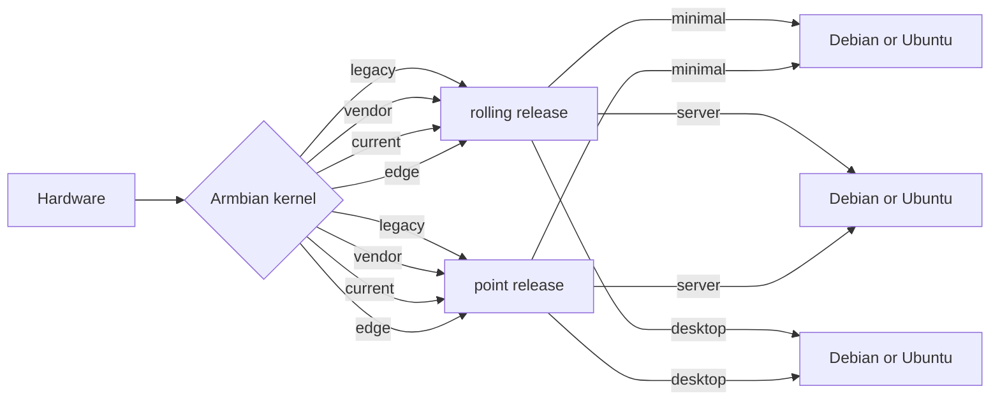

# Armbian Getting Started Guide

Before you start, please make sure you have:

- a proper power supply according to the board manufacturer's requirements <!-- TODO: link to power issues -->
- a reliable SD card (at least 'Class 10' and 'A1'-rated is **highly** recommended)

You will also need an existing operating system and a SD card writer tool. We recommend using [USBImager](https://gitlab.com/bztsrc/usbimager) because it can validate written data **saving you from corrupted SD card contents**.


!!! warning

    Make sure you use a **good, reliable and fast** SD card. If you encounter boot or stability issues, in over 95 percent of all cases these are either caused by an **insufficient** power supply, or they are related to the SD card. This can be due to a bad card, bad card reader, something went wrong when burning the image, the card turns out to be too slow to boot, etc. Armbian can simply not run on unreliable hardware.

    Checking your SD card with either [F3](https://fight-flash-fraud.readthedocs.io/en/stable/) or [H2testw](https://www.heise.de/download/product/h2testw-50539) is mandatory if you run into problems. Since [counterfeit SD cards](https://www.happybison.com/reviews/how-to-check-and-spot-fake-micro-sd-card-8/) are still an issue, we also highly recommend checking your card with these tools directly after purchase.

    Most SD cards are only optimised for sequential reads/writes as it is common with digital cameras. This is what the *speed class* is about. The SD Association defined [*Application Performance Class*](https://www.sdcard.org/developers/overview/application/index.html) as a standard for random IO performance.

    |Application Performance Class|Pictograph|Minimum Random Read|Minimum Random Write|Minimum Sustained (Seq. Write)|
    |---|---|---|---|---|
    |Class 1 (A1)||1500 4k IOPS|500 4k IOPS|10MBytes/sec|
    |Class 2 (A2)||4000 4k IOPS|2000 4k IOPS|10MBytes/sec|

    We recommend SD cards that are rated at least A1 ([A2 rated cards are yet lacking driver support, and therefore show lower overall and especially random IO performance](https://github.com/ThomasKaiser/Knowledge/blob/master/articles/A1_and_A2_rated_SD_cards.md)) and fulfill at least speed class C10 or higher (U1/U3, etc.). For example:

      

    In case you chose an SD card that was already in use before, please consider resetting it back to 'factory default' performance with [SD Formatter](https://www.sdcard.org/downloads/formatter/) before burning Armbian to it ([explanation in the forum](https://forum.armbian.com/topic/3776-the-partition-is-not-resized-to-full-sd-card-size/&do=findComment&comment=27413)). Detailed information regarding ['factory default' SD card performance](https://forum.armbian.com/topic/954-sd-card-performance/page/3/&tab=comments#comment-49811).


!!! tip "New users"

    Some users might find it easier to follow this video tutorial.

    <iframe width="607" height="342" src="https://www.youtube.com/embed/hFrdyLc4g50" frameborder="0" allow="accelerometer; autoplay; clipboard-write; encrypted-media; gyroscope; picture-in-picture" allowfullscreen></iframe>

    Some word of advice, though. The video has been created a few years ago. You might therefore find differences between this video and our current site. So, in doubt, also follow the sections below while watching the video.


## Download the image

If your hardware is [supported](index.md#which-hardware-is-supported), you must download an image for your board. All of our system images can be found at <https://www.armbian.com/download/> or at one of our [many mirrors](Mirrors.md). You will find that there are different types of images, either using Debian GNU/Linux or Ubuntu as their base operating system.

<!-- TODO: add some information about using the user interface on the site -->


### Debian or Ubuntu

If you have no special preferences or requirements, we recommend using an Ubuntu based Armbian image.


### Minimal, Server, or Desktop

For each board, we usually provide these types of images:

- **Minimal** - lightweight CLI with only a bare minimum of packages and no graphical user environment
- **Server** - server variant with preinstalled standard utilities and no graphical user environment
- **Desktop** - full featured desktop image

For some boards we provide only minimal images due to their hardware limitations.


### Vendor, Current, Edge, or Legacy

In some cases we provide images with different firmware. They differ in the level of hardware support and can be classified as follows:

- **vendor** contains a vendor-provided kernel which usually has the best hardware support while package version can be outdated, containing less general fixes <!-- TODO: phrasing -->
- **current** is following the latest [Linux mainline LTS kernel](https://www.kernel.org/category/releases.html) and is in most cases the _best choice_.

Use the following images only if these are the only ones provided, or if you want to participate in testing:

- **edge** is, as the name implies, cutting-edge fresh / development / latest stable. It is only automatically tested, it can break at any time, and it is recommended only for experienced users.
- **legacy** is the old stable current kernel. Use it if _current_ is not available or if something does not work well with it.

The level of kernel support, however, always depends on the board family. If in your specific case something does not work well, you are always free to try an image with another kernel included, or change the kernel with [armbian-config](User-Guide_Armbian-Config.md).


### Rolling releases

<!-- TODO: this might be too much here; explanation could go into development docs, or appendix maybe?? -->

Rolling releases are suitable for Linux enthusiasts who want cutting edge packages and have the skills to fix the damage that a bad update might cause. If you want stability in a production environment or low headaches as a novice user, skip rolling releases. They are not at a suitable support quality level!



!!! danger

    **Do not use** rolling release or edge images in a productive environment. Their purpose is testing and providing constructive [feedback to developers](https://forum.armbian.com/forum/4-development/).


### Download and verification

After you have determined the image you want, the download for each image consists of three separate files:

- the **.xz** compressed image file
- the **.sha file** for download verification (optional)
- the **.asc file** for image authentication (optional)

After you have downloaded these files, we recommend checking the integrity and the authenticity of the compressed image file.

!!! question "How to check the download integrity?"

    Since it might happen that your download got somehow corrupted, we publish a checksum/hash for each of our images. You can compare the image's SHA-256 hash with the one contained in the `.sha` file.

    On Windows, you can download and use the [QuickHash GUI](https://www.quickhash-gui.org/download/quickhash-v3-1-0-windows/) and follow the instructions in the gui. Linux and macOS users can simply do this in the directory with the compressed image and the checksum file:

    ```sh
    sha256sum -c Armbian_25.2.1_Bananapicm4io_bookworm_current_6.12.13_minimal.img.xz.sha
    ```

    The integrity is verified if the output looks something like this:

    ```sh
    Armbian_25.2.1_Bananapicm4io_bookworm_current_6.12.13_minimal.img.xz: OK
    ```

!!! question "How to check the download authenticity?"

    All our images are digitally signed. It is therefore possible to check their authenticity. Linux and macOS user might need to install the required tools first: for Debian/Ubuntu, this can be done via `sudo apt-get install gnupg `, and for macOS use `brew install gnupg `. Windows users can install [GnuPG from here](https://gnupg.org/download/). To check the authenticity, you will need the public key that was used to sign the images. This key can be retrieved from a keyserver or from the Debian/Ubuntu package repository (this step only needs to be done once):

    ```sh
    # download public keys either from a keyserver
    gpg --keyserver hkp://keyserver.ubuntu.com --recv-key DF00FAF1C577104B50BF1D0093D6889F9F0E78D5
    gpg --keyserver hkp://keyserver.ubuntu.com --recv-key 8CFA83D13EB2181EEF5843E41EB30FAF236099FE
    # or from the repository server
    wget -O- https://apt.armbian.com/armbian.key | gpg --import -
    ```

    To perform the verfification, run the command shown below.

    ```sh
    gpg --verify Armbian_25.2.1_Bananapicm4io_bookworm_current_6.12.13_minimal.img.xz.asc
    ```

    While the output can very depending on the GnuPG version, it should result in a response similar to the one below. It is safe to ignore the message `WARNING: This key is not certified with a trusted signature!`.

    ```sh
    gpg: Signature made Thu Feb 13 11:53:18 2025 CET
    gpg:                using RSA key DF00FAF1C577104B50BF1D0093D6889F9F0E78D5
    gpg: Good signature from "Igor Pecovnik <igor@++++++++++++.com>" [unknown]
    gpg:                 aka "Igor Pecovnik (Ljubljana, Slovenia) <igor.++++++++++++@gmail.com>" [unknown]
    gpg: WARNING: This key is not certified with a trusted signature!
    gpg:          There is no indication that the signature belongs to the owner.
    Primary key fingerprint: DF00 FAF1 C577 104B 50BF  1D00 93D6 889F 9F0E 78D5
    ```

    If something is wrong, the output will look something like this:

    ```sh
    gpg: Signature made Thu Feb 13 11:53:18 2025 CET
    gpg:                using RSA key DF00FAF1C577104B50BF1D0093D6889F9F0E78D5
    gpg: BAD signature from "Igor Pecovnik <igor@++++++++++++>" [unknown]
    ```


## Deploy the image

Write the **.xz compressed image** with a tool like [USBImager](https://gitlab.com/bztsrc/usbimager) onto your micro-SD card. Unlike other tools, it can validate written data **saving you from corrupted SD card contents**.

!!! warning "Other tools"

    We are aware that there are many programs that can be used for this step. **But**, they usually cannot validate the written data to catch a bad card, a faulty card reader, problems writing the image. etc. Issues like these have caused too many error reports. Thus, please follow our advice and don't use other tools, especially if you are a novice user.

    Due to known issues, [balenaEtcher](https://www.balena.io/etcher/) can no longer be recommended as an alternative at this time.


## First boot

Insert the SD card into a slot and power on the board. With the cheapest board, the first boot (with DHCP) can take up to two minutes with a class 10 SD card.


## First login

The first boot will log you in automatically if you have connected a display via HDMI or if you are connected to the serial console. For SSH, you need to login as **root** and use the password **1234**. If you need to find your board's IP address, you can use [this tool](https://angryip.org/).

After logging in, you will be prompted to change the default password. You will then be asked to create a normal user account that will have sudo permissions. Beware, at this stage, the keyboard is using the QWERTY layout. In case you have no wired network connection and there is a wireless adaptor detected, the system will prompt you to connect.

    Welcome to Armbian!

    Documentation: https://docs.armbian.com/ | Community support: https://forum.armbian.com/

    IP address:  Network connection timeout!

    Create root password: ********
    Repeat root password: ********

    Shell: BASH

    Creating a new user account. Press <Ctrl-C> to abort

    Please provide a username (eg. your first name): jane
    Create user (Jane) password: ********
    Repeat user (Jane) password: ********

    Please provide your real name: Jane

    Dear Jane, your account jane has been created and is sudo enabled.
    Please use this account for your daily work from now on.

    Internet connection was not detected.

    Connect via wireless? [Y/n] y

    Multiple wireless adaptors detected. Choose primary:

    1        wlx00e032cxxx94
    2        wlx60fb00yyyc4a

    Enter a number of wireles adaptor: 1

    Detected wireless networks:

    1        NETWORK
    2        MY-WIFI
    3        Caatsanddogs

    Enter a number of SSID: 3

    Enter a password for MY-WIFI: password

    Probing internet connection (9)

    Detected timezone: Europe/Ljubljana

    Set user language based on your location? [Y/n] y

    Generating locales: sl_SI.UTF-8
    root@bananapim2pro:~#

???+ tip "Automated config"
    These settings can be pre-loaded, see [Autoconfig](User-Guide_Autoconfig.md)

<!-- TODO: it must be made clear that this just preps the SD card -->


## First steps

You can customize your Armbian Linux before or after installing it onto your device's hard-drive. In many cases, you probably want to apply some basic customizations like adjusting the keyboard layout, the timezone, etc., so you can use the same SD card again if necessary. Or you want to adjust your [system or hardware configuration](User-Guide_Armbian-Config.md) or [install preconfigured applications and advanced services](User-Guide_Armbian-Software.md).

Please note that the typical tool for all tasks is [_armbian-config_](User-Guide_Armbian-Config.md). The section [_Advanced Configuration_](User-Guide_Advanced-Configuration.md) contains a selection of tasks that require a deeper understanding of the operating system.


### Configuration

Typical tasks include for example:

-  Set the default language and keyboard layout
-  Disable or enable root logins and/or SSH
-  Handle and configure system and firmware upgrades
-  Configure the network


### Software titles

You can quickly and easily install popular software too! It is ready to run and optimized for Armbian. Here are few highlights:

-  Desktops - install desktop environments
-  Netconfig - network tools
-  DevTools - development
-  Benchy - system benchmaking and diagnostics
-  Containers - containerization and virtual machines
-  Media - media servers and editors
-  Management - remote management tools


<!-- TODO:
      * first customize: armbian-config, install software -> show some examples
      * ...
      * then deploy to one or all systems to get the same installation with armbian-install (reboot and check if everything works)
      * how to test if everything is working well?
 -->


## Installation

At this stage, nothing has been installed onto the board's internal drive yet. Using the installer, one can now decide where to install the boot loader and the rest of the system. The installer supports various combinations depending on the availability of onboard eMMC and/or attached SATA, NVME, or USB storage.

!!! tip "Armbian Installer support those storage scenarios:"

    * boot from SD, system on SATA / USB
    * boot from eMMC / NAND, system on eMMC/NAND
    * boot from eMMC / NAND, system on SATA / USB / NVME
    * Boot from SPI - system on SATA, USB or NVMe
    * Install/Update the bootloader on SD/eMMC
    * Install/Update the bootloader on special eMMC partition
    * Install/Update the bootloader on SPI Flash
    * Install system to UEFI disk

<!-- TODO: give the user a sensible default -->

Start the install script, make your choice, and follow the instructions:

    armbian-install


After you have decided for an option, you can choose between the following file systems: <!-- TODO: only for system? -->

* ext2,3,4
* btrfs

For novice users, a sensible default is `ext4`.

Congratulation. You have successfully installed Armbian onto your board!


## Update the system

The operating system consists of two parts that must be updated separately.


### Update the Armbian OS

For the base operating system, use the APT package manager to keep the packages up to date.

    apt update
    apt upgrade

**The Update process can take quite some time in case you are using an old or a cheap SD card and/or experience heavy load.**

Users with a desktop will find graphical tools that allow one to update the system packages without using the command line.

Armbian provides a firmware package freeze feature to provide you with the possibility to upgrade all packages **but** the firmware. This prevents unpleasant surprises on functionality regressions that can come with kernel upgrades. To enable or disable this feature, look for

    Enable Armbian kernel/firmware upgrades / Disable Armbian kernel upgrades

within [armbian-config](User-Guide_Armbian-Config.md).

If the kernel was upgraded during this process, you will be prompted to reboot at the next login.

<!-- TODO: maybe move this to advanced? Definitely not for novice users -->

!!! danger "Upgrade the Armbian OS"

    When a new major release of Debian or Ubuntu is out, we recommend to start with a fresh image. While it is possible to do what is called a _"dist-upgrade"_, the process is largerly in the domain of the underlaying Debian or Ubuntu user space. We provide only an experimental `Distribution upgrades` feature for [armbian-config](User-Guide_Armbian-Config.md).

    Userspaces distribution upgrades are neither tested nor supported. Therefore Armbian cannot provide any support if something goes wrong.


### Update the boot loader

The second part that can be updated is the boot loader.

First, update all packages as described in the previous section. Then run:

```bash
sudo armbian-install
```

and select:

    Install/Update the bootloader on SD/eMMC


## Troubleshooting

If you experience an issue during any of the steps mentioned in this section, please first check out our [_Troubleshooting and Recovery_](User-Guide_Troubleshooting.md) guide.

<!--
      * armbianmonitor
      * community / search forum || how to get help
      * FAQ (maybe feature is not developed)
-->

### How to report bugs

If you are certain you have found a bug, fill out our [bug reporting form](https://armbian.com/bugs/) and follow its instructions to collect the necessary information and how/where to provide them depending on the type of issue. Please understand that any reports lacking these fundamental diagnostics might be ignored.
