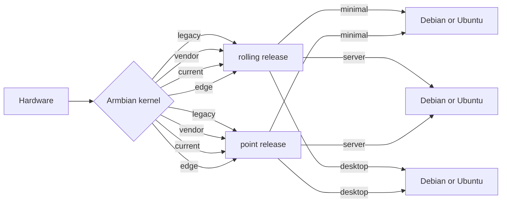

# Armbian Getting Started Guide

Before you start, please make sure you have:

- a proper power supply according to the board manufacturer requirements <!-- TODO: link to power issues -->
- a reliable SD card <!-- TODO: link to hints for SD-card -->

You will also need an existing operating system and a SD card writer tool. We recommend using [balenaEtcher](https://www.balena.io/etcher/) or [USBImager](https://gitlab.com/bztsrc/usbimager) because these tools can validate written data **saving you from corrupted SD card contents**.

!!! tips "New users"

    Some users might find it easier to follow this video tutorial.

    <iframe width="607" height="342" src="https://www.youtube.com/embed/hFrdyLc4g50" frameborder="0" allow="accelerometer; autoplay; clipboard-write; encrypted-media; gyroscope; picture-in-picture" allowfullscreen></iframe>

    Some word of advice, though. The video has been created a few years ago. You might therefore find differences between this video and our current site. So, in doubt, also follow the sections below while watching the video.


## Download the image

All our images can be found at <https://www.armbian.com/download/>. You will find, that there are different types of images, either using Debian GNU/Linux or Ubuntu as their base operating system.

<!-- TODO: add some information about using the user interface on the site -->


### Minimal, Server, or Desktop?

For each board we usually provide various image types:

- **Minimal** - lightweight CLI with bare minimum of packages
- **Server** - server variant with preinstalled standard utilities
- **Desktop** full featured desktop image

For some boards we provide only minimal images due to their hardware limitations.


### Debian or Ubuntu?

If you have no special preferences or requirements, we recommend Ubuntu based Armbian.


### Vendor, Current, Edge, or Legacy?

In some cases we provide images with different firmware. They differ in the level of hardware support. Focus into:

- **vendor** contains a vendor-provided kernel which usually has the best hardware support while package version can be outdated, containing less general fixes <!-- TODO: phrasing -->
- **current** is following the latest [mainline LTS kernel](https://www.kernel.org/category/releases.html) and is in most cases the best choice.

Further, if the following images are the only ones provided, or if you want to participate in testing:

- **edge** is, as the name implies, cutting-edge fresh / development / latest stable. It is only automatically tested, it can break at any time, and it is recommended only for experienced users.
- **legacy** is the old stable current kernel. Use it if _current_ is not available or if something does not work well with it.

The level of kernel support, however, always depends on the board family. If in your specific case something does not work well, you are always free to try an image with another kernel included, or change the kernel with [armbian-config](/User-Guide_Armbian-Config).


### Rolling releases?

<!-- TODO: this might be too much here; explanation could go into development docs, or appendix maybe?? -->

Rolling releases are suitable for Linux enthusiasts who want cutting edge packages and have the skills to fix the damage that a bad update might cause. If you want stability in a production environment or low headaches as a novice user, skip rolling releases. They are not at a suitable support quality level!



!!! danger

    **Do not use** rolling release or edge images in a productive environment. Their purpose is testing and providing constructive [feedback to developers](https://forum.armbian.com/forum/4-development/).


### Download and verfication

After you have determined the image you want, the download for each image consists of three separate files:

- the **.xz** compressed image file
- the **.sha file** for download verification (optional)
- the **.asc file** for image authentication (optional)

After you have downloaded these files, we recommend checking the integrity and the authenticity of the compressed image file.

!!! question "How to check download integrity?"

    Since it might happen that your download got somehow corrupted, we publish a checksum/hash for each of our images. You can compare the image's SHA-256 hash with the one contained in the `.sha` file.

    On Windows, you can download and use the [QuickHash GUI](https://www.quickhash-gui.org/download/quickhash-v3-1-0-windows/) and follow the instructions in the gui. Linux and macOS users can simply do this in the directory with the compressed image and the checksum file:

    ```sh
    sha256sum -c Armbian_25.2.1_Bananapicm4io_bookworm_current_6.12.13_minimal.img.xz.sha
    ```

    The integrity is verified if the output looks something like this:

    ```sh
    Armbian_25.2.1_Bananapicm4io_bookworm_current_6.12.13_minimal.img.xz: OK
    ```

!!! question "How to check download authenticity?"

    All our images are digitally signed. It is therefore possible to check their authenticity. Linux and macOS user might need to install the required tools first: for Debian/Ubuntu, this can be done via `sudo apt-get install gnupg `, and for macOS use `brew install gnupg ` on macOS. Windows users can install the [GnuPG from here](https://gnupg.org/download/). To check the authenticity, you will need the public key that was used to sign the images. This key can be retrieved from a keyserver or from the Debian/Ubuntu package repository (this step only needs to be done once):

    ```sh
    # download the public key either from a keyserver
    gpg --keyserver hkp://keyserver.ubuntu.com --recv-key DF00FAF1C577104B50BF1D0093D6889F9F0E78D5
    # or from the repository server
    wget -O- https://apt.armbian.com/armbian.key | gpg --import -
    ```

    To perform the verfification, run the command shown below.

    ```sh
    gpg --verify Armbian_25.2.1_Bananapicm4io_bookworm_current_6.12.13_minimal.img.xz.asc
    ```

    While the output can very depending on the GnuPG version, it should result in a response similar to the one below. It is safe to ignore the message `WARNING: This key is not certified with a trusted signature!`.

    ```sh
    gpg: Signature made Thu Feb 13 11:53:18 2025 CET
    gpg:                using RSA key DF00FAF1C577104B50BF1D0093D6889F9F0E78D5
    gpg: Good signature from "Igor Pecovnik <igor@++++++++++++.com>" [unknown]
    gpg:                 aka "Igor Pecovnik (Ljubljana, Slovenia) <igor.++++++++++++@gmail.com>" [unknown]
    gpg: WARNING: This key is not certified with a trusted signature!
    gpg:          There is no indication that the signature belongs to the owner.
    Primary key fingerprint: DF00 FAF1 C577 104B 50BF  1D00 93D6 889F 9F0E 78D5
    ```

    If something is wrong, the output will look something like this:

    ```sh
    gpg: Signature made Thu Feb 13 11:53:18 2025 CET
    gpg:                using RSA key DF00FAF1C577104B50BF1D0093D6889F9F0E78D5
    gpg: BAD signature from "Igor Pecovnik <igor@++++++++++++>" [unknown]
    ```


## Deploy the image

<!-- TODO: might be too much for novice users; needs to be shortened; maybe use admonitions -->

Before you start, there is an **important note:** Make sure you use a **good, reliable and fast** SD card. If you encounter boot or stability issues, in over 95 percent of the time it is either caused by an insufficient power supply or it is related to the SD card (due to a bad card, bad card reader, something went wrong when burning the image, card too slow to boot ... 'Class 10' is **highly** recommended!). Armbian can simply not run on unreliable hardware. So checking your SD card with either [F3](https://fight-flash-fraud.readthedocs.io/en/stable/) or [H2testw](https://www.heise.de/download/product/h2testw-50539) is mandatory if you run into problems. Since [counterfeit SD cards](https://www.happybison.com/reviews/how-to-check-and-spot-fake-micro-sd-card-8/) are still an issue, checking with F3/H2testw directly after purchase is also **highly recommended**.

Write the **.xz compressed image** with a tool like [USBImager](https://gitlab.com/bztsrc/usbimager) or [balenaEtcher](https://www.balena.io/etcher/) on all platforms. Uunlike other tools, either of them can validate written data **saving you from corrupted SD card contents**.

!!! tip "Also important"

    Most SD cards are only optimised for sequential reads/writes as it is common with digital cameras. This is what the *speed class* is about. The SD Association defined [*Application Performance Class*](https://www.sdcard.org/developers/overview/application/index.html) as a standard for random IO performance.

|Application Performance Class|Pictograph|Miniumum Random Read|Minimum Random Write|Minimum Sustained (Seq. Write)|
|---|---|---|---|---|
|Class 1 (A1)||1500 4k IOPS|500 4k IOPS|10MBytes/sec|
|Class 2 (A2)||4000 4k IOPS|2000 4k IOPS|10MBytes/sec|

<!-- TODO: Is that still correct?? -->

We recommend at least A1 rated SD-Cards ([A2 rated cards need yet lacking driver support and therefore show lower overall and especially random IO performance](https://github.com/ThomasKaiser/Knowledge/blob/master/articles/A1_and_A2_rated_SD_cards.md)). For example:

  

In case you chose an SD card that was already in use before, please consider resetting it back to 'factory default' performance with [SD Formatter](https://www.sdcard.org/downloads/formatter/) before burning Armbian to it ([explanation in the forum](https://forum.armbian.com/topic/3776-the-partition-is-not-resized-to-full-sd-card-size/&do=findComment&comment=27413)). Detailed information regarding ['factory default' SD card performance](https://forum.armbian.com/topic/954-sd-card-performance/page/3/&tab=comments#comment-49811).

## How to boot

Insert SD card into a slot and power the board. (First) boot (with DHCP) takes up to two minutes with a class 10 SD card and cheapest board.

## How to login

First boot will log you automatically on HDMI or serial console while for SSH login you need to login as **root** and use password **1234**. You will be prompted to change this password. You will then be asked to create a normal user account that is sudo enabled (beware of default QWERTY keyboard settings at this stage). Please use [this tool](https://angryip.org/), to find your board IP address.

???+ tips "Automated config"
    These settings can be pre-loaded, see [Autoconfig](/User-Guide_Autoconfig)

In case you have no wired network connection and there is a wireless adaptor detected, it will prompt you to connect.

    Welcome to Armbian! 

    Documentation: https://docs.armbian.com/ | Community support: https://forum.armbian.com/

    IP address:  Network connection timeout!

    Create root password: ********
    Repeat root password: ********

    Shell: BASH

    Creating a new user account. Press <Ctrl-C> to abort

    Please provide a username (eg. your first name): jane
    Create user (Jane) password: ********
    Repeat user (Jane) password: ********

    Please provide your real name: Jane

    Dear Jane, your account jane has been created and is sudo enabled.
    Please use this account for your daily work from now on.

    Internet connection was not detected.

    Connect via wireless? [Y/n] y

    Multiple wireless adaptors detected. Choose primary:

    1        wlx00e032cxxx94
    2        wlx60fb00yyyc4a

    Enter a number of wireles adaptor: 1

    Detected wireless networks:

    1        NETWORK
    2        MY-WIFI
    3        Caatsanddogs    

    Enter a number of SSID: 3

    Enter a password for MY-WIFI: password

    Probing internet connection (9)

    Detected timezone: Europe/Ljubljana

    Set user language based on your location? [Y/n] y

    Generating locales: sl_SI.UTF-8
    root@bananapim2pro:~#

## How to install


!!! success "Required condition for eMMC/SATA/USB/NVME:"

    * onboard eMMC storage
    * attached SATA, NVME or USB storage

Start the install script and follow the lead:

    armbian-install

!!! tip "Armbian installer provides those scenarios:"

    * boot from SD, system on SATA / USB
    * boot from eMMC / NAND, system on eMMC/NAND
    * boot from eMMC / NAND, system on SATA / USB / NVME
    * Boot from SPI - system on SATA, USB or NVMe
    * Install/Update the bootloader on SD/eMMC
    * Install/Update the bootloader on special eMMC partition
    * Install/Update the bootloader on SPI Flash
    * Install system to UEFI disk

!!! tip "You can choose the following file system options:"

    * ext2,3,4
    * btrfs

## How to update

### Armbian OS

    apt update
    apt upgrade

**Update process can take some time in case of using old & cheap SD card and/or under heavy load.**

If the kernel was upgraded during this process you will be prompted to reboot at next login.

### Boot loader

First you need to update all packages described in a previous step. Then run:

```bash
sudo armbian-install
```

Select:

Install/Update the bootloader on SD/eMMC

## How to stay safe

Armbian provides firmware package freeze to give you an option to upgrade all packages but firmware. This prevents unplesant surprises on functionality regressions that comes with kernel upgrades. To enable / disable this feature, look for `Enable Armbian kernel/firmware upgrades / Disable Armbian kernel upgrades` within [armbian-config](/User-Guide_Armbian-Config).

## How to upgrade a distribution

When a new userspace is out, we recommend to start with a fresh image. However, it is possible to upgrade, but the process is largerly in the domain of underlaying Debian or Ubuntu user space. However we provide experimental `Distribution upgrades` within [armbian-config](/User-Guide_Armbian-Config)

!!! danger
    Userspaces distribution upgrades are neither tested nor supported. Therefore Armbian cannot provide support if something goes wrong.  

## How to tune hardware

Hardware configuration is available within [armbian-config](User-Guide_Armbian-Config.md) utility.

## How to report bugs

Follow bug reporting form available [here](https://armbian.com/bugs/) and learn how to collect necessary information and where provide to put your report depending on type of issue. Reports lacking fundamental diagnostics are ignored.
