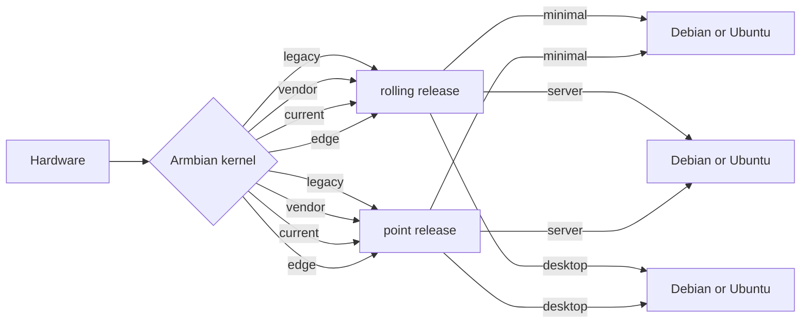

# Armbian Quick Start Guide

<iframe width="607" height="342" src="https://www.youtube.com/embed/hFrdyLc4g50" frameborder="0" allow="accelerometer; autoplay; clipboard-write; encrypted-media; gyroscope; picture-in-picture" allowfullscreen></iframe>

!!! tips "New users"

    Please, make sure you have:

    - a proper power supply according to the board manufacturer requirements
    - a reliable SD card (see below "How to prepare a SD card?")

## What to download

The download for each image consists of three separate files:

- **.xz** compressed image file
- **.sha file** for download verification (optional)
- **.asc file** for image authentication (optional)

!!! question "How to check download authenticity?"

    All our images are digitally signed and therefore it is possible to check their authenticity.  You need to  issue these commands (Linux/macOS, you might need to install dependencies first, eg. `sudo apt-get install gnupg ` on Debian/Ubuntu or `brew install gnupg ` on macOS. on windows install the current simple gnupg [Gnupg](https://gnupg.org/download/):

    ```sh
    # download public key from the database
    gpg --keyserver hkp://keyserver.ubuntu.com --recv-key DF00FAF1C577104B50BF1D0093D6889F9F0E78D5
    # perform verification 
    gpg --verify Armbian_5.18_Armada_Debian_jessie_3.10.94.img.xz.asc

    # proper response
    gpg: Signature made sob 09 jan 2016 15:01:03 CET using RSA key ID 9F0E78D5
    gpg: Good signature from "Igor Pecovnik (Ljubljana, Slovenia) <igor.++++++++++++@gmail.com>"

    # wrong reponse. Not genuine Armbian image!
    gpg: Signature made Sun 03 Jan 2016 11:46:25 AM CET using RSA key ID 9F0E78D5
    gpg: BAD signature from "Igor Pecovnik (Ljubljana, Slovenia) <igor.++++++++++++@gmail.com>"
    ```
    It is safe to ignore the message `WARNING: This key is not certified with a trusted signature!`.

!!! question "How to check download integrity?"

    Since it might happen that your download got somehow corrupted we integrate a checksum/hash for the image.  You can compare the image's SHA-256 hash with the one contained in the `sha256sum.sha` file. 

    On Windows, you can download and use the [QuickHash GUI](https://www.quickhash-gui.org/download/quickhash-v3-1-0-windows/) and follow the instructions in the gui.

    while on Linux/macOS, in the directory in which you have downloaded the files ,you would do this

    ```sh
    shasum -a 256 -c Armbian_*.img.sha
  
    #good response
    Armbian_5.35_Clearfogpro_Debian_stretch_next_4.13.16.img: OK
    ```

For each board we usually provide various image types:

- **Minimal** - lightweight CLI with bare minimum of packages
- **Server** - server variant with preinstalled standard utilities
- **Desktop** full featured desktop image

For some boards we provide only minimal images due to their hardware limitations.

### Debian or Ubuntu?

If you have no special preferences that require specific versions, we recommend Ubuntu based Armbian.

### Vendor, current?

In some cases we provide images with different firmware. They differ in level of hardware support. Focus into:

- **vendor** contains vendor provided kernel which usually has best hardware support while version can be outdated, containin less general fixes
- **current** is following latest [mainline LTS kernel](https://www.kernel.org/category/releases.html) and is in most cases best choice

And use those if they are the only one / for testings:

- **edge** is as the name implies cutting-edge fresh / development / latest stable. It is only automatically tested and can break at any time. Recommended for experienced users.
- **legacy** is old stable current kernel. Use if either _current_ is not available or something does not work well with it.

The level of kernel support however always depends on the board family. If in your specific case something does not work well, you are always free to try an image with an other kernel included or change kernel within [armbian-config](/User-Guide_Armbian-Config).

### Rolling releases?

Rolling releases are suitable for Linux enthusiasts who want cutting edge packages and have the skills to fix damage that a bad update might cause. If you want stability in a production environment or low headaches as a novice user, skip rolling releases. They are only at, build and ship, Debian testing / Arch / Manjaro / Suse Tumbleweed / Kali / Gentoo support quality level!



!!! danger

    **Do not use** rollling or edge images in a productive environment. Their purpose is testing and providing constructive [feedback to developers](https://forum.armbian.com/forum/4-development/).

## Preparing SD card

**Important note:** Make sure you use a **good, reliable and fast** SD card. If you encounter boot or stability troubles in over 95 percent of the time it is either insufficient power supply or related to SD card (bad card, bad card reader, something went wrong when burning the image, card too slow to boot -- 'Class 10' highly recommended!). Armbian can simply not run on unreliable hardware so checking your SD card with either [F3](https://fight-flash-fraud.readthedocs.io/en/stable/) or [H2testw](https://www.heise.de/download/product/h2testw-50539) is mandatory if you run in problems. Since [counterfeit SD cards](https://www.happybison.com/reviews/how-to-check-and-spot-fake-micro-sd-card-8/) are still an issue checking with F3/H2testw directly after purchase is **highly recommended**.

Write the **.xz compressed image** with a tool [USBImager](https://gitlab.com/bztsrc/usbimager) or [balenaEtcher](https://www.balena.io/etcher/) on all platforms since, unlike other tools, either can validate written data **saving you from corrupted SD card contents**.

!!! tip "Also important"

    Most SD cards are only optimised for sequential reads/writes as it is common with digital cameras. This is what the *speed class* is about. The SD Association defined [*Application Performance Class*](https://www.sdcard.org/developers/overview/application/index.html) as a standard for random IO performance.

|Application Performance Class|Pictograph|Miniumum Random Read|Minimum Random Write|Minimum Sustained (Seq. Write)|
|---|---|---|---|---|
|Class 1 (A1)||1500 4k IOPS|500 4k IOPS|10MBytes/sec|
|Class 2 (A2)||4000 4k IOPS|2000 4k IOPS|10MBytes/sec|

We recommend at least A1 rated SD-Cards ([A2 rated cards need yet lacking driver support and therefore show lower overall and especially random IO performance](https://github.com/ThomasKaiser/Knowledge/blob/master/articles/A1_and_A2_rated_SD_cards.md)). For example:

  

In case you chose an SD card that was already in use before please consider resetting it back to 'factory default' performance with [SD Formatter](https://www.sdcard.org/downloads/formatter/) before burning Armbian to it ([explanation in the forum](https://forum.armbian.com/topic/3776-the-partition-is-not-resized-to-full-sd-card-size/&do=findComment&comment=27413)). Detailed information regarding ['factory default' SD card performance](https://forum.armbian.com/topic/954-sd-card-performance/page/3/&tab=comments#comment-49811).

## How to boot

Insert SD card into a slot and power the board. (First) boot (with DHCP) takes up to two minutes with a class 10 SD card and cheapest board.

## How to login

First boot will log you automatically on HDMI or serial console while for SSH login you need to login as **root** and use password **1234**. You will be prompted to change this password. You will then be asked to create a normal user account that is sudo enabled (beware of default QWERTY keyboard settings at this stage). Please use [this tool](https://angryip.org/), to find your board IP address.

???+ tips "Automated config"
    These settings can be pre-loaded, see [Autoconfig](/User-Guide_Autoconfig)

In case you have no wired network connection and there is a wireless adaptor detected, it will prompt you to connect.

    Welcome to Armbian! 

    Documentation: https://docs.armbian.com/ | Community support: https://forum.armbian.com/

    IP address:  Network connection timeout!

    Create root password: ********
    Repeat root password: ********

    Shell: BASH

    Creating a new user account. Press <Ctrl-C> to abort

    Please provide a username (eg. your first name): jane
    Create user (Jane) password: ********
    Repeat user (Jane) password: ********

    Please provide your real name: Jane

    Dear Jane, your account jane has been created and is sudo enabled.
    Please use this account for your daily work from now on.

    Internet connection was not detected.

    Connect via wireless? [Y/n] y

    Multiple wireless adaptors detected. Choose primary:

    1        wlx00e032cxxx94
    2        wlx60fb00yyyc4a

    Enter a number of wireles adaptor: 1

    Detected wireless networks:

    1        NETWORK
    2        MY-WIFI
    3        Caatsanddogs    

    Enter a number of SSID: 3

    Enter a password for MY-WIFI: password

    Probing internet connection (9)

    Detected timezone: Europe/Ljubljana

    Set user language based on your location? [Y/n] y

    Generating locales: sl_SI.UTF-8
    root@bananapim2pro:~#

## How to install


!!! success "Required condition for eMMC/SATA/USB/NVME:"

    * onboard eMMC storage
    * attached SATA, NVME or USB storage

Start the install script and follow the lead:

    armbian-install

!!! tip "Armbian installer provides those scenarios:"

    * boot from SD, system on SATA / USB
    * boot from eMMC / NAND, system on eMMC/NAND
    * boot from eMMC / NAND, system on SATA / USB / NVME
    * Boot from SPI - system on SATA, USB or NVMe
    * Install/Update the bootloader on SD/eMMC
    * Install/Update the bootloader on special eMMC partition
    * Install/Update the bootloader on SPI Flash
    * Install system to UEFI disk

!!! tip "You can choose the following file system options:"

    * ext2,3,4
    * btrfs

## How to update

### Armbian OS

    apt update
    apt upgrade

**Update process can take some time in case of using old & cheap SD card and/or under heavy load.**

If the kernel was upgraded during this process you will be prompted to reboot at next login.

### Boot loader

First you need to update all packages described in a previous step. Then run:

```bash
sudo armbian-install
```

Select:

Install/Update the bootloader on SD/eMMC

## How to stay safe

Armbian provides firmware package freeze to give you an option to upgrade all packages but firmware. This prevents unplesant surprises on functionality regressions that comes with kernel upgrades. To enable / disable this feature, look for `Enable Armbian kernel/firmware upgrades / Disable Armbian kernel upgrades` within [armbian-config](/User-Guide_Armbian-Config).

## How to upgrade a distribution

When a new userspace is out, we recommend to start with a fresh image. However, it is possible to upgrade, but the process is largerly in the domain of underlaying Debian or Ubuntu user space. However we provide experimental `Distribution upgrades` within [armbian-config](/User-Guide_Armbian-Config)

!!! danger
    Userspaces distribution upgrades are neither tested nor supported. Therefore Armbian cannot provide support if something goes wrong.  

## How to tune hardware

Hardware configuration is available within [armbian-config](User-Guide_Armbian-Config.md) utility.

## How to report bugs

Follow bug reporting form available [here](https://armbian.com/bugs/) and learn how to collect necessary information and where provide to put your report depending on type of issue. Reports lacking fundamental diagnostics are ignored.
