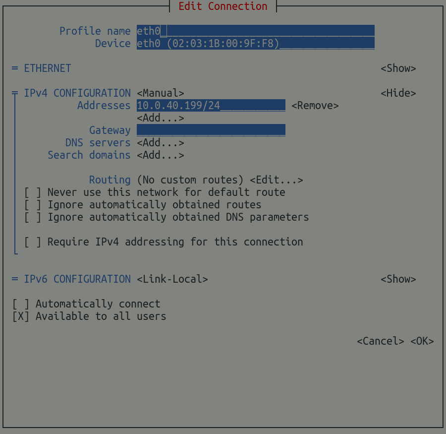
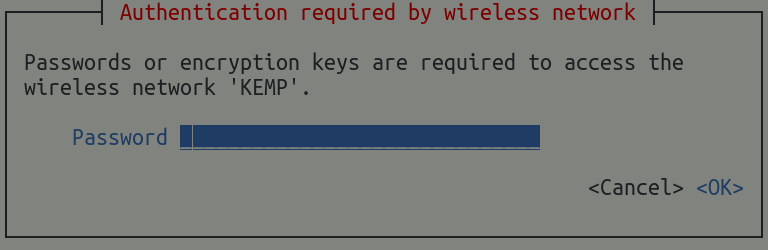

## Networking

Armbian uses [**Netplan.io**](https://netplan.io/) to describe networking configurations. Netplan is a utility to easily configure Linux networking, using a declarative approach.
If you want to configure your network manually, it is as simple as editing and creating Netplan yaml files (see the yaml configuration reference at the [Netplan docs](https://netplan.readthedocs.io/en/stable/netplan-yaml/)).

_Netplan_ is used to configure networks on **all** Armbian images since Release 24.05, no matter if minimal, CLI or desktop, Debian or Ubuntu. However, the networking backends are different based on if you choose a _minimal_ image or not. 

## Minimal images

!!! tip "Netplan renderer: networkd"

_Minimal_ images are using the `systemd-networkd` backend, which has a **smaller footprint** compared to `Network-Manager` which is used in all non-minimal images. `systemd-networkd` is a system daemon that manages network configurations. It detects and configures network devices as they appear; it can also create virtual network devices. This service is great for simple connections, but can also be useful to set up complex network configurations.

### Armbian defaults

All ethernet interfaces are configured for DHCP and will automatically receive an IP address from your router.

[`/etc/netplan/10-dhcp-all-interfaces.yaml`](https://github.com/armbian/build/blob/main/extensions/network/config-networkd/netplan/10-dhcp-all-interfaces.yaml):

```yaml
network:
  version: 2
  renderer: networkd
  ethernets:
    all-eth-interfaces:
      match:
        name: "e*"
      dhcp4: yes
      dhcp6: yes
      ipv6-privacy: yes
```

### Configuration examples

####  Setting a fixed IP address

The following example configures a static IP `192.168.1.199` for the `eth0` interface. Please adjust as necessary.


!!! question "How to find your device's Ethernet interface?"

    Use command:

    ```sh
    ip addr
    ```
    It is usually something like `eth0`, `enp4s3` or `lan`.

`/etc/netplan/20-static-ip.yaml`:

```yaml
network:
  version: 2
  renderer: networkd
  ethernets:
    eth0: # Change this to your ethernet interface
      addresses:
      - 192.168.1.199/24
      routes:
      - to: default
        via: 192.168.1.1
      nameservers:
       addresses:
         - 9.9.9.9
         - 1.1.1.1
```

See also the [Netplan docs](https://netplan.readthedocs.io/en/latest/using-static-ip-addresses/) for reference.

#### Connecting to WiFI network


!!! tip "It is recommended to make a separate config file for wireless network."

Create the following file:

`sudo nano /etc/netplan/30-wifis-dhcp.yaml`:

```yaml
network:
  version: 2
  renderer: networkd
  wifis:
    wlan0:
      dhcp4: true
      dhcp6: true
      access-points:
        "Your-SSID":
          password: "your-password"
```

Replace `SSID` with the name of the network you want to connect to and `wlan0` with the wifi interface used on your system.

!!! question "How to find your device's WiFi interface?"

    Use command:

    ```sh
    ip addr
    ```
    It is usually something like `wlan0`, `wlo1` or `wlx12334c47dec3`.


See also the [Netplan docs](https://netplan.readthedocs.io/en/latest/examples/#how-to-configure-your-computer-to-connect-to-your-home-wi-fi-network) for reference.

### Applying your configuration

Once you are done configuring your network, it is time to test syntax and apply it.

#### Fix file permissions

According to the [Netplan docs](https://netplan.readthedocs.io/en/stable/security/), the permissions must be restricted to the `root` user.

```bash
sudo chmod 600 /etc/netplan/*.yaml
```

#### Test syntax

This will verify the syntax and test if your device can connect

```bash
sudo netplan try
```

#### Apply the configuration

```bash
sudo netplan apply
```

# CLI and desktop images

!!! tip "Netplan renderer: Network Manager"

Server CLI and desktop images are using the `Network-Manager` backend. You can use similar methods for configuring your network as with the `networkd` backend used on minimal images.

### Setting a fixed IP address

The following example configures a static IP `192.168.1.199` for the `eth0` interface. Please adjust the example to your likings.

!!! question "How to find your device's Ethernet interface?"

    Use command:

    ```sh
    ip addr
    ```
    It is usually something like `eth0`, `enp4s3` or `lan`.

`/etc/netplan/20-static-ip.yaml`:

```yaml
network:
  version: 2
  renderer: NetworkManager # Different than 'networkd'
  ethernets:
    eth0: # Change this to your ethernet interface
      addresses:
      - 192.168.1.199/24
      routes:
      - to: default
        via: 192.168.1.1
      nameservers:
       addresses:
         - 9.9.9.9
         - 1.1.1.1
```

See also the [Netplan docs](https://netplan.readthedocs.io/en/latest/using-static-ip-addresses/) for reference.

Alternatively, you can also use Network-Manager directly via the command line or GUI tools on your desktop:

```bash
nmtui-edit eth0
```
??? note "Display screenshot"
    

Replace `eth0` with the name of your Ethernet Interface.

### Connecting to WiFI network

For connecting to a wireless network, you can use the same method as mention above for use with `networkd` [on minimal images](#minimal-images). Just make sure to replace `renderer: networkd` with `renderer: NetworkManager`.

Alternatively, you can also use Network-Manager directly via the command line or GUI tools on your desktop:

```bash
nmtui-connect SSID
```

??? note "Display screenshot"
    

Replace `SSID` with the name of your wireless network.

# Automatic configuration

It is possible to network configurations which are automatically applied when you first boot your device after flashing a fresh image by writing to the file `/root/.not_logged_in_yet` which is read at your first login.

Mount your live image _before your first boot_ and use this example for reference:

    # Set PRESET_NET_CHANGE_DEFAULTS to 1 to apply any network related settings below.
    
    PRESET_NET_CHANGE_DEFAULTS="1"

    # Enable WiFi or Ethernet.
    # NB: If both are enabled, WiFi will take priority and Ethernet will be disabled.
    
    PRESET_NET_ETHERNET_ENABLED=1
    PRESET_NET_WIFI_ENABLED=1

    # Enter your WiFi credentials
    # SECURITY WARNING: Your wifi keys will be stored in plaintext, no encryption.
    
    PRESET_NET_WIFI_SSID='MySSID'
    PRESET_NET_WIFI_KEY='MyWiFiKEY'

    # Country code to properly adjust the WiFi for your country. 
    
    # E.g. 'GB', 'US' or 'DE' (see https://en.wikipedia.org/wiki/ISO_3166-1_alpha-2)
    PRESET_NET_WIFI_COUNTRYCODE='GB'

    # If you want to use a static IP, you may set it here
    
    PRESET_NET_USE_STATIC=1
    PRESET_NET_STATIC_IP='192.168.0.100'
    PRESET_NET_STATIC_MASK='255.255.255.0'
    PRESET_NET_STATIC_GATEWAY='192.168.0.1'
    PRESET_NET_STATIC_DNS='9.9.9.9 1.1.1.1'

If you want to use first run automatic configuration at build time, [check this GitHub pull request](https://github.com/armbian/build/pull/6194).

In short:

1. Copy the template with `cp extensions/preset-firstrun.sh userpatches/extensions/`
2. Edit the template `userpatches/extensions/preset-firstrun.sh` according to your situation
3. Build your Armbian image using the additional parameter `ENABLE_EXTENSIONS=preset-firstrun`

???+ tip

    This method also creates a new user, sets passwords and more!
