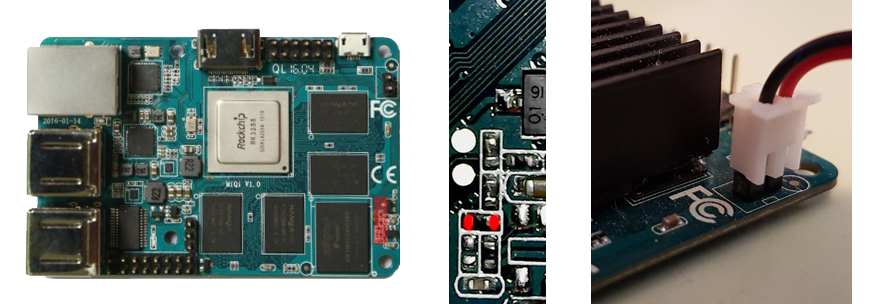
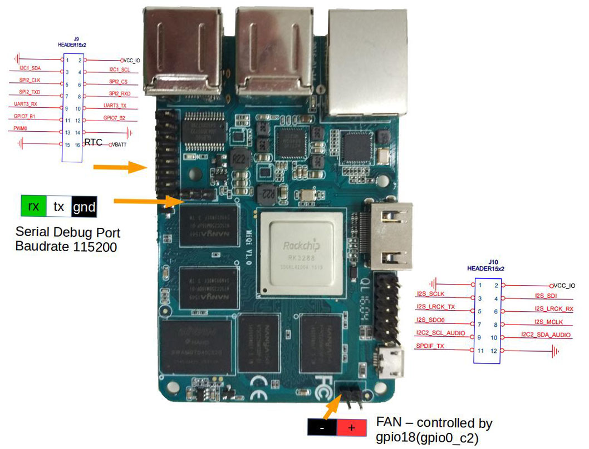

**How to unbrick MiQi?**

When you can't restore your bootloader with pressing and holding the button while powering, you need to shorten this resistor with some tweezers and power the board. [Than proceed with flashing stock u-boot](https://github.com/mqmaker/miqi-prebuilt).

