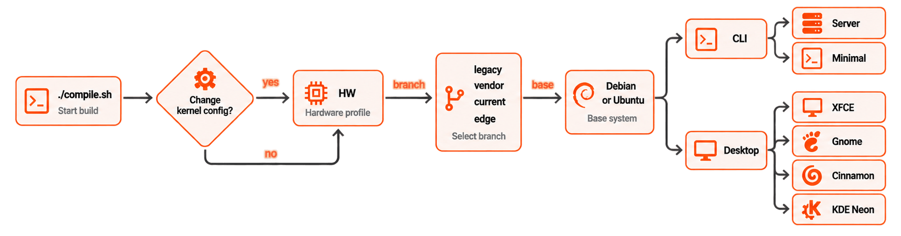

# Build framework overview

## What it does?

- Builds custom **kernel**, **image** or a Debian based Linux **distribution** optimized for low-resource hardware,
- Include filesystem generation, low-level control software, kernel image and **bootloader** compilation,
- Provides a **consistent user experience** by keeping system standards across different platforms.



For a step-by-step tour of what happens on a build — configuration, the artifact cache, rootfs and image assembly — see [**How a build runs**](how-a-build-runs.md).

## Key Advantages

- Simplicity with interactive graphical interface.
- Generates widely recognized and well maintained userspace
- Fast learning curve for complex operations

Check other similarities, advantages and disadvantages compared with leading industry standard build software.

Function | Armbian | Yocto | Buildroot |
|:--|:--|:--|:--|
| Target | general purpose | embedded | embedded / IOT |
| U-boot and kernel | compiled from sources | compiled from sources | compiled from sources |
| Board support maintenance &nbsp; | complete | outside | outside |
| Root file system | Debian or Ubuntu based| custom | custom |
| Package manager | APT | any | none |
| Configurability | limited | large | large |
| Initramfs support | yes | yes | yes |
| Getting started | quick | very slow | slow |
| Cross compilation | yes | yes | yes |

## Framework Structure

```text
├── cache                                Work / cache directory
│   ├── aptcache                         Packages
│   ├── ccache                           C/C++ compiler
│   ├── docker                           Docker last pull
│   ├── git-bare                         Minimal Git
│   ├── git-bundles                      Full Git
│   ├── initrd                           Ram disk
│   ├── memoize                          Git status
│   ├── patch                            Kernel drivers patch
│   ├── pip                              Python
│   ├── rootfs                           Compressed userspaces
│   ├── sources                          Kernel, u-boot and other sources
│   ├── tools                            Additional tools like ORAS
│   └── utility
├── config                               Packages repository configurations
│   ├── targets.conf                     Board build target configuration
│   ├── boards                           Board configurations
│   ├── bootenv                          Initial boot loaders environments per family
│   ├── bootscripts                      Initial Boot loaders scripts per family
│   ├── cli                              CLI packages configurations per distribution
│   ├── desktop                          Desktop packages configurations per distribution
│   ├── distributions                    Distributions settings
│   ├── kernel                           Kernel build configurations per family
│   ├── sources                          Kernel and u-boot sources locations and scripts
│   ├── templates                        User configuration templates which populate userpatches
│   └── torrents                         External compiler and rootfs cache torrents
├── extensions                           Extend build system with specific functionality
├── lib                                  Main build framework libraries
│   ├── functions
│   │   ├── artifacts
│   │   ├── bsp
│   │   ├── cli
│   │   ├── compilation
│   │   ├── configuration
│   │   ├── general
│   │   ├── host
│   │   ├── image
│   │   ├── logging
│   │   ├── main
│   │   └── rootfs
│   └── tools
├── output                               Build artifact
│   └── debs                             Deb packages
│   └── images                           Bootable images - RAW or compressed
│   └── debug                            Patch and build logs
│   └── config                           Kernel configuration export location
│   └── patch                            Created patches location
├── packages                             Support scripts, binary blobs, packages
│   ├── blobs                            Wallpapers, various configs, closed source bootloaders
│   ├── bsp-cli                          Automatically added to armbian-bsp-cli package
│   ├── bsp-desktop                      Automatically added to armbian-bsp-desktopo package
│   ├── bsp                              Scripts and configs overlay for rootfs
│   └── extras-buildpkgs                 Optional compilation and packaging engine
├── patch                                Collection of patches
│   ├── atf                              ARM trusted firmware
│   ├── kernel                           Linux kernel patches
|   |   └── family-branch                Per kernel family and branch
│   ├── misc                             Linux kernel packaging patches
│   └── u-boot                           Universal boot loader patches
|       ├── u-boot-board                 For specific board
|       └── u-boot-family                For entire kernel family
├── tools                                Tools for dealing with kernel patches and configs
└── userpatches                          User: configuration patching area
    ├── config-example.conf              User: example user config file
    ├── customize-image.sh               User: script will execute just before closing the image
    ├── atf                              User: ARM trusted firmware
    ├── extensions                       User: Extend build system with specific functionality
    ├── kernel                           User: Linux kernel per kernel family
    ├── misc                             User: various
    └── u-boot                           User: universal boot loader patches
```

---

**Next:** [Getting started](getting-started.md)

Reference: [build commands](commands/index.md), [build switches](switches/index.md), [user configurations](user-configurations.md), [extensions](extensions/index.md).
