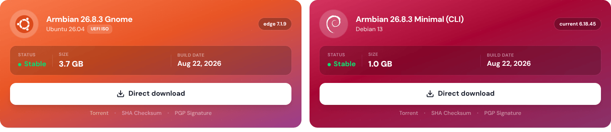
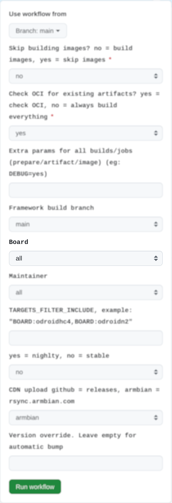
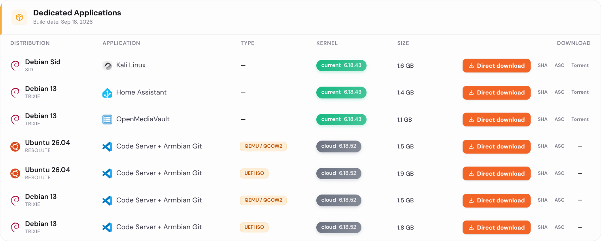
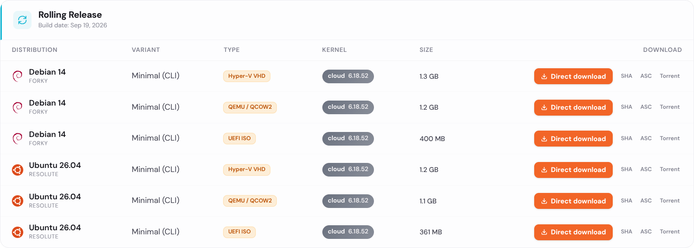

# Automation for developers and maintainers

Core automation for generating release images lives at <https://github.com/armbian/ci> (the reusable build pipeline and its track wrappers). Repository, download-page and mirror automation lives at [`armbian/armbian.github.io`](https://github.com/armbian/armbian.github.io).

???+ warning
    The old [`armbian/os`](https://github.com/armbian/os) repository is deprecated and no longer used for build automation. All workflows have moved to `armbian/ci` (builds) and `armbian.github.io` (publishing/repository).

???+ note
    For monitoring Armbian action scripts status and execution details, visit [https://actions.armbian.com/](https://actions.armbian.com/)


## Prepare build lists


### Recommended images

Recommended images on download pages and in [Armbian imager](http://imager.armbian.com/) are automatically generated via a regular-expression mapping file, [`exposed.map`](https://github.armbian.com/release-targets/exposed.map). This file is generated by the `generate_targets.py` script from [`image-info.json`](https://github.armbian.com/image-info.json).

Example:

```
bananapim7/archive/Armbian_[0-9].*Bananapim7_noble_vendor_[0-9]*.[0-9]*.[0-9]*_gnome-kisak_desktop.img.xz
bananapim7/archive/Armbian_[0-9].*Bananapim7_bookworm_vendor_[0-9]*.[0-9]*.[0-9]*_minimal.img.xz
```

Maximum 2 images per board: **bookworm minimal** for all boards, plus a second image based on hardware classification (see table below). LoongArch boards only get one image (bookworm minimal only).



### Target generation

Build target YAML files are automatically generated from [`image-info.json`](https://github.armbian.com/image-info.json), which is produced by the build framework's command: `./compile.sh inventory-boards`.

Generated files:

- [`targets-release-apps.yaml`](https://github.armbian.com/release-targets/targets-release-apps.yaml) - One image per board with app-specific extensions
- [`targets-release-standard-support.yaml`](https://github.armbian.com/release-targets/targets-release-standard-support.yaml) - Full stable/release builds
- [`targets-release-nightly.yaml`](https://github.armbian.com/release-targets/targets-release-nightly.yaml) - Nightly builds with hardware-based desktop selection
- [`targets-release-community-maintained.yaml`](https://github.armbian.com/release-targets/targets-release-community-maintained.yaml) - Community/CSC/TVB board builds

???+ note
    For changes to target generation logic, submit PR to the Python script at [armbian.github.io](https://github.com/armbian/armbian.github.io/blob/main/scripts/generate_targets.py)

### Hardware-based board classification

Boards are automatically classified by hardware speed and architecture to determine appropriate desktop environments:

|**Category** | **Condition** | **Desktop (nightly/community)**|
|:--|:--|:--|
| **Fast HDMI** | ARM64/x86 with video, not in slow list | GNOME |
| **Slow HDMI** | ARM 32-bit or specific slower SoCs | XFCE |
| **Headless** | Boards without video output | CLI only |
| **RISC-V** | ARCH = riscv64 | CLI only |
| **LoongArch** | ARCH = loongarch64 | CLI only (sid only) |

**Slow hardware list** (gets XFCE):

- ARM 32-bit (arm/armhf) architecture
- Allwinner H3/H5/H6 (sun50iw*, sun55iw*)
- Amlogic S905X/S912/S905X2/S922X/A311D (meson-gxbb, meson-gxl, meson-g12a, meson-g12b, meson-sm1)
- Nuvoton MA35D1
- Rockchip RK3328/RK3399/RK3399PRO

All other ARM64 and x86 boards with video are classified as **fast** (gets GNOME).

### Automatic extensions

Fast HDMI boards automatically receive these extensions:

- `v4l2loopback-dkms` - Video4Linux loopback device support
- `mesa-vpu` - VPU driver for video acceleration

These can be supplemented with manual extensions via the extensions map.

### Manual overrides

**Blacklisting** - exclude boards from automatic generation:

Files: [`targets-release-nightly.blacklist`](https://github.com/armbian/armbian.github.io/blob/main/release-targets/targets-release-nightly.blacklist), [`targets-release-community-maintained.blacklist`](https://github.com/armbian/armbian.github.io/blob/main/release-targets/targets-release-community-maintained.blacklist)

**Manual targets** - add custom build targets:

Files: [`targets-release-nightly.manual`](https://github.com/armbian/armbian.github.io/blob/main/release-targets/targets-release-nightly.manual), [`targets-release-community-maintained.manual`](https://github.com/armbian/armbian.github.io/blob/main/release-targets/targets-release-community-maintained.manual)

**Extensions** - add board-specific extensions:

File: [`targets-extensions.map`](https://github.com/armbian/armbian.github.io/blob/main/release-targets/targets-extensions.map)

Format:
```
BOARD_NAME:branch1:branch2:...:ENABLE_EXTENSIONS="ext1,ext2"
```

Example:
```
khadas-edge2:legacy:vendor:,ENABLE_EXTENSIONS="image-output-oowow,v4l2loopback-dkms,mesa-vpu"
```

Wildcards apply to all branches:
```
BOARD_NAME::ENABLE_EXTENSIONS="ext1,ext2"
```

???+ note
    Manual extensions are **merged** with automatic extensions, not replaced.

### Kernel Descriptions for Download Pages

Each kernel branch can include an optional description, automatically generated by the [generate-build-lists workflow](https://github.com/armbian/armbian.github.io/blob/main/.github/workflows/generate-build-lists.yaml) and published to [`kernel-description.json`](https://github.armbian.com/release-targets/kernel-description.json).

Descriptions are generated from `image-info.json` using template-based categorization (current/edge/legacy/vendor/custom) with version-appropriate naming and platform-specific optimization details.

### Testing

Unfortunately this part does not have testing at PR stage.

## Prepare Standard Support images for release

???+ info
    Manual executing permissions are tied to [release manager role](/contribute/#release-manager).

This build workflow is executed manually when making:

- a set of images for specific device
- a set of images for specific maintainer
- a full set of stable release images (default)

**Notes**:

- this process prepares images for release without pushing them to the download pages
- you can only generate images that are defined in [targets-release-standard-support.yaml](https://github.com/armbian/armbian.github.io/blob/data/data/release-targets/targets-release-standard-support.yaml) build lists!
- images generation workflows are compiled and are pretty much the same, just with different defaults

### 1. Open [workflow](https://github.com/armbian/ci/actions/workflows/build-standard-support.yml) and click


### 2. Select board



**Bump version**: Select if you want to trigger system wide version bump.
**Version override**: Set version under which you want to release images.

Versioning is driven by the GitHub releases on the target repository — there is no version file to edit. Stable builds reuse the newest `X.Y.Z` release unless `versionOverride` is set; use the override to seed a release or select a different version. Nightly builds pick the newest `<base>-trunk.N` release and bump `N`.

### 3. Run workflow


**(Workflow takes around 15 minutes to complete. In case of network issues it can also take hours)**

Generated images are uploaded to incoming folder [https://fi.mirror.armbian.de/incoming/](https://fi.mirror.armbian.de/incoming/) under **your GitHub username** and once they are confirmed working, please notify [@igorpecovnik](https://github.com/igorpecovnik) to move them to official download pages. Once images are moved to [main download section](https://www.armbian.com/download/), automation refreshes download pages index within 15-30 minutes.

### Additional options

Generates stable images defined in [targets-release-standard-support.yaml](https://github.com/armbian/armbian.github.io/blob/data/data/release-targets/targets-release-standard-support.yaml).

Several images are generated for each download / hardware target. They are automatically sorted into sections:

- Desktop releases
- Server and IoT releases
- Dedicated applications

Images generation can be customized:

- Framework build branch
  - main (make images from trunk)
  - vXX.X (previous stable release)
- Bump Version (system wide version bump)
- Version override (in case you don't want to use latest)
- Board (make images for one board only)
- Maintainer (make images for selected maintainer)

## Prepare application images for release (release manager)

This build workflow is executed manually when making:

- a set of application images for specific device
- a set of application images for specific maintainer
- a full set of application images (default)

**Notes**:

- **application images are released 10-15 minutes after build finishes successfully**
- you can only generate images for applications that are defined in [targets-release-apps.yaml](https://github.com/armbian/armbian.github.io/blob/data/data/release-targets/targets-release-apps.yaml) build lists!
- images generation workflows are compiled and are pretty much the same, just with different defaults

### 1. Open [workflow](https://github.com/armbian/ci/actions/workflows/build-apps.yml) and click


### 2. Select board


**Version override**: Use this feature if you want to keep them under the same version, but not lower than [last released](https://docs.armbian.com/releases/).

### 3. Run workflow


**(Workflow takes around 15 minutes to complete. In case of network issues it can also take hours)**

Generated images are hosted at GitHub [https://github.com/armbian/distribution/releases](https://github.com/armbian/distribution/releases) and released at once. Automation refreshes download pages within 15-30 minutes after/if workflow finished successfully.



### Additional options

Generates dedicated application images defined in [targets-release-apps.yaml](https://github.com/armbian/armbian.github.io/blob/data/data/release-targets/targets-release-apps.yaml). This file is automatically generated from `image-info.json` by the [generate-build-lists workflow](https://github.com/armbian/armbian.github.io/blob/main/.github/workflows/generate-build-lists.yaml).

Images generation can be customized:

- Framework build branch
  - main (make images from trunk)
  - vXX.X (previous stable release)
- Bump Version (system wide version bump)
- Version override (in case you don't want to use latest)
- Board (make images for one board only)
- Maintainer (make images for selected maintainer)

## Repository update (cronjob/release manager)

This pulls packages from build framework OCI cache located at GitHub and from various 3rd party repositories such as Chrome, Chromium, Code, Discord, Thunderbird, Firefox, ... and pushes them to:

- `apt.armbian.com` (only new packages are added)
- `beta.armbian.com` (whole repository is recreated from scratch)

???+ note
    The 3rd party packages are defined by the [`external/*.conf`](https://github.com/armbian/os/tree/main/external) files in [`armbian/os`](https://github.com/armbian/os) and mirrored by the [Sync 3rd party packages](https://github.com/armbian/armbian.github.io/blob/main/.github/workflows/infrastructure-download-external.yml) workflow. To add or update one, submit a PR against that `external/` directory.

### 1. Open [workflow](https://github.com/armbian/armbian.github.io/actions/workflows/infrastructure-repository-update.yml) and click


This action runs automatically when artifact generation completes, or it can be started manually.

### 2. Include [artifacts from generated image(s)](https://netcup.armbian.com/partial/)

Enable the **Add https://netcup.armbian.com/partial/ to stable repo** option to include the partial artifacts from freshly generated images.

### 3. Run workflow


**(Workflow takes around 60 minutes to complete)**

## Build all artifacts (cronjob)

Runs the [build-all workflow](https://github.com/armbian/ci/actions/workflows/build-all.yml). Generates all build artifacts cache for targets defined in [targets-all-not-eos.yaml](https://github.com/armbian/ci/blob/main/userpatches/targets-all-not-eos.yaml). This build job runs on a schedule and can also be run manually when needed.

This build job pre-populates the artifact cache used by image builds. Image workflows also build their required artifacts in the same workflow run.

## Build Rolling Release Images (cronjob)

Runs the [build-nightly workflow](https://github.com/armbian/ci/actions/workflows/build-nightly.yml). Generates all nightly (Rolling Release) images defined in [targets-release-nightly.yaml](https://github.com/armbian/armbian.github.io/blob/data/data/release-targets/targets-release-nightly.yaml). This file is automatically generated from `image-info.json` by the [generate-build-lists workflow](https://github.com/armbian/armbian.github.io/blob/main/.github/workflows/generate-build-lists.yaml).

This build job runs every night and can also be run manually when needed. Download pages are refreshed [automatically](https://github.com/armbian/armbian.github.io/actions/workflows/data-update-download-index.yml) after successful build.



## Build artifacts for a pull request (admin/PR)

Builds the artifacts for the code in a pull request. It starts when the PR's label is set to **Build**, and requires administrator privileges.

