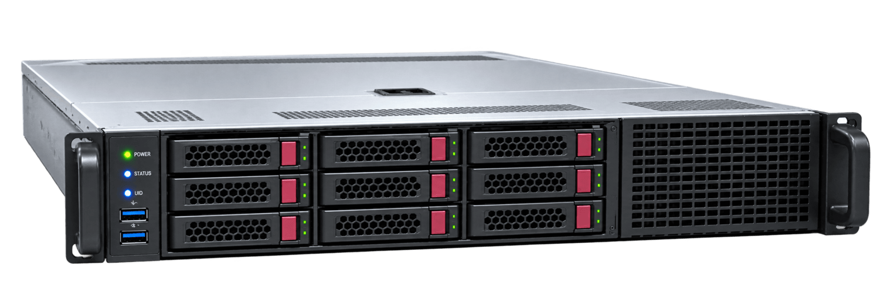

# Run a build server



Every Armbian image, kernel and u-boot package is compiled on the project's build fleet.
You can see [what it looks like today](../status/build-machinery.md) — servers, threads, memory and how many runners each one hosts.

Most of that fleet is **Armbian's own hardware and rented capacity, paid for out of project funds**, with a part contributed by companies and individuals who host a machine for us.

**It is not enough.**
Demand grows with every board Armbian supports, and the project does not have the resources to match what the community needs.
The build queue is what decides how quickly a fix reaches users, and it is longer than it should be.

So we are asking for help.
Every server someone hosts for us is capacity the project does not have to buy or rent, and queue time nobody has to wait through.

## What we are looking for

| | Minimum | Ideal |
|:--|:--|:--|
| CPU | 16 cores | **32 cores** |
| Memory | 64 GB | **128 GB** |
| Storage | 512 GB | **1 TB** |

Both `x86-64` and `arm64` are useful — a good part of the fleet is already ARM.

A server of this size hosts **several runners at once**, and that is what the storage is for: each runner keeps its own sources, build cache and output.
Speed matters as much as capacity — kernel builds are I/O heavy, so NVMe rather than spinning disk.

## What it will be used for

The server joins the fleet as one or more **self-hosted GitHub runners** and picks up jobs from the build pipeline — compiling kernels, u-boot and rootfs, and assembling images.
Nothing else runs on it.

## How to offer one

Install the **latest Ubuntu LTS** on the machine — that is what the rest of the fleet runs — and authorise our key for `root`:

```bash
mkdir -p /root/.ssh
curl -fsSL https://github.com/igorpecovnik.keys >> /root/.ssh/authorized_keys
chmod 700 /root/.ssh
chmod 600 /root/.ssh/authorized_keys
```

Then reach out through the [contact form](https://www.armbian.com/contact/) with the address, the specs and the location.
We will take it from there.

Hosting is credited on the [build machinery page](../status/build-machinery.md) alongside the rest of the fleet.

Thanks for helping keep Armbian building.
