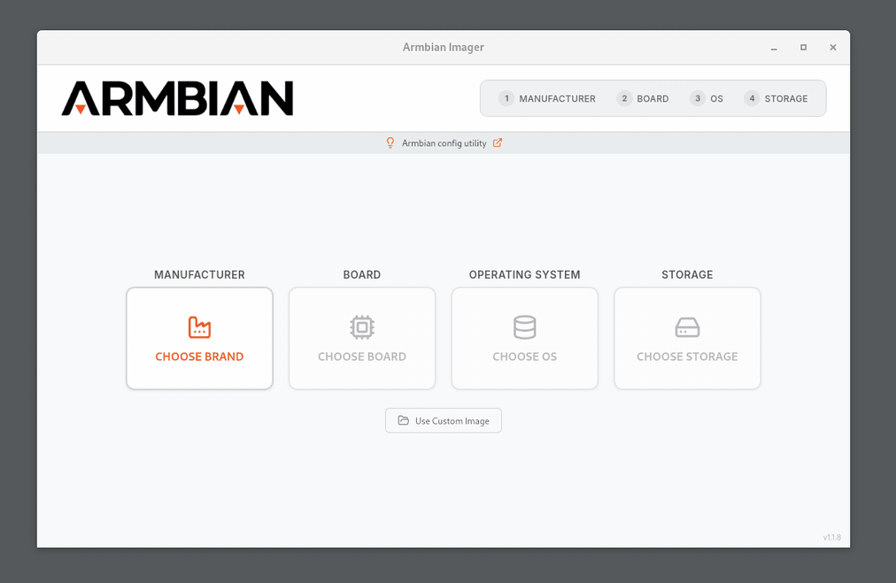

# Armbian Getting Started Guide

Before you start, please make sure you have:

- a proper power supply according to the board manufacturer's requirements <!-- TODO: link to power issues -->
- a reliable SD card — at least Class 10, A1-rated or better ([how to choose one](sd-cards.md))

You will also need an existing operating system and an SD card writer tool. We recommend using **[Armbian Imager](https://imager.armbian.com/)** — the official Armbian flashing tool.

Armbian Imager is a **lightweight, native flashing tool** that supports both **selecting and downloading an Armbian image before flashing**, as well as **flashing an already downloaded image**.

!!! warning

    Most boot and stability problems come from the **SD card** or the **power supply**, not the board — in over 95% of cases. Use a good, reliable, fast card and verify it before you rely on it. See [**Choosing an SD card**](sd-cards.md) for what to buy (A1/A2 explained), which brands qualify, how to avoid counterfeits, and how to check a card with F3 or H2testw.

!!! tip "New users"

    Some users might find it easier to follow this video tutorial.

    <iframe width="607" height="342" src="https://www.youtube.com/embed/hFrdyLc4g50" frameborder="0" allow="accelerometer; autoplay; clipboard-write; encrypted-media; gyroscope; picture-in-picture" allowfullscreen></iframe>

    Some word of advice, though. The video has been created a few years ago. You might therefore find differences between this video and our current site. So, in doubt, also follow the sections below while watching the video.

## The steps

This guide is split into stages. Work through them in order, or jump
straight to the one you need.

1. **[Choosing an Armbian image](choosing-an-image.md)** — Debian or Ubuntu, minimal, server or desktop, and which kernel branch.
2. **[Writing the image to media](writing-the-image.md)** — Armbian Imager to an SD card, or straight to eMMC, UFS or SPI.
3. **[First boot and login](first-boot-and-login.md)** — Power up, set the root password, create your user, get on the network.
4. **[First steps after login](first-steps.md)** — `armbian-config` for the basics, then preconfigured software titles.
5. **[Installing to internal storage](install-to-internal-storage.md)** — `armbian-install` moves the system off the SD card.
6. **[Keeping Armbian up to date](updating.md)** — APT for the OS, `armbian-install` for the boot loader.
7. **[If something goes wrong](troubleshooting.md)** — When a step fails, and how to report a real bug.

Start with **[Choosing an Armbian image](choosing-an-image.md)**.
