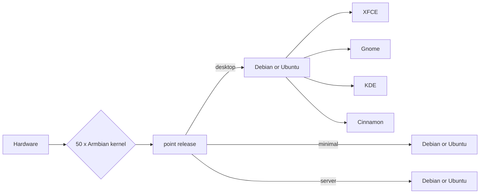

Linux for ARM development boards

## Preface

Welcome to the official documentation of Armbian Linux, a highly optimized base operating system specialized for single board computers (*SBCs*) and its extensive build framework.

### How is the documentation structured?

The table of contents in the sidebar and the links at the top of the page should let you easily access the documentation for your topic of interest.

If you are **new to Armbian**, the [_Introduction_](index.md) and the [_Getting Started_](User-Guide_Getting-Started.md) sections provide everything you need to know about the project, where to find the resources for your board, and a tutorial for everything you need to get Armbian running.

It then continues on to [_Configuration_](User-Guide_Configuration.md) tasks and tools to customize your installation, e.g. change the network address, start or stop services like SSH, or install one of the many prepared software stacks. This section and the links contained in it are useful to **all user levels**.

**Advanced users** will find more complex topics in the [_Advanced_](User-Guide_Advanced-Features.md) section, including how to customize your initial installation.

If you have read through the documentation and still **need help**, check out our [_Troubleshooting_](User-Guide_Troubleshooting.md) advice.

<!-- TODO: Changelog, Relases, Model, FAQ appendixes -->

### Where to find additional help?

If you still cannot find what you need here, visit the [_Armbian forum_](https://forum.armbian.com/) where your input can also help us improving this documentation.

### How to report a problem in this documentation?

If you come across an issue in these pages, you can either report it [here](https://github.com/armbian/documentation/issues), or follow [these instructions](https://github.com/armbian/documentation/blob/main/README.md) to suggest a fix yourself.

## What is Armbian?

Armbian's goal is to provide a **highly optimized base operating system specialized for single board computers**. It embodies extremely **lightweight** hardware features with a **well-known** and supported Debian-based user-space experience, an **extensive build framework**, and it is suitable for **industrial or home use**.

Armbian is **not** a Linux distribution itself. Instead, we use Debian GNU/Linux and Ubuntu Linux as base for the images, that our users can download and deploy. We build our own set of optimized kernels for each board, and then provide an extensive and customizable framework to build, adjust, and configure these images. This framework is the heart of the project.

### Key features

As a user, you can simply download one of our images, deploy and run it on your SBC. As an advanced user, a manufacturer or provider, you can create fully configured custom images for your board or product.

In any case, you will get these key advantages:

- you get a lean and standard **Debian** or **Ubuntu** based user space with the well known APT package manager
- we provide independent kernel development and maintenance with **long term support**
- we provide an extensive [build framework](https://github.com/armbian/build) with fast **hybrid assembly** of the whole operating system and **endless capabilities**
- we provide advanced **hardware and OS configuration** and **software installation** with the built-in [armbian-config](/User-Guide_Armbian-Config/) tool
- we provide exclusive support for **exotic hardware** that nobody else supports
- we provide **stabilized point** and **rolling** distribution of upgrades and OS images
- we provide a global download infrastructure with **perfect coverage, also in China mainland**
- we provide an **extensive build infrastructure** to assist in CI automation
- we do daily **automated stress and upgrade testing** on key hardware targets
- we have strong ties to embedded Linux

???+ "Other features and performance tweaks worth mentioning"

    - Images are highly compressed and automatically expand across the boot media at first boot
    - Preinstalled standard system utilities like BASH or ZSH shell
    - Login is possible via serial, HDMI/VGA or SSH
    - Custom login MOTD showing a collection of important information
    - `/var/log` is mounted as compressed device (zram, lzo) and the log2ram service saves the logs to disk daily and on shutdown
    - Half of the memory is allocated/extended for/with compressed zswap
    - `/tmp` is mounted as `tmpfs` (and can be optionally compressed)
    - Browser profile memory caching is enabled on desktop images
    - Optimized IO scheduler (check `/etc/init.d/armhwinfo`)
    - Journal data writeback is enabled (`/etc/fstab`)
    - Ethernet interrupts are using a dedicated core

### Comparison

<!-- TODO: where to??? -->

| Distributions | Armbian  | Downstream | Upstream |
| -------- | -------- | -------- |-------- |
| Primary focus     | making a value     | sales, profiting | making a value |
| User-space     | clean & minimal | bloated with proprietary scripts | clean |
| Experience across hardware | universal, predictable, reproducible | random, chaotic, manually assembled | porting, unofficial builds |
| Contributing to FOSS | extreme | close to none | great |
| System config | universal | proprietary | all / none |
| Maintenance | modular with review and unit tests | endless spaghetti code | traditional and modern |
| Build framework | advanced and user friendly | none | none |
| Hardware maintainers | 50+, teams per SoC, per vendor | none | none |
| Upstream contribution | 1000+ | none | little |
| Downstream projects | 10+ | none | 100+ |
| Switching to upstream | easy | impossible | / |
| User-space changes | standard | proprietary | standard |
| Initial memory usage | optimal | bad | bad |
| Process usage | optimal | only hidden | too broad |
| Pre-installed packages | optimized for fast install | makes install of anything slower | optimized for fast install |
| Declaring support | where we know maintainers | everything is "supported" | everything is "supported" |

## Which hardware is supported?

Armbian distributes stable images for many different single board computers (SBCs). But not each model receives the same amount of support and maintenance. This might be due to lack of man-power, lack of support by the manufacturer, etc. We have therefore a system that shows the support status for each board:

[Platinum Support](https://www.armbian.com/download/?device_support=Platinum%20support){ .md-button .md-button--primary }

At least one person is providing constant maintainance and support.

[Standard Support](https://www.armbian.com/download/?device_support=Standard%20support){ .md-button }

Support is not secured, but it is still overall good.

[Community maintained](https://www.armbian.com/download/?device_support=Community%20maintained){ .md-button }

Most of the images for boards in this category will also work, but no warranty can be given as Armbian does not monitor their status.

*Supported / maintained* is not a guarantee, though. It merely implies that a particular SBC is at a **high level of software maturity** and has a named maintainer. Due to the complexity and lack of cooperation in the ecosystem, it is unlikely that all specialized functionalities (like 3D, VE, I²C...) are always available.

For more information see the [Board Support Guide](User-Guide_Board-Support-Rules.md)

## Where to find images and sources?

Our main website is <https://www.armbian.com/>. It is the default site for our users, and it contains the download section with all images, information about the support status for each board, links to our forum and this documentation.

The project sources are hosted on [GitHub](https://github.com/armbian) and are organized in separate Git repositories. These are the resources for developers and participants, e.g. users helping with testing.

## How can you contribute?

<!-- tbw -->

## Software titles

You can quickly and easily install popular software! They are ready to run and optimized for Armbian. Here are few highlights:

- Desktops - install desktop environments
- Netconfig - network tools
- DevTools - development
- Benchy - system benchmaking and diagnostics
- Containers - containerization and virtual machines
- Media - media servers and editors
- Management - remote management tools

???+ success "Unit testing"

    All software targets and functions are automatically tested to catch as many problems as possible.

    
