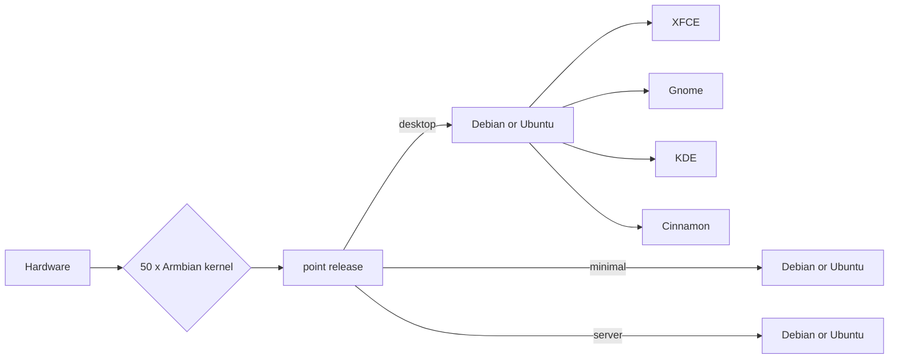

Linux for ARM development boards

# Welcome to the Armbian Documentation!

## What is Armbian?

Armbian is a **highly optimized base operating system specialized for single board computers**. It embodies extremely **lightweight** hardware features with **well-known** and supported Debian-based user-space experience, **extensive build framework** and is suitable for **industrial or home use**.

## Key Advantages

- lean and standard **Debian** or **Ubuntu** based user space with well known APT package manager
- independent kernel development and maintenance with **long term support**
- extensive [build framework](https://github.com/armbian/build) with fast **hybrid assembly** of whole operating system and **endless capabilities**
- advanced **hardware and OS config** and **software installation** with built-in [armbian-config](/User-Guide_Armbian-Config/)
- daily **automated stress and upgrade testing** on key hardware targets
- exclusive support of **exotic hardware** nobody else supports
- **stabilized point** and **rolling** distribution of upgrades and OS images
- world wide download infrastructure with **perfect coverage also in China mainland**
- **extensive build infrastructure** to assist CI automation
- strong ties to embedded Linux.

## Comparison

| Distributions | Armbian  | Downstream | Upstream |
| -------- | -------- | -------- |-------- |
| Primary focus     | making a value     | sales, profiting | making a value |
| User-space     | clean & minimal | bloated with proprietary scripts | clean |
| Experience across hardware | universal, predictable, reproducible | random, chaotic, manually assembled | porting, unofficial builds |
| Contributing to FOSS | extreme | close to none | great |
| System config | universal | proprietary | all / none |
| Maintenance | modular with review and unit tests | endless spaghetti code | traditional and modern |
| Build framework | advanced and user friendly | none | none |
| Hardware maintainers | 50+, teams per SoC, per vendor | none | none |
| Upstream contribution | 1000+ | none | little |
| Downstream projects | 10+ | none | 100+ |
| Switching to upstream | easy | impossible | / |
| User-space changes | standard | proprietary | standard |
| Initial memory usage | optimal | bad | bad |
| Process usage | optimal | only hidden | too broad |
| Pre-installed packages | optimized for fast install | makes install of anything slower | optimized for fast install |
| Declaring support | where we know maintainers | everything is "supported" | everything is "supported" |

???+ "Other features and performance tweaks worth mentioning"

    - Images are highly compressed and automatically expand across boot media at first boot
    - BASH or ZSH shell, preinstalled standard system utilities
    - login is possible via serial, HDMI/VGA or SSH
    - Login MOTD shows collection of important information
    - `/var/log` is mounted as compressed device (zram, lzo), log2ram service saves logs to disk daily and on shutdown
    - Half of memory is allocated/extended for/with compressed zswap
    - `/tmp` is mounted as `tmpfs` (optionally compressed)
    - Browser profile memory caching is enabled on desktop images
    - Optimized IO scheduler (check `/etc/init.d/armhwinfo`)
    - Journal data writeback enabled. (`/etc/fstab`)
    - ethernet interrupts are using dedicated core

## What is supported?

Armbian distributes stable images for maintained hardware through its own [mirror network](/Mirrors/). *Supported / maintained* is not a guarantee. It implies a particular SBC is at a **high level of software maturity** and has a named maintainer. Due to the complexity and lack of cooperation in the ecosystem it is unlikely that all specialized functionalities (like 3D, VE, I²C...) are always available.

## Support status

[Platinum Support](https://www.armbian.com/download/?device_support=Platinum%20support){ .md-button .md-button--primary }

At least one person providing maintainance and support.

[Standard Support](https://www.armbian.com/download/?device_support=Standard%20support){ .md-button }

Support is not secured but still good anything from this list.

[Community maintained](https://www.armbian.com/download/?device_support=Community%20maintained){ .md-button }

Most of those will also work, but no warranty as Armbian does not monitor their status.

For more information see the [Board Support Guide](User-Guide_Board-Support-Rules.md)

## Getting started

If you are **new to Armbian**, the [_Getting Started_](User-Guide_Getting-Started.md) section provides a tutorial for everything you need to know to get Armbian running. It then continues on to more advanced topics.

If you **need help** and have read through _Getting Started_ check out [_Troubleshooting_](User-Guide_Advanced-Features.md#how-to-troubleshoot).

If you still cannot find what you need here visit the [_Armbian forum_](https://forum.armbian.com/) where your input can help to improve this documentation.

## Software titles

You can quickly and easily install popular software! They are ready to run and optimized for Armbian. Here are few highlights:

- Desktops - install desktop environments
- Netconfig - network tools
- DevTools - development
- Benchy - system benchmaking and diagnostics
- Containers - containerization and virtual machines
- Media - media servers and editors
- Management - remote management tools

???+ success "Unit testing"

    All software targets and functions are automatically tested to catch as many problems as possible.

    
