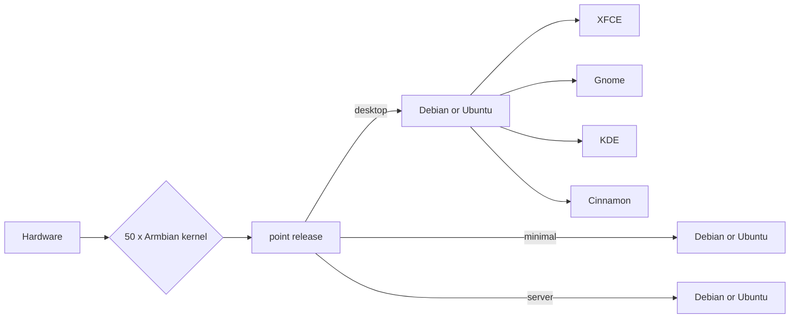

Linux for ARM development boards

# Welcome to the Armbian Documentation!

## What is Armbian?

Armbian is highly optimised base operating system specialised for single board computers.

It embodies extremely lightweight hardware features focused Debian-based distribution, extensive build framework and is suitable for industrial or home use.

## Key Advantages

- extreamly lean and standardised Debian-based user space
- extensive build framework with endless capabilities
- fast hybrid assembly of whole operating system
- independednt long term support
- advanced hardware and OS config (armbian-config)
- in house kernel development, improvement and maintaining
- daily automated stress and upgrade testing of key hardware targets
- exlusive support on exotic hardware
- installation is optional and simplifieds
- provides point releases and daily rolling distribution
- world wide download infrastructure with perfect coverage in China mainland
- 1000+ build runners to assist CI automation
- CI supports customized build list per each build target

???+ "Other features and performance tweaks"

    - Images are reduced to actual data size and automatically expand across boot media at first boot    
    - BASH or ZSH shell, preinstalled standard system utilities
    - login is possible via serial, HDMI/VGA or SSH
    - highly compressed distributed images
    - Upgrades are done via standard `apt upgrade` method
    - Login script shows: board name with large text, distribution base, kernel version, system load, uptime, memory usage, IP(v6) address, CPU and drive temperature, ZFS, rootfs usage, battery conditions and number of updates to install
    - `/var/log` is mounted as compressed device (zram, lzo), log2ram service saves logs to disk daily and on shutdown
    - Half of memory is allocated/extended for/with compressed swap
    - `/tmp` is mounted as `tmpfs` (optionally compressed)
    - Browser profile memory caching is enabled on desktop images
    - Optimized IO scheduler (check `/etc/init.d/armhwinfo`)
    - Journal data writeback enabled. (`/etc/fstab`)
    - ethernet interrupts are using dedicated core    

## What is supported?

Armbian distribute stable images for maintained boards through its [mirror network](https://github.com/armbian/mirror). *Supported / maintained* is not a guarantee. It has a named maintainer and implies a particular SBC is at a **high level of software maturity**. Due to the complexity and lack of cooperation in the ecosystem it is unlikely that all specialized functionalities (like 3D, VE, I²C...) are always available.

## Support statuses?

[Platinum Support](https://www.armbian.com/download/?device_support=Platinum%20support){ .md-button .md-button--primary }

At least one person providing maintainance and support.

[Standard Support](https://www.armbian.com/download/?device_support=Standard%20support){ .md-button }

Support is not secured but still good anything from this list.

[Community maintained](https://www.armbian.com/download/?device_support=Community%20maintained){ .md-button }

Most of those will also work, but no warranty as we don't monitor their status.

For more information is see the [Board Support Guide](User-Guide_Board-Support-Rules.md)

## Getting started?

If you are **new to Armbian**, the [_Getting Started_](User-Guide_Getting-Started.md) section provides a tutorial for everything you need to know to get Armbian running. It then continues on to more advanced topics.

If you **need help** and have read through _Getting Started_ check out [_Troubleshooting_](User-Guide_Advanced-Features.md#how-to-troubleshoot).

If you still cannot find what you need here visit the [_Armbian forum_](https://forum.armbian.com/) where your input can help to improve this documentation.

## Software titles

You can quickly and easily install popular software! They are ready to run and optimised for Armbian. Here are few highlights:

- Desktops - Install Desktop Environments
- Netconfig - Network tools
- DevTools - Development
- Benchy - System benchmaking and diagnostics
- Containers - Containerlization and Virtual Machines
- Media - Media Servers and Editors
- Management - Remote Management tools

???+ success "Unit testing"

    All software targets and functions are automatically tested to catch as many problems as possible.

    