# Tested boards

Every board in the Armbian test datacenter runs an automated pipeline — a nightly **upgrade**, a **reboot**, hardware **performance** and **DVFS** checks and a **network** throughput test — before being restored to the stable release. Boards are grouped **failures first**, each with its per-module results, timings and power shown inline; use the table of contents on the right to jump straight to a board. The set is the **current status**: the most recent test of every board.

The list is refreshed automatically by the Armbian autotests fleet: a scheduled job reads the fleet's rolling test results and opens a pull request to update this page — the same mechanism used for the [datacenter boards](/status/boards/) and [Wi-Fi performance](/status/wifi-performance/) pages.

Legend: ✅ pass · ❌ fail · ⏭️ skipped · ➖ not run.

<!-- FLEET-START -->

**63** boards — **53** passed, **10** failed. Most recent test of every board; failures first.

## ❌ Failed (10)

### ❌ BigTreeTech CB1 01

`bigtreetech-cb1` · **inplace** · image `26.11.0-trunk.54` · 1 ✅ · 2 ❌ · 13 ⏭️

| Module | Status | Time | Detail |
|:--|:--:|--:|:--|
| upgrade | ⏭️ | 132.2 s | — |
| reboot | ✅ | 242.4 s | power-cycle · up 25 s |
| kernel-switch | ❌ | 149.7 s | branch=current · phase=install · dpkg_state=absent |
| reboot | ❌ | 1485.7 s | power-cycle · 0/4 boots |
| hw-perf | ⏭️ | 0.0 s | board down after reboot/power-cycle |
| dvfs | ⏭️ | 0.0 s | — |
| net-iperf | ⏭️ | 0.0 s | board down after reboot/power-cycle |
| store-versions | ⏭️ | 0.0 s | — |
| kernel-switch | ⏭️ | 0.0 s | skipped=board down after reboot/power-cycle |
| reboot | ⏭️ | 0.0 s | reboot |
| hw-perf | ⏭️ | 0.0 s | board down after reboot/power-cycle |
| dvfs | ⏭️ | 0.0 s | — |
| net-iperf | ⏭️ | 0.0 s | board down after reboot/power-cycle |
| store-versions | ⏭️ | 0.0 s | — |
| kernel-switch | ⏭️ | 0.0 s | skipped=board down after reboot/power-cycle |
| reboot | ⏭️ | 0.0 s | reboot |

**Power** — min 1.00 W · avg 1.67 W · peak 3.30 W · 1633 samples

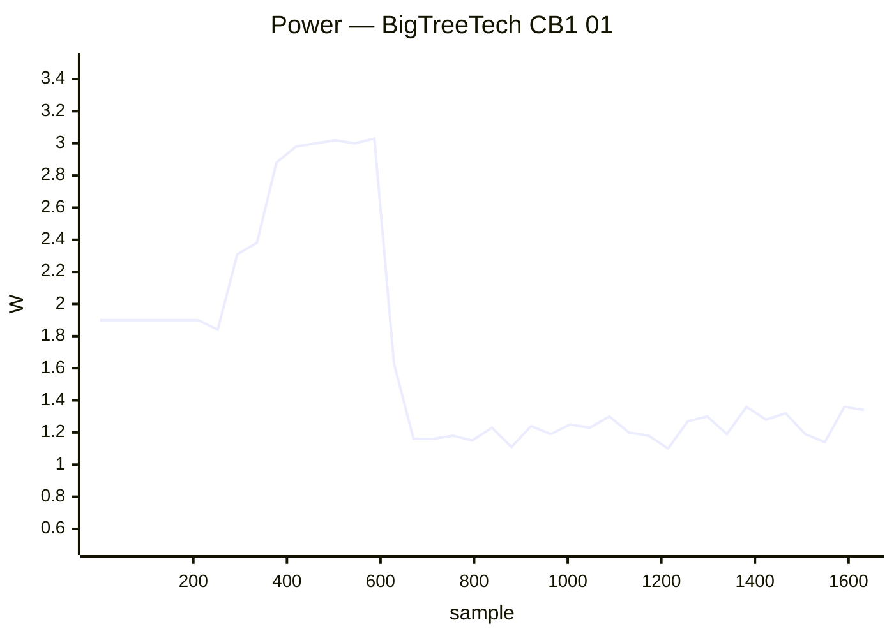
```mermaid
xychart-beta
    title "Power — BigTreeTech CB1 01"
    x-axis "sample" 1 --> 1633
    y-axis "W" 0.5 --> 3.5
    line [1.90, 1.90, 1.90, 1.90, 1.90, 1.90, 1.84, 2.31, 2.38, 2.88, 2.98, 3.00, 3.02, 3.00, 3.03, 1.63, 1.16, 1.16, 1.18, 1.15, 1.23, 1.11, 1.24, 1.19, 1.25, 1.23, 1.30, 1.20, 1.18, 1.10, 1.27, 1.30, 1.19, 1.36, 1.28, 1.32, 1.19, 1.14, 1.36, 1.34]
```

### ❌ Cubie A5E 01

`radxa-cubie-a5e` · **inplace** · image `26.11.0-trunk.54` · 10 ✅ · 3 ❌ · 3 ⏭️

| Module | Status | Time | Detail |
|:--|:--:|--:|:--|
| upgrade | ⏭️ | 303.3 s | — |
| reboot | ✅ | 66.9 s | power-cycle · up 32 s |
| kernel-switch | ❌ | 119.2 s | branch=current · phase=install · dpkg_state=absent |
| reboot | ✅ | 180.2 s | power-cycle · 4/4 boots · up 32 s |
| hw-performance | ✅ | 42.8 s | AES 358 · mem 2000 · disk W 1 / R 23 MB/s · 65.5 °C · None MHz |
| dvfs | ➖ | 2.9 s | no cpufreq |
| network-iperf | ✅ | 96.9 s | end0 ↑820/↓941 (1GE) · end1 ↑941/↓941 (1GE) · wlan0 ↑120/↓127 (Wi-Fi 6) Mbps |
| store-versions | ✅ | 6.1 s | 26.11.0-trunk.54 · 6.18.52-current-sunxi64 |
| kernel-switch | ❌ | 119.3 s | branch=edge · phase=install · dpkg_state=absent |
| reboot | ✅ | 179.3 s | power-cycle · 4/4 boots · up 32 s |
| hw-performance | ✅ | 42.8 s | AES 358 · mem 2000 · disk W 21 / R 23 MB/s · 65.2 °C · None MHz |
| dvfs | ➖ | 3.3 s | no cpufreq |
| network-iperf | ✅ | 93.5 s | end0 ↑820/↓941 (1GE) · end1 ↑939/↓938 (1GE) · wlan0 ↑120/↓129 (Wi-Fi 6) Mbps |
| store-versions | ✅ | 6.8 s | 26.11.0-trunk.54 · 6.18.52-current-sunxi64 |
| kernel-switch | ❌ | 118.8 s | branch=current · phase=install · dpkg_state=absent |
| reboot | ✅ | 64.1 s | power-cycle · up 31 s |

**Power** — min 1.70 W · avg 3.51 W · peak 5.00 W · 1165 samples

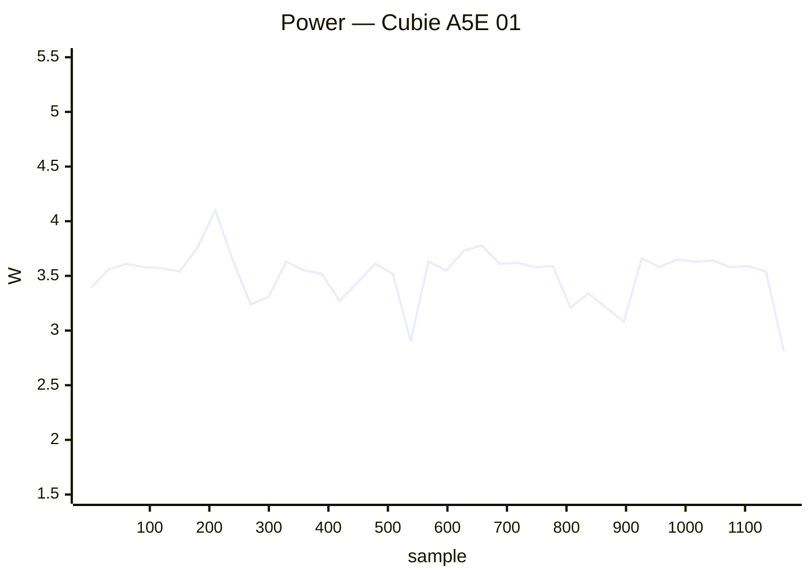
```mermaid
xychart-beta
    title "Power — Cubie A5E 01"
    x-axis "sample" 1 --> 1165
    y-axis "W" 1.5 --> 5.5
    line [3.39, 3.56, 3.61, 3.58, 3.57, 3.54, 3.76, 4.10, 3.64, 3.24, 3.31, 3.63, 3.55, 3.52, 3.27, 3.44, 3.61, 3.52, 2.90, 3.63, 3.55, 3.73, 3.78, 3.61, 3.62, 3.58, 3.59, 3.21, 3.34, 3.21, 3.08, 3.66, 3.58, 3.65, 3.63, 3.64, 3.58, 3.59, 3.54, 2.81]
```

### ❌ Inovato Quadra 01

`inovato-quadra` · **inplace** · image `26.8.3` · 9 ✅ · 1 ❌ · 6 ⏭️

| Module | Status | Time | Detail |
|:--|:--:|--:|:--|
| upgrade | ✅ | 211.1 s | nightly · 26.8.3 → 26.11.0-trunk.56 |
| reboot | ✅ | 40.5 s | warm · up 21 s |
| kernel-switch | ✅ | 39.6 s | branch=current · family=sunxi64 · installed=26.11.0-trunk.56 · boot_image=/boot/vmlinuz-6.18.53-current-sunxi64 · kernel_before=6.18.53-current-sunxi64 |
| reboot | ✅ | 125.5 s | warm · 4/4 boots · up 17 s |
| hw-performance | ✅ | 28.8 s | AES 794 · mem 3200 · disk W 22 / R 23 MB/s · 57 °C · 1704 MHz |
| dvfs | ✅ | 20.5 s | ondemand · 480–1704 MHz (peak 1704) |
| network-iperf | ✅ | 39.1 s | eth0 ↑94/↓94 (10/100ME) Mbps |
| store-versions | ✅ | 4.6 s | 26.11.0-trunk.56 · 6.18.53-current-sunxi64 |
| kernel-switch | ✅ | 110.1 s | branch=edge · family=sunxi64 · installed=26.11.0-trunk.56 · boot_image=/boot/vmlinuz-7.2.7-edge-sunxi64 · kernel_before=6.18.53-current-sunxi64 |
| reboot | ❌ | 214.5 s | warm · 0/4 boots |
| hw-perf | ⏭️ | 0.0 s | board down after reboot/power-cycle |
| dvfs | ⏭️ | 0.0 s | — |
| net-iperf | ⏭️ | 0.0 s | board down after reboot/power-cycle |
| store-versions | ⏭️ | 0.0 s | — |
| kernel-switch | ⏭️ | 0.0 s | skipped=board down after reboot/power-cycle |
| reboot | ⏭️ | 0.0 s | reboot |

### ❌ Mekotronics R58S2 01

`mekotronics-r58s2` · **inplace** · image `26.8.3` · 0 ✅ · 1 ❌ · 7 ⏭️

| Module | Status | Time | Detail |
|:--|:--:|--:|:--|
| upgrade | ⏭️ | 222.3 s | — |
| reboot | ❌ | 208.1 s | power-cycle |
| hw-perf | ⏭️ | 0.0 s | board down after reboot/power-cycle |
| dvfs | ⏭️ | 0.0 s | — |
| net-iperf | ⏭️ | 0.0 s | board down after reboot/power-cycle |
| restore-stable | ⏭️ | 0.0 s | — |
| reboot | ⏭️ | 0.0 s | reboot |
| store-versions | ⏭️ | 0.0 s | — |

### ❌ NanoPi R76S 01

`nanopi-r76s` · **inplace** · image `26.8.3` · 1 ✅ · 1 ❌ · 14 ⏭️

| Module | Status | Time | Detail |
|:--|:--:|--:|:--|
| upgrade | ✅ | 76.2 s | nightly · 26.8.3 → 26.11.0-trunk.56 |
| reboot | ❌ | 227.0 s | power-cycle |
| kernel-switch | ⏭️ | 0.0 s | skipped=board down after reboot/power-cycle |
| reboot | ⏭️ | 0.0 s | reboot |
| hw-perf | ⏭️ | 0.0 s | board down after reboot/power-cycle |
| dvfs | ⏭️ | 0.0 s | — |
| net-iperf | ⏭️ | 0.0 s | board down after reboot/power-cycle |
| store-versions | ⏭️ | 0.0 s | — |
| kernel-switch | ⏭️ | 0.0 s | skipped=board down after reboot/power-cycle |
| reboot | ⏭️ | 0.0 s | reboot |
| hw-perf | ⏭️ | 0.0 s | board down after reboot/power-cycle |
| dvfs | ⏭️ | 0.0 s | — |
| net-iperf | ⏭️ | 0.0 s | board down after reboot/power-cycle |
| store-versions | ⏭️ | 0.0 s | — |
| kernel-switch | ⏭️ | 0.0 s | skipped=board down after reboot/power-cycle |
| reboot | ⏭️ | 0.0 s | reboot |

### ❌ Odroid C1 01

`odroidc1` · **inplace** · image `26.8.0-trunk.314` · 0 ✅ · 1 ❌ · 0 ⏭️

| Module | Status | Time | Detail |
|:--|:--:|--:|:--|
| reachable | ❌ | 0.0 s | ip=10.0.50.27 · reachable=False · port=22 |

### ❌ Orange Pi 3 01

`orangepi3` · **inplace** · image `26.11.0-trunk.51` · 0 ✅ · 1 ❌ · 0 ⏭️

| Module | Status | Time | Detail |
|:--|:--:|--:|:--|
| reachable | ❌ | 0.0 s | ip=10.0.50.41 · reachable=False · port=22 |

### ❌ Orange Pi 5 01

`orangepi5` · **inplace** · image `26.11.0-trunk.35` · 0 ✅ · 1 ❌ · 0 ⏭️

| Module | Status | Time | Detail |
|:--|:--:|--:|:--|
| reachable | ❌ | 0.0 s | ip=10.0.50.18 · reachable=False · port=22 |

### ❌ Orange Pi Zero2 01

`orangepizero2` · **inplace** · image `26.11.0-trunk.56` · 14 ✅ · 2 ❌ · 0 ⏭️

| Module | Status | Time | Detail |
|:--|:--:|--:|:--|
| upgrade | ✅ | 84.5 s | nightly · 26.11.0-trunk.56 → 26.11.0-trunk.56 |
| reboot | ✅ | 47.6 s | power-cycle · up 19 s |
| kernel-switch | ❌ | 82.2 s | branch=current · family=sunxi64 · installed=26.11.0-trunk.56 · boot_image=/boot/vmlinuz-7.2.7-edge-sunxi64 · kernel_before=7.2.7-edge-sunxi64 |
| reboot | ✅ | 144.8 s | power-cycle · 4/4 boots · up 19 s |
| hw-performance | ✅ | 32.8 s | AES 705 · mem 3000 · disk W 21 / R 23 MB/s · 58.9 °C · 1512 MHz |
| dvfs | ✅ | 26.6 s | ondemand · 480–1512 MHz (peak 1512) |
| network-iperf | ✅ | 65.6 s | end0 ↑876/↓937 (1GE) · wlx7c023a625db1 ↑35/↓32 (Wi-Fi 5) Mbps |
| store-versions | ✅ | 5.8 s | 26.11.0-trunk.56 · 7.2.7-edge-sunxi64 |
| kernel-switch | ✅ | 83.0 s | branch=edge · family=sunxi64 · installed=26.11.0-trunk.56 · boot_image=/boot/vmlinuz-7.2.7-edge-sunxi64 · kernel_before=7.2.7-edge-sunxi64 |
| reboot | ✅ | 145.5 s | power-cycle · 4/4 boots · up 19 s |
| hw-performance | ✅ | 32.8 s | AES 705 · mem 3000 · disk W 21 / R 23 MB/s · 59 °C · 1512 MHz |
| dvfs | ✅ | 26.7 s | ondemand · 480–1512 MHz (peak 1512) |
| network-iperf | ✅ | 64.6 s | end0 ↑867/↓939 (1GE) · wlx7c023a625db1 ↑36/↓33 (Wi-Fi 5) Mbps |
| store-versions | ✅ | 5.9 s | 26.11.0-trunk.56 · 7.2.7-edge-sunxi64 |
| kernel-switch | ❌ | 82.0 s | branch=current · family=sunxi64 · installed=26.11.0-trunk.56 · boot_image=/boot/vmlinuz-7.2.7-edge-sunxi64 · kernel_before=7.2.7-edge-sunxi64 |
| reboot | ✅ | 47.2 s | power-cycle · up 19 s |

### ❌ RockPro 64 01

`rockpro64` · **inplace** · image `26.11.0-trunk.55` · 1 ✅ · 1 ❌ · 14 ⏭️

| Module | Status | Time | Detail |
|:--|:--:|--:|:--|
| upgrade | ✅ | 205.9 s | nightly · 26.11.0-trunk.55 → 26.11.0-trunk.56 |
| reboot | ❌ | 205.2 s | power-cycle |
| kernel-switch | ⏭️ | 0.0 s | skipped=board down after reboot/power-cycle |
| reboot | ⏭️ | 0.0 s | reboot |
| hw-perf | ⏭️ | 0.0 s | board down after reboot/power-cycle |
| dvfs | ⏭️ | 0.0 s | — |
| net-iperf | ⏭️ | 0.0 s | board down after reboot/power-cycle |
| store-versions | ⏭️ | 0.0 s | — |
| kernel-switch | ⏭️ | 0.0 s | skipped=board down after reboot/power-cycle |
| reboot | ⏭️ | 0.0 s | reboot |
| hw-perf | ⏭️ | 0.0 s | board down after reboot/power-cycle |
| dvfs | ⏭️ | 0.0 s | — |
| net-iperf | ⏭️ | 0.0 s | board down after reboot/power-cycle |
| store-versions | ⏭️ | 0.0 s | — |
| kernel-switch | ⏭️ | 0.0 s | skipped=board down after reboot/power-cycle |
| reboot | ⏭️ | 0.0 s | reboot |

## ✅ Passed (53)

### ✅ Arduino UNO Q 01

`arduino-uno-q` · **inplace** · image `26.11.0-trunk.54` · 8 ✅ · 0 ❌ · 0 ⏭️

| Module | Status | Time | Detail |
|:--|:--:|--:|:--|
| upgrade | ✅ | 238.3 s | nightly · 26.11.0-trunk.54 → 26.11.0-trunk.56 |
| reboot | ✅ | 56.3 s | warm · up 37 s |
| kernel-switch | ✅ | 46.8 s | branch=edge · family=qrb2210 · installed=26.11.0-trunk.56 · boot_image=? · kernel_before=7.2.3-edge-qrb2210 |
| reboot | ✅ | 196.5 s | warm · 4/4 boots · up 35 s |
| hw-performance | ✅ | 24.5 s | AES 940 · mem 5100 · disk W 168 / R 223 MB/s · 41.8 °C · 2016 MHz |
| dvfs | ✅ | 31.8 s | schedutil · 300–2016 MHz (peak 2016) |
| network-iperf | ✅ | 45.9 s | wlan0 ↑28/↓19 (Wi-Fi 5) · usb0 ↑?/↓? Mbps |
| store-versions | ✅ | 6.9 s | 26.11.0-trunk.56 · 7.2.3-edge-qrb2210 |

### ✅ Banana Pi CM4IO 01

`bananapicm4io` · **inplace** · image `26.8.3` · 14 ✅ · 2 ❌ · 0 ⏭️

| Module | Status | Time | Detail |
|:--|:--:|--:|:--|
| upgrade | ✅ | 56.1 s | nightly · 26.8.3 → 26.8.3 |
| reboot | ✅ | 41.0 s | power-cycle · up 18 s |
| kernel-switch | ✅ | 41.1 s | branch=current · family=meson64 · installed=26.11.0-trunk.56 · boot_image=/boot/vmlinuz-6.18.53-current-meson64 · kernel_before=6.18.53-current-meson64 |
| reboot | ✅ | 126.6 s | power-cycle · 4/4 boots · up 23 s |
| hw-performance | ✅ | 18.4 s | AES 852 · mem 3900 · disk W 37 / R 154 MB/s · 53.1 °C · 2016 MHz |
| dvfs | ✅ | 18.0 s | ondemand · 1000–1512 MHz (peak 1512) |
| network-iperf | ❌ | 277.1 s | eth0 ↑0/↓0 (1GE) · wlan0 ↑0/↓0 (Wi-Fi 5) Mbps |
| store-versions | ✅ | 4.6 s | 26.8.3 · 6.18.53-current-meson64 |
| kernel-switch | ✅ | 194.6 s | branch=edge · family=meson64 · installed=26.11.0-trunk.56 · boot_image=/boot/vmlinuz-7.2.7-edge-meson64 · kernel_before=6.18.53-current-meson64 |
| reboot | ✅ | 126.1 s | power-cycle · 4/4 boots · up 19 s |
| hw-performance | ✅ | 19.0 s | AES 853 · mem 3900 · disk W 27 / R 148 MB/s · 53.9 °C · 2016 MHz |
| dvfs | ✅ | 18.2 s | ondemand · 1000–1512 MHz (peak 1512) |
| network-iperf | ❌ | 298.0 s | eth0 ↑939/↓939 (1GE) · wlan0 ↑0/↓0 (Wi-Fi 5) Mbps |
| store-versions | ✅ | 3.9 s | 26.8.3 · 7.2.7-edge-meson64 |
| kernel-switch | ✅ | 192.1 s | branch=current · family=meson64 · installed=26.11.0-trunk.56 · boot_image=/boot/vmlinuz-6.18.53-current-meson64 · kernel_before=7.2.7-edge-meson64 |
| reboot | ✅ | 47.9 s | power-cycle · up 18 s |

### ✅ Banana Pi M2 Ultra 01

`bananapim2ultra` · **inplace** · image `26.11.0-trunk.54` · 16 ✅ · 0 ❌ · 0 ⏭️

| Module | Status | Time | Detail |
|:--|:--:|--:|:--|
| upgrade | ✅ | 387.5 s | nightly · 26.11.0-trunk.54 → 26.11.0-trunk.56 |
| reboot | ✅ | 43.5 s | warm · up 21 s |
| kernel-switch | ✅ | 69.5 s | branch=current · family=sunxi · installed=26.11.0-trunk.56 · boot_image=/boot/vmlinuz-6.18.53-current-sunxi · kernel_before=6.18.53-current-sunxi |
| reboot | ✅ | 147.4 s | warm · 4/4 boots · up 22 s |
| hw-performance | ✅ | 39.1 s | AES 23 · mem 2100 · disk W 1 / R 42 MB/s · 50.1 °C · 1200 MHz |
| dvfs | ✅ | 34.1 s | ondemand · 720–1200 MHz (peak 1200) |
| network-iperf | ✅ | 72.5 s | end0 ↑824/↓938 (1GE) · wlan0 ↑14/↓34 (Wi-Fi 4) Mbps |
| store-versions | ✅ | 7.5 s | 26.11.0-trunk.56 · 6.18.53-current-sunxi |
| kernel-switch | ✅ | 187.9 s | branch=edge · family=sunxi · installed=26.11.0-trunk.56 · boot_image=/boot/vmlinuz-7.2.7-edge-sunxi · kernel_before=6.18.53-current-sunxi |
| reboot | ✅ | 152.5 s | warm · 4/4 boots · up 20 s |
| hw-performance | ✅ | 40.9 s | AES 23 · mem 2000 · disk W 1 / R 42 MB/s · 49.9 °C · 1200 MHz |
| dvfs | ✅ | 37.0 s | ondemand · 720–1200 MHz (peak 1200) |
| network-iperf | ✅ | 77.2 s | end0 ↑817/↓941 (1GE) · wlan0 ↑14/↓31 (Wi-Fi 4) Mbps |
| store-versions | ✅ | 7.4 s | 26.11.0-trunk.56 · 7.2.7-edge-sunxi |
| kernel-switch | ✅ | 192.6 s | branch=current · family=sunxi · installed=26.11.0-trunk.56 · boot_image=/boot/vmlinuz-6.18.53-current-sunxi · kernel_before=7.2.7-edge-sunxi |
| reboot | ✅ | 44.9 s | warm · up 22 s |

### ✅ Banana Pi M2Pro 01

`bananapim2pro` · **inplace** · image `26.11.0-trunk.52` · 16 ✅ · 0 ❌ · 0 ⏭️

| Module | Status | Time | Detail |
|:--|:--:|--:|:--|
| upgrade | ✅ | 236.4 s | nightly · 26.11.0-trunk.52 → 26.11.0-trunk.56 |
| reboot | ✅ | 50.6 s | power-cycle · up 23 s |
| kernel-switch | ✅ | 37.9 s | branch=current · family=meson64 · installed=26.11.0-trunk.56 · boot_image=/boot/vmlinuz-6.18.53-current-meson64 · kernel_before=6.18.53-current-meson64 |
| reboot | ✅ | 144.3 s | power-cycle · 4/4 boots · up 23 s |
| hw-performance | ✅ | 34.2 s | AES 976 · mem 5300 · disk W 12 / R 15 MB/s · 50.4 °C · 2100 MHz |
| dvfs | ✅ | 19.7 s | ondemand · 1000–2100 MHz (peak 2100) |
| network-iperf | ✅ | 56.5 s | end0 ↑938/↓939 (1GE) · wlx60fb00480eb0 ↑171/↓202 (Wi-Fi 5) Mbps |
| store-versions | ✅ | 4.3 s | 26.11.0-trunk.56 · 6.18.53-current-meson64 |
| kernel-switch | ✅ | 134.7 s | branch=edge · family=meson64 · installed=26.11.0-trunk.56 · boot_image=/boot/vmlinuz-7.2.7-edge-meson64 · kernel_before=6.18.53-current-meson64 |
| reboot | ✅ | 162.6 s | power-cycle · 4/4 boots · up 23 s |
| hw-performance | ✅ | 42.5 s | AES 980 · mem 5300 · disk W 13 / R 15 MB/s · 50.6 °C · 2100 MHz |
| dvfs | ✅ | 19.9 s | ondemand · 1000–2100 MHz (peak 2100) |
| network-iperf | ✅ | 56.8 s | end0 ↑939/↓939 (1GE) · wlx60fb00480eb0 ↑189/↓222 (Wi-Fi 5) Mbps |
| store-versions | ✅ | 5.1 s | 26.11.0-trunk.56 · 7.2.7-edge-meson64 |
| kernel-switch | ✅ | 132.6 s | branch=current · family=meson64 · installed=26.11.0-trunk.56 · boot_image=/boot/vmlinuz-6.18.53-current-meson64 · kernel_before=7.2.7-edge-meson64 |
| reboot | ✅ | 49.3 s | power-cycle · up 22 s |

### ✅ Banana Pi M5 01

`bananapim5` · **inplace** · image `26.11.0-trunk.51` · 8 ✅ · 0 ❌ · 0 ⏭️

| Module | Status | Time | Detail |
|:--|:--:|--:|:--|
| upgrade | ✅ | 304.0 s | nightly · 26.11.0-trunk.51 → 26.11.0-trunk.54 |
| reboot | ✅ | 169.2 s | warm · up 154 s |
| kernel-switch | ✅ | 49.8 s | branch=current · family=meson64 · installed=26.11.0-trunk.54 · boot_image=vmlinuz-6.18.52-current-meson64 · kernel_before=6.18.52-current-meson64 |
| reboot | ✅ | 160.1 s | warm · up 145 s |
| hw-performance | ✅ | 38.5 s | AES 977 · mem 5300 · disk W 9 / R 16 MB/s · 55.6 °C · 2100 MHz |
| dvfs | ✅ | 21.3 s | ondemand · 1000–2100 MHz (peak 2100) |
| network-iperf | ✅ | 103.1 s | end0 ↑940/↓941 (1GE) · wlx000f13960190 ↑30/↓24 (Wi-Fi 4) Mbps |
| store-versions | ✅ | 5.3 s | 26.11.0-trunk.54 · 6.18.52-current-meson64 |

### ✅ Banana Pi M7 01

`bananapim7` · **inplace** · image `26.11.0-trunk.54` · 22 ✅ · 0 ❌ · 0 ⏭️

| Module | Status | Time | Detail |
|:--|:--:|--:|:--|
| upgrade | ✅ | 50.1 s | nightly · 26.11.0-trunk.54 → 26.11.0-trunk.56 |
| reboot | ✅ | 50.2 s | power-cycle · up 15 s |
| kernel-switch | ✅ | 19.1 s | branch=vendor · family=rk35xx · installed=26.11.0-trunk.56 · boot_image=/boot/vmlinuz-6.1.172-vendor-rk35xx · kernel_before=6.1.172-vendor-rk35xx |
| reboot | ✅ | 103.2 s | power-cycle · 4/4 boots · up 15 s |
| hw-performance | ✅ | 13.4 s | AES 1255 · mem 13700 · disk W 927 / R 1559 MB/s · 61.9 °C · 1800 MHz |
| dvfs | ✅ | 17.1 s | ondemand · 1800–1800 MHz (peak 2256) |
| network-iperf | ✅ | 28.3 s | enP2p33s0 ↑941/↓941 (1GE) Mbps |
| store-versions | ✅ | 4.1 s | 26.11.0-trunk.56 · 6.1.172-vendor-rk35xx |
| kernel-switch | ✅ | 51.0 s | branch=current · family=rockchip64 · installed=26.11.0-trunk.56 · boot_image=/boot/vmlinuz-6.18.53-current-rockchip64 · kernel_before=6.1.172-vendor-rk35xx |
| reboot | ✅ | 845.0 s | power-cycle · 3/4 boots · up 98 s |
| hw-performance | ✅ | 14.1 s | AES 1253 · mem 9900 · disk W 1062 / R 1558 MB/s · 63.8 °C · 1800 MHz |
| dvfs | ✅ | 14.7 s | ondemand · 408–1800 MHz (peak 2400) |
| network-iperf | ✅ | 30.8 s | enP2p33s0 ↑941/↓941 (1GE) Mbps |
| store-versions | ✅ | 4.7 s | 26.11.0-trunk.56 · 6.18.53-current-rockchip64 |
| kernel-switch | ✅ | 41.9 s | branch=edge · family=rockchip64 · installed=26.11.0-trunk.56 · boot_image=/boot/vmlinuz-7.2.7-edge-rockchip64 · kernel_before=6.18.53-current-rockchip64 |
| reboot | ✅ | 437.0 s | power-cycle · 4/4 boots · up 97 s |
| hw-performance | ✅ | 13.7 s | AES 1255 · mem 8000 · disk W 880 / R 1607 MB/s · 64.7 °C · 1800 MHz |
| dvfs | ✅ | 15.0 s | ondemand · 408–1800 MHz (peak 2400) |
| network-iperf | ✅ | 29.0 s | enP2p33s0 ↑941/↓941 (1GE) Mbps |
| store-versions | ✅ | 4.0 s | 26.11.0-trunk.56 · 7.2.7-edge-rockchip64 |
| kernel-switch | ✅ | 36.1 s | branch=vendor · family=rk35xx · installed=26.11.0-trunk.56 · boot_image=/boot/vmlinuz-6.1.172-vendor-rk35xx · kernel_before=7.2.7-edge-rockchip64 |
| reboot | ✅ | 42.5 s | power-cycle · up 15 s |

**Power** — min 1.00 W · avg 5.85 W · peak 12.20 W · 1480 samples

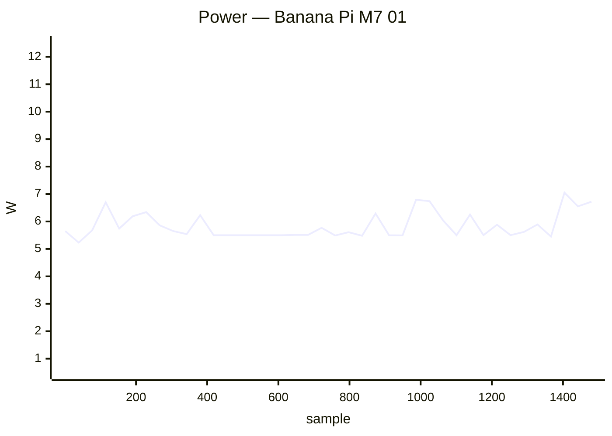
```mermaid
xychart-beta
    title "Power — Banana Pi M7 01"
    x-axis "sample" 1 --> 1480
    y-axis "W" 0.5 --> 12.5
    line [5.65, 5.23, 5.68, 6.70, 5.74, 6.19, 6.34, 5.86, 5.65, 5.54, 6.23, 5.50, 5.50, 5.50, 5.50, 5.50, 5.50, 5.51, 5.51, 5.77, 5.49, 5.61, 5.48, 6.29, 5.50, 5.49, 6.79, 6.74, 6.04, 5.50, 6.25, 5.50, 5.88, 5.50, 5.62, 5.89, 5.45, 7.05, 6.55, 6.72]
```

### ✅ Banana Pi R3 Mini 01

`bananapir3mini` · **inplace** · image `26.11.0-trunk` · 4 ✅ · 0 ❌ · 2 ⏭️

| Module | Status | Time | Detail |
|:--|:--:|--:|:--|
| upgrade | ⏭️ | 17.4 s | — |
| reboot | ✅ | 60.7 s | power-cycle · up 31 s |
| hw-performance | ✅ | 26.7 s | AES 935 · mem 3100 · disk W 78 / R 91 MB/s · 61.5 °C · None MHz |
| dvfs | ➖ | 2.9 s | no cpufreq |
| network-iperf | ✅ | 113.2 s | eth0 ↑938/↓919 (1GE) · eth1 ↑938/↓908 (1GE) · wlan0 ↑27/↓31 (Wi-Fi 6) · wlan1 ↑453/↓381 (Wi-Fi 6) Mbps |
| store-versions | ✅ | 4.7 s | 26.11.0-trunk · 6.18.52-current-filogic-mt7986 |

**Power** — min 3.00 W · avg 7.73 W · peak 13.40 W · 190 samples

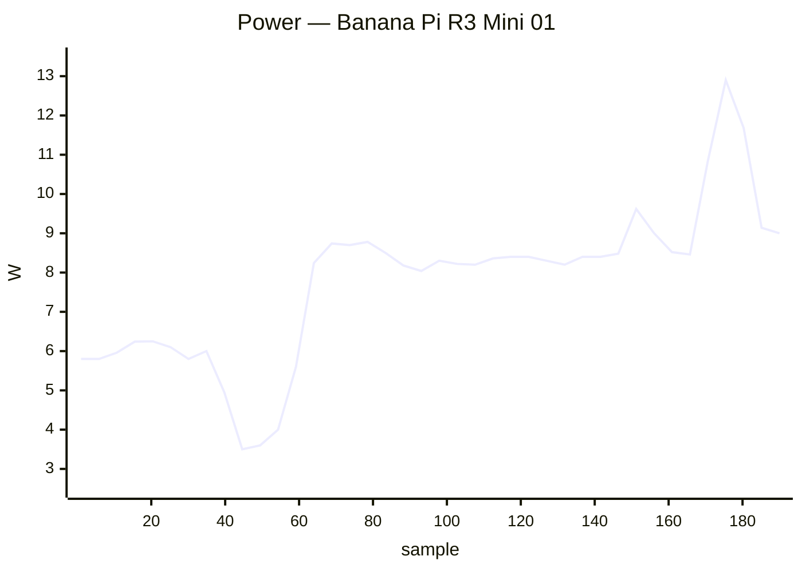
```mermaid
xychart-beta
    title "Power — Banana Pi R3 Mini 01"
    x-axis "sample" 1 --> 190
    y-axis "W" 2.5 --> 13.5
    line [5.80, 5.80, 5.96, 6.24, 6.25, 6.10, 5.80, 6.00, 4.95, 3.50, 3.60, 4.00, 5.60, 8.24, 8.74, 8.70, 8.78, 8.50, 8.18, 8.04, 8.30, 8.22, 8.20, 8.36, 8.40, 8.40, 8.30, 8.20, 8.40, 8.40, 8.48, 9.62, 9.00, 8.52, 8.46, 10.84, 12.90, 11.68, 9.14, 9.00]
```

### ✅ BananaPi BPI-F3 01

`bananapif3` · **inplace** · image `26.11.0-trunk.56` · 16 ✅ · 0 ❌ · 0 ⏭️

| Module | Status | Time | Detail |
|:--|:--:|--:|:--|
| upgrade | ✅ | 65.3 s | nightly · 26.11.0-trunk.56 → 26.11.0-trunk.56 |
| reboot | ✅ | 48.4 s | power-cycle · up 16 s |
| kernel-switch | ✅ | 43.7 s | branch=current · family=spacemit · installed=26.11.0-trunk.56 · boot_image=/boot/vmlinuz-6.18.53-current-spacemit · kernel_before=6.18.53-current-spacemit |
| reboot | ✅ | 133.4 s | power-cycle · 4/4 boots · up 17 s |
| hw-performance | ✅ | 22.3 s | AES 30 · mem 3400 · disk W 62 / R 83 MB/s · 58 °C · 1800 MHz |
| dvfs | ✅ | 23.2 s | performance · 614–1800 MHz (peak 1800) |
| network-iperf | ✅ | 88.7 s | eth0 ↑939/↓938 (1GE) · wlan0 ↑308/↓323 (Wi-Fi 6) · wlan1 ↑274/↓253 (Wi-Fi 5) Mbps |
| store-versions | ✅ | 5.1 s | 26.11.0-trunk.56 · 6.18.53-current-spacemit |
| kernel-switch | ✅ | 103.9 s | branch=edge · family=spacemit · installed=26.11.0-trunk.56 · boot_image=/boot/vmlinuz-7.2.7-edge-spacemit · kernel_before=6.18.53-current-spacemit |
| reboot | ✅ | 461.8 s | power-cycle · 4/4 boots · up 105 s |
| hw-performance | ✅ | 22.7 s | AES 27 · mem 5800 · disk W 60 / R 82 MB/s · 49 °C · 1600 MHz |
| dvfs | ✅ | 24.0 s | performance · 614–1600 MHz (peak 1600) |
| network-iperf | ✅ | 61.3 s | eth0 ↑939/↓939 (1GE) · wlan0 ↑239/↓238 (Wi-Fi 6) Mbps |
| store-versions | ✅ | 5.4 s | 26.11.0-trunk.56 · 7.2.7-edge-spacemit |
| kernel-switch | ✅ | 103.7 s | branch=current · family=spacemit · installed=26.11.0-trunk.56 · boot_image=/boot/vmlinuz-6.18.53-current-spacemit · kernel_before=7.2.7-edge-spacemit |
| reboot | ✅ | 48.0 s | power-cycle · up 17 s |

### ✅ Clearfog Pro 01

`clearfogpro` · **inplace** · image `26.11.0-trunk.56` · 14 ✅ · 0 ❌ · 2 ⏭️

| Module | Status | Time | Detail |
|:--|:--:|--:|:--|
| upgrade | ✅ | 59.2 s | nightly · 26.11.0-trunk.56 → 26.11.0-trunk.56 |
| reboot | ✅ | 40.6 s | warm · up 20 s |
| kernel-switch | ✅ | 104.1 s | branch=current · family=mvebu · installed=26.11.0-trunk.56 · boot_image=/boot/vmlinuz-6.18.53-current-mvebu · kernel_before=7.2.7-edge-mvebu |
| reboot | ✅ | 137.3 s | warm · 4/4 boots · up 19 s |
| hw-performance | ✅ | 41.6 s | AES 43 · mem 3800 · disk W 20 / R 23 MB/s · 64.2 °C · None MHz |
| dvfs | ➖ | 2.9 s | no cpufreq |
| network-iperf | ✅ | 34.6 s | lan2 ↑936/↓936 Mbps |
| store-versions | ✅ | 5.9 s | 26.11.0-trunk.56 · 6.18.53-current-mvebu |
| kernel-switch | ✅ | 101.2 s | branch=edge · family=mvebu · installed=26.11.0-trunk.56 · boot_image=/boot/vmlinuz-7.2.7-edge-mvebu · kernel_before=6.18.53-current-mvebu |
| reboot | ✅ | 138.1 s | warm · 4/4 boots · up 20 s |
| hw-performance | ✅ | 41.8 s | AES 43 · mem 3800 · disk W 21 / R 23 MB/s · 66.1 °C · None MHz |
| dvfs | ➖ | 2.9 s | no cpufreq |
| network-iperf | ✅ | 35.5 s | lan2 ↑936/↓936 Mbps |
| store-versions | ✅ | 6.0 s | 26.11.0-trunk.56 · 7.2.7-edge-mvebu |
| kernel-switch | ✅ | 102.3 s | branch=current · family=mvebu · installed=26.11.0-trunk.56 · boot_image=/boot/vmlinuz-6.18.53-current-mvebu · kernel_before=7.2.7-edge-mvebu |
| reboot | ✅ | 40.1 s | warm · up 20 s |

### ✅ Cubietruck 01

`cubietruck` · **inplace** · image `26.11.0-trunk.56` · 16 ✅ · 0 ❌ · 0 ⏭️

| Module | Status | Time | Detail |
|:--|:--:|--:|:--|
| upgrade | ✅ | 134.5 s | nightly · 26.11.0-trunk.56 → 26.11.0-trunk.56 |
| reboot | ✅ | 66.7 s | warm · up 41 s |
| kernel-switch | ✅ | 92.9 s | branch=current · family=sunxi · installed=26.11.0-trunk.56 · boot_image=/boot/vmlinuz-6.18.53-current-sunxi · kernel_before=6.18.53-current-sunxi |
| reboot | ✅ | 244.6 s | warm · 4/4 boots · up 43 s |
| hw-performance | ✅ | 59.9 s | AES 19 · mem 1700 · disk W 14 / R 21 MB/s · 49.4 °C · 960 MHz |
| dvfs | ✅ | 56.4 s | ondemand · 528–960 MHz (peak 960) |
| network-iperf | ✅ | 119.1 s | end0 ↑731/↓778 (1GE) · wlan0 ↑17/↓21 (Wi-Fi 4) Mbps |
| store-versions | ✅ | 12.0 s | 26.11.0-trunk.56 · 6.18.53-current-sunxi |
| kernel-switch | ✅ | 254.5 s | branch=edge · family=sunxi · installed=26.11.0-trunk.56 · boot_image=/boot/vmlinuz-7.2.7-edge-sunxi · kernel_before=6.18.53-current-sunxi |
| reboot | ✅ | 248.6 s | warm · 4/4 boots · up 43 s |
| hw-performance | ✅ | 61.1 s | AES 19 · mem 1700 · disk W 13 / R 22 MB/s · 49.7 °C · 960 MHz |
| dvfs | ✅ | 62.7 s | ondemand · 528–960 MHz (peak 960) |
| network-iperf | ✅ | 102.6 s | end0 ↑772/↓837 (1GE) · wlan0 ↑20/↓19 (Wi-Fi 4) Mbps |
| store-versions | ✅ | 12.1 s | 26.11.0-trunk.56 · 7.2.7-edge-sunxi |
| kernel-switch | ✅ | 246.2 s | branch=current · family=sunxi · installed=26.11.0-trunk.56 · boot_image=/boot/vmlinuz-6.18.53-current-sunxi · kernel_before=7.2.7-edge-sunxi |
| reboot | ✅ | 69.1 s | warm · up 44 s |

### ✅ Cubox i2eX/i4 01

`cubox-i` · **inplace** · image `26.11.0-trunk.56` · 16 ✅ · 0 ❌ · 0 ⏭️

| Module | Status | Time | Detail |
|:--|:--:|--:|:--|
| upgrade | ✅ | 107.9 s | nightly · 26.11.0-trunk.56 → 26.11.0-trunk.56 |
| reboot | ✅ | 60.4 s | power-cycle · up 30 s |
| kernel-switch | ✅ | 71.9 s | branch=current · family=imx6 · installed=26.11.0-trunk.56 · boot_image=/boot/vmlinuz-6.18.53-current-imx6 · kernel_before=6.18.53-current-imx6 |
| reboot | ✅ | 194.0 s | power-cycle · 4/4 boots · up 31 s |
| hw-performance | ✅ | 46.9 s | AES 26 · mem 750 · disk W 19 / R 20 MB/s · 55.4 °C · 996 MHz |
| dvfs | ✅ | 40.3 s | ondemand · 396–996 MHz (peak 996) |
| network-iperf | ✅ | 78.9 s | end0 ↑393/↓194 (1GE) · wlan0 ↑18/↓13 (Wi-Fi 4) Mbps |
| store-versions | ✅ | 8.8 s | 26.11.0-trunk.56 · 6.18.53-current-imx6 |
| kernel-switch | ✅ | 461.3 s | branch=edge · family=imx6 · installed=26.11.0-trunk.56 · boot_image=/boot/vmlinuz-7.1.13-edge-imx6 · kernel_before=6.18.53-current-imx6 |
| reboot | ✅ | 195.3 s | power-cycle · 4/4 boots · up 31 s |
| hw-performance | ✅ | 48.0 s | AES 26 · mem 743 · disk W 18 / R 20 MB/s · 56 °C · 996 MHz |
| dvfs | ✅ | 44.3 s | ondemand · 396–996 MHz (peak 996) |
| network-iperf | ✅ | 79.1 s | end0 ↑393/↓202 (1GE) · wlan0 ↑19/↓12 (Wi-Fi 4) Mbps |
| store-versions | ✅ | 9.4 s | 26.11.0-trunk.56 · 7.1.13-edge-imx6 |
| kernel-switch | ✅ | 449.2 s | branch=current · family=imx6 · installed=26.11.0-trunk.56 · boot_image=/boot/vmlinuz-6.18.53-current-imx6 · kernel_before=7.1.13-edge-imx6 |
| reboot | ✅ | 70.8 s | power-cycle · up 31 s |

### ✅ Espressobin 01

`espressobin` · **inplace** · image `26.11.0-trunk.56` · 16 ✅ · 0 ❌ · 0 ⏭️

| Module | Status | Time | Detail |
|:--|:--:|--:|:--|
| upgrade | ✅ | 112.9 s | nightly · 26.11.0-trunk.56 → 26.11.0-trunk.56 |
| reboot | ✅ | 72.6 s | power-cycle · up 42 s |
| kernel-switch | ✅ | 79.3 s | branch=current · family=mvebu64 · installed=26.11.0-trunk.56 · boot_image=/boot/vmlinuz-6.18.53-current-mvebu64 · kernel_before=6.18.53-current-mvebu64 |
| reboot | ✅ | 237.5 s | power-cycle · 4/4 boots · up 45 s |
| hw-performance | ✅ | 31.1 s | AES 371 · mem 2000 · disk W 31 / R 131 MB/s · None °C · 800 MHz |
| dvfs | ✅ | 33.9 s | ondemand · 200–800 MHz (peak 800) |
| network-iperf | ✅ | 38.5 s | lan0 ↑933/↓770 (1GE) Mbps |
| store-versions | ✅ | 7.3 s | 26.11.0-trunk.56 · 6.18.53-current-mvebu64 |
| kernel-switch | ✅ | 348.2 s | branch=edge · family=mvebu64 · installed=26.11.0-trunk.56 · boot_image=/boot/vmlinuz-7.1.13-edge-mvebu64 · kernel_before=6.18.53-current-mvebu64 |
| reboot | ✅ | 245.3 s | power-cycle · 4/4 boots · up 44 s |
| hw-performance | ✅ | 32.6 s | AES 371 · mem 2000 · disk W 66 / R 140 MB/s · None °C · 800 MHz |
| dvfs | ✅ | 35.3 s | ondemand · 200–800 MHz (peak 800) |
| network-iperf | ✅ | 38.8 s | lan0 ↑929/↓753 (1GE) Mbps |
| store-versions | ✅ | 7.5 s | 26.11.0-trunk.56 · 7.1.13-edge-mvebu64 |
| kernel-switch | ✅ | 345.7 s | branch=current · family=mvebu64 · installed=26.11.0-trunk.56 · boot_image=/boot/vmlinuz-6.18.53-current-mvebu64 · kernel_before=7.1.13-edge-mvebu64 |
| reboot | ✅ | 72.1 s | power-cycle · up 43 s |

### ✅ Helios4 01

`helios4` · **inplace** · image `26.11.0-trunk.56` · 14 ✅ · 0 ❌ · 2 ⏭️

| Module | Status | Time | Detail |
|:--|:--:|--:|:--|
| upgrade | ✅ | 60.3 s | nightly · 26.11.0-trunk.56 → 26.11.0-trunk.56 |
| reboot | ✅ | 118.9 s | warm · up 102 s |
| kernel-switch | ✅ | 35.2 s | branch=current · family=mvebu · installed=26.11.0-trunk.56 · boot_image=/boot/vmlinuz-6.18.53-current-mvebu · kernel_before=6.18.53-current-mvebu |
| reboot | ✅ | 462.2 s | warm · 4/4 boots · up 103 s |
| hw-performance | ✅ | 36.3 s | AES 43 · mem 3800 · disk W 21 / R 23 MB/s · 55.6 °C · None MHz |
| dvfs | ➖ | 2.3 s | no cpufreq |
| network-iperf | ✅ | 31.2 s | end1 ↑939/↓926 (1GE) Mbps |
| store-versions | ✅ | 5.6 s | 26.11.0-trunk.56 · 6.18.53-current-mvebu |
| kernel-switch | ✅ | 95.7 s | branch=edge · family=mvebu · installed=26.11.0-trunk.56 · boot_image=/boot/vmlinuz-7.2.7-edge-mvebu · kernel_before=6.18.53-current-mvebu |
| reboot | ✅ | 461.9 s | warm · 4/4 boots · up 103 s |
| hw-performance | ✅ | 36.8 s | AES 43 · mem 3800 · disk W 21 / R 23 MB/s · 55.6 °C · None MHz |
| dvfs | ➖ | 2.4 s | no cpufreq |
| network-iperf | ✅ | 32.3 s | end1 ↑922/↓920 (1GE) Mbps |
| store-versions | ✅ | 12.5 s | 26.11.0-trunk.56 · 7.2.7-edge-mvebu |
| kernel-switch | ✅ | 98.1 s | branch=current · family=mvebu · installed=26.11.0-trunk.56 · boot_image=/boot/vmlinuz-6.18.53-current-mvebu · kernel_before=7.2.7-edge-mvebu |
| reboot | ✅ | 119.3 s | warm · up 102 s |

### ✅ Khadas VIM1 01

`khadas-vim1` · **inplace** · image `26.8.0-trunk.236` · 7 ✅ · 1 ❌ · 0 ⏭️

| Module | Status | Time | Detail |
|:--|:--:|--:|:--|
| upgrade | ✅ | 182.5 s | nightly · 26.8.0-trunk.236 → 26.8.0-trunk.236 |
| reboot | ✅ | 32.7 s | warm · up 18 s |
| hw-performance | ✅ | 22.5 s | AES 658 · mem 3500 · disk W 43 / R 151 MB/s · 55 °C · 1512 MHz |
| dvfs | ✅ | 19.2 s | ondemand · 500–1512 MHz (peak 1512) |
| network-iperf | ❌ | 371.3 s | end0 ↑94/↓94 (10/100ME) · wlan0 ↑0/↓39 (Wi-Fi 5) Mbps |
| restore-stable | ✅ | 163.1 s | stable |
| reboot | ✅ | 33.1 s | warm · up 18 s |
| store-versions | ✅ | 5.3 s | 26.8.0-trunk.236 · 6.18.34-current-meson64 |

### ✅ Khadas VIM2 01

`khadas-vim2` · **inplace** · image `26.11.0-trunk.27` · 8 ✅ · 0 ❌ · 0 ⏭️

| Module | Status | Time | Detail |
|:--|:--:|--:|:--|
| upgrade | ✅ | 263.4 s | nightly · 26.11.0-trunk.27 → 26.11.0-trunk.27 |
| reboot | ✅ | 35.3 s | warm · up 17 s |
| hw-performance | ✅ | 24.2 s | AES 652 · mem 3600 · disk W 42 / R 149 MB/s · 56 °C · 1512 MHz |
| dvfs | ✅ | 26.0 s | ondemand · 500–1512 MHz (peak 1512) |
| network-iperf | ✅ | 72.2 s | eth0 ↑904/↓847 (1GE) · wlan0 ↑106/↓102 (Wi-Fi 5) Mbps |
| restore-stable | ✅ | 136.8 s | stable |
| reboot | ✅ | 35.4 s | warm · up 17 s |
| store-versions | ✅ | 5.7 s | 26.11.0-trunk.27 · 6.18.44-current-meson64 |

### ✅ Khadas VIM3 01

`khadas-vim3` · **inplace** · image `26.8.3` · 8 ✅ · 0 ❌ · 0 ⏭️

| Module | Status | Time | Detail |
|:--|:--:|--:|:--|
| upgrade | ✅ | 337.0 s | nightly · 26.8.3 → 26.11.0-trunk.35 |
| reboot | ✅ | 38.9 s | warm · up 20 s |
| hw-performance | ✅ | 31.1 s | AES 852 · mem 3900 · disk W 12 / R 22 MB/s · 45.2 °C · 2016 MHz |
| dvfs | ✅ | 17.7 s | ondemand · 1000–1512 MHz (peak 1512) |
| network-iperf | ✅ | 54.1 s | end0 ↑940/↓941 (1GE) · wlan0 ↑40/↓39 (Wi-Fi 5) Mbps |
| restore-stable | ✅ | 103.1 s | stable |
| reboot | ✅ | 38.1 s | warm · up 20 s |
| store-versions | ✅ | 3.9 s | 26.11.0-trunk.35 · 6.18.44-current-meson64 |

### ✅ Khadas VIM4 01

`khadas-vim4` · **inplace** · image `26.11.0-trunk.51` · 8 ✅ · 0 ❌ · 0 ⏭️

| Module | Status | Time | Detail |
|:--|:--:|--:|:--|
| upgrade | ✅ | 131.8 s | nightly · 26.11.0-trunk.51 → 26.11.0-trunk.54 |
| reboot | ✅ | 53.6 s | power-cycle · up 20 s |
| kernel-switch | ✅ | 24.3 s | branch=legacy · family=meson-s4t7 · installed=26.11.0-trunk.54 · boot_image=vmlinuz-5.15.137-legacy-meson-s4t7 · kernel_before=5.15.137-legacy-meson-s4t7 |
| reboot | ✅ | 52.8 s | power-cycle · up 19 s |
| hw-performance | ✅ | 19.8 s | AES 1246 · mem 6800 · disk W 106 / R 169 MB/s · 47.4 °C · 2208 MHz |
| dvfs | ✅ | 22.4 s | ondemand · 500–2208 MHz (peak 2208) |
| network-iperf | ✅ | 106.6 s | eth0 ↑927/↓935 (1GE) · wlan0 ↑5/↓2 (Wi-Fi 6) · wlan1 ↑77/↓3 (Wi-Fi 6) Mbps |
| store-versions | ✅ | 5.0 s | 26.11.0-trunk.54 · 5.15.137-legacy-meson-s4t7 |

**Power** — min 0.60 W · avg 3.93 W · peak 8.40 W · 336 samples

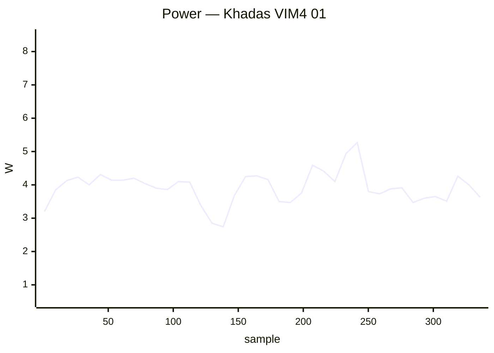
```mermaid
xychart-beta
    title "Power — Khadas VIM4 01"
    x-axis "sample" 1 --> 336
    y-axis "W" 0.5 --> 8.5
    line [3.20, 3.85, 4.13, 4.23, 4.00, 4.31, 4.14, 4.14, 4.20, 4.04, 3.90, 3.86, 4.10, 4.08, 3.38, 2.85, 2.74, 3.68, 4.25, 4.27, 4.16, 3.50, 3.47, 3.75, 4.59, 4.41, 4.10, 4.94, 5.27, 3.80, 3.73, 3.88, 3.91, 3.47, 3.60, 3.65, 3.51, 4.26, 4.00, 3.63]
```

### ✅ Mekotronics R58HD 01

`mekotronics-r58hd` · **inplace** · image `26.11.0-trunk.51` · 6 ✅ · 0 ❌ · 0 ⏭️

| Module | Status | Time | Detail |
|:--|:--:|--:|:--|
| upgrade | ✅ | 82.5 s | nightly · 26.11.0-trunk.51 → 26.11.0-trunk.54 |
| reboot | ✅ | 44.5 s | power-cycle · up 14 s |
| hw-performance | ✅ | 14.1 s | AES 1300 · mem 9300 · disk W 248 / R 289 MB/s · 51.8 °C · 1800 MHz |
| dvfs | ✅ | 16.7 s | ondemand · 1800–1800 MHz (peak 2304) |
| network-iperf | ✅ | 51.7 s | end0 ↑925/↓919 (1GE) · enP3p49s0 ↑938/↓909 (1GE) Mbps |
| store-versions | ✅ | 3.9 s | 26.11.0-trunk.54 · 6.1.172-vendor-rk35xx |

**Power** — min 3.60 W · avg 6.10 W · peak 11.80 W · 180 samples

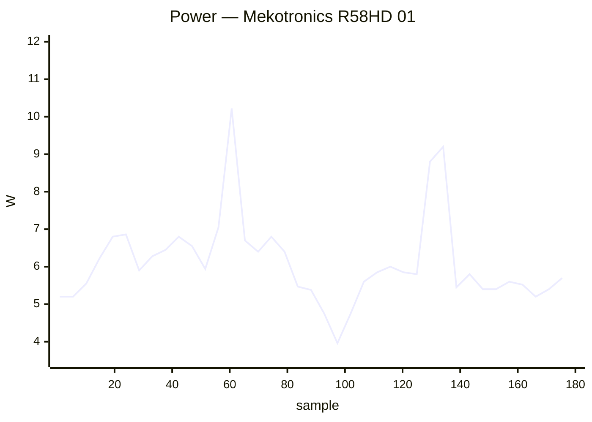
```mermaid
xychart-beta
    title "Power — Mekotronics R58HD 01"
    x-axis "sample" 1 --> 180
    y-axis "W" 3.5 --> 12.0
    line [5.20, 5.20, 5.55, 6.22, 6.80, 6.86, 5.90, 6.28, 6.45, 6.80, 6.55, 5.94, 7.05, 10.22, 6.70, 6.40, 6.80, 6.40, 5.47, 5.38, 4.75, 3.96, 4.75, 5.60, 5.85, 6.00, 5.85, 5.80, 8.80, 9.20, 5.45, 5.80, 5.40, 5.40, 5.60, 5.52, 5.20, 5.40, 5.70, 5.52]
```

### ✅ NanoPi Fire3 01

`nanopifire3` · **inplace** · image `26.11.0-trunk.54` · 7 ✅ · 0 ❌ · 1 ⏭️

| Module | Status | Time | Detail |
|:--|:--:|--:|:--|
| upgrade | ✅ | 474.8 s | nightly · 26.11.0-trunk.54 → 26.11.0-trunk.56 |
| reboot | ✅ | 70.1 s | power-cycle · up 38 s |
| kernel-switch | ✅ | 69.0 s | branch=edge · family=s5p6818 · installed=26.11.0-trunk.56 · boot_image=/boot/vmlinuz-7.2.7-edge-s5p6818 · kernel_before=7.2.7-edge-s5p6818 |
| reboot | ✅ | 164.7 s | power-cycle · 4/4 boots · up 15 s |
| hw-performance | ✅ | 42.8 s | AES 369 · mem 2000 · disk W 20 / R 22 MB/s · 68 °C · None MHz |
| dvfs | ➖ | 2.9 s | no cpufreq |
| network-iperf | ✅ | 34.7 s | eth0 ↑938/↓933 (1GE) Mbps |
| store-versions | ✅ | 5.9 s | 26.11.0-trunk.56 · 7.2.7-edge-s5p6818 |

### ✅ NanoPi K2 01

`nanopik2-s905` · **inplace** · image `26.11.0-trunk.56` · 16 ✅ · 0 ❌ · 0 ⏭️

| Module | Status | Time | Detail |
|:--|:--:|--:|:--|
| upgrade | ✅ | 65.6 s | nightly · 26.11.0-trunk.56 → 26.11.0-trunk.56 |
| reboot | ✅ | 40.4 s | warm · up 24 s |
| kernel-switch | ✅ | 41.3 s | branch=current · family=meson64 · installed=26.11.0-trunk.56 · boot_image=/boot/vmlinuz-6.18.53-current-meson64 · kernel_before=6.18.53-current-meson64 |
| reboot | ✅ | 129.9 s | warm · 4/4 boots · up 19 s |
| hw-performance | ✅ | 31.0 s | AES 51 · mem 3700 · disk W 11 / R 41 MB/s · 63 °C · 2016 MHz |
| dvfs | ✅ | 21.4 s | ondemand · 500–1536 MHz (peak 1536) |
| network-iperf | ✅ | 58.7 s | end0 ↑934/↓941 (1GE) · wlan0 ↑15/↓29 (Wi-Fi 4) Mbps |
| store-versions | ✅ | 4.7 s | 26.11.0-trunk.56 · 6.18.53-current-meson64 |
| kernel-switch | ✅ | 159.0 s | branch=edge · family=meson64 · installed=26.11.0-trunk.56 · boot_image=/boot/vmlinuz-7.2.7-edge-meson64 · kernel_before=6.18.53-current-meson64 |
| reboot | ✅ | 130.9 s | warm · 4/4 boots · up 19 s |
| hw-performance | ✅ | 32.1 s | AES 51 · mem 3700 · disk W 10 / R 40 MB/s · 64 °C · 2016 MHz |
| dvfs | ✅ | 22.4 s | ondemand · 500–1536 MHz (peak 1536) |
| network-iperf | ✅ | 64.1 s | end0 ↑935/↓941 (1GE) · wlan0 ↑15/↓19 (Wi-Fi 4) Mbps |
| store-versions | ✅ | 4.8 s | 26.11.0-trunk.56 · 7.2.7-edge-meson64 |
| kernel-switch | ✅ | 154.0 s | branch=current · family=meson64 · installed=26.11.0-trunk.56 · boot_image=/boot/vmlinuz-6.18.53-current-meson64 · kernel_before=7.2.7-edge-meson64 |
| reboot | ✅ | 38.2 s | warm · up 21 s |

### ✅ NanoPi M4V2 01

`nanopim4v2` · **inplace** · image `26.11.0-trunk.56` · 16 ✅ · 0 ❌ · 0 ⏭️

| Module | Status | Time | Detail |
|:--|:--:|--:|:--|
| upgrade | ✅ | 49.3 s | nightly · 26.11.0-trunk.56 → 26.11.0-trunk.56 |
| reboot | ✅ | 54.6 s | power-cycle · up 24 s |
| kernel-switch | ✅ | 29.8 s | branch=current · family=rockchip64 · installed=26.11.0-trunk.56 · boot_image=/boot/vmlinuz-6.18.53-current-rockchip64 · kernel_before=6.18.53-current-rockchip64 |
| reboot | ✅ | 161.7 s | power-cycle · 4/4 boots · up 26 s |
| hw-performance | ✅ | 21.5 s | AES 1021 · mem 6600 · disk W 55 / R 61 MB/s · 46.2 °C · 1416 MHz |
| dvfs | ✅ | 21.0 s | ondemand · 408–1416 MHz (peak 1800) |
| network-iperf | ✅ | 86.0 s | end0 ↑938/↓924 (1GE) · wlan0 ↑173/↓197 (Wi-Fi 5) · wlx803f5d16af63 ↑162/↓215 (Wi-Fi 5) Mbps |
| store-versions | ✅ | 4.7 s | 26.11.0-trunk.56 · 6.18.53-current-rockchip64 |
| kernel-switch | ✅ | 93.5 s | branch=edge · family=rockchip64 · installed=26.11.0-trunk.56 · boot_image=/boot/vmlinuz-7.2.7-edge-rockchip64 · kernel_before=6.18.53-current-rockchip64 |
| reboot | ✅ | 159.3 s | power-cycle · 4/4 boots · up 23 s |
| hw-performance | ✅ | 21.9 s | AES 1021 · mem 6600 · disk W 54 / R 60 MB/s · 46.2 °C · 1416 MHz |
| dvfs | ✅ | 20.3 s | ondemand · 408–1416 MHz (peak 1800) |
| network-iperf | ✅ | 86.5 s | end0 ↑939/↓939 (1GE) · wlan0 ↑77/↓69 (Wi-Fi 5) · wlx803f5d16af63 ↑159/↓218 (Wi-Fi 5) Mbps |
| store-versions | ✅ | 5.0 s | 26.11.0-trunk.56 · 7.2.7-edge-rockchip64 |
| kernel-switch | ✅ | 91.9 s | branch=current · family=rockchip64 · installed=26.11.0-trunk.56 · boot_image=/boot/vmlinuz-6.18.53-current-rockchip64 · kernel_before=7.2.7-edge-rockchip64 |
| reboot | ✅ | 54.7 s | power-cycle · up 24 s |

**Power** — min 2.50 W · avg 6.97 W · peak 12.20 W · 781 samples

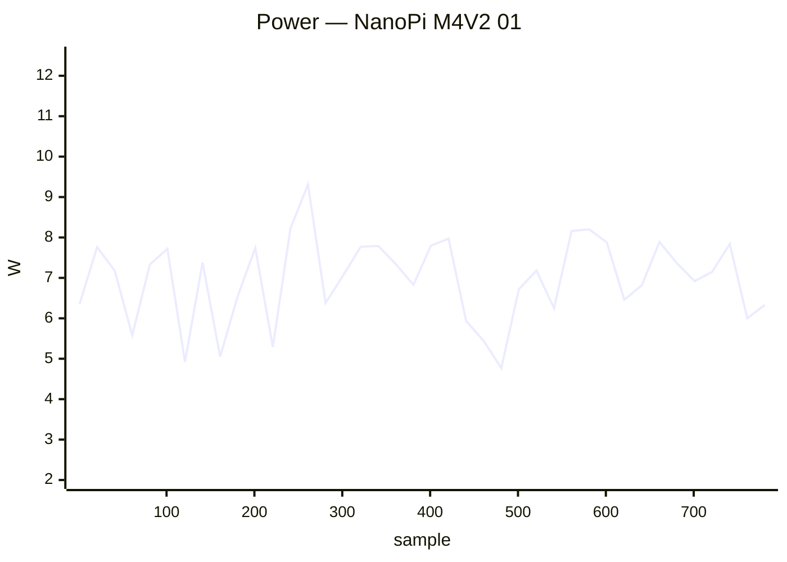
```mermaid
xychart-beta
    title "Power — NanoPi M4V2 01"
    x-axis "sample" 1 --> 781
    y-axis "W" 2.0 --> 12.5
    line [6.35, 7.76, 7.18, 5.58, 7.33, 7.72, 4.92, 7.38, 5.05, 6.55, 7.74, 5.29, 8.22, 9.31, 6.38, 7.06, 7.77, 7.79, 7.34, 6.83, 7.80, 7.97, 5.93, 5.44, 4.77, 6.72, 7.18, 6.25, 8.16, 8.20, 7.88, 6.46, 6.82, 7.89, 7.36, 6.92, 7.15, 7.84, 6.00, 6.33]
```

### ✅ NanoPi M5 01

`nanopi-m5` · **inplace** · image `26.11.0-trunk.56` · 22 ✅ · 0 ❌ · 0 ⏭️

| Module | Status | Time | Detail |
|:--|:--:|--:|:--|
| upgrade | ✅ | 39.8 s | nightly · 26.11.0-trunk.56 → 26.11.0-trunk.56 |
| reboot | ✅ | 48.1 s | power-cycle · up 23 s |
| kernel-switch | ✅ | 22.9 s | branch=vendor · family=rk35xx · installed=26.11.0-trunk.56 · boot_image=/boot/vmlinuz-6.1.172-vendor-rk35xx · kernel_before=6.1.172-vendor-rk35xx |
| reboot | ✅ | 137.9 s | power-cycle · 4/4 boots · up 22 s |
| hw-performance | ✅ | 18.1 s | AES 1275 · mem 8000 · disk W 68 / R 77 MB/s · 43.5 °C · 2016 MHz |
| dvfs | ✅ | 19.1 s | ondemand · 2016–2016 MHz (peak 2208) |
| network-iperf | ✅ | 106.1 s | end0 ↑939/↓939 (1GE) · end1 ↑939/↓939 (1GE) · wlan0 ↑44/↓87 (Wi-Fi 5) · wlx44334c47dec3 ↑39/↓22 (Wi-Fi 4) Mbps |
| store-versions | ✅ | 4.3 s | 26.11.0-trunk.56 · 6.1.172-vendor-rk35xx |
| kernel-switch | ✅ | 100.2 s | branch=current · family=rockchip64 · installed=26.11.0-trunk.56 · boot_image=/boot/vmlinuz-6.18.53-current-rockchip64 · kernel_before=6.1.172-vendor-rk35xx |
| reboot | ✅ | 152.5 s | power-cycle · 4/4 boots · up 29 s |
| hw-performance | ✅ | 26.4 s | AES 1326 · mem 9000 · disk W 20 / R 21 MB/s · 42.5 °C · 2016 MHz |
| dvfs | ✅ | 16.9 s | ondemand · 408–2016 MHz (peak 2208) |
| network-iperf | ✅ | 105.2 s | end0 ↑930/↓935 (1GE) · end1 ↑938/↓880 (1GE) · wlan0 ↑71/↓196 (Wi-Fi 5) · wlx44334c47dec3 ↑39/↓20 (Wi-Fi 4) Mbps |
| store-versions | ✅ | 3.9 s | 26.11.0-trunk.56 · 6.18.53-current-rockchip64 |
| kernel-switch | ✅ | 98.2 s | branch=edge · family=rockchip64 · installed=26.11.0-trunk.56 · boot_image=/boot/vmlinuz-7.2.7-edge-rockchip64 · kernel_before=6.18.53-current-rockchip64 |
| reboot | ✅ | 156.3 s | power-cycle · 4/4 boots · up 25 s |
| hw-performance | ✅ | 26.5 s | AES 1333 · mem 9000 · disk W 20 / R 21 MB/s · 43.5 °C · 2016 MHz |
| dvfs | ✅ | 18.1 s | ondemand · 408–2016 MHz (peak 2208) |
| network-iperf | ✅ | 107.3 s | end0 ↑927/↓936 (1GE) · end1 ↑922/↓883 (1GE) · wlan0 ↑113/↓108 (Wi-Fi 5) · wlx44334c47dec3 ↑40/↓12 (Wi-Fi 4) Mbps |
| store-versions | ✅ | 4.6 s | 26.11.0-trunk.56 · 7.2.7-edge-rockchip64 |
| kernel-switch | ✅ | 103.6 s | branch=vendor · family=rk35xx · installed=26.11.0-trunk.56 · boot_image=/boot/vmlinuz-6.1.172-vendor-rk35xx · kernel_before=7.2.7-edge-rockchip64 |
| reboot | ✅ | 131.8 s | power-cycle · up 108 s |

**Power** — min 0.70 W · avg 4.86 W · peak 9.30 W · 1176 samples

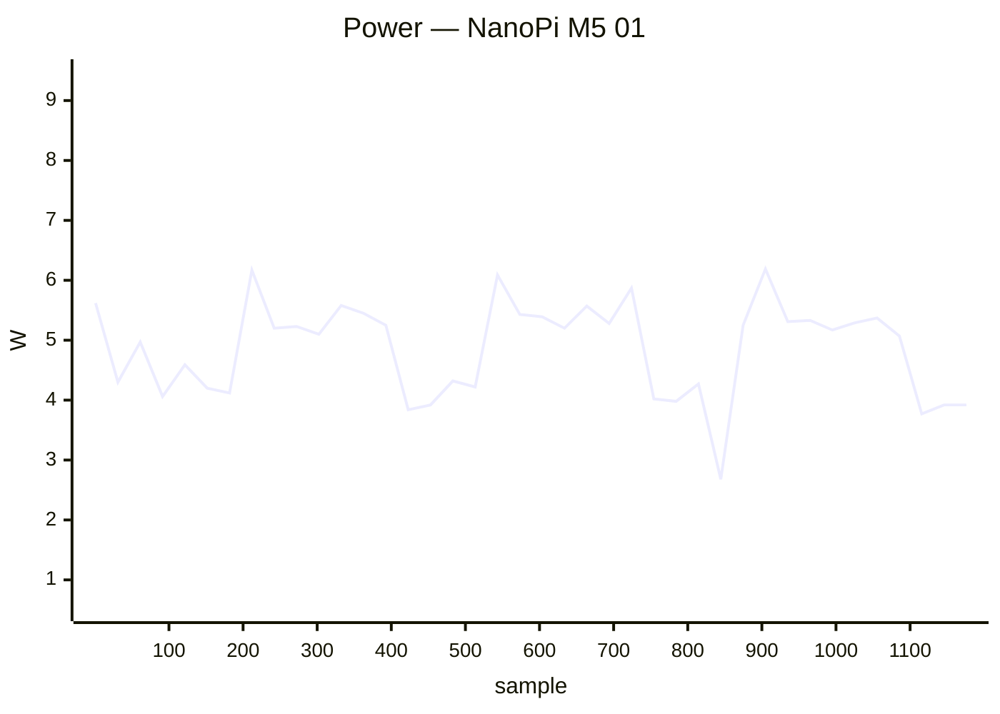
```mermaid
xychart-beta
    title "Power — NanoPi M5 01"
    x-axis "sample" 1 --> 1176
    y-axis "W" 0.5 --> 9.5
    line [5.62, 4.30, 4.97, 4.06, 4.59, 4.20, 4.12, 6.17, 5.20, 5.23, 5.10, 5.58, 5.45, 5.25, 3.84, 3.92, 4.32, 4.22, 6.09, 5.43, 5.39, 5.20, 5.57, 5.28, 5.87, 4.02, 3.98, 4.27, 2.68, 5.25, 6.19, 5.31, 5.33, 5.17, 5.29, 5.37, 5.07, 3.77, 3.92, 3.92]
```

### ✅ NanoPi M6 01

`nanopi-m6` · **inplace** · image `26.8.3` · 16 ✅ · 0 ❌ · 0 ⏭️

| Module | Status | Time | Detail |
|:--|:--:|--:|:--|
| upgrade | ✅ | 139.8 s | nightly · 26.8.3 → 26.11.0-trunk.54 |
| reboot | ✅ | 47.8 s | power-cycle · up 23 s |
| kernel-switch | ✅ | 20.8 s | branch=vendor · family=rk35xx · installed=26.11.0-trunk.54 · boot_image=vmlinuz-6.1.172-vendor-rk35xx · kernel_before=6.1.172-vendor-rk35xx |
| reboot | ✅ | 52.8 s | power-cycle · up 20 s |
| hw-performance | ✅ | 17.1 s | AES 1269 · mem 13600 · disk W 51 / R 78 MB/s · 48.1 °C · 1800 MHz |
| dvfs | ✅ | 17.7 s | ondemand · 1800–1800 MHz (peak 2256) |
| network-iperf | ✅ | 61.5 s | lan ↑908/↓937 (1GE) · wlP3p49s0 ↑3/↓27 (Wi-Fi 5) Mbps |
| store-versions | ✅ | 3.9 s | 26.11.0-trunk.54 · 6.1.172-vendor-rk35xx |
| kernel-switch | ✅ | 95.6 s | branch=current · family=rockchip64 · installed=26.11.0-trunk.54 · boot_image=vmlinuz-6.18.52-current-rockchip64 · kernel_before=6.1.172-vendor-rk35xx |
| reboot | ✅ | 52.6 s | power-cycle · up 21 s |
| hw-performance | ✅ | 19.5 s | AES 1214 · mem 9900 · disk W 47 / R 58 MB/s · 49.9 °C · 1800 MHz |
| dvfs | ✅ | 16.1 s | ondemand · 408–1800 MHz (peak 2400) |
| network-iperf | ✅ | 57.3 s | lan ↑937/↓892 (1GE) · wlP3p49s0 ↑127/↓185 (Wi-Fi 5) Mbps |
| store-versions | ✅ | 4.0 s | 26.11.0-trunk.54 · 6.18.52-current-rockchip64 |
| kernel-switch | ✅ | 66.5 s | branch=vendor · family=rk35xx · installed=26.11.0-trunk.54 · boot_image=vmlinuz-6.1.172-vendor-rk35xx · kernel_before=6.18.52-current-rockchip64 |
| reboot | ✅ | 53.3 s | power-cycle · up 20 s |

**Power** — min 0.80 W · avg 3.82 W · peak 10.30 W · 569 samples

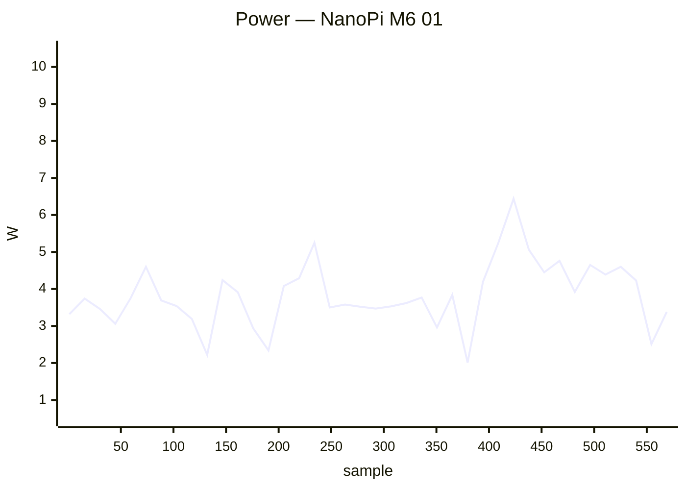
```mermaid
xychart-beta
    title "Power — NanoPi M6 01"
    x-axis "sample" 1 --> 569
    y-axis "W" 0.5 --> 10.5
    line [3.32, 3.74, 3.46, 3.06, 3.75, 4.60, 3.69, 3.54, 3.19, 2.22, 4.24, 3.91, 2.94, 2.34, 4.08, 4.29, 5.25, 3.50, 3.58, 3.52, 3.47, 3.53, 3.62, 3.77, 2.96, 3.84, 2.01, 4.19, 5.24, 6.44, 5.06, 4.45, 4.76, 3.92, 4.65, 4.39, 4.60, 4.23, 2.51, 3.38]
```

### ✅ NanoPi Neo 2 Black 01

`nanopineo2black` · **inplace** · image `26.11.0-trunk.56` · 16 ✅ · 0 ❌ · 0 ⏭️

| Module | Status | Time | Detail |
|:--|:--:|--:|:--|
| upgrade | ✅ | 80.5 s | nightly · 26.11.0-trunk.56 → 26.11.0-trunk.56 |
| reboot | ✅ | 46.2 s | power-cycle · up 20 s |
| kernel-switch | ✅ | 45.5 s | branch=current · family=sunxi64 · installed=26.11.0-trunk.56 · boot_image=/boot/vmlinuz-6.18.53-current-sunxi64 · kernel_before=6.18.53-current-sunxi64 |
| reboot | ✅ | 364.1 s | power-cycle · 3/4 boots · up 22 s |
| hw-performance | ✅ | 30.6 s | AES 638 · mem 3500 · disk W 19 / R 0 MB/s · 63.5 °C · 1368 MHz |
| dvfs | ✅ | 23.4 s | ondemand · 480–1368 MHz (peak 1368) |
| network-iperf | ✅ | 34.7 s | end0 ↑847/↓879 (1GE) Mbps |
| store-versions | ✅ | 5.0 s | 26.11.0-trunk.56 · 6.18.53-current-sunxi64 |
| kernel-switch | ✅ | 122.3 s | branch=edge · family=sunxi64 · installed=26.11.0-trunk.56 · boot_image=/boot/vmlinuz-7.2.7-edge-sunxi64 · kernel_before=6.18.53-current-sunxi64 |
| reboot | ✅ | 354.4 s | power-cycle · 3/4 boots · up 21 s |
| hw-performance | ✅ | 31.0 s | AES 637 · mem 3500 · disk W 18 / R 0 MB/s · 64.2 °C · 1368 MHz |
| dvfs | ✅ | 24.0 s | ondemand · 480–1368 MHz (peak 1368) |
| network-iperf | ✅ | 34.9 s | end0 ↑874/↓903 (1GE) Mbps |
| store-versions | ✅ | 5.3 s | 26.11.0-trunk.56 · 7.2.7-edge-sunxi64 |
| kernel-switch | ✅ | 124.2 s | branch=current · family=sunxi64 · installed=26.11.0-trunk.56 · boot_image=/boot/vmlinuz-6.18.53-current-sunxi64 · kernel_before=7.2.7-edge-sunxi64 |
| reboot | ✅ | 49.1 s | power-cycle · up 21 s |

### ✅ NanoPi Neo 3 01

`nanopineo3` · **inplace** · image `26.11.0-trunk.56` · 16 ✅ · 0 ❌ · 0 ⏭️

| Module | Status | Time | Detail |
|:--|:--:|--:|:--|
| upgrade | ✅ | 83.3 s | nightly · 26.11.0-trunk.56 → 26.11.0-trunk.56 |
| reboot | ✅ | 55.3 s | power-cycle · up 26 s |
| kernel-switch | ✅ | 57.7 s | branch=current · family=rockchip64 · installed=26.11.0-trunk.56 · boot_image=/boot/vmlinuz-6.18.53-current-rockchip64 · kernel_before=6.18.53-current-rockchip64 |
| reboot | ✅ | 167.7 s | power-cycle · 4/4 boots · up 25 s |
| hw-performance | ✅ | 28.4 s | AES 597 · mem 2400 · disk W 1 / R 63 MB/s · 79.2 °C · 1296 MHz |
| dvfs | ✅ | 29.9 s | ondemand · 408–1296 MHz (peak 1296) |
| network-iperf | ✅ | 68.0 s | end0 ↑920/↓941 (1GE) · wlx7cdd905518f9 ↑36/↓25 (Wi-Fi 4) Mbps |
| store-versions | ✅ | 6.4 s | 26.11.0-trunk.56 · 6.18.53-current-rockchip64 |
| kernel-switch | ✅ | 172.4 s | branch=edge · family=rockchip64 · installed=26.11.0-trunk.56 · boot_image=/boot/vmlinuz-7.2.7-edge-rockchip64 · kernel_before=6.18.53-current-rockchip64 |
| reboot | ✅ | 162.3 s | power-cycle · 4/4 boots · up 25 s |
| hw-performance | ✅ | 28.7 s | AES 599 · mem 2400 · disk W 1 / R 63 MB/s · 81.5 °C · 1296 MHz |
| dvfs | ✅ | 31.7 s | ondemand · 408–1296 MHz (peak 1296) |
| network-iperf | ✅ | 68.8 s | end0 ↑885/↓941 (1GE) · wlx7cdd905518f9 ↑31/↓24 (Wi-Fi 4) Mbps |
| store-versions | ✅ | 16.1 s | 26.11.0-trunk.56 · 7.2.7-edge-rockchip64 |
| kernel-switch | ✅ | 169.3 s | branch=current · family=rockchip64 · installed=26.11.0-trunk.56 · boot_image=/boot/vmlinuz-6.18.53-current-rockchip64 · kernel_before=7.2.7-edge-rockchip64 |
| reboot | ✅ | 57.1 s | power-cycle · up 27 s |

### ✅ NanoPi R6S 01

`nanopi-r6s` · **inplace** · image `26.11.0-trunk.56` · 22 ✅ · 0 ❌ · 0 ⏭️

| Module | Status | Time | Detail |
|:--|:--:|--:|:--|
| upgrade | ✅ | 26.6 s | nightly · 26.11.0-trunk.56 → 26.11.0-trunk.56 |
| reboot | ✅ | 39.9 s | power-cycle · up 14 s |
| kernel-switch | ✅ | 18.8 s | branch=vendor · family=rk35xx · installed=26.11.0-trunk.56 · boot_image=/boot/vmlinuz-6.1.172-vendor-rk35xx · kernel_before=6.1.172-vendor-rk35xx |
| reboot | ✅ | 93.2 s | power-cycle · 4/4 boots · up 10 s |
| hw-performance | ✅ | 14.6 s | AES 1273 · mem 13900 · disk W 211 / R 274 MB/s · 37 °C · 1800 MHz |
| dvfs | ✅ | 17.1 s | ondemand · 1800–1800 MHz (peak 2256) |
| network-iperf | ✅ | 28.8 s | lan2 ↑939/↓939 (1GE) Mbps |
| store-versions | ✅ | 3.8 s | 26.11.0-trunk.56 · 6.1.172-vendor-rk35xx |
| kernel-switch | ✅ | 49.6 s | branch=current · family=rockchip64 · installed=26.11.0-trunk.56 · boot_image=/boot/vmlinuz-6.18.53-current-rockchip64 · kernel_before=6.1.172-vendor-rk35xx |
| reboot | ✅ | 106.5 s | power-cycle · 4/4 boots · up 10 s |
| hw-performance | ✅ | 15.2 s | AES 1278 · mem 10300 · disk W 146 / R 151 MB/s · 37.9 °C · 1800 MHz |
| dvfs | ✅ | 14.5 s | ondemand · 408–1800 MHz (peak 2400) |
| network-iperf | ✅ | 28.5 s | lan2 ↑939/↓939 (1GE) Mbps |
| store-versions | ✅ | 4.2 s | 26.11.0-trunk.56 · 6.18.53-current-rockchip64 |
| kernel-switch | ✅ | 43.1 s | branch=edge · family=rockchip64 · installed=26.11.0-trunk.56 · boot_image=/boot/vmlinuz-7.2.7-edge-rockchip64 · kernel_before=6.18.53-current-rockchip64 |
| reboot | ✅ | 103.3 s | power-cycle · 4/4 boots · up 14 s |
| hw-performance | ✅ | 15.3 s | AES 1272 · mem 8100 · disk W 147 / R 151 MB/s · 38.8 °C · 1800 MHz |
| dvfs | ✅ | 15.9 s | ondemand · 408–1800 MHz (peak 2400) |
| network-iperf | ✅ | 28.9 s | lan2 ↑939/↓939 (1GE) Mbps |
| store-versions | ✅ | 4.1 s | 26.11.0-trunk.56 · 7.2.7-edge-rockchip64 |
| kernel-switch | ✅ | 39.8 s | branch=vendor · family=rk35xx · installed=26.11.0-trunk.56 · boot_image=/boot/vmlinuz-6.1.172-vendor-rk35xx · kernel_before=7.2.7-edge-rockchip64 |
| reboot | ✅ | 37.9 s | power-cycle · up 12 s |

**Power** — min 0.60 W · avg 4.39 W · peak 10.70 W · 600 samples

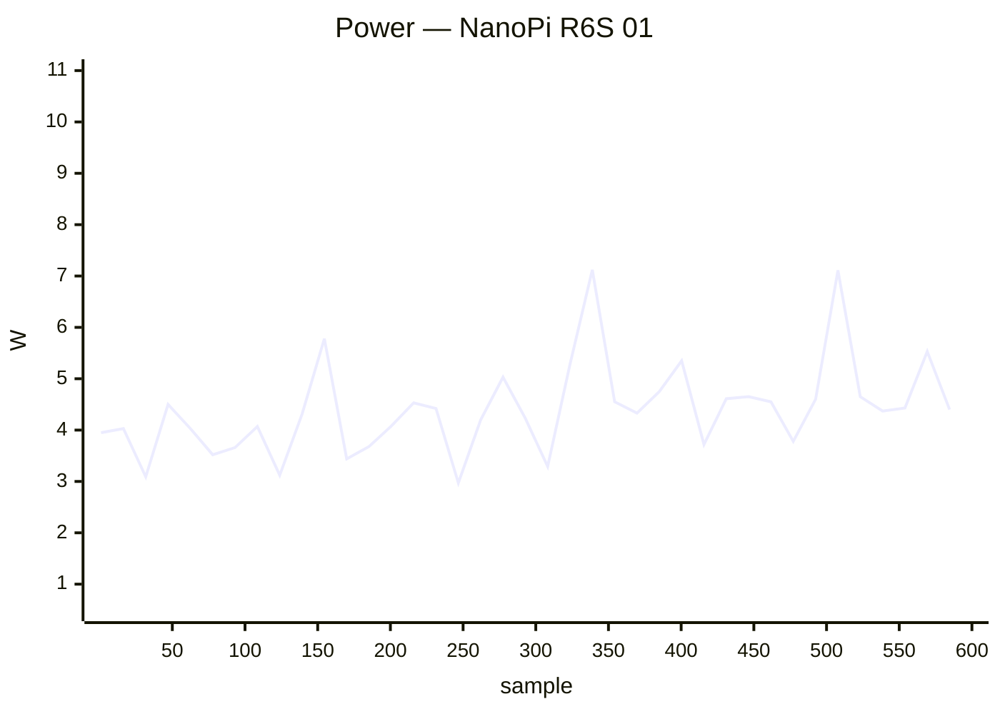
```mermaid
xychart-beta
    title "Power — NanoPi R6S 01"
    x-axis "sample" 1 --> 600
    y-axis "W" 0.5 --> 11.0
    line [3.95, 4.03, 3.09, 4.50, 4.03, 3.52, 3.66, 4.07, 3.12, 4.31, 5.78, 3.44, 3.68, 4.08, 4.53, 4.42, 2.97, 4.20, 5.03, 4.23, 3.29, 5.28, 7.12, 4.55, 4.33, 4.75, 5.35, 3.72, 4.61, 4.65, 4.55, 3.78, 4.60, 7.11, 4.65, 4.37, 4.43, 5.53, 4.40, 4.05]
```

### ✅ Odroid C2 01

`odroidc2` · **inplace** · image `26.11.0-trunk.54` · 16 ✅ · 0 ❌ · 0 ⏭️

| Module | Status | Time | Detail |
|:--|:--:|--:|:--|
| upgrade | ✅ | 205.8 s | nightly · 26.11.0-trunk.54 → 26.11.0-trunk.56 |
| reboot | ✅ | 33.7 s | warm · up 17 s |
| kernel-switch | ✅ | 37.4 s | branch=current · family=meson64 · installed=26.11.0-trunk.56 · boot_image=/boot/vmlinuz-6.18.53-current-meson64 · kernel_before=6.18.53-current-meson64 |
| reboot | ✅ | 114.9 s | warm · 4/4 boots · up 15 s |
| hw-performance | ✅ | 22.4 s | AES 51 · mem 3500 · disk W 32 / R 152 MB/s · 45 °C · 1536 MHz |
| dvfs | ✅ | 22.1 s | ondemand · 500–1536 MHz (peak 1536) |
| network-iperf | ✅ | 34.0 s | end0 ↑940/↓941 (1GE) Mbps |
| store-versions | ✅ | 4.9 s | 26.11.0-trunk.56 · 6.18.53-current-meson64 |
| kernel-switch | ✅ | 114.9 s | branch=edge · family=meson64 · installed=26.11.0-trunk.56 · boot_image=/boot/vmlinuz-7.2.7-edge-meson64 · kernel_before=6.18.53-current-meson64 |
| reboot | ✅ | 117.7 s | warm · 4/4 boots · up 17 s |
| hw-performance | ✅ | 22.5 s | AES 51 · mem 3500 · disk W 33 / R 152 MB/s · 47 °C · 1536 MHz |
| dvfs | ✅ | 22.3 s | ondemand · 500–1536 MHz (peak 1536) |
| network-iperf | ✅ | 31.2 s | end0 ↑941/↓941 (1GE) Mbps |
| store-versions | ✅ | 5.1 s | 26.11.0-trunk.56 · 7.2.7-edge-meson64 |
| kernel-switch | ✅ | 113.0 s | branch=current · family=meson64 · installed=26.11.0-trunk.56 · boot_image=/boot/vmlinuz-6.18.53-current-meson64 · kernel_before=7.2.7-edge-meson64 |
| reboot | ✅ | 33.2 s | warm · up 16 s |

### ✅ Odroid C4 01

`odroidc4` · **inplace** · image `26.11.0-trunk.54` · 16 ✅ · 0 ❌ · 0 ⏭️

| Module | Status | Time | Detail |
|:--|:--:|--:|:--|
| upgrade | ✅ | 187.8 s | nightly · 26.11.0-trunk.54 → 26.11.0-trunk.56 |
| reboot | ✅ | 47.5 s | power-cycle · up 17 s |
| kernel-switch | ✅ | 30.0 s | branch=current · family=meson64 · installed=26.11.0-trunk.56 · boot_image=/boot/vmlinuz-6.18.53-current-meson64 · kernel_before=6.18.53-current-meson64 |
| reboot | ✅ | 129.0 s | power-cycle · 4/4 boots · up 17 s |
| hw-performance | ✅ | 21.7 s | AES 980 · mem 5200 · disk W 31 / R 78 MB/s · 41.5 °C · 2100 MHz |
| dvfs | ✅ | 19.1 s | ondemand · 1000–2100 MHz (peak 2100) |
| network-iperf | ✅ | 57.2 s | end0 ↑938/↓871 (1GE) · wlx24050fdd332b ↑118/↓127 (Wi-Fi 4) Mbps |
| store-versions | ✅ | 4.9 s | 26.11.0-trunk.56 · 6.18.53-current-meson64 |
| kernel-switch | ✅ | 108.2 s | branch=edge · family=meson64 · installed=26.11.0-trunk.56 · boot_image=/boot/vmlinuz-7.2.7-edge-meson64 · kernel_before=6.18.53-current-meson64 |
| reboot | ✅ | 131.5 s | power-cycle · 4/4 boots · up 17 s |
| hw-performance | ✅ | 21.8 s | AES 980 · mem 5200 · disk W 30 / R 77 MB/s · 41.4 °C · 2100 MHz |
| dvfs | ✅ | 19.7 s | ondemand · 1000–2100 MHz (peak 2100) |
| network-iperf | ✅ | 57.5 s | end0 ↑891/↓917 (1GE) · wlx24050fdd332b ↑102/↓129 (Wi-Fi 4) Mbps |
| store-versions | ✅ | 4.3 s | 26.11.0-trunk.56 · 7.2.7-edge-meson64 |
| kernel-switch | ✅ | 105.5 s | branch=current · family=meson64 · installed=26.11.0-trunk.56 · boot_image=/boot/vmlinuz-6.18.53-current-meson64 · kernel_before=7.2.7-edge-meson64 |
| reboot | ✅ | 50.6 s | power-cycle · up 17 s |

**Power** — min 1.00 W · avg 3.47 W · peak 5.20 W · 805 samples

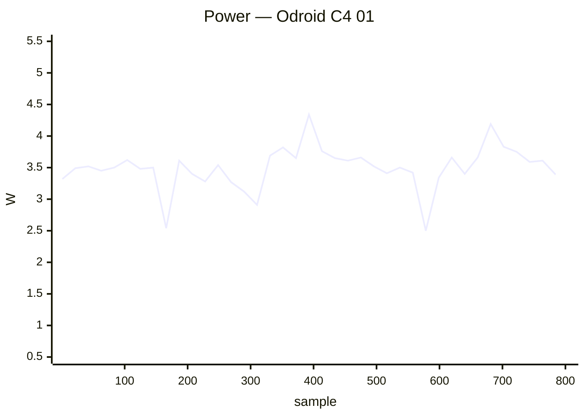
```mermaid
xychart-beta
    title "Power — Odroid C4 01"
    x-axis "sample" 1 --> 805
    y-axis "W" 0.5 --> 5.5
    line [3.32, 3.49, 3.52, 3.45, 3.50, 3.62, 3.48, 3.50, 2.54, 3.61, 3.40, 3.28, 3.54, 3.27, 3.12, 2.91, 3.69, 3.82, 3.65, 4.34, 3.76, 3.65, 3.61, 3.66, 3.52, 3.41, 3.50, 3.42, 2.50, 3.34, 3.66, 3.40, 3.66, 4.19, 3.83, 3.75, 3.59, 3.61, 3.39, 2.36]
```

### ✅ Odroid M1 01

`odroidm1` · **inplace** · image `26.11.0-trunk.54` · 16 ✅ · 0 ❌ · 0 ⏭️

| Module | Status | Time | Detail |
|:--|:--:|--:|:--|
| upgrade | ✅ | 143.0 s | nightly · 26.11.0-trunk.54 → 26.11.0-trunk.56 |
| reboot | ✅ | 55.9 s | power-cycle · up 24 s |
| kernel-switch | ✅ | 31.5 s | branch=current · family=rockchip64 · installed=26.11.0-trunk.56 · boot_image=/boot/vmlinuz-6.18.53-current-rockchip64 · kernel_before=6.18.53-current-rockchip64 |
| reboot | ✅ | 137.8 s | power-cycle · 4/4 boots · up 24 s |
| hw-performance | ✅ | 17.0 s | AES 916 · mem 5100 · disk W 1025 / R 1012 MB/s · 35.6 °C · 1992 MHz |
| dvfs | ✅ | 20.9 s | ondemand · 408–1992 MHz (peak 1992) |
| network-iperf | ✅ | 58.9 s | eth0 ↑556/↓941 (1GE) · wlx40a5eff39254 ↑207/↓227 (Wi-Fi 5) Mbps |
| store-versions | ✅ | 4.6 s | 26.11.0-trunk.56 · 6.18.53-current-rockchip64 |
| kernel-switch | ✅ | 86.1 s | branch=edge · family=rockchip64 · installed=26.11.0-trunk.56 · boot_image=/boot/vmlinuz-7.2.7-edge-rockchip64 · kernel_before=6.18.53-current-rockchip64 |
| reboot | ✅ | 142.2 s | power-cycle · 4/4 boots · up 24 s |
| hw-performance | ✅ | 17.8 s | AES 915 · mem 5100 · disk W 1047 / R 1025 MB/s · 35.6 °C · 1992 MHz |
| dvfs | ✅ | 22.8 s | ondemand · 408–1992 MHz (peak 1992) |
| network-iperf | ✅ | 59.2 s | eth0 ↑941/↓941 (1GE) · wlx40a5eff39254 ↑207/↓221 (Wi-Fi 5) Mbps |
| store-versions | ✅ | 4.9 s | 26.11.0-trunk.56 · 7.2.7-edge-rockchip64 |
| kernel-switch | ✅ | 86.9 s | branch=current · family=rockchip64 · installed=26.11.0-trunk.56 · boot_image=/boot/vmlinuz-6.18.53-current-rockchip64 · kernel_before=7.2.7-edge-rockchip64 |
| reboot | ✅ | 57.7 s | power-cycle · up 22 s |

**Power** — min 0.60 W · avg 6.39 W · peak 11.50 W · 752 samples

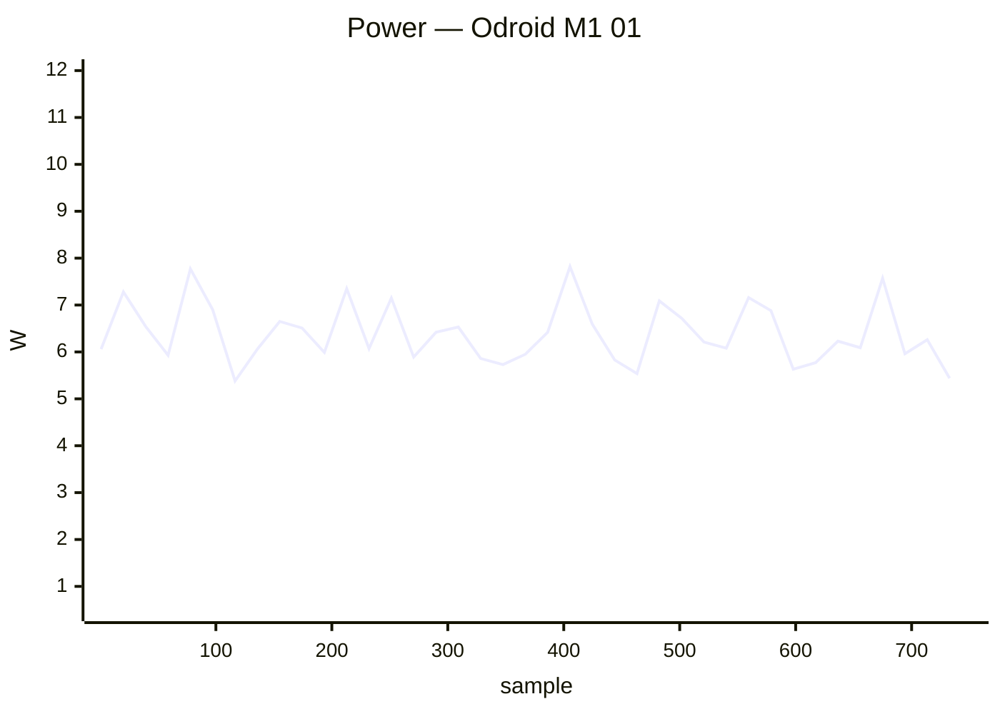
```mermaid
xychart-beta
    title "Power — Odroid M1 01"
    x-axis "sample" 1 --> 752
    y-axis "W" 0.5 --> 12.0
    line [6.06, 7.28, 6.54, 5.93, 7.77, 6.90, 5.38, 6.06, 6.65, 6.51, 5.99, 7.35, 6.07, 7.15, 5.89, 6.42, 6.53, 5.86, 5.73, 5.95, 6.42, 7.82, 6.59, 5.83, 5.54, 7.09, 6.72, 6.21, 6.08, 7.16, 6.88, 5.63, 5.77, 6.23, 6.09, 7.57, 5.96, 6.26, 5.44, 6.43]
```

### ✅ Odroid N2 01

`odroidn2` · **inplace** · image `26.11.0-trunk.54` · 16 ✅ · 0 ❌ · 0 ⏭️

| Module | Status | Time | Detail |
|:--|:--:|--:|:--|
| upgrade | ✅ | 143.2 s | nightly · 26.11.0-trunk.54 → 26.11.0-trunk.56 |
| reboot | ✅ | 58.9 s | power-cycle · up 29 s |
| kernel-switch | ✅ | 24.5 s | branch=current · family=meson64 · installed=26.11.0-trunk.56 · boot_image=/boot/vmlinuz-6.18.53-current-meson64 · kernel_before=6.18.53-current-meson64 |
| reboot | ✅ | 169.1 s | power-cycle · 4/4 boots · up 25 s |
| hw-performance | ✅ | 19.0 s | AES 1085 · mem 4900 · disk W 26 / R 135 MB/s · 38.1 °C · 1992 MHz |
| dvfs | ✅ | 17.1 s | performance · 1000–1992 MHz (peak 1992) |
| network-iperf | ✅ | 29.1 s | end0 ↑940/↓941 (1GE) Mbps |
| store-versions | ✅ | 3.8 s | 26.11.0-trunk.56 · 6.18.53-current-meson64 |
| kernel-switch | ✅ | 78.8 s | branch=edge · family=meson64 · installed=26.11.0-trunk.56 · boot_image=/boot/vmlinuz-7.2.7-edge-meson64 · kernel_before=6.18.53-current-meson64 |
| reboot | ✅ | 172.0 s | power-cycle · 4/4 boots · up 25 s |
| hw-performance | ✅ | 20.5 s | AES 1085 · mem 4900 · disk W 26 / R 137 MB/s · 38.1 °C · 1992 MHz |
| dvfs | ✅ | 18.3 s | performance · 1000–1992 MHz (peak 1992) |
| network-iperf | ✅ | 31.5 s | end0 ↑940/↓941 (1GE) Mbps |
| store-versions | ✅ | 4.0 s | 26.11.0-trunk.56 · 7.2.7-edge-meson64 |
| kernel-switch | ✅ | 79.3 s | branch=current · family=meson64 · installed=26.11.0-trunk.56 · boot_image=/boot/vmlinuz-6.18.53-current-meson64 · kernel_before=7.2.7-edge-meson64 |
| reboot | ✅ | 63.0 s | power-cycle · up 29 s |

**Power** — min 1.00 W · avg 3.67 W · peak 9.80 W · 748 samples

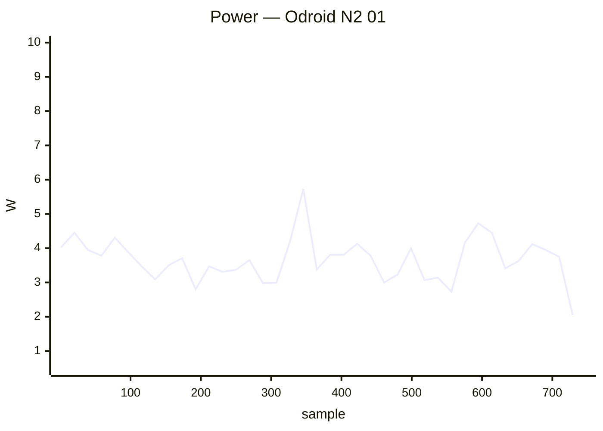
```mermaid
xychart-beta
    title "Power — Odroid N2 01"
    x-axis "sample" 1 --> 748
    y-axis "W" 0.5 --> 10.0
    line [4.02, 4.45, 3.95, 3.78, 4.31, 3.88, 3.47, 3.09, 3.50, 3.71, 2.80, 3.47, 3.31, 3.37, 3.65, 2.98, 2.99, 4.18, 5.73, 3.38, 3.81, 3.81, 4.13, 3.78, 3.00, 3.23, 4.00, 3.07, 3.14, 2.73, 4.16, 4.73, 4.45, 3.41, 3.63, 4.12, 3.95, 3.75, 2.05, 3.75]
```

### ✅ Odroid XU4 01

`odroidxu4` · **inplace** · image `26.11.0-trunk.57` · 16 ✅ · 0 ❌ · 0 ⏭️

| Module | Status | Time | Detail |
|:--|:--:|--:|:--|
| upgrade | ✅ | 57.0 s | nightly · 26.11.0-trunk.57 → 26.11.0-trunk.57 |
| reboot | ✅ | 57.6 s | power-cycle · up 30 s |
| kernel-switch | ✅ | 39.7 s | branch=current · family=odroidxu4 · installed=26.11.0-trunk.57 · boot_image=/boot/vmlinuz-6.6.155-current-odroidxu4 · kernel_before=6.6.155-current-odroidxu4 |
| reboot | ✅ | 175.7 s | power-cycle · 4/4 boots · up 28 s |
| hw-performance | ✅ | 35.7 s | AES 66 · mem 5500 · disk W 1 / R 60 MB/s · 65 °C · 1400 MHz |
| dvfs | ✅ | 29.5 s | ondemand · 600–1400 MHz (peak 2000) |
| network-iperf | ✅ | 35.6 s | enx001e0636e380 ↑924/↓941 (1GE) Mbps |
| store-versions | ✅ | 6.4 s | 26.11.0-trunk.57 · 6.6.155-current-odroidxu4 |
| kernel-switch | ✅ | 100.0 s | branch=edge · family=odroidxu4 · installed=26.11.0-trunk.57 · boot_image=/boot/vmlinuz-7.2.7-edge-odroidxu4 · kernel_before=6.6.155-current-odroidxu4 |
| reboot | ✅ | 187.9 s | power-cycle · 4/4 boots · up 31 s |
| hw-performance | ✅ | 34.4 s | AES 65 · mem 5300 · disk W 1 / R 61 MB/s · 63 °C · 1400 MHz |
| dvfs | ✅ | 31.7 s | ondemand · 600–1300 MHz (peak 1900) |
| network-iperf | ✅ | 34.4 s | enx001e0636e380 ↑919/↓941 (1GE) Mbps |
| store-versions | ✅ | 6.5 s | 26.11.0-trunk.57 · 7.2.7-edge-odroidxu4 |
| kernel-switch | ✅ | 99.4 s | branch=current · family=odroidxu4 · installed=26.11.0-trunk.57 · boot_image=/boot/vmlinuz-6.6.155-current-odroidxu4 · kernel_before=7.2.7-edge-odroidxu4 |
| reboot | ✅ | 55.7 s | power-cycle · up 31 s |

### ✅ Orange Pi 5 Plus 01

`orangepi5-plus` · **inplace** · image `26.11.0-trunk.54` · 16 ✅ · 0 ❌ · 0 ⏭️

| Module | Status | Time | Detail |
|:--|:--:|--:|:--|
| upgrade | ✅ | 23.6 s | nightly · 26.11.0-trunk.54 → 26.11.0-trunk.54 |
| reboot | ✅ | 59.5 s | power-cycle · up 33 s |
| kernel-switch | ✅ | 21.4 s | branch=vendor · family=rk35xx · installed=26.11.0-trunk.54 · boot_image=vmlinuz-6.1.172-vendor-rk35xx · kernel_before=6.1.172-vendor-rk35xx |
| reboot | ✅ | 53.7 s | power-cycle · up 28 s |
| hw-performance | ✅ | 17.3 s | AES 1255 · mem 15200 · disk W 53 / R 62 MB/s · 55.5 °C · 1800 MHz |
| dvfs | ✅ | 16.3 s | ondemand · 1800–1800 MHz (peak 2304) |
| network-iperf | ✅ | 53.8 s | enP3p49s0 ↑941/↓941 (1GE) · wlxe0e1a9380c53 ↑545/↓417 (Wi-Fi 6) Mbps |
| store-versions | ✅ | 3.7 s | 26.11.0-trunk.54 · 6.1.172-vendor-rk35xx |
| kernel-switch | ✅ | 95.7 s | branch=current · family=rockchip64 · installed=26.11.0-trunk.54 · boot_image=vmlinuz-6.18.52-current-rockchip64 · kernel_before=6.1.172-vendor-rk35xx |
| reboot | ✅ | 51.0 s | power-cycle · up 26 s |
| hw-performance | ✅ | 18.3 s | AES 1252 · mem 6000 · disk W 45 / R 57 MB/s · 57.3 °C · 1800 MHz |
| dvfs | ✅ | 15.5 s | ondemand · 408–1800 MHz (peak 2400) |
| network-iperf | ✅ | 61.1 s | enP3p49s0 ↑941/↓941 (1GE) · wlxe0e1a9380c53 ↑157/↓68 (Wi-Fi 6) Mbps |
| store-versions | ✅ | 4.3 s | 26.11.0-trunk.54 · 6.18.52-current-rockchip64 |
| kernel-switch | ✅ | 66.8 s | branch=vendor · family=rk35xx · installed=26.11.0-trunk.54 · boot_image=vmlinuz-6.1.172-vendor-rk35xx · kernel_before=6.18.52-current-rockchip64 |
| reboot | ✅ | 61.0 s | power-cycle · up 28 s |

**Power** — min 0.60 W · avg 6.29 W · peak 13.60 W · 495 samples

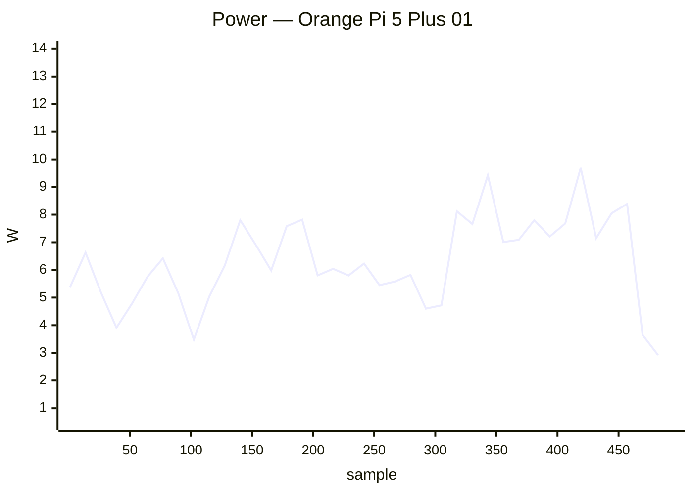
```mermaid
xychart-beta
    title "Power — Orange Pi 5 Plus 01"
    x-axis "sample" 1 --> 495
    y-axis "W" 0.5 --> 14.0
    line [5.38, 6.63, 5.18, 3.91, 4.78, 5.75, 6.42, 5.15, 3.48, 5.04, 6.16, 7.80, 6.91, 5.98, 7.58, 7.82, 5.80, 6.04, 5.80, 6.23, 5.45, 5.58, 5.82, 4.60, 4.72, 8.12, 7.66, 9.42, 7.01, 7.09, 7.80, 7.21, 7.68, 9.69, 7.15, 8.05, 8.39, 3.65, 2.92, 6.22]
```

### ✅ Orange Pi Lite 2 01

`orangepilite2` · **inplace** · image `26.11.0-trunk.56` · 15 ✅ · 1 ❌ · 0 ⏭️

| Module | Status | Time | Detail |
|:--|:--:|--:|:--|
| upgrade | ✅ | 163.0 s | nightly · 26.11.0-trunk.56 → 26.11.0-trunk.56 |
| reboot | ✅ | 55.6 s | warm · up 37 s |
| kernel-switch | ✅ | 157.0 s | branch=current · family=sunxi64 · installed=26.11.0-trunk.56 · boot_image=/boot/vmlinuz-6.18.53-current-sunxi64 · kernel_before=6.18.53-current-sunxi64 |
| reboot | ✅ | 181.7 s | warm · 4/4 boots · up 27 s |
| hw-performance | ✅ | 29.1 s | AES 772 · mem 4300 · disk W 21 / R 24 MB/s · 74.6 °C · 1800 MHz |
| dvfs | ✅ | 21.7 s | ondemand · 480–1704 MHz (peak 1704) |
| network-iperf | ✅ | 36.3 s | wlan0 ↑47/↓35 (Wi-Fi 5) Mbps |
| store-versions | ✅ | 4.9 s | 26.11.0-trunk.56 · 6.18.53-current-sunxi64 |
| kernel-switch | ✅ | 168.8 s | branch=edge · family=sunxi64 · installed=26.11.0-trunk.56 · boot_image=/boot/vmlinuz-7.2.7-edge-sunxi64 · kernel_before=6.18.53-current-sunxi64 |
| reboot | ✅ | 180.5 s | warm · 4/4 boots · up 33 s |
| hw-performance | ✅ | 29.9 s | AES 800 · mem 4400 · disk W 18 / R 23 MB/s · 72.9 °C · 1800 MHz |
| dvfs | ❌ | 22.0 s | ondemand · 480–1800 MHz (peak 1704) |
| network-iperf | ✅ | 36.2 s | wlan0 ↑47/↓35 (Wi-Fi 5) Mbps |
| store-versions | ✅ | 4.8 s | 26.11.0-trunk.56 · 7.2.7-edge-sunxi64 |
| kernel-switch | ✅ | 146.1 s | branch=current · family=sunxi64 · installed=26.11.0-trunk.56 · boot_image=/boot/vmlinuz-6.18.53-current-sunxi64 · kernel_before=7.2.7-edge-sunxi64 |
| reboot | ✅ | 54.9 s | warm · up 37 s |

### ✅ Orange Pi One+ 01

`orangepioneplus` · **inplace** · image `26.11.0-trunk.54` · 16 ✅ · 0 ❌ · 0 ⏭️

| Module | Status | Time | Detail |
|:--|:--:|--:|:--|
| upgrade | ✅ | 227.1 s | nightly · 26.11.0-trunk.54 → 26.11.0-trunk.56 |
| reboot | ✅ | 39.7 s | warm · up 20 s |
| kernel-switch | ✅ | 45.4 s | branch=current · family=sunxi64 · installed=26.11.0-trunk.56 · boot_image=/boot/vmlinuz-6.18.53-current-sunxi64 · kernel_before=6.18.53-current-sunxi64 |
| reboot | ✅ | 123.5 s | warm · 4/4 boots · up 18 s |
| hw-performance | ✅ | 29.4 s | AES 835 · mem 4600 · disk W 21 / R 23 MB/s · 59.3 °C · 1800 MHz |
| dvfs | ✅ | 22.4 s | ondemand · 480–1800 MHz (peak 1800) |
| network-iperf | ✅ | 59.4 s | end0 ↑917/↓942 (1GE) · wlx00e04c881724 ↑133/↓177 (Wi-Fi 5) Mbps |
| store-versions | ✅ | 5.0 s | 26.11.0-trunk.56 · 6.18.53-current-sunxi64 |
| kernel-switch | ✅ | 124.9 s | branch=edge · family=sunxi64 · installed=26.11.0-trunk.56 · boot_image=/boot/vmlinuz-7.2.7-edge-sunxi64 · kernel_before=6.18.53-current-sunxi64 |
| reboot | ✅ | 123.6 s | warm · 4/4 boots · up 17 s |
| hw-performance | ✅ | 30.1 s | AES 835 · mem 4600 · disk W 20 / R 23 MB/s · 59.3 °C · 1800 MHz |
| dvfs | ✅ | 22.7 s | ondemand · 480–1800 MHz (peak 1800) |
| network-iperf | ✅ | 66.1 s | end0 ↑912/↓942 (1GE) · wlx00e04c881724 ↑128/↓116 (Wi-Fi 5) Mbps |
| store-versions | ✅ | 5.0 s | 26.11.0-trunk.56 · 7.2.7-edge-sunxi64 |
| kernel-switch | ✅ | 126.7 s | branch=current · family=sunxi64 · installed=26.11.0-trunk.56 · boot_image=/boot/vmlinuz-6.18.53-current-sunxi64 · kernel_before=7.2.7-edge-sunxi64 |
| reboot | ✅ | 37.6 s | warm · up 18 s |

### ✅ Orange Pi Prime 01

`orangepiprime` · **inplace** · image `26.11.0-trunk.51` · 3 ✅ · 0 ❌ · 3 ⏭️

| Module | Status | Time | Detail |
|:--|:--:|--:|:--|
| upgrade | ⏭️ | 0.0 s | — |
| reboot | ⏭️ | 0.0 s | reboot |
| hw-performance | ✅ | 45.3 s | AES 380 · mem 2100 · disk W 21 / R 23 MB/s · 40.8 °C · None MHz |
| dvfs | ➖ | 2.9 s | no cpufreq |
| network-iperf | ✅ | 70.4 s | end0 ↑881/↓856 (1GE) · wlan0 ↑32/↓34 (Wi-Fi 4) Mbps |
| store-versions | ✅ | 6.1 s | 26.11.0-trunk.51 · 6.18.52-current-sunxi64 |

### ✅ OrangePi 3 LTS 01

`orangepi3-lts` · **inplace** · image `26.8.3` · 4 ✅ · 0 ❌ · 2 ⏭️

| Module | Status | Time | Detail |
|:--|:--:|--:|:--|
| upgrade | ⏭️ | 0.0 s | — |
| reboot | ⏭️ | 0.0 s | reboot |
| hw-performance | ✅ | 21.7 s | AES 750 · mem 4100 · disk W 55 / R 127 MB/s · 61.8 °C · 1608 MHz |
| dvfs | ✅ | 21.7 s | ondemand · 480–1608 MHz (peak 1608) |
| network-iperf | ✅ | 61.9 s | end0 ↑915/↓939 (1GE) · wlan0 ↑45/↓34 (Wi-Fi 5) Mbps |
| store-versions | ✅ | 4.7 s | 26.8.3 · 7.1.8-edge-sunxi64 |

**Power** — min 2.50 W · avg 3.35 W · peak 4.70 W · 94 samples

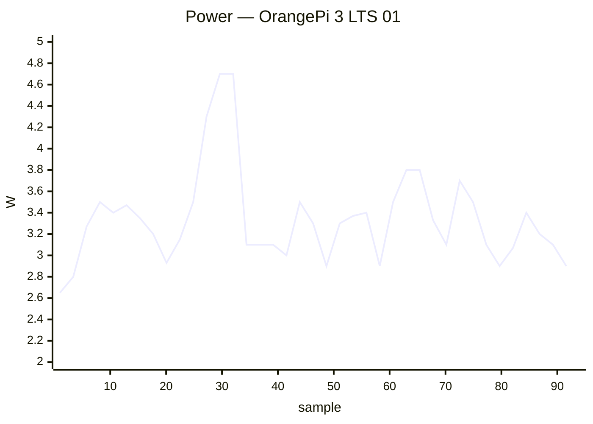
```mermaid
xychart-beta
    title "Power — OrangePi 3 LTS 01"
    x-axis "sample" 1 --> 94
    y-axis "W" 2.0 --> 5.0
    line [2.65, 2.80, 3.27, 3.50, 3.40, 3.47, 3.35, 3.20, 2.93, 3.15, 3.50, 4.30, 4.70, 4.70, 3.10, 3.10, 3.10, 3.00, 3.50, 3.30, 2.90, 3.30, 3.37, 3.40, 2.90, 3.50, 3.80, 3.80, 3.33, 3.10, 3.70, 3.50, 3.10, 2.90, 3.07, 3.40, 3.20, 3.10, 2.90, 3.60]
```

### ✅ Radxa Dragon Q6A 01

`radxa-dragon-q6a` · **inplace** · image `26.11.0-trunk.51` · 16 ✅ · 0 ❌ · 0 ⏭️

| Module | Status | Time | Detail |
|:--|:--:|--:|:--|
| upgrade | ✅ | 65.9 s | nightly · 26.11.0-trunk.51 → 26.11.0-trunk.54 |
| reboot | ✅ | 137.3 s | power-cycle · up 105 s |
| kernel-switch | ✅ | 16.8 s | branch=current · family=qcs6490 · installed=26.11.0-trunk.54 · boot_image=vmlinuz-6.18.2-current-qcs6490 · kernel_before=6.18.2-current-qcs6490 |
| reboot | ✅ | 137.8 s | power-cycle · up 105 s |
| hw-performance | ✅ | 13.3 s | AES 1495 · mem 18700 · disk W 237 / R 1100 MB/s · 47.7 °C · 1958 MHz |
| dvfs | ✅ | 14.2 s | ondemand · 300–1958 MHz (peak 2707) |
| network-iperf | ✅ | 30.5 s | enp1s0 ↑941/↓941 (1GE) Mbps |
| store-versions | ✅ | 3.7 s | 26.11.0-trunk.54 · 6.18.2-current-qcs6490 |
| kernel-switch | ✅ | 80.0 s | branch=edge · family=qcs6490 · installed=26.11.0-trunk.54 · boot_image=vmlinuz-7.2.3-edge-qcs6490 · kernel_before=6.18.2-current-qcs6490 |
| reboot | ✅ | 139.6 s | power-cycle · up 107 s |
| hw-performance | ✅ | 13.4 s | AES 1523 · mem 15300 · disk W 253 / R 1182 MB/s · 49.6 °C · 1958 MHz |
| dvfs | ✅ | 15.4 s | ondemand · 300–1958 MHz (peak 2707) |
| network-iperf | ✅ | 27.5 s | enp1s0 ↑941/↓941 (1GE) Mbps |
| store-versions | ✅ | 3.6 s | 26.11.0-trunk.54 · 7.2.3-edge-qcs6490 |
| kernel-switch | ✅ | 82.7 s | branch=current · family=qcs6490 · installed=26.11.0-trunk.54 · boot_image=vmlinuz-6.18.2-current-qcs6490 · kernel_before=7.2.3-edge-qcs6490 |
| reboot | ✅ | 138.2 s | power-cycle · up 105 s |

**Power** — min 1.00 W · avg 2.61 W · peak 8.70 W · 735 samples

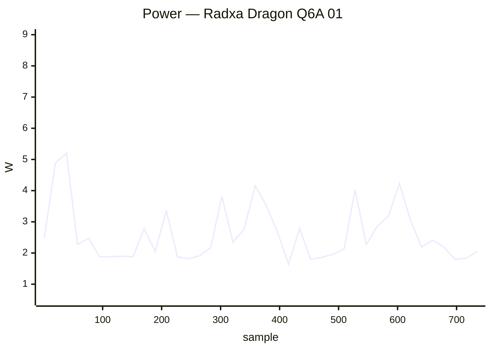
```mermaid
xychart-beta
    title "Power — Radxa Dragon Q6A 01"
    x-axis "sample" 1 --> 735
    y-axis "W" 0.5 --> 9.0
    line [2.48, 4.88, 5.20, 2.28, 2.47, 1.88, 1.88, 1.90, 1.88, 2.78, 2.05, 3.36, 1.88, 1.82, 1.91, 2.18, 3.82, 2.35, 2.76, 4.15, 3.53, 2.68, 1.64, 2.79, 1.80, 1.86, 1.96, 2.13, 4.02, 2.27, 2.86, 3.18, 4.23, 3.04, 2.19, 2.41, 2.19, 1.80, 1.83, 2.05]
```

### ✅ Radxa ZERO 3 01

`radxa-zero3` · **inplace** · image `26.5.1` · 4 ✅ · 0 ❌ · 2 ⏭️

| Module | Status | Time | Detail |
|:--|:--:|--:|:--|
| upgrade | ⏭️ | 0.0 s | — |
| reboot | ⏭️ | 0.0 s | reboot |
| hw-performance | ✅ | 38.1 s | AES 720 · mem 3900 · disk W 20 / R 22 MB/s · 49.4 °C · 1416 MHz |
| dvfs | ✅ | 38.0 s | ondemand · 408–1416 MHz (peak 1416) |
| network-iperf | ✅ | 55.1 s | wlan0 ↑1/↓6 (Wi-Fi 6) Mbps |
| store-versions | ✅ | 6.8 s | 26.5.1 · 6.18.44-current-rockchip64 |

### ✅ Raspberry Pi 3B

`rpi4b` · **inplace** · image `26.11.0-trunk.56` · 16 ✅ · 0 ❌ · 0 ⏭️

| Module | Status | Time | Detail |
|:--|:--:|--:|:--|
| upgrade | ✅ | 134.5 s | nightly · 26.11.0-trunk.56 → 26.11.0-trunk.56 |
| reboot | ✅ | 51.7 s | warm · up 31 s |
| kernel-switch | ✅ | 76.4 s | branch=current · family=bcm2711 · installed=26.11.0-trunk.56 · boot_image=/boot/vmlinuz-6.18.52-current-bcm2711 · kernel_before=6.18.52-current-bcm2711 |
| reboot | ✅ | 187.2 s | warm · 4/4 boots · up 32 s |
| hw-performance | ✅ | 45.1 s | AES 20 · mem 1400 · disk W 20 / R 22 MB/s · 54.8 °C · 1200 MHz |
| dvfs | ✅ | 40.9 s | ondemand · 600–1200 MHz (peak 1200) |
| network-iperf | ✅ | 82.8 s | enxb827eb253a53 ↑94/↓94 (10/100ME) · wlan0 ↑21/↓34 (Wi-Fi 4) Mbps |
| store-versions | ✅ | 9.5 s | 26.11.0-trunk.56 · 6.18.52-current-bcm2711 |
| kernel-switch | ✅ | 243.2 s | branch=edge · family=bcm2711 · installed=26.11.0-trunk.56 · boot_image=/boot/vmlinuz-7.2.6-edge-bcm2711 · kernel_before=6.18.52-current-bcm2711 |
| reboot | ✅ | 189.0 s | warm · 4/4 boots · up 30 s |
| hw-performance | ✅ | 45.3 s | AES 20 · mem 1400 · disk W 20 / R 22 MB/s · 54.8 °C · 1200 MHz |
| dvfs | ✅ | 41.7 s | ondemand · 600–1200 MHz (peak 1200) |
| network-iperf | ✅ | 79.7 s | enxb827eb253a53 ↑94/↓94 (10/100ME) · wlan0 ↑30/↓35 (Wi-Fi 4) Mbps |
| store-versions | ✅ | 8.9 s | 26.11.0-trunk.56 · 7.2.6-edge-bcm2711 |
| kernel-switch | ✅ | 241.0 s | branch=current · family=bcm2711 · installed=26.11.0-trunk.56 · boot_image=/boot/vmlinuz-6.18.52-current-bcm2711 · kernel_before=7.2.6-edge-bcm2711 |
| reboot | ✅ | 51.8 s | warm · up 31 s |

### ✅ Raspberry Pi 5B

`rpi4b` · **inplace** · image `26.11.0-trunk.55` · 16 ✅ · 0 ❌ · 0 ⏭️

| Module | Status | Time | Detail |
|:--|:--:|--:|:--|
| upgrade | ✅ | 143.3 s | nightly · 26.11.0-trunk.55 → 26.11.0-trunk.56 |
| reboot | ✅ | 46.6 s | power-cycle · up 21 s |
| kernel-switch | ✅ | 13.4 s | branch=current · family=bcm2711 · installed=26.11.0-trunk.56 · boot_image=/boot/vmlinuz-6.18.52-current-bcm2711 · kernel_before=6.18.52-current-bcm2711 |
| reboot | ✅ | 119.2 s | power-cycle · 4/4 boots · up 18 s |
| hw-performance | ✅ | 14.5 s | AES 1368 · mem 12100 · disk W 54 / R 84 MB/s · 66.7 °C · 2400 MHz |
| dvfs | ✅ | 13.4 s | ondemand · 1500–2400 MHz (peak 2400) |
| network-iperf | ✅ | 50.6 s | end0 ↑936/↓941 (1GE) · wlan0 ↑42/↓33 (Wi-Fi 5) Mbps |
| store-versions | ✅ | 3.1 s | 26.11.0-trunk.56 · 6.18.52-current-bcm2711 |
| kernel-switch | ✅ | 126.4 s | branch=edge · family=bcm2711 · installed=26.11.0-trunk.56 · boot_image=/boot/vmlinuz-7.2.6-edge-bcm2711 · kernel_before=6.18.52-current-bcm2711 |
| reboot | ✅ | 126.5 s | power-cycle · 4/4 boots · up 19 s |
| hw-performance | ✅ | 14.8 s | AES 1368 · mem 9200 · disk W 51 / R 84 MB/s · 67.2 °C · 2400 MHz |
| dvfs | ✅ | 13.3 s | ondemand · 1500–2400 MHz (peak 2400) |
| network-iperf | ✅ | 51.4 s | end0 ↑936/↓941 (1GE) · wlan0 ↑45/↓34 (Wi-Fi 5) Mbps |
| store-versions | ✅ | 3.1 s | 26.11.0-trunk.56 · 7.2.6-edge-bcm2711 |
| kernel-switch | ✅ | 119.0 s | branch=current · family=bcm2711 · installed=26.11.0-trunk.56 · boot_image=/boot/vmlinuz-6.18.52-current-bcm2711 · kernel_before=7.2.6-edge-bcm2711 |
| reboot | ✅ | 43.5 s | power-cycle · up 18 s |

**Power** — min 2.50 W · avg 6.17 W · peak 10.60 W · 726 samples

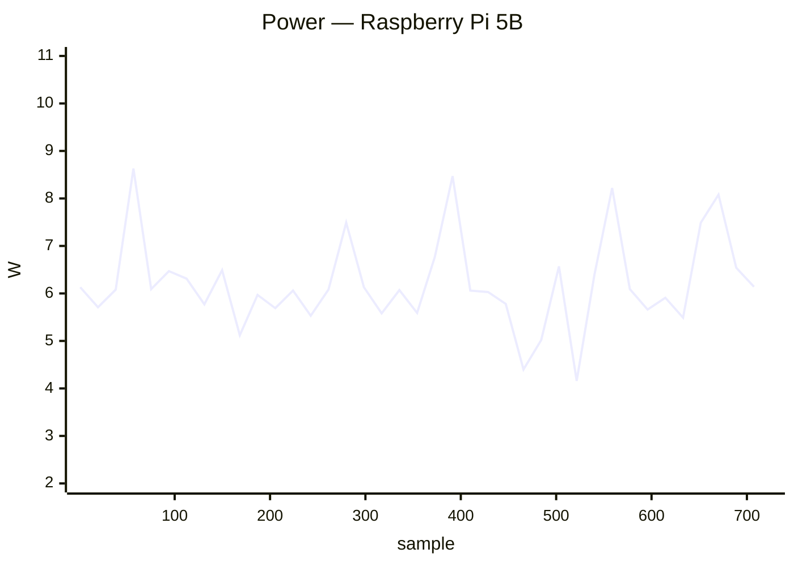
```mermaid
xychart-beta
    title "Power — Raspberry Pi 5B"
    x-axis "sample" 1 --> 726
    y-axis "W" 2.0 --> 11.0
    line [6.13, 5.71, 6.08, 8.63, 6.09, 6.47, 6.31, 5.77, 6.49, 5.12, 5.97, 5.69, 6.06, 5.53, 6.08, 7.49, 6.13, 5.58, 6.07, 5.59, 6.77, 8.47, 6.06, 6.03, 5.78, 4.40, 5.02, 6.57, 4.16, 6.39, 8.22, 6.09, 5.66, 5.91, 5.49, 7.49, 8.08, 6.54, 6.14, 4.66]
```

### ✅ Raspberry Pi Zero 2W

`rpi4b` · **inplace** · image `26.11.0-trunk.56` · 16 ✅ · 0 ❌ · 0 ⏭️

| Module | Status | Time | Detail |
|:--|:--:|--:|:--|
| upgrade | ✅ | 88.7 s | nightly · 26.11.0-trunk.56 → 26.11.0-trunk.56 |
| reboot | ✅ | 40.2 s | warm · up 23 s |
| kernel-switch | ✅ | 56.3 s | branch=current · family=bcm2711 · installed=26.11.0-trunk.56 · boot_image=/boot/vmlinuz-6.18.52-current-bcm2711 · kernel_before=6.18.52-current-bcm2711 |
| reboot | ✅ | 147.7 s | warm · 4/4 boots · up 25 s |
| hw-performance | ✅ | 33.4 s | AES 33 · mem 2200 · disk W 20 / R 23 MB/s · 56.4 °C · 1000 MHz |
| dvfs | ✅ | 27.2 s | ondemand · 600–1000 MHz (peak 1000) |
| network-iperf | ✅ | 40.0 s | wlan0 ↑37/↓34 (Wi-Fi 4) Mbps |
| store-versions | ✅ | 6.0 s | 26.11.0-trunk.56 · 6.18.52-current-bcm2711 |
| kernel-switch | ✅ | 188.3 s | branch=edge · family=bcm2711 · installed=26.11.0-trunk.56 · boot_image=/boot/vmlinuz-7.2.6-edge-bcm2711 · kernel_before=6.18.52-current-bcm2711 |
| reboot | ✅ | 151.1 s | warm · 4/4 boots · up 25 s |
| hw-performance | ✅ | 33.5 s | AES 33 · mem 2100 · disk W 20 / R 23 MB/s · 55.8 °C · 1000 MHz |
| dvfs | ✅ | 27.2 s | ondemand · 600–1000 MHz (peak 1000) |
| network-iperf | ✅ | 46.6 s | wlan0 ↑35/↓38 (Wi-Fi 4) Mbps |
| store-versions | ✅ | 5.7 s | 26.11.0-trunk.56 · 7.2.6-edge-bcm2711 |
| kernel-switch | ✅ | 189.0 s | branch=current · family=bcm2711 · installed=26.11.0-trunk.56 · boot_image=/boot/vmlinuz-6.18.52-current-bcm2711 · kernel_before=7.2.6-edge-bcm2711 |
| reboot | ✅ | 41.4 s | warm · up 23 s |

### ✅ ROCK 2F 01

`rock-2f` · **inplace** · image `26.5.1` · 4 ✅ · 0 ❌ · 2 ⏭️

| Module | Status | Time | Detail |
|:--|:--:|--:|:--|
| upgrade | ⏭️ | 0.0 s | — |
| reboot | ⏭️ | 0.0 s | reboot |
| hw-performance | ✅ | 33.0 s | AES 824 · mem 5900 · disk W 15 / R 65 MB/s · 47.8 °C · 2016 MHz |
| dvfs | ✅ | 25.8 s | ondemand · 408–2016 MHz (peak 2016) |
| network-iperf | ✅ | 41.8 s | wlan0 ↑54/↓61 (Wi-Fi 6) Mbps |
| store-versions | ✅ | 5.6 s | 26.5.1 · 6.1.115-vendor-rk35xx |

### ✅ Rock 5B 01

`rock-5b` · **inplace** · image `26.11.0-trunk.51` · 16 ✅ · 0 ❌ · 0 ⏭️

| Module | Status | Time | Detail |
|:--|:--:|--:|:--|
| upgrade | ✅ | 135.8 s | nightly · 26.11.0-trunk.51 → 26.11.0-trunk.54 |
| reboot | ✅ | 46.6 s | power-cycle · up 18 s |
| kernel-switch | ✅ | 76.5 s | branch=vendor · family=rk35xx · installed=26.11.0-trunk.54 · boot_image=vmlinuz-6.1.172-vendor-rk35xx · kernel_before=6.18.52-current-rockchip64 |
| reboot | ✅ | 53.4 s | power-cycle · up 20 s |
| hw-performance | ✅ | 20.8 s | AES 1286 · mem 15000 · disk W 26 / R 85 MB/s · 63.8 °C · 1800 MHz |
| dvfs | ✅ | 18.1 s | ondemand · 1800–1800 MHz (peak 2352) |
| network-iperf | ✅ | 34.2 s | enP4p65s0 ↑941/↓938 (1GE) Mbps |
| store-versions | ✅ | 4.0 s | 26.11.0-trunk.54 · 6.1.172-vendor-rk35xx |
| kernel-switch | ✅ | 98.3 s | branch=current · family=rockchip64 · installed=26.11.0-trunk.54 · boot_image=vmlinuz-6.18.52-current-rockchip64 · kernel_before=6.1.172-vendor-rk35xx |
| reboot | ✅ | 53.7 s | power-cycle · up 20 s |
| hw-performance | ✅ | 20.4 s | AES 1287 · mem 11000 · disk W 26 / R 80 MB/s · 62.8 °C · 1800 MHz |
| dvfs | ✅ | 15.5 s | ondemand · 408–1800 MHz (peak 2400) |
| network-iperf | ✅ | 39.9 s | enP4p65s0 ↑941/↓941 (1GE) Mbps |
| store-versions | ✅ | 4.5 s | 26.11.0-trunk.54 · 6.18.52-current-rockchip64 |
| kernel-switch | ✅ | 73.0 s | branch=vendor · family=rk35xx · installed=26.11.0-trunk.54 · boot_image=vmlinuz-6.1.172-vendor-rk35xx · kernel_before=6.18.52-current-rockchip64 |
| reboot | ✅ | 55.4 s | power-cycle · up 23 s |

**Power** — min 0.70 W · avg 5.18 W · peak 13.80 W · 596 samples

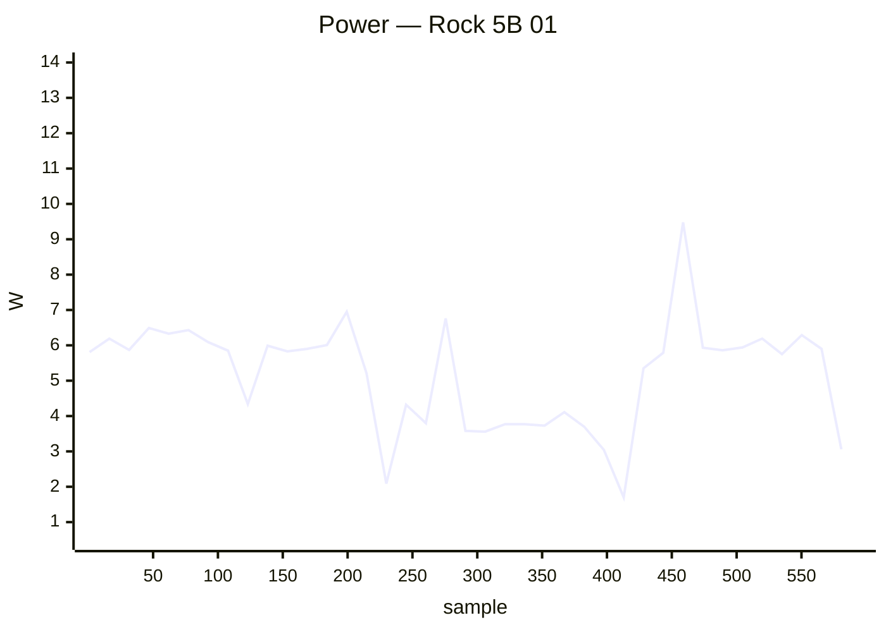
```mermaid
xychart-beta
    title "Power — Rock 5B 01"
    x-axis "sample" 1 --> 596
    y-axis "W" 0.5 --> 14.0
    line [5.81, 6.19, 5.87, 6.49, 6.33, 6.43, 6.09, 5.85, 4.34, 5.99, 5.83, 5.90, 6.01, 6.95, 5.21, 2.09, 4.32, 3.80, 6.76, 3.58, 3.56, 3.77, 3.77, 3.73, 4.11, 3.70, 3.04, 1.70, 5.35, 5.79, 9.48, 5.93, 5.86, 5.94, 6.19, 5.75, 6.29, 5.90, 3.06, 4.67]
```

### ✅ Rock 5B 02

`rock-5b` · **inplace** · image `26.11.0-trunk.51` · 16 ✅ · 0 ❌ · 0 ⏭️

| Module | Status | Time | Detail |
|:--|:--:|--:|:--|
| upgrade | ✅ | 115.0 s | nightly · 26.11.0-trunk.51 → 26.11.0-trunk.54 |
| reboot | ✅ | 51.7 s | power-cycle · up 17 s |
| kernel-switch | ✅ | 68.9 s | branch=vendor · family=rk35xx · installed=26.11.0-trunk.54 · boot_image=vmlinuz-6.1.172-vendor-rk35xx · kernel_before=6.18.52-current-rockchip64 |
| reboot | ✅ | 52.3 s | power-cycle · up 20 s |
| hw-performance | ✅ | 17.7 s | AES 1283 · mem 15000 · disk W 64 / R 81 MB/s · 65.6 °C · 1800 MHz |
| dvfs | ✅ | 17.1 s | ondemand · 1800–1800 MHz (peak 2352) |
| network-iperf | ✅ | 54.8 s | enP4p65s0 ↑941/↓941 (1GE) · wlP2p33s0 ↑453/↓241 (Wi-Fi 6) Mbps |
| store-versions | ✅ | 3.9 s | 26.11.0-trunk.54 · 6.1.172-vendor-rk35xx |
| kernel-switch | ✅ | 88.2 s | branch=current · family=rockchip64 · installed=26.11.0-trunk.54 · boot_image=vmlinuz-6.18.52-current-rockchip64 · kernel_before=6.1.172-vendor-rk35xx |
| reboot | ✅ | 52.3 s | power-cycle · up 20 s |
| hw-performance | ✅ | 18.0 s | AES 1297 · mem 11000 · disk W 59 / R 73 MB/s · 64.7 °C · 1800 MHz |
| dvfs | ✅ | 15.6 s | ondemand · 408–1800 MHz (peak 2400) |
| network-iperf | ✅ | 65.6 s | enP4p65s0 ↑941/↓942 (1GE) · wlP2p33s0 ↑543/↓177 (Wi-Fi 6) Mbps |
| store-versions | ✅ | 3.9 s | 26.11.0-trunk.54 · 6.18.52-current-rockchip64 |
| kernel-switch | ✅ | 67.5 s | branch=vendor · family=rk35xx · installed=26.11.0-trunk.54 · boot_image=vmlinuz-6.1.172-vendor-rk35xx · kernel_before=6.18.52-current-rockchip64 |
| reboot | ✅ | 54.9 s | power-cycle · up 22 s |

**Power** — min 2.50 W · avg 5.83 W · peak 13.90 W · 565 samples

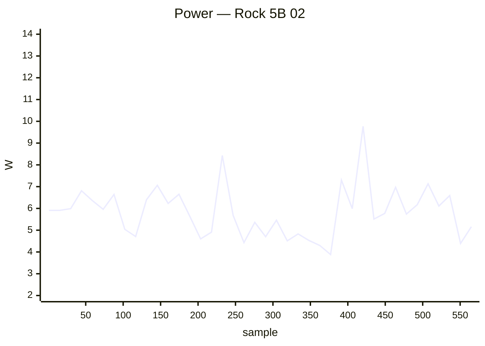
```mermaid
xychart-beta
    title "Power — Rock 5B 02"
    x-axis "sample" 1 --> 565
    y-axis "W" 2.0 --> 14.0
    line [5.91, 5.91, 5.99, 6.81, 6.36, 5.96, 6.64, 5.04, 4.71, 6.40, 7.06, 6.23, 6.65, 5.64, 4.60, 4.91, 8.43, 5.68, 4.43, 5.36, 4.70, 5.46, 4.51, 4.83, 4.53, 4.30, 3.88, 7.30, 5.99, 9.77, 5.51, 5.77, 6.97, 5.74, 6.17, 7.13, 6.11, 6.59, 4.39, 5.16]
```

### ✅ Rock 5B Plus 01

`rock-5b-plus` · **inplace** · image `26.11.0-trunk.54` · 16 ✅ · 0 ❌ · 0 ⏭️

| Module | Status | Time | Detail |
|:--|:--:|--:|:--|
| upgrade | ✅ | 27.3 s | nightly · 26.11.0-trunk.54 → 26.11.0-trunk.54 |
| reboot | ✅ | 62.5 s | power-cycle · up 29 s |
| kernel-switch | ✅ | 23.1 s | branch=vendor · family=rk35xx · installed=26.11.0-trunk.54 · boot_image=vmlinuz-6.1.172-vendor-rk35xx · kernel_before=6.1.172-vendor-rk35xx |
| reboot | ✅ | 52.4 s | power-cycle · up 26 s |
| hw-performance | ✅ | 16.4 s | AES 1284 · mem 15700 · disk W 69 / R 81 MB/s · 51.8 °C · 1800 MHz |
| dvfs | ✅ | 16.6 s | ondemand · 1800–1800 MHz (peak 2304) |
| network-iperf | ✅ | 32.0 s | enP4p65s0 ↑941/↓941 (1GE) Mbps |
| store-versions | ✅ | 4.5 s | 26.11.0-trunk.54 · 6.1.172-vendor-rk35xx |
| kernel-switch | ✅ | 649.6 s | branch=current · family=rockchip64 · installed=26.11.0-trunk.54 · boot_image=vmlinuz-6.18.52-current-rockchip64 · kernel_before=6.1.172-vendor-rk35xx |
| reboot | ✅ | 55.5 s | power-cycle · up 30 s |
| hw-performance | ✅ | 27.9 s | AES 1289 · mem 7100 · disk W 20 / R 2 MB/s · 60.1 °C · 1800 MHz |
| dvfs | ✅ | 16.2 s | ondemand · 408–1800 MHz (peak 2400) |
| network-iperf | ✅ | 31.5 s | enP4p65s0 ↑941/↓941 (1GE) Mbps |
| store-versions | ✅ | 4.1 s | 26.11.0-trunk.54 · 6.18.52-current-rockchip64 |
| kernel-switch | ✅ | 509.8 s | branch=vendor · family=rk35xx · installed=26.11.0-trunk.54 · boot_image=vmlinuz-6.1.172-vendor-rk35xx · kernel_before=6.18.52-current-rockchip64 |
| reboot | ✅ | 47.8 s | power-cycle · up 22 s |

**Power** — min 0.90 W · avg 6.99 W · peak 14.30 W · 1272 samples

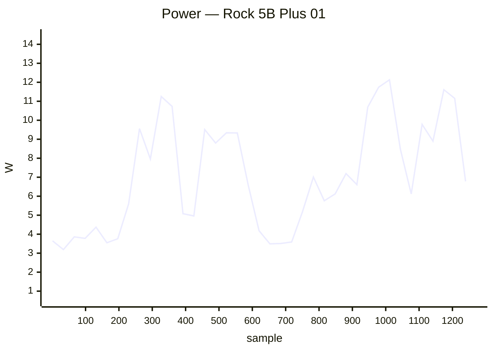
```mermaid
xychart-beta
    title "Power — Rock 5B Plus 01"
    x-axis "sample" 1 --> 1272
    y-axis "W" 0.5 --> 14.5
    line [3.65, 3.19, 3.86, 3.78, 4.37, 3.55, 3.76, 5.60, 9.56, 7.96, 11.25, 10.73, 5.08, 4.96, 9.51, 8.80, 9.34, 9.33, 6.59, 4.18, 3.49, 3.51, 3.59, 5.19, 7.01, 5.76, 6.12, 7.19, 6.61, 10.69, 11.74, 12.13, 8.48, 6.12, 9.78, 8.90, 11.61, 11.15, 6.78, 4.91]
```

### ✅ Rock 5T 01

`rock-5t` · **inplace** · image `26.11.0-trunk.30` · 16 ✅ · 0 ❌ · 0 ⏭️

| Module | Status | Time | Detail |
|:--|:--:|--:|:--|
| upgrade | ✅ | 127.1 s | nightly · 26.11.0-trunk.30 → 26.11.0-trunk.56 |
| reboot | ✅ | 51.2 s | power-cycle · up 20 s |
| kernel-switch | ✅ | 78.3 s | branch=vendor · family=rk35xx · installed=26.11.0-trunk.56 · boot_image=/boot/vmlinuz-6.1.172-vendor-rk35xx · kernel_before=6.18.53-current-rockchip64 |
| reboot | ✅ | 134.3 s | power-cycle · 4/4 boots · up 22 s |
| hw-performance | ✅ | 18.8 s | AES 1262 · mem 15000 · disk W 52 / R 80 MB/s · 53.6 °C · 1800 MHz |
| dvfs | ✅ | 17.5 s | ondemand · 1800–1800 MHz (peak 2352) |
| network-iperf | ✅ | 104.4 s | enP3p49s0 ↑939/↓939 (1GE) · enP4p65s0 ↑939/↓939 (1GE) · wlP2p33s0 ↑391/↓248 (Wi-Fi 6) · wlx7cdd90ebf00a ↑114/↓120 (Wi-Fi 4) Mbps |
| store-versions | ✅ | 4.2 s | 26.11.0-trunk.56 · 6.1.172-vendor-rk35xx |
| kernel-switch | ✅ | 111.8 s | branch=current · family=rockchip64 · installed=26.11.0-trunk.56 · boot_image=/boot/vmlinuz-6.18.53-current-rockchip64 · kernel_before=6.1.172-vendor-rk35xx |
| reboot | ✅ | 129.7 s | power-cycle · 4/4 boots · up 17 s |
| hw-performance | ✅ | 18.1 s | AES 1261 · mem 10000 · disk W 52 / R 81 MB/s · 51.8 °C · 1800 MHz |
| dvfs | ✅ | 15.3 s | ondemand · 408–1800 MHz (peak 2400) |
| network-iperf | ✅ | 113.5 s | enP3p49s0 ↑939/↓939 (1GE) · enP4p65s0 ↑932/↓927 (1GE) · wlP2p33s0 ↑172/↓206 (Wi-Fi 6) · wlx7cdd90ebf00a ↑81/↓122 (Wi-Fi 4) Mbps |
| store-versions | ✅ | 4.6 s | 26.11.0-trunk.56 · 6.18.53-current-rockchip64 |
| kernel-switch | ✅ | 76.2 s | branch=vendor · family=rk35xx · installed=26.11.0-trunk.56 · boot_image=/boot/vmlinuz-6.1.172-vendor-rk35xx · kernel_before=6.18.53-current-rockchip64 |
| reboot | ✅ | 56.4 s | power-cycle · up 22 s |

**Power** — min 1.40 W · avg 8.75 W · peak 15.80 W · 862 samples

```mermaid
xychart-beta
    title "Power — Rock 5T 01"
    x-axis "sample" 1 --> 862
    y-axis "W" 1.0 --> 16.0
    line [9.59, 9.98, 9.72, 10.39, 9.67, 8.82, 6.56, 9.80, 9.51, 9.75, 6.70, 6.22, 7.86, 6.75, 7.53, 10.63, 9.43, 9.32, 9.80, 9.62, 9.46, 9.31, 9.50, 8.79, 9.10, 6.89, 7.19, 6.57, 4.47, 8.77, 10.79, 9.24, 9.32, 9.84, 10.22, 9.72, 9.89, 9.96, 7.42, 5.96]
```

### ✅ Rockpi E 01

`rockpi-e` · **inplace** · image `26.11.0-trunk.56` · 16 ✅ · 0 ❌ · 0 ⏭️

| Module | Status | Time | Detail |
|:--|:--:|--:|:--|
| upgrade | ✅ | 73.8 s | nightly · 26.11.0-trunk.56 → 26.11.0-trunk.56 |
| reboot | ✅ | 55.3 s | power-cycle · up 24 s |
| kernel-switch | ✅ | 50.9 s | branch=current · family=rockchip64 · installed=26.11.0-trunk.56 · boot_image=/boot/vmlinuz-6.18.53-current-rockchip64 · kernel_before=6.18.53-current-rockchip64 |
| reboot | ✅ | 156.3 s | power-cycle · 4/4 boots · up 24 s |
| hw-performance | ✅ | 31.8 s | AES 600 · mem 3300 · disk W 21 / R 23 MB/s · 60.4 °C · 1296 MHz |
| dvfs | ✅ | 25.2 s | ondemand · 408–1296 MHz (peak 1296) |
| network-iperf | ✅ | 92.1 s | end0 ↑940/↓941 (1GE) · end1 ↑94/↓94 (10/100ME) · wlx7ca7b020e87c ↑91/↓211 (Wi-Fi 5) Mbps |
| store-versions | ✅ | 5.6 s | 26.11.0-trunk.56 · 6.18.53-current-rockchip64 |
| kernel-switch | ✅ | 177.9 s | branch=edge · family=rockchip64 · installed=26.11.0-trunk.56 · boot_image=/boot/vmlinuz-7.2.7-edge-rockchip64 · kernel_before=6.18.53-current-rockchip64 |
| reboot | ✅ | 152.3 s | power-cycle · 4/4 boots · up 24 s |
| hw-performance | ✅ | 32.1 s | AES 602 · mem 3300 · disk W 21 / R 23 MB/s · 61.2 °C · 1296 MHz |
| dvfs | ✅ | 26.4 s | ondemand · 408–1296 MHz (peak 1296) |
| network-iperf | ✅ | 90.2 s | end0 ↑941/↓941 (1GE) · end1 ↑94/↓94 (10/100ME) · wlx7ca7b020e87c ↑84/↓181 (Wi-Fi 5) Mbps |
| store-versions | ✅ | 5.9 s | 26.11.0-trunk.56 · 7.2.7-edge-rockchip64 |
| kernel-switch | ✅ | 175.0 s | branch=current · family=rockchip64 · installed=26.11.0-trunk.56 · boot_image=/boot/vmlinuz-6.18.53-current-rockchip64 · kernel_before=7.2.7-edge-rockchip64 |
| reboot | ✅ | 55.6 s | power-cycle · up 24 s |

### ✅ SpacemiT K3 Pico-ITX 01

`k3picoitx` · **inplace** · image `26.11.0-trunk.56` · 8 ✅ · 0 ❌ · 0 ⏭️

| Module | Status | Time | Detail |
|:--|:--:|--:|:--|
| upgrade | ✅ | 29.5 s | nightly · 26.11.0-trunk.56 → 26.11.0-trunk.56 |
| reboot | ✅ | 50.7 s | power-cycle · up 24 s |
| kernel-switch | ✅ | 19.0 s | branch=legacy · family=spacemit-k3 · installed=26.11.0-trunk.56 · boot_image=/boot/vmlinuz-6.18.3-legacy-spacemit-k3 · kernel_before=6.18.3-legacy-spacemit-k3 |
| reboot | ✅ | 141.1 s | power-cycle · 4/4 boots · up 23 s |
| hw-performance | ✅ | 13.6 s | AES 778 · mem 4500 · disk W 1368 / R 1515 MB/s · 44 °C · 2150 MHz |
| dvfs | ✅ | 15.5 s | performance · 614–2150 MHz (peak 2150) |
| network-iperf | ✅ | 75.6 s | eth0 ↑939/↓896 (1GE) · eth1 ↑641/↓663 (10GE) · wlan0 ↑88/↓206 (Wi-Fi 6) Mbps |
| store-versions | ✅ | 3.7 s | 26.11.0-trunk.56 · 6.18.3-legacy-spacemit-k3 |

### ✅ Tinker Board 01

`tinkerboard` · **inplace** · image `26.11.0-trunk.56` · 16 ✅ · 0 ❌ · 0 ⏭️

| Module | Status | Time | Detail |
|:--|:--:|--:|:--|
| upgrade | ✅ | 48.9 s | nightly · 26.11.0-trunk.56 → 26.11.0-trunk.56 |
| reboot | ✅ | 65.1 s | power-cycle · up 30 s |
| kernel-switch | ✅ | 30.0 s | branch=current · family=rockchip · installed=26.11.0-trunk.56 · boot_image=/boot/vmlinuz-6.18.53-current-rockchip · kernel_before=6.18.53-current-rockchip |
| reboot | ✅ | 165.4 s | power-cycle · 4/4 boots · up 30 s |
| hw-performance | ✅ | 28.2 s | AES 67 · mem 3300 · disk W 13 / R 63 MB/s · 59.5 °C · 1800 MHz |
| dvfs | ✅ | 20.0 s | ondemand · 600–1800 MHz (peak 1800) |
| network-iperf | ✅ | 57.8 s | end0 ↑941/↓941 (1GE) · wlan0 ↑27/↓26 (Wi-Fi 4) Mbps |
| store-versions | ✅ | 4.6 s | 26.11.0-trunk.56 · 6.18.53-current-rockchip |
| kernel-switch | ✅ | 79.2 s | branch=edge · family=rockchip · installed=26.11.0-trunk.56 · boot_image=/boot/vmlinuz-7.2.7-edge-rockchip · kernel_before=6.18.53-current-rockchip |
| reboot | ✅ | 173.6 s | power-cycle · 4/4 boots · up 30 s |
| hw-performance | ✅ | 28.5 s | AES 67 · mem 3300 · disk W 13 / R 1 MB/s · 61.2 °C · 1800 MHz |
| dvfs | ✅ | 21.5 s | ondemand · 600–1800 MHz (peak 1800) |
| network-iperf | ✅ | 57.6 s | end0 ↑941/↓941 (1GE) · wlan0 ↑26/↓28 (Wi-Fi 4) Mbps |
| store-versions | ✅ | 4.6 s | 26.11.0-trunk.56 · 7.2.7-edge-rockchip |
| kernel-switch | ✅ | 80.8 s | branch=current · family=rockchip · installed=26.11.0-trunk.56 · boot_image=/boot/vmlinuz-6.18.53-current-rockchip · kernel_before=7.2.7-edge-rockchip |
| reboot | ✅ | 57.6 s | power-cycle · up 29 s |

**Power** — min 2.30 W · avg 3.91 W · peak 9.20 W · 735 samples

```mermaid
xychart-beta
    title "Power — Tinker Board 01"
    x-axis "sample" 1 --> 735
    y-axis "W" 2.0 --> 9.5
    line [3.96, 4.19, 3.27, 2.89, 4.14, 4.08, 3.26, 3.85, 2.94, 4.62, 3.47, 2.98, 4.07, 4.31, 5.47, 4.00, 4.22, 3.90, 4.16, 3.84, 4.43, 3.99, 3.48, 3.72, 3.28, 3.63, 3.76, 3.93, 3.24, 4.01, 5.31, 3.93, 4.20, 4.22, 3.91, 5.08, 4.27, 4.33, 2.71, 3.49]
```

### ✅ Udoo 01

`udoo` · **inplace** · image `26.11.0-trunk.56` · 16 ✅ · 0 ❌ · 0 ⏭️

| Module | Status | Time | Detail |
|:--|:--:|--:|:--|
| upgrade | ✅ | 117.9 s | nightly · 26.11.0-trunk.56 → 26.11.0-trunk.56 |
| reboot | ✅ | 70.5 s | power-cycle · up 33 s |
| kernel-switch | ✅ | 73.9 s | branch=current · family=imx6 · installed=26.11.0-trunk.56 · boot_image=/boot/vmlinuz-6.18.53-current-imx6 · kernel_before=6.18.53-current-imx6 |
| reboot | ✅ | 207.0 s | power-cycle · 4/4 boots · up 35 s |
| hw-performance | ✅ | 51.0 s | AES 26 · mem 683 · disk W 19 / R 20 MB/s · 54.4 °C · 996 MHz |
| dvfs | ✅ | 43.5 s | ondemand · 396–996 MHz (peak 996) |
| network-iperf | ✅ | 86.6 s | end0 ↑399/↓248 (1GE) · wlx7cdd903aa418 ↑31/↓22 (Wi-Fi 4) Mbps |
| store-versions | ✅ | 9.3 s | 26.11.0-trunk.56 · 6.18.53-current-imx6 |
| kernel-switch | ✅ | 442.8 s | branch=edge · family=imx6 · installed=26.11.0-trunk.56 · boot_image=/boot/vmlinuz-7.1.13-edge-imx6 · kernel_before=6.18.53-current-imx6 |
| reboot | ✅ | 206.0 s | power-cycle · 4/4 boots · up 33 s |
| hw-performance | ✅ | 51.0 s | AES 26 · mem 746 · disk W 13 / R 20 MB/s · 54.4 °C · 996 MHz |
| dvfs | ✅ | 46.9 s | ondemand · 396–996 MHz (peak 996) |
| network-iperf | ✅ | 82.2 s | end0 ↑398/↓225 (1GE) · wlx7cdd903aa418 ↑36/↓23 (Wi-Fi 4) Mbps |
| store-versions | ✅ | 9.4 s | 26.11.0-trunk.56 · 7.1.13-edge-imx6 |
| kernel-switch | ✅ | 436.3 s | branch=current · family=imx6 · installed=26.11.0-trunk.56 · boot_image=/boot/vmlinuz-6.18.53-current-imx6 · kernel_before=7.1.13-edge-imx6 |
| reboot | ✅ | 71.0 s | power-cycle · up 33 s |

**Power** — min 1.30 W · avg 5.93 W · peak 8.40 W · 1631 samples

```mermaid
xychart-beta
    title "Power — Udoo 01"
    x-axis "sample" 1 --> 1631
    y-axis "W" 1.0 --> 8.5
    line [6.13, 6.06, 5.65, 6.11, 6.16, 5.60, 6.33, 6.19, 5.99, 6.30, 5.90, 6.17, 6.10, 6.26, 5.12, 5.11, 5.16, 5.37, 6.41, 6.13, 5.95, 6.29, 5.85, 6.27, 6.08, 5.91, 6.10, 6.12, 6.37, 5.87, 5.94, 5.14, 5.06, 5.08, 5.79, 6.33, 6.05, 6.23, 6.11, 6.48]
```

### ✅ UEFI arm64 01

`uefi-arm64` · **inplace** · image `26.11.0-trunk.56` · 16 ✅ · 0 ❌ · 0 ⏭️

| Module | Status | Time | Detail |
|:--|:--:|--:|:--|
| upgrade | ✅ | 23.4 s | nightly · 26.11.0-trunk.56 → 26.11.0-trunk.56 |
| reboot | ✅ | 50.7 s | warm · up 29 s |
| kernel-switch | ✅ | 76.8 s | branch=current · family=arm64 · installed=26.11.0-trunk.56 · boot_image=/boot/vmlinuz-6.18.53-current-arm64 · kernel_before=7.2.7-edge-arm64 |
| reboot | ✅ | 180.2 s | warm · 4/4 boots · up 30 s |
| hw-performance | ✅ | 15.0 s | AES 1458 · mem 13000 · disk W 1545 / R 2363 MB/s · 45 °C · 2600 MHz |
| dvfs | ✅ | 15.0 s | ondemand · 800–2600 MHz (peak 2600) |
| network-iperf | ✅ | 79.3 s | enp1s0 ↑6907/↓2757 (10GE) · enp49s0 ↑7786/↓9371 (10GE) · wlp97s0 ↑121/↓101 (Wi-Fi 6) Mbps |
| store-versions | ✅ | 4.3 s | 26.11.0-trunk.56 · 6.18.53-current-arm64 |
| kernel-switch | ✅ | 70.8 s | branch=edge · family=arm64 · installed=26.11.0-trunk.56 · boot_image=/boot/vmlinuz-7.2.7-edge-arm64 · kernel_before=6.18.53-current-arm64 |
| reboot | ✅ | 182.8 s | warm · 4/4 boots · up 32 s |
| hw-performance | ✅ | 15.5 s | AES 1402 · mem 13000 · disk W 1556 / R 2112 MB/s · 45 °C · 2600 MHz |
| dvfs | ✅ | 18.4 s | ondemand · 800–2600 MHz (peak 2600) |
| network-iperf | ✅ | 80.3 s | enp1s0 ↑8544/↓2770 (10GE) · enp49s0 ↑8845/↓8876 (10GE) · wlp97s0 ↑122/↓87 (Wi-Fi 6) Mbps |
| store-versions | ✅ | 4.4 s | 26.11.0-trunk.56 · 7.2.7-edge-arm64 |
| kernel-switch | ✅ | 73.5 s | branch=current · family=arm64 · installed=26.11.0-trunk.56 · boot_image=/boot/vmlinuz-6.18.53-current-arm64 · kernel_before=7.2.7-edge-arm64 |
| reboot | ✅ | 50.6 s | warm · up 30 s |

### ✅ UEFI x86 01

`uefi-x86` · **inplace** · image `26.11.0-trunk.56` · 14 ✅ · 0 ❌ · 2 ⏭️

| Module | Status | Time | Detail |
|:--|:--:|--:|:--|
| upgrade | ✅ | 49.7 s | nightly · 26.11.0-trunk.56 → 26.11.0-trunk.56 |
| reboot | ✅ | 91.0 s | power-cycle · up 60 s |
| kernel-switch | ✅ | 34.2 s | branch=current · family=x86 · installed=26.11.0-trunk.56 · boot_image=/boot/vmlinuz-6.18.53-current-x86 · kernel_before=6.18.53-current-x86 |
| reboot | ✅ | 260.8 s | power-cycle · 4/4 boots · up 55 s |
| hw-performance | ✅ | 25.6 s | AES 237 · mem 5700 · disk W 25 / R 101 MB/s · 61 °C · 1920 MHz |
| dvfs | ➖ | 23.4 s | schedutil · 480–1920 MHz (peak 1680) · max_khz is single-core turbo, not an all-core target |
| network-iperf | ✅ | 61.5 s | enp1s0 ↑901/↓941 (1GE) · wlan0 ↑37/↓27 (Wi-Fi 5) Mbps |
| store-versions | ✅ | 5.1 s | 26.11.0-trunk.56 · 6.18.53-current-x86 |
| kernel-switch | ✅ | 179.1 s | branch=edge · family=x86 · installed=26.11.0-trunk.56 · boot_image=/boot/vmlinuz-7.2.7-edge-x86 · kernel_before=6.18.53-current-x86 |
| reboot | ✅ | 244.6 s | power-cycle · 4/4 boots · up 57 s |
| hw-performance | ✅ | 32.8 s | AES 237 · mem 6200 · disk W 28 / R 106 MB/s · 63 °C · 1920 MHz |
| dvfs | ➖ | 31.6 s | schedutil · 480–1920 MHz (peak 1896) · max_khz is single-core turbo, not an all-core target |
| network-iperf | ✅ | 61.8 s | enp1s0 ↑898/↓941 (1GE) · wlan0 ↑35/↓26 (Wi-Fi 5) Mbps |
| store-versions | ✅ | 5.3 s | 26.11.0-trunk.56 · 7.2.7-edge-x86 |
| kernel-switch | ✅ | 185.7 s | branch=current · family=x86 · installed=26.11.0-trunk.56 · boot_image=/boot/vmlinuz-6.18.53-current-x86 · kernel_before=7.2.7-edge-x86 |
| reboot | ✅ | 89.4 s | power-cycle · up 57 s |

**Power** — min 0.80 W · avg 4.02 W · peak 8.40 W · 1129 samples

```mermaid
xychart-beta
    title "Power — UEFI x86 01"
    x-axis "sample" 1 --> 1129
    y-axis "W" 0.5 --> 8.5
    line [3.64, 3.77, 3.49, 4.12, 4.94, 3.32, 4.72, 3.66, 4.86, 3.78, 4.39, 3.76, 5.21, 3.79, 3.66, 3.65, 3.40, 3.70, 3.77, 4.22, 3.73, 3.49, 4.81, 4.08, 4.61, 4.56, 3.97, 4.84, 3.84, 3.36, 3.99, 3.49, 3.80, 4.02, 3.86, 4.09, 4.05, 3.19, 3.94, 5.24]
```

### ✅ ZeroPi 01

`zeropi` · **inplace** · image `26.11.0-trunk.56` · 16 ✅ · 0 ❌ · 0 ⏭️

| Module | Status | Time | Detail |
|:--|:--:|--:|:--|
| upgrade | ✅ | 97.3 s | nightly · 26.11.0-trunk.56 → 26.11.0-trunk.56 |
| reboot | ✅ | 59.1 s | power-cycle · up 25 s |
| kernel-switch | ✅ | 62.7 s | branch=current · family=sunxi · installed=26.11.0-trunk.56 · boot_image=/boot/vmlinuz-6.18.53-current-sunxi · kernel_before=6.18.53-current-sunxi |
| reboot | ✅ | 166.7 s | power-cycle · 4/4 boots · up 25 s |
| hw-performance | ✅ | 39.4 s | AES 25 · mem 1500 · disk W 21 / R 23 MB/s · 49.2 °C · 1296 MHz |
| dvfs | ✅ | 34.1 s | ondemand · 480–1296 MHz (peak 1296) |
| network-iperf | ✅ | 38.6 s | end0 ↑640/↓939 (1GE) Mbps |
| store-versions | ✅ | 7.3 s | 26.11.0-trunk.56 · 6.18.53-current-sunxi |
| kernel-switch | ✅ | 176.5 s | branch=edge · family=sunxi · installed=26.11.0-trunk.56 · boot_image=/boot/vmlinuz-7.2.7-edge-sunxi · kernel_before=6.18.53-current-sunxi |
| reboot | ✅ | 164.1 s | power-cycle · 4/4 boots · up 25 s |
| hw-performance | ✅ | 39.8 s | AES 25 · mem 1600 · disk W 21 / R 23 MB/s · 51.8 °C · 1296 MHz |
| dvfs | ✅ | 37.5 s | ondemand · 480–1296 MHz (peak 1296) |
| network-iperf | ✅ | 38.8 s | end0 ↑628/↓939 (1GE) Mbps |
| store-versions | ✅ | 7.3 s | 26.11.0-trunk.56 · 7.2.7-edge-sunxi |
| kernel-switch | ✅ | 171.6 s | branch=current · family=sunxi · installed=26.11.0-trunk.56 · boot_image=/boot/vmlinuz-6.18.53-current-sunxi · kernel_before=7.2.7-edge-sunxi |
| reboot | ✅ | 60.1 s | power-cycle · up 25 s |

**Power** — min 1.20 W · avg 2.17 W · peak 3.10 W · 976 samples

```mermaid
xychart-beta
    title "Power — ZeroPi 01"
    x-axis "sample" 1 --> 976
    y-axis "W" 1.0 --> 3.5
    line [1.98, 2.13, 2.08, 1.93, 1.87, 2.35, 2.13, 1.94, 2.43, 2.29, 2.35, 2.13, 2.40, 2.02, 2.18, 2.11, 2.24, 2.18, 2.03, 2.06, 2.12, 2.16, 2.12, 2.16, 2.22, 2.39, 2.16, 2.26, 2.25, 2.17, 2.35, 2.26, 2.18, 2.28, 2.26, 2.16, 2.11, 2.12, 1.87, 2.20]
```

<!-- FLEET-STOP -->
