# Tested boards

Every board in the Armbian test datacenter runs an automated pipeline — a nightly **upgrade**, a **reboot**, hardware **performance** and **DVFS** checks and a **network** throughput test — before being restored to the stable release. Boards are grouped **failures first**, each with its per-module results, timings and power shown inline; use the table of contents on the right to jump straight to a board. The set is the **current status**: the most recent test of every board.

The list is refreshed automatically by the Armbian autotests fleet: a scheduled job reads the fleet's rolling test results and opens a pull request to update this page — the same mechanism used for the [datacenter boards](/status/boards/) and [Wi-Fi performance](/status/wifi-performance/) pages.

Legend: ✅ pass · ❌ fail · ⏭️ skipped · ➖ not run.

<!-- FLEET-START -->

**68** boards — **54** passed, **14** failed. Most recent test of every board; failures first.

## ❌ Failed (14)

### ❌ Banana Pi CM4IO 01

`bananapicm4io` · **inplace** · image `26.8.3` · 0 ✅ · 1 ❌ · 0 ⏭️

| Module | Status | Time | Detail |
|:--|:--:|--:|:--|
| reachable | ❌ | 0.0 s | ip=10.0.50.51 · reachable=False · port=22 |

**Power** — min 3.00 W · avg 3.21 W · peak 3.60 W · 44 samples

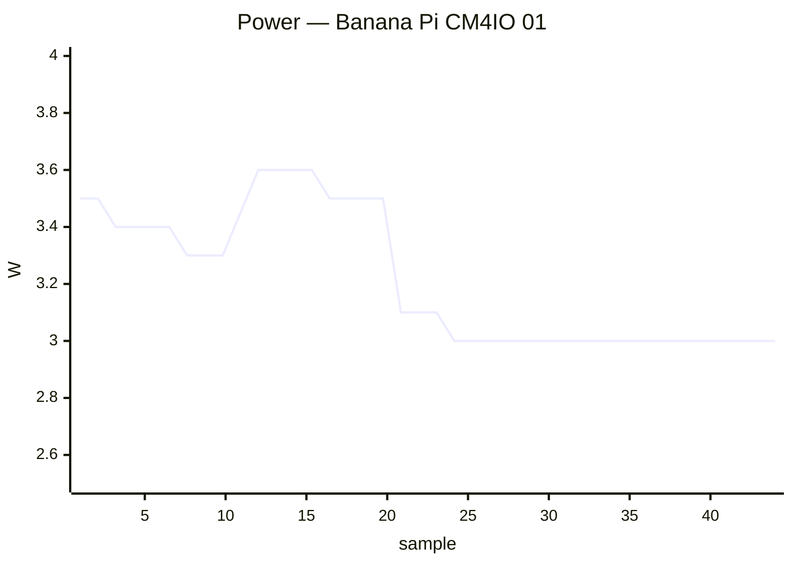
```mermaid
xychart-beta
    title "Power — Banana Pi CM4IO 01"
    x-axis "sample" 1 --> 44
    y-axis "W" 2.5 --> 4.0
    line [3.50, 3.50, 3.40, 3.40, 3.40, 3.40, 3.30, 3.30, 3.30, 3.45, 3.60, 3.60, 3.60, 3.60, 3.50, 3.50, 3.50, 3.50, 3.10, 3.10, 3.10, 3.00, 3.00, 3.00, 3.00, 3.00, 3.00, 3.00, 3.00, 3.00, 3.00, 3.00, 3.00, 3.00, 3.00, 3.00, 3.00, 3.00, 3.00, 3.00]
```

### ❌ BananaPi BPI-M4-Zero 01

`bananapim4zero` · **inplace** · image `26.11.0-trunk.73` · 6 ✅ · 1 ❌ · 1 ⏭️

| Module | Status | Time | Detail |
|:--|:--:|--:|:--|
| upgrade | ✅ | 74.2 s | nightly · 26.11.0-trunk.73 → 26.11.0-trunk.73 |
| reboot | ✅ | 75.9 s | power-cycle · up 24 s |
| kernel-switch | ✅ | 51.5 s | branch=current · family=sunxi64 · installed=26.11.0-trunk.73 · boot_image=/boot/vmlinuz-6.18.55-current-sunxi64 · kernel_before=6.18.55-current-sunxi64 |
| reboot | ✅ | 104.2 s | power-cycle · 2/2 boots · up 25 s |
| hw-performance | ✅ | 32.2 s | AES 660 · mem 3600 · disk W 13 / R 22 MB/s · 55.1 °C · 1416 MHz |
| dvfs | ✅ | 29.9 s | ondemand · 480–1416 MHz (peak 1416) |
| network-iperf | ⏭️ | 78.5 s | no iperf3 on board |
| store-versions | ❌ | 13.3 s | — |

### ❌ Khadas VIM1S 01

`khadas-vim1s` · **inplace** · image `26.8.3` · 0 ✅ · 1 ❌ · 0 ⏭️

| Module | Status | Time | Detail |
|:--|:--:|--:|:--|
| reachable | ❌ | 0.0 s | ip=10.0.50.19 · reachable=False · port=22 |

**Power** — min 1.70 W · avg 1.70 W · peak 1.70 W · 45 samples

```mermaid
xychart-beta
    title "Power — Khadas VIM1S 01"
    x-axis "sample" 1 --> 45
    y-axis "W" 1.5 --> 2.0
    line [1.70, 1.70, 1.70, 1.70, 1.70, 1.70, 1.70, 1.70, 1.70, 1.70, 1.70, 1.70, 1.70, 1.70, 1.70, 1.70, 1.70, 1.70, 1.70, 1.70, 1.70, 1.70, 1.70, 1.70, 1.70, 1.70, 1.70, 1.70, 1.70, 1.70, 1.70, 1.70, 1.70, 1.70, 1.70, 1.70, 1.70, 1.70, 1.70, 1.70]
```

### ❌ Khadas VIM4 01

`khadas-vim4` · **inplace** · image `26.11.0-trunk.58` · 7 ✅ · 1 ❌ · 0 ⏭️

| Module | Status | Time | Detail |
|:--|:--:|--:|:--|
| upgrade | ✅ | 92.3 s | nightly · 26.11.0-trunk.66 → 26.11.0-trunk.66 |
| reboot | ✅ | 36.7 s | warm · up 18 s |
| kernel-switch | ❌ | 39.7 s | branch=legacy · family=meson-s4t7 · installed=26.11.0-trunk.66 · boot_image=/boot/vmlinuz-6.18.54-current-mt7623 · kernel_before=5.15.137-legacy-meson-s4t7 |
| reboot | ✅ | 46.3 s | warm · 2/2 boots · up 6 s |
| hw-performance | ✅ | 49.4 s | AES 25 · mem 1600 · disk W 20 / R 22 MB/s · 47.7 °C · 2208 MHz |
| dvfs | ✅ | 30.5 s | ondemand · 500–2208 MHz (peak 2208) |
| network-iperf | ✅ | 42.8 s | lan2 ↑939/↓916 Mbps |
| store-versions | ✅ | 8.7 s | 26.11.0-trunk.66 · 6.18.54-current-mt7623 |

### ❌ NanoPi M5 01

`nanopi-m5` · **inplace** · image `26.11.0-trunk.73` · 0 ✅ · 1 ❌ · 0 ⏭️

| Module | Status | Time | Detail |
|:--|:--:|--:|:--|
| reachable | ❌ | 0.0 s | ip=10.0.50.54 · reachable=False · port=22 |

**Power** — min 3.80 W · avg 3.88 W · peak 3.90 W · 43 samples

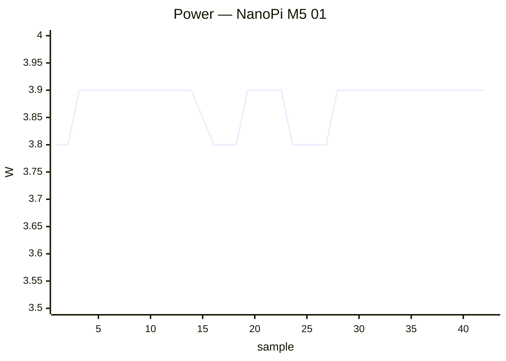
```mermaid
xychart-beta
    title "Power — NanoPi M5 01"
    x-axis "sample" 1 --> 43
    y-axis "W" 3.5 --> 4.0
    line [3.80, 3.80, 3.90, 3.90, 3.90, 3.90, 3.90, 3.90, 3.90, 3.90, 3.90, 3.90, 3.90, 3.85, 3.80, 3.80, 3.80, 3.90, 3.90, 3.90, 3.90, 3.80, 3.80, 3.80, 3.80, 3.90, 3.90, 3.90, 3.90, 3.90, 3.90, 3.90, 3.90, 3.90, 3.90, 3.90, 3.90, 3.90, 3.90, 3.90]
```

### ❌ Odroid XU4 01

`odroidxu4` · **inplace** · image `26.11.0-trunk.66` · 0 ✅ · 1 ❌ · 0 ⏭️

| Module | Status | Time | Detail |
|:--|:--:|--:|:--|
| reachable | ❌ | 0.0 s | ip=10.0.50.30 · reachable=False · port=22 |

### ❌ Orange Pi 5 01

`orangepi5` · **inplace** · image `26.11.0-trunk.72` · 0 ✅ · 1 ❌ · 0 ⏭️

| Module | Status | Time | Detail |
|:--|:--:|--:|:--|
| reachable | ❌ | 0.0 s | ip=10.0.50.60 · reachable=False · port=22 |

**Power** — min 2.30 W · avg 2.32 W · peak 2.40 W · 41 samples

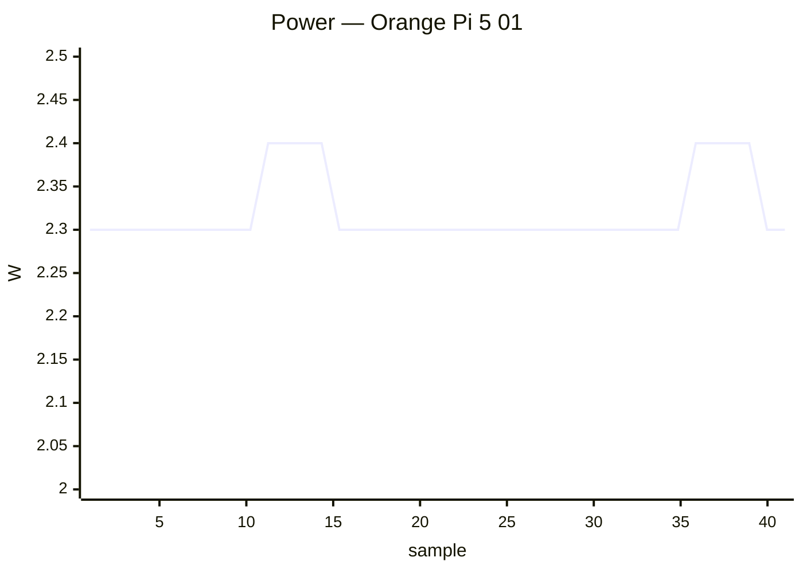
```mermaid
xychart-beta
    title "Power — Orange Pi 5 01"
    x-axis "sample" 1 --> 41
    y-axis "W" 2.0 --> 2.5
    line [2.30, 2.30, 2.30, 2.30, 2.30, 2.30, 2.30, 2.30, 2.30, 2.30, 2.40, 2.40, 2.40, 2.40, 2.30, 2.30, 2.30, 2.30, 2.30, 2.30, 2.30, 2.30, 2.30, 2.30, 2.30, 2.30, 2.30, 2.30, 2.30, 2.30, 2.30, 2.30, 2.30, 2.30, 2.40, 2.40, 2.40, 2.40, 2.30, 2.30]
```

### ❌ Orange Pi PC + 01

`orangepipcplus` · **inplace** · image `26.11.0-trunk.72` · 0 ✅ · 1 ❌ · 0 ⏭️

| Module | Status | Time | Detail |
|:--|:--:|--:|:--|
| reachable | ❌ | 0.0 s | ip=10.0.50.38 · reachable=False · port=22 |

### ❌ Orange Pi Prime 01

`orangepiprime` · **inplace** · image `26.11.0-trunk.66` · 0 ✅ · 1 ❌ · 0 ⏭️

| Module | Status | Time | Detail |
|:--|:--:|--:|:--|
| reachable | ❌ | 0.0 s | ip=10.0.50.36 · reachable=False · port=22 |

### ❌ OrangePi 3 LTS 01

`orangepi3-lts` · **inplace** · image `26.11.0-trunk.73` · 0 ✅ · 1 ❌ · 0 ⏭️

| Module | Status | Time | Detail |
|:--|:--:|--:|:--|
| reachable | ❌ | 0.0 s | ip=10.0.50.46 · reachable=False · port=22 |

**Power** — min 1.80 W · avg 1.83 W · peak 1.90 W · 46 samples

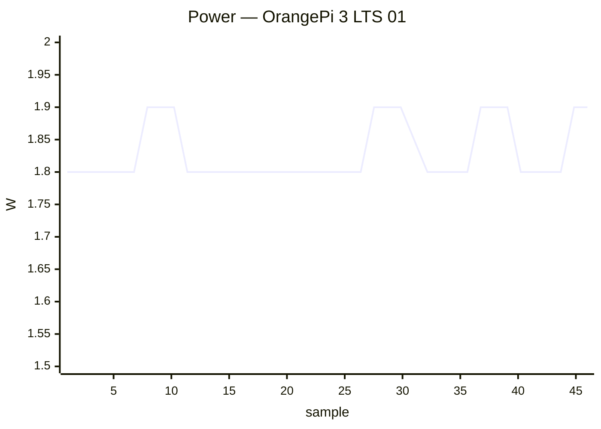
```mermaid
xychart-beta
    title "Power — OrangePi 3 LTS 01"
    x-axis "sample" 1 --> 46
    y-axis "W" 1.5 --> 2.0
    line [1.80, 1.80, 1.80, 1.80, 1.80, 1.80, 1.90, 1.90, 1.90, 1.80, 1.80, 1.80, 1.80, 1.80, 1.80, 1.80, 1.80, 1.80, 1.80, 1.80, 1.80, 1.80, 1.80, 1.90, 1.90, 1.90, 1.85, 1.80, 1.80, 1.80, 1.80, 1.90, 1.90, 1.90, 1.80, 1.80, 1.80, 1.80, 1.90, 1.90]
```

### ❌ ROCK 2F 01

`rock-2f` · **inplace** · image `26.8.1` · 0 ✅ · 1 ❌ · 0 ⏭️

| Module | Status | Time | Detail |
|:--|:--:|--:|:--|
| reachable | ❌ | 0.0 s | ip=10.0.20.164 · reachable=False · port=22 |

### ❌ Rock 5B 02

`rock-5b` · **inplace** · image `26.11.0-trunk.73` · 7 ✅ · 2 ❌ · 13 ⏭️

| Module | Status | Time | Detail |
|:--|:--:|--:|:--|
| upgrade | ⏭️ | 10.5 s | — |
| reboot | ✅ | 153.4 s | power-cycle · up 119 s |
| kernel-switch | ✅ | 19.7 s | branch=vendor · family=rk35xx · installed=26.11.0-trunk.73 · boot_image=/boot/vmlinuz-6.1.172-vendor-rk35xx · kernel_before=6.1.172-vendor-rk35xx |
| reboot | ✅ | 261.0 s | power-cycle · 2/2 boots · up 121 s |
| hw-performance | ✅ | 17.1 s | AES 1305 · mem 14000 · disk W 65 / R 82 MB/s · 54.5 °C · 1800 MHz |
| dvfs | ✅ | 17.0 s | ondemand · 1800–1800 MHz (peak 2352) |
| network-iperf | ❌ | 464.3 s | enP4p65s0 ↑2353/↓2349 (2.5GE) · wlP2p33s0 ↑0/↓0 (Wi-Fi 6) Mbps |
| store-versions | ✅ | 4.0 s | 26.11.0-trunk.73 · 6.1.172-vendor-rk35xx |
| kernel-switch | ✅ | 97.5 s | branch=current · family=rockchip64 · installed=26.11.0-trunk.73 · boot_image=/boot/vmlinuz-6.18.55-current-rockchip64 · kernel_before=6.1.172-vendor-rk35xx |
| reboot | ❌ | 275.4 s | power-cycle · 2/2 boots · up 100 s |
| hw-perf | ⏭️ | 0.0 s | board down after reboot/power-cycle |
| dvfs | ⏭️ | 0.0 s | — |
| net-iperf | ⏭️ | 0.0 s | board down after reboot/power-cycle |
| store-versions | ⏭️ | 0.0 s | — |
| kernel-switch | ⏭️ | 0.0 s | skipped=board down after reboot/power-cycle |
| reboot | ⏭️ | 0.0 s | reboot |
| hw-perf | ⏭️ | 0.0 s | board down after reboot/power-cycle |
| dvfs | ⏭️ | 0.0 s | — |
| net-iperf | ⏭️ | 0.0 s | board down after reboot/power-cycle |
| store-versions | ⏭️ | 0.0 s | — |
| kernel-switch | ⏭️ | 0.0 s | skipped=board down after reboot/power-cycle |
| reboot | ⏭️ | 0.0 s | reboot |

**Power** — min 0.60 W · avg 4.33 W · peak 12.40 W · 917 samples

```mermaid
xychart-beta
    title "Power — Rock 5B 02"
    x-axis "sample" 1 --> 917
    y-axis "W" 0.5 --> 12.5
    line [3.34, 3.91, 3.93, 3.90, 4.05, 4.70, 4.03, 3.30, 3.37, 3.23, 4.17, 3.90, 3.91, 4.99, 6.47, 4.31, 3.97, 3.95, 3.95, 3.98, 3.90, 3.90, 3.90, 3.98, 3.93, 3.92, 3.93, 3.96, 4.13, 4.76, 4.94, 4.70, 4.85, 5.41, 5.40, 5.41, 4.03, 5.63, 5.50, 5.68]
```

### ❌ Rockpi S 01

`rockpi-s` · **inplace** · image `26.11.0-trunk.73` · 15 ✅ · 1 ❌ · 0 ⏭️

| Module | Status | Time | Detail |
|:--|:--:|--:|:--|
| upgrade | ✅ | 112.9 s | nightly · 26.11.0-trunk.73 → 26.11.0-trunk.73 |
| reboot | ✅ | 72.5 s | power-cycle · up 33 s |
| kernel-switch | ✅ | 72.7 s | branch=current · family=rockchip64 · installed=26.11.0-trunk.73 · boot_image=/boot/vmlinuz-6.18.55-current-rockchip64 · kernel_before=6.18.55-current-rockchip64 |
| reboot | ✅ | 109.5 s | power-cycle · 2/2 boots · up 31 s |
| hw-performance | ✅ | 41.2 s | AES 218 · mem 1300 · disk W 20 / R 22 MB/s · 49.5 °C · 1008 MHz |
| dvfs | ✅ | 35.8 s | ondemand · 408–1008 MHz (peak 1008) |
| network-iperf | ✅ | 120.2 s | end0 ↑94/↓94 (10/100ME) · wlan0 ↑3/↓9 (Wi-Fi 4) Mbps |
| store-versions | ✅ | 7.7 s | 26.11.0-trunk.73 · 6.18.55-current-rockchip64 |
| kernel-switch | ✅ | 262.6 s | branch=edge · family=rockchip64 · installed=26.11.0-trunk.73 · boot_image=/boot/vmlinuz-7.2.9-edge-rockchip64 · kernel_before=6.18.55-current-rockchip64 |
| reboot | ✅ | 108.8 s | power-cycle · 2/2 boots · up 30 s |
| hw-performance | ✅ | 41.3 s | AES 218 · mem 1300 · disk W 21 / R 22 MB/s · 51.7 °C · 1008 MHz |
| dvfs | ✅ | 36.2 s | ondemand · 408–1008 MHz (peak 1008) |
| network-iperf | ✅ | 75.5 s | end0 ↑94/↓94 (10/100ME) · wlan0 ↑1/↓5 (Wi-Fi 4) Mbps |
| store-versions | ✅ | 7.7 s | 26.11.0-trunk.73 · 7.2.9-edge-rockchip64 |
| kernel-switch | ✅ | 254.5 s | branch=current · family=rockchip64 · installed=26.11.0-trunk.73 · boot_image=/boot/vmlinuz-6.18.55-current-rockchip64 · kernel_before=7.2.9-edge-rockchip64 |
| reboot | ❌ | 223.5 s | power-cycle |

**Power** — min 1.00 W · avg 1.42 W · peak 2.30 W · 1274 samples

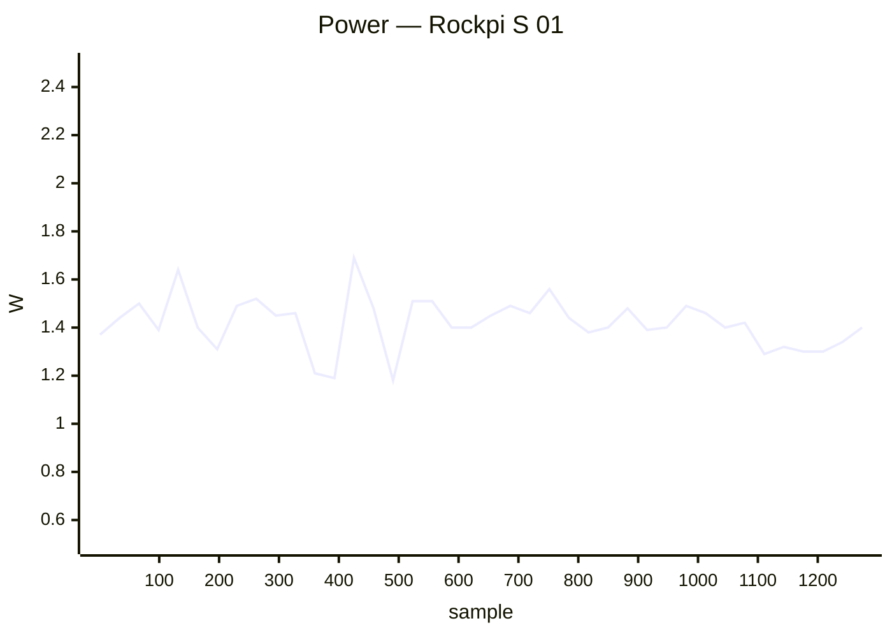
```mermaid
xychart-beta
    title "Power — Rockpi S 01"
    x-axis "sample" 1 --> 1274
    y-axis "W" 0.5 --> 2.5
    line [1.37, 1.44, 1.50, 1.39, 1.64, 1.40, 1.31, 1.49, 1.52, 1.45, 1.46, 1.21, 1.19, 1.69, 1.48, 1.18, 1.51, 1.51, 1.40, 1.40, 1.45, 1.49, 1.46, 1.56, 1.44, 1.38, 1.40, 1.48, 1.39, 1.40, 1.49, 1.46, 1.40, 1.42, 1.29, 1.32, 1.30, 1.30, 1.34, 1.40]
```

### ❌ SpacemiT MusePi Pro 01

`musepipro` · **inplace** · image `26.11.0-trunk.73` · 1 ✅ · 1 ❌ · 4 ⏭️

| Module | Status | Time | Detail |
|:--|:--:|--:|:--|
| upgrade | ✅ | 77.9 s | nightly · 26.11.0-trunk.73 → 26.11.0-trunk.73 |
| reboot | ❌ | 218.9 s | power-cycle |
| hw-perf | ⏭️ | 0.0 s | board down after reboot/power-cycle |
| dvfs | ⏭️ | 0.0 s | — |
| net-iperf | ⏭️ | 0.0 s | board down after reboot/power-cycle |
| store-versions | ⏭️ | 0.0 s | — |

**Power** — min 1.70 W · avg 3.00 W · peak 4.20 W · 243 samples

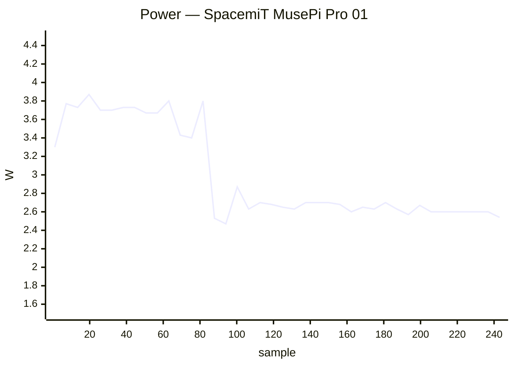
```mermaid
xychart-beta
    title "Power — SpacemiT MusePi Pro 01"
    x-axis "sample" 1 --> 243
    y-axis "W" 1.5 --> 4.5
    line [3.30, 3.77, 3.73, 3.87, 3.70, 3.70, 3.73, 3.73, 3.67, 3.67, 3.80, 3.43, 3.40, 3.80, 2.53, 2.47, 2.87, 2.63, 2.70, 2.68, 2.65, 2.63, 2.70, 2.70, 2.70, 2.68, 2.60, 2.65, 2.63, 2.70, 2.63, 2.57, 2.67, 2.60, 2.60, 2.60, 2.60, 2.60, 2.60, 2.54]
```

## ✅ Passed (54)

### ✅ Arduino UNO Q 01

`arduino-uno-q` · **inplace** · image `26.11.0-trunk.73` · 7 ✅ · 1 ❌ · 0 ⏭️

| Module | Status | Time | Detail |
|:--|:--:|--:|:--|
| upgrade | ✅ | 66.8 s | nightly · 26.11.0-trunk.73 → 26.11.0-trunk.73 |
| reboot | ✅ | 56.3 s | warm · up 37 s |
| kernel-switch | ✅ | 46.8 s | branch=edge · family=qrb2210 · installed=26.11.0-trunk.73 · boot_image=? · kernel_before=7.2.3-edge-qrb2210 |
| reboot | ✅ | 103.4 s | warm · 2/2 boots · up 36 s |
| hw-performance | ✅ | 25.1 s | AES 940 · mem 5100 · disk W 185 / R 261 MB/s · 39.3 °C · 2016 MHz |
| dvfs | ✅ | 31.8 s | schedutil · 300–2016 MHz (peak 2016) |
| network-iperf | ❌ | 215.6 s | wlan0 ↑0/↓0 (Wi-Fi 5) · usb0 ↑?/↓? Mbps |
| store-versions | ✅ | 25.3 s | 7.2.3-edge-qrb2210 |

### ✅ Banana Pi M2 Ultra 01

`bananapim2ultra` · **inplace** · image `26.11.0-trunk.73` · 16 ✅ · 0 ❌ · 0 ⏭️

| Module | Status | Time | Detail |
|:--|:--:|--:|:--|
| upgrade | ✅ | 112.6 s | nightly · 26.11.0-trunk.73 → 26.11.0-trunk.73 |
| reboot | ✅ | 44.8 s | warm · up 26 s |
| kernel-switch | ✅ | 68.6 s | branch=current · family=sunxi · installed=26.11.0-trunk.73 · boot_image=/boot/vmlinuz-6.18.55-current-sunxi · kernel_before=6.18.55-current-sunxi |
| reboot | ✅ | 88.9 s | warm · 2/2 boots · up 31 s |
| hw-performance | ✅ | 38.2 s | AES 23 · mem 2000 · disk W 14 / R 42 MB/s · 52.3 °C · 1200 MHz |
| dvfs | ✅ | 33.8 s | ondemand · 720–1200 MHz (peak 1200) |
| network-iperf | ✅ | 227.7 s | end0 ↑806/↓941 (1GE) · wlan0 ↑29/↓23 (Wi-Fi 4) Mbps |
| store-versions | ✅ | 7.4 s | 26.11.0-trunk.73 · 6.18.55-current-sunxi |
| kernel-switch | ✅ | 191.1 s | branch=edge · family=sunxi · installed=26.11.0-trunk.73 · boot_image=/boot/vmlinuz-7.2.9-edge-sunxi · kernel_before=6.18.55-current-sunxi |
| reboot | ✅ | 84.6 s | warm · 2/2 boots · up 28 s |
| hw-performance | ✅ | 38.1 s | AES 23 · mem 2000 · disk W 12 / R 42 MB/s · 53 °C · 1200 MHz |
| dvfs | ✅ | 37.7 s | ondemand · 720–1200 MHz (peak 1200) |
| network-iperf | ✅ | 116.7 s | end0 ↑819/↓934 (1GE) · wlan0 ↑13/↓17 (Wi-Fi 4) Mbps |
| store-versions | ✅ | 7.3 s | 26.11.0-trunk.73 · 7.2.9-edge-sunxi |
| kernel-switch | ✅ | 185.4 s | branch=current · family=sunxi · installed=26.11.0-trunk.73 · boot_image=/boot/vmlinuz-6.18.55-current-sunxi · kernel_before=7.2.9-edge-sunxi |
| reboot | ✅ | 45.0 s | warm · up 26 s |

### ✅ Banana Pi M2Pro 01

`bananapim2pro` · **inplace** · image `26.11.0-trunk.73` · 16 ✅ · 0 ❌ · 0 ⏭️

| Module | Status | Time | Detail |
|:--|:--:|--:|:--|
| upgrade | ✅ | 48.1 s | nightly · 26.11.0-trunk.73 → 26.11.0-trunk.73 |
| reboot | ✅ | 59.4 s | power-cycle · up 24 s |
| kernel-switch | ✅ | 31.7 s | branch=current · family=meson64 · installed=26.11.0-trunk.73 · boot_image=/boot/vmlinuz-6.18.55-current-meson64 · kernel_before=6.18.55-current-meson64 |
| reboot | ✅ | 167.3 s | power-cycle · 2/2 boots · up 104 s |
| hw-performance | ✅ | 19.1 s | AES 978 · mem 5300 · disk W 43 / R 158 MB/s · 48.4 °C · 2100 MHz |
| dvfs | ✅ | 19.4 s | ondemand · 1000–2100 MHz (peak 2100) |
| network-iperf | ✅ | 58.9 s | end0 ↑941/↓941 (1GE) Mbps |
| store-versions | ✅ | 5.0 s | 26.11.0-trunk.73 · 6.18.55-current-meson64 |
| kernel-switch | ✅ | 98.6 s | branch=edge · family=meson64 · installed=26.11.0-trunk.73 · boot_image=/boot/vmlinuz-7.2.9-edge-meson64 · kernel_before=6.18.55-current-meson64 |
| reboot | ✅ | 245.4 s | power-cycle · 2/2 boots · up 105 s |
| hw-performance | ✅ | 19.7 s | AES 980 · mem 5300 · disk W 42 / R 151 MB/s · 47.8 °C · 2100 MHz |
| dvfs | ✅ | 20.7 s | ondemand · 1000–2100 MHz (peak 2100) |
| network-iperf | ✅ | 58.2 s | end0 ↑941/↓941 (1GE) Mbps |
| store-versions | ✅ | 5.1 s | 26.11.0-trunk.73 · 7.2.9-edge-meson64 |
| kernel-switch | ✅ | 98.1 s | branch=current · family=meson64 · installed=26.11.0-trunk.73 · boot_image=/boot/vmlinuz-6.18.55-current-meson64 · kernel_before=7.2.9-edge-meson64 |
| reboot | ✅ | 138.2 s | power-cycle · up 103 s |

**Power** — min 1.40 W · avg 2.96 W · peak 5.50 W · 852 samples

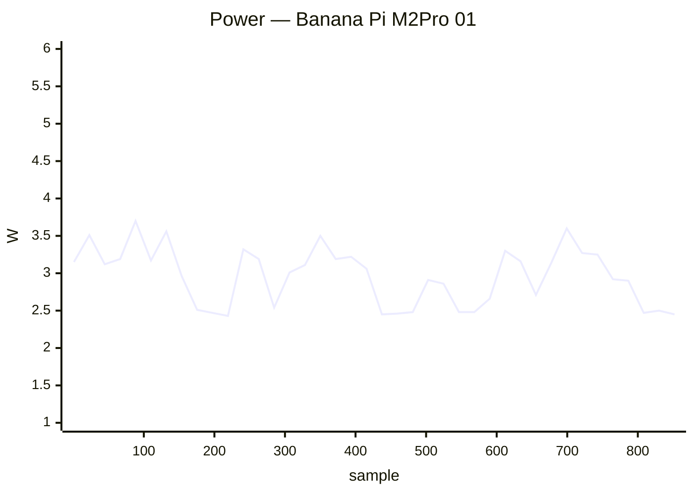
```mermaid
xychart-beta
    title "Power — Banana Pi M2Pro 01"
    x-axis "sample" 1 --> 852
    y-axis "W" 1.0 --> 6.0
    line [3.15, 3.51, 3.12, 3.19, 3.70, 3.17, 3.56, 2.96, 2.51, 2.47, 2.43, 3.32, 3.19, 2.54, 3.01, 3.11, 3.50, 3.19, 3.22, 3.06, 2.45, 2.46, 2.48, 2.91, 2.86, 2.48, 2.48, 2.66, 3.30, 3.16, 2.71, 3.14, 3.60, 3.27, 3.25, 2.92, 2.90, 2.47, 2.50, 2.45]
```

### ✅ Banana Pi M5 01

`bananapim5` · **inplace** · image `26.11.0-trunk.73` · 16 ✅ · 0 ❌ · 0 ⏭️

| Module | Status | Time | Detail |
|:--|:--:|--:|:--|
| upgrade | ✅ | 76.1 s | nightly · 26.11.0-trunk.73 → 26.11.0-trunk.73 |
| reboot | ✅ | 171.5 s | warm · up 156 s |
| kernel-switch | ✅ | 50.3 s | branch=current · family=meson64 · installed=26.11.0-trunk.73 · boot_image=/boot/vmlinuz-6.18.55-current-meson64 · kernel_before=6.18.55-current-meson64 |
| reboot | ✅ | 322.2 s | warm · 2/2 boots · up 149 s |
| hw-performance | ✅ | 39.0 s | AES 980 · mem 5300 · disk W 9 / R 15 MB/s · 53.1 °C · 2100 MHz |
| dvfs | ✅ | 21.2 s | ondemand · 1000–2100 MHz (peak 2100) |
| network-iperf | ✅ | 159.3 s | end0 ↑940/↓941 (1GE) · wlx000f13960190 ↑2/↓8 (Wi-Fi 4) Mbps |
| store-versions | ✅ | 4.6 s | 26.11.0-trunk.73 · 6.18.55-current-meson64 |
| kernel-switch | ✅ | 170.4 s | branch=edge · family=meson64 · installed=26.11.0-trunk.73 · boot_image=/boot/vmlinuz-7.2.9-edge-meson64 · kernel_before=6.18.55-current-meson64 |
| reboot | ✅ | 383.0 s | warm · 2/2 boots · up 178 s |
| hw-performance | ✅ | 38.4 s | AES 971 · mem 5200 · disk W 10 / R 15 MB/s · 53.6 °C · 2100 MHz |
| dvfs | ✅ | 21.1 s | ondemand · 1000–2100 MHz (peak 2100) |
| network-iperf | ✅ | 158.4 s | end0 ↑940/↓942 (1GE) · wlx000f13960190 ↑2/↓6 (Wi-Fi 4) Mbps |
| store-versions | ✅ | 4.6 s | 26.11.0-trunk.73 · 7.2.9-edge-meson64 |
| kernel-switch | ✅ | 178.6 s | branch=current · family=meson64 · installed=26.11.0-trunk.73 · boot_image=/boot/vmlinuz-6.18.55-current-meson64 · kernel_before=7.2.9-edge-meson64 |
| reboot | ✅ | 163.1 s | warm · up 147 s |

### ✅ Banana Pi M7 01

`bananapim7` · **inplace** · image `26.11.0-trunk.73` · 22 ✅ · 0 ❌ · 0 ⏭️

| Module | Status | Time | Detail |
|:--|:--:|--:|:--|
| upgrade | ✅ | 29.7 s | nightly · 26.11.0-trunk.73 → 26.11.0-trunk.73 |
| reboot | ✅ | 50.6 s | power-cycle · up 14 s |
| kernel-switch | ✅ | 18.7 s | branch=vendor · family=rk35xx · installed=26.11.0-trunk.73 · boot_image=/boot/vmlinuz-6.1.172-vendor-rk35xx · kernel_before=6.1.172-vendor-rk35xx |
| reboot | ✅ | 65.3 s | power-cycle · 2/2 boots · up 16 s |
| hw-performance | ✅ | 13.8 s | AES 1257 · mem 15200 · disk W 966 / R 1252 MB/s · 61.9 °C · 1800 MHz |
| dvfs | ✅ | 17.5 s | ondemand · 1800–1800 MHz (peak 2256) |
| network-iperf | ✅ | 50.7 s | enP2p33s0 ↑2353/↓2314 (2.5GE) · enP4p65s0 ↑2347/↓2341 (2.5GE) Mbps |
| store-versions | ✅ | 3.9 s | 26.11.0-trunk.73 · 6.1.172-vendor-rk35xx |
| kernel-switch | ✅ | 53.2 s | branch=current · family=rockchip64 · installed=26.11.0-trunk.73 · boot_image=/boot/vmlinuz-6.18.55-current-rockchip64 · kernel_before=6.1.172-vendor-rk35xx |
| reboot | ✅ | 237.9 s | power-cycle · 2/2 boots · up 97 s |
| hw-performance | ✅ | 13.4 s | AES 1251 · mem 10100 · disk W 960 / R 1612 MB/s · 65.6 °C · 1800 MHz |
| dvfs | ✅ | 14.6 s | ondemand · 408–1800 MHz (peak 2400) |
| network-iperf | ✅ | 151.7 s | enP2p33s0 ↑2352/↓2354 (2.5GE) · enP4p65s0 ↑1620/↓2251 (2.5GE) Mbps |
| store-versions | ✅ | 3.6 s | 26.11.0-trunk.73 · 6.18.55-current-rockchip64 |
| kernel-switch | ✅ | 51.6 s | branch=edge · family=rockchip64 · installed=26.11.0-trunk.73 · boot_image=/boot/vmlinuz-7.2.9-edge-rockchip64 · kernel_before=6.18.55-current-rockchip64 |
| reboot | ✅ | 230.7 s | power-cycle · 2/2 boots · up 97 s |
| hw-performance | ✅ | 13.3 s | AES 1252 · mem 8000 · disk W 909 / R 1061 MB/s · 67.5 °C · 1800 MHz |
| dvfs | ✅ | 14.2 s | ondemand · 408–1800 MHz (peak 2400) |
| network-iperf | ✅ | 64.7 s | enP2p33s0 ↑2352/↓2354 (2.5GE) · enP4p65s0 ↑2351/↓1426 (2.5GE) Mbps |
| store-versions | ✅ | 4.5 s | 26.11.0-trunk.73 · 7.2.9-edge-rockchip64 |
| kernel-switch | ✅ | 51.2 s | branch=vendor · family=rk35xx · installed=26.11.0-trunk.73 · boot_image=/boot/vmlinuz-6.1.172-vendor-rk35xx · kernel_before=7.2.9-edge-rockchip64 |
| reboot | ✅ | 46.8 s | power-cycle · up 17 s |

**Power** — min 0.60 W · avg 7.09 W · peak 14.40 W · 787 samples

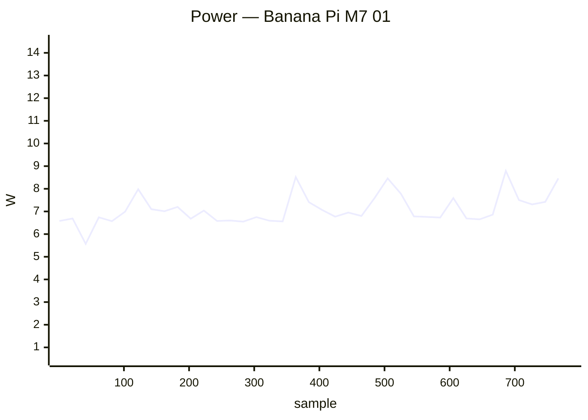
```mermaid
xychart-beta
    title "Power — Banana Pi M7 01"
    x-axis "sample" 1 --> 787
    y-axis "W" 0.5 --> 14.5
    line [6.58, 6.69, 5.57, 6.74, 6.57, 6.99, 7.98, 7.10, 7.01, 7.20, 6.68, 7.04, 6.58, 6.60, 6.55, 6.75, 6.59, 6.56, 8.52, 7.41, 7.07, 6.77, 6.95, 6.80, 7.59, 8.46, 7.79, 6.78, 6.76, 6.73, 7.59, 6.69, 6.65, 6.86, 8.79, 7.50, 7.31, 7.42, 8.46, 6.75]
```

### ✅ Banana Pi R2 01

`bananapir2` · **inplace** · image `26.11.0-trunk.73` · 16 ✅ · 0 ❌ · 0 ⏭️

| Module | Status | Time | Detail |
|:--|:--:|--:|:--|
| upgrade | ✅ | 95.2 s | nightly · 26.11.0-trunk.73 → 26.11.0-trunk.73 |
| reboot | ✅ | 79.0 s | power-cycle · up 39 s |
| kernel-switch | ✅ | 60.2 s | branch=current · family=mt7623 · installed=26.11.0-trunk.73 · boot_image=/boot/vmlinuz-6.18.55-current-mt7623 · kernel_before=6.18.55-current-mt7623 |
| reboot | ✅ | 113.8 s | power-cycle · 2/2 boots · up 36 s |
| hw-performance | ✅ | 45.3 s | AES 25 · mem 1600 · disk W 15 / R 22 MB/s · 46.9 °C · 1300 MHz |
| dvfs | ✅ | 40.7 s | ondemand · 98–1300 MHz (peak 1300) |
| network-iperf | ✅ | 83.5 s | lan2 ↑938/↓920 Mbps |
| store-versions | ✅ | 8.6 s | 26.11.0-trunk.73 · 6.18.55-current-mt7623 |
| kernel-switch | ✅ | 140.6 s | branch=edge · family=mt7623 · installed=26.11.0-trunk.73 · boot_image=/boot/vmlinuz-7.2.9-edge-mt7623 · kernel_before=6.18.55-current-mt7623 |
| reboot | ✅ | 117.6 s | power-cycle · 2/2 boots · up 38 s |
| hw-performance | ✅ | 44.4 s | AES 25 · mem 1600 · disk W 20 / R 22 MB/s · 46.6 °C · 1300 MHz |
| dvfs | ✅ | 43.3 s | ondemand · 98–1300 MHz (peak 1300) |
| network-iperf | ✅ | 86.5 s | lan2 ↑939/↓926 Mbps |
| store-versions | ✅ | 9.4 s | 26.11.0-trunk.73 · 7.2.9-edge-mt7623 |
| kernel-switch | ✅ | 140.4 s | branch=current · family=mt7623 · installed=26.11.0-trunk.73 · boot_image=/boot/vmlinuz-6.18.55-current-mt7623 · kernel_before=7.2.9-edge-mt7623 |
| reboot | ✅ | 78.6 s | power-cycle · up 38 s |

**Power** — min 2.70 W · avg 5.09 W · peak 6.50 W · 943 samples

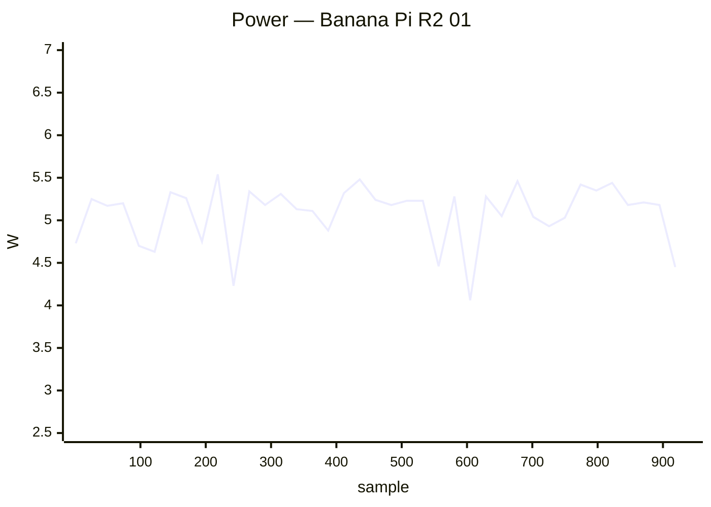
```mermaid
xychart-beta
    title "Power — Banana Pi R2 01"
    x-axis "sample" 1 --> 943
    y-axis "W" 2.5 --> 7.0
    line [4.73, 5.25, 5.17, 5.20, 4.70, 4.63, 5.33, 5.26, 4.75, 5.54, 4.23, 5.34, 5.18, 5.31, 5.13, 5.11, 4.88, 5.32, 5.48, 5.24, 5.18, 5.23, 5.23, 4.46, 5.28, 4.06, 5.28, 5.05, 5.46, 5.04, 4.93, 5.03, 5.42, 5.35, 5.44, 5.18, 5.21, 5.18, 4.45, 5.22]
```

### ✅ Banana Pi R3 Mini 01

`bananapir3mini` · **inplace** · image `26.11.0-trunk` · 4 ✅ · 0 ❌ · 2 ⏭️

| Module | Status | Time | Detail |
|:--|:--:|--:|:--|
| upgrade | ⏭️ | 20.0 s | — |
| reboot | ✅ | 70.2 s | power-cycle · up 33 s |
| hw-performance | ✅ | 20.1 s | AES 934 · mem 3200 · disk W 78 / R 91 MB/s · 69.2 °C · None MHz |
| dvfs | ➖ | 2.1 s | no cpufreq |
| network-iperf | ✅ | 150.5 s | eth0 ↑940/↓942 (1GE) · eth1 ↑941/↓942 (1GE) · wlan0 ↑18/↓37 (Wi-Fi 6) · wlan1 ↑424/↓365 (Wi-Fi 6) Mbps |
| store-versions | ✅ | 4.4 s | 26.11.0-trunk · 6.18.52-current-filogic-mt7986 |

**Power** — min 3.60 W · avg 7.57 W · peak 12.70 W · 218 samples

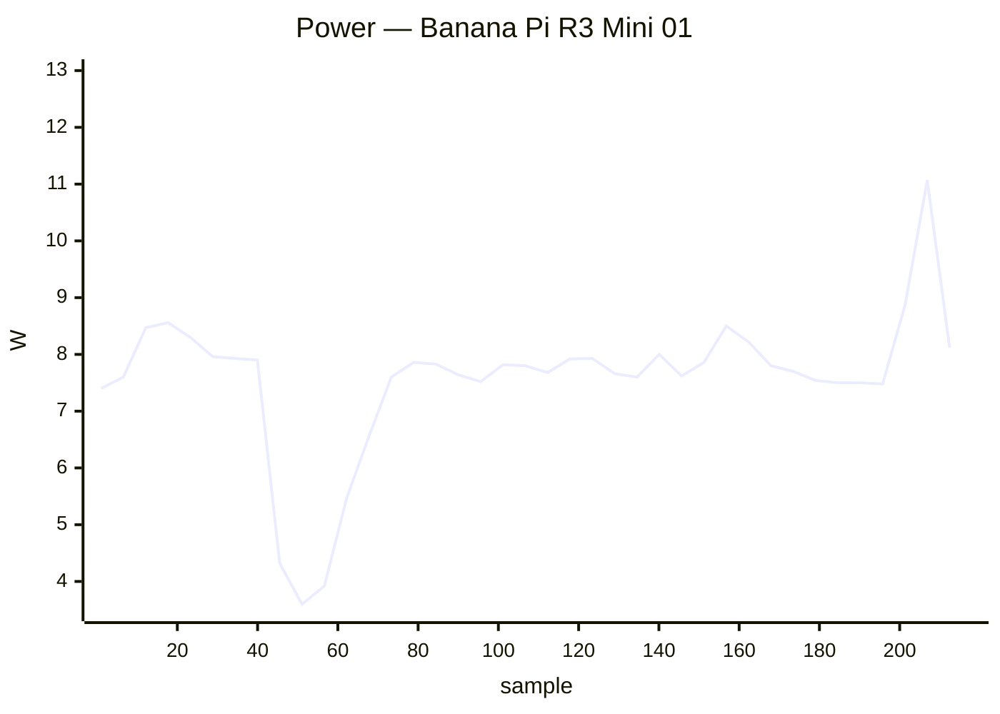
```mermaid
xychart-beta
    title "Power — Banana Pi R3 Mini 01"
    x-axis "sample" 1 --> 218
    y-axis "W" 3.5 --> 13.0
    line [7.40, 7.60, 8.47, 8.56, 8.30, 7.96, 7.93, 7.90, 4.32, 3.60, 3.92, 5.47, 6.56, 7.60, 7.86, 7.83, 7.64, 7.52, 7.82, 7.80, 7.68, 7.92, 7.93, 7.66, 7.60, 8.00, 7.62, 7.86, 8.50, 8.22, 7.80, 7.70, 7.54, 7.50, 7.50, 7.48, 8.86, 11.07, 8.12, 7.90]
```

### ✅ BananaPi BPI-F3 01

`musepipro` · **inplace** · image `26.11.0-trunk.73` · 6 ✅ · 0 ❌ · 0 ⏭️

| Module | Status | Time | Detail |
|:--|:--:|--:|:--|
| upgrade | ✅ | 76.2 s | nightly · 26.11.0-trunk.73 → 26.11.0-trunk.73 |
| reboot | ✅ | 57.1 s | power-cycle · up 18 s |
| hw-performance | ✅ | 24.7 s | AES 27 · mem 3000 · disk W 24 / R 82 MB/s · 47 °C · 1600 MHz |
| dvfs | ✅ | 23.6 s | performance · 614–1600 MHz (peak 1600) |
| network-iperf | ✅ | 172.3 s | eth0 ↑941/↓942 (1GE) · wlan0 ↑274/↓304 (Wi-Fi 6) · wlan1 ↑272/↓172 (Wi-Fi 5) Mbps |
| store-versions | ✅ | 5.3 s | 26.11.0-trunk.73 · 6.18.55-current-spacemit |

**Power** — min 3.00 W · avg 5.19 W · peak 7.90 W · 288 samples

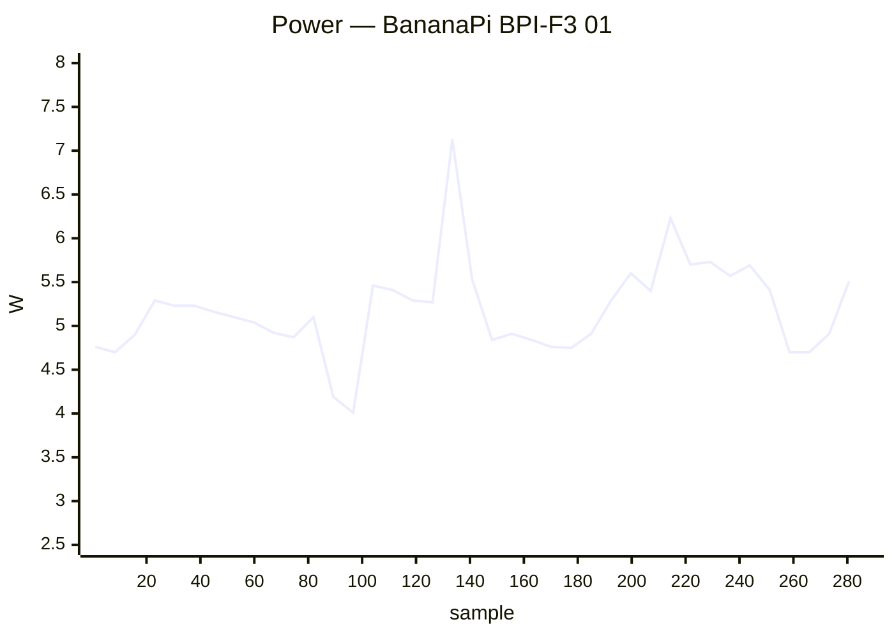
```mermaid
xychart-beta
    title "Power — BananaPi BPI-F3 01"
    x-axis "sample" 1 --> 288
    y-axis "W" 2.5 --> 8.0
    line [4.76, 4.70, 4.90, 5.29, 5.23, 5.23, 5.16, 5.10, 5.04, 4.92, 4.87, 5.10, 4.19, 4.01, 5.46, 5.41, 5.29, 5.27, 7.13, 5.53, 4.84, 4.91, 4.84, 4.76, 4.75, 4.91, 5.29, 5.60, 5.40, 6.23, 5.70, 5.73, 5.57, 5.69, 5.41, 4.70, 4.70, 4.91, 5.51, 5.48]
```

### ✅ Clearfog Pro 01

`clearfogpro` · **inplace** · image `26.11.0-trunk.73` · 14 ✅ · 0 ❌ · 2 ⏭️

| Module | Status | Time | Detail |
|:--|:--:|--:|:--|
| upgrade | ✅ | 65.1 s | nightly · 26.11.0-trunk.73 → 26.11.0-trunk.73 |
| reboot | ✅ | 43.1 s | warm · up 24 s |
| kernel-switch | ✅ | 41.2 s | branch=current · family=mvebu · installed=26.11.0-trunk.73 · boot_image=/boot/vmlinuz-6.18.55-current-mvebu · kernel_before=6.18.55-current-mvebu |
| reboot | ✅ | 78.9 s | warm · 2/2 boots · up 25 s |
| hw-performance | ✅ | 33.8 s | AES 43 · mem 3800 · disk W 21 / R 22 MB/s · 60.8 °C · None MHz |
| dvfs | ➖ | 2.9 s | no cpufreq |
| network-iperf | ✅ | 36.4 s | lan2 ↑936/↓936 Mbps |
| store-versions | ✅ | 6.2 s | 26.11.0-trunk.73 · 6.18.55-current-mvebu |
| kernel-switch | ✅ | 103.4 s | branch=edge · family=mvebu · installed=26.11.0-trunk.73 · boot_image=/boot/vmlinuz-7.2.9-edge-mvebu · kernel_before=6.18.55-current-mvebu |
| reboot | ✅ | 75.1 s | warm · 2/2 boots · up 21 s |
| hw-performance | ✅ | 33.7 s | AES 43 · mem 3700 · disk W 20 / R 23 MB/s · 62.7 °C · None MHz |
| dvfs | ➖ | 2.8 s | no cpufreq |
| network-iperf | ✅ | 104.5 s | lan2 ↑936/↓936 Mbps |
| store-versions | ✅ | 6.1 s | 26.11.0-trunk.73 · 7.2.9-edge-mvebu |
| kernel-switch | ✅ | 102.6 s | branch=current · family=mvebu · installed=26.11.0-trunk.73 · boot_image=/boot/vmlinuz-6.18.55-current-mvebu · kernel_before=7.2.9-edge-mvebu |
| reboot | ✅ | 42.4 s | warm · up 23 s |

### ✅ Cubie A5E 01

`radxa-cubie-a5e` · **inplace** · image `26.11.0-trunk.73` · 14 ✅ · 0 ❌ · 2 ⏭️

| Module | Status | Time | Detail |
|:--|:--:|--:|:--|
| upgrade | ✅ | 303.2 s | nightly · 26.11.0-trunk.73 → 26.11.0-trunk.73 |
| reboot | ✅ | 70.7 s | power-cycle · up 31 s |
| kernel-switch | ✅ | 56.1 s | branch=current · family=sunxi64 · installed=26.11.0-trunk.73 · boot_image=? · kernel_before=6.18.55-current-sunxi64 |
| reboot | ✅ | 104.0 s | power-cycle · 2/2 boots · up 31 s |
| hw-performance | ✅ | 33.7 s | AES 358 · mem 2000 · disk W 21 / R 23 MB/s · 63.4 °C · None MHz |
| dvfs | ➖ | 2.8 s | no cpufreq |
| network-iperf | ✅ | 391.2 s | end0 ↑816/↓941 (1GE) · end1 ↑940/↓940 (1GE) · wlan0 ↑120/↓128 (Wi-Fi 6) Mbps |
| store-versions | ✅ | 5.8 s | 26.11.0-trunk.73 · 6.18.55-current-sunxi64 |
| kernel-switch | ✅ | 564.6 s | branch=edge · family=sunxi64 · installed=26.11.0-trunk.73 · boot_image=? · kernel_before=6.18.55-current-sunxi64 |
| reboot | ✅ | 104.6 s | power-cycle · 2/2 boots · up 32 s |
| hw-performance | ✅ | 34.0 s | AES 358 · mem 2000 · disk W 21 / R 1 MB/s · 69.7 °C · None MHz |
| dvfs | ➖ | 2.8 s | no cpufreq |
| network-iperf | ✅ | 165.5 s | end0 ↑830/↓940 (1GE) · end1 ↑940/↓940 (1GE) · wlan0 ↑120/↓127 (Wi-Fi 6) Mbps |
| store-versions | ✅ | 5.9 s | 26.11.0-trunk.73 · 7.2.9-edge-sunxi64 |
| kernel-switch | ✅ | 559.8 s | branch=current · family=sunxi64 · installed=26.11.0-trunk.73 · boot_image=? · kernel_before=7.2.9-edge-sunxi64 |
| reboot | ✅ | 67.9 s | power-cycle · up 32 s |

**Power** — min 1.40 W · avg 4.05 W · peak 6.40 W · 1984 samples

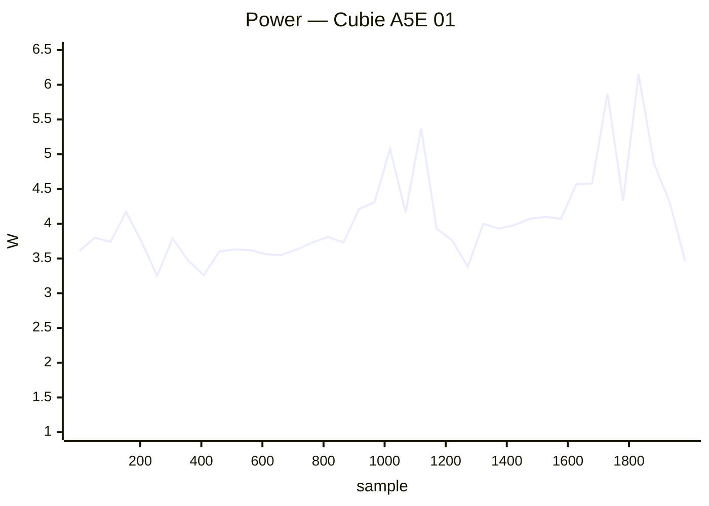
```mermaid
xychart-beta
    title "Power — Cubie A5E 01"
    x-axis "sample" 1 --> 1984
    y-axis "W" 1.0 --> 6.5
    line [3.61, 3.80, 3.74, 4.17, 3.74, 3.25, 3.79, 3.47, 3.26, 3.60, 3.63, 3.62, 3.56, 3.55, 3.63, 3.73, 3.81, 3.73, 4.21, 4.31, 5.08, 4.16, 5.37, 3.93, 3.76, 3.38, 4.00, 3.93, 3.98, 4.07, 4.10, 4.07, 4.57, 4.58, 5.87, 4.33, 6.15, 4.86, 4.31, 3.46]
```

### ✅ Cubietruck 01

`cubietruck` · **inplace** · image `26.11.0-trunk.73` · 16 ✅ · 0 ❌ · 0 ⏭️

| Module | Status | Time | Detail |
|:--|:--:|--:|:--|
| upgrade | ✅ | 145.6 s | nightly · 26.11.0-trunk.73 → 26.11.0-trunk.73 |
| reboot | ✅ | 74.8 s | warm · up 51 s |
| kernel-switch | ✅ | 92.9 s | branch=current · family=sunxi · installed=26.11.0-trunk.73 · boot_image=/boot/vmlinuz-6.18.55-current-sunxi · kernel_before=6.18.55-current-sunxi |
| reboot | ✅ | 132.8 s | warm · 2/2 boots · up 46 s |
| hw-performance | ✅ | 59.2 s | AES 19 · mem 1700 · disk W 15 / R 21 MB/s · 48.9 °C · 960 MHz |
| dvfs | ✅ | 56.6 s | ondemand · 528–960 MHz (peak 960) |
| network-iperf | ✅ | 249.3 s | end0 ↑716/↓798 (1GE) · wlan0 ↑16/↓11 (Wi-Fi 4) Mbps |
| store-versions | ✅ | 11.8 s | 26.11.0-trunk.73 · 6.18.55-current-sunxi |
| kernel-switch | ✅ | 230.5 s | branch=edge · family=sunxi · installed=26.11.0-trunk.73 · boot_image=/boot/vmlinuz-7.2.9-edge-sunxi · kernel_before=6.18.55-current-sunxi |
| reboot | ✅ | 130.3 s | warm · 2/2 boots · up 44 s |
| hw-performance | ✅ | 57.7 s | AES 18 · mem 1700 · disk W 15 / R 22 MB/s · 49.4 °C · 960 MHz |
| dvfs | ✅ | 57.2 s | ondemand · 528–960 MHz (peak 960) |
| network-iperf | ✅ | 94.6 s | end0 ↑609/↓918 (1GE) · wlan0 ↑12/↓19 (Wi-Fi 4) Mbps |
| store-versions | ✅ | 11.7 s | 26.11.0-trunk.73 · 7.2.9-edge-sunxi |
| kernel-switch | ✅ | 227.7 s | branch=current · family=sunxi · installed=26.11.0-trunk.73 · boot_image=/boot/vmlinuz-6.18.55-current-sunxi · kernel_before=7.2.9-edge-sunxi |
| reboot | ✅ | 69.3 s | warm · up 45 s |

### ✅ Cubox i2eX/i4 01

`cubox-i` · **inplace** · image `26.11.0-trunk.73` · 16 ✅ · 0 ❌ · 0 ⏭️

| Module | Status | Time | Detail |
|:--|:--:|--:|:--|
| upgrade | ✅ | 111.7 s | nightly · 26.11.0-trunk.73 → 26.11.0-trunk.73 |
| reboot | ✅ | 85.3 s | power-cycle · up 46 s |
| kernel-switch | ✅ | 71.9 s | branch=current · family=imx6 · installed=26.11.0-trunk.73 · boot_image=/boot/vmlinuz-6.18.55-current-imx6 · kernel_before=6.18.55-current-imx6 |
| reboot | ✅ | 154.2 s | power-cycle · 2/2 boots · up 57 s |
| hw-performance | ✅ | 47.1 s | AES 26 · mem 703 · disk W 19 / R 20 MB/s · 50.3 °C · 996 MHz |
| dvfs | ✅ | 40.4 s | ondemand · 396–996 MHz (peak 996) |
| network-iperf | ✅ | 79.2 s | end0 ↑94/↓94 (10/100ME) · wlan0 ↑21/↓15 (Wi-Fi 4) Mbps |
| store-versions | ✅ | 8.6 s | 26.11.0-trunk.73 · 6.18.55-current-imx6 |
| kernel-switch | ✅ | 275.2 s | branch=edge · family=imx6 · installed=26.11.0-trunk.73 · boot_image=/boot/vmlinuz-7.1.13-edge-imx6 · kernel_before=6.18.55-current-imx6 |
| reboot | ✅ | 141.1 s | power-cycle · 2/2 boots · up 45 s |
| hw-performance | ✅ | 47.1 s | AES 26 · mem 765 · disk W 19 / R 20 MB/s · 53.1 °C · 996 MHz |
| dvfs | ✅ | 43.3 s | ondemand · 396–996 MHz (peak 996) |
| network-iperf | ✅ | 96.5 s | end0 ↑94/↓94 (10/100ME) · wlan0 ↑20/↓16 (Wi-Fi 4) Mbps |
| store-versions | ✅ | 9.5 s | 26.11.0-trunk.73 · 7.1.13-edge-imx6 |
| kernel-switch | ✅ | 305.2 s | branch=current · family=imx6 · installed=26.11.0-trunk.73 · boot_image=/boot/vmlinuz-6.18.55-current-imx6 · kernel_before=7.1.13-edge-imx6 |
| reboot | ✅ | 115.4 s | power-cycle · up 75 s |

**Power** — min 1.70 W · avg 3.18 W · peak 5.70 W · 1328 samples

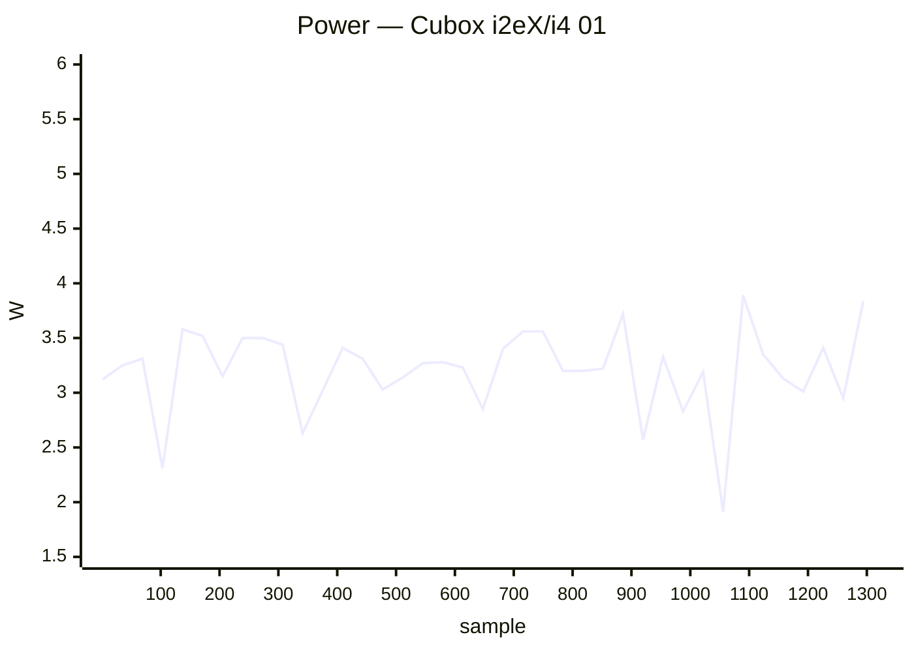
```mermaid
xychart-beta
    title "Power — Cubox i2eX/i4 01"
    x-axis "sample" 1 --> 1328
    y-axis "W" 1.5 --> 6.0
    line [3.12, 3.25, 3.31, 2.31, 3.58, 3.52, 3.15, 3.50, 3.50, 3.44, 2.63, 3.02, 3.41, 3.31, 3.03, 3.14, 3.27, 3.28, 3.23, 2.85, 3.40, 3.56, 3.56, 3.20, 3.20, 3.22, 3.72, 2.57, 3.33, 2.83, 3.19, 1.91, 3.89, 3.35, 3.13, 3.01, 3.41, 2.95, 3.84, 2.30]
```

### ✅ Espressobin 01

`espressobin` · **inplace** · image `26.11.0-trunk.73` · 16 ✅ · 0 ❌ · 0 ⏭️

| Module | Status | Time | Detail |
|:--|:--:|--:|:--|
| upgrade | ✅ | 122.7 s | nightly · 26.11.0-trunk.73 → 26.11.0-trunk.73 |
| reboot | ✅ | 79.4 s | power-cycle · up 41 s |
| kernel-switch | ✅ | 82.4 s | branch=current · family=mvebu64 · installed=26.11.0-trunk.73 · boot_image=/boot/vmlinuz-6.18.55-current-mvebu64 · kernel_before=6.18.55-current-mvebu64 |
| reboot | ✅ | 136.9 s | power-cycle · 2/2 boots · up 44 s |
| hw-performance | ✅ | 35.4 s | AES 371 · mem 2000 · disk W 15 / R 140 MB/s · None °C · 800 MHz |
| dvfs | ✅ | 34.7 s | ondemand · 200–800 MHz (peak 800) |
| network-iperf | ✅ | 79.7 s | lan0 ↑936/↓733 (1GE) Mbps |
| store-versions | ✅ | 8.1 s | 26.11.0-trunk.73 · 6.18.55-current-mvebu64 |
| kernel-switch | ✅ | 377.3 s | branch=edge · family=mvebu64 · installed=26.11.0-trunk.73 · boot_image=/boot/vmlinuz-7.1.13-edge-mvebu64 · kernel_before=6.18.55-current-mvebu64 |
| reboot | ✅ | 131.4 s | power-cycle · 2/2 boots · up 45 s |
| hw-performance | ✅ | 34.2 s | AES 371 · mem 2000 · disk W 25 / R 139 MB/s · None °C · 800 MHz |
| dvfs | ✅ | 35.5 s | ondemand · 200–800 MHz (peak 800) |
| network-iperf | ✅ | 83.9 s | lan0 ↑935/↓776 (1GE) Mbps |
| store-versions | ✅ | 8.4 s | 26.11.0-trunk.73 · 7.1.13-edge-mvebu64 |
| kernel-switch | ✅ | 356.8 s | branch=current · family=mvebu64 · installed=26.11.0-trunk.73 · boot_image=/boot/vmlinuz-6.18.55-current-mvebu64 · kernel_before=7.1.13-edge-mvebu64 |
| reboot | ✅ | 78.0 s | power-cycle · up 45 s |

### ✅ Helios4 01

`helios4` · **inplace** · image `26.11.0-trunk.73` · 14 ✅ · 0 ❌ · 2 ⏭️

| Module | Status | Time | Detail |
|:--|:--:|--:|:--|
| upgrade | ✅ | 56.9 s | nightly · 26.11.0-trunk.73 → 26.11.0-trunk.73 |
| reboot | ✅ | 119.8 s | warm · up 103 s |
| kernel-switch | ✅ | 34.2 s | branch=current · family=mvebu · installed=26.11.0-trunk.73 · boot_image=/boot/vmlinuz-6.18.55-current-mvebu · kernel_before=6.18.55-current-mvebu |
| reboot | ✅ | 234.7 s | warm · 2/2 boots · up 104 s |
| hw-performance | ✅ | 29.8 s | AES 43 · mem 3800 · disk W 21 / R 23 MB/s · 53.2 °C · None MHz |
| dvfs | ➖ | 2.3 s | no cpufreq |
| network-iperf | ✅ | 31.0 s | end1 ↑941/↓941 (1GE) Mbps |
| store-versions | ✅ | 4.7 s | 26.11.0-trunk.73 · 6.18.55-current-mvebu |
| kernel-switch | ✅ | 96.5 s | branch=edge · family=mvebu · installed=26.11.0-trunk.73 · boot_image=/boot/vmlinuz-7.2.9-edge-mvebu · kernel_before=6.18.55-current-mvebu |
| reboot | ✅ | 234.6 s | warm · 2/2 boots · up 104 s |
| hw-performance | ✅ | 29.9 s | AES 43 · mem 3800 · disk W 21 / R 23 MB/s · 54.6 °C · None MHz |
| dvfs | ➖ | 2.4 s | no cpufreq |
| network-iperf | ✅ | 31.5 s | end1 ↑940/↓941 (1GE) Mbps |
| store-versions | ✅ | 5.1 s | 26.11.0-trunk.73 · 7.2.9-edge-mvebu |
| kernel-switch | ✅ | 99.6 s | branch=current · family=mvebu · installed=26.11.0-trunk.73 · boot_image=/boot/vmlinuz-6.18.55-current-mvebu · kernel_before=7.2.9-edge-mvebu |
| reboot | ✅ | 119.7 s | warm · up 103 s |

### ✅ Inovato Quadra 01

`inovato-quadra` · **inplace** · image `26.11.0-trunk.73` · 16 ✅ · 0 ❌ · 0 ⏭️

| Module | Status | Time | Detail |
|:--|:--:|--:|:--|
| upgrade | ✅ | 59.4 s | nightly · 26.11.0-trunk.73 → 26.11.0-trunk.73 |
| reboot | ✅ | 61.3 s | power-cycle · up 22 s |
| kernel-switch | ✅ | 39.9 s | branch=current · family=sunxi64 · installed=26.11.0-trunk.73 · boot_image=/boot/vmlinuz-6.18.55-current-sunxi64 · kernel_before=6.18.55-current-sunxi64 |
| reboot | ✅ | 88.4 s | power-cycle · 2/2 boots · up 23 s |
| hw-performance | ✅ | 30.1 s | AES 794 · mem 2800 · disk W 14 / R 23 MB/s · 65.5 °C · 1704 MHz |
| dvfs | ✅ | 21.2 s | ondemand · 480–1704 MHz (peak 1704) |
| network-iperf | ✅ | 66.9 s | eth0 ↑94/↓94 (10/100ME) · wlan0 ↑9/↓12 (Wi-Fi 4) Mbps |
| store-versions | ✅ | 4.7 s | 26.11.0-trunk.73 · 6.18.55-current-sunxi64 |
| kernel-switch | ✅ | 116.2 s | branch=edge · family=sunxi64 · installed=26.11.0-trunk.73 · boot_image=/boot/vmlinuz-7.2.9-edge-sunxi64 · kernel_before=6.18.55-current-sunxi64 |
| reboot | ✅ | 83.8 s | power-cycle · 2/2 boots · up 20 s |
| hw-performance | ✅ | 30.4 s | AES 794 · mem 2800 · disk W 21 / R 1 MB/s · 65.2 °C · 1704 MHz |
| dvfs | ✅ | 21.9 s | ondemand · 480–1704 MHz (peak 1704) |
| network-iperf | ✅ | 64.9 s | eth0 ↑94/↓94 (10/100ME) · wlan0 ↑9/↓17 (Wi-Fi 4) Mbps |
| store-versions | ✅ | 4.7 s | 26.11.0-trunk.73 · 7.2.9-edge-sunxi64 |
| kernel-switch | ✅ | 119.7 s | branch=current · family=sunxi64 · installed=26.11.0-trunk.73 · boot_image=/boot/vmlinuz-6.18.55-current-sunxi64 · kernel_before=7.2.9-edge-sunxi64 |
| reboot | ✅ | 60.9 s | power-cycle · up 24 s |

**Power** — min 1.60 W · avg 3.95 W · peak 6.80 W · 698 samples

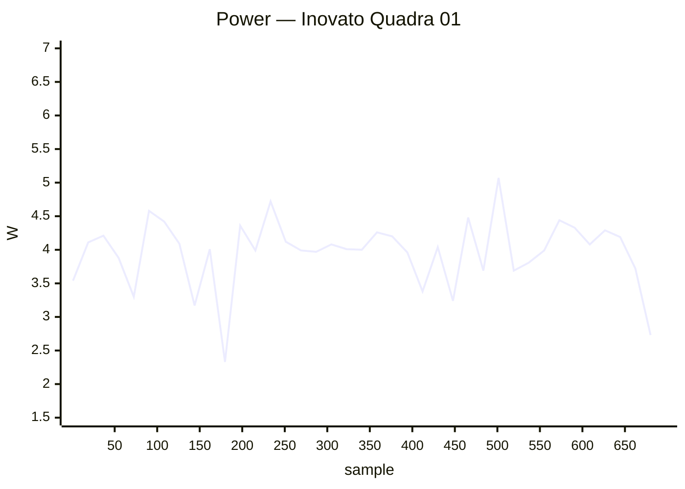
```mermaid
xychart-beta
    title "Power — Inovato Quadra 01"
    x-axis "sample" 1 --> 698
    y-axis "W" 1.5 --> 7.0
    line [3.54, 4.11, 4.21, 3.88, 3.30, 4.58, 4.42, 4.09, 3.17, 4.01, 2.33, 4.36, 3.99, 4.72, 4.12, 3.99, 3.97, 4.08, 4.01, 4.00, 4.26, 4.20, 3.96, 3.38, 4.04, 3.24, 4.48, 3.69, 5.07, 3.69, 3.81, 3.99, 4.44, 4.33, 4.08, 4.29, 4.19, 3.72, 2.73, 3.40]
```

### ✅ Khadas Edge2 01

`khadas-edge2` · **inplace** · image `26.11.0-trunk.73` · 14 ✅ · 0 ❌ · 2 ⏭️

| Module | Status | Time | Detail |
|:--|:--:|--:|:--|
| upgrade | ✅ | 36.1 s | nightly · 26.11.0-trunk.73 → 26.11.0-trunk.73 |
| reboot | ✅ | 31.2 s | warm · up 14 s |
| kernel-switch | ✅ | 22.6 s | branch=vendor · family=rk35xx · installed=26.11.0-trunk.73 · boot_image=/boot/vmlinuz-6.1.172-vendor-rk35xx · kernel_before=6.1.172-vendor-rk35xx |
| reboot | ✅ | 61.8 s | warm · 2/2 boots · up 18 s |
| hw-performance | ✅ | 15.4 s | AES 1279 · mem 15000 · disk W 103 / R 259 MB/s · 34.2 °C · 1800 MHz |
| dvfs | ✅ | 17.4 s | ondemand · 1800–1800 MHz (peak 2256) |
| network-iperf | ⏭️ | 6.4 s | no cabled interfaces |
| store-versions | ✅ | 4.2 s | 26.11.0-trunk.73 · 6.1.172-vendor-rk35xx |
| kernel-switch | ✅ | 70.6 s | branch=current · family=rockchip64 · installed=26.11.0-trunk.73 · boot_image=/boot/vmlinuz-6.18.55-current-rockchip64 · kernel_before=6.1.172-vendor-rk35xx |
| reboot | ✅ | 46.2 s | warm · 2/2 boots · up 7 s |
| hw-performance | ✅ | 15.7 s | AES 1271 · mem 10000 · disk W 105 / R 214 MB/s · 37.9 °C · 1800 MHz |
| dvfs | ✅ | 16.0 s | ondemand · 408–1800 MHz (peak 2400) |
| network-iperf | ⏭️ | 6.4 s | no cabled interfaces |
| store-versions | ✅ | 4.8 s | 26.11.0-trunk.73 · 6.18.55-current-rockchip64 |
| kernel-switch | ✅ | 55.2 s | branch=vendor · family=rk35xx · installed=26.11.0-trunk.73 · boot_image=/boot/vmlinuz-6.1.172-vendor-rk35xx · kernel_before=6.18.55-current-rockchip64 |
| reboot | ✅ | 28.2 s | warm · up 11 s |

### ✅ Khadas VIM1 01

`khadas-vim1` · **inplace** · image `26.11.0-trunk.73` · 16 ✅ · 0 ❌ · 0 ⏭️

| Module | Status | Time | Detail |
|:--|:--:|--:|:--|
| upgrade | ✅ | 68.1 s | nightly · 26.11.0-trunk.73 → 26.11.0-trunk.73 |
| reboot | ✅ | 94.2 s | power-cycle · up 54 s |
| kernel-switch | ✅ | 45.5 s | branch=current · family=meson64 · installed=26.11.0-trunk.73 · boot_image=/boot/vmlinuz-6.18.55-current-meson64 · kernel_before=6.18.55-current-meson64 |
| reboot | ✅ | 127.0 s | power-cycle · 2/2 boots · up 37 s |
| hw-performance | ✅ | 30.5 s | AES 659 · mem 3600 · disk W 1 / R 22 MB/s · 49 °C · 1512 MHz |
| dvfs | ✅ | 22.9 s | ondemand · 500–1512 MHz (peak 1512) |
| network-iperf | ✅ | 158.0 s | end0 ↑94/↓94 (10/100ME) · wlan0 ↑17/↓20 (Wi-Fi 5) Mbps |
| store-versions | ✅ | 5.0 s | 26.11.0-trunk.73 · 6.18.55-current-meson64 |
| kernel-switch | ✅ | 169.4 s | branch=edge · family=meson64 · installed=26.11.0-trunk.73 · boot_image=/boot/vmlinuz-7.2.9-edge-meson64 · kernel_before=6.18.55-current-meson64 |
| reboot | ✅ | 117.1 s | power-cycle · 2/2 boots · up 33 s |
| hw-performance | ✅ | 31.4 s | AES 658 · mem 3600 · disk W 18 / R 22 MB/s · 50 °C · 1512 MHz |
| dvfs | ✅ | 23.1 s | ondemand · 500–1512 MHz (peak 1512) |
| network-iperf | ✅ | 150.1 s | end0 ↑94/↓94 (10/100ME) · wlan0 ↑39/↓31 (Wi-Fi 5) Mbps |
| store-versions | ✅ | 5.0 s | 26.11.0-trunk.73 · 7.2.9-edge-meson64 |
| kernel-switch | ✅ | 160.6 s | branch=current · family=meson64 · installed=26.11.0-trunk.73 · boot_image=/boot/vmlinuz-6.18.55-current-meson64 · kernel_before=7.2.9-edge-meson64 |
| reboot | ✅ | 76.9 s | power-cycle · up 37 s |

**Power** — min 1.20 W · avg 2.13 W · peak 3.70 W · 1003 samples

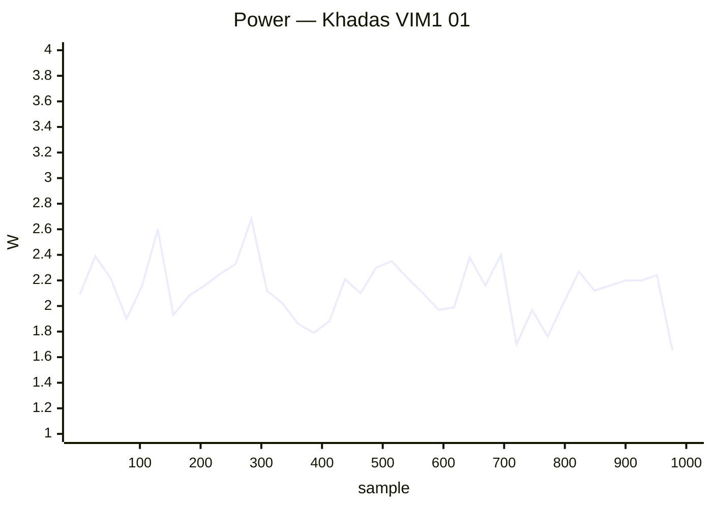
```mermaid
xychart-beta
    title "Power — Khadas VIM1 01"
    x-axis "sample" 1 --> 1003
    y-axis "W" 1.0 --> 4.0
    line [2.09, 2.39, 2.21, 1.90, 2.16, 2.60, 1.93, 2.08, 2.16, 2.25, 2.33, 2.68, 2.12, 2.02, 1.86, 1.79, 1.88, 2.21, 2.10, 2.30, 2.35, 2.22, 2.10, 1.97, 1.99, 2.38, 2.16, 2.40, 1.70, 1.97, 1.76, 2.02, 2.27, 2.12, 2.16, 2.20, 2.20, 2.24, 1.65, 2.08]
```

### ✅ Khadas VIM2 01

`khadas-vim2` · **inplace** · image `26.11.0-trunk.73` · 16 ✅ · 0 ❌ · 0 ⏭️

| Module | Status | Time | Detail |
|:--|:--:|--:|:--|
| upgrade | ✅ | 85.7 s | nightly · 26.11.0-trunk.73 → 26.11.0-trunk.73 |
| reboot | ✅ | 37.5 s | warm · up 21 s |
| kernel-switch | ✅ | 52.9 s | branch=current · family=meson64 · installed=26.11.0-trunk.73 · boot_image=/boot/vmlinuz-6.18.55-current-meson64 · kernel_before=6.18.55-current-meson64 |
| reboot | ✅ | 77.8 s | warm · 2/2 boots · up 26 s |
| hw-performance | ✅ | 24.6 s | AES 658 · mem 3600 · disk W 37 / R 149 MB/s · 55 °C · 1512 MHz |
| dvfs | ✅ | 25.5 s | ondemand · 500–1512 MHz (peak 1512) |
| network-iperf | ✅ | 65.3 s | eth0 ↑940/↓941 (1GE) · wlan0 ↑87/↓86 (Wi-Fi 5) Mbps |
| store-versions | ✅ | 5.7 s | 26.11.0-trunk.73 · 6.18.55-current-meson64 |
| kernel-switch | ✅ | 163.1 s | branch=edge · family=meson64 · installed=26.11.0-trunk.73 · boot_image=/boot/vmlinuz-7.2.9-edge-meson64 · kernel_before=6.18.55-current-meson64 |
| reboot | ✅ | 74.8 s | warm · 2/2 boots · up 25 s |
| hw-performance | ✅ | 24.6 s | AES 658 · mem 3500 · disk W 42 / R 149 MB/s · 56 °C · 1512 MHz |
| dvfs | ✅ | 25.8 s | ondemand · 500–1512 MHz (peak 1512) |
| network-iperf | ✅ | 188.9 s | eth0 ↑941/↓941 (1GE) · wlan0 ↑91/↓83 (Wi-Fi 5) Mbps |
| store-versions | ✅ | 5.5 s | 26.11.0-trunk.73 · 7.2.9-edge-meson64 |
| kernel-switch | ✅ | 162.9 s | branch=current · family=meson64 · installed=26.11.0-trunk.73 · boot_image=/boot/vmlinuz-6.18.55-current-meson64 · kernel_before=7.2.9-edge-meson64 |
| reboot | ✅ | 37.5 s | warm · up 21 s |

### ✅ Khadas VIM3 01

`khadas-vim3` · **inplace** · image `26.11.0-trunk.73` · 16 ✅ · 0 ❌ · 0 ⏭️

| Module | Status | Time | Detail |
|:--|:--:|--:|:--|
| upgrade | ✅ | 40.7 s | nightly · 26.11.0-trunk.73 → 26.11.0-trunk.73 |
| reboot | ✅ | 32.8 s | warm · up 17 s |
| kernel-switch | ✅ | 22.6 s | branch=current · family=meson64 · installed=26.11.0-trunk.73 · boot_image=/boot/vmlinuz-6.18.55-current-meson64 · kernel_before=6.18.55-current-meson64 |
| reboot | ✅ | 58.9 s | warm · 2/2 boots · up 17 s |
| hw-performance | ✅ | 16.2 s | AES 852 · mem 3900 · disk W 69 / R 159 MB/s · 59.7 °C · 2016 MHz |
| dvfs | ✅ | 17.1 s | ondemand · 1000–1512 MHz (peak 1512) |
| network-iperf | ✅ | 58.2 s | end0 ↑940/↓941 (1GE) · wlan0 ↑43/↓42 (Wi-Fi 5) Mbps |
| store-versions | ✅ | 3.9 s | 26.11.0-trunk.73 · 6.18.55-current-meson64 |
| kernel-switch | ✅ | 72.9 s | branch=edge · family=meson64 · installed=26.11.0-trunk.73 · boot_image=/boot/vmlinuz-7.2.9-edge-meson64 · kernel_before=6.18.55-current-meson64 |
| reboot | ✅ | 60.0 s | warm · 2/2 boots · up 17 s |
| hw-performance | ✅ | 16.4 s | AES 852 · mem 3900 · disk W 68 / R 148 MB/s · 60.5 °C · 2016 MHz |
| dvfs | ✅ | 17.4 s | ondemand · 1000–1512 MHz (peak 1512) |
| network-iperf | ✅ | 58.3 s | end0 ↑941/↓941 (1GE) · wlan0 ↑44/↓41 (Wi-Fi 5) Mbps |
| store-versions | ✅ | 3.8 s | 26.11.0-trunk.73 · 7.2.9-edge-meson64 |
| kernel-switch | ✅ | 70.9 s | branch=current · family=meson64 · installed=26.11.0-trunk.73 · boot_image=/boot/vmlinuz-6.18.55-current-meson64 · kernel_before=7.2.9-edge-meson64 |
| reboot | ✅ | 32.3 s | warm · up 16 s |

### ✅ Mekotronics R58HD 01

`mekotronics-r58hd` · **inplace** · image `26.11.0-trunk.73` · 6 ✅ · 0 ❌ · 0 ⏭️

| Module | Status | Time | Detail |
|:--|:--:|--:|:--|
| upgrade | ✅ | 28.6 s | nightly · 26.11.0-trunk.73 → 26.11.0-trunk.73 |
| reboot | ✅ | 49.3 s | power-cycle · up 16 s |
| hw-performance | ✅ | 13.9 s | AES 1306 · mem 16000 · disk W 255 / R 287 MB/s · 43.5 °C · 1800 MHz |
| dvfs | ✅ | 16.7 s | ondemand · 1800–1800 MHz (peak 2304) |
| network-iperf | ✅ | 50.5 s | end0 ↑941/↓941 (1GE) · enP3p49s0 ↑941/↓941 (1GE) Mbps |
| store-versions | ✅ | 4.4 s | 26.11.0-trunk.73 · 6.1.172-vendor-rk35xx |

**Power** — min 3.40 W · avg 5.75 W · peak 11.60 W · 140 samples

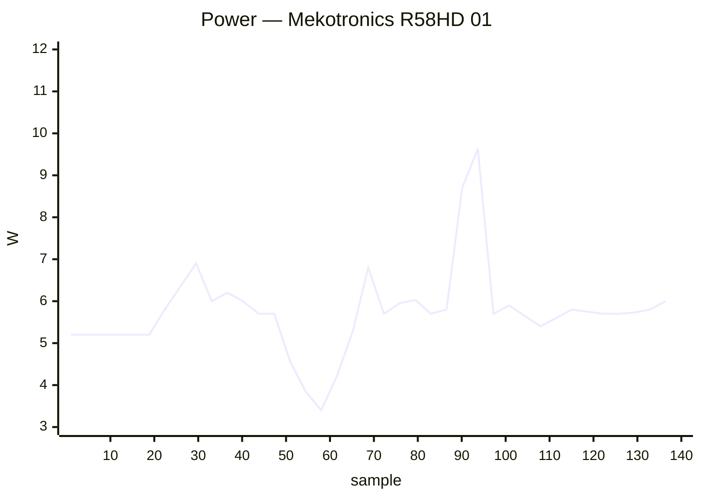
```mermaid
xychart-beta
    title "Power — Mekotronics R58HD 01"
    x-axis "sample" 1 --> 140
    y-axis "W" 3.0 --> 12.0
    line [5.20, 5.20, 5.20, 5.20, 5.20, 5.20, 5.80, 6.35, 6.90, 6.00, 6.20, 6.00, 5.70, 5.70, 4.57, 3.85, 3.40, 4.22, 5.27, 6.80, 5.70, 5.95, 6.03, 5.70, 5.80, 8.70, 9.63, 5.70, 5.90, 5.65, 5.40, 5.60, 5.80, 5.75, 5.70, 5.70, 5.73, 5.80, 6.00, 5.77]
```

### ✅ Mekotronics R58S2 01

`mekotronics-r58s2` · **inplace** · image `26.11.0-trunk.72` · 5 ✅ · 0 ❌ · 1 ⏭️

| Module | Status | Time | Detail |
|:--|:--:|--:|:--|
| upgrade | ⏭️ | 23.2 s | — |
| reboot | ✅ | 51.4 s | power-cycle · up 16 s |
| hw-performance | ✅ | 14.6 s | AES 1276 · mem 15000 · disk W 234 / R 266 MB/s · 40.7 °C · 1800 MHz |
| dvfs | ✅ | 17.2 s | ondemand · 1800–1800 MHz (peak 2352) |
| network-iperf | ✅ | 57.8 s | end1 ↑941/↓941 (1GE) · wlan0 ↑56/↓149 (Wi-Fi 5) Mbps |
| store-versions | ✅ | 4.1 s | 26.11.0-trunk.72 · 6.1.172-vendor-rk35xx |

**Power** — min 0.60 W · avg 3.44 W · peak 10.50 W · 137 samples

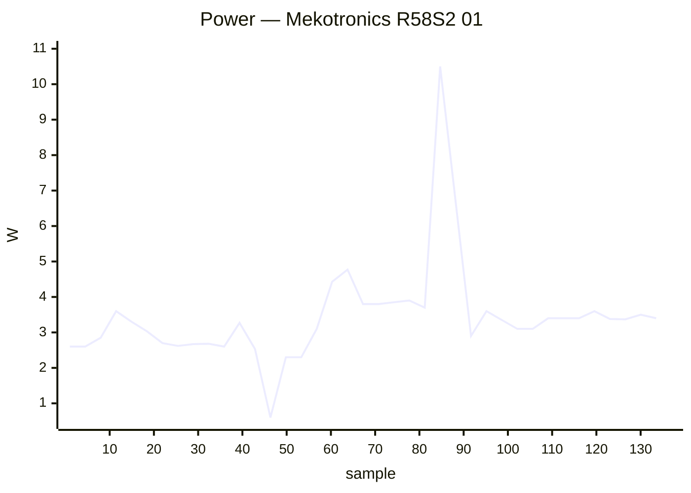
```mermaid
xychart-beta
    title "Power — Mekotronics R58S2 01"
    x-axis "sample" 1 --> 137
    y-axis "W" 0.5 --> 11.0
    line [2.60, 2.60, 2.85, 3.60, 3.30, 3.03, 2.70, 2.62, 2.67, 2.68, 2.60, 3.27, 2.53, 0.60, 2.30, 2.30, 3.10, 4.43, 4.77, 3.80, 3.80, 3.85, 3.90, 3.70, 10.50, 6.70, 2.90, 3.60, 3.35, 3.10, 3.10, 3.40, 3.40, 3.40, 3.60, 3.38, 3.37, 3.50, 3.40, 3.15]
```

### ✅ NanoPi Fire3 01

`nanopifire3` · **inplace** · image `26.11.0-trunk.73` · 7 ✅ · 0 ❌ · 1 ⏭️

| Module | Status | Time | Detail |
|:--|:--:|--:|:--|
| upgrade | ✅ | 117.0 s | nightly · 26.11.0-trunk.73 → 26.11.0-trunk.73 |
| reboot | ✅ | 84.3 s | power-cycle · up 44 s |
| kernel-switch | ✅ | 70.4 s | branch=edge · family=s5p6818 · installed=26.11.0-trunk.73 · boot_image=/boot/vmlinuz-7.2.9-edge-s5p6818 · kernel_before=7.2.9-edge-s5p6818 |
| reboot | ✅ | 107.0 s | power-cycle · 2/2 boots · up 35 s |
| hw-performance | ✅ | 34.7 s | AES 373 · mem 2000 · disk W 20 / R 22 MB/s · 60 °C · None MHz |
| dvfs | ➖ | 2.9 s | no cpufreq |
| network-iperf | ✅ | 74.4 s | eth0 ↑94/↓94 (10/100ME) Mbps |
| store-versions | ✅ | 6.7 s | 26.11.0-trunk.73 · 7.2.9-edge-s5p6818 |

**Power** — min 1.80 W · avg 2.92 W · peak 3.90 W · 404 samples

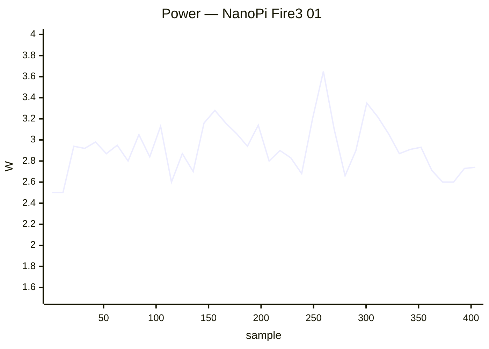
```mermaid
xychart-beta
    title "Power — NanoPi Fire3 01"
    x-axis "sample" 1 --> 404
    y-axis "W" 1.5 --> 4.0
    line [2.50, 2.50, 2.94, 2.92, 2.98, 2.87, 2.95, 2.80, 3.05, 2.84, 3.13, 2.60, 2.87, 2.70, 3.16, 3.28, 3.16, 3.06, 2.94, 3.14, 2.80, 2.90, 2.83, 2.68, 3.20, 3.65, 3.10, 2.66, 2.90, 3.35, 3.22, 3.06, 2.87, 2.91, 2.93, 2.71, 2.60, 2.60, 2.73, 2.74]
```

### ✅ NanoPi K2 01

`nanopik2-s905` · **inplace** · image `26.11.0-trunk.73` · 16 ✅ · 0 ❌ · 0 ⏭️

| Module | Status | Time | Detail |
|:--|:--:|--:|:--|
| upgrade | ✅ | 60.9 s | nightly · 26.11.0-trunk.73 → 26.11.0-trunk.73 |
| reboot | ✅ | 41.6 s | warm · up 25 s |
| kernel-switch | ✅ | 40.0 s | branch=current · family=meson64 · installed=26.11.0-trunk.73 · boot_image=/boot/vmlinuz-6.18.55-current-meson64 · kernel_before=6.18.55-current-meson64 |
| reboot | ✅ | 65.8 s | warm · 2/2 boots · up 19 s |
| hw-performance | ✅ | 31.7 s | AES 51 · mem 3800 · disk W 9 / R 41 MB/s · 59 °C · 2016 MHz |
| dvfs | ✅ | 21.4 s | ondemand · 500–1536 MHz (peak 1536) |
| network-iperf | ✅ | 120.3 s | end0 ↑934/↓941 (1GE) · wlan0 ↑11/↓26 (Wi-Fi 4) Mbps |
| store-versions | ✅ | 4.7 s | 26.11.0-trunk.73 · 6.18.55-current-meson64 |
| kernel-switch | ✅ | 157.4 s | branch=edge · family=meson64 · installed=26.11.0-trunk.73 · boot_image=/boot/vmlinuz-7.2.9-edge-meson64 · kernel_before=6.18.55-current-meson64 |
| reboot | ✅ | 66.7 s | warm · 2/2 boots · up 20 s |
| hw-performance | ✅ | 31.4 s | AES 51 · mem 3800 · disk W 10 / R 40 MB/s · 59 °C · 2016 MHz |
| dvfs | ✅ | 21.9 s | ondemand · 500–1536 MHz (peak 1536) |
| network-iperf | ✅ | 213.3 s | end0 ↑936/↓941 (1GE) · wlan0 ↑12/↓23 (Wi-Fi 4) Mbps |
| store-versions | ✅ | 4.6 s | 26.11.0-trunk.73 · 7.2.9-edge-meson64 |
| kernel-switch | ✅ | 156.3 s | branch=current · family=meson64 · installed=26.11.0-trunk.73 · boot_image=/boot/vmlinuz-6.18.55-current-meson64 · kernel_before=7.2.9-edge-meson64 |
| reboot | ✅ | 35.2 s | warm · up 19 s |

### ✅ NanoPi M4V2 01

`nanopim4v2` · **inplace** · image `26.11.0-trunk.73` · 16 ✅ · 0 ❌ · 0 ⏭️

| Module | Status | Time | Detail |
|:--|:--:|--:|:--|
| upgrade | ✅ | 52.0 s | nightly · 26.11.0-trunk.73 → 26.11.0-trunk.73 |
| reboot | ✅ | 72.6 s | power-cycle · up 40 s |
| kernel-switch | ✅ | 30.6 s | branch=current · family=rockchip64 · installed=26.11.0-trunk.73 · boot_image=/boot/vmlinuz-6.18.55-current-rockchip64 · kernel_before=6.18.55-current-rockchip64 |
| reboot | ✅ | 106.4 s | power-cycle · 2/2 boots · up 29 s |
| hw-performance | ✅ | 22.0 s | AES 1022 · mem 6600 · disk W 54 / R 31 MB/s · 41.7 °C · 1416 MHz |
| dvfs | ✅ | 20.9 s | ondemand · 408–1416 MHz (peak 1800) |
| network-iperf | ✅ | 126.9 s | end0 ↑941/↓941 (1GE) · wlan0 ↑145/↓101 (Wi-Fi 5) · wlx803f5d16af63 ↑10/↓14 (Wi-Fi 5) Mbps |
| store-versions | ✅ | 5.0 s | 26.11.0-trunk.73 · 6.18.55-current-rockchip64 |
| kernel-switch | ✅ | 95.5 s | branch=edge · family=rockchip64 · installed=26.11.0-trunk.73 · boot_image=/boot/vmlinuz-7.2.9-edge-rockchip64 · kernel_before=6.18.55-current-rockchip64 |
| reboot | ✅ | 97.4 s | power-cycle · 2/2 boots · up 26 s |
| hw-performance | ✅ | 21.6 s | AES 1019 · mem 6600 · disk W 51 / R 60 MB/s · 42.2 °C · 1416 MHz |
| dvfs | ✅ | 22.2 s | ondemand · 408–1416 MHz (peak 1800) |
| network-iperf | ✅ | 221.5 s | end0 ↑941/↓941 (1GE) · wlan0 ↑110/↓175 (Wi-Fi 5) · wlx803f5d16af63 ↑11/↓12 (Wi-Fi 5) Mbps |
| store-versions | ✅ | 5.5 s | 26.11.0-trunk.73 · 7.2.9-edge-rockchip64 |
| kernel-switch | ✅ | 95.8 s | branch=current · family=rockchip64 · installed=26.11.0-trunk.73 · boot_image=/boot/vmlinuz-6.18.55-current-rockchip64 · kernel_before=7.2.9-edge-rockchip64 |
| reboot | ✅ | 58.8 s | power-cycle · up 29 s |

**Power** — min 2.50 W · avg 6.69 W · peak 12.10 W · 828 samples

```mermaid
xychart-beta
    title "Power — NanoPi M4V2 01"
    x-axis "sample" 1 --> 828
    y-axis "W" 2.0 --> 12.5
    line [6.18, 7.10, 6.58, 5.87, 5.99, 7.52, 5.67, 6.93, 6.82, 6.85, 7.91, 9.20, 6.44, 5.73, 7.01, 6.26, 6.08, 7.20, 6.61, 7.47, 6.76, 4.78, 6.83, 7.02, 8.06, 8.06, 6.59, 5.95, 7.02, 5.80, 5.96, 6.38, 5.80, 6.50, 6.50, 6.96, 7.14, 7.59, 5.63, 6.75]
```

### ✅ NanoPi M6 01

`nanopi-m6` · **inplace** · image `26.11.0-trunk.73` · 22 ✅ · 0 ❌ · 0 ⏭️

| Module | Status | Time | Detail |
|:--|:--:|--:|:--|
| upgrade | ✅ | 31.2 s | nightly · 26.11.0-trunk.73 → 26.11.0-trunk.73 |
| reboot | ✅ | 51.1 s | power-cycle · up 23 s |
| kernel-switch | ✅ | 21.0 s | branch=vendor · family=rk35xx · installed=26.11.0-trunk.73 · boot_image=/boot/vmlinuz-6.1.172-vendor-rk35xx · kernel_before=6.1.172-vendor-rk35xx |
| reboot | ✅ | 85.6 s | power-cycle · 2/2 boots · up 23 s |
| hw-performance | ✅ | 17.5 s | AES 1262 · mem 15200 · disk W 51 / R 78 MB/s · 39.8 °C · 1800 MHz |
| dvfs | ✅ | 16.4 s | ondemand · 1800–1800 MHz (peak 2256) |
| network-iperf | ✅ | 172.5 s | lan ↑941/↓941 (1GE) · wlP3p49s0 ↑217/↓161 (Wi-Fi 5) Mbps |
| store-versions | ✅ | 3.9 s | 26.11.0-trunk.73 · 6.1.172-vendor-rk35xx |
| kernel-switch | ✅ | 100.1 s | branch=current · family=rockchip64 · installed=26.11.0-trunk.73 · boot_image=/boot/vmlinuz-6.18.55-current-rockchip64 · kernel_before=6.1.172-vendor-rk35xx |
| reboot | ✅ | 77.8 s | power-cycle · 2/2 boots · up 23 s |
| hw-performance | ✅ | 18.6 s | AES 1220 · mem 9900 · disk W 47 / R 57 MB/s · 41.6 °C · 1800 MHz |
| dvfs | ✅ | 14.9 s | ondemand · 408–1800 MHz (peak 2400) |
| network-iperf | ✅ | 57.2 s | lan ↑941/↓941 (1GE) · wlP3p49s0 ↑266/↓295 (Wi-Fi 5) Mbps |
| store-versions | ✅ | 4.0 s | 26.11.0-trunk.73 · 6.18.55-current-rockchip64 |
| kernel-switch | ✅ | 75.4 s | branch=edge · family=rockchip64 · installed=26.11.0-trunk.73 · boot_image=/boot/vmlinuz-7.2.9-edge-rockchip64 · kernel_before=6.18.55-current-rockchip64 |
| reboot | ✅ | 81.4 s | power-cycle · 2/2 boots · up 23 s |
| hw-performance | ✅ | 18.8 s | AES 1208 · mem 7800 · disk W 47 / R 56 MB/s · 43.5 °C · 1800 MHz |
| dvfs | ✅ | 14.5 s | ondemand · 408–1800 MHz (peak 2400) |
| network-iperf | ✅ | 58.1 s | lan ↑939/↓941 (1GE) · wlP3p49s0 ↑193/↓202 (Wi-Fi 5) Mbps |
| store-versions | ✅ | 4.5 s | 26.11.0-trunk.73 · 7.2.9-edge-rockchip64 |
| kernel-switch | ✅ | 69.4 s | branch=vendor · family=rk35xx · installed=26.11.0-trunk.73 · boot_image=/boot/vmlinuz-6.1.172-vendor-rk35xx · kernel_before=7.2.9-edge-rockchip64 |
| reboot | ✅ | 51.9 s | power-cycle · up 23 s |

**Power** — min 0.90 W · avg 3.88 W · peak 10.30 W · 820 samples

```mermaid
xychart-beta
    title "Power — NanoPi M6 01"
    x-axis "sample" 1 --> 820
    y-axis "W" 0.5 --> 10.5
    line [3.35, 3.60, 2.49, 3.73, 2.75, 3.22, 2.54, 3.98, 6.13, 2.82, 3.14, 3.85, 2.65, 2.60, 2.56, 3.36, 3.34, 3.76, 3.04, 3.11, 3.67, 3.22, 4.61, 7.17, 4.41, 4.81, 4.45, 4.48, 5.22, 2.89, 3.79, 4.10, 5.54, 4.92, 4.78, 4.47, 4.79, 4.62, 4.34, 2.85]
```

### ✅ NanoPi Neo 2 Black 01

`nanopineo2black` · **inplace** · image `26.11.0-trunk.73` · 16 ✅ · 0 ❌ · 0 ⏭️

| Module | Status | Time | Detail |
|:--|:--:|--:|:--|
| upgrade | ✅ | 64.7 s | nightly · 26.11.0-trunk.73 → 26.11.0-trunk.73 |
| reboot | ✅ | 55.5 s | power-cycle · up 17 s |
| kernel-switch | ✅ | 43.1 s | branch=current · family=sunxi64 · installed=26.11.0-trunk.73 · boot_image=/boot/vmlinuz-6.18.55-current-sunxi64 · kernel_before=6.18.55-current-sunxi64 |
| reboot | ✅ | 306.5 s | power-cycle · 1/2 boots · up 17 s |
| hw-performance | ✅ | 23.9 s | AES 637 · mem 3500 · disk W 43 / R 44 MB/s · 57.5 °C · 1368 MHz |
| dvfs | ✅ | 23.0 s | ondemand · 480–1368 MHz (peak 1368) |
| network-iperf | ✅ | 35.6 s | end0 ↑883/↓867 (1GE) Mbps |
| store-versions | ✅ | 4.9 s | 26.11.0-trunk.73 · 6.18.55-current-sunxi64 |
| kernel-switch | ✅ | 109.4 s | branch=edge · family=sunxi64 · installed=26.11.0-trunk.73 · boot_image=/boot/vmlinuz-7.2.9-edge-sunxi64 · kernel_before=6.18.55-current-sunxi64 |
| reboot | ✅ | 319.1 s | power-cycle · 1/2 boots · up 18 s |
| hw-performance | ✅ | 24.4 s | AES 637 · mem 3500 · disk W 43 / R 44 MB/s · 58.2 °C · 1368 MHz |
| dvfs | ✅ | 23.5 s | ondemand · 480–1368 MHz (peak 1368) |
| network-iperf | ✅ | 150.2 s | end0 ↑891/↓880 (1GE) Mbps |
| store-versions | ✅ | 4.9 s | 26.11.0-trunk.73 · 7.2.9-edge-sunxi64 |
| kernel-switch | ✅ | 107.6 s | branch=current · family=sunxi64 · installed=26.11.0-trunk.73 · boot_image=/boot/vmlinuz-6.18.55-current-sunxi64 · kernel_before=7.2.9-edge-sunxi64 |
| reboot | ✅ | 56.4 s | power-cycle · up 17 s |

**Power** — min 0.90 W · avg 2.41 W · peak 5.90 W · 1064 samples

```mermaid
xychart-beta
    title "Power — NanoPi Neo 2 Black 01"
    x-axis "sample" 1 --> 1064
    y-axis "W" 0.5 --> 6.0
    line [2.51, 2.79, 2.39, 2.80, 2.80, 3.11, 1.75, 1.40, 1.40, 1.40, 1.40, 1.34, 2.77, 3.06, 3.36, 3.17, 3.29, 2.91, 3.16, 3.04, 3.05, 1.59, 1.40, 1.40, 1.40, 1.40, 1.40, 2.72, 2.54, 3.30, 3.55, 1.84, 1.79, 1.77, 2.55, 2.99, 3.22, 2.98, 2.56, 2.94]
```

### ✅ NanoPi Neo 3 01

`nanopineo3` · **inplace** · image `26.11.0-trunk.73` · 16 ✅ · 0 ❌ · 0 ⏭️

| Module | Status | Time | Detail |
|:--|:--:|--:|:--|
| upgrade | ✅ | 86.1 s | nightly · 26.11.0-trunk.73 → 26.11.0-trunk.73 |
| reboot | ✅ | 68.9 s | power-cycle · up 30 s |
| kernel-switch | ✅ | 57.1 s | branch=current · family=rockchip64 · installed=26.11.0-trunk.73 · boot_image=/boot/vmlinuz-6.18.55-current-rockchip64 · kernel_before=6.18.55-current-rockchip64 |
| reboot | ✅ | 101.4 s | power-cycle · 2/2 boots · up 27 s |
| hw-performance | ✅ | 28.5 s | AES 597 · mem 2400 · disk W 1 / R 63 MB/s · 75.4 °C · 1296 MHz |
| dvfs | ✅ | 29.7 s | ondemand · 408–1296 MHz (peak 1296) |
| network-iperf | ✅ | 218.5 s | end0 ↑917/↓939 (1GE) · wlx7cdd905518f9 ↑35/↓16 (Wi-Fi 4) Mbps |
| store-versions | ✅ | 6.6 s | 26.11.0-trunk.73 · 6.18.55-current-rockchip64 |
| kernel-switch | ✅ | 172.1 s | branch=edge · family=rockchip64 · installed=26.11.0-trunk.73 · boot_image=/boot/vmlinuz-7.2.9-edge-rockchip64 · kernel_before=6.18.55-current-rockchip64 |
| reboot | ✅ | 99.5 s | power-cycle · 2/2 boots · up 26 s |
| hw-performance | ✅ | 28.5 s | AES 599 · mem 2300 · disk W 52 / R 62 MB/s · 77.7 °C · 1296 MHz |
| dvfs | ✅ | 30.8 s | ondemand · 408–1296 MHz (peak 1296) |
| network-iperf | ✅ | 80.3 s | end0 ↑916/↓940 (1GE) · wlx7cdd905518f9 ↑25/↓23 (Wi-Fi 4) Mbps |
| store-versions | ✅ | 6.7 s | 26.11.0-trunk.73 · 7.2.9-edge-rockchip64 |
| kernel-switch | ✅ | 175.9 s | branch=current · family=rockchip64 · installed=26.11.0-trunk.73 · boot_image=/boot/vmlinuz-6.18.55-current-rockchip64 · kernel_before=7.2.9-edge-rockchip64 |
| reboot | ✅ | 65.5 s | power-cycle · up 28 s |

**Power** — min 1.70 W · avg 4.51 W · peak 5.90 W · 990 samples

```mermaid
xychart-beta
    title "Power — NanoPi Neo 3 01"
    x-axis "sample" 1 --> 990
    y-axis "W" 1.5 --> 6.0
    line [4.35, 4.60, 4.69, 4.06, 4.44, 4.76, 4.52, 4.17, 4.81, 4.34, 4.77, 4.49, 4.20, 4.05, 4.16, 4.29, 4.37, 3.82, 4.34, 4.60, 4.90, 4.77, 4.66, 4.62, 4.46, 4.23, 4.18, 4.62, 4.74, 4.66, 4.80, 4.73, 4.72, 4.63, 4.96, 4.80, 4.74, 4.65, 4.22, 4.50]
```

### ✅ NanoPi R6S 01

`nanopi-r6s` · **inplace** · image `26.11.0-trunk.73` · 22 ✅ · 0 ❌ · 0 ⏭️

| Module | Status | Time | Detail |
|:--|:--:|--:|:--|
| upgrade | ✅ | 30.7 s | nightly · 26.11.0-trunk.73 → 26.11.0-trunk.73 |
| reboot | ✅ | 40.5 s | power-cycle · up 15 s |
| kernel-switch | ✅ | 18.9 s | branch=vendor · family=rk35xx · installed=26.11.0-trunk.73 · boot_image=/boot/vmlinuz-6.1.172-vendor-rk35xx · kernel_before=6.1.172-vendor-rk35xx |
| reboot | ✅ | 65.6 s | power-cycle · 2/2 boots · up 16 s |
| hw-performance | ✅ | 14.0 s | AES 1276 · mem 14200 · disk W 206 / R 274 MB/s · 39.8 °C · 1800 MHz |
| dvfs | ✅ | 16.8 s | ondemand · 1800–1800 MHz (peak 2352) |
| network-iperf | ✅ | 83.0 s | lan2 ↑940/↓941 (1GE) · wan ↑2351/↓2311 (2.5GE) Mbps |
| store-versions | ✅ | 4.1 s | 26.11.0-trunk.73 · 6.1.172-vendor-rk35xx |
| kernel-switch | ✅ | 51.8 s | branch=current · family=rockchip64 · installed=26.11.0-trunk.73 · boot_image=/boot/vmlinuz-6.18.55-current-rockchip64 · kernel_before=6.1.172-vendor-rk35xx |
| reboot | ✅ | 69.8 s | power-cycle · 2/2 boots · up 22 s |
| hw-performance | ✅ | 15.2 s | AES 1275 · mem 10400 · disk W 145 / R 143 MB/s · 41.6 °C · 1800 MHz |
| dvfs | ✅ | 14.5 s | ondemand · 408–1800 MHz (peak 2400) |
| network-iperf | ✅ | 51.7 s | lan2 ↑940/↓942 (1GE) · wan ↑2353/↓2308 (2.5GE) Mbps |
| store-versions | ✅ | 3.9 s | 26.11.0-trunk.73 · 6.18.55-current-rockchip64 |
| kernel-switch | ✅ | 47.4 s | branch=edge · family=rockchip64 · installed=26.11.0-trunk.73 · boot_image=/boot/vmlinuz-7.2.9-edge-rockchip64 · kernel_before=6.18.55-current-rockchip64 |
| reboot | ✅ | 59.8 s | power-cycle · 2/2 boots · up 13 s |
| hw-performance | ✅ | 15.5 s | AES 1275 · mem 5200 · disk W 144 / R 149 MB/s · 41.6 °C · 1800 MHz |
| dvfs | ✅ | 15.6 s | ondemand · 408–1800 MHz (peak 2400) |
| network-iperf | ✅ | 222.5 s | lan2 ↑941/↓941 (1GE) · wan ↑2353/↓2286 (2.5GE) Mbps |
| store-versions | ✅ | 3.8 s | 26.11.0-trunk.73 · 7.2.9-edge-rockchip64 |
| kernel-switch | ✅ | 43.8 s | branch=vendor · family=rk35xx · installed=26.11.0-trunk.73 · boot_image=/boot/vmlinuz-6.1.172-vendor-rk35xx · kernel_before=7.2.9-edge-rockchip64 |
| reboot | ✅ | 55.0 s | power-cycle · up 21 s |

**Power** — min 2.30 W · avg 3.94 W · peak 10.20 W · 724 samples

```mermaid
xychart-beta
    title "Power — NanoPi R6S 01"
    x-axis "sample" 1 --> 724
    y-axis "W" 2.0 --> 10.5
    line [3.18, 3.92, 3.33, 3.87, 3.46, 3.27, 3.63, 6.12, 3.44, 3.62, 3.11, 3.26, 3.64, 4.25, 3.42, 3.94, 4.88, 5.44, 4.39, 4.03, 4.29, 5.75, 4.58, 3.69, 3.84, 4.20, 5.07, 3.21, 3.48, 3.68, 3.28, 3.29, 3.42, 3.20, 3.24, 3.86, 4.38, 5.74, 3.93, 3.34]
```

### ✅ NanoPi R76S 01

`nanopi-r76s` · **inplace** · image `26.11.0-trunk.72` · 15 ✅ · 0 ❌ · 1 ⏭️

| Module | Status | Time | Detail |
|:--|:--:|--:|:--|
| upgrade | ⏭️ | 15.8 s | — |
| reboot | ✅ | 70.3 s | power-cycle · up 30 s |
| kernel-switch | ✅ | 30.3 s | branch=vendor · family=rk35xx · installed=26.11.0-trunk.73 · boot_image=/boot/vmlinuz-6.1.172-vendor-rk35xx · kernel_before=6.1.172-vendor-rk35xx |
| reboot | ✅ | 114.4 s | power-cycle · 2/2 boots · up 30 s |
| hw-performance | ✅ | 24.3 s | AES 1271 · mem 7700 · disk W 22 / R 77 MB/s · 43.5 °C · 2016 MHz |
| dvfs | ✅ | 21.0 s | ondemand · 2016–2016 MHz (peak 2208) |
| network-iperf | ✅ | 488.1 s | end0 ↑2350/↓2351 (2.5GE) · end1 ↑2346/↓2352 (2.5GE) · wlan0 ↑30/↓90 (Wi-Fi 5) · wlxe0e1a933de37 ↑195/↓161 (Wi-Fi 5) Mbps |
| store-versions | ✅ | 4.9 s | 26.11.0-trunk.72 · 6.1.172-vendor-rk35xx |
| kernel-switch | ✅ | 160.6 s | branch=edge · family=rockchip64 · installed=26.11.0-trunk.73 · boot_image=/boot/vmlinuz-7.2.9-edge-rockchip64 · kernel_before=6.1.172-vendor-rk35xx |
| reboot | ✅ | 119.2 s | power-cycle · 2/2 boots · up 29 s |
| hw-performance | ✅ | 21.8 s | AES 1307 · mem 8700 · disk W 64 / R 71 MB/s · 43.5 °C · 2016 MHz |
| dvfs | ✅ | 19.5 s | ondemand · 408–2016 MHz (peak 2208) |
| network-iperf | ✅ | 121.8 s | end0 ↑2353/↓2289 (2.5GE) · end1 ↑2351/↓2354 (2.5GE) · wlan0 ↑99/↓176 (Wi-Fi 5) · wlxe0e1a933de37 ↑106/↓128 (Wi-Fi 5) Mbps |
| store-versions | ✅ | 4.7 s | 26.11.0-trunk.72 · 7.2.9-edge-rockchip64 |
| kernel-switch | ✅ | 98.7 s | branch=vendor · family=rk35xx · installed=26.11.0-trunk.73 · boot_image=/boot/vmlinuz-6.1.172-vendor-rk35xx · kernel_before=7.2.9-edge-rockchip64 |
| reboot | ✅ | 65.6 s | power-cycle · up 30 s |

**Power** — min 0.60 W · avg 4.33 W · peak 8.70 W · 894 samples

```mermaid
xychart-beta
    title "Power — NanoPi R76S 01"
    x-axis "sample" 1 --> 894
    y-axis "W" 0.5 --> 9.0
    line [4.39, 2.92, 4.00, 4.81, 2.56, 4.16, 3.77, 5.70, 4.56, 4.14, 4.28, 4.57, 4.15, 4.26, 4.11, 4.60, 4.89, 4.26, 4.65, 4.19, 4.72, 4.10, 4.55, 4.76, 5.00, 4.93, 4.24, 4.92, 3.21, 3.85, 2.70, 4.90, 5.40, 4.94, 4.73, 4.66, 4.60, 4.77, 4.21, 3.18]
```

### ✅ Odroid C2 01

`odroidc2` · **inplace** · image `26.11.0-trunk.73` · 16 ✅ · 0 ❌ · 0 ⏭️

| Module | Status | Time | Detail |
|:--|:--:|--:|:--|
| upgrade | ✅ | 56.0 s | nightly · 26.11.0-trunk.73 → 26.11.0-trunk.73 |
| reboot | ✅ | 33.3 s | warm · up 16 s |
| kernel-switch | ✅ | 37.6 s | branch=current · family=meson64 · installed=26.11.0-trunk.73 · boot_image=/boot/vmlinuz-6.18.55-current-meson64 · kernel_before=6.18.55-current-meson64 |
| reboot | ✅ | 61.2 s | warm · 2/2 boots · up 17 s |
| hw-performance | ✅ | 22.3 s | AES 51 · mem 3500 · disk W 32 / R 151 MB/s · 44 °C · 1536 MHz |
| dvfs | ✅ | 21.8 s | ondemand · 500–1536 MHz (peak 1536) |
| network-iperf | ✅ | 35.2 s | end0 ↑940/↓941 (1GE) Mbps |
| store-versions | ✅ | 4.8 s | 26.11.0-trunk.73 · 6.18.55-current-meson64 |
| kernel-switch | ✅ | 115.3 s | branch=edge · family=meson64 · installed=26.11.0-trunk.73 · boot_image=/boot/vmlinuz-7.2.9-edge-meson64 · kernel_before=6.18.55-current-meson64 |
| reboot | ✅ | 61.3 s | warm · 2/2 boots · up 17 s |
| hw-performance | ✅ | 22.8 s | AES 51 · mem 3400 · disk W 33 / R 140 MB/s · 46 °C · 1536 MHz |
| dvfs | ✅ | 22.4 s | ondemand · 500–1536 MHz (peak 1536) |
| network-iperf | ✅ | 36.9 s | end0 ↑941/↓941 (1GE) Mbps |
| store-versions | ✅ | 5.0 s | 26.11.0-trunk.73 · 7.2.9-edge-meson64 |
| kernel-switch | ✅ | 113.5 s | branch=current · family=meson64 · installed=26.11.0-trunk.73 · boot_image=/boot/vmlinuz-6.18.55-current-meson64 · kernel_before=7.2.9-edge-meson64 |
| reboot | ✅ | 34.1 s | warm · up 17 s |

### ✅ Odroid C4 01

`odroidc4` · **inplace** · image `26.11.0-trunk.73` · 16 ✅ · 0 ❌ · 0 ⏭️

| Module | Status | Time | Detail |
|:--|:--:|--:|:--|
| upgrade | ✅ | 44.8 s | nightly · 26.11.0-trunk.73 → 26.11.0-trunk.73 |
| reboot | ✅ | 52.8 s | power-cycle · up 17 s |
| kernel-switch | ✅ | 32.7 s | branch=current · family=meson64 · installed=26.11.0-trunk.73 · boot_image=/boot/vmlinuz-6.18.55-current-meson64 · kernel_before=6.18.55-current-meson64 |
| reboot | ✅ | 77.4 s | power-cycle · 2/2 boots · up 17 s |
| hw-performance | ✅ | 22.0 s | AES 981 · mem 5200 · disk W 29 / R 70 MB/s · 37.6 °C · 2100 MHz |
| dvfs | ✅ | 18.8 s | ondemand · 1000–2100 MHz (peak 2100) |
| network-iperf | ✅ | 124.0 s | end0 ↑940/↓941 (1GE) · wlx24050fdd332b ↑110/↓127 (Wi-Fi 4) Mbps |
| store-versions | ✅ | 5.0 s | 26.11.0-trunk.73 · 6.18.55-current-meson64 |
| kernel-switch | ✅ | 110.7 s | branch=edge · family=meson64 · installed=26.11.0-trunk.73 · boot_image=/boot/vmlinuz-7.2.9-edge-meson64 · kernel_before=6.18.55-current-meson64 |
| reboot | ✅ | 79.5 s | power-cycle · 2/2 boots · up 17 s |
| hw-performance | ✅ | 21.9 s | AES 979 · mem 5200 · disk W 31 / R 76 MB/s · 38.5 °C · 2100 MHz |
| dvfs | ✅ | 19.4 s | ondemand · 1000–2100 MHz (peak 2100) |
| network-iperf | ✅ | 113.9 s | end0 ↑941/↓941 (1GE) · wlx24050fdd332b ↑62/↓113 (Wi-Fi 4) Mbps |
| store-versions | ✅ | 4.2 s | 26.11.0-trunk.73 · 7.2.9-edge-meson64 |
| kernel-switch | ✅ | 109.3 s | branch=current · family=meson64 · installed=26.11.0-trunk.73 · boot_image=/boot/vmlinuz-6.18.55-current-meson64 · kernel_before=7.2.9-edge-meson64 |
| reboot | ✅ | 58.1 s | power-cycle · up 21 s |

**Power** — min 0.90 W · avg 3.38 W · peak 5.20 W · 706 samples

```mermaid
xychart-beta
    title "Power — Odroid C4 01"
    x-axis "sample" 1 --> 706
    y-axis "W" 0.5 --> 5.5
    line [3.32, 3.52, 3.44, 2.41, 3.43, 3.54, 3.12, 3.59, 2.26, 3.66, 3.81, 3.38, 2.97, 3.45, 4.11, 3.02, 3.58, 3.41, 3.74, 3.60, 3.61, 3.63, 3.32, 3.54, 1.96, 3.49, 3.75, 3.23, 3.55, 3.09, 3.09, 3.69, 3.87, 3.87, 3.88, 3.59, 3.59, 3.58, 2.48, 2.92]
```

### ✅ Odroid M1 01

`odroidm1` · **inplace** · image `26.11.0-trunk.73` · 16 ✅ · 0 ❌ · 0 ⏭️

| Module | Status | Time | Detail |
|:--|:--:|--:|:--|
| upgrade | ✅ | 49.7 s | nightly · 26.11.0-trunk.73 → 26.11.0-trunk.73 |
| reboot | ✅ | 139.1 s | power-cycle · up 101 s |
| kernel-switch | ✅ | 31.0 s | branch=current · family=rockchip64 · installed=26.11.0-trunk.73 · boot_image=/boot/vmlinuz-6.18.55-current-rockchip64 · kernel_before=6.18.55-current-rockchip64 |
| reboot | ✅ | 246.8 s | power-cycle · 2/2 boots · up 101 s |
| hw-performance | ✅ | 16.9 s | AES 919 · mem 5100 · disk W 1068 / R 1010 MB/s · 31.9 °C · 1992 MHz |
| dvfs | ✅ | 21.4 s | ondemand · 408–1992 MHz (peak 1992) |
| network-iperf | ✅ | 87.5 s | eth0 ↑543/↓941 (1GE) Mbps |
| store-versions | ✅ | 4.7 s | 26.11.0-trunk.73 · 6.18.55-current-rockchip64 |
| kernel-switch | ✅ | 89.1 s | branch=edge · family=rockchip64 · installed=26.11.0-trunk.73 · boot_image=/boot/vmlinuz-7.2.9-edge-rockchip64 · kernel_before=6.18.55-current-rockchip64 |
| reboot | ✅ | 248.8 s | power-cycle · 2/2 boots · up 102 s |
| hw-performance | ✅ | 17.3 s | AES 919 · mem 5100 · disk W 1026 / R 1042 MB/s · 33.1 °C · 1992 MHz |
| dvfs | ✅ | 22.0 s | ondemand · 408–1992 MHz (peak 1992) |
| network-iperf | ✅ | 31.6 s | eth0 ↑940/↓941 (1GE) Mbps |
| store-versions | ✅ | 4.6 s | 26.11.0-trunk.73 · 7.2.9-edge-rockchip64 |
| kernel-switch | ✅ | 88.6 s | branch=current · family=rockchip64 · installed=26.11.0-trunk.73 · boot_image=/boot/vmlinuz-6.18.55-current-rockchip64 · kernel_before=7.2.9-edge-rockchip64 |
| reboot | ✅ | 140.4 s | power-cycle · up 101 s |

**Power** — min 1.90 W · avg 4.80 W · peak 10.90 W · 950 samples

```mermaid
xychart-beta
    title "Power — Odroid M1 01"
    x-axis "sample" 1 --> 950
    y-axis "W" 1.5 --> 11.0
    line [5.48, 5.08, 6.35, 3.95, 3.90, 4.19, 5.40, 5.53, 3.90, 3.90, 3.95, 5.34, 3.90, 3.90, 4.76, 5.06, 5.01, 4.15, 4.20, 5.67, 6.93, 5.61, 5.32, 4.53, 3.90, 3.92, 5.48, 4.52, 3.91, 3.90, 5.32, 4.74, 5.15, 6.65, 5.67, 4.85, 5.13, 4.35, 3.91, 4.45]
```

### ✅ Odroid N2 01

`odroidn2` · **inplace** · image `26.11.0-trunk.73` · 16 ✅ · 0 ❌ · 0 ⏭️

| Module | Status | Time | Detail |
|:--|:--:|--:|:--|
| upgrade | ✅ | 42.2 s | nightly · 26.11.0-trunk.73 → 26.11.0-trunk.73 |
| reboot | ✅ | 70.2 s | power-cycle · up 30 s |
| kernel-switch | ✅ | 24.6 s | branch=current · family=meson64 · installed=26.11.0-trunk.73 · boot_image=/boot/vmlinuz-6.18.55-current-meson64 · kernel_before=6.18.55-current-meson64 |
| reboot | ✅ | 99.9 s | power-cycle · 2/2 boots · up 35 s |
| hw-performance | ✅ | 18.5 s | AES 1085 · mem 4900 · disk W 28 / R 137 MB/s · 38.2 °C · 1992 MHz |
| dvfs | ✅ | 17.2 s | performance · 1000–1992 MHz (peak 1992) |
| network-iperf | ✅ | 29.7 s | end0 ↑940/↓941 (1GE) Mbps |
| store-versions | ✅ | 3.7 s | 26.11.0-trunk.73 · 6.18.55-current-meson64 |
| kernel-switch | ✅ | 87.0 s | branch=edge · family=meson64 · installed=26.11.0-trunk.73 · boot_image=/boot/vmlinuz-7.2.9-edge-meson64 · kernel_before=6.18.55-current-meson64 |
| reboot | ✅ | 104.1 s | power-cycle · 2/2 boots · up 31 s |
| hw-performance | ✅ | 19.3 s | AES 1085 · mem 4900 · disk W 27 / R 134 MB/s · 38.1 °C · 1992 MHz |
| dvfs | ✅ | 18.4 s | performance · 1000–1992 MHz (peak 1992) |
| network-iperf | ✅ | 30.8 s | end0 ↑940/↓941 (1GE) Mbps |
| store-versions | ✅ | 4.9 s | 26.11.0-trunk.73 · 7.2.9-edge-meson64 |
| kernel-switch | ✅ | 85.6 s | branch=current · family=meson64 · installed=26.11.0-trunk.73 · boot_image=/boot/vmlinuz-6.18.55-current-meson64 · kernel_before=7.2.9-edge-meson64 |
| reboot | ✅ | 66.3 s | power-cycle · up 29 s |

**Power** — min 1.00 W · avg 4.93 W · peak 11.30 W · 561 samples

```mermaid
xychart-beta
    title "Power — Odroid N2 01"
    x-axis "sample" 1 --> 561
    y-axis "W" 0.5 --> 11.5
    line [5.57, 6.16, 5.16, 4.41, 1.70, 5.08, 5.44, 5.16, 3.85, 5.45, 5.05, 3.81, 5.36, 5.91, 8.01, 5.20, 4.57, 5.31, 4.84, 5.16, 5.04, 5.36, 3.76, 4.24, 5.58, 5.16, 3.57, 5.58, 5.64, 5.89, 4.89, 4.47, 4.61, 4.96, 5.16, 5.14, 5.09, 4.23, 2.69, 4.97]
```

### ✅ Orange Pi 3 01

`orangepi3` · **inplace** · image `26.11.0-trunk.58` · 15 ✅ · 0 ❌ · 1 ⏭️

| Module | Status | Time | Detail |
|:--|:--:|--:|:--|
| upgrade | ⏭️ | 32.2 s | — |
| reboot | ✅ | 64.4 s | power-cycle · up 31 s |
| kernel-switch | ✅ | 36.7 s | branch=current · family=sunxi64 · installed=26.8.0-trunk.61 · boot_image=/boot/vmlinuz-6.18.33-current-sunxi64 · kernel_before=6.18.33-current-sunxi64 |
| reboot | ✅ | 343.4 s | power-cycle · 1/2 boots · up 24 s |
| hw-performance | ✅ | 28.2 s | AES 839 · mem 4600 · disk W 20 / R 23 MB/s · 43.9 °C · 1800 MHz |
| dvfs | ✅ | 19.6 s | ondemand · 480–1800 MHz (peak 1800) |
| network-iperf | ✅ | 124.7 s | end0 ↑913/↓941 (1GE) · wlan0 ↑59/↓115 (Wi-Fi 5) Mbps |
| store-versions | ✅ | 5.5 s | 26.11.0-trunk.58 · 6.18.33-current-sunxi64 |
| kernel-switch | ✅ | 98.4 s | branch=edge · family=sunxi64 · installed=26.8.0-trunk.61 · boot_image=/boot/vmlinuz-7.0.10-edge-sunxi64 · kernel_before=6.18.33-current-sunxi64 |
| reboot | ✅ | 332.1 s | power-cycle · 1/2 boots · up 24 s |
| hw-performance | ✅ | 28.3 s | AES 838 · mem 4600 · disk W 21 / R 23 MB/s · 42.9 °C · 1800 MHz |
| dvfs | ✅ | 19.8 s | ondemand · 480–1800 MHz (peak 1800) |
| network-iperf | ✅ | 85.1 s | end0 ↑916/↓941 (1GE) · wlan0 ↑57/↓113 (Wi-Fi 5) Mbps |
| store-versions | ✅ | 4.4 s | 26.11.0-trunk.58 · 7.0.10-edge-sunxi64 |
| kernel-switch | ✅ | 99.3 s | branch=current · family=sunxi64 · installed=26.8.0-trunk.61 · boot_image=/boot/vmlinuz-6.18.33-current-sunxi64 · kernel_before=7.0.10-edge-sunxi64 |
| reboot | ✅ | 55.7 s | power-cycle · up 23 s |

### ✅ Orange Pi 5 Plus 01

`orangepi5-plus` · **inplace** · image `26.11.0-trunk.73` · 22 ✅ · 0 ❌ · 0 ⏭️

| Module | Status | Time | Detail |
|:--|:--:|--:|:--|
| upgrade | ✅ | 28.4 s | nightly · 26.11.0-trunk.73 → 26.11.0-trunk.73 |
| reboot | ✅ | 59.4 s | power-cycle · up 30 s |
| kernel-switch | ✅ | 17.3 s | branch=vendor · family=rk35xx · installed=26.11.0-trunk.73 · boot_image=/boot/vmlinuz-6.1.172-vendor-rk35xx · kernel_before=6.1.172-vendor-rk35xx |
| reboot | ✅ | 94.4 s | power-cycle · 2/2 boots · up 29 s |
| hw-performance | ✅ | 17.6 s | AES 1253 · mem 15200 · disk W 52 / R 62 MB/s · 57.3 °C · 1800 MHz |
| dvfs | ✅ | 16.9 s | ondemand · 1800–1800 MHz (peak 2256) |
| network-iperf | ✅ | 157.0 s | enP3p49s0 ↑2350/↓2343 (2.5GE) · enP4p65s0 ↑2351/↓2310 (2.5GE) · wlxe0e1a9380c53 ↑403/↓453 (Wi-Fi 6) Mbps |
| store-versions | ✅ | 4.3 s | 26.11.0-trunk.73 · 6.1.172-vendor-rk35xx |
| kernel-switch | ✅ | 103.0 s | branch=current · family=rockchip64 · installed=26.11.0-trunk.73 · boot_image=/boot/vmlinuz-6.18.55-current-rockchip64 · kernel_before=6.1.172-vendor-rk35xx |
| reboot | ✅ | 100.1 s | power-cycle · 2/2 boots · up 27 s |
| hw-performance | ✅ | 18.4 s | AES 1251 · mem 10100 · disk W 53 / R 58 MB/s · 59.2 °C · 1800 MHz |
| dvfs | ✅ | 15.5 s | ondemand · 408–1800 MHz (peak 2400) |
| network-iperf | ✅ | 136.4 s | enP3p49s0 ↑2353/↓2351 (2.5GE) · enP4p65s0 ↑2350/↓2241 (2.5GE) · wlxe0e1a9380c53 ↑135/↓97 (Wi-Fi 6) Mbps |
| store-versions | ✅ | 3.9 s | 26.11.0-trunk.73 · 6.18.55-current-rockchip64 |
| kernel-switch | ✅ | 68.4 s | branch=edge · family=rockchip64 · installed=26.11.0-trunk.73 · boot_image=/boot/vmlinuz-7.2.9-edge-rockchip64 · kernel_before=6.18.55-current-rockchip64 |
| reboot | ✅ | 90.8 s | power-cycle · 2/2 boots · up 28 s |
| hw-performance | ✅ | 18.3 s | AES 1260 · mem 8100 · disk W 50 / R 55 MB/s · 61.9 °C · 1800 MHz |
| dvfs | ✅ | 15.0 s | ondemand · 408–1800 MHz (peak 2400) |
| network-iperf | ✅ | 137.7 s | enP3p49s0 ↑2353/↓2354 (2.5GE) · enP4p65s0 ↑2340/↓2283 (2.5GE) · wlxe0e1a9380c53 ↑143/↓77 (Wi-Fi 6) Mbps |
| store-versions | ✅ | 3.9 s | 26.11.0-trunk.73 · 7.2.9-edge-rockchip64 |
| kernel-switch | ✅ | 72.4 s | branch=vendor · family=rk35xx · installed=26.11.0-trunk.73 · boot_image=/boot/vmlinuz-6.1.172-vendor-rk35xx · kernel_before=7.2.9-edge-rockchip64 |
| reboot | ✅ | 58.4 s | power-cycle · up 30 s |

**Power** — min 0.60 W · avg 7.35 W · peak 15.30 W · 795 samples

```mermaid
xychart-beta
    title "Power — Orange Pi 5 Plus 01"
    x-axis "sample" 1 --> 795
    y-axis "W" 0.5 --> 15.5
    line [7.38, 5.79, 5.87, 6.59, 5.71, 4.69, 7.02, 8.44, 6.42, 6.71, 6.70, 8.18, 8.67, 7.17, 7.27, 7.17, 6.97, 5.42, 5.05, 6.42, 9.92, 8.18, 8.00, 8.78, 7.77, 8.27, 8.68, 7.99, 6.54, 6.15, 9.27, 8.50, 8.22, 7.65, 8.18, 8.36, 8.58, 8.55, 7.01, 5.62]
```

### ✅ Orange Pi Lite 2 01

`orangepilite2` · **inplace** · image `26.11.0-trunk.73` · 16 ✅ · 0 ❌ · 0 ⏭️

| Module | Status | Time | Detail |
|:--|:--:|--:|:--|
| upgrade | ✅ | 59.6 s | nightly · 26.11.0-trunk.73 → 26.11.0-trunk.73 |
| reboot | ✅ | 38.2 s | warm · up 22 s |
| kernel-switch | ✅ | 40.0 s | branch=current · family=sunxi64 · installed=26.11.0-trunk.73 · boot_image=/boot/vmlinuz-6.18.55-current-sunxi64 · kernel_before=6.18.55-current-sunxi64 |
| reboot | ✅ | 76.9 s | warm · 2/2 boots · up 25 s |
| hw-performance | ✅ | 32.4 s | AES 833 · mem 4400 · disk W 21 / R 22 MB/s · 73 °C · 1800 MHz |
| dvfs | ✅ | 24.7 s | ondemand · 480–1800 MHz (peak 1800) |
| network-iperf | ✅ | 45.1 s | wlan0 ↑6/↓3 (Wi-Fi 5) Mbps |
| store-versions | ✅ | 5.4 s | 26.11.0-trunk.73 · 6.18.55-current-sunxi64 |
| kernel-switch | ✅ | 134.3 s | branch=edge · family=sunxi64 · installed=26.11.0-trunk.73 · boot_image=/boot/vmlinuz-7.2.9-edge-sunxi64 · kernel_before=6.18.55-current-sunxi64 |
| reboot | ✅ | 72.1 s | warm · 2/2 boots · up 20 s |
| hw-performance | ✅ | 32.1 s | AES 793 · mem 4600 · disk W 22 / R 3 MB/s · 71.6 °C · 1800 MHz |
| dvfs | ✅ | 25.4 s | ondemand · 480–1800 MHz (peak 1800) |
| network-iperf | ✅ | 38.6 s | wlan0 ↑23/↓21 (Wi-Fi 5) Mbps |
| store-versions | ✅ | 5.3 s | 26.11.0-trunk.73 · 7.2.9-edge-sunxi64 |
| kernel-switch | ✅ | 135.1 s | branch=current · family=sunxi64 · installed=26.11.0-trunk.73 · boot_image=/boot/vmlinuz-6.18.55-current-sunxi64 · kernel_before=7.2.9-edge-sunxi64 |
| reboot | ✅ | 39.8 s | warm · up 23 s |

### ✅ Orange Pi One+ 01

`orangepioneplus` · **inplace** · image `26.11.0-trunk.73` · 16 ✅ · 0 ❌ · 0 ⏭️

| Module | Status | Time | Detail |
|:--|:--:|--:|:--|
| upgrade | ✅ | 67.7 s | nightly · 26.11.0-trunk.73 → 26.11.0-trunk.73 |
| reboot | ✅ | 35.7 s | warm · up 19 s |
| kernel-switch | ✅ | 42.7 s | branch=current · family=sunxi64 · installed=26.11.0-trunk.73 · boot_image=/boot/vmlinuz-6.18.55-current-sunxi64 · kernel_before=6.18.55-current-sunxi64 |
| reboot | ✅ | 69.2 s | warm · 2/2 boots · up 20 s |
| hw-performance | ✅ | 29.3 s | AES 839 · mem 4600 · disk W 21 / R 23 MB/s · 62.5 °C · 1800 MHz |
| dvfs | ✅ | 22.6 s | ondemand · 480–1800 MHz (peak 1800) |
| network-iperf | ✅ | 121.7 s | end0 ↑913/↓941 (1GE) · wlx00e04c881724 ↑138/↓179 (Wi-Fi 5) Mbps |
| store-versions | ✅ | 4.9 s | 26.11.0-trunk.73 · 6.18.55-current-sunxi64 |
| kernel-switch | ✅ | 127.1 s | branch=edge · family=sunxi64 · installed=26.11.0-trunk.73 · boot_image=/boot/vmlinuz-7.2.9-edge-sunxi64 · kernel_before=6.18.55-current-sunxi64 |
| reboot | ✅ | 71.0 s | warm · 2/2 boots · up 23 s |
| hw-performance | ✅ | 29.6 s | AES 839 · mem 4600 · disk W 21 / R 2 MB/s · 63.5 °C · 1800 MHz |
| dvfs | ✅ | 22.8 s | ondemand · 480–1800 MHz (peak 1800) |
| network-iperf | ✅ | 92.3 s | end0 ↑903/↓939 (1GE) · wlx00e04c881724 ↑59/↓122 (Wi-Fi 5) Mbps |
| store-versions | ✅ | 5.0 s | 26.11.0-trunk.73 · 7.2.9-edge-sunxi64 |
| kernel-switch | ✅ | 130.4 s | branch=current · family=sunxi64 · installed=26.11.0-trunk.73 · boot_image=/boot/vmlinuz-6.18.55-current-sunxi64 · kernel_before=7.2.9-edge-sunxi64 |
| reboot | ✅ | 36.8 s | warm · up 20 s |

### ✅ Orange Pi Zero2 01

`orangepizero2` · **inplace** · image `26.11.0-trunk.73` · 16 ✅ · 0 ❌ · 0 ⏭️

| Module | Status | Time | Detail |
|:--|:--:|--:|:--|
| upgrade | ✅ | 111.1 s | nightly · 26.11.0-trunk.73 → 26.11.0-trunk.73 |
| reboot | ✅ | 61.5 s | power-cycle · up 24 s |
| kernel-switch | ✅ | 68.9 s | branch=current · family=sunxi64 · installed=26.11.0-trunk.73 · boot_image=/boot/vmlinuz-6.18.55-current-sunxi64 · kernel_before=6.18.55-current-sunxi64 |
| reboot | ✅ | 93.6 s | power-cycle · 2/2 boots · up 23 s |
| hw-performance | ✅ | 32.5 s | AES 705 · mem 3000 · disk W 20 / R 23 MB/s · 65.1 °C · 1512 MHz |
| dvfs | ✅ | 26.3 s | ondemand · 480–1512 MHz (peak 1512) |
| network-iperf | ✅ | 74.8 s | end0 ↑877/↓940 (1GE) · wlx7c023a625db1 ↑32/↓19 (Wi-Fi 5) Mbps |
| store-versions | ✅ | 5.8 s | 26.11.0-trunk.73 · 6.18.55-current-sunxi64 |
| kernel-switch | ✅ | 156.9 s | branch=edge · family=sunxi64 · installed=26.11.0-trunk.73 · boot_image=/boot/vmlinuz-7.2.9-edge-sunxi64 · kernel_before=6.18.55-current-sunxi64 |
| reboot | ✅ | 93.1 s | power-cycle · 2/2 boots · up 23 s |
| hw-performance | ✅ | 32.7 s | AES 704 · mem 3000 · disk W 21 / R 23 MB/s · 64 °C · 1512 MHz |
| dvfs | ✅ | 26.7 s | ondemand · 480–1512 MHz (peak 1512) |
| network-iperf | ✅ | 173.1 s | end0 ↑875/↓940 (1GE) · wlx7c023a625db1 ↑40/↓30 (Wi-Fi 5) Mbps |
| store-versions | ✅ | 5.9 s | 26.11.0-trunk.73 · 7.2.9-edge-sunxi64 |
| kernel-switch | ✅ | 157.6 s | branch=current · family=sunxi64 · installed=26.11.0-trunk.73 · boot_image=/boot/vmlinuz-6.18.55-current-sunxi64 · kernel_before=7.2.9-edge-sunxi64 |
| reboot | ✅ | 61.2 s | power-cycle · up 24 s |

**Power** — min 1.80 W · avg 2.71 W · peak 4.00 W · 922 samples

```mermaid
xychart-beta
    title "Power — Orange Pi Zero2 01"
    x-axis "sample" 1 --> 922
    y-axis "W" 1.5 --> 4.5
    line [2.56, 2.77, 2.87, 2.67, 2.63, 2.51, 2.81, 2.77, 2.31, 2.53, 2.53, 2.76, 2.89, 2.63, 3.40, 2.95, 2.81, 2.92, 2.71, 2.87, 2.65, 2.40, 2.66, 2.55, 2.85, 2.81, 2.89, 2.15, 2.78, 2.33, 2.15, 3.26, 2.92, 2.78, 2.93, 2.81, 2.76, 2.64, 2.49, 2.60]
```

### ✅ Radxa Dragon Q6A 01

`radxa-dragon-q6a` · **inplace** · image `26.11.0-trunk.73` · 16 ✅ · 0 ❌ · 0 ⏭️

| Module | Status | Time | Detail |
|:--|:--:|--:|:--|
| upgrade | ✅ | 25.4 s | nightly · 26.11.0-trunk.73 → 26.11.0-trunk.73 |
| reboot | ✅ | 140.6 s | power-cycle · up 105 s |
| kernel-switch | ✅ | 16.7 s | branch=current · family=qcs6490 · installed=26.11.0-trunk.73 · boot_image=/boot/vmlinuz-6.18.2-current-qcs6490 · kernel_before=6.18.2-current-qcs6490 |
| reboot | ✅ | 256.6 s | power-cycle · 2/2 boots · up 105 s |
| hw-performance | ✅ | 13.3 s | AES 1498 · mem 15700 · disk W 233 / R 1112 MB/s · 44.2 °C · 1958 MHz |
| dvfs | ✅ | 13.9 s | ondemand · 300–1958 MHz (peak 2707) |
| network-iperf | ✅ | 28.2 s | enp1s0 ↑940/↓116 (1GE) Mbps |
| store-versions | ✅ | 3.6 s | 26.11.0-trunk.73 · 6.18.2-current-qcs6490 |
| kernel-switch | ✅ | 672.1 s | branch=edge · family=qcs6490 · installed=26.11.0-trunk.73 · boot_image=/boot/vmlinuz-7.2.3-edge-qcs6490 · kernel_before=6.18.2-current-qcs6490 |
| reboot | ✅ | 250.8 s | power-cycle · 2/2 boots · up 106 s |
| hw-performance | ✅ | 13.2 s | AES 1523 · mem 18600 · disk W 235 / R 1158 MB/s · 46.1 °C · 1958 MHz |
| dvfs | ✅ | 14.7 s | ondemand · 300–1958 MHz (peak 2707) |
| network-iperf | ✅ | 28.9 s | enp1s0 ↑941/↓941 (1GE) Mbps |
| store-versions | ✅ | 3.9 s | 26.11.0-trunk.73 · 7.2.3-edge-qcs6490 |
| kernel-switch | ✅ | 82.0 s | branch=current · family=qcs6490 · installed=26.11.0-trunk.73 · boot_image=/boot/vmlinuz-6.18.2-current-qcs6490 · kernel_before=7.2.3-edge-qcs6490 |
| reboot | ✅ | 141.0 s | power-cycle · up 106 s |

**Power** — min 0.90 W · avg 2.20 W · peak 8.40 W · 1371 samples

```mermaid
xychart-beta
    title "Power — Radxa Dragon Q6A 01"
    x-axis "sample" 1 --> 1371
    y-axis "W" 0.5 --> 8.5
    line [2.30, 2.39, 1.77, 1.90, 3.14, 1.96, 1.79, 2.05, 1.87, 1.89, 3.25, 2.27, 1.97, 1.79, 1.75, 1.94, 1.83, 1.74, 1.90, 1.88, 1.74, 1.83, 1.83, 1.77, 1.71, 2.34, 4.13, 2.72, 2.11, 1.91, 1.86, 2.41, 1.84, 3.13, 2.21, 3.80, 2.99, 2.78, 1.86, 1.70]
```

### ✅ Radxa ZERO 3 01

`radxa-zero3` · **inplace** · image `26.5.1` · 4 ✅ · 0 ❌ · 2 ⏭️

| Module | Status | Time | Detail |
|:--|:--:|--:|:--|
| upgrade | ⏭️ | 0.0 s | — |
| reboot | ⏭️ | 0.0 s | reboot |
| hw-performance | ✅ | 33.7 s | AES 720 · mem 3900 · disk W 21 / R 22 MB/s · 50 °C · 1416 MHz |
| dvfs | ✅ | 26.3 s | ondemand · 408–1416 MHz (peak 1416) |
| network-iperf | ✅ | 44.7 s | wlan0 ↑2/↓4 (Wi-Fi 6) Mbps |
| store-versions | ✅ | 6.5 s | 26.5.1 · 6.18.44-current-rockchip64 |

### ✅ Raspberry Pi 3B

`rpi4b` · **inplace** · image `26.11.0-trunk.73` · 16 ✅ · 0 ❌ · 0 ⏭️

| Module | Status | Time | Detail |
|:--|:--:|--:|:--|
| upgrade | ✅ | 101.5 s | nightly · 26.11.0-trunk.73 → 26.11.0-trunk.73 |
| reboot | ✅ | 50.5 s | warm · up 30 s |
| kernel-switch | ✅ | 68.1 s | branch=current · family=bcm2711 · installed=26.11.0-trunk.73 · boot_image=/boot/vmlinuz-6.18.55-current-bcm2711 · kernel_before=6.18.55-current-bcm2711 |
| reboot | ✅ | 94.2 s | warm · 2/2 boots · up 31 s |
| hw-performance | ✅ | 40.4 s | AES 28 · mem 1400 · disk W 20 / R 22 MB/s · 52.1 °C · 1200 MHz |
| dvfs | ✅ | 37.3 s | ondemand · 600–1200 MHz (peak 1200) |
| network-iperf | ✅ | 88.8 s | enxb827eb253a53 ↑94/↓94 (10/100ME) · wlan0 ↑14/↓21 (Wi-Fi 4) Mbps |
| store-versions | ✅ | 7.5 s | 26.11.0-trunk.73 · 6.18.55-current-bcm2711 |
| kernel-switch | ✅ | 234.5 s | branch=edge · family=bcm2711 · installed=26.11.0-trunk.73 · boot_image=/boot/vmlinuz-7.2.9-edge-bcm2711 · kernel_before=6.18.55-current-bcm2711 |
| reboot | ✅ | 94.6 s | warm · 2/2 boots · up 31 s |
| hw-performance | ✅ | 43.0 s | AES 28 · mem 1400 · disk W 20 / R 21 MB/s · 53.7 °C · 1200 MHz |
| dvfs | ✅ | 38.7 s | ondemand · 600–1200 MHz (peak 1200) |
| network-iperf | ✅ | 87.9 s | enxb827eb253a53 ↑94/↓94 (10/100ME) · wlan0 ↑29/↓18 (Wi-Fi 4) Mbps |
| store-versions | ✅ | 8.2 s | 26.11.0-trunk.73 · 7.2.9-edge-bcm2711 |
| kernel-switch | ✅ | 225.7 s | branch=current · family=bcm2711 · installed=26.11.0-trunk.73 · boot_image=/boot/vmlinuz-6.18.55-current-bcm2711 · kernel_before=7.2.9-edge-bcm2711 |
| reboot | ✅ | 49.8 s | warm · up 29 s |

### ✅ Raspberry Pi 5B

`rpi4b` · **inplace** · image `26.11.0-trunk.73` · 16 ✅ · 0 ❌ · 0 ⏭️

| Module | Status | Time | Detail |
|:--|:--:|--:|:--|
| upgrade | ✅ | 19.3 s | nightly · 26.11.0-trunk.73 → 26.11.0-trunk.73 |
| reboot | ✅ | 48.4 s | power-cycle · up 20 s |
| kernel-switch | ✅ | 13.4 s | branch=current · family=bcm2711 · installed=26.11.0-trunk.73 · boot_image=/boot/vmlinuz-6.18.55-current-bcm2711 · kernel_before=6.18.55-current-bcm2711 |
| reboot | ✅ | 76.1 s | power-cycle · 2/2 boots · up 22 s |
| hw-performance | ✅ | 14.4 s | AES 1368 · mem 12100 · disk W 54 / R 85 MB/s · 62.8 °C · 2400 MHz |
| dvfs | ✅ | 13.3 s | ondemand · 1500–2400 MHz (peak 2400) |
| network-iperf | ✅ | 51.4 s | end0 ↑936/↓941 (1GE) · wlan0 ↑47/↓35 (Wi-Fi 5) Mbps |
| store-versions | ✅ | 3.3 s | 26.11.0-trunk.73 · 6.18.55-current-bcm2711 |
| kernel-switch | ✅ | 127.2 s | branch=edge · family=bcm2711 · installed=26.11.0-trunk.73 · boot_image=/boot/vmlinuz-7.2.9-edge-bcm2711 · kernel_before=6.18.55-current-bcm2711 |
| reboot | ✅ | 74.9 s | power-cycle · 2/2 boots · up 22 s |
| hw-performance | ✅ | 14.9 s | AES 1368 · mem 9200 · disk W 52 / R 85 MB/s · 67.2 °C · 2400 MHz |
| dvfs | ✅ | 13.3 s | ondemand · 1500–2400 MHz (peak 2400) |
| network-iperf | ✅ | 52.4 s | end0 ↑936/↓941 (1GE) · wlan0 ↑45/↓31 (Wi-Fi 5) Mbps |
| store-versions | ✅ | 3.0 s | 26.11.0-trunk.73 · 7.2.9-edge-bcm2711 |
| kernel-switch | ✅ | 122.6 s | branch=current · family=bcm2711 · installed=26.11.0-trunk.73 · boot_image=/boot/vmlinuz-6.18.55-current-bcm2711 · kernel_before=7.2.9-edge-bcm2711 |
| reboot | ✅ | 46.9 s | power-cycle · up 18 s |

**Power** — min 3.20 W · avg 6.19 W · peak 10.60 W · 537 samples

```mermaid
xychart-beta
    title "Power — Raspberry Pi 5B"
    x-axis "sample" 1 --> 537
    y-axis "W" 3.0 --> 11.0
    line [5.92, 5.60, 4.85, 5.18, 6.50, 5.08, 5.22, 5.39, 6.29, 7.37, 5.82, 5.86, 6.31, 6.18, 5.88, 5.45, 6.23, 8.62, 6.73, 6.79, 6.41, 5.90, 5.82, 4.63, 6.39, 6.31, 8.22, 5.46, 5.92, 5.88, 6.34, 5.58, 5.55, 6.59, 10.15, 6.49, 6.88, 6.17, 5.37, 6.29]
```

### ✅ Raspberry Pi Zero 2W

`rpi4b` · **inplace** · image `26.11.0-trunk.73` · 16 ✅ · 0 ❌ · 0 ⏭️

| Module | Status | Time | Detail |
|:--|:--:|--:|:--|
| upgrade | ✅ | 92.0 s | nightly · 26.11.0-trunk.73 → 26.11.0-trunk.73 |
| reboot | ✅ | 44.0 s | warm · up 25 s |
| kernel-switch | ✅ | 55.2 s | branch=current · family=bcm2711 · installed=26.11.0-trunk.73 · boot_image=/boot/vmlinuz-6.18.55-current-bcm2711 · kernel_before=6.18.55-current-bcm2711 |
| reboot | ✅ | 77.3 s | warm · 2/2 boots · up 22 s |
| hw-performance | ✅ | 33.1 s | AES 33 · mem 2100 · disk W 1 / R 23 MB/s · 52.1 °C · 1000 MHz |
| dvfs | ✅ | 26.7 s | ondemand · 600–1000 MHz (peak 1000) |
| network-iperf | ✅ | 49.2 s | wlan0 ↑32/↓29 (Wi-Fi 4) Mbps |
| store-versions | ✅ | 6.6 s | 26.11.0-trunk.73 · 6.18.55-current-bcm2711 |
| kernel-switch | ✅ | 198.4 s | branch=edge · family=bcm2711 · installed=26.11.0-trunk.73 · boot_image=/boot/vmlinuz-7.2.9-edge-bcm2711 · kernel_before=6.18.55-current-bcm2711 |
| reboot | ✅ | 75.7 s | warm · 2/2 boots · up 22 s |
| hw-performance | ✅ | 34.8 s | AES 33 · mem 2200 · disk W 1 / R 23 MB/s · 53.7 °C · 1000 MHz |
| dvfs | ✅ | 28.0 s | ondemand · 600–1000 MHz (peak 1000) |
| network-iperf | ✅ | 42.3 s | wlan0 ↑30/↓27 (Wi-Fi 4) Mbps |
| store-versions | ✅ | 6.3 s | 26.11.0-trunk.73 · 7.2.9-edge-bcm2711 |
| kernel-switch | ✅ | 190.7 s | branch=current · family=bcm2711 · installed=26.11.0-trunk.73 · boot_image=/boot/vmlinuz-6.18.55-current-bcm2711 · kernel_before=7.2.9-edge-bcm2711 |
| reboot | ✅ | 44.0 s | warm · up 25 s |

### ✅ Rock 5B 01

`rock-5b` · **inplace** · image `26.11.0-trunk.73` · 22 ✅ · 0 ❌ · 0 ⏭️

| Module | Status | Time | Detail |
|:--|:--:|--:|:--|
| upgrade | ✅ | 33.0 s | nightly · 26.11.0-trunk.73 → 26.11.0-trunk.73 |
| reboot | ✅ | 144.9 s | power-cycle · up 104 s |
| kernel-switch | ✅ | 22.7 s | branch=vendor · family=rk35xx · installed=26.11.0-trunk.73 · boot_image=/boot/vmlinuz-6.1.172-vendor-rk35xx · kernel_before=6.1.172-vendor-rk35xx |
| reboot | ✅ | 251.6 s | power-cycle · 2/2 boots · up 104 s |
| hw-performance | ✅ | 20.0 s | AES 1299 · mem 13900 · disk W 27 / R 86 MB/s · 49 °C · 1800 MHz |
| dvfs | ✅ | 16.3 s | ondemand · 1800–1800 MHz (peak 2352) |
| network-iperf | ✅ | 80.2 s | enP4p65s0 ↑2350/↓2354 (2.5GE) Mbps |
| store-versions | ✅ | 3.9 s | 26.11.0-trunk.73 · 6.1.172-vendor-rk35xx |
| kernel-switch | ✅ | 89.3 s | branch=current · family=rockchip64 · installed=26.11.0-trunk.73 · boot_image=/boot/vmlinuz-6.18.55-current-rockchip64 · kernel_before=6.1.172-vendor-rk35xx |
| reboot | ✅ | 244.9 s | power-cycle · 2/2 boots · up 102 s |
| hw-performance | ✅ | 20.1 s | AES 1292 · mem 10400 · disk W 26 / R 82 MB/s · 56.4 °C · 1800 MHz |
| dvfs | ✅ | 14.6 s | ondemand · 408–1800 MHz (peak 2400) |
| network-iperf | ✅ | 28.2 s | enP4p65s0 ↑2351/↓2354 (2.5GE) Mbps |
| store-versions | ✅ | 4.1 s | 26.11.0-trunk.73 · 6.18.55-current-rockchip64 |
| kernel-switch | ✅ | 71.7 s | branch=edge · family=rockchip64 · installed=26.11.0-trunk.73 · boot_image=/boot/vmlinuz-7.2.9-edge-rockchip64 · kernel_before=6.18.55-current-rockchip64 |
| reboot | ✅ | 240.0 s | power-cycle · 2/2 boots · up 102 s |
| hw-performance | ✅ | 19.8 s | AES 1289 · mem 8300 · disk W 25 / R 82 MB/s · 60.1 °C · 1800 MHz |
| dvfs | ✅ | 14.9 s | ondemand · 408–1800 MHz (peak 2400) |
| network-iperf | ✅ | 28.9 s | end0 ↑2353/↓2354 Mbps |
| store-versions | ✅ | 3.8 s | 26.11.0-trunk.73 · 7.2.9-edge-rockchip64 |
| kernel-switch | ✅ | 71.7 s | branch=vendor · family=rk35xx · installed=26.11.0-trunk.73 · boot_image=/boot/vmlinuz-6.1.172-vendor-rk35xx · kernel_before=7.2.9-edge-rockchip64 |
| reboot | ✅ | 134.1 s | power-cycle · up 104 s |

**Power** — min 0.80 W · avg 4.88 W · peak 12.30 W · 1036 samples

```mermaid
xychart-beta
    title "Power — Rock 5B 01"
    x-axis "sample" 1 --> 1036
    y-axis "W" 0.5 --> 12.5
    line [4.12, 3.43, 3.38, 3.23, 4.23, 3.61, 3.20, 3.08, 3.62, 3.20, 3.64, 4.86, 3.28, 4.08, 3.97, 4.17, 4.62, 5.61, 5.64, 4.28, 5.80, 5.62, 6.07, 7.44, 6.53, 6.75, 5.68, 5.79, 5.70, 5.47, 5.91, 5.71, 6.07, 7.53, 6.51, 6.47, 6.39, 3.93, 3.30, 3.34]
```

### ✅ Rock 5B Plus 01

`rock-5b-plus` · **inplace** · image `26.11.0-trunk.73` · 22 ✅ · 0 ❌ · 0 ⏭️

| Module | Status | Time | Detail |
|:--|:--:|--:|:--|
| upgrade | ✅ | 24.9 s | nightly · 26.11.0-trunk.73 → 26.11.0-trunk.73 |
| reboot | ✅ | 55.2 s | power-cycle · up 26 s |
| kernel-switch | ✅ | 16.7 s | branch=vendor · family=rk35xx · installed=26.11.0-trunk.73 · boot_image=/boot/vmlinuz-6.1.172-vendor-rk35xx · kernel_before=6.1.172-vendor-rk35xx |
| reboot | ✅ | 87.6 s | power-cycle · 2/2 boots · up 24 s |
| hw-performance | ✅ | 18.4 s | AES 1295 · mem 14200 · disk W 21 / R 82 MB/s · 53.6 °C · 1800 MHz |
| dvfs | ✅ | 16.1 s | ondemand · 1800–1800 MHz (peak 2304) |
| network-iperf | ✅ | 28.1 s | enP4p65s0 ↑2353/↓2354 (2.5GE) Mbps |
| store-versions | ✅ | 3.7 s | 26.11.0-trunk.73 · 6.1.172-vendor-rk35xx |
| kernel-switch | ✅ | 123.6 s | branch=current · family=rockchip64 · installed=26.11.0-trunk.73 · boot_image=/boot/vmlinuz-6.18.55-current-rockchip64 · kernel_before=6.1.172-vendor-rk35xx |
| reboot | ✅ | 80.0 s | power-cycle · 2/2 boots · up 23 s |
| hw-performance | ✅ | 19.5 s | AES 1280 · mem 10400 · disk W 69 / R 73 MB/s · 55.5 °C · 1800 MHz |
| dvfs | ✅ | 14.3 s | ondemand · 408–1800 MHz (peak 2400) |
| network-iperf | ✅ | 29.2 s | enP4p65s0 ↑2353/↓2354 (2.5GE) Mbps |
| store-versions | ✅ | 4.1 s | 26.11.0-trunk.73 · 6.18.55-current-rockchip64 |
| kernel-switch | ✅ | 69.2 s | branch=edge · family=rockchip64 · installed=26.11.0-trunk.73 · boot_image=/boot/vmlinuz-7.2.9-edge-rockchip64 · kernel_before=6.18.55-current-rockchip64 |
| reboot | ✅ | 81.6 s | power-cycle · 2/2 boots · up 24 s |
| hw-performance | ✅ | 21.4 s | AES 1291 · mem 8700 · disk W 12 / R 78 MB/s · 58.2 °C · 1800 MHz |
| dvfs | ✅ | 13.9 s | ondemand · 408–1800 MHz (peak 2400) |
| network-iperf | ✅ | 28.4 s | end0 ↑2353/↓2354 Mbps |
| store-versions | ✅ | 3.8 s | 26.11.0-trunk.73 · 7.2.9-edge-rockchip64 |
| kernel-switch | ✅ | 64.2 s | branch=vendor · family=rk35xx · installed=26.11.0-trunk.73 · boot_image=/boot/vmlinuz-6.1.172-vendor-rk35xx · kernel_before=7.2.9-edge-rockchip64 |
| reboot | ✅ | 54.3 s | power-cycle · up 23 s |

**Power** — min 0.70 W · avg 5.15 W · peak 12.20 W · 580 samples

```mermaid
xychart-beta
    title "Power — Rock 5B Plus 01"
    x-axis "sample" 1 --> 580
    y-axis "W" 0.5 --> 12.5
    line [4.15, 4.01, 3.27, 4.17, 4.21, 3.82, 3.11, 3.69, 4.30, 5.76, 4.26, 4.39, 3.91, 4.23, 4.20, 3.71, 3.71, 3.99, 3.79, 4.77, 4.78, 6.42, 8.00, 6.83, 6.49, 6.60, 6.70, 6.65, 3.88, 6.31, 4.01, 6.75, 8.46, 6.69, 6.74, 6.55, 6.64, 6.73, 5.05, 4.13]
```

### ✅ Rock 5T 01

`rock-5t` · **inplace** · image `26.11.0-trunk.72` · 16 ✅ · 0 ❌ · 0 ⏭️

| Module | Status | Time | Detail |
|:--|:--:|--:|:--|
| upgrade | ✅ | 87.1 s | nightly · 26.11.0-trunk.72 → 26.11.0-trunk.73 |
| reboot | ✅ | 59.2 s | power-cycle · up 22 s |
| kernel-switch | ✅ | 22.3 s | branch=current · family=rockchip64 · installed=26.11.0-trunk.73 · boot_image=/boot/vmlinuz-6.18.55-current-rockchip64 · kernel_before=6.18.55-current-rockchip64 |
| reboot | ✅ | 85.4 s | power-cycle · 2/2 boots · up 23 s |
| hw-performance | ✅ | 18.4 s | AES 1252 · mem 10000 · disk W 51 / R 77 MB/s · 57.3 °C · 1800 MHz |
| dvfs | ✅ | 16.4 s | ondemand · 408–1800 MHz (peak 2400) |
| network-iperf | ✅ | 82.3 s | enP3p49s0 ↑2349/↓2328 (2.5GE) · enP4p65s0 ↑2353/↓2354 (2.5GE) · wlP2p33s0 ↑114/↓93 (Wi-Fi 6) Mbps |
| store-versions | ✅ | 4.1 s | 26.11.0-trunk.73 · 6.18.55-current-rockchip64 |
| kernel-switch | ✅ | 83.8 s | branch=edge · family=rockchip64 · installed=26.11.0-trunk.73 · boot_image=/boot/vmlinuz-7.2.9-edge-rockchip64 · kernel_before=6.18.55-current-rockchip64 |
| reboot | ✅ | 90.8 s | power-cycle · 2/2 boots · up 23 s |
| hw-performance | ✅ | 18.8 s | AES 1255 · mem 8100 · disk W 51 / R 76 MB/s · 58.2 °C · 1800 MHz |
| dvfs | ✅ | 15.7 s | ondemand · 408–1800 MHz (peak 2400) |
| network-iperf | ✅ | 110.6 s | end0 ↑2352/↓2354 · end1 ↑2352/↓2307 · wlP2p33s0 ↑515/↓203 (Wi-Fi 6) Mbps |
| store-versions | ✅ | 4.3 s | 26.11.0-trunk.73 · 7.2.9-edge-rockchip64 |
| kernel-switch | ✅ | 95.3 s | branch=current · family=rockchip64 · installed=26.11.0-trunk.73 · boot_image=/boot/vmlinuz-6.18.55-current-rockchip64 · kernel_before=7.2.9-edge-rockchip64 |
| reboot | ✅ | 76.8 s | power-cycle · up 41 s |

**Power** — min 1.80 W · avg 7.94 W · peak 15.00 W · 559 samples

```mermaid
xychart-beta
    title "Power — Rock 5T 01"
    x-axis "sample" 1 --> 559
    y-axis "W" 1.5 --> 15.5
    line [8.61, 8.36, 8.94, 8.91, 5.81, 5.78, 8.96, 6.14, 8.19, 3.27, 8.44, 10.64, 8.44, 8.86, 8.57, 8.66, 8.29, 8.46, 8.29, 8.76, 7.59, 6.91, 5.79, 5.39, 8.52, 10.48, 8.37, 8.79, 8.81, 7.85, 8.97, 8.26, 8.35, 8.49, 8.35, 8.83, 8.30, 4.46, 6.77, 7.84]
```

### ✅ Rockpi E 01

`rockpi-e` · **inplace** · image `26.11.0-trunk.73` · 16 ✅ · 0 ❌ · 0 ⏭️

| Module | Status | Time | Detail |
|:--|:--:|--:|:--|
| upgrade | ✅ | 76.2 s | nightly · 26.11.0-trunk.73 → 26.11.0-trunk.73 |
| reboot | ✅ | 58.2 s | power-cycle · up 24 s |
| kernel-switch | ✅ | 50.3 s | branch=current · family=rockchip64 · installed=26.11.0-trunk.73 · boot_image=/boot/vmlinuz-6.18.55-current-rockchip64 · kernel_before=6.18.55-current-rockchip64 |
| reboot | ✅ | 92.2 s | power-cycle · 2/2 boots · up 24 s |
| hw-performance | ✅ | 31.7 s | AES 600 · mem 3300 · disk W 21 / R 23 MB/s · 57.3 °C · 1296 MHz |
| dvfs | ✅ | 25.3 s | ondemand · 408–1296 MHz (peak 1296) |
| network-iperf | ✅ | 91.5 s | end0 ↑940/↓941 (1GE) · end1 ↑94/↓94 (10/100ME) · wlx7ca7b020e87c ↑123/↓195 (Wi-Fi 5) Mbps |
| store-versions | ✅ | 5.6 s | 26.11.0-trunk.73 · 6.18.55-current-rockchip64 |
| kernel-switch | ✅ | 183.9 s | branch=edge · family=rockchip64 · installed=26.11.0-trunk.73 · boot_image=/boot/vmlinuz-7.2.9-edge-rockchip64 · kernel_before=6.18.55-current-rockchip64 |
| reboot | ✅ | 88.7 s | power-cycle · 2/2 boots · up 23 s |
| hw-performance | ✅ | 32.2 s | AES 602 · mem 3300 · disk W 21 / R 23 MB/s · 58.6 °C · 1296 MHz |
| dvfs | ✅ | 25.7 s | ondemand · 408–1296 MHz (peak 1296) |
| network-iperf | ✅ | 96.8 s | end0 ↑940/↓941 (1GE) · end1 ↑94/↓94 (10/100ME) · wlx7ca7b020e87c ↑155/↓193 (Wi-Fi 5) Mbps |
| store-versions | ✅ | 6.4 s | 26.11.0-trunk.73 · 7.2.9-edge-rockchip64 |
| kernel-switch | ✅ | 178.6 s | branch=current · family=rockchip64 · installed=26.11.0-trunk.73 · boot_image=/boot/vmlinuz-6.18.55-current-rockchip64 · kernel_before=7.2.9-edge-rockchip64 |
| reboot | ✅ | 58.3 s | power-cycle · up 25 s |

### ✅ RockPro 64 01

`rockpro64` · **inplace** · image `26.11.0-trunk.73` · 16 ✅ · 0 ❌ · 0 ⏭️

| Module | Status | Time | Detail |
|:--|:--:|--:|:--|
| upgrade | ✅ | 43.0 s | nightly · 26.11.0-trunk.73 → 26.11.0-trunk.73 |
| reboot | ✅ | 69.5 s | power-cycle · up 29 s |
| kernel-switch | ✅ | 29.4 s | branch=current · family=rockchip64 · installed=26.11.0-trunk.73 · boot_image=/boot/vmlinuz-6.18.55-current-rockchip64 · kernel_before=6.18.55-current-rockchip64 |
| reboot | ✅ | 333.2 s | power-cycle · 1/2 boots · up 29 s |
| hw-performance | ✅ | 21.1 s | AES 1021 · mem 6600 · disk W 65 / R 119 MB/s · 45 °C · 1416 MHz |
| dvfs | ✅ | 21.6 s | ondemand · 408–1416 MHz (peak 1800) |
| network-iperf | ✅ | 64.1 s | end0 ↑940/↓941 (1GE) · wlan0 ↑94/↓93 (Wi-Fi 5) Mbps |
| store-versions | ✅ | 5.1 s | 26.11.0-trunk.73 · 6.18.55-current-rockchip64 |
| kernel-switch | ✅ | 135.9 s | branch=edge · family=rockchip64 · installed=26.11.0-trunk.73 · boot_image=/boot/vmlinuz-7.2.9-edge-rockchip64 · kernel_before=6.18.55-current-rockchip64 |
| reboot | ✅ | 335.4 s | power-cycle · 1/2 boots · up 31 s |
| hw-performance | ✅ | 21.1 s | AES 1020 · mem 6500 · disk W 64 / R 115 MB/s · 46.2 °C · 1416 MHz |
| dvfs | ✅ | 21.4 s | ondemand · 408–1416 MHz (peak 1800) |
| network-iperf | ✅ | 61.5 s | end0 ↑941/↓941 (1GE) · wlan0 ↑93/↓99 (Wi-Fi 5) Mbps |
| store-versions | ✅ | 5.3 s | 26.11.0-trunk.73 · 7.2.9-edge-rockchip64 |
| kernel-switch | ✅ | 105.7 s | branch=current · family=rockchip64 · installed=26.11.0-trunk.73 · boot_image=/boot/vmlinuz-6.18.55-current-rockchip64 · kernel_before=7.2.9-edge-rockchip64 |
| reboot | ✅ | 68.6 s | power-cycle · up 31 s |

**Power** — min 2.80 W · avg 4.68 W · peak 9.10 W · 1050 samples

```mermaid
xychart-beta
    title "Power — RockPro 64 01"
    x-axis "sample" 1 --> 1050
    y-axis "W" 2.5 --> 9.5
    line [4.58, 4.08, 4.11, 4.96, 4.65, 4.70, 4.70, 4.70, 4.72, 4.76, 4.78, 4.99, 4.06, 3.83, 5.96, 4.77, 4.63, 4.53, 3.68, 4.67, 5.12, 5.00, 4.80, 4.86, 4.88, 4.90, 4.90, 4.90, 4.90, 3.93, 4.03, 5.29, 5.74, 4.30, 4.78, 4.53, 4.38, 5.32, 4.20, 4.68]
```

### ✅ SpacemiT K3 Pico-ITX 01

`k3picoitx` · **inplace** · image `26.11.0-trunk.73` · 8 ✅ · 0 ❌ · 0 ⏭️

| Module | Status | Time | Detail |
|:--|:--:|--:|:--|
| upgrade | ✅ | 31.4 s | nightly · 26.11.0-trunk.73 → 26.11.0-trunk.73 |
| reboot | ✅ | 46.9 s | power-cycle · up 23 s |
| kernel-switch | ✅ | 19.6 s | branch=legacy · family=spacemit-k3 · installed=26.11.0-trunk.73 · boot_image=/boot/vmlinuz-6.18.3-legacy-spacemit-k3 · kernel_before=6.18.3-legacy-spacemit-k3 |
| reboot | ✅ | 87.1 s | power-cycle · 2/2 boots · up 22 s |
| hw-performance | ✅ | 13.6 s | AES 778 · mem 4100 · disk W 1366 / R 1514 MB/s · 43 °C · 2150 MHz |
| dvfs | ✅ | 15.5 s | performance · 614–2150 MHz (peak 2150) |
| network-iperf | ✅ | 131.4 s | eth0 ↑941/↓941 (1GE) · eth1 ↑6813/↓4974 (10GE) · wlan0 ↑59/↓140 (Wi-Fi 6) Mbps |
| store-versions | ✅ | 3.6 s | 26.11.0-trunk.73 · 6.18.3-legacy-spacemit-k3 |

### ✅ Tinker Board 01

`tinkerboard` · **inplace** · image `26.11.0-trunk.73` · 15 ✅ · 1 ❌ · 0 ⏭️

| Module | Status | Time | Detail |
|:--|:--:|--:|:--|
| upgrade | ✅ | 54.0 s | nightly · 26.11.0-trunk.73 → 26.11.0-trunk.73 |
| reboot | ✅ | 60.8 s | power-cycle · up 31 s |
| kernel-switch | ✅ | 29.8 s | branch=current · family=rockchip · installed=26.11.0-trunk.73 · boot_image=/boot/vmlinuz-6.18.55-current-rockchip · kernel_before=6.18.55-current-rockchip |
| reboot | ✅ | 109.4 s | power-cycle · 2/2 boots · up 33 s |
| hw-performance | ✅ | 27.8 s | AES 67 · mem 3300 · disk W 13 / R 63 MB/s · 58.6 °C · 1800 MHz |
| dvfs | ✅ | 20.2 s | ondemand · 600–1800 MHz (peak 1800) |
| network-iperf | ✅ | 63.6 s | end0 ↑941/↓941 (1GE) · wlan0 ↑25/↓28 (Wi-Fi 4) Mbps |
| store-versions | ✅ | 5.3 s | 26.11.0-trunk.73 · 6.18.55-current-rockchip |
| kernel-switch | ✅ | 83.9 s | branch=edge · family=rockchip · installed=26.11.0-trunk.73 · boot_image=/boot/vmlinuz-7.3.0-rc6-edge-rockchip · kernel_before=6.18.55-current-rockchip |
| reboot | ✅ | 103.4 s | power-cycle · 2/2 boots · up 30 s |
| hw-performance | ✅ | 28.5 s | AES 67 · mem 3300 · disk W 13 / R 1 MB/s · 61.2 °C · 1800 MHz |
| dvfs | ✅ | 22.9 s | ondemand · 600–1800 MHz (peak 1800) |
| network-iperf | ❌ | 69.5 s | end0 ↑941/↓941 (1GE) · wlan0 ↑0/↓7 (Wi-Fi 4) Mbps |
| store-versions | ✅ | 4.6 s | 26.11.0-trunk.73 · 7.3.0-rc6-edge-rockchip |
| kernel-switch | ✅ | 78.9 s | branch=current · family=rockchip · installed=26.11.0-trunk.73 · boot_image=/boot/vmlinuz-6.18.55-current-rockchip · kernel_before=7.3.0-rc6-edge-rockchip |
| reboot | ✅ | 65.2 s | power-cycle · up 29 s |

**Power** — min 2.30 W · avg 3.96 W · peak 9.70 W · 653 samples

```mermaid
xychart-beta
    title "Power — Tinker Board 01"
    x-axis "sample" 1 --> 653
    y-axis "W" 2.0 --> 10.0
    line [3.75, 4.27, 4.16, 2.95, 2.89, 4.09, 4.52, 3.59, 4.21, 3.74, 2.66, 3.63, 4.38, 5.88, 4.35, 3.79, 4.10, 4.14, 3.89, 3.92, 4.48, 4.25, 3.67, 4.54, 3.21, 2.92, 3.78, 4.27, 5.42, 3.75, 3.93, 4.39, 4.02, 4.14, 4.01, 4.10, 4.33, 3.05, 3.20, 3.93]
```

### ✅ Udoo 01

`udoo` · **inplace** · image `26.11.0-trunk.72` · 16 ✅ · 0 ❌ · 0 ⏭️

| Module | Status | Time | Detail |
|:--|:--:|--:|:--|
| upgrade | ✅ | 149.2 s | nightly · 26.11.0-trunk.72 → 26.11.0-trunk.72 |
| reboot | ✅ | 76.5 s | power-cycle · up 34 s |
| kernel-switch | ✅ | 79.1 s | branch=current · family=imx6 · installed=26.11.0-trunk.72 · boot_image=/boot/vmlinuz-6.18.55-current-imx6 · kernel_before=6.18.55-current-imx6 |
| reboot | ✅ | 117.4 s | power-cycle · 2/2 boots · up 34 s |
| hw-performance | ✅ | 50.8 s | AES 26 · mem 756 · disk W 13 / R 20 MB/s · 54.9 °C · 996 MHz |
| dvfs | ✅ | 43.5 s | ondemand · 396–996 MHz (peak 996) |
| network-iperf | ✅ | 93.4 s | end0 ↑400/↓235 (1GE) · wlx7cdd903aa418 ↑33/↓9 (Wi-Fi 4) Mbps |
| store-versions | ✅ | 9.5 s | 26.11.0-trunk.72 · 6.18.55-current-imx6 |
| kernel-switch | ✅ | 901.4 s | branch=edge · family=imx6 · installed=26.11.0-trunk.72 · boot_image=/boot/vmlinuz-7.1.13-edge-imx6 · kernel_before=6.18.55-current-imx6 |
| reboot | ✅ | 137.6 s | power-cycle · 2/2 boots · up 35 s |
| hw-performance | ✅ | 51.7 s | AES 26 · mem 704 · disk W 13 / R 20 MB/s · 55.5 °C · 996 MHz |
| dvfs | ✅ | 47.2 s | ondemand · 396–996 MHz (peak 996) |
| network-iperf | ✅ | 99.7 s | end0 ↑399/↓228 (1GE) · wlx7cdd903aa418 ↑31/↓20 (Wi-Fi 4) Mbps |
| store-versions | ✅ | 9.5 s | 26.11.0-trunk.72 · 7.1.13-edge-imx6 |
| kernel-switch | ✅ | 1062.0 s | branch=current · family=imx6 · installed=26.11.0-trunk.72 · boot_image=/boot/vmlinuz-6.18.55-current-imx6 · kernel_before=7.1.13-edge-imx6 |
| reboot | ✅ | 89.8 s | power-cycle · up 35 s |

**Power** — min 1.30 W · avg 5.53 W · peak 8.50 W · 2467 samples

```mermaid
xychart-beta
    title "Power — Udoo 01"
    x-axis "sample" 1 --> 2467
    y-axis "W" 1.0 --> 9.0
    line [6.09, 6.10, 5.94, 6.13, 5.69, 6.05, 5.93, 6.25, 5.73, 5.07, 5.02, 5.02, 5.00, 5.04, 5.03, 5.02, 5.00, 5.98, 6.14, 6.03, 5.72, 5.76, 6.13, 5.70, 6.05, 5.41, 4.99, 5.02, 5.01, 5.02, 4.99, 5.00, 5.02, 5.03, 5.03, 5.13, 6.16, 5.97, 6.22, 5.55]
```

### ✅ UEFI arm64 01

`uefi-arm64` · **inplace** · image `26.11.0-trunk.73` · 16 ✅ · 0 ❌ · 0 ⏭️

| Module | Status | Time | Detail |
|:--|:--:|--:|:--|
| upgrade | ✅ | 24.6 s | nightly · 26.11.0-trunk.73 → 26.11.0-trunk.73 |
| reboot | ✅ | 52.6 s | warm · up 30 s |
| kernel-switch | ✅ | 16.3 s | branch=current · family=arm64 · installed=26.11.0-trunk.73 · boot_image=/boot/vmlinuz-6.18.55-current-arm64 · kernel_before=6.18.55-current-arm64 |
| reboot | ✅ | 92.8 s | warm · 2/2 boots · up 32 s |
| hw-performance | ✅ | 15.1 s | AES 1402 · mem 12000 · disk W 1432 / R 1921 MB/s · 42 °C · 2600 MHz |
| dvfs | ✅ | 15.3 s | ondemand · 800–2600 MHz (peak 2600) |
| network-iperf | ✅ | 122.4 s | enp1s0 ↑6147/↓2651 (10GE) · enp49s0 ↑7974/↓9363 (10GE) · wlp97s0 ↑88/↓71 (Wi-Fi 6) Mbps |
| store-versions | ✅ | 4.3 s | 26.11.0-trunk.73 · 6.18.55-current-arm64 |
| kernel-switch | ✅ | 76.1 s | branch=edge · family=arm64 · installed=26.11.0-trunk.73 · boot_image=/boot/vmlinuz-7.2.9-edge-arm64 · kernel_before=6.18.55-current-arm64 |
| reboot | ✅ | 91.5 s | warm · 2/2 boots · up 31 s |
| hw-performance | ✅ | 15.5 s | AES 1458 · mem 12000 · disk W 1554 / R 2258 MB/s · 43 °C · 2600 MHz |
| dvfs | ✅ | 18.8 s | ondemand · 800–2600 MHz (peak 2600) |
| network-iperf | ✅ | 112.0 s | enp1s0 ↑6563/↓2714 (10GE) · enp49s0 ↑7266/↓8913 (10GE) · wlp97s0 ↑86/↓47 (Wi-Fi 6) Mbps |
| store-versions | ✅ | 4.4 s | 26.11.0-trunk.73 · 7.2.9-edge-arm64 |
| kernel-switch | ✅ | 85.1 s | branch=current · family=arm64 · installed=26.11.0-trunk.73 · boot_image=/boot/vmlinuz-6.18.55-current-arm64 · kernel_before=7.2.9-edge-arm64 |
| reboot | ✅ | 53.7 s | warm · up 32 s |

### ✅ UEFI x86 01

`uefi-x86` · **inplace** · image `26.11.0-trunk.73` · 14 ✅ · 0 ❌ · 2 ⏭️

| Module | Status | Time | Detail |
|:--|:--:|--:|:--|
| upgrade | ✅ | 55.6 s | nightly · 26.11.0-trunk.73 → 26.11.0-trunk.73 |
| reboot | ✅ | 99.0 s | power-cycle · up 61 s |
| kernel-switch | ✅ | 34.1 s | branch=current · family=x86 · installed=26.11.0-trunk.73 · boot_image=/boot/vmlinuz-6.18.55-current-x86 · kernel_before=6.18.55-current-x86 |
| reboot | ✅ | 144.2 s | power-cycle · 2/2 boots · up 58 s |
| hw-performance | ✅ | 25.0 s | AES 237 · mem 5500 · disk W 26 / R 113 MB/s · 60 °C · 1920 MHz |
| dvfs | ➖ | 23.4 s | schedutil · 480–1920 MHz (peak 1680) · max_khz is single-core turbo, not an all-core target |
| network-iperf | ✅ | 71.3 s | enp1s0 ↑919/↓940 (1GE) · wlan0 ↑31/↓31 (Wi-Fi 5) Mbps |
| store-versions | ✅ | 6.0 s | 26.11.0-trunk.73 · 6.18.55-current-x86 |
| kernel-switch | ✅ | 184.4 s | branch=edge · family=x86 · installed=26.11.0-trunk.73 · boot_image=/boot/vmlinuz-7.2.9-edge-x86 · kernel_before=6.18.55-current-x86 |
| reboot | ✅ | 146.1 s | power-cycle · 2/2 boots · up 58 s |
| hw-performance | ✅ | 24.9 s | AES 237 · mem 5000 · disk W 26 / R 108 MB/s · 63 °C · 1920 MHz |
| dvfs | ➖ | 24.0 s | schedutil · 480–1920 MHz (peak 1680) · max_khz is single-core turbo, not an all-core target |
| network-iperf | ✅ | 66.4 s | enp1s0 ↑912/↓941 (1GE) · wlan0 ↑34/↓27 (Wi-Fi 5) Mbps |
| store-versions | ✅ | 5.3 s | 26.11.0-trunk.73 · 7.2.9-edge-x86 |
| kernel-switch | ✅ | 195.2 s | branch=current · family=x86 · installed=26.11.0-trunk.73 · boot_image=/boot/vmlinuz-6.18.55-current-x86 · kernel_before=7.2.9-edge-x86 |
| reboot | ✅ | 95.8 s | power-cycle · up 56 s |

**Power** — min 0.60 W · avg 3.96 W · peak 8.20 W · 949 samples

```mermaid
xychart-beta
    title "Power — UEFI x86 01"
    x-axis "sample" 1 --> 949
    y-axis "W" 0.5 --> 8.5
    line [3.31, 3.94, 3.39, 3.63, 4.64, 3.71, 3.62, 5.09, 3.75, 3.90, 4.68, 4.13, 4.11, 3.70, 3.64, 4.09, 4.09, 3.48, 4.03, 4.10, 3.88, 3.17, 4.85, 4.65, 4.33, 4.70, 3.51, 4.10, 3.35, 3.23, 3.19, 3.28, 4.04, 3.83, 4.12, 4.15, 4.15, 3.34, 4.20, 5.47]
```

### ✅ ZeroPi 01

`zeropi` · **inplace** · image `26.11.0-trunk.73` · 16 ✅ · 0 ❌ · 0 ⏭️

| Module | Status | Time | Detail |
|:--|:--:|--:|:--|
| upgrade | ✅ | 98.8 s | nightly · 26.11.0-trunk.73 → 26.11.0-trunk.73 |
| reboot | ✅ | 61.0 s | power-cycle · up 23 s |
| kernel-switch | ✅ | 62.9 s | branch=current · family=sunxi · installed=26.11.0-trunk.73 · boot_image=/boot/vmlinuz-6.18.55-current-sunxi · kernel_before=6.18.55-current-sunxi |
| reboot | ✅ | 98.1 s | power-cycle · 2/2 boots · up 26 s |
| hw-performance | ✅ | 39.2 s | AES 25 · mem 1500 · disk W 21 / R 23 MB/s · 44.6 °C · 1296 MHz |
| dvfs | ✅ | 34.1 s | ondemand · 480–1296 MHz (peak 1296) |
| network-iperf | ✅ | 41.8 s | end0 ↑639/↓941 (1GE) Mbps |
| store-versions | ✅ | 7.3 s | 26.11.0-trunk.73 · 6.18.55-current-sunxi |
| kernel-switch | ✅ | 176.9 s | branch=edge · family=sunxi · installed=26.11.0-trunk.73 · boot_image=/boot/vmlinuz-7.2.9-edge-sunxi · kernel_before=6.18.55-current-sunxi |
| reboot | ✅ | 97.3 s | power-cycle · 2/2 boots · up 25 s |
| hw-performance | ✅ | 39.7 s | AES 25 · mem 1500 · disk W 21 / R 23 MB/s · 47.6 °C · 1296 MHz |
| dvfs | ✅ | 36.4 s | ondemand · 480–1296 MHz (peak 1296) |
| network-iperf | ✅ | 38.9 s | end0 ↑627/↓935 (1GE) Mbps |
| store-versions | ✅ | 7.4 s | 26.11.0-trunk.73 · 7.2.9-edge-sunxi |
| kernel-switch | ✅ | 173.8 s | branch=current · family=sunxi · installed=26.11.0-trunk.73 · boot_image=/boot/vmlinuz-6.18.55-current-sunxi · kernel_before=7.2.9-edge-sunxi |
| reboot | ✅ | 60.7 s | power-cycle · up 23 s |

**Power** — min 1.10 W · avg 2.11 W · peak 3.10 W · 858 samples

```mermaid
xychart-beta
    title "Power — ZeroPi 01"
    x-axis "sample" 1 --> 858
    y-axis "W" 1.0 --> 3.5
    line [1.95, 2.10, 2.05, 2.03, 1.55, 2.32, 2.23, 2.08, 1.90, 1.98, 1.76, 2.50, 2.06, 2.41, 2.10, 2.18, 2.10, 2.10, 2.32, 2.20, 2.09, 2.08, 2.16, 1.97, 2.27, 1.89, 2.21, 2.08, 2.29, 2.09, 2.31, 2.32, 2.05, 2.08, 2.17, 2.17, 2.12, 2.15, 1.88, 2.01]
```

<!-- FLEET-STOP -->
