# Tested boards

Every board in the Armbian test datacenter runs an automated pipeline — a nightly **upgrade**, a **reboot**, hardware **performance** and **DVFS** checks and a **network** throughput test — before being restored to the stable release. Boards are grouped **failures first**, each with its per-module results, timings and power shown inline; use the table of contents on the right to jump straight to a board. The set is the **current status**: the most recent test of every board.

The list is refreshed automatically by the Armbian autotests fleet: a scheduled job reads the fleet's rolling test results and opens a pull request to update this page — the same mechanism used for the [datacenter boards](/status/boards/) and [Wi-Fi performance](/status/wifi-performance/) pages.

Legend: ✅ pass · ❌ fail · ⏭️ skipped · ➖ not run.

<!-- FLEET-START -->

**68** boards — **57** passed, **11** failed. Most recent test of every board; failures first.

## ❌ Failed (11)

### ❌ Khadas VIM1S 01

`khadas-vim1s` · **inplace** · image `26.8.3` · 0 ✅ · 1 ❌ · 0 ⏭️

| Module | Status | Time | Detail |
|:--|:--:|--:|:--|
| reachable | ❌ | 0.0 s | ip=10.0.50.19 · reachable=False · port=22 |

**Power** — min 1.70 W · avg 1.70 W · peak 1.70 W · 45 samples

```mermaid
xychart-beta
    title "Power — Khadas VIM1S 01"
    x-axis "sample" 1 --> 45
    y-axis "W" 1.5 --> 2.0
    line [1.70, 1.70, 1.70, 1.70, 1.70, 1.70, 1.70, 1.70, 1.70, 1.70, 1.70, 1.70, 1.70, 1.70, 1.70, 1.70, 1.70, 1.70, 1.70, 1.70, 1.70, 1.70, 1.70, 1.70, 1.70, 1.70, 1.70, 1.70, 1.70, 1.70, 1.70, 1.70, 1.70, 1.70, 1.70, 1.70, 1.70, 1.70, 1.70, 1.70]
```

### ❌ Khadas VIM3 01

`khadas-vim3` · **inplace** · image `26.11.0-trunk.66` · 3 ✅ · 1 ❌ · 12 ⏭️

| Module | Status | Time | Detail |
|:--|:--:|--:|:--|
| upgrade | ✅ | 210.6 s | nightly · 26.11.0-trunk.66 → 26.11.0-trunk.68 |
| reboot | ✅ | 32.6 s | warm · up 17 s |
| kernel-switch | ✅ | 73.4 s | branch=current · family=meson64 · installed=26.11.0-trunk.68 · boot_image=/boot/vmlinuz-6.18.54-current-meson64 · kernel_before=7.2.8-edge-meson64 |
| reboot | ❌ | 198.6 s | warm · 0/2 boots |
| hw-perf | ⏭️ | 0.0 s | board down after reboot/power-cycle |
| dvfs | ⏭️ | 0.0 s | — |
| net-iperf | ⏭️ | 0.0 s | board down after reboot/power-cycle |
| store-versions | ⏭️ | 0.0 s | — |
| kernel-switch | ⏭️ | 0.0 s | skipped=board down after reboot/power-cycle |
| reboot | ⏭️ | 0.0 s | reboot |
| hw-perf | ⏭️ | 0.0 s | board down after reboot/power-cycle |
| dvfs | ⏭️ | 0.0 s | — |
| net-iperf | ⏭️ | 0.0 s | board down after reboot/power-cycle |
| store-versions | ⏭️ | 0.0 s | — |
| kernel-switch | ⏭️ | 0.0 s | skipped=board down after reboot/power-cycle |
| reboot | ⏭️ | 0.0 s | reboot |

### ❌ Khadas VIM4 01

`khadas-vim4` · **inplace** · image `26.11.0-trunk.58` · 7 ✅ · 1 ❌ · 0 ⏭️

| Module | Status | Time | Detail |
|:--|:--:|--:|:--|
| upgrade | ✅ | 92.3 s | nightly · 26.11.0-trunk.66 → 26.11.0-trunk.66 |
| reboot | ✅ | 36.7 s | warm · up 18 s |
| kernel-switch | ❌ | 39.7 s | branch=legacy · family=meson-s4t7 · installed=26.11.0-trunk.66 · boot_image=/boot/vmlinuz-6.18.54-current-mt7623 · kernel_before=5.15.137-legacy-meson-s4t7 |
| reboot | ✅ | 46.3 s | warm · 2/2 boots · up 6 s |
| hw-performance | ✅ | 49.4 s | AES 25 · mem 1600 · disk W 20 / R 22 MB/s · 47.7 °C · 2208 MHz |
| dvfs | ✅ | 30.5 s | ondemand · 500–2208 MHz (peak 2208) |
| network-iperf | ✅ | 42.8 s | lan2 ↑939/↓916 Mbps |
| store-versions | ✅ | 8.7 s | 26.11.0-trunk.66 · 6.18.54-current-mt7623 |

### ❌ Orange Pi 5 01

`orangepi5` · **inplace** · image `26.8.3` · 0 ✅ · 1 ❌ · 0 ⏭️

| Module | Status | Time | Detail |
|:--|:--:|--:|:--|
| reachable | ❌ | 0.0 s | ip=10.0.50.46 · reachable=False · port=22 |

### ❌ Orange Pi PC + 01

`orangepipcplus` · **inplace** · image `26.11.0-trunk.66` · 1 ✅ · 1 ❌ · 14 ⏭️

| Module | Status | Time | Detail |
|:--|:--:|--:|:--|
| upgrade | ✅ | 402.4 s | nightly · 26.11.0-trunk.66 → 26.11.0-trunk.68 |
| reboot | ❌ | 220.3 s | power-cycle |
| kernel-switch | ⏭️ | 0.0 s | skipped=board down after reboot/power-cycle |
| reboot | ⏭️ | 0.0 s | reboot |
| hw-perf | ⏭️ | 0.0 s | board down after reboot/power-cycle |
| dvfs | ⏭️ | 0.0 s | — |
| net-iperf | ⏭️ | 0.0 s | board down after reboot/power-cycle |
| store-versions | ⏭️ | 0.0 s | — |
| kernel-switch | ⏭️ | 0.0 s | skipped=board down after reboot/power-cycle |
| reboot | ⏭️ | 0.0 s | reboot |
| hw-perf | ⏭️ | 0.0 s | board down after reboot/power-cycle |
| dvfs | ⏭️ | 0.0 s | — |
| net-iperf | ⏭️ | 0.0 s | board down after reboot/power-cycle |
| store-versions | ⏭️ | 0.0 s | — |
| kernel-switch | ⏭️ | 0.0 s | skipped=board down after reboot/power-cycle |
| reboot | ⏭️ | 0.0 s | reboot |

### ❌ Orange Pi Prime 01

`orangepiprime` · **inplace** · image `26.11.0-trunk.66` · 0 ✅ · 1 ❌ · 0 ⏭️

| Module | Status | Time | Detail |
|:--|:--:|--:|:--|
| reachable | ❌ | 0.0 s | ip=10.0.50.36 · reachable=False · port=22 |

### ❌ ROCK 2F 01

`rock-2f` · **inplace** · image `26.8.1` · 15 ✅ · 1 ❌ · 0 ⏭️

| Module | Status | Time | Detail |
|:--|:--:|--:|:--|
| upgrade | ✅ | 698.0 s | nightly · 26.8.1 → 26.8.1 |
| reboot | ✅ | 10.2 s | power-cycle |
| kernel-switch | ✅ | 701.8 s | branch=vendor · family=rk35xx · installed=26.8.3 · boot_image=/boot/vmlinuz-6.1.115-vendor-rk35xx · kernel_before=6.1.115-vendor-rk35xx |
| reboot | ✅ | 53.9 s | power-cycle · 1/2 boots · up 24 s |
| hw-performance | ✅ | 29.7 s | AES 816 · mem 5900 · disk W 20 / R 22 MB/s · 53.8 °C · 2016 MHz |
| dvfs | ✅ | 23.4 s | ondemand · 408–2016 MHz (peak 2016) |
| network-iperf | ✅ | 36.6 s | wlan0 ↑215/↓273 (Wi-Fi 6) Mbps |
| store-versions | ✅ | 5.2 s | 26.8.1 · 6.1.115-vendor-rk35xx |
| kernel-switch | ❌ | 25.0 s | branch=edge · phase=install · dpkg_state=absent |
| reboot | ✅ | 50.6 s | power-cycle · 1/2 boots · up 21 s |
| hw-performance | ✅ | 30.1 s | AES 814 · mem 5900 · disk W 3 / R 22 MB/s · 52.7 °C · 2016 MHz |
| dvfs | ✅ | 22.7 s | ondemand · 408–2016 MHz (peak 2016) |
| network-iperf | ✅ | 36.2 s | wlan0 ↑216/↓274 (Wi-Fi 6) Mbps |
| store-versions | ✅ | 5.0 s | 26.8.1 · 6.1.115-vendor-rk35xx |
| kernel-switch | ✅ | 704.2 s | branch=vendor · family=rk35xx · installed=26.8.3 · boot_image=/boot/vmlinuz-6.1.115-vendor-rk35xx · kernel_before=6.1.115-vendor-rk35xx |
| reboot | ✅ | 10.2 s | power-cycle |

### ❌ Rock 5B 02

`rock-5b` · **inplace** · image `26.11.0-trunk.66` · 0 ✅ · 1 ❌ · 21 ⏭️

| Module | Status | Time | Detail |
|:--|:--:|--:|:--|
| upgrade | ⏭️ | 11.0 s | — |
| reboot | ❌ | 135.1 s | power-cycle · up 102 s |
| kernel-switch | ⏭️ | 0.0 s | skipped=board down after reboot/power-cycle |
| reboot | ⏭️ | 0.0 s | reboot |
| hw-perf | ⏭️ | 0.0 s | board down after reboot/power-cycle |
| dvfs | ⏭️ | 0.0 s | — |
| net-iperf | ⏭️ | 0.0 s | board down after reboot/power-cycle |
| store-versions | ⏭️ | 0.0 s | — |
| kernel-switch | ⏭️ | 0.0 s | skipped=board down after reboot/power-cycle |
| reboot | ⏭️ | 0.0 s | reboot |
| hw-perf | ⏭️ | 0.0 s | board down after reboot/power-cycle |
| dvfs | ⏭️ | 0.0 s | — |
| net-iperf | ⏭️ | 0.0 s | board down after reboot/power-cycle |
| store-versions | ⏭️ | 0.0 s | — |
| kernel-switch | ⏭️ | 0.0 s | skipped=board down after reboot/power-cycle |
| reboot | ⏭️ | 0.0 s | reboot |
| hw-perf | ⏭️ | 0.0 s | board down after reboot/power-cycle |
| dvfs | ⏭️ | 0.0 s | — |
| net-iperf | ⏭️ | 0.0 s | board down after reboot/power-cycle |
| store-versions | ⏭️ | 0.0 s | — |
| kernel-switch | ⏭️ | 0.0 s | skipped=board down after reboot/power-cycle |
| reboot | ⏭️ | 0.0 s | reboot |

**Power** — min 2.90 W · avg 3.43 W · peak 6.00 W · 107 samples

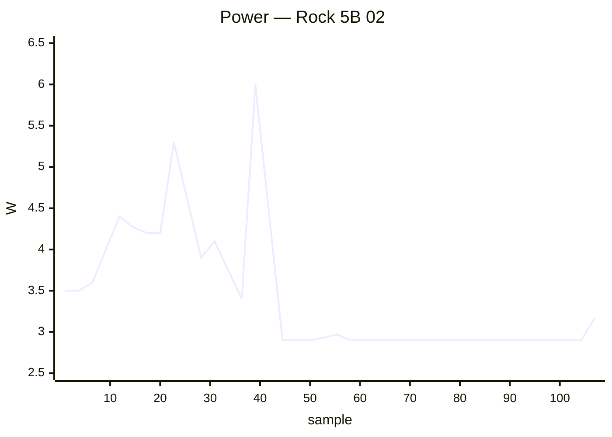
```mermaid
xychart-beta
    title "Power — Rock 5B 02"
    x-axis "sample" 1 --> 107
    y-axis "W" 2.5 --> 6.5
    line [3.50, 3.50, 3.60, 4.00, 4.40, 4.27, 4.20, 4.20, 5.30, 4.60, 3.90, 4.10, 3.75, 3.40, 6.00, 4.45, 2.90, 2.90, 2.90, 2.93, 2.97, 2.90, 2.90, 2.90, 2.90, 2.90, 2.90, 2.90, 2.90, 2.90, 2.90, 2.90, 2.90, 2.90, 2.90, 2.90, 2.90, 2.90, 2.90, 3.17]
```

### ❌ Rock 5B Plus 01

`rock-5b-plus` · **inplace** · image `26.11.0-trunk.66` · 20 ✅ · 2 ❌ · 0 ⏭️

| Module | Status | Time | Detail |
|:--|:--:|--:|:--|
| upgrade | ✅ | 28.5 s | nightly · 26.11.0-trunk.66 → 26.11.0-trunk.66 |
| reboot | ✅ | 143.7 s | power-cycle · up 114 s |
| kernel-switch | ✅ | 23.1 s | branch=vendor · family=rk35xx · installed=26.11.0-trunk.66 · boot_image=/boot/vmlinuz-6.1.172-vendor-rk35xx · kernel_before=6.1.172-vendor-rk35xx |
| reboot | ✅ | 254.9 s | power-cycle · 2/2 boots · up 110 s |
| hw-performance | ✅ | 17.2 s | AES 1286 · mem 14100 · disk W 65 / R 81 MB/s · 49 °C · 1800 MHz |
| dvfs | ✅ | 17.0 s | ondemand · 1800–1800 MHz (peak 2352) |
| network-iperf | ✅ | 47.4 s | enP4p65s0 ↑941/↓941 (1GE) Mbps |
| store-versions | ✅ | 4.3 s | 26.11.0-trunk.66 · 6.1.172-vendor-rk35xx |
| kernel-switch | ✅ | 659.1 s | branch=current · family=rockchip64 · installed=26.11.0-trunk.66 · boot_image=/boot/vmlinuz-6.18.54-current-rockchip64 · kernel_before=6.1.172-vendor-rk35xx |
| reboot | ✅ | 85.4 s | power-cycle · 2/2 boots · up 21 s |
| hw-performance | ✅ | 17.9 s | AES 1291 · mem 6000 · disk W 65 / R 73 MB/s · 59.2 °C · 1800 MHz |
| dvfs | ✅ | 15.2 s | ondemand · 408–1800 MHz (peak 2400) |
| network-iperf | ✅ | 81.9 s | enP4p65s0 ↑941/↓941 (1GE) · wlP2p33s0 ↑109/↓121 (Wi-Fi 7) · wlx40a5efda9ac9 ↑34/↓23 (Wi-Fi 4) Mbps |
| store-versions | ✅ | 4.9 s | 26.11.0-trunk.66 · 6.18.54-current-rockchip64 |
| kernel-switch | ✅ | 498.6 s | branch=edge · family=rockchip64 · installed=26.11.0-trunk.66 · boot_image=/boot/vmlinuz-7.2.8-edge-rockchip64 · kernel_before=6.18.54-current-rockchip64 |
| reboot | ✅ | 82.0 s | power-cycle · 2/2 boots · up 24 s |
| hw-performance | ✅ | 18.2 s | AES 1268 · mem 8100 · disk W 62 / R 70 MB/s · 68.4 °C · 1800 MHz |
| dvfs | ✅ | 15.4 s | ondemand · 408–1800 MHz (peak 2400) |
| network-iperf | ✅ | 82.8 s | end0 ↑941/↓941 · wlP2p33s0 ↑102/↓128 (Wi-Fi 7) · wlx40a5efda9ac9 ↑37/↓31 (Wi-Fi 4) Mbps |
| store-versions | ✅ | 4.9 s | 26.11.0-trunk.66 · 7.2.8-edge-rockchip64 |
| kernel-switch | ❌ | 141.8 s | branch=vendor · phase=install · dpkg_state=absent |
| reboot | ❌ | 233.2 s | power-cycle |

**Power** — min 2.30 W · avg 6.51 W · peak 14.70 W · 1738 samples

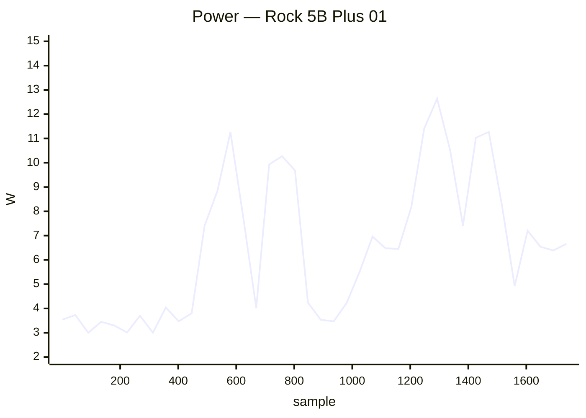
```mermaid
xychart-beta
    title "Power — Rock 5B Plus 01"
    x-axis "sample" 1 --> 1738
    y-axis "W" 2.0 --> 15.0
    line [3.54, 3.73, 3.00, 3.45, 3.30, 3.01, 3.70, 3.00, 4.04, 3.47, 3.80, 7.40, 8.85, 11.27, 7.73, 4.01, 9.93, 10.27, 9.68, 4.24, 3.53, 3.47, 4.23, 5.51, 6.96, 6.48, 6.45, 8.17, 11.41, 12.64, 10.53, 7.41, 11.03, 11.27, 8.30, 4.92, 7.20, 6.54, 6.39, 6.66]
```

### ❌ Tinker Board 01

`tinkerboard` · **inplace** · image `26.11.0-trunk.66` · 0 ✅ · 1 ❌ · 0 ⏭️

| Module | Status | Time | Detail |
|:--|:--:|--:|:--|
| reachable | ❌ | 0.0 s | ip=10.0.50.33 · reachable=False · port=22 |

**Power** — min 2.10 W · avg 2.10 W · peak 2.10 W · 42 samples

```mermaid
xychart-beta
    title "Power — Tinker Board 01"
    x-axis "sample" 1 --> 42
    y-axis "W" 2.0 --> 2.5
    line [2.10, 2.10, 2.10, 2.10, 2.10, 2.10, 2.10, 2.10, 2.10, 2.10, 2.10, 2.10, 2.10, 2.10, 2.10, 2.10, 2.10, 2.10, 2.10, 2.10, 2.10, 2.10, 2.10, 2.10, 2.10, 2.10, 2.10, 2.10, 2.10, 2.10, 2.10, 2.10, 2.10, 2.10, 2.10, 2.10, 2.10, 2.10, 2.10, 2.10]
```

### ❌ UEFI x86 01

`uefi-x86` · **inplace** · image `26.11.0-trunk.66` · 1 ✅ · 1 ❌ · 14 ⏭️

| Module | Status | Time | Detail |
|:--|:--:|--:|:--|
| upgrade | ✅ | 51.8 s | nightly · 26.11.0-trunk.66 → 26.11.0-trunk.66 |
| reboot | ❌ | 220.2 s | power-cycle |
| kernel-switch | ⏭️ | 0.0 s | skipped=board down after reboot/power-cycle |
| reboot | ⏭️ | 0.0 s | reboot |
| hw-perf | ⏭️ | 0.0 s | board down after reboot/power-cycle |
| dvfs | ⏭️ | 0.0 s | — |
| net-iperf | ⏭️ | 0.0 s | board down after reboot/power-cycle |
| store-versions | ⏭️ | 0.0 s | — |
| kernel-switch | ⏭️ | 0.0 s | skipped=board down after reboot/power-cycle |
| reboot | ⏭️ | 0.0 s | reboot |
| hw-perf | ⏭️ | 0.0 s | board down after reboot/power-cycle |
| dvfs | ⏭️ | 0.0 s | — |
| net-iperf | ⏭️ | 0.0 s | board down after reboot/power-cycle |
| store-versions | ⏭️ | 0.0 s | — |
| kernel-switch | ⏭️ | 0.0 s | skipped=board down after reboot/power-cycle |
| reboot | ⏭️ | 0.0 s | reboot |

**Power** — min 1.70 W · avg 3.73 W · peak 9.00 W · 202 samples

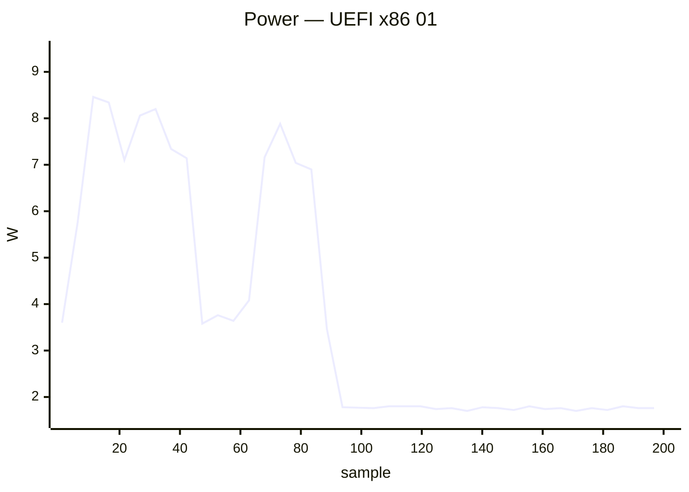
```mermaid
xychart-beta
    title "Power — UEFI x86 01"
    x-axis "sample" 1 --> 202
    y-axis "W" 1.5 --> 9.5
    line [3.60, 5.76, 8.46, 8.34, 7.10, 8.06, 8.20, 7.34, 7.14, 3.58, 3.76, 3.64, 4.08, 7.16, 7.88, 7.04, 6.90, 3.46, 1.78, 1.77, 1.76, 1.80, 1.80, 1.80, 1.74, 1.76, 1.70, 1.78, 1.76, 1.72, 1.80, 1.74, 1.76, 1.70, 1.76, 1.72, 1.80, 1.76, 1.76, 1.72]
```

## ✅ Passed (57)

### ✅ Arduino UNO Q 01

`arduino-uno-q` · **inplace** · image `26.11.0-trunk.66` · 8 ✅ · 0 ❌ · 0 ⏭️

| Module | Status | Time | Detail |
|:--|:--:|--:|:--|
| upgrade | ✅ | 75.8 s | nightly · 26.11.0-trunk.66 → 26.11.0-trunk.66 |
| reboot | ✅ | 58.6 s | warm · up 39 s |
| kernel-switch | ✅ | 47.5 s | branch=edge · family=qrb2210 · installed=26.11.0-trunk.66 · boot_image=? · kernel_before=7.2.3-edge-qrb2210 |
| reboot | ✅ | 105.5 s | warm · 2/2 boots · up 35 s |
| hw-performance | ✅ | 25.6 s | AES 940 · mem 5100 · disk W 181 / R 261 MB/s · 38.1 °C · 2016 MHz |
| dvfs | ✅ | 31.7 s | schedutil · 300–2016 MHz (peak 2016) |
| network-iperf | ✅ | 60.1 s | wlan0 ↑12/↓19 (Wi-Fi 5) · usb0 ↑?/↓? Mbps |
| store-versions | ✅ | 7.2 s | 26.11.0-trunk.66 · 7.2.3-edge-qrb2210 |

### ✅ Banana Pi CM4IO 01

`bananapicm4io` · **inplace** · image `26.8.3` · 14 ✅ · 2 ❌ · 0 ⏭️

| Module | Status | Time | Detail |
|:--|:--:|--:|:--|
| upgrade | ✅ | 58.5 s | nightly · 26.8.3 → 26.8.3 |
| reboot | ✅ | 46.5 s | power-cycle · up 22 s |
| kernel-switch | ✅ | 195.0 s | branch=current · family=meson64 · installed=26.11.0-trunk.66 · boot_image=/boot/vmlinuz-6.18.54-current-meson64 · kernel_before=7.2.8-edge-meson64 |
| reboot | ✅ | 82.5 s | power-cycle · 2/2 boots · up 22 s |
| hw-performance | ✅ | 18.4 s | AES 852 · mem 3900 · disk W 36 / R 151 MB/s · 52 °C · 2016 MHz |
| dvfs | ✅ | 18.2 s | ondemand · 1000–1512 MHz (peak 1512) |
| network-iperf | ❌ | 277.1 s | eth0 ↑0/↓0 (1GE) · wlan0 ↑0/↓0 (Wi-Fi 5) Mbps |
| store-versions | ✅ | 3.9 s | 26.8.3 · 6.18.54-current-meson64 |
| kernel-switch | ✅ | 198.3 s | branch=edge · family=meson64 · installed=26.11.0-trunk.66 · boot_image=/boot/vmlinuz-7.2.8-edge-meson64 · kernel_before=6.18.54-current-meson64 |
| reboot | ✅ | 83.9 s | power-cycle · 2/2 boots · up 22 s |
| hw-performance | ✅ | 18.0 s | AES 852 · mem 3900 · disk W 37 / R 157 MB/s · 51.7 °C · 2016 MHz |
| dvfs | ✅ | 18.2 s | ondemand · 1000–1512 MHz (peak 1512) |
| network-iperf | ❌ | 293.4 s | eth0 ↑941/↓941 (1GE) · wlan0 ↑0/↓0 (Wi-Fi 5) Mbps |
| store-versions | ✅ | 4.6 s | 26.8.3 · 7.2.8-edge-meson64 |
| kernel-switch | ✅ | 190.6 s | branch=current · family=meson64 · installed=26.11.0-trunk.66 · boot_image=/boot/vmlinuz-6.18.54-current-meson64 · kernel_before=7.2.8-edge-meson64 |
| reboot | ✅ | 54.6 s | power-cycle · up 22 s |

### ✅ Banana Pi M2 Ultra 01

`bananapim2ultra` · **inplace** · image `26.11.0-trunk.66` · 16 ✅ · 0 ❌ · 0 ⏭️

| Module | Status | Time | Detail |
|:--|:--:|--:|:--|
| upgrade | ✅ | 103.0 s | nightly · 26.11.0-trunk.66 → 26.11.0-trunk.66 |
| reboot | ✅ | 45.0 s | warm · up 26 s |
| kernel-switch | ✅ | 70.2 s | branch=current · family=sunxi · installed=26.11.0-trunk.66 · boot_image=/boot/vmlinuz-6.18.54-current-sunxi · kernel_before=6.18.54-current-sunxi |
| reboot | ✅ | 84.6 s | warm · 2/2 boots · up 27 s |
| hw-performance | ✅ | 39.3 s | AES 23 · mem 2100 · disk W 10 / R 42 MB/s · 51.3 °C · 1200 MHz |
| dvfs | ✅ | 33.9 s | ondemand · 720–1200 MHz (peak 1200) |
| network-iperf | ✅ | 80.6 s | end0 ↑806/↓942 (1GE) · wlan0 ↑9/↓20 (Wi-Fi 4) Mbps |
| store-versions | ✅ | 7.4 s | 26.11.0-trunk.66 · 6.18.54-current-sunxi |
| kernel-switch | ✅ | 191.3 s | branch=edge · family=sunxi · installed=26.11.0-trunk.66 · boot_image=/boot/vmlinuz-7.2.8-edge-sunxi · kernel_before=6.18.54-current-sunxi |
| reboot | ✅ | 83.6 s | warm · 2/2 boots · up 26 s |
| hw-performance | ✅ | 42.2 s | AES 23 · mem 2100 · disk W 7 / R 42 MB/s · 51.4 °C · 1200 MHz |
| dvfs | ✅ | 37.0 s | ondemand · 720–1200 MHz (peak 1200) |
| network-iperf | ✅ | 76.2 s | end0 ↑818/↓941 (1GE) · wlan0 ↑28/↓34 (Wi-Fi 4) Mbps |
| store-versions | ✅ | 7.4 s | 26.11.0-trunk.66 · 7.2.8-edge-sunxi |
| kernel-switch | ✅ | 187.4 s | branch=current · family=sunxi · installed=26.11.0-trunk.66 · boot_image=/boot/vmlinuz-6.18.54-current-sunxi · kernel_before=7.2.8-edge-sunxi |
| reboot | ✅ | 46.0 s | warm · up 27 s |

### ✅ Banana Pi M2Pro 01

`bananapim2pro` · **inplace** · image `26.11.0-trunk.66` · 16 ✅ · 0 ❌ · 0 ⏭️

| Module | Status | Time | Detail |
|:--|:--:|--:|:--|
| upgrade | ✅ | 47.2 s | nightly · 26.11.0-trunk.66 → 26.11.0-trunk.66 |
| reboot | ✅ | 141.7 s | power-cycle · up 104 s |
| kernel-switch | ✅ | 31.7 s | branch=current · family=meson64 · installed=26.11.0-trunk.66 · boot_image=/boot/vmlinuz-6.18.54-current-meson64 · kernel_before=6.18.54-current-meson64 |
| reboot | ✅ | 252.0 s | power-cycle · 2/2 boots · up 104 s |
| hw-performance | ✅ | 19.8 s | AES 978 · mem 5300 · disk W 40 / R 150 MB/s · 45.7 °C · 2100 MHz |
| dvfs | ✅ | 19.3 s | ondemand · 1000–2100 MHz (peak 2100) |
| network-iperf | ✅ | 29.6 s | end0 ↑940/↓941 (1GE) Mbps |
| store-versions | ✅ | 4.3 s | 26.11.0-trunk.66 · 6.18.54-current-meson64 |
| kernel-switch | ✅ | 104.3 s | branch=edge · family=meson64 · installed=26.11.0-trunk.66 · boot_image=/boot/vmlinuz-7.2.8-edge-meson64 · kernel_before=6.18.54-current-meson64 |
| reboot | ✅ | 248.1 s | power-cycle · 2/2 boots · up 104 s |
| hw-performance | ✅ | 19.6 s | AES 979 · mem 5300 · disk W 43 / R 156 MB/s · 46 °C · 2100 MHz |
| dvfs | ✅ | 19.9 s | ondemand · 1000–2100 MHz (peak 2100) |
| network-iperf | ✅ | 37.0 s | end0 ↑940/↓941 (1GE) Mbps |
| store-versions | ✅ | 4.4 s | 26.11.0-trunk.66 · 7.2.8-edge-meson64 |
| kernel-switch | ✅ | 99.1 s | branch=current · family=meson64 · installed=26.11.0-trunk.66 · boot_image=/boot/vmlinuz-6.18.54-current-meson64 · kernel_before=7.2.8-edge-meson64 |
| reboot | ✅ | 139.0 s | power-cycle · up 102 s |

**Power** — min 1.40 W · avg 2.81 W · peak 4.90 W · 963 samples

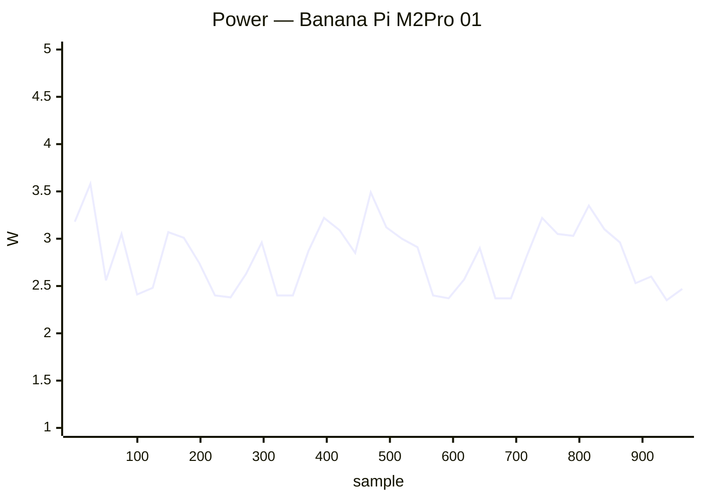
```mermaid
xychart-beta
    title "Power — Banana Pi M2Pro 01"
    x-axis "sample" 1 --> 963
    y-axis "W" 1.0 --> 5.0
    line [3.18, 3.58, 2.56, 3.05, 2.41, 2.48, 3.07, 3.01, 2.74, 2.40, 2.38, 2.63, 2.96, 2.40, 2.40, 2.87, 3.22, 3.09, 2.85, 3.49, 3.12, 3.00, 2.91, 2.40, 2.37, 2.57, 2.90, 2.37, 2.37, 2.81, 3.22, 3.05, 3.03, 3.35, 3.10, 2.96, 2.53, 2.60, 2.35, 2.47]
```

### ✅ Banana Pi M5 01

`bananapim5` · **inplace** · image `26.11.0-trunk.66` · 15 ✅ · 1 ❌ · 0 ⏭️

| Module | Status | Time | Detail |
|:--|:--:|--:|:--|
| upgrade | ✅ | 345.5 s | nightly · 26.11.0-trunk.66 → 26.11.0-trunk.68 |
| reboot | ✅ | 210.9 s | warm · up 185 s |
| kernel-switch | ✅ | 174.4 s | branch=current · family=meson64 · installed=26.11.0-trunk.68 · boot_image=/boot/vmlinuz-6.18.54-current-meson64 · kernel_before=7.2.8-edge-meson64 |
| reboot | ✅ | 325.6 s | warm · 2/2 boots · up 148 s |
| hw-performance | ✅ | 39.6 s | AES 980 · mem 5300 · disk W 9 / R 15 MB/s · 54.3 °C · 2100 MHz |
| dvfs | ✅ | 21.0 s | ondemand · 1000–2100 MHz (peak 2100) |
| network-iperf | ❌ | 70.0 s | end0 ↑940/↓941 (1GE) · wlx000f13960190 ↑0/↓1 (Wi-Fi 4) Mbps |
| store-versions | ✅ | 4.8 s | 26.11.0-trunk.68 · 6.18.54-current-meson64 |
| kernel-switch | ✅ | 192.6 s | branch=edge · family=meson64 · installed=26.11.0-trunk.68 · boot_image=/boot/vmlinuz-7.2.8-edge-meson64 · kernel_before=6.18.54-current-meson64 |
| reboot | ✅ | 396.5 s | warm · 2/2 boots · up 180 s |
| hw-performance | ✅ | 40.1 s | AES 980 · mem 5100 · disk W 9 / R 15 MB/s · 54.3 °C · 2100 MHz |
| dvfs | ✅ | 21.7 s | ondemand · 1000–2100 MHz (peak 2100) |
| network-iperf | ✅ | 117.0 s | end0 ↑941/↓941 (1GE) · wlx000f13960190 ↑7/↓3 (Wi-Fi 4) Mbps |
| store-versions | ✅ | 4.8 s | 26.11.0-trunk.68 · 7.2.8-edge-meson64 |
| kernel-switch | ✅ | 192.8 s | branch=current · family=meson64 · installed=26.11.0-trunk.68 · boot_image=/boot/vmlinuz-6.18.54-current-meson64 · kernel_before=7.2.8-edge-meson64 |
| reboot | ✅ | 165.5 s | warm · up 149 s |

### ✅ Banana Pi M7 01

`bananapim7` · **inplace** · image `26.11.0-trunk.66` · 22 ✅ · 0 ❌ · 0 ⏭️

| Module | Status | Time | Detail |
|:--|:--:|--:|:--|
| upgrade | ✅ | 28.9 s | nightly · 26.11.0-trunk.66 → 26.11.0-trunk.66 |
| reboot | ✅ | 41.9 s | power-cycle · up 14 s |
| kernel-switch | ✅ | 18.5 s | branch=vendor · family=rk35xx · installed=26.11.0-trunk.66 · boot_image=/boot/vmlinuz-6.1.172-vendor-rk35xx · kernel_before=6.1.172-vendor-rk35xx |
| reboot | ✅ | 70.0 s | power-cycle · 2/2 boots · up 15 s |
| hw-performance | ✅ | 13.3 s | AES 1264 · mem 9600 · disk W 973 / R 1393 MB/s · 52.7 °C · 1800 MHz |
| dvfs | ✅ | 18.0 s | ondemand · 1800–1800 MHz (peak 2256) |
| network-iperf | ✅ | 31.7 s | enP2p33s0 ↑941/↓941 (1GE) Mbps |
| store-versions | ✅ | 3.8 s | 26.11.0-trunk.66 · 6.1.172-vendor-rk35xx |
| kernel-switch | ✅ | 62.0 s | branch=current · family=rockchip64 · installed=26.11.0-trunk.66 · boot_image=/boot/vmlinuz-6.18.54-current-rockchip64 · kernel_before=6.1.172-vendor-rk35xx |
| reboot | ✅ | 230.1 s | power-cycle · 2/2 boots · up 97 s |
| hw-performance | ✅ | 13.7 s | AES 1261 · mem 10200 · disk W 847 / R 1585 MB/s · 56.4 °C · 1800 MHz |
| dvfs | ✅ | 14.6 s | ondemand · 408–1800 MHz (peak 2400) |
| network-iperf | ✅ | 29.7 s | enP2p33s0 ↑941/↓941 (1GE) Mbps |
| store-versions | ✅ | 3.9 s | 26.11.0-trunk.66 · 6.18.54-current-rockchip64 |
| kernel-switch | ✅ | 43.8 s | branch=edge · family=rockchip64 · installed=26.11.0-trunk.66 · boot_image=/boot/vmlinuz-7.2.8-edge-rockchip64 · kernel_before=6.18.54-current-rockchip64 |
| reboot | ✅ | 230.0 s | power-cycle · 2/2 boots · up 97 s |
| hw-performance | ✅ | 13.4 s | AES 1260 · mem 5700 · disk W 863 / R 1185 MB/s · 58.2 °C · 1800 MHz |
| dvfs | ✅ | 14.7 s | ondemand · 408–1800 MHz (peak 2400) |
| network-iperf | ✅ | 32.0 s | enP2p33s0 ↑941/↓941 (1GE) Mbps |
| store-versions | ✅ | 3.9 s | 26.11.0-trunk.66 · 7.2.8-edge-rockchip64 |
| kernel-switch | ✅ | 41.2 s | branch=vendor · family=rk35xx · installed=26.11.0-trunk.66 · boot_image=/boot/vmlinuz-6.1.172-vendor-rk35xx · kernel_before=7.2.8-edge-rockchip64 |
| reboot | ✅ | 45.6 s | power-cycle · up 16 s |

**Power** — min 1.00 W · avg 5.93 W · peak 14.20 W · 790 samples

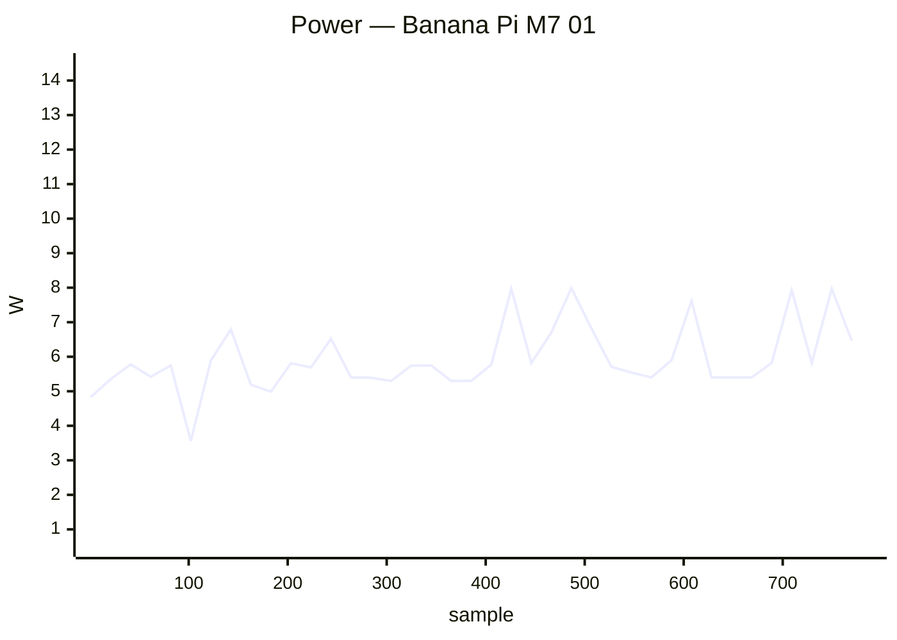
```mermaid
xychart-beta
    title "Power — Banana Pi M7 01"
    x-axis "sample" 1 --> 790
    y-axis "W" 0.5 --> 14.5
    line [4.83, 5.35, 5.78, 5.42, 5.75, 3.56, 5.89, 6.79, 5.19, 4.99, 5.81, 5.69, 6.52, 5.40, 5.39, 5.30, 5.74, 5.75, 5.30, 5.30, 5.77, 7.97, 5.82, 6.70, 7.99, 6.82, 5.71, 5.54, 5.40, 5.90, 7.62, 5.40, 5.40, 5.40, 5.82, 7.93, 5.82, 7.97, 6.46, 6.13]
```

### ✅ Banana Pi R2 01

`bananapir2` · **inplace** · image `26.11.0-trunk.66` · 16 ✅ · 0 ❌ · 0 ⏭️

| Module | Status | Time | Detail |
|:--|:--:|--:|:--|
| upgrade | ✅ | 93.1 s | nightly · 26.11.0-trunk.66 → 26.11.0-trunk.66 |
| reboot | ✅ | 46.8 s | warm · up 26 s |
| kernel-switch | ✅ | 60.4 s | branch=current · family=mt7623 · installed=26.11.0-trunk.66 · boot_image=/boot/vmlinuz-6.18.54-current-mt7623 · kernel_before=6.18.54-current-mt7623 |
| reboot | ✅ | 87.1 s | warm · 2/2 boots · up 27 s |
| hw-performance | ✅ | 44.4 s | AES 25 · mem 1600 · disk W 20 / R 23 MB/s · 51.8 °C · 1300 MHz |
| dvfs | ✅ | 40.1 s | ondemand · 98–1300 MHz (peak 1300) |
| network-iperf | ✅ | 52.0 s | lan2 ↑939/↓918 Mbps |
| store-versions | ✅ | 9.4 s | 26.11.0-trunk.66 · 6.18.54-current-mt7623 |
| kernel-switch | ✅ | 139.0 s | branch=edge · family=mt7623 · installed=26.11.0-trunk.66 · boot_image=/boot/vmlinuz-7.2.8-edge-mt7623 · kernel_before=6.18.54-current-mt7623 |
| reboot | ✅ | 86.3 s | warm · 2/2 boots · up 25 s |
| hw-performance | ✅ | 44.9 s | AES 25 · mem 1600 · disk W 20 / R 22 MB/s · 52.2 °C · 1300 MHz |
| dvfs | ✅ | 42.7 s | ondemand · 98–1300 MHz (peak 1300) |
| network-iperf | ✅ | 52.5 s | lan2 ↑925/↓926 Mbps |
| store-versions | ✅ | 8.7 s | 26.11.0-trunk.66 · 7.2.8-edge-mt7623 |
| kernel-switch | ✅ | 139.3 s | branch=current · family=mt7623 · installed=26.11.0-trunk.66 · boot_image=/boot/vmlinuz-6.18.54-current-mt7623 · kernel_before=7.2.8-edge-mt7623 |
| reboot | ✅ | 73.2 s | warm · up 26 s |

### ✅ Banana Pi R3 Mini 01

`bananapir3mini` · **inplace** · image `26.11.0-trunk` · 4 ✅ · 0 ❌ · 2 ⏭️

| Module | Status | Time | Detail |
|:--|:--:|--:|:--|
| upgrade | ⏭️ | 21.3 s | — |
| reboot | ✅ | 66.9 s | power-cycle · up 32 s |
| hw-performance | ✅ | 25.8 s | AES 934 · mem 3200 · disk W 76 / R 91 MB/s · 64.3 °C · None MHz |
| dvfs | ➖ | 2.2 s | no cpufreq |
| network-iperf | ✅ | 108.3 s | eth0 ↑941/↓942 (1GE) · eth1 ↑941/↓942 (1GE) · wlan0 ↑29/↓43 (Wi-Fi 6) · wlan1 ↑454/↓399 (Wi-Fi 6) Mbps |
| store-versions | ✅ | 4.5 s | 26.11.0-trunk · 6.18.52-current-filogic-mt7986 |

**Power** — min 2.80 W · avg 7.70 W · peak 12.60 W · 190 samples

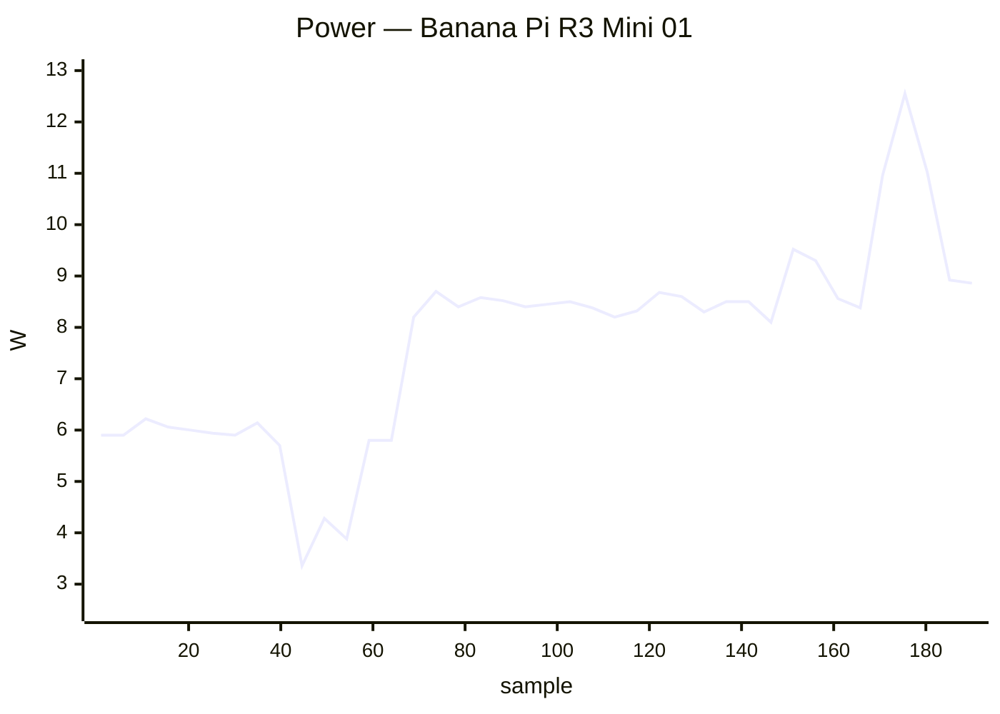
```mermaid
xychart-beta
    title "Power — Banana Pi R3 Mini 01"
    x-axis "sample" 1 --> 190
    y-axis "W" 2.5 --> 13.0
    line [5.90, 5.90, 6.22, 6.06, 6.00, 5.94, 5.90, 6.14, 5.70, 3.36, 4.28, 3.88, 5.80, 5.80, 8.20, 8.70, 8.40, 8.58, 8.52, 8.40, 8.45, 8.50, 8.38, 8.20, 8.32, 8.68, 8.60, 8.30, 8.50, 8.50, 8.10, 9.52, 9.30, 8.56, 8.38, 10.96, 12.55, 11.02, 8.92, 8.86]
```

### ✅ BananaPi BPI-F3 01

`musepipro` · **inplace** · image `26.11.0-trunk.66` · 6 ✅ · 0 ❌ · 0 ⏭️

| Module | Status | Time | Detail |
|:--|:--:|--:|:--|
| upgrade | ✅ | 72.3 s | nightly · 26.11.0-trunk.66 → 26.11.0-trunk.66 |
| reboot | ✅ | 58.9 s | power-cycle · up 18 s |
| hw-performance | ✅ | 25.2 s | AES 26 · mem 3000 · disk W 22 / R 82 MB/s · 45 °C · 1600 MHz |
| dvfs | ✅ | 23.8 s | performance · 614–1600 MHz (peak 1600) |
| network-iperf | ✅ | 99.7 s | eth0 ↑941/↓941 (1GE) · wlan0 ↑299/↓295 (Wi-Fi 6) · wlan1 ↑231/↓215 (Wi-Fi 5) Mbps |
| store-versions | ✅ | 5.3 s | 26.11.0-trunk.66 · 6.18.54-current-spacemit |

**Power** — min 2.90 W · avg 5.27 W · peak 7.80 W · 228 samples

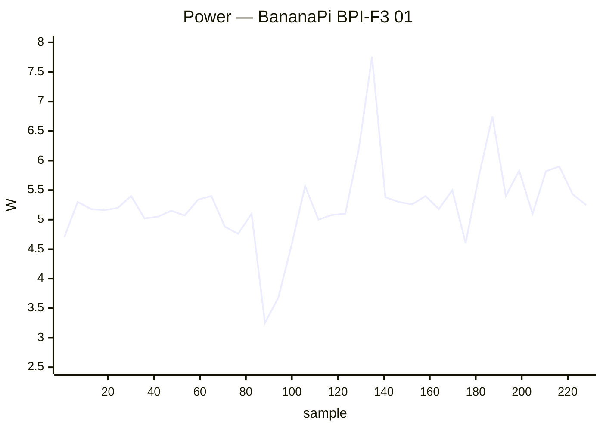
```mermaid
xychart-beta
    title "Power — BananaPi BPI-F3 01"
    x-axis "sample" 1 --> 228
    y-axis "W" 2.5 --> 8.0
    line [4.70, 5.30, 5.18, 5.16, 5.20, 5.40, 5.02, 5.05, 5.15, 5.07, 5.34, 5.40, 4.88, 4.76, 5.10, 3.25, 3.68, 4.58, 5.57, 5.00, 5.08, 5.10, 6.18, 7.76, 5.38, 5.30, 5.26, 5.40, 5.18, 5.50, 4.60, 5.75, 6.75, 5.40, 5.83, 5.10, 5.82, 5.90, 5.43, 5.25]
```

### ✅ BananaPi BPI-M4-Zero 01

`bananapim4zero` · **inplace** · image `26.8.8` · 8 ✅ · 0 ❌ · 0 ⏭️

| Module | Status | Time | Detail |
|:--|:--:|--:|:--|
| upgrade | ✅ | 292.3 s | nightly · 26.8.8 → 26.11.0-trunk.68 |
| reboot | ✅ | 76.4 s | power-cycle · up 25 s |
| kernel-switch | ✅ | 50.2 s | branch=current · family=sunxi64 · installed=26.11.0-trunk.68 · boot_image=/boot/vmlinuz-6.18.54-current-sunxi64 · kernel_before=6.18.54-current-sunxi64 |
| reboot | ✅ | 108.8 s | power-cycle · 2/2 boots · up 25 s |
| hw-performance | ✅ | 33.5 s | AES 660 · mem 3600 · disk W 12 / R 22 MB/s · 53.2 °C · 1416 MHz |
| dvfs | ✅ | 29.4 s | ondemand · 480–1416 MHz (peak 1416) |
| network-iperf | ✅ | 35.9 s | wlan0 ↑90/↓103 (Wi-Fi 5) Mbps |
| store-versions | ✅ | 5.6 s | 26.11.0-trunk.68 · 6.18.54-current-sunxi64 |

### ✅ Clearfog Pro 01

`clearfogpro` · **inplace** · image `26.11.0-trunk.66` · 14 ✅ · 0 ❌ · 2 ⏭️

| Module | Status | Time | Detail |
|:--|:--:|--:|:--|
| upgrade | ✅ | 60.1 s | nightly · 26.11.0-trunk.66 → 26.11.0-trunk.66 |
| reboot | ✅ | 41.5 s | warm · up 22 s |
| kernel-switch | ✅ | 42.3 s | branch=current · family=mvebu · installed=26.11.0-trunk.66 · boot_image=/boot/vmlinuz-6.18.54-current-mvebu · kernel_before=6.18.54-current-mvebu |
| reboot | ✅ | 76.2 s | warm · 2/2 boots · up 20 s |
| hw-performance | ✅ | 42.1 s | AES 43 · mem 3800 · disk W 20 / R 22 MB/s · 60.8 °C · None MHz |
| dvfs | ➖ | 3.5 s | no cpufreq |
| network-iperf | ✅ | 34.9 s | lan2 ↑936/↓936 Mbps |
| store-versions | ✅ | 5.9 s | 26.11.0-trunk.66 · 6.18.54-current-mvebu |
| kernel-switch | ✅ | 102.2 s | branch=edge · family=mvebu · installed=26.11.0-trunk.66 · boot_image=/boot/vmlinuz-7.2.8-edge-mvebu · kernel_before=6.18.54-current-mvebu |
| reboot | ✅ | 77.3 s | warm · 2/2 boots · up 24 s |
| hw-performance | ✅ | 41.7 s | AES 43 · mem 3800 · disk W 21 / R 23 MB/s · 62.3 °C · None MHz |
| dvfs | ➖ | 2.9 s | no cpufreq |
| network-iperf | ✅ | 34.8 s | lan2 ↑936/↓936 Mbps |
| store-versions | ✅ | 6.9 s | 26.11.0-trunk.66 · 7.2.8-edge-mvebu |
| kernel-switch | ✅ | 107.6 s | branch=current · family=mvebu · installed=26.11.0-trunk.66 · boot_image=/boot/vmlinuz-6.18.54-current-mvebu · kernel_before=7.2.8-edge-mvebu |
| reboot | ✅ | 44.1 s | warm · up 24 s |

### ✅ Cubie A5E 01

`radxa-cubie-a5e` · **inplace** · image `26.11.0-trunk.66` · 13 ✅ · 0 ❌ · 3 ⏭️

| Module | Status | Time | Detail |
|:--|:--:|--:|:--|
| upgrade | ⏭️ | 304.5 s | — |
| reboot | ✅ | 77.1 s | power-cycle · up 32 s |
| kernel-switch | ✅ | 168.9 s | branch=current · family=sunxi64 · installed=26.11.0-trunk.66 · boot_image=? · kernel_before=6.18.54-current-sunxi64 |
| reboot | ✅ | 105.9 s | power-cycle · 2/2 boots · up 31 s |
| hw-performance | ✅ | 43.0 s | AES 358 · mem 2000 · disk W 21 / R 23 MB/s · 61.3 °C · None MHz |
| dvfs | ➖ | 11.0 s | no cpufreq |
| network-iperf | ✅ | 91.2 s | end0 ↑830/↓941 (1GE) · end1 ↑941/↓940 (1GE) · wlan0 ↑119/↓126 (Wi-Fi 6) Mbps |
| store-versions | ✅ | 14.1 s | 26.11.0-trunk.66 · 6.18.54-current-sunxi64 |
| kernel-switch | ✅ | 589.7 s | branch=edge · family=sunxi64 · installed=26.11.0-trunk.68 · boot_image=? · kernel_before=6.18.54-current-sunxi64 |
| reboot | ✅ | 106.7 s | power-cycle · 2/2 boots · up 31 s |
| hw-performance | ✅ | 43.4 s | AES 358 · mem 2000 · disk W 21 / R 23 MB/s · 65.5 °C · None MHz |
| dvfs | ➖ | 3.0 s | no cpufreq |
| network-iperf | ✅ | 91.9 s | end0 ↑819/↓941 (1GE) · end1 ↑941/↓941 (1GE) · wlan0 ↑120/↓128 (Wi-Fi 6) Mbps |
| store-versions | ✅ | 6.3 s | 26.11.0-trunk.66 · 7.2.8-edge-sunxi64 |
| kernel-switch | ✅ | 584.7 s | branch=current · family=sunxi64 · installed=26.11.0-trunk.68 · boot_image=? · kernel_before=7.2.8-edge-sunxi64 |
| reboot | ✅ | 67.7 s | power-cycle · up 32 s |

**Power** — min 0.60 W · avg 3.81 W · peak 5.70 W · 1894 samples

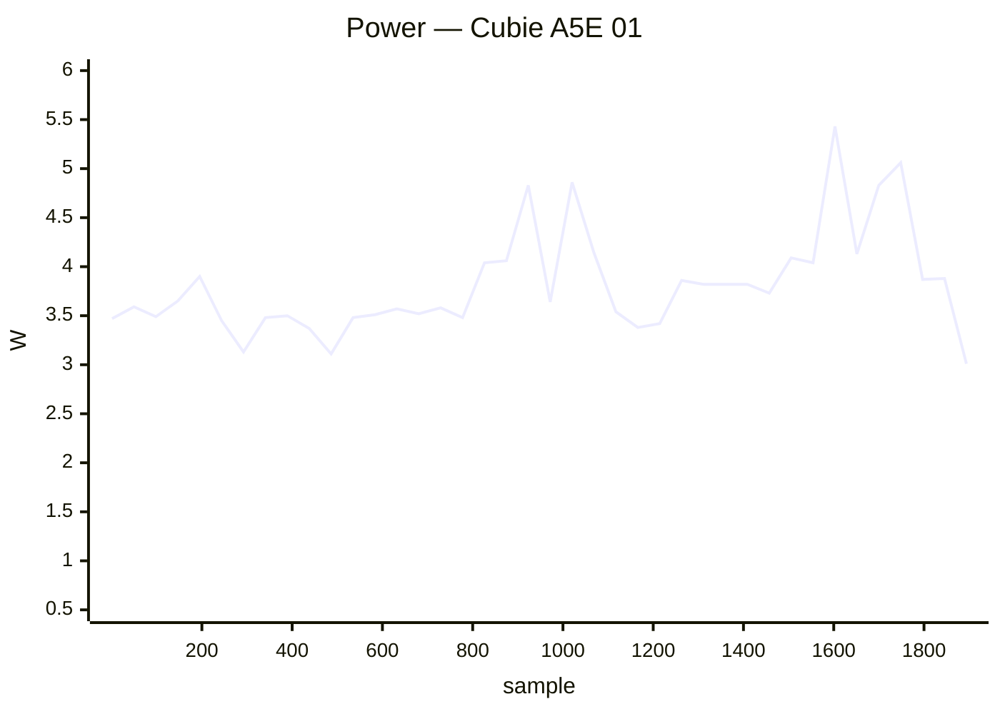
```mermaid
xychart-beta
    title "Power — Cubie A5E 01"
    x-axis "sample" 1 --> 1894
    y-axis "W" 0.5 --> 6.0
    line [3.47, 3.59, 3.49, 3.65, 3.90, 3.45, 3.13, 3.48, 3.50, 3.37, 3.11, 3.48, 3.51, 3.57, 3.52, 3.58, 3.48, 4.04, 4.06, 4.83, 3.64, 4.86, 4.14, 3.54, 3.38, 3.42, 3.86, 3.82, 3.82, 3.82, 3.73, 4.09, 4.04, 5.43, 4.13, 4.83, 5.06, 3.87, 3.88, 3.01]
```

### ✅ Cubietruck 01

`cubietruck` · **inplace** · image `26.11.0-trunk.66` · 16 ✅ · 0 ❌ · 0 ⏭️

| Module | Status | Time | Detail |
|:--|:--:|--:|:--|
| upgrade | ✅ | 140.6 s | nightly · 26.11.0-trunk.66 → 26.11.0-trunk.66 |
| reboot | ✅ | 67.1 s | warm · up 43 s |
| kernel-switch | ✅ | 232.3 s | branch=current · family=sunxi · installed=26.11.0-trunk.66 · boot_image=/boot/vmlinuz-6.18.54-current-sunxi · kernel_before=7.2.8-edge-sunxi |
| reboot | ✅ | 130.4 s | warm · 2/2 boots · up 43 s |
| hw-performance | ✅ | 60.2 s | AES 19 · mem 1700 · disk W 13 / R 21 MB/s · 47.3 °C · 960 MHz |
| dvfs | ✅ | 56.5 s | ondemand · 528–960 MHz (peak 960) |
| network-iperf | ✅ | 119.2 s | end0 ↑728/↓862 (1GE) · wlan0 ↑13/↓19 (Wi-Fi 4) Mbps |
| store-versions | ✅ | 12.5 s | 26.11.0-trunk.66 · 6.18.54-current-sunxi |
| kernel-switch | ✅ | 229.8 s | branch=edge · family=sunxi · installed=26.11.0-trunk.66 · boot_image=/boot/vmlinuz-7.2.8-edge-sunxi · kernel_before=6.18.54-current-sunxi |
| reboot | ✅ | 128.8 s | warm · 2/2 boots · up 44 s |
| hw-performance | ✅ | 58.0 s | AES 19 · mem 1700 · disk W 14 / R 22 MB/s · 47.8 °C · 960 MHz |
| dvfs | ✅ | 57.2 s | ondemand · 528–960 MHz (peak 960) |
| network-iperf | ✅ | 103.3 s | end0 ↑751/↓896 (1GE) · wlan0 ↑19/↓21 (Wi-Fi 4) Mbps |
| store-versions | ✅ | 11.8 s | 26.11.0-trunk.66 · 7.2.8-edge-sunxi |
| kernel-switch | ✅ | 217.1 s | branch=current · family=sunxi · installed=26.11.0-trunk.66 · boot_image=/boot/vmlinuz-6.18.54-current-sunxi · kernel_before=7.2.8-edge-sunxi |
| reboot | ✅ | 70.7 s | warm · up 46 s |

### ✅ Cubox i2eX/i4 01

`cubox-i` · **inplace** · image `26.11.0-trunk.66` · 16 ✅ · 0 ❌ · 0 ⏭️

| Module | Status | Time | Detail |
|:--|:--:|--:|:--|
| upgrade | ✅ | 112.5 s | nightly · 26.11.0-trunk.66 → 26.11.0-trunk.66 |
| reboot | ✅ | 109.0 s | power-cycle · up 70 s |
| kernel-switch | ✅ | 298.1 s | branch=current · family=imx6 · installed=26.11.0-trunk.66 · boot_image=/boot/vmlinuz-6.18.54-current-imx6 · kernel_before=7.1.13-edge-imx6 |
| reboot | ✅ | 136.9 s | power-cycle · 2/2 boots · up 41 s |
| hw-performance | ✅ | 48.4 s | AES 26 · mem 767 · disk W 14 / R 20 MB/s · 48.6 °C · 996 MHz |
| dvfs | ✅ | 40.4 s | ondemand · 396–996 MHz (peak 996) |
| network-iperf | ✅ | 96.4 s | end0 ↑94/↓94 (10/100ME) · wlan0 ↑15/↓20 (Wi-Fi 4) Mbps |
| store-versions | ✅ | 8.7 s | 26.11.0-trunk.66 · 6.18.54-current-imx6 |
| kernel-switch | ✅ | 260.2 s | branch=edge · family=imx6 · installed=26.11.0-trunk.66 · boot_image=/boot/vmlinuz-7.1.13-edge-imx6 · kernel_before=6.18.54-current-imx6 |
| reboot | ✅ | 140.7 s | power-cycle · 2/2 boots · up 44 s |
| hw-performance | ✅ | 47.3 s | AES 26 · mem 697 · disk W 19 / R 20 MB/s · 52 °C · 996 MHz |
| dvfs | ✅ | 44.3 s | ondemand · 396–996 MHz (peak 996) |
| network-iperf | ✅ | 86.3 s | end0 ↑94/↓94 (10/100ME) · wlan0 ↑17/↓17 (Wi-Fi 4) Mbps |
| store-versions | ✅ | 8.9 s | 26.11.0-trunk.66 · 7.1.13-edge-imx6 |
| kernel-switch | ✅ | 256.9 s | branch=current · family=imx6 · installed=26.11.0-trunk.66 · boot_image=/boot/vmlinuz-6.18.54-current-imx6 · kernel_before=7.1.13-edge-imx6 |
| reboot | ✅ | 91.1 s | power-cycle · up 44 s |

**Power** — min 1.80 W · avg 3.39 W · peak 5.90 W · 1446 samples

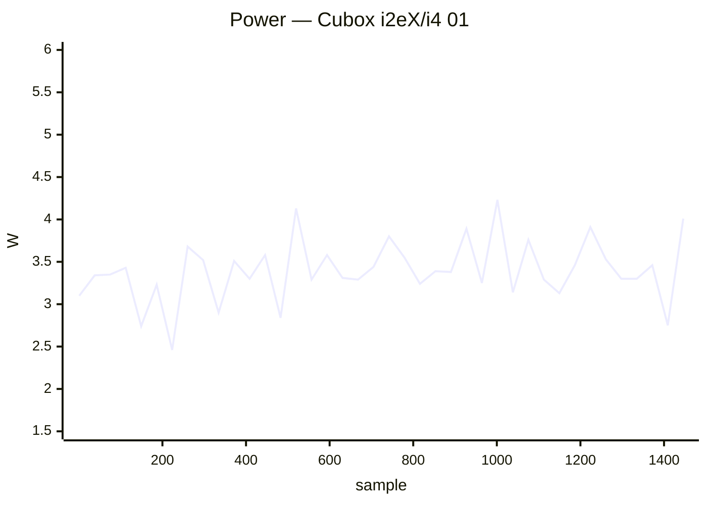
```mermaid
xychart-beta
    title "Power — Cubox i2eX/i4 01"
    x-axis "sample" 1 --> 1446
    y-axis "W" 1.5 --> 6.0
    line [3.10, 3.34, 3.35, 3.43, 2.74, 3.23, 2.46, 3.68, 3.52, 2.90, 3.51, 3.30, 3.58, 2.84, 4.13, 3.29, 3.58, 3.31, 3.29, 3.44, 3.80, 3.55, 3.24, 3.39, 3.38, 3.89, 3.25, 4.23, 3.14, 3.76, 3.29, 3.13, 3.46, 3.91, 3.53, 3.30, 3.30, 3.46, 2.75, 4.01]
```

### ✅ Espressobin 01

`espressobin` · **inplace** · image `26.11.0-trunk.66` · 16 ✅ · 0 ❌ · 0 ⏭️

| Module | Status | Time | Detail |
|:--|:--:|--:|:--|
| upgrade | ✅ | 118.9 s | nightly · 26.11.0-trunk.66 → 26.11.0-trunk.66 |
| reboot | ✅ | 74.4 s | power-cycle · up 40 s |
| kernel-switch | ✅ | 363.9 s | branch=current · family=mvebu64 · installed=26.11.0-trunk.66 · boot_image=/boot/vmlinuz-6.18.54-current-mvebu64 · kernel_before=7.1.13-edge-mvebu64 |
| reboot | ✅ | 132.0 s | power-cycle · 2/2 boots · up 43 s |
| hw-performance | ✅ | 34.2 s | AES 368 · mem 2000 · disk W 22 / R 130 MB/s · None °C · 800 MHz |
| dvfs | ✅ | 35.1 s | ondemand · 200–800 MHz (peak 800) |
| network-iperf | ✅ | 49.3 s | lan0 ↑934/↓755 (1GE) Mbps |
| store-versions | ✅ | 7.6 s | 26.11.0-trunk.66 · 6.18.54-current-mvebu64 |
| kernel-switch | ✅ | 369.2 s | branch=edge · family=mvebu64 · installed=26.11.0-trunk.66 · boot_image=/boot/vmlinuz-7.1.13-edge-mvebu64 · kernel_before=6.18.54-current-mvebu64 |
| reboot | ✅ | 128.5 s | power-cycle · 2/2 boots · up 40 s |
| hw-performance | ✅ | 37.0 s | AES 367 · mem 1800 · disk W 13 / R 132 MB/s · None °C · 800 MHz |
| dvfs | ✅ | 35.8 s | ondemand · 200–800 MHz (peak 800) |
| network-iperf | ✅ | 49.6 s | lan0 ↑928/↓773 (1GE) Mbps |
| store-versions | ✅ | 8.1 s | 26.11.0-trunk.66 · 7.1.13-edge-mvebu64 |
| kernel-switch | ✅ | 354.8 s | branch=current · family=mvebu64 · installed=26.11.0-trunk.66 · boot_image=/boot/vmlinuz-6.18.54-current-mvebu64 · kernel_before=7.1.13-edge-mvebu64 |
| reboot | ✅ | 74.1 s | power-cycle · up 41 s |

### ✅ Helios4 01

`helios4` · **inplace** · image `26.11.0-trunk.66` · 14 ✅ · 0 ❌ · 2 ⏭️

| Module | Status | Time | Detail |
|:--|:--:|--:|:--|
| upgrade | ✅ | 53.7 s | nightly · 26.11.0-trunk.66 → 26.11.0-trunk.66 |
| reboot | ✅ | 120.0 s | warm · up 103 s |
| kernel-switch | ✅ | 34.5 s | branch=current · family=mvebu · installed=26.11.0-trunk.66 · boot_image=/boot/vmlinuz-6.18.54-current-mvebu · kernel_before=6.18.54-current-mvebu |
| reboot | ✅ | 234.9 s | warm · 2/2 boots · up 103 s |
| hw-performance | ✅ | 36.3 s | AES 43 · mem 3800 · disk W 21 / R 23 MB/s · 53.7 °C · None MHz |
| dvfs | ➖ | 2.3 s | no cpufreq |
| network-iperf | ✅ | 34.0 s | end1 ↑941/↓941 (1GE) Mbps |
| store-versions | ✅ | 4.8 s | 26.11.0-trunk.66 · 6.18.54-current-mvebu |
| kernel-switch | ✅ | 99.3 s | branch=edge · family=mvebu · installed=26.11.0-trunk.66 · boot_image=/boot/vmlinuz-7.2.8-edge-mvebu · kernel_before=6.18.54-current-mvebu |
| reboot | ✅ | 235.0 s | warm · 2/2 boots · up 103 s |
| hw-performance | ✅ | 36.8 s | AES 43 · mem 3800 · disk W 21 / R 23 MB/s · 53.7 °C · None MHz |
| dvfs | ➖ | 2.4 s | no cpufreq |
| network-iperf | ✅ | 34.4 s | end1 ↑941/↓941 (1GE) Mbps |
| store-versions | ✅ | 5.3 s | 26.11.0-trunk.66 · 7.2.8-edge-mvebu |
| kernel-switch | ✅ | 98.1 s | branch=current · family=mvebu · installed=26.11.0-trunk.66 · boot_image=/boot/vmlinuz-6.18.54-current-mvebu · kernel_before=7.2.8-edge-mvebu |
| reboot | ✅ | 120.0 s | warm · up 103 s |

### ✅ Inovato Quadra 01

`inovato-quadra` · **inplace** · image `26.11.0-trunk.66` · 16 ✅ · 0 ❌ · 0 ⏭️

| Module | Status | Time | Detail |
|:--|:--:|--:|:--|
| upgrade | ✅ | 56.1 s | nightly · 26.11.0-trunk.66 → 26.11.0-trunk.66 |
| reboot | ✅ | 66.6 s | power-cycle · up 24 s |
| kernel-switch | ✅ | 40.0 s | branch=current · family=sunxi64 · installed=26.11.0-trunk.66 · boot_image=/boot/vmlinuz-6.18.54-current-sunxi64 · kernel_before=6.18.54-current-sunxi64 |
| reboot | ✅ | 88.2 s | power-cycle · 2/2 boots · up 22 s |
| hw-performance | ✅ | 30.6 s | AES 794 · mem 2800 · disk W 15 / R 1 MB/s · 61.6 °C · 1704 MHz |
| dvfs | ✅ | 21.7 s | ondemand · 480–1704 MHz (peak 1704) |
| network-iperf | ✅ | 62.9 s | eth0 ↑94/↓94 (10/100ME) · wlan0 ↑12/↓1 (Wi-Fi 4) Mbps |
| store-versions | ✅ | 4.5 s | 26.11.0-trunk.66 · 6.18.54-current-sunxi64 |
| kernel-switch | ✅ | 116.6 s | branch=edge · family=sunxi64 · installed=26.11.0-trunk.66 · boot_image=/boot/vmlinuz-7.2.8-edge-sunxi64 · kernel_before=6.18.54-current-sunxi64 |
| reboot | ✅ | 86.7 s | power-cycle · 2/2 boots · up 21 s |
| hw-performance | ✅ | 30.9 s | AES 794 · mem 2800 · disk W 21 / R 23 MB/s · 64.6 °C · 1704 MHz |
| dvfs | ✅ | 21.9 s | ondemand · 480–1704 MHz (peak 1704) |
| network-iperf | ✅ | 99.8 s | eth0 ↑94/↓94 (10/100ME) · wlan0 ↑15/↓11 (Wi-Fi 4) Mbps |
| store-versions | ✅ | 4.6 s | 26.11.0-trunk.66 · 7.2.8-edge-sunxi64 |
| kernel-switch | ✅ | 117.8 s | branch=current · family=sunxi64 · installed=26.11.0-trunk.66 · boot_image=/boot/vmlinuz-6.18.54-current-sunxi64 · kernel_before=7.2.8-edge-sunxi64 |
| reboot | ✅ | 59.4 s | power-cycle · up 22 s |

**Power** — min 2.10 W · avg 3.94 W · peak 6.90 W · 717 samples

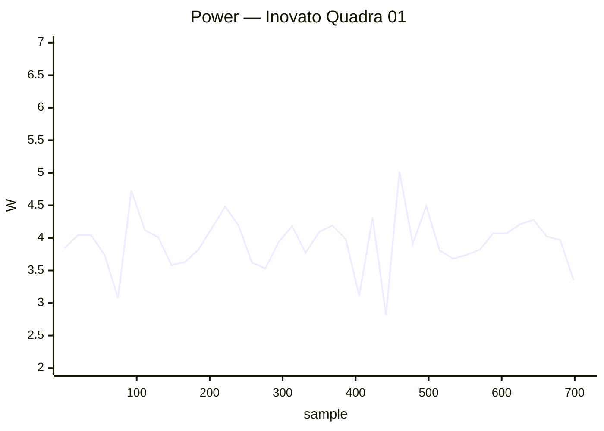
```mermaid
xychart-beta
    title "Power — Inovato Quadra 01"
    x-axis "sample" 1 --> 717
    y-axis "W" 2.0 --> 7.0
    line [3.84, 4.04, 4.04, 3.74, 3.08, 4.73, 4.12, 4.01, 3.58, 3.63, 3.82, 4.15, 4.48, 4.19, 3.62, 3.53, 3.94, 4.18, 3.77, 4.09, 4.19, 3.98, 3.11, 4.31, 2.81, 5.02, 3.91, 4.49, 3.81, 3.68, 3.74, 3.82, 4.07, 4.07, 4.21, 4.28, 4.02, 3.97, 3.35, 4.14]
```

### ✅ Khadas Edge2 01

`khadas-edge2` · **inplace** · image `26.11.0-trunk.66` · 14 ✅ · 0 ❌ · 2 ⏭️

| Module | Status | Time | Detail |
|:--|:--:|--:|:--|
| upgrade | ✅ | 33.1 s | nightly · 26.11.0-trunk.66 → 26.11.0-trunk.66 |
| reboot | ✅ | 32.4 s | warm · up 16 s |
| kernel-switch | ✅ | 23.5 s | branch=vendor · family=rk35xx · installed=26.11.0-trunk.66 · boot_image=/boot/vmlinuz-6.1.172-vendor-rk35xx · kernel_before=6.1.172-vendor-rk35xx |
| reboot | ✅ | 60.2 s | warm · 2/2 boots · up 16 s |
| hw-performance | ✅ | 15.4 s | AES 1279 · mem 14000 · disk W 106 / R 259 MB/s · 34.2 °C · 1800 MHz |
| dvfs | ✅ | 18.0 s | ondemand · 1800–1800 MHz (peak 2256) |
| network-iperf | ⏭️ | 6.7 s | no cabled interfaces |
| store-versions | ✅ | 4.1 s | 26.11.0-trunk.66 · 6.1.172-vendor-rk35xx |
| kernel-switch | ✅ | 70.8 s | branch=current · family=rockchip64 · installed=26.11.0-trunk.66 · boot_image=/boot/vmlinuz-6.18.54-current-rockchip64 · kernel_before=6.1.172-vendor-rk35xx |
| reboot | ✅ | 53.5 s | warm · 2/2 boots · up 14 s |
| hw-performance | ✅ | 16.5 s | AES 1272 · mem 10000 · disk W 105 / R 208 MB/s · 37.9 °C · 1800 MHz |
| dvfs | ✅ | 15.9 s | ondemand · 408–1800 MHz (peak 2400) |
| network-iperf | ⏭️ | 6.6 s | no cabled interfaces |
| store-versions | ✅ | 4.1 s | 26.11.0-trunk.66 · 6.18.54-current-rockchip64 |
| kernel-switch | ✅ | 57.6 s | branch=vendor · family=rk35xx · installed=26.11.0-trunk.66 · boot_image=/boot/vmlinuz-6.1.172-vendor-rk35xx · kernel_before=6.18.54-current-rockchip64 |
| reboot | ✅ | 33.9 s | warm · up 16 s |

### ✅ Khadas VIM1 01

`khadas-vim1` · **inplace** · image `26.11.0-trunk.68` · 16 ✅ · 0 ❌ · 0 ⏭️

| Module | Status | Time | Detail |
|:--|:--:|--:|:--|
| upgrade | ✅ | 65.2 s | nightly · 26.11.0-trunk.68 → 26.11.0-trunk.68 |
| reboot | ✅ | 81.5 s | power-cycle · up 40 s |
| kernel-switch | ✅ | 45.8 s | branch=current · family=meson64 · installed=26.11.0-trunk.68 · boot_image=/boot/vmlinuz-6.18.54-current-meson64 · kernel_before=6.18.54-current-meson64 |
| reboot | ✅ | 112.0 s | power-cycle · 2/2 boots · up 33 s |
| hw-performance | ✅ | 30.8 s | AES 659 · mem 3600 · disk W 17 / R 22 MB/s · 52 °C · 1512 MHz |
| dvfs | ✅ | 22.4 s | ondemand · 500–1512 MHz (peak 1512) |
| network-iperf | ✅ | 61.3 s | end0 ↑94/↓94 (10/100ME) · wlan0 ↑23/↓20 (Wi-Fi 5) Mbps |
| store-versions | ✅ | 4.9 s | 26.11.0-trunk.68 · 6.18.54-current-meson64 |
| kernel-switch | ✅ | 171.5 s | branch=edge · family=meson64 · installed=26.11.0-trunk.68 · boot_image=/boot/vmlinuz-7.2.8-edge-meson64 · kernel_before=6.18.54-current-meson64 |
| reboot | ✅ | 114.4 s | power-cycle · 2/2 boots · up 37 s |
| hw-performance | ✅ | 31.4 s | AES 659 · mem 3600 · disk W 17 / R 22 MB/s · 52 °C · 1512 MHz |
| dvfs | ✅ | 23.2 s | ondemand · 500–1512 MHz (peak 1512) |
| network-iperf | ✅ | 64.0 s | end0 ↑94/↓94 (10/100ME) · wlan0 ↑24/↓20 (Wi-Fi 5) Mbps |
| store-versions | ✅ | 5.1 s | 26.11.0-trunk.68 · 7.2.8-edge-meson64 |
| kernel-switch | ✅ | 160.3 s | branch=current · family=meson64 · installed=26.11.0-trunk.68 · boot_image=/boot/vmlinuz-6.18.54-current-meson64 · kernel_before=7.2.8-edge-meson64 |
| reboot | ✅ | 69.7 s | power-cycle · up 35 s |

**Power** — min 1.10 W · avg 2.23 W · peak 3.50 W · 846 samples

```mermaid
xychart-beta
    title "Power — Khadas VIM1 01"
    x-axis "sample" 1 --> 846
    y-axis "W" 1.0 --> 4.0
    line [2.14, 2.28, 2.17, 1.90, 1.92, 3.03, 2.47, 2.37, 2.46, 2.21, 2.31, 2.39, 2.24, 2.01, 1.93, 2.16, 2.55, 2.01, 2.29, 2.39, 2.30, 2.20, 2.10, 1.86, 2.58, 1.76, 2.38, 2.10, 2.43, 1.98, 1.86, 2.13, 2.32, 2.45, 2.31, 2.41, 2.24, 2.13, 1.93, 2.36]
```

### ✅ Khadas VIM2 01

`khadas-vim2` · **inplace** · image `26.11.0-trunk.66` · 16 ✅ · 0 ❌ · 0 ⏭️

| Module | Status | Time | Detail |
|:--|:--:|--:|:--|
| upgrade | ✅ | 80.5 s | nightly · 26.11.0-trunk.66 → 26.11.0-trunk.66 |
| reboot | ✅ | 41.5 s | warm · up 23 s |
| kernel-switch | ✅ | 53.8 s | branch=current · family=meson64 · installed=26.11.0-trunk.66 · boot_image=/boot/vmlinuz-6.18.54-current-meson64 · kernel_before=6.18.54-current-meson64 |
| reboot | ✅ | 76.8 s | warm · 2/2 boots · up 25 s |
| hw-performance | ✅ | 24.9 s | AES 659 · mem 3600 · disk W 41 / R 149 MB/s · 51 °C · 1512 MHz |
| dvfs | ✅ | 25.8 s | ondemand · 500–1512 MHz (peak 1512) |
| network-iperf | ✅ | 63.4 s | eth0 ↑940/↓941 (1GE) · wlan0 ↑97/↓96 (Wi-Fi 5) Mbps |
| store-versions | ✅ | 5.4 s | 26.11.0-trunk.66 · 6.18.54-current-meson64 |
| kernel-switch | ✅ | 167.5 s | branch=edge · family=meson64 · installed=26.11.0-trunk.66 · boot_image=/boot/vmlinuz-7.2.8-edge-meson64 · kernel_before=6.18.54-current-meson64 |
| reboot | ✅ | 78.9 s | warm · 2/2 boots · up 25 s |
| hw-performance | ✅ | 24.6 s | AES 659 · mem 3500 · disk W 35 / R 138 MB/s · 52 °C · 1512 MHz |
| dvfs | ✅ | 26.3 s | ondemand · 500–1512 MHz (peak 1512) |
| network-iperf | ✅ | 87.9 s | eth0 ↑936/↓941 (1GE) · wlan0 ↑94/↓80 (Wi-Fi 5) Mbps |
| store-versions | ✅ | 5.6 s | 26.11.0-trunk.66 · 7.2.8-edge-meson64 |
| kernel-switch | ✅ | 165.6 s | branch=current · family=meson64 · installed=26.11.0-trunk.66 · boot_image=/boot/vmlinuz-6.18.54-current-meson64 · kernel_before=7.2.8-edge-meson64 |
| reboot | ✅ | 41.9 s | warm · up 24 s |

### ✅ Mekotronics R58HD 01

`mekotronics-r58hd` · **inplace** · image `26.11.0-trunk.66` · 4 ✅ · 1 ❌ · 1 ⏭️

| Module | Status | Time | Detail |
|:--|:--:|--:|:--|
| upgrade | ⏭️ | 185.3 s | — |
| reboot | ✅ | 322.9 s | power-cycle · up 15 s |
| hw-performance | ✅ | 13.6 s | AES 1304 · mem 14000 · disk W 256 / R 288 MB/s · 45.3 °C · 1800 MHz |
| dvfs | ✅ | 16.4 s | ondemand · 1800–1800 MHz (peak 2304) |
| network-iperf | ❌ | 716.9 s | end0 ↑714/↓940 (1GE) · enP3p49s0 ↑0/↓941 (1GE) · wlan0 ↑120/↓115 (Wi-Fi 6) Mbps |
| store-versions | ✅ | 57.3 s | 26.11.0-trunk.66 |

**Power** — min 3.90 W · avg 5.11 W · peak 12.20 W · 1074 samples

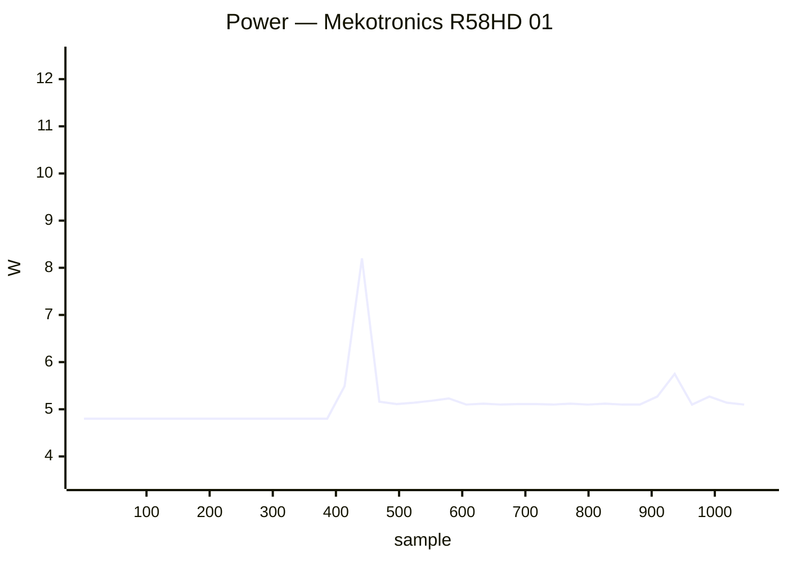
```mermaid
xychart-beta
    title "Power — Mekotronics R58HD 01"
    x-axis "sample" 1 --> 1074
    y-axis "W" 3.5 --> 12.5
    line [4.80, 4.80, 4.80, 4.80, 4.80, 4.80, 4.80, 4.80, 4.80, 4.80, 4.80, 4.80, 4.80, 4.80, 4.80, 5.49, 8.20, 5.16, 5.11, 5.14, 5.18, 5.23, 5.10, 5.12, 5.10, 5.11, 5.11, 5.10, 5.12, 5.10, 5.12, 5.10, 5.10, 5.27, 5.75, 5.10, 5.27, 5.14, 5.10, 5.12]
```

### ✅ Mekotronics R58S2 01

`mekotronics-r58s2` · **inplace** · image `26.11.0-trunk.66` · 5 ✅ · 0 ❌ · 1 ⏭️

| Module | Status | Time | Detail |
|:--|:--:|--:|:--|
| upgrade | ⏭️ | 8.5 s | — |
| reboot | ✅ | 50.9 s | power-cycle · up 15 s |
| hw-performance | ✅ | 13.9 s | AES 1284 · mem 9000 · disk W 235 / R 272 MB/s · 38.8 °C · 1800 MHz |
| dvfs | ✅ | 16.9 s | ondemand · 1800–1800 MHz (peak 2352) |
| network-iperf | ✅ | 55.6 s | end1 ↑941/↓941 (1GE) · wlan0 ↑46/↓121 (Wi-Fi 5) Mbps |
| store-versions | ✅ | 4.0 s | 26.11.0-trunk.66 · 6.1.172-vendor-rk35xx |

**Power** — min 2.20 W · avg 3.72 W · peak 10.40 W · 118 samples

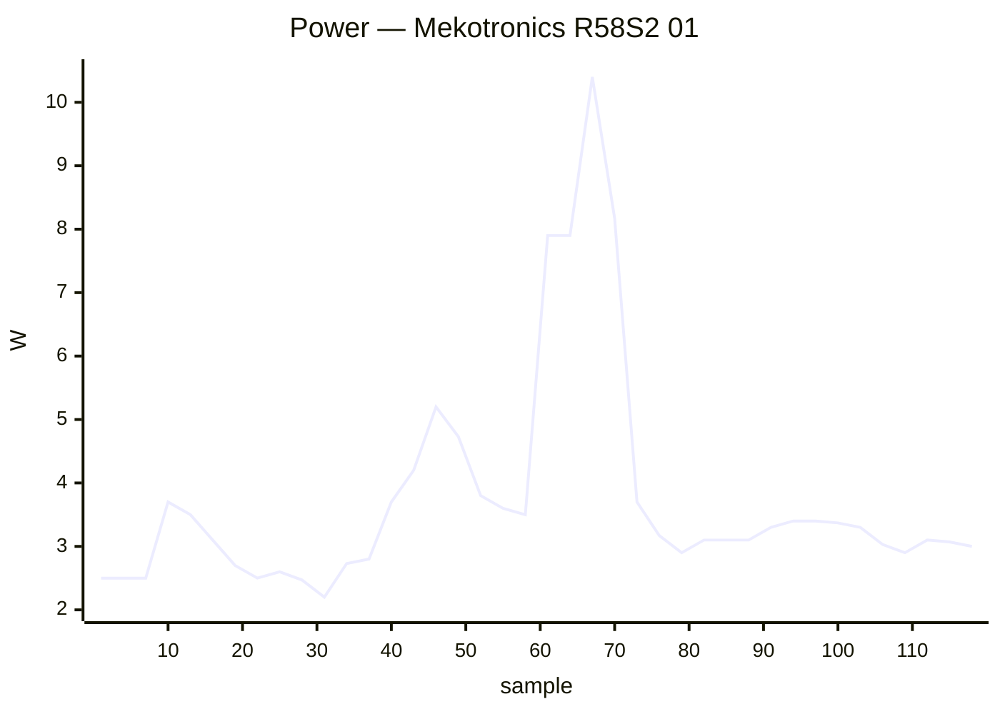
```mermaid
xychart-beta
    title "Power — Mekotronics R58S2 01"
    x-axis "sample" 1 --> 118
    y-axis "W" 2.0 --> 10.5
    line [2.50, 2.50, 2.50, 3.70, 3.50, 3.10, 2.70, 2.50, 2.60, 2.47, 2.20, 2.73, 2.80, 3.70, 4.20, 5.20, 4.73, 3.80, 3.60, 3.50, 7.90, 7.90, 10.40, 8.17, 3.70, 3.17, 2.90, 3.10, 3.10, 3.10, 3.30, 3.40, 3.40, 3.37, 3.30, 3.03, 2.90, 3.10, 3.07, 3.00]
```

### ✅ NanoPi Fire3 01

`nanopifire3` · **inplace** · image `26.11.0-trunk.68` · 7 ✅ · 0 ❌ · 1 ⏭️

| Module | Status | Time | Detail |
|:--|:--:|--:|:--|
| upgrade | ✅ | 104.0 s | nightly · 26.11.0-trunk.68 → 26.11.0-trunk.68 |
| reboot | ✅ | 72.9 s | power-cycle · up 31 s |
| kernel-switch | ✅ | 70.3 s | branch=edge · family=s5p6818 · installed=26.11.0-trunk.68 · boot_image=/boot/vmlinuz-7.2.8-edge-s5p6818 · kernel_before=7.2.8-edge-s5p6818 |
| reboot | ✅ | 115.5 s | power-cycle · 2/2 boots · up 33 s |
| hw-performance | ✅ | 43.6 s | AES 374 · mem 2000 · disk W 20 / R 22 MB/s · 63 °C · None MHz |
| dvfs | ➖ | 2.9 s | no cpufreq |
| network-iperf | ✅ | 35.0 s | eth0 ↑94/↓94 (1GE) Mbps |
| store-versions | ✅ | 6.2 s | 26.11.0-trunk.68 · 7.2.8-edge-s5p6818 |

**Power** — min 1.90 W · avg 2.99 W · peak 4.00 W · 359 samples

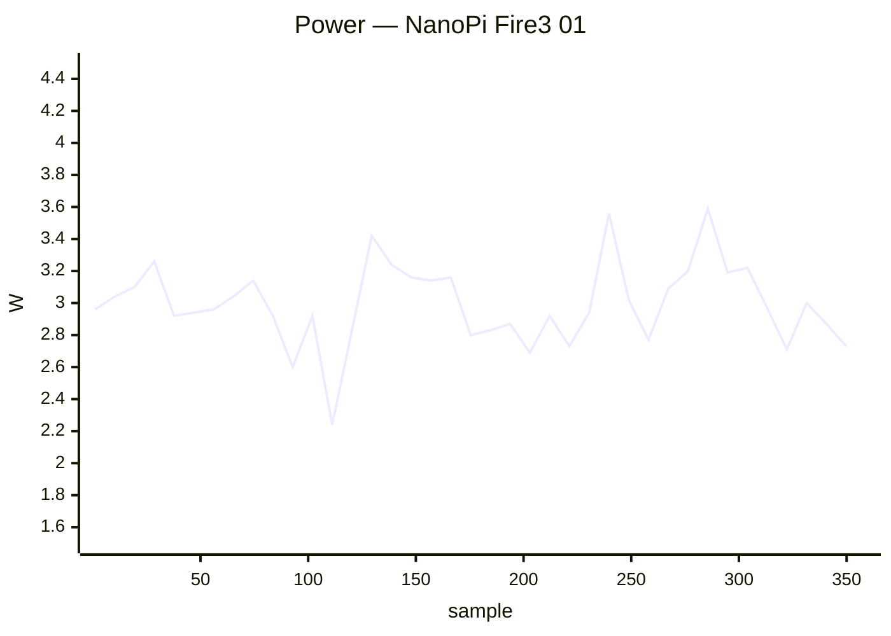
```mermaid
xychart-beta
    title "Power — NanoPi Fire3 01"
    x-axis "sample" 1 --> 359
    y-axis "W" 1.5 --> 4.5
    line [2.96, 3.04, 3.10, 3.26, 2.92, 2.94, 2.96, 3.04, 3.14, 2.92, 2.60, 2.92, 2.24, 2.83, 3.42, 3.24, 3.16, 3.14, 3.16, 2.80, 2.83, 2.87, 2.69, 2.92, 2.73, 2.94, 3.56, 3.02, 2.77, 3.09, 3.20, 3.59, 3.19, 3.22, 2.97, 2.71, 3.00, 2.87, 2.73, 2.84]
```

### ✅ NanoPi K2 01

`nanopik2-s905` · **inplace** · image `26.11.0-trunk.66` · 16 ✅ · 0 ❌ · 0 ⏭️

| Module | Status | Time | Detail |
|:--|:--:|--:|:--|
| upgrade | ✅ | 53.6 s | nightly · 26.11.0-trunk.66 → 26.11.0-trunk.66 |
| reboot | ✅ | 43.7 s | warm · up 27 s |
| kernel-switch | ✅ | 44.2 s | branch=current · family=meson64 · installed=26.11.0-trunk.66 · boot_image=/boot/vmlinuz-6.18.54-current-meson64 · kernel_before=6.18.54-current-meson64 |
| reboot | ✅ | 71.9 s | warm · 2/2 boots · up 24 s |
| hw-performance | ✅ | 34.2 s | AES 51 · mem 3800 · disk W 1 / R 40 MB/s · 56 °C · 2016 MHz |
| dvfs | ✅ | 21.0 s | ondemand · 500–1536 MHz (peak 1536) |
| network-iperf | ✅ | 58.6 s | end0 ↑935/↓941 (1GE) · wlan0 ↑14/↓33 (Wi-Fi 4) Mbps |
| store-versions | ✅ | 4.7 s | 26.11.0-trunk.66 · 6.18.54-current-meson64 |
| kernel-switch | ✅ | 171.1 s | branch=edge · family=meson64 · installed=26.11.0-trunk.66 · boot_image=/boot/vmlinuz-7.2.8-edge-meson64 · kernel_before=6.18.54-current-meson64 |
| reboot | ✅ | 76.6 s | warm · 2/2 boots · up 24 s |
| hw-performance | ✅ | 35.2 s | AES 51 · mem 3800 · disk W 6 / R 40 MB/s · 57 °C · 2016 MHz |
| dvfs | ✅ | 21.8 s | ondemand · 500–1536 MHz (peak 1536) |
| network-iperf | ✅ | 65.5 s | end0 ↑934/↓941 (1GE) · wlan0 ↑14/↓33 (Wi-Fi 4) Mbps |
| store-versions | ✅ | 4.8 s | 26.11.0-trunk.66 · 7.2.8-edge-meson64 |
| kernel-switch | ✅ | 174.6 s | branch=current · family=meson64 · installed=26.11.0-trunk.66 · boot_image=/boot/vmlinuz-6.18.54-current-meson64 · kernel_before=7.2.8-edge-meson64 |
| reboot | ✅ | 39.1 s | warm · up 23 s |

### ✅ NanoPi M4V2 01

`nanopim4v2` · **inplace** · image `26.11.0-trunk.66` · 16 ✅ · 0 ❌ · 0 ⏭️

| Module | Status | Time | Detail |
|:--|:--:|--:|:--|
| upgrade | ✅ | 43.4 s | nightly · 26.11.0-trunk.66 → 26.11.0-trunk.66 |
| reboot | ✅ | 74.2 s | power-cycle · up 40 s |
| kernel-switch | ✅ | 34.0 s | branch=current · family=rockchip64 · installed=26.11.0-trunk.66 · boot_image=/boot/vmlinuz-6.18.54-current-rockchip64 · kernel_before=6.18.54-current-rockchip64 |
| reboot | ✅ | 110.2 s | power-cycle · 2/2 boots · up 32 s |
| hw-performance | ✅ | 21.5 s | AES 1019 · mem 6500 · disk W 52 / R 61 MB/s · 42.8 °C · 1416 MHz |
| dvfs | ✅ | 21.2 s | ondemand · 408–1416 MHz (peak 1800) |
| network-iperf | ✅ | 102.3 s | end0 ↑941/↓941 (1GE) · wlan0 ↑164/↓84 (Wi-Fi 5) · wlx803f5d16af63 ↑11/↓17 (Wi-Fi 5) Mbps |
| store-versions | ✅ | 4.9 s | 26.11.0-trunk.66 · 6.18.54-current-rockchip64 |
| kernel-switch | ✅ | 100.6 s | branch=edge · family=rockchip64 · installed=26.11.0-trunk.66 · boot_image=/boot/vmlinuz-7.2.8-edge-rockchip64 · kernel_before=6.18.54-current-rockchip64 |
| reboot | ✅ | 104.4 s | power-cycle · 2/2 boots · up 30 s |
| hw-performance | ✅ | 23.1 s | AES 1016 · mem 6600 · disk W 53 / R 33 MB/s · 43.9 °C · 1416 MHz |
| dvfs | ✅ | 20.2 s | ondemand · 408–1416 MHz (peak 1800) |
| network-iperf | ✅ | 100.0 s | end0 ↑941/↓941 (1GE) · wlan0 ↑152/↓197 (Wi-Fi 5) · wlx803f5d16af63 ↑12/↓20 (Wi-Fi 5) Mbps |
| store-versions | ✅ | 5.1 s | 26.11.0-trunk.66 · 7.2.8-edge-rockchip64 |
| kernel-switch | ✅ | 96.2 s | branch=current · family=rockchip64 · installed=26.11.0-trunk.66 · boot_image=/boot/vmlinuz-6.18.54-current-rockchip64 · kernel_before=7.2.8-edge-rockchip64 |
| reboot | ✅ | 61.4 s | power-cycle · up 28 s |

**Power** — min 2.50 W · avg 6.81 W · peak 12.10 W · 729 samples

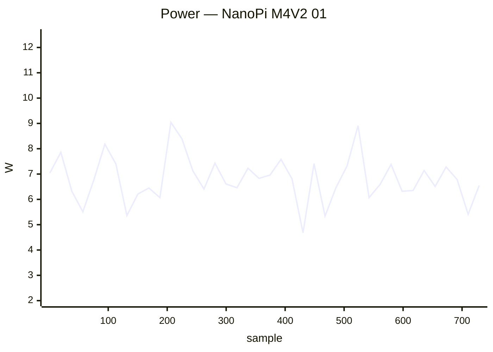
```mermaid
xychart-beta
    title "Power — NanoPi M4V2 01"
    x-axis "sample" 1 --> 729
    y-axis "W" 2.0 --> 12.5
    line [7.04, 7.86, 6.32, 5.51, 6.77, 8.18, 7.40, 5.36, 6.21, 6.45, 6.07, 9.04, 8.39, 7.12, 6.41, 7.43, 6.61, 6.46, 7.23, 6.83, 6.96, 7.58, 6.81, 4.68, 7.41, 5.34, 6.47, 7.32, 8.91, 6.07, 6.59, 7.38, 6.32, 6.35, 7.14, 6.51, 7.28, 6.78, 5.41, 6.55]
```

### ✅ NanoPi M5 01

`nanopi-m5` · **inplace** · image `26.11.0-trunk.66` · 21 ✅ · 0 ❌ · 1 ⏭️

| Module | Status | Time | Detail |
|:--|:--:|--:|:--|
| upgrade | ⏭️ | 9.9 s | — |
| reboot | ✅ | 56.2 s | power-cycle · up 25 s |
| kernel-switch | ✅ | 104.0 s | branch=vendor · family=rk35xx · installed=26.11.0-trunk.66 · boot_image=/boot/vmlinuz-6.1.172-vendor-rk35xx · kernel_before=7.2.8-edge-rockchip64 |
| reboot | ✅ | 84.9 s | power-cycle · 2/2 boots · up 21 s |
| hw-performance | ✅ | 17.8 s | AES 1271 · mem 7900 · disk W 66 / R 77 MB/s · 40.7 °C · 2016 MHz |
| dvfs | ✅ | 18.9 s | ondemand · 2016–2016 MHz (peak 2208) |
| network-iperf | ✅ | 132.2 s | end0 ↑941/↓941 (1GE) · end1 ↑941/↓941 (1GE) · wlan0 ↑44/↓79 (Wi-Fi 5) · wlx44334c47dec3 ↑31/↓8 (Wi-Fi 4) Mbps |
| store-versions | ✅ | 4.2 s | 26.11.0-trunk.66 · 6.1.172-vendor-rk35xx |
| kernel-switch | ✅ | 115.1 s | branch=current · family=rockchip64 · installed=26.11.0-trunk.66 · boot_image=/boot/vmlinuz-6.18.54-current-rockchip64 · kernel_before=6.1.172-vendor-rk35xx |
| reboot | ✅ | 85.7 s | power-cycle · 2/2 boots · up 26 s |
| hw-performance | ✅ | 26.2 s | AES 1335 · mem 9000 · disk W 20 / R 21 MB/s · 40.7 °C · 2016 MHz |
| dvfs | ✅ | 16.6 s | ondemand · 408–2016 MHz (peak 2208) |
| network-iperf | ✅ | 116.2 s | end0 ↑941/↓941 (1GE) · end1 ↑941/↓941 (1GE) · wlan0 ↑64/↓136 (Wi-Fi 5) · wlx44334c47dec3 ↑36/↓16 (Wi-Fi 4) Mbps |
| store-versions | ✅ | 4.0 s | 26.11.0-trunk.66 · 6.18.54-current-rockchip64 |
| kernel-switch | ✅ | 102.9 s | branch=edge · family=rockchip64 · installed=26.11.0-trunk.66 · boot_image=/boot/vmlinuz-7.2.8-edge-rockchip64 · kernel_before=6.18.54-current-rockchip64 |
| reboot | ✅ | 86.4 s | power-cycle · 2/2 boots · up 24 s |
| hw-performance | ✅ | 26.9 s | AES 1335 · mem 9000 · disk W 20 / R 21 MB/s · 41.6 °C · 2016 MHz |
| dvfs | ✅ | 17.3 s | ondemand · 408–2016 MHz (peak 2208) |
| network-iperf | ✅ | 121.4 s | end0 ↑941/↓941 (1GE) · end1 ↑940/↓941 (1GE) · wlan0 ↑67/↓76 (Wi-Fi 5) · wlx44334c47dec3 ↑32/↓17 (Wi-Fi 4) Mbps |
| store-versions | ✅ | 4.1 s | 26.11.0-trunk.66 · 7.2.8-edge-rockchip64 |
| kernel-switch | ✅ | 101.4 s | branch=vendor · family=rk35xx · installed=26.11.0-trunk.66 · boot_image=/boot/vmlinuz-6.1.172-vendor-rk35xx · kernel_before=7.2.8-edge-rockchip64 |
| reboot | ✅ | 49.1 s | power-cycle · up 22 s |

**Power** — min 0.60 W · avg 5.04 W · peak 8.90 W · 1029 samples

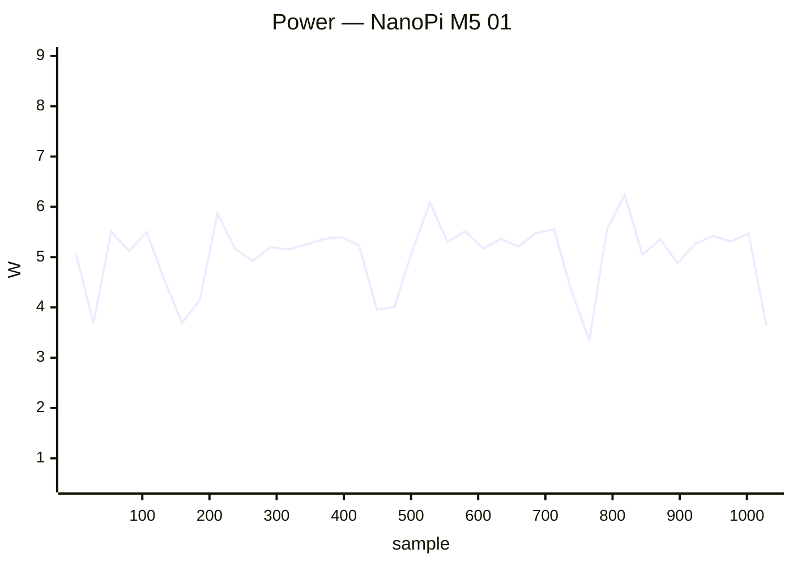
```mermaid
xychart-beta
    title "Power — NanoPi M5 01"
    x-axis "sample" 1 --> 1029
    y-axis "W" 0.5 --> 9.0
    line [5.08, 3.69, 5.51, 5.12, 5.50, 4.55, 3.69, 4.14, 5.87, 5.16, 4.92, 5.20, 5.15, 5.25, 5.36, 5.40, 5.23, 3.96, 4.01, 5.13, 6.08, 5.30, 5.52, 5.17, 5.36, 5.21, 5.48, 5.55, 4.32, 3.34, 5.55, 6.24, 5.05, 5.35, 4.88, 5.27, 5.42, 5.31, 5.47, 3.64]
```

### ✅ NanoPi M6 01

`nanopi-m6` · **inplace** · image `26.11.0-trunk.66` · 22 ✅ · 0 ❌ · 0 ⏭️

| Module | Status | Time | Detail |
|:--|:--:|--:|:--|
| upgrade | ✅ | 28.4 s | nightly · 26.11.0-trunk.66 → 26.11.0-trunk.66 |
| reboot | ✅ | 50.1 s | power-cycle · up 22 s |
| kernel-switch | ✅ | 21.0 s | branch=vendor · family=rk35xx · installed=26.11.0-trunk.66 · boot_image=/boot/vmlinuz-6.1.172-vendor-rk35xx · kernel_before=6.1.172-vendor-rk35xx |
| reboot | ✅ | 79.1 s | power-cycle · 2/2 boots · up 22 s |
| hw-performance | ✅ | 18.0 s | AES 1272 · mem 13500 · disk W 51 / R 75 MB/s · 43.5 °C · 1800 MHz |
| dvfs | ✅ | 16.6 s | ondemand · 1800–1800 MHz (peak 2256) |
| network-iperf | ✅ | 60.3 s | lan ↑941/↓941 (1GE) · wlP3p49s0 ↑28/↓269 (Wi-Fi 5) Mbps |
| store-versions | ✅ | 4.9 s | 26.11.0-trunk.66 · 6.1.172-vendor-rk35xx |
| kernel-switch | ✅ | 103.2 s | branch=current · family=rockchip64 · installed=26.11.0-trunk.66 · boot_image=/boot/vmlinuz-6.18.54-current-rockchip64 · kernel_before=6.1.172-vendor-rk35xx |
| reboot | ✅ | 84.9 s | power-cycle · 2/2 boots · up 22 s |
| hw-performance | ✅ | 18.5 s | AES 1217 · mem 9900 · disk W 47 / R 58 MB/s · 46.2 °C · 1800 MHz |
| dvfs | ✅ | 16.1 s | ondemand · 408–1800 MHz (peak 2400) |
| network-iperf | ✅ | 69.9 s | lan ↑941/↓942 (1GE) · wlP3p49s0 ↑148/↓276 (Wi-Fi 5) Mbps |
| store-versions | ✅ | 3.8 s | 26.11.0-trunk.66 · 6.18.54-current-rockchip64 |
| kernel-switch | ✅ | 76.0 s | branch=edge · family=rockchip64 · installed=26.11.0-trunk.66 · boot_image=/boot/vmlinuz-7.2.8-edge-rockchip64 · kernel_before=6.18.54-current-rockchip64 |
| reboot | ✅ | 78.2 s | power-cycle · 2/2 boots · up 23 s |
| hw-performance | ✅ | 19.3 s | AES 1215 · mem 7800 · disk W 46 / R 56 MB/s · 48.1 °C · 1800 MHz |
| dvfs | ✅ | 14.5 s | ondemand · 408–1800 MHz (peak 2400) |
| network-iperf | ✅ | 55.1 s | lan ↑941/↓941 (1GE) · wlP3p49s0 ↑163/↓168 (Wi-Fi 5) Mbps |
| store-versions | ✅ | 4.1 s | 26.11.0-trunk.66 · 7.2.8-edge-rockchip64 |
| kernel-switch | ✅ | 72.8 s | branch=vendor · family=rk35xx · installed=26.11.0-trunk.66 · boot_image=/boot/vmlinuz-6.1.172-vendor-rk35xx · kernel_before=7.2.8-edge-rockchip64 |
| reboot | ✅ | 57.7 s | power-cycle · up 21 s |

**Power** — min 1.00 W · avg 4.06 W · peak 10.50 W · 740 samples

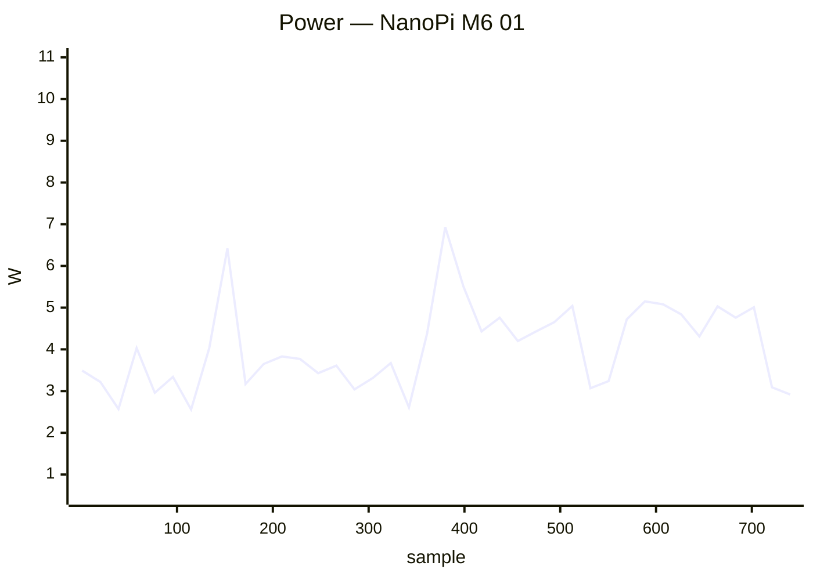
```mermaid
xychart-beta
    title "Power — NanoPi M6 01"
    x-axis "sample" 1 --> 740
    y-axis "W" 0.5 --> 11.0
    line [3.49, 3.22, 2.57, 4.03, 2.96, 3.34, 2.56, 4.03, 6.42, 3.17, 3.65, 3.83, 3.77, 3.43, 3.61, 3.04, 3.31, 3.67, 2.61, 4.38, 6.93, 5.51, 4.43, 4.76, 4.20, 4.43, 4.65, 5.04, 3.07, 3.24, 4.72, 5.15, 5.08, 4.84, 4.31, 5.03, 4.76, 5.01, 3.09, 2.92]
```

### ✅ NanoPi Neo 2 Black 01

`nanopineo2black` · **inplace** · image `26.11.0-trunk.66` · 16 ✅ · 0 ❌ · 0 ⏭️

| Module | Status | Time | Detail |
|:--|:--:|--:|:--|
| upgrade | ✅ | 136.0 s | nightly · 26.11.0-trunk.66 → 26.11.0-trunk.66 |
| reboot | ✅ | 57.9 s | power-cycle · up 20 s |
| kernel-switch | ✅ | 42.4 s | branch=current · family=sunxi64 · installed=26.11.0-trunk.66 · boot_image=/boot/vmlinuz-6.18.54-current-sunxi64 · kernel_before=6.18.54-current-sunxi64 |
| reboot | ✅ | 304.6 s | power-cycle · 1/2 boots · up 17 s |
| hw-performance | ✅ | 24.1 s | AES 637 · mem 3500 · disk W 43 / R 44 MB/s · 57.2 °C · 1368 MHz |
| dvfs | ✅ | 23.1 s | ondemand · 480–1368 MHz (peak 1368) |
| network-iperf | ✅ | 34.3 s | end0 ↑893/↓854 (1GE) Mbps |
| store-versions | ✅ | 5.0 s | 26.11.0-trunk.66 · 6.18.54-current-sunxi64 |
| kernel-switch | ✅ | 110.7 s | branch=edge · family=sunxi64 · installed=26.11.0-trunk.66 · boot_image=/boot/vmlinuz-7.2.8-edge-sunxi64 · kernel_before=6.18.54-current-sunxi64 |
| reboot | ✅ | 317.0 s | power-cycle · 1/2 boots · up 17 s |
| hw-performance | ✅ | 24.2 s | AES 637 · mem 3500 · disk W 43 / R 43 MB/s · 62.5 °C · 1368 MHz |
| dvfs | ✅ | 23.4 s | ondemand · 480–1368 MHz (peak 1368) |
| network-iperf | ✅ | 34.5 s | end0 ↑877/↓908 (1GE) Mbps |
| store-versions | ✅ | 5.1 s | 26.11.0-trunk.66 · 7.2.8-edge-sunxi64 |
| kernel-switch | ✅ | 108.6 s | branch=current · family=sunxi64 · installed=26.11.0-trunk.66 · boot_image=/boot/vmlinuz-6.18.54-current-sunxi64 · kernel_before=7.2.8-edge-sunxi64 |
| reboot | ✅ | 55.8 s | power-cycle · up 18 s |

**Power** — min 0.90 W · avg 2.53 W · peak 5.50 W · 1025 samples

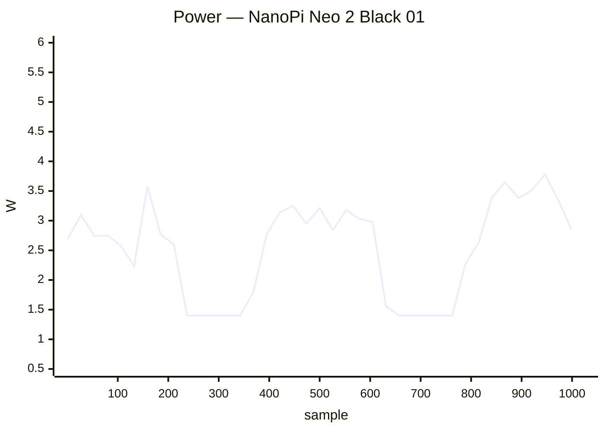
```mermaid
xychart-beta
    title "Power — NanoPi Neo 2 Black 01"
    x-axis "sample" 1 --> 1025
    y-axis "W" 0.5 --> 6.0
    line [2.69, 3.10, 2.74, 2.75, 2.58, 2.23, 3.58, 2.77, 2.60, 1.40, 1.40, 1.40, 1.40, 1.40, 1.79, 2.77, 3.14, 3.25, 2.95, 3.21, 2.84, 3.18, 3.03, 2.98, 1.56, 1.40, 1.40, 1.40, 1.40, 1.40, 2.27, 2.63, 3.39, 3.65, 3.38, 3.51, 3.78, 3.35, 2.85, 2.57]
```

### ✅ NanoPi Neo 3 01

`nanopineo3` · **inplace** · image `26.11.0-trunk.66` · 16 ✅ · 0 ❌ · 0 ⏭️

| Module | Status | Time | Detail |
|:--|:--:|--:|:--|
| upgrade | ✅ | 84.7 s | nightly · 26.11.0-trunk.68 → 26.11.0-trunk.68 |
| reboot | ✅ | 66.4 s | power-cycle · up 27 s |
| kernel-switch | ✅ | 57.7 s | branch=current · family=rockchip64 · installed=26.11.0-trunk.68 · boot_image=/boot/vmlinuz-6.18.54-current-rockchip64 · kernel_before=6.18.54-current-rockchip64 |
| reboot | ✅ | 103.0 s | power-cycle · 2/2 boots · up 29 s |
| hw-performance | ✅ | 28.5 s | AES 596 · mem 2400 · disk W 52 / R 63 MB/s · 78.5 °C · 1296 MHz |
| dvfs | ✅ | 30.4 s | ondemand · 408–1296 MHz (peak 1296) |
| network-iperf | ✅ | 68.5 s | end0 ↑905/↓940 (1GE) · wlx7cdd905518f9 ↑36/↓16 (Wi-Fi 4) Mbps |
| store-versions | ✅ | 7.3 s | 26.11.0-trunk.68 · 6.18.54-current-rockchip64 |
| kernel-switch | ✅ | 185.0 s | branch=edge · family=rockchip64 · installed=26.11.0-trunk.68 · boot_image=/boot/vmlinuz-7.2.8-edge-rockchip64 · kernel_before=6.18.54-current-rockchip64 |
| reboot | ✅ | 99.3 s | power-cycle · 2/2 boots · up 26 s |
| hw-performance | ✅ | 28.7 s | AES 599 · mem 2400 · disk W 1 / R 63 MB/s · 81.2 °C · 1296 MHz |
| dvfs | ✅ | 31.0 s | ondemand · 408–1296 MHz (peak 1296) |
| network-iperf | ✅ | 68.7 s | end0 ↑884/↓940 (1GE) · wlx7cdd905518f9 ↑34/↓17 (Wi-Fi 4) Mbps |
| store-versions | ✅ | 7.3 s | 26.11.0-trunk.68 · 7.2.8-edge-rockchip64 |
| kernel-switch | ✅ | 173.4 s | branch=current · family=rockchip64 · installed=26.11.0-trunk.68 · boot_image=/boot/vmlinuz-6.18.54-current-rockchip64 · kernel_before=7.2.8-edge-rockchip64 |
| reboot | ✅ | 75.2 s | power-cycle · up 30 s |

**Power** — min 3.30 W · avg 4.63 W · peak 5.90 W · 896 samples

```mermaid
xychart-beta
    title "Power — NanoPi Neo 3 01"
    x-axis "sample" 1 --> 896
    y-axis "W" 3.0 --> 6.0
    line [4.70, 4.59, 4.78, 4.25, 4.21, 5.03, 4.60, 4.42, 4.30, 4.53, 4.92, 4.70, 4.53, 4.66, 4.67, 4.34, 4.59, 4.50, 5.03, 4.70, 4.70, 4.72, 4.35, 4.55, 4.72, 4.60, 4.92, 4.73, 4.69, 4.93, 4.76, 4.67, 5.00, 4.84, 4.74, 4.63, 4.55, 4.48, 4.15, 4.44]
```

### ✅ NanoPi R6S 01

`nanopi-r6s` · **inplace** · image `26.11.0-trunk.66` · 22 ✅ · 0 ❌ · 0 ⏭️

| Module | Status | Time | Detail |
|:--|:--:|--:|:--|
| upgrade | ✅ | 28.0 s | nightly · 26.11.0-trunk.66 → 26.11.0-trunk.66 |
| reboot | ✅ | 41.9 s | power-cycle · up 16 s |
| kernel-switch | ✅ | 17.9 s | branch=vendor · family=rk35xx · installed=26.11.0-trunk.66 · boot_image=/boot/vmlinuz-6.1.172-vendor-rk35xx · kernel_before=6.1.172-vendor-rk35xx |
| reboot | ✅ | 57.6 s | power-cycle · 2/2 boots · up 11 s |
| hw-performance | ✅ | 14.2 s | AES 1275 · mem 14000 · disk W 208 / R 269 MB/s · 34.2 °C · 1800 MHz |
| dvfs | ✅ | 17.4 s | ondemand · 1800–1800 MHz (peak 2256) |
| network-iperf | ✅ | 31.0 s | lan2 ↑941/↓941 (1GE) Mbps |
| store-versions | ✅ | 3.8 s | 26.11.0-trunk.66 · 6.1.172-vendor-rk35xx |
| kernel-switch | ✅ | 51.4 s | branch=current · family=rockchip64 · installed=26.11.0-trunk.66 · boot_image=/boot/vmlinuz-6.18.54-current-rockchip64 · kernel_before=6.1.172-vendor-rk35xx |
| reboot | ✅ | 57.8 s | power-cycle · 2/2 boots · up 11 s |
| hw-performance | ✅ | 15.7 s | AES 1280 · mem 10200 · disk W 140 / R 160 MB/s · 35.2 °C · 1800 MHz |
| dvfs | ✅ | 15.1 s | ondemand · 408–1800 MHz (peak 2400) |
| network-iperf | ✅ | 28.3 s | lan2 ↑941/↓941 (1GE) Mbps |
| store-versions | ✅ | 4.8 s | 26.11.0-trunk.66 · 6.18.54-current-rockchip64 |
| kernel-switch | ✅ | 46.1 s | branch=edge · family=rockchip64 · installed=26.11.0-trunk.66 · boot_image=/boot/vmlinuz-7.2.8-edge-rockchip64 · kernel_before=6.18.54-current-rockchip64 |
| reboot | ✅ | 64.8 s | power-cycle · 2/2 boots · up 17 s |
| hw-performance | ✅ | 15.5 s | AES 1279 · mem 8200 · disk W 142 / R 150 MB/s · 36.1 °C · 1800 MHz |
| dvfs | ✅ | 14.5 s | ondemand · 408–1800 MHz (peak 2400) |
| network-iperf | ✅ | 30.3 s | lan2 ↑941/↓941 (1GE) Mbps |
| store-versions | ✅ | 3.9 s | 26.11.0-trunk.66 · 7.2.8-edge-rockchip64 |
| kernel-switch | ✅ | 42.1 s | branch=vendor · family=rk35xx · installed=26.11.0-trunk.66 · boot_image=/boot/vmlinuz-6.1.172-vendor-rk35xx · kernel_before=7.2.8-edge-rockchip64 |
| reboot | ✅ | 44.2 s | power-cycle · up 16 s |

**Power** — min 0.90 W · avg 4.59 W · peak 9.30 W · 497 samples

```mermaid
xychart-beta
    title "Power — NanoPi R6S 01"
    x-axis "sample" 1 --> 497
    y-axis "W" 0.5 --> 9.5
    line [3.97, 4.77, 3.88, 3.60, 4.75, 4.42, 4.72, 3.56, 4.44, 4.50, 6.33, 4.06, 4.00, 4.27, 4.22, 4.83, 4.68, 4.30, 3.56, 4.68, 4.67, 6.19, 4.34, 4.79, 4.62, 5.38, 5.59, 4.17, 4.65, 3.62, 4.78, 4.90, 6.02, 4.58, 4.69, 4.43, 5.44, 5.01, 3.90, 4.28]
```

### ✅ NanoPi R76S 01

`nanopi-r76s` · **inplace** · image `26.11.0-trunk.65` · 15 ✅ · 0 ❌ · 1 ⏭️

| Module | Status | Time | Detail |
|:--|:--:|--:|:--|
| upgrade | ⏭️ | 12.3 s | — |
| reboot | ✅ | 62.8 s | power-cycle · up 31 s |
| kernel-switch | ✅ | 29.7 s | branch=vendor · family=rk35xx · installed=26.11.0-trunk.66 · boot_image=/boot/vmlinuz-6.1.172-vendor-rk35xx · kernel_before=6.1.172-vendor-rk35xx |
| reboot | ✅ | 106.8 s | power-cycle · 2/2 boots · up 31 s |
| hw-performance | ✅ | 21.8 s | AES 1273 · mem 7500 · disk W 69 / R 77 MB/s · 39.8 °C · 2016 MHz |
| dvfs | ✅ | 20.8 s | ondemand · 2016–2016 MHz (peak 2208) |
| network-iperf | ✅ | 116.0 s | end0 ↑941/↓941 (1GE) · end1 ↑941/↓941 (1GE) · wlan0 ↑38/↓77 (Wi-Fi 5) · wlxe0e1a933de37 ↑123/↓219 (Wi-Fi 5) Mbps |
| store-versions | ✅ | 4.7 s | 26.11.0-trunk.66 · 6.1.172-vendor-rk35xx |
| kernel-switch | ✅ | 160.5 s | branch=edge · family=rockchip64 · installed=26.11.0-trunk.66 · boot_image=/boot/vmlinuz-7.2.8-edge-rockchip64 · kernel_before=6.1.172-vendor-rk35xx |
| reboot | ✅ | 111.3 s | power-cycle · 2/2 boots · up 29 s |
| hw-performance | ✅ | 20.7 s | AES 1314 · mem 8800 · disk W 66 / R 71 MB/s · 39.8 °C · 2016 MHz |
| dvfs | ✅ | 18.9 s | ondemand · 408–2016 MHz (peak 2208) |
| network-iperf | ✅ | 111.1 s | end0 ↑941/↓941 (1GE) · end1 ↑941/↓941 (1GE) · wlan0 ↑87/↓186 (Wi-Fi 5) · wlxe0e1a933de37 ↑59/↓181 (Wi-Fi 5) Mbps |
| store-versions | ✅ | 4.5 s | 26.11.0-trunk.66 · 7.2.8-edge-rockchip64 |
| kernel-switch | ✅ | 89.7 s | branch=vendor · family=rk35xx · installed=26.11.0-trunk.66 · boot_image=/boot/vmlinuz-6.1.172-vendor-rk35xx · kernel_before=7.2.8-edge-rockchip64 |
| reboot | ✅ | 64.8 s | power-cycle · up 29 s |

**Power** — min 1.50 W · avg 3.94 W · peak 8.50 W · 751 samples

```mermaid
xychart-beta
    title "Power — NanoPi R76S 01"
    x-axis "sample" 1 --> 751
    y-axis "W" 1.0 --> 9.0
    line [3.97, 3.55, 2.31, 4.56, 4.07, 2.43, 3.48, 2.64, 3.61, 4.27, 5.63, 4.08, 4.15, 4.19, 3.97, 4.62, 4.08, 4.14, 4.17, 4.38, 3.84, 3.64, 4.11, 2.97, 2.59, 3.65, 2.45, 4.69, 5.39, 4.53, 4.20, 4.47, 4.55, 4.29, 4.47, 4.91, 4.58, 4.56, 2.87, 2.66]
```

### ✅ Odroid C2 01

`odroidc2` · **inplace** · image `26.11.0-trunk.66` · 16 ✅ · 0 ❌ · 0 ⏭️

| Module | Status | Time | Detail |
|:--|:--:|--:|:--|
| upgrade | ✅ | 57.9 s | nightly · 26.11.0-trunk.66 → 26.11.0-trunk.66 |
| reboot | ✅ | 33.4 s | warm · up 17 s |
| kernel-switch | ✅ | 37.6 s | branch=current · family=meson64 · installed=26.11.0-trunk.66 · boot_image=/boot/vmlinuz-6.18.54-current-meson64 · kernel_before=6.18.54-current-meson64 |
| reboot | ✅ | 61.7 s | warm · 2/2 boots · up 17 s |
| hw-performance | ✅ | 22.3 s | AES 51 · mem 3500 · disk W 33 / R 152 MB/s · 42 °C · 1536 MHz |
| dvfs | ✅ | 22.3 s | ondemand · 500–1536 MHz (peak 1536) |
| network-iperf | ✅ | 41.6 s | end0 ↑940/↓941 (1GE) Mbps |
| store-versions | ✅ | 4.9 s | 26.11.0-trunk.66 · 6.18.54-current-meson64 |
| kernel-switch | ✅ | 114.9 s | branch=edge · family=meson64 · installed=26.11.0-trunk.66 · boot_image=/boot/vmlinuz-7.2.8-edge-meson64 · kernel_before=6.18.54-current-meson64 |
| reboot | ✅ | 61.5 s | warm · 2/2 boots · up 16 s |
| hw-performance | ✅ | 22.9 s | AES 51 · mem 3500 · disk W 30 / R 151 MB/s · 44 °C · 1536 MHz |
| dvfs | ✅ | 22.3 s | ondemand · 500–1536 MHz (peak 1536) |
| network-iperf | ✅ | 31.5 s | end0 ↑940/↓941 (1GE) Mbps |
| store-versions | ✅ | 4.8 s | 26.11.0-trunk.66 · 7.2.8-edge-meson64 |
| kernel-switch | ✅ | 113.0 s | branch=current · family=meson64 · installed=26.11.0-trunk.66 · boot_image=/boot/vmlinuz-6.18.54-current-meson64 · kernel_before=7.2.8-edge-meson64 |
| reboot | ✅ | 33.3 s | warm · up 17 s |

### ✅ Odroid C4 01

`odroidc4` · **inplace** · image `26.11.0-trunk.66` · 16 ✅ · 0 ❌ · 0 ⏭️

| Module | Status | Time | Detail |
|:--|:--:|--:|:--|
| upgrade | ✅ | 48.4 s | nightly · 26.11.0-trunk.66 → 26.11.0-trunk.66 |
| reboot | ✅ | 54.5 s | power-cycle · up 19 s |
| kernel-switch | ✅ | 30.2 s | branch=current · family=meson64 · installed=26.11.0-trunk.66 · boot_image=/boot/vmlinuz-6.18.54-current-meson64 · kernel_before=6.18.54-current-meson64 |
| reboot | ✅ | 78.8 s | power-cycle · 2/2 boots · up 17 s |
| hw-performance | ✅ | 21.7 s | AES 980 · mem 5300 · disk W 30 / R 78 MB/s · 37.8 °C · 2100 MHz |
| dvfs | ✅ | 19.3 s | ondemand · 1000–2100 MHz (peak 2100) |
| network-iperf | ✅ | 59.3 s | end0 ↑940/↓941 (1GE) · wlx24050fdd332b ↑80/↓128 (Wi-Fi 4) Mbps |
| store-versions | ✅ | 5.1 s | 26.11.0-trunk.66 · 6.18.54-current-meson64 |
| kernel-switch | ✅ | 110.0 s | branch=edge · family=meson64 · installed=26.11.0-trunk.66 · boot_image=/boot/vmlinuz-7.2.8-edge-meson64 · kernel_before=6.18.54-current-meson64 |
| reboot | ✅ | 72.9 s | power-cycle · 2/2 boots · up 18 s |
| hw-performance | ✅ | 22.1 s | AES 980 · mem 5300 · disk W 30 / R 80 MB/s · 38.9 °C · 2100 MHz |
| dvfs | ✅ | 19.7 s | ondemand · 1000–2100 MHz (peak 2100) |
| network-iperf | ✅ | 66.1 s | end0 ↑941/↓941 (1GE) · wlx24050fdd332b ↑106/↓98 (Wi-Fi 4) Mbps |
| store-versions | ✅ | 4.4 s | 26.11.0-trunk.66 · 7.2.8-edge-meson64 |
| kernel-switch | ✅ | 110.1 s | branch=current · family=meson64 · installed=26.11.0-trunk.66 · boot_image=/boot/vmlinuz-6.18.54-current-meson64 · kernel_before=7.2.8-edge-meson64 |
| reboot | ✅ | 53.0 s | power-cycle · up 17 s |

**Power** — min 0.90 W · avg 3.44 W · peak 5.00 W · 606 samples

```mermaid
xychart-beta
    title "Power — Odroid C4 01"
    x-axis "sample" 1 --> 606
    y-axis "W" 0.5 --> 5.5
    line [3.47, 3.80, 3.67, 3.10, 2.04, 3.73, 3.64, 3.12, 3.65, 2.28, 3.37, 3.53, 3.74, 3.56, 3.45, 4.31, 3.63, 3.48, 3.83, 3.63, 3.57, 3.61, 3.49, 3.45, 2.56, 3.16, 3.53, 3.82, 3.37, 3.47, 4.33, 3.63, 3.51, 3.89, 3.67, 3.57, 3.63, 3.52, 2.31, 2.30]
```

### ✅ Odroid M1 01

`odroidm1` · **inplace** · image `26.11.0-trunk.66` · 16 ✅ · 0 ❌ · 0 ⏭️

| Module | Status | Time | Detail |
|:--|:--:|--:|:--|
| upgrade | ✅ | 49.7 s | nightly · 26.11.0-trunk.66 → 26.11.0-trunk.66 |
| reboot | ✅ | 60.6 s | power-cycle · up 21 s |
| kernel-switch | ✅ | 31.5 s | branch=current · family=rockchip64 · installed=26.11.0-trunk.66 · boot_image=/boot/vmlinuz-6.18.54-current-rockchip64 · kernel_before=6.18.54-current-rockchip64 |
| reboot | ✅ | 83.5 s | power-cycle · 2/2 boots · up 23 s |
| hw-performance | ✅ | 16.9 s | AES 917 · mem 5100 · disk W 1032 / R 1014 MB/s · 33.1 °C · 1992 MHz |
| dvfs | ✅ | 21.4 s | ondemand · 408–1992 MHz (peak 1992) |
| network-iperf | ✅ | 58.5 s | eth0 ↑620/↓941 (1GE) · wlx40a5eff39254 ↑188/↓226 (Wi-Fi 5) Mbps |
| store-versions | ✅ | 5.5 s | 26.11.0-trunk.66 · 6.18.54-current-rockchip64 |
| kernel-switch | ✅ | 91.5 s | branch=edge · family=rockchip64 · installed=26.11.0-trunk.66 · boot_image=/boot/vmlinuz-7.2.8-edge-rockchip64 · kernel_before=6.18.54-current-rockchip64 |
| reboot | ✅ | 84.0 s | power-cycle · 2/2 boots · up 20 s |
| hw-performance | ✅ | 17.7 s | AES 916 · mem 5100 · disk W 1070 / R 1011 MB/s · 33.8 °C · 1992 MHz |
| dvfs | ✅ | 23.2 s | ondemand · 408–1992 MHz (peak 1992) |
| network-iperf | ✅ | 66.8 s | eth0 ↑941/↓941 (1GE) · wlx40a5eff39254 ↑110/↓150 (Wi-Fi 5) Mbps |
| store-versions | ✅ | 4.8 s | 26.11.0-trunk.66 · 7.2.8-edge-rockchip64 |
| kernel-switch | ✅ | 92.0 s | branch=current · family=rockchip64 · installed=26.11.0-trunk.66 · boot_image=/boot/vmlinuz-6.18.54-current-rockchip64 · kernel_before=7.2.8-edge-rockchip64 |
| reboot | ✅ | 60.9 s | power-cycle · up 23 s |

**Power** — min 1.70 W · avg 6.12 W · peak 9.80 W · 585 samples

```mermaid
xychart-beta
    title "Power — Odroid M1 01"
    x-axis "sample" 1 --> 585
    y-axis "W" 1.5 --> 10.0
    line [5.27, 6.03, 5.80, 5.35, 5.50, 6.44, 6.95, 5.43, 6.29, 6.29, 5.48, 8.02, 5.99, 5.60, 5.53, 5.79, 6.09, 6.33, 7.36, 7.28, 5.89, 6.00, 5.56, 6.16, 5.66, 8.76, 5.90, 5.93, 5.57, 5.51, 5.59, 5.44, 5.93, 6.30, 7.33, 6.00, 6.02, 5.57, 5.07, 7.76]
```

### ✅ Odroid N2 01

`odroidn2` · **inplace** · image `26.11.0-trunk.66` · 16 ✅ · 0 ❌ · 0 ⏭️

| Module | Status | Time | Detail |
|:--|:--:|--:|:--|
| upgrade | ✅ | 42.7 s | nightly · 26.11.0-trunk.66 → 26.11.0-trunk.66 |
| reboot | ✅ | 69.1 s | power-cycle · up 29 s |
| kernel-switch | ✅ | 25.2 s | branch=current · family=meson64 · installed=26.11.0-trunk.66 · boot_image=/boot/vmlinuz-6.18.54-current-meson64 · kernel_before=6.18.54-current-meson64 |
| reboot | ✅ | 97.5 s | power-cycle · 2/2 boots · up 29 s |
| hw-performance | ✅ | 18.6 s | AES 1085 · mem 4900 · disk W 27 / R 137 MB/s · 36.9 °C · 1992 MHz |
| dvfs | ✅ | 17.4 s | performance · 1000–1992 MHz (peak 1992) |
| network-iperf | ✅ | 29.1 s | end0 ↑939/↓941 (1GE) Mbps |
| store-versions | ✅ | 4.4 s | 26.11.0-trunk.66 · 6.18.54-current-meson64 |
| kernel-switch | ✅ | 88.0 s | branch=edge · family=meson64 · installed=26.11.0-trunk.66 · boot_image=/boot/vmlinuz-7.2.8-edge-meson64 · kernel_before=6.18.54-current-meson64 |
| reboot | ✅ | 105.5 s | power-cycle · 2/2 boots · up 29 s |
| hw-performance | ✅ | 19.5 s | AES 1085 · mem 4900 · disk W 27 / R 126 MB/s · 37.5 °C · 1992 MHz |
| dvfs | ✅ | 18.4 s | performance · 1000–1992 MHz (peak 1992) |
| network-iperf | ✅ | 31.9 s | end0 ↑939/↓942 (1GE) Mbps |
| store-versions | ✅ | 3.9 s | 26.11.0-trunk.66 · 7.2.8-edge-meson64 |
| kernel-switch | ✅ | 87.5 s | branch=current · family=meson64 · installed=26.11.0-trunk.66 · boot_image=/boot/vmlinuz-6.18.54-current-meson64 · kernel_before=7.2.8-edge-meson64 |
| reboot | ✅ | 65.8 s | power-cycle · up 29 s |

**Power** — min 1.00 W · avg 4.85 W · peak 11.00 W · 559 samples

```mermaid
xychart-beta
    title "Power — Odroid N2 01"
    x-axis "sample" 1 --> 559
    y-axis "W" 0.5 --> 11.5
    line [4.84, 5.07, 4.58, 4.67, 2.61, 5.44, 5.87, 5.30, 3.49, 5.04, 4.44, 2.89, 5.56, 5.48, 8.11, 4.54, 4.49, 5.19, 6.04, 5.10, 5.21, 4.94, 3.66, 3.96, 5.51, 2.73, 3.72, 5.19, 5.56, 7.49, 5.15, 4.74, 4.91, 4.91, 5.21, 5.13, 5.20, 4.26, 2.48, 5.18]
```

### ✅ Odroid XU4 01

`odroidxu4` · **inplace** · image `26.11.0-trunk.66` · 16 ✅ · 0 ❌ · 0 ⏭️

| Module | Status | Time | Detail |
|:--|:--:|--:|:--|
| upgrade | ✅ | 54.9 s | nightly · 26.11.0-trunk.66 → 26.11.0-trunk.66 |
| reboot | ✅ | 58.8 s | power-cycle · up 30 s |
| kernel-switch | ✅ | 89.8 s | branch=current · family=odroidxu4 · installed=26.11.0-trunk.66 · boot_image=/boot/vmlinuz-6.6.155-current-odroidxu4 · kernel_before=7.2.8-edge-odroidxu4 |
| reboot | ✅ | 97.6 s | power-cycle · 2/2 boots · up 28 s |
| hw-performance | ✅ | 30.5 s | AES 72 · mem 5100 · disk W 61 / R 60 MB/s · 61 °C · 1400 MHz |
| dvfs | ✅ | 30.6 s | ondemand · 600–1400 MHz (peak 2000) |
| network-iperf | ✅ | 40.0 s | end0 ↑923/↓941 (1GE) Mbps |
| store-versions | ✅ | 6.5 s | 26.11.0-trunk.66 · 6.6.155-current-odroidxu4 |
| kernel-switch | ✅ | 98.1 s | branch=edge · family=odroidxu4 · installed=26.11.0-trunk.66 · boot_image=/boot/vmlinuz-7.2.8-edge-odroidxu4 · kernel_before=6.6.155-current-odroidxu4 |
| reboot | ✅ | 104.2 s | power-cycle · 2/2 boots · up 29 s |
| hw-performance | ✅ | 29.3 s | AES 68 · mem 5300 · disk W 62 / R 63 MB/s · 63 °C · 1400 MHz |
| dvfs | ✅ | 32.7 s | ondemand · 600–1300 MHz (peak 1900) |
| network-iperf | ✅ | 38.6 s | end0 ↑921/↓941 (1GE) Mbps |
| store-versions | ✅ | 6.2 s | 26.11.0-trunk.66 · 7.2.8-edge-odroidxu4 |
| kernel-switch | ✅ | 86.6 s | branch=current · family=odroidxu4 · installed=26.11.0-trunk.66 · boot_image=/boot/vmlinuz-6.6.155-current-odroidxu4 · kernel_before=7.2.8-edge-odroidxu4 |
| reboot | ✅ | 64.3 s | power-cycle · up 29 s |

### ✅ Orange Pi 3 01

`orangepi3` · **inplace** · image `26.11.0-trunk.58` · 15 ✅ · 0 ❌ · 1 ⏭️

| Module | Status | Time | Detail |
|:--|:--:|--:|:--|
| upgrade | ⏭️ | 23.1 s | — |
| reboot | ✅ | 59.3 s | power-cycle · up 26 s |
| kernel-switch | ✅ | 36.8 s | branch=current · family=sunxi64 · installed=26.8.0-trunk.61 · boot_image=/boot/vmlinuz-6.18.33-current-sunxi64 · kernel_before=6.18.33-current-sunxi64 |
| reboot | ✅ | 316.5 s | power-cycle · 1/2 boots · up 26 s |
| hw-performance | ✅ | 29.1 s | AES 835 · mem 4600 · disk W 19 / R 0 MB/s · 47 °C · 1800 MHz |
| dvfs | ✅ | 21.1 s | ondemand · 480–1800 MHz (peak 1800) |
| network-iperf | ✅ | 68.1 s | end0 ↑918/↓942 (1GE) · wlan0 ↑20/↓106 (Wi-Fi 5) Mbps |
| store-versions | ✅ | 4.7 s | 26.11.0-trunk.58 · 6.18.33-current-sunxi64 |
| kernel-switch | ✅ | 100.3 s | branch=edge · family=sunxi64 · installed=26.8.0-trunk.61 · boot_image=/boot/vmlinuz-7.0.10-edge-sunxi64 · kernel_before=6.18.33-current-sunxi64 |
| reboot | ✅ | 317.2 s | power-cycle · 1/2 boots · up 25 s |
| hw-performance | ✅ | 29.3 s | AES 838 · mem 4600 · disk W 20 / R 23 MB/s · 46.1 °C · 1800 MHz |
| dvfs | ✅ | 21.0 s | ondemand · 480–1800 MHz (peak 1800) |
| network-iperf | ✅ | 59.6 s | end0 ↑911/↓941 (1GE) · wlan0 ↑21/↓106 (Wi-Fi 5) Mbps |
| store-versions | ✅ | 4.8 s | 26.11.0-trunk.58 · 7.0.10-edge-sunxi64 |
| kernel-switch | ✅ | 98.8 s | branch=current · family=sunxi64 · installed=26.8.0-trunk.61 · boot_image=/boot/vmlinuz-6.18.33-current-sunxi64 · kernel_before=7.0.10-edge-sunxi64 |
| reboot | ✅ | 58.4 s | power-cycle · up 25 s |

### ✅ Orange Pi 5 Plus 01

`orangepi5-plus` · **inplace** · image `26.11.0-trunk.66` · 22 ✅ · 0 ❌ · 0 ⏭️

| Module | Status | Time | Detail |
|:--|:--:|--:|:--|
| upgrade | ✅ | 26.4 s | nightly · 26.11.0-trunk.66 → 26.11.0-trunk.66 |
| reboot | ✅ | 65.8 s | power-cycle · up 36 s |
| kernel-switch | ✅ | 22.1 s | branch=vendor · family=rk35xx · installed=26.11.0-trunk.66 · boot_image=/boot/vmlinuz-6.1.172-vendor-rk35xx · kernel_before=6.1.172-vendor-rk35xx |
| reboot | ✅ | 95.3 s | power-cycle · 2/2 boots · up 29 s |
| hw-performance | ✅ | 17.1 s | AES 1269 · mem 15200 · disk W 53 / R 63 MB/s · 51.8 °C · 1800 MHz |
| dvfs | ✅ | 16.8 s | ondemand · 1800–1800 MHz (peak 2256) |
| network-iperf | ✅ | 56.7 s | enP3p49s0 ↑941/↓941 (1GE) · wlxe0e1a9380c53 ↑560/↓471 (Wi-Fi 6) Mbps |
| store-versions | ✅ | 3.8 s | 26.11.0-trunk.66 · 6.1.172-vendor-rk35xx |
| kernel-switch | ✅ | 98.3 s | branch=current · family=rockchip64 · installed=26.11.0-trunk.66 · boot_image=/boot/vmlinuz-6.18.54-current-rockchip64 · kernel_before=6.1.172-vendor-rk35xx |
| reboot | ✅ | 99.5 s | power-cycle · 2/2 boots · up 26 s |
| hw-performance | ✅ | 18.4 s | AES 1255 · mem 10300 · disk W 50 / R 57 MB/s · 54.5 °C · 1800 MHz |
| dvfs | ✅ | 15.3 s | ondemand · 408–1800 MHz (peak 2400) |
| network-iperf | ✅ | 58.2 s | enP3p49s0 ↑941/↓941 (1GE) · wlxe0e1a9380c53 ↑619/↓147 (Wi-Fi 6) Mbps |
| store-versions | ✅ | 4.6 s | 26.11.0-trunk.66 · 6.18.54-current-rockchip64 |
| kernel-switch | ✅ | 69.2 s | branch=edge · family=rockchip64 · installed=26.11.0-trunk.66 · boot_image=/boot/vmlinuz-7.2.8-edge-rockchip64 · kernel_before=6.18.54-current-rockchip64 |
| reboot | ✅ | 89.8 s | power-cycle · 2/2 boots · up 28 s |
| hw-performance | ✅ | 18.8 s | AES 1253 · mem 8000 · disk W 52 / R 55 MB/s · 57.3 °C · 1800 MHz |
| dvfs | ✅ | 15.3 s | ondemand · 408–1800 MHz (peak 2400) |
| network-iperf | ✅ | 55.2 s | enP3p49s0 ↑940/↓941 (1GE) · wlxe0e1a9380c53 ↑90/↓75 (Wi-Fi 6) Mbps |
| store-versions | ✅ | 4.0 s | 26.11.0-trunk.66 · 7.2.8-edge-rockchip64 |
| kernel-switch | ✅ | 75.9 s | branch=vendor · family=rk35xx · installed=26.11.0-trunk.66 · boot_image=/boot/vmlinuz-6.1.172-vendor-rk35xx · kernel_before=7.2.8-edge-rockchip64 |
| reboot | ✅ | 53.9 s | power-cycle · up 26 s |

**Power** — min 0.60 W · avg 6.42 W · peak 13.30 W · 773 samples

```mermaid
xychart-beta
    title "Power — Orange Pi 5 Plus 01"
    x-axis "sample" 1 --> 773
    y-axis "W" 0.5 --> 13.5
    line [5.39, 5.89, 3.78, 6.08, 5.41, 3.77, 5.65, 3.77, 6.41, 7.92, 6.13, 7.11, 6.70, 5.87, 6.11, 5.42, 5.98, 4.61, 7.26, 2.66, 7.68, 8.41, 7.09, 8.64, 7.42, 7.62, 7.64, 7.34, 4.66, 5.94, 6.13, 7.62, 9.33, 7.30, 7.29, 7.63, 7.32, 7.89, 6.99, 4.84]
```

### ✅ Orange Pi Lite 2 01

`orangepilite2` · **inplace** · image `26.11.0-trunk.66` · 16 ✅ · 0 ❌ · 0 ⏭️

| Module | Status | Time | Detail |
|:--|:--:|--:|:--|
| upgrade | ✅ | 56.9 s | nightly · 26.11.0-trunk.66 → 26.11.0-trunk.66 |
| reboot | ✅ | 40.9 s | warm · up 25 s |
| kernel-switch | ✅ | 39.5 s | branch=current · family=sunxi64 · installed=26.11.0-trunk.66 · boot_image=/boot/vmlinuz-6.18.54-current-sunxi64 · kernel_before=6.18.54-current-sunxi64 |
| reboot | ✅ | 77.2 s | warm · 2/2 boots · up 25 s |
| hw-performance | ✅ | 31.7 s | AES 788 · mem 4600 · disk W 15 / R 23 MB/s · 70.3 °C · 1800 MHz |
| dvfs | ✅ | 24.7 s | ondemand · 480–1800 MHz (peak 1800) |
| network-iperf | ✅ | 42.4 s | wlan0 ↑2/↓8 (Wi-Fi 5) Mbps |
| store-versions | ✅ | 5.2 s | 26.11.0-trunk.66 · 6.18.54-current-sunxi64 |
| kernel-switch | ✅ | 136.7 s | branch=edge · family=sunxi64 · installed=26.11.0-trunk.66 · boot_image=/boot/vmlinuz-7.2.8-edge-sunxi64 · kernel_before=6.18.54-current-sunxi64 |
| reboot | ✅ | 78.2 s | warm · 2/2 boots · up 26 s |
| hw-performance | ✅ | 32.4 s | AES 772 · mem 4600 · disk W 14 / R 23 MB/s · 71.1 °C · 1800 MHz |
| dvfs | ✅ | 24.9 s | ondemand · 480–1800 MHz (peak 1800) |
| network-iperf | ✅ | 42.3 s | wlan0 ↑25/↓21 (Wi-Fi 5) Mbps |
| store-versions | ✅ | 5.3 s | 26.11.0-trunk.66 · 7.2.8-edge-sunxi64 |
| kernel-switch | ✅ | 131.7 s | branch=current · family=sunxi64 · installed=26.11.0-trunk.66 · boot_image=/boot/vmlinuz-6.18.54-current-sunxi64 · kernel_before=7.2.8-edge-sunxi64 |
| reboot | ✅ | 41.3 s | warm · up 24 s |

### ✅ Orange Pi One+ 01

`orangepioneplus` · **inplace** · image `26.11.0-trunk.66` · 16 ✅ · 0 ❌ · 0 ⏭️

| Module | Status | Time | Detail |
|:--|:--:|--:|:--|
| upgrade | ✅ | 66.8 s | nightly · 26.11.0-trunk.66 → 26.11.0-trunk.66 |
| reboot | ✅ | 40.7 s | warm · up 24 s |
| kernel-switch | ✅ | 45.8 s | branch=current · family=sunxi64 · installed=26.11.0-trunk.66 · boot_image=/boot/vmlinuz-6.18.54-current-sunxi64 · kernel_before=6.18.54-current-sunxi64 |
| reboot | ✅ | 71.7 s | warm · 2/2 boots · up 20 s |
| hw-performance | ✅ | 29.5 s | AES 837 · mem 4600 · disk W 21 / R 23 MB/s · 58.3 °C · 1800 MHz |
| dvfs | ✅ | 22.6 s | ondemand · 480–1800 MHz (peak 1800) |
| network-iperf | ✅ | 67.9 s | end0 ↑911/↓940 (1GE) · wlx00e04c881724 ↑108/↓96 (Wi-Fi 5) Mbps |
| store-versions | ✅ | 4.9 s | 26.11.0-trunk.66 · 6.18.54-current-sunxi64 |
| kernel-switch | ✅ | 134.0 s | branch=edge · family=sunxi64 · installed=26.11.0-trunk.66 · boot_image=/boot/vmlinuz-7.2.8-edge-sunxi64 · kernel_before=6.18.54-current-sunxi64 |
| reboot | ✅ | 72.6 s | warm · 2/2 boots · up 25 s |
| hw-performance | ✅ | 29.6 s | AES 838 · mem 4600 · disk W 21 / R 23 MB/s · 61.9 °C · 1800 MHz |
| dvfs | ✅ | 22.8 s | ondemand · 480–1800 MHz (peak 1800) |
| network-iperf | ✅ | 62.6 s | end0 ↑913/↓941 (1GE) · wlx00e04c881724 ↑117/↓157 (Wi-Fi 5) Mbps |
| store-versions | ✅ | 5.0 s | 26.11.0-trunk.66 · 7.2.8-edge-sunxi64 |
| kernel-switch | ✅ | 134.7 s | branch=current · family=sunxi64 · installed=26.11.0-trunk.66 · boot_image=/boot/vmlinuz-6.18.54-current-sunxi64 · kernel_before=7.2.8-edge-sunxi64 |
| reboot | ✅ | 40.8 s | warm · up 24 s |

### ✅ Orange Pi Zero2 01

`orangepizero2` · **inplace** · image `26.11.0-trunk.66` · 16 ✅ · 0 ❌ · 0 ⏭️

| Module | Status | Time | Detail |
|:--|:--:|--:|:--|
| upgrade | ✅ | 92.4 s | nightly · 26.11.0-trunk.66 → 26.11.0-trunk.66 |
| reboot | ✅ | 41.8 s | warm · up 24 s |
| kernel-switch | ✅ | 68.8 s | branch=current · family=sunxi64 · installed=26.11.0-trunk.66 · boot_image=/boot/vmlinuz-6.18.54-current-sunxi64 · kernel_before=6.18.54-current-sunxi64 |
| reboot | ✅ | 78.3 s | warm · 2/2 boots · up 24 s |
| hw-performance | ✅ | 33.1 s | AES 708 · mem 3000 · disk W 17 / R 23 MB/s · 62.8 °C · 1512 MHz |
| dvfs | ✅ | 26.1 s | ondemand · 480–1512 MHz (peak 1512) |
| network-iperf | ✅ | 74.7 s | end0 ↑876/↓941 (1GE) · wlx7c023a625db1 ↑31/↓37 (Wi-Fi 5) Mbps |
| store-versions | ✅ | 5.7 s | 26.11.0-trunk.66 · 6.18.54-current-sunxi64 |
| kernel-switch | ✅ | 151.0 s | branch=edge · family=sunxi64 · installed=26.11.0-trunk.66 · boot_image=/boot/vmlinuz-7.2.8-edge-sunxi64 · kernel_before=6.18.54-current-sunxi64 |
| reboot | ✅ | 78.3 s | warm · 2/2 boots · up 25 s |
| hw-performance | ✅ | 33.4 s | AES 704 · mem 3000 · disk W 21 / R 23 MB/s · 62.8 °C · 1512 MHz |
| dvfs | ✅ | 26.5 s | ondemand · 480–1512 MHz (peak 1512) |
| network-iperf | ✅ | 63.8 s | end0 ↑862/↓939 (1GE) · wlx7c023a625db1 ↑32/↓29 (Wi-Fi 5) Mbps |
| store-versions | ✅ | 5.7 s | 26.11.0-trunk.66 · 7.2.8-edge-sunxi64 |
| kernel-switch | ✅ | 149.8 s | branch=current · family=sunxi64 · installed=26.11.0-trunk.66 · boot_image=/boot/vmlinuz-6.18.54-current-sunxi64 · kernel_before=7.2.8-edge-sunxi64 |
| reboot | ✅ | 41.6 s | warm · up 24 s |

### ✅ OrangePi 3 LTS 01

`orangepi3-lts` · **inplace** · image `26.11.0-trunk.66` · 16 ✅ · 0 ❌ · 0 ⏭️

| Module | Status | Time | Detail |
|:--|:--:|--:|:--|
| upgrade | ✅ | 54.7 s | nightly · 26.11.0-trunk.66 → 26.11.0-trunk.66 |
| reboot | ✅ | 62.1 s | power-cycle · up 25 s |
| kernel-switch | ✅ | 35.8 s | branch=current · family=sunxi64 · installed=26.11.0-trunk.66 · boot_image=/boot/vmlinuz-6.18.54-current-sunxi64 · kernel_before=6.18.54-current-sunxi64 |
| reboot | ✅ | 97.5 s | power-cycle · 2/2 boots · up 27 s |
| hw-performance | ✅ | 20.2 s | AES 749 · mem 4100 · disk W 54 / R 127 MB/s · 63.6 °C · 1608 MHz |
| dvfs | ✅ | 21.4 s | ondemand · 480–1608 MHz (peak 1608) |
| network-iperf | ✅ | 87.8 s | end0 ↑918/↓939 (1GE) · wlan0 ↑112/↓94 (Wi-Fi 5) Mbps |
| store-versions | ✅ | 4.8 s | 26.11.0-trunk.66 · 6.18.54-current-sunxi64 |
| kernel-switch | ✅ | 92.4 s | branch=edge · family=sunxi64 · installed=26.11.0-trunk.66 · boot_image=/boot/vmlinuz-7.2.8-edge-sunxi64 · kernel_before=6.18.54-current-sunxi64 |
| reboot | ✅ | 94.9 s | power-cycle · 2/2 boots · up 24 s |
| hw-performance | ✅ | 20.4 s | AES 750 · mem 4100 · disk W 54 / R 127 MB/s · 66.1 °C · 1608 MHz |
| dvfs | ✅ | 21.7 s | ondemand · 480–1608 MHz (peak 1608) |
| network-iperf | ✅ | 63.6 s | end0 ↑919/↓940 (1GE) · wlan0 ↑137/↓130 (Wi-Fi 5) Mbps |
| store-versions | ✅ | 4.7 s | 26.11.0-trunk.66 · 7.2.8-edge-sunxi64 |
| kernel-switch | ✅ | 92.7 s | branch=current · family=sunxi64 · installed=26.11.0-trunk.66 · boot_image=/boot/vmlinuz-6.18.54-current-sunxi64 · kernel_before=7.2.8-edge-sunxi64 |
| reboot | ✅ | 62.7 s | power-cycle · up 25 s |

**Power** — min 1.00 W · avg 3.17 W · peak 4.50 W · 662 samples

```mermaid
xychart-beta
    title "Power — OrangePi 3 LTS 01"
    x-axis "sample" 1 --> 662
    y-axis "W" 0.5 --> 5.0
    line [3.18, 3.24, 3.25, 2.64, 1.93, 3.45, 3.34, 3.09, 2.70, 3.24, 1.95, 3.54, 3.56, 3.60, 3.13, 3.29, 2.91, 3.46, 3.34, 3.56, 3.39, 3.37, 3.26, 2.58, 3.37, 2.39, 3.11, 3.46, 3.58, 3.07, 3.54, 3.66, 3.29, 3.36, 3.66, 3.36, 3.33, 3.10, 2.10, 3.35]
```

### ✅ Radxa Dragon Q6A 01

`radxa-dragon-q6a` · **inplace** · image `26.11.0-trunk.66` · 16 ✅ · 0 ❌ · 0 ⏭️

| Module | Status | Time | Detail |
|:--|:--:|--:|:--|
| upgrade | ✅ | 22.8 s | nightly · 26.11.0-trunk.66 → 26.11.0-trunk.66 |
| reboot | ✅ | 141.7 s | power-cycle · up 106 s |
| kernel-switch | ✅ | 17.3 s | branch=current · family=qcs6490 · installed=26.11.0-trunk.66 · boot_image=/boot/vmlinuz-6.18.2-current-qcs6490 · kernel_before=6.18.2-current-qcs6490 |
| reboot | ✅ | 249.5 s | power-cycle · 2/2 boots · up 106 s |
| hw-performance | ✅ | 13.4 s | AES 1502 · mem 16000 · disk W 240 / R 1073 MB/s · 42.2 °C · 1958 MHz |
| dvfs | ✅ | 14.1 s | ondemand · 300–1958 MHz (peak 2707) |
| network-iperf | ✅ | 28.4 s | enp1s0 ↑941/↓941 (1GE) Mbps |
| store-versions | ✅ | 4.5 s | 26.11.0-trunk.66 · 6.18.2-current-qcs6490 |
| kernel-switch | ✅ | 80.3 s | branch=edge · family=qcs6490 · installed=26.11.0-trunk.66 · boot_image=/boot/vmlinuz-7.2.3-edge-qcs6490 · kernel_before=6.18.2-current-qcs6490 |
| reboot | ✅ | 257.7 s | power-cycle · 2/2 boots · up 112 s |
| hw-performance | ✅ | 13.8 s | AES 1524 · mem 19900 · disk W 240 / R 1089 MB/s · 43.8 °C · 1958 MHz |
| dvfs | ✅ | 14.7 s | ondemand · 300–1958 MHz (peak 2707) |
| network-iperf | ✅ | 29.1 s | enp1s0 ↑941/↓941 (1GE) Mbps |
| store-versions | ✅ | 3.6 s | 26.11.0-trunk.66 · 7.2.3-edge-qcs6490 |
| kernel-switch | ✅ | 78.9 s | branch=current · family=qcs6490 · installed=26.11.0-trunk.66 · boot_image=/boot/vmlinuz-6.18.2-current-qcs6490 · kernel_before=7.2.3-edge-qcs6490 |
| reboot | ✅ | 140.3 s | power-cycle · up 106 s |

**Power** — min 0.90 W · avg 2.36 W · peak 7.90 W · 886 samples

```mermaid
xychart-beta
    title "Power — Radxa Dragon Q6A 01"
    x-axis "sample" 1 --> 886
    y-axis "W" 0.5 --> 8.0
    line [2.77, 2.22, 3.02, 2.04, 1.84, 1.83, 2.71, 2.29, 1.70, 1.70, 1.86, 1.74, 2.33, 1.73, 1.75, 2.13, 3.06, 2.00, 3.44, 4.55, 2.85, 2.85, 2.00, 1.82, 1.80, 1.65, 2.42, 1.80, 1.80, 2.74, 3.75, 2.38, 2.75, 3.90, 3.24, 1.75, 2.78, 1.89, 1.80, 1.79]
```

### ✅ Radxa ZERO 3 01

`radxa-zero3` · **inplace** · image `26.5.1` · 4 ✅ · 0 ❌ · 2 ⏭️

| Module | Status | Time | Detail |
|:--|:--:|--:|:--|
| upgrade | ⏭️ | 0.0 s | — |
| reboot | ⏭️ | 0.0 s | reboot |
| hw-performance | ✅ | 32.5 s | AES 722 · mem 3900 · disk W 21 / R 22 MB/s · 46.7 °C · 1416 MHz |
| dvfs | ✅ | 24.6 s | ondemand · 408–1416 MHz (peak 1416) |
| network-iperf | ✅ | 42.0 s | wlan0 ↑78/↓226 (Wi-Fi 6) Mbps |
| store-versions | ✅ | 5.6 s | 26.5.1 · 6.18.44-current-rockchip64 |

### ✅ Raspberry Pi 3B

`rpi4b` · **inplace** · image `26.11.0-trunk.66` · 16 ✅ · 0 ❌ · 0 ⏭️

| Module | Status | Time | Detail |
|:--|:--:|--:|:--|
| upgrade | ✅ | 116.6 s | nightly · 26.11.0-trunk.66 → 26.11.0-trunk.66 |
| reboot | ✅ | 52.4 s | warm · up 31 s |
| kernel-switch | ✅ | 74.0 s | branch=current · family=bcm2711 · installed=26.11.0-trunk.66 · boot_image=/boot/vmlinuz-6.18.54-current-bcm2711 · kernel_before=6.18.54-current-bcm2711 |
| reboot | ✅ | 100.7 s | warm · 2/2 boots · up 33 s |
| hw-performance | ✅ | 43.2 s | AES 20 · mem 1400 · disk W 20 / R 22 MB/s · 52.6 °C · 1200 MHz |
| dvfs | ✅ | 38.8 s | ondemand · 600–1200 MHz (peak 1200) |
| network-iperf | ✅ | 164.3 s | enxb827eb253a53 ↑94/↓94 (10/100ME) · wlan0 ↑11/↓29 (Wi-Fi 4) Mbps |
| store-versions | ✅ | 8.7 s | 26.11.0-trunk.66 · 6.18.54-current-bcm2711 |
| kernel-switch | ✅ | 240.0 s | branch=edge · family=bcm2711 · installed=26.11.0-trunk.66 · boot_image=/boot/vmlinuz-7.2.8-edge-bcm2711 · kernel_before=6.18.54-current-bcm2711 |
| reboot | ✅ | 97.0 s | warm · 2/2 boots · up 31 s |
| hw-performance | ✅ | 44.3 s | AES 20 · mem 1500 · disk W 20 / R 22 MB/s · 52.6 °C · 1200 MHz |
| dvfs | ✅ | 40.1 s | ondemand · 600–1200 MHz (peak 1200) |
| network-iperf | ✅ | 87.8 s | enxb827eb253a53 ↑94/↓94 (10/100ME) · wlan0 ↑19/↓31 (Wi-Fi 4) Mbps |
| store-versions | ✅ | 8.9 s | 26.11.0-trunk.66 · 7.2.8-edge-bcm2711 |
| kernel-switch | ✅ | 230.2 s | branch=current · family=bcm2711 · installed=26.11.0-trunk.66 · boot_image=/boot/vmlinuz-6.18.54-current-bcm2711 · kernel_before=7.2.8-edge-bcm2711 |
| reboot | ✅ | 52.7 s | warm · up 31 s |

### ✅ Raspberry Pi 5B

`rpi4b` · **inplace** · image `26.11.0-trunk.66` · 16 ✅ · 0 ❌ · 0 ⏭️

| Module | Status | Time | Detail |
|:--|:--:|--:|:--|
| upgrade | ✅ | 20.9 s | nightly · 26.11.0-trunk.66 → 26.11.0-trunk.66 |
| reboot | ✅ | 48.9 s | power-cycle · up 21 s |
| kernel-switch | ✅ | 13.3 s | branch=current · family=bcm2711 · installed=26.11.0-trunk.66 · boot_image=/boot/vmlinuz-6.18.54-current-bcm2711 · kernel_before=6.18.54-current-bcm2711 |
| reboot | ✅ | 71.7 s | power-cycle · 2/2 boots · up 19 s |
| hw-performance | ✅ | 14.4 s | AES 1368 · mem 12100 · disk W 56 / R 83 MB/s · 64.5 °C · 2400 MHz |
| dvfs | ✅ | 13.6 s | ondemand · 1500–2400 MHz (peak 2400) |
| network-iperf | ✅ | 50.7 s | end0 ↑936/↓941 (1GE) · wlan0 ↑35/↓29 (Wi-Fi 5) Mbps |
| store-versions | ✅ | 3.1 s | 26.11.0-trunk.66 · 6.18.54-current-bcm2711 |
| kernel-switch | ✅ | 126.2 s | branch=edge · family=bcm2711 · installed=26.11.0-trunk.66 · boot_image=/boot/vmlinuz-7.2.8-edge-bcm2711 · kernel_before=6.18.54-current-bcm2711 |
| reboot | ✅ | 76.1 s | power-cycle · 2/2 boots · up 22 s |
| hw-performance | ✅ | 14.8 s | AES 1368 · mem 9200 · disk W 49 / R 86 MB/s · 67.8 °C · 2400 MHz |
| dvfs | ✅ | 13.5 s | ondemand · 1500–2400 MHz (peak 2400) |
| network-iperf | ✅ | 63.4 s | end0 ↑936/↓941 (1GE) · wlan0 ↑38/↓26 (Wi-Fi 5) Mbps |
| store-versions | ✅ | 3.2 s | 26.11.0-trunk.66 · 7.2.8-edge-bcm2711 |
| kernel-switch | ✅ | 119.0 s | branch=current · family=bcm2711 · installed=26.11.0-trunk.66 · boot_image=/boot/vmlinuz-6.18.54-current-bcm2711 · kernel_before=7.2.8-edge-bcm2711 |
| reboot | ✅ | 48.5 s | power-cycle · up 22 s |

**Power** — min 2.50 W · avg 6.00 W · peak 10.70 W · 556 samples

```mermaid
xychart-beta
    title "Power — Raspberry Pi 5B"
    x-axis "sample" 1 --> 556
    y-axis "W" 2.0 --> 11.0
    line [4.96, 6.49, 4.61, 5.69, 5.89, 5.03, 6.12, 3.80, 5.71, 7.00, 7.07, 6.73, 5.99, 5.43, 6.04, 5.57, 6.11, 8.01, 6.54, 6.54, 6.41, 4.80, 5.31, 4.69, 5.32, 6.43, 7.09, 6.23, 6.18, 6.44, 5.62, 5.85, 5.26, 6.36, 9.81, 5.97, 6.19, 6.17, 4.53, 5.93]
```

### ✅ Raspberry Pi Zero 2W

`rpi4b` · **inplace** · image `26.11.0-trunk.66` · 16 ✅ · 0 ❌ · 0 ⏭️

| Module | Status | Time | Detail |
|:--|:--:|--:|:--|
| upgrade | ✅ | 90.6 s | nightly · 26.11.0-trunk.66 → 26.11.0-trunk.66 |
| reboot | ✅ | 44.2 s | warm · up 25 s |
| kernel-switch | ✅ | 54.4 s | branch=current · family=bcm2711 · installed=26.11.0-trunk.66 · boot_image=/boot/vmlinuz-6.18.54-current-bcm2711 · kernel_before=6.18.54-current-bcm2711 |
| reboot | ✅ | 82.3 s | warm · 2/2 boots · up 25 s |
| hw-performance | ✅ | 34.2 s | AES 33 · mem 2200 · disk W 20 / R 23 MB/s · 54.2 °C · 1000 MHz |
| dvfs | ✅ | 27.2 s | ondemand · 600–1000 MHz (peak 1000) |
| network-iperf | ✅ | 45.0 s | wlan0 ↑32/↓34 (Wi-Fi 4) Mbps |
| store-versions | ✅ | 6.5 s | 26.11.0-trunk.66 · 6.18.54-current-bcm2711 |
| kernel-switch | ✅ | 194.8 s | branch=edge · family=bcm2711 · installed=26.11.0-trunk.66 · boot_image=/boot/vmlinuz-7.2.8-edge-bcm2711 · kernel_before=6.18.54-current-bcm2711 |
| reboot | ✅ | 81.4 s | warm · 2/2 boots · up 25 s |
| hw-performance | ✅ | 33.7 s | AES 33 · mem 2200 · disk W 20 / R 23 MB/s · 55.3 °C · 1000 MHz |
| dvfs | ✅ | 29.3 s | ondemand · 600–1000 MHz (peak 1000) |
| network-iperf | ✅ | 45.8 s | wlan0 ↑12/↓27 (Wi-Fi 4) Mbps |
| store-versions | ✅ | 6.5 s | 26.11.0-trunk.66 · 7.2.8-edge-bcm2711 |
| kernel-switch | ✅ | 193.5 s | branch=current · family=bcm2711 · installed=26.11.0-trunk.66 · boot_image=/boot/vmlinuz-6.18.54-current-bcm2711 · kernel_before=7.2.8-edge-bcm2711 |
| reboot | ✅ | 45.7 s | warm · up 25 s |

### ✅ Rock 5B 01

`rock-5b` · **inplace** · image `26.11.0-trunk.66` · 22 ✅ · 0 ❌ · 0 ⏭️

| Module | Status | Time | Detail |
|:--|:--:|--:|:--|
| upgrade | ✅ | 29.8 s | nightly · 26.11.0-trunk.66 → 26.11.0-trunk.66 |
| reboot | ✅ | 131.2 s | power-cycle · up 102 s |
| kernel-switch | ✅ | 23.0 s | branch=vendor · family=rk35xx · installed=26.11.0-trunk.66 · boot_image=/boot/vmlinuz-6.1.172-vendor-rk35xx · kernel_before=6.1.172-vendor-rk35xx |
| reboot | ✅ | 238.6 s | power-cycle · 2/2 boots · up 102 s |
| hw-performance | ✅ | 19.5 s | AES 1297 · mem 13900 · disk W 25 / R 84 MB/s · 49 °C · 1800 MHz |
| dvfs | ✅ | 17.1 s | ondemand · 1800–1800 MHz (peak 2352) |
| network-iperf | ✅ | 29.5 s | enP4p65s0 ↑941/↓941 (1GE) Mbps |
| store-versions | ✅ | 4.2 s | 26.11.0-trunk.66 · 6.1.172-vendor-rk35xx |
| kernel-switch | ✅ | 85.2 s | branch=current · family=rockchip64 · installed=26.11.0-trunk.66 · boot_image=/boot/vmlinuz-6.18.54-current-rockchip64 · kernel_before=6.1.172-vendor-rk35xx |
| reboot | ✅ | 238.5 s | power-cycle · 2/2 boots · up 102 s |
| hw-performance | ✅ | 19.8 s | AES 1291 · mem 10700 · disk W 27 / R 82 MB/s · 55.5 °C · 1800 MHz |
| dvfs | ✅ | 14.3 s | ondemand · 408–1800 MHz (peak 2400) |
| network-iperf | ✅ | 28.4 s | enP4p65s0 ↑941/↓941 (1GE) Mbps |
| store-versions | ✅ | 3.9 s | 26.11.0-trunk.66 · 6.18.54-current-rockchip64 |
| kernel-switch | ✅ | 68.2 s | branch=edge · family=rockchip64 · installed=26.11.0-trunk.66 · boot_image=/boot/vmlinuz-7.2.8-edge-rockchip64 · kernel_before=6.18.54-current-rockchip64 |
| reboot | ✅ | 246.4 s | power-cycle · 2/2 boots · up 102 s |
| hw-performance | ✅ | 19.8 s | AES 1291 · mem 5200 · disk W 26 / R 81 MB/s · 57.3 °C · 1800 MHz |
| dvfs | ✅ | 15.3 s | ondemand · 408–1800 MHz (peak 2400) |
| network-iperf | ✅ | 28.7 s | end0 ↑941/↓941 Mbps |
| store-versions | ✅ | 4.0 s | 26.11.0-trunk.66 · 7.2.8-edge-rockchip64 |
| kernel-switch | ✅ | 66.3 s | branch=vendor · family=rk35xx · installed=26.11.0-trunk.66 · boot_image=/boot/vmlinuz-6.1.172-vendor-rk35xx · kernel_before=7.2.8-edge-rockchip64 |
| reboot | ✅ | 139.1 s | power-cycle · up 101 s |

**Power** — min 0.70 W · avg 4.41 W · peak 11.90 W · 1172 samples

```mermaid
xychart-beta
    title "Power — Rock 5B 01"
    x-axis "sample" 1 --> 1172
    y-axis "W" 0.5 --> 12.0
    line [3.54, 2.95, 3.02, 2.70, 3.09, 3.96, 2.75, 2.70, 3.53, 2.90, 2.70, 3.20, 4.80, 4.01, 3.77, 3.60, 5.21, 5.10, 5.11, 4.42, 5.10, 5.10, 5.99, 6.53, 5.79, 6.30, 5.04, 5.15, 5.12, 4.03, 5.26, 5.10, 5.41, 7.25, 5.73, 5.76, 5.50, 3.40, 2.80, 2.87]
```

### ✅ Rock 5T 01

`rock-5t` · **inplace** · image `26.11.0-trunk.68` · 16 ✅ · 0 ❌ · 0 ⏭️

| Module | Status | Time | Detail |
|:--|:--:|--:|:--|
| upgrade | ✅ | 32.4 s | nightly · 26.11.0-trunk.68 → 26.11.0-trunk.68 |
| reboot | ✅ | 58.1 s | power-cycle · up 21 s |
| kernel-switch | ✅ | 22.0 s | branch=current · family=rockchip64 · installed=26.11.0-trunk.68 · boot_image=/boot/vmlinuz-6.18.54-current-rockchip64 · kernel_before=6.18.54-current-rockchip64 |
| reboot | ✅ | 86.4 s | power-cycle · 2/2 boots · up 23 s |
| hw-performance | ✅ | 18.4 s | AES 1258 · mem 10000 · disk W 51 / R 80 MB/s · 56.4 °C · 1800 MHz |
| dvfs | ✅ | 16.5 s | ondemand · 408–1800 MHz (peak 2400) |
| network-iperf | ✅ | 55.5 s | enP4p65s0 ↑941/↓941 (1GE) · wlP2p33s0 ↑513/↓221 (Wi-Fi 6) Mbps |
| store-versions | ✅ | 4.2 s | 26.11.0-trunk.68 · 6.18.54-current-rockchip64 |
| kernel-switch | ✅ | 85.4 s | branch=edge · family=rockchip64 · installed=26.11.0-trunk.68 · boot_image=/boot/vmlinuz-7.2.8-edge-rockchip64 · kernel_before=6.18.54-current-rockchip64 |
| reboot | ✅ | 99.8 s | power-cycle · 2/2 boots · up 23 s |
| hw-performance | ✅ | 18.6 s | AES 1251 · mem 5000 · disk W 53 / R 81 MB/s · 57.3 °C · 1800 MHz |
| dvfs | ✅ | 15.6 s | ondemand · 408–1800 MHz (peak 2400) |
| network-iperf | ✅ | 56.5 s | end0 ↑941/↓941 · wlP2p33s0 ↑562/↓241 (Wi-Fi 6) Mbps |
| store-versions | ✅ | 5.0 s | 26.11.0-trunk.68 · 7.2.8-edge-rockchip64 |
| kernel-switch | ✅ | 91.3 s | branch=current · family=rockchip64 · installed=26.11.0-trunk.68 · boot_image=/boot/vmlinuz-6.18.54-current-rockchip64 · kernel_before=7.2.8-edge-rockchip64 |
| reboot | ✅ | 58.5 s | power-cycle · up 22 s |

**Power** — min 1.70 W · avg 7.22 W · peak 14.70 W · 578 samples

```mermaid
xychart-beta
    title "Power — Rock 5T 01"
    x-axis "sample" 1 --> 578
    y-axis "W" 1.5 --> 15.0
    line [7.62, 8.15, 6.95, 3.67, 7.95, 8.14, 5.53, 6.39, 5.25, 3.77, 7.43, 7.80, 11.74, 7.33, 8.29, 8.31, 7.60, 7.87, 7.51, 7.86, 8.09, 6.41, 5.96, 7.09, 4.26, 4.77, 7.63, 8.39, 9.87, 7.46, 8.22, 7.72, 7.76, 7.48, 7.64, 7.79, 7.86, 7.39, 3.31, 8.31]
```

### ✅ Rockpi E 01

`rockpi-e` · **inplace** · image `26.11.0-trunk.66` · 16 ✅ · 0 ❌ · 0 ⏭️

| Module | Status | Time | Detail |
|:--|:--:|--:|:--|
| upgrade | ✅ | 76.3 s | nightly · 26.11.0-trunk.66 → 26.11.0-trunk.66 |
| reboot | ✅ | 55.7 s | power-cycle · up 26 s |
| kernel-switch | ✅ | 51.6 s | branch=current · family=rockchip64 · installed=26.11.0-trunk.66 · boot_image=/boot/vmlinuz-6.18.54-current-rockchip64 · kernel_before=6.18.54-current-rockchip64 |
| reboot | ✅ | 92.6 s | power-cycle · 2/2 boots · up 26 s |
| hw-performance | ✅ | 32.0 s | AES 600 · mem 3300 · disk W 21 / R 23 MB/s · 59.1 °C · 1296 MHz |
| dvfs | ✅ | 25.2 s | ondemand · 408–1296 MHz (peak 1296) |
| network-iperf | ✅ | 88.2 s | end0 ↑940/↓941 (1GE) · end1 ↑94/↓94 (10/100ME) · wlx7ca7b020e87c ↑167/↓203 (Wi-Fi 5) Mbps |
| store-versions | ✅ | 5.7 s | 26.11.0-trunk.66 · 6.18.54-current-rockchip64 |
| kernel-switch | ✅ | 178.8 s | branch=edge · family=rockchip64 · installed=26.11.0-trunk.66 · boot_image=/boot/vmlinuz-7.2.8-edge-rockchip64 · kernel_before=6.18.54-current-rockchip64 |
| reboot | ✅ | 89.2 s | power-cycle · 2/2 boots · up 24 s |
| hw-performance | ✅ | 32.1 s | AES 601 · mem 3300 · disk W 21 / R 23 MB/s · 62.5 °C · 1296 MHz |
| dvfs | ✅ | 26.6 s | ondemand · 408–1296 MHz (peak 1296) |
| network-iperf | ✅ | 89.8 s | end0 ↑940/↓941 (1GE) · end1 ↑94/↓94 (10/100ME) · wlx7ca7b020e87c ↑136/↓178 (Wi-Fi 5) Mbps |
| store-versions | ✅ | 5.7 s | 26.11.0-trunk.66 · 7.2.8-edge-rockchip64 |
| kernel-switch | ✅ | 179.1 s | branch=current · family=rockchip64 · installed=26.11.0-trunk.66 · boot_image=/boot/vmlinuz-6.18.54-current-rockchip64 · kernel_before=7.2.8-edge-rockchip64 |
| reboot | ✅ | 57.5 s | power-cycle · up 26 s |

### ✅ Rockpi S 01

`rockpi-s` · **inplace** · image `26.11.0-trunk.66` · 16 ✅ · 0 ❌ · 0 ⏭️

| Module | Status | Time | Detail |
|:--|:--:|--:|:--|
| upgrade | ✅ | 113.8 s | nightly · 26.11.0-trunk.66 → 26.11.0-trunk.66 |
| reboot | ✅ | 73.3 s | power-cycle · up 33 s |
| kernel-switch | ✅ | 73.6 s | branch=current · family=rockchip64 · installed=26.11.0-trunk.66 · boot_image=/boot/vmlinuz-6.18.54-current-rockchip64 · kernel_before=6.18.54-current-rockchip64 |
| reboot | ✅ | 116.7 s | power-cycle · 2/2 boots · up 33 s |
| hw-performance | ✅ | 41.2 s | AES 218 · mem 1300 · disk W 20 / R 22 MB/s · 52.5 °C · 1008 MHz |
| dvfs | ✅ | 35.6 s | ondemand · 408–1008 MHz (peak 1008) |
| network-iperf | ✅ | 110.4 s | end0 ↑94/↓94 (10/100ME) · wlan0 ↑1/↓1 (Wi-Fi 4) Mbps |
| store-versions | ✅ | 7.7 s | 26.11.0-trunk.66 · 6.18.54-current-rockchip64 |
| kernel-switch | ✅ | 244.8 s | branch=edge · family=rockchip64 · installed=26.11.0-trunk.66 · boot_image=/boot/vmlinuz-7.2.8-edge-rockchip64 · kernel_before=6.18.54-current-rockchip64 |
| reboot | ✅ | 110.4 s | power-cycle · 2/2 boots · up 31 s |
| hw-performance | ✅ | 41.3 s | AES 218 · mem 1300 · disk W 21 / R 22 MB/s · 53.3 °C · 1008 MHz |
| dvfs | ✅ | 36.4 s | ondemand · 408–1008 MHz (peak 1008) |
| network-iperf | ✅ | 86.6 s | end0 ↑94/↓94 (10/100ME) · wlan0 ↑1/↓2 (Wi-Fi 4) Mbps |
| store-versions | ✅ | 8.5 s | 26.11.0-trunk.66 · 7.2.8-edge-rockchip64 |
| kernel-switch | ✅ | 237.5 s | branch=current · family=rockchip64 · installed=26.11.0-trunk.66 · boot_image=/boot/vmlinuz-6.18.54-current-rockchip64 · kernel_before=7.2.8-edge-rockchip64 |
| reboot | ✅ | 72.9 s | power-cycle · up 33 s |

**Power** — min 1.00 W · avg 1.47 W · peak 3.00 W · 1128 samples

```mermaid
xychart-beta
    title "Power — Rockpi S 01"
    x-axis "sample" 1 --> 1128
    y-axis "W" 0.5 --> 3.5
    line [1.36, 1.44, 1.44, 1.36, 1.40, 1.55, 1.47, 1.42, 1.55, 1.30, 1.64, 1.39, 1.42, 1.25, 1.30, 1.73, 1.45, 1.42, 1.64, 1.50, 1.40, 1.51, 1.50, 1.39, 1.61, 1.61, 1.49, 1.54, 1.49, 1.32, 1.77, 1.41, 1.46, 1.65, 1.48, 1.39, 1.44, 1.36, 1.29, 1.74]
```

### ✅ RockPro 64 01

`rockpro64` · **inplace** · image `26.11.0-trunk.66` · 16 ✅ · 0 ❌ · 0 ⏭️

| Module | Status | Time | Detail |
|:--|:--:|--:|:--|
| upgrade | ✅ | 76.5 s | nightly · 26.11.0-trunk.66 → 26.11.0-trunk.66 |
| reboot | ✅ | 67.8 s | power-cycle · up 30 s |
| kernel-switch | ✅ | 29.7 s | branch=current · family=rockchip64 · installed=26.11.0-trunk.66 · boot_image=/boot/vmlinuz-6.18.54-current-rockchip64 · kernel_before=6.18.54-current-rockchip64 |
| reboot | ✅ | 327.3 s | power-cycle · 1/2 boots · up 31 s |
| hw-performance | ✅ | 20.9 s | AES 1020 · mem 6500 · disk W 65 / R 119 MB/s · 44.4 °C · 1416 MHz |
| dvfs | ✅ | 21.6 s | ondemand · 408–1416 MHz (peak 1800) |
| network-iperf | ✅ | 64.4 s | end0 ↑941/↓941 (1GE) · wlan0 ↑56/↓76 (Wi-Fi 5) Mbps |
| store-versions | ✅ | 5.1 s | 26.11.0-trunk.66 · 6.18.54-current-rockchip64 |
| kernel-switch | ✅ | 107.2 s | branch=edge · family=rockchip64 · installed=26.11.0-trunk.66 · boot_image=/boot/vmlinuz-7.2.8-edge-rockchip64 · kernel_before=6.18.54-current-rockchip64 |
| reboot | ✅ | 340.1 s | power-cycle · 1/2 boots · up 30 s |
| hw-performance | ✅ | 20.9 s | AES 1020 · mem 6600 · disk W 68 / R 114 MB/s · 45.6 °C · 1416 MHz |
| dvfs | ✅ | 22.2 s | ondemand · 408–1416 MHz (peak 1800) |
| network-iperf | ✅ | 61.7 s | end0 ↑941/↓941 (1GE) · wlan0 ↑96/↓86 (Wi-Fi 5) Mbps |
| store-versions | ✅ | 5.2 s | 26.11.0-trunk.66 · 7.2.8-edge-rockchip64 |
| kernel-switch | ✅ | 106.6 s | branch=current · family=rockchip64 · installed=26.11.0-trunk.66 · boot_image=/boot/vmlinuz-6.18.54-current-rockchip64 · kernel_before=7.2.8-edge-rockchip64 |
| reboot | ✅ | 67.8 s | power-cycle · up 30 s |

**Power** — min 2.90 W · avg 4.70 W · peak 9.10 W · 1054 samples

```mermaid
xychart-beta
    title "Power — RockPro 64 01"
    x-axis "sample" 1 --> 1054
    y-axis "W" 2.5 --> 9.5
    line [4.21, 4.67, 4.41, 3.92, 4.91, 4.71, 4.68, 4.70, 4.70, 4.70, 4.70, 4.70, 4.00, 4.25, 4.76, 5.67, 4.77, 4.40, 4.67, 4.94, 5.02, 4.91, 4.92, 4.84, 4.88, 4.89, 4.90, 4.90, 4.83, 4.39, 3.56, 4.58, 6.22, 4.22, 4.76, 4.91, 4.30, 5.40, 4.38, 4.74]
```

### ✅ SpacemiT K3 Pico-ITX 01

`k3picoitx` · **inplace** · image `26.11.0-trunk.66` · 8 ✅ · 0 ❌ · 0 ⏭️

| Module | Status | Time | Detail |
|:--|:--:|--:|:--|
| upgrade | ✅ | 30.0 s | nightly · 26.11.0-trunk.66 → 26.11.0-trunk.66 |
| reboot | ✅ | 53.0 s | power-cycle · up 29 s |
| kernel-switch | ✅ | 19.4 s | branch=legacy · family=spacemit-k3 · installed=26.11.0-trunk.66 · boot_image=/boot/vmlinuz-6.18.3-legacy-spacemit-k3 · kernel_before=6.18.3-legacy-spacemit-k3 |
| reboot | ✅ | 85.0 s | power-cycle · 2/2 boots · up 22 s |
| hw-performance | ✅ | 13.3 s | AES 778 · mem 12800 · disk W 1372 / R 1517 MB/s · 43 °C · 2150 MHz |
| dvfs | ✅ | 15.6 s | performance · 614–2150 MHz (peak 2150) |
| network-iperf | ✅ | 82.1 s | eth0 ↑941/↓941 (1GE) · eth1 ↑8296/↓5059 (10GE) · wlan0 ↑35/↓109 (Wi-Fi 6) Mbps |
| store-versions | ✅ | 3.7 s | 26.11.0-trunk.66 · 6.18.3-legacy-spacemit-k3 |

### ✅ SpacemiT MusePi Pro 01

`musepipro` · **inplace** · image `26.11.0-trunk.66` · 6 ✅ · 0 ❌ · 0 ⏭️

| Module | Status | Time | Detail |
|:--|:--:|--:|:--|
| upgrade | ✅ | 229.9 s | nightly · 26.11.0-trunk.66 → 26.11.0-trunk.68 |
| reboot | ✅ | 57.9 s | power-cycle · up 22 s |
| hw-performance | ✅ | 31.4 s | AES 36 · mem 3000 · disk W 13 / R 2 MB/s · 54 °C · 1600 MHz |
| dvfs | ✅ | 24.9 s | performance · 614–1600 MHz (peak 1600) |
| network-iperf | ✅ | 62.4 s | eth0 ↑941/↓938 (1GE) · wlan0 ↑263/↓320 (Wi-Fi 6) Mbps |
| store-versions | ✅ | 5.4 s | 26.11.0-trunk.68 · 6.18.54-current-spacemit |

**Power** — min 1.50 W · avg 3.84 W · peak 6.10 W · 336 samples

```mermaid
xychart-beta
    title "Power — SpacemiT MusePi Pro 01"
    x-axis "sample" 1 --> 336
    y-axis "W" 1.0 --> 6.5
    line [3.36, 3.95, 4.03, 3.59, 3.63, 3.90, 3.75, 3.74, 3.70, 3.71, 3.80, 3.77, 3.90, 3.75, 4.34, 4.10, 3.65, 3.66, 3.76, 3.76, 3.74, 3.76, 3.71, 3.43, 3.60, 2.00, 3.38, 4.86, 3.80, 3.97, 3.68, 4.04, 4.48, 3.90, 3.76, 4.08, 3.90, 4.60, 5.20, 3.73]
```

### ✅ Udoo 01

`udoo` · **inplace** · image `26.11.0-trunk.68` · 16 ✅ · 0 ❌ · 0 ⏭️

| Module | Status | Time | Detail |
|:--|:--:|--:|:--|
| upgrade | ✅ | 123.8 s | nightly · 26.11.0-trunk.68 → 26.11.0-trunk.68 |
| reboot | ✅ | 79.8 s | power-cycle · up 39 s |
| kernel-switch | ✅ | 78.3 s | branch=current · family=imx6 · installed=26.11.0-trunk.68 · boot_image=/boot/vmlinuz-6.18.54-current-imx6 · kernel_before=6.18.54-current-imx6 |
| reboot | ✅ | 138.5 s | power-cycle · 2/2 boots · up 38 s |
| hw-performance | ✅ | 53.6 s | AES 26 · mem 659 · disk W 9 / R 20 MB/s · 51.5 °C · 996 MHz |
| dvfs | ✅ | 43.6 s | ondemand · 396–996 MHz (peak 996) |
| network-iperf | ✅ | 82.7 s | end0 ↑398/↓233 (1GE) · wlx7cdd903aa418 ↑32/↓33 (Wi-Fi 4) Mbps |
| store-versions | ✅ | 10.2 s | 26.11.0-trunk.68 · 6.18.54-current-imx6 |
| kernel-switch | ✅ | 300.8 s | branch=edge · family=imx6 · installed=26.11.0-trunk.68 · boot_image=/boot/vmlinuz-7.1.13-edge-imx6 · kernel_before=6.18.54-current-imx6 |
| reboot | ✅ | 148.6 s | power-cycle · 2/2 boots · up 38 s |
| hw-performance | ✅ | 52.3 s | AES 26 · mem 704 · disk W 18 / R 20 MB/s · 52.1 °C · 996 MHz |
| dvfs | ✅ | 47.0 s | ondemand · 396–996 MHz (peak 996) |
| network-iperf | ✅ | 91.5 s | end0 ↑398/↓229 (1GE) · wlx7cdd903aa418 ↑31/↓35 (Wi-Fi 4) Mbps |
| store-versions | ✅ | 9.6 s | 26.11.0-trunk.68 · 7.1.13-edge-imx6 |
| kernel-switch | ✅ | 278.7 s | branch=current · family=imx6 · installed=26.11.0-trunk.68 · boot_image=/boot/vmlinuz-6.18.54-current-imx6 · kernel_before=7.1.13-edge-imx6 |
| reboot | ✅ | 81.1 s | power-cycle · up 39 s |

**Power** — min 3.60 W · avg 6.05 W · peak 8.40 W · 1310 samples

```mermaid
xychart-beta
    title "Power — Udoo 01"
    x-axis "sample" 1 --> 1310
    y-axis "W" 3.5 --> 8.5
    line [6.07, 5.89, 6.15, 5.60, 6.62, 6.32, 6.19, 5.78, 6.36, 5.75, 6.24, 5.97, 6.32, 6.39, 5.84, 5.86, 5.39, 6.30, 6.18, 6.25, 5.84, 6.19, 5.88, 5.74, 5.89, 6.09, 6.32, 6.34, 5.50, 6.15, 6.02, 6.50, 5.83, 6.32, 6.36, 5.98, 6.03, 6.02, 5.34, 6.36]
```

### ✅ UEFI arm64 01

`uefi-arm64` · **inplace** · image `26.11.0-trunk.65` · 16 ✅ · 0 ❌ · 0 ⏭️

| Module | Status | Time | Detail |
|:--|:--:|--:|:--|
| upgrade | ✅ | 183.7 s | nightly · 26.11.0-trunk.65 → 26.11.0-trunk.66 |
| reboot | ✅ | 53.2 s | warm · up 33 s |
| kernel-switch | ✅ | 16.3 s | branch=current · family=arm64 · installed=26.11.0-trunk.66 · boot_image=/boot/vmlinuz-6.18.54-current-arm64 · kernel_before=6.18.54-current-arm64 |
| reboot | ✅ | 96.4 s | warm · 2/2 boots · up 32 s |
| hw-performance | ✅ | 14.9 s | AES 1402 · mem 12000 · disk W 1593 / R 2127 MB/s · 43 °C · 2600 MHz |
| dvfs | ✅ | 15.3 s | ondemand · 800–2600 MHz (peak 2600) |
| network-iperf | ✅ | 79.8 s | enp1s0 ↑8043/↓2721 (10GE) · enp49s0 ↑8955/↓9376 (10GE) · wlp97s0 ↑91/↓68 (Wi-Fi 6) Mbps |
| store-versions | ✅ | 4.6 s | 26.11.0-trunk.66 · 6.18.54-current-arm64 |
| kernel-switch | ✅ | 71.8 s | branch=edge · family=arm64 · installed=26.11.0-trunk.66 · boot_image=/boot/vmlinuz-7.2.8-edge-arm64 · kernel_before=6.18.54-current-arm64 |
| reboot | ✅ | 92.9 s | warm · 2/2 boots · up 30 s |
| hw-performance | ✅ | 15.4 s | AES 1458 · mem 13000 · disk W 1544 / R 2163 MB/s · 44 °C · 2600 MHz |
| dvfs | ✅ | 17.8 s | ondemand · 800–2600 MHz (peak 2600) |
| network-iperf | ✅ | 81.4 s | enp1s0 ↑7266/↓2725 (10GE) · enp49s0 ↑7342/↓8851 (10GE) · wlp97s0 ↑89/↓60 (Wi-Fi 6) Mbps |
| store-versions | ✅ | 5.1 s | 26.11.0-trunk.66 · 7.2.8-edge-arm64 |
| kernel-switch | ✅ | 74.6 s | branch=current · family=arm64 · installed=26.11.0-trunk.66 · boot_image=/boot/vmlinuz-6.18.54-current-arm64 · kernel_before=7.2.8-edge-arm64 |
| reboot | ✅ | 51.1 s | warm · up 30 s |

### ✅ ZeroPi 01

`zeropi` · **inplace** · image `26.11.0-trunk.65` · 16 ✅ · 0 ❌ · 0 ⏭️

| Module | Status | Time | Detail |
|:--|:--:|--:|:--|
| upgrade | ✅ | 316.2 s | nightly · 26.11.0-trunk.65 → 26.11.0-trunk.66 |
| reboot | ✅ | 64.2 s | power-cycle · up 26 s |
| kernel-switch | ✅ | 63.2 s | branch=current · family=sunxi · installed=26.11.0-trunk.66 · boot_image=/boot/vmlinuz-6.18.54-current-sunxi · kernel_before=6.18.54-current-sunxi |
| reboot | ✅ | 98.6 s | power-cycle · 2/2 boots · up 25 s |
| hw-performance | ✅ | 39.7 s | AES 25 · mem 1500 · disk W 20 / R 23 MB/s · 48.4 °C · 1296 MHz |
| dvfs | ✅ | 34.1 s | ondemand · 480–1296 MHz (peak 1296) |
| network-iperf | ✅ | 42.1 s | end0 ↑628/↓934 (1GE) Mbps |
| store-versions | ✅ | 7.4 s | 26.11.0-trunk.66 · 6.18.54-current-sunxi |
| kernel-switch | ✅ | 172.6 s | branch=edge · family=sunxi · installed=26.11.0-trunk.66 · boot_image=/boot/vmlinuz-7.2.8-edge-sunxi · kernel_before=6.18.54-current-sunxi |
| reboot | ✅ | 100.2 s | power-cycle · 2/2 boots · up 24 s |
| hw-performance | ✅ | 39.9 s | AES 25 · mem 1600 · disk W 21 / R 22 MB/s · 49.6 °C · 1296 MHz |
| dvfs | ✅ | 35.9 s | ondemand · 480–1296 MHz (peak 1296) |
| network-iperf | ✅ | 38.8 s | end0 ↑625/↓936 (1GE) Mbps |
| store-versions | ✅ | 7.4 s | 26.11.0-trunk.66 · 7.2.8-edge-sunxi |
| kernel-switch | ✅ | 167.5 s | branch=current · family=sunxi · installed=26.11.0-trunk.66 · boot_image=/boot/vmlinuz-6.18.54-current-sunxi · kernel_before=7.2.8-edge-sunxi |
| reboot | ✅ | 65.3 s | power-cycle · up 26 s |

**Power** — min 1.20 W · avg 2.15 W · peak 3.60 W · 1041 samples

```mermaid
xychart-beta
    title "Power — ZeroPi 01"
    x-axis "sample" 1 --> 1041
    y-axis "W" 1.0 --> 4.0
    line [1.93, 2.01, 2.08, 2.08, 2.04, 2.10, 2.57, 2.14, 2.03, 2.11, 1.83, 2.41, 2.16, 2.00, 1.98, 1.93, 2.48, 2.10, 2.37, 2.09, 2.19, 2.26, 2.31, 2.10, 2.18, 2.20, 1.92, 2.33, 2.02, 2.17, 2.27, 2.10, 2.14, 2.24, 2.43, 2.18, 2.10, 2.28, 1.90, 2.34]
```

<!-- FLEET-STOP -->
