# Tested boards

Every board in the Armbian test datacenter runs an automated pipeline — a nightly **upgrade**, a **reboot**, hardware **performance** and **DVFS** checks and a **network** throughput test — before being restored to the stable release. Boards are grouped **failures first**, each with its per-module results, timings and power shown inline; use the table of contents on the right to jump straight to a board. The set is the **current status**: the most recent test of every board.

The list is refreshed automatically by the Armbian autotests fleet: a scheduled job reads the fleet's rolling test results and opens a pull request to update this page — the same mechanism used for the [datacenter boards](/status/boards/) and [Wi-Fi performance](/status/wifi-performance/) pages.

Legend: ✅ pass · ❌ fail · ⏭️ skipped · ➖ not run.

<!-- FLEET-START -->

**66** boards — **32** passed, **34** failed. Most recent test of every board; failures first.

## ❌ Failed (34)

### ❌ Banana Pi M5 01

`bananapim5` · **inplace** · image `26.11.0-trunk.65` · 14 ✅ · 1 ❌ · 1 ⏭️

| Module | Status | Time | Detail |
|:--|:--:|--:|:--|
| upgrade | ⏭️ | 16.9 s | — |
| reboot | ✅ | 176.0 s | warm · up 159 s |
| kernel-switch | ✅ | 37.6 s | branch=current · family=meson64 · installed=26.11.0-trunk.65 · boot_image=/boot/vmlinuz-6.18.54-current-meson64 · kernel_before=6.18.54-current-meson64 |
| reboot | ✅ | 647.9 s | warm · 4/4 boots · up 149 s |
| hw-performance | ✅ | 36.8 s | AES 980 · mem 5200 · disk W 11 / R 15 MB/s · 54.2 °C · 2100 MHz |
| dvfs | ✅ | 21.1 s | ondemand · 1000–2100 MHz (peak 2100) |
| network-iperf | ✅ | 63.8 s | end0 ↑941/↓941 (1GE) · wlx000f13960190 ↑1/↓11 (Wi-Fi 4) Mbps |
| store-versions | ✅ | 4.8 s | 26.11.0-trunk.65 · 6.18.54-current-meson64 |
| kernel-switch | ❌ | 26.8 s | branch=edge · phase=install · dpkg_state=absent |
| reboot | ✅ | 649.9 s | warm · 4/4 boots · up 150 s |
| hw-performance | ✅ | 37.8 s | AES 979 · mem 5200 · disk W 11 / R 15 MB/s · 55.3 °C · 2100 MHz |
| dvfs | ✅ | 21.2 s | ondemand · 1000–2100 MHz (peak 2100) |
| network-iperf | ✅ | 30.8 s | end0 ↑940/↓941 (1GE) Mbps |
| store-versions | ✅ | 4.8 s | 26.11.0-trunk.65 · 6.18.54-current-meson64 |
| kernel-switch | ✅ | 42.4 s | branch=current · family=meson64 · installed=26.11.0-trunk.65 · boot_image=/boot/vmlinuz-6.18.54-current-meson64 · kernel_before=6.18.54-current-meson64 |
| reboot | ✅ | 166.7 s | warm · up 151 s |

### ❌ Khadas VIM1 01

`khadas-vim1` · **inplace** · image `26.11.0-trunk.65` · 14 ✅ · 1 ❌ · 1 ⏭️

| Module | Status | Time | Detail |
|:--|:--:|--:|:--|
| upgrade | ⏭️ | 18.3 s | — |
| reboot | ✅ | 39.8 s | warm · up 22 s |
| kernel-switch | ✅ | 38.8 s | branch=current · family=meson64 · installed=26.11.0-trunk.65 · boot_image=/boot/vmlinuz-6.18.54-current-meson64 · kernel_before=6.18.54-current-meson64 |
| reboot | ✅ | 134.7 s | warm · 4/4 boots · up 24 s |
| hw-performance | ✅ | 22.7 s | AES 660 · mem 3600 · disk W 42 / R 140 MB/s · 53 °C · 1512 MHz |
| dvfs | ✅ | 23.8 s | ondemand · 500–1512 MHz (peak 1512) |
| network-iperf | ✅ | 90.9 s | end0 ↑94/↓94 (10/100ME) · wlan0 ↑25/↓11 (Wi-Fi 5) Mbps |
| store-versions | ✅ | 5.4 s | 26.11.0-trunk.65 · 6.18.54-current-meson64 |
| kernel-switch | ❌ | 23.1 s | branch=edge · phase=install · dpkg_state=absent |
| reboot | ✅ | 131.2 s | warm · 4/4 boots · up 24 s |
| hw-performance | ✅ | 22.4 s | AES 659 · mem 3600 · disk W 43 / R 152 MB/s · 54 °C · 1512 MHz |
| dvfs | ✅ | 24.0 s | ondemand · 500–1512 MHz (peak 1512) |
| network-iperf | ✅ | 76.4 s | end0 ↑94/↓94 (10/100ME) · wlan0 ↑41/↓22 (Wi-Fi 5) Mbps |
| store-versions | ✅ | 5.3 s | 26.11.0-trunk.65 · 6.18.54-current-meson64 |
| kernel-switch | ✅ | 52.3 s | branch=current · family=meson64 · installed=26.11.0-trunk.65 · boot_image=/boot/vmlinuz-6.18.54-current-meson64 · kernel_before=6.18.54-current-meson64 |
| reboot | ✅ | 35.2 s | warm · up 18 s |

### ❌ Khadas VIM1S 01

`khadas-vim1s` · **inplace** · image `26.11.0-trunk` · 3 ✅ · 1 ❌ · 4 ⏭️

| Module | Status | Time | Detail |
|:--|:--:|--:|:--|
| upgrade | ✅ | 281.1 s | nightly · 26.11.0-trunk → 26.11.0-trunk.58 |
| reboot | ✅ | 68.9 s | power-cycle · up 31 s |
| kernel-switch | ✅ | 153.1 s | branch=legacy · family=meson-s4t7 · installed=26.11.0-trunk.58 · boot_image=/boot/vmlinuz-5.15.137-legacy-meson-s4t7 · kernel_before=7.1.13-current-meson-s4t7 |
| reboot | ❌ | 1488.7 s | power-cycle · 0/4 boots |
| hw-perf | ⏭️ | 0.0 s | board down after reboot/power-cycle |
| dvfs | ⏭️ | 0.0 s | — |
| net-iperf | ⏭️ | 0.0 s | board down after reboot/power-cycle |
| store-versions | ⏭️ | 0.0 s | — |

**Power** — min 1.00 W · avg 1.94 W · peak 2.70 W · 1608 samples

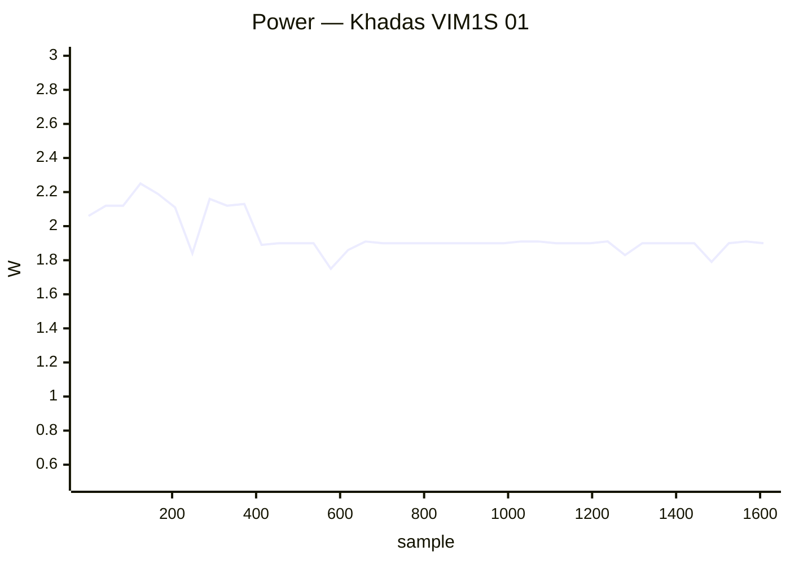
```mermaid
xychart-beta
    title "Power — Khadas VIM1S 01"
    x-axis "sample" 1 --> 1608
    y-axis "W" 0.5 --> 3.0
    line [2.06, 2.12, 2.12, 2.25, 2.19, 2.11, 1.84, 2.16, 2.12, 2.13, 1.89, 1.90, 1.90, 1.90, 1.75, 1.86, 1.91, 1.90, 1.90, 1.90, 1.90, 1.90, 1.90, 1.90, 1.90, 1.91, 1.91, 1.90, 1.90, 1.90, 1.91, 1.83, 1.90, 1.90, 1.90, 1.90, 1.79, 1.90, 1.91, 1.90]
```

### ❌ Khadas VIM3 01

`khadas-vim3` · **inplace** · image `26.11.0-trunk.65` · 0 ✅ · 1 ❌ · 0 ⏭️

| Module | Status | Time | Detail |
|:--|:--:|--:|:--|
| reachable | ❌ | 0.0 s | ip=10.0.50.39 · reachable=False · port=22 |

### ❌ NanoPi Neo 2 Black 01

`nanopineo2black` · **inplace** · image `26.11.0-trunk.65` · 14 ✅ · 1 ❌ · 1 ⏭️

| Module | Status | Time | Detail |
|:--|:--:|--:|:--|
| upgrade | ⏭️ | 16.4 s | — |
| reboot | ✅ | 53.5 s | power-cycle · up 17 s |
| kernel-switch | ✅ | 41.0 s | branch=current · family=sunxi64 · installed=26.11.0-trunk.65 · boot_image=/boot/vmlinuz-6.18.54-current-sunxi64 · kernel_before=6.18.54-current-sunxi64 |
| reboot | ✅ | 799.8 s | power-cycle · 1/4 boots · up 18 s |
| hw-performance | ✅ | 23.6 s | AES 637 · mem 3500 · disk W 43 / R 44 MB/s · 60.5 °C · 1368 MHz |
| dvfs | ✅ | 22.5 s | ondemand · 480–1368 MHz (peak 1368) |
| network-iperf | ✅ | 31.8 s | end0 ↑893/↓886 (1GE) Mbps |
| store-versions | ✅ | 4.9 s | 26.11.0-trunk.65 · 6.18.54-current-sunxi64 |
| kernel-switch | ❌ | 22.1 s | branch=edge · phase=install · dpkg_state=absent |
| reboot | ✅ | 817.3 s | power-cycle · 1/4 boots · up 17 s |
| hw-performance | ✅ | 24.0 s | AES 637 · mem 3500 · disk W 43 / R 44 MB/s · 61.6 °C · 1368 MHz |
| dvfs | ✅ | 23.1 s | ondemand · 480–1368 MHz (peak 1368) |
| network-iperf | ✅ | 31.3 s | end0 ↑892/↓910 (1GE) Mbps |
| store-versions | ✅ | 4.9 s | 26.11.0-trunk.65 · 6.18.54-current-sunxi64 |
| kernel-switch | ✅ | 41.5 s | branch=current · family=sunxi64 · installed=26.11.0-trunk.65 · boot_image=/boot/vmlinuz-6.18.54-current-sunxi64 · kernel_before=6.18.54-current-sunxi64 |
| reboot | ✅ | 53.7 s | power-cycle · up 18 s |

**Power** — min 0.90 W · avg 2.10 W · peak 5.50 W · 1598 samples

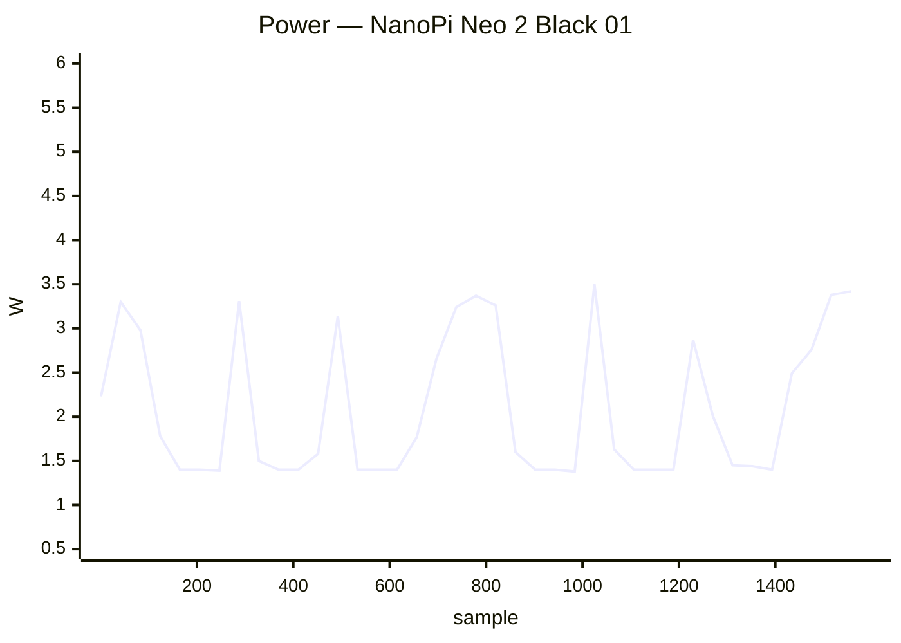
```mermaid
xychart-beta
    title "Power — NanoPi Neo 2 Black 01"
    x-axis "sample" 1 --> 1598
    y-axis "W" 0.5 --> 6.0
    line [2.23, 3.30, 2.98, 1.78, 1.40, 1.40, 1.39, 3.31, 1.50, 1.40, 1.40, 1.58, 3.14, 1.40, 1.40, 1.40, 1.77, 2.66, 3.24, 3.37, 3.26, 1.60, 1.40, 1.40, 1.38, 3.50, 1.63, 1.40, 1.40, 1.40, 2.87, 2.01, 1.45, 1.44, 1.40, 2.49, 2.76, 3.38, 3.42, 2.27]
```

### ❌ Odroid C4 01

`odroidc4` · **inplace** · image `26.11.0-trunk.65` · 14 ✅ · 1 ❌ · 1 ⏭️

| Module | Status | Time | Detail |
|:--|:--:|--:|:--|
| upgrade | ⏭️ | 10.8 s | — |
| reboot | ✅ | 54.9 s | power-cycle · up 24 s |
| kernel-switch | ✅ | 29.2 s | branch=current · family=meson64 · installed=26.11.0-trunk.65 · boot_image=/boot/vmlinuz-6.18.54-current-meson64 · kernel_before=6.18.54-current-meson64 |
| reboot | ✅ | 130.3 s | power-cycle · 4/4 boots · up 18 s |
| hw-performance | ✅ | 22.2 s | AES 979 · mem 5200 · disk W 30 / R 78 MB/s · 40 °C · 2100 MHz |
| dvfs | ✅ | 19.4 s | ondemand · 1000–2100 MHz (peak 2100) |
| network-iperf | ✅ | 56.8 s | end0 ↑939/↓939 (1GE) · wlx24050fdd332b ↑114/↓125 (Wi-Fi 4) Mbps |
| store-versions | ✅ | 4.4 s | 26.11.0-trunk.65 · 6.18.54-current-meson64 |
| kernel-switch | ❌ | 16.9 s | branch=edge · phase=install · dpkg_state=absent |
| reboot | ✅ | 131.1 s | power-cycle · 4/4 boots · up 17 s |
| hw-performance | ✅ | 21.7 s | AES 980 · mem 5200 · disk W 31 / R 80 MB/s · 40.7 °C · 2100 MHz |
| dvfs | ✅ | 19.0 s | ondemand · 1000–2100 MHz (peak 2100) |
| network-iperf | ✅ | 58.3 s | end0 ↑938/↓939 (1GE) · wlx24050fdd332b ↑116/↓118 (Wi-Fi 4) Mbps |
| store-versions | ✅ | 4.4 s | 26.11.0-trunk.65 · 6.18.54-current-meson64 |
| kernel-switch | ✅ | 29.1 s | branch=current · family=meson64 · installed=26.11.0-trunk.65 · boot_image=/boot/vmlinuz-6.18.54-current-meson64 · kernel_before=6.18.54-current-meson64 |
| reboot | ✅ | 47.7 s | power-cycle · up 17 s |

**Power** — min 0.90 W · avg 3.37 W · peak 5.00 W · 517 samples

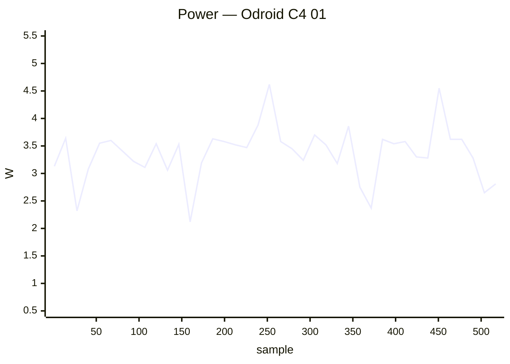
```mermaid
xychart-beta
    title "Power — Odroid C4 01"
    x-axis "sample" 1 --> 517
    y-axis "W" 0.5 --> 5.5
    line [3.13, 3.64, 2.32, 3.08, 3.55, 3.60, 3.41, 3.22, 3.11, 3.54, 3.06, 3.53, 2.12, 3.19, 3.63, 3.58, 3.52, 3.47, 3.88, 4.62, 3.58, 3.45, 3.24, 3.70, 3.52, 3.18, 3.86, 2.75, 2.37, 3.62, 3.54, 3.58, 3.30, 3.28, 4.55, 3.62, 3.62, 3.28, 2.65, 2.81]
```

### ❌ Odroid N2 01

`odroidn2` · **inplace** · image `26.11.0-trunk.65` · 14 ✅ · 1 ❌ · 1 ⏭️

| Module | Status | Time | Detail |
|:--|:--:|--:|:--|
| upgrade | ⏭️ | 9.0 s | — |
| reboot | ✅ | 59.2 s | power-cycle · up 27 s |
| kernel-switch | ✅ | 23.2 s | branch=current · family=meson64 · installed=26.11.0-trunk.65 · boot_image=/boot/vmlinuz-6.18.54-current-meson64 · kernel_before=6.18.54-current-meson64 |
| reboot | ✅ | 161.2 s | power-cycle · 4/4 boots · up 24 s |
| hw-performance | ✅ | 18.7 s | AES 1085 · mem 4900 · disk W 27 / R 135 MB/s · 38.6 °C · 1992 MHz |
| dvfs | ✅ | 17.3 s | performance · 1000–1992 MHz (peak 1992) |
| network-iperf | ✅ | 29.4 s | end0 ↑940/↓941 (1GE) Mbps |
| store-versions | ✅ | 3.7 s | 26.11.0-trunk.65 · 6.18.54-current-meson64 |
| kernel-switch | ❌ | 15.3 s | branch=edge · phase=install · dpkg_state=absent |
| reboot | ✅ | 169.6 s | power-cycle · 4/4 boots · up 28 s |
| hw-performance | ✅ | 18.6 s | AES 1085 · mem 4900 · disk W 27 / R 135 MB/s · 39.4 °C · 1992 MHz |
| dvfs | ✅ | 17.7 s | performance · 1000–1992 MHz (peak 1992) |
| network-iperf | ✅ | 27.5 s | end0 ↑940/↓941 (1GE) Mbps |
| store-versions | ✅ | 4.4 s | 26.11.0-trunk.65 · 6.18.54-current-meson64 |
| kernel-switch | ✅ | 23.3 s | branch=current · family=meson64 · installed=26.11.0-trunk.65 · boot_image=/boot/vmlinuz-6.18.54-current-meson64 · kernel_before=6.18.54-current-meson64 |
| reboot | ✅ | 63.0 s | power-cycle · up 28 s |

**Power** — min 1.00 W · avg 4.56 W · peak 11.50 W · 518 samples

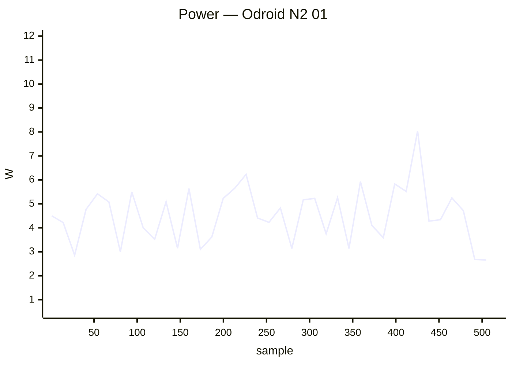
```mermaid
xychart-beta
    title "Power — Odroid N2 01"
    x-axis "sample" 1 --> 518
    y-axis "W" 0.5 --> 12.0
    line [4.50, 4.22, 2.86, 4.77, 5.42, 5.08, 3.00, 5.50, 4.00, 3.52, 5.09, 3.15, 5.64, 3.10, 3.62, 5.23, 5.65, 6.23, 4.41, 4.23, 4.83, 3.14, 5.17, 5.23, 3.75, 5.26, 3.14, 5.93, 4.10, 3.59, 5.83, 5.52, 8.04, 4.28, 4.34, 5.25, 4.72, 2.68, 2.66, 5.90]
```

### ❌ Odroid XU4 01

`odroidxu4` · **inplace** · image `26.11.0-trunk.62` · 0 ✅ · 1 ❌ · 0 ⏭️

| Module | Status | Time | Detail |
|:--|:--:|--:|:--|
| reachable | ❌ | 0.0 s | ip=10.0.50.36 · reachable=False · port=22 |

### ❌ Orange Pi 5 01

`orangepi5` · **inplace** · image `26.8.3` · 0 ✅ · 1 ❌ · 0 ⏭️

| Module | Status | Time | Detail |
|:--|:--:|--:|:--|
| reachable | ❌ | 0.0 s | ip=10.0.50.46 · reachable=False · port=22 |

### ❌ Orange Pi 5 Plus 01

`orangepi5-plus` · **inplace** · image `26.11.0-trunk.65` · 18 ✅ · 3 ❌ · 1 ⏭️

| Module | Status | Time | Detail |
|:--|:--:|--:|:--|
| upgrade | ⏭️ | 9.0 s | — |
| reboot | ✅ | 58.7 s | power-cycle · up 31 s |
| kernel-switch | ✅ | 21.3 s | branch=vendor · family=rk35xx · installed=26.11.0-trunk.65 · boot_image=/boot/vmlinuz-6.1.172-vendor-rk35xx · kernel_before=6.1.172-vendor-rk35xx |
| reboot | ✅ | 174.2 s | power-cycle · 4/4 boots · up 29 s |
| hw-performance | ✅ | 17.1 s | AES 1254 · mem 13100 · disk W 54 / R 62 MB/s · 56.4 °C · 1800 MHz |
| dvfs | ✅ | 17.3 s | ondemand · 1800–1800 MHz (peak 2256) |
| network-iperf | ✅ | 95.2 s | enP3p49s0 ↑941/↓941 (1GE) · wlxe0e1a9380c53 ↑618/↓334 (Wi-Fi 6) Mbps |
| store-versions | ✅ | 3.9 s | 26.11.0-trunk.65 · 6.1.172-vendor-rk35xx |
| kernel-switch | ❌ | 12.6 s | branch=current · phase=install · dpkg_state=absent |
| reboot | ✅ | 171.3 s | power-cycle · 4/4 boots · up 29 s |
| hw-performance | ✅ | 17.4 s | AES 1253 · mem 13800 · disk W 55 / R 62 MB/s · 57.3 °C · 1800 MHz |
| dvfs | ✅ | 16.0 s | ondemand · 1800–1800 MHz (peak 2256) |
| network-iperf | ❌ | 139.9 s | enP3p49s0 ↑941/↓0 (1GE) · wlxe0e1a9380c53 ↑619/↓455 (Wi-Fi 6) Mbps |
| store-versions | ✅ | 3.7 s | 26.11.0-trunk.65 · 6.1.172-vendor-rk35xx |
| kernel-switch | ❌ | 11.9 s | branch=edge · phase=install · dpkg_state=absent |
| reboot | ✅ | 174.1 s | power-cycle · 4/4 boots · up 28 s |
| hw-performance | ✅ | 17.6 s | AES 1253 · mem 15200 · disk W 53 / R 62 MB/s · 57.3 °C · 1800 MHz |
| dvfs | ✅ | 16.4 s | ondemand · 1800–1800 MHz (peak 2256) |
| network-iperf | ✅ | 53.9 s | enP3p49s0 ↑941/↓941 (1GE) · wlxe0e1a9380c53 ↑623/↓429 (Wi-Fi 6) Mbps |
| store-versions | ✅ | 3.9 s | 26.11.0-trunk.65 · 6.1.172-vendor-rk35xx |
| kernel-switch | ✅ | 18.9 s | branch=vendor · family=rk35xx · installed=26.11.0-trunk.65 · boot_image=/boot/vmlinuz-6.1.172-vendor-rk35xx · kernel_before=6.1.172-vendor-rk35xx |
| reboot | ✅ | 54.1 s | power-cycle · up 27 s |

**Power** — min 0.60 W · avg 5.49 W · peak 11.90 W · 879 samples

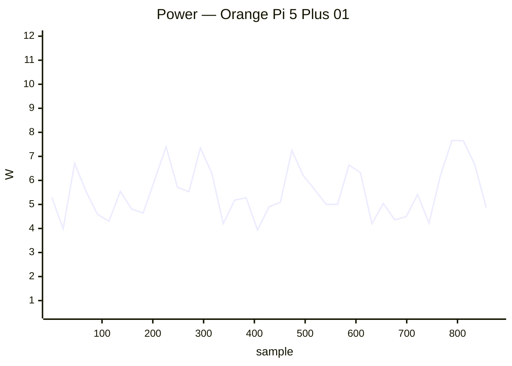
```mermaid
xychart-beta
    title "Power — Orange Pi 5 Plus 01"
    x-axis "sample" 1 --> 879
    y-axis "W" 0.5 --> 12.0
    line [5.30, 3.99, 6.71, 5.54, 4.59, 4.30, 5.54, 4.80, 4.65, 6.02, 7.40, 5.71, 5.53, 7.35, 6.30, 4.20, 5.18, 5.28, 3.94, 4.90, 5.09, 7.25, 6.20, 5.62, 5.00, 5.00, 6.64, 6.32, 4.20, 5.04, 4.36, 4.49, 5.41, 4.22, 6.21, 7.66, 7.65, 6.66, 4.87, 4.52]
```

### ❌ Orange Pi Lite 2 01

`orangepilite2` · **inplace** · image `26.11.0-trunk.65` · 13 ✅ · 2 ❌ · 1 ⏭️

| Module | Status | Time | Detail |
|:--|:--:|--:|:--|
| upgrade | ⏭️ | 13.9 s | — |
| reboot | ✅ | 42.0 s | warm · up 25 s |
| kernel-switch | ✅ | 36.8 s | branch=current · family=sunxi64 · installed=26.11.0-trunk.65 · boot_image=/boot/vmlinuz-6.18.54-current-sunxi64 · kernel_before=6.18.54-current-sunxi64 |
| reboot | ✅ | 152.1 s | warm · 4/4 boots · up 24 s |
| hw-performance | ✅ | 32.1 s | AES 786 · mem 4300 · disk W 14 / R 1 MB/s · 75.3 °C · 1800 MHz |
| dvfs | ✅ | 21.6 s | ondemand · 480–1800 MHz (peak 1800) |
| network-iperf | ✅ | 47.8 s | wlan0 ↑40/↓14 (Wi-Fi 5) Mbps |
| store-versions | ✅ | 5.0 s | 26.11.0-trunk.65 · 6.18.54-current-sunxi64 |
| kernel-switch | ❌ | 21.7 s | branch=edge · phase=install · dpkg_state=absent |
| reboot | ✅ | 145.8 s | warm · 4/4 boots · up 24 s |
| hw-performance | ✅ | 32.1 s | AES 771 · mem 4300 · disk W 14 / R 23 MB/s · 75.1 °C · 1800 MHz |
| dvfs | ❌ | 25.7 s | ondemand · 480–1800 MHz (peak 1704) |
| network-iperf | ✅ | 43.1 s | wlan0 ↑24/↓21 (Wi-Fi 5) Mbps |
| store-versions | ✅ | 5.4 s | 26.11.0-trunk.65 · 6.18.54-current-sunxi64 |
| kernel-switch | ✅ | 39.9 s | branch=current · family=sunxi64 · installed=26.11.0-trunk.65 · boot_image=/boot/vmlinuz-6.18.54-current-sunxi64 · kernel_before=6.18.54-current-sunxi64 |
| reboot | ✅ | 41.6 s | warm · up 24 s |

### ❌ Orange Pi One+ 01

`orangepioneplus` · **inplace** · image `26.11.0-trunk.65` · 14 ✅ · 1 ❌ · 1 ⏭️

| Module | Status | Time | Detail |
|:--|:--:|--:|:--|
| upgrade | ⏭️ | 18.2 s | — |
| reboot | ✅ | 41.4 s | warm · up 24 s |
| kernel-switch | ✅ | 38.4 s | branch=current · family=sunxi64 · installed=26.11.0-trunk.65 · boot_image=/boot/vmlinuz-6.18.54-current-sunxi64 · kernel_before=6.18.54-current-sunxi64 |
| reboot | ✅ | 141.2 s | warm · 4/4 boots · up 23 s |
| hw-performance | ✅ | 29.5 s | AES 839 · mem 4600 · disk W 21 / R 1 MB/s · 62.7 °C · 1800 MHz |
| dvfs | ✅ | 22.5 s | ondemand · 480–1800 MHz (peak 1800) |
| network-iperf | ✅ | 130.3 s | end0 ↑913/↓940 (1GE) · wlx00e04c881724 ↑67/↓134 (Wi-Fi 5) Mbps |
| store-versions | ✅ | 5.0 s | 26.11.0-trunk.65 · 6.18.54-current-sunxi64 |
| kernel-switch | ❌ | 22.0 s | branch=edge · phase=install · dpkg_state=absent |
| reboot | ✅ | 135.4 s | warm · 4/4 boots · up 20 s |
| hw-performance | ✅ | 29.4 s | AES 838 · mem 4600 · disk W 21 / R 23 MB/s · 62.7 °C · 1800 MHz |
| dvfs | ✅ | 22.9 s | ondemand · 480–1800 MHz (peak 1800) |
| network-iperf | ✅ | 83.8 s | end0 ↑917/↓939 (1GE) · wlx00e04c881724 ↑23/↓12 (Wi-Fi 5) Mbps |
| store-versions | ✅ | 5.0 s | 26.11.0-trunk.65 · 6.18.54-current-sunxi64 |
| kernel-switch | ✅ | 39.0 s | branch=current · family=sunxi64 · installed=26.11.0-trunk.65 · boot_image=/boot/vmlinuz-6.18.54-current-sunxi64 · kernel_before=6.18.54-current-sunxi64 |
| reboot | ✅ | 40.6 s | warm · up 23 s |

### ❌ Orange Pi PC + 01

`orangepipcplus` · **inplace** · image `26.11.0-trunk.65` · 13 ✅ · 2 ❌ · 1 ⏭️

| Module | Status | Time | Detail |
|:--|:--:|--:|:--|
| upgrade | ⏭️ | 32.7 s | — |
| reboot | ✅ | 50.9 s | warm · up 27 s |
| kernel-switch | ❌ | 48.6 s | branch=current · phase=install · dpkg_state=absent |
| reboot | ✅ | 186.3 s | warm · 4/4 boots · up 32 s |
| hw-performance | ✅ | 42.7 s | AES 25 · mem 2200 · disk W 8 / R 76 MB/s · 48.8 °C · 1296 MHz |
| dvfs | ✅ | 41.9 s | ondemand · 480–1296 MHz (peak 1296) |
| network-iperf | ✅ | 114.8 s | wlan0 ↑31/↓24 (Wi-Fi 4) · wlan1 ↑7/↓16 (Wi-Fi 4) · end0 ↑?/↓? Mbps |
| store-versions | ✅ | 8.3 s | 26.11.0-trunk.65 · 7.2.8-edge-sunxi |
| kernel-switch | ✅ | 64.2 s | branch=edge · family=sunxi · installed=26.11.0-trunk.65 · boot_image=/boot/vmlinuz-7.2.8-edge-sunxi · kernel_before=7.2.8-edge-sunxi |
| reboot | ✅ | 194.3 s | warm · 4/4 boots · up 33 s |
| hw-performance | ✅ | 42.7 s | AES 25 · mem 2200 · disk W 8 / R 78 MB/s · 51.9 °C · 1296 MHz |
| dvfs | ✅ | 41.8 s | ondemand · 480–1296 MHz (peak 1296) |
| network-iperf | ✅ | 105.1 s | wlan0 ↑28/↓19 (Wi-Fi 4) · wlan1 ↑23/↓23 (Wi-Fi 4) · end0 ↑?/↓? Mbps |
| store-versions | ✅ | 8.7 s | 26.11.0-trunk.65 · 7.2.8-edge-sunxi |
| kernel-switch | ❌ | 51.0 s | branch=current · phase=install · dpkg_state=absent |
| reboot | ✅ | 53.9 s | warm · up 28 s |

### ❌ Orange Pi Prime 01

`orangepiprime` · **inplace** · image `26.11.0-trunk.65` · 0 ✅ · 1 ❌ · 0 ⏭️

| Module | Status | Time | Detail |
|:--|:--:|--:|:--|
| reachable | ❌ | 0.0 s | ip=10.0.50.46 · reachable=False · port=22 |

### ❌ Orange Pi Zero2 01

`orangepizero2` · **inplace** · image `26.11.0-trunk.65` · 14 ✅ · 1 ❌ · 1 ⏭️

| Module | Status | Time | Detail |
|:--|:--:|--:|:--|
| upgrade | ⏭️ | 46.6 s | — |
| reboot | ✅ | 41.9 s | warm · up 24 s |
| kernel-switch | ✅ | 68.2 s | branch=current · family=sunxi64 · installed=26.11.0-trunk.65 · boot_image=/boot/vmlinuz-6.18.54-current-sunxi64 · kernel_before=6.18.54-current-sunxi64 |
| reboot | ✅ | 147.4 s | warm · 4/4 boots · up 23 s |
| hw-performance | ✅ | 32.5 s | AES 705 · mem 3000 · disk W 21 / R 23 MB/s · 61.5 °C · 1512 MHz |
| dvfs | ✅ | 26.1 s | ondemand · 480–1512 MHz (peak 1512) |
| network-iperf | ✅ | 80.6 s | end0 ↑874/↓941 (1GE) · wlx7c023a625db1 ↑27/↓29 (Wi-Fi 5) Mbps |
| store-versions | ✅ | 5.8 s | 26.11.0-trunk.65 · 6.18.54-current-sunxi64 |
| kernel-switch | ❌ | 53.1 s | branch=edge · phase=install · dpkg_state=absent |
| reboot | ✅ | 150.8 s | warm · 4/4 boots · up 24 s |
| hw-performance | ✅ | 32.5 s | AES 704 · mem 3000 · disk W 21 / R 22 MB/s · 63.5 °C · 1512 MHz |
| dvfs | ✅ | 26.0 s | ondemand · 480–1512 MHz (peak 1512) |
| network-iperf | ✅ | 71.7 s | end0 ↑865/↓942 (1GE) · wlx7c023a625db1 ↑35/↓25 (Wi-Fi 5) Mbps |
| store-versions | ✅ | 6.6 s | 26.11.0-trunk.65 · 6.18.54-current-sunxi64 |
| kernel-switch | ✅ | 67.6 s | branch=current · family=sunxi64 · installed=26.11.0-trunk.65 · boot_image=/boot/vmlinuz-6.18.54-current-sunxi64 · kernel_before=6.18.54-current-sunxi64 |
| reboot | ✅ | 42.1 s | warm · up 24 s |

### ❌ OrangePi 3 LTS 01

`orangepi3-lts` · **inplace** · image `26.11.0-trunk.62` · 0 ✅ · 1 ❌ · 0 ⏭️

| Module | Status | Time | Detail |
|:--|:--:|--:|:--|
| reachable | ❌ | 0.0 s | ip=10.0.50.60 · reachable=False · port=22 |

**Power** — min 2.60 W · avg 2.60 W · peak 2.60 W · 41 samples

```mermaid
xychart-beta
    title "Power — OrangePi 3 LTS 01"
    x-axis "sample" 1 --> 41
    y-axis "W" 2.5 --> 3.0
    line [2.60, 2.60, 2.60, 2.60, 2.60, 2.60, 2.60, 2.60, 2.60, 2.60, 2.60, 2.60, 2.60, 2.60, 2.60, 2.60, 2.60, 2.60, 2.60, 2.60, 2.60, 2.60, 2.60, 2.60, 2.60, 2.60, 2.60, 2.60, 2.60, 2.60, 2.60, 2.60, 2.60, 2.60, 2.60, 2.60, 2.60, 2.60, 2.60, 2.60]
```

### ❌ Radxa Dragon Q6A 01

`radxa-dragon-q6a` · **inplace** · image `26.11.0-trunk.65` · 13 ✅ · 2 ❌ · 1 ⏭️

| Module | Status | Time | Detail |
|:--|:--:|--:|:--|
| upgrade | ⏭️ | 7.9 s | — |
| reboot | ✅ | 139.6 s | power-cycle · up 106 s |
| kernel-switch | ❌ | 10.3 s | branch=current · phase=install · dpkg_state=absent |
| reboot | ✅ | 477.2 s | power-cycle · 4/4 boots · up 107 s |
| hw-performance | ✅ | 13.2 s | AES 1524 · mem 18200 · disk W 240 / R 1186 MB/s · 46.9 °C · 1958 MHz |
| dvfs | ✅ | 14.8 s | ondemand · 300–1958 MHz (peak 2707) |
| network-iperf | ✅ | 28.3 s | enp1s0 ↑940/↓941 (1GE) Mbps |
| store-versions | ✅ | 3.7 s | 26.11.0-trunk.65 · 7.2.3-edge-qcs6490 |
| kernel-switch | ✅ | 16.8 s | branch=edge · family=qcs6490 · installed=26.11.0-trunk.65 · boot_image=/boot/vmlinuz-7.2.3-edge-qcs6490 · kernel_before=7.2.3-edge-qcs6490 |
| reboot | ✅ | 473.6 s | power-cycle · 4/4 boots · up 107 s |
| hw-performance | ✅ | 13.4 s | AES 1524 · mem 18200 · disk W 234 / R 1181 MB/s · 47.7 °C · 1958 MHz |
| dvfs | ✅ | 14.8 s | ondemand · 300–1958 MHz (peak 2707) |
| network-iperf | ✅ | 30.7 s | enp1s0 ↑941/↓941 (1GE) Mbps |
| store-versions | ✅ | 3.8 s | 26.11.0-trunk.65 · 7.2.3-edge-qcs6490 |
| kernel-switch | ❌ | 10.4 s | branch=current · phase=install · dpkg_state=absent |
| reboot | ✅ | 141.5 s | power-cycle · up 106 s |

**Power** — min 0.90 W · avg 2.17 W · peak 6.90 W · 1114 samples

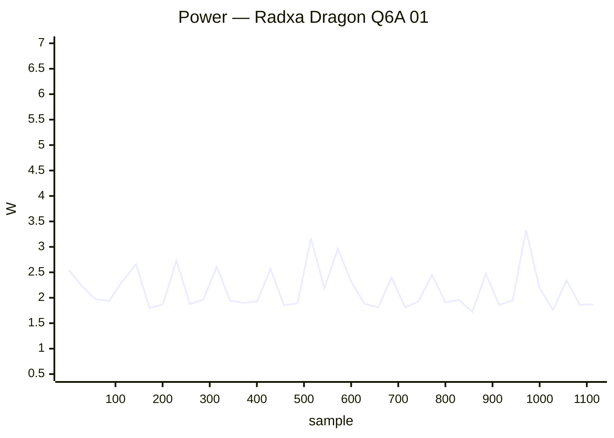
```mermaid
xychart-beta
    title "Power — Radxa Dragon Q6A 01"
    x-axis "sample" 1 --> 1114
    y-axis "W" 0.5 --> 7.0
    line [2.54, 2.22, 1.97, 1.94, 2.33, 2.66, 1.80, 1.87, 2.73, 1.88, 1.96, 2.61, 1.94, 1.90, 1.93, 2.57, 1.85, 1.89, 3.17, 2.19, 2.96, 2.31, 1.88, 1.81, 2.40, 1.81, 1.93, 2.45, 1.91, 1.96, 1.72, 2.47, 1.86, 1.95, 3.33, 2.19, 1.76, 2.34, 1.86, 1.87]
```

### ❌ Raspberry Pi 3B

`rpi4b` · **inplace** · image `26.11.0-trunk.65` · 13 ✅ · 2 ❌ · 1 ⏭️

| Module | Status | Time | Detail |
|:--|:--:|--:|:--|
| upgrade | ⏭️ | 32.2 s | — |
| reboot | ✅ | 53.1 s | warm · up 33 s |
| kernel-switch | ❌ | 43.4 s | branch=current · phase=install · dpkg_state=absent |
| reboot | ✅ | 187.0 s | warm · 4/4 boots · up 32 s |
| hw-performance | ✅ | 44.6 s | AES 22 · mem 1400 · disk W 20 / R 22 MB/s · 54.2 °C · 1200 MHz |
| dvfs | ✅ | 40.0 s | ondemand · 600–1200 MHz (peak 1200) |
| network-iperf | ✅ | 119.1 s | enxb827eb253a53 ↑94/↓94 (10/100ME) · wlan0 ↑10/↓21 (Wi-Fi 4) Mbps |
| store-versions | ✅ | 8.7 s | 26.11.0-trunk.65 · 7.2.8-edge-bcm2711 |
| kernel-switch | ✅ | 73.8 s | branch=edge · family=bcm2711 · installed=26.11.0-trunk.65 · boot_image=/boot/vmlinuz-7.2.8-edge-bcm2711 · kernel_before=7.2.8-edge-bcm2711 |
| reboot | ✅ | 185.4 s | warm · 4/4 boots · up 31 s |
| hw-performance | ✅ | 43.9 s | AES 20 · mem 1400 · disk W 20 / R 22 MB/s · 54.8 °C · 1200 MHz |
| dvfs | ✅ | 40.7 s | ondemand · 600–1200 MHz (peak 1200) |
| network-iperf | ✅ | 79.1 s | enxb827eb253a53 ↑94/↓94 (10/100ME) · wlan0 ↑18/↓31 (Wi-Fi 4) Mbps |
| store-versions | ✅ | 8.7 s | 26.11.0-trunk.65 · 7.2.8-edge-bcm2711 |
| kernel-switch | ❌ | 43.7 s | branch=current · phase=install · dpkg_state=absent |
| reboot | ✅ | 52.3 s | warm · up 31 s |

### ❌ Raspberry Pi 5B

`rpi4b` · **inplace** · image `26.11.0-trunk.65` · 14 ✅ · 1 ❌ · 1 ⏭️

| Module | Status | Time | Detail |
|:--|:--:|--:|:--|
| upgrade | ⏭️ | 5.1 s | — |
| reboot | ✅ | 54.4 s | power-cycle · up 21 s |
| kernel-switch | ✅ | 12.9 s | branch=current · family=bcm2711 · installed=26.11.0-trunk.65 · boot_image=/boot/vmlinuz-6.18.54-current-bcm2711 · kernel_before=6.18.54-current-bcm2711 |
| reboot | ✅ | 117.7 s | power-cycle · 4/4 boots · up 17 s |
| hw-performance | ✅ | 14.7 s | AES 1368 · mem 12100 · disk W 56 / R 84 MB/s · 65 °C · 2400 MHz |
| dvfs | ✅ | 13.3 s | ondemand · 1500–2400 MHz (peak 2400) |
| network-iperf | ✅ | 51.2 s | end0 ↑936/↓941 (1GE) · wlan0 ↑38/↓26 (Wi-Fi 5) Mbps |
| store-versions | ✅ | 3.2 s | 26.11.0-trunk.65 · 6.18.54-current-bcm2711 |
| kernel-switch | ❌ | 7.7 s | branch=edge · phase=install · dpkg_state=absent |
| reboot | ✅ | 124.1 s | power-cycle · 4/4 boots · up 21 s |
| hw-performance | ✅ | 14.5 s | AES 1368 · mem 12000 · disk W 56 / R 86 MB/s · 67.2 °C · 2400 MHz |
| dvfs | ✅ | 13.2 s | ondemand · 1500–2400 MHz (peak 2400) |
| network-iperf | ✅ | 61.0 s | end0 ↑936/↓941 (1GE) · wlan0 ↑40/↓16 (Wi-Fi 5) Mbps |
| store-versions | ✅ | 3.1 s | 26.11.0-trunk.65 · 6.18.54-current-bcm2711 |
| kernel-switch | ✅ | 13.1 s | branch=current · family=bcm2711 · installed=26.11.0-trunk.65 · boot_image=/boot/vmlinuz-6.18.54-current-bcm2711 · kernel_before=6.18.54-current-bcm2711 |
| reboot | ✅ | 45.9 s | power-cycle · up 19 s |

**Power** — min 2.10 W · avg 5.54 W · peak 9.90 W · 442 samples

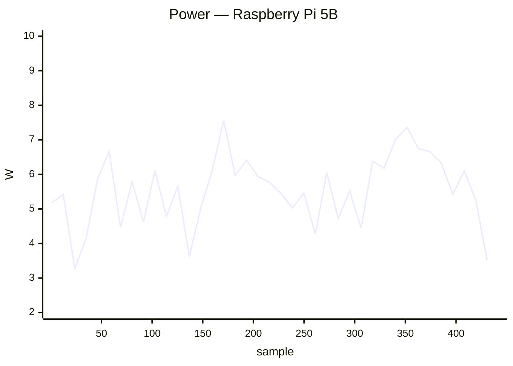
```mermaid
xychart-beta
    title "Power — Raspberry Pi 5B"
    x-axis "sample" 1 --> 442
    y-axis "W" 2.0 --> 10.0
    line [5.18, 5.42, 3.26, 4.16, 5.88, 6.67, 4.47, 5.79, 4.62, 6.11, 4.79, 5.65, 3.62, 5.03, 6.11, 7.56, 5.97, 6.41, 5.94, 5.77, 5.45, 5.03, 5.46, 4.28, 6.05, 4.72, 5.52, 4.44, 6.38, 6.18, 7.01, 7.36, 6.75, 6.66, 6.33, 5.42, 6.10, 5.26, 3.52, 5.42]
```

### ❌ Raspberry Pi Zero 2W

`rpi4b` · **inplace** · image `26.11.0-trunk.65` · 13 ✅ · 2 ❌ · 1 ⏭️

| Module | Status | Time | Detail |
|:--|:--:|--:|:--|
| upgrade | ⏭️ | 24.3 s | — |
| reboot | ✅ | 43.8 s | warm · up 24 s |
| kernel-switch | ❌ | 35.3 s | branch=current · phase=install · dpkg_state=absent |
| reboot | ✅ | 148.9 s | warm · 4/4 boots · up 23 s |
| hw-performance | ✅ | 34.8 s | AES 33 · mem 2200 · disk W 20 / R 23 MB/s · 55.3 °C · 1000 MHz |
| dvfs | ✅ | 28.5 s | ondemand · 600–1000 MHz (peak 1000) |
| network-iperf | ✅ | 44.5 s | wlan0 ↑17/↓12 (Wi-Fi 4) Mbps |
| store-versions | ✅ | 5.9 s | 26.11.0-trunk.65 · 7.2.8-edge-bcm2711 |
| kernel-switch | ✅ | 53.3 s | branch=edge · family=bcm2711 · installed=26.11.0-trunk.65 · boot_image=/boot/vmlinuz-7.2.8-edge-bcm2711 · kernel_before=7.2.8-edge-bcm2711 |
| reboot | ✅ | 153.3 s | warm · 4/4 boots · up 24 s |
| hw-performance | ✅ | 34.0 s | AES 33 · mem 2200 · disk W 1 / R 23 MB/s · 55.8 °C · 1000 MHz |
| dvfs | ✅ | 30.3 s | ondemand · 600–1000 MHz (peak 1000) |
| network-iperf | ✅ | 87.1 s | wlan0 ↑24/↓22 (Wi-Fi 4) Mbps |
| store-versions | ✅ | 6.1 s | 26.11.0-trunk.65 · 7.2.8-edge-bcm2711 |
| kernel-switch | ❌ | 35.5 s | branch=current · phase=install · dpkg_state=absent |
| reboot | ✅ | 42.8 s | warm · up 23 s |

### ❌ ROCK 2F 01

`rock-2f` · **inplace** · image `26.8.1` · 15 ✅ · 1 ❌ · 0 ⏭️

| Module | Status | Time | Detail |
|:--|:--:|--:|:--|
| upgrade | ✅ | 694.8 s | nightly · 26.8.1 → 26.8.1 |
| reboot | ✅ | 9.9 s | power-cycle |
| kernel-switch | ✅ | 710.1 s | branch=vendor · family=rk35xx · installed=26.8.3 · boot_image=/boot/vmlinuz-6.1.115-vendor-rk35xx · kernel_before=6.1.115-vendor-rk35xx |
| reboot | ✅ | 107.0 s | power-cycle · 3/4 boots · up 19 s |
| hw-performance | ✅ | 29.6 s | AES 813 · mem 6000 · disk W 20 / R 22 MB/s · 53.3 °C · 2016 MHz |
| dvfs | ✅ | 22.1 s | ondemand · 408–2016 MHz (peak 2016) |
| network-iperf | ✅ | 36.3 s | wlan0 ↑215/↓275 (Wi-Fi 6) Mbps |
| store-versions | ✅ | 5.7 s | 26.8.1 · 6.1.115-vendor-rk35xx |
| kernel-switch | ❌ | 24.7 s | branch=edge · phase=install · dpkg_state=absent |
| reboot | ✅ | 100.8 s | power-cycle · 3/4 boots · up 19 s |
| hw-performance | ✅ | 29.7 s | AES 829 · mem 6100 · disk W 20 / R 22 MB/s · 52.7 °C · 2016 MHz |
| dvfs | ✅ | 23.2 s | ondemand · 408–2016 MHz (peak 2016) |
| network-iperf | ✅ | 36.4 s | wlan0 ↑215/↓271 (Wi-Fi 6) Mbps |
| store-versions | ✅ | 5.1 s | 26.8.1 · 6.1.115-vendor-rk35xx |
| kernel-switch | ✅ | 691.6 s | branch=vendor · family=rk35xx · installed=26.8.3 · boot_image=/boot/vmlinuz-6.1.115-vendor-rk35xx · kernel_before=6.1.115-vendor-rk35xx |
| reboot | ✅ | 11.8 s | power-cycle |

### ❌ Rock 5B 01

`rock-5b` · **inplace** · image `26.11.0-trunk.65` · 18 ✅ · 3 ❌ · 1 ⏭️

| Module | Status | Time | Detail |
|:--|:--:|--:|:--|
| upgrade | ⏭️ | 8.5 s | — |
| reboot | ✅ | 130.8 s | power-cycle · up 102 s |
| kernel-switch | ❌ | 13.5 s | branch=vendor · phase=install · dpkg_state=absent |
| reboot | ✅ | 455.0 s | power-cycle · 4/4 boots · up 101 s |
| hw-performance | ✅ | 19.9 s | AES 1287 · mem 10200 · disk W 26 / R 87 MB/s · 61 °C · 1800 MHz |
| dvfs | ✅ | 14.9 s | ondemand · 408–1800 MHz (peak 2400) |
| network-iperf | ✅ | 54.7 s | enP4p65s0 ↑941/↓941 (1GE) Mbps |
| store-versions | ✅ | 3.9 s | 26.11.0-trunk.65 · 6.18.54-current-rockchip64 |
| kernel-switch | ✅ | 20.6 s | branch=current · family=rockchip64 · installed=26.11.0-trunk.65 · boot_image=/boot/vmlinuz-6.18.54-current-rockchip64 · kernel_before=6.18.54-current-rockchip64 |
| reboot | ✅ | 453.3 s | power-cycle · 4/4 boots · up 102 s |
| hw-performance | ✅ | 19.8 s | AES 1288 · mem 10400 · disk W 26 / R 82 MB/s · 61 °C · 1800 MHz |
| dvfs | ✅ | 15.6 s | ondemand · 408–1800 MHz (peak 2400) |
| network-iperf | ✅ | 28.2 s | enP4p65s0 ↑941/↓941 (1GE) Mbps |
| store-versions | ✅ | 4.2 s | 26.11.0-trunk.65 · 6.18.54-current-rockchip64 |
| kernel-switch | ❌ | 14.3 s | branch=edge · phase=install · dpkg_state=absent |
| reboot | ✅ | 454.5 s | power-cycle · 4/4 boots · up 102 s |
| hw-performance | ✅ | 20.2 s | AES 1288 · mem 10400 · disk W 24 / R 82 MB/s · 61 °C · 1800 MHz |
| dvfs | ✅ | 15.2 s | ondemand · 408–1800 MHz (peak 2400) |
| network-iperf | ✅ | 39.8 s | enP4p65s0 ↑941/↓941 (1GE) Mbps |
| store-versions | ✅ | 4.2 s | 26.11.0-trunk.65 · 6.18.54-current-rockchip64 |
| kernel-switch | ❌ | 13.9 s | branch=vendor · phase=install · dpkg_state=absent |
| reboot | ✅ | 128.4 s | power-cycle · up 102 s |

**Power** — min 0.70 W · avg 5.35 W · peak 12.50 W · 1546 samples

```mermaid
xychart-beta
    title "Power — Rock 5B 01"
    x-axis "sample" 1 --> 1546
    y-axis "W" 0.5 --> 13.0
    line [5.25, 5.39, 5.21, 5.38, 5.20, 5.07, 5.27, 5.24, 5.28, 5.20, 5.22, 5.20, 5.64, 5.96, 5.96, 5.00, 5.20, 5.20, 5.20, 5.11, 5.37, 5.21, 5.20, 5.20, 6.12, 5.53, 4.94, 5.20, 5.19, 5.20, 4.84, 5.28, 5.20, 5.33, 5.20, 5.86, 6.71, 5.61, 5.42, 5.21]
```

### ❌ Rock 5B 02

`rock-5b` · **inplace** · image `26.11.0-trunk.62` · 0 ✅ · 1 ❌ · 21 ⏭️

| Module | Status | Time | Detail |
|:--|:--:|--:|:--|
| upgrade | ⏭️ | 9.3 s | — |
| reboot | ❌ | 133.0 s | power-cycle · up 102 s |
| kernel-switch | ⏭️ | 0.0 s | skipped=board down after reboot/power-cycle |
| reboot | ⏭️ | 0.0 s | reboot |
| hw-perf | ⏭️ | 0.0 s | board down after reboot/power-cycle |
| dvfs | ⏭️ | 0.0 s | — |
| net-iperf | ⏭️ | 0.0 s | board down after reboot/power-cycle |
| store-versions | ⏭️ | 0.0 s | — |
| kernel-switch | ⏭️ | 0.0 s | skipped=board down after reboot/power-cycle |
| reboot | ⏭️ | 0.0 s | reboot |
| hw-perf | ⏭️ | 0.0 s | board down after reboot/power-cycle |
| dvfs | ⏭️ | 0.0 s | — |
| net-iperf | ⏭️ | 0.0 s | board down after reboot/power-cycle |
| store-versions | ⏭️ | 0.0 s | — |
| kernel-switch | ⏭️ | 0.0 s | skipped=board down after reboot/power-cycle |
| reboot | ⏭️ | 0.0 s | reboot |
| hw-perf | ⏭️ | 0.0 s | board down after reboot/power-cycle |
| dvfs | ⏭️ | 0.0 s | — |
| net-iperf | ⏭️ | 0.0 s | board down after reboot/power-cycle |
| store-versions | ⏭️ | 0.0 s | — |
| kernel-switch | ⏭️ | 0.0 s | skipped=board down after reboot/power-cycle |
| reboot | ⏭️ | 0.0 s | reboot |

**Power** — min 2.90 W · avg 3.47 W · peak 10.00 W · 112 samples

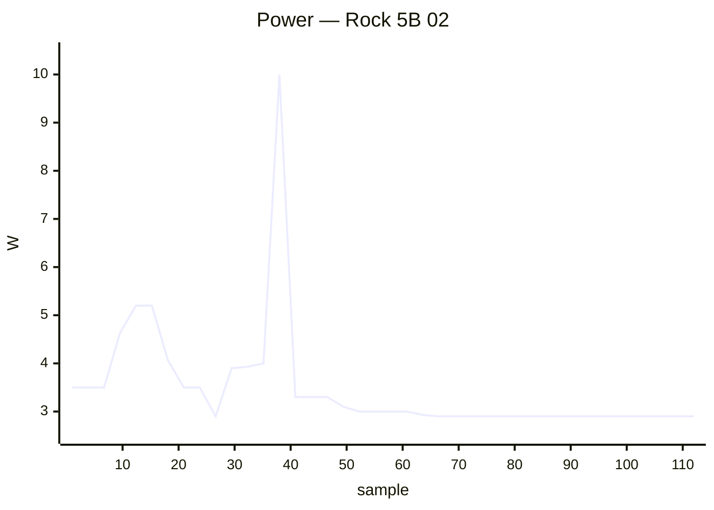
```mermaid
xychart-beta
    title "Power — Rock 5B 02"
    x-axis "sample" 1 --> 112
    y-axis "W" 2.5 --> 10.5
    line [3.50, 3.50, 3.50, 4.63, 5.20, 5.20, 4.07, 3.50, 3.50, 2.90, 3.90, 3.93, 4.00, 10.00, 3.30, 3.30, 3.30, 3.10, 3.00, 3.00, 3.00, 3.00, 2.93, 2.90, 2.90, 2.90, 2.90, 2.90, 2.90, 2.90, 2.90, 2.90, 2.90, 2.90, 2.90, 2.90, 2.90, 2.90, 2.90, 2.90]
```

### ❌ Rock 5B Plus 01

`rock-5b-plus` · **inplace** · image `26.11.0-trunk.65` · 19 ✅ · 2 ❌ · 1 ⏭️

| Module | Status | Time | Detail |
|:--|:--:|--:|:--|
| upgrade | ⏭️ | 5.7 s | — |
| reboot | ✅ | 53.5 s | power-cycle · up 24 s |
| kernel-switch | ✅ | 8.8 s | branch=vendor · family=rk35xx · installed=26.11.0-trunk.65 · boot_image=/boot/vmlinuz-6.1.172-vendor-rk35xx · kernel_before=6.1.172-vendor-rk35xx |
| reboot | ✅ | 151.6 s | power-cycle · 4/4 boots · up 22 s |
| hw-performance | ✅ | 16.7 s | AES 1283 · mem 13800 · disk W 69 / R 81 MB/s · 51.8 °C · 1800 MHz |
| dvfs | ✅ | 16.2 s | ondemand · 1800–1800 MHz (peak 2304) |
| network-iperf | ✅ | 34.5 s | enP4p65s0 ↑941/↓941 (1GE) Mbps |
| store-versions | ✅ | 3.8 s | 26.11.0-trunk.65 · 6.1.172-vendor-rk35xx |
| kernel-switch | ❌ | 7.7 s | branch=current · phase=install · dpkg_state=absent |
| reboot | ✅ | 156.0 s | power-cycle · 4/4 boots · up 23 s |
| hw-performance | ✅ | 16.9 s | AES 1283 · mem 13900 · disk W 69 / R 81 MB/s · 53.6 °C · 1800 MHz |
| dvfs | ✅ | 16.4 s | ondemand · 1800–1800 MHz (peak 2304) |
| network-iperf | ✅ | 28.7 s | enP4p65s0 ↑941/↓941 (1GE) Mbps |
| store-versions | ✅ | 5.0 s | 26.11.0-trunk.65 · 6.1.172-vendor-rk35xx |
| kernel-switch | ❌ | 6.8 s | branch=edge · phase=install · dpkg_state=absent |
| reboot | ✅ | 158.8 s | power-cycle · 4/4 boots · up 26 s |
| hw-performance | ✅ | 16.9 s | AES 1295 · mem 15500 · disk W 68 / R 81 MB/s · 53.6 °C · 1800 MHz |
| dvfs | ✅ | 16.4 s | ondemand · 408–1800 MHz (peak 2304) |
| network-iperf | ✅ | 29.6 s | enP4p65s0 ↑941/↓941 (1GE) Mbps |
| store-versions | ✅ | 4.0 s | 26.11.0-trunk.65 · 6.1.172-vendor-rk35xx |
| kernel-switch | ✅ | 8.9 s | branch=vendor · family=rk35xx · installed=26.11.0-trunk.65 · boot_image=/boot/vmlinuz-6.1.172-vendor-rk35xx · kernel_before=6.1.172-vendor-rk35xx |
| reboot | ✅ | 49.6 s | power-cycle · up 22 s |

**Power** — min 2.40 W · avg 3.66 W · peak 9.10 W · 635 samples

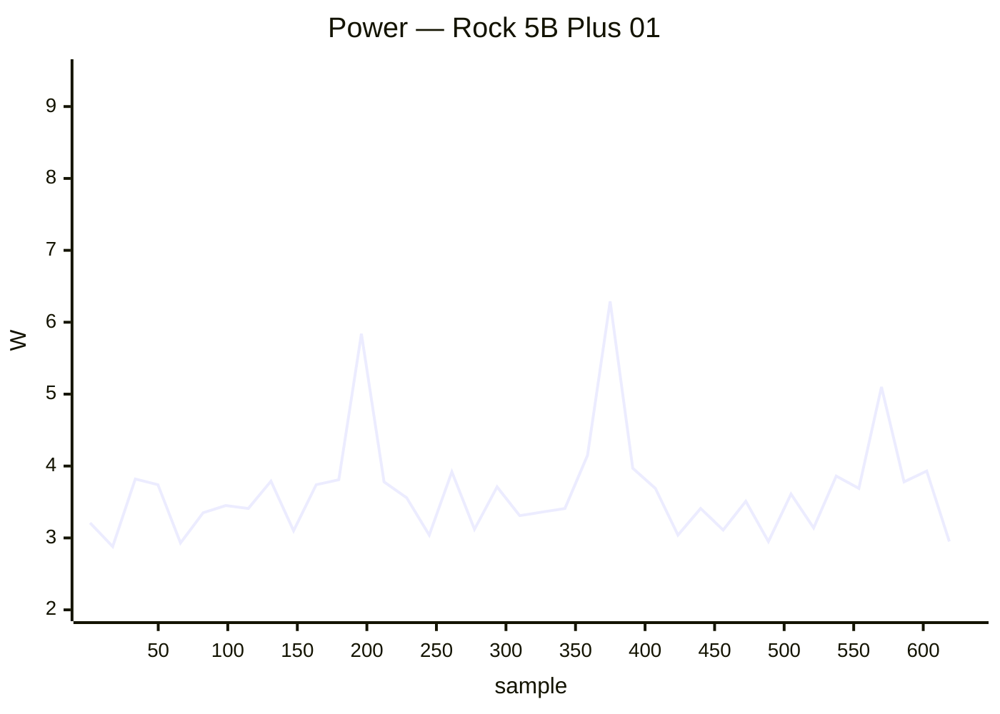
```mermaid
xychart-beta
    title "Power — Rock 5B Plus 01"
    x-axis "sample" 1 --> 635
    y-axis "W" 2.0 --> 9.5
    line [3.21, 2.88, 3.82, 3.74, 2.93, 3.35, 3.45, 3.41, 3.79, 3.10, 3.74, 3.81, 5.84, 3.78, 3.56, 3.04, 3.92, 3.12, 3.71, 3.31, 3.36, 3.41, 4.15, 6.29, 3.97, 3.69, 3.04, 3.41, 3.11, 3.51, 2.95, 3.61, 3.14, 3.86, 3.69, 5.10, 3.78, 3.93, 2.95, 4.05]
```

### ❌ Rock 5T 01

`rock-5t` · **inplace** · image `26.11.0-trunk.65` · 14 ✅ · 1 ❌ · 1 ⏭️

| Module | Status | Time | Detail |
|:--|:--:|--:|:--|
| upgrade | ⏭️ | 10.5 s | — |
| reboot | ✅ | 54.7 s | power-cycle · up 21 s |
| kernel-switch | ✅ | 20.7 s | branch=current · family=rockchip64 · installed=26.11.0-trunk.65 · boot_image=/boot/vmlinuz-6.18.54-current-rockchip64 · kernel_before=6.18.54-current-rockchip64 |
| reboot | ✅ | 148.8 s | power-cycle · 4/4 boots · up 24 s |
| hw-performance | ✅ | 18.0 s | AES 1259 · mem 9100 · disk W 49 / R 86 MB/s · 55.5 °C · 1800 MHz |
| dvfs | ✅ | 15.6 s | ondemand · 408–1800 MHz (peak 2400) |
| network-iperf | ✅ | 64.7 s | enP4p65s0 ↑941/↓941 (1GE) · wlP2p33s0 ↑320/↓211 (Wi-Fi 6) Mbps |
| store-versions | ✅ | 4.0 s | 26.11.0-trunk.65 · 6.18.54-current-rockchip64 |
| kernel-switch | ❌ | 13.7 s | branch=edge · phase=install · dpkg_state=absent |
| reboot | ✅ | 139.2 s | power-cycle · 4/4 boots · up 21 s |
| hw-performance | ✅ | 18.5 s | AES 1252 · mem 5800 · disk W 52 / R 74 MB/s · 56.4 °C · 1800 MHz |
| dvfs | ✅ | 14.9 s | ondemand · 408–1800 MHz (peak 2400) |
| network-iperf | ✅ | 61.3 s | enP4p65s0 ↑941/↓941 (1GE) · wlP2p33s0 ↑597/↓265 (Wi-Fi 6) Mbps |
| store-versions | ✅ | 4.3 s | 26.11.0-trunk.65 · 6.18.54-current-rockchip64 |
| kernel-switch | ✅ | 20.2 s | branch=current · family=rockchip64 · installed=26.11.0-trunk.65 · boot_image=/boot/vmlinuz-6.18.54-current-rockchip64 · kernel_before=6.18.54-current-rockchip64 |
| reboot | ✅ | 55.9 s | power-cycle · up 22 s |

**Power** — min 1.80 W · avg 6.75 W · peak 14.00 W · 509 samples

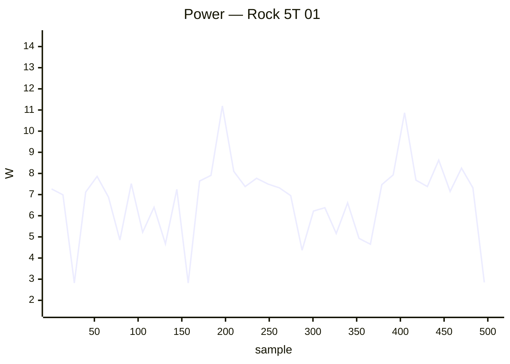
```mermaid
xychart-beta
    title "Power — Rock 5T 01"
    x-axis "sample" 1 --> 509
    y-axis "W" 1.5 --> 14.5
    line [7.27, 6.99, 2.82, 7.12, 7.86, 6.88, 4.85, 7.52, 5.22, 6.40, 4.67, 7.25, 2.82, 7.64, 7.91, 11.19, 8.10, 7.38, 7.77, 7.50, 7.32, 6.95, 4.37, 6.22, 6.38, 5.16, 6.61, 4.93, 4.65, 7.47, 7.93, 10.87, 7.68, 7.38, 8.63, 7.15, 8.25, 7.32, 2.85, 7.21]
```

### ❌ Rockpi E 01

`rockpi-e` · **inplace** · image `26.11.0-trunk.65` · 14 ✅ · 1 ❌ · 1 ⏭️

| Module | Status | Time | Detail |
|:--|:--:|--:|:--|
| upgrade | ⏭️ | 18.9 s | — |
| reboot | ✅ | 56.7 s | power-cycle · up 25 s |
| kernel-switch | ✅ | 41.7 s | branch=current · family=rockchip64 · installed=26.11.0-trunk.65 · boot_image=/boot/vmlinuz-6.18.54-current-rockchip64 · kernel_before=6.18.54-current-rockchip64 |
| reboot | ✅ | 161.0 s | power-cycle · 4/4 boots · up 25 s |
| hw-performance | ✅ | 31.9 s | AES 603 · mem 3300 · disk W 21 / R 22 MB/s · 60 °C · 1296 MHz |
| dvfs | ✅ | 26.2 s | ondemand · 408–1296 MHz (peak 1296) |
| network-iperf | ✅ | 103.0 s | end0 ↑941/↓941 (1GE) · end1 ↑94/↓94 (10/100ME) · wlx7ca7b020e87c ↑169/↓198 (Wi-Fi 5) Mbps |
| store-versions | ✅ | 5.4 s | 26.11.0-trunk.65 · 6.18.54-current-rockchip64 |
| kernel-switch | ❌ | 24.5 s | branch=edge · phase=install · dpkg_state=absent |
| reboot | ✅ | 162.3 s | power-cycle · 4/4 boots · up 25 s |
| hw-performance | ✅ | 31.8 s | AES 603 · mem 3300 · disk W 21 / R 23 MB/s · 61.2 °C · 1296 MHz |
| dvfs | ✅ | 25.5 s | ondemand · 408–1296 MHz (peak 1296) |
| network-iperf | ✅ | 87.8 s | end0 ↑941/↓941 (1GE) · end1 ↑94/↓94 (10/100ME) · wlx7ca7b020e87c ↑176/↓205 (Wi-Fi 5) Mbps |
| store-versions | ✅ | 5.6 s | 26.11.0-trunk.65 · 6.18.54-current-rockchip64 |
| kernel-switch | ✅ | 41.3 s | branch=current · family=rockchip64 · installed=26.11.0-trunk.65 · boot_image=/boot/vmlinuz-6.18.54-current-rockchip64 · kernel_before=6.18.54-current-rockchip64 |
| reboot | ✅ | 56.7 s | power-cycle · up 25 s |

### ❌ Rockpi S 01

`rockpi-s` · **inplace** · image `26.11.0-trunk.65` · 12 ✅ · 3 ❌ · 1 ⏭️

| Module | Status | Time | Detail |
|:--|:--:|--:|:--|
| upgrade | ⏭️ | 30.6 s | — |
| reboot | ✅ | 69.1 s | power-cycle · up 34 s |
| kernel-switch | ✅ | 71.7 s | branch=current · family=rockchip64 · installed=26.11.0-trunk.65 · boot_image=/boot/vmlinuz-6.18.54-current-rockchip64 · kernel_before=6.18.54-current-rockchip64 |
| reboot | ✅ | 194.6 s | power-cycle · 4/4 boots · up 34 s |
| hw-performance | ✅ | 41.0 s | AES 218 · mem 1300 · disk W 21 / R 22 MB/s · 53.8 °C · 1008 MHz |
| dvfs | ✅ | 35.9 s | ondemand · 408–1008 MHz (peak 1008) |
| network-iperf | ❌ | 137.9 s | end0 ↑94/↓94 (10/100ME) · wlan0 ↑0/↓1 (Wi-Fi 4) Mbps |
| store-versions | ✅ | 7.8 s | 26.11.0-trunk.65 · 6.18.54-current-rockchip64 |
| kernel-switch | ❌ | 43.5 s | branch=edge · phase=install · dpkg_state=absent |
| reboot | ✅ | 192.4 s | power-cycle · 4/4 boots · up 30 s |
| hw-performance | ✅ | 41.2 s | AES 218 · mem 1300 · disk W 21 / R 22 MB/s · 55.5 °C · 1008 MHz |
| dvfs | ✅ | 35.8 s | ondemand · 408–1008 MHz (peak 1008) |
| network-iperf | ❌ | 117.3 s | end0 ↑94/↓94 (10/100ME) · wlan0 ↑0/↓1 (Wi-Fi 4) Mbps |
| store-versions | ✅ | 7.6 s | 26.11.0-trunk.65 · 6.18.54-current-rockchip64 |
| kernel-switch | ✅ | 71.9 s | branch=current · family=rockchip64 · installed=26.11.0-trunk.65 · boot_image=/boot/vmlinuz-6.18.54-current-rockchip64 · kernel_before=6.18.54-current-rockchip64 |
| reboot | ✅ | 66.7 s | power-cycle · up 31 s |

**Power** — min 0.90 W · avg 1.50 W · peak 3.00 W · 916 samples

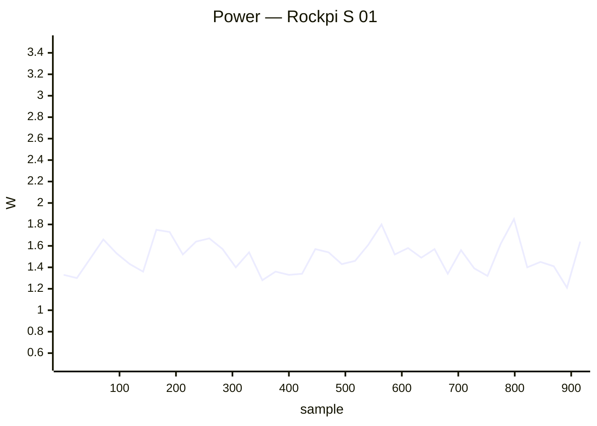
```mermaid
xychart-beta
    title "Power — Rockpi S 01"
    x-axis "sample" 1 --> 916
    y-axis "W" 0.5 --> 3.5
    line [1.33, 1.30, 1.48, 1.66, 1.53, 1.43, 1.36, 1.75, 1.73, 1.52, 1.64, 1.67, 1.57, 1.40, 1.54, 1.28, 1.36, 1.33, 1.34, 1.57, 1.54, 1.43, 1.46, 1.61, 1.80, 1.52, 1.58, 1.49, 1.57, 1.34, 1.56, 1.39, 1.32, 1.62, 1.85, 1.40, 1.45, 1.41, 1.21, 1.64]
```

### ❌ RockPro 64 01

`rockpro64` · **inplace** · image `26.11.0-trunk.65` · 14 ✅ · 1 ❌ · 1 ⏭️

| Module | Status | Time | Detail |
|:--|:--:|--:|:--|
| upgrade | ⏭️ | 37.4 s | — |
| reboot | ✅ | 65.6 s | power-cycle · up 30 s |
| kernel-switch | ✅ | 29.4 s | branch=current · family=rockchip64 · installed=26.11.0-trunk.65 · boot_image=/boot/vmlinuz-6.18.54-current-rockchip64 · kernel_before=6.18.54-current-rockchip64 |
| reboot | ✅ | 835.0 s | power-cycle · 1/4 boots · up 31 s |
| hw-performance | ✅ | 20.9 s | AES 1019 · mem 6600 · disk W 64 / R 120 MB/s · 50 °C · 1416 MHz |
| dvfs | ✅ | 21.5 s | ondemand · 408–1416 MHz (peak 1800) |
| network-iperf | ✅ | 63.0 s | end0 ↑941/↓941 (1GE) · wlan0 ↑108/↓115 (Wi-Fi 5) Mbps |
| store-versions | ✅ | 5.4 s | 26.11.0-trunk.65 · 6.18.54-current-rockchip64 |
| kernel-switch | ❌ | 18.1 s | branch=edge · phase=install · dpkg_state=absent |
| reboot | ✅ | 867.6 s | power-cycle · 1/4 boots · up 28 s |
| hw-performance | ✅ | 21.0 s | AES 1015 · mem 6600 · disk W 66 / R 120 MB/s · 50 °C · 1416 MHz |
| dvfs | ✅ | 21.4 s | ondemand · 408–1416 MHz (peak 1800) |
| network-iperf | ✅ | 60.7 s | end0 ↑941/↓941 (1GE) · wlan0 ↑106/↓103 (Wi-Fi 5) Mbps |
| store-versions | ✅ | 5.3 s | 26.11.0-trunk.65 · 6.18.54-current-rockchip64 |
| kernel-switch | ✅ | 29.3 s | branch=current · family=rockchip64 · installed=26.11.0-trunk.65 · boot_image=/boot/vmlinuz-6.18.54-current-rockchip64 · kernel_before=6.18.54-current-rockchip64 |
| reboot | ✅ | 65.2 s | power-cycle · up 30 s |

**Power** — min 2.90 W · avg 4.91 W · peak 9.20 W · 1698 samples

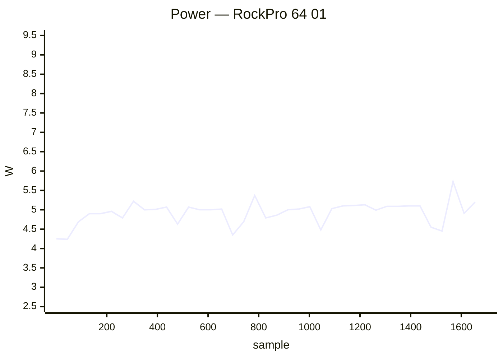
```mermaid
xychart-beta
    title "Power — RockPro 64 01"
    x-axis "sample" 1 --> 1698
    y-axis "W" 2.5 --> 9.5
    line [4.25, 4.24, 4.69, 4.90, 4.90, 4.96, 4.79, 5.22, 5.00, 5.01, 5.07, 4.63, 5.07, 5.00, 5.00, 5.02, 4.35, 4.69, 5.37, 4.79, 4.86, 5.00, 5.02, 5.08, 4.48, 5.03, 5.10, 5.11, 5.13, 4.99, 5.09, 5.09, 5.10, 5.10, 4.55, 4.45, 5.73, 4.91, 5.20, 4.29]
```

### ❌ SpacemiT MusePi Pro 01

`musepipro` · **inplace** · image `26.11.0-trunk.62` · 0 ✅ · 1 ❌ · 0 ⏭️

| Module | Status | Time | Detail |
|:--|:--:|--:|:--|
| reachable | ❌ | 0.0 s | ip=10.0.50.30 · reachable=False · port=22 |

**Power** — min 2.60 W · avg 2.60 W · peak 2.60 W · 42 samples

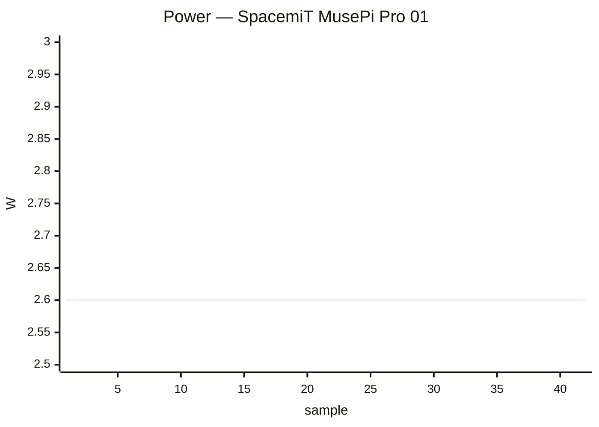
```mermaid
xychart-beta
    title "Power — SpacemiT MusePi Pro 01"
    x-axis "sample" 1 --> 42
    y-axis "W" 2.5 --> 3.0
    line [2.60, 2.60, 2.60, 2.60, 2.60, 2.60, 2.60, 2.60, 2.60, 2.60, 2.60, 2.60, 2.60, 2.60, 2.60, 2.60, 2.60, 2.60, 2.60, 2.60, 2.60, 2.60, 2.60, 2.60, 2.60, 2.60, 2.60, 2.60, 2.60, 2.60, 2.60, 2.60, 2.60, 2.60, 2.60, 2.60, 2.60, 2.60, 2.60, 2.60]
```

### ❌ Tinker Board 01

`tinkerboard` · **inplace** · image `26.11.0-trunk.65` · 14 ✅ · 1 ❌ · 1 ⏭️

| Module | Status | Time | Detail |
|:--|:--:|--:|:--|
| upgrade | ⏭️ | 11.6 s | — |
| reboot | ✅ | 63.3 s | power-cycle · up 28 s |
| kernel-switch | ✅ | 29.5 s | branch=current · family=rockchip · installed=26.11.0-trunk.65 · boot_image=/boot/vmlinuz-6.18.54-current-rockchip · kernel_before=6.18.54-current-rockchip |
| reboot | ✅ | 164.6 s | power-cycle · 4/4 boots · up 29 s |
| hw-performance | ✅ | 28.5 s | AES 67 · mem 3300 · disk W 13 / R 63 MB/s · 57.7 °C · 1800 MHz |
| dvfs | ✅ | 20.1 s | ondemand · 600–1800 MHz (peak 1800) |
| network-iperf | ✅ | 59.3 s | end0 ↑941/↓941 (1GE) · wlan0 ↑29/↓30 (Wi-Fi 4) Mbps |
| store-versions | ✅ | 4.5 s | 26.11.0-trunk.65 · 6.18.54-current-rockchip |
| kernel-switch | ❌ | 19.4 s | branch=edge · phase=install · dpkg_state=absent |
| reboot | ✅ | 169.2 s | power-cycle · 4/4 boots · up 28 s |
| hw-performance | ✅ | 28.2 s | AES 68 · mem 3300 · disk W 14 / R 63 MB/s · 61.7 °C · 1800 MHz |
| dvfs | ✅ | 20.3 s | ondemand · 600–1800 MHz (peak 1800) |
| network-iperf | ✅ | 57.7 s | end0 ↑941/↓941 (1GE) · wlan0 ↑25/↓36 (Wi-Fi 4) Mbps |
| store-versions | ✅ | 4.7 s | 26.11.0-trunk.65 · 6.18.54-current-rockchip |
| kernel-switch | ✅ | 30.1 s | branch=current · family=rockchip · installed=26.11.0-trunk.65 · boot_image=/boot/vmlinuz-6.18.54-current-rockchip · kernel_before=6.18.54-current-rockchip |
| reboot | ✅ | 60.2 s | power-cycle · up 29 s |

**Power** — min 1.30 W · avg 3.83 W · peak 9.10 W · 611 samples

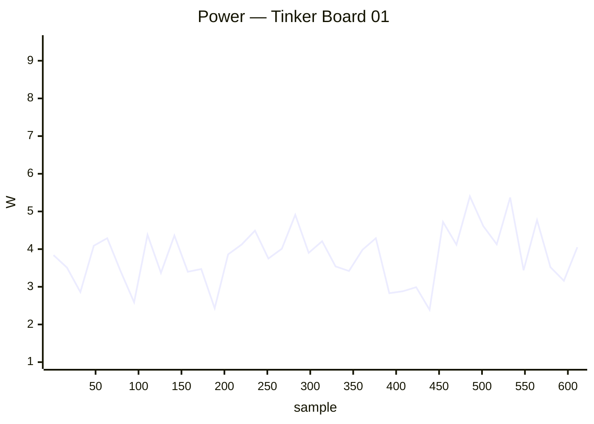
```mermaid
xychart-beta
    title "Power — Tinker Board 01"
    x-axis "sample" 1 --> 611
    y-axis "W" 1.0 --> 9.5
    line [3.84, 3.51, 2.86, 4.09, 4.29, 3.41, 2.59, 4.38, 3.37, 4.36, 3.40, 3.47, 2.43, 3.86, 4.12, 4.49, 3.75, 4.01, 4.91, 3.90, 4.21, 3.54, 3.42, 3.98, 4.29, 2.83, 2.88, 2.99, 2.39, 4.72, 4.12, 5.40, 4.61, 4.13, 5.37, 3.44, 4.77, 3.52, 3.16, 4.05]
```

### ❌ Udoo 01

`udoo` · **inplace** · image `26.11.0-trunk.62` · 14 ✅ · 1 ❌ · 1 ⏭️

| Module | Status | Time | Detail |
|:--|:--:|--:|:--|
| upgrade | ⏭️ | 34.5 s | — |
| reboot | ✅ | 72.6 s | power-cycle · up 34 s |
| kernel-switch | ✅ | 76.5 s | branch=current · family=imx6 · installed=26.11.0-trunk.65 · boot_image=/boot/vmlinuz-6.18.54-current-imx6 · kernel_before=6.18.54-current-imx6 |
| reboot | ✅ | 212.0 s | power-cycle · 4/4 boots · up 35 s |
| hw-performance | ✅ | 49.6 s | AES 26 · mem 766 · disk W 19 / R 20 MB/s · 50.9 °C · 996 MHz |
| dvfs | ✅ | 43.9 s | ondemand · 396–996 MHz (peak 996) |
| network-iperf | ✅ | 85.6 s | end0 ↑399/↓233 (1GE) · wlx7cdd903aa418 ↑31/↓28 (Wi-Fi 4) Mbps |
| store-versions | ✅ | 9.4 s | 26.11.0-trunk.62 · 6.18.54-current-imx6 |
| kernel-switch | ❌ | 50.5 s | branch=edge · phase=install · dpkg_state=absent |
| reboot | ✅ | 212.7 s | power-cycle · 4/4 boots · up 36 s |
| hw-performance | ✅ | 51.2 s | AES 26 · mem 657 · disk W 19 / R 20 MB/s · 52.1 °C · 996 MHz |
| dvfs | ✅ | 43.6 s | ondemand · 396–996 MHz (peak 996) |
| network-iperf | ✅ | 89.1 s | end0 ↑399/↓244 (1GE) · wlx7cdd903aa418 ↑24/↓28 (Wi-Fi 4) Mbps |
| store-versions | ✅ | 9.4 s | 26.11.0-trunk.62 · 6.18.54-current-imx6 |
| kernel-switch | ✅ | 74.3 s | branch=current · family=imx6 · installed=26.11.0-trunk.65 · boot_image=/boot/vmlinuz-6.18.54-current-imx6 · kernel_before=6.18.54-current-imx6 |
| reboot | ✅ | 70.2 s | power-cycle · up 34 s |

**Power** — min 1.30 W · avg 6.09 W · peak 8.30 W · 947 samples

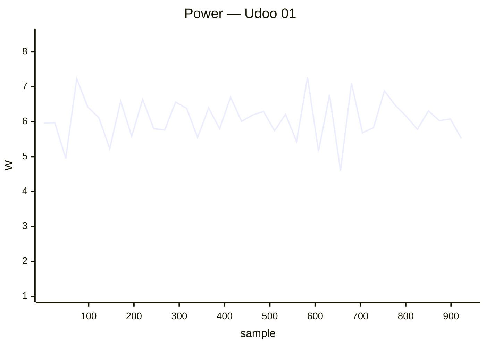
```mermaid
xychart-beta
    title "Power — Udoo 01"
    x-axis "sample" 1 --> 947
    y-axis "W" 1.0 --> 8.5
    line [5.96, 5.97, 4.95, 7.23, 6.42, 6.12, 5.23, 6.59, 5.58, 6.64, 5.80, 5.76, 6.56, 6.38, 5.55, 6.39, 5.80, 6.70, 6.01, 6.19, 6.29, 5.74, 6.21, 5.43, 7.27, 5.15, 6.77, 4.60, 7.10, 5.68, 5.83, 6.88, 6.46, 6.15, 5.78, 6.31, 6.03, 6.08, 5.52, 6.38]
```

### ❌ UEFI arm64 01

`uefi-arm64` · **inplace** · image `26.11.0-trunk.65` · 14 ✅ · 1 ❌ · 1 ⏭️

| Module | Status | Time | Detail |
|:--|:--:|--:|:--|
| upgrade | ⏭️ | 9.5 s | — |
| reboot | ✅ | 56.3 s | warm · up 35 s |
| kernel-switch | ✅ | 15.6 s | branch=current · family=arm64 · installed=26.11.0-trunk.65 · boot_image=/boot/vmlinuz-6.18.54-current-arm64 · kernel_before=6.18.54-current-arm64 |
| reboot | ✅ | 181.9 s | warm · 4/4 boots · up 32 s |
| hw-performance | ✅ | 15.0 s | AES 1402 · mem 13000 · disk W 1581 / R 2259 MB/s · 45 °C · 2600 MHz |
| dvfs | ✅ | 15.4 s | ondemand · 800–2600 MHz (peak 2600) |
| network-iperf | ✅ | 79.8 s | enp1s0 ↑8424/↓2766 (10GE) · enp49s0 ↑7413/↓9380 (10GE) · wlp97s0 ↑86/↓69 (Wi-Fi 6) Mbps |
| store-versions | ✅ | 4.3 s | 26.11.0-trunk.65 · 6.18.54-current-arm64 |
| kernel-switch | ❌ | 11.3 s | branch=edge · phase=install · dpkg_state=absent |
| reboot | ✅ | 185.4 s | warm · 4/4 boots · up 31 s |
| hw-performance | ✅ | 15.7 s | AES 1402 · mem 13000 · disk W 1569 / R 2088 MB/s · 45 °C · 2600 MHz |
| dvfs | ✅ | 15.0 s | ondemand · 800–2600 MHz (peak 2600) |
| network-iperf | ✅ | 79.4 s | enp1s0 ↑8401/↓2619 (10GE) · enp49s0 ↑8135/↓9370 (10GE) · wlp97s0 ↑108/↓79 (Wi-Fi 6) Mbps |
| store-versions | ✅ | 4.3 s | 26.11.0-trunk.65 · 6.18.54-current-arm64 |
| kernel-switch | ✅ | 15.9 s | branch=current · family=arm64 · installed=26.11.0-trunk.65 · boot_image=/boot/vmlinuz-6.18.54-current-arm64 · kernel_before=6.18.54-current-arm64 |
| reboot | ✅ | 58.4 s | warm · up 36 s |

### ❌ UEFI x86 01

`uefi-x86` · **inplace** · image `26.11.0-trunk.62` · 12 ✅ · 1 ❌ · 3 ⏭️

| Module | Status | Time | Detail |
|:--|:--:|--:|:--|
| upgrade | ⏭️ | 14.7 s | — |
| reboot | ✅ | 95.3 s | power-cycle · up 59 s |
| kernel-switch | ✅ | 35.4 s | branch=current · family=x86 · installed=26.11.0-trunk.65 · boot_image=/boot/vmlinuz-6.18.54-current-x86 · kernel_before=6.18.54-current-x86 |
| reboot | ✅ | 242.7 s | power-cycle · 4/4 boots · up 60 s |
| hw-performance | ✅ | 24.6 s | AES 234 · mem 5000 · disk W 26 / R 108 MB/s · 63 °C · 1920 MHz |
| dvfs | ➖ | 23.5 s | schedutil · 480–1920 MHz (peak 1703) · max_khz is single-core turbo, not an all-core target |
| network-iperf | ✅ | 64.0 s | enp1s0 ↑918/↓940 (1GE) · wlan0 ↑34/↓30 (Wi-Fi 5) Mbps |
| store-versions | ✅ | 5.4 s | 26.11.0-trunk.62 · 6.18.54-current-x86 |
| kernel-switch | ❌ | 23.5 s | branch=edge · phase=install · dpkg_state=absent |
| reboot | ✅ | 239.5 s | power-cycle · 4/4 boots · up 57 s |
| hw-performance | ✅ | 25.7 s | AES 237 · mem 4900 · disk W 26 / R 106 MB/s · 62 °C · 1920 MHz |
| dvfs | ➖ | 23.6 s | schedutil · 480–1920 MHz (peak 1758) · max_khz is single-core turbo, not an all-core target |
| network-iperf | ✅ | 62.6 s | enp1s0 ↑905/↓941 (1GE) · wlan0 ↑33/↓29 (Wi-Fi 5) Mbps |
| store-versions | ✅ | 6.0 s | 26.11.0-trunk.62 · 6.18.54-current-x86 |
| kernel-switch | ✅ | 34.3 s | branch=current · family=x86 · installed=26.11.0-trunk.65 · boot_image=/boot/vmlinuz-6.18.54-current-x86 · kernel_before=6.18.54-current-x86 |
| reboot | ✅ | 91.4 s | power-cycle · up 55 s |

**Power** — min 2.50 W · avg 4.17 W · peak 8.20 W · 792 samples

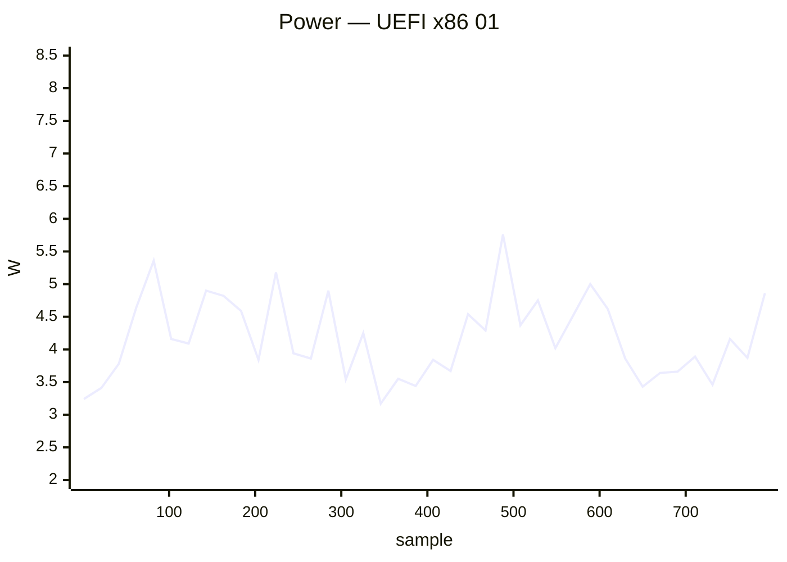
```mermaid
xychart-beta
    title "Power — UEFI x86 01"
    x-axis "sample" 1 --> 792
    y-axis "W" 2.0 --> 8.5
    line [3.24, 3.41, 3.78, 4.64, 5.36, 4.16, 4.09, 4.90, 4.82, 4.59, 3.84, 5.18, 3.94, 3.86, 4.90, 3.54, 4.25, 3.17, 3.55, 3.44, 3.84, 3.67, 4.54, 4.29, 5.76, 4.37, 4.75, 4.02, 4.51, 5.00, 4.62, 3.86, 3.43, 3.64, 3.66, 3.89, 3.46, 4.16, 3.87, 4.86]
```

### ❌ ZeroPi 01

`zeropi` · **inplace** · image `26.11.0-trunk.58` · 14 ✅ · 1 ❌ · 1 ⏭️

| Module | Status | Time | Detail |
|:--|:--:|--:|:--|
| upgrade | ⏭️ | 26.2 s | — |
| reboot | ✅ | 60.4 s | power-cycle · up 26 s |
| kernel-switch | ✅ | 62.7 s | branch=current · family=sunxi · installed=26.11.0-trunk.65 · boot_image=/boot/vmlinuz-6.18.54-current-sunxi · kernel_before=6.18.54-current-sunxi |
| reboot | ✅ | 169.0 s | power-cycle · 4/4 boots · up 25 s |
| hw-performance | ✅ | 39.5 s | AES 25 · mem 1500 · disk W 21 / R 23 MB/s · 48.5 °C · 1296 MHz |
| dvfs | ✅ | 34.3 s | ondemand · 480–1296 MHz (peak 1296) |
| network-iperf | ✅ | 41.2 s | end0 ↑642/↓939 (1GE) Mbps |
| store-versions | ✅ | 7.5 s | 26.11.0-trunk.58 · 6.18.54-current-sunxi |
| kernel-switch | ❌ | 38.2 s | branch=edge · phase=install · dpkg_state=absent |
| reboot | ✅ | 389.8 s | power-cycle · 3/4 boots · up 25 s |
| hw-performance | ✅ | 39.4 s | AES 25 · mem 1500 · disk W 21 / R 23 MB/s · 49.5 °C · 1296 MHz |
| dvfs | ✅ | 34.1 s | ondemand · 480–1296 MHz (peak 1296) |
| network-iperf | ✅ | 44.8 s | end0 ↑629/↓938 (1GE) Mbps |
| store-versions | ✅ | 7.5 s | 26.11.0-trunk.58 · 6.18.54-current-sunxi |
| kernel-switch | ✅ | 62.1 s | branch=current · family=sunxi · installed=26.11.0-trunk.65 · boot_image=/boot/vmlinuz-6.18.54-current-sunxi · kernel_before=6.18.54-current-sunxi |
| reboot | ✅ | 61.0 s | power-cycle · up 25 s |

**Power** — min 1.20 W · avg 2.20 W · peak 3.10 W · 893 samples

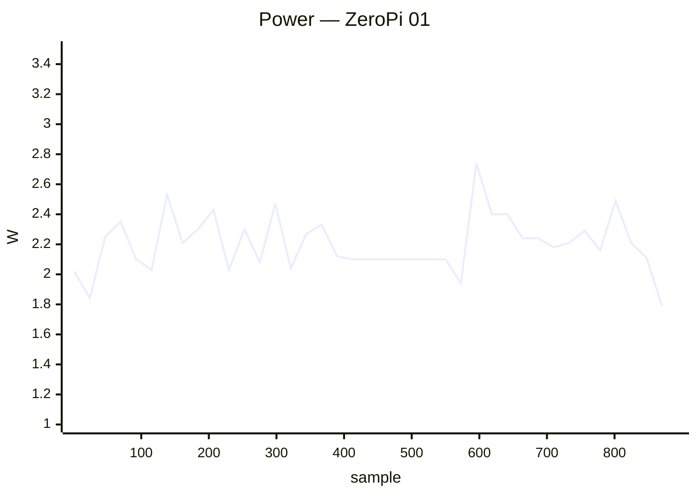
```mermaid
xychart-beta
    title "Power — ZeroPi 01"
    x-axis "sample" 1 --> 893
    y-axis "W" 1.0 --> 3.5
    line [2.02, 1.84, 2.25, 2.35, 2.10, 2.03, 2.53, 2.21, 2.30, 2.43, 2.03, 2.30, 2.08, 2.47, 2.04, 2.27, 2.33, 2.12, 2.10, 2.10, 2.10, 2.10, 2.10, 2.10, 2.10, 1.94, 2.74, 2.40, 2.40, 2.24, 2.24, 2.18, 2.21, 2.29, 2.16, 2.49, 2.21, 2.11, 1.79, 2.36]
```

## ✅ Passed (32)

### ✅ Arduino UNO Q 01

`arduino-uno-q` · **inplace** · image `26.11.0-trunk.62` · 8 ✅ · 0 ❌ · 0 ⏭️

| Module | Status | Time | Detail |
|:--|:--:|--:|:--|
| upgrade | ✅ | 270.6 s | nightly · 26.11.0-trunk.62 → 26.11.0-trunk.65 |
| reboot | ✅ | 58.6 s | warm · up 40 s |
| kernel-switch | ✅ | 58.2 s | branch=edge · family=qrb2210 · installed=26.11.0-trunk.65 · boot_image=? · kernel_before=7.2.3-edge-qrb2210 |
| reboot | ✅ | 201.3 s | warm · 4/4 boots · up 35 s |
| hw-performance | ✅ | 24.5 s | AES 934 · mem 5100 · disk W 173 / R 225 MB/s · 40 °C · 2016 MHz |
| dvfs | ✅ | 32.3 s | schedutil · 300–2016 MHz (peak 2016) |
| network-iperf | ✅ | 49.2 s | wlan0 ↑12/↓19 (Wi-Fi 5) · usb0 ↑?/↓? Mbps |
| store-versions | ✅ | 7.2 s | 26.11.0-trunk.65 · 7.2.3-edge-qrb2210 |

### ✅ Banana Pi CM4IO 01

`bananapicm4io` · **inplace** · image `26.8.3` · 14 ✅ · 2 ❌ · 0 ⏭️

| Module | Status | Time | Detail |
|:--|:--:|--:|:--|
| upgrade | ✅ | 291.4 s | nightly · 26.8.3 → 26.8.3 |
| reboot | ✅ | 48.3 s | power-cycle · up 22 s |
| kernel-switch | ✅ | 43.0 s | branch=current · family=meson64 · installed=26.11.0-trunk.65 · boot_image=/boot/vmlinuz-6.18.54-current-meson64 · kernel_before=6.18.54-current-meson64 |
| reboot | ✅ | 137.4 s | power-cycle · 4/4 boots · up 22 s |
| hw-performance | ✅ | 18.1 s | AES 852 · mem 3900 · disk W 32 / R 152 MB/s · 53.1 °C · 2016 MHz |
| dvfs | ✅ | 18.0 s | ondemand · 1000–1512 MHz (peak 1512) |
| network-iperf | ❌ | 273.2 s | eth0 ↑0/↓0 (1GE) · wlan0 ↑0/↓0 (Wi-Fi 5) Mbps |
| store-versions | ✅ | 4.6 s | 26.8.3 · 6.18.54-current-meson64 |
| kernel-switch | ✅ | 202.6 s | branch=edge · family=meson64 · installed=26.11.0-trunk.65 · boot_image=/boot/vmlinuz-7.2.8-edge-meson64 · kernel_before=6.18.54-current-meson64 |
| reboot | ✅ | 137.9 s | power-cycle · 4/4 boots · up 22 s |
| hw-performance | ✅ | 18.0 s | AES 852 · mem 3900 · disk W 36 / R 149 MB/s · 53.1 °C · 2016 MHz |
| dvfs | ✅ | 18.3 s | ondemand · 1000–1512 MHz (peak 1512) |
| network-iperf | ❌ | 297.8 s | eth0 ↑941/↓941 (1GE) · wlan0 ↑0/↓0 (Wi-Fi 5) Mbps |
| store-versions | ✅ | 3.8 s | 26.8.3 · 7.2.8-edge-meson64 |
| kernel-switch | ✅ | 200.6 s | branch=current · family=meson64 · installed=26.11.0-trunk.65 · boot_image=/boot/vmlinuz-6.18.54-current-meson64 · kernel_before=7.2.8-edge-meson64 |
| reboot | ✅ | 52.9 s | power-cycle · up 23 s |

### ✅ Banana Pi M2 Ultra 01

`bananapim2ultra` · **inplace** · image `26.11.0-trunk.62` · 16 ✅ · 0 ❌ · 0 ⏭️

| Module | Status | Time | Detail |
|:--|:--:|--:|:--|
| upgrade | ✅ | 392.1 s | nightly · 26.11.0-trunk.62 → 26.11.0-trunk.65 |
| reboot | ✅ | 43.9 s | warm · up 25 s |
| kernel-switch | ✅ | 68.6 s | branch=current · family=sunxi · installed=26.11.0-trunk.65 · boot_image=/boot/vmlinuz-6.18.54-current-sunxi · kernel_before=6.18.54-current-sunxi |
| reboot | ✅ | 161.0 s | warm · 4/4 boots · up 26 s |
| hw-performance | ✅ | 39.6 s | AES 23 · mem 2100 · disk W 9 / R 42 MB/s · 54.4 °C · 1200 MHz |
| dvfs | ✅ | 33.9 s | ondemand · 720–1200 MHz (peak 1200) |
| network-iperf | ✅ | 72.3 s | end0 ↑824/↓936 (1GE) · wlan0 ↑30/↓35 (Wi-Fi 4) Mbps |
| store-versions | ✅ | 7.4 s | 26.11.0-trunk.65 · 6.18.54-current-sunxi |
| kernel-switch | ✅ | 192.4 s | branch=edge · family=sunxi · installed=26.11.0-trunk.65 · boot_image=/boot/vmlinuz-7.2.8-edge-sunxi · kernel_before=6.18.54-current-sunxi |
| reboot | ✅ | 168.2 s | warm · 4/4 boots · up 31 s |
| hw-performance | ✅ | 42.4 s | AES 23 · mem 2100 · disk W 7 / R 42 MB/s · 52.8 °C · 1200 MHz |
| dvfs | ✅ | 37.1 s | ondemand · 720–1200 MHz (peak 1200) |
| network-iperf | ✅ | 87.7 s | end0 ↑817/↓941 (1GE) · wlan0 ↑33/↓17 (Wi-Fi 4) Mbps |
| store-versions | ✅ | 8.3 s | 26.11.0-trunk.65 · 7.2.8-edge-sunxi |
| kernel-switch | ✅ | 194.1 s | branch=current · family=sunxi · installed=26.11.0-trunk.65 · boot_image=/boot/vmlinuz-6.18.54-current-sunxi · kernel_before=7.2.8-edge-sunxi |
| reboot | ✅ | 45.1 s | warm · up 26 s |

### ✅ Banana Pi M2Pro 01

`bananapim2pro` · **inplace** · image `26.11.0-trunk.62` · 16 ✅ · 0 ❌ · 0 ⏭️

| Module | Status | Time | Detail |
|:--|:--:|--:|:--|
| upgrade | ✅ | 167.9 s | nightly · 26.11.0-trunk.62 → 26.11.0-trunk.65 |
| reboot | ✅ | 139.0 s | power-cycle · up 104 s |
| kernel-switch | ✅ | 34.5 s | branch=current · family=meson64 · installed=26.11.0-trunk.65 · boot_image=/boot/vmlinuz-6.18.54-current-meson64 · kernel_before=6.18.54-current-meson64 |
| reboot | ✅ | 465.0 s | power-cycle · 4/4 boots · up 104 s |
| hw-performance | ✅ | 19.4 s | AES 977 · mem 5300 · disk W 43 / R 157 MB/s · 48.4 °C · 2100 MHz |
| dvfs | ✅ | 19.4 s | ondemand · 1000–2100 MHz (peak 2100) |
| network-iperf | ✅ | 32.3 s | end0 ↑940/↓941 (1GE) Mbps |
| store-versions | ✅ | 5.0 s | 26.11.0-trunk.65 · 6.18.54-current-meson64 |
| kernel-switch | ✅ | 101.2 s | branch=edge · family=meson64 · installed=26.11.0-trunk.65 · boot_image=/boot/vmlinuz-7.2.8-edge-meson64 · kernel_before=6.18.54-current-meson64 |
| reboot | ✅ | 466.7 s | power-cycle · 4/4 boots · up 104 s |
| hw-performance | ✅ | 20.2 s | AES 978 · mem 5300 · disk W 42 / R 150 MB/s · 48 °C · 2100 MHz |
| dvfs | ✅ | 20.8 s | ondemand · 1000–2100 MHz (peak 2100) |
| network-iperf | ✅ | 30.2 s | end0 ↑941/↓941 (1GE) Mbps |
| store-versions | ✅ | 5.1 s | 26.11.0-trunk.65 · 7.2.8-edge-meson64 |
| kernel-switch | ✅ | 99.7 s | branch=current · family=meson64 · installed=26.11.0-trunk.65 · boot_image=/boot/vmlinuz-6.18.54-current-meson64 · kernel_before=7.2.8-edge-meson64 |
| reboot | ✅ | 138.8 s | power-cycle · up 104 s |

**Power** — min 1.40 W · avg 2.89 W · peak 4.70 W · 1412 samples

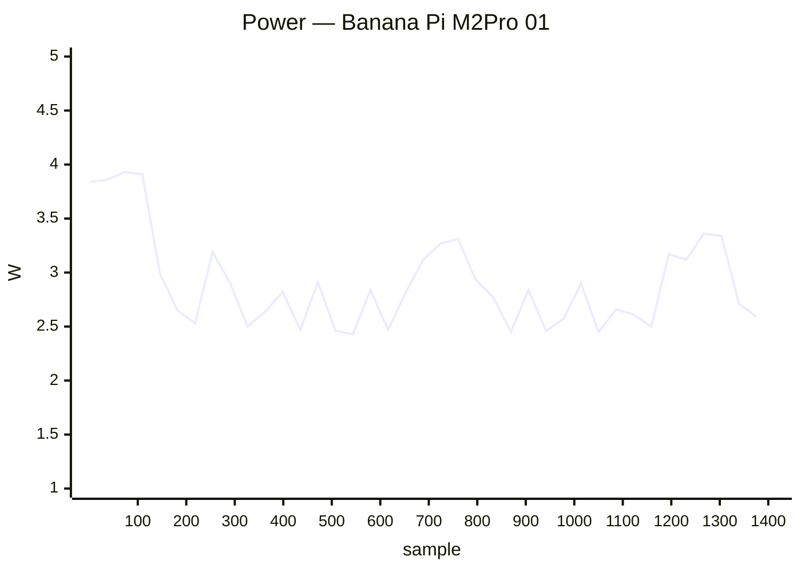
```mermaid
xychart-beta
    title "Power — Banana Pi M2Pro 01"
    x-axis "sample" 1 --> 1412
    y-axis "W" 1.0 --> 5.0
    line [3.84, 3.86, 3.93, 3.91, 2.99, 2.65, 2.53, 3.19, 2.90, 2.50, 2.64, 2.82, 2.47, 2.91, 2.46, 2.43, 2.84, 2.47, 2.81, 3.12, 3.27, 3.31, 2.93, 2.77, 2.45, 2.84, 2.46, 2.57, 2.90, 2.45, 2.66, 2.61, 2.50, 3.17, 3.12, 3.36, 3.34, 2.71, 2.59, 2.47]
```

### ✅ Banana Pi M7 01

`bananapim7` · **inplace** · image `26.11.0-trunk.62` · 22 ✅ · 0 ❌ · 0 ⏭️

| Module | Status | Time | Detail |
|:--|:--:|--:|:--|
| upgrade | ✅ | 74.6 s | nightly · 26.11.0-trunk.62 → 26.11.0-trunk.65 |
| reboot | ✅ | 42.0 s | power-cycle · up 16 s |
| kernel-switch | ✅ | 19.2 s | branch=vendor · family=rk35xx · installed=26.11.0-trunk.65 · boot_image=/boot/vmlinuz-6.1.172-vendor-rk35xx · kernel_before=6.1.172-vendor-rk35xx |
| reboot | ✅ | 102.4 s | power-cycle · 4/4 boots · up 15 s |
| hw-performance | ✅ | 13.6 s | AES 1260 · mem 15200 · disk W 960 / R 1293 MB/s · 56.4 °C · 1800 MHz |
| dvfs | ✅ | 17.0 s | ondemand · 1800–1800 MHz (peak 2256) |
| network-iperf | ✅ | 28.4 s | enP2p33s0 ↑941/↓941 (1GE) Mbps |
| store-versions | ✅ | 3.9 s | 26.11.0-trunk.65 · 6.1.172-vendor-rk35xx |
| kernel-switch | ✅ | 50.9 s | branch=current · family=rockchip64 · installed=26.11.0-trunk.65 · boot_image=/boot/vmlinuz-6.18.54-current-rockchip64 · kernel_before=6.1.172-vendor-rk35xx |
| reboot | ✅ | 662.6 s | power-cycle · 3/4 boots · up 97 s |
| hw-performance | ✅ | 13.4 s | AES 1257 · mem 10200 · disk W 1010 / R 1568 MB/s · 59.2 °C · 1800 MHz |
| dvfs | ✅ | 14.2 s | ondemand · 408–1800 MHz (peak 2400) |
| network-iperf | ✅ | 28.4 s | enP2p33s0 ↑941/↓941 (1GE) Mbps |
| store-versions | ✅ | 3.9 s | 26.11.0-trunk.65 · 6.18.54-current-rockchip64 |
| kernel-switch | ✅ | 40.6 s | branch=edge · family=rockchip64 · installed=26.11.0-trunk.65 · boot_image=/boot/vmlinuz-7.2.8-edge-rockchip64 · kernel_before=6.18.54-current-rockchip64 |
| reboot | ✅ | 442.7 s | power-cycle · 4/4 boots · up 97 s |
| hw-performance | ✅ | 14.0 s | AES 1257 · mem 8100 · disk W 817 / R 1590 MB/s · 59.2 °C · 1800 MHz |
| dvfs | ✅ | 14.0 s | ondemand · 408–1800 MHz (peak 2400) |
| network-iperf | ✅ | 29.9 s | enP2p33s0 ↑941/↓941 (1GE) Mbps |
| store-versions | ✅ | 4.1 s | 26.11.0-trunk.65 · 7.2.8-edge-rockchip64 |
| kernel-switch | ✅ | 38.6 s | branch=vendor · family=rk35xx · installed=26.11.0-trunk.65 · boot_image=/boot/vmlinuz-6.1.172-vendor-rk35xx · kernel_before=7.2.8-edge-rockchip64 |
| reboot | ✅ | 49.5 s | power-cycle · up 16 s |

**Power** — min 1.00 W · avg 5.79 W · peak 11.40 W · 1340 samples

```mermaid
xychart-beta
    title "Power — Banana Pi M7 01"
    x-axis "sample" 1 --> 1340
    y-axis "W" 0.5 --> 11.5
    line [5.52, 6.30, 5.45, 5.93, 5.16, 5.54, 6.16, 6.25, 5.97, 5.40, 5.40, 5.68, 5.50, 5.50, 5.50, 5.50, 6.12, 5.40, 5.38, 5.77, 5.67, 6.43, 5.40, 5.40, 7.08, 6.29, 6.58, 5.45, 5.40, 6.27, 5.40, 5.56, 5.53, 5.40, 5.80, 5.62, 5.60, 6.68, 7.10, 5.45]
```

### ✅ Banana Pi R3 Mini 01

`bananapir3mini` · **inplace** · image `26.11.0-trunk` · 4 ✅ · 0 ❌ · 2 ⏭️

| Module | Status | Time | Detail |
|:--|:--:|--:|:--|
| upgrade | ⏭️ | 18.5 s | — |
| reboot | ✅ | 65.6 s | power-cycle · up 34 s |
| hw-performance | ✅ | 25.8 s | AES 933 · mem 3200 · disk W 76 / R 91 MB/s · 66.3 °C · None MHz |
| dvfs | ➖ | 2.2 s | no cpufreq |
| network-iperf | ✅ | 108.7 s | eth0 ↑939/↓939 (1GE) · eth1 ↑938/↓916 (1GE) · wlan0 ↑10/↓13 (Wi-Fi 6) · wlan1 ↑359/↓261 (Wi-Fi 6) Mbps |
| store-versions | ✅ | 4.7 s | 26.11.0-trunk · 6.18.52-current-filogic-mt7986 |

**Power** — min 3.00 W · avg 7.59 W · peak 13.10 W · 192 samples

```mermaid
xychart-beta
    title "Power — Banana Pi R3 Mini 01"
    x-axis "sample" 1 --> 192
    y-axis "W" 2.5 --> 13.5
    line [5.90, 6.00, 5.90, 6.30, 6.32, 6.30, 6.06, 5.96, 5.82, 3.84, 4.00, 4.56, 5.88, 6.06, 7.64, 8.20, 8.10, 8.60, 8.60, 8.70, 8.60, 8.68, 8.54, 8.42, 8.46, 8.50, 8.26, 8.06, 8.26, 8.00, 7.78, 8.20, 8.88, 8.40, 8.30, 7.90, 13.10, 10.70, 9.20, 7.90]
```

### ✅ BananaPi BPI-F3 01

`musepipro` · **inplace** · image `26.11.0-trunk.62` · 6 ✅ · 0 ❌ · 0 ⏭️

| Module | Status | Time | Detail |
|:--|:--:|--:|:--|
| upgrade | ✅ | 201.6 s | nightly · 26.11.0-trunk.62 → 26.11.0-trunk.65 |
| reboot | ✅ | 54.0 s | power-cycle · up 18 s |
| hw-performance | ✅ | 25.5 s | AES 27 · mem 3000 · disk W 71 / R 82 MB/s · 48 °C · 1600 MHz |
| dvfs | ✅ | 24.0 s | performance · 614–1600 MHz (peak 1600) |
| network-iperf | ✅ | 90.4 s | eth0 ↑941/↓942 (1GE) · wlan0 ↑305/↓296 (Wi-Fi 6) · wlan1 ↑271/↓251 (Wi-Fi 5) Mbps |
| store-versions | ✅ | 6.8 s | 26.11.0-trunk.65 · 6.18.54-current-spacemit |

**Power** — min 3.20 W · avg 5.24 W · peak 8.40 W · 320 samples

```mermaid
xychart-beta
    title "Power — BananaPi BPI-F3 01"
    x-axis "sample" 1 --> 320
    y-axis "W" 3.0 --> 8.5
    line [4.76, 5.33, 5.16, 5.16, 5.12, 5.10, 5.00, 5.00, 5.15, 5.05, 5.15, 5.05, 5.15, 5.08, 6.29, 5.51, 5.05, 5.29, 5.05, 5.05, 4.99, 4.76, 4.48, 3.30, 4.30, 5.35, 5.20, 5.20, 6.92, 6.04, 5.08, 5.01, 5.30, 5.51, 6.08, 6.06, 5.32, 6.15, 5.67, 5.45]
```

### ✅ Clearfog Pro 01

`clearfogpro` · **inplace** · image `26.11.0-trunk.62` · 14 ✅ · 0 ❌ · 2 ⏭️

| Module | Status | Time | Detail |
|:--|:--:|--:|:--|
| upgrade | ✅ | 192.4 s | nightly · 26.11.0-trunk.62 → 26.11.0-trunk.65 |
| reboot | ✅ | 42.1 s | warm · up 22 s |
| kernel-switch | ✅ | 42.4 s | branch=current · family=mvebu · installed=26.11.0-trunk.65 · boot_image=/boot/vmlinuz-6.18.54-current-mvebu · kernel_before=6.18.54-current-mvebu |
| reboot | ✅ | 143.8 s | warm · 4/4 boots · up 22 s |
| hw-performance | ✅ | 41.6 s | AES 43 · mem 3800 · disk W 20 / R 23 MB/s · 65.1 °C · None MHz |
| dvfs | ➖ | 2.9 s | no cpufreq |
| network-iperf | ✅ | 35.7 s | lan2 ↑936/↓936 Mbps |
| store-versions | ✅ | 6.2 s | 26.11.0-trunk.65 · 6.18.54-current-mvebu |
| kernel-switch | ✅ | 106.7 s | branch=edge · family=mvebu · installed=26.11.0-trunk.65 · boot_image=/boot/vmlinuz-7.2.8-edge-mvebu · kernel_before=6.18.54-current-mvebu |
| reboot | ✅ | 140.7 s | warm · 4/4 boots · up 21 s |
| hw-performance | ✅ | 41.7 s | AES 43 · mem 3800 · disk W 21 / R 23 MB/s · 66.1 °C · None MHz |
| dvfs | ➖ | 3.1 s | no cpufreq |
| network-iperf | ✅ | 35.1 s | lan2 ↑936/↓936 Mbps |
| store-versions | ✅ | 6.2 s | 26.11.0-trunk.65 · 7.2.8-edge-mvebu |
| kernel-switch | ✅ | 106.6 s | branch=current · family=mvebu · installed=26.11.0-trunk.65 · boot_image=/boot/vmlinuz-6.18.54-current-mvebu · kernel_before=7.2.8-edge-mvebu |
| reboot | ✅ | 40.5 s | warm · up 21 s |

### ✅ Cubie A5E 01

`radxa-cubie-a5e` · **inplace** · image `26.11.0-trunk.62` · 14 ✅ · 0 ❌ · 2 ⏭️

| Module | Status | Time | Detail |
|:--|:--:|--:|:--|
| upgrade | ✅ | 597.2 s | nightly · 26.11.0-trunk.62 → 26.11.0-trunk.65 |
| reboot | ✅ | 64.3 s | power-cycle · up 32 s |
| kernel-switch | ✅ | 59.0 s | branch=current · family=sunxi64 · installed=26.11.0-trunk.65 · boot_image=? · kernel_before=6.18.54-current-sunxi64 |
| reboot | ✅ | 185.2 s | power-cycle · 4/4 boots · up 32 s |
| hw-performance | ✅ | 41.3 s | AES 358 · mem 2000 · disk W 21 / R 23 MB/s · 61.8 °C · None MHz |
| dvfs | ➖ | 2.8 s | no cpufreq |
| network-iperf | ✅ | 94.7 s | end0 ↑839/↓941 (1GE) · end1 ↑941/↓940 (1GE) · wlan0 ↑120/↓129 (Wi-Fi 6) Mbps |
| store-versions | ✅ | 5.8 s | 26.11.0-trunk.65 · 6.18.54-current-sunxi64 |
| kernel-switch | ✅ | 577.0 s | branch=edge · family=sunxi64 · installed=26.11.0-trunk.65 · boot_image=? · kernel_before=6.18.54-current-sunxi64 |
| reboot | ✅ | 188.0 s | power-cycle · 4/4 boots · up 32 s |
| hw-performance | ✅ | 41.7 s | AES 358 · mem 2000 · disk W 21 / R 23 MB/s · 66.2 °C · None MHz |
| dvfs | ➖ | 2.8 s | no cpufreq |
| network-iperf | ✅ | 119.3 s | end0 ↑836/↓940 (1GE) · end1 ↑941/↓940 (1GE) · wlan0 ↑120/↓127 (Wi-Fi 6) Mbps |
| store-versions | ✅ | 5.9 s | 26.11.0-trunk.65 · 7.2.8-edge-sunxi64 |
| kernel-switch | ✅ | 565.9 s | branch=current · family=sunxi64 · installed=26.11.0-trunk.65 · boot_image=? · kernel_before=7.2.8-edge-sunxi64 |
| reboot | ✅ | 64.7 s | power-cycle · up 33 s |

**Power** — min 1.70 W · avg 3.84 W · peak 6.10 W · 2102 samples

```mermaid
xychart-beta
    title "Power — Cubie A5E 01"
    x-axis "sample" 1 --> 2102
    y-axis "W" 1.5 --> 6.5
    line [3.45, 3.54, 3.56, 3.84, 3.54, 4.82, 3.87, 3.57, 3.63, 3.27, 3.42, 3.40, 3.22, 3.32, 3.51, 3.63, 3.58, 3.56, 3.66, 3.91, 4.98, 3.93, 4.84, 4.01, 3.61, 3.40, 3.48, 3.34, 3.78, 3.80, 3.83, 3.80, 3.85, 4.20, 5.14, 4.47, 5.08, 4.67, 3.90, 3.36]
```

### ✅ Cubietruck 01

`cubietruck` · **inplace** · image `26.11.0-trunk.62` · 16 ✅ · 0 ❌ · 0 ⏭️

| Module | Status | Time | Detail |
|:--|:--:|--:|:--|
| upgrade | ✅ | 432.8 s | nightly · 26.11.0-trunk.62 → 26.11.0-trunk.65 |
| reboot | ✅ | 71.6 s | warm · up 46 s |
| kernel-switch | ✅ | 93.1 s | branch=current · family=sunxi · installed=26.11.0-trunk.65 · boot_image=/boot/vmlinuz-6.18.54-current-sunxi · kernel_before=6.18.54-current-sunxi |
| reboot | ✅ | 255.4 s | warm · 4/4 boots · up 47 s |
| hw-performance | ✅ | 59.3 s | AES 17 · mem 1700 · disk W 14 / R 22 MB/s · 48.9 °C · 960 MHz |
| dvfs | ✅ | 56.5 s | ondemand · 528–960 MHz (peak 960) |
| network-iperf | ✅ | 167.8 s | end0 ↑730/↓826 (1GE) · wlan0 ↑19/↓24 (Wi-Fi 4) Mbps |
| store-versions | ✅ | 11.6 s | 26.11.0-trunk.65 · 6.18.54-current-sunxi |
| kernel-switch | ✅ | 238.2 s | branch=edge · family=sunxi · installed=26.11.0-trunk.65 · boot_image=/boot/vmlinuz-7.2.8-edge-sunxi · kernel_before=6.18.54-current-sunxi |
| reboot | ✅ | 249.9 s | warm · 4/4 boots · up 43 s |
| hw-performance | ✅ | 57.8 s | AES 19 · mem 1700 · disk W 14 / R 22 MB/s · 48.8 °C · 960 MHz |
| dvfs | ✅ | 56.9 s | ondemand · 528–960 MHz (peak 960) |
| network-iperf | ✅ | 117.1 s | end0 ↑774/↓928 (1GE) · wlan0 ↑18/↓24 (Wi-Fi 4) Mbps |
| store-versions | ✅ | 11.6 s | 26.11.0-trunk.65 · 7.2.8-edge-sunxi |
| kernel-switch | ✅ | 228.5 s | branch=current · family=sunxi · installed=26.11.0-trunk.65 · boot_image=/boot/vmlinuz-6.18.54-current-sunxi · kernel_before=7.2.8-edge-sunxi |
| reboot | ✅ | 70.5 s | warm · up 46 s |

### ✅ Cubox i2eX/i4 01

`cubox-i` · **inplace** · image `26.11.0-trunk.62` · 16 ✅ · 0 ❌ · 0 ⏭️

| Module | Status | Time | Detail |
|:--|:--:|--:|:--|
| upgrade | ✅ | 452.4 s | nightly · 26.11.0-trunk.62 → 26.11.0-trunk.65 |
| reboot | ✅ | 82.3 s | power-cycle · up 45 s |
| kernel-switch | ✅ | 73.0 s | branch=current · family=imx6 · installed=26.11.0-trunk.65 · boot_image=/boot/vmlinuz-6.18.54-current-imx6 · kernel_before=6.18.54-current-imx6 |
| reboot | ✅ | 255.2 s | power-cycle · 4/4 boots · up 43 s |
| hw-performance | ✅ | 46.9 s | AES 26 · mem 766 · disk W 19 / R 20 MB/s · 50.9 °C · 996 MHz |
| dvfs | ✅ | 40.6 s | ondemand · 396–996 MHz (peak 996) |
| network-iperf | ✅ | 108.5 s | end0 ↑94/↓94 (10/100ME) · wlan0 ↑20/↓15 (Wi-Fi 4) Mbps |
| store-versions | ✅ | 8.8 s | 26.11.0-trunk.65 · 6.18.54-current-imx6 |
| kernel-switch | ✅ | 267.6 s | branch=edge · family=imx6 · installed=26.11.0-trunk.65 · boot_image=/boot/vmlinuz-7.1.13-edge-imx6 · kernel_before=6.18.54-current-imx6 |
| reboot | ✅ | 279.8 s | power-cycle · 4/4 boots · up 43 s |
| hw-performance | ✅ | 47.3 s | AES 26 · mem 704 · disk W 19 / R 20 MB/s · 52 °C · 996 MHz |
| dvfs | ✅ | 45.6 s | ondemand · 396–996 MHz (peak 996) |
| network-iperf | ✅ | 82.4 s | end0 ↑94/↓94 (10/100ME) · wlan0 ↑19/↓20 (Wi-Fi 4) Mbps |
| store-versions | ✅ | 8.7 s | 26.11.0-trunk.65 · 7.1.13-edge-imx6 |
| kernel-switch | ✅ | 266.3 s | branch=current · family=imx6 · installed=26.11.0-trunk.65 · boot_image=/boot/vmlinuz-6.18.54-current-imx6 · kernel_before=7.1.13-edge-imx6 |
| reboot | ✅ | 77.7 s | power-cycle · up 42 s |

**Power** — min 1.80 W · avg 3.43 W · peak 6.00 W · 1725 samples

```mermaid
xychart-beta
    title "Power — Cubox i2eX/i4 01"
    x-axis "sample" 1 --> 1725
    y-axis "W" 1.5 --> 6.5
    line [3.19, 3.43, 3.34, 3.10, 3.42, 3.91, 3.47, 3.02, 3.05, 3.13, 3.65, 3.29, 3.71, 3.46, 3.75, 3.70, 3.44, 3.51, 3.31, 2.92, 3.47, 3.58, 3.49, 2.97, 3.40, 3.51, 3.79, 2.91, 4.02, 3.85, 3.37, 3.43, 3.37, 3.20, 3.68, 3.42, 3.34, 3.25, 3.06, 4.18]
```

### ✅ Espressobin 01

`espressobin` · **inplace** · image `26.11.0-trunk.62` · 16 ✅ · 0 ❌ · 0 ⏭️

| Module | Status | Time | Detail |
|:--|:--:|--:|:--|
| upgrade | ✅ | 722.3 s | nightly · 26.11.0-trunk.62 → 26.11.0-trunk.65 |
| reboot | ✅ | 72.7 s | power-cycle · up 42 s |
| kernel-switch | ✅ | 109.1 s | branch=current · family=mvebu64 · installed=26.11.0-trunk.65 · boot_image=/boot/vmlinuz-6.18.54-current-mvebu64 · kernel_before=6.18.54-current-mvebu64 |
| reboot | ✅ | 236.8 s | power-cycle · 4/4 boots · up 42 s |
| hw-performance | ✅ | 36.8 s | AES 366 · mem 1900 · disk W 20 / R 138 MB/s · None °C · 800 MHz |
| dvfs | ✅ | 34.9 s | ondemand · 200–800 MHz (peak 800) |
| network-iperf | ✅ | 43.9 s | lan0 ↑936/↓740 (1GE) Mbps |
| store-versions | ✅ | 8.2 s | 26.11.0-trunk.65 · 6.18.54-current-mvebu64 |
| kernel-switch | ✅ | 417.2 s | branch=edge · family=mvebu64 · installed=26.11.0-trunk.65 · boot_image=/boot/vmlinuz-7.1.13-edge-mvebu64 · kernel_before=6.18.54-current-mvebu64 |
| reboot | ✅ | 235.1 s | power-cycle · 4/4 boots · up 42 s |
| hw-performance | ✅ | 38.1 s | AES 357 · mem 1900 · disk W 17 / R 131 MB/s · None °C · 800 MHz |
| dvfs | ✅ | 35.6 s | ondemand · 200–800 MHz (peak 800) |
| network-iperf | ✅ | 39.8 s | lan0 ↑936/↓766 (1GE) Mbps |
| store-versions | ✅ | 8.2 s | 26.11.0-trunk.65 · 7.1.13-edge-mvebu64 |
| kernel-switch | ✅ | 412.9 s | branch=current · family=mvebu64 · installed=26.11.0-trunk.65 · boot_image=/boot/vmlinuz-6.18.54-current-mvebu64 · kernel_before=7.1.13-edge-mvebu64 |
| reboot | ✅ | 71.6 s | power-cycle · up 41 s |

### ✅ Helios4 01

`helios4` · **inplace** · image `26.11.0-trunk.62` · 14 ✅ · 0 ❌ · 2 ⏭️

| Module | Status | Time | Detail |
|:--|:--:|--:|:--|
| upgrade | ✅ | 183.9 s | nightly · 26.11.0-trunk.62 → 26.11.0-trunk.65 |
| reboot | ✅ | 120.0 s | warm · up 103 s |
| kernel-switch | ✅ | 36.3 s | branch=current · family=mvebu · installed=26.11.0-trunk.65 · boot_image=/boot/vmlinuz-6.18.54-current-mvebu · kernel_before=6.18.54-current-mvebu |
| reboot | ✅ | 463.3 s | warm · 4/4 boots · up 102 s |
| hw-performance | ✅ | 36.5 s | AES 43 · mem 3800 · disk W 21 / R 23 MB/s · 55.1 °C · None MHz |
| dvfs | ➖ | 3.1 s | no cpufreq |
| network-iperf | ✅ | 31.5 s | end1 ↑939/↓939 (1GE) Mbps |
| store-versions | ✅ | 4.9 s | 26.11.0-trunk.65 · 6.18.54-current-mvebu |
| kernel-switch | ✅ | 101.3 s | branch=edge · family=mvebu · installed=26.11.0-trunk.65 · boot_image=/boot/vmlinuz-7.2.8-edge-mvebu · kernel_before=6.18.54-current-mvebu |
| reboot | ✅ | 464.7 s | warm · 4/4 boots · up 103 s |
| hw-performance | ✅ | 37.3 s | AES 43 · mem 3800 · disk W 21 / R 23 MB/s · 54.2 °C · None MHz |
| dvfs | ➖ | 2.4 s | no cpufreq |
| network-iperf | ✅ | 46.4 s | end1 ↑939/↓936 (1GE) Mbps |
| store-versions | ✅ | 5.0 s | 26.11.0-trunk.65 · 7.2.8-edge-mvebu |
| kernel-switch | ✅ | 95.7 s | branch=current · family=mvebu · installed=26.11.0-trunk.65 · boot_image=/boot/vmlinuz-6.18.54-current-mvebu · kernel_before=7.2.8-edge-mvebu |
| reboot | ✅ | 121.6 s | warm · up 104 s |

### ✅ Inovato Quadra 01

`inovato-quadra` · **inplace** · image `26.11.0-trunk.62` · 16 ✅ · 0 ❌ · 0 ⏭️

| Module | Status | Time | Detail |
|:--|:--:|--:|:--|
| upgrade | ✅ | 206.1 s | nightly · ? → 26.11.0-trunk.65 |
| reboot | ✅ | 55.1 s | power-cycle · up 24 s |
| kernel-switch | ✅ | 43.2 s | branch=current · family=sunxi64 · installed=26.11.0-trunk.65 · boot_image=/boot/vmlinuz-6.18.54-current-sunxi64 · kernel_before=6.18.54-current-sunxi64 |
| reboot | ✅ | 151.7 s | power-cycle · 4/4 boots · up 24 s |
| hw-performance | ✅ | 30.3 s | AES 794 · mem 2800 · disk W 22 / R 23 MB/s · 66.5 °C · 1704 MHz |
| dvfs | ✅ | 21.7 s | ondemand · 480–1704 MHz (peak 1704) |
| network-iperf | ✅ | 60.6 s | eth0 ↑94/↓94 (10/100ME) · wlan0 ↑13/↓21 (Wi-Fi 4) Mbps |
| store-versions | ✅ | 4.7 s | 26.11.0-trunk.65 · 6.18.54-current-sunxi64 |
| kernel-switch | ✅ | 114.4 s | branch=edge · family=sunxi64 · installed=26.11.0-trunk.65 · boot_image=/boot/vmlinuz-7.2.8-edge-sunxi64 · kernel_before=6.18.54-current-sunxi64 |
| reboot | ✅ | 150.8 s | power-cycle · 4/4 boots · up 23 s |
| hw-performance | ✅ | 30.9 s | AES 794 · mem 2800 · disk W 14 / R 23 MB/s · 67.6 °C · 1704 MHz |
| dvfs | ✅ | 22.3 s | ondemand · 480–1704 MHz (peak 1704) |
| network-iperf | ✅ | 59.1 s | eth0 ↑94/↓94 (10/100ME) · wlan0 ↑7/↓18 (Wi-Fi 4) Mbps |
| store-versions | ✅ | 4.7 s | 26.11.0-trunk.65 · 7.2.8-edge-sunxi64 |
| kernel-switch | ✅ | 119.3 s | branch=current · family=sunxi64 · installed=26.11.0-trunk.65 · boot_image=/boot/vmlinuz-6.18.54-current-sunxi64 · kernel_before=7.2.8-edge-sunxi64 |
| reboot | ✅ | 54.9 s | power-cycle · up 24 s |

**Power** — min 1.90 W · avg 4.05 W · peak 6.70 W · 912 samples

```mermaid
xychart-beta
    title "Power — Inovato Quadra 01"
    x-axis "sample" 1 --> 912
    y-axis "W" 1.5 --> 7.0
    line [3.98, 3.96, 4.22, 4.14, 4.10, 4.39, 4.13, 3.99, 3.26, 4.47, 4.24, 3.26, 3.91, 3.67, 4.33, 4.08, 4.49, 4.86, 4.08, 3.86, 4.28, 4.49, 4.06, 4.17, 3.91, 3.35, 4.22, 4.17, 3.44, 3.97, 4.15, 4.73, 3.87, 3.81, 4.29, 4.05, 4.29, 4.16, 3.66, 3.46]
```

### ✅ Khadas Edge2 01

`khadas-edge2` · **inplace** · image `26.11.0-trunk.62` · 14 ✅ · 0 ❌ · 2 ⏭️

| Module | Status | Time | Detail |
|:--|:--:|--:|:--|
| upgrade | ✅ | 120.1 s | nightly · 26.11.0-trunk.62 → 26.11.0-trunk.65 |
| reboot | ✅ | 29.6 s | warm · up 12 s |
| kernel-switch | ✅ | 25.3 s | branch=vendor · family=rk35xx · installed=26.11.0-trunk.65 · boot_image=/boot/vmlinuz-6.1.172-vendor-rk35xx · kernel_before=6.1.172-vendor-rk35xx |
| reboot | ✅ | 118.2 s | warm · 4/4 boots · up 15 s |
| hw-performance | ✅ | 15.5 s | AES 1277 · mem 15000 · disk W 104 / R 259 MB/s · 37.9 °C · 1800 MHz |
| dvfs | ✅ | 18.3 s | ondemand · 1800–1800 MHz (peak 2256) |
| network-iperf | ⏭️ | 6.9 s | no cabled interfaces |
| store-versions | ✅ | 4.3 s | 26.11.0-trunk.65 · 6.1.172-vendor-rk35xx |
| kernel-switch | ✅ | 75.2 s | branch=current · family=rockchip64 · installed=26.11.0-trunk.65 · boot_image=/boot/vmlinuz-6.18.54-current-rockchip64 · kernel_before=6.1.172-vendor-rk35xx |
| reboot | ✅ | 106.1 s | warm · 4/4 boots · up 9 s |
| hw-performance | ✅ | 15.5 s | AES 1273 · mem 8600 · disk W 103 / R 240 MB/s · 40.7 °C · 1800 MHz |
| dvfs | ✅ | 14.4 s | ondemand · 408–1800 MHz (peak 2400) |
| network-iperf | ⏭️ | 6.5 s | no cabled interfaces |
| store-versions | ✅ | 4.1 s | 26.11.0-trunk.65 · 6.18.54-current-rockchip64 |
| kernel-switch | ✅ | 59.9 s | branch=vendor · family=rk35xx · installed=26.11.0-trunk.65 · boot_image=/boot/vmlinuz-6.1.172-vendor-rk35xx · kernel_before=6.18.54-current-rockchip64 |
| reboot | ✅ | 28.3 s | warm · up 10 s |

### ✅ Khadas VIM2 01

`khadas-vim2` · **inplace** · image `26.11.0-trunk.62` · 16 ✅ · 0 ❌ · 0 ⏭️

| Module | Status | Time | Detail |
|:--|:--:|--:|:--|
| upgrade | ✅ | 307.4 s | nightly · 26.11.0-trunk.62 → 26.11.0-trunk.65 |
| reboot | ✅ | 41.6 s | warm · up 24 s |
| kernel-switch | ✅ | 70.1 s | branch=current · family=meson64 · installed=26.11.0-trunk.65 · boot_image=/boot/vmlinuz-6.18.54-current-meson64 · kernel_before=6.18.54-current-meson64 |
| reboot | ✅ | 152.5 s | warm · 4/4 boots · up 25 s |
| hw-performance | ✅ | 24.1 s | AES 653 · mem 3500 · disk W 41 / R 151 MB/s · 55 °C · 1512 MHz |
| dvfs | ✅ | 24.9 s | ondemand · 500–1512 MHz (peak 1512) |
| network-iperf | ✅ | 64.5 s | eth0 ↑939/↓941 (1GE) · wlan0 ↑103/↓89 (Wi-Fi 5) Mbps |
| store-versions | ✅ | 5.8 s | 26.11.0-trunk.65 · 6.18.54-current-meson64 |
| kernel-switch | ✅ | 196.4 s | branch=edge · family=meson64 · installed=26.11.0-trunk.65 · boot_image=/boot/vmlinuz-7.2.8-edge-meson64 · kernel_before=6.18.54-current-meson64 |
| reboot | ✅ | 154.6 s | warm · 4/4 boots · up 26 s |
| hw-performance | ✅ | 25.2 s | AES 654 · mem 3500 · disk W 41 / R 137 MB/s · 55 °C · 1512 MHz |
| dvfs | ✅ | 26.0 s | ondemand · 500–1512 MHz (peak 1512) |
| network-iperf | ✅ | 69.9 s | eth0 ↑941/↓941 (1GE) · wlan0 ↑88/↓62 (Wi-Fi 5) Mbps |
| store-versions | ✅ | 5.7 s | 26.11.0-trunk.65 · 7.2.8-edge-meson64 |
| kernel-switch | ✅ | 196.1 s | branch=current · family=meson64 · installed=26.11.0-trunk.65 · boot_image=/boot/vmlinuz-6.18.54-current-meson64 · kernel_before=7.2.8-edge-meson64 |
| reboot | ✅ | 39.0 s | warm · up 22 s |

### ✅ Khadas VIM4 01

`khadas-vim4` · **inplace** · image `26.11.0-trunk.51` · 8 ✅ · 0 ❌ · 0 ⏭️

| Module | Status | Time | Detail |
|:--|:--:|--:|:--|
| upgrade | ✅ | 131.8 s | nightly · 26.11.0-trunk.51 → 26.11.0-trunk.54 |
| reboot | ✅ | 53.6 s | power-cycle · up 20 s |
| kernel-switch | ✅ | 24.3 s | branch=legacy · family=meson-s4t7 · installed=26.11.0-trunk.54 · boot_image=vmlinuz-5.15.137-legacy-meson-s4t7 · kernel_before=5.15.137-legacy-meson-s4t7 |
| reboot | ✅ | 52.8 s | power-cycle · up 19 s |
| hw-performance | ✅ | 19.8 s | AES 1246 · mem 6800 · disk W 106 / R 169 MB/s · 47.4 °C · 2208 MHz |
| dvfs | ✅ | 22.4 s | ondemand · 500–2208 MHz (peak 2208) |
| network-iperf | ✅ | 106.6 s | eth0 ↑927/↓935 (1GE) · wlan0 ↑5/↓2 (Wi-Fi 6) · wlan1 ↑77/↓3 (Wi-Fi 6) Mbps |
| store-versions | ✅ | 5.0 s | 26.11.0-trunk.54 · 5.15.137-legacy-meson-s4t7 |

**Power** — min 0.60 W · avg 3.93 W · peak 8.40 W · 336 samples

```mermaid
xychart-beta
    title "Power — Khadas VIM4 01"
    x-axis "sample" 1 --> 336
    y-axis "W" 0.5 --> 8.5
    line [3.20, 3.85, 4.13, 4.23, 4.00, 4.31, 4.14, 4.14, 4.20, 4.04, 3.90, 3.86, 4.10, 4.08, 3.38, 2.85, 2.74, 3.68, 4.25, 4.27, 4.16, 3.50, 3.47, 3.75, 4.59, 4.41, 4.10, 4.94, 5.27, 3.80, 3.73, 3.88, 3.91, 3.47, 3.60, 3.65, 3.51, 4.26, 4.00, 3.63]
```

### ✅ Mekotronics R58HD 01

`mekotronics-r58hd` · **inplace** · image `26.11.0-trunk.62` · 6 ✅ · 0 ❌ · 0 ⏭️

| Module | Status | Time | Detail |
|:--|:--:|--:|:--|
| upgrade | ✅ | 93.2 s | nightly · 26.11.0-trunk.62 → 26.11.0-trunk.65 |
| reboot | ✅ | 45.4 s | power-cycle · up 14 s |
| hw-performance | ✅ | 14.1 s | AES 1303 · mem 16000 · disk W 250 / R 288 MB/s · 47.2 °C · 1800 MHz |
| dvfs | ✅ | 16.9 s | ondemand · 1800–1800 MHz (peak 2304) |
| network-iperf | ✅ | 53.2 s | end0 ↑936/↓928 (1GE) · enP3p49s0 ↑783/↓823 (1GE) Mbps |
| store-versions | ✅ | 3.7 s | 26.11.0-trunk.65 · 6.1.172-vendor-rk35xx |

**Power** — min 3.90 W · avg 6.12 W · peak 12.00 W · 189 samples

```mermaid
xychart-beta
    title "Power — Mekotronics R58HD 01"
    x-axis "sample" 1 --> 189
    y-axis "W" 3.5 --> 12.5
    line [5.20, 5.20, 5.48, 6.10, 6.62, 6.16, 5.78, 6.50, 6.20, 7.00, 6.80, 6.48, 5.44, 6.72, 6.75, 6.16, 6.32, 6.98, 6.40, 5.20, 4.94, 3.90, 4.30, 5.90, 6.40, 5.40, 5.80, 6.22, 10.86, 10.12, 6.86, 5.46, 5.55, 5.60, 5.78, 5.72, 5.78, 5.48, 5.80, 5.78]
```

### ✅ Mekotronics R58S2 01

`mekotronics-r58s2` · **inplace** · image `26.8.3` · 5 ✅ · 0 ❌ · 1 ⏭️

| Module | Status | Time | Detail |
|:--|:--:|--:|:--|
| upgrade | ⏭️ | 146.7 s | — |
| reboot | ✅ | 44.2 s | power-cycle · up 14 s |
| hw-performance | ✅ | 14.6 s | AES 1279 · mem 15000 · disk W 237 / R 274 MB/s · 45.3 °C · 1800 MHz |
| dvfs | ✅ | 17.7 s | ondemand · 1800–1800 MHz (peak 2352) |
| network-iperf | ✅ | 58.1 s | end1 ↑917/↓922 (1GE) · wlan0 ↑56/↓163 (Wi-Fi 5) Mbps |
| store-versions | ✅ | 4.2 s | 26.8.3 · 6.1.172-vendor-rk35xx |

### ✅ NanoPi Fire3 01

`nanopifire3` · **inplace** · image `26.11.0-trunk.62` · 7 ✅ · 0 ❌ · 1 ⏭️

| Module | Status | Time | Detail |
|:--|:--:|--:|:--|
| upgrade | ✅ | 493.9 s | nightly · 26.11.0-trunk.62 → 26.11.0-trunk.65 |
| reboot | ✅ | 66.1 s | power-cycle · up 32 s |
| kernel-switch | ✅ | 91.4 s | branch=edge · family=s5p6818 · installed=26.11.0-trunk.65 · boot_image=/boot/vmlinuz-7.2.8-edge-s5p6818 · kernel_before=7.2.8-edge-s5p6818 |
| reboot | ✅ | 170.8 s | power-cycle · 4/4 boots · up 23 s |
| hw-performance | ✅ | 44.0 s | AES 373 · mem 2000 · disk W 1 / R 22 MB/s · 66 °C · None MHz |
| dvfs | ➖ | 3.0 s | no cpufreq |
| network-iperf | ✅ | 52.9 s | eth0 ↑845/↓875 (1GE) Mbps |
| store-versions | ✅ | 6.2 s | 26.11.0-trunk.65 · 7.2.8-edge-s5p6818 |

### ✅ NanoPi K2 01

`nanopik2-s905` · **inplace** · image `26.11.0-trunk.62` · 16 ✅ · 0 ❌ · 0 ⏭️

| Module | Status | Time | Detail |
|:--|:--:|--:|:--|
| upgrade | ✅ | 298.0 s | nightly · 26.11.0-trunk.62 → 26.11.0-trunk.65 |
| reboot | ✅ | 44.6 s | warm · up 29 s |
| kernel-switch | ✅ | 46.8 s | branch=current · family=meson64 · installed=26.11.0-trunk.65 · boot_image=/boot/vmlinuz-6.18.54-current-meson64 · kernel_before=6.18.54-current-meson64 |
| reboot | ✅ | 134.0 s | warm · 4/4 boots · up 20 s |
| hw-performance | ✅ | 30.6 s | AES 51 · mem 3700 · disk W 11 / R 1 MB/s · 60 °C · 2016 MHz |
| dvfs | ✅ | 21.2 s | ondemand · 500–1536 MHz (peak 1536) |
| network-iperf | ✅ | 69.3 s | end0 ↑934/↓941 (1GE) · wlan0 ↑15/↓31 (Wi-Fi 4) Mbps |
| store-versions | ✅ | 4.8 s | 26.11.0-trunk.65 · 6.18.54-current-meson64 |
| kernel-switch | ✅ | 159.7 s | branch=edge · family=meson64 · installed=26.11.0-trunk.65 · boot_image=/boot/vmlinuz-7.2.8-edge-meson64 · kernel_before=6.18.54-current-meson64 |
| reboot | ✅ | 143.6 s | warm · 4/4 boots · up 24 s |
| hw-performance | ✅ | 32.1 s | AES 51 · mem 3800 · disk W 1 / R 41 MB/s · 61 °C · 2016 MHz |
| dvfs | ✅ | 21.6 s | ondemand · 500–1536 MHz (peak 1536) |
| network-iperf | ✅ | 58.8 s | end0 ↑936/↓941 (1GE) · wlan0 ↑13/↓29 (Wi-Fi 4) Mbps |
| store-versions | ✅ | 4.9 s | 26.11.0-trunk.65 · 7.2.8-edge-meson64 |
| kernel-switch | ✅ | 162.3 s | branch=current · family=meson64 · installed=26.11.0-trunk.65 · boot_image=/boot/vmlinuz-6.18.54-current-meson64 · kernel_before=7.2.8-edge-meson64 |
| reboot | ✅ | 36.2 s | warm · up 19 s |

### ✅ NanoPi M4V2 01

`nanopim4v2` · **inplace** · image `26.11.0-trunk.62` · 16 ✅ · 0 ❌ · 0 ⏭️

| Module | Status | Time | Detail |
|:--|:--:|--:|:--|
| upgrade | ✅ | 214.5 s | nightly · 26.11.0-trunk.62 → 26.11.0-trunk.65 |
| reboot | ✅ | 58.7 s | power-cycle · up 31 s |
| kernel-switch | ✅ | 31.1 s | branch=current · family=rockchip64 · installed=26.11.0-trunk.65 · boot_image=/boot/vmlinuz-6.18.54-current-rockchip64 · kernel_before=6.18.54-current-rockchip64 |
| reboot | ✅ | 167.2 s | power-cycle · 4/4 boots · up 25 s |
| hw-performance | ✅ | 21.2 s | AES 1020 · mem 6600 · disk W 54 / R 60 MB/s · 46.9 °C · 1416 MHz |
| dvfs | ✅ | 20.8 s | ondemand · 408–1416 MHz (peak 1800) |
| network-iperf | ✅ | 100.3 s | end0 ↑924/↓914 (1GE) · wlan0 ↑134/↓85 (Wi-Fi 5) · wlx803f5d16af63 ↑13/↓30 (Wi-Fi 5) Mbps |
| store-versions | ✅ | 5.3 s | 26.11.0-trunk.65 · 6.18.54-current-rockchip64 |
| kernel-switch | ✅ | 95.2 s | branch=edge · family=rockchip64 · installed=26.11.0-trunk.65 · boot_image=/boot/vmlinuz-7.2.8-edge-rockchip64 · kernel_before=6.18.54-current-rockchip64 |
| reboot | ✅ | 164.1 s | power-cycle · 4/4 boots · up 25 s |
| hw-performance | ✅ | 21.8 s | AES 1018 · mem 6600 · disk W 53 / R 60 MB/s · 46.9 °C · 1416 MHz |
| dvfs | ✅ | 68.9 s | ondemand · 408–1416 MHz (peak 1800) |
| network-iperf | ✅ | 88.9 s | end0 ↑939/↓939 (1GE) · wlan0 ↑74/↓65 (Wi-Fi 5) · wlx803f5d16af63 ↑126/↓202 (Wi-Fi 5) Mbps |
| store-versions | ✅ | 4.9 s | 26.11.0-trunk.65 · 7.2.8-edge-rockchip64 |
| kernel-switch | ✅ | 97.6 s | branch=current · family=rockchip64 · installed=26.11.0-trunk.65 · boot_image=/boot/vmlinuz-6.18.54-current-rockchip64 · kernel_before=7.2.8-edge-rockchip64 |
| reboot | ✅ | 56.8 s | power-cycle · up 25 s |

**Power** — min 2.50 W · avg 7.20 W · peak 12.80 W · 964 samples

```mermaid
xychart-beta
    title "Power — NanoPi M4V2 01"
    x-axis "sample" 1 --> 964
    y-axis "W" 2.0 --> 13.0
    line [6.48, 6.50, 9.20, 9.30, 9.96, 10.40, 9.44, 9.82, 5.80, 8.22, 5.93, 6.25, 5.96, 5.69, 7.06, 7.88, 8.53, 6.67, 6.98, 6.74, 6.45, 8.05, 7.28, 7.40, 5.29, 5.87, 6.53, 6.49, 6.30, 7.95, 6.34, 6.53, 6.27, 6.87, 6.94, 6.85, 6.87, 7.57, 7.24, 6.22]
```

### ✅ NanoPi M5 01

`nanopi-m5` · **inplace** · image `26.11.0-trunk.58` · 22 ✅ · 0 ❌ · 0 ⏭️

| Module | Status | Time | Detail |
|:--|:--:|--:|:--|
| upgrade | ✅ | 152.5 s | nightly · 26.11.0-trunk.58 → 26.11.0-trunk.65 |
| reboot | ✅ | 48.7 s | power-cycle · up 23 s |
| kernel-switch | ✅ | 23.5 s | branch=vendor · family=rk35xx · installed=26.11.0-trunk.65 · boot_image=/boot/vmlinuz-6.1.172-vendor-rk35xx · kernel_before=6.1.172-vendor-rk35xx |
| reboot | ✅ | 309.4 s | power-cycle · 4/4 boots · up 23 s |
| hw-performance | ✅ | 17.8 s | AES 1271 · mem 8000 · disk W 67 / R 77 MB/s · 43.5 °C · 2016 MHz |
| dvfs | ✅ | 19.4 s | ondemand · 2016–2016 MHz (peak 2208) |
| network-iperf | ✅ | 106.1 s | end0 ↑939/↓939 (1GE) · end1 ↑939/↓939 (1GE) · wlan0 ↑43/↓88 (Wi-Fi 5) · wlx44334c47dec3 ↑29/↓18 (Wi-Fi 4) Mbps |
| store-versions | ✅ | 4.2 s | 26.11.0-trunk.65 · 6.1.172-vendor-rk35xx |
| kernel-switch | ✅ | 100.7 s | branch=current · family=rockchip64 · installed=26.11.0-trunk.65 · boot_image=/boot/vmlinuz-6.18.54-current-rockchip64 · kernel_before=6.1.172-vendor-rk35xx |
| reboot | ✅ | 149.4 s | power-cycle · 4/4 boots · up 24 s |
| hw-performance | ✅ | 26.3 s | AES 1328 · mem 9000 · disk W 20 / R 21 MB/s · 42.5 °C · 2016 MHz |
| dvfs | ✅ | 17.2 s | ondemand · 408–2016 MHz (peak 2208) |
| network-iperf | ✅ | 105.7 s | end0 ↑939/↓866 (1GE) · end1 ↑741/↓777 (1GE) · wlan0 ↑99/↓182 (Wi-Fi 5) · wlx44334c47dec3 ↑35/↓17 (Wi-Fi 4) Mbps |
| store-versions | ✅ | 4.7 s | 26.11.0-trunk.65 · 6.18.54-current-rockchip64 |
| kernel-switch | ✅ | 103.5 s | branch=edge · family=rockchip64 · installed=26.11.0-trunk.65 · boot_image=/boot/vmlinuz-7.2.8-edge-rockchip64 · kernel_before=6.18.54-current-rockchip64 |
| reboot | ✅ | 155.8 s | power-cycle · 4/4 boots · up 26 s |
| hw-performance | ✅ | 26.3 s | AES 1329 · mem 9000 · disk W 20 / R 21 MB/s · 43.5 °C · 2016 MHz |
| dvfs | ✅ | 17.5 s | ondemand · 408–2016 MHz (peak 2208) |
| network-iperf | ✅ | 109.4 s | end0 ↑931/↓848 (1GE) · end1 ↑939/↓939 (1GE) · wlan0 ↑79/↓172 (Wi-Fi 5) · wlx44334c47dec3 ↑38/↓20 (Wi-Fi 4) Mbps |
| store-versions | ✅ | 4.1 s | 26.11.0-trunk.65 · 7.2.8-edge-rockchip64 |
| kernel-switch | ✅ | 104.4 s | branch=vendor · family=rk35xx · installed=26.11.0-trunk.65 · boot_image=/boot/vmlinuz-6.1.172-vendor-rk35xx · kernel_before=7.2.8-edge-rockchip64 |
| reboot | ✅ | 133.5 s | power-cycle · up 107 s |

**Power** — min 1.80 W · avg 4.80 W · peak 8.70 W · 1385 samples

```mermaid
xychart-beta
    title "Power — NanoPi M5 01"
    x-axis "sample" 1 --> 1385
    y-axis "W" 1.5 --> 9.0
    line [5.22, 5.19, 5.90, 5.28, 4.45, 4.35, 4.06, 3.90, 3.69, 4.16, 3.90, 3.70, 5.90, 5.43, 5.21, 5.22, 5.68, 5.26, 4.19, 4.12, 3.93, 5.04, 5.64, 5.26, 4.95, 5.73, 5.34, 4.81, 4.11, 4.28, 4.19, 5.80, 5.10, 5.43, 5.06, 5.16, 5.47, 3.78, 4.03, 3.91]
```

### ✅ NanoPi M6 01

`nanopi-m6` · **inplace** · image `26.11.0-trunk.62` · 22 ✅ · 0 ❌ · 0 ⏭️

| Module | Status | Time | Detail |
|:--|:--:|--:|:--|
| upgrade | ✅ | 136.3 s | nightly · 26.11.0-trunk.62 → 26.11.0-trunk.65 |
| reboot | ✅ | 51.2 s | power-cycle · up 22 s |
| kernel-switch | ✅ | 21.8 s | branch=vendor · family=rk35xx · installed=26.11.0-trunk.65 · boot_image=/boot/vmlinuz-6.1.172-vendor-rk35xx · kernel_before=6.1.172-vendor-rk35xx |
| reboot | ✅ | 137.2 s | power-cycle · 4/4 boots · up 22 s |
| hw-performance | ✅ | 17.6 s | AES 1256 · mem 13900 · disk W 51 / R 78 MB/s · 47.2 °C · 1800 MHz |
| dvfs | ✅ | 18.0 s | ondemand · 1800–1800 MHz (peak 2256) |
| network-iperf | ✅ | 57.1 s | lan ↑835/↓874 (1GE) · wlP3p49s0 ↑118/↓227 (Wi-Fi 5) Mbps |
| store-versions | ✅ | 3.9 s | 26.11.0-trunk.65 · 6.1.172-vendor-rk35xx |
| kernel-switch | ✅ | 97.4 s | branch=current · family=rockchip64 · installed=26.11.0-trunk.65 · boot_image=/boot/vmlinuz-6.18.54-current-rockchip64 · kernel_before=6.1.172-vendor-rk35xx |
| reboot | ✅ | 135.3 s | power-cycle · 4/4 boots · up 22 s |
| hw-performance | ✅ | 19.1 s | AES 1214 · mem 9900 · disk W 46 / R 56 MB/s · 49 °C · 1800 MHz |
| dvfs | ✅ | 15.9 s | ondemand · 408–1800 MHz (peak 2400) |
| network-iperf | ✅ | 61.7 s | lan ↑937/↓694 (1GE) · wlP3p49s0 ↑227/↓252 (Wi-Fi 5) Mbps |
| store-versions | ✅ | 3.8 s | 26.11.0-trunk.65 · 6.18.54-current-rockchip64 |
| kernel-switch | ✅ | 80.6 s | branch=edge · family=rockchip64 · installed=26.11.0-trunk.65 · boot_image=/boot/vmlinuz-7.2.8-edge-rockchip64 · kernel_before=6.18.54-current-rockchip64 |
| reboot | ✅ | 135.9 s | power-cycle · 4/4 boots · up 19 s |
| hw-performance | ✅ | 18.6 s | AES 1203 · mem 7800 · disk W 49 / R 57 MB/s · 50.8 °C · 1800 MHz |
| dvfs | ✅ | 14.5 s | ondemand · 408–1800 MHz (peak 2400) |
| network-iperf | ✅ | 57.9 s | lan ↑936/↓933 (1GE) · wlP3p49s0 ↑171/↓199 (Wi-Fi 5) Mbps |
| store-versions | ✅ | 4.7 s | 26.11.0-trunk.65 · 7.2.8-edge-rockchip64 |
| kernel-switch | ✅ | 78.5 s | branch=vendor · family=rk35xx · installed=26.11.0-trunk.65 · boot_image=/boot/vmlinuz-6.1.172-vendor-rk35xx · kernel_before=7.2.8-edge-rockchip64 |
| reboot | ✅ | 48.2 s | power-cycle · up 21 s |

**Power** — min 0.90 W · avg 3.98 W · peak 10.10 W · 953 samples

```mermaid
xychart-beta
    title "Power — NanoPi M6 01"
    x-axis "sample" 1 --> 953
    y-axis "W" 0.5 --> 10.5
    line [3.58, 4.24, 3.30, 3.88, 3.55, 2.39, 3.98, 2.77, 3.83, 4.00, 2.40, 4.61, 4.79, 3.51, 4.03, 3.50, 3.82, 3.26, 2.96, 3.46, 4.35, 2.67, 4.89, 6.43, 4.69, 4.61, 4.48, 4.85, 4.12, 4.08, 4.12, 3.40, 3.27, 5.49, 4.39, 4.43, 4.59, 4.74, 4.72, 2.97]
```

### ✅ NanoPi Neo 3 01

`nanopineo3` · **inplace** · image `26.11.0-trunk.62` · 16 ✅ · 0 ❌ · 0 ⏭️

| Module | Status | Time | Detail |
|:--|:--:|--:|:--|
| upgrade | ✅ | 282.9 s | nightly · 26.11.0-trunk.62 → 26.11.0-trunk.65 |
| reboot | ✅ | 56.4 s | power-cycle · up 27 s |
| kernel-switch | ✅ | 61.3 s | branch=current · family=rockchip64 · installed=26.11.0-trunk.65 · boot_image=/boot/vmlinuz-6.18.54-current-rockchip64 · kernel_before=6.18.54-current-rockchip64 |
| reboot | ✅ | 168.8 s | power-cycle · 4/4 boots · up 28 s |
| hw-performance | ✅ | 28.5 s | AES 599 · mem 2400 · disk W 52 / R 63 MB/s · 80 °C · 1296 MHz |
| dvfs | ✅ | 30.2 s | ondemand · 408–1296 MHz (peak 1296) |
| network-iperf | ✅ | 79.5 s | end0 ↑920/↓941 (1GE) · wlx7cdd905518f9 ↑27/↓26 (Wi-Fi 4) Mbps |
| store-versions | ✅ | 7.2 s | 26.11.0-trunk.65 · 6.18.54-current-rockchip64 |
| kernel-switch | ✅ | 178.2 s | branch=edge · family=rockchip64 · installed=26.11.0-trunk.65 · boot_image=/boot/vmlinuz-7.2.8-edge-rockchip64 · kernel_before=6.18.54-current-rockchip64 |
| reboot | ✅ | 162.8 s | power-cycle · 4/4 boots · up 25 s |
| hw-performance | ✅ | 28.7 s | AES 599 · mem 2300 · disk W 51 / R 63 MB/s · 80.8 °C · 1296 MHz |
| dvfs | ✅ | 31.1 s | ondemand · 408–1296 MHz (peak 1296) |
| network-iperf | ✅ | 68.4 s | end0 ↑918/↓941 (1GE) · wlx7cdd905518f9 ↑28/↓29 (Wi-Fi 4) Mbps |
| store-versions | ✅ | 6.6 s | 26.11.0-trunk.65 · 7.2.8-edge-rockchip64 |
| kernel-switch | ✅ | 181.1 s | branch=current · family=rockchip64 · installed=26.11.0-trunk.65 · boot_image=/boot/vmlinuz-6.18.54-current-rockchip64 · kernel_before=7.2.8-edge-rockchip64 |
| reboot | ✅ | 56.9 s | power-cycle · up 28 s |

### ✅ NanoPi R6S 01

`nanopi-r6s` · **inplace** · image `26.11.0-trunk.62` · 22 ✅ · 0 ❌ · 0 ⏭️

| Module | Status | Time | Detail |
|:--|:--:|--:|:--|
| upgrade | ✅ | 82.9 s | nightly · 26.11.0-trunk.62 → 26.11.0-trunk.65 |
| reboot | ✅ | 39.9 s | power-cycle · up 15 s |
| kernel-switch | ✅ | 19.1 s | branch=vendor · family=rk35xx · installed=26.11.0-trunk.65 · boot_image=/boot/vmlinuz-6.1.172-vendor-rk35xx · kernel_before=6.1.172-vendor-rk35xx |
| reboot | ✅ | 100.8 s | power-cycle · 4/4 boots · up 15 s |
| hw-performance | ✅ | 14.1 s | AES 1274 · mem 13200 · disk W 208 / R 274 MB/s · 36.1 °C · 1800 MHz |
| dvfs | ✅ | 17.6 s | ondemand · 1800–1800 MHz (peak 2256) |
| network-iperf | ✅ | 43.9 s | lan2 ↑939/↓536 (1GE) Mbps |
| store-versions | ✅ | 4.0 s | 26.11.0-trunk.65 · 6.1.172-vendor-rk35xx |
| kernel-switch | ✅ | 51.0 s | branch=current · family=rockchip64 · installed=26.11.0-trunk.65 · boot_image=/boot/vmlinuz-6.18.54-current-rockchip64 · kernel_before=6.1.172-vendor-rk35xx |
| reboot | ✅ | 97.7 s | power-cycle · 4/4 boots · up 12 s |
| hw-performance | ✅ | 15.4 s | AES 1273 · mem 10400 · disk W 149 / R 150 MB/s · 37.9 °C · 1800 MHz |
| dvfs | ✅ | 14.9 s | ondemand · 408–1800 MHz (peak 2400) |
| network-iperf | ✅ | 30.5 s | lan2 ↑833/↓590 (1GE) Mbps |
| store-versions | ✅ | 4.1 s | 26.11.0-trunk.65 · 6.18.54-current-rockchip64 |
| kernel-switch | ✅ | 43.6 s | branch=edge · family=rockchip64 · installed=26.11.0-trunk.65 · boot_image=/boot/vmlinuz-7.2.8-edge-rockchip64 · kernel_before=6.18.54-current-rockchip64 |
| reboot | ✅ | 99.9 s | power-cycle · 4/4 boots · up 14 s |
| hw-performance | ✅ | 15.3 s | AES 1277 · mem 8200 · disk W 149 / R 146 MB/s · 37.9 °C · 1800 MHz |
| dvfs | ✅ | 15.4 s | ondemand · 408–1800 MHz (peak 2400) |
| network-iperf | ✅ | 30.6 s | lan2 ↑521/↓656 (1GE) Mbps |
| store-versions | ✅ | 4.2 s | 26.11.0-trunk.65 · 7.2.8-edge-rockchip64 |
| kernel-switch | ✅ | 39.4 s | branch=vendor · family=rk35xx · installed=26.11.0-trunk.65 · boot_image=/boot/vmlinuz-6.1.172-vendor-rk35xx · kernel_before=7.2.8-edge-rockchip64 |
| reboot | ✅ | 45.6 s | power-cycle · up 14 s |

**Power** — min 1.00 W · avg 4.68 W · peak 10.10 W · 646 samples

```mermaid
xychart-beta
    title "Power — NanoPi R6S 01"
    x-axis "sample" 1 --> 646
    y-axis "W" 0.5 --> 10.5
    line [3.51, 4.23, 4.79, 4.75, 4.28, 4.36, 4.75, 4.44, 4.79, 4.22, 2.91, 3.95, 4.99, 5.14, 4.00, 3.76, 5.90, 4.57, 4.09, 4.81, 4.75, 4.22, 4.37, 6.25, 6.38, 4.70, 4.94, 5.48, 4.66, 4.93, 4.72, 4.38, 4.58, 5.24, 6.89, 4.65, 5.09, 5.64, 4.11, 3.19]
```

### ✅ NanoPi R76S 01

`nanopi-r76s` · **inplace** · image `26.11.0-trunk.57` · 15 ✅ · 0 ❌ · 1 ⏭️

| Module | Status | Time | Detail |
|:--|:--:|--:|:--|
| upgrade | ⏭️ | 11.4 s | — |
| reboot | ✅ | 70.8 s | power-cycle · up 29 s |
| kernel-switch | ✅ | 148.4 s | branch=vendor · family=rk35xx · installed=26.11.0-trunk.65 · boot_image=/boot/vmlinuz-6.1.172-vendor-rk35xx · kernel_before=6.1.172-vendor-rk35xx |
| reboot | ✅ | 282.8 s | power-cycle · 4/4 boots · up 31 s |
| hw-performance | ✅ | 25.2 s | AES 1274 · mem 7500 · disk W 18 / R 77 MB/s · 40.7 °C · 2016 MHz |
| dvfs | ✅ | 21.4 s | ondemand · 2016–2016 MHz (peak 2208) |
| network-iperf | ✅ | 125.4 s | end0 ↑808/↓839 (1GE) · end1 ↑927/↓864 (1GE) · wlan0 ↑39/↓90 (Wi-Fi 5) · wlxe0e1a933de37 ↑176/↓184 (Wi-Fi 5) Mbps |
| store-versions | ✅ | 4.8 s | 26.11.0-trunk.57 · 6.1.172-vendor-rk35xx |
| kernel-switch | ✅ | 167.4 s | branch=edge · family=rockchip64 · installed=26.11.0-trunk.65 · boot_image=/boot/vmlinuz-7.2.8-edge-rockchip64 · kernel_before=6.1.172-vendor-rk35xx |
| reboot | ✅ | 184.4 s | power-cycle · 4/4 boots · up 26 s |
| hw-performance | ✅ | 22.4 s | AES 1314 · mem 8800 · disk W 19 / R 71 MB/s · 41.6 °C · 2016 MHz |
| dvfs | ✅ | 19.5 s | ondemand · 408–2016 MHz (peak 2208) |
| network-iperf | ✅ | 112.4 s | end0 ↑938/↓939 (1GE) · end1 ↑939/↓939 (1GE) · wlan0 ↑71/↓175 (Wi-Fi 5) · wlxe0e1a933de37 ↑196/↓215 (Wi-Fi 5) Mbps |
| store-versions | ✅ | 4.4 s | 26.11.0-trunk.57 · 7.2.8-edge-rockchip64 |
| kernel-switch | ✅ | 100.1 s | branch=vendor · family=rk35xx · installed=26.11.0-trunk.65 · boot_image=/boot/vmlinuz-6.1.172-vendor-rk35xx · kernel_before=7.2.8-edge-rockchip64 |
| reboot | ✅ | 72.2 s | power-cycle · up 29 s |

**Power** — min 1.60 W · avg 3.74 W · peak 8.10 W · 1076 samples

```mermaid
xychart-beta
    title "Power — NanoPi R76S 01"
    x-axis "sample" 1 --> 1076
    y-axis "W" 1.5 --> 8.5
    line [3.78, 2.23, 4.33, 3.95, 3.81, 4.00, 4.26, 2.72, 2.88, 3.05, 3.21, 2.63, 2.68, 2.43, 3.31, 4.72, 4.20, 4.06, 4.09, 4.71, 4.47, 4.51, 4.31, 3.66, 4.13, 3.06, 2.88, 3.73, 3.10, 2.35, 4.13, 5.13, 4.24, 4.31, 4.70, 4.67, 4.31, 4.74, 3.58, 2.69]
```

### ✅ Odroid C2 01

`odroidc2` · **inplace** · image `26.11.0-trunk.62` · 16 ✅ · 0 ❌ · 0 ⏭️

| Module | Status | Time | Detail |
|:--|:--:|--:|:--|
| upgrade | ✅ | 208.9 s | nightly · 26.11.0-trunk.62 → 26.11.0-trunk.65 |
| reboot | ✅ | 33.6 s | warm · up 17 s |
| kernel-switch | ✅ | 39.8 s | branch=current · family=meson64 · installed=26.11.0-trunk.65 · boot_image=/boot/vmlinuz-6.18.54-current-meson64 · kernel_before=6.18.54-current-meson64 |
| reboot | ✅ | 119.0 s | warm · 4/4 boots · up 17 s |
| hw-performance | ✅ | 22.5 s | AES 51 · mem 3500 · disk W 32 / R 145 MB/s · 45 °C · 1536 MHz |
| dvfs | ✅ | 22.1 s | ondemand · 500–1536 MHz (peak 1536) |
| network-iperf | ✅ | 49.0 s | end0 ↑941/↓941 (1GE) Mbps |
| store-versions | ✅ | 4.9 s | 26.11.0-trunk.65 · 6.18.54-current-meson64 |
| kernel-switch | ✅ | 118.1 s | branch=edge · family=meson64 · installed=26.11.0-trunk.65 · boot_image=/boot/vmlinuz-7.2.8-edge-meson64 · kernel_before=6.18.54-current-meson64 |
| reboot | ✅ | 118.1 s | warm · 4/4 boots · up 17 s |
| hw-performance | ✅ | 22.5 s | AES 51 · mem 3500 · disk W 33 / R 152 MB/s · 46 °C · 1536 MHz |
| dvfs | ✅ | 22.4 s | ondemand · 500–1536 MHz (peak 1536) |
| network-iperf | ✅ | 32.8 s | end0 ↑939/↓941 (1GE) Mbps |
| store-versions | ✅ | 5.1 s | 26.11.0-trunk.65 · 7.2.8-edge-meson64 |
| kernel-switch | ✅ | 116.8 s | branch=current · family=meson64 · installed=26.11.0-trunk.65 · boot_image=/boot/vmlinuz-6.18.54-current-meson64 · kernel_before=7.2.8-edge-meson64 |
| reboot | ✅ | 34.3 s | warm · up 16 s |

### ✅ Odroid M1 01

`odroidm1` · **inplace** · image `26.11.0-trunk.62` · 16 ✅ · 0 ❌ · 0 ⏭️

| Module | Status | Time | Detail |
|:--|:--:|--:|:--|
| upgrade | ✅ | 144.8 s | nightly · 26.11.0-trunk.62 → 26.11.0-trunk.65 |
| reboot | ✅ | 54.9 s | power-cycle · up 20 s |
| kernel-switch | ✅ | 33.5 s | branch=current · family=rockchip64 · installed=26.11.0-trunk.65 · boot_image=/boot/vmlinuz-6.18.54-current-rockchip64 · kernel_before=6.18.54-current-rockchip64 |
| reboot | ✅ | 141.7 s | power-cycle · 4/4 boots · up 20 s |
| hw-performance | ✅ | 17.0 s | AES 917 · mem 5000 · disk W 1065 / R 1007 MB/s · 35 °C · 1992 MHz |
| dvfs | ✅ | 21.2 s | ondemand · 408–1992 MHz (peak 1992) |
| network-iperf | ✅ | 58.3 s | eth0 ↑629/↓941 (1GE) · wlx40a5eff39254 ↑13/↓160 (Wi-Fi 5) Mbps |
| store-versions | ✅ | 4.8 s | 26.11.0-trunk.65 · 6.18.54-current-rockchip64 |
| kernel-switch | ✅ | 89.2 s | branch=edge · family=rockchip64 · installed=26.11.0-trunk.65 · boot_image=/boot/vmlinuz-7.2.8-edge-rockchip64 · kernel_before=6.18.54-current-rockchip64 |
| reboot | ✅ | 143.6 s | power-cycle · 4/4 boots · up 23 s |
| hw-performance | ✅ | 17.8 s | AES 916 · mem 5100 · disk W 1044 / R 1017 MB/s · 35.6 °C · 1992 MHz |
| dvfs | ✅ | 23.7 s | ondemand · 408–1992 MHz (peak 1992) |
| network-iperf | ✅ | 59.7 s | eth0 ↑941/↓941 (1GE) · wlx40a5eff39254 ↑191/↓216 (Wi-Fi 5) Mbps |
| store-versions | ✅ | 5.6 s | 26.11.0-trunk.65 · 7.2.8-edge-rockchip64 |
| kernel-switch | ✅ | 89.4 s | branch=current · family=rockchip64 · installed=26.11.0-trunk.65 · boot_image=/boot/vmlinuz-6.18.54-current-rockchip64 · kernel_before=7.2.8-edge-rockchip64 |
| reboot | ✅ | 52.8 s | power-cycle · up 20 s |

**Power** — min 1.90 W · avg 6.35 W · peak 10.90 W · 749 samples

```mermaid
xychart-beta
    title "Power — Odroid M1 01"
    x-axis "sample" 1 --> 749
    y-axis "W" 1.5 --> 11.0
    line [5.48, 8.57, 5.94, 6.04, 8.04, 5.93, 5.99, 6.68, 6.90, 6.11, 5.30, 7.92, 5.37, 6.14, 5.66, 6.55, 6.17, 5.84, 5.74, 5.71, 6.55, 6.92, 5.92, 5.61, 5.99, 7.29, 7.22, 7.19, 4.97, 6.29, 7.02, 5.53, 5.77, 6.03, 7.14, 8.14, 5.90, 6.59, 5.04, 6.55]
```

### ✅ Orange Pi 3 01

`orangepi3` · **inplace** · image `26.11.0-trunk.58` · 15 ✅ · 0 ❌ · 1 ⏭️

| Module | Status | Time | Detail |
|:--|:--:|--:|:--|
| upgrade | ⏭️ | 21.6 s | — |
| reboot | ✅ | 54.1 s | power-cycle · up 23 s |
| kernel-switch | ✅ | 35.9 s | branch=current · family=sunxi64 · installed=26.8.0-trunk.61 · boot_image=/boot/vmlinuz-6.18.33-current-sunxi64 · kernel_before=6.18.33-current-sunxi64 |
| reboot | ✅ | 814.8 s | power-cycle · 1/4 boots · up 23 s |
| hw-performance | ✅ | 28.3 s | AES 835 · mem 4600 · disk W 21 / R 23 MB/s · 45 °C · 1800 MHz |
| dvfs | ✅ | 19.7 s | ondemand · 480–1800 MHz (peak 1800) |
| network-iperf | ✅ | 76.0 s | end0 ↑902/↓934 (1GE) · wlan0 ↑45/↓109 (Wi-Fi 5) Mbps |
| store-versions | ✅ | 4.6 s | 26.11.0-trunk.58 · 6.18.33-current-sunxi64 |
| kernel-switch | ✅ | 102.4 s | branch=edge · family=sunxi64 · installed=26.8.0-trunk.61 · boot_image=/boot/vmlinuz-7.0.10-edge-sunxi64 · kernel_before=6.18.33-current-sunxi64 |
| reboot | ✅ | 815.5 s | power-cycle · 1/4 boots · up 23 s |
| hw-performance | ✅ | 28.2 s | AES 839 · mem 4600 · disk W 21 / R 23 MB/s · 44.6 °C · 1800 MHz |
| dvfs | ✅ | 20.0 s | ondemand · 480–1800 MHz (peak 1800) |
| network-iperf | ✅ | 57.4 s | end0 ↑911/↓939 (1GE) · wlan0 ↑47/↓111 (Wi-Fi 5) Mbps |
| store-versions | ✅ | 4.5 s | 26.11.0-trunk.58 · 7.0.10-edge-sunxi64 |
| kernel-switch | ✅ | 98.4 s | branch=current · family=sunxi64 · installed=26.8.0-trunk.61 · boot_image=/boot/vmlinuz-6.18.33-current-sunxi64 · kernel_before=7.0.10-edge-sunxi64 |
| reboot | ✅ | 57.9 s | power-cycle · up 26 s |

### ✅ Radxa ZERO 3 01

`radxa-zero3` · **inplace** · image `26.5.1` · 4 ✅ · 0 ❌ · 2 ⏭️

| Module | Status | Time | Detail |
|:--|:--:|--:|:--|
| upgrade | ⏭️ | 0.0 s | — |
| reboot | ⏭️ | 0.0 s | reboot |
| hw-performance | ✅ | 33.7 s | AES 722 · mem 3900 · disk W 20 / R 23 MB/s · 46.7 °C · 1416 MHz |
| dvfs | ✅ | 26.6 s | ondemand · 408–1416 MHz (peak 1416) |
| network-iperf | ✅ | 45.0 s | wlan0 ↑1/↓16 (Wi-Fi 6) Mbps |
| store-versions | ✅ | 6.0 s | 26.5.1 · 6.18.44-current-rockchip64 |

### ✅ SpacemiT K3 Pico-ITX 01

`k3picoitx` · **inplace** · image `26.11.0-trunk.62` · 8 ✅ · 0 ❌ · 0 ⏭️

| Module | Status | Time | Detail |
|:--|:--:|--:|:--|
| upgrade | ✅ | 75.0 s | nightly · 26.11.0-trunk.62 → 26.11.0-trunk.65 |
| reboot | ✅ | 45.0 s | power-cycle · up 22 s |
| kernel-switch | ✅ | 18.9 s | branch=legacy · family=spacemit-k3 · installed=26.11.0-trunk.65 · boot_image=/boot/vmlinuz-6.18.3-legacy-spacemit-k3 · kernel_before=6.18.3-legacy-spacemit-k3 |
| reboot | ✅ | 136.0 s | power-cycle · 4/4 boots · up 23 s |
| hw-performance | ✅ | 13.2 s | AES 778 · mem 12500 · disk W 1358 / R 1473 MB/s · 43 °C · 2150 MHz |
| dvfs | ✅ | 15.3 s | performance · 614–2150 MHz (peak 2150) |
| network-iperf | ✅ | 75.9 s | eth0 ↑939/↓938 (1GE) · eth1 ↑939/↓939 (10GE) · wlan0 ↑72/↓126 (Wi-Fi 6) Mbps |
| store-versions | ✅ | 3.7 s | 26.11.0-trunk.65 · 6.18.3-legacy-spacemit-k3 |

<!-- FLEET-STOP -->
