# Tested boards

Every board in the Armbian test datacenter runs an automated pipeline — a nightly **upgrade**, a **reboot**, hardware **performance** and **DVFS** checks and a **network** throughput test — before being restored to the stable release. Boards are grouped **failures first**, each with its per-module results, timings and power shown inline; use the table of contents on the right to jump straight to a board. The set is the **current status**: the most recent test of every board.

The list is refreshed automatically by the Armbian autotests fleet: a scheduled job reads the fleet's rolling test results and opens a pull request to update this page — the same mechanism used for the [datacenter boards](/status/boards/) and [Wi-Fi performance](/status/wifi-performance/) pages.

Legend: ✅ pass · ❌ fail · ⏭️ skipped · ➖ not run.

<!-- FLEET-START -->

**68** boards — **61** passed, **7** failed. Most recent test of every board; failures first.

## ❌ Failed (7)

### ❌ Khadas VIM1S 01

`khadas-vim1s` · **inplace** · image `26.8.3` · 0 ✅ · 1 ❌ · 0 ⏭️

| Module | Status | Time | Detail |
|:--|:--:|--:|:--|
| reachable | ❌ | — | ip=10.0.50.19 · reachable=False · port=22 |

**Power** — min 1.7 W · avg 1.7 W · peak 1.7 W · 45 samples

```mermaid
xychart-beta
    title "Power — Khadas VIM1S 01"
    x-axis "sample" 1 --> 45
    y-axis "W" 1.5 --> 2.0
    line [1.7, 1.7, 1.7, 1.7, 1.7, 1.7, 1.7, 1.7, 1.7, 1.7, 1.7, 1.7, 1.7, 1.7, 1.7, 1.7, 1.7, 1.7, 1.7, 1.7, 1.7, 1.7, 1.7, 1.7, 1.7, 1.7, 1.7, 1.7, 1.7, 1.7, 1.7, 1.7, 1.7, 1.7, 1.7, 1.7, 1.7, 1.7, 1.7, 1.7]
```

### ❌ Khadas VIM3 01

`khadas-vim3` · **inplace** · image `26.11.0-trunk.73` · 1 ✅ · 1 ❌ · 14 ⏭️

| Module | Status | Time | Detail |
|:--|:--:|--:|:--|
| upgrade | ✅ | 155 s | nightly · 26.11.0-trunk.73 → 26.11.0-trunk.74 |
| reboot | ❌ | 202 s | warm |
| kernel-switch | ⏭️ | — | skipped=board down after reboot/power-cycle |
| reboot | ⏭️ | — | reboot |
| hw-perf | ⏭️ | — | board down after reboot/power-cycle |
| dvfs | ⏭️ | — | — |
| net-iperf | ⏭️ | — | board down after reboot/power-cycle |
| store-versions | ⏭️ | — | — |
| kernel-switch | ⏭️ | — | skipped=board down after reboot/power-cycle |
| reboot | ⏭️ | — | reboot |
| hw-perf | ⏭️ | — | board down after reboot/power-cycle |
| dvfs | ⏭️ | — | — |
| net-iperf | ⏭️ | — | board down after reboot/power-cycle |
| store-versions | ⏭️ | — | — |
| kernel-switch | ⏭️ | — | skipped=board down after reboot/power-cycle |
| reboot | ⏭️ | — | reboot |

### ❌ Khadas VIM4 01

`khadas-vim4` · **inplace** · image `26.11.0-trunk.74` · 3 ✅ · 1 ❌ · 4 ⏭️

| Module | Status | Time | Detail |
|:--|:--:|--:|:--|
| upgrade | ✅ | 63 s | nightly · 26.11.0-trunk.74 → 26.11.0-trunk.74 |
| reboot | ✅ | 32 s | warm · up 16 s |
| kernel-switch | ✅ | 50 s | branch=legacy · family=meson-s4t7 · installed=26.11.0-trunk.74 · boot_image=/boot/vmlinuz-5.15.137-legacy-meson-s4t7 · kernel_before=5.15.137-legacy-meson-s4t7 |
| reboot | ❌ | 202 s | warm · 0/2 boots |
| hw-perf | ⏭️ | — | board down after reboot/power-cycle |
| dvfs | ⏭️ | — | — |
| net-iperf | ⏭️ | — | board down after reboot/power-cycle |
| store-versions | ⏭️ | — | — |

### ❌ NanoPi R3S LTS 01

`nanopi-r3s-lts` · **inplace** · image `26.8.3` · 1 ✅ · 1 ❌ · 14 ⏭️

| Module | Status | Time | Detail |
|:--|:--:|--:|:--|
| upgrade | ✅ | 142 s | nightly · 26.8.3 → 26.11.0-trunk.85 |
| reboot | ❌ | 233 s | power-cycle |
| kernel-switch | ⏭️ | — | skipped=board down after reboot/power-cycle |
| reboot | ⏭️ | — | reboot |
| hw-perf | ⏭️ | — | board down after reboot/power-cycle |
| dvfs | ⏭️ | — | — |
| net-iperf | ⏭️ | — | board down after reboot/power-cycle |
| store-versions | ⏭️ | — | — |
| kernel-switch | ⏭️ | — | skipped=board down after reboot/power-cycle |
| reboot | ⏭️ | — | reboot |
| hw-perf | ⏭️ | — | board down after reboot/power-cycle |
| dvfs | ⏭️ | — | — |
| net-iperf | ⏭️ | — | board down after reboot/power-cycle |
| store-versions | ⏭️ | — | — |
| kernel-switch | ⏭️ | — | skipped=board down after reboot/power-cycle |
| reboot | ⏭️ | — | reboot |

### ❌ Orange Pi 5 01

`orangepi5` · **inplace** · image `26.11.0-trunk.75` · 9 ✅ · 1 ❌ · 12 ⏭️

| Module | Status | Time | Detail |
|:--|:--:|--:|:--|
| upgrade | ✅ | 164 s | nightly · 26.11.0-trunk.75 → 26.11.0-trunk.81 |
| reboot | ✅ | 54 s | power-cycle · up 23 s |
| kernel-switch | ✅ | 24 s | branch=vendor · family=rk35xx · installed=26.11.0-trunk.81 · boot_image=/boot/vmlinuz-6.1.172-vendor-rk35xx · kernel_before=6.1.172-vendor-rk35xx |
| reboot | ✅ | 95 s | power-cycle · 2/2 boots · up 22 s |
| hw-performance | ✅ | 25 s | AES 1314 · mem 15800 · disk W 21 / R 23 MB/s · 46.2 °C · 1800 MHz |
| dvfs | ✅ | 16 s | ondemand · 1800–1800 MHz (peak 2304) |
| network-iperf | ✅ | 29 s | end1 ↑941/↓941 (1GE) Mbps |
| store-versions | ✅ | 4 s | 26.11.0-trunk.81 · 6.1.172-vendor-rk35xx |
| kernel-switch | ✅ | 110 s | branch=current · family=rockchip64 · installed=26.11.0-trunk.81 · boot_image=/boot/vmlinuz-6.18.55-current-rockchip64 · kernel_before=6.1.172-vendor-rk35xx |
| reboot | ❌ | 662 s | power-cycle · 0/2 boots |
| hw-perf | ⏭️ | — | board down after reboot/power-cycle |
| dvfs | ⏭️ | — | — |
| net-iperf | ⏭️ | — | board down after reboot/power-cycle |
| store-versions | ⏭️ | — | — |
| kernel-switch | ⏭️ | — | skipped=board down after reboot/power-cycle |
| reboot | ⏭️ | — | reboot |
| hw-perf | ⏭️ | — | board down after reboot/power-cycle |
| dvfs | ⏭️ | — | — |
| net-iperf | ⏭️ | — | board down after reboot/power-cycle |
| store-versions | ⏭️ | — | — |
| kernel-switch | ⏭️ | — | skipped=board down after reboot/power-cycle |
| reboot | ⏭️ | — | reboot |

**Power** — min 0.7 W · avg 2.5 W · peak 10.0 W · 818 samples

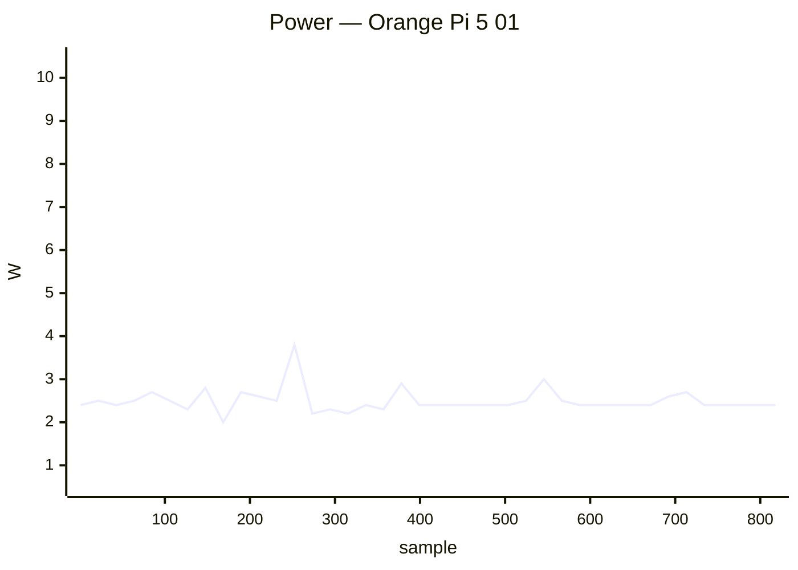

### ❌ ROCK 2F 01

`rock-2f` · **inplace** · image `26.8.1` · 8 ✅ · 2 ❌ · 6 ⏭️

| Module | Status | Time | Detail |
|:--|:--:|--:|:--|
| upgrade | ✅ | 867 s | nightly · 26.8.1 → 26.11.0-trunk.81 |
| reboot | ✅ | 13 s | power-cycle |
| kernel-switch | ✅ | 42 s | branch=vendor · family=rk35xx · installed=26.11.0-trunk.81 · boot_image=/boot/vmlinuz-6.1.172-vendor-rk35xx · kernel_before=6.1.115-vendor-rk35xx |
| reboot | ✅ | 43 s | power-cycle · 1/2 boots · up 21 s |
| hw-performance | ✅ | 22 s | AES 814 · mem 5900 · disk W 54 / R 65 MB/s · 57.7 °C · 2016 MHz |
| dvfs | ✅ | 23 s | ondemand · 408–2016 MHz (peak 2016) |
| network-iperf | ✅ | 45 s | wlan0 ↑214/↓274 (Wi-Fi 6) Mbps |
| store-versions | ✅ | 5 s | 26.11.0-trunk.81 · 6.1.172-vendor-rk35xx |
| kernel-switch | ❌ | 814 s | branch=edge · phase=install · dpkg_state=absent |
| reboot | ❌ | 229 s | power-cycle · 0/2 boots |
| hw-perf | ⏭️ | — | board down after reboot/power-cycle |
| dvfs | ⏭️ | — | — |
| net-iperf | ⏭️ | — | board down after reboot/power-cycle |
| store-versions | ⏭️ | — | — |
| kernel-switch | ⏭️ | — | skipped=board down after reboot/power-cycle |
| reboot | ⏭️ | — | reboot |

### ❌ SpacemiT MusePi Pro 01

`musepipro` · **inplace** · image `26.8.9` · 1 ✅ · 1 ❌ · 4 ⏭️

| Module | Status | Time | Detail |
|:--|:--:|--:|:--|
| upgrade | ✅ | 69 s | nightly · 26.11.0-trunk.81 → 26.11.0-trunk.81 |
| reboot | ❌ | 224 s | power-cycle |
| hw-perf | ⏭️ | — | board down after reboot/power-cycle |
| dvfs | ⏭️ | — | — |
| net-iperf | ⏭️ | — | board down after reboot/power-cycle |
| store-versions | ⏭️ | — | — |

**Power** — min 0.8 W · avg 3.2 W · peak 5.3 W · 239 samples

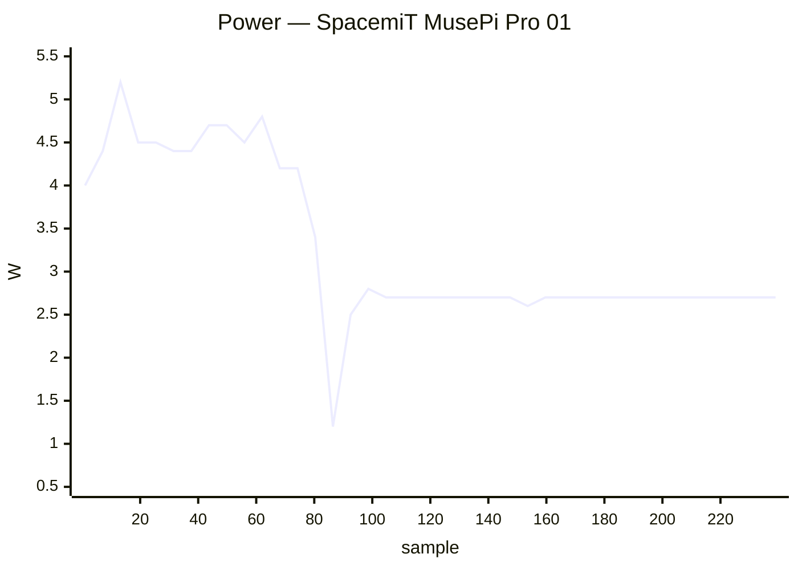

## ✅ Passed (61)

### ✅ Arduino UNO Q 01

`arduino-uno-q` · **inplace** · image `26.11.0-trunk.74` · 7 ✅ · 1 ❌ · 0 ⏭️

| Module | Status | Time | Detail |
|:--|:--:|--:|:--|
| upgrade | ✅ | 80 s | nightly · 26.11.0-trunk.74 → 26.11.0-trunk.74 |
| reboot | ✅ | 54 s | warm · up 35 s |
| kernel-switch | ✅ | 46 s | branch=edge · family=qrb2210 · installed=26.11.0-trunk.74 · boot_image=? · kernel_before=7.2.3-edge-qrb2210 |
| reboot | ✅ | 109 s | warm · 2/2 boots · up 42 s |
| hw-performance | ✅ | 26 s | AES 936 · mem 5100 · disk W 184 / R 259 MB/s · 43.1 °C · 2016 MHz |
| dvfs | ✅ | 33 s | schedutil · 300–2016 MHz (peak 2016) |
| network-iperf | ❌ | 306 s | wlan0 ↑0/↓9 (Wi-Fi 5) · usb0 ↑?/↓? Mbps |
| store-versions | ✅ | 7 s | 26.11.0-trunk.74 · 7.2.3-edge-qrb2210 |

### ✅ Banana Pi CM4IO 01

`bananapicm4io` · **inplace** · image `26.11.0-trunk.74` · 16 ✅ · 0 ❌ · 0 ⏭️

| Module | Status | Time | Detail |
|:--|:--:|--:|:--|
| upgrade | ✅ | 38 s | nightly · 26.11.0-trunk.74 → 26.11.0-trunk.74 |
| reboot | ✅ | 65 s | power-cycle · up 28 s |
| kernel-switch | ✅ | 24 s | branch=current · family=meson64 · installed=26.11.0-trunk.74 · boot_image=/boot/vmlinuz-6.18.55-current-meson64 · kernel_before=6.18.55-current-meson64 |
| reboot | ✅ | 86 s | power-cycle · 2/2 boots · up 25 s |
| hw-performance | ✅ | 32 s | AES 1365 · mem 6200 · disk W 8 / R 22 MB/s · 65.3 °C · 2016 MHz |
| dvfs | ✅ | 15 s | performance · 1000–2016 MHz (peak 2400) |
| network-iperf | ✅ | 134 s | end0 ↑937/↓941 (1GE) · wlan0 ↑43/↓33 (Wi-Fi 5) Mbps |
| store-versions | ✅ | 3 s | 26.11.0-trunk.74 · 6.18.55-current-meson64 |
| kernel-switch | ✅ | 122 s | branch=edge · family=meson64 · installed=26.11.0-trunk.74 · boot_image=/boot/vmlinuz-7.3.0-rc6-edge-meson64 · kernel_before=6.18.55-current-meson64 |
| reboot | ✅ | 84 s | power-cycle · 2/2 boots · up 25 s |
| hw-performance | ✅ | 32 s | AES 1365 · mem 6200 · disk W 9 / R 22 MB/s · 67.4 °C · 2016 MHz |
| dvfs | ✅ | 17 s | performance · 1000–2016 MHz (peak 2400) |
| network-iperf | ✅ | 137 s | end0 ↑937/↓941 (1GE) · wlan0 ↑43/↓33 (Wi-Fi 5) Mbps |
| store-versions | ✅ | 3 s | 26.11.0-trunk.74 · 7.3.0-rc6-edge-meson64 |
| kernel-switch | ✅ | 121 s | branch=current · family=meson64 · installed=26.11.0-trunk.74 · boot_image=/boot/vmlinuz-6.18.55-current-meson64 · kernel_before=7.3.0-rc6-edge-meson64 |
| reboot | ✅ | 63 s | power-cycle · up 26 s |

**Power** — min 2.4 W · avg 4.9 W · peak 11.2 W · 778 samples

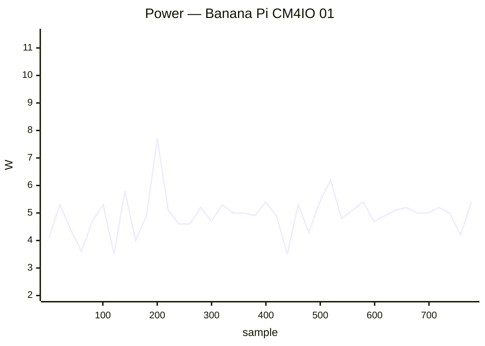

### ✅ Banana Pi M2 Ultra 01

`bananapim2ultra` · **inplace** · image `26.11.0-trunk.74` · 16 ✅ · 0 ❌ · 0 ⏭️

| Module | Status | Time | Detail |
|:--|:--:|--:|:--|
| upgrade | ✅ | 100 s | nightly · 26.11.0-trunk.74 → 26.11.0-trunk.74 |
| reboot | ✅ | 45 s | warm · up 26 s |
| kernel-switch | ✅ | 67 s | branch=current · family=sunxi · installed=26.11.0-trunk.74 · boot_image=/boot/vmlinuz-6.18.55-current-sunxi · kernel_before=6.18.55-current-sunxi |
| reboot | ✅ | 85 s | warm · 2/2 boots · up 28 s |
| hw-performance | ✅ | 42 s | AES 23 · mem 2100 · disk W 7 / R 42 MB/s · 56.6 °C · 1200 MHz |
| dvfs | ✅ | 34 s | ondemand · 720–1200 MHz (peak 1200) |
| network-iperf | ✅ | 326 s | end0 ↑808/↓941 (1GE) · wlan0 ↑32/↓40 (Wi-Fi 4) Mbps |
| store-versions | ✅ | 7 s | 26.11.0-trunk.74 · 6.18.55-current-sunxi |
| kernel-switch | ✅ | 202 s | branch=edge · family=sunxi · installed=26.11.0-trunk.74 · boot_image=/boot/vmlinuz-7.2.9-edge-sunxi · kernel_before=6.18.55-current-sunxi |
| reboot | ✅ | 83 s | warm · 2/2 boots · up 26 s |
| hw-performance | ✅ | 37 s | AES 23 · mem 2000 · disk W 15 / R 43 MB/s · 55.9 °C · 1200 MHz |
| dvfs | ✅ | 37 s | ondemand · 720–1200 MHz (peak 1200) |
| network-iperf | ✅ | 150 s | end0 ↑819/↓941 (1GE) · wlan0 ↑17/↓19 (Wi-Fi 4) Mbps |
| store-versions | ✅ | 7 s | 26.11.0-trunk.74 · 7.2.9-edge-sunxi |
| kernel-switch | ✅ | 184 s | branch=current · family=sunxi · installed=26.11.0-trunk.74 · boot_image=/boot/vmlinuz-6.18.55-current-sunxi · kernel_before=7.2.9-edge-sunxi |
| reboot | ✅ | 45 s | warm · up 26 s |

### ✅ Banana Pi M2Pro 01

`bananapim2pro` · **inplace** · image `26.11.0-trunk.74` · 16 ✅ · 0 ❌ · 0 ⏭️

| Module | Status | Time | Detail |
|:--|:--:|--:|:--|
| upgrade | ✅ | 47 s | nightly · 26.11.0-trunk.74 → 26.11.0-trunk.74 |
| reboot | ✅ | 141 s | power-cycle · up 103 s |
| kernel-switch | ✅ | 31 s | branch=current · family=meson64 · installed=26.11.0-trunk.74 · boot_image=/boot/vmlinuz-6.18.55-current-meson64 · kernel_before=6.18.55-current-meson64 |
| reboot | ✅ | 247 s | power-cycle · 2/2 boots · up 102 s |
| hw-performance | ✅ | 20 s | AES 981 · mem 5300 · disk W 37 / R 156 MB/s · 52.8 °C · 2100 MHz |
| dvfs | ✅ | 19 s | ondemand · 1000–2100 MHz (peak 2100) |
| network-iperf | ✅ | 93 s | end0 ↑940/↓941 (1GE) Mbps |
| store-versions | ✅ | 4 s | 26.11.0-trunk.74 · 6.18.55-current-meson64 |
| kernel-switch | ✅ | 99 s | branch=edge · family=meson64 · installed=26.11.0-trunk.74 · boot_image=/boot/vmlinuz-7.3.0-rc6-edge-meson64 · kernel_before=6.18.55-current-meson64 |
| reboot | ✅ | 248 s | power-cycle · 2/2 boots · up 102 s |
| hw-performance | ✅ | 20 s | AES 980 · mem 5300 · disk W 37 / R 157 MB/s · 53.6 °C · 2100 MHz |
| dvfs | ✅ | 21 s | ondemand · 1000–2100 MHz (peak 2100) |
| network-iperf | ✅ | 92 s | end0 ↑940/↓941 (1GE) Mbps |
| store-versions | ✅ | 4 s | 26.11.0-trunk.74 · 7.3.0-rc6-edge-meson64 |
| kernel-switch | ✅ | 95 s | branch=current · family=meson64 · installed=26.11.0-trunk.74 · boot_image=/boot/vmlinuz-6.18.55-current-meson64 · kernel_before=7.3.0-rc6-edge-meson64 |
| reboot | ✅ | 138 s | power-cycle · up 101 s |

**Power** — min 1.5 W · avg 3.0 W · peak 5.0 W · 1046 samples

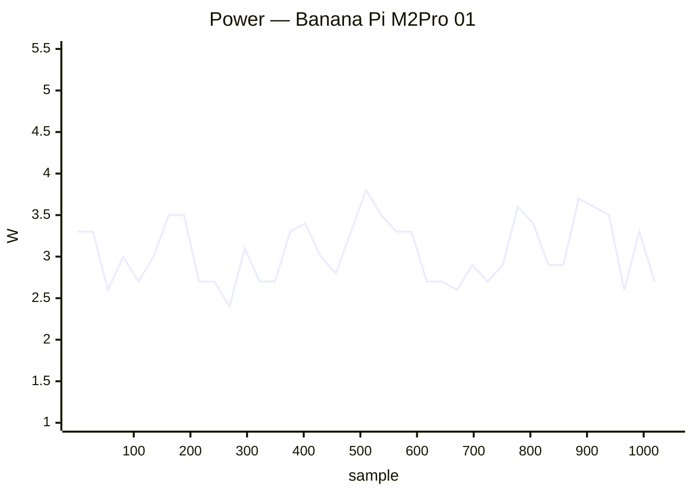

### ✅ Banana Pi M5 01

`bananapim5` · **inplace** · image `26.11.0-trunk.74` · 16 ✅ · 0 ❌ · 0 ⏭️

| Module | Status | Time | Detail |
|:--|:--:|--:|:--|
| upgrade | ✅ | 92 s | nightly · 26.11.0-trunk.74 → 26.11.0-trunk.74 |
| reboot | ✅ | 173 s | warm · up 155 s |
| kernel-switch | ✅ | 51 s | branch=current · family=meson64 · installed=26.11.0-trunk.74 · boot_image=/boot/vmlinuz-6.18.55-current-meson64 · kernel_before=6.18.55-current-meson64 |
| reboot | ✅ | 321 s | warm · 2/2 boots · up 147 s |
| hw-performance | ✅ | 39 s | AES 980 · mem 5200 · disk W 9 / R 15 MB/s · 57.1 °C · 2100 MHz |
| dvfs | ✅ | 21 s | ondemand · 1000–2100 MHz (peak 2100) |
| network-iperf | ✅ | 99 s | end0 ↑941/↓941 (1GE) · wlx000f13960190 ↑1/↓12 (Wi-Fi 4) Mbps |
| store-versions | ✅ | 5 s | 26.11.0-trunk.74 · 6.18.55-current-meson64 |
| kernel-switch | ✅ | 180 s | branch=edge · family=meson64 · installed=26.11.0-trunk.74 · boot_image=/boot/vmlinuz-7.3.0-rc6-edge-meson64 · kernel_before=6.18.55-current-meson64 |
| reboot | ✅ | 110 s | warm · 2/2 boots · up 27 s |
| hw-performance | ✅ | 39 s | AES 980 · mem 5100 · disk W 10 / R 15 MB/s · 59.5 °C · 2100 MHz |
| dvfs | ✅ | 23 s | ondemand · 1000–2100 MHz (peak 2100) |
| network-iperf | ✅ | 93 s | end0 ↑941/↓941 (1GE) · wlx000f13960190 ↑1/↓5 (Wi-Fi 4) Mbps |
| store-versions | ✅ | 5 s | 26.11.0-trunk.74 · 7.3.0-rc6-edge-meson64 |
| kernel-switch | ✅ | 172 s | branch=current · family=meson64 · installed=26.11.0-trunk.74 · boot_image=/boot/vmlinuz-6.18.55-current-meson64 · kernel_before=7.3.0-rc6-edge-meson64 |
| reboot | ✅ | 133 s | warm · up 116 s |

### ✅ Banana Pi M7 01

`bananapim7` · **inplace** · image `26.11.0-trunk.74` · 22 ✅ · 0 ❌ · 0 ⏭️

| Module | Status | Time | Detail |
|:--|:--:|--:|:--|
| upgrade | ✅ | 28 s | nightly · 26.11.0-trunk.74 → 26.11.0-trunk.74 |
| reboot | ✅ | 46 s | power-cycle · up 16 s |
| kernel-switch | ✅ | 18 s | branch=vendor · family=rk35xx · installed=26.11.0-trunk.74 · boot_image=/boot/vmlinuz-6.1.172-vendor-rk35xx · kernel_before=6.1.172-vendor-rk35xx |
| reboot | ✅ | 71 s | power-cycle · 2/2 boots · up 15 s |
| hw-performance | ✅ | 14 s | AES 1253 · mem 15100 · disk W 922 / R 1402 MB/s · 65.6 °C · 1800 MHz |
| dvfs | ✅ | 18 s | ondemand · 1800–1800 MHz (peak 2256) |
| network-iperf | ✅ | 55 s | enP2p33s0 ↑2347/↓2297 (2.5GE) · enP4p65s0 ↑2351/↓2341 (2.5GE) Mbps |
| store-versions | ✅ | 4 s | 26.11.0-trunk.74 · 6.1.172-vendor-rk35xx |
| kernel-switch | ✅ | 48 s | branch=current · family=rockchip64 · installed=26.11.0-trunk.74 · boot_image=/boot/vmlinuz-6.18.55-current-rockchip64 · kernel_before=6.1.172-vendor-rk35xx |
| reboot | ✅ | 230 s | power-cycle · 2/2 boots · up 97 s |
| hw-performance | ✅ | 14 s | AES 1249 · mem 10100 · disk W 883 / R 1572 MB/s · 71.2 °C · 1800 MHz |
| dvfs | ✅ | 16 s | ondemand · 408–1800 MHz (peak 2400) |
| network-iperf | ✅ | 124 s | enP2p33s0 ↑2353/↓2354 (2.5GE) · enP4p65s0 ↑1924/↓2247 (2.5GE) Mbps |
| store-versions | ✅ | 6 s | 26.11.0-trunk.74 · 6.18.55-current-rockchip64 |
| kernel-switch | ✅ | 51 s | branch=edge · family=rockchip64 · installed=26.11.0-trunk.74 · boot_image=/boot/vmlinuz-7.3.0-rc6-edge-rockchip64 · kernel_before=6.18.55-current-rockchip64 |
| reboot | ✅ | 229 s | power-cycle · 2/2 boots · up 97 s |
| hw-performance | ✅ | 14 s | AES 1247 · mem 8000 · disk W 825 / R 1398 MB/s · 73.9 °C · 1800 MHz |
| dvfs | ✅ | 17 s | ondemand · 408–1800 MHz (peak 2400) |
| network-iperf | ✅ | 58 s | enP2p33s0 ↑2352/↓2354 (2.5GE) Mbps |
| store-versions | ✅ | 4 s | 26.11.0-trunk.74 · 7.3.0-rc6-edge-rockchip64 |
| kernel-switch | ✅ | 38 s | branch=vendor · family=rk35xx · installed=26.11.0-trunk.74 · boot_image=/boot/vmlinuz-6.1.172-vendor-rk35xx · kernel_before=7.3.0-rc6-edge-rockchip64 |
| reboot | ✅ | 44 s | power-cycle · up 15 s |

**Power** — min 0.6 W · avg 7.2 W · peak 14.8 W · 751 samples


### ✅ Banana Pi R2 01

`bananapir2` · **inplace** · image `26.11.0-trunk.74` · 16 ✅ · 0 ❌ · 0 ⏭️

| Module | Status | Time | Detail |
|:--|:--:|--:|:--|
| upgrade | ✅ | 94 s | nightly · 26.11.0-trunk.74 → 26.11.0-trunk.74 |
| reboot | ✅ | 74 s | power-cycle · up 35 s |
| kernel-switch | ✅ | 62 s | branch=current · family=mt7623 · installed=26.11.0-trunk.74 · boot_image=/boot/vmlinuz-6.18.55-current-mt7623 · kernel_before=6.18.55-current-mt7623 |
| reboot | ✅ | 114 s | power-cycle · 2/2 boots · up 36 s |
| hw-performance | ✅ | 44 s | AES 25 · mem 1600 · disk W 20 / R 22 MB/s · 53.8 °C · 1300 MHz |
| dvfs | ✅ | 41 s | ondemand · 98–1300 MHz (peak 1300) |
| network-iperf | ✅ | 163 s | lan2 ↑939/↓939 Mbps |
| store-versions | ✅ | 9 s | 26.11.0-trunk.74 · 6.18.55-current-mt7623 |
| kernel-switch | ✅ | 141 s | branch=edge · family=mt7623 · installed=26.11.0-trunk.74 · boot_image=/boot/vmlinuz-7.2.9-edge-mt7623 · kernel_before=6.18.55-current-mt7623 |
| reboot | ✅ | 115 s | power-cycle · 2/2 boots · up 35 s |
| hw-performance | ✅ | 45 s | AES 25 · mem 1600 · disk W 20 / R 22 MB/s · 54 °C · 1300 MHz |
| dvfs | ✅ | 43 s | ondemand · 98–1300 MHz (peak 1300) |
| network-iperf | ✅ | 93 s | lan2 ↑924/↓919 Mbps |
| store-versions | ✅ | 9 s | 26.11.0-trunk.74 · 7.2.9-edge-mt7623 |
| kernel-switch | ✅ | 139 s | branch=current · family=mt7623 · installed=26.11.0-trunk.74 · boot_image=/boot/vmlinuz-6.18.55-current-mt7623 · kernel_before=7.2.9-edge-mt7623 |
| reboot | ✅ | 78 s | power-cycle · up 38 s |

**Power** — min 2.5 W · avg 5.2 W · peak 6.6 W · 1012 samples

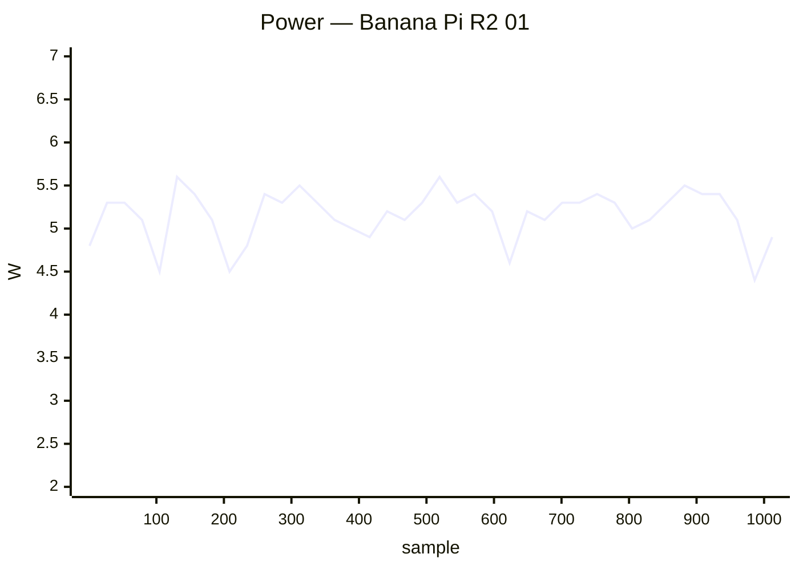

### ✅ Banana Pi R3 Mini 01

`bananapir3mini` · **inplace** · image `26.11.0-trunk` · 4 ✅ · 0 ❌ · 2 ⏭️

| Module | Status | Time | Detail |
|:--|:--:|--:|:--|
| upgrade | ⏭️ | 19 s | — |
| reboot | ✅ | 76 s | power-cycle · up 40 s |
| hw-performance | ✅ | 20 s | AES 934 · mem 3200 · disk W 76 / R 90 MB/s · 76.9 °C · None MHz |
| dvfs | ➖ | 2 s | no cpufreq |
| network-iperf | ✅ | 210 s | eth0 ↑2352/↓2356 (2.5GE) · eth1 ↑2353/↓2251 (2.5GE) · wlan0 ↑17/↓16 (Wi-Fi 6) · wlan1 ↑293/↓265 (Wi-Fi 6) Mbps |
| store-versions | ✅ | 5 s | 26.11.0-trunk · 6.18.52-current-filogic-mt7986 |

**Power** — min 1.8 W · avg 8.3 W · peak 13.5 W · 228 samples

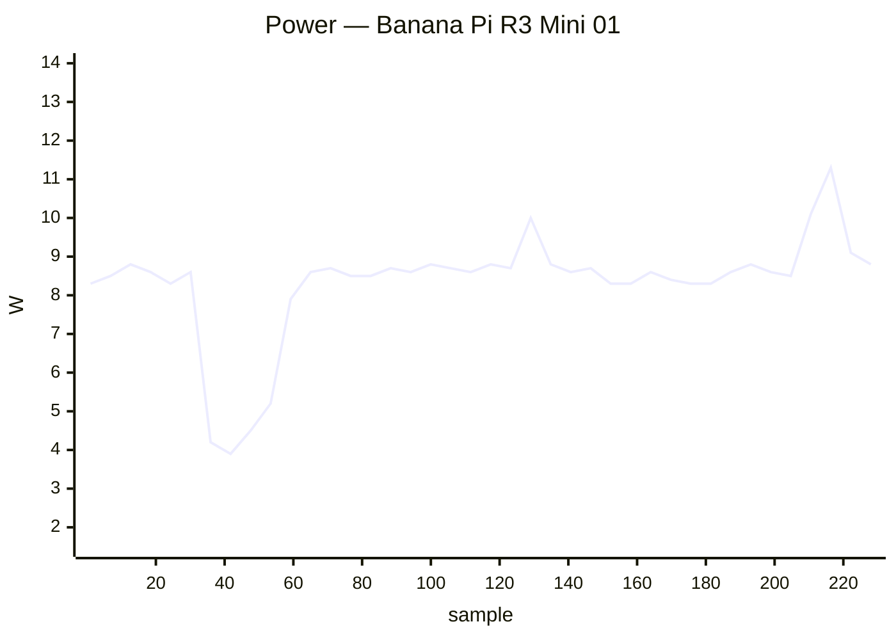

### ✅ BananaPi BPI-F3 01

`musepipro` · **inplace** · image `26.11.0-trunk.74` · 6 ✅ · 0 ❌ · 0 ⏭️

| Module | Status | Time | Detail |
|:--|:--:|--:|:--|
| upgrade | ✅ | 88 s | nightly · 26.11.0-trunk.74 → 26.11.0-trunk.74 |
| reboot | ✅ | 58 s | power-cycle · up 20 s |
| hw-performance | ✅ | 27 s | AES 27 · mem 3000 · disk W 13 / R 82 MB/s · 51 °C · 1600 MHz |
| dvfs | ✅ | 24 s | performance · 614–1600 MHz (peak 1600) |
| network-iperf | ✅ | 161 s | eth0 ↑941/↓941 (1GE) · wlan0 ↑220/↓311 (Wi-Fi 6) · wlan1 ↑239/↓188 (Wi-Fi 5) Mbps |
| store-versions | ✅ | 5 s | 26.11.0-trunk.74 · 6.18.55-current-spacemit |

**Power** — min 3.1 W · avg 5.2 W · peak 7.9 W · 287 samples

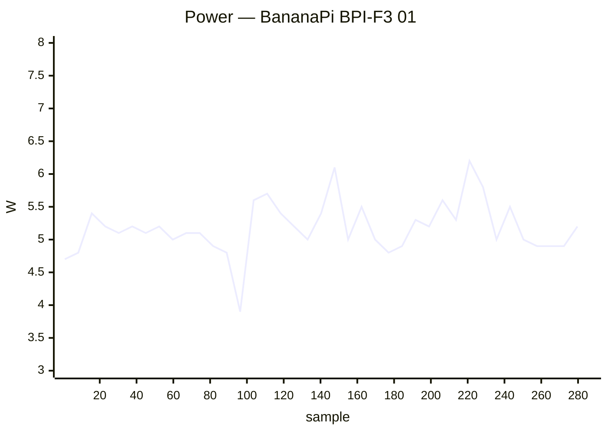

### ✅ BananaPi BPI-M4-Zero 01

`bananapim4zero` · **inplace** · image `26.11.0-trunk.74` · 8 ✅ · 0 ❌ · 0 ⏭️

| Module | Status | Time | Detail |
|:--|:--:|--:|:--|
| upgrade | ✅ | 120 s | nightly · 26.11.0-trunk.74 → 26.11.0-trunk.74 |
| reboot | ✅ | 75 s | power-cycle · up 24 s |
| kernel-switch | ✅ | 51 s | branch=current · family=sunxi64 · installed=26.11.0-trunk.74 · boot_image=/boot/vmlinuz-6.18.55-current-sunxi64 · kernel_before=6.18.55-current-sunxi64 |
| reboot | ✅ | 407 s | power-cycle · 1/2 boots · up 33 s |
| hw-performance | ✅ | 33 s | AES 652 · mem 3600 · disk W 13 / R 22 MB/s · 54.1 °C · 1416 MHz |
| dvfs | ✅ | 42 s | ondemand · 480–1416 MHz (peak 1416) |
| network-iperf | ✅ | 66 s | wlan0 ↑83/↓102 (Wi-Fi 5) Mbps |
| store-versions | ✅ | 6 s | 26.11.0-trunk.74 · 6.18.55-current-sunxi64 |

### ✅ Clearfog Pro 01

`clearfogpro` · **inplace** · image `26.11.0-trunk.74` · 14 ✅ · 0 ❌ · 2 ⏭️

| Module | Status | Time | Detail |
|:--|:--:|--:|:--|
| upgrade | ✅ | 59 s | nightly · 26.11.0-trunk.74 → 26.11.0-trunk.74 |
| reboot | ✅ | 43 s | warm · up 24 s |
| kernel-switch | ✅ | 42 s | branch=current · family=mvebu · installed=26.11.0-trunk.74 · boot_image=/boot/vmlinuz-6.18.55-current-mvebu · kernel_before=6.18.55-current-mvebu |
| reboot | ✅ | 79 s | warm · 2/2 boots · up 26 s |
| hw-performance | ✅ | 34 s | AES 43 · mem 3800 · disk W 21 / R 23 MB/s · 64.6 °C · None MHz |
| dvfs | ➖ | 3 s | no cpufreq |
| network-iperf | ✅ | 42 s | lan2 ↑936/↓936 Mbps |
| store-versions | ✅ | 7 s | 26.11.0-trunk.74 · 6.18.55-current-mvebu |
| kernel-switch | ✅ | 103 s | branch=edge · family=mvebu · installed=26.11.0-trunk.74 · boot_image=/boot/vmlinuz-7.2.9-edge-mvebu · kernel_before=6.18.55-current-mvebu |
| reboot | ✅ | 78 s | warm · 2/2 boots · up 21 s |
| hw-performance | ✅ | 34 s | AES 43 · mem 3800 · disk W 21 / R 24 MB/s · 67 °C · None MHz |
| dvfs | ➖ | 4 s | no cpufreq |
| network-iperf | ✅ | 35 s | lan2 ↑936/↓936 Mbps |
| store-versions | ✅ | 7 s | 26.11.0-trunk.74 · 7.2.9-edge-mvebu |
| kernel-switch | ✅ | 104 s | branch=current · family=mvebu · installed=26.11.0-trunk.74 · boot_image=/boot/vmlinuz-6.18.55-current-mvebu · kernel_before=7.2.9-edge-mvebu |
| reboot | ✅ | 44 s | warm · up 24 s |

### ✅ Cubie A5E 01

`radxa-cubie-a5e` · **inplace** · image `26.11.0-trunk.74` · 14 ✅ · 0 ❌ · 2 ⏭️

| Module | Status | Time | Detail |
|:--|:--:|--:|:--|
| upgrade | ✅ | 85 s | nightly · 26.11.0-trunk.74 → 26.11.0-trunk.74 |
| reboot | ✅ | 73 s | power-cycle · up 31 s |
| kernel-switch | ✅ | 56 s | branch=current · family=sunxi64 · installed=26.11.0-trunk.74 · boot_image=? · kernel_before=6.18.55-current-sunxi64 |
| reboot | ✅ | 105 s | power-cycle · 2/2 boots · up 32 s |
| hw-performance | ✅ | 34 s | AES 358 · mem 2000 · disk W 20 / R 23 MB/s · 67.3 °C · None MHz |
| dvfs | ➖ | 3 s | no cpufreq |
| network-iperf | ✅ | 374 s | end0 ↑817/↓941 (1GE) · end1 ↑941/↓941 (1GE) · wlan0 ↑120/↓95 (Wi-Fi 6) Mbps |
| store-versions | ✅ | 6 s | 26.11.0-trunk.74 · 6.18.55-current-sunxi64 |
| kernel-switch | ✅ | 564 s | branch=edge · family=sunxi64 · installed=26.11.0-trunk.74 · boot_image=? · kernel_before=6.18.55-current-sunxi64 |
| reboot | ✅ | 110 s | power-cycle · 2/2 boots · up 33 s |
| hw-performance | ✅ | 34 s | AES 358 · mem 2000 · disk W 21 / R 23 MB/s · 73.8 °C · None MHz |
| dvfs | ➖ | 3 s | no cpufreq |
| network-iperf | ✅ | 354 s | end0 ↑815/↓941 (1GE) · end1 ↑940/↓940 (1GE) · wlan0 ↑49/↓42 (Wi-Fi 6) Mbps |
| store-versions | ✅ | 6 s | 26.11.0-trunk.74 · 7.2.9-edge-sunxi64 |
| kernel-switch | ✅ | 563 s | branch=current · family=sunxi64 · installed=26.11.0-trunk.74 · boot_image=? · kernel_before=7.2.9-edge-sunxi64 |
| reboot | ✅ | 68 s | power-cycle · up 32 s |

**Power** — min 0.8 W · avg 4.1 W · peak 6.5 W · 1959 samples

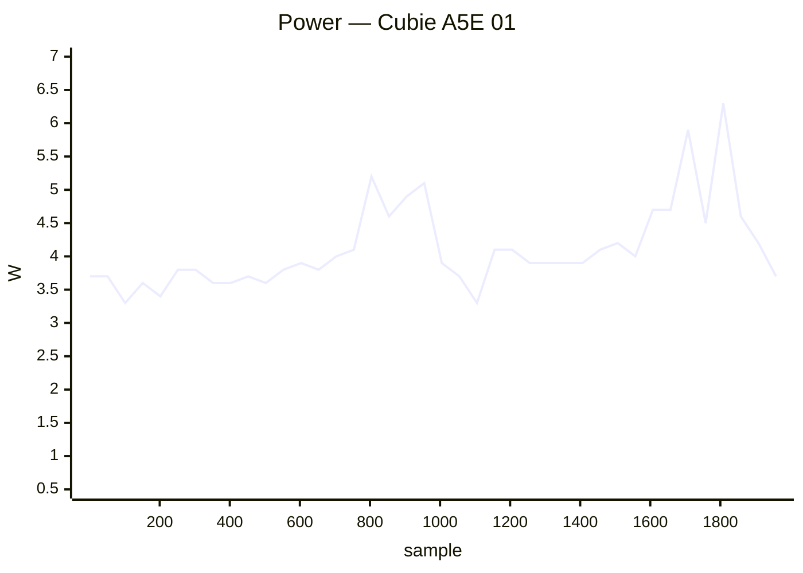

### ✅ Cubietruck 01

`cubietruck` · **inplace** · image `26.11.0-trunk.74` · 16 ✅ · 0 ❌ · 0 ⏭️

| Module | Status | Time | Detail |
|:--|:--:|--:|:--|
| upgrade | ✅ | 139 s | nightly · 26.11.0-trunk.74 → 26.11.0-trunk.74 |
| reboot | ✅ | 75 s | warm · up 50 s |
| kernel-switch | ✅ | 96 s | branch=current · family=sunxi · installed=26.11.0-trunk.74 · boot_image=/boot/vmlinuz-6.18.55-current-sunxi · kernel_before=6.18.55-current-sunxi |
| reboot | ✅ | 135 s | warm · 2/2 boots · up 47 s |
| hw-performance | ✅ | 59 s | AES 18 · mem 1700 · disk W 14 / R 22 MB/s · 51.5 °C · 960 MHz |
| dvfs | ✅ | 56 s | ondemand · 528–960 MHz (peak 960) |
| network-iperf | ✅ | 201 s | end0 ↑728/↓802 (1GE) · wlan0 ↑18/↓21 (Wi-Fi 4) Mbps |
| store-versions | ✅ | 12 s | 26.11.0-trunk.74 · 6.18.55-current-sunxi |
| kernel-switch | ✅ | 230 s | branch=edge · family=sunxi · installed=26.11.0-trunk.74 · boot_image=/boot/vmlinuz-7.2.9-edge-sunxi · kernel_before=6.18.55-current-sunxi |
| reboot | ✅ | 133 s | warm · 2/2 boots · up 47 s |
| hw-performance | ✅ | 59 s | AES 19 · mem 1700 · disk W 14 / R 22 MB/s · 51.8 °C · 960 MHz |
| dvfs | ✅ | 57 s | ondemand · 528–960 MHz (peak 960) |
| network-iperf | ✅ | 115 s | end0 ↑607/↓930 (1GE) · wlan0 ↑20/↓16 (Wi-Fi 4) Mbps |
| store-versions | ✅ | 12 s | 26.11.0-trunk.74 · 7.2.9-edge-sunxi |
| kernel-switch | ✅ | 224 s | branch=current · family=sunxi · installed=26.11.0-trunk.74 · boot_image=/boot/vmlinuz-6.18.55-current-sunxi · kernel_before=7.2.9-edge-sunxi |
| reboot | ✅ | 73 s | warm · up 49 s |

### ✅ Cubox i2eX/i4 01

`cubox-i` · **inplace** · image `26.11.0-trunk.73` · 16 ✅ · 0 ❌ · 0 ⏭️

| Module | Status | Time | Detail |
|:--|:--:|--:|:--|
| upgrade | ✅ | 634 s | nightly · 26.11.0-trunk.73 → 26.11.0-trunk.74 |
| reboot | ✅ | 88 s | power-cycle · up 48 s |
| kernel-switch | ✅ | 72 s | branch=current · family=imx6 · installed=26.11.0-trunk.74 · boot_image=/boot/vmlinuz-6.18.55-current-imx6 · kernel_before=6.18.55-current-imx6 |
| reboot | ✅ | 162 s | power-cycle · 2/2 boots · up 47 s |
| hw-performance | ✅ | 47 s | AES 26 · mem 782 · disk W 19 / R 20 MB/s · 54.3 °C · 996 MHz |
| dvfs | ✅ | 40 s | ondemand · 396–996 MHz (peak 996) |
| network-iperf | ✅ | 305 s | end0 ↑94/↓94 (10/100ME) · wlan0 ↑18/↓16 (Wi-Fi 4) Mbps |
| store-versions | ✅ | 9 s | 26.11.0-trunk.74 · 6.18.55-current-imx6 |
| kernel-switch | ✅ | 298 s | branch=edge · family=imx6 · installed=26.11.0-trunk.74 · boot_image=/boot/vmlinuz-7.1.13-edge-imx6 · kernel_before=6.18.55-current-imx6 |
| reboot | ✅ | 144 s | power-cycle · 2/2 boots · up 46 s |
| hw-performance | ✅ | 47 s | AES 25 · mem 727 · disk W 19 / R 20 MB/s · 56 °C · 996 MHz |
| dvfs | ✅ | 44 s | ondemand · 396–996 MHz (peak 996) |
| network-iperf | ✅ | 160 s | end0 ↑94/↓94 (10/100ME) · wlan0 ↑17/↓17 (Wi-Fi 4) Mbps |
| store-versions | ✅ | 9 s | 26.11.0-trunk.74 · 7.1.13-edge-imx6 |
| kernel-switch | ✅ | 280 s | branch=current · family=imx6 · installed=26.11.0-trunk.74 · boot_image=/boot/vmlinuz-6.18.55-current-imx6 · kernel_before=7.1.13-edge-imx6 |
| reboot | ✅ | 87 s | power-cycle · up 46 s |

**Power** — min 1.8 W · avg 3.0 W · peak 6.1 W · 1937 samples


### ✅ Espressobin 01

`espressobin` · **inplace** · image `26.11.0-trunk.74` · 16 ✅ · 0 ❌ · 0 ⏭️

| Module | Status | Time | Detail |
|:--|:--:|--:|:--|
| upgrade | ✅ | 152 s | nightly · 26.11.0-trunk.74 → 26.11.0-trunk.74 |
| reboot | ✅ | 81 s | power-cycle · up 42 s |
| kernel-switch | ✅ | 81 s | branch=current · family=mvebu64 · installed=26.11.0-trunk.74 · boot_image=/boot/vmlinuz-6.18.55-current-mvebu64 · kernel_before=6.18.55-current-mvebu64 |
| reboot | ✅ | 128 s | power-cycle · 2/2 boots · up 42 s |
| hw-performance | ✅ | 39 s | AES 367 · mem 2000 · disk W 11 / R 132 MB/s · None °C · 800 MHz |
| dvfs | ✅ | 35 s | ondemand · 200–800 MHz (peak 800) |
| network-iperf | ✅ | 108 s | lan0 ↑936/↓740 (1GE) Mbps |
| store-versions | ✅ | 7 s | 26.11.0-trunk.74 · 6.18.55-current-mvebu64 |
| kernel-switch | ✅ | 367 s | branch=edge · family=mvebu64 · installed=26.11.0-trunk.74 · boot_image=/boot/vmlinuz-7.1.13-edge-mvebu64 · kernel_before=6.18.55-current-mvebu64 |
| reboot | ✅ | 133 s | power-cycle · 2/2 boots · up 45 s |
| hw-performance | ✅ | 39 s | AES 370 · mem 2000 · disk W 9 / R 131 MB/s · None °C · 800 MHz |
| dvfs | ✅ | 36 s | ondemand · 200–800 MHz (peak 800) |
| network-iperf | ✅ | 47 s | lan0 ↑936/↓885 (1GE) Mbps |
| store-versions | ✅ | 8 s | 26.11.0-trunk.74 · 7.1.13-edge-mvebu64 |
| kernel-switch | ✅ | 376 s | branch=current · family=mvebu64 · installed=26.11.0-trunk.74 · boot_image=/boot/vmlinuz-6.18.55-current-mvebu64 · kernel_before=7.1.13-edge-mvebu64 |
| reboot | ✅ | 79 s | power-cycle · up 44 s |

### ✅ Helios4 01

`helios4` · **inplace** · image `26.11.0-trunk.74` · 14 ✅ · 0 ❌ · 2 ⏭️

| Module | Status | Time | Detail |
|:--|:--:|--:|:--|
| upgrade | ✅ | 55 s | nightly · 26.11.0-trunk.74 → 26.11.0-trunk.74 |
| reboot | ✅ | 121 s | warm · up 104 s |
| kernel-switch | ✅ | 34 s | branch=current · family=mvebu · installed=26.11.0-trunk.74 · boot_image=/boot/vmlinuz-6.18.55-current-mvebu · kernel_before=6.18.55-current-mvebu |
| reboot | ✅ | 235 s | warm · 2/2 boots · up 103 s |
| hw-performance | ✅ | 30 s | AES 43 · mem 3800 · disk W 21 / R 23 MB/s · 56.5 °C · None MHz |
| dvfs | ➖ | 2 s | no cpufreq |
| network-iperf | ✅ | 37 s | end1 ↑941/↓941 (1GE) Mbps |
| store-versions | ✅ | 5 s | 26.11.0-trunk.74 · 6.18.55-current-mvebu |
| kernel-switch | ✅ | 98 s | branch=edge · family=mvebu · installed=26.11.0-trunk.74 · boot_image=/boot/vmlinuz-7.2.9-edge-mvebu · kernel_before=6.18.55-current-mvebu |
| reboot | ✅ | 235 s | warm · 2/2 boots · up 103 s |
| hw-performance | ✅ | 30 s | AES 43 · mem 3800 · disk W 21 / R 23 MB/s · 57 °C · None MHz |
| dvfs | ➖ | 2 s | no cpufreq |
| network-iperf | ✅ | 34 s | end1 ↑939/↓941 (1GE) Mbps |
| store-versions | ✅ | 5 s | 26.11.0-trunk.74 · 7.2.9-edge-mvebu |
| kernel-switch | ✅ | 94 s | branch=current · family=mvebu · installed=26.11.0-trunk.74 · boot_image=/boot/vmlinuz-6.18.55-current-mvebu · kernel_before=7.2.9-edge-mvebu |
| reboot | ✅ | 121 s | warm · up 105 s |

### ✅ Inovato Quadra 01

`inovato-quadra` · **inplace** · image `26.11.0-trunk.74` · 15 ✅ · 1 ❌ · 0 ⏭️

| Module | Status | Time | Detail |
|:--|:--:|--:|:--|
| upgrade | ✅ | 56 s | nightly · 26.11.0-trunk.74 → 26.11.0-trunk.74 |
| reboot | ✅ | 69 s | power-cycle · up 25 s |
| kernel-switch | ✅ | 40 s | branch=current · family=sunxi64 · installed=26.11.0-trunk.74 · boot_image=/boot/vmlinuz-6.18.55-current-sunxi64 · kernel_before=6.18.55-current-sunxi64 |
| reboot | ✅ | 91 s | power-cycle · 2/2 boots · up 25 s |
| hw-performance | ✅ | 30 s | AES 794 · mem 2800 · disk W 14 / R 23 MB/s · 68.9 °C · 1704 MHz |
| dvfs | ❌ | 21 s | ondemand · 480–1704 MHz (peak 1488) |
| network-iperf | ✅ | 213 s | eth0 ↑94/↓94 (10/100ME) · wlan0 ↑7/↓17 (Wi-Fi 4) Mbps |
| store-versions | ✅ | 5 s | 26.11.0-trunk.74 · 6.18.55-current-sunxi64 |
| kernel-switch | ✅ | 119 s | branch=edge · family=sunxi64 · installed=26.11.0-trunk.74 · boot_image=/boot/vmlinuz-7.2.9-edge-sunxi64 · kernel_before=6.18.55-current-sunxi64 |
| reboot | ✅ | 91 s | power-cycle · 2/2 boots · up 25 s |
| hw-performance | ✅ | 30 s | AES 794 · mem 2800 · disk W 21 / R 23 MB/s · 70.9 °C · 1704 MHz |
| dvfs | ✅ | 22 s | ondemand · 480–1704 MHz (peak 1704) |
| network-iperf | ✅ | 95 s | eth0 ↑94/↓94 (10/100ME) · wlan0 ↑8/↓16 (Wi-Fi 4) Mbps |
| store-versions | ✅ | 5 s | 26.11.0-trunk.74 · 7.2.9-edge-sunxi64 |
| kernel-switch | ✅ | 110 s | branch=current · family=sunxi64 · installed=26.11.0-trunk.74 · boot_image=/boot/vmlinuz-6.18.55-current-sunxi64 · kernel_before=7.2.9-edge-sunxi64 |
| reboot | ✅ | 62 s | power-cycle · up 24 s |

**Power** — min 2.2 W · avg 4.0 W · peak 6.1 W · 840 samples

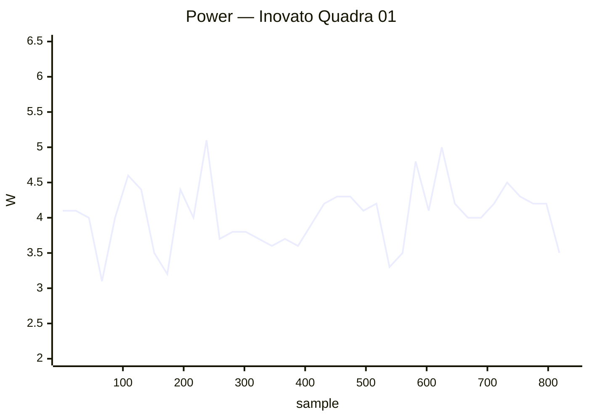

### ✅ Khadas Edge2 01

`khadas-edge2` · **inplace** · image `26.11.0-trunk.74` · 14 ✅ · 0 ❌ · 2 ⏭️

| Module | Status | Time | Detail |
|:--|:--:|--:|:--|
| upgrade | ✅ | 47 s | nightly · 26.11.0-trunk.74 → 26.11.0-trunk.74 |
| reboot | ✅ | 33 s | warm · up 15 s |
| kernel-switch | ✅ | 23 s | branch=vendor · family=rk35xx · installed=26.11.0-trunk.74 · boot_image=/boot/vmlinuz-6.1.172-vendor-rk35xx · kernel_before=6.1.172-vendor-rk35xx |
| reboot | ✅ | 60 s | warm · 2/2 boots · up 17 s |
| hw-performance | ✅ | 15 s | AES 1272 · mem 14000 · disk W 105 / R 257 MB/s · 36.1 °C · 1800 MHz |
| dvfs | ✅ | 18 s | ondemand · 1800–1800 MHz (peak 2256) |
| network-iperf | ⏭️ | 6 s | no cabled interfaces |
| store-versions | ✅ | 4 s | 26.11.0-trunk.74 · 6.1.172-vendor-rk35xx |
| kernel-switch | ✅ | 69 s | branch=current · family=rockchip64 · installed=26.11.0-trunk.74 · boot_image=/boot/vmlinuz-6.18.55-current-rockchip64 · kernel_before=6.1.172-vendor-rk35xx |
| reboot | ✅ | 47 s | warm · 2/2 boots · up 8 s |
| hw-performance | ✅ | 16 s | AES 1270 · mem 10000 · disk W 101 / R 212 MB/s · 39.8 °C · 1800 MHz |
| dvfs | ✅ | 15 s | ondemand · 408–1800 MHz (peak 2400) |
| network-iperf | ⏭️ | 6 s | no cabled interfaces |
| store-versions | ✅ | 4 s | 26.11.0-trunk.74 · 6.18.55-current-rockchip64 |
| kernel-switch | ✅ | 55 s | branch=vendor · family=rk35xx · installed=26.11.0-trunk.74 · boot_image=/boot/vmlinuz-6.1.172-vendor-rk35xx · kernel_before=6.18.55-current-rockchip64 |
| reboot | ✅ | 28 s | warm · up 10 s |

### ✅ Khadas VIM1 01

`khadas-vim1` · **inplace** · image `26.11.0-trunk.74` · 16 ✅ · 0 ❌ · 0 ⏭️

| Module | Status | Time | Detail |
|:--|:--:|--:|:--|
| upgrade | ✅ | 66 s | nightly · 26.11.0-trunk.74 → 26.11.0-trunk.74 |
| reboot | ✅ | 91 s | power-cycle · up 54 s |
| kernel-switch | ✅ | 47 s | branch=current · family=meson64 · installed=26.11.0-trunk.74 · boot_image=/boot/vmlinuz-6.18.55-current-meson64 · kernel_before=6.18.55-current-meson64 |
| reboot | ✅ | 116 s | power-cycle · 2/2 boots · up 36 s |
| hw-performance | ✅ | 30 s | AES 658 · mem 3600 · disk W 19 / R 22 MB/s · 56 °C · 1512 MHz |
| dvfs | ✅ | 23 s | ondemand · 500–1512 MHz (peak 1512) |
| network-iperf | ✅ | 100 s | end0 ↑94/↓94 (10/100ME) · wlan0 ↑45/↓32 (Wi-Fi 5) Mbps |
| store-versions | ✅ | 5 s | 26.11.0-trunk.74 · 6.18.55-current-meson64 |
| kernel-switch | ✅ | 158 s | branch=edge · family=meson64 · installed=26.11.0-trunk.74 · boot_image=/boot/vmlinuz-7.3.0-rc6-edge-meson64 · kernel_before=6.18.55-current-meson64 |
| reboot | ✅ | 119 s | power-cycle · 2/2 boots · up 39 s |
| hw-performance | ✅ | 31 s | AES 659 · mem 3600 · disk W 19 / R 22 MB/s · 56 °C · 1512 MHz |
| dvfs | ✅ | 25 s | ondemand · 500–1512 MHz (peak 1512) |
| network-iperf | ✅ | 65 s | end0 ↑94/↓94 (10/100ME) · wlan0 ↑13/↓21 (Wi-Fi 5) Mbps |
| store-versions | ✅ | 5 s | 26.11.0-trunk.74 · 7.3.0-rc6-edge-meson64 |
| kernel-switch | ✅ | 155 s | branch=current · family=meson64 · installed=26.11.0-trunk.74 · boot_image=/boot/vmlinuz-6.18.55-current-meson64 · kernel_before=7.3.0-rc6-edge-meson64 |
| reboot | ✅ | 75 s | power-cycle · up 37 s |

**Power** — min 1.2 W · avg 2.3 W · peak 3.8 W · 878 samples

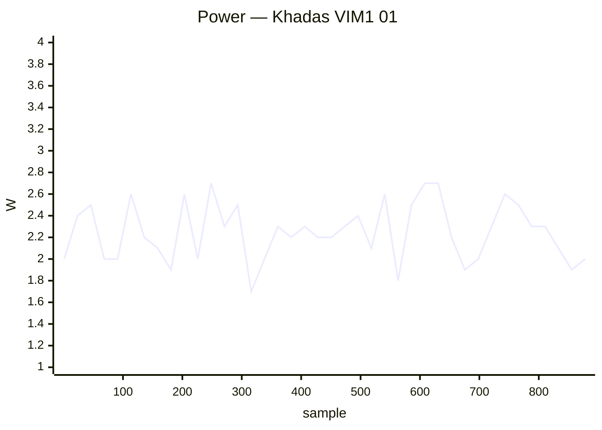

### ✅ Khadas VIM2 01

`khadas-vim2` · **inplace** · image `26.11.0-trunk.74` · 16 ✅ · 0 ❌ · 0 ⏭️

| Module | Status | Time | Detail |
|:--|:--:|--:|:--|
| upgrade | ✅ | 141 s | nightly · 26.11.0-trunk.74 → 26.11.0-trunk.74 |
| reboot | ✅ | 42 s | warm · up 23 s |
| kernel-switch | ✅ | 54 s | branch=current · family=meson64 · installed=26.11.0-trunk.74 · boot_image=/boot/vmlinuz-6.18.55-current-meson64 · kernel_before=6.18.55-current-meson64 |
| reboot | ✅ | 74 s | warm · 2/2 boots · up 26 s |
| hw-performance | ✅ | 25 s | AES 658 · mem 3600 · disk W 40 / R 138 MB/s · 62 °C · 1512 MHz |
| dvfs | ✅ | 25 s | ondemand · 500–1512 MHz (peak 1512) |
| network-iperf | ✅ | 308 s | eth0 ↑940/↓941 (1GE) · wlan0 ↑95/↓93 (Wi-Fi 5) Mbps |
| store-versions | ✅ | 6 s | 26.11.0-trunk.74 · 6.18.55-current-meson64 |
| kernel-switch | ✅ | 163 s | branch=edge · family=meson64 · installed=26.11.0-trunk.74 · boot_image=/boot/vmlinuz-7.3.0-rc6-edge-meson64 · kernel_before=6.18.55-current-meson64 |
| reboot | ✅ | 79 s | warm · 2/2 boots · up 26 s |
| hw-performance | ✅ | 25 s | AES 658 · mem 3500 · disk W 40 / R 137 MB/s · 63 °C · 1512 MHz |
| dvfs | ✅ | 28 s | ondemand · 500–1512 MHz (peak 1512) |
| network-iperf | ✅ | 135 s | eth0 ↑940/↓941 (1GE) · wlan0 ↑82/↓88 (Wi-Fi 5) Mbps |
| store-versions | ✅ | 6 s | 26.11.0-trunk.74 · 7.3.0-rc6-edge-meson64 |
| kernel-switch | ✅ | 160 s | branch=current · family=meson64 · installed=26.11.0-trunk.74 · boot_image=/boot/vmlinuz-6.18.55-current-meson64 · kernel_before=7.3.0-rc6-edge-meson64 |
| reboot | ✅ | 38 s | warm · up 20 s |

### ✅ Mekotronics R58HD 01

`mekotronics-r58hd` · **inplace** · image `26.11.0-trunk.75` · 6 ✅ · 0 ❌ · 0 ⏭️

| Module | Status | Time | Detail |
|:--|:--:|--:|:--|
| upgrade | ✅ | 26 s | nightly · 26.11.0-trunk.75 → 26.11.0-trunk.75 |
| reboot | ✅ | 53 s | power-cycle · up 18 s |
| hw-performance | ✅ | 14 s | AES 1290 · mem 16000 · disk W 249 / R 288 MB/s · 53.6 °C · 1800 MHz |
| dvfs | ✅ | 17 s | ondemand · 1800–1800 MHz (peak 2304) |
| network-iperf | ✅ | 252 s | end0 ↑726/↓940 (1GE) · enP3p49s0 ↑941/↓941 (1GE) Mbps |
| store-versions | ✅ | 8 s | 26.11.0-trunk.75 · 6.1.172-vendor-rk35xx |

**Power** — min 3.9 W · avg 5.5 W · peak 12.3 W · 313 samples


### ✅ Mekotronics R58S2 01

`mekotronics-r58s2` · **inplace** · image `26.11.0-trunk.72` · 5 ✅ · 0 ❌ · 1 ⏭️

| Module | Status | Time | Detail |
|:--|:--:|--:|:--|
| upgrade | ⏭️ | 11 s | — |
| reboot | ✅ | 52 s | power-cycle · up 15 s |
| hw-performance | ✅ | 15 s | AES 1281 · mem 14000 · disk W 223 / R 273 MB/s · 42.5 °C · 1800 MHz |
| dvfs | ✅ | 17 s | ondemand · 1800–1800 MHz (peak 2352) |
| network-iperf | ✅ | 56 s | end1 ↑940/↓941 (1GE) · wlan0 ↑62/↓175 (Wi-Fi 5) Mbps |
| store-versions | ✅ | 4 s | 26.11.0-trunk.72 · 6.1.172-vendor-rk35xx |

**Power** — min 2.1 W · avg 3.5 W · peak 10.4 W · 124 samples


### ✅ NanoPi Fire3 01

`nanopifire3` · **inplace** · image `26.11.0-trunk.74` · 7 ✅ · 0 ❌ · 1 ⏭️

| Module | Status | Time | Detail |
|:--|:--:|--:|:--|
| upgrade | ✅ | 141 s | nightly · 26.11.0-trunk.74 → 26.11.0-trunk.74 |
| reboot | ✅ | 75 s | power-cycle · up 32 s |
| kernel-switch | ✅ | 72 s | branch=edge · family=s5p6818 · installed=26.11.0-trunk.74 · boot_image=/boot/vmlinuz-7.2.9-edge-s5p6818 · kernel_before=7.2.9-edge-s5p6818 |
| reboot | ✅ | 108 s | power-cycle · 2/2 boots · up 32 s |
| hw-performance | ✅ | 36 s | AES 372 · mem 2000 · disk W 20 / R 21 MB/s · 68 °C · None MHz |
| dvfs | ➖ | 3 s | no cpufreq |
| network-iperf | ✅ | 200 s | eth0 ↑94/↓94 (10/100ME) Mbps |
| store-versions | ✅ | 6 s | 26.11.0-trunk.74 · 7.2.9-edge-s5p6818 |

**Power** — min 2.0 W · avg 2.9 W · peak 4.0 W · 514 samples


### ✅ NanoPi K2 01

`nanopik2-s905` · **inplace** · image `26.11.0-trunk.74` · 16 ✅ · 0 ❌ · 0 ⏭️

| Module | Status | Time | Detail |
|:--|:--:|--:|:--|
| upgrade | ✅ | 59 s | nightly · 26.11.0-trunk.74 → 26.11.0-trunk.74 |
| reboot | ✅ | 45 s | warm · up 29 s |
| kernel-switch | ✅ | 42 s | branch=current · family=meson64 · installed=26.11.0-trunk.74 · boot_image=/boot/vmlinuz-6.18.55-current-meson64 · kernel_before=6.18.55-current-meson64 |
| reboot | ✅ | 72 s | warm · 2/2 boots · up 24 s |
| hw-performance | ✅ | 33 s | AES 51 · mem 3800 · disk W 8 / R 41 MB/s · 62 °C · 2016 MHz |
| dvfs | ✅ | 21 s | ondemand · 500–1536 MHz (peak 1536) |
| network-iperf | ✅ | 120 s | end0 ↑934/↓941 (1GE) · wlan0 ↑14/↓17 (Wi-Fi 4) Mbps |
| store-versions | ✅ | 5 s | 26.11.0-trunk.74 · 6.18.55-current-meson64 |
| kernel-switch | ✅ | 161 s | branch=edge · family=meson64 · installed=26.11.0-trunk.74 · boot_image=/boot/vmlinuz-7.3.0-rc6-edge-meson64 · kernel_before=6.18.55-current-meson64 |
| reboot | ✅ | 68 s | warm · 2/2 boots · up 19 s |
| hw-performance | ✅ | 35 s | AES 51 · mem 3700 · disk W 7 / R 41 MB/s · 64 °C · 2016 MHz |
| dvfs | ✅ | 24 s | ondemand · 500–1536 MHz (peak 1536) |
| network-iperf | ✅ | 165 s | end0 ↑935/↓941 (1GE) · wlan0 ↑14/↓18 (Wi-Fi 4) Mbps |
| store-versions | ✅ | 5 s | 26.11.0-trunk.74 · 7.3.0-rc6-edge-meson64 |
| kernel-switch | ✅ | 159 s | branch=current · family=meson64 · installed=26.11.0-trunk.74 · boot_image=/boot/vmlinuz-6.18.55-current-meson64 · kernel_before=7.3.0-rc6-edge-meson64 |
| reboot | ✅ | 36 s | warm · up 20 s |

### ✅ NanoPi M4V2 01

`nanopim4v2` · **inplace** · image `26.11.0-trunk.74` · 16 ✅ · 0 ❌ · 0 ⏭️

| Module | Status | Time | Detail |
|:--|:--:|--:|:--|
| upgrade | ✅ | 63 s | nightly · 26.11.0-trunk.74 → 26.11.0-trunk.74 |
| reboot | ✅ | 67 s | power-cycle · up 34 s |
| kernel-switch | ✅ | 34 s | branch=current · family=rockchip64 · installed=26.11.0-trunk.74 · boot_image=/boot/vmlinuz-6.18.55-current-rockchip64 · kernel_before=6.18.55-current-rockchip64 |
| reboot | ✅ | 95 s | power-cycle · 2/2 boots · up 24 s |
| hw-performance | ✅ | 22 s | AES 1021 · mem 6600 · disk W 53 / R 60 MB/s · 46.2 °C · 1416 MHz |
| dvfs | ✅ | 20 s | ondemand · 408–1416 MHz (peak 1800) |
| network-iperf | ✅ | 125 s | end0 ↑941/↓941 (1GE) · wlan0 ↑136/↓120 (Wi-Fi 5) · wlx803f5d16af63 ↑154/↓199 (Wi-Fi 5) Mbps |
| store-versions | ✅ | 5 s | 26.11.0-trunk.74 · 6.18.55-current-rockchip64 |
| kernel-switch | ✅ | 96 s | branch=edge · family=rockchip64 · installed=26.11.0-trunk.74 · boot_image=/boot/vmlinuz-7.3.0-rc6-edge-rockchip64 · kernel_before=6.18.55-current-rockchip64 |
| reboot | ✅ | 319 s | power-cycle · 1/2 boots · up 24 s |
| hw-performance | ✅ | 21 s | AES 1020 · mem 6600 · disk W 53 / R 60 MB/s · 48.8 °C · 1416 MHz |
| dvfs | ✅ | 69 s | ondemand · 408–1416 MHz (peak 1800) |
| network-iperf | ✅ | 95 s | end0 ↑941/↓941 (1GE) · wlan0 ↑89/↓66 (Wi-Fi 5) · wlx803f5d16af63 ↑106/↓193 (Wi-Fi 5) Mbps |
| store-versions | ✅ | 5 s | 26.11.0-trunk.74 · 7.3.0-rc6-edge-rockchip64 |
| kernel-switch | ✅ | 94 s | branch=current · family=rockchip64 · installed=26.11.0-trunk.74 · boot_image=/boot/vmlinuz-6.18.55-current-rockchip64 · kernel_before=7.3.0-rc6-edge-rockchip64 |
| reboot | ✅ | 59 s | power-cycle · up 25 s |

**Power** — min 2.2 W · avg 7.2 W · peak 12.3 W · 939 samples


### ✅ NanoPi M5 01

`nanopi-m5` · **inplace** · image `26.11.0-trunk.74` · 22 ✅ · 0 ❌ · 0 ⏭️

| Module | Status | Time | Detail |
|:--|:--:|--:|:--|
| upgrade | ✅ | 35 s | nightly · 26.11.0-trunk.74 → 26.11.0-trunk.74 |
| reboot | ✅ | 140 s | power-cycle · up 111 s |
| kernel-switch | ✅ | 23 s | branch=vendor · family=rk35xx · installed=26.11.0-trunk.74 · boot_image=/boot/vmlinuz-6.1.172-vendor-rk35xx · kernel_before=6.1.172-vendor-rk35xx |
| reboot | ✅ | 261 s | power-cycle · 2/2 boots · up 111 s |
| hw-performance | ✅ | 18 s | AES 1276 · mem 8000 · disk W 67 / R 77 MB/s · 43.5 °C · 2016 MHz |
| dvfs | ✅ | 18 s | ondemand · 2016–2016 MHz (peak 2208) |
| network-iperf | ✅ | 58 s | end1 ↑941/↓941 (1GE) · wlx44334c47dec3 ↑38/↓22 (Wi-Fi 4) Mbps |
| store-versions | ✅ | 4 s | 26.11.0-trunk.74 · 6.1.172-vendor-rk35xx |
| kernel-switch | ✅ | 103 s | branch=current · family=rockchip64 · installed=26.11.0-trunk.74 · boot_image=/boot/vmlinuz-6.18.55-current-rockchip64 · kernel_before=6.1.172-vendor-rk35xx |
| reboot | ✅ | 255 s | power-cycle · 2/2 boots · up 109 s |
| hw-performance | ✅ | 26 s | AES 1333 · mem 9000 · disk W 20 / R 21 MB/s · 42.5 °C · 2016 MHz |
| dvfs | ✅ | 18 s | ondemand · 408–2016 MHz (peak 2208) |
| network-iperf | ✅ | 140 s | end1 ↑941/↓939 (1GE) · wlx44334c47dec3 ↑29/↓22 (Wi-Fi 4) Mbps |
| store-versions | ✅ | 4 s | 26.11.0-trunk.74 · 6.18.55-current-rockchip64 |
| kernel-switch | ✅ | 100 s | branch=edge · family=rockchip64 · installed=26.11.0-trunk.74 · boot_image=/boot/vmlinuz-7.3.0-rc6-edge-rockchip64 · kernel_before=6.18.55-current-rockchip64 |
| reboot | ✅ | 253 s | power-cycle · 2/2 boots · up 110 s |
| hw-performance | ✅ | 27 s | AES 1327 · mem 8900 · disk W 20 / R 21 MB/s · 42.5 °C · 2016 MHz |
| dvfs | ✅ | 20 s | ondemand · 408–2016 MHz (peak 2208) |
| network-iperf | ✅ | 60 s | end1 ↑941/↓941 (1GE) · wlx44334c47dec3 ↑33/↓20 (Wi-Fi 4) Mbps |
| store-versions | ✅ | 5 s | 26.11.0-trunk.74 · 7.3.0-rc6-edge-rockchip64 |
| kernel-switch | ✅ | 104 s | branch=vendor · family=rk35xx · installed=26.11.0-trunk.74 · boot_image=/boot/vmlinuz-6.1.172-vendor-rk35xx · kernel_before=7.3.0-rc6-edge-rockchip64 |
| reboot | ✅ | 58 s | power-cycle · up 28 s |

**Power** — min 1.8 W · avg 4.2 W · peak 8.3 W · 1372 samples


### ✅ NanoPi Neo 2 Black 01

`nanopineo2black` · **inplace** · image `26.11.0-trunk.74` · 16 ✅ · 0 ❌ · 0 ⏭️

| Module | Status | Time | Detail |
|:--|:--:|--:|:--|
| upgrade | ✅ | 63 s | nightly · 26.11.0-trunk.74 → 26.11.0-trunk.74 |
| reboot | ✅ | 55 s | power-cycle · up 17 s |
| kernel-switch | ✅ | 42 s | branch=current · family=sunxi64 · installed=26.11.0-trunk.74 · boot_image=/boot/vmlinuz-6.18.55-current-sunxi64 · kernel_before=6.18.55-current-sunxi64 |
| reboot | ✅ | 318 s | power-cycle · 1/2 boots · up 17 s |
| hw-performance | ✅ | 24 s | AES 638 · mem 3500 · disk W 43 / R 44 MB/s · 64.1 °C · 1368 MHz |
| dvfs | ✅ | 23 s | ondemand · 480–1368 MHz (peak 1368) |
| network-iperf | ✅ | 119 s | end0 ↑893/↓890 (1GE) Mbps |
| store-versions | ✅ | 5 s | 26.11.0-trunk.74 · 6.18.55-current-sunxi64 |
| kernel-switch | ✅ | 109 s | branch=edge · family=sunxi64 · installed=26.11.0-trunk.74 · boot_image=/boot/vmlinuz-7.2.9-edge-sunxi64 · kernel_before=6.18.55-current-sunxi64 |
| reboot | ✅ | 304 s | power-cycle · 1/2 boots · up 17 s |
| hw-performance | ✅ | 23 s | AES 633 · mem 3500 · disk W 43 / R 43 MB/s · 65.2 °C · 1368 MHz |
| dvfs | ✅ | 23 s | ondemand · 480–1368 MHz (peak 1368) |
| network-iperf | ✅ | 36 s | end0 ↑893/↓917 (1GE) Mbps |
| store-versions | ✅ | 5 s | 26.11.0-trunk.74 · 7.2.9-edge-sunxi64 |
| kernel-switch | ✅ | 109 s | branch=current · family=sunxi64 · installed=26.11.0-trunk.74 · boot_image=/boot/vmlinuz-6.18.55-current-sunxi64 · kernel_before=7.2.9-edge-sunxi64 |
| reboot | ✅ | 57 s | power-cycle · up 18 s |

**Power** — min 1.0 W · avg 2.5 W · peak 5.1 W · 1041 samples

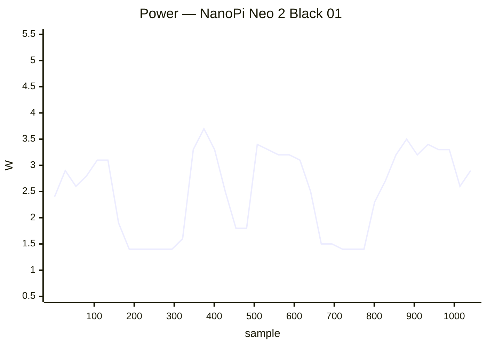

### ✅ NanoPi Neo 3 01

`nanopineo3` · **inplace** · image `26.11.0-trunk.74` · 16 ✅ · 0 ❌ · 0 ⏭️

| Module | Status | Time | Detail |
|:--|:--:|--:|:--|
| upgrade | ✅ | 86 s | nightly · 26.11.0-trunk.74 → 26.11.0-trunk.74 |
| reboot | ✅ | 68 s | power-cycle · up 27 s |
| kernel-switch | ✅ | 58 s | branch=current · family=rockchip64 · installed=26.11.0-trunk.74 · boot_image=/boot/vmlinuz-6.18.55-current-rockchip64 · kernel_before=6.18.55-current-rockchip64 |
| reboot | ✅ | 103 s | power-cycle · 2/2 boots · up 29 s |
| hw-performance | ✅ | 28 s | AES 595 · mem 2300 · disk W 53 / R 63 MB/s · 78.1 °C · 1296 MHz |
| dvfs | ✅ | 30 s | ondemand · 408–1296 MHz (peak 1296) |
| network-iperf | ✅ | 378 s | end0 ↑919/↓939 (1GE) · wlx7cdd905518f9 ↑32/↓28 (Wi-Fi 4) Mbps |
| store-versions | ✅ | 7 s | 26.11.0-trunk.74 · 6.18.55-current-rockchip64 |
| kernel-switch | ✅ | 173 s | branch=edge · family=rockchip64 · installed=26.11.0-trunk.74 · boot_image=/boot/vmlinuz-7.3.0-rc6-edge-rockchip64 · kernel_before=6.18.55-current-rockchip64 |
| reboot | ✅ | 99 s | power-cycle · 2/2 boots · up 26 s |
| hw-performance | ✅ | 30 s | AES 599 · mem 2300 · disk W 1 / R 62 MB/s · 80 °C · 1296 MHz |
| dvfs | ✅ | 33 s | ondemand · 408–1296 MHz (peak 1296) |
| network-iperf | ✅ | 141 s | end0 ↑921/↓940 (1GE) · wlx7cdd905518f9 ↑31/↓12 (Wi-Fi 4) Mbps |
| store-versions | ✅ | 7 s | 26.11.0-trunk.74 · 7.3.0-rc6-edge-rockchip64 |
| kernel-switch | ✅ | 170 s | branch=current · family=rockchip64 · installed=26.11.0-trunk.74 · boot_image=/boot/vmlinuz-6.18.55-current-rockchip64 · kernel_before=7.3.0-rc6-edge-rockchip64 |
| reboot | ✅ | 68 s | power-cycle · up 30 s |

**Power** — min 3.0 W · avg 4.5 W · peak 5.7 W · 1173 samples

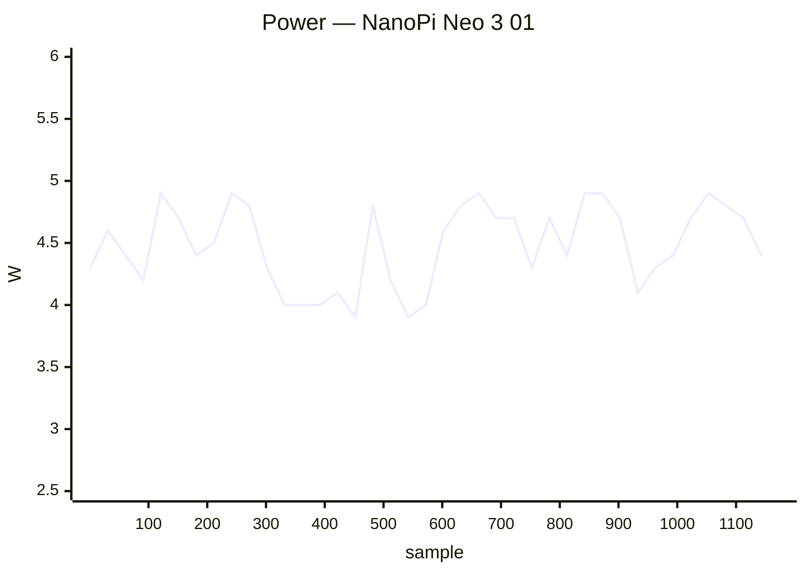

### ✅ NanoPi R6S 01

`nanopi-r6s` · **inplace** · image `26.11.0-trunk.74` · 22 ✅ · 0 ❌ · 0 ⏭️

| Module | Status | Time | Detail |
|:--|:--:|--:|:--|
| upgrade | ✅ | 29 s | nightly · 26.11.0-trunk.74 → 26.11.0-trunk.74 |
| reboot | ✅ | 42 s | power-cycle · up 15 s |
| kernel-switch | ✅ | 19 s | branch=vendor · family=rk35xx · installed=26.11.0-trunk.74 · boot_image=/boot/vmlinuz-6.1.172-vendor-rk35xx · kernel_before=6.1.172-vendor-rk35xx |
| reboot | ✅ | 70 s | power-cycle · 2/2 boots · up 23 s |
| hw-performance | ✅ | 15 s | AES 1268 · mem 13800 · disk W 210 / R 259 MB/s · 42.5 °C · 1800 MHz |
| dvfs | ✅ | 17 s | ondemand · 1800–1800 MHz (peak 2256) |
| network-iperf | ✅ | 82 s | lan2 ↑941/↓941 (1GE) · wan ↑2352/↓2327 (2.5GE) Mbps |
| store-versions | ✅ | 4 s | 26.11.0-trunk.74 · 6.1.172-vendor-rk35xx |
| kernel-switch | ✅ | 51 s | branch=current · family=rockchip64 · installed=26.11.0-trunk.74 · boot_image=/boot/vmlinuz-6.18.55-current-rockchip64 · kernel_before=6.1.172-vendor-rk35xx |
| reboot | ✅ | 69 s | power-cycle · 2/2 boots · up 22 s |
| hw-performance | ✅ | 15 s | AES 1273 · mem 10200 · disk W 145 / R 149 MB/s · 44.4 °C · 1800 MHz |
| dvfs | ✅ | 15 s | ondemand · 408–1800 MHz (peak 2400) |
| network-iperf | ✅ | 53 s | lan2 ↑941/↓941 (1GE) · wan ↑2352/↓2320 (2.5GE) Mbps |
| store-versions | ✅ | 4 s | 26.11.0-trunk.74 · 6.18.55-current-rockchip64 |
| kernel-switch | ✅ | 43 s | branch=edge · family=rockchip64 · installed=26.11.0-trunk.74 · boot_image=/boot/vmlinuz-7.3.0-rc6-edge-rockchip64 · kernel_before=6.18.55-current-rockchip64 |
| reboot | ✅ | 61 s | power-cycle · 2/2 boots · up 16 s |
| hw-performance | ✅ | 15 s | AES 1272 · mem 5200 · disk W 145 / R 158 MB/s · 45.3 °C · 1800 MHz |
| dvfs | ✅ | 17 s | ondemand · 408–1800 MHz (peak 2400) |
| network-iperf | ✅ | 134 s | lan2 ↑941/↓941 (1GE) · wan ↑2351/↓1712 (2.5GE) Mbps |
| store-versions | ✅ | 4 s | 26.11.0-trunk.74 · 7.3.0-rc6-edge-rockchip64 |
| kernel-switch | ✅ | 39 s | branch=vendor · family=rk35xx · installed=26.11.0-trunk.74 · boot_image=/boot/vmlinuz-6.1.172-vendor-rk35xx · kernel_before=7.3.0-rc6-edge-rockchip64 |
| reboot | ✅ | 42 s | power-cycle · up 16 s |

**Power** — min 2.4 W · avg 4.0 W · peak 10.2 W · 647 samples

```mermaid
xychart-beta
    title "Power — NanoPi R6S 01"
    x-axis "sample" 1 --> 647
    y-axis "W" 2.0 --> 10.5
    line [2.8, 4.2, 3.6, 3.5, 4.2, 4.0, 3.5, 3.8, 4.9, 3.2, 3.9, 3.2, 3.2, 4.0, 4.4, 4.3, 3.0, 3.2, 3.8, 4.0, 5.0, 3.9, 4.3, 3.9, 4.6, 5.7, 3.7, 4.1, 4.3, 5.7, 4.0, 3.2, 3.2, 3.7, 3.3, 4.1, 4.4, 4.5, 4.4, 4.4]
```

### ✅ NanoPi R76S 01

`nanopi-r76s` · **inplace** · image `26.11.0-trunk.72` · 15 ✅ · 0 ❌ · 1 ⏭️

| Module | Status | Time | Detail |
|:--|:--:|--:|:--|
| upgrade | ⏭️ | 14 s | — |
| reboot | ✅ | 77 s | power-cycle · up 31 s |
| kernel-switch | ✅ | 31 s | branch=vendor · family=rk35xx · installed=26.11.0-trunk.74 · boot_image=/boot/vmlinuz-6.1.172-vendor-rk35xx · kernel_before=6.1.172-vendor-rk35xx |
| reboot | ✅ | 108 s | power-cycle · 2/2 boots · up 31 s |
| hw-performance | ✅ | 23 s | AES 1273 · mem 7400 · disk W 63 / R 77 MB/s · 47.2 °C · 2016 MHz |
| dvfs | ✅ | 21 s | ondemand · 2016–2016 MHz (peak 2208) |
| network-iperf | ✅ | 93 s | end1 ↑2335/↓2354 (2.5GE) · wlan0 ↑47/↓72 (Wi-Fi 5) · wlxe0e1a933de37 ↑75/↓217 (Wi-Fi 5) Mbps |
| store-versions | ✅ | 5 s | 26.11.0-trunk.72 · 6.1.172-vendor-rk35xx |
| kernel-switch | ✅ | 162 s | branch=edge · family=rockchip64 · installed=26.11.0-trunk.74 · boot_image=/boot/vmlinuz-7.3.0-rc6-edge-rockchip64 · kernel_before=6.1.172-vendor-rk35xx |
| reboot | ✅ | 112 s | power-cycle · 2/2 boots · up 30 s |
| hw-performance | ✅ | 21 s | AES 1304 · mem 8600 · disk W 21 / R 71 MB/s · 47.2 °C · 2016 MHz |
| dvfs | ✅ | 22 s | ondemand · 408–2016 MHz (peak 2208) |
| network-iperf | ✅ | 168 s | end0 ↑2346/↓2033 (2.5GE) · end1 ↑2352/↓2354 (2.5GE) · wlan0 ↑56/↓180 (Wi-Fi 5) · wlxe0e1a933de37 ↑193/↓206 (Wi-Fi 5) Mbps |
| store-versions | ✅ | 4 s | 26.11.0-trunk.72 · 7.3.0-rc6-edge-rockchip64 |
| kernel-switch | ✅ | 95 s | branch=vendor · family=rk35xx · installed=26.11.0-trunk.74 · boot_image=/boot/vmlinuz-6.1.172-vendor-rk35xx · kernel_before=7.3.0-rc6-edge-rockchip64 |
| reboot | ✅ | 77 s | power-cycle · up 33 s |

**Power** — min 0.6 W · avg 4.4 W · peak 9.4 W · 677 samples

```mermaid
xychart-beta
    title "Power — NanoPi R76S 01"
    x-axis "sample" 1 --> 677
    y-axis "W" 0.5 --> 9.5
    line [4.4, 4.2, 2.5, 4.2, 5.0, 3.4, 3.9, 3.0, 4.1, 5.0, 5.8, 5.2, 4.9, 5.0, 5.2, 5.2, 4.8, 4.9, 4.5, 4.2, 4.7, 3.4, 3.8, 2.9, 3.7, 4.7, 6.4, 4.3, 4.7, 4.9, 4.8, 4.4, 4.5, 4.7, 5.0, 5.0, 5.2, 4.2, 2.0, 3.8]
```

### ✅ Odroid C2 01

`odroidc2` · **inplace** · image `26.11.0-trunk.74` · 16 ✅ · 0 ❌ · 0 ⏭️

| Module | Status | Time | Detail |
|:--|:--:|--:|:--|
| upgrade | ✅ | 61 s | nightly · 26.11.0-trunk.74 → 26.11.0-trunk.74 |
| reboot | ✅ | 33 s | warm · up 17 s |
| kernel-switch | ✅ | 37 s | branch=current · family=meson64 · installed=26.11.0-trunk.74 · boot_image=/boot/vmlinuz-6.18.55-current-meson64 · kernel_before=6.18.55-current-meson64 |
| reboot | ✅ | 61 s | warm · 2/2 boots · up 17 s |
| hw-performance | ✅ | 22 s | AES 51 · mem 3500 · disk W 32 / R 150 MB/s · 47 °C · 1536 MHz |
| dvfs | ✅ | 22 s | ondemand · 500–1536 MHz (peak 1536) |
| network-iperf | ✅ | 35 s | end0 ↑940/↓941 (1GE) Mbps |
| store-versions | ✅ | 5 s | 26.11.0-trunk.74 · 6.18.55-current-meson64 |
| kernel-switch | ✅ | 115 s | branch=edge · family=meson64 · installed=26.11.0-trunk.74 · boot_image=/boot/vmlinuz-7.3.0-rc6-edge-meson64 · kernel_before=6.18.55-current-meson64 |
| reboot | ✅ | 64 s | warm · 2/2 boots · up 18 s |
| hw-performance | ✅ | 23 s | AES 51 · mem 3400 · disk W 32 / R 139 MB/s · 49 °C · 1536 MHz |
| dvfs | ✅ | 24 s | ondemand · 500–1536 MHz (peak 1536) |
| network-iperf | ✅ | 33 s | end0 ↑940/↓941 (1GE) Mbps |
| store-versions | ✅ | 5 s | 26.11.0-trunk.74 · 7.3.0-rc6-edge-meson64 |
| kernel-switch | ✅ | 111 s | branch=current · family=meson64 · installed=26.11.0-trunk.74 · boot_image=/boot/vmlinuz-6.18.55-current-meson64 · kernel_before=7.3.0-rc6-edge-meson64 |
| reboot | ✅ | 32 s | warm · up 15 s |

### ✅ Odroid C4 01

`odroidc4` · **inplace** · image `26.11.0-trunk.74` · 16 ✅ · 0 ❌ · 0 ⏭️

| Module | Status | Time | Detail |
|:--|:--:|--:|:--|
| upgrade | ✅ | 44 s | nightly · 26.11.0-trunk.74 → 26.11.0-trunk.74 |
| reboot | ✅ | 53 s | power-cycle · up 17 s |
| kernel-switch | ✅ | 30 s | branch=current · family=meson64 · installed=26.11.0-trunk.74 · boot_image=/boot/vmlinuz-6.18.55-current-meson64 · kernel_before=6.18.55-current-meson64 |
| reboot | ✅ | 76 s | power-cycle · 2/2 boots · up 17 s |
| hw-performance | ✅ | 22 s | AES 981 · mem 5200 · disk W 30 / R 77 MB/s · 41.4 °C · 2100 MHz |
| dvfs | ✅ | 19 s | ondemand · 1000–2100 MHz (peak 2100) |
| network-iperf | ✅ | 182 s | end0 ↑941/↓941 (1GE) · wlx24050fdd332b ↑117/↓123 (Wi-Fi 4) Mbps |
| store-versions | ✅ | 4 s | 26.11.0-trunk.74 · 6.18.55-current-meson64 |
| kernel-switch | ✅ | 107 s | branch=edge · family=meson64 · installed=26.11.0-trunk.74 · boot_image=/boot/vmlinuz-7.3.0-rc6-edge-meson64 · kernel_before=6.18.55-current-meson64 |
| reboot | ✅ | 82 s | power-cycle · 2/2 boots · up 16 s |
| hw-performance | ✅ | 22 s | AES 980 · mem 5200 · disk W 30 / R 78 MB/s · 42.3 °C · 2100 MHz |
| dvfs | ✅ | 22 s | ondemand · 1000–2100 MHz (peak 2100) |
| network-iperf | ✅ | 91 s | end0 ↑941/↓941 (1GE) · wlx24050fdd332b ↑88/↓129 (Wi-Fi 4) Mbps |
| store-versions | ✅ | 5 s | 26.11.0-trunk.74 · 7.3.0-rc6-edge-meson64 |
| kernel-switch | ✅ | 108 s | branch=current · family=meson64 · installed=26.11.0-trunk.74 · boot_image=/boot/vmlinuz-6.18.55-current-meson64 · kernel_before=7.3.0-rc6-edge-meson64 |
| reboot | ✅ | 55 s | power-cycle · up 18 s |

**Power** — min 1.0 W · avg 3.4 W · peak 5.1 W · 730 samples

```mermaid
xychart-beta
    title "Power — Odroid C4 01"
    x-axis "sample" 1 --> 730
    y-axis "W" 0.5 --> 5.5
    line [3.5, 3.8, 3.3, 2.6, 3.8, 3.6, 3.3, 3.0, 3.3, 3.6, 3.7, 3.0, 3.4, 2.9, 3.5, 4.0, 3.0, 3.0, 3.8, 3.7, 3.7, 3.7, 3.7, 3.5, 3.6, 2.8, 2.8, 3.6, 3.7, 3.6, 3.4, 3.0, 4.4, 3.6, 3.6, 3.7, 3.6, 3.6, 2.7, 2.4]
```

### ✅ Odroid M1 01

`odroidm1` · **inplace** · image `26.11.0-trunk.81` · 16 ✅ · 0 ❌ · 0 ⏭️

| Module | Status | Time | Detail |
|:--|:--:|--:|:--|
| upgrade | ✅ | 49 s | nightly · 26.11.0-trunk.81 → 26.11.0-trunk.81 |
| reboot | ✅ | 56 s | power-cycle · up 19 s |
| kernel-switch | ✅ | 92 s | branch=current · family=rockchip64 · installed=26.11.0-trunk.81 · boot_image=/boot/vmlinuz-6.18.55-current-rockchip64 · kernel_before=7.3.0-rc6-edge-rockchip64 |
| reboot | ✅ | 88 s | power-cycle · 2/2 boots · up 23 s |
| hw-performance | ✅ | 17 s | AES 914 · mem 5100 · disk W 985 / R 1072 MB/s · 37.2 °C · 1992 MHz |
| dvfs | ✅ | 21 s | ondemand · 408–1992 MHz (peak 1992) |
| network-iperf | ✅ | 33 s | eth0 ↑584/↓941 (1GE) Mbps |
| store-versions | ✅ | 5 s | 26.11.0-trunk.81 · 6.18.55-current-rockchip64 |
| kernel-switch | ✅ | 91 s | branch=edge · family=rockchip64 · installed=26.11.0-trunk.81 · boot_image=/boot/vmlinuz-7.3.0-rc6-edge-rockchip64 · kernel_before=6.18.55-current-rockchip64 |
| reboot | ✅ | 85 s | power-cycle · 2/2 boots · up 24 s |
| hw-performance | ✅ | 18 s | AES 913 · mem 5100 · disk W 1037 / R 1055 MB/s · 37.8 °C · 1992 MHz |
| dvfs | ✅ | 24 s | ondemand · 408–1992 MHz (peak 1992) |
| network-iperf | ✅ | 32 s | eth0 ↑941/↓941 (1GE) Mbps |
| store-versions | ✅ | 5 s | 26.11.0-trunk.81 · 7.3.0-rc6-edge-rockchip64 |
| kernel-switch | ✅ | 84 s | branch=current · family=rockchip64 · installed=26.11.0-trunk.81 · boot_image=/boot/vmlinuz-6.18.55-current-rockchip64 · kernel_before=7.3.0-rc6-edge-rockchip64 |
| reboot | ✅ | 60 s | power-cycle · up 21 s |

**Power** — min 1.9 W · avg 5.7 W · peak 9.3 W · 588 samples

```mermaid
xychart-beta
    title "Power — Odroid M1 01"
    x-axis "sample" 1 --> 588
    y-axis "W" 1.5 --> 9.5
    line [5.3, 5.3, 5.1, 4.9, 5.4, 5.7, 5.6, 7.5, 5.1, 5.2, 5.1, 7.4, 5.1, 5.1, 5.4, 5.5, 5.0, 5.2, 5.2, 5.5, 8.3, 5.2, 6.2, 6.0, 6.3, 6.7, 4.9, 6.6, 4.8, 6.3, 5.9, 5.0, 5.3, 5.5, 8.3, 5.1, 5.3, 5.0, 4.9, 6.4]
```

### ✅ Odroid N2 01

`odroidn2` · **inplace** · image `26.11.0-trunk.74` · 16 ✅ · 0 ❌ · 0 ⏭️

| Module | Status | Time | Detail |
|:--|:--:|--:|:--|
| upgrade | ✅ | 49 s | nightly · 26.11.0-trunk.74 → 26.11.0-trunk.74 |
| reboot | ✅ | 71 s | power-cycle · up 29 s |
| kernel-switch | ✅ | 25 s | branch=current · family=meson64 · installed=26.11.0-trunk.74 · boot_image=/boot/vmlinuz-6.18.55-current-meson64 · kernel_before=6.18.55-current-meson64 |
| reboot | ✅ | 96 s | power-cycle · 2/2 boots · up 30 s |
| hw-performance | ✅ | 19 s | AES 1085 · mem 4900 · disk W 27 / R 138 MB/s · 41.6 °C · 1992 MHz |
| dvfs | ✅ | 17 s | performance · 1000–1992 MHz (peak 1992) |
| network-iperf | ✅ | 31 s | end0 ↑939/↓941 (1GE) Mbps |
| store-versions | ✅ | 4 s | 26.11.0-trunk.74 · 6.18.55-current-meson64 |
| kernel-switch | ✅ | 83 s | branch=edge · family=meson64 · installed=26.11.0-trunk.74 · boot_image=/boot/vmlinuz-7.3.0-rc6-edge-meson64 · kernel_before=6.18.55-current-meson64 |
| reboot | ✅ | 97 s | power-cycle · 2/2 boots · up 31 s |
| hw-performance | ✅ | 19 s | AES 1085 · mem 4900 · disk W 27 / R 137 MB/s · 42 °C · 1992 MHz |
| dvfs | ✅ | 19 s | performance · 1000–1992 MHz (peak 1992) |
| network-iperf | ✅ | 28 s | end0 ↑940/↓941 (1GE) Mbps |
| store-versions | ✅ | 4 s | 26.11.0-trunk.74 · 7.3.0-rc6-edge-meson64 |
| kernel-switch | ✅ | 82 s | branch=current · family=meson64 · installed=26.11.0-trunk.74 · boot_image=/boot/vmlinuz-6.18.55-current-meson64 · kernel_before=7.3.0-rc6-edge-meson64 |
| reboot | ✅ | 65 s | power-cycle · up 28 s |

**Power** — min 1.0 W · avg 5.0 W · peak 11.2 W · 556 samples

```mermaid
xychart-beta
    title "Power — Odroid N2 01"
    x-axis "sample" 1 --> 556
    y-axis "W" 0.5 --> 11.5
    line [4.9, 5.0, 5.1, 5.0, 3.4, 3.4, 5.9, 5.9, 4.9, 4.2, 5.3, 4.4, 3.9, 5.6, 7.2, 6.5, 4.8, 4.4, 5.4, 5.1, 5.2, 5.3, 4.9, 3.0, 5.6, 4.3, 3.3, 5.3, 5.8, 8.5, 4.5, 4.7, 5.5, 5.1, 5.2, 5.2, 5.1, 3.7, 2.5, 4.8]
```

### ✅ Odroid XU4 01

`odroidxu4` · **inplace** · image `26.8.3` · 16 ✅ · 0 ❌ · 0 ⏭️

| Module | Status | Time | Detail |
|:--|:--:|--:|:--|
| upgrade | ✅ | 151 s | nightly · 26.8.3 → 26.11.0-trunk.74 |
| reboot | ✅ | 61 s | power-cycle · up 29 s |
| kernel-switch | ✅ | 38 s | branch=current · family=odroidxu4 · installed=26.11.0-trunk.74 · boot_image=/boot/vmlinuz-6.6.155-current-odroidxu4 · kernel_before=6.6.155-current-odroidxu4 |
| reboot | ✅ | 100 s | power-cycle · 2/2 boots · up 28 s |
| hw-performance | ✅ | 30 s | AES 65 · mem 5100 · disk W 49 / R 60 MB/s · 69 °C · 1400 MHz |
| dvfs | ✅ | 32 s | ondemand · 600–1300 MHz (peak 2000) |
| network-iperf | ✅ | 43 s | end0 ↑922/↓941 Mbps |
| store-versions | ✅ | 7 s | 26.11.0-trunk.74 · 6.6.155-current-odroidxu4 |
| kernel-switch | ✅ | 95 s | branch=edge · family=odroidxu4 · installed=26.11.0-trunk.74 · boot_image=/boot/vmlinuz-7.2.9-edge-odroidxu4 · kernel_before=6.6.155-current-odroidxu4 |
| reboot | ✅ | 100 s | power-cycle · 2/2 boots · up 31 s |
| hw-performance | ✅ | 28 s | AES 64 · mem 4000 · disk W 51 / R 62 MB/s · 68 °C · 1400 MHz |
| dvfs | ✅ | 34 s | ondemand · 600–1300 MHz (peak 1800) |
| network-iperf | ✅ | 39 s | end0 ↑921/↓941 Mbps |
| store-versions | ✅ | 6 s | 26.11.0-trunk.74 · 7.2.9-edge-odroidxu4 |
| kernel-switch | ✅ | 89 s | branch=current · family=odroidxu4 · installed=26.11.0-trunk.74 · boot_image=/boot/vmlinuz-6.6.155-current-odroidxu4 · kernel_before=7.2.9-edge-odroidxu4 |
| reboot | ✅ | 65 s | power-cycle · up 32 s |

### ✅ Orange Pi 3 01

`orangepi3` · **inplace** · image `26.11.0-trunk.58` · 15 ✅ · 0 ❌ · 1 ⏭️

| Module | Status | Time | Detail |
|:--|:--:|--:|:--|
| upgrade | ⏭️ | 44 s | — |
| reboot | ✅ | 62 s | power-cycle · up 28 s |
| kernel-switch | ✅ | 36 s | branch=current · family=sunxi64 · installed=26.8.0-trunk.61 · boot_image=/boot/vmlinuz-6.18.33-current-sunxi64 · kernel_before=6.18.33-current-sunxi64 |
| reboot | ✅ | 323 s | power-cycle · 1/2 boots · up 25 s |
| hw-performance | ✅ | 29 s | AES 838 · mem 4600 · disk W 20 / R 23 MB/s · 47.7 °C · 1800 MHz |
| dvfs | ✅ | 20 s | ondemand · 480–1800 MHz (peak 1800) |
| network-iperf | ✅ | 58 s | end0 ↑912/↓941 (1GE) · wlan0 ↑57/↓113 (Wi-Fi 5) Mbps |
| store-versions | ✅ | 5 s | 26.11.0-trunk.58 · 6.18.33-current-sunxi64 |
| kernel-switch | ✅ | 104 s | branch=edge · family=sunxi64 · installed=26.8.0-trunk.61 · boot_image=/boot/vmlinuz-7.0.10-edge-sunxi64 · kernel_before=6.18.33-current-sunxi64 |
| reboot | ✅ | 320 s | power-cycle · 1/2 boots · up 24 s |
| hw-performance | ✅ | 28 s | AES 838 · mem 4600 · disk W 21 / R 23 MB/s · 46.4 °C · 1800 MHz |
| dvfs | ✅ | 20 s | ondemand · 480–1800 MHz (peak 1800) |
| network-iperf | ✅ | 185 s | end0 ↑916/↓941 (1GE) · wlan0 ↑19/↓46 (Wi-Fi 5) Mbps |
| store-versions | ✅ | 5 s | 26.11.0-trunk.58 · 7.0.10-edge-sunxi64 |
| kernel-switch | ✅ | 98 s | branch=current · family=sunxi64 · installed=26.8.0-trunk.61 · boot_image=/boot/vmlinuz-6.18.33-current-sunxi64 · kernel_before=7.0.10-edge-sunxi64 |
| reboot | ✅ | 57 s | power-cycle · up 24 s |

### ✅ Orange Pi 5 Plus 01

`orangepi5-plus` · **inplace** · image `26.11.0-trunk.74` · 22 ✅ · 0 ❌ · 0 ⏭️

| Module | Status | Time | Detail |
|:--|:--:|--:|:--|
| upgrade | ✅ | 25 s | nightly · 26.11.0-trunk.74 → 26.11.0-trunk.74 |
| reboot | ✅ | 65 s | power-cycle · up 36 s |
| kernel-switch | ✅ | 22 s | branch=vendor · family=rk35xx · installed=26.11.0-trunk.74 · boot_image=/boot/vmlinuz-6.1.172-vendor-rk35xx · kernel_before=6.1.172-vendor-rk35xx |
| reboot | ✅ | 96 s | power-cycle · 2/2 boots · up 29 s |
| hw-performance | ✅ | 18 s | AES 1260 · mem 13800 · disk W 52 / R 62 MB/s · 61.9 °C · 1800 MHz |
| dvfs | ✅ | 16 s | ondemand · 1800–1800 MHz (peak 2256) |
| network-iperf | ✅ | 140 s | enP3p49s0 ↑2349/↓2347 (2.5GE) · enP4p65s0 ↑2353/↓2330 (2.5GE) · wlxe0e1a9380c53 ↑525/↓358 (Wi-Fi 6) Mbps |
| store-versions | ✅ | 4 s | 26.11.0-trunk.74 · 6.1.172-vendor-rk35xx |
| kernel-switch | ✅ | 97 s | branch=current · family=rockchip64 · installed=26.11.0-trunk.74 · boot_image=/boot/vmlinuz-6.18.55-current-rockchip64 · kernel_before=6.1.172-vendor-rk35xx |
| reboot | ✅ | 91 s | power-cycle · 2/2 boots · up 24 s |
| hw-performance | ✅ | 18 s | AES 1246 · mem 10200 · disk W 52 / R 57 MB/s · 64.7 °C · 1800 MHz |
| dvfs | ✅ | 16 s | ondemand · 408–1800 MHz (peak 2400) |
| network-iperf | ✅ | 80 s | enP3p49s0 ↑2350/↓2354 (2.5GE) · enP4p65s0 ↑2340/↓2319 (2.5GE) · wlxe0e1a9380c53 ↑600/↓310 (Wi-Fi 6) Mbps |
| store-versions | ✅ | 4 s | 26.11.0-trunk.74 · 6.18.55-current-rockchip64 |
| kernel-switch | ✅ | 66 s | branch=edge · family=rockchip64 · installed=26.11.0-trunk.74 · boot_image=/boot/vmlinuz-7.3.0-rc6-edge-rockchip64 · kernel_before=6.18.55-current-rockchip64 |
| reboot | ✅ | 92 s | power-cycle · 2/2 boots · up 30 s |
| hw-performance | ✅ | 19 s | AES 1245 · mem 8000 · disk W 45 / R 56 MB/s · 66.5 °C · 1800 MHz |
| dvfs | ✅ | 17 s | ondemand · 408–1800 MHz (peak 2400) |
| network-iperf | ✅ | 108 s | enP3p49s0 ↑2353/↓2346 (2.5GE) · enP4p65s0 ↑2331/↓2285 (2.5GE) · wlxe0e1a9380c53 ↑161/↓130 (Wi-Fi 6) Mbps |
| store-versions | ✅ | 4 s | 26.11.0-trunk.74 · 7.3.0-rc6-edge-rockchip64 |
| kernel-switch | ✅ | 67 s | branch=vendor · family=rk35xx · installed=26.11.0-trunk.74 · boot_image=/boot/vmlinuz-6.1.172-vendor-rk35xx · kernel_before=7.3.0-rc6-edge-rockchip64 |
| reboot | ✅ | 58 s | power-cycle · up 28 s |

**Power** — min 0.7 W · avg 7.6 W · peak 15.5 W · 708 samples

```mermaid
xychart-beta
    title "Power — Orange Pi 5 Plus 01"
    x-axis "sample" 1 --> 708
    y-axis "W" 0.5 --> 16.0
    line [7.8, 5.9, 5.5, 7.8, 5.0, 6.8, 4.4, 7.4, 8.9, 7.8, 8.0, 6.5, 6.7, 8.6, 8.1, 7.4, 7.5, 7.3, 5.5, 6.5, 6.7, 10.0, 8.7, 9.1, 10.1, 8.7, 8.6, 7.9, 6.7, 4.9, 8.5, 10.1, 8.2, 8.3, 9.0, 8.6, 8.9, 9.0, 6.9, 5.7]
```

### ✅ Orange Pi Lite 2 01

`orangepilite2` · **inplace** · image `26.11.0-trunk.73` · 16 ✅ · 0 ❌ · 0 ⏭️

| Module | Status | Time | Detail |
|:--|:--:|--:|:--|
| upgrade | ✅ | 60 s | nightly · 26.11.0-trunk.73 → 26.11.0-trunk.73 |
| reboot | ✅ | 38 s | warm · up 22 s |
| kernel-switch | ✅ | 40 s | branch=current · family=sunxi64 · installed=26.11.0-trunk.73 · boot_image=/boot/vmlinuz-6.18.55-current-sunxi64 · kernel_before=6.18.55-current-sunxi64 |
| reboot | ✅ | 77 s | warm · 2/2 boots · up 25 s |
| hw-performance | ✅ | 32 s | AES 833 · mem 4400 · disk W 21 / R 22 MB/s · 73 °C · 1800 MHz |
| dvfs | ✅ | 25 s | ondemand · 480–1800 MHz (peak 1800) |
| network-iperf | ✅ | 45 s | wlan0 ↑6/↓3 (Wi-Fi 5) Mbps |
| store-versions | ✅ | 5 s | 26.11.0-trunk.73 · 6.18.55-current-sunxi64 |
| kernel-switch | ✅ | 134 s | branch=edge · family=sunxi64 · installed=26.11.0-trunk.73 · boot_image=/boot/vmlinuz-7.2.9-edge-sunxi64 · kernel_before=6.18.55-current-sunxi64 |
| reboot | ✅ | 72 s | warm · 2/2 boots · up 20 s |
| hw-performance | ✅ | 32 s | AES 793 · mem 4600 · disk W 22 / R 3 MB/s · 71.6 °C · 1800 MHz |
| dvfs | ✅ | 25 s | ondemand · 480–1800 MHz (peak 1800) |
| network-iperf | ✅ | 39 s | wlan0 ↑23/↓21 (Wi-Fi 5) Mbps |
| store-versions | ✅ | 5 s | 26.11.0-trunk.73 · 7.2.9-edge-sunxi64 |
| kernel-switch | ✅ | 135 s | branch=current · family=sunxi64 · installed=26.11.0-trunk.73 · boot_image=/boot/vmlinuz-6.18.55-current-sunxi64 · kernel_before=7.2.9-edge-sunxi64 |
| reboot | ✅ | 40 s | warm · up 23 s |

### ✅ Orange Pi One+ 01

`orangepioneplus` · **inplace** · image `26.11.0-trunk.74` · 16 ✅ · 0 ❌ · 0 ⏭️

| Module | Status | Time | Detail |
|:--|:--:|--:|:--|
| upgrade | ✅ | 87 s | nightly · 26.11.0-trunk.74 → 26.11.0-trunk.74 |
| reboot | ✅ | 41 s | warm · up 24 s |
| kernel-switch | ✅ | 43 s | branch=current · family=sunxi64 · installed=26.11.0-trunk.74 · boot_image=/boot/vmlinuz-6.18.55-current-sunxi64 · kernel_before=6.18.55-current-sunxi64 |
| reboot | ✅ | 70 s | warm · 2/2 boots · up 21 s |
| hw-performance | ✅ | 29 s | AES 839 · mem 4600 · disk W 21 / R 23 MB/s · 65.4 °C · 1800 MHz |
| dvfs | ✅ | 22 s | ondemand · 480–1800 MHz (peak 1800) |
| network-iperf | ✅ | 130 s | end0 ↑914/↓941 (1GE) · wlx00e04c881724 ↑68/↓103 (Wi-Fi 5) Mbps |
| store-versions | ✅ | 5 s | 26.11.0-trunk.74 · 6.18.55-current-sunxi64 |
| kernel-switch | ✅ | 125 s | branch=edge · family=sunxi64 · installed=26.11.0-trunk.74 · boot_image=/boot/vmlinuz-7.2.9-edge-sunxi64 · kernel_before=6.18.55-current-sunxi64 |
| reboot | ✅ | 72 s | warm · 2/2 boots · up 23 s |
| hw-performance | ✅ | 30 s | AES 839 · mem 4600 · disk W 21 / R 1 MB/s · 64 °C · 1800 MHz |
| dvfs | ✅ | 23 s | ondemand · 480–1800 MHz (peak 1800) |
| network-iperf | ✅ | 62 s | end0 ↑910/↓940 (1GE) · wlx00e04c881724 ↑25/↓30 (Wi-Fi 5) Mbps |
| store-versions | ✅ | 5 s | 26.11.0-trunk.74 · 7.2.9-edge-sunxi64 |
| kernel-switch | ✅ | 127 s | branch=current · family=sunxi64 · installed=26.11.0-trunk.74 · boot_image=/boot/vmlinuz-6.18.55-current-sunxi64 · kernel_before=7.2.9-edge-sunxi64 |
| reboot | ✅ | 37 s | warm · up 20 s |

### ✅ Orange Pi PC + 01

`orangepipcplus` · **inplace** · image `26.11.0-trunk.75` · 16 ✅ · 0 ❌ · 0 ⏭️

| Module | Status | Time | Detail |
|:--|:--:|--:|:--|
| upgrade | ✅ | 128 s | nightly · 26.11.0-trunk.81 → 26.11.0-trunk.81 |
| reboot | ✅ | 50 s | warm · up 30 s |
| kernel-switch | ✅ | 74 s | branch=current · family=sunxi · installed=26.11.0-trunk.81 · boot_image=/boot/vmlinuz-6.18.55-current-sunxi · kernel_before=6.18.55-current-sunxi |
| reboot | ✅ | 93 s | warm · 2/2 boots · up 28 s |
| hw-performance | ✅ | 42 s | AES 25 · mem 2200 · disk W 8 / R 77 MB/s · 55.6 °C · 1296 MHz |
| dvfs | ✅ | 39 s | ondemand · 480–1296 MHz (peak 1296) |
| network-iperf | ✅ | 114 s | end0 ↑92/↓94 (10/100ME) · wlan0 ↑31/↓25 (Wi-Fi 4) · wlan1 ↑30/↓28 (Wi-Fi 4) Mbps |
| store-versions | ✅ | 9 s | 26.11.0-trunk.81 · 6.18.55-current-sunxi |
| kernel-switch | ✅ | 241 s | branch=edge · family=sunxi · installed=26.11.0-trunk.81 · boot_image=/boot/vmlinuz-7.2.9-edge-sunxi · kernel_before=6.18.55-current-sunxi |
| reboot | ✅ | 88 s | warm · 2/2 boots · up 27 s |
| hw-performance | ✅ | 40 s | AES 25 · mem 2200 · disk W 12 / R 78 MB/s · 56.4 °C · 1296 MHz |
| dvfs | ✅ | 42 s | ondemand · 480–1296 MHz (peak 1296) |
| network-iperf | ✅ | 114 s | end0 ↑94/↓94 (10/100ME) · wlan0 ↑27/↓25 (Wi-Fi 4) · wlan1 ↑31/↓25 (Wi-Fi 4) Mbps |
| store-versions | ✅ | 9 s | 26.11.0-trunk.81 · 7.2.9-edge-sunxi |
| kernel-switch | ✅ | 189 s | branch=current · family=sunxi · installed=26.11.0-trunk.81 · boot_image=/boot/vmlinuz-6.18.55-current-sunxi · kernel_before=7.2.9-edge-sunxi |
| reboot | ✅ | 50 s | warm · up 29 s |

### ✅ Orange Pi Prime 01

`orangepiprime` · **inplace** · image `26.11.0-trunk.74` · 14 ✅ · 0 ❌ · 2 ⏭️

| Module | Status | Time | Detail |
|:--|:--:|--:|:--|
| upgrade | ✅ | 98 s | nightly · 26.11.0-trunk.74 → 26.11.0-trunk.74 |
| reboot | ✅ | 54 s | warm · up 37 s |
| kernel-switch | ✅ | 61 s | branch=current · family=sunxi64 · installed=26.11.0-trunk.74 · boot_image=/boot/vmlinuz-6.18.55-current-sunxi64 · kernel_before=6.18.55-current-sunxi64 |
| reboot | ✅ | 96 s | warm · 2/2 boots · up 32 s |
| hw-performance | ✅ | 36 s | AES 379 · mem 2100 · disk W 1 / R 22 MB/s · 44.9 °C · None MHz |
| dvfs | ➖ | 3 s | no cpufreq |
| network-iperf | ✅ | 84 s | end0 ↑879/↓941 (1GE) · wlan0 ↑21/↓10 (Wi-Fi 4) Mbps |
| store-versions | ✅ | 6 s | 26.11.0-trunk.74 · 6.18.55-current-sunxi64 |
| kernel-switch | ✅ | 162 s | branch=edge · family=sunxi64 · installed=26.11.0-trunk.74 · boot_image=/boot/vmlinuz-7.2.9-edge-sunxi64 · kernel_before=6.18.55-current-sunxi64 |
| reboot | ✅ | 94 s | warm · 2/2 boots · up 34 s |
| hw-performance | ✅ | 36 s | AES 380 · mem 2100 · disk W 20 / R 22 MB/s · 45.7 °C · None MHz |
| dvfs | ➖ | 3 s | no cpufreq |
| network-iperf | ✅ | 146 s | end0 ↑881/↓930 (1GE) · wlan0 ↑18/↓19 (Wi-Fi 4) Mbps |
| store-versions | ✅ | 7 s | 26.11.0-trunk.74 · 7.2.9-edge-sunxi64 |
| kernel-switch | ✅ | 158 s | branch=current · family=sunxi64 · installed=26.11.0-trunk.74 · boot_image=/boot/vmlinuz-6.18.55-current-sunxi64 · kernel_before=7.2.9-edge-sunxi64 |
| reboot | ✅ | 49 s | warm · up 30 s |

### ✅ Orange Pi Zero2 01

`orangepizero2` · **inplace** · image `26.11.0-trunk.74` · 16 ✅ · 0 ❌ · 0 ⏭️

| Module | Status | Time | Detail |
|:--|:--:|--:|:--|
| upgrade | ✅ | 90 s | nightly · 26.11.0-trunk.74 → 26.11.0-trunk.74 |
| reboot | ✅ | 61 s | power-cycle · up 24 s |
| kernel-switch | ✅ | 69 s | branch=current · family=sunxi64 · installed=26.11.0-trunk.74 · boot_image=/boot/vmlinuz-6.18.55-current-sunxi64 · kernel_before=6.18.55-current-sunxi64 |
| reboot | ✅ | 96 s | power-cycle · 2/2 boots · up 25 s |
| hw-performance | ✅ | 33 s | AES 697 · mem 3000 · disk W 17 / R 23 MB/s · 68 °C · 1512 MHz |
| dvfs | ✅ | 27 s | ondemand · 480–1512 MHz (peak 1512) |
| network-iperf | ✅ | 94 s | end0 ↑876/↓941 (1GE) · wlx7c023a625db1 ↑38/↓31 (Wi-Fi 5) Mbps |
| store-versions | ✅ | 6 s | 26.11.0-trunk.74 · 6.18.55-current-sunxi64 |
| kernel-switch | ✅ | 155 s | branch=edge · family=sunxi64 · installed=26.11.0-trunk.74 · boot_image=/boot/vmlinuz-7.2.9-edge-sunxi64 · kernel_before=6.18.55-current-sunxi64 |
| reboot | ✅ | 95 s | power-cycle · 2/2 boots · up 24 s |
| hw-performance | ✅ | 33 s | AES 705 · mem 3000 · disk W 21 / R 22 MB/s · 68.4 °C · 1512 MHz |
| dvfs | ✅ | 26 s | ondemand · 480–1512 MHz (peak 1512) |
| network-iperf | ✅ | 172 s | end0 ↑876/↓941 (1GE) · wlx7c023a625db1 ↑36/↓23 (Wi-Fi 5) Mbps |
| store-versions | ✅ | 6 s | 26.11.0-trunk.74 · 7.2.9-edge-sunxi64 |
| kernel-switch | ✅ | 151 s | branch=current · family=sunxi64 · installed=26.11.0-trunk.74 · boot_image=/boot/vmlinuz-6.18.55-current-sunxi64 · kernel_before=7.2.9-edge-sunxi64 |
| reboot | ✅ | 60 s | power-cycle · up 24 s |

**Power** — min 1.9 W · avg 2.8 W · peak 4.3 W · 917 samples

```mermaid
xychart-beta
    title "Power — Orange Pi Zero2 01"
    x-axis "sample" 1 --> 917
    y-axis "W" 1.5 --> 4.5
    line [2.5, 2.7, 2.6, 2.6, 3.0, 2.8, 2.9, 3.0, 2.9, 2.5, 2.9, 2.7, 2.7, 2.5, 2.8, 3.1, 2.7, 2.9, 3.0, 2.6, 2.6, 2.6, 2.4, 2.9, 3.0, 2.7, 3.1, 2.5, 2.6, 2.5, 2.8, 2.8, 3.4, 2.8, 3.0, 3.1, 2.8, 2.8, 2.6, 3.1]
```

### ✅ OrangePi 3 LTS 01

`orangepi3-lts` · **inplace** · image `26.11.0-trunk.75` · 16 ✅ · 0 ❌ · 0 ⏭️

| Module | Status | Time | Detail |
|:--|:--:|--:|:--|
| upgrade | ✅ | 169 s | nightly · 26.11.0-trunk.75 → 26.11.0-trunk.81 |
| reboot | ✅ | 70 s | power-cycle · up 24 s |
| kernel-switch | ✅ | 37 s | branch=current · family=sunxi64 · installed=26.11.0-trunk.81 · boot_image=/boot/vmlinuz-6.18.55-current-sunxi64 · kernel_before=6.18.55-current-sunxi64 |
| reboot | ✅ | 108 s | power-cycle · 2/2 boots · up 27 s |
| hw-performance | ✅ | 20 s | AES 750 · mem 4100 · disk W 54 / R 128 MB/s · 72.8 °C · 1608 MHz |
| dvfs | ✅ | 22 s | ondemand · 480–1608 MHz (peak 1608) |
| network-iperf | ✅ | 58 s | end0 ↑914/↓941 (1GE) · wlan0 ↑141/↓135 (Wi-Fi 5) Mbps |
| store-versions | ✅ | 5 s | 26.11.0-trunk.81 · 6.18.55-current-sunxi64 |
| kernel-switch | ✅ | 94 s | branch=edge · family=sunxi64 · installed=26.11.0-trunk.81 · boot_image=/boot/vmlinuz-7.2.9-edge-sunxi64 · kernel_before=6.18.55-current-sunxi64 |
| reboot | ✅ | 105 s | power-cycle · 2/2 boots · up 24 s |
| hw-performance | ✅ | 21 s | AES 750 · mem 4100 · disk W 54 / R 125 MB/s · 72.2 °C · 1608 MHz |
| dvfs | ✅ | 23 s | ondemand · 480–1608 MHz (peak 1608) |
| network-iperf | ✅ | 59 s | end0 ↑916/↓939 (1GE) · wlan0 ↑137/↓129 (Wi-Fi 5) Mbps |
| store-versions | ✅ | 5 s | 26.11.0-trunk.81 · 7.2.9-edge-sunxi64 |
| kernel-switch | ✅ | 93 s | branch=current · family=sunxi64 · installed=26.11.0-trunk.81 · boot_image=/boot/vmlinuz-6.18.55-current-sunxi64 · kernel_before=7.2.9-edge-sunxi64 |
| reboot | ✅ | 62 s | power-cycle · up 23 s |

**Power** — min 1.0 W · avg 3.3 W · peak 5.1 W · 758 samples

```mermaid
xychart-beta
    title "Power — OrangePi 3 LTS 01"
    x-axis "sample" 1 --> 758
    y-axis "W" 0.5 --> 5.5
    line [3.3, 3.4, 3.5, 3.4, 3.3, 4.1, 3.6, 3.3, 2.4, 2.9, 3.6, 3.5, 2.8, 3.2, 2.2, 3.4, 3.5, 3.7, 3.5, 3.9, 3.1, 3.5, 3.6, 3.5, 3.5, 2.9, 3.4, 2.6, 3.4, 3.4, 3.5, 3.6, 3.7, 3.3, 3.5, 3.8, 3.4, 3.5, 2.4, 3.2]
```

### ✅ Radxa Dragon Q6A 01

`radxa-dragon-q6a` · **inplace** · image `26.11.0-trunk.73` · 16 ✅ · 0 ❌ · 0 ⏭️

| Module | Status | Time | Detail |
|:--|:--:|--:|:--|
| upgrade | ✅ | 73 s | nightly · 26.11.0-trunk.73 → 26.11.0-trunk.74 |
| reboot | ✅ | 142 s | power-cycle · up 107 s |
| kernel-switch | ✅ | 17 s | branch=current · family=qcs6490 · installed=26.11.0-trunk.74 · boot_image=/boot/vmlinuz-6.18.2-current-qcs6490 · kernel_before=6.18.2-current-qcs6490 |
| reboot | ✅ | 250 s | power-cycle · 2/2 boots · up 106 s |
| hw-performance | ✅ | 14 s | AES 1498 · mem 20000 · disk W 240 / R 1182 MB/s · 48 °C · 1958 MHz |
| dvfs | ✅ | 14 s | ondemand · 300–1958 MHz (peak 2707) |
| network-iperf | ✅ | 27 s | enp1s0 ↑941/↓941 (1GE) Mbps |
| store-versions | ✅ | 4 s | 26.11.0-trunk.74 · 6.18.2-current-qcs6490 |
| kernel-switch | ✅ | 80 s | branch=edge · family=qcs6490 · installed=26.11.0-trunk.74 · boot_image=/boot/vmlinuz-7.2.3-edge-qcs6490 · kernel_before=6.18.2-current-qcs6490 |
| reboot | ✅ | 250 s | power-cycle · 2/2 boots · up 106 s |
| hw-performance | ✅ | 13 s | AES 1524 · mem 18600 · disk W 241 / R 1094 MB/s · 49.2 °C · 1958 MHz |
| dvfs | ✅ | 15 s | ondemand · 300–1958 MHz (peak 2707) |
| network-iperf | ✅ | 30 s | enp1s0 ↑941/↓941 (1GE) Mbps |
| store-versions | ✅ | 4 s | 26.11.0-trunk.74 · 7.2.3-edge-qcs6490 |
| kernel-switch | ✅ | 79 s | branch=current · family=qcs6490 · installed=26.11.0-trunk.74 · boot_image=/boot/vmlinuz-6.18.2-current-qcs6490 · kernel_before=7.2.3-edge-qcs6490 |
| reboot | ✅ | 148 s | power-cycle · up 112 s |

**Power** — min 1.1 W · avg 2.5 W · peak 9.7 W · 920 samples

```mermaid
xychart-beta
    title "Power — Radxa Dragon Q6A 01"
    x-axis "sample" 1 --> 920
    y-axis "W" 1.0 --> 10.0
    line [2.4, 4.6, 3.5, 1.9, 2.4, 2.0, 1.8, 2.2, 2.8, 2.4, 1.8, 1.9, 1.8, 3.0, 1.8, 1.9, 2.2, 3.4, 2.3, 3.1, 4.2, 2.7, 2.4, 1.9, 1.9, 1.8, 2.3, 2.0, 1.8, 1.8, 3.5, 2.1, 2.9, 4.6, 3.3, 1.9, 3.2, 2.0, 1.8, 1.9]
```

### ✅ Radxa ZERO 3 01

`radxa-zero3` · **inplace** · image `26.5.1` · 3 ✅ · 1 ❌ · 2 ⏭️

| Module | Status | Time | Detail |
|:--|:--:|--:|:--|
| upgrade | ⏭️ | — | — |
| reboot | ⏭️ | — | reboot |
| hw-performance | ✅ | 38 s | AES 718 · mem 3900 · disk W 21 / R 22 MB/s · 54.4 °C · 1416 MHz |
| dvfs | ✅ | 26 s | ondemand · 408–1416 MHz (peak 1416) |
| network-iperf | ❌ | 77 s | wlan0 ↑0/↓14 (Wi-Fi 6) Mbps |
| store-versions | ✅ | 8 s | 26.5.1 · 6.18.44-current-rockchip64 |

### ✅ Raspberry Pi 3B

`rpi4b` · **inplace** · image `26.11.0-trunk.74` · 16 ✅ · 0 ❌ · 0 ⏭️

| Module | Status | Time | Detail |
|:--|:--:|--:|:--|
| upgrade | ✅ | 103 s | nightly · 26.11.0-trunk.74 → 26.11.0-trunk.74 |
| reboot | ✅ | 50 s | warm · up 30 s |
| kernel-switch | ✅ | 69 s | branch=current · family=bcm2711 · installed=26.11.0-trunk.74 · boot_image=/boot/vmlinuz-6.18.55-current-bcm2711 · kernel_before=6.18.55-current-bcm2711 |
| reboot | ✅ | 94 s | warm · 2/2 boots · up 31 s |
| hw-performance | ✅ | 41 s | AES 20 · mem 1400 · disk W 20 / R 22 MB/s · 55.3 °C · 1200 MHz |
| dvfs | ✅ | 36 s | ondemand · 600–1200 MHz (peak 1200) |
| network-iperf | ✅ | 126 s | enxb827eb253a53 ↑94/↓94 (10/100ME) · wlan0 ↑21/↓14 (Wi-Fi 4) Mbps |
| store-versions | ✅ | 8 s | 26.11.0-trunk.74 · 6.18.55-current-bcm2711 |
| kernel-switch | ✅ | 231 s | branch=edge · family=bcm2711 · installed=26.11.0-trunk.74 · boot_image=/boot/vmlinuz-7.2.9-edge-bcm2711 · kernel_before=6.18.55-current-bcm2711 |
| reboot | ✅ | 96 s | warm · 2/2 boots · up 31 s |
| hw-performance | ✅ | 43 s | AES 20 · mem 1400 · disk W 20 / R 22 MB/s · 55.8 °C · 1200 MHz |
| dvfs | ✅ | 41 s | ondemand · 600–1200 MHz (peak 1200) |
| network-iperf | ✅ | 118 s | enxb827eb253a53 ↑94/↓94 (10/100ME) · wlan0 ↑19/↓10 (Wi-Fi 4) Mbps |
| store-versions | ✅ | 8 s | 26.11.0-trunk.74 · 7.2.9-edge-bcm2711 |
| kernel-switch | ✅ | 221 s | branch=current · family=bcm2711 · installed=26.11.0-trunk.74 · boot_image=/boot/vmlinuz-6.18.55-current-bcm2711 · kernel_before=7.2.9-edge-bcm2711 |
| reboot | ✅ | 51 s | warm · up 30 s |

### ✅ Raspberry Pi 5B

`rpi4b` · **inplace** · image `26.11.0-trunk.74` · 16 ✅ · 0 ❌ · 0 ⏭️

| Module | Status | Time | Detail |
|:--|:--:|--:|:--|
| upgrade | ✅ | 20 s | nightly · 26.11.0-trunk.74 → 26.11.0-trunk.74 |
| reboot | ✅ | 47 s | power-cycle · up 19 s |
| kernel-switch | ✅ | 13 s | branch=current · family=bcm2711 · installed=26.11.0-trunk.74 · boot_image=/boot/vmlinuz-6.18.55-current-bcm2711 · kernel_before=6.18.55-current-bcm2711 |
| reboot | ✅ | 76 s | power-cycle · 2/2 boots · up 22 s |
| hw-performance | ✅ | 15 s | AES 1368 · mem 12100 · disk W 56 / R 74 MB/s · 67.8 °C · 2400 MHz |
| dvfs | ✅ | 13 s | ondemand · 1500–2400 MHz (peak 2400) |
| network-iperf | ✅ | 51 s | end0 ↑936/↓941 (1GE) · wlan0 ↑46/↓33 (Wi-Fi 5) Mbps |
| store-versions | ✅ | 3 s | 26.11.0-trunk.74 · 6.18.55-current-bcm2711 |
| kernel-switch | ✅ | 127 s | branch=edge · family=bcm2711 · installed=26.11.0-trunk.74 · boot_image=/boot/vmlinuz-7.2.9-edge-bcm2711 · kernel_before=6.18.55-current-bcm2711 |
| reboot | ✅ | 73 s | power-cycle · 2/2 boots · up 22 s |
| hw-performance | ✅ | 15 s | AES 1368 · mem 9200 · disk W 50 / R 80 MB/s · 72.2 °C · 2400 MHz |
| dvfs | ✅ | 14 s | ondemand · 1500–2400 MHz (peak 2400) |
| network-iperf | ✅ | 55 s | end0 ↑936/↓941 (1GE) · wlan0 ↑37/↓31 (Wi-Fi 5) Mbps |
| store-versions | ✅ | 3 s | 26.11.0-trunk.74 · 7.2.9-edge-bcm2711 |
| kernel-switch | ✅ | 124 s | branch=current · family=bcm2711 · installed=26.11.0-trunk.74 · boot_image=/boot/vmlinuz-6.18.55-current-bcm2711 · kernel_before=7.2.9-edge-bcm2711 |
| reboot | ✅ | 50 s | power-cycle · up 22 s |

**Power** — min 2.6 W · avg 6.2 W · peak 10.6 W · 545 samples

```mermaid
xychart-beta
    title "Power — Raspberry Pi 5B"
    x-axis "sample" 1 --> 545
    y-axis "W" 2.5 --> 11.0
    line [6.5, 5.9, 4.9, 6.5, 6.5, 5.2, 5.4, 4.7, 5.9, 7.7, 6.1, 6.3, 6.0, 5.7, 5.7, 5.6, 6.5, 8.8, 7.0, 6.6, 6.7, 5.9, 5.4, 4.1, 6.9, 6.4, 7.7, 6.4, 6.6, 5.5, 6.5, 5.8, 5.5, 6.8, 8.6, 5.8, 6.9, 6.4, 4.9, 5.8]
```

### ✅ Raspberry Pi Zero 2W

`rpi4b` · **inplace** · image `26.11.0-trunk.74` · 16 ✅ · 0 ❌ · 0 ⏭️

| Module | Status | Time | Detail |
|:--|:--:|--:|:--|
| upgrade | ✅ | 91 s | nightly · 26.11.0-trunk.74 → 26.11.0-trunk.74 |
| reboot | ✅ | 42 s | warm · up 24 s |
| kernel-switch | ✅ | 54 s | branch=current · family=bcm2711 · installed=26.11.0-trunk.74 · boot_image=/boot/vmlinuz-6.18.55-current-bcm2711 · kernel_before=6.18.55-current-bcm2711 |
| reboot | ✅ | 78 s | warm · 2/2 boots · up 22 s |
| hw-performance | ✅ | 34 s | AES 33 · mem 2100 · disk W 1 / R 23 MB/s · 55.8 °C · 1000 MHz |
| dvfs | ✅ | 28 s | ondemand · 600–1000 MHz (peak 1000) |
| network-iperf | ✅ | 41 s | wlan0 ↑32/↓35 (Wi-Fi 4) Mbps |
| store-versions | ✅ | 6 s | 26.11.0-trunk.74 · 6.18.55-current-bcm2711 |
| kernel-switch | ✅ | 199 s | branch=edge · family=bcm2711 · installed=26.11.0-trunk.74 · boot_image=/boot/vmlinuz-7.2.9-edge-bcm2711 · kernel_before=6.18.55-current-bcm2711 |
| reboot | ✅ | 82 s | warm · 2/2 boots · up 25 s |
| hw-performance | ✅ | 40 s | AES 33 · mem 2200 · disk W 20 / R 23 MB/s · 55.8 °C · 1000 MHz |
| dvfs | ✅ | 29 s | ondemand · 600–1000 MHz (peak 1000) |
| network-iperf | ✅ | 45 s | wlan0 ↑37/↓32 (Wi-Fi 4) Mbps |
| store-versions | ✅ | 6 s | 26.11.0-trunk.74 · 7.2.9-edge-bcm2711 |
| kernel-switch | ✅ | 191 s | branch=current · family=bcm2711 · installed=26.11.0-trunk.74 · boot_image=/boot/vmlinuz-6.18.55-current-bcm2711 · kernel_before=7.2.9-edge-bcm2711 |
| reboot | ✅ | 44 s | warm · up 24 s |

### ✅ Rock 5B 01

`rock-5b` · **inplace** · image `26.11.0-trunk.74` · 22 ✅ · 0 ❌ · 0 ⏭️

| Module | Status | Time | Detail |
|:--|:--:|--:|:--|
| upgrade | ✅ | 27 s | nightly · 26.11.0-trunk.74 → 26.11.0-trunk.74 |
| reboot | ✅ | 136 s | power-cycle · up 102 s |
| kernel-switch | ✅ | 23 s | branch=vendor · family=rk35xx · installed=26.11.0-trunk.74 · boot_image=/boot/vmlinuz-6.1.172-vendor-rk35xx · kernel_before=6.1.172-vendor-rk35xx |
| reboot | ✅ | 244 s | power-cycle · 2/2 boots · up 103 s |
| hw-performance | ✅ | 20 s | AES 1296 · mem 6800 · disk W 27 / R 82 MB/s · 53.6 °C · 1800 MHz |
| dvfs | ✅ | 17 s | ondemand · 1800–1800 MHz (peak 2352) |
| network-iperf | ✅ | 194 s | enP4p65s0 ↑2343/↓2354 (2.5GE) · wlP2p33s0 ↑513/↓355 (Wi-Fi 6) Mbps |
| store-versions | ✅ | 4 s | 26.11.0-trunk.74 · 6.1.172-vendor-rk35xx |
| kernel-switch | ✅ | 85 s | branch=current · family=rockchip64 · installed=26.11.0-trunk.74 · boot_image=/boot/vmlinuz-6.18.55-current-rockchip64 · kernel_before=6.1.172-vendor-rk35xx |
| reboot | ✅ | 240 s | power-cycle · 2/2 boots · up 102 s |
| hw-performance | ✅ | 21 s | AES 1287 · mem 10500 · disk W 23 / R 82 MB/s · 61.9 °C · 1800 MHz |
| dvfs | ✅ | 16 s | ondemand · 408–1800 MHz (peak 2400) |
| network-iperf | ✅ | 33 s | enP4p65s0 ↑2353/↓2354 (2.5GE) Mbps |
| store-versions | ✅ | 4 s | 26.11.0-trunk.74 · 6.18.55-current-rockchip64 |
| kernel-switch | ✅ | 69 s | branch=edge · family=rockchip64 · installed=26.11.0-trunk.74 · boot_image=/boot/vmlinuz-7.3.0-rc6-edge-rockchip64 · kernel_before=6.18.55-current-rockchip64 |
| reboot | ✅ | 239 s | power-cycle · 2/2 boots · up 101 s |
| hw-performance | ✅ | 20 s | AES 1282 · mem 8100 · disk W 24 / R 81 MB/s · 65.6 °C · 1800 MHz |
| dvfs | ✅ | 17 s | ondemand · 408–1800 MHz (peak 2400) |
| network-iperf | ✅ | 28 s | end0 ↑2353/↓2354 Mbps |
| store-versions | ✅ | 5 s | 26.11.0-trunk.74 · 7.3.0-rc6-edge-rockchip64 |
| kernel-switch | ✅ | 69 s | branch=vendor · family=rk35xx · installed=26.11.0-trunk.74 · boot_image=/boot/vmlinuz-6.1.172-vendor-rk35xx · kernel_before=7.3.0-rc6-edge-rockchip64 |
| reboot | ✅ | 133 s | power-cycle · up 105 s |

**Power** — min 0.8 W · avg 5.0 W · peak 13.7 W · 1074 samples

```mermaid
xychart-beta
    title "Power — Rock 5B 01"
    x-axis "sample" 1 --> 1074
    y-axis "W" 0.5 --> 14.0
    line [4.2, 3.7, 3.2, 3.5, 4.0, 3.4, 3.2, 4.3, 3.3, 3.4, 5.0, 3.4, 3.4, 3.6, 4.0, 4.6, 4.2, 4.0, 5.9, 5.7, 5.3, 5.9, 5.7, 7.1, 6.9, 6.8, 6.7, 5.7, 5.8, 5.8, 5.8, 5.8, 5.8, 7.8, 6.6, 6.8, 6.6, 4.6, 3.4, 3.5]
```

### ✅ Rock 5B 02

`rock-5b` · **inplace** · image `26.11.0-trunk.74` · 21 ✅ · 0 ❌ · 1 ⏭️

| Module | Status | Time | Detail |
|:--|:--:|--:|:--|
| upgrade | ⏭️ | 10 s | — |
| reboot | ✅ | 157 s | power-cycle · up 121 s |
| kernel-switch | ✅ | 20 s | branch=vendor · family=rk35xx · installed=26.11.0-trunk.74 · boot_image=/boot/vmlinuz-6.1.172-vendor-rk35xx · kernel_before=6.1.172-vendor-rk35xx |
| reboot | ✅ | 315 s | power-cycle · 2/2 boots · up 121 s |
| hw-performance | ✅ | 18 s | AES 1303 · mem 14000 · disk W 65 / R 80 MB/s · 58.2 °C · 1800 MHz |
| dvfs | ✅ | 17 s | ondemand · 1800–1800 MHz (peak 2352) |
| network-iperf | ✅ | 169 s | enP4p65s0 ↑2349/↓2349 (2.5GE) · wlP2p33s0 ↑546/↓295 (Wi-Fi 6) Mbps |
| store-versions | ✅ | 5 s | 26.11.0-trunk.74 · 6.1.172-vendor-rk35xx |
| kernel-switch | ✅ | 96 s | branch=current · family=rockchip64 · installed=26.11.0-trunk.74 · boot_image=/boot/vmlinuz-6.18.55-current-rockchip64 · kernel_before=6.1.172-vendor-rk35xx |
| reboot | ✅ | 260 s | power-cycle · 2/2 boots · up 100 s |
| hw-performance | ✅ | 18 s | AES 1298 · mem 11000 · disk W 61 / R 73 MB/s · 62.8 °C · 1800 MHz |
| dvfs | ✅ | 17 s | ondemand · 408–1800 MHz (peak 2400) |
| network-iperf | ✅ | 55 s | enP4p65s0 ↑2353/↓2353 (2.5GE) · wlP2p33s0 ↑626/↓338 (Wi-Fi 6) Mbps |
| store-versions | ✅ | 5 s | 26.11.0-trunk.74 · 6.18.55-current-rockchip64 |
| kernel-switch | ✅ | 75 s | branch=edge · family=rockchip64 · installed=26.11.0-trunk.74 · boot_image=/boot/vmlinuz-7.3.0-rc6-edge-rockchip64 · kernel_before=6.18.55-current-rockchip64 |
| reboot | ✅ | 240 s | power-cycle · 2/2 boots · up 99 s |
| hw-performance | ✅ | 18 s | AES 1295 · mem 8300 · disk W 64 / R 73 MB/s · 66.5 °C · 1800 MHz |
| dvfs | ✅ | 19 s | ondemand · 408–1800 MHz (peak 2400) |
| network-iperf | ✅ | 56 s | end0 ↑2353/↓2353 · wlP2p33s0 ↑528/↓189 (Wi-Fi 6) Mbps |
| store-versions | ✅ | 4 s | 26.11.0-trunk.74 · 7.3.0-rc6-edge-rockchip64 |
| kernel-switch | ✅ | 77 s | branch=vendor · family=rk35xx · installed=26.11.0-trunk.74 · boot_image=/boot/vmlinuz-6.1.172-vendor-rk35xx · kernel_before=7.3.0-rc6-edge-rockchip64 |
| reboot | ✅ | 57 s | power-cycle · up 22 s |

**Power** — min 0.6 W · avg 5.2 W · peak 15.2 W · 1119 samples

```mermaid
xychart-beta
    title "Power — Rock 5B 02"
    x-axis "sample" 1 --> 1119
    y-axis "W" 0.5 --> 15.5
    line [3.6, 3.9, 3.3, 3.7, 4.2, 3.3, 3.3, 3.3, 4.2, 3.9, 3.9, 5.8, 4.6, 4.1, 4.3, 5.2, 5.0, 5.1, 5.1, 5.5, 5.6, 4.4, 5.9, 5.6, 7.8, 6.8, 6.8, 6.6, 5.7, 5.7, 5.6, 4.3, 5.9, 5.6, 7.5, 7.0, 6.8, 6.4, 6.7, 3.9]
```

### ✅ Rock 5B Plus 01

`rock-5b-plus` · **inplace** · image `26.11.0-trunk.74` · 22 ✅ · 0 ❌ · 0 ⏭️

| Module | Status | Time | Detail |
|:--|:--:|--:|:--|
| upgrade | ✅ | 25 s | nightly · 26.11.0-trunk.74 → 26.11.0-trunk.74 |
| reboot | ✅ | 52 s | power-cycle · up 23 s |
| kernel-switch | ✅ | 16 s | branch=vendor · family=rk35xx · installed=26.11.0-trunk.74 · boot_image=/boot/vmlinuz-6.1.172-vendor-rk35xx · kernel_before=6.1.172-vendor-rk35xx |
| reboot | ✅ | 80 s | power-cycle · 2/2 boots · up 24 s |
| hw-performance | ✅ | 18 s | AES 1280 · mem 14100 · disk W 21 / R 82 MB/s · 55.5 °C · 1800 MHz |
| dvfs | ✅ | 15 s | ondemand · 1800–1800 MHz (peak 2352) |
| network-iperf | ✅ | 29 s | enP4p65s0 ↑2351/↓2353 (2.5GE) Mbps |
| store-versions | ✅ | 4 s | 26.11.0-trunk.74 · 6.1.172-vendor-rk35xx |
| kernel-switch | ✅ | 121 s | branch=current · family=rockchip64 · installed=26.11.0-trunk.74 · boot_image=/boot/vmlinuz-6.18.55-current-rockchip64 · kernel_before=6.1.172-vendor-rk35xx |
| reboot | ✅ | 80 s | power-cycle · 2/2 boots · up 23 s |
| hw-performance | ✅ | 19 s | AES 1278 · mem 10400 · disk W 66 / R 73 MB/s · 57.3 °C · 1800 MHz |
| dvfs | ✅ | 15 s | ondemand · 408–1800 MHz (peak 2400) |
| network-iperf | ✅ | 117 s | enP4p65s0 ↑2352/↓2354 (2.5GE) Mbps |
| store-versions | ✅ | 4 s | 26.11.0-trunk.74 · 6.18.55-current-rockchip64 |
| kernel-switch | ✅ | 66 s | branch=edge · family=rockchip64 · installed=26.11.0-trunk.74 · boot_image=/boot/vmlinuz-7.3.0-rc6-edge-rockchip64 · kernel_before=6.18.55-current-rockchip64 |
| reboot | ✅ | 81 s | power-cycle · 2/2 boots · up 23 s |
| hw-performance | ✅ | 20 s | AES 1275 · mem 8100 · disk W 21 / R 71 MB/s · 61 °C · 1800 MHz |
| dvfs | ✅ | 17 s | ondemand · 408–1800 MHz (peak 2400) |
| network-iperf | ✅ | 28 s | end0 ↑2353/↓2354 Mbps |
| store-versions | ✅ | 4 s | 26.11.0-trunk.74 · 7.3.0-rc6-edge-rockchip64 |
| kernel-switch | ✅ | 62 s | branch=vendor · family=rk35xx · installed=26.11.0-trunk.74 · boot_image=/boot/vmlinuz-6.1.172-vendor-rk35xx · kernel_before=7.3.0-rc6-edge-rockchip64 |
| reboot | ✅ | 52 s | power-cycle · up 22 s |

**Power** — min 0.8 W · avg 5.3 W · peak 12.4 W · 573 samples

```mermaid
xychart-beta
    title "Power — Rock 5B Plus 01"
    x-axis "sample" 1 --> 573
    y-axis "W" 0.5 --> 12.5
    line [4.4, 4.0, 3.5, 4.5, 3.4, 3.4, 3.9, 4.1, 5.9, 4.5, 4.3, 4.2, 4.3, 3.7, 3.7, 3.8, 5.1, 4.0, 6.0, 7.9, 6.7, 6.0, 5.9, 5.9, 6.5, 6.6, 6.6, 6.8, 6.0, 4.3, 4.8, 5.5, 6.6, 8.6, 6.8, 6.7, 6.9, 6.9, 5.5, 3.7]
```

### ✅ Rock 5T 01

`rock-5t` · **inplace** · image `26.8.3` · 16 ✅ · 0 ❌ · 0 ⏭️

| Module | Status | Time | Detail |
|:--|:--:|--:|:--|
| upgrade | ✅ | 115 s | nightly · 26.8.3 → 26.11.0-trunk.74 |
| reboot | ✅ | 58 s | power-cycle · up 22 s |
| kernel-switch | ✅ | 78 s | branch=current · family=rockchip64 · installed=26.11.0-trunk.74 · boot_image=/boot/vmlinuz-6.18.55-current-rockchip64 · kernel_before=6.1.172-vendor-rk35xx |
| reboot | ✅ | 82 s | power-cycle · 2/2 boots · up 23 s |
| hw-performance | ✅ | 17 s | AES 1252 · mem 10200 · disk W 66 / R 82 MB/s · 62.8 °C · 1800 MHz |
| dvfs | ✅ | 16 s | ondemand · 408–1800 MHz (peak 2400) |
| network-iperf | ✅ | 285 s | enP3p49s0 ↑2352/↓2318 (2.5GE) · enP4p65s0 ↑2344/↓2354 (2.5GE) · wlP2p33s0 ↑477/↓226 (Wi-Fi 6) Mbps |
| store-versions | ✅ | 4 s | 26.11.0-trunk.74 · 6.18.55-current-rockchip64 |
| kernel-switch | ✅ | 67 s | branch=edge · family=rockchip64 · installed=26.11.0-trunk.74 · boot_image=/boot/vmlinuz-7.3.0-rc6-edge-rockchip64 · kernel_before=6.18.55-current-rockchip64 |
| reboot | ✅ | 77 s | power-cycle · 2/2 boots · up 22 s |
| hw-performance | ✅ | 17 s | AES 1247 · mem 8000 · disk W 66 / R 81 MB/s · 63.8 °C · 1800 MHz |
| dvfs | ✅ | 17 s | ondemand · 408–1800 MHz (peak 2400) |
| network-iperf | ✅ | 86 s | end0 ↑2342/↓2353 · end1 ↑2300/↓2220 · wlP2p33s0 ↑592/↓244 (Wi-Fi 6) Mbps |
| store-versions | ✅ | 4 s | 26.11.0-trunk.74 · 7.3.0-rc6-edge-rockchip64 |
| kernel-switch | ✅ | 64 s | branch=current · family=rockchip64 · installed=26.11.0-trunk.74 · boot_image=/boot/vmlinuz-6.18.55-current-rockchip64 · kernel_before=7.3.0-rc6-edge-rockchip64 |
| reboot | ✅ | 51 s | power-cycle · up 23 s |

**Power** — min 1.8 W · avg 8.2 W · peak 14.4 W · 649 samples

```mermaid
xychart-beta
    title "Power — Rock 5T 01"
    x-axis "sample" 1 --> 649
    y-axis "W" 1.5 --> 14.5
    line [8.7, 8.4, 9.0, 9.1, 8.5, 3.8, 8.5, 8.9, 8.8, 7.9, 7.2, 5.8, 8.5, 9.9, 7.9, 8.6, 8.6, 7.9, 7.9, 8.3, 8.0, 7.9, 8.1, 8.1, 8.7, 8.9, 8.6, 8.7, 6.3, 6.1, 8.3, 10.0, 8.4, 8.8, 9.3, 8.4, 8.6, 9.0, 8.6, 6.4]
```

### ✅ Rockpi E 01

`rockpi-e` · **inplace** · image `26.11.0-trunk.74` · 16 ✅ · 0 ❌ · 0 ⏭️

| Module | Status | Time | Detail |
|:--|:--:|--:|:--|
| upgrade | ✅ | 100 s | nightly · 26.11.0-trunk.74 → 26.11.0-trunk.74 |
| reboot | ✅ | 59 s | power-cycle · up 25 s |
| kernel-switch | ✅ | 51 s | branch=current · family=rockchip64 · installed=26.11.0-trunk.74 · boot_image=/boot/vmlinuz-6.18.55-current-rockchip64 · kernel_before=6.18.55-current-rockchip64 |
| reboot | ✅ | 92 s | power-cycle · 2/2 boots · up 25 s |
| hw-performance | ✅ | 32 s | AES 600 · mem 3300 · disk W 20 / R 22 MB/s · 60.4 °C · 1296 MHz |
| dvfs | ✅ | 26 s | ondemand · 408–1296 MHz (peak 1296) |
| network-iperf | ✅ | 181 s | end0 ↑940/↓941 (1GE) · end1 ↑94/↓94 (10/100ME) · wlx7ca7b020e87c ↑167/↓209 (Wi-Fi 5) Mbps |
| store-versions | ✅ | 6 s | 26.11.0-trunk.74 · 6.18.55-current-rockchip64 |
| kernel-switch | ✅ | 180 s | branch=edge · family=rockchip64 · installed=26.11.0-trunk.74 · boot_image=/boot/vmlinuz-7.3.0-rc6-edge-rockchip64 · kernel_before=6.18.55-current-rockchip64 |
| reboot | ✅ | 89 s | power-cycle · 2/2 boots · up 22 s |
| hw-performance | ✅ | 33 s | AES 598 · mem 3300 · disk W 19 / R 23 MB/s · 61.2 °C · 1296 MHz |
| dvfs | ✅ | 27 s | ondemand · 408–1296 MHz (peak 1296) |
| network-iperf | ✅ | 121 s | end0 ↑941/↓941 (1GE) · end1 ↑94/↓94 (10/100ME) · wlx7ca7b020e87c ↑160/↓194 (Wi-Fi 5) Mbps |
| store-versions | ✅ | 6 s | 26.11.0-trunk.74 · 7.3.0-rc6-edge-rockchip64 |
| kernel-switch | ✅ | 177 s | branch=current · family=rockchip64 · installed=26.11.0-trunk.74 · boot_image=/boot/vmlinuz-6.18.55-current-rockchip64 · kernel_before=7.3.0-rc6-edge-rockchip64 |
| reboot | ✅ | 62 s | power-cycle · up 24 s |

### ✅ Rockpi S 01

`rockpi-s` · **inplace** · image `26.11.0-trunk.73` · 15 ✅ · 1 ❌ · 0 ⏭️

| Module | Status | Time | Detail |
|:--|:--:|--:|:--|
| upgrade | ✅ | 415 s | nightly · 26.11.0-trunk.73 → 26.11.0-trunk.74 |
| reboot | ✅ | 70 s | power-cycle · up 31 s |
| kernel-switch | ✅ | 74 s | branch=current · family=rockchip64 · installed=26.11.0-trunk.74 · boot_image=/boot/vmlinuz-6.18.55-current-rockchip64 · kernel_before=6.18.55-current-rockchip64 |
| reboot | ✅ | 114 s | power-cycle · 2/2 boots · up 34 s |
| hw-performance | ✅ | 41 s | AES 218 · mem 1300 · disk W 20 / R 22 MB/s · 53.3 °C · 1008 MHz |
| dvfs | ✅ | 36 s | ondemand · 408–1008 MHz (peak 1008) |
| network-iperf | ✅ | 254 s | end0 ↑94/↓94 (10/100ME) · wlan0 ↑1/↓1 (Wi-Fi 4) Mbps |
| store-versions | ✅ | 8 s | 26.11.0-trunk.74 · 6.18.55-current-rockchip64 |
| kernel-switch | ✅ | 240 s | branch=edge · family=rockchip64 · installed=26.11.0-trunk.74 · boot_image=/boot/vmlinuz-7.3.0-rc6-edge-rockchip64 · kernel_before=6.18.55-current-rockchip64 |
| reboot | ✅ | 111 s | power-cycle · 2/2 boots · up 32 s |
| hw-performance | ✅ | 42 s | AES 218 · mem 1300 · disk W 20 / R 22 MB/s · 52.5 °C · 1008 MHz |
| dvfs | ✅ | 37 s | ondemand · 408–1008 MHz (peak 1008) |
| network-iperf | ❌ | 79 s | end0 ↑94/↓94 (10/100ME) · wlan0 ↑1/↓0 (Wi-Fi 4) Mbps |
| store-versions | ✅ | 8 s | 26.11.0-trunk.74 · 7.3.0-rc6-edge-rockchip64 |
| kernel-switch | ✅ | 239 s | branch=current · family=rockchip64 · installed=26.11.0-trunk.74 · boot_image=/boot/vmlinuz-6.18.55-current-rockchip64 · kernel_before=7.3.0-rc6-edge-rockchip64 |
| reboot | ✅ | 90 s | power-cycle · up 33 s |

**Power** — min 1.0 W · avg 1.4 W · peak 2.6 W · 1494 samples

```mermaid
xychart-beta
    title "Power — Rockpi S 01"
    x-axis "sample" 1 --> 1494
    y-axis "W" 0.5 --> 3.0
    line [1.4, 1.5, 1.5, 1.5, 1.4, 1.5, 1.8, 1.4, 1.4, 1.3, 1.6, 1.5, 1.5, 1.4, 1.5, 1.4, 1.4, 1.3, 1.2, 1.1, 1.1, 1.3, 1.4, 1.7, 1.5, 1.4, 1.4, 1.5, 1.5, 1.5, 1.5, 1.4, 1.5, 1.5, 1.6, 1.6, 1.5, 1.5, 1.3, 1.6]
```

### ✅ RockPro 64 01

`rockpro64` · **inplace** · image `26.11.0-trunk.74` · 16 ✅ · 0 ❌ · 0 ⏭️

| Module | Status | Time | Detail |
|:--|:--:|--:|:--|
| upgrade | ✅ | 57 s | nightly · 26.11.0-trunk.74 → 26.11.0-trunk.74 |
| reboot | ✅ | 69 s | power-cycle · up 30 s |
| kernel-switch | ✅ | 29 s | branch=current · family=rockchip64 · installed=26.11.0-trunk.74 · boot_image=/boot/vmlinuz-6.18.55-current-rockchip64 · kernel_before=6.18.55-current-rockchip64 |
| reboot | ✅ | 344 s | power-cycle · 1/2 boots · up 30 s |
| hw-performance | ✅ | 21 s | AES 1018 · mem 6500 · disk W 66 / R 118 MB/s · 51.1 °C · 1416 MHz |
| dvfs | ✅ | 22 s | ondemand · 408–1416 MHz (peak 1800) |
| network-iperf | ✅ | 119 s | end0 ↑94/↓94 (10/100ME) · wlan0 ↑104/↓115 (Wi-Fi 5) Mbps |
| store-versions | ✅ | 6 s | 26.11.0-trunk.74 · 6.18.55-current-rockchip64 |
| kernel-switch | ✅ | 108 s | branch=edge · family=rockchip64 · installed=26.11.0-trunk.74 · boot_image=/boot/vmlinuz-7.3.0-rc6-edge-rockchip64 · kernel_before=6.18.55-current-rockchip64 |
| reboot | ✅ | 331 s | power-cycle · 1/2 boots · up 29 s |
| hw-performance | ✅ | 21 s | AES 1019 · mem 6500 · disk W 64 / R 117 MB/s · 52.2 °C · 1416 MHz |
| dvfs | ✅ | 44 s | ondemand · 408–1416 MHz (peak 1800) |
| network-iperf | ✅ | 60 s | end0 ↑94/↓94 (10/100ME) · wlan0 ↑95/↓91 (Wi-Fi 5) Mbps |
| store-versions | ✅ | 5 s | 26.11.0-trunk.74 · 7.3.0-rc6-edge-rockchip64 |
| kernel-switch | ✅ | 108 s | branch=current · family=rockchip64 · installed=26.11.0-trunk.74 · boot_image=/boot/vmlinuz-6.18.55-current-rockchip64 · kernel_before=7.3.0-rc6-edge-rockchip64 |
| reboot | ✅ | 72 s | power-cycle · up 33 s |

**Power** — min 3.0 W · avg 4.7 W · peak 9.5 W · 1103 samples

```mermaid
xychart-beta
    title "Power — RockPro 64 01"
    x-axis "sample" 1 --> 1103
    y-axis "W" 2.5 --> 10.0
    line [4.6, 4.8, 3.9, 4.3, 4.8, 5.0, 5.0, 5.0, 5.0, 5.1, 4.9, 4.4, 4.8, 4.9, 6.2, 4.3, 3.9, 4.1, 5.1, 4.6, 4.1, 5.5, 4.5, 4.9, 5.0, 5.0, 5.0, 5.0, 4.8, 4.6, 3.8, 5.2, 4.0, 3.9, 4.5, 5.0, 4.5, 5.2, 3.7, 4.5]
```

### ✅ SpacemiT K3 Pico-ITX 01

`k3picoitx` · **inplace** · image `26.11.0-trunk.74` · 8 ✅ · 0 ❌ · 0 ⏭️

| Module | Status | Time | Detail |
|:--|:--:|--:|:--|
| upgrade | ✅ | 30 s | nightly · 26.11.0-trunk.74 → 26.11.0-trunk.74 |
| reboot | ✅ | 46 s | power-cycle · up 22 s |
| kernel-switch | ✅ | 19 s | branch=legacy · family=spacemit-k3 · installed=26.11.0-trunk.74 · boot_image=/boot/vmlinuz-6.18.3-legacy-spacemit-k3 · kernel_before=6.18.3-legacy-spacemit-k3 |
| reboot | ✅ | 77 s | power-cycle · 2/2 boots · up 23 s |
| hw-performance | ✅ | 14 s | AES 778 · mem 5300 · disk W 1314 / R 1512 MB/s · 46 °C · 2150 MHz |
| dvfs | ✅ | 15 s | performance · 614–2150 MHz (peak 2150) |
| network-iperf | ✅ | 184 s | eth0 ↑941/↓941 (1GE) · eth1 ↑8399/↓4572 (10GE) · wlan0 ↑4/↓139 (Wi-Fi 6) Mbps |
| store-versions | ✅ | 4 s | 26.11.0-trunk.74 · 6.18.3-legacy-spacemit-k3 |

### ✅ Tinker Board 01

`tinkerboard` · **inplace** · image `26.11.0-trunk.74` · 16 ✅ · 0 ❌ · 0 ⏭️

| Module | Status | Time | Detail |
|:--|:--:|--:|:--|
| upgrade | ✅ | 50 s | nightly · 26.11.0-trunk.74 → 26.11.0-trunk.74 |
| reboot | ✅ | 66 s | power-cycle · up 28 s |
| kernel-switch | ✅ | 28 s | branch=current · family=rockchip · installed=26.11.0-trunk.74 · boot_image=/boot/vmlinuz-6.18.55-current-rockchip · kernel_before=6.18.55-current-rockchip |
| reboot | ✅ | 95 s | power-cycle · 2/2 boots · up 31 s |
| hw-performance | ✅ | 28 s | AES 67 · mem 3300 · disk W 13 / R 63 MB/s · 62.5 °C · 1800 MHz |
| dvfs | ✅ | 20 s | ondemand · 600–1800 MHz (peak 1800) |
| network-iperf | ✅ | 152 s | end0 ↑940/↓941 (1GE) · wlan0 ↑25/↓8 (Wi-Fi 4) Mbps |
| store-versions | ✅ | 5 s | 26.11.0-trunk.74 · 6.18.55-current-rockchip |
| kernel-switch | ✅ | 79 s | branch=edge · family=rockchip · installed=26.11.0-trunk.74 · boot_image=/boot/vmlinuz-7.3.0-rc6-edge-rockchip · kernel_before=6.18.55-current-rockchip |
| reboot | ✅ | 103 s | power-cycle · 2/2 boots · up 30 s |
| hw-performance | ✅ | 28 s | AES 67 · mem 3300 · disk W 13 / R 1 MB/s · 65.4 °C · 1800 MHz |
| dvfs | ✅ | 23 s | ondemand · 600–1800 MHz (peak 1800) |
| network-iperf | ✅ | 30 s | end0 ↑941/↓941 (1GE) Mbps |
| store-versions | ✅ | 5 s | 26.11.0-trunk.74 · 7.3.0-rc6-edge-rockchip |
| kernel-switch | ✅ | 82 s | branch=current · family=rockchip · installed=26.11.0-trunk.74 · boot_image=/boot/vmlinuz-6.18.55-current-rockchip · kernel_before=7.3.0-rc6-edge-rockchip |
| reboot | ✅ | 67 s | power-cycle · up 29 s |

**Power** — min 2.1 W · avg 4.0 W · peak 7.7 W · 670 samples

```mermaid
xychart-beta
    title "Power — Tinker Board 01"
    x-axis "sample" 1 --> 670
    y-axis "W" 2.0 --> 8.0
    line [4.2, 4.0, 3.6, 3.2, 4.1, 4.4, 3.9, 3.0, 4.0, 2.9, 4.7, 4.1, 6.2, 4.5, 3.5, 3.3, 2.7, 3.8, 2.9, 4.3, 4.1, 4.2, 4.1, 4.1, 3.4, 4.0, 4.5, 3.1, 3.9, 4.1, 5.3, 4.8, 4.1, 4.5, 4.1, 4.4, 4.3, 3.5, 3.6, 3.6]
```

### ✅ Udoo 01

`udoo` · **inplace** · image `26.11.0-trunk.72` · 16 ✅ · 0 ❌ · 0 ⏭️

| Module | Status | Time | Detail |
|:--|:--:|--:|:--|
| upgrade | ✅ | 149 s | nightly · 26.11.0-trunk.72 → 26.11.0-trunk.72 |
| reboot | ✅ | 76 s | power-cycle · up 34 s |
| kernel-switch | ✅ | 79 s | branch=current · family=imx6 · installed=26.11.0-trunk.72 · boot_image=/boot/vmlinuz-6.18.55-current-imx6 · kernel_before=6.18.55-current-imx6 |
| reboot | ✅ | 117 s | power-cycle · 2/2 boots · up 34 s |
| hw-performance | ✅ | 51 s | AES 26 · mem 756 · disk W 13 / R 20 MB/s · 54.9 °C · 996 MHz |
| dvfs | ✅ | 44 s | ondemand · 396–996 MHz (peak 996) |
| network-iperf | ✅ | 93 s | end0 ↑400/↓235 (1GE) · wlx7cdd903aa418 ↑33/↓9 (Wi-Fi 4) Mbps |
| store-versions | ✅ | 10 s | 26.11.0-trunk.72 · 6.18.55-current-imx6 |
| kernel-switch | ✅ | 901 s | branch=edge · family=imx6 · installed=26.11.0-trunk.72 · boot_image=/boot/vmlinuz-7.1.13-edge-imx6 · kernel_before=6.18.55-current-imx6 |
| reboot | ✅ | 138 s | power-cycle · 2/2 boots · up 35 s |
| hw-performance | ✅ | 52 s | AES 26 · mem 704 · disk W 13 / R 20 MB/s · 55.5 °C · 996 MHz |
| dvfs | ✅ | 47 s | ondemand · 396–996 MHz (peak 996) |
| network-iperf | ✅ | 100 s | end0 ↑399/↓228 (1GE) · wlx7cdd903aa418 ↑31/↓20 (Wi-Fi 4) Mbps |
| store-versions | ✅ | 10 s | 26.11.0-trunk.72 · 7.1.13-edge-imx6 |
| kernel-switch | ✅ | 1062 s | branch=current · family=imx6 · installed=26.11.0-trunk.72 · boot_image=/boot/vmlinuz-6.18.55-current-imx6 · kernel_before=7.1.13-edge-imx6 |
| reboot | ✅ | 90 s | power-cycle · up 35 s |

**Power** — min 1.3 W · avg 5.5 W · peak 8.5 W · 2467 samples

```mermaid
xychart-beta
    title "Power — Udoo 01"
    x-axis "sample" 1 --> 2467
    y-axis "W" 1.0 --> 9.0
    line [6.1, 6.1, 5.9, 6.1, 5.7, 6.0, 5.9, 6.2, 5.7, 5.1, 5.0, 5.0, 5.0, 5.0, 5.0, 5.0, 5.0, 6.0, 6.1, 6.0, 5.7, 5.8, 6.1, 5.7, 6.0, 5.4, 5.0, 5.0, 5.0, 5.0, 5.0, 5.0, 5.0, 5.0, 5.0, 5.1, 6.2, 6.0, 6.2, 5.5]
```

### ✅ UEFI arm64 01

`uefi-arm64` · **inplace** · image `26.11.0-trunk.74` · 16 ✅ · 0 ❌ · 0 ⏭️

| Module | Status | Time | Detail |
|:--|:--:|--:|:--|
| upgrade | ✅ | 51 s | nightly · 26.11.0-trunk.74 → 26.11.0-trunk.74 |
| reboot | ✅ | 53 s | warm · up 32 s |
| kernel-switch | ✅ | 16 s | branch=current · family=arm64 · installed=26.11.0-trunk.74 · boot_image=/boot/vmlinuz-6.18.55-current-arm64 · kernel_before=6.18.55-current-arm64 |
| reboot | ✅ | 96 s | warm · 2/2 boots · up 29 s |
| hw-performance | ✅ | 15 s | AES 1402 · mem 14000 · disk W 1537 / R 2140 MB/s · 47 °C · 2600 MHz |
| dvfs | ✅ | 17 s | ondemand · 800–2600 MHz (peak 2600) |
| network-iperf | ✅ | 202 s | enp1s0 ↑7267/↓2673 (10GE) · enp49s0 ↑7624/↓9373 (10GE) · wlp97s0 ↑78/↓58 (Wi-Fi 6) Mbps |
| store-versions | ✅ | 4 s | 26.11.0-trunk.74 · 6.18.55-current-arm64 |
| kernel-switch | ✅ | 74 s | branch=edge · family=arm64 · installed=26.11.0-trunk.74 · boot_image=/boot/vmlinuz-7.3.0-rc6-edge-arm64 · kernel_before=6.18.55-current-arm64 |
| reboot | ✅ | 95 s | warm · 2/2 boots · up 33 s |
| hw-performance | ✅ | 16 s | AES 1402 · mem 12000 · disk W 1528 / R 1859 MB/s · 46 °C · 2600 MHz |
| dvfs | ✅ | 21 s | ondemand · 800–2600 MHz (peak 2600) |
| network-iperf | ✅ | 114 s | enp1s0 ↑6571/↓2690 (10GE) · enp49s0 ↑7172/↓8882 (10GE) · wlp97s0 ↑60/↓24 (Wi-Fi 6) Mbps |
| store-versions | ✅ | 5 s | 26.11.0-trunk.74 · 7.3.0-rc6-edge-arm64 |
| kernel-switch | ✅ | 77 s | branch=current · family=arm64 · installed=26.11.0-trunk.74 · boot_image=/boot/vmlinuz-6.18.55-current-arm64 · kernel_before=7.3.0-rc6-edge-arm64 |
| reboot | ✅ | 56 s | warm · up 35 s |

### ✅ UEFI x86 01

`uefi-x86` · **inplace** · image `26.11.0-trunk.74` · 14 ✅ · 0 ❌ · 2 ⏭️

| Module | Status | Time | Detail |
|:--|:--:|--:|:--|
| upgrade | ✅ | 240 s | nightly · 26.11.0-trunk.74 → 26.11.0-trunk.74 |
| reboot | ✅ | 96 s | power-cycle · up 59 s |
| kernel-switch | ✅ | 35 s | branch=current · family=x86 · installed=26.11.0-trunk.74 · boot_image=/boot/vmlinuz-6.18.55-current-x86 · kernel_before=6.18.55-current-x86 |
| reboot | ✅ | 143 s | power-cycle · 2/2 boots · up 58 s |
| hw-performance | ✅ | 26 s | AES 237 · mem 5200 · disk W 18 / R 109 MB/s · 66 °C · 1920 MHz |
| dvfs | ➖ | 24 s | schedutil · 480–1920 MHz (peak 1738) · max_khz is single-core turbo, not an all-core target |
| network-iperf | ✅ | 164 s | enp1s0 ↑902/↓941 (1GE) · wlan0 ↑38/↓32 (Wi-Fi 5) Mbps |
| store-versions | ✅ | 5 s | 26.11.0-trunk.74 · 6.18.55-current-x86 |
| kernel-switch | ✅ | 167 s | branch=edge · family=x86 · installed=26.11.0-trunk.74 · boot_image=/boot/vmlinuz-7.3.0-rc6-edge-x86 · kernel_before=6.18.55-current-x86 |
| reboot | ✅ | 137 s | power-cycle · 2/2 boots · up 54 s |
| hw-performance | ✅ | 25 s | AES 237 · mem 5300 · disk W 25 / R 100 MB/s · 65 °C · 1920 MHz |
| dvfs | ➖ | 26 s | schedutil · 480–1920 MHz (peak 1680) · max_khz is single-core turbo, not an all-core target |
| network-iperf | ✅ | 63 s | enp1s0 ↑921/↓941 (1GE) · wlan0 ↑36/↓37 (Wi-Fi 5) Mbps |
| store-versions | ✅ | 5 s | 26.11.0-trunk.74 · 7.3.0-rc6-edge-x86 |
| kernel-switch | ✅ | 189 s | branch=current · family=x86 · installed=26.11.0-trunk.74 · boot_image=/boot/vmlinuz-6.18.55-current-x86 · kernel_before=7.3.0-rc6-edge-x86 |
| reboot | ✅ | 95 s | power-cycle · up 61 s |

**Power** — min 2.1 W · avg 4.0 W · peak 8.7 W · 1162 samples

```mermaid
xychart-beta
    title "Power — UEFI x86 01"
    x-axis "sample" 1 --> 1162
    y-axis "W" 2.0 --> 9.0
    line [3.8, 3.9, 4.2, 3.8, 4.2, 3.4, 3.9, 3.8, 4.8, 4.5, 3.5, 5.2, 4.2, 5.1, 3.8, 4.8, 2.8, 3.0, 3.0, 3.8, 3.8, 4.0, 3.9, 4.1, 3.8, 3.8, 4.5, 4.3, 4.8, 3.9, 3.1, 3.4, 3.8, 4.4, 3.7, 4.1, 3.9, 3.5, 3.9, 4.9]
```

### ✅ ZeroPi 01

`zeropi` · **inplace** · image `26.11.0-trunk.74` · 16 ✅ · 0 ❌ · 0 ⏭️

| Module | Status | Time | Detail |
|:--|:--:|--:|:--|
| upgrade | ✅ | 99 s | nightly · 26.11.0-trunk.74 → 26.11.0-trunk.74 |
| reboot | ✅ | 64 s | power-cycle · up 26 s |
| kernel-switch | ✅ | 63 s | branch=current · family=sunxi · installed=26.11.0-trunk.74 · boot_image=/boot/vmlinuz-6.18.55-current-sunxi · kernel_before=6.18.55-current-sunxi |
| reboot | ✅ | 99 s | power-cycle · 2/2 boots · up 26 s |
| hw-performance | ✅ | 39 s | AES 25 · mem 1500 · disk W 21 / R 23 MB/s · 47.7 °C · 1296 MHz |
| dvfs | ✅ | 35 s | ondemand · 480–1296 MHz (peak 1296) |
| network-iperf | ✅ | 39 s | end0 ↑640/↓941 (1GE) Mbps |
| store-versions | ✅ | 8 s | 26.11.0-trunk.74 · 6.18.55-current-sunxi |
| kernel-switch | ✅ | 168 s | branch=edge · family=sunxi · installed=26.11.0-trunk.74 · boot_image=/boot/vmlinuz-7.2.9-edge-sunxi · kernel_before=6.18.55-current-sunxi |
| reboot | ✅ | 97 s | power-cycle · 2/2 boots · up 24 s |
| hw-performance | ✅ | 40 s | AES 25 · mem 1600 · disk W 21 / R 23 MB/s · 49.2 °C · 1296 MHz |
| dvfs | ✅ | 36 s | ondemand · 480–1296 MHz (peak 1296) |
| network-iperf | ✅ | 39 s | end0 ↑625/↓941 (1GE) Mbps |
| store-versions | ✅ | 8 s | 26.11.0-trunk.74 · 7.2.9-edge-sunxi |
| kernel-switch | ✅ | 172 s | branch=current · family=sunxi · installed=26.11.0-trunk.74 · boot_image=/boot/vmlinuz-6.18.55-current-sunxi · kernel_before=7.2.9-edge-sunxi |
| reboot | ✅ | 63 s | power-cycle · up 25 s |

**Power** — min 1.0 W · avg 2.2 W · peak 3.5 W · 856 samples

```mermaid
xychart-beta
    title "Power — ZeroPi 01"
    x-axis "sample" 1 --> 856
    y-axis "W" 0.5 --> 4.0
    line [1.9, 2.2, 2.0, 2.1, 1.6, 2.4, 2.2, 2.2, 2.0, 2.3, 2.2, 2.1, 2.2, 2.1, 2.2, 2.2, 2.2, 2.2, 2.1, 2.2, 2.1, 2.1, 2.1, 2.0, 2.1, 2.0, 2.4, 2.1, 2.6, 2.2, 2.4, 2.1, 2.3, 2.4, 2.2, 2.2, 2.1, 2.1, 1.8, 2.3]
```


<!-- FLEET-STOP -->
