# Tested boards

Every board in the Armbian test datacenter runs an automated pipeline — a nightly **upgrade**, a **reboot**, hardware **performance** and **DVFS** checks and a **network** throughput test — before being restored to the stable release. Boards are grouped **failures first**, each with its per-module results, timings and power shown inline; use the table of contents on the right to jump straight to a board. The set is the **current status**: the most recent test of every board.

The list is refreshed automatically by the Armbian autotests fleet: a scheduled job reads the fleet's rolling test results and opens a pull request to update this page — the same mechanism used for the [datacenter boards](/status/boards/) and [Wi-Fi performance](/status/wifi-performance/) pages.

Legend: ✅ pass · ❌ fail · ⏭️ skipped · ➖ not run.

<!-- FLEET-START -->

**68** boards — **50** passed, **18** failed. Most recent test of every board; failures first.

## ❌ Failed (18)

### ❌ Banana Pi CM4IO 01

`bananapicm4io` · **inplace** · image `26.8.3` · 13 ✅ · 3 ❌ · 0 ⏭️

| Module | Status | Time | Detail |
|:--|:--:|--:|:--|
| upgrade | ✅ | 61.4 s | nightly · 26.8.3 → 26.8.3 |
| reboot | ✅ | 50.5 s | power-cycle · up 23 s |
| kernel-switch | ✅ | 40.9 s | branch=current · family=meson64 · installed=26.11.0-trunk.66 · boot_image=/boot/vmlinuz-6.18.54-current-meson64 · kernel_before=6.18.54-current-meson64 |
| reboot | ✅ | 78.8 s | power-cycle · 2/2 boots · up 22 s |
| hw-performance | ✅ | 18.2 s | AES 852 · mem 3900 · disk W 41 / R 152 MB/s · 52.5 °C · 2016 MHz |
| dvfs | ✅ | 17.9 s | ondemand · 1000–1512 MHz (peak 1512) |
| network-iperf | ❌ | 272.7 s | eth0 ↑0/↓0 (1GE) · wlan0 ↑0/↓0 (Wi-Fi 5) Mbps |
| store-versions | ✅ | 4.6 s | 26.8.3 · 6.18.54-current-meson64 |
| kernel-switch | ✅ | 195.6 s | branch=edge · family=meson64 · installed=26.11.0-trunk.66 · boot_image=/boot/vmlinuz-7.2.8-edge-meson64 · kernel_before=6.18.54-current-meson64 |
| reboot | ✅ | 84.9 s | power-cycle · 2/2 boots · up 22 s |
| hw-performance | ✅ | 18.1 s | AES 852 · mem 3900 · disk W 37 / R 158 MB/s · 53.7 °C · 2016 MHz |
| dvfs | ✅ | 18.2 s | ondemand · 1000–1512 MHz (peak 1512) |
| network-iperf | ❌ | 277.0 s | eth0 ↑0/↓0 (1GE) · wlan0 ↑0/↓0 (Wi-Fi 5) Mbps |
| store-versions | ✅ | 4.6 s | 26.8.3 · 7.2.8-edge-meson64 |
| kernel-switch | ❌ | 24.0 s | branch=current · phase=install · dpkg_state=absent |
| reboot | ✅ | 54.3 s | power-cycle · up 23 s |

### ❌ Banana Pi M5 01

`bananapim5` · **inplace** · image `26.11.0-trunk.66` · 13 ✅ · 2 ❌ · 1 ⏭️

| Module | Status | Time | Detail |
|:--|:--:|--:|:--|
| upgrade | ⏭️ | 17.6 s | — |
| reboot | ✅ | 203.5 s | warm · up 183 s |
| kernel-switch | ❌ | 28.2 s | branch=current · phase=install · dpkg_state=absent |
| reboot | ✅ | 393.2 s | warm · 2/2 boots · up 178 s |
| hw-performance | ✅ | 39.3 s | AES 980 · mem 5200 · disk W 9 / R 15 MB/s · 53.9 °C · 2100 MHz |
| dvfs | ✅ | 21.3 s | ondemand · 1000–2100 MHz (peak 2100) |
| network-iperf | ✅ | 59.0 s | end0 ↑940/↓941 (1GE) · wlx000f13960190 ↑31/↓25 (Wi-Fi 4) Mbps |
| store-versions | ✅ | 13.2 s | 26.11.0-trunk.66 · 7.2.8-edge-meson64 |
| kernel-switch | ✅ | 38.3 s | branch=edge · family=meson64 · installed=26.11.0-trunk.66 · boot_image=/boot/vmlinuz-7.2.8-edge-meson64 · kernel_before=7.2.8-edge-meson64 |
| reboot | ✅ | 385.1 s | warm · 2/2 boots · up 179 s |
| hw-performance | ✅ | 45.7 s | AES 979 · mem 5300 · disk W 10 / R 15 MB/s · 54.5 °C · 2100 MHz |
| dvfs | ✅ | 29.4 s | ondemand · 1000–2100 MHz (peak 2100) |
| network-iperf | ✅ | 58.0 s | end0 ↑940/↓941 (1GE) · wlx000f13960190 ↑32/↓22 (Wi-Fi 4) Mbps |
| store-versions | ✅ | 13.1 s | 26.11.0-trunk.66 · 7.2.8-edge-meson64 |
| kernel-switch | ❌ | 29.0 s | branch=current · phase=install · dpkg_state=absent |
| reboot | ✅ | 195.9 s | warm · up 179 s |

### ❌ Cubie A5E 01

`radxa-cubie-a5e` · **inplace** · image `26.11.0-trunk.66` · 13 ✅ · 1 ❌ · 2 ⏭️

| Module | Status | Time | Detail |
|:--|:--:|--:|:--|
| upgrade | ✅ | 85.9 s | nightly · 26.11.0-trunk.66 → 26.11.0-trunk.66 |
| reboot | ✅ | 72.6 s | power-cycle · up 32 s |
| kernel-switch | ✅ | 56.2 s | branch=current · family=sunxi64 · installed=26.11.0-trunk.66 · boot_image=? · kernel_before=6.18.54-current-sunxi64 |
| reboot | ✅ | 103.1 s | power-cycle · 2/2 boots · up 31 s |
| hw-performance | ✅ | 41.4 s | AES 358 · mem 2000 · disk W 20 / R 23 MB/s · 64.5 °C · None MHz |
| dvfs | ➖ | 2.7 s | no cpufreq |
| network-iperf | ✅ | 159.4 s | end0 ↑831/↓941 (1GE) · end1 ↑941/↓940 (1GE) · wlan0 ↑121/↓85 (Wi-Fi 6) Mbps |
| store-versions | ✅ | 5.7 s | 26.11.0-trunk.66 · 6.18.54-current-sunxi64 |
| kernel-switch | ✅ | 558.7 s | branch=edge · family=sunxi64 · installed=26.11.0-trunk.66 · boot_image=? · kernel_before=6.18.54-current-sunxi64 |
| reboot | ✅ | 107.8 s | power-cycle · 2/2 boots · up 31 s |
| hw-performance | ✅ | 41.6 s | AES 358 · mem 2000 · disk W 21 / R 23 MB/s · 70.1 °C · None MHz |
| dvfs | ➖ | 2.8 s | no cpufreq |
| network-iperf | ✅ | 90.1 s | end0 ↑839/↓941 (1GE) · end1 ↑941/↓941 (1GE) · wlan0 ↑120/↓129 (Wi-Fi 6) Mbps |
| store-versions | ✅ | 5.9 s | 26.11.0-trunk.66 · 7.2.8-edge-sunxi64 |
| kernel-switch | ❌ | 33.9 s | branch=current · phase=install · dpkg_state=absent |
| reboot | ✅ | 67.2 s | power-cycle · up 31 s |

**Power** — min 1.20 W · avg 3.77 W · peak 5.60 W · 1161 samples

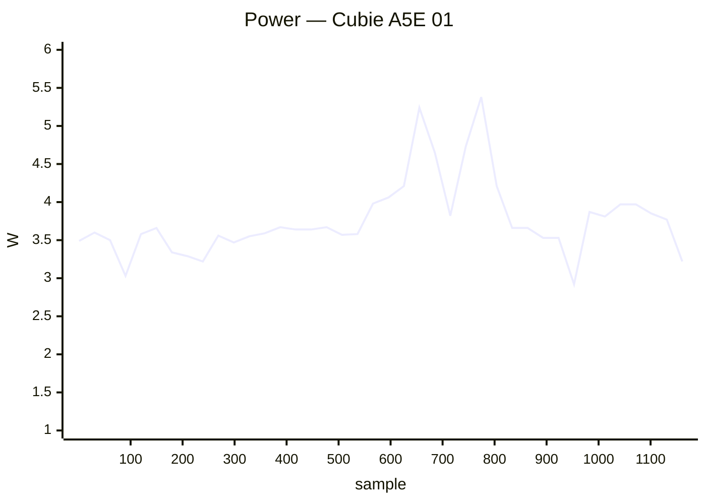

### ❌ Cubietruck 01

`cubietruck` · **inplace** · image `26.11.0-trunk.66` · 15 ✅ · 1 ❌ · 0 ⏭️

| Module | Status | Time | Detail |
|:--|:--:|--:|:--|
| upgrade | ✅ | 142.0 s | nightly · 26.11.0-trunk.66 → 26.11.0-trunk.66 |
| reboot | ✅ | 67.5 s | warm · up 42 s |
| kernel-switch | ✅ | 91.0 s | branch=current · family=sunxi · installed=26.11.0-trunk.66 · boot_image=/boot/vmlinuz-6.18.54-current-sunxi · kernel_before=6.18.54-current-sunxi |
| reboot | ✅ | 125.4 s | warm · 2/2 boots · up 43 s |
| hw-performance | ✅ | 59.4 s | AES 18 · mem 1700 · disk W 16 / R 20 MB/s · 50.3 °C · 960 MHz |
| dvfs | ✅ | 56.0 s | ondemand · 528–960 MHz (peak 960) |
| network-iperf | ✅ | 96.2 s | end0 ↑709/↓859 (1GE) · wlan0 ↑20/↓24 (Wi-Fi 4) Mbps |
| store-versions | ✅ | 11.6 s | 26.11.0-trunk.66 · 6.18.54-current-sunxi |
| kernel-switch | ✅ | 229.8 s | branch=edge · family=sunxi · installed=26.11.0-trunk.66 · boot_image=/boot/vmlinuz-7.2.8-edge-sunxi · kernel_before=6.18.54-current-sunxi |
| reboot | ✅ | 122.8 s | warm · 2/2 boots · up 41 s |
| hw-performance | ✅ | 58.6 s | AES 19 · mem 1700 · disk W 13 / R 22 MB/s · 50 °C · 960 MHz |
| dvfs | ✅ | 57.1 s | ondemand · 528–960 MHz (peak 960) |
| network-iperf | ✅ | 93.6 s | end0 ↑736/↓940 (1GE) · wlan0 ↑19/↓18 (Wi-Fi 4) Mbps |
| store-versions | ✅ | 12.2 s | 26.11.0-trunk.66 · 7.2.8-edge-sunxi |
| kernel-switch | ❌ | 58.3 s | branch=current · phase=install · dpkg_state=absent |
| reboot | ✅ | 65.2 s | warm · up 41 s |

### ❌ Cubox i2eX/i4 01

`cubox-i` · **inplace** · image `26.11.0-trunk.66` · 15 ✅ · 1 ❌ · 0 ⏭️

| Module | Status | Time | Detail |
|:--|:--:|--:|:--|
| upgrade | ✅ | 112.2 s | nightly · 26.11.0-trunk.66 → 26.11.0-trunk.66 |
| reboot | ✅ | 84.5 s | power-cycle · up 44 s |
| kernel-switch | ✅ | 72.0 s | branch=current · family=imx6 · installed=26.11.0-trunk.66 · boot_image=/boot/vmlinuz-6.18.54-current-imx6 · kernel_before=6.18.54-current-imx6 |
| reboot | ✅ | 138.7 s | power-cycle · 2/2 boots · up 44 s |
| hw-performance | ✅ | 47.1 s | AES 26 · mem 729 · disk W 19 / R 20 MB/s · 47.4 °C · 996 MHz |
| dvfs | ✅ | 41.1 s | ondemand · 396–996 MHz (peak 996) |
| network-iperf | ✅ | 106.8 s | end0 ↑94/↓94 (10/100ME) · wlan0 ↑19/↓15 (Wi-Fi 4) Mbps |
| store-versions | ✅ | 9.4 s | 26.11.0-trunk.66 · 6.18.54-current-imx6 |
| kernel-switch | ✅ | 265.4 s | branch=edge · family=imx6 · installed=26.11.0-trunk.66 · boot_image=/boot/vmlinuz-7.1.13-edge-imx6 · kernel_before=6.18.54-current-imx6 |
| reboot | ✅ | 159.1 s | power-cycle · 2/2 boots · up 66 s |
| hw-performance | ✅ | 47.6 s | AES 26 · mem 686 · disk W 19 / R 20 MB/s · 50.3 °C · 996 MHz |
| dvfs | ✅ | 44.2 s | ondemand · 396–996 MHz (peak 996) |
| network-iperf | ✅ | 93.0 s | end0 ↑94/↓94 (10/100ME) · wlan0 ↑15/↓17 (Wi-Fi 4) Mbps |
| store-versions | ✅ | 8.8 s | 26.11.0-trunk.66 · 7.1.13-edge-imx6 |
| kernel-switch | ❌ | 45.9 s | branch=current · phase=install · dpkg_state=absent |
| reboot | ✅ | 165.2 s | power-cycle · up 124 s |

**Power** — min 1.90 W · avg 3.29 W · peak 5.80 W · 1164 samples


### ❌ Espressobin 01

`espressobin` · **inplace** · image `26.11.0-trunk.66` · 15 ✅ · 1 ❌ · 0 ⏭️

| Module | Status | Time | Detail |
|:--|:--:|--:|:--|
| upgrade | ✅ | 119.5 s | nightly · 26.11.0-trunk.66 → 26.11.0-trunk.66 |
| reboot | ✅ | 74.4 s | power-cycle · up 41 s |
| kernel-switch | ✅ | 81.0 s | branch=current · family=mvebu64 · installed=26.11.0-trunk.66 · boot_image=/boot/vmlinuz-6.18.54-current-mvebu64 · kernel_before=6.18.54-current-mvebu64 |
| reboot | ✅ | 130.1 s | power-cycle · 2/2 boots · up 42 s |
| hw-performance | ✅ | 34.8 s | AES 367 · mem 2000 · disk W 21 / R 135 MB/s · None °C · 800 MHz |
| dvfs | ✅ | 35.3 s | ondemand · 200–800 MHz (peak 800) |
| network-iperf | ✅ | 45.0 s | lan0 ↑936/↓765 (1GE) Mbps |
| store-versions | ✅ | 7.5 s | 26.11.0-trunk.66 · 6.18.54-current-mvebu64 |
| kernel-switch | ✅ | 362.6 s | branch=edge · family=mvebu64 · installed=26.11.0-trunk.66 · boot_image=/boot/vmlinuz-7.1.13-edge-mvebu64 · kernel_before=6.18.54-current-mvebu64 |
| reboot | ✅ | 129.2 s | power-cycle · 2/2 boots · up 41 s |
| hw-performance | ✅ | 46.0 s | AES 368 · mem 1800 · disk W 19 / R 131 MB/s · None °C · 800 MHz |
| dvfs | ✅ | 35.5 s | ondemand · 200–800 MHz (peak 800) |
| network-iperf | ✅ | 45.2 s | lan0 ↑936/↓810 (1GE) Mbps |
| store-versions | ✅ | 7.5 s | 26.11.0-trunk.66 · 7.1.13-edge-mvebu64 |
| kernel-switch | ❌ | 37.5 s | branch=current · phase=install · dpkg_state=absent |
| reboot | ✅ | 76.9 s | power-cycle · up 43 s |

### ❌ Inovato Quadra 01

`inovato-quadra` · **inplace** · image `26.11.0-trunk.66` · 3 ✅ · 1 ❌ · 12 ⏭️

| Module | Status | Time | Detail |
|:--|:--:|--:|:--|
| upgrade | ✅ | 58.8 s | nightly · 26.11.0-trunk.66 → 26.11.0-trunk.66 |
| reboot | ✅ | 65.6 s | power-cycle · up 24 s |
| kernel-switch | ✅ | 39.6 s | branch=current · family=sunxi64 · installed=26.11.0-trunk.66 · boot_image=/boot/vmlinuz-6.18.54-current-sunxi64 · kernel_before=6.18.54-current-sunxi64 |
| reboot | ❌ | 252.1 s | power-cycle · 1/2 boots · up 17 s |
| hw-perf | ⏭️ | 0.0 s | board down after reboot/power-cycle |
| dvfs | ⏭️ | 0.0 s | — |
| net-iperf | ⏭️ | 0.0 s | board down after reboot/power-cycle |
| store-versions | ⏭️ | 0.0 s | — |
| kernel-switch | ⏭️ | 0.0 s | skipped=board down after reboot/power-cycle |
| reboot | ⏭️ | 0.0 s | reboot |
| hw-perf | ⏭️ | 0.0 s | board down after reboot/power-cycle |
| dvfs | ⏭️ | 0.0 s | — |
| net-iperf | ⏭️ | 0.0 s | board down after reboot/power-cycle |
| store-versions | ⏭️ | 0.0 s | — |
| kernel-switch | ⏭️ | 0.0 s | skipped=board down after reboot/power-cycle |
| reboot | ⏭️ | 0.0 s | reboot |

**Power** — min 2.20 W · avg 3.32 W · peak 5.60 W · 329 samples

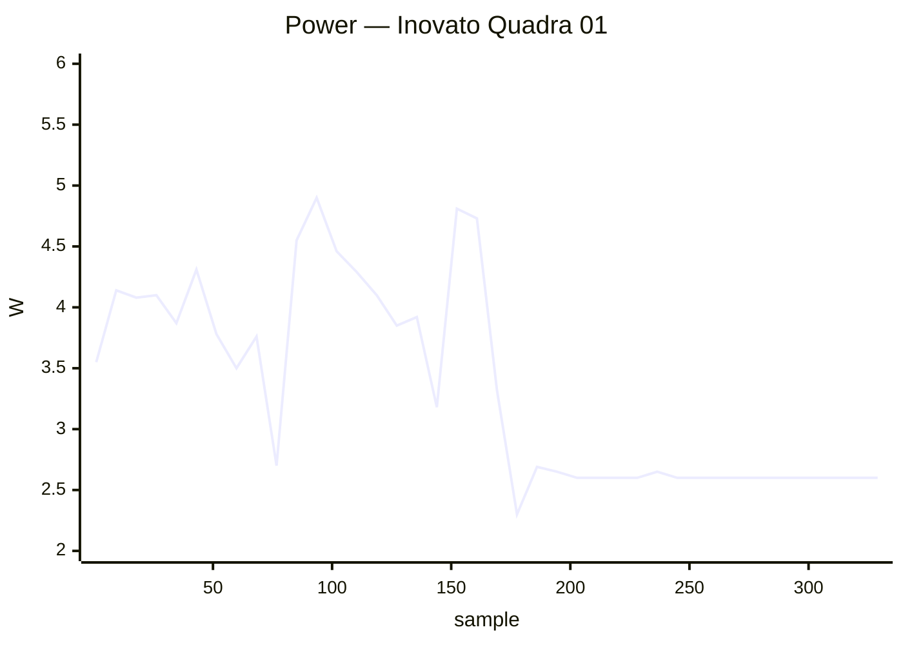

### ❌ Khadas VIM1S 01

`khadas-vim1s` · **inplace** · image `26.8.3` · 0 ✅ · 1 ❌ · 0 ⏭️

| Module | Status | Time | Detail |
|:--|:--:|--:|:--|
| reachable | ❌ | 0.0 s | ip=10.0.50.19 · reachable=False · port=22 |

**Power** — min 1.70 W · avg 1.70 W · peak 1.70 W · 45 samples

```mermaid
xychart-beta
    title "Power — Khadas VIM1S 01"
    x-axis "sample" 1 --> 45
    y-axis "W" 1.5 --> 2.0
    line [1.70, 1.70, 1.70, 1.70, 1.70, 1.70, 1.70, 1.70, 1.70, 1.70, 1.70, 1.70, 1.70, 1.70, 1.70, 1.70, 1.70, 1.70, 1.70, 1.70, 1.70, 1.70, 1.70, 1.70, 1.70, 1.70, 1.70, 1.70, 1.70, 1.70, 1.70, 1.70, 1.70, 1.70, 1.70, 1.70, 1.70, 1.70, 1.70, 1.70]
```

### ❌ Khadas VIM3 01

`khadas-vim3` · **inplace** · image `26.11.0-trunk.65` · 0 ✅ · 1 ❌ · 0 ⏭️

| Module | Status | Time | Detail |
|:--|:--:|--:|:--|
| reachable | ❌ | 0.0 s | ip=10.0.50.39 · reachable=False · port=22 |

### ❌ NanoPi M5 01

`nanopi-m5` · **inplace** · image `26.11.0-trunk.66` · 21 ✅ · 1 ❌ · 0 ⏭️

| Module | Status | Time | Detail |
|:--|:--:|--:|:--|
| upgrade | ✅ | 33.5 s | nightly · 26.11.0-trunk.66 → 26.11.0-trunk.66 |
| reboot | ✅ | 135.6 s | power-cycle · up 107 s |
| kernel-switch | ✅ | 22.2 s | branch=vendor · family=rk35xx · installed=26.11.0-trunk.66 · boot_image=/boot/vmlinuz-6.1.172-vendor-rk35xx · kernel_before=6.1.172-vendor-rk35xx |
| reboot | ✅ | 78.0 s | power-cycle · 2/2 boots · up 23 s |
| hw-performance | ✅ | 18.0 s | AES 1277 · mem 8000 · disk W 67 / R 77 MB/s · 41.6 °C · 2016 MHz |
| dvfs | ✅ | 18.9 s | ondemand · 2016–2016 MHz (peak 2208) |
| network-iperf | ✅ | 115.7 s | end0 ↑933/↓937 (1GE) · end1 ↑938/↓919 (1GE) · wlan0 ↑24/↓56 (Wi-Fi 5) · wlx44334c47dec3 ↑25/↓25 (Wi-Fi 4) Mbps |
| store-versions | ✅ | 4.1 s | 26.11.0-trunk.66 · 6.1.172-vendor-rk35xx |
| kernel-switch | ✅ | 110.3 s | branch=current · family=rockchip64 · installed=26.11.0-trunk.66 · boot_image=/boot/vmlinuz-6.18.54-current-rockchip64 · kernel_before=6.1.172-vendor-rk35xx |
| reboot | ✅ | 94.6 s | power-cycle · 2/2 boots · up 28 s |
| hw-performance | ✅ | 26.3 s | AES 1332 · mem 9000 · disk W 20 / R 21 MB/s · 42.5 °C · 2016 MHz |
| dvfs | ✅ | 17.3 s | ondemand · 408–2016 MHz (peak 2208) |
| network-iperf | ✅ | 115.6 s | end0 ↑938/↓937 (1GE) · end1 ↑922/↓938 (1GE) · wlan0 ↑64/↓178 (Wi-Fi 5) · wlx44334c47dec3 ↑31/↓23 (Wi-Fi 4) Mbps |
| store-versions | ✅ | 4.3 s | 26.11.0-trunk.66 · 6.18.54-current-rockchip64 |
| kernel-switch | ✅ | 100.1 s | branch=edge · family=rockchip64 · installed=26.11.0-trunk.66 · boot_image=/boot/vmlinuz-7.2.8-edge-rockchip64 · kernel_before=6.18.54-current-rockchip64 |
| reboot | ✅ | 86.3 s | power-cycle · 2/2 boots · up 24 s |
| hw-performance | ✅ | 26.7 s | AES 1330 · mem 9000 · disk W 20 / R 21 MB/s · 42.5 °C · 2016 MHz |
| dvfs | ✅ | 17.0 s | ondemand · 408–2016 MHz (peak 2208) |
| network-iperf | ✅ | 105.3 s | end0 ↑939/↓939 (1GE) · end1 ↑939/↓939 (1GE) · wlan0 ↑95/↓167 (Wi-Fi 5) · wlx44334c47dec3 ↑28/↓25 (Wi-Fi 4) Mbps |
| store-versions | ✅ | 4.0 s | 26.11.0-trunk.66 · 7.2.8-edge-rockchip64 |
| kernel-switch | ❌ | 16.4 s | branch=vendor · phase=install · dpkg_state=absent |
| reboot | ✅ | 54.5 s | power-cycle · up 25 s |

**Power** — min 0.60 W · avg 4.86 W · peak 8.80 W · 965 samples

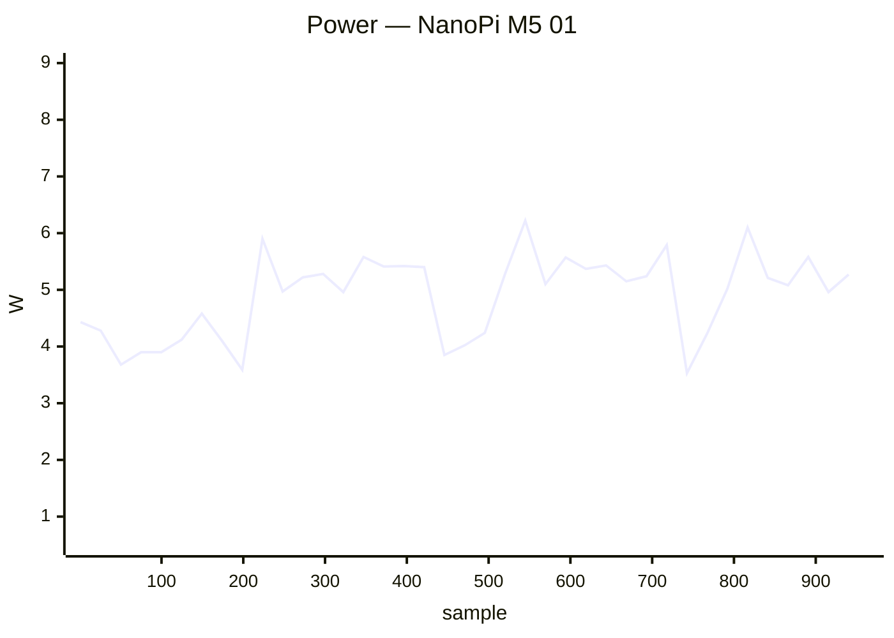

### ❌ Odroid XU4 01

`odroidxu4` · **inplace** · image `26.11.0-trunk.66` · 15 ✅ · 1 ❌ · 0 ⏭️

| Module | Status | Time | Detail |
|:--|:--:|--:|:--|
| upgrade | ✅ | 55.2 s | nightly · 26.11.0-trunk.66 → 26.11.0-trunk.66 |
| reboot | ✅ | 58.8 s | power-cycle · up 28 s |
| kernel-switch | ✅ | 37.5 s | branch=current · family=odroidxu4 · installed=26.11.0-trunk.66 · boot_image=/boot/vmlinuz-6.6.155-current-odroidxu4 · kernel_before=6.6.155-current-odroidxu4 |
| reboot | ✅ | 99.3 s | power-cycle · 2/2 boots · up 29 s |
| hw-performance | ✅ | 30.3 s | AES 67 · mem 4700 · disk W 1 / R 57 MB/s · 62 °C · 1400 MHz |
| dvfs | ✅ | 30.6 s | ondemand · 600–1400 MHz (peak 2000) |
| network-iperf | ✅ | 45.2 s | end0 ↑922/↓941 Mbps |
| store-versions | ✅ | 6.6 s | 26.11.0-trunk.66 · 6.6.155-current-odroidxu4 |
| kernel-switch | ✅ | 89.5 s | branch=edge · family=odroidxu4 · installed=26.11.0-trunk.66 · boot_image=/boot/vmlinuz-7.2.8-edge-odroidxu4 · kernel_before=6.6.155-current-odroidxu4 |
| reboot | ✅ | 95.8 s | power-cycle · 2/2 boots · up 29 s |
| hw-performance | ✅ | 29.7 s | AES 64 · mem 5600 · disk W 1 / R 63 MB/s · 62 °C · 1400 MHz |
| dvfs | ✅ | 32.7 s | ondemand · 600–1300 MHz (peak 1900) |
| network-iperf | ✅ | 39.0 s | end0 ↑922/↓941 Mbps |
| store-versions | ✅ | 6.2 s | 26.11.0-trunk.66 · 7.2.8-edge-odroidxu4 |
| kernel-switch | ❌ | 25.9 s | branch=current · phase=install · dpkg_state=absent |
| reboot | ✅ | 61.7 s | power-cycle · up 31 s |

### ❌ Orange Pi 5 01

`orangepi5` · **inplace** · image `26.8.3` · 0 ✅ · 1 ❌ · 0 ⏭️

| Module | Status | Time | Detail |
|:--|:--:|--:|:--|
| reachable | ❌ | 0.0 s | ip=10.0.50.46 · reachable=False · port=22 |

### ❌ Orange Pi Prime 01

`orangepiprime` · **inplace** · image `26.11.0-trunk.66` · 0 ✅ · 1 ❌ · 0 ⏭️

| Module | Status | Time | Detail |
|:--|:--:|--:|:--|
| reachable | ❌ | 0.0 s | ip=10.0.50.36 · reachable=False · port=22 |

### ❌ ROCK 2F 01

`rock-2f` · **inplace** · image `26.8.1` · 15 ✅ · 1 ❌ · 0 ⏭️

| Module | Status | Time | Detail |
|:--|:--:|--:|:--|
| upgrade | ✅ | 694.1 s | nightly · 26.8.1 → 26.8.1 |
| reboot | ✅ | 12.2 s | power-cycle |
| kernel-switch | ✅ | 681.2 s | branch=vendor · family=rk35xx · installed=26.8.3 · boot_image=/boot/vmlinuz-6.1.115-vendor-rk35xx · kernel_before=6.1.115-vendor-rk35xx |
| reboot | ✅ | 47.9 s | power-cycle · 1/2 boots · up 26 s |
| hw-performance | ✅ | 29.9 s | AES 834 · mem 6000 · disk W 20 / R 22 MB/s · 50.8 °C · 2016 MHz |
| dvfs | ✅ | 23.0 s | ondemand · 408–2016 MHz (peak 2016) |
| network-iperf | ✅ | 36.4 s | wlan0 ↑215/↓273 (Wi-Fi 6) Mbps |
| store-versions | ✅ | 5.0 s | 26.8.1 · 6.1.115-vendor-rk35xx |
| kernel-switch | ❌ | 24.7 s | branch=edge · phase=install · dpkg_state=absent |
| reboot | ✅ | 45.9 s | power-cycle · 1/2 boots · up 24 s |
| hw-performance | ✅ | 29.7 s | AES 813 · mem 6000 · disk W 20 / R 22 MB/s · 50.2 °C · 2016 MHz |
| dvfs | ✅ | 22.6 s | ondemand · 408–2016 MHz (peak 2016) |
| network-iperf | ✅ | 36.4 s | wlan0 ↑214/↓273 (Wi-Fi 6) Mbps |
| store-versions | ✅ | 5.1 s | 26.8.1 · 6.1.115-vendor-rk35xx |
| kernel-switch | ✅ | 706.0 s | branch=vendor · family=rk35xx · installed=26.8.3 · boot_image=/boot/vmlinuz-6.1.115-vendor-rk35xx · kernel_before=6.1.115-vendor-rk35xx |
| reboot | ✅ | 10.3 s | power-cycle |

### ❌ Rock 5B Plus 01

`rock-5b-plus` · **inplace** · image `26.11.0-trunk.66` · 20 ✅ · 2 ❌ · 0 ⏭️

| Module | Status | Time | Detail |
|:--|:--:|--:|:--|
| upgrade | ✅ | 28.1 s | nightly · 26.11.0-trunk.66 → 26.11.0-trunk.66 |
| reboot | ✅ | 56.2 s | power-cycle · up 26 s |
| kernel-switch | ✅ | 18.6 s | branch=vendor · family=rk35xx · installed=26.11.0-trunk.66 · boot_image=/boot/vmlinuz-6.1.172-vendor-rk35xx · kernel_before=6.1.172-vendor-rk35xx |
| reboot | ✅ | 86.7 s | power-cycle · 2/2 boots · up 23 s |
| hw-performance | ✅ | 17.0 s | AES 1285 · mem 14300 · disk W 67 / R 81 MB/s · 49 °C · 1800 MHz |
| dvfs | ✅ | 17.4 s | ondemand · 1800–1800 MHz (peak 2304) |
| network-iperf | ✅ | 27.9 s | enP4p65s0 ↑941/↓941 (1GE) Mbps |
| store-versions | ✅ | 3.9 s | 26.11.0-trunk.66 · 6.1.172-vendor-rk35xx |
| kernel-switch | ✅ | 655.6 s | branch=current · family=rockchip64 · installed=26.11.0-trunk.66 · boot_image=/boot/vmlinuz-6.18.54-current-rockchip64 · kernel_before=6.1.172-vendor-rk35xx |
| reboot | ✅ | 90.7 s | power-cycle · 2/2 boots · up 29 s |
| hw-performance | ✅ | 26.9 s | AES 1292 · mem 5700 · disk W 20 / R 21 MB/s · 58.2 °C · 1800 MHz |
| dvfs | ✅ | 16.7 s | ondemand · 408–1800 MHz (peak 2400) |
| network-iperf | ✅ | 29.8 s | enP4p65s0 ↑941/↓941 (1GE) Mbps |
| store-versions | ✅ | 4.0 s | 26.11.0-trunk.66 · 6.18.54-current-rockchip64 |
| kernel-switch | ❌ | 16.9 s | branch=edge · phase=install · dpkg_state=absent |
| reboot | ✅ | 86.2 s | power-cycle · 2/2 boots · up 23 s |
| hw-performance | ✅ | 17.9 s | AES 1278 · mem 10400 · disk W 65 / R 73 MB/s · 57.3 °C · 1800 MHz |
| dvfs | ✅ | 16.8 s | ondemand · 408–1800 MHz (peak 2400) |
| network-iperf | ✅ | 30.3 s | enP4p65s0 ↑941/↓941 (1GE) Mbps |
| store-versions | ✅ | 4.0 s | 26.11.0-trunk.66 · 6.18.54-current-rockchip64 |
| kernel-switch | ❌ | 15.1 s | branch=vendor · phase=install · dpkg_state=absent |
| reboot | ✅ | 60.9 s | power-cycle · up 23 s |

**Power** — min 2.30 W · avg 5.98 W · peak 12.50 W · 1058 samples


### ❌ Rockpi S 01

`rockpi-s` · **inplace** · image `26.11.0-trunk.66` · 0 ✅ · 1 ❌ · 0 ⏭️

| Module | Status | Time | Detail |
|:--|:--:|--:|:--|
| reachable | ❌ | 0.0 s | ip=10.0.50.18 · reachable=False · port=22 |

**Power** — min 1.40 W · avg 1.40 W · peak 1.40 W · 41 samples

```mermaid
xychart-beta
    title "Power — Rockpi S 01"
    x-axis "sample" 1 --> 41
    y-axis "W" 1.0 --> 1.5
    line [1.40, 1.40, 1.40, 1.40, 1.40, 1.40, 1.40, 1.40, 1.40, 1.40, 1.40, 1.40, 1.40, 1.40, 1.40, 1.40, 1.40, 1.40, 1.40, 1.40, 1.40, 1.40, 1.40, 1.40, 1.40, 1.40, 1.40, 1.40, 1.40, 1.40, 1.40, 1.40, 1.40, 1.40, 1.40, 1.40, 1.40, 1.40, 1.40, 1.40]
```

### ❌ SpacemiT MusePi Pro 01

`musepipro` · **inplace** · image `26.8.3` · 0 ✅ · 1 ❌ · 0 ⏭️

| Module | Status | Time | Detail |
|:--|:--:|--:|:--|
| reachable | ❌ | 0.0 s | ip=10.0.50.65 · reachable=False · port=22 |

**Power** — min 2.50 W · avg 2.59 W · peak 2.60 W · 41 samples

```mermaid
xychart-beta
    title "Power — SpacemiT MusePi Pro 01"
    x-axis "sample" 1 --> 41
    y-axis "W" 2.0 --> 3.0
    line [2.60, 2.60, 2.60, 2.60, 2.60, 2.60, 2.60, 2.60, 2.60, 2.60, 2.60, 2.60, 2.60, 2.60, 2.60, 2.60, 2.60, 2.60, 2.60, 2.60, 2.60, 2.60, 2.60, 2.60, 2.60, 2.60, 2.60, 2.60, 2.60, 2.60, 2.60, 2.60, 2.60, 2.60, 2.60, 2.60, 2.60, 2.60, 2.50, 2.50]
```

### ❌ Udoo 01

`udoo` · **inplace** · image `26.11.0-trunk.66` · 15 ✅ · 1 ❌ · 0 ⏭️

| Module | Status | Time | Detail |
|:--|:--:|--:|:--|
| upgrade | ✅ | 114.1 s | nightly · 26.11.0-trunk.66 → 26.11.0-trunk.66 |
| reboot | ✅ | 75.1 s | power-cycle · up 35 s |
| kernel-switch | ✅ | 76.2 s | branch=current · family=imx6 · installed=26.11.0-trunk.66 · boot_image=/boot/vmlinuz-6.18.54-current-imx6 · kernel_before=6.18.54-current-imx6 |
| reboot | ✅ | 122.9 s | power-cycle · 2/2 boots · up 35 s |
| hw-performance | ✅ | 52.1 s | AES 26 · mem 702 · disk W 18 / R 20 MB/s · 52.1 °C · 996 MHz |
| dvfs | ✅ | 43.6 s | ondemand · 396–996 MHz (peak 996) |
| network-iperf | ✅ | 81.9 s | end0 ↑400/↓245 (1GE) · wlx7cdd903aa418 ↑8/↓1 (Wi-Fi 4) Mbps |
| store-versions | ✅ | 9.4 s | 26.11.0-trunk.66 · 6.18.54-current-imx6 |
| kernel-switch | ❌ | 48.4 s | branch=edge · phase=install · dpkg_state=absent |
| reboot | ✅ | 131.2 s | power-cycle · 2/2 boots · up 38 s |
| hw-performance | ✅ | 52.0 s | AES 26 · mem 653 · disk W 16 / R 20 MB/s · 53.2 °C · 996 MHz |
| dvfs | ✅ | 44.0 s | ondemand · 396–996 MHz (peak 996) |
| network-iperf | ✅ | 82.4 s | end0 ↑399/↓234 (1GE) · wlx7cdd903aa418 ↑6/↓1 (Wi-Fi 4) Mbps |
| store-versions | ✅ | 9.5 s | 26.11.0-trunk.66 · 6.18.54-current-imx6 |
| kernel-switch | ✅ | 74.2 s | branch=current · family=imx6 · installed=26.11.0-trunk.66 · boot_image=/boot/vmlinuz-6.18.54-current-imx6 · kernel_before=6.18.54-current-imx6 |
| reboot | ✅ | 78.3 s | power-cycle · up 36 s |

**Power** — min 1.30 W · avg 6.01 W · peak 8.30 W · 883 samples

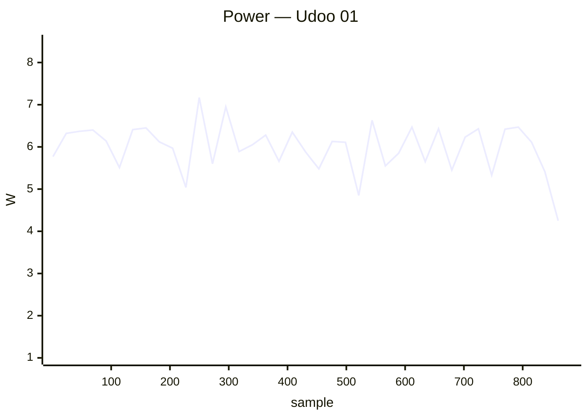

## ✅ Passed (50)

### ✅ Arduino UNO Q 01

`arduino-uno-q` · **inplace** · image `26.11.0-trunk.65` · 8 ✅ · 0 ❌ · 0 ⏭️

| Module | Status | Time | Detail |
|:--|:--:|--:|:--|
| upgrade | ✅ | 330.9 s | nightly · 26.11.0-trunk.65 → 26.11.0-trunk.66 |
| reboot | ✅ | 54.7 s | warm · up 34 s |
| kernel-switch | ✅ | 47.0 s | branch=edge · family=qrb2210 · installed=26.11.0-trunk.66 · boot_image=? · kernel_before=7.2.3-edge-qrb2210 |
| reboot | ✅ | 103.1 s | warm · 2/2 boots · up 35 s |
| hw-performance | ✅ | 24.7 s | AES 940 · mem 5000 · disk W 171 / R 223 MB/s · 39 °C · 2016 MHz |
| dvfs | ✅ | 31.3 s | schedutil · 300–2016 MHz (peak 2016) |
| network-iperf | ✅ | 49.6 s | wlan0 ↑18/↓19 (Wi-Fi 5) · usb0 ↑?/↓? Mbps |
| store-versions | ✅ | 8.1 s | 26.11.0-trunk.66 · 7.2.3-edge-qrb2210 |

### ✅ Banana Pi M2 Ultra 01

`bananapim2ultra` · **inplace** · image `26.11.0-trunk.66` · 16 ✅ · 0 ❌ · 0 ⏭️

| Module | Status | Time | Detail |
|:--|:--:|--:|:--|
| upgrade | ✅ | 105.2 s | nightly · 26.11.0-trunk.66 → 26.11.0-trunk.66 |
| reboot | ✅ | 46.0 s | warm · up 27 s |
| kernel-switch | ✅ | 69.5 s | branch=current · family=sunxi · installed=26.11.0-trunk.66 · boot_image=/boot/vmlinuz-6.18.54-current-sunxi · kernel_before=6.18.54-current-sunxi |
| reboot | ✅ | 86.2 s | warm · 2/2 boots · up 26 s |
| hw-performance | ✅ | 40.1 s | AES 23 · mem 2100 · disk W 9 / R 42 MB/s · 50.7 °C · 1200 MHz |
| dvfs | ✅ | 34.1 s | ondemand · 720–1200 MHz (peak 1200) |
| network-iperf | ✅ | 90.0 s | end0 ↑809/↓934 (1GE) · wlan0 ↑25/↓38 (Wi-Fi 4) Mbps |
| store-versions | ✅ | 7.2 s | 26.11.0-trunk.66 · 6.18.54-current-sunxi |
| kernel-switch | ✅ | 188.1 s | branch=edge · family=sunxi · installed=26.11.0-trunk.66 · boot_image=/boot/vmlinuz-7.2.8-edge-sunxi · kernel_before=6.18.54-current-sunxi |
| reboot | ✅ | 83.0 s | warm · 2/2 boots · up 25 s |
| hw-performance | ✅ | 41.2 s | AES 23 · mem 2100 · disk W 8 / R 43 MB/s · 51.2 °C · 1200 MHz |
| dvfs | ✅ | 37.5 s | ondemand · 720–1200 MHz (peak 1200) |
| network-iperf | ✅ | 75.0 s | end0 ↑804/↓939 (1GE) · wlan0 ↑31/↓34 (Wi-Fi 4) Mbps |
| store-versions | ✅ | 7.3 s | 26.11.0-trunk.66 · 7.2.8-edge-sunxi |
| kernel-switch | ✅ | 188.3 s | branch=current · family=sunxi · installed=26.11.0-trunk.66 · boot_image=/boot/vmlinuz-6.18.54-current-sunxi · kernel_before=7.2.8-edge-sunxi |
| reboot | ✅ | 46.8 s | warm · up 26 s |

### ✅ Banana Pi M2Pro 01

`bananapim2pro` · **inplace** · image `26.11.0-trunk.66` · 16 ✅ · 0 ❌ · 0 ⏭️

| Module | Status | Time | Detail |
|:--|:--:|--:|:--|
| upgrade | ✅ | 46.3 s | nightly · 26.11.0-trunk.66 → 26.11.0-trunk.66 |
| reboot | ✅ | 134.0 s | power-cycle · up 101 s |
| kernel-switch | ✅ | 31.2 s | branch=current · family=meson64 · installed=26.11.0-trunk.66 · boot_image=/boot/vmlinuz-6.18.54-current-meson64 · kernel_before=6.18.54-current-meson64 |
| reboot | ✅ | 254.6 s | power-cycle · 2/2 boots · up 104 s |
| hw-performance | ✅ | 19.3 s | AES 980 · mem 5300 · disk W 43 / R 152 MB/s · 49.3 °C · 2100 MHz |
| dvfs | ✅ | 18.9 s | ondemand · 1000–2100 MHz (peak 2100) |
| network-iperf | ✅ | 39.0 s | end0 ↑940/↓941 (1GE) Mbps |
| store-versions | ✅ | 4.3 s | 26.11.0-trunk.66 · 6.18.54-current-meson64 |
| kernel-switch | ✅ | 96.2 s | branch=edge · family=meson64 · installed=26.11.0-trunk.66 · boot_image=/boot/vmlinuz-7.2.8-edge-meson64 · kernel_before=6.18.54-current-meson64 |
| reboot | ✅ | 246.4 s | power-cycle · 2/2 boots · up 104 s |
| hw-performance | ✅ | 19.7 s | AES 979 · mem 5300 · disk W 40 / R 158 MB/s · 49.8 °C · 2100 MHz |
| dvfs | ✅ | 19.9 s | ondemand · 1000–2100 MHz (peak 2100) |
| network-iperf | ✅ | 31.8 s | end0 ↑940/↓941 (1GE) Mbps |
| store-versions | ✅ | 4.4 s | 26.11.0-trunk.66 · 7.2.8-edge-meson64 |
| kernel-switch | ✅ | 94.5 s | branch=current · family=meson64 · installed=26.11.0-trunk.66 · boot_image=/boot/vmlinuz-6.18.54-current-meson64 · kernel_before=7.2.8-edge-meson64 |
| reboot | ✅ | 136.7 s | power-cycle · up 104 s |

**Power** — min 1.50 W · avg 2.85 W · peak 4.70 W · 955 samples

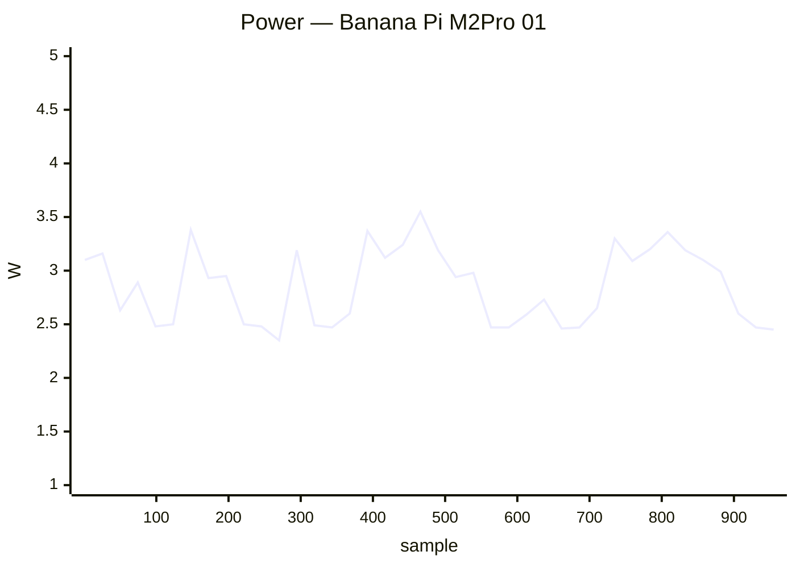

### ✅ Banana Pi M7 01

`bananapim7` · **inplace** · image `26.11.0-trunk.66` · 22 ✅ · 0 ❌ · 0 ⏭️

| Module | Status | Time | Detail |
|:--|:--:|--:|:--|
| upgrade | ✅ | 27.7 s | nightly · 26.11.0-trunk.66 → 26.11.0-trunk.66 |
| reboot | ✅ | 44.3 s | power-cycle · up 16 s |
| kernel-switch | ✅ | 17.9 s | branch=vendor · family=rk35xx · installed=26.11.0-trunk.66 · boot_image=/boot/vmlinuz-6.1.172-vendor-rk35xx · kernel_before=6.1.172-vendor-rk35xx |
| reboot | ✅ | 71.0 s | power-cycle · 2/2 boots · up 15 s |
| hw-performance | ✅ | 13.4 s | AES 1259 · mem 13800 · disk W 843 / R 1020 MB/s · 57.3 °C · 1800 MHz |
| dvfs | ✅ | 17.3 s | ondemand · 1800–1800 MHz (peak 2256) |
| network-iperf | ✅ | 28.6 s | enP2p33s0 ↑941/↓942 (1GE) Mbps |
| store-versions | ✅ | 3.9 s | 26.11.0-trunk.66 · 6.1.172-vendor-rk35xx |
| kernel-switch | ✅ | 49.7 s | branch=current · family=rockchip64 · installed=26.11.0-trunk.66 · boot_image=/boot/vmlinuz-6.18.54-current-rockchip64 · kernel_before=6.1.172-vendor-rk35xx |
| reboot | ✅ | 231.0 s | power-cycle · 2/2 boots · up 99 s |
| hw-performance | ✅ | 13.8 s | AES 1254 · mem 10200 · disk W 874 / R 1566 MB/s · 62.8 °C · 1800 MHz |
| dvfs | ✅ | 15.4 s | ondemand · 408–1800 MHz (peak 2400) |
| network-iperf | ✅ | 30.2 s | enP2p33s0 ↑941/↓941 (1GE) Mbps |
| store-versions | ✅ | 4.2 s | 26.11.0-trunk.66 · 6.18.54-current-rockchip64 |
| kernel-switch | ✅ | 40.8 s | branch=edge · family=rockchip64 · installed=26.11.0-trunk.66 · boot_image=/boot/vmlinuz-7.2.8-edge-rockchip64 · kernel_before=6.18.54-current-rockchip64 |
| reboot | ✅ | 237.4 s | power-cycle · 2/2 boots · up 97 s |
| hw-performance | ✅ | 13.4 s | AES 1255 · mem 8000 · disk W 861 / R 1022 MB/s · 63.8 °C · 1800 MHz |
| dvfs | ✅ | 15.3 s | ondemand · 408–1800 MHz (peak 2400) |
| network-iperf | ✅ | 30.7 s | enP2p33s0 ↑941/↓941 (1GE) Mbps |
| store-versions | ✅ | 4.2 s | 26.11.0-trunk.66 · 7.2.8-edge-rockchip64 |
| kernel-switch | ✅ | 37.7 s | branch=vendor · family=rk35xx · installed=26.11.0-trunk.66 · boot_image=/boot/vmlinuz-6.1.172-vendor-rk35xx · kernel_before=7.2.8-edge-rockchip64 |
| reboot | ✅ | 44.3 s | power-cycle · up 15 s |

**Power** — min 3.70 W · avg 6.03 W · peak 11.80 W · 765 samples

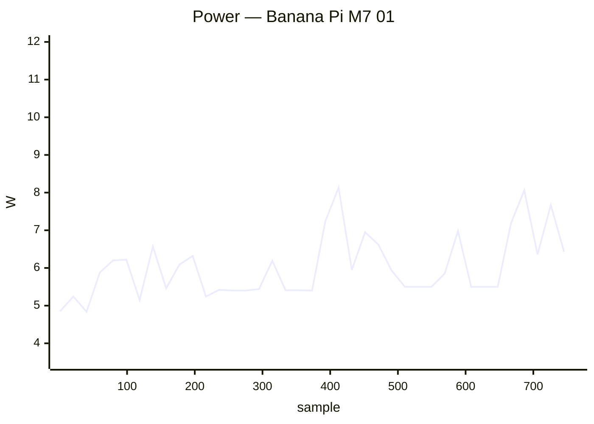

### ✅ Banana Pi R2 01

`bananapir2` · **inplace** · image `26.11.0-trunk.66` · 16 ✅ · 0 ❌ · 0 ⏭️

| Module | Status | Time | Detail |
|:--|:--:|--:|:--|
| upgrade | ✅ | 93.1 s | nightly · 26.11.0-trunk.66 → 26.11.0-trunk.66 |
| reboot | ✅ | 46.8 s | warm · up 26 s |
| kernel-switch | ✅ | 60.4 s | branch=current · family=mt7623 · installed=26.11.0-trunk.66 · boot_image=/boot/vmlinuz-6.18.54-current-mt7623 · kernel_before=6.18.54-current-mt7623 |
| reboot | ✅ | 87.1 s | warm · 2/2 boots · up 27 s |
| hw-performance | ✅ | 44.4 s | AES 25 · mem 1600 · disk W 20 / R 23 MB/s · 51.8 °C · 1300 MHz |
| dvfs | ✅ | 40.1 s | ondemand · 98–1300 MHz (peak 1300) |
| network-iperf | ✅ | 52.0 s | lan2 ↑939/↓918 Mbps |
| store-versions | ✅ | 9.4 s | 26.11.0-trunk.66 · 6.18.54-current-mt7623 |
| kernel-switch | ✅ | 139.0 s | branch=edge · family=mt7623 · installed=26.11.0-trunk.66 · boot_image=/boot/vmlinuz-7.2.8-edge-mt7623 · kernel_before=6.18.54-current-mt7623 |
| reboot | ✅ | 86.3 s | warm · 2/2 boots · up 25 s |
| hw-performance | ✅ | 44.9 s | AES 25 · mem 1600 · disk W 20 / R 22 MB/s · 52.2 °C · 1300 MHz |
| dvfs | ✅ | 42.7 s | ondemand · 98–1300 MHz (peak 1300) |
| network-iperf | ✅ | 52.5 s | lan2 ↑925/↓926 Mbps |
| store-versions | ✅ | 8.7 s | 26.11.0-trunk.66 · 7.2.8-edge-mt7623 |
| kernel-switch | ✅ | 139.3 s | branch=current · family=mt7623 · installed=26.11.0-trunk.66 · boot_image=/boot/vmlinuz-6.18.54-current-mt7623 · kernel_before=7.2.8-edge-mt7623 |
| reboot | ✅ | 73.2 s | warm · up 26 s |

### ✅ Banana Pi R3 Mini 01

`bananapir3mini` · **inplace** · image `26.11.0-trunk` · 4 ✅ · 0 ❌ · 2 ⏭️

| Module | Status | Time | Detail |
|:--|:--:|--:|:--|
| upgrade | ⏭️ | 23.9 s | — |
| reboot | ✅ | 67.6 s | power-cycle · up 34 s |
| hw-performance | ✅ | 25.7 s | AES 935 · mem 3200 · disk W 78 / R 91 MB/s · 68.6 °C · None MHz |
| dvfs | ➖ | 2.1 s | no cpufreq |
| network-iperf | ✅ | 109.3 s | eth0 ↑939/↓924 (1GE) · eth1 ↑939/↓933 (1GE) · wlan0 ↑26/↓22 (Wi-Fi 6) · wlan1 ↑482/↓402 (Wi-Fi 6) Mbps |
| store-versions | ✅ | 4.6 s | 26.11.0-trunk · 6.18.52-current-filogic-mt7986 |

**Power** — min 3.50 W · avg 6.71 W · peak 11.20 W · 192 samples

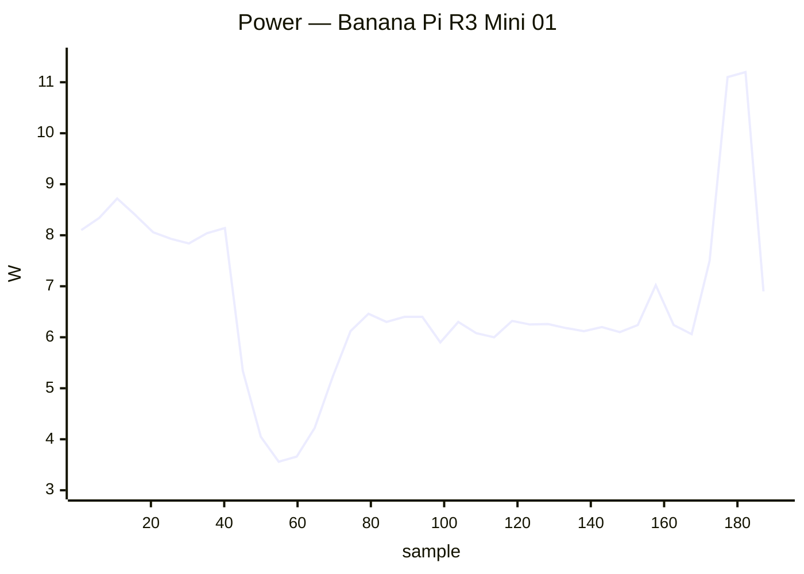

### ✅ BananaPi BPI-F3 01

`musepipro` · **inplace** · image `26.11.0-trunk.65` · 6 ✅ · 0 ❌ · 0 ⏭️

| Module | Status | Time | Detail |
|:--|:--:|--:|:--|
| upgrade | ✅ | 191.1 s | nightly · 26.11.0-trunk.65 → 26.11.0-trunk.66 |
| reboot | ✅ | 58.7 s | power-cycle · up 20 s |
| hw-performance | ✅ | 24.8 s | AES 27 · mem 3000 · disk W 71 / R 82 MB/s · 48 °C · 1600 MHz |
| dvfs | ✅ | 23.7 s | performance · 614–1600 MHz (peak 1600) |
| network-iperf | ✅ | 89.7 s | eth0 ↑941/↓941 (1GE) · wlan0 ↑307/↓325 (Wi-Fi 6) · wlan1 ↑269/↓200 (Wi-Fi 5) Mbps |
| store-versions | ✅ | 6.0 s | 26.11.0-trunk.66 · 6.18.54-current-spacemit |

**Power** — min 2.90 W · avg 5.21 W · peak 8.50 W · 321 samples

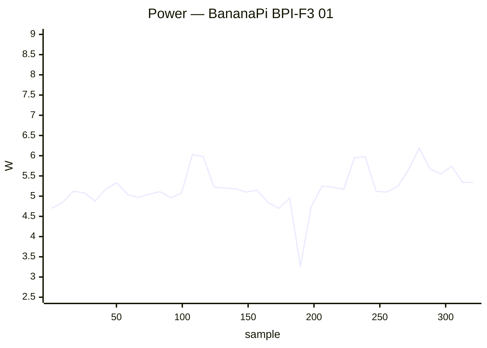

### ✅ BananaPi BPI-M4-Zero 01

`bananapim4zero` · **inplace** · image `26.8.8` · 4 ✅ · 0 ❌ · 2 ⏭️

| Module | Status | Time | Detail |
|:--|:--:|--:|:--|
| upgrade | ⏭️ | 0.0 s | — |
| reboot | ⏭️ | 0.0 s | reboot |
| hw-performance | ✅ | 32.6 s | AES 660 · mem 3600 · disk W 15 / R 22 MB/s · 50.4 °C · 1416 MHz |
| dvfs | ✅ | 22.5 s | ondemand · 480–1416 MHz (peak 1416) |
| network-iperf | ✅ | 36.3 s | wlan0 ↑81/↓100 (Wi-Fi 5) Mbps |
| store-versions | ✅ | 4.8 s | 26.8.8 · 6.18.54-current-sunxi64 |

### ✅ Clearfog Pro 01

`clearfogpro` · **inplace** · image `26.11.0-trunk.65` · 14 ✅ · 0 ❌ · 2 ⏭️

| Module | Status | Time | Detail |
|:--|:--:|--:|:--|
| upgrade | ✅ | 200.5 s | nightly · 26.11.0-trunk.65 → 26.11.0-trunk.66 |
| reboot | ✅ | 41.6 s | warm · up 22 s |
| kernel-switch | ✅ | 42.1 s | branch=current · family=mvebu · installed=26.11.0-trunk.66 · boot_image=/boot/vmlinuz-6.18.54-current-mvebu · kernel_before=6.18.54-current-mvebu |
| reboot | ✅ | 74.0 s | warm · 2/2 boots · up 21 s |
| hw-performance | ✅ | 42.3 s | AES 43 · mem 3800 · disk W 21 / R 22 MB/s · 63.2 °C · None MHz |
| dvfs | ➖ | 2.8 s | no cpufreq |
| network-iperf | ✅ | 36.6 s | lan2 ↑935/↓936 Mbps |
| store-versions | ✅ | 6.1 s | 26.11.0-trunk.66 · 6.18.54-current-mvebu |
| kernel-switch | ✅ | 99.5 s | branch=edge · family=mvebu · installed=26.11.0-trunk.66 · boot_image=/boot/vmlinuz-7.2.8-edge-mvebu · kernel_before=6.18.54-current-mvebu |
| reboot | ✅ | 75.0 s | warm · 2/2 boots · up 22 s |
| hw-performance | ✅ | 41.8 s | AES 43 · mem 3800 · disk W 21 / R 23 MB/s · 63.7 °C · None MHz |
| dvfs | ➖ | 2.9 s | no cpufreq |
| network-iperf | ✅ | 38.7 s | lan2 ↑936/↓936 Mbps |
| store-versions | ✅ | 6.2 s | 26.11.0-trunk.66 · 7.2.8-edge-mvebu |
| kernel-switch | ✅ | 103.4 s | branch=current · family=mvebu · installed=26.11.0-trunk.66 · boot_image=/boot/vmlinuz-6.18.54-current-mvebu · kernel_before=7.2.8-edge-mvebu |
| reboot | ✅ | 41.9 s | warm · up 22 s |

### ✅ Helios4 01

`helios4` · **inplace** · image `26.11.0-trunk.66` · 14 ✅ · 0 ❌ · 2 ⏭️

| Module | Status | Time | Detail |
|:--|:--:|--:|:--|
| upgrade | ✅ | 53.2 s | nightly · 26.11.0-trunk.66 → 26.11.0-trunk.66 |
| reboot | ✅ | 120.0 s | warm · up 103 s |
| kernel-switch | ✅ | 34.2 s | branch=current · family=mvebu · installed=26.11.0-trunk.66 · boot_image=/boot/vmlinuz-6.18.54-current-mvebu · kernel_before=6.18.54-current-mvebu |
| reboot | ✅ | 235.2 s | warm · 2/2 boots · up 104 s |
| hw-performance | ✅ | 36.6 s | AES 43 · mem 3800 · disk W 20 / R 23 MB/s · 54.6 °C · None MHz |
| dvfs | ➖ | 2.3 s | no cpufreq |
| network-iperf | ✅ | 34.0 s | end1 ↑619/↓913 (1GE) Mbps |
| store-versions | ✅ | 5.0 s | 26.11.0-trunk.66 · 6.18.54-current-mvebu |
| kernel-switch | ✅ | 93.9 s | branch=edge · family=mvebu · installed=26.11.0-trunk.66 · boot_image=/boot/vmlinuz-7.2.8-edge-mvebu · kernel_before=6.18.54-current-mvebu |
| reboot | ✅ | 235.5 s | warm · 2/2 boots · up 103 s |
| hw-performance | ✅ | 36.8 s | AES 43 · mem 3800 · disk W 21 / R 23 MB/s · 55.1 °C · None MHz |
| dvfs | ➖ | 2.3 s | no cpufreq |
| network-iperf | ✅ | 32.4 s | end1 ↑897/↓734 (1GE) Mbps |
| store-versions | ✅ | 5.1 s | 26.11.0-trunk.66 · 7.2.8-edge-mvebu |
| kernel-switch | ✅ | 97.2 s | branch=current · family=mvebu · installed=26.11.0-trunk.66 · boot_image=/boot/vmlinuz-6.18.54-current-mvebu · kernel_before=7.2.8-edge-mvebu |
| reboot | ✅ | 120.1 s | warm · up 104 s |

### ✅ Khadas Edge2 01

`khadas-edge2` · **inplace** · image `26.11.0-trunk.65` · 14 ✅ · 0 ❌ · 2 ⏭️

| Module | Status | Time | Detail |
|:--|:--:|--:|:--|
| upgrade | ✅ | 138.9 s | nightly · 26.11.0-trunk.65 → 26.11.0-trunk.66 |
| reboot | ✅ | 29.8 s | warm · up 12 s |
| kernel-switch | ✅ | 22.6 s | branch=vendor · family=rk35xx · installed=26.11.0-trunk.66 · boot_image=/boot/vmlinuz-6.1.172-vendor-rk35xx · kernel_before=6.1.172-vendor-rk35xx |
| reboot | ✅ | 59.5 s | warm · 2/2 boots · up 15 s |
| hw-performance | ✅ | 15.6 s | AES 1278 · mem 15000 · disk W 105 / R 253 MB/s · 37 °C · 1800 MHz |
| dvfs | ✅ | 18.3 s | ondemand · 1800–1800 MHz (peak 2256) |
| network-iperf | ⏭️ | 6.6 s | no cabled interfaces |
| store-versions | ✅ | 4.0 s | 26.11.0-trunk.66 · 6.1.172-vendor-rk35xx |
| kernel-switch | ✅ | 80.6 s | branch=current · family=rockchip64 · installed=26.11.0-trunk.66 · boot_image=/boot/vmlinuz-6.18.54-current-rockchip64 · kernel_before=6.1.172-vendor-rk35xx |
| reboot | ✅ | 52.8 s | warm · 2/2 boots · up 14 s |
| hw-performance | ✅ | 15.8 s | AES 1275 · mem 10000 · disk W 103 / R 212 MB/s · 38.8 °C · 1800 MHz |
| dvfs | ✅ | 16.0 s | ondemand · 408–1800 MHz (peak 2400) |
| network-iperf | ⏭️ | 7.1 s | no cabled interfaces |
| store-versions | ✅ | 4.8 s | 26.11.0-trunk.66 · 6.18.54-current-rockchip64 |
| kernel-switch | ✅ | 55.1 s | branch=vendor · family=rk35xx · installed=26.11.0-trunk.66 · boot_image=/boot/vmlinuz-6.1.172-vendor-rk35xx · kernel_before=6.18.54-current-rockchip64 |
| reboot | ✅ | 29.0 s | warm · up 10 s |

### ✅ Khadas VIM1 01

`khadas-vim1` · **inplace** · image `26.11.0-trunk.66` · 16 ✅ · 0 ❌ · 0 ⏭️

| Module | Status | Time | Detail |
|:--|:--:|--:|:--|
| upgrade | ✅ | 68.2 s | nightly · 26.11.0-trunk.66 → 26.11.0-trunk.66 |
| reboot | ✅ | 67.2 s | warm · up 50 s |
| kernel-switch | ✅ | 47.3 s | branch=current · family=meson64 · installed=26.11.0-trunk.66 · boot_image=/boot/vmlinuz-6.18.54-current-meson64 · kernel_before=6.18.54-current-meson64 |
| reboot | ✅ | 109.6 s | warm · 2/2 boots · up 40 s |
| hw-performance | ✅ | 31.6 s | AES 659 · mem 3600 · disk W 15 / R 22 MB/s · 53 °C · 1512 MHz |
| dvfs | ✅ | 23.3 s | ondemand · 500–1512 MHz (peak 1512) |
| network-iperf | ✅ | 95.9 s | end0 ↑94/↓94 (10/100ME) · wlan0 ↑39/↓31 (Wi-Fi 5) Mbps |
| store-versions | ✅ | 4.9 s | 26.11.0-trunk.66 · 6.18.54-current-meson64 |
| kernel-switch | ✅ | 164.3 s | branch=edge · family=meson64 · installed=26.11.0-trunk.66 · boot_image=/boot/vmlinuz-7.2.8-edge-meson64 · kernel_before=6.18.54-current-meson64 |
| reboot | ✅ | 110.4 s | warm · 2/2 boots · up 39 s |
| hw-performance | ✅ | 32.7 s | AES 657 · mem 3600 · disk W 15 / R 21 MB/s · 53 °C · 1512 MHz |
| dvfs | ✅ | 22.9 s | ondemand · 500–1512 MHz (peak 1512) |
| network-iperf | ✅ | 69.7 s | end0 ↑94/↓94 (10/100ME) · wlan0 ↑40/↓36 (Wi-Fi 5) Mbps |
| store-versions | ✅ | 5.2 s | 26.11.0-trunk.66 · 7.2.8-edge-meson64 |
| kernel-switch | ✅ | 159.1 s | branch=current · family=meson64 · installed=26.11.0-trunk.66 · boot_image=/boot/vmlinuz-6.18.54-current-meson64 · kernel_before=7.2.8-edge-meson64 |
| reboot | ✅ | 58.9 s | warm · up 41 s |

### ✅ Khadas VIM2 01

`khadas-vim2` · **inplace** · image `26.11.0-trunk.66` · 16 ✅ · 0 ❌ · 0 ⏭️

| Module | Status | Time | Detail |
|:--|:--:|--:|:--|
| upgrade | ✅ | 116.2 s | nightly · 26.11.0-trunk.66 → 26.11.0-trunk.66 |
| reboot | ✅ | 37.6 s | warm · up 20 s |
| kernel-switch | ✅ | 54.5 s | branch=current · family=meson64 · installed=26.11.0-trunk.66 · boot_image=/boot/vmlinuz-6.18.54-current-meson64 · kernel_before=6.18.54-current-meson64 |
| reboot | ✅ | 74.8 s | warm · 2/2 boots · up 26 s |
| hw-performance | ✅ | 24.6 s | AES 658 · mem 3600 · disk W 36 / R 150 MB/s · 56 °C · 1512 MHz |
| dvfs | ✅ | 25.5 s | ondemand · 500–1512 MHz (peak 1512) |
| network-iperf | ✅ | 82.3 s | eth0 ↑940/↓941 (1GE) · wlan0 ↑94/↓92 (Wi-Fi 5) Mbps |
| store-versions | ✅ | 5.5 s | 26.11.0-trunk.66 · 6.18.54-current-meson64 |
| kernel-switch | ✅ | 163.9 s | branch=edge · family=meson64 · installed=26.11.0-trunk.66 · boot_image=/boot/vmlinuz-7.2.8-edge-meson64 · kernel_before=6.18.54-current-meson64 |
| reboot | ✅ | 78.7 s | warm · 2/2 boots · up 26 s |
| hw-performance | ✅ | 25.3 s | AES 659 · mem 3600 · disk W 38 / R 149 MB/s · 57 °C · 1512 MHz |
| dvfs | ✅ | 26.4 s | ondemand · 500–1512 MHz (peak 1512) |
| network-iperf | ✅ | 69.9 s | eth0 ↑941/↓941 (1GE) · wlan0 ↑93/↓85 (Wi-Fi 5) Mbps |
| store-versions | ✅ | 6.1 s | 26.11.0-trunk.66 · 7.2.8-edge-meson64 |
| kernel-switch | ✅ | 161.1 s | branch=current · family=meson64 · installed=26.11.0-trunk.66 · boot_image=/boot/vmlinuz-6.18.54-current-meson64 · kernel_before=7.2.8-edge-meson64 |
| reboot | ✅ | 37.5 s | warm · up 21 s |

### ✅ Khadas VIM4 01

`khadas-vim4` · **inplace** · image `26.11.0-trunk.51` · 8 ✅ · 0 ❌ · 0 ⏭️

| Module | Status | Time | Detail |
|:--|:--:|--:|:--|
| upgrade | ✅ | 131.8 s | nightly · 26.11.0-trunk.51 → 26.11.0-trunk.54 |
| reboot | ✅ | 53.6 s | power-cycle · up 20 s |
| kernel-switch | ✅ | 24.3 s | branch=legacy · family=meson-s4t7 · installed=26.11.0-trunk.54 · boot_image=vmlinuz-5.15.137-legacy-meson-s4t7 · kernel_before=5.15.137-legacy-meson-s4t7 |
| reboot | ✅ | 52.8 s | power-cycle · up 19 s |
| hw-performance | ✅ | 19.8 s | AES 1246 · mem 6800 · disk W 106 / R 169 MB/s · 47.4 °C · 2208 MHz |
| dvfs | ✅ | 22.4 s | ondemand · 500–2208 MHz (peak 2208) |
| network-iperf | ✅ | 106.6 s | eth0 ↑927/↓935 (1GE) · wlan0 ↑5/↓2 (Wi-Fi 6) · wlan1 ↑77/↓3 (Wi-Fi 6) Mbps |
| store-versions | ✅ | 5.0 s | 26.11.0-trunk.54 · 5.15.137-legacy-meson-s4t7 |

**Power** — min 0.60 W · avg 3.93 W · peak 8.40 W · 336 samples


### ✅ Mekotronics R58HD 01

`mekotronics-r58hd` · **inplace** · image `26.11.0-trunk.65` · 6 ✅ · 0 ❌ · 0 ⏭️

| Module | Status | Time | Detail |
|:--|:--:|--:|:--|
| upgrade | ✅ | 451.2 s | nightly · ? → 26.11.0-trunk.66 |
| reboot | ✅ | 145.2 s | power-cycle · up 15 s |
| hw-performance | ✅ | 13.8 s | AES 1303 · mem 14000 · disk W 255 / R 288 MB/s · 46.2 °C · 1800 MHz |
| dvfs | ✅ | 16.6 s | ondemand · 1800–1800 MHz (peak 2304) |
| network-iperf | ✅ | 51.3 s | end0 ↑50/↓917 (1GE) · enP3p49s0 ↑939/↓939 (1GE) Mbps |
| store-versions | ✅ | 4.0 s | 26.11.0-trunk.66 · 6.1.172-vendor-rk35xx |

**Power** — min 3.60 W · avg 5.23 W · peak 11.90 W · 559 samples

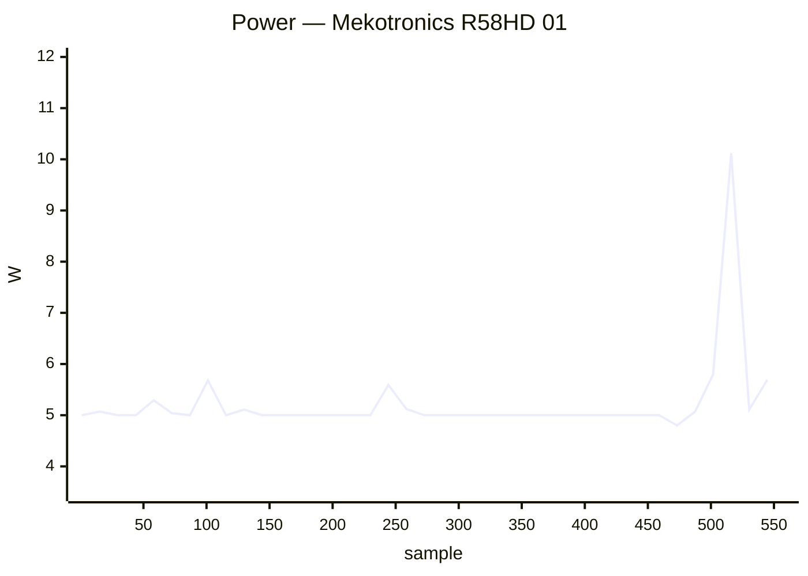

### ✅ Mekotronics R58S2 01

`mekotronics-r58s2` · **inplace** · image `26.11.0-trunk.65` · 5 ✅ · 0 ❌ · 1 ⏭️

| Module | Status | Time | Detail |
|:--|:--:|--:|:--|
| upgrade | ⏭️ | 10.5 s | — |
| reboot | ✅ | 51.7 s | power-cycle · up 15 s |
| hw-performance | ✅ | 15.2 s | AES 1276 · mem 15000 · disk W 237 / R 274 MB/s · 40.7 °C · 1800 MHz |
| dvfs | ✅ | 17.6 s | ondemand · 1800–1800 MHz (peak 2352) |
| network-iperf | ✅ | 56.8 s | end1 ↑837/↓883 (1GE) · wlan0 ↑55/↓157 (Wi-Fi 5) Mbps |
| store-versions | ✅ | 4.2 s | 26.11.0-trunk.65 · 6.1.172-vendor-rk35xx |

**Power** — min 0.60 W · avg 3.61 W · peak 10.20 W · 126 samples


### ✅ NanoPi Fire3 01

`nanopifire3` · **inplace** · image `26.11.0-trunk.66` · 7 ✅ · 0 ❌ · 1 ⏭️

| Module | Status | Time | Detail |
|:--|:--:|--:|:--|
| upgrade | ✅ | 111.4 s | nightly · 26.11.0-trunk.66 → 26.11.0-trunk.66 |
| reboot | ✅ | 58.8 s | power-cycle · up 19 s |
| kernel-switch | ✅ | 72.6 s | branch=edge · family=s5p6818 · installed=26.11.0-trunk.66 · boot_image=/boot/vmlinuz-7.2.8-edge-s5p6818 · kernel_before=7.2.8-edge-s5p6818 |
| reboot | ✅ | 98.7 s | power-cycle · 2/2 boots · up 25 s |
| hw-performance | ✅ | 43.1 s | AES 370 · mem 2000 · disk W 1 / R 22 MB/s · 65 °C · None MHz |
| dvfs | ➖ | 2.9 s | no cpufreq |
| network-iperf | ✅ | 59.7 s | eth0 ↑935/↓938 (1GE) Mbps |
| store-versions | ✅ | 6.2 s | 26.11.0-trunk.66 · 7.2.8-edge-s5p6818 |

### ✅ NanoPi K2 01

`nanopik2-s905` · **inplace** · image `26.11.0-trunk.66` · 16 ✅ · 0 ❌ · 0 ⏭️

| Module | Status | Time | Detail |
|:--|:--:|--:|:--|
| upgrade | ✅ | 57.6 s | nightly · 26.11.0-trunk.66 → 26.11.0-trunk.66 |
| reboot | ✅ | 45.6 s | warm · up 29 s |
| kernel-switch | ✅ | 40.4 s | branch=current · family=meson64 · installed=26.11.0-trunk.66 · boot_image=/boot/vmlinuz-6.18.54-current-meson64 · kernel_before=6.18.54-current-meson64 |
| reboot | ✅ | 75.4 s | warm · 2/2 boots · up 23 s |
| hw-performance | ✅ | 32.6 s | AES 51 · mem 3800 · disk W 8 / R 41 MB/s · 60 °C · 2016 MHz |
| dvfs | ✅ | 20.8 s | ondemand · 500–1536 MHz (peak 1536) |
| network-iperf | ✅ | 58.7 s | end0 ↑935/↓941 (1GE) · wlan0 ↑14/↓16 (Wi-Fi 4) Mbps |
| store-versions | ✅ | 4.8 s | 26.11.0-trunk.66 · 6.18.54-current-meson64 |
| kernel-switch | ✅ | 167.3 s | branch=edge · family=meson64 · installed=26.11.0-trunk.66 · boot_image=/boot/vmlinuz-7.2.8-edge-meson64 · kernel_before=6.18.54-current-meson64 |
| reboot | ✅ | 74.0 s | warm · 2/2 boots · up 24 s |
| hw-performance | ✅ | 35.8 s | AES 51 · mem 3700 · disk W 1 / R 40 MB/s · 61 °C · 2016 MHz |
| dvfs | ✅ | 21.4 s | ondemand · 500–1536 MHz (peak 1536) |
| network-iperf | ✅ | 63.5 s | end0 ↑936/↓941 (1GE) · wlan0 ↑14/↓14 (Wi-Fi 4) Mbps |
| store-versions | ✅ | 4.8 s | 26.11.0-trunk.66 · 7.2.8-edge-meson64 |
| kernel-switch | ✅ | 163.1 s | branch=current · family=meson64 · installed=26.11.0-trunk.66 · boot_image=/boot/vmlinuz-6.18.54-current-meson64 · kernel_before=7.2.8-edge-meson64 |
| reboot | ✅ | 41.0 s | warm · up 24 s |

### ✅ NanoPi M4V2 01

`nanopim4v2` · **inplace** · image `26.11.0-trunk.66` · 16 ✅ · 0 ❌ · 0 ⏭️

| Module | Status | Time | Detail |
|:--|:--:|--:|:--|
| upgrade | ✅ | 48.2 s | nightly · 26.11.0-trunk.66 → 26.11.0-trunk.66 |
| reboot | ✅ | 63.5 s | power-cycle · up 29 s |
| kernel-switch | ✅ | 33.5 s | branch=current · family=rockchip64 · installed=26.11.0-trunk.66 · boot_image=/boot/vmlinuz-6.18.54-current-rockchip64 · kernel_before=6.18.54-current-rockchip64 |
| reboot | ✅ | 98.3 s | power-cycle · 2/2 boots · up 28 s |
| hw-performance | ✅ | 22.1 s | AES 1022 · mem 6600 · disk W 54 / R 38 MB/s · 43.9 °C · 1416 MHz |
| dvfs | ✅ | 21.4 s | ondemand · 408–1416 MHz (peak 1800) |
| network-iperf | ✅ | 103.6 s | end0 ↑932/↓883 (1GE) · wlan0 ↑175/↓186 (Wi-Fi 5) · wlx803f5d16af63 ↑100/↓143 (Wi-Fi 5) Mbps |
| store-versions | ✅ | 5.6 s | 26.11.0-trunk.66 · 6.18.54-current-rockchip64 |
| kernel-switch | ✅ | 96.5 s | branch=edge · family=rockchip64 · installed=26.11.0-trunk.66 · boot_image=/boot/vmlinuz-7.2.8-edge-rockchip64 · kernel_before=6.18.54-current-rockchip64 |
| reboot | ✅ | 308.6 s | power-cycle · 1/2 boots · up 29 s |
| hw-performance | ✅ | 52.2 s | AES 1020 · mem 6400 · disk W 1 / R 15 MB/s · 42.8 °C · 1416 MHz |
| dvfs | ✅ | 21.4 s | ondemand · 408–1416 MHz (peak 1800) |
| network-iperf | ✅ | 97.3 s | end0 ↑926/↓821 (1GE) · wlan0 ↑148/↓195 (Wi-Fi 5) · wlx803f5d16af63 ↑127/↓194 (Wi-Fi 5) Mbps |
| store-versions | ✅ | 4.7 s | 26.11.0-trunk.66 · 7.2.8-edge-rockchip64 |
| kernel-switch | ✅ | 121.0 s | branch=current · family=rockchip64 · installed=26.11.0-trunk.66 · boot_image=/boot/vmlinuz-6.18.54-current-rockchip64 · kernel_before=7.2.8-edge-rockchip64 |
| reboot | ✅ | 64.1 s | power-cycle · up 29 s |

**Power** — min 2.30 W · avg 6.91 W · peak 12.40 W · 826 samples

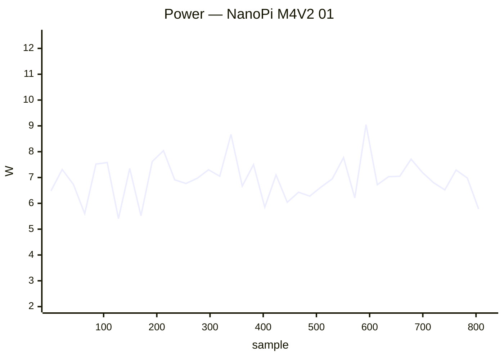

### ✅ NanoPi M6 01

`nanopi-m6` · **inplace** · image `26.11.0-trunk.66` · 22 ✅ · 0 ❌ · 0 ⏭️

| Module | Status | Time | Detail |
|:--|:--:|--:|:--|
| upgrade | ✅ | 29.0 s | nightly · 26.11.0-trunk.66 → 26.11.0-trunk.66 |
| reboot | ✅ | 47.8 s | power-cycle · up 20 s |
| kernel-switch | ✅ | 21.0 s | branch=vendor · family=rk35xx · installed=26.11.0-trunk.66 · boot_image=/boot/vmlinuz-6.1.172-vendor-rk35xx · kernel_before=6.1.172-vendor-rk35xx |
| reboot | ✅ | 81.3 s | power-cycle · 2/2 boots · up 23 s |
| hw-performance | ✅ | 17.2 s | AES 1271 · mem 13400 · disk W 52 / R 77 MB/s · 45.3 °C · 1800 MHz |
| dvfs | ✅ | 17.1 s | ondemand · 1800–1800 MHz (peak 2256) |
| network-iperf | ✅ | 55.7 s | lan ↑939/↓939 (1GE) · wlP3p49s0 ↑167/↓248 (Wi-Fi 5) Mbps |
| store-versions | ✅ | 4.8 s | 26.11.0-trunk.66 · 6.1.172-vendor-rk35xx |
| kernel-switch | ✅ | 97.9 s | branch=current · family=rockchip64 · installed=26.11.0-trunk.66 · boot_image=/boot/vmlinuz-6.18.54-current-rockchip64 · kernel_before=6.1.172-vendor-rk35xx |
| reboot | ✅ | 74.2 s | power-cycle · 2/2 boots · up 19 s |
| hw-performance | ✅ | 18.4 s | AES 1215 · mem 9900 · disk W 47 / R 57 MB/s · 48.1 °C · 1800 MHz |
| dvfs | ✅ | 15.3 s | ondemand · 408–1800 MHz (peak 2400) |
| network-iperf | ✅ | 66.6 s | lan ↑631/↓872 (1GE) · wlP3p49s0 ↑158/↓274 (Wi-Fi 5) Mbps |
| store-versions | ✅ | 3.9 s | 26.11.0-trunk.66 · 6.18.54-current-rockchip64 |
| kernel-switch | ✅ | 72.4 s | branch=edge · family=rockchip64 · installed=26.11.0-trunk.66 · boot_image=/boot/vmlinuz-7.2.8-edge-rockchip64 · kernel_before=6.18.54-current-rockchip64 |
| reboot | ✅ | 82.9 s | power-cycle · 2/2 boots · up 20 s |
| hw-performance | ✅ | 18.8 s | AES 1214 · mem 6000 · disk W 46 / R 55 MB/s · 49.9 °C · 1800 MHz |
| dvfs | ✅ | 15.1 s | ondemand · 408–1800 MHz (peak 2400) |
| network-iperf | ✅ | 61.8 s | lan ↑897/↓938 (1GE) · wlP3p49s0 ↑67/↓261 (Wi-Fi 5) Mbps |
| store-versions | ✅ | 4.0 s | 26.11.0-trunk.66 · 7.2.8-edge-rockchip64 |
| kernel-switch | ✅ | 69.8 s | branch=vendor · family=rk35xx · installed=26.11.0-trunk.66 · boot_image=/boot/vmlinuz-6.1.172-vendor-rk35xx · kernel_before=7.2.8-edge-rockchip64 |
| reboot | ✅ | 52.5 s | power-cycle · up 23 s |

**Power** — min 0.90 W · avg 4.02 W · peak 10.10 W · 733 samples

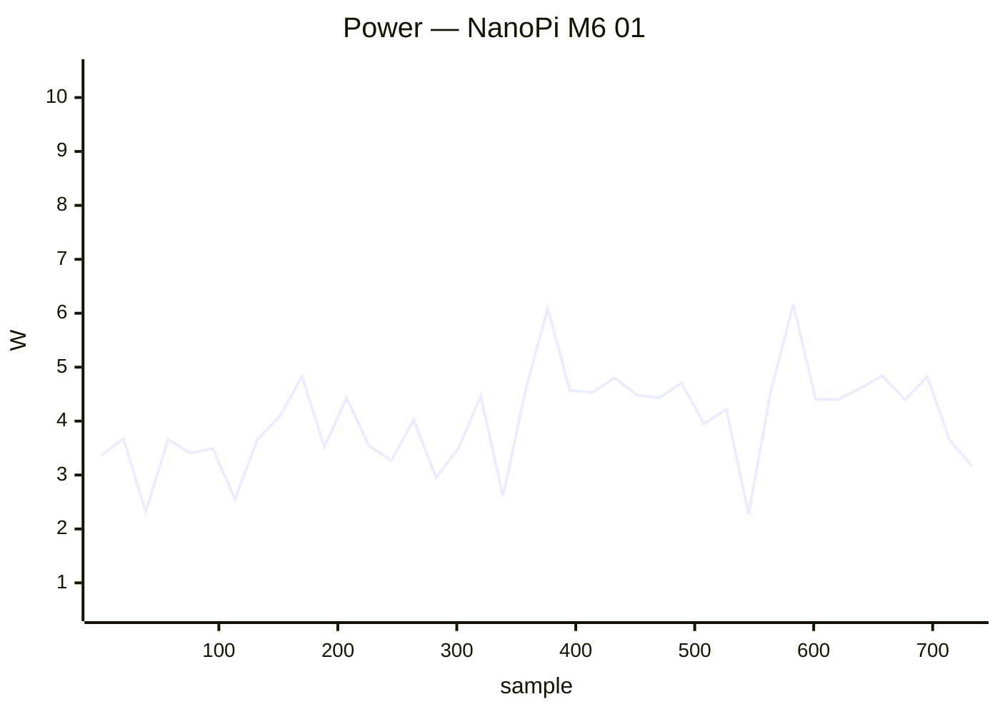

### ✅ NanoPi Neo 2 Black 01

`nanopineo2black` · **inplace** · image `26.11.0-trunk.65` · 16 ✅ · 0 ❌ · 0 ⏭️

| Module | Status | Time | Detail |
|:--|:--:|--:|:--|
| upgrade | ✅ | 228.7 s | nightly · 26.11.0-trunk.65 → 26.11.0-trunk.66 |
| reboot | ✅ | 60.7 s | power-cycle · up 21 s |
| kernel-switch | ✅ | 41.4 s | branch=current · family=sunxi64 · installed=26.11.0-trunk.66 · boot_image=/boot/vmlinuz-6.18.54-current-sunxi64 · kernel_before=6.18.54-current-sunxi64 |
| reboot | ✅ | 310.7 s | power-cycle · 1/2 boots · up 20 s |
| hw-performance | ✅ | 23.9 s | AES 637 · mem 3500 · disk W 43 / R 44 MB/s · 62.2 °C · 1368 MHz |
| dvfs | ✅ | 23.3 s | ondemand · 480–1368 MHz (peak 1368) |
| network-iperf | ✅ | 48.0 s | end0 ↑839/↓560 (1GE) Mbps |
| store-versions | ✅ | 4.9 s | 26.11.0-trunk.66 · 6.18.54-current-sunxi64 |
| kernel-switch | ✅ | 107.7 s | branch=edge · family=sunxi64 · installed=26.11.0-trunk.66 · boot_image=/boot/vmlinuz-7.2.8-edge-sunxi64 · kernel_before=6.18.54-current-sunxi64 |
| reboot | ✅ | 305.8 s | power-cycle · 1/2 boots · up 18 s |
| hw-performance | ✅ | 23.6 s | AES 638 · mem 3500 · disk W 43 / R 44 MB/s · 57 °C · 1368 MHz |
| dvfs | ✅ | 23.5 s | ondemand · 480–1368 MHz (peak 1368) |
| network-iperf | ✅ | 31.8 s | end0 ↑893/↓877 (1GE) Mbps |
| store-versions | ✅ | 5.1 s | 26.11.0-trunk.66 · 7.2.8-edge-sunxi64 |
| kernel-switch | ✅ | 106.8 s | branch=current · family=sunxi64 · installed=26.11.0-trunk.66 · boot_image=/boot/vmlinuz-6.18.54-current-sunxi64 · kernel_before=7.2.8-edge-sunxi64 |
| reboot | ✅ | 55.3 s | power-cycle · up 17 s |

**Power** — min 1.00 W · avg 2.59 W · peak 5.70 W · 1105 samples

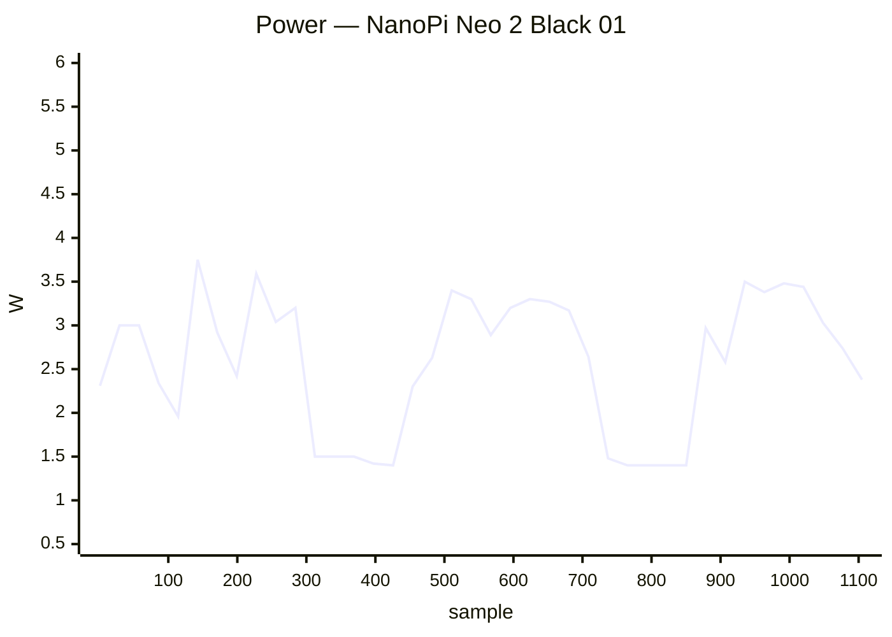

### ✅ NanoPi Neo 3 01

`nanopineo3` · **inplace** · image `26.11.0-trunk.65` · 16 ✅ · 0 ❌ · 0 ⏭️

| Module | Status | Time | Detail |
|:--|:--:|--:|:--|
| upgrade | ✅ | 282.2 s | nightly · 26.11.0-trunk.65 → 26.11.0-trunk.66 |
| reboot | ✅ | 61.1 s | power-cycle · up 26 s |
| kernel-switch | ✅ | 57.9 s | branch=current · family=rockchip64 · installed=26.11.0-trunk.66 · boot_image=/boot/vmlinuz-6.18.54-current-rockchip64 · kernel_before=6.18.54-current-rockchip64 |
| reboot | ✅ | 99.7 s | power-cycle · 2/2 boots · up 29 s |
| hw-performance | ✅ | 28.8 s | AES 594 · mem 2300 · disk W 43 / R 63 MB/s · 77.3 °C · 1296 MHz |
| dvfs | ✅ | 30.0 s | ondemand · 408–1296 MHz (peak 1296) |
| network-iperf | ✅ | 105.5 s | end0 ↑906/↓941 (1GE) · wlx7cdd905518f9 ↑21/↓19 (Wi-Fi 4) Mbps |
| store-versions | ✅ | 6.5 s | 26.11.0-trunk.66 · 6.18.54-current-rockchip64 |
| kernel-switch | ✅ | 171.6 s | branch=edge · family=rockchip64 · installed=26.11.0-trunk.66 · boot_image=/boot/vmlinuz-7.2.8-edge-rockchip64 · kernel_before=6.18.54-current-rockchip64 |
| reboot | ✅ | 94.4 s | power-cycle · 2/2 boots · up 25 s |
| hw-performance | ✅ | 28.6 s | AES 599 · mem 2300 · disk W 1 / R 62 MB/s · 79.6 °C · 1296 MHz |
| dvfs | ✅ | 31.1 s | ondemand · 408–1296 MHz (peak 1296) |
| network-iperf | ✅ | 80.2 s | end0 ↑919/↓941 (1GE) · wlx7cdd905518f9 ↑16/↓19 (Wi-Fi 4) Mbps |
| store-versions | ✅ | 7.1 s | 26.11.0-trunk.66 · 7.2.8-edge-rockchip64 |
| kernel-switch | ✅ | 175.0 s | branch=current · family=rockchip64 · installed=26.11.0-trunk.66 · boot_image=/boot/vmlinuz-6.18.54-current-rockchip64 · kernel_before=7.2.8-edge-rockchip64 |
| reboot | ✅ | 57.3 s | power-cycle · up 26 s |

### ✅ NanoPi R6S 01

`nanopi-r6s` · **inplace** · image `26.11.0-trunk.65` · 22 ✅ · 0 ❌ · 0 ⏭️

| Module | Status | Time | Detail |
|:--|:--:|--:|:--|
| upgrade | ✅ | 74.2 s | nightly · 26.11.0-trunk.65 → 26.11.0-trunk.66 |
| reboot | ✅ | 43.1 s | power-cycle · up 15 s |
| kernel-switch | ✅ | 17.9 s | branch=vendor · family=rk35xx · installed=26.11.0-trunk.66 · boot_image=/boot/vmlinuz-6.1.172-vendor-rk35xx · kernel_before=6.1.172-vendor-rk35xx |
| reboot | ✅ | 66.5 s | power-cycle · 2/2 boots · up 20 s |
| hw-performance | ✅ | 14.2 s | AES 1280 · mem 13600 · disk W 212 / R 274 MB/s · 36.1 °C · 1800 MHz |
| dvfs | ✅ | 17.3 s | ondemand · 1800–1800 MHz (peak 2352) |
| network-iperf | ✅ | 29.2 s | lan2 ↑939/↓916 (1GE) Mbps |
| store-versions | ✅ | 4.0 s | 26.11.0-trunk.66 · 6.1.172-vendor-rk35xx |
| kernel-switch | ✅ | 48.9 s | branch=current · family=rockchip64 · installed=26.11.0-trunk.66 · boot_image=/boot/vmlinuz-6.18.54-current-rockchip64 · kernel_before=6.1.172-vendor-rk35xx |
| reboot | ✅ | 63.2 s | power-cycle · 2/2 boots · up 12 s |
| hw-performance | ✅ | 15.1 s | AES 1273 · mem 7700 · disk W 150 / R 146 MB/s · 37 °C · 1800 MHz |
| dvfs | ✅ | 15.1 s | ondemand · 408–1800 MHz (peak 2400) |
| network-iperf | ✅ | 30.4 s | lan2 ↑374/↓341 (1GE) Mbps |
| store-versions | ✅ | 4.2 s | 26.11.0-trunk.66 · 6.18.54-current-rockchip64 |
| kernel-switch | ✅ | 59.3 s | branch=edge · family=rockchip64 · installed=26.11.0-trunk.66 · boot_image=/boot/vmlinuz-7.2.8-edge-rockchip64 · kernel_before=6.18.54-current-rockchip64 |
| reboot | ✅ | 69.3 s | power-cycle · 2/2 boots · up 20 s |
| hw-performance | ✅ | 15.4 s | AES 1278 · mem 8100 · disk W 148 / R 151 MB/s · 37.9 °C · 1800 MHz |
| dvfs | ✅ | 14.1 s | ondemand · 408–1800 MHz (peak 2400) |
| network-iperf | ✅ | 28.9 s | lan2 ↑844/↓839 (1GE) Mbps |
| store-versions | ✅ | 3.9 s | 26.11.0-trunk.66 · 7.2.8-edge-rockchip64 |
| kernel-switch | ✅ | 38.6 s | branch=vendor · family=rk35xx · installed=26.11.0-trunk.66 · boot_image=/boot/vmlinuz-6.1.172-vendor-rk35xx · kernel_before=7.2.8-edge-rockchip64 |
| reboot | ✅ | 38.1 s | power-cycle · up 12 s |

**Power** — min 1.00 W · avg 4.71 W · peak 10.20 W · 554 samples

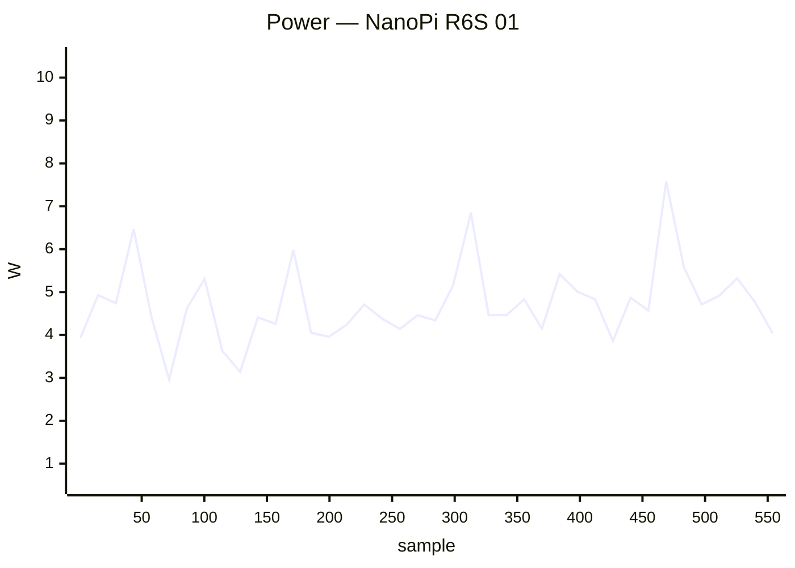

### ✅ NanoPi R76S 01

`nanopi-r76s` · **inplace** · image `26.11.0-trunk.65` · 15 ✅ · 0 ❌ · 1 ⏭️

| Module | Status | Time | Detail |
|:--|:--:|--:|:--|
| upgrade | ⏭️ | 11.5 s | — |
| reboot | ✅ | 64.8 s | power-cycle · up 28 s |
| kernel-switch | ✅ | 144.0 s | branch=vendor · family=rk35xx · installed=26.11.0-trunk.66 · boot_image=/boot/vmlinuz-6.1.172-vendor-rk35xx · kernel_before=6.1.172-vendor-rk35xx |
| reboot | ✅ | 114.7 s | power-cycle · 2/2 boots · up 30 s |
| hw-performance | ✅ | 22.4 s | AES 1268 · mem 6200 · disk W 68 / R 77 MB/s · 40.7 °C · 2016 MHz |
| dvfs | ✅ | 21.2 s | ondemand · 2016–2016 MHz (peak 2208) |
| network-iperf | ✅ | 134.6 s | end0 ↑939/↓908 (1GE) · end1 ↑938/↓924 (1GE) · wlan0 ↑43/↓74 (Wi-Fi 5) · wlxe0e1a933de37 ↑137/↓163 (Wi-Fi 5) Mbps |
| store-versions | ✅ | 4.9 s | 26.11.0-trunk.65 · 6.1.172-vendor-rk35xx |
| kernel-switch | ✅ | 158.7 s | branch=edge · family=rockchip64 · installed=26.11.0-trunk.66 · boot_image=/boot/vmlinuz-7.2.8-edge-rockchip64 · kernel_before=6.1.172-vendor-rk35xx |
| reboot | ✅ | 120.5 s | power-cycle · 2/2 boots · up 30 s |
| hw-performance | ✅ | 21.8 s | AES 1307 · mem 8800 · disk W 52 / R 71 MB/s · 41.6 °C · 2016 MHz |
| dvfs | ✅ | 19.4 s | ondemand · 408–2016 MHz (peak 2208) |
| network-iperf | ✅ | 117.4 s | end0 ↑939/↓930 (1GE) · end1 ↑939/↓939 (1GE) · wlan0 ↑99/↓120 (Wi-Fi 5) · wlxe0e1a933de37 ↑90/↓153 (Wi-Fi 5) Mbps |
| store-versions | ✅ | 4.6 s | 26.11.0-trunk.65 · 7.2.8-edge-rockchip64 |
| kernel-switch | ✅ | 95.0 s | branch=vendor · family=rk35xx · installed=26.11.0-trunk.66 · boot_image=/boot/vmlinuz-6.1.172-vendor-rk35xx · kernel_before=7.2.8-edge-rockchip64 |
| reboot | ✅ | 63.4 s | power-cycle · up 28 s |

**Power** — min 0.70 W · avg 3.92 W · peak 8.60 W · 878 samples

```mermaid
xychart-beta
    title "Power — NanoPi R76S 01"
    x-axis "sample" 1 --> 878
    y-axis "W" 0.5 --> 9.0
    line [3.87, 2.87, 3.55, 4.26, 4.40, 3.67, 3.81, 4.33, 3.01, 3.67, 2.53, 3.33, 4.38, 4.79, 4.10, 4.17, 4.16, 4.18, 4.30, 4.29, 4.28, 4.09, 3.70, 3.96, 3.51, 2.48, 4.35, 1.67, 4.12, 5.44, 4.31, 4.10, 4.54, 4.23, 4.48, 4.52, 4.35, 4.74, 3.55, 2.68]
```

### ✅ Odroid C2 01

`odroidc2` · **inplace** · image `26.11.0-trunk.65` · 16 ✅ · 0 ❌ · 0 ⏭️

| Module | Status | Time | Detail |
|:--|:--:|--:|:--|
| upgrade | ✅ | 193.6 s | nightly · 26.11.0-trunk.65 → 26.11.0-trunk.66 |
| reboot | ✅ | 33.5 s | warm · up 17 s |
| kernel-switch | ✅ | 37.6 s | branch=current · family=meson64 · installed=26.11.0-trunk.66 · boot_image=/boot/vmlinuz-6.18.54-current-meson64 · kernel_before=6.18.54-current-meson64 |
| reboot | ✅ | 62.1 s | warm · 2/2 boots · up 17 s |
| hw-performance | ✅ | 22.5 s | AES 51 · mem 3500 · disk W 32 / R 152 MB/s · 44 °C · 1536 MHz |
| dvfs | ✅ | 22.0 s | ondemand · 500–1536 MHz (peak 1536) |
| network-iperf | ✅ | 33.9 s | end0 ↑940/↓941 (1GE) Mbps |
| store-versions | ✅ | 5.1 s | 26.11.0-trunk.66 · 6.18.54-current-meson64 |
| kernel-switch | ✅ | 113.3 s | branch=edge · family=meson64 · installed=26.11.0-trunk.66 · boot_image=/boot/vmlinuz-7.2.8-edge-meson64 · kernel_before=6.18.54-current-meson64 |
| reboot | ✅ | 61.5 s | warm · 2/2 boots · up 17 s |
| hw-performance | ✅ | 22.5 s | AES 51 · mem 3500 · disk W 32 / R 152 MB/s · 46 °C · 1536 MHz |
| dvfs | ✅ | 22.4 s | ondemand · 500–1536 MHz (peak 1536) |
| network-iperf | ✅ | 35.7 s | end0 ↑940/↓942 (1GE) Mbps |
| store-versions | ✅ | 5.0 s | 26.11.0-trunk.66 · 7.2.8-edge-meson64 |
| kernel-switch | ✅ | 112.5 s | branch=current · family=meson64 · installed=26.11.0-trunk.66 · boot_image=/boot/vmlinuz-6.18.54-current-meson64 · kernel_before=7.2.8-edge-meson64 |
| reboot | ✅ | 33.4 s | warm · up 17 s |

### ✅ Odroid C4 01

`odroidc4` · **inplace** · image `26.11.0-trunk.65` · 16 ✅ · 0 ❌ · 0 ⏭️

| Module | Status | Time | Detail |
|:--|:--:|--:|:--|
| upgrade | ✅ | 201.4 s | nightly · 26.11.0-trunk.65 → 26.11.0-trunk.66 |
| reboot | ✅ | 52.0 s | power-cycle · up 18 s |
| kernel-switch | ✅ | 30.1 s | branch=current · family=meson64 · installed=26.11.0-trunk.66 · boot_image=/boot/vmlinuz-6.18.54-current-meson64 · kernel_before=6.18.54-current-meson64 |
| reboot | ✅ | 76.5 s | power-cycle · 2/2 boots · up 17 s |
| hw-performance | ✅ | 21.9 s | AES 980 · mem 5300 · disk W 30 / R 78 MB/s · 39.3 °C · 2100 MHz |
| dvfs | ✅ | 19.4 s | ondemand · 1000–2100 MHz (peak 2100) |
| network-iperf | ✅ | 63.6 s | end0 ↑914/↓911 (1GE) · wlx24050fdd332b ↑116/↓111 (Wi-Fi 4) Mbps |
| store-versions | ✅ | 5.2 s | 26.11.0-trunk.66 · 6.18.54-current-meson64 |
| kernel-switch | ✅ | 117.0 s | branch=edge · family=meson64 · installed=26.11.0-trunk.66 · boot_image=/boot/vmlinuz-7.2.8-edge-meson64 · kernel_before=6.18.54-current-meson64 |
| reboot | ✅ | 79.6 s | power-cycle · 2/2 boots · up 17 s |
| hw-performance | ✅ | 21.7 s | AES 980 · mem 5200 · disk W 30 / R 79 MB/s · 39.3 °C · 2100 MHz |
| dvfs | ✅ | 19.6 s | ondemand · 1000–2100 MHz (peak 2100) |
| network-iperf | ✅ | 57.5 s | end0 ↑938/↓938 (1GE) · wlx24050fdd332b ↑117/↓128 (Wi-Fi 4) Mbps |
| store-versions | ✅ | 4.3 s | 26.11.0-trunk.66 · 7.2.8-edge-meson64 |
| kernel-switch | ✅ | 109.0 s | branch=current · family=meson64 · installed=26.11.0-trunk.66 · boot_image=/boot/vmlinuz-6.18.54-current-meson64 · kernel_before=7.2.8-edge-meson64 |
| reboot | ✅ | 55.6 s | power-cycle · up 18 s |

**Power** — min 0.80 W · avg 3.43 W · peak 5.20 W · 740 samples

```mermaid
xychart-beta
    title "Power — Odroid C4 01"
    x-axis "sample" 1 --> 740
    y-axis "W" 0.5 --> 5.5
    line [3.29, 3.75, 3.43, 3.45, 3.52, 2.98, 3.84, 3.42, 3.48, 3.11, 2.47, 3.76, 3.32, 3.53, 2.39, 3.48, 3.87, 3.39, 3.33, 4.11, 3.64, 3.98, 3.59, 3.48, 3.66, 3.33, 3.44, 1.97, 3.51, 3.84, 3.67, 3.47, 4.31, 3.76, 3.61, 3.58, 3.53, 3.62, 3.16, 2.15]
```

### ✅ Odroid M1 01

`odroidm1` · **inplace** · image `26.11.0-trunk.65` · 16 ✅ · 0 ❌ · 0 ⏭️

| Module | Status | Time | Detail |
|:--|:--:|--:|:--|
| upgrade | ✅ | 141.3 s | nightly · 26.11.0-trunk.65 → 26.11.0-trunk.66 |
| reboot | ✅ | 57.4 s | power-cycle · up 20 s |
| kernel-switch | ✅ | 31.5 s | branch=current · family=rockchip64 · installed=26.11.0-trunk.66 · boot_image=/boot/vmlinuz-6.18.54-current-rockchip64 · kernel_before=6.18.54-current-rockchip64 |
| reboot | ✅ | 87.9 s | power-cycle · 2/2 boots · up 23 s |
| hw-performance | ✅ | 16.8 s | AES 917 · mem 5100 · disk W 1032 / R 1011 MB/s · 34.4 °C · 1992 MHz |
| dvfs | ✅ | 21.0 s | ondemand · 408–1992 MHz (peak 1992) |
| network-iperf | ✅ | 79.0 s | eth0 ↑629/↓941 (1GE) · wlx40a5eff39254 ↑204/↓225 (Wi-Fi 5) Mbps |
| store-versions | ✅ | 4.8 s | 26.11.0-trunk.66 · 6.18.54-current-rockchip64 |
| kernel-switch | ✅ | 86.2 s | branch=edge · family=rockchip64 · installed=26.11.0-trunk.66 · boot_image=/boot/vmlinuz-7.2.8-edge-rockchip64 · kernel_before=6.18.54-current-rockchip64 |
| reboot | ✅ | 86.0 s | power-cycle · 2/2 boots · up 24 s |
| hw-performance | ✅ | 17.9 s | AES 916 · mem 5000 · disk W 1026 / R 989 MB/s · 35 °C · 1992 MHz |
| dvfs | ✅ | 23.3 s | ondemand · 408–1992 MHz (peak 1992) |
| network-iperf | ✅ | 70.8 s | eth0 ↑941/↓941 (1GE) · wlx40a5eff39254 ↑86/↓220 (Wi-Fi 5) Mbps |
| store-versions | ✅ | 4.8 s | 26.11.0-trunk.66 · 7.2.8-edge-rockchip64 |
| kernel-switch | ✅ | 85.9 s | branch=current · family=rockchip64 · installed=26.11.0-trunk.66 · boot_image=/boot/vmlinuz-6.18.54-current-rockchip64 · kernel_before=7.2.8-edge-rockchip64 |
| reboot | ✅ | 59.2 s | power-cycle · up 20 s |

**Power** — min 1.90 W · avg 6.33 W · peak 10.60 W · 662 samples

```mermaid
xychart-beta
    title "Power — Odroid M1 01"
    x-axis "sample" 1 --> 662
    y-axis "W" 1.5 --> 11.0
    line [5.74, 7.39, 7.66, 6.64, 6.94, 7.31, 5.97, 5.21, 5.12, 7.30, 5.90, 5.78, 5.43, 5.34, 6.71, 7.21, 5.75, 5.56, 5.91, 5.76, 6.52, 7.14, 7.23, 6.77, 6.48, 6.67, 4.12, 7.46, 6.23, 5.94, 6.36, 5.54, 5.70, 5.89, 6.89, 7.51, 6.94, 6.49, 5.96, 6.66]
```

### ✅ Odroid N2 01

`odroidn2` · **inplace** · image `26.11.0-trunk.65` · 16 ✅ · 0 ❌ · 0 ⏭️

| Module | Status | Time | Detail |
|:--|:--:|--:|:--|
| upgrade | ✅ | 159.7 s | nightly · 26.11.0-trunk.65 → 26.11.0-trunk.66 |
| reboot | ✅ | 72.1 s | power-cycle · up 33 s |
| kernel-switch | ✅ | 25.1 s | branch=current · family=meson64 · installed=26.11.0-trunk.66 · boot_image=/boot/vmlinuz-6.18.54-current-meson64 · kernel_before=6.18.54-current-meson64 |
| reboot | ✅ | 95.5 s | power-cycle · 2/2 boots · up 29 s |
| hw-performance | ✅ | 18.7 s | AES 1085 · mem 4900 · disk W 28 / R 137 MB/s · 37.8 °C · 1992 MHz |
| dvfs | ✅ | 16.9 s | performance · 1000–1992 MHz (peak 1992) |
| network-iperf | ✅ | 28.4 s | end0 ↑940/↓941 (1GE) Mbps |
| store-versions | ✅ | 3.8 s | 26.11.0-trunk.66 · 6.18.54-current-meson64 |
| kernel-switch | ✅ | 83.1 s | branch=edge · family=meson64 · installed=26.11.0-trunk.66 · boot_image=/boot/vmlinuz-7.2.8-edge-meson64 · kernel_before=6.18.54-current-meson64 |
| reboot | ✅ | 104.5 s | power-cycle · 2/2 boots · up 36 s |
| hw-performance | ✅ | 19.5 s | AES 1085 · mem 4900 · disk W 27 / R 134 MB/s · 38.4 °C · 1992 MHz |
| dvfs | ✅ | 18.4 s | performance · 1000–1992 MHz (peak 1992) |
| network-iperf | ✅ | 29.9 s | end0 ↑940/↓941 (1GE) Mbps |
| store-versions | ✅ | 4.0 s | 26.11.0-trunk.66 · 7.2.8-edge-meson64 |
| kernel-switch | ✅ | 82.0 s | branch=current · family=meson64 · installed=26.11.0-trunk.66 · boot_image=/boot/vmlinuz-6.18.54-current-meson64 · kernel_before=7.2.8-edge-meson64 |
| reboot | ✅ | 64.9 s | power-cycle · up 29 s |

**Power** — min 1.00 W · avg 4.88 W · peak 11.10 W · 645 samples

```mermaid
xychart-beta
    title "Power — Odroid N2 01"
    x-axis "sample" 1 --> 645
    y-axis "W" 0.5 --> 11.5
    line [4.94, 4.85, 5.24, 5.22, 4.94, 4.85, 4.90, 5.18, 4.48, 2.80, 4.79, 5.66, 5.20, 3.27, 5.34, 4.33, 5.12, 5.19, 7.25, 4.62, 5.03, 4.78, 5.15, 5.25, 4.49, 3.09, 4.77, 4.28, 4.51, 6.26, 6.16, 5.86, 4.69, 4.96, 4.92, 5.05, 5.23, 4.71, 2.83, 4.88]
```

### ✅ Orange Pi 3 01

`orangepi3` · **inplace** · image `26.11.0-trunk.58` · 15 ✅ · 0 ❌ · 1 ⏭️

| Module | Status | Time | Detail |
|:--|:--:|--:|:--|
| upgrade | ⏭️ | 44.2 s | — |
| reboot | ✅ | 71.5 s | power-cycle · up 38 s |
| kernel-switch | ✅ | 37.7 s | branch=current · family=sunxi64 · installed=26.8.0-trunk.61 · boot_image=/boot/vmlinuz-6.18.33-current-sunxi64 · kernel_before=6.18.33-current-sunxi64 |
| reboot | ✅ | 326.7 s | power-cycle · 1/2 boots · up 28 s |
| hw-performance | ✅ | 28.2 s | AES 839 · mem 4600 · disk W 20 / R 0 MB/s · 44.8 °C · 1800 MHz |
| dvfs | ✅ | 19.7 s | ondemand · 480–1800 MHz (peak 1800) |
| network-iperf | ✅ | 60.0 s | end0 ↑916/↓939 (1GE) · wlan0 ↑52/↓74 (Wi-Fi 5) Mbps |
| store-versions | ✅ | 4.6 s | 26.11.0-trunk.58 · 6.18.33-current-sunxi64 |
| kernel-switch | ✅ | 104.1 s | branch=edge · family=sunxi64 · installed=26.8.0-trunk.61 · boot_image=/boot/vmlinuz-7.0.10-edge-sunxi64 · kernel_before=6.18.33-current-sunxi64 |
| reboot | ✅ | 315.0 s | power-cycle · 1/2 boots · up 24 s |
| hw-performance | ✅ | 28.8 s | AES 839 · mem 4600 · disk W 21 / R 23 MB/s · 44.2 °C · 1800 MHz |
| dvfs | ✅ | 19.6 s | ondemand · 480–1800 MHz (peak 1800) |
| network-iperf | ✅ | 65.6 s | end0 ↑918/↓930 (1GE) · wlan0 ↑57/↓106 (Wi-Fi 5) Mbps |
| store-versions | ✅ | 4.7 s | 26.11.0-trunk.58 · 7.0.10-edge-sunxi64 |
| kernel-switch | ✅ | 102.5 s | branch=current · family=sunxi64 · installed=26.8.0-trunk.61 · boot_image=/boot/vmlinuz-6.18.33-current-sunxi64 · kernel_before=7.0.10-edge-sunxi64 |
| reboot | ✅ | 58.0 s | power-cycle · up 25 s |

### ✅ Orange Pi 5 Plus 01

`orangepi5-plus` · **inplace** · image `26.11.0-trunk.65` · 21 ✅ · 1 ❌ · 0 ⏭️

| Module | Status | Time | Detail |
|:--|:--:|--:|:--|
| upgrade | ✅ | 154.0 s | nightly · 26.11.0-trunk.65 → 26.11.0-trunk.66 |
| reboot | ✅ | 64.8 s | power-cycle · up 34 s |
| kernel-switch | ✅ | 19.5 s | branch=vendor · family=rk35xx · installed=26.11.0-trunk.66 · boot_image=/boot/vmlinuz-6.1.172-vendor-rk35xx · kernel_before=6.1.172-vendor-rk35xx |
| reboot | ✅ | 108.5 s | power-cycle · 2/2 boots · up 32 s |
| hw-performance | ✅ | 17.0 s | AES 1256 · mem 13800 · disk W 54 / R 62 MB/s · 53.6 °C · 1800 MHz |
| dvfs | ✅ | 16.6 s | ondemand · 1800–1800 MHz (peak 2256) |
| network-iperf | ❌ | 120.4 s | enP3p49s0 ↑941/↓0 (1GE) · wlxe0e1a9380c53 ↑617/↓317 (Wi-Fi 6) Mbps |
| store-versions | ✅ | 4.0 s | 26.11.0-trunk.66 · 6.1.172-vendor-rk35xx |
| kernel-switch | ✅ | 95.7 s | branch=current · family=rockchip64 · installed=26.11.0-trunk.66 · boot_image=/boot/vmlinuz-6.18.54-current-rockchip64 · kernel_before=6.1.172-vendor-rk35xx |
| reboot | ✅ | 90.4 s | power-cycle · 2/2 boots · up 27 s |
| hw-performance | ✅ | 18.4 s | AES 1254 · mem 10100 · disk W 53 / R 57 MB/s · 56.4 °C · 1800 MHz |
| dvfs | ✅ | 16.7 s | ondemand · 408–1800 MHz (peak 2400) |
| network-iperf | ✅ | 55.5 s | enP3p49s0 ↑941/↓941 (1GE) · wlxe0e1a9380c53 ↑101/↓71 (Wi-Fi 6) Mbps |
| store-versions | ✅ | 4.0 s | 26.11.0-trunk.66 · 6.18.54-current-rockchip64 |
| kernel-switch | ✅ | 66.3 s | branch=edge · family=rockchip64 · installed=26.11.0-trunk.66 · boot_image=/boot/vmlinuz-7.2.8-edge-rockchip64 · kernel_before=6.18.54-current-rockchip64 |
| reboot | ✅ | 97.0 s | power-cycle · 2/2 boots · up 29 s |
| hw-performance | ✅ | 18.5 s | AES 1252 · mem 8000 · disk W 52 / R 56 MB/s · 58.2 °C · 1800 MHz |
| dvfs | ✅ | 14.8 s | ondemand · 408–1800 MHz (peak 2400) |
| network-iperf | ✅ | 58.1 s | enP3p49s0 ↑941/↓941 (1GE) · wlxe0e1a9380c53 ↑631/↓253 (Wi-Fi 6) Mbps |
| store-versions | ✅ | 4.7 s | 26.11.0-trunk.66 · 7.2.8-edge-rockchip64 |
| kernel-switch | ✅ | 64.7 s | branch=vendor · family=rk35xx · installed=26.11.0-trunk.66 · boot_image=/boot/vmlinuz-6.1.172-vendor-rk35xx · kernel_before=7.2.8-edge-rockchip64 |
| reboot | ✅ | 59.7 s | power-cycle · up 29 s |

**Power** — min 0.60 W · avg 6.30 W · peak 13.20 W · 915 samples

```mermaid
xychart-beta
    title "Power — Orange Pi 5 Plus 01"
    x-axis "sample" 1 --> 915
    y-axis "W" 0.5 --> 13.5
    line [5.88, 6.07, 5.52, 6.57, 5.90, 5.43, 4.28, 6.96, 4.62, 5.80, 3.70, 5.51, 7.21, 5.64, 5.29, 5.00, 6.60, 6.31, 5.76, 5.87, 6.12, 4.52, 5.18, 6.22, 9.00, 7.10, 7.68, 7.20, 7.81, 6.65, 5.37, 4.96, 7.66, 8.89, 7.25, 8.41, 7.65, 7.85, 7.42, 5.19]
```

### ✅ Orange Pi Lite 2 01

`orangepilite2` · **inplace** · image `26.11.0-trunk.65` · 15 ✅ · 1 ❌ · 0 ⏭️

| Module | Status | Time | Detail |
|:--|:--:|--:|:--|
| upgrade | ✅ | 277.9 s | nightly · 26.11.0-trunk.65 → 26.11.0-trunk.66 |
| reboot | ✅ | 38.7 s | warm · up 21 s |
| kernel-switch | ✅ | 37.9 s | branch=current · family=sunxi64 · installed=26.11.0-trunk.66 · boot_image=/boot/vmlinuz-6.18.54-current-sunxi64 · kernel_before=6.18.54-current-sunxi64 |
| reboot | ✅ | 73.2 s | warm · 2/2 boots · up 26 s |
| hw-performance | ✅ | 31.8 s | AES 772 · mem 4400 · disk W 14 / R 23 MB/s · 74.9 °C · 1800 MHz |
| dvfs | ✅ | 26.9 s | ondemand · 480–1800 MHz (peak 1800) |
| network-iperf | ✅ | 39.8 s | wlan0 ↑25/↓21 (Wi-Fi 5) Mbps |
| store-versions | ✅ | 5.2 s | 26.11.0-trunk.66 · 6.18.54-current-sunxi64 |
| kernel-switch | ✅ | 119.6 s | branch=edge · family=sunxi64 · installed=26.11.0-trunk.66 · boot_image=/boot/vmlinuz-7.2.8-edge-sunxi64 · kernel_before=6.18.54-current-sunxi64 |
| reboot | ✅ | 70.4 s | warm · 2/2 boots · up 20 s |
| hw-performance | ✅ | 32.3 s | AES 772 · mem 4200 · disk W 14 / R 1 MB/s · 76 °C · 1800 MHz |
| dvfs | ❌ | 26.9 s | ondemand · 480–1800 MHz (peak 1704) |
| network-iperf | ✅ | 52.9 s | wlan0 ↑17/↓2 (Wi-Fi 5) Mbps |
| store-versions | ✅ | 5.2 s | 26.11.0-trunk.66 · 7.2.8-edge-sunxi64 |
| kernel-switch | ✅ | 114.9 s | branch=current · family=sunxi64 · installed=26.11.0-trunk.66 · boot_image=/boot/vmlinuz-6.18.54-current-sunxi64 · kernel_before=7.2.8-edge-sunxi64 |
| reboot | ✅ | 40.6 s | warm · up 24 s |

### ✅ Orange Pi One+ 01

`orangepioneplus` · **inplace** · image `26.11.0-trunk.65` · 16 ✅ · 0 ❌ · 0 ⏭️

| Module | Status | Time | Detail |
|:--|:--:|--:|:--|
| upgrade | ✅ | 227.9 s | nightly · 26.11.0-trunk.65 → 26.11.0-trunk.66 |
| reboot | ✅ | 40.8 s | warm · up 24 s |
| kernel-switch | ✅ | 45.6 s | branch=current · family=sunxi64 · installed=26.11.0-trunk.66 · boot_image=/boot/vmlinuz-6.18.54-current-sunxi64 · kernel_before=6.18.54-current-sunxi64 |
| reboot | ✅ | 72.4 s | warm · 2/2 boots · up 24 s |
| hw-performance | ✅ | 29.4 s | AES 839 · mem 4600 · disk W 21 / R 23 MB/s · 62.4 °C · 1800 MHz |
| dvfs | ✅ | 22.6 s | ondemand · 480–1800 MHz (peak 1800) |
| network-iperf | ✅ | 71.7 s | end0 ↑913/↓940 (1GE) · wlx00e04c881724 ↑50/↓160 (Wi-Fi 5) Mbps |
| store-versions | ✅ | 5.1 s | 26.11.0-trunk.66 · 6.18.54-current-sunxi64 |
| kernel-switch | ✅ | 127.8 s | branch=edge · family=sunxi64 · installed=26.11.0-trunk.66 · boot_image=/boot/vmlinuz-7.2.8-edge-sunxi64 · kernel_before=6.18.54-current-sunxi64 |
| reboot | ✅ | 72.6 s | warm · 2/2 boots · up 21 s |
| hw-performance | ✅ | 29.6 s | AES 840 · mem 4600 · disk W 21 / R 23 MB/s · 62.8 °C · 1800 MHz |
| dvfs | ✅ | 23.0 s | ondemand · 480–1800 MHz (peak 1800) |
| network-iperf | ✅ | 62.9 s | end0 ↑912/↓939 (1GE) · wlx00e04c881724 ↑120/↓120 (Wi-Fi 5) Mbps |
| store-versions | ✅ | 5.1 s | 26.11.0-trunk.66 · 7.2.8-edge-sunxi64 |
| kernel-switch | ✅ | 124.2 s | branch=current · family=sunxi64 · installed=26.11.0-trunk.66 · boot_image=/boot/vmlinuz-6.18.54-current-sunxi64 · kernel_before=7.2.8-edge-sunxi64 |
| reboot | ✅ | 40.1 s | warm · up 23 s |

### ✅ Orange Pi PC + 01

`orangepipcplus` · **inplace** · image `26.11.0-trunk.65` · 16 ✅ · 0 ❌ · 0 ⏭️

| Module | Status | Time | Detail |
|:--|:--:|--:|:--|
| upgrade | ✅ | 374.0 s | nightly · 26.11.0-trunk.65 → 26.11.0-trunk.66 |
| reboot | ✅ | 52.7 s | warm · up 29 s |
| kernel-switch | ✅ | 71.8 s | branch=current · family=sunxi · installed=26.11.0-trunk.66 · boot_image=/boot/vmlinuz-6.18.54-current-sunxi · kernel_before=6.18.54-current-sunxi |
| reboot | ✅ | 101.8 s | warm · 2/2 boots · up 33 s |
| hw-performance | ✅ | 43.9 s | AES 25 · mem 2200 · disk W 7 / R 77 MB/s · 47.9 °C · 1296 MHz |
| dvfs | ✅ | 39.2 s | ondemand · 480–1296 MHz (peak 1296) |
| network-iperf | ✅ | 123.4 s | wlan0 ↑27/↓3 (Wi-Fi 4) · wlan1 ↑27/↓3 (Wi-Fi 4) · end0 ↑?/↓? Mbps |
| store-versions | ✅ | 9.0 s | 26.11.0-trunk.66 · 6.18.54-current-sunxi |
| kernel-switch | ✅ | 194.7 s | branch=edge · family=sunxi · installed=26.11.0-trunk.66 · boot_image=/boot/vmlinuz-7.2.8-edge-sunxi · kernel_before=6.18.54-current-sunxi |
| reboot | ✅ | 99.4 s | warm · 2/2 boots · up 33 s |
| hw-performance | ✅ | 44.2 s | AES 25 · mem 2300 · disk W 7 / R 78 MB/s · 52.2 °C · 1296 MHz |
| dvfs | ✅ | 41.8 s | ondemand · 480–1296 MHz (peak 1296) |
| network-iperf | ✅ | 90.6 s | wlan0 ↑21/↓2 (Wi-Fi 4) · wlan1 ↑27/↓2 (Wi-Fi 4) · end0 ↑?/↓? Mbps |
| store-versions | ✅ | 9.4 s | 26.11.0-trunk.66 · 7.2.8-edge-sunxi |
| kernel-switch | ✅ | 186.1 s | branch=current · family=sunxi · installed=26.11.0-trunk.66 · boot_image=/boot/vmlinuz-6.18.54-current-sunxi · kernel_before=7.2.8-edge-sunxi |
| reboot | ✅ | 54.7 s | warm · up 32 s |

### ✅ Orange Pi Zero2 01

`orangepizero2` · **inplace** · image `26.11.0-trunk.65` · 16 ✅ · 0 ❌ · 0 ⏭️

| Module | Status | Time | Detail |
|:--|:--:|--:|:--|
| upgrade | ✅ | 251.7 s | nightly · 26.11.0-trunk.65 → 26.11.0-trunk.66 |
| reboot | ✅ | 42.1 s | warm · up 25 s |
| kernel-switch | ✅ | 68.9 s | branch=current · family=sunxi64 · installed=26.11.0-trunk.66 · boot_image=/boot/vmlinuz-6.18.54-current-sunxi64 · kernel_before=6.18.54-current-sunxi64 |
| reboot | ✅ | 77.4 s | warm · 2/2 boots · up 25 s |
| hw-performance | ✅ | 35.6 s | AES 707 · mem 3000 · disk W 19 / R 23 MB/s · 60.6 °C · 1512 MHz |
| dvfs | ✅ | 26.3 s | ondemand · 480–1512 MHz (peak 1512) |
| network-iperf | ✅ | 104.9 s | end0 ↑865/↓941 (1GE) · wlx7c023a625db1 ↑24/↓24 (Wi-Fi 5) Mbps |
| store-versions | ✅ | 5.8 s | 26.11.0-trunk.66 · 6.18.54-current-sunxi64 |
| kernel-switch | ✅ | 153.0 s | branch=edge · family=sunxi64 · installed=26.11.0-trunk.66 · boot_image=/boot/vmlinuz-7.2.8-edge-sunxi64 · kernel_before=6.18.54-current-sunxi64 |
| reboot | ✅ | 76.7 s | warm · 2/2 boots · up 23 s |
| hw-performance | ✅ | 32.8 s | AES 703 · mem 3000 · disk W 21 / R 23 MB/s · 61.4 °C · 1512 MHz |
| dvfs | ✅ | 26.6 s | ondemand · 480–1512 MHz (peak 1512) |
| network-iperf | ✅ | 66.2 s | end0 ↑876/↓941 (1GE) · wlx7c023a625db1 ↑32/↓20 (Wi-Fi 5) Mbps |
| store-versions | ✅ | 5.8 s | 26.11.0-trunk.66 · 7.2.8-edge-sunxi64 |
| kernel-switch | ✅ | 150.5 s | branch=current · family=sunxi64 · installed=26.11.0-trunk.66 · boot_image=/boot/vmlinuz-6.18.54-current-sunxi64 · kernel_before=7.2.8-edge-sunxi64 |
| reboot | ✅ | 41.1 s | warm · up 24 s |

### ✅ OrangePi 3 LTS 01

`orangepi3-lts` · **inplace** · image `26.8.3` · 16 ✅ · 0 ❌ · 0 ⏭️

| Module | Status | Time | Detail |
|:--|:--:|--:|:--|
| upgrade | ✅ | 156.4 s | nightly · 26.8.3 → 26.11.0-trunk.66 |
| reboot | ✅ | 57.7 s | power-cycle · up 24 s |
| kernel-switch | ✅ | 36.3 s | branch=current · family=sunxi64 · installed=26.11.0-trunk.66 · boot_image=/boot/vmlinuz-6.18.54-current-sunxi64 · kernel_before=6.18.54-current-sunxi64 |
| reboot | ✅ | 93.8 s | power-cycle · 2/2 boots · up 23 s |
| hw-performance | ✅ | 20.2 s | AES 749 · mem 4100 · disk W 55 / R 127 MB/s · 67.8 °C · 1608 MHz |
| dvfs | ✅ | 21.2 s | ondemand · 480–1608 MHz (peak 1608) |
| network-iperf | ✅ | 63.7 s | end0 ↑918/↓939 (1GE) · wlan0 ↑120/↓135 (Wi-Fi 5) Mbps |
| store-versions | ✅ | 4.8 s | 26.11.0-trunk.66 · 6.18.54-current-sunxi64 |
| kernel-switch | ✅ | 90.0 s | branch=edge · family=sunxi64 · installed=26.11.0-trunk.66 · boot_image=/boot/vmlinuz-7.2.8-edge-sunxi64 · kernel_before=6.18.54-current-sunxi64 |
| reboot | ✅ | 92.1 s | power-cycle · 2/2 boots · up 24 s |
| hw-performance | ✅ | 20.4 s | AES 749 · mem 4100 · disk W 54 / R 127 MB/s · 69.8 °C · 1608 MHz |
| dvfs | ✅ | 21.8 s | ondemand · 480–1608 MHz (peak 1608) |
| network-iperf | ✅ | 61.1 s | end0 ↑914/↓940 (1GE) · wlan0 ↑138/↓133 (Wi-Fi 5) Mbps |
| store-versions | ✅ | 5.1 s | 26.11.0-trunk.66 · 7.2.8-edge-sunxi64 |
| kernel-switch | ✅ | 89.5 s | branch=current · family=sunxi64 · installed=26.11.0-trunk.66 · boot_image=/boot/vmlinuz-6.18.54-current-sunxi64 · kernel_before=7.2.8-edge-sunxi64 |
| reboot | ✅ | 62.6 s | power-cycle · up 25 s |

**Power** — min 1.00 W · avg 3.28 W · peak 4.60 W · 708 samples

```mermaid
xychart-beta
    title "Power — OrangePi 3 LTS 01"
    x-axis "sample" 1 --> 708
    y-axis "W" 0.5 --> 5.0
    line [3.24, 3.47, 3.52, 3.29, 3.62, 3.73, 3.42, 3.15, 2.59, 3.28, 3.44, 2.98, 3.43, 2.71, 2.69, 3.42, 3.89, 3.41, 3.68, 3.57, 3.59, 3.81, 3.59, 3.32, 3.16, 3.09, 2.67, 2.63, 3.32, 3.62, 3.01, 3.44, 3.55, 3.45, 3.40, 3.39, 3.31, 3.08, 2.03, 3.26]
```

### ✅ Radxa Dragon Q6A 01

`radxa-dragon-q6a` · **inplace** · image `26.11.0-trunk.65` · 16 ✅ · 0 ❌ · 0 ⏭️

| Module | Status | Time | Detail |
|:--|:--:|--:|:--|
| upgrade | ✅ | 129.3 s | nightly · 26.11.0-trunk.65 → 26.11.0-trunk.66 |
| reboot | ✅ | 141.1 s | power-cycle · up 106 s |
| kernel-switch | ✅ | 17.2 s | branch=current · family=qcs6490 · installed=26.11.0-trunk.66 · boot_image=/boot/vmlinuz-6.18.2-current-qcs6490 · kernel_before=6.18.2-current-qcs6490 |
| reboot | ✅ | 249.8 s | power-cycle · 2/2 boots · up 106 s |
| hw-performance | ✅ | 13.5 s | AES 1502 · mem 18500 · disk W 242 / R 1129 MB/s · 43 °C · 1958 MHz |
| dvfs | ✅ | 15.0 s | ondemand · 300–1958 MHz (peak 2707) |
| network-iperf | ✅ | 27.6 s | enp1s0 ↑940/↓267 (1GE) Mbps |
| store-versions | ✅ | 3.7 s | 26.11.0-trunk.66 · 6.18.2-current-qcs6490 |
| kernel-switch | ✅ | 228.9 s | branch=edge · family=qcs6490 · installed=26.11.0-trunk.66 · boot_image=/boot/vmlinuz-7.2.3-edge-qcs6490 · kernel_before=6.18.2-current-qcs6490 |
| reboot | ✅ | 259.9 s | power-cycle · 2/2 boots · up 108 s |
| hw-performance | ✅ | 13.3 s | AES 1524 · mem 18700 · disk W 240 / R 1165 MB/s · 44.6 °C · 1958 MHz |
| dvfs | ✅ | 14.7 s | ondemand · 300–1958 MHz (peak 2707) |
| network-iperf | ✅ | 27.6 s | enp1s0 ↑941/↓941 (1GE) Mbps |
| store-versions | ✅ | 3.7 s | 26.11.0-trunk.66 · 7.2.3-edge-qcs6490 |
| kernel-switch | ✅ | 79.6 s | branch=current · family=qcs6490 · installed=26.11.0-trunk.66 · boot_image=/boot/vmlinuz-6.18.2-current-qcs6490 · kernel_before=7.2.3-edge-qcs6490 |
| reboot | ✅ | 141.6 s | power-cycle · up 106 s |

**Power** — min 1.00 W · avg 2.39 W · peak 8.10 W · 1082 samples

```mermaid
xychart-beta
    title "Power — Radxa Dragon Q6A 01"
    x-axis "sample" 1 --> 1082
    y-axis "W" 0.5 --> 8.5
    line [2.69, 4.06, 2.74, 3.91, 1.95, 2.43, 1.71, 1.90, 2.45, 2.44, 1.89, 1.93, 2.16, 2.02, 1.74, 1.86, 3.34, 2.37, 1.88, 1.81, 1.77, 1.89, 2.63, 3.53, 2.50, 2.52, 1.81, 1.87, 1.79, 2.34, 1.80, 2.12, 3.61, 2.36, 4.33, 3.35, 2.15, 2.53, 1.80, 1.80]
```

### ✅ Radxa ZERO 3 01

`radxa-zero3` · **inplace** · image `26.5.1` · 3 ✅ · 1 ❌ · 2 ⏭️

| Module | Status | Time | Detail |
|:--|:--:|--:|:--|
| upgrade | ⏭️ | 0.0 s | — |
| reboot | ⏭️ | 0.0 s | reboot |
| hw-performance | ✅ | 33.4 s | AES 721 · mem 3900 · disk W 21 / R 22 MB/s · 49.4 °C · 1416 MHz |
| dvfs | ✅ | 26.9 s | ondemand · 408–1416 MHz (peak 1416) |
| network-iperf | ❌ | 50.9 s | wlan0 ↑0/↓18 (Wi-Fi 6) Mbps |
| store-versions | ✅ | 5.9 s | 26.5.1 · 6.18.44-current-rockchip64 |

### ✅ Raspberry Pi 3B

`rpi4b` · **inplace** · image `26.11.0-trunk.65` · 16 ✅ · 0 ❌ · 0 ⏭️

| Module | Status | Time | Detail |
|:--|:--:|--:|:--|
| upgrade | ✅ | 356.7 s | nightly · 26.11.0-trunk.65 → 26.11.0-trunk.66 |
| reboot | ✅ | 55.6 s | warm · up 34 s |
| kernel-switch | ✅ | 76.0 s | branch=current · family=bcm2711 · installed=26.11.0-trunk.66 · boot_image=/boot/vmlinuz-6.18.54-current-bcm2711 · kernel_before=6.18.54-current-bcm2711 |
| reboot | ✅ | 97.5 s | warm · 2/2 boots · up 31 s |
| hw-performance | ✅ | 44.3 s | AES 20 · mem 1400 · disk W 20 / R 22 MB/s · 53.7 °C · 1200 MHz |
| dvfs | ✅ | 38.6 s | ondemand · 600–1200 MHz (peak 1200) |
| network-iperf | ✅ | 85.4 s | enxb827eb253a53 ↑94/↓94 (10/100ME) · wlan0 ↑19/↓35 (Wi-Fi 4) Mbps |
| store-versions | ✅ | 9.6 s | 26.11.0-trunk.66 · 6.18.54-current-bcm2711 |
| kernel-switch | ✅ | 241.2 s | branch=edge · family=bcm2711 · installed=26.11.0-trunk.66 · boot_image=/boot/vmlinuz-7.2.8-edge-bcm2711 · kernel_before=6.18.54-current-bcm2711 |
| reboot | ✅ | 99.8 s | warm · 2/2 boots · up 33 s |
| hw-performance | ✅ | 46.7 s | AES 20 · mem 1400 · disk W 17 / R 22 MB/s · 53.2 °C · 1200 MHz |
| dvfs | ✅ | 41.6 s | ondemand · 600–1200 MHz (peak 1200) |
| network-iperf | ✅ | 85.8 s | enxb827eb253a53 ↑94/↓94 (10/100ME) · wlan0 ↑29/↓32 (Wi-Fi 4) Mbps |
| store-versions | ✅ | 8.8 s | 26.11.0-trunk.66 · 7.2.8-edge-bcm2711 |
| kernel-switch | ✅ | 234.5 s | branch=current · family=bcm2711 · installed=26.11.0-trunk.66 · boot_image=/boot/vmlinuz-6.18.54-current-bcm2711 · kernel_before=7.2.8-edge-bcm2711 |
| reboot | ✅ | 52.1 s | warm · up 31 s |

### ✅ Raspberry Pi 5B

`rpi4b` · **inplace** · image `26.11.0-trunk.65` · 16 ✅ · 0 ❌ · 0 ⏭️

| Module | Status | Time | Detail |
|:--|:--:|--:|:--|
| upgrade | ✅ | 144.1 s | nightly · 26.11.0-trunk.65 → 26.11.0-trunk.66 |
| reboot | ✅ | 48.7 s | power-cycle · up 20 s |
| kernel-switch | ✅ | 13.2 s | branch=current · family=bcm2711 · installed=26.11.0-trunk.66 · boot_image=/boot/vmlinuz-6.18.54-current-bcm2711 · kernel_before=6.18.54-current-bcm2711 |
| reboot | ✅ | 71.0 s | power-cycle · 2/2 boots · up 18 s |
| hw-performance | ✅ | 15.2 s | AES 1368 · mem 12100 · disk W 56 / R 80 MB/s · 68.3 °C · 2400 MHz |
| dvfs | ✅ | 13.4 s | ondemand · 1500–2400 MHz (peak 2400) |
| network-iperf | ✅ | 51.4 s | end0 ↑936/↓941 (1GE) · wlan0 ↑29/↓21 (Wi-Fi 5) Mbps |
| store-versions | ✅ | 3.1 s | 26.11.0-trunk.66 · 6.18.54-current-bcm2711 |
| kernel-switch | ✅ | 124.2 s | branch=edge · family=bcm2711 · installed=26.11.0-trunk.66 · boot_image=/boot/vmlinuz-7.2.8-edge-bcm2711 · kernel_before=6.18.54-current-bcm2711 |
| reboot | ✅ | 79.2 s | power-cycle · 2/2 boots · up 18 s |
| hw-performance | ✅ | 14.9 s | AES 1368 · mem 9200 · disk W 47 / R 83 MB/s · 70 °C · 2400 MHz |
| dvfs | ✅ | 13.7 s | ondemand · 1500–2400 MHz (peak 2400) |
| network-iperf | ✅ | 51.4 s | end0 ↑936/↓940 (1GE) · wlan0 ↑30/↓40 (Wi-Fi 5) Mbps |
| store-versions | ✅ | 3.3 s | 26.11.0-trunk.66 · 7.2.8-edge-bcm2711 |
| kernel-switch | ✅ | 122.8 s | branch=current · family=bcm2711 · installed=26.11.0-trunk.66 · boot_image=/boot/vmlinuz-6.18.54-current-bcm2711 · kernel_before=7.2.8-edge-bcm2711 |
| reboot | ✅ | 49.3 s | power-cycle · up 21 s |

**Power** — min 2.40 W · avg 6.27 W · peak 10.70 W · 646 samples

```mermaid
xychart-beta
    title "Power — Raspberry Pi 5B"
    x-axis "sample" 1 --> 646
    y-axis "W" 2.0 --> 11.0
    line [5.86, 5.68, 5.62, 7.84, 8.44, 6.24, 7.07, 6.33, 5.12, 5.69, 5.26, 6.19, 4.72, 6.75, 7.84, 5.79, 5.56, 5.40, 6.02, 5.84, 7.08, 8.53, 6.26, 6.47, 5.98, 6.66, 4.71, 6.35, 7.86, 5.68, 6.01, 5.76, 5.98, 5.88, 8.23, 7.75, 6.74, 6.70, 4.46, 4.74]
```

### ✅ Raspberry Pi Zero 2W

`rpi4b` · **inplace** · image `26.11.0-trunk.65` · 16 ✅ · 0 ❌ · 0 ⏭️

| Module | Status | Time | Detail |
|:--|:--:|--:|:--|
| upgrade | ✅ | 283.9 s | nightly · 26.11.0-trunk.65 → 26.11.0-trunk.66 |
| reboot | ✅ | 42.8 s | warm · up 24 s |
| kernel-switch | ✅ | 53.4 s | branch=current · family=bcm2711 · installed=26.11.0-trunk.66 · boot_image=/boot/vmlinuz-6.18.54-current-bcm2711 · kernel_before=6.18.54-current-bcm2711 |
| reboot | ✅ | 81.3 s | warm · 2/2 boots · up 25 s |
| hw-performance | ✅ | 33.4 s | AES 33 · mem 2200 · disk W 1 / R 23 MB/s · 54.8 °C · 1000 MHz |
| dvfs | ✅ | 26.7 s | ondemand · 600–1000 MHz (peak 1000) |
| network-iperf | ✅ | 41.2 s | wlan0 ↑33/↓40 (Wi-Fi 4) Mbps |
| store-versions | ✅ | 5.7 s | 26.11.0-trunk.66 · 6.18.54-current-bcm2711 |
| kernel-switch | ✅ | 199.2 s | branch=edge · family=bcm2711 · installed=26.11.0-trunk.66 · boot_image=/boot/vmlinuz-7.2.8-edge-bcm2711 · kernel_before=6.18.54-current-bcm2711 |
| reboot | ✅ | 80.8 s | warm · 2/2 boots · up 25 s |
| hw-performance | ✅ | 34.0 s | AES 33 · mem 2200 · disk W 1 / R 23 MB/s · 55.3 °C · 1000 MHz |
| dvfs | ✅ | 28.2 s | ondemand · 600–1000 MHz (peak 1000) |
| network-iperf | ✅ | 41.0 s | wlan0 ↑32/↓37 (Wi-Fi 4) Mbps |
| store-versions | ✅ | 5.8 s | 26.11.0-trunk.66 · 7.2.8-edge-bcm2711 |
| kernel-switch | ✅ | 188.1 s | branch=current · family=bcm2711 · installed=26.11.0-trunk.66 · boot_image=/boot/vmlinuz-6.18.54-current-bcm2711 · kernel_before=7.2.8-edge-bcm2711 |
| reboot | ✅ | 42.3 s | warm · up 23 s |

### ✅ Rock 5B 01

`rock-5b` · **inplace** · image `26.11.0-trunk.65` · 22 ✅ · 0 ❌ · 0 ⏭️

| Module | Status | Time | Detail |
|:--|:--:|--:|:--|
| upgrade | ✅ | 140.7 s | nightly · 26.11.0-trunk.65 → 26.11.0-trunk.66 |
| reboot | ✅ | 134.8 s | power-cycle · up 101 s |
| kernel-switch | ✅ | 22.0 s | branch=vendor · family=rk35xx · installed=26.11.0-trunk.66 · boot_image=/boot/vmlinuz-6.1.172-vendor-rk35xx · kernel_before=6.1.172-vendor-rk35xx |
| reboot | ✅ | 238.7 s | power-cycle · 2/2 boots · up 102 s |
| hw-performance | ✅ | 20.1 s | AES 1295 · mem 12200 · disk W 25 / R 84 MB/s · 51.8 °C · 1800 MHz |
| dvfs | ✅ | 17.1 s | ondemand · 1800–1800 MHz (peak 2352) |
| network-iperf | ✅ | 30.5 s | enP4p65s0 ↑941/↓940 (1GE) Mbps |
| store-versions | ✅ | 4.0 s | 26.11.0-trunk.66 · 6.1.172-vendor-rk35xx |
| kernel-switch | ✅ | 86.3 s | branch=current · family=rockchip64 · installed=26.11.0-trunk.66 · boot_image=/boot/vmlinuz-6.18.54-current-rockchip64 · kernel_before=6.1.172-vendor-rk35xx |
| reboot | ✅ | 238.3 s | power-cycle · 2/2 boots · up 101 s |
| hw-performance | ✅ | 19.9 s | AES 1291 · mem 10300 · disk W 27 / R 82 MB/s · 57.3 °C · 1800 MHz |
| dvfs | ✅ | 15.4 s | ondemand · 408–1800 MHz (peak 2400) |
| network-iperf | ✅ | 31.3 s | enP4p65s0 ↑941/↓941 (1GE) Mbps |
| store-versions | ✅ | 3.8 s | 26.11.0-trunk.66 · 6.18.54-current-rockchip64 |
| kernel-switch | ✅ | 68.5 s | branch=edge · family=rockchip64 · installed=26.11.0-trunk.66 · boot_image=/boot/vmlinuz-7.2.8-edge-rockchip64 · kernel_before=6.18.54-current-rockchip64 |
| reboot | ✅ | 238.5 s | power-cycle · 2/2 boots · up 101 s |
| hw-performance | ✅ | 20.3 s | AES 1289 · mem 8100 · disk W 26 / R 82 MB/s · 61 °C · 1800 MHz |
| dvfs | ✅ | 13.9 s | ondemand · 408–1800 MHz (peak 2400) |
| network-iperf | ✅ | 28.3 s | end0 ↑941/↓941 Mbps |
| store-versions | ✅ | 4.2 s | 26.11.0-trunk.66 · 7.2.8-edge-rockchip64 |
| kernel-switch | ✅ | 66.8 s | branch=vendor · family=rk35xx · installed=26.11.0-trunk.66 · boot_image=/boot/vmlinuz-6.1.172-vendor-rk35xx · kernel_before=7.2.8-edge-rockchip64 |
| reboot | ✅ | 132.0 s | power-cycle · up 103 s |

**Power** — min 0.70 W · avg 4.40 W · peak 11.80 W · 1246 samples

```mermaid
xychart-beta
    title "Power — Rock 5B 01"
    x-axis "sample" 1 --> 1246
    y-axis "W" 0.5 --> 12.0
    line [4.29, 3.52, 4.05, 3.74, 3.91, 2.76, 2.73, 3.38, 3.44, 2.74, 3.01, 3.37, 2.74, 3.00, 4.41, 3.53, 3.57, 3.39, 5.35, 5.10, 5.01, 5.06, 5.13, 5.40, 6.33, 6.13, 6.17, 5.14, 5.20, 5.20, 4.53, 5.22, 5.20, 5.92, 6.63, 5.84, 5.86, 4.21, 2.87, 2.87]
```

### ✅ Rock 5B 02

`rock-5b` · **inplace** · image `26.11.0-trunk.65` · 22 ✅ · 0 ❌ · 0 ⏭️

| Module | Status | Time | Detail |
|:--|:--:|--:|:--|
| upgrade | ✅ | 117.9 s | nightly · 26.11.0-trunk.65 → 26.11.0-trunk.66 |
| reboot | ✅ | 54.1 s | power-cycle · up 18 s |
| kernel-switch | ✅ | 70.8 s | branch=vendor · family=rk35xx · installed=26.11.0-trunk.66 · boot_image=/boot/vmlinuz-6.1.172-vendor-rk35xx · kernel_before=6.18.54-current-rockchip64 |
| reboot | ✅ | 83.8 s | power-cycle · 2/2 boots · up 23 s |
| hw-performance | ✅ | 17.3 s | AES 1300 · mem 15000 · disk W 65 / R 82 MB/s · 60.1 °C · 1800 MHz |
| dvfs | ✅ | 17.0 s | ondemand · 1800–1800 MHz (peak 2352) |
| network-iperf | ✅ | 55.1 s | enP4p65s0 ↑941/↓941 (1GE) · wlP2p33s0 ↑417/↓261 (Wi-Fi 6) Mbps |
| store-versions | ✅ | 4.0 s | 26.11.0-trunk.66 · 6.1.172-vendor-rk35xx |
| kernel-switch | ✅ | 91.0 s | branch=current · family=rockchip64 · installed=26.11.0-trunk.66 · boot_image=/boot/vmlinuz-6.18.54-current-rockchip64 · kernel_before=6.1.172-vendor-rk35xx |
| reboot | ✅ | 87.2 s | power-cycle · 2/2 boots · up 23 s |
| hw-performance | ✅ | 17.6 s | AES 1289 · mem 10000 · disk W 62 / R 73 MB/s · 60.1 °C · 1800 MHz |
| dvfs | ✅ | 15.4 s | ondemand · 408–1800 MHz (peak 2400) |
| network-iperf | ✅ | 59.9 s | enP4p65s0 ↑941/↓941 (1GE) · wlP2p33s0 ↑312/↓252 (Wi-Fi 6) Mbps |
| store-versions | ✅ | 4.1 s | 26.11.0-trunk.66 · 6.18.54-current-rockchip64 |
| kernel-switch | ✅ | 72.2 s | branch=edge · family=rockchip64 · installed=26.11.0-trunk.66 · boot_image=/boot/vmlinuz-7.2.8-edge-rockchip64 · kernel_before=6.18.54-current-rockchip64 |
| reboot | ✅ | 80.0 s | power-cycle · 2/2 boots · up 22 s |
| hw-performance | ✅ | 18.1 s | AES 1299 · mem 8500 · disk W 62 / R 72 MB/s · 61.9 °C · 1800 MHz |
| dvfs | ✅ | 14.6 s | ondemand · 408–1800 MHz (peak 2400) |
| network-iperf | ✅ | 57.8 s | end0 ↑941/↓942 · wlP2p33s0 ↑502/↓264 (Wi-Fi 6) Mbps |
| store-versions | ✅ | 3.9 s | 26.11.0-trunk.66 · 7.2.8-edge-rockchip64 |
| kernel-switch | ✅ | 69.5 s | branch=vendor · family=rk35xx · installed=26.11.0-trunk.66 · boot_image=/boot/vmlinuz-6.1.172-vendor-rk35xx · kernel_before=7.2.8-edge-rockchip64 |
| reboot | ✅ | 54.6 s | power-cycle · up 21 s |

**Power** — min 2.40 W · avg 5.66 W · peak 13.90 W · 816 samples

```mermaid
xychart-beta
    title "Power — Rock 5B 02"
    x-axis "sample" 1 --> 816
    y-axis "W" 2.0 --> 14.0
    line [6.22, 5.90, 5.99, 7.25, 6.23, 5.34, 5.88, 6.28, 6.54, 5.01, 4.61, 3.98, 5.20, 5.88, 4.65, 4.52, 4.85, 4.54, 4.47, 4.45, 4.81, 4.64, 6.32, 8.27, 5.91, 5.87, 5.90, 5.90, 6.43, 5.07, 5.20, 5.14, 7.48, 6.54, 6.31, 5.44, 7.71, 5.90, 5.71, 4.26]
```

### ✅ Rock 5T 01

`rock-5t` · **inplace** · image `26.11.0-trunk.65` · 16 ✅ · 0 ❌ · 0 ⏭️

| Module | Status | Time | Detail |
|:--|:--:|--:|:--|
| upgrade | ✅ | 131.9 s | nightly · 26.11.0-trunk.65 → 26.11.0-trunk.66 |
| reboot | ✅ | 59.3 s | power-cycle · up 20 s |
| kernel-switch | ✅ | 22.1 s | branch=current · family=rockchip64 · installed=26.11.0-trunk.66 · boot_image=/boot/vmlinuz-6.18.54-current-rockchip64 · kernel_before=6.18.54-current-rockchip64 |
| reboot | ✅ | 82.8 s | power-cycle · 2/2 boots · up 23 s |
| hw-performance | ✅ | 18.2 s | AES 1252 · mem 11000 · disk W 52 / R 82 MB/s · 56.4 °C · 1800 MHz |
| dvfs | ✅ | 16.7 s | ondemand · 408–1800 MHz (peak 2400) |
| network-iperf | ✅ | 56.7 s | enP4p65s0 ↑940/↓941 (1GE) · wlP2p33s0 ↑358/↓245 (Wi-Fi 6) Mbps |
| store-versions | ✅ | 4.0 s | 26.11.0-trunk.66 · 6.18.54-current-rockchip64 |
| kernel-switch | ✅ | 83.2 s | branch=edge · family=rockchip64 · installed=26.11.0-trunk.66 · boot_image=/boot/vmlinuz-7.2.8-edge-rockchip64 · kernel_before=6.18.54-current-rockchip64 |
| reboot | ✅ | 87.1 s | power-cycle · 2/2 boots · up 23 s |
| hw-performance | ✅ | 18.6 s | AES 1256 · mem 8100 · disk W 52 / R 76 MB/s · 56.4 °C · 1800 MHz |
| dvfs | ✅ | 16.8 s | ondemand · 408–1800 MHz (peak 2400) |
| network-iperf | ✅ | 62.9 s | end0 ↑939/↓941 · wlP2p33s0 ↑487/↓180 (Wi-Fi 6) Mbps |
| store-versions | ✅ | 4.9 s | 26.11.0-trunk.66 · 7.2.8-edge-rockchip64 |
| kernel-switch | ✅ | 90.7 s | branch=current · family=rockchip64 · installed=26.11.0-trunk.66 · boot_image=/boot/vmlinuz-6.18.54-current-rockchip64 · kernel_before=7.2.8-edge-rockchip64 |
| reboot | ✅ | 60.6 s | power-cycle · up 23 s |

**Power** — min 1.80 W · avg 7.45 W · peak 14.70 W · 632 samples

```mermaid
xychart-beta
    title "Power — Rock 5T 01"
    x-axis "sample" 1 --> 632
    y-axis "W" 1.5 --> 15.0
    line [7.86, 7.62, 7.53, 8.04, 8.53, 8.49, 8.30, 6.59, 3.61, 8.01, 8.45, 6.58, 7.42, 5.99, 8.22, 9.94, 8.59, 7.55, 8.06, 7.42, 9.29, 7.76, 8.26, 7.32, 5.04, 7.23, 3.18, 7.46, 9.31, 8.37, 7.49, 8.19, 7.26, 7.74, 7.30, 7.63, 8.04, 7.46, 5.17, 6.01]
```

### ✅ Rockpi E 01

`rockpi-e` · **inplace** · image `26.11.0-trunk.65` · 16 ✅ · 0 ❌ · 0 ⏭️

| Module | Status | Time | Detail |
|:--|:--:|--:|:--|
| upgrade | ✅ | 312.9 s | nightly · 26.11.0-trunk.65 → 26.11.0-trunk.66 |
| reboot | ✅ | 57.4 s | power-cycle · up 25 s |
| kernel-switch | ✅ | 52.2 s | branch=current · family=rockchip64 · installed=26.11.0-trunk.66 · boot_image=/boot/vmlinuz-6.18.54-current-rockchip64 · kernel_before=6.18.54-current-rockchip64 |
| reboot | ✅ | 93.2 s | power-cycle · 2/2 boots · up 26 s |
| hw-performance | ✅ | 31.8 s | AES 598 · mem 3300 · disk W 21 / R 23 MB/s · 59.5 °C · 1296 MHz |
| dvfs | ✅ | 25.6 s | ondemand · 408–1296 MHz (peak 1296) |
| network-iperf | ✅ | 94.7 s | end0 ↑940/↓941 (1GE) · end1 ↑94/↓94 (10/100ME) · wlx7ca7b020e87c ↑173/↓192 (Wi-Fi 5) Mbps |
| store-versions | ✅ | 5.5 s | 26.11.0-trunk.66 · 6.18.54-current-rockchip64 |
| kernel-switch | ✅ | 177.9 s | branch=edge · family=rockchip64 · installed=26.11.0-trunk.66 · boot_image=/boot/vmlinuz-7.2.8-edge-rockchip64 · kernel_before=6.18.54-current-rockchip64 |
| reboot | ✅ | 89.0 s | power-cycle · 2/2 boots · up 24 s |
| hw-performance | ✅ | 32.0 s | AES 602 · mem 3300 · disk W 21 / R 23 MB/s · 56.8 °C · 1296 MHz |
| dvfs | ✅ | 25.8 s | ondemand · 408–1296 MHz (peak 1296) |
| network-iperf | ✅ | 96.8 s | end0 ↑940/↓941 (1GE) · end1 ↑94/↓94 (10/100ME) · wlx7ca7b020e87c ↑122/↓183 (Wi-Fi 5) Mbps |
| store-versions | ✅ | 5.7 s | 26.11.0-trunk.66 · 7.2.8-edge-rockchip64 |
| kernel-switch | ✅ | 176.8 s | branch=current · family=rockchip64 · installed=26.11.0-trunk.66 · boot_image=/boot/vmlinuz-6.18.54-current-rockchip64 · kernel_before=7.2.8-edge-rockchip64 |
| reboot | ✅ | 60.7 s | power-cycle · up 26 s |

### ✅ RockPro 64 01

`rockpro64` · **inplace** · image `26.11.0-trunk.65` · 16 ✅ · 0 ❌ · 0 ⏭️

| Module | Status | Time | Detail |
|:--|:--:|--:|:--|
| upgrade | ✅ | 252.1 s | nightly · 26.11.0-trunk.65 → 26.11.0-trunk.66 |
| reboot | ✅ | 60.8 s | power-cycle · up 29 s |
| kernel-switch | ✅ | 29.7 s | branch=current · family=rockchip64 · installed=26.11.0-trunk.66 · boot_image=/boot/vmlinuz-6.18.54-current-rockchip64 · kernel_before=6.18.54-current-rockchip64 |
| reboot | ✅ | 330.0 s | power-cycle · 1/2 boots · up 30 s |
| hw-performance | ✅ | 21.0 s | AES 1020 · mem 6600 · disk W 65 / R 118 MB/s · 46.2 °C · 1416 MHz |
| dvfs | ✅ | 21.4 s | ondemand · 408–1416 MHz (peak 1800) |
| network-iperf | ✅ | 64.3 s | end0 ↑940/↓941 (1GE) · wlan0 ↑87/↓111 (Wi-Fi 5) Mbps |
| store-versions | ✅ | 5.1 s | 26.11.0-trunk.66 · 6.18.54-current-rockchip64 |
| kernel-switch | ✅ | 108.4 s | branch=edge · family=rockchip64 · installed=26.11.0-trunk.66 · boot_image=/boot/vmlinuz-7.2.8-edge-rockchip64 · kernel_before=6.18.54-current-rockchip64 |
| reboot | ✅ | 323.2 s | power-cycle · 1/2 boots · up 31 s |
| hw-performance | ✅ | 21.1 s | AES 1020 · mem 6500 · disk W 65 / R 115 MB/s · 46.2 °C · 1416 MHz |
| dvfs | ✅ | 21.8 s | ondemand · 408–1416 MHz (peak 1800) |
| network-iperf | ✅ | 66.9 s | end0 ↑941/↓941 (1GE) · wlan0 ↑93/↓97 (Wi-Fi 5) Mbps |
| store-versions | ✅ | 5.7 s | 26.11.0-trunk.66 · 7.2.8-edge-rockchip64 |
| kernel-switch | ✅ | 108.2 s | branch=current · family=rockchip64 · installed=26.11.0-trunk.66 · boot_image=/boot/vmlinuz-6.18.54-current-rockchip64 · kernel_before=7.2.8-edge-rockchip64 |
| reboot | ✅ | 61.1 s | power-cycle · up 29 s |

**Power** — min 2.90 W · avg 4.79 W · peak 9.70 W · 1171 samples

```mermaid
xychart-beta
    title "Power — RockPro 64 01"
    x-axis "sample" 1 --> 1171
    y-axis "W" 2.5 --> 10.0
    line [4.67, 5.03, 5.01, 5.41, 4.68, 5.34, 5.56, 4.38, 4.70, 4.55, 4.75, 4.80, 4.80, 4.80, 4.80, 4.36, 4.04, 4.34, 5.95, 4.42, 4.57, 4.77, 4.44, 5.49, 4.82, 4.90, 4.90, 4.90, 4.90, 4.90, 4.35, 4.08, 4.85, 5.55, 4.55, 4.84, 4.77, 4.86, 4.94, 3.92]
```

### ✅ SpacemiT K3 Pico-ITX 01

`k3picoitx` · **inplace** · image `26.11.0-trunk.65` · 8 ✅ · 0 ❌ · 0 ⏭️

| Module | Status | Time | Detail |
|:--|:--:|--:|:--|
| upgrade | ✅ | 74.7 s | nightly · 26.11.0-trunk.65 → 26.11.0-trunk.66 |
| reboot | ✅ | 48.3 s | power-cycle · up 24 s |
| kernel-switch | ✅ | 18.8 s | branch=legacy · family=spacemit-k3 · installed=26.11.0-trunk.66 · boot_image=/boot/vmlinuz-6.18.3-legacy-spacemit-k3 · kernel_before=6.18.3-legacy-spacemit-k3 |
| reboot | ✅ | 77.1 s | power-cycle · 2/2 boots · up 23 s |
| hw-performance | ✅ | 13.3 s | AES 778 · mem 12500 · disk W 1317 / R 1513 MB/s · 43 °C · 2150 MHz |
| dvfs | ✅ | 15.4 s | performance · 614–2150 MHz (peak 2150) |
| network-iperf | ✅ | 76.3 s | eth0 ↑927/↓935 (1GE) · eth1 ↑939/↓939 (10GE) · wlan0 ↑50/↓132 (Wi-Fi 6) Mbps |
| store-versions | ✅ | 3.6 s | 26.11.0-trunk.66 · 6.18.3-legacy-spacemit-k3 |

### ✅ Tinker Board 01

`tinkerboard` · **inplace** · image `26.11.0-trunk.65` · 16 ✅ · 0 ❌ · 0 ⏭️

| Module | Status | Time | Detail |
|:--|:--:|--:|:--|
| upgrade | ✅ | 164.3 s | nightly · 26.11.0-trunk.65 → 26.11.0-trunk.66 |
| reboot | ✅ | 59.3 s | power-cycle · up 29 s |
| kernel-switch | ✅ | 30.4 s | branch=current · family=rockchip · installed=26.11.0-trunk.66 · boot_image=/boot/vmlinuz-6.18.54-current-rockchip · kernel_before=6.18.54-current-rockchip |
| reboot | ✅ | 99.4 s | power-cycle · 2/2 boots · up 29 s |
| hw-performance | ✅ | 28.4 s | AES 67 · mem 3300 · disk W 13 / R 63 MB/s · 61.2 °C · 1800 MHz |
| dvfs | ✅ | 20.1 s | ondemand · 600–1800 MHz (peak 1800) |
| network-iperf | ✅ | 74.1 s | end0 ↑940/↓941 (1GE) · wlan0 ↑23/↓26 (Wi-Fi 4) Mbps |
| store-versions | ✅ | 4.6 s | 26.11.0-trunk.66 · 6.18.54-current-rockchip |
| kernel-switch | ✅ | 82.2 s | branch=edge · family=rockchip · installed=26.11.0-trunk.66 · boot_image=/boot/vmlinuz-7.2.8-edge-rockchip · kernel_before=6.18.54-current-rockchip |
| reboot | ✅ | 96.5 s | power-cycle · 2/2 boots · up 29 s |
| hw-performance | ✅ | 28.4 s | AES 67 · mem 3200 · disk W 13 / R 64 MB/s · 61.7 °C · 1800 MHz |
| dvfs | ✅ | 22.2 s | ondemand · 600–1800 MHz (peak 1800) |
| network-iperf | ✅ | 58.4 s | end0 ↑941/↓941 (1GE) · wlan0 ↑28/↓23 (Wi-Fi 4) Mbps |
| store-versions | ✅ | 5.3 s | 26.11.0-trunk.66 · 7.2.8-edge-rockchip |
| kernel-switch | ✅ | 78.1 s | branch=current · family=rockchip · installed=26.11.0-trunk.66 · boot_image=/boot/vmlinuz-6.18.54-current-rockchip · kernel_before=7.2.8-edge-rockchip |
| reboot | ✅ | 64.1 s | power-cycle · up 30 s |

**Power** — min 1.30 W · avg 3.93 W · peak 7.60 W · 721 samples

```mermaid
xychart-beta
    title "Power — Tinker Board 01"
    x-axis "sample" 1 --> 721
    y-axis "W" 1.0 --> 8.0
    line [4.16, 3.79, 4.26, 4.43, 4.13, 3.74, 4.35, 3.36, 3.33, 3.77, 4.13, 3.72, 3.19, 2.91, 3.80, 4.03, 5.41, 4.44, 3.96, 4.11, 3.69, 4.39, 3.97, 4.29, 3.71, 2.80, 3.91, 2.54, 3.76, 4.06, 5.52, 4.34, 4.12, 3.78, 4.24, 4.00, 4.37, 3.90, 2.91, 3.91]
```

### ✅ UEFI arm64 01

`uefi-arm64` · **inplace** · image `26.11.0-trunk.65` · 16 ✅ · 0 ❌ · 0 ⏭️

| Module | Status | Time | Detail |
|:--|:--:|--:|:--|
| upgrade | ✅ | 183.7 s | nightly · 26.11.0-trunk.65 → 26.11.0-trunk.66 |
| reboot | ✅ | 53.2 s | warm · up 33 s |
| kernel-switch | ✅ | 16.3 s | branch=current · family=arm64 · installed=26.11.0-trunk.66 · boot_image=/boot/vmlinuz-6.18.54-current-arm64 · kernel_before=6.18.54-current-arm64 |
| reboot | ✅ | 96.4 s | warm · 2/2 boots · up 32 s |
| hw-performance | ✅ | 14.9 s | AES 1402 · mem 12000 · disk W 1593 / R 2127 MB/s · 43 °C · 2600 MHz |
| dvfs | ✅ | 15.3 s | ondemand · 800–2600 MHz (peak 2600) |
| network-iperf | ✅ | 79.8 s | enp1s0 ↑8043/↓2721 (10GE) · enp49s0 ↑8955/↓9376 (10GE) · wlp97s0 ↑91/↓68 (Wi-Fi 6) Mbps |
| store-versions | ✅ | 4.6 s | 26.11.0-trunk.66 · 6.18.54-current-arm64 |
| kernel-switch | ✅ | 71.8 s | branch=edge · family=arm64 · installed=26.11.0-trunk.66 · boot_image=/boot/vmlinuz-7.2.8-edge-arm64 · kernel_before=6.18.54-current-arm64 |
| reboot | ✅ | 92.9 s | warm · 2/2 boots · up 30 s |
| hw-performance | ✅ | 15.4 s | AES 1458 · mem 13000 · disk W 1544 / R 2163 MB/s · 44 °C · 2600 MHz |
| dvfs | ✅ | 17.8 s | ondemand · 800–2600 MHz (peak 2600) |
| network-iperf | ✅ | 81.4 s | enp1s0 ↑7266/↓2725 (10GE) · enp49s0 ↑7342/↓8851 (10GE) · wlp97s0 ↑89/↓60 (Wi-Fi 6) Mbps |
| store-versions | ✅ | 5.1 s | 26.11.0-trunk.66 · 7.2.8-edge-arm64 |
| kernel-switch | ✅ | 74.6 s | branch=current · family=arm64 · installed=26.11.0-trunk.66 · boot_image=/boot/vmlinuz-6.18.54-current-arm64 · kernel_before=7.2.8-edge-arm64 |
| reboot | ✅ | 51.1 s | warm · up 30 s |

### ✅ UEFI x86 01

`uefi-x86` · **inplace** · image `26.11.0-trunk.65` · 14 ✅ · 0 ❌ · 2 ⏭️

| Module | Status | Time | Detail |
|:--|:--:|--:|:--|
| upgrade | ✅ | 436.7 s | nightly · 26.11.0-trunk.65 → 26.11.0-trunk.66 |
| reboot | ✅ | 100.9 s | power-cycle · up 60 s |
| kernel-switch | ✅ | 35.7 s | branch=current · family=x86 · installed=26.11.0-trunk.66 · boot_image=/boot/vmlinuz-6.18.54-current-x86 · kernel_before=6.18.54-current-x86 |
| reboot | ✅ | 149.3 s | power-cycle · 2/2 boots · up 61 s |
| hw-performance | ✅ | 22.1 s | AES 237 · mem 5500 · disk W 51 / R 109 MB/s · 67 °C · 1920 MHz |
| dvfs | ➖ | 23.0 s | schedutil · 480–1920 MHz (peak 1684) · max_khz is single-core turbo, not an all-core target |
| network-iperf | ✅ | 60.7 s | enp1s0 ↑908/↓941 (1GE) · wlan0 ↑33/↓34 (Wi-Fi 5) Mbps |
| store-versions | ✅ | 5.8 s | 26.11.0-trunk.66 · 6.18.54-current-x86 |
| kernel-switch | ✅ | 164.7 s | branch=edge · family=x86 · installed=26.11.0-trunk.66 · boot_image=/boot/vmlinuz-7.2.8-edge-x86 · kernel_before=6.18.54-current-x86 |
| reboot | ✅ | 147.2 s | power-cycle · 2/2 boots · up 60 s |
| hw-performance | ✅ | 25.3 s | AES 235 · mem 5600 · disk W 22 / R 112 MB/s · 64 °C · 1920 MHz |
| dvfs | ➖ | 24.6 s | schedutil · 480–1920 MHz (peak 1680) · max_khz is single-core turbo, not an all-core target |
| network-iperf | ✅ | 61.8 s | enp1s0 ↑847/↓941 (1GE) · wlan0 ↑34/↓36 (Wi-Fi 5) Mbps |
| store-versions | ✅ | 13.3 s | 26.11.0-trunk.66 · 7.2.8-edge-x86 |
| kernel-switch | ✅ | 186.7 s | branch=current · family=x86 · installed=26.11.0-trunk.66 · boot_image=/boot/vmlinuz-6.18.54-current-x86 · kernel_before=7.2.8-edge-x86 |
| reboot | ✅ | 114.3 s | power-cycle · up 58 s |

**Power** — min 2.50 W · avg 4.57 W · peak 8.10 W · 1249 samples

```mermaid
xychart-beta
    title "Power — UEFI x86 01"
    x-axis "sample" 1 --> 1249
    y-axis "W" 2.0 --> 8.5
    line [4.08, 4.73, 4.48, 5.23, 5.21, 5.16, 5.92, 5.48, 4.89, 5.00, 5.03, 4.41, 4.34, 5.10, 3.70, 4.99, 3.69, 5.13, 5.30, 4.67, 4.46, 5.14, 5.44, 5.02, 4.91, 4.77, 5.13, 4.08, 4.60, 3.99, 3.84, 3.51, 3.72, 3.59, 3.68, 4.12, 4.01, 3.08, 3.82, 5.09]
```

### ✅ ZeroPi 01

`zeropi` · **inplace** · image `26.11.0-trunk.65` · 16 ✅ · 0 ❌ · 0 ⏭️

| Module | Status | Time | Detail |
|:--|:--:|--:|:--|
| upgrade | ✅ | 316.2 s | nightly · 26.11.0-trunk.65 → 26.11.0-trunk.66 |
| reboot | ✅ | 64.2 s | power-cycle · up 26 s |
| kernel-switch | ✅ | 63.2 s | branch=current · family=sunxi · installed=26.11.0-trunk.66 · boot_image=/boot/vmlinuz-6.18.54-current-sunxi · kernel_before=6.18.54-current-sunxi |
| reboot | ✅ | 98.6 s | power-cycle · 2/2 boots · up 25 s |
| hw-performance | ✅ | 39.7 s | AES 25 · mem 1500 · disk W 20 / R 23 MB/s · 48.4 °C · 1296 MHz |
| dvfs | ✅ | 34.1 s | ondemand · 480–1296 MHz (peak 1296) |
| network-iperf | ✅ | 42.1 s | end0 ↑628/↓934 (1GE) Mbps |
| store-versions | ✅ | 7.4 s | 26.11.0-trunk.66 · 6.18.54-current-sunxi |
| kernel-switch | ✅ | 172.6 s | branch=edge · family=sunxi · installed=26.11.0-trunk.66 · boot_image=/boot/vmlinuz-7.2.8-edge-sunxi · kernel_before=6.18.54-current-sunxi |
| reboot | ✅ | 100.2 s | power-cycle · 2/2 boots · up 24 s |
| hw-performance | ✅ | 39.9 s | AES 25 · mem 1600 · disk W 21 / R 22 MB/s · 49.6 °C · 1296 MHz |
| dvfs | ✅ | 35.9 s | ondemand · 480–1296 MHz (peak 1296) |
| network-iperf | ✅ | 38.8 s | end0 ↑625/↓936 (1GE) Mbps |
| store-versions | ✅ | 7.4 s | 26.11.0-trunk.66 · 7.2.8-edge-sunxi |
| kernel-switch | ✅ | 167.5 s | branch=current · family=sunxi · installed=26.11.0-trunk.66 · boot_image=/boot/vmlinuz-6.18.54-current-sunxi · kernel_before=7.2.8-edge-sunxi |
| reboot | ✅ | 65.3 s | power-cycle · up 26 s |

**Power** — min 1.20 W · avg 2.15 W · peak 3.60 W · 1041 samples

```mermaid
xychart-beta
    title "Power — ZeroPi 01"
    x-axis "sample" 1 --> 1041
    y-axis "W" 1.0 --> 4.0
    line [1.93, 2.01, 2.08, 2.08, 2.04, 2.10, 2.57, 2.14, 2.03, 2.11, 1.83, 2.41, 2.16, 2.00, 1.98, 1.93, 2.48, 2.10, 2.37, 2.09, 2.19, 2.26, 2.31, 2.10, 2.18, 2.20, 1.92, 2.33, 2.02, 2.17, 2.27, 2.10, 2.14, 2.24, 2.43, 2.18, 2.10, 2.28, 1.90, 2.34]
```


<!-- FLEET-STOP -->
