# Tested boards

Every board in the Armbian test datacenter runs an automated pipeline — a nightly **upgrade**, a **reboot**, hardware **performance** and **DVFS** checks and a **network** throughput test — before being restored to the stable release. Boards are grouped **failures first**, each with its per-module results, timings and power shown inline; use the table of contents on the right to jump straight to a board. The set is the **current status**: the most recent test of every board.

The list is refreshed automatically by the Armbian autotests fleet: a scheduled job reads the fleet's rolling test results and opens a pull request to update this page — the same mechanism used for the [datacenter boards](/status/boards/) and [Wi-Fi performance](/status/wifi-performance/) pages.

Legend: ✅ pass · ❌ fail · ⏭️ skipped · ➖ not run.

<!-- FLEET-START -->

**66** boards — **52** passed, **14** failed. Most recent test of every board; failures first.

## ❌ Failed (14)

### ❌ Banana Pi M5 01

`bananapim5` · **inplace** · image `26.11.0-trunk.65` · 14 ✅ · 1 ❌ · 1 ⏭️

| Module | Status | Time | Detail |
|:--|:--:|--:|:--|
| upgrade | ⏭️ | 16.9 s | — |
| reboot | ✅ | 176.0 s | warm · up 159 s |
| kernel-switch | ✅ | 37.6 s | branch=current · family=meson64 · installed=26.11.0-trunk.65 · boot_image=/boot/vmlinuz-6.18.54-current-meson64 · kernel_before=6.18.54-current-meson64 |
| reboot | ✅ | 647.9 s | warm · 4/4 boots · up 149 s |
| hw-performance | ✅ | 36.8 s | AES 980 · mem 5200 · disk W 11 / R 15 MB/s · 54.2 °C · 2100 MHz |
| dvfs | ✅ | 21.1 s | ondemand · 1000–2100 MHz (peak 2100) |
| network-iperf | ✅ | 63.8 s | end0 ↑941/↓941 (1GE) · wlx000f13960190 ↑1/↓11 (Wi-Fi 4) Mbps |
| store-versions | ✅ | 4.8 s | 26.11.0-trunk.65 · 6.18.54-current-meson64 |
| kernel-switch | ❌ | 26.8 s | branch=edge · phase=install · dpkg_state=absent |
| reboot | ✅ | 649.9 s | warm · 4/4 boots · up 150 s |
| hw-performance | ✅ | 37.8 s | AES 979 · mem 5200 · disk W 11 / R 15 MB/s · 55.3 °C · 2100 MHz |
| dvfs | ✅ | 21.2 s | ondemand · 1000–2100 MHz (peak 2100) |
| network-iperf | ✅ | 30.8 s | end0 ↑940/↓941 (1GE) Mbps |
| store-versions | ✅ | 4.8 s | 26.11.0-trunk.65 · 6.18.54-current-meson64 |
| kernel-switch | ✅ | 42.4 s | branch=current · family=meson64 · installed=26.11.0-trunk.65 · boot_image=/boot/vmlinuz-6.18.54-current-meson64 · kernel_before=6.18.54-current-meson64 |
| reboot | ✅ | 166.7 s | warm · up 151 s |

### ❌ Cubox i2eX/i4 01

`cubox-i` · **inplace** · image `26.11.0-trunk.65` · 1 ✅ · 1 ❌ · 14 ⏭️

| Module | Status | Time | Detail |
|:--|:--:|--:|:--|
| upgrade | ✅ | 108.6 s | nightly · 26.11.0-trunk.65 → 26.11.0-trunk.65 |
| reboot | ❌ | 218.6 s | power-cycle |
| kernel-switch | ⏭️ | 0.0 s | skipped=board down after reboot/power-cycle |
| reboot | ⏭️ | 0.0 s | reboot |
| hw-perf | ⏭️ | 0.0 s | board down after reboot/power-cycle |
| dvfs | ⏭️ | 0.0 s | — |
| net-iperf | ⏭️ | 0.0 s | board down after reboot/power-cycle |
| store-versions | ⏭️ | 0.0 s | — |
| kernel-switch | ⏭️ | 0.0 s | skipped=board down after reboot/power-cycle |
| reboot | ⏭️ | 0.0 s | reboot |
| hw-perf | ⏭️ | 0.0 s | board down after reboot/power-cycle |
| dvfs | ⏭️ | 0.0 s | — |
| net-iperf | ⏭️ | 0.0 s | board down after reboot/power-cycle |
| store-versions | ⏭️ | 0.0 s | — |
| kernel-switch | ⏭️ | 0.0 s | skipped=board down after reboot/power-cycle |
| reboot | ⏭️ | 0.0 s | reboot |

**Power** — min 1.90 W · avg 2.76 W · peak 5.20 W · 262 samples


### ❌ Khadas VIM1S 01

`khadas-vim1s` · **inplace** · image `26.8.3` · 0 ✅ · 1 ❌ · 0 ⏭️

| Module | Status | Time | Detail |
|:--|:--:|--:|:--|
| reachable | ❌ | 0.0 s | ip=10.0.50.19 · reachable=False · port=22 |

**Power** — min 1.70 W · avg 1.70 W · peak 1.70 W · 44 samples

```mermaid
xychart-beta
    title "Power — Khadas VIM1S 01"
    x-axis "sample" 1 --> 44
    y-axis "W" 1.5 --> 2.0
    line [1.70, 1.70, 1.70, 1.70, 1.70, 1.70, 1.70, 1.70, 1.70, 1.70, 1.70, 1.70, 1.70, 1.70, 1.70, 1.70, 1.70, 1.70, 1.70, 1.70, 1.70, 1.70, 1.70, 1.70, 1.70, 1.70, 1.70, 1.70, 1.70, 1.70, 1.70, 1.70, 1.70, 1.70, 1.70, 1.70, 1.70, 1.70, 1.70, 1.70]
```

### ❌ Khadas VIM3 01

`khadas-vim3` · **inplace** · image `26.11.0-trunk.65` · 0 ✅ · 1 ❌ · 0 ⏭️

| Module | Status | Time | Detail |
|:--|:--:|--:|:--|
| reachable | ❌ | 0.0 s | ip=10.0.50.39 · reachable=False · port=22 |

### ❌ Odroid XU4 01

`odroidxu4` · **inplace** · image `26.8.3` · 0 ✅ · 1 ❌ · 0 ⏭️

| Module | Status | Time | Detail |
|:--|:--:|--:|:--|
| reachable | ❌ | 0.0 s | ip=10.0.50.64 · reachable=False · port=22 |

### ❌ Orange Pi 5 01

`orangepi5` · **inplace** · image `26.8.3` · 0 ✅ · 1 ❌ · 0 ⏭️

| Module | Status | Time | Detail |
|:--|:--:|--:|:--|
| reachable | ❌ | 0.0 s | ip=10.0.50.46 · reachable=False · port=22 |

### ❌ Orange Pi Prime 01

`orangepiprime` · **inplace** · image `26.11.0-trunk.65` · 0 ✅ · 1 ❌ · 0 ⏭️

| Module | Status | Time | Detail |
|:--|:--:|--:|:--|
| reachable | ❌ | 0.0 s | ip=10.0.50.48 · reachable=False · port=22 |

### ❌ OrangePi 3 LTS 01

`orangepi3-lts` · **inplace** · image `26.11.0-trunk.62` · 0 ✅ · 1 ❌ · 0 ⏭️

| Module | Status | Time | Detail |
|:--|:--:|--:|:--|
| reachable | ❌ | 0.0 s | ip=10.0.50.60 · reachable=False · port=22 |

**Power** — min 2.60 W · avg 2.60 W · peak 2.60 W · 41 samples

```mermaid
xychart-beta
    title "Power — OrangePi 3 LTS 01"
    x-axis "sample" 1 --> 41
    y-axis "W" 2.5 --> 3.0
    line [2.60, 2.60, 2.60, 2.60, 2.60, 2.60, 2.60, 2.60, 2.60, 2.60, 2.60, 2.60, 2.60, 2.60, 2.60, 2.60, 2.60, 2.60, 2.60, 2.60, 2.60, 2.60, 2.60, 2.60, 2.60, 2.60, 2.60, 2.60, 2.60, 2.60, 2.60, 2.60, 2.60, 2.60, 2.60, 2.60, 2.60, 2.60, 2.60, 2.60]
```

### ❌ ROCK 2F 01

`rock-2f` · **inplace** · image `26.8.1` · 15 ✅ · 1 ❌ · 0 ⏭️

| Module | Status | Time | Detail |
|:--|:--:|--:|:--|
| upgrade | ✅ | 696.6 s | nightly · 26.8.1 → 26.8.1 |
| reboot | ✅ | 10.2 s | power-cycle |
| kernel-switch | ✅ | 700.6 s | branch=vendor · family=rk35xx · installed=26.8.3 · boot_image=/boot/vmlinuz-6.1.115-vendor-rk35xx · kernel_before=6.1.115-vendor-rk35xx |
| reboot | ✅ | 107.5 s | power-cycle · 3/4 boots · up 18 s |
| hw-performance | ✅ | 29.7 s | AES 828 · mem 6100 · disk W 21 / R 22 MB/s · 54.4 °C · 2016 MHz |
| dvfs | ✅ | 22.5 s | ondemand · 408–2016 MHz (peak 2016) |
| network-iperf | ✅ | 37.1 s | wlan0 ↑213/↓272 (Wi-Fi 6) Mbps |
| store-versions | ✅ | 5.2 s | 26.8.1 · 6.1.115-vendor-rk35xx |
| kernel-switch | ❌ | 24.5 s | branch=edge · phase=install · dpkg_state=absent |
| reboot | ✅ | 101.8 s | power-cycle · 3/4 boots · up 19 s |
| hw-performance | ✅ | 29.6 s | AES 831 · mem 6000 · disk W 20 / R 22 MB/s · 54.4 °C · 2016 MHz |
| dvfs | ✅ | 22.9 s | ondemand · 408–2016 MHz (peak 2016) |
| network-iperf | ✅ | 36.4 s | wlan0 ↑213/↓274 (Wi-Fi 6) Mbps |
| store-versions | ✅ | 5.0 s | 26.8.1 · 6.1.115-vendor-rk35xx |
| kernel-switch | ✅ | 698.3 s | branch=vendor · family=rk35xx · installed=26.8.3 · boot_image=/boot/vmlinuz-6.1.115-vendor-rk35xx · kernel_before=6.1.115-vendor-rk35xx |
| reboot | ✅ | 11.8 s | power-cycle |

### ❌ Rock 5B 02

`rock-5b` · **inplace** · image `26.11.0-trunk.62` · 0 ✅ · 1 ❌ · 21 ⏭️

| Module | Status | Time | Detail |
|:--|:--:|--:|:--|
| upgrade | ⏭️ | 9.0 s | — |
| reboot | ❌ | 133.6 s | power-cycle · up 102 s |
| kernel-switch | ⏭️ | 0.0 s | skipped=board down after reboot/power-cycle |
| reboot | ⏭️ | 0.0 s | reboot |
| hw-perf | ⏭️ | 0.0 s | board down after reboot/power-cycle |
| dvfs | ⏭️ | 0.0 s | — |
| net-iperf | ⏭️ | 0.0 s | board down after reboot/power-cycle |
| store-versions | ⏭️ | 0.0 s | — |
| kernel-switch | ⏭️ | 0.0 s | skipped=board down after reboot/power-cycle |
| reboot | ⏭️ | 0.0 s | reboot |
| hw-perf | ⏭️ | 0.0 s | board down after reboot/power-cycle |
| dvfs | ⏭️ | 0.0 s | — |
| net-iperf | ⏭️ | 0.0 s | board down after reboot/power-cycle |
| store-versions | ⏭️ | 0.0 s | — |
| kernel-switch | ⏭️ | 0.0 s | skipped=board down after reboot/power-cycle |
| reboot | ⏭️ | 0.0 s | reboot |
| hw-perf | ⏭️ | 0.0 s | board down after reboot/power-cycle |
| dvfs | ⏭️ | 0.0 s | — |
| net-iperf | ⏭️ | 0.0 s | board down after reboot/power-cycle |
| store-versions | ⏭️ | 0.0 s | — |
| kernel-switch | ⏭️ | 0.0 s | skipped=board down after reboot/power-cycle |
| reboot | ⏭️ | 0.0 s | reboot |

**Power** — min 2.90 W · avg 3.25 W · peak 5.00 W · 111 samples

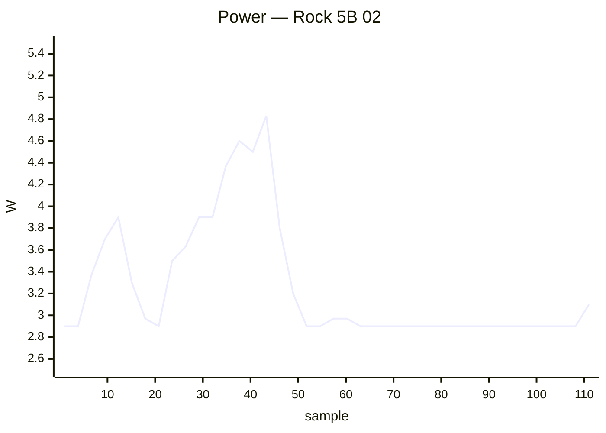

### ❌ Rock 5B Plus 01

`rock-5b-plus` · **inplace** · image `26.11.0-trunk.65` · 19 ✅ · 2 ❌ · 1 ⏭️

| Module | Status | Time | Detail |
|:--|:--:|--:|:--|
| upgrade | ⏭️ | 5.5 s | — |
| reboot | ✅ | 50.9 s | power-cycle · up 24 s |
| kernel-switch | ✅ | 9.3 s | branch=vendor · family=rk35xx · installed=26.11.0-trunk.65 · boot_image=/boot/vmlinuz-6.1.172-vendor-rk35xx · kernel_before=6.1.172-vendor-rk35xx |
| reboot | ✅ | 152.1 s | power-cycle · 4/4 boots · up 24 s |
| hw-performance | ✅ | 17.1 s | AES 1296 · mem 15400 · disk W 69 / R 81 MB/s · 53.6 °C · 1800 MHz |
| dvfs | ✅ | 16.6 s | ondemand · 1800–1800 MHz (peak 2304) |
| network-iperf | ✅ | 29.1 s | enP4p65s0 ↑941/↓941 (1GE) Mbps |
| store-versions | ✅ | 4.3 s | 26.11.0-trunk.65 · 6.1.172-vendor-rk35xx |
| kernel-switch | ❌ | 7.9 s | branch=current · phase=install · dpkg_state=absent |
| reboot | ✅ | 149.2 s | power-cycle · 4/4 boots · up 23 s |
| hw-performance | ✅ | 17.3 s | AES 1295 · mem 15700 · disk W 69 / R 81 MB/s · 54.5 °C · 1800 MHz |
| dvfs | ✅ | 17.0 s | ondemand · 1800–1800 MHz (peak 2304) |
| network-iperf | ✅ | 28.5 s | enP4p65s0 ↑941/↓941 (1GE) Mbps |
| store-versions | ✅ | 4.6 s | 26.11.0-trunk.65 · 6.1.172-vendor-rk35xx |
| kernel-switch | ❌ | 6.9 s | branch=edge · phase=install · dpkg_state=absent |
| reboot | ✅ | 155.6 s | power-cycle · 4/4 boots · up 22 s |
| hw-performance | ✅ | 17.1 s | AES 1281 · mem 13700 · disk W 69 / R 81 MB/s · 55.5 °C · 1800 MHz |
| dvfs | ✅ | 16.7 s | ondemand · 1800–1800 MHz (peak 2352) |
| network-iperf | ✅ | 28.3 s | enP4p65s0 ↑941/↓941 (1GE) Mbps |
| store-versions | ✅ | 4.0 s | 26.11.0-trunk.65 · 6.1.172-vendor-rk35xx |
| kernel-switch | ✅ | 9.2 s | branch=vendor · family=rk35xx · installed=26.11.0-trunk.65 · boot_image=/boot/vmlinuz-6.1.172-vendor-rk35xx · kernel_before=6.1.172-vendor-rk35xx |
| reboot | ✅ | 48.6 s | power-cycle · up 22 s |

**Power** — min 0.90 W · avg 3.65 W · peak 9.40 W · 627 samples

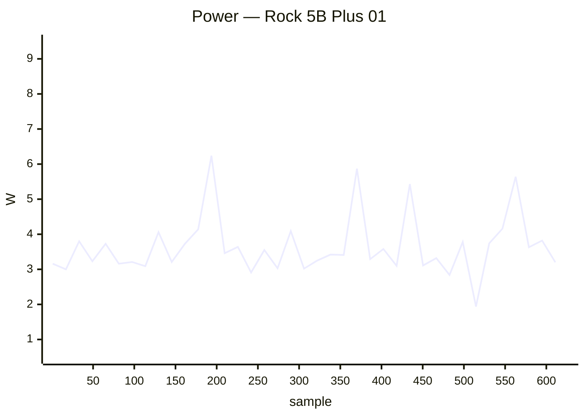

### ❌ SpacemiT MusePi Pro 01

`musepipro` · **inplace** · image `26.8.1` · 0 ✅ · 1 ❌ · 0 ⏭️

| Module | Status | Time | Detail |
|:--|:--:|--:|:--|
| reachable | ❌ | 0.0 s | ip=10.0.50.36 · reachable=False · port=22 |

**Power** — min 2.60 W · avg 2.60 W · peak 2.60 W · 43 samples

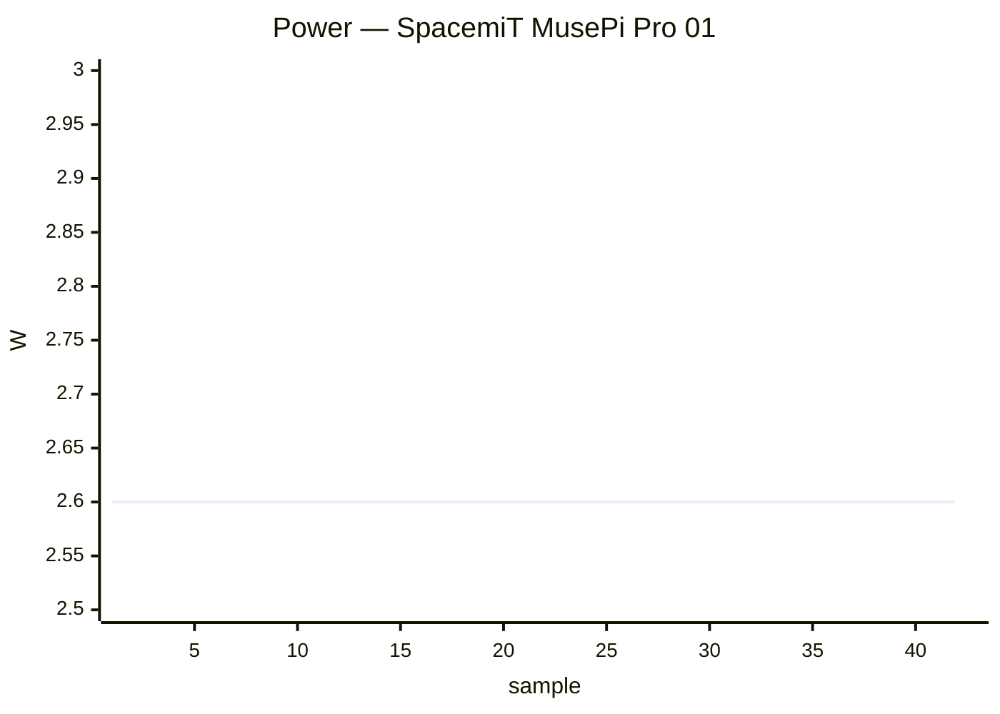

### ❌ Udoo 01

`udoo` · **inplace** · image `26.11.0-trunk.62` · 14 ✅ · 1 ❌ · 1 ⏭️

| Module | Status | Time | Detail |
|:--|:--:|--:|:--|
| upgrade | ⏭️ | 34.5 s | — |
| reboot | ✅ | 72.6 s | power-cycle · up 34 s |
| kernel-switch | ✅ | 76.5 s | branch=current · family=imx6 · installed=26.11.0-trunk.65 · boot_image=/boot/vmlinuz-6.18.54-current-imx6 · kernel_before=6.18.54-current-imx6 |
| reboot | ✅ | 212.0 s | power-cycle · 4/4 boots · up 35 s |
| hw-performance | ✅ | 49.6 s | AES 26 · mem 766 · disk W 19 / R 20 MB/s · 50.9 °C · 996 MHz |
| dvfs | ✅ | 43.9 s | ondemand · 396–996 MHz (peak 996) |
| network-iperf | ✅ | 85.6 s | end0 ↑399/↓233 (1GE) · wlx7cdd903aa418 ↑31/↓28 (Wi-Fi 4) Mbps |
| store-versions | ✅ | 9.4 s | 26.11.0-trunk.62 · 6.18.54-current-imx6 |
| kernel-switch | ❌ | 50.5 s | branch=edge · phase=install · dpkg_state=absent |
| reboot | ✅ | 212.7 s | power-cycle · 4/4 boots · up 36 s |
| hw-performance | ✅ | 51.2 s | AES 26 · mem 657 · disk W 19 / R 20 MB/s · 52.1 °C · 996 MHz |
| dvfs | ✅ | 43.6 s | ondemand · 396–996 MHz (peak 996) |
| network-iperf | ✅ | 89.1 s | end0 ↑399/↓244 (1GE) · wlx7cdd903aa418 ↑24/↓28 (Wi-Fi 4) Mbps |
| store-versions | ✅ | 9.4 s | 26.11.0-trunk.62 · 6.18.54-current-imx6 |
| kernel-switch | ✅ | 74.3 s | branch=current · family=imx6 · installed=26.11.0-trunk.65 · boot_image=/boot/vmlinuz-6.18.54-current-imx6 · kernel_before=6.18.54-current-imx6 |
| reboot | ✅ | 70.2 s | power-cycle · up 34 s |

**Power** — min 1.30 W · avg 6.09 W · peak 8.30 W · 947 samples

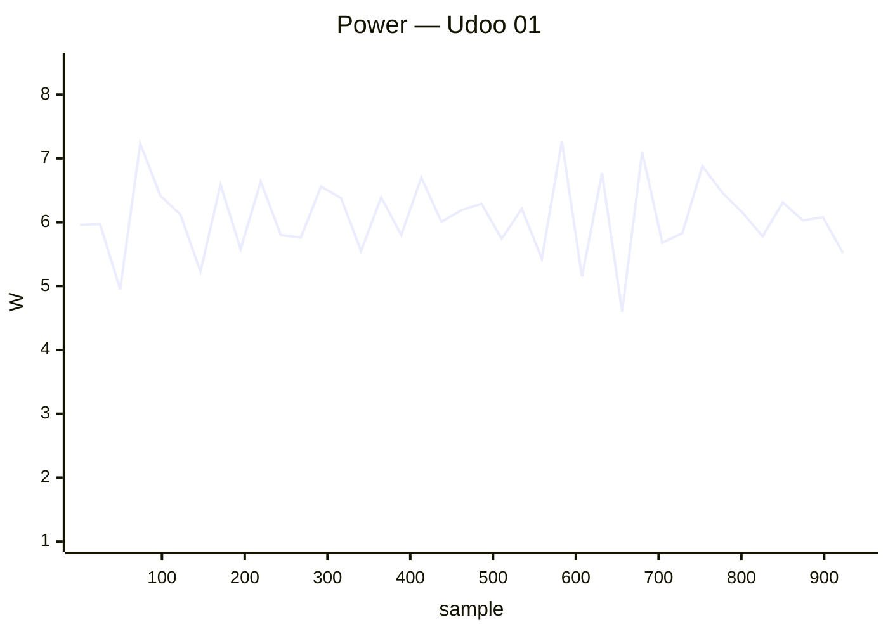

### ❌ ZeroPi 01

`zeropi` · **inplace** · image `26.11.0-trunk.58` · 0 ✅ · 1 ❌ · 0 ⏭️

| Module | Status | Time | Detail |
|:--|:--:|--:|:--|
| reachable | ❌ | 0.0 s | ip=10.0.50.57 · reachable=False · port=22 |

**Power** — min 2.10 W · avg 2.10 W · peak 2.10 W · 43 samples

```mermaid
xychart-beta
    title "Power — ZeroPi 01"
    x-axis "sample" 1 --> 43
    y-axis "W" 2.0 --> 2.5
    line [2.10, 2.10, 2.10, 2.10, 2.10, 2.10, 2.10, 2.10, 2.10, 2.10, 2.10, 2.10, 2.10, 2.10, 2.10, 2.10, 2.10, 2.10, 2.10, 2.10, 2.10, 2.10, 2.10, 2.10, 2.10, 2.10, 2.10, 2.10, 2.10, 2.10, 2.10, 2.10, 2.10, 2.10, 2.10, 2.10, 2.10, 2.10, 2.10, 2.10]
```

## ✅ Passed (52)

### ✅ Arduino UNO Q 01

`arduino-uno-q` · **inplace** · image `26.11.0-trunk.65` · 8 ✅ · 0 ❌ · 0 ⏭️

| Module | Status | Time | Detail |
|:--|:--:|--:|:--|
| upgrade | ✅ | 63.4 s | nightly · 26.11.0-trunk.65 → 26.11.0-trunk.65 |
| reboot | ✅ | 53.4 s | warm · up 35 s |
| kernel-switch | ✅ | 47.1 s | branch=edge · family=qrb2210 · installed=26.11.0-trunk.65 · boot_image=? · kernel_before=7.2.3-edge-qrb2210 |
| reboot | ✅ | 205.2 s | warm · 4/4 boots · up 35 s |
| hw-performance | ✅ | 24.4 s | AES 939 · mem 5100 · disk W 185 / R 260 MB/s · 42.8 °C · 2016 MHz |
| dvfs | ✅ | 32.8 s | schedutil · 300–2016 MHz (peak 2016) |
| network-iperf | ✅ | 53.5 s | wlan0 ↑24/↓10 (Wi-Fi 5) · usb0 ↑?/↓? Mbps |
| store-versions | ✅ | 7.2 s | 26.11.0-trunk.65 · 7.2.3-edge-qrb2210 |

### ✅ Banana Pi CM4IO 01

`bananapicm4io` · **inplace** · image `26.8.3` · 14 ✅ · 2 ❌ · 0 ⏭️

| Module | Status | Time | Detail |
|:--|:--:|--:|:--|
| upgrade | ✅ | 57.5 s | nightly · 26.8.3 → 26.8.3 |
| reboot | ✅ | 44.8 s | power-cycle · up 23 s |
| kernel-switch | ✅ | 41.0 s | branch=current · family=meson64 · installed=26.11.0-trunk.65 · boot_image=/boot/vmlinuz-6.18.54-current-meson64 · kernel_before=6.18.54-current-meson64 |
| reboot | ✅ | 135.0 s | power-cycle · 4/4 boots · up 22 s |
| hw-performance | ✅ | 18.4 s | AES 853 · mem 3900 · disk W 36 / R 159 MB/s · 55.2 °C · 2016 MHz |
| dvfs | ✅ | 18.3 s | ondemand · 1000–1512 MHz (peak 1512) |
| network-iperf | ❌ | 277.9 s | eth0 ↑0/↓0 (1GE) · wlan0 ↑0/↓0 (Wi-Fi 5) Mbps |
| store-versions | ✅ | 3.8 s | 26.8.3 · 6.18.54-current-meson64 |
| kernel-switch | ✅ | 191.7 s | branch=edge · family=meson64 · installed=26.11.0-trunk.65 · boot_image=/boot/vmlinuz-7.2.8-edge-meson64 · kernel_before=6.18.54-current-meson64 |
| reboot | ✅ | 141.9 s | power-cycle · 4/4 boots · up 23 s |
| hw-performance | ✅ | 18.2 s | AES 852 · mem 3900 · disk W 37 / R 149 MB/s · 56.3 °C · 2016 MHz |
| dvfs | ✅ | 18.1 s | ondemand · 1000–1512 MHz (peak 1512) |
| network-iperf | ❌ | 297.7 s | eth0 ↑941/↓941 (1GE) · wlan0 ↑0/↓0 (Wi-Fi 5) Mbps |
| store-versions | ✅ | 4.6 s | 26.8.3 · 7.2.8-edge-meson64 |
| kernel-switch | ✅ | 192.1 s | branch=current · family=meson64 · installed=26.11.0-trunk.65 · boot_image=/boot/vmlinuz-6.18.54-current-meson64 · kernel_before=7.2.8-edge-meson64 |
| reboot | ✅ | 50.9 s | power-cycle · up 21 s |

### ✅ Banana Pi M2 Ultra 01

`bananapim2ultra` · **inplace** · image `26.11.0-trunk.65` · 16 ✅ · 0 ❌ · 0 ⏭️

| Module | Status | Time | Detail |
|:--|:--:|--:|:--|
| upgrade | ✅ | 107.9 s | nightly · 26.11.0-trunk.65 → 26.11.0-trunk.65 |
| reboot | ✅ | 45.1 s | warm · up 26 s |
| kernel-switch | ✅ | 69.0 s | branch=current · family=sunxi · installed=26.11.0-trunk.65 · boot_image=/boot/vmlinuz-6.18.54-current-sunxi · kernel_before=6.18.54-current-sunxi |
| reboot | ✅ | 161.0 s | warm · 4/4 boots · up 26 s |
| hw-performance | ✅ | 41.2 s | AES 23 · mem 2000 · disk W 7 / R 42 MB/s · 54.9 °C · 1200 MHz |
| dvfs | ✅ | 33.9 s | ondemand · 720–1200 MHz (peak 1200) |
| network-iperf | ✅ | 76.7 s | end0 ↑824/↓938 (1GE) · wlan0 ↑26/↓30 (Wi-Fi 4) Mbps |
| store-versions | ✅ | 8.2 s | 26.11.0-trunk.65 · 6.18.54-current-sunxi |
| kernel-switch | ✅ | 183.8 s | branch=edge · family=sunxi · installed=26.11.0-trunk.65 · boot_image=/boot/vmlinuz-7.2.8-edge-sunxi · kernel_before=6.18.54-current-sunxi |
| reboot | ✅ | 163.1 s | warm · 4/4 boots · up 28 s |
| hw-performance | ✅ | 42.0 s | AES 23 · mem 2100 · disk W 7 / R 42 MB/s · 54.9 °C · 1200 MHz |
| dvfs | ✅ | 37.3 s | ondemand · 720–1200 MHz (peak 1200) |
| network-iperf | ✅ | 80.3 s | end0 ↑805/↓941 (1GE) · wlan0 ↑26/↓29 (Wi-Fi 4) Mbps |
| store-versions | ✅ | 7.4 s | 26.11.0-trunk.65 · 7.2.8-edge-sunxi |
| kernel-switch | ✅ | 190.1 s | branch=current · family=sunxi · installed=26.11.0-trunk.65 · boot_image=/boot/vmlinuz-6.18.54-current-sunxi · kernel_before=7.2.8-edge-sunxi |
| reboot | ✅ | 44.9 s | warm · up 26 s |

### ✅ Banana Pi M2Pro 01

`bananapim2pro` · **inplace** · image `26.11.0-trunk.65` · 16 ✅ · 0 ❌ · 0 ⏭️

| Module | Status | Time | Detail |
|:--|:--:|--:|:--|
| upgrade | ✅ | 45.0 s | nightly · 26.11.0-trunk.65 → 26.11.0-trunk.65 |
| reboot | ✅ | 138.9 s | power-cycle · up 104 s |
| kernel-switch | ✅ | 31.2 s | branch=current · family=meson64 · installed=26.11.0-trunk.65 · boot_image=/boot/vmlinuz-6.18.54-current-meson64 · kernel_before=6.18.54-current-meson64 |
| reboot | ✅ | 472.3 s | power-cycle · 4/4 boots · up 104 s |
| hw-performance | ✅ | 19.4 s | AES 980 · mem 5300 · disk W 42 / R 152 MB/s · 51.2 °C · 2100 MHz |
| dvfs | ✅ | 19.0 s | ondemand · 1000–2100 MHz (peak 2100) |
| network-iperf | ✅ | 49.1 s | end0 ↑941/↓941 (1GE) Mbps |
| store-versions | ✅ | 4.2 s | 26.11.0-trunk.65 · 6.18.54-current-meson64 |
| kernel-switch | ✅ | 93.8 s | branch=edge · family=meson64 · installed=26.11.0-trunk.65 · boot_image=/boot/vmlinuz-7.2.8-edge-meson64 · kernel_before=6.18.54-current-meson64 |
| reboot | ✅ | 465.3 s | power-cycle · 4/4 boots · up 102 s |
| hw-performance | ✅ | 19.4 s | AES 979 · mem 5300 · disk W 43 / R 157 MB/s · 51.3 °C · 2100 MHz |
| dvfs | ✅ | 19.8 s | ondemand · 1000–2100 MHz (peak 2100) |
| network-iperf | ✅ | 41.4 s | end0 ↑940/↓941 (1GE) Mbps |
| store-versions | ✅ | 4.5 s | 26.11.0-trunk.65 · 7.2.8-edge-meson64 |
| kernel-switch | ✅ | 92.6 s | branch=current · family=meson64 · installed=26.11.0-trunk.65 · boot_image=/boot/vmlinuz-6.18.54-current-meson64 · kernel_before=7.2.8-edge-meson64 |
| reboot | ✅ | 134.9 s | power-cycle · up 103 s |

**Power** — min 1.50 W · avg 2.78 W · peak 4.90 W · 1306 samples

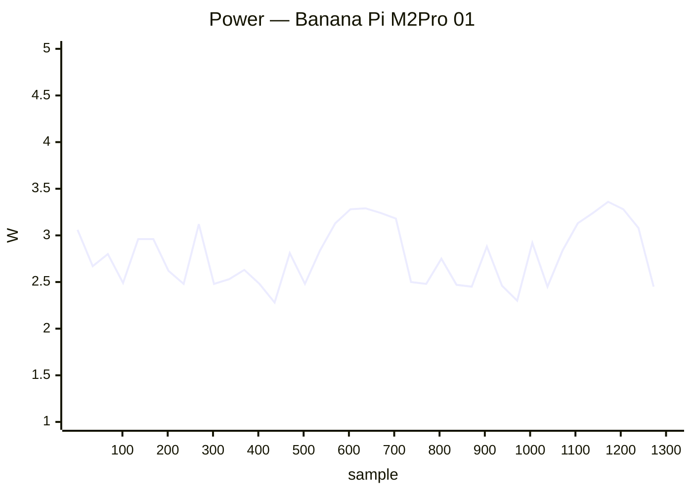

### ✅ Banana Pi M7 01

`bananapim7` · **inplace** · image `26.11.0-trunk.65` · 22 ✅ · 0 ❌ · 0 ⏭️

| Module | Status | Time | Detail |
|:--|:--:|--:|:--|
| upgrade | ✅ | 27.5 s | nightly · 26.11.0-trunk.65 → 26.11.0-trunk.65 |
| reboot | ✅ | 43.4 s | power-cycle · up 14 s |
| kernel-switch | ✅ | 19.1 s | branch=vendor · family=rk35xx · installed=26.11.0-trunk.65 · boot_image=/boot/vmlinuz-6.1.172-vendor-rk35xx · kernel_before=6.1.172-vendor-rk35xx |
| reboot | ✅ | 103.3 s | power-cycle · 4/4 boots · up 15 s |
| hw-performance | ✅ | 14.0 s | AES 1258 · mem 13700 · disk W 857 / R 1347 MB/s · 61 °C · 1800 MHz |
| dvfs | ✅ | 16.0 s | ondemand · 1800–1800 MHz (peak 2256) |
| network-iperf | ✅ | 28.6 s | enP2p33s0 ↑941/↓941 (1GE) Mbps |
| store-versions | ✅ | 4.7 s | 26.11.0-trunk.65 · 6.1.172-vendor-rk35xx |
| kernel-switch | ✅ | 48.1 s | branch=current · family=rockchip64 · installed=26.11.0-trunk.65 · boot_image=/boot/vmlinuz-6.18.54-current-rockchip64 · kernel_before=6.1.172-vendor-rk35xx |
| reboot | ✅ | 669.4 s | power-cycle · 3/4 boots · up 99 s |
| hw-performance | ✅ | 13.3 s | AES 1251 · mem 5800 · disk W 1012 / R 1579 MB/s · 66.5 °C · 1800 MHz |
| dvfs | ✅ | 15.2 s | ondemand · 408–1800 MHz (peak 2400) |
| network-iperf | ✅ | 28.3 s | enP2p33s0 ↑941/↓941 (1GE) Mbps |
| store-versions | ✅ | 4.1 s | 26.11.0-trunk.65 · 6.18.54-current-rockchip64 |
| kernel-switch | ✅ | 40.7 s | branch=edge · family=rockchip64 · installed=26.11.0-trunk.65 · boot_image=/boot/vmlinuz-7.2.8-edge-rockchip64 · kernel_before=6.18.54-current-rockchip64 |
| reboot | ✅ | 444.5 s | power-cycle · 4/4 boots · up 99 s |
| hw-performance | ✅ | 13.6 s | AES 1251 · mem 7900 · disk W 828 / R 1047 MB/s · 66.5 °C · 1800 MHz |
| dvfs | ✅ | 15.4 s | ondemand · 408–1800 MHz (peak 2400) |
| network-iperf | ✅ | 29.0 s | enP2p33s0 ↑941/↓941 (1GE) Mbps |
| store-versions | ✅ | 3.9 s | 26.11.0-trunk.65 · 7.2.8-edge-rockchip64 |
| kernel-switch | ✅ | 37.9 s | branch=vendor · family=rk35xx · installed=26.11.0-trunk.65 · boot_image=/boot/vmlinuz-6.1.172-vendor-rk35xx · kernel_before=7.2.8-edge-rockchip64 |
| reboot | ✅ | 43.2 s | power-cycle · up 16 s |

**Power** — min 1.00 W · avg 5.93 W · peak 13.50 W · 1296 samples

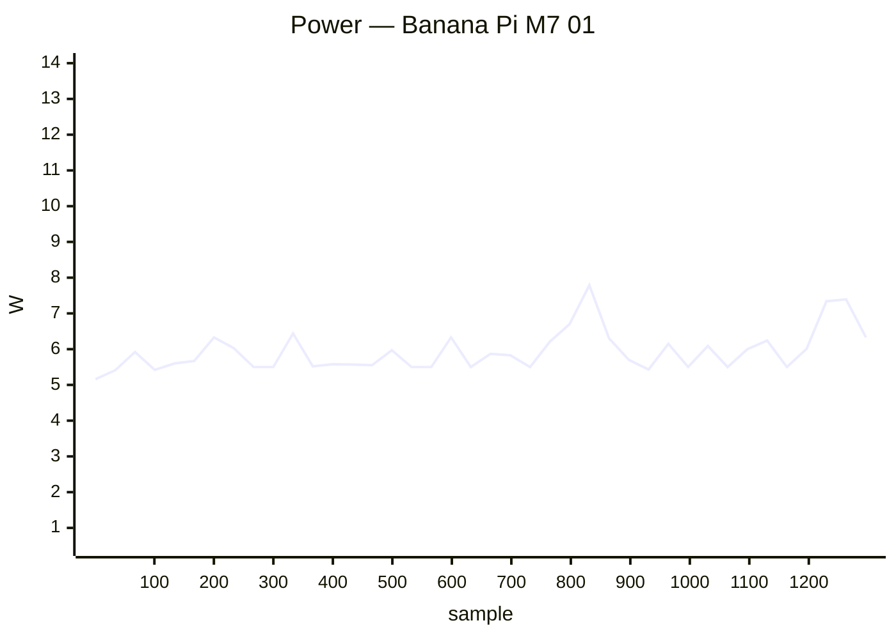

### ✅ Banana Pi R3 Mini 01

`bananapir3mini` · **inplace** · image `26.11.0-trunk` · 4 ✅ · 0 ❌ · 2 ⏭️

| Module | Status | Time | Detail |
|:--|:--:|--:|:--|
| upgrade | ⏭️ | 24.0 s | — |
| reboot | ✅ | 66.6 s | power-cycle · up 31 s |
| hw-performance | ✅ | 26.1 s | AES 934 · mem 3200 · disk W 74 / R 89 MB/s · 73.5 °C · None MHz |
| dvfs | ➖ | 2.3 s | no cpufreq |
| network-iperf | ✅ | 115.0 s | eth0 ↑767/↓663 (1GE) · eth1 ↑939/↓940 (1GE) · wlan0 ↑28/↓41 (Wi-Fi 6) · wlan1 ↑424/↓233 (Wi-Fi 6) Mbps |
| store-versions | ✅ | 4.4 s | 26.11.0-trunk · 6.18.52-current-filogic-mt7986 |

**Power** — min 3.50 W · avg 7.82 W · peak 12.10 W · 195 samples

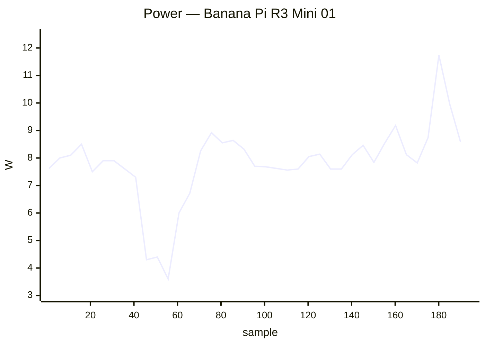

### ✅ BananaPi BPI-F3 01

`musepipro` · **inplace** · image `26.11.0-trunk.65` · 6 ✅ · 0 ❌ · 0 ⏭️

| Module | Status | Time | Detail |
|:--|:--:|--:|:--|
| upgrade | ✅ | 73.3 s | nightly · 26.11.0-trunk.65 → 26.11.0-trunk.65 |
| reboot | ✅ | 55.5 s | power-cycle · up 20 s |
| hw-performance | ✅ | 24.2 s | AES 27 · mem 3000 · disk W 71 / R 81 MB/s · 50 °C · 1600 MHz |
| dvfs | ✅ | 24.4 s | performance · 614–1600 MHz (peak 1600) |
| network-iperf | ✅ | 94.7 s | eth0 ↑941/↓941 (1GE) · wlan0 ↑246/↓292 (Wi-Fi 6) · wlan1 ↑265/↓247 (Wi-Fi 5) Mbps |
| store-versions | ✅ | 5.3 s | 26.11.0-trunk.65 · 6.18.54-current-spacemit |

**Power** — min 2.90 W · avg 5.28 W · peak 7.90 W · 223 samples

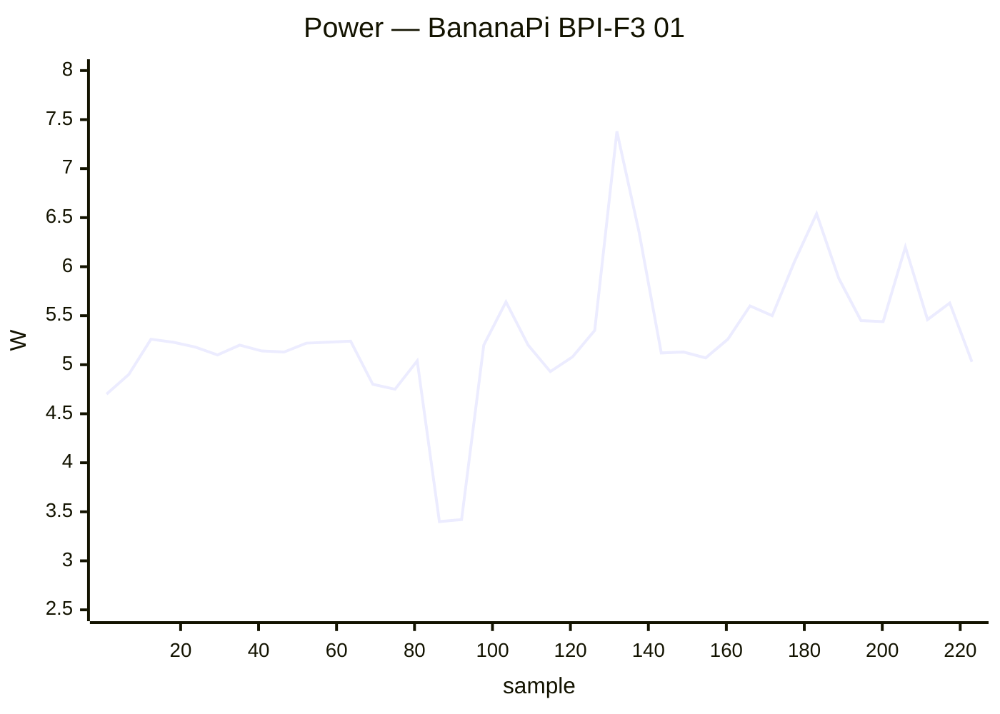

### ✅ Clearfog Pro 01

`clearfogpro` · **inplace** · image `26.11.0-trunk.65` · 14 ✅ · 0 ❌ · 2 ⏭️

| Module | Status | Time | Detail |
|:--|:--:|--:|:--|
| upgrade | ✅ | 61.4 s | nightly · 26.11.0-trunk.65 → 26.11.0-trunk.65 |
| reboot | ✅ | 41.4 s | warm · up 21 s |
| kernel-switch | ✅ | 42.1 s | branch=current · family=mvebu · installed=26.11.0-trunk.65 · boot_image=/boot/vmlinuz-6.18.54-current-mvebu · kernel_before=6.18.54-current-mvebu |
| reboot | ✅ | 142.0 s | warm · 4/4 boots · up 21 s |
| hw-performance | ✅ | 41.5 s | AES 43 · mem 3800 · disk W 21 / R 23 MB/s · 66.5 °C · None MHz |
| dvfs | ➖ | 2.9 s | no cpufreq |
| network-iperf | ✅ | 36.9 s | lan2 ↑936/↓936 Mbps |
| store-versions | ✅ | 6.3 s | 26.11.0-trunk.65 · 6.18.54-current-mvebu |
| kernel-switch | ✅ | 101.3 s | branch=edge · family=mvebu · installed=26.11.0-trunk.65 · boot_image=/boot/vmlinuz-7.2.8-edge-mvebu · kernel_before=6.18.54-current-mvebu |
| reboot | ✅ | 141.3 s | warm · 4/4 boots · up 21 s |
| hw-performance | ✅ | 41.9 s | AES 43 · mem 3800 · disk W 21 / R 24 MB/s · 66.5 °C · None MHz |
| dvfs | ➖ | 2.9 s | no cpufreq |
| network-iperf | ✅ | 34.9 s | lan2 ↑936/↓936 Mbps |
| store-versions | ✅ | 7.0 s | 26.11.0-trunk.65 · 7.2.8-edge-mvebu |
| kernel-switch | ✅ | 102.7 s | branch=current · family=mvebu · installed=26.11.0-trunk.65 · boot_image=/boot/vmlinuz-6.18.54-current-mvebu · kernel_before=7.2.8-edge-mvebu |
| reboot | ✅ | 41.6 s | warm · up 22 s |

### ✅ Cubie A5E 01

`radxa-cubie-a5e` · **inplace** · image `26.11.0-trunk.62` · 14 ✅ · 0 ❌ · 2 ⏭️

| Module | Status | Time | Detail |
|:--|:--:|--:|:--|
| upgrade | ✅ | 597.2 s | nightly · 26.11.0-trunk.62 → 26.11.0-trunk.65 |
| reboot | ✅ | 64.3 s | power-cycle · up 32 s |
| kernel-switch | ✅ | 59.0 s | branch=current · family=sunxi64 · installed=26.11.0-trunk.65 · boot_image=? · kernel_before=6.18.54-current-sunxi64 |
| reboot | ✅ | 185.2 s | power-cycle · 4/4 boots · up 32 s |
| hw-performance | ✅ | 41.3 s | AES 358 · mem 2000 · disk W 21 / R 23 MB/s · 61.8 °C · None MHz |
| dvfs | ➖ | 2.8 s | no cpufreq |
| network-iperf | ✅ | 94.7 s | end0 ↑839/↓941 (1GE) · end1 ↑941/↓940 (1GE) · wlan0 ↑120/↓129 (Wi-Fi 6) Mbps |
| store-versions | ✅ | 5.8 s | 26.11.0-trunk.65 · 6.18.54-current-sunxi64 |
| kernel-switch | ✅ | 577.0 s | branch=edge · family=sunxi64 · installed=26.11.0-trunk.65 · boot_image=? · kernel_before=6.18.54-current-sunxi64 |
| reboot | ✅ | 188.0 s | power-cycle · 4/4 boots · up 32 s |
| hw-performance | ✅ | 41.7 s | AES 358 · mem 2000 · disk W 21 / R 23 MB/s · 66.2 °C · None MHz |
| dvfs | ➖ | 2.8 s | no cpufreq |
| network-iperf | ✅ | 119.3 s | end0 ↑836/↓940 (1GE) · end1 ↑941/↓940 (1GE) · wlan0 ↑120/↓127 (Wi-Fi 6) Mbps |
| store-versions | ✅ | 5.9 s | 26.11.0-trunk.65 · 7.2.8-edge-sunxi64 |
| kernel-switch | ✅ | 565.9 s | branch=current · family=sunxi64 · installed=26.11.0-trunk.65 · boot_image=? · kernel_before=7.2.8-edge-sunxi64 |
| reboot | ✅ | 64.7 s | power-cycle · up 33 s |

**Power** — min 1.70 W · avg 3.84 W · peak 6.10 W · 2102 samples

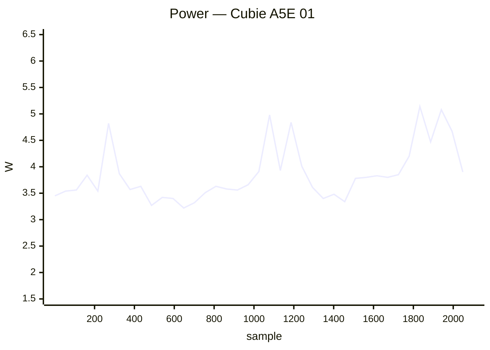

### ✅ Cubietruck 01

`cubietruck` · **inplace** · image `26.11.0-trunk.65` · 16 ✅ · 0 ❌ · 0 ⏭️

| Module | Status | Time | Detail |
|:--|:--:|--:|:--|
| upgrade | ✅ | 135.0 s | nightly · 26.11.0-trunk.65 → 26.11.0-trunk.65 |
| reboot | ✅ | 74.0 s | warm · up 50 s |
| kernel-switch | ✅ | 92.3 s | branch=current · family=sunxi · installed=26.11.0-trunk.65 · boot_image=/boot/vmlinuz-6.18.54-current-sunxi · kernel_before=6.18.54-current-sunxi |
| reboot | ✅ | 265.9 s | warm · 4/4 boots · up 49 s |
| hw-performance | ✅ | 58.7 s | AES 18 · mem 1700 · disk W 14 / R 21 MB/s · 51.2 °C · 960 MHz |
| dvfs | ✅ | 55.8 s | ondemand · 528–960 MHz (peak 960) |
| network-iperf | ✅ | 137.4 s | end0 ↑725/↓807 (1GE) · wlan0 ↑14/↓21 (Wi-Fi 4) Mbps |
| store-versions | ✅ | 12.6 s | 26.11.0-trunk.65 · 6.18.54-current-sunxi |
| kernel-switch | ✅ | 228.2 s | branch=edge · family=sunxi · installed=26.11.0-trunk.65 · boot_image=/boot/vmlinuz-7.2.8-edge-sunxi · kernel_before=6.18.54-current-sunxi |
| reboot | ✅ | 260.4 s | warm · 4/4 boots · up 47 s |
| hw-performance | ✅ | 57.8 s | AES 19 · mem 1700 · disk W 14 / R 22 MB/s · 51.4 °C · 960 MHz |
| dvfs | ✅ | 56.9 s | ondemand · 528–960 MHz (peak 960) |
| network-iperf | ✅ | 93.6 s | end0 ↑763/↓940 (1GE) · wlan0 ↑20/↓24 (Wi-Fi 4) Mbps |
| store-versions | ✅ | 12.1 s | 26.11.0-trunk.65 · 7.2.8-edge-sunxi |
| kernel-switch | ✅ | 222.6 s | branch=current · family=sunxi · installed=26.11.0-trunk.65 · boot_image=/boot/vmlinuz-6.18.54-current-sunxi · kernel_before=7.2.8-edge-sunxi |
| reboot | ✅ | 73.9 s | warm · up 49 s |

### ✅ Espressobin 01

`espressobin` · **inplace** · image `26.11.0-trunk.65` · 16 ✅ · 0 ❌ · 0 ⏭️

| Module | Status | Time | Detail |
|:--|:--:|--:|:--|
| upgrade | ✅ | 117.0 s | nightly · 26.11.0-trunk.65 → 26.11.0-trunk.65 |
| reboot | ✅ | 74.8 s | power-cycle · up 45 s |
| kernel-switch | ✅ | 79.8 s | branch=current · family=mvebu64 · installed=26.11.0-trunk.65 · boot_image=/boot/vmlinuz-6.18.54-current-mvebu64 · kernel_before=6.18.54-current-mvebu64 |
| reboot | ✅ | 237.1 s | power-cycle · 4/4 boots · up 44 s |
| hw-performance | ✅ | 35.2 s | AES 369 · mem 2000 · disk W 16 / R 139 MB/s · None °C · 800 MHz |
| dvfs | ✅ | 35.1 s | ondemand · 200–800 MHz (peak 800) |
| network-iperf | ✅ | 38.6 s | lan0 ↑930/↓743 (1GE) Mbps |
| store-versions | ✅ | 7.2 s | 26.11.0-trunk.65 · 6.18.54-current-mvebu64 |
| kernel-switch | ✅ | 362.3 s | branch=edge · family=mvebu64 · installed=26.11.0-trunk.65 · boot_image=/boot/vmlinuz-7.1.13-edge-mvebu64 · kernel_before=6.18.54-current-mvebu64 |
| reboot | ✅ | 237.9 s | power-cycle · 4/4 boots · up 42 s |
| hw-performance | ✅ | 34.5 s | AES 366 · mem 2000 · disk W 23 / R 139 MB/s · None °C · 800 MHz |
| dvfs | ✅ | 35.4 s | ondemand · 200–800 MHz (peak 800) |
| network-iperf | ✅ | 42.7 s | lan0 ↑936/↓851 (1GE) Mbps |
| store-versions | ✅ | 7.6 s | 26.11.0-trunk.65 · 7.1.13-edge-mvebu64 |
| kernel-switch | ✅ | 355.6 s | branch=current · family=mvebu64 · installed=26.11.0-trunk.65 · boot_image=/boot/vmlinuz-6.18.54-current-mvebu64 · kernel_before=7.1.13-edge-mvebu64 |
| reboot | ✅ | 73.1 s | power-cycle · up 43 s |

### ✅ Helios4 01

`helios4` · **inplace** · image `26.11.0-trunk.65` · 14 ✅ · 0 ❌ · 2 ⏭️

| Module | Status | Time | Detail |
|:--|:--:|--:|:--|
| upgrade | ✅ | 52.8 s | nightly · 26.11.0-trunk.65 → 26.11.0-trunk.65 |
| reboot | ✅ | 120.0 s | warm · up 103 s |
| kernel-switch | ✅ | 34.9 s | branch=current · family=mvebu · installed=26.11.0-trunk.65 · boot_image=/boot/vmlinuz-6.18.54-current-mvebu · kernel_before=6.18.54-current-mvebu |
| reboot | ✅ | 463.5 s | warm · 4/4 boots · up 103 s |
| hw-performance | ✅ | 36.3 s | AES 43 · mem 3800 · disk W 21 / R 23 MB/s · 57.5 °C · None MHz |
| dvfs | ➖ | 2.3 s | no cpufreq |
| network-iperf | ✅ | 46.5 s | end1 ↑739/↓839 (1GE) Mbps |
| store-versions | ✅ | 4.9 s | 26.11.0-trunk.65 · 6.18.54-current-mvebu |
| kernel-switch | ✅ | 97.0 s | branch=edge · family=mvebu · installed=26.11.0-trunk.65 · boot_image=/boot/vmlinuz-7.2.8-edge-mvebu · kernel_before=6.18.54-current-mvebu |
| reboot | ✅ | 462.9 s | warm · 4/4 boots · up 103 s |
| hw-performance | ✅ | 37.0 s | AES 43 · mem 3800 · disk W 19 / R 23 MB/s · 57 °C · None MHz |
| dvfs | ➖ | 2.3 s | no cpufreq |
| network-iperf | ✅ | 31.4 s | end1 ↑541/↓466 (1GE) Mbps |
| store-versions | ✅ | 5.2 s | 26.11.0-trunk.65 · 7.2.8-edge-mvebu |
| kernel-switch | ✅ | 95.0 s | branch=current · family=mvebu · installed=26.11.0-trunk.65 · boot_image=/boot/vmlinuz-6.18.54-current-mvebu · kernel_before=7.2.8-edge-mvebu |
| reboot | ✅ | 120.3 s | warm · up 104 s |

### ✅ Inovato Quadra 01

`inovato-quadra` · **inplace** · image `26.11.0-trunk.65` · 16 ✅ · 0 ❌ · 0 ⏭️

| Module | Status | Time | Detail |
|:--|:--:|--:|:--|
| upgrade | ✅ | 57.5 s | nightly · 26.11.0-trunk.65 → 26.11.0-trunk.65 |
| reboot | ✅ | 55.8 s | power-cycle · up 24 s |
| kernel-switch | ✅ | 41.2 s | branch=current · family=sunxi64 · installed=26.11.0-trunk.65 · boot_image=/boot/vmlinuz-6.18.54-current-sunxi64 · kernel_before=6.18.54-current-sunxi64 |
| reboot | ✅ | 152.7 s | power-cycle · 4/4 boots · up 24 s |
| hw-performance | ✅ | 30.4 s | AES 794 · mem 2800 · disk W 21 / R 23 MB/s · 70.4 °C · 1704 MHz |
| dvfs | ✅ | 22.0 s | ondemand · 480–1704 MHz (peak 1704) |
| network-iperf | ✅ | 66.0 s | eth0 ↑94/↓94 (10/100ME) · wlan0 ↑4/↓16 (Wi-Fi 4) Mbps |
| store-versions | ✅ | 4.7 s | 26.11.0-trunk.65 · 6.18.54-current-sunxi64 |
| kernel-switch | ✅ | 111.1 s | branch=edge · family=sunxi64 · installed=26.11.0-trunk.65 · boot_image=/boot/vmlinuz-7.2.8-edge-sunxi64 · kernel_before=6.18.54-current-sunxi64 |
| reboot | ✅ | 151.9 s | power-cycle · 4/4 boots · up 24 s |
| hw-performance | ✅ | 30.5 s | AES 721 · mem 2800 · disk W 14 / R 23 MB/s · 71.8 °C · 1704 MHz |
| dvfs | ✅ | 22.1 s | ondemand · 480–1704 MHz (peak 1704) |
| network-iperf | ✅ | 68.9 s | eth0 ↑94/↓94 (10/100ME) · wlan0 ↑5/↓8 (Wi-Fi 4) Mbps |
| store-versions | ✅ | 4.8 s | 26.11.0-trunk.65 · 7.2.8-edge-sunxi64 |
| kernel-switch | ✅ | 115.2 s | branch=current · family=sunxi64 · installed=26.11.0-trunk.65 · boot_image=/boot/vmlinuz-6.18.54-current-sunxi64 · kernel_before=7.2.8-edge-sunxi64 |
| reboot | ✅ | 56.5 s | power-cycle · up 24 s |

**Power** — min 2.30 W · avg 4.12 W · peak 6.40 W · 792 samples

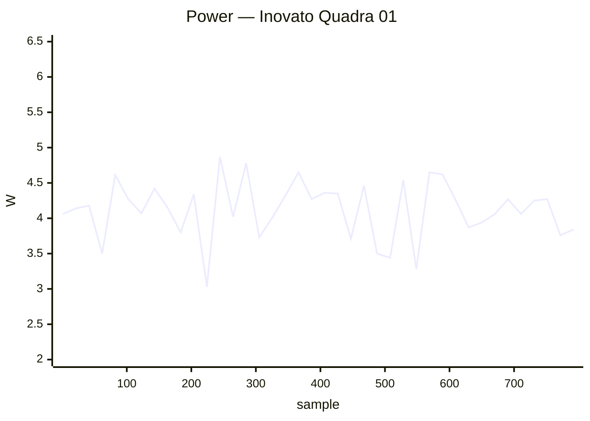

### ✅ Khadas Edge2 01

`khadas-edge2` · **inplace** · image `26.11.0-trunk.65` · 14 ✅ · 0 ❌ · 2 ⏭️

| Module | Status | Time | Detail |
|:--|:--:|--:|:--|
| upgrade | ✅ | 31.6 s | nightly · 26.11.0-trunk.65 → 26.11.0-trunk.65 |
| reboot | ✅ | 32.7 s | warm · up 15 s |
| kernel-switch | ✅ | 21.8 s | branch=vendor · family=rk35xx · installed=26.11.0-trunk.65 · boot_image=/boot/vmlinuz-6.1.172-vendor-rk35xx · kernel_before=6.1.172-vendor-rk35xx |
| reboot | ✅ | 101.0 s | warm · 4/4 boots · up 9 s |
| hw-performance | ✅ | 15.6 s | AES 1276 · mem 14000 · disk W 104 / R 260 MB/s · 37.9 °C · 1800 MHz |
| dvfs | ✅ | 18.1 s | ondemand · 1800–1800 MHz (peak 2256) |
| network-iperf | ⏭️ | 7.2 s | no cabled interfaces |
| store-versions | ✅ | 4.2 s | 26.11.0-trunk.65 · 6.1.172-vendor-rk35xx |
| kernel-switch | ✅ | 69.2 s | branch=current · family=rockchip64 · installed=26.11.0-trunk.65 · boot_image=/boot/vmlinuz-6.18.54-current-rockchip64 · kernel_before=6.1.172-vendor-rk35xx |
| reboot | ✅ | 103.8 s | warm · 4/4 boots · up 14 s |
| hw-performance | ✅ | 15.8 s | AES 1273 · mem 5700 · disk W 103 / R 212 MB/s · 42.5 °C · 1800 MHz |
| dvfs | ✅ | 16.0 s | ondemand · 408–1800 MHz (peak 2400) |
| network-iperf | ⏭️ | 7.8 s | no cabled interfaces |
| store-versions | ✅ | 4.1 s | 26.11.0-trunk.65 · 6.18.54-current-rockchip64 |
| kernel-switch | ✅ | 54.4 s | branch=vendor · family=rk35xx · installed=26.11.0-trunk.65 · boot_image=/boot/vmlinuz-6.1.172-vendor-rk35xx · kernel_before=6.18.54-current-rockchip64 |
| reboot | ✅ | 27.8 s | warm · up 10 s |

### ✅ Khadas VIM1 01

`khadas-vim1` · **inplace** · image `26.11.0-trunk.65` · 16 ✅ · 0 ❌ · 0 ⏭️

| Module | Status | Time | Detail |
|:--|:--:|--:|:--|
| upgrade | ✅ | 75.9 s | nightly · 26.11.0-trunk.65 → 26.11.0-trunk.65 |
| reboot | ✅ | 36.0 s | warm · up 18 s |
| kernel-switch | ✅ | 50.0 s | branch=current · family=meson64 · installed=26.11.0-trunk.65 · boot_image=/boot/vmlinuz-6.18.54-current-meson64 · kernel_before=6.18.54-current-meson64 |
| reboot | ✅ | 136.0 s | warm · 4/4 boots · up 24 s |
| hw-performance | ✅ | 22.7 s | AES 656 · mem 3500 · disk W 42 / R 151 MB/s · 58 °C · 1512 MHz |
| dvfs | ✅ | 24.0 s | ondemand · 500–1512 MHz (peak 1512) |
| network-iperf | ✅ | 71.9 s | end0 ↑94/↓94 (10/100ME) · wlan0 ↑42/↓15 (Wi-Fi 5) Mbps |
| store-versions | ✅ | 5.5 s | 26.11.0-trunk.65 · 6.18.54-current-meson64 |
| kernel-switch | ✅ | 154.2 s | branch=edge · family=meson64 · installed=26.11.0-trunk.65 · boot_image=/boot/vmlinuz-7.2.8-edge-meson64 · kernel_before=6.18.54-current-meson64 |
| reboot | ✅ | 131.5 s | warm · 4/4 boots · up 19 s |
| hw-performance | ✅ | 23.2 s | AES 651 · mem 3500 · disk W 41 / R 138 MB/s · 59 °C · 1512 MHz |
| dvfs | ✅ | 24.6 s | ondemand · 500–1512 MHz (peak 1512) |
| network-iperf | ✅ | 79.2 s | end0 ↑94/↓94 (10/100ME) · wlan0 ↑37/↓25 (Wi-Fi 5) Mbps |
| store-versions | ✅ | 5.5 s | 26.11.0-trunk.65 · 7.2.8-edge-meson64 |
| kernel-switch | ✅ | 151.2 s | branch=current · family=meson64 · installed=26.11.0-trunk.65 · boot_image=/boot/vmlinuz-6.18.54-current-meson64 · kernel_before=7.2.8-edge-meson64 |
| reboot | ✅ | 36.0 s | warm · up 19 s |

### ✅ Khadas VIM2 01

`khadas-vim2` · **inplace** · image `26.11.0-trunk.65` · 16 ✅ · 0 ❌ · 0 ⏭️

| Module | Status | Time | Detail |
|:--|:--:|--:|:--|
| upgrade | ✅ | 133.2 s | nightly · 26.11.0-trunk.65 → 26.11.0-trunk.65 |
| reboot | ✅ | 41.6 s | warm · up 24 s |
| kernel-switch | ✅ | 54.1 s | branch=current · family=meson64 · installed=26.11.0-trunk.65 · boot_image=/boot/vmlinuz-6.18.54-current-meson64 · kernel_before=6.18.54-current-meson64 |
| reboot | ✅ | 149.0 s | warm · 4/4 boots · up 25 s |
| hw-performance | ✅ | 24.1 s | AES 658 · mem 3600 · disk W 40 / R 147 MB/s · 60 °C · 1512 MHz |
| dvfs | ✅ | 25.6 s | ondemand · 500–1512 MHz (peak 1512) |
| network-iperf | ✅ | 66.2 s | eth0 ↑940/↓941 (1GE) · wlan0 ↑104/↓92 (Wi-Fi 5) Mbps |
| store-versions | ✅ | 5.7 s | 26.11.0-trunk.65 · 6.18.54-current-meson64 |
| kernel-switch | ✅ | 162.7 s | branch=edge · family=meson64 · installed=26.11.0-trunk.65 · boot_image=/boot/vmlinuz-7.2.8-edge-meson64 · kernel_before=6.18.54-current-meson64 |
| reboot | ✅ | 153.7 s | warm · 4/4 boots · up 26 s |
| hw-performance | ✅ | 25.2 s | AES 658 · mem 3600 · disk W 38 / R 150 MB/s · 61 °C · 1512 MHz |
| dvfs | ✅ | 25.6 s | ondemand · 500–1512 MHz (peak 1512) |
| network-iperf | ✅ | 62.7 s | eth0 ↑940/↓941 (1GE) · wlan0 ↑93/↓82 (Wi-Fi 5) Mbps |
| store-versions | ✅ | 5.6 s | 26.11.0-trunk.65 · 7.2.8-edge-meson64 |
| kernel-switch | ✅ | 162.2 s | branch=current · family=meson64 · installed=26.11.0-trunk.65 · boot_image=/boot/vmlinuz-6.18.54-current-meson64 · kernel_before=7.2.8-edge-meson64 |
| reboot | ✅ | 41.7 s | warm · up 25 s |

### ✅ Khadas VIM4 01

`khadas-vim4` · **inplace** · image `26.11.0-trunk.51` · 8 ✅ · 0 ❌ · 0 ⏭️

| Module | Status | Time | Detail |
|:--|:--:|--:|:--|
| upgrade | ✅ | 131.8 s | nightly · 26.11.0-trunk.51 → 26.11.0-trunk.54 |
| reboot | ✅ | 53.6 s | power-cycle · up 20 s |
| kernel-switch | ✅ | 24.3 s | branch=legacy · family=meson-s4t7 · installed=26.11.0-trunk.54 · boot_image=vmlinuz-5.15.137-legacy-meson-s4t7 · kernel_before=5.15.137-legacy-meson-s4t7 |
| reboot | ✅ | 52.8 s | power-cycle · up 19 s |
| hw-performance | ✅ | 19.8 s | AES 1246 · mem 6800 · disk W 106 / R 169 MB/s · 47.4 °C · 2208 MHz |
| dvfs | ✅ | 22.4 s | ondemand · 500–2208 MHz (peak 2208) |
| network-iperf | ✅ | 106.6 s | eth0 ↑927/↓935 (1GE) · wlan0 ↑5/↓2 (Wi-Fi 6) · wlan1 ↑77/↓3 (Wi-Fi 6) Mbps |
| store-versions | ✅ | 5.0 s | 26.11.0-trunk.54 · 5.15.137-legacy-meson-s4t7 |

**Power** — min 0.60 W · avg 3.93 W · peak 8.40 W · 336 samples


### ✅ Mekotronics R58HD 01

`mekotronics-r58hd` · **inplace** · image `26.11.0-trunk.65` · 6 ✅ · 0 ❌ · 0 ⏭️

| Module | Status | Time | Detail |
|:--|:--:|--:|:--|
| upgrade | ✅ | 25.8 s | nightly · 26.11.0-trunk.65 → 26.11.0-trunk.65 |
| reboot | ✅ | 47.1 s | power-cycle · up 16 s |
| hw-performance | ✅ | 13.9 s | AES 1303 · mem 14000 · disk W 250 / R 290 MB/s · 48.1 °C · 1800 MHz |
| dvfs | ✅ | 16.5 s | ondemand · 1800–1800 MHz (peak 2304) |
| network-iperf | ✅ | 50.5 s | end0 ↑939/↓823 (1GE) · enP3p49s0 ↑687/↓587 (10/100ME) Mbps |
| store-versions | ✅ | 3.8 s | 26.11.0-trunk.65 · 6.1.172-vendor-rk35xx |

**Power** — min 3.70 W · avg 5.78 W · peak 12.10 W · 132 samples

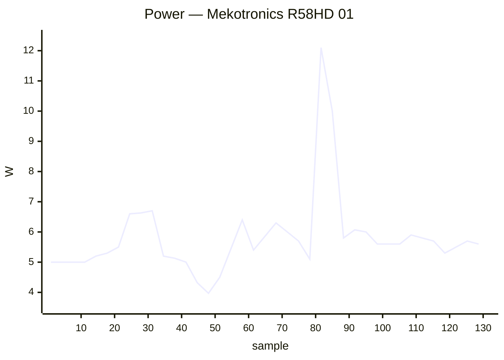

### ✅ Mekotronics R58S2 01

`mekotronics-r58s2` · **inplace** · image `26.8.3` · 5 ✅ · 0 ❌ · 1 ⏭️

| Module | Status | Time | Detail |
|:--|:--:|--:|:--|
| upgrade | ⏭️ | 89.7 s | — |
| reboot | ✅ | 45.6 s | power-cycle · up 15 s |
| hw-performance | ✅ | 14.6 s | AES 1278 · mem 13000 · disk W 218 / R 273 MB/s · 47.2 °C · 1800 MHz |
| dvfs | ✅ | 17.4 s | ondemand · 1800–1800 MHz (peak 2352) |
| network-iperf | ✅ | 56.7 s | end1 ↑939/↓938 (1GE) · wlan0 ↑58/↓173 (Wi-Fi 5) Mbps |
| store-versions | ✅ | 4.0 s | 26.8.3 · 6.1.172-vendor-rk35xx |

### ✅ NanoPi Fire3 01

`nanopifire3` · **inplace** · image `26.11.0-trunk.65` · 7 ✅ · 0 ❌ · 1 ⏭️

| Module | Status | Time | Detail |
|:--|:--:|--:|:--|
| upgrade | ✅ | 110.5 s | nightly · 26.11.0-trunk.65 → 26.11.0-trunk.65 |
| reboot | ✅ | 64.2 s | power-cycle · up 32 s |
| kernel-switch | ✅ | 71.3 s | branch=edge · family=s5p6818 · installed=26.11.0-trunk.65 · boot_image=/boot/vmlinuz-7.2.8-edge-s5p6818 · kernel_before=7.2.8-edge-s5p6818 |
| reboot | ✅ | 179.8 s | power-cycle · 4/4 boots · up 23 s |
| hw-performance | ✅ | 43.3 s | AES 373 · mem 2000 · disk W 1 / R 22 MB/s · 69 °C · None MHz |
| dvfs | ➖ | 3.0 s | no cpufreq |
| network-iperf | ✅ | 38.7 s | eth0 ↑877/↓924 (1GE) Mbps |
| store-versions | ✅ | 6.3 s | 26.11.0-trunk.65 · 7.2.8-edge-s5p6818 |

### ✅ NanoPi K2 01

`nanopik2-s905` · **inplace** · image `26.11.0-trunk.65` · 16 ✅ · 0 ❌ · 0 ⏭️

| Module | Status | Time | Detail |
|:--|:--:|--:|:--|
| upgrade | ✅ | 54.8 s | nightly · 26.11.0-trunk.65 → 26.11.0-trunk.65 |
| reboot | ✅ | 40.3 s | warm · up 24 s |
| kernel-switch | ✅ | 40.7 s | branch=current · family=meson64 · installed=26.11.0-trunk.65 · boot_image=/boot/vmlinuz-6.18.54-current-meson64 · kernel_before=6.18.54-current-meson64 |
| reboot | ✅ | 129.6 s | warm · 4/4 boots · up 20 s |
| hw-performance | ✅ | 30.7 s | AES 51 · mem 3700 · disk W 11 / R 41 MB/s · 63 °C · 2016 MHz |
| dvfs | ✅ | 21.5 s | ondemand · 500–1536 MHz (peak 1536) |
| network-iperf | ✅ | 62.4 s | end0 ↑935/↓941 (1GE) · wlan0 ↑14/↓27 (Wi-Fi 4) Mbps |
| store-versions | ✅ | 4.6 s | 26.11.0-trunk.65 · 6.18.54-current-meson64 |
| kernel-switch | ✅ | 151.0 s | branch=edge · family=meson64 · installed=26.11.0-trunk.65 · boot_image=/boot/vmlinuz-7.2.8-edge-meson64 · kernel_before=6.18.54-current-meson64 |
| reboot | ✅ | 136.0 s | warm · 4/4 boots · up 20 s |
| hw-performance | ✅ | 31.0 s | AES 51 · mem 3700 · disk W 12 / R 1 MB/s · 65 °C · 2016 MHz |
| dvfs | ✅ | 22.3 s | ondemand · 500–1536 MHz (peak 1536) |
| network-iperf | ✅ | 72.5 s | end0 ↑935/↓941 (1GE) · wlan0 ↑12/↓22 (Wi-Fi 4) Mbps |
| store-versions | ✅ | 4.9 s | 26.11.0-trunk.65 · 7.2.8-edge-meson64 |
| kernel-switch | ✅ | 161.0 s | branch=current · family=meson64 · installed=26.11.0-trunk.65 · boot_image=/boot/vmlinuz-6.18.54-current-meson64 · kernel_before=7.2.8-edge-meson64 |
| reboot | ✅ | 37.5 s | warm · up 22 s |

### ✅ NanoPi M4V2 01

`nanopim4v2` · **inplace** · image `26.11.0-trunk.65` · 16 ✅ · 0 ❌ · 0 ⏭️

| Module | Status | Time | Detail |
|:--|:--:|--:|:--|
| upgrade | ✅ | 58.7 s | nightly · 26.11.0-trunk.65 → 26.11.0-trunk.65 |
| reboot | ✅ | 61.0 s | power-cycle · up 30 s |
| kernel-switch | ✅ | 31.5 s | branch=current · family=rockchip64 · installed=26.11.0-trunk.65 · boot_image=/boot/vmlinuz-6.18.54-current-rockchip64 · kernel_before=6.18.54-current-rockchip64 |
| reboot | ✅ | 171.8 s | power-cycle · 4/4 boots · up 26 s |
| hw-performance | ✅ | 21.7 s | AES 1018 · mem 6600 · disk W 52 / R 60 MB/s · 46.9 °C · 1416 MHz |
| dvfs | ✅ | 20.3 s | ondemand · 408–1416 MHz (peak 1800) |
| network-iperf | ✅ | 114.2 s | end0 ↑542/↓566 (1GE) · wlan0 ↑107/↓85 (Wi-Fi 5) · wlx803f5d16af63 ↑105/↓72 (Wi-Fi 5) Mbps |
| store-versions | ✅ | 4.9 s | 26.11.0-trunk.65 · 6.18.54-current-rockchip64 |
| kernel-switch | ✅ | 96.7 s | branch=edge · family=rockchip64 · installed=26.11.0-trunk.65 · boot_image=/boot/vmlinuz-7.2.8-edge-rockchip64 · kernel_before=6.18.54-current-rockchip64 |
| reboot | ✅ | 168.6 s | power-cycle · 4/4 boots · up 28 s |
| hw-performance | ✅ | 21.7 s | AES 1018 · mem 6500 · disk W 53 / R 60 MB/s · 48.1 °C · 1416 MHz |
| dvfs | ✅ | 20.5 s | ondemand · 408–1416 MHz (peak 1800) |
| network-iperf | ✅ | 93.7 s | end0 ↑906/↓939 (1GE) · wlan0 ↑75/↓62 (Wi-Fi 5) · wlx803f5d16af63 ↑110/↓117 (Wi-Fi 5) Mbps |
| store-versions | ✅ | 5.0 s | 26.11.0-trunk.65 · 7.2.8-edge-rockchip64 |
| kernel-switch | ✅ | 94.6 s | branch=current · family=rockchip64 · installed=26.11.0-trunk.65 · boot_image=/boot/vmlinuz-6.18.54-current-rockchip64 · kernel_before=7.2.8-edge-rockchip64 |
| reboot | ✅ | 55.0 s | power-cycle · up 26 s |

**Power** — min 2.30 W · avg 6.89 W · peak 12.60 W · 821 samples


### ✅ NanoPi M5 01

`nanopi-m5` · **inplace** · image `26.11.0-trunk.58` · 22 ✅ · 0 ❌ · 0 ⏭️

| Module | Status | Time | Detail |
|:--|:--:|--:|:--|
| upgrade | ✅ | 152.5 s | nightly · 26.11.0-trunk.58 → 26.11.0-trunk.65 |
| reboot | ✅ | 48.7 s | power-cycle · up 23 s |
| kernel-switch | ✅ | 23.5 s | branch=vendor · family=rk35xx · installed=26.11.0-trunk.65 · boot_image=/boot/vmlinuz-6.1.172-vendor-rk35xx · kernel_before=6.1.172-vendor-rk35xx |
| reboot | ✅ | 309.4 s | power-cycle · 4/4 boots · up 23 s |
| hw-performance | ✅ | 17.8 s | AES 1271 · mem 8000 · disk W 67 / R 77 MB/s · 43.5 °C · 2016 MHz |
| dvfs | ✅ | 19.4 s | ondemand · 2016–2016 MHz (peak 2208) |
| network-iperf | ✅ | 106.1 s | end0 ↑939/↓939 (1GE) · end1 ↑939/↓939 (1GE) · wlan0 ↑43/↓88 (Wi-Fi 5) · wlx44334c47dec3 ↑29/↓18 (Wi-Fi 4) Mbps |
| store-versions | ✅ | 4.2 s | 26.11.0-trunk.65 · 6.1.172-vendor-rk35xx |
| kernel-switch | ✅ | 100.7 s | branch=current · family=rockchip64 · installed=26.11.0-trunk.65 · boot_image=/boot/vmlinuz-6.18.54-current-rockchip64 · kernel_before=6.1.172-vendor-rk35xx |
| reboot | ✅ | 149.4 s | power-cycle · 4/4 boots · up 24 s |
| hw-performance | ✅ | 26.3 s | AES 1328 · mem 9000 · disk W 20 / R 21 MB/s · 42.5 °C · 2016 MHz |
| dvfs | ✅ | 17.2 s | ondemand · 408–2016 MHz (peak 2208) |
| network-iperf | ✅ | 105.7 s | end0 ↑939/↓866 (1GE) · end1 ↑741/↓777 (1GE) · wlan0 ↑99/↓182 (Wi-Fi 5) · wlx44334c47dec3 ↑35/↓17 (Wi-Fi 4) Mbps |
| store-versions | ✅ | 4.7 s | 26.11.0-trunk.65 · 6.18.54-current-rockchip64 |
| kernel-switch | ✅ | 103.5 s | branch=edge · family=rockchip64 · installed=26.11.0-trunk.65 · boot_image=/boot/vmlinuz-7.2.8-edge-rockchip64 · kernel_before=6.18.54-current-rockchip64 |
| reboot | ✅ | 155.8 s | power-cycle · 4/4 boots · up 26 s |
| hw-performance | ✅ | 26.3 s | AES 1329 · mem 9000 · disk W 20 / R 21 MB/s · 43.5 °C · 2016 MHz |
| dvfs | ✅ | 17.5 s | ondemand · 408–2016 MHz (peak 2208) |
| network-iperf | ✅ | 109.4 s | end0 ↑931/↓848 (1GE) · end1 ↑939/↓939 (1GE) · wlan0 ↑79/↓172 (Wi-Fi 5) · wlx44334c47dec3 ↑38/↓20 (Wi-Fi 4) Mbps |
| store-versions | ✅ | 4.1 s | 26.11.0-trunk.65 · 7.2.8-edge-rockchip64 |
| kernel-switch | ✅ | 104.4 s | branch=vendor · family=rk35xx · installed=26.11.0-trunk.65 · boot_image=/boot/vmlinuz-6.1.172-vendor-rk35xx · kernel_before=7.2.8-edge-rockchip64 |
| reboot | ✅ | 133.5 s | power-cycle · up 107 s |

**Power** — min 1.80 W · avg 4.80 W · peak 8.70 W · 1385 samples

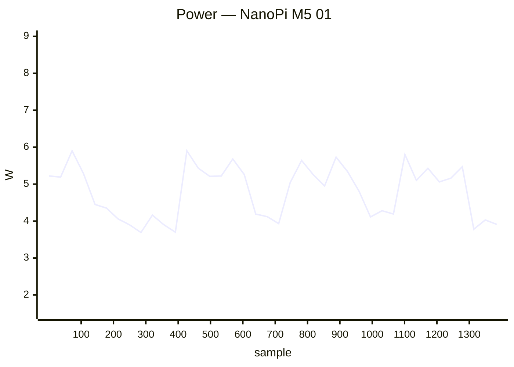

### ✅ NanoPi M6 01

`nanopi-m6` · **inplace** · image `26.11.0-trunk.65` · 22 ✅ · 0 ❌ · 0 ⏭️

| Module | Status | Time | Detail |
|:--|:--:|--:|:--|
| upgrade | ✅ | 27.9 s | nightly · 26.11.0-trunk.65 → 26.11.0-trunk.65 |
| reboot | ✅ | 56.1 s | power-cycle · up 21 s |
| kernel-switch | ✅ | 21.3 s | branch=vendor · family=rk35xx · installed=26.11.0-trunk.65 · boot_image=/boot/vmlinuz-6.1.172-vendor-rk35xx · kernel_before=6.1.172-vendor-rk35xx |
| reboot | ✅ | 137.7 s | power-cycle · 4/4 boots · up 22 s |
| hw-performance | ✅ | 17.6 s | AES 1256 · mem 13600 · disk W 53 / R 77 MB/s · 48.1 °C · 1800 MHz |
| dvfs | ✅ | 17.2 s | ondemand · 1800–1800 MHz (peak 2256) |
| network-iperf | ✅ | 54.9 s | lan ↑938/↓939 (1GE) · wlP3p49s0 ↑250/↓266 (Wi-Fi 5) Mbps |
| store-versions | ✅ | 4.0 s | 26.11.0-trunk.65 · 6.1.172-vendor-rk35xx |
| kernel-switch | ✅ | 97.7 s | branch=current · family=rockchip64 · installed=26.11.0-trunk.65 · boot_image=/boot/vmlinuz-6.18.54-current-rockchip64 · kernel_before=6.1.172-vendor-rk35xx |
| reboot | ✅ | 222.9 s | power-cycle · 4/4 boots · up 22 s |
| hw-performance | ✅ | 18.9 s | AES 1214 · mem 9800 · disk W 49 / R 57 MB/s · 49.9 °C · 1800 MHz |
| dvfs | ✅ | 14.9 s | ondemand · 408–1800 MHz (peak 2400) |
| network-iperf | ✅ | 56.7 s | lan ↑938/↓924 (1GE) · wlP3p49s0 ↑204/↓116 (Wi-Fi 5) Mbps |
| store-versions | ✅ | 4.0 s | 26.11.0-trunk.65 · 6.18.54-current-rockchip64 |
| kernel-switch | ✅ | 72.0 s | branch=edge · family=rockchip64 · installed=26.11.0-trunk.65 · boot_image=/boot/vmlinuz-7.2.8-edge-rockchip64 · kernel_before=6.18.54-current-rockchip64 |
| reboot | ✅ | 133.8 s | power-cycle · 4/4 boots · up 21 s |
| hw-performance | ✅ | 18.8 s | AES 1203 · mem 5300 · disk W 47 / R 55 MB/s · 51.8 °C · 1800 MHz |
| dvfs | ✅ | 14.8 s | ondemand · 408–1800 MHz (peak 2400) |
| network-iperf | ✅ | 58.2 s | lan ↑939/↓939 (1GE) · wlP3p49s0 ↑246/↓274 (Wi-Fi 5) Mbps |
| store-versions | ✅ | 3.8 s | 26.11.0-trunk.65 · 7.2.8-edge-rockchip64 |
| kernel-switch | ✅ | 66.6 s | branch=vendor · family=rk35xx · installed=26.11.0-trunk.65 · boot_image=/boot/vmlinuz-6.1.172-vendor-rk35xx · kernel_before=7.2.8-edge-rockchip64 |
| reboot | ✅ | 50.2 s | power-cycle · up 23 s |

**Power** — min 1.10 W · avg 3.84 W · peak 10.00 W · 910 samples

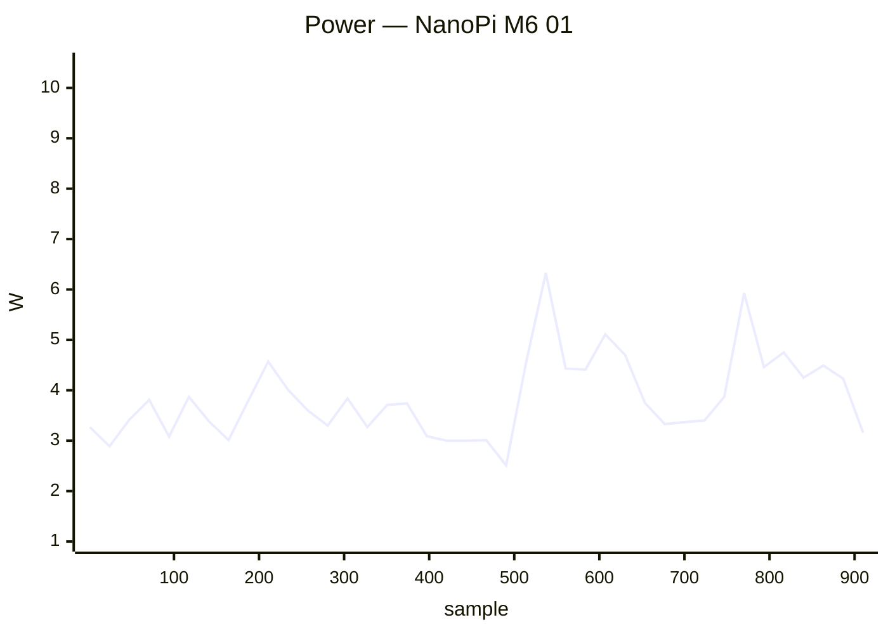

### ✅ NanoPi Neo 2 Black 01

`nanopineo2black` · **inplace** · image `26.11.0-trunk.65` · 16 ✅ · 0 ❌ · 0 ⏭️

| Module | Status | Time | Detail |
|:--|:--:|--:|:--|
| upgrade | ✅ | 61.8 s | nightly · 26.11.0-trunk.65 → 26.11.0-trunk.65 |
| reboot | ✅ | 55.1 s | power-cycle · up 18 s |
| kernel-switch | ✅ | 43.3 s | branch=current · family=sunxi64 · installed=26.11.0-trunk.65 · boot_image=/boot/vmlinuz-6.18.54-current-sunxi64 · kernel_before=6.18.54-current-sunxi64 |
| reboot | ✅ | 579.4 s | power-cycle · 2/4 boots · up 18 s |
| hw-performance | ✅ | 23.7 s | AES 637 · mem 3500 · disk W 42 / R 44 MB/s · 61.1 °C · 1368 MHz |
| dvfs | ✅ | 22.6 s | ondemand · 480–1368 MHz (peak 1368) |
| network-iperf | ✅ | 31.5 s | end0 ↑867/↓757 (1GE) Mbps |
| store-versions | ✅ | 5.1 s | 26.11.0-trunk.65 · 6.18.54-current-sunxi64 |
| kernel-switch | ✅ | 108.2 s | branch=edge · family=sunxi64 · installed=26.11.0-trunk.65 · boot_image=/boot/vmlinuz-7.2.8-edge-sunxi64 · kernel_before=6.18.54-current-sunxi64 |
| reboot | ✅ | 578.4 s | power-cycle · 2/4 boots · up 17 s |
| hw-performance | ✅ | 24.2 s | AES 637 · mem 3500 · disk W 43 / R 43 MB/s · 60.4 °C · 1368 MHz |
| dvfs | ✅ | 23.6 s | ondemand · 480–1368 MHz (peak 1368) |
| network-iperf | ✅ | 34.7 s | end0 ↑893/↓896 (1GE) Mbps |
| store-versions | ✅ | 5.0 s | 26.11.0-trunk.65 · 7.2.8-edge-sunxi64 |
| kernel-switch | ✅ | 109.2 s | branch=current · family=sunxi64 · installed=26.11.0-trunk.65 · boot_image=/boot/vmlinuz-6.18.54-current-sunxi64 · kernel_before=7.2.8-edge-sunxi64 |
| reboot | ✅ | 53.4 s | power-cycle · up 18 s |

**Power** — min 0.90 W · avg 2.35 W · peak 5.20 W · 1381 samples

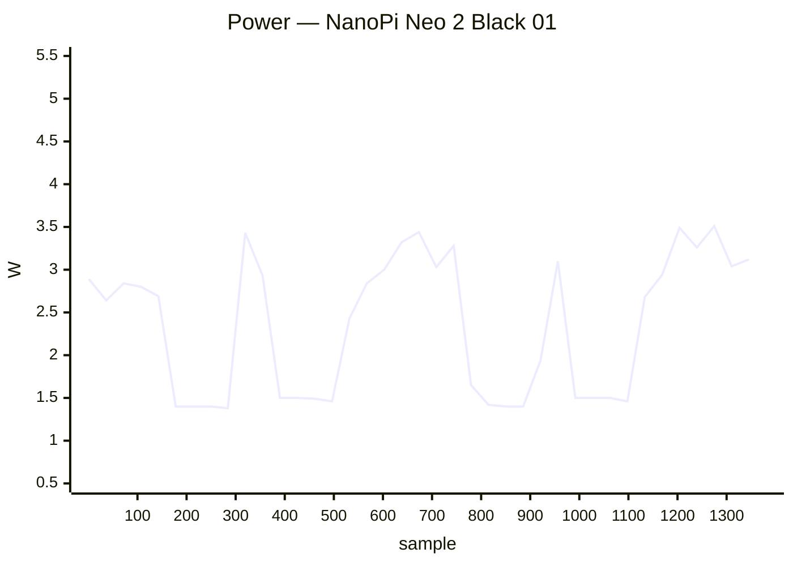

### ✅ NanoPi Neo 3 01

`nanopineo3` · **inplace** · image `26.11.0-trunk.65` · 16 ✅ · 0 ❌ · 0 ⏭️

| Module | Status | Time | Detail |
|:--|:--:|--:|:--|
| upgrade | ✅ | 83.3 s | nightly · 26.11.0-trunk.65 → 26.11.0-trunk.65 |
| reboot | ✅ | 55.4 s | power-cycle · up 27 s |
| kernel-switch | ✅ | 58.0 s | branch=current · family=rockchip64 · installed=26.11.0-trunk.65 · boot_image=/boot/vmlinuz-6.18.54-current-rockchip64 · kernel_before=6.18.54-current-rockchip64 |
| reboot | ✅ | 169.4 s | power-cycle · 4/4 boots · up 28 s |
| hw-performance | ✅ | 28.4 s | AES 594 · mem 2500 · disk W 52 / R 63 MB/s · 80 °C · 1296 MHz |
| dvfs | ✅ | 30.1 s | ondemand · 408–1296 MHz (peak 1296) |
| network-iperf | ✅ | 84.1 s | end0 ↑905/↓898 (1GE) · wlx7cdd905518f9 ↑29/↓21 (Wi-Fi 4) Mbps |
| store-versions | ✅ | 6.4 s | 26.11.0-trunk.65 · 6.18.54-current-rockchip64 |
| kernel-switch | ✅ | 176.1 s | branch=edge · family=rockchip64 · installed=26.11.0-trunk.65 · boot_image=/boot/vmlinuz-7.2.8-edge-rockchip64 · kernel_before=6.18.54-current-rockchip64 |
| reboot | ✅ | 165.3 s | power-cycle · 4/4 boots · up 26 s |
| hw-performance | ✅ | 28.6 s | AES 599 · mem 2400 · disk W 47 / R 64 MB/s · 82.7 °C · 1296 MHz |
| dvfs | ✅ | 30.8 s | ondemand · 408–1296 MHz (peak 1296) |
| network-iperf | ✅ | 71.2 s | end0 ↑895/↓941 (1GE) · wlx7cdd905518f9 ↑29/↓22 (Wi-Fi 4) Mbps |
| store-versions | ✅ | 6.5 s | 26.11.0-trunk.65 · 7.2.8-edge-rockchip64 |
| kernel-switch | ✅ | 174.1 s | branch=current · family=rockchip64 · installed=26.11.0-trunk.65 · boot_image=/boot/vmlinuz-6.18.54-current-rockchip64 · kernel_before=7.2.8-edge-rockchip64 |
| reboot | ✅ | 56.7 s | power-cycle · up 28 s |

### ✅ NanoPi R6S 01

`nanopi-r6s` · **inplace** · image `26.11.0-trunk.65` · 22 ✅ · 0 ❌ · 0 ⏭️

| Module | Status | Time | Detail |
|:--|:--:|--:|:--|
| upgrade | ✅ | 26.3 s | nightly · 26.11.0-trunk.65 → 26.11.0-trunk.65 |
| reboot | ✅ | 40.0 s | power-cycle · up 14 s |
| kernel-switch | ✅ | 17.3 s | branch=vendor · family=rk35xx · installed=26.11.0-trunk.65 · boot_image=/boot/vmlinuz-6.1.172-vendor-rk35xx · kernel_before=6.1.172-vendor-rk35xx |
| reboot | ✅ | 97.6 s | power-cycle · 4/4 boots · up 15 s |
| hw-performance | ✅ | 14.3 s | AES 1272 · mem 15400 · disk W 211 / R 271 MB/s · 37.9 °C · 1800 MHz |
| dvfs | ✅ | 18.1 s | ondemand · 1800–1800 MHz (peak 2256) |
| network-iperf | ✅ | 29.8 s | lan2 ↑939/↓939 (1GE) Mbps |
| store-versions | ✅ | 4.2 s | 26.11.0-trunk.65 · 6.1.172-vendor-rk35xx |
| kernel-switch | ✅ | 51.0 s | branch=current · family=rockchip64 · installed=26.11.0-trunk.65 · boot_image=/boot/vmlinuz-6.18.54-current-rockchip64 · kernel_before=6.1.172-vendor-rk35xx |
| reboot | ✅ | 98.5 s | power-cycle · 4/4 boots · up 12 s |
| hw-performance | ✅ | 15.6 s | AES 1277 · mem 10300 · disk W 139 / R 140 MB/s · 38.8 °C · 1800 MHz |
| dvfs | ✅ | 16.0 s | ondemand · 408–1800 MHz (peak 2400) |
| network-iperf | ✅ | 31.1 s | lan2 ↑846/↓874 (1GE) Mbps |
| store-versions | ✅ | 4.0 s | 26.11.0-trunk.65 · 6.18.54-current-rockchip64 |
| kernel-switch | ✅ | 45.7 s | branch=edge · family=rockchip64 · installed=26.11.0-trunk.65 · boot_image=/boot/vmlinuz-7.2.8-edge-rockchip64 · kernel_before=6.18.54-current-rockchip64 |
| reboot | ✅ | 98.7 s | power-cycle · 4/4 boots · up 14 s |
| hw-performance | ✅ | 16.0 s | AES 1271 · mem 8200 · disk W 148 / R 149 MB/s · 39.8 °C · 1800 MHz |
| dvfs | ✅ | 15.2 s | ondemand · 408–1800 MHz (peak 2400) |
| network-iperf | ✅ | 30.5 s | lan2 ↑647/↓521 (1GE) Mbps |
| store-versions | ✅ | 4.4 s | 26.11.0-trunk.65 · 7.2.8-edge-rockchip64 |
| kernel-switch | ✅ | 39.4 s | branch=vendor · family=rk35xx · installed=26.11.0-trunk.65 · boot_image=/boot/vmlinuz-6.1.172-vendor-rk35xx · kernel_before=7.2.8-edge-rockchip64 |
| reboot | ✅ | 40.3 s | power-cycle · up 15 s |

**Power** — min 0.90 W · avg 4.76 W · peak 10.50 W · 588 samples

```mermaid
xychart-beta
    title "Power — NanoPi R6S 01"
    x-axis "sample" 1 --> 588
    y-axis "W" 0.5 --> 11.0
    line [3.69, 4.67, 2.71, 4.91, 4.73, 4.16, 4.45, 5.01, 3.83, 4.73, 4.41, 5.35, 4.01, 3.89, 4.55, 4.85, 4.09, 4.77, 4.76, 5.25, 3.47, 5.53, 7.73, 5.32, 4.67, 5.25, 5.65, 5.46, 5.16, 5.13, 4.36, 3.53, 5.25, 5.78, 5.25, 4.61, 4.79, 5.39, 4.69, 4.34]
```

### ✅ NanoPi R76S 01

`nanopi-r76s` · **inplace** · image `26.11.0-trunk.57` · 15 ✅ · 0 ❌ · 1 ⏭️

| Module | Status | Time | Detail |
|:--|:--:|--:|:--|
| upgrade | ⏭️ | 13.5 s | — |
| reboot | ✅ | 70.3 s | power-cycle · up 27 s |
| kernel-switch | ✅ | 31.3 s | branch=vendor · family=rk35xx · installed=26.11.0-trunk.65 · boot_image=/boot/vmlinuz-6.1.172-vendor-rk35xx · kernel_before=6.1.172-vendor-rk35xx |
| reboot | ✅ | 183.2 s | power-cycle · 4/4 boots · up 29 s |
| hw-performance | ✅ | 23.7 s | AES 1273 · mem 7400 · disk W 24 / R 74 MB/s · 42.5 °C · 2016 MHz |
| dvfs | ✅ | 20.9 s | ondemand · 2016–2016 MHz (peak 2208) |
| network-iperf | ✅ | 114.5 s | end0 ↑929/↓925 (1GE) · end1 ↑687/↓463 (1GE) · wlan0 ↑50/↓48 (Wi-Fi 5) · wlxe0e1a933de37 ↑197/↓189 (Wi-Fi 5) Mbps |
| store-versions | ✅ | 4.7 s | 26.11.0-trunk.57 · 6.1.172-vendor-rk35xx |
| kernel-switch | ✅ | 154.0 s | branch=edge · family=rockchip64 · installed=26.11.0-trunk.65 · boot_image=/boot/vmlinuz-7.2.8-edge-rockchip64 · kernel_before=6.1.172-vendor-rk35xx |
| reboot | ✅ | 192.0 s | power-cycle · 4/4 boots · up 27 s |
| hw-performance | ✅ | 22.0 s | AES 1311 · mem 8800 · disk W 69 / R 70 MB/s · 42.5 °C · 2016 MHz |
| dvfs | ✅ | 19.2 s | ondemand · 408–2016 MHz (peak 2208) |
| network-iperf | ✅ | 110.0 s | end0 ↑889/↓904 (1GE) · end1 ↑938/↓939 (1GE) · wlan0 ↑83/↓183 (Wi-Fi 5) · wlxe0e1a933de37 ↑193/↓190 (Wi-Fi 5) Mbps |
| store-versions | ✅ | 5.2 s | 26.11.0-trunk.57 · 7.2.8-edge-rockchip64 |
| kernel-switch | ✅ | 90.3 s | branch=vendor · family=rk35xx · installed=26.11.0-trunk.65 · boot_image=/boot/vmlinuz-6.1.172-vendor-rk35xx · kernel_before=7.2.8-edge-rockchip64 |
| reboot | ✅ | 69.3 s | power-cycle · up 26 s |

**Power** — min 1.70 W · avg 3.70 W · peak 8.00 W · 886 samples

```mermaid
xychart-beta
    title "Power — NanoPi R76S 01"
    x-axis "sample" 1 --> 886
    y-axis "W" 1.5 --> 8.5
    line [3.67, 3.13, 2.26, 4.50, 3.75, 2.21, 2.70, 3.01, 3.22, 2.20, 4.00, 4.97, 4.44, 3.99, 3.91, 4.06, 4.35, 4.26, 4.17, 4.11, 3.68, 4.07, 2.90, 2.93, 2.73, 3.28, 2.31, 3.39, 3.58, 4.97, 4.27, 4.30, 4.36, 4.68, 4.43, 4.36, 4.42, 4.85, 3.03, 2.80]
```

### ✅ Odroid C2 01

`odroidc2` · **inplace** · image `26.11.0-trunk.65` · 16 ✅ · 0 ❌ · 0 ⏭️

| Module | Status | Time | Detail |
|:--|:--:|--:|:--|
| upgrade | ✅ | 55.3 s | nightly · 26.11.0-trunk.65 → 26.11.0-trunk.65 |
| reboot | ✅ | 33.1 s | warm · up 17 s |
| kernel-switch | ✅ | 37.4 s | branch=current · family=meson64 · installed=26.11.0-trunk.65 · boot_image=/boot/vmlinuz-6.18.54-current-meson64 · kernel_before=6.18.54-current-meson64 |
| reboot | ✅ | 118.4 s | warm · 4/4 boots · up 17 s |
| hw-performance | ✅ | 22.5 s | AES 51 · mem 3500 · disk W 32 / R 141 MB/s · 48 °C · 1536 MHz |
| dvfs | ✅ | 22.1 s | ondemand · 500–1536 MHz (peak 1536) |
| network-iperf | ✅ | 34.0 s | end0 ↑940/↓941 (1GE) Mbps |
| store-versions | ✅ | 4.9 s | 26.11.0-trunk.65 · 6.18.54-current-meson64 |
| kernel-switch | ✅ | 113.9 s | branch=edge · family=meson64 · installed=26.11.0-trunk.65 · boot_image=/boot/vmlinuz-7.2.8-edge-meson64 · kernel_before=6.18.54-current-meson64 |
| reboot | ✅ | 117.4 s | warm · 4/4 boots · up 17 s |
| hw-performance | ✅ | 22.7 s | AES 51 · mem 3500 · disk W 31 / R 140 MB/s · 50 °C · 1536 MHz |
| dvfs | ✅ | 22.5 s | ondemand · 500–1536 MHz (peak 1536) |
| network-iperf | ✅ | 33.1 s | end0 ↑940/↓941 (1GE) Mbps |
| store-versions | ✅ | 5.6 s | 26.11.0-trunk.65 · 7.2.8-edge-meson64 |
| kernel-switch | ✅ | 110.9 s | branch=current · family=meson64 · installed=26.11.0-trunk.65 · boot_image=/boot/vmlinuz-6.18.54-current-meson64 · kernel_before=7.2.8-edge-meson64 |
| reboot | ✅ | 33.5 s | warm · up 16 s |

### ✅ Odroid C4 01

`odroidc4` · **inplace** · image `26.11.0-trunk.65` · 16 ✅ · 0 ❌ · 0 ⏭️

| Module | Status | Time | Detail |
|:--|:--:|--:|:--|
| upgrade | ✅ | 42.8 s | nightly · 26.11.0-trunk.65 → 26.11.0-trunk.65 |
| reboot | ✅ | 49.4 s | power-cycle · up 17 s |
| kernel-switch | ✅ | 30.0 s | branch=current · family=meson64 · installed=26.11.0-trunk.65 · boot_image=/boot/vmlinuz-6.18.54-current-meson64 · kernel_before=6.18.54-current-meson64 |
| reboot | ✅ | 132.2 s | power-cycle · 4/4 boots · up 19 s |
| hw-performance | ✅ | 23.8 s | AES 980 · mem 5200 · disk W 15 / R 76 MB/s · 42 °C · 2100 MHz |
| dvfs | ✅ | 19.6 s | ondemand · 1000–2100 MHz (peak 2100) |
| network-iperf | ✅ | 56.6 s | end0 ↑751/↓663 (1GE) · wlx24050fdd332b ↑60/↓85 (Wi-Fi 4) Mbps |
| store-versions | ✅ | 4.4 s | 26.11.0-trunk.65 · 6.18.54-current-meson64 |
| kernel-switch | ✅ | 120.9 s | branch=edge · family=meson64 · installed=26.11.0-trunk.65 · boot_image=/boot/vmlinuz-7.2.8-edge-meson64 · kernel_before=6.18.54-current-meson64 |
| reboot | ✅ | 574.4 s | power-cycle · 2/4 boots · up 17 s |
| hw-performance | ✅ | 21.8 s | AES 980 · mem 5300 · disk W 31 / R 78 MB/s · 37.7 °C · 2100 MHz |
| dvfs | ✅ | 19.5 s | ondemand · 1000–2100 MHz (peak 2100) |
| network-iperf | ✅ | 56.2 s | end0 ↑938/↓939 (1GE) · wlx24050fdd332b ↑119/↓121 (Wi-Fi 4) Mbps |
| store-versions | ✅ | 4.4 s | 26.11.0-trunk.65 · 7.2.8-edge-meson64 |
| kernel-switch | ✅ | 107.9 s | branch=current · family=meson64 · installed=26.11.0-trunk.65 · boot_image=/boot/vmlinuz-6.18.54-current-meson64 · kernel_before=7.2.8-edge-meson64 |
| reboot | ✅ | 52.5 s | power-cycle · up 18 s |

**Power** — min 0.90 W · avg 2.94 W · peak 5.10 W · 1031 samples

```mermaid
xychart-beta
    title "Power — Odroid C4 01"
    x-axis "sample" 1 --> 1031
    y-axis "W" 0.5 --> 5.5
    line [3.62, 3.26, 2.94, 3.67, 3.45, 3.44, 3.46, 2.93, 3.64, 3.38, 3.79, 3.35, 3.65, 3.58, 3.54, 3.38, 2.15, 2.10, 2.10, 2.10, 2.10, 2.08, 2.04, 2.73, 2.00, 2.00, 2.00, 2.08, 2.02, 2.04, 2.63, 2.52, 3.61, 3.42, 4.11, 3.52, 3.85, 3.58, 3.48, 2.42]
```

### ✅ Odroid M1 01

`odroidm1` · **inplace** · image `26.11.0-trunk.65` · 16 ✅ · 0 ❌ · 0 ⏭️

| Module | Status | Time | Detail |
|:--|:--:|--:|:--|
| upgrade | ✅ | 47.2 s | nightly · 26.11.0-trunk.65 → 26.11.0-trunk.65 |
| reboot | ✅ | 56.5 s | power-cycle · up 21 s |
| kernel-switch | ✅ | 31.6 s | branch=current · family=rockchip64 · installed=26.11.0-trunk.65 · boot_image=/boot/vmlinuz-6.18.54-current-rockchip64 · kernel_before=6.18.54-current-rockchip64 |
| reboot | ✅ | 153.1 s | power-cycle · 4/4 boots · up 23 s |
| hw-performance | ✅ | 17.7 s | AES 914 · mem 5100 · disk W 993 / R 965 MB/s · 37.2 °C · 1992 MHz |
| dvfs | ✅ | 21.3 s | ondemand · 408–1992 MHz (peak 1992) |
| network-iperf | ✅ | 72.9 s | eth0 ↑539/↓941 (1GE) · wlx40a5eff39254 ↑132/↓186 (Wi-Fi 5) Mbps |
| store-versions | ✅ | 4.8 s | 26.11.0-trunk.65 · 6.18.54-current-rockchip64 |
| kernel-switch | ✅ | 86.2 s | branch=edge · family=rockchip64 · installed=26.11.0-trunk.65 · boot_image=/boot/vmlinuz-7.2.8-edge-rockchip64 · kernel_before=6.18.54-current-rockchip64 |
| reboot | ✅ | 154.7 s | power-cycle · 4/4 boots · up 21 s |
| hw-performance | ✅ | 17.6 s | AES 914 · mem 5000 · disk W 1032 / R 1007 MB/s · 37.8 °C · 1992 MHz |
| dvfs | ✅ | 22.9 s | ondemand · 408–1992 MHz (peak 1992) |
| network-iperf | ✅ | 59.2 s | eth0 ↑941/↓941 (1GE) · wlx40a5eff39254 ↑206/↓231 (Wi-Fi 5) Mbps |
| store-versions | ✅ | 4.9 s | 26.11.0-trunk.65 · 7.2.8-edge-rockchip64 |
| kernel-switch | ✅ | 86.3 s | branch=current · family=rockchip64 · installed=26.11.0-trunk.65 · boot_image=/boot/vmlinuz-6.18.54-current-rockchip64 · kernel_before=7.2.8-edge-rockchip64 |
| reboot | ✅ | 60.0 s | power-cycle · up 24 s |

**Power** — min 2.00 W · avg 6.42 W · peak 11.30 W · 678 samples

```mermaid
xychart-beta
    title "Power — Odroid M1 01"
    x-axis "sample" 1 --> 678
    y-axis "W" 1.5 --> 11.5
    line [6.31, 6.08, 5.43, 7.03, 6.88, 6.46, 6.28, 5.76, 7.62, 6.40, 5.75, 5.83, 7.02, 6.41, 6.24, 5.88, 5.49, 5.58, 6.92, 7.56, 6.06, 6.98, 6.24, 7.88, 5.91, 5.82, 7.76, 4.58, 7.95, 6.61, 5.98, 5.95, 5.76, 5.91, 7.57, 7.11, 5.89, 6.04, 5.61, 8.24]
```

### ✅ Odroid N2 01

`odroidn2` · **inplace** · image `26.11.0-trunk.65` · 16 ✅ · 0 ❌ · 0 ⏭️

| Module | Status | Time | Detail |
|:--|:--:|--:|:--|
| upgrade | ✅ | 36.4 s | nightly · 26.11.0-trunk.65 → 26.11.0-trunk.65 |
| reboot | ✅ | 64.4 s | power-cycle · up 29 s |
| kernel-switch | ✅ | 24.9 s | branch=current · family=meson64 · installed=26.11.0-trunk.65 · boot_image=/boot/vmlinuz-6.18.54-current-meson64 · kernel_before=6.18.54-current-meson64 |
| reboot | ✅ | 161.4 s | power-cycle · 4/4 boots · up 30 s |
| hw-performance | ✅ | 19.4 s | AES 1085 · mem 4900 · disk W 26 / R 134 MB/s · 40.4 °C · 1992 MHz |
| dvfs | ✅ | 17.2 s | performance · 1000–1992 MHz (peak 1992) |
| network-iperf | ✅ | 27.5 s | end0 ↑940/↓940 (1GE) Mbps |
| store-versions | ✅ | 3.8 s | 26.11.0-trunk.65 · 6.18.54-current-meson64 |
| kernel-switch | ✅ | 81.8 s | branch=edge · family=meson64 · installed=26.11.0-trunk.65 · boot_image=/boot/vmlinuz-7.2.8-edge-meson64 · kernel_before=6.18.54-current-meson64 |
| reboot | ✅ | 170.5 s | power-cycle · 4/4 boots · up 25 s |
| hw-performance | ✅ | 19.5 s | AES 1085 · mem 4900 · disk W 27 / R 134 MB/s · 40.8 °C · 1992 MHz |
| dvfs | ✅ | 18.5 s | performance · 1000–1992 MHz (peak 1992) |
| network-iperf | ✅ | 28.4 s | end0 ↑940/↓942 (1GE) Mbps |
| store-versions | ✅ | 4.1 s | 26.11.0-trunk.65 · 7.2.8-edge-meson64 |
| kernel-switch | ✅ | 82.2 s | branch=current · family=meson64 · installed=26.11.0-trunk.65 · boot_image=/boot/vmlinuz-6.18.54-current-meson64 · kernel_before=7.2.8-edge-meson64 |
| reboot | ✅ | 63.8 s | power-cycle · up 29 s |

**Power** — min 1.00 W · avg 4.69 W · peak 11.20 W · 647 samples

```mermaid
xychart-beta
    title "Power — Odroid N2 01"
    x-axis "sample" 1 --> 647
    y-axis "W" 0.5 --> 11.5
    line [5.07, 4.96, 3.46, 2.41, 5.49, 5.94, 3.79, 4.63, 3.49, 5.06, 3.37, 5.31, 3.30, 5.28, 5.58, 6.02, 4.47, 4.89, 4.84, 5.16, 5.21, 4.71, 3.61, 5.14, 3.98, 5.20, 3.63, 5.76, 3.28, 5.40, 5.64, 6.56, 4.57, 4.81, 4.74, 5.02, 5.19, 4.49, 2.79, 5.33]
```

### ✅ Orange Pi 3 01

`orangepi3` · **inplace** · image `26.11.0-trunk.58` · 15 ✅ · 0 ❌ · 1 ⏭️

| Module | Status | Time | Detail |
|:--|:--:|--:|:--|
| upgrade | ⏭️ | 43.3 s | — |
| reboot | ✅ | 66.2 s | power-cycle · up 36 s |
| kernel-switch | ✅ | 36.2 s | branch=current · family=sunxi64 · installed=26.8.0-trunk.61 · boot_image=/boot/vmlinuz-6.18.33-current-sunxi64 · kernel_before=6.18.33-current-sunxi64 |
| reboot | ✅ | 812.3 s | power-cycle · 1/4 boots · up 24 s |
| hw-performance | ✅ | 28.3 s | AES 839 · mem 4600 · disk W 21 / R 23 MB/s · 46.6 °C · 1800 MHz |
| dvfs | ✅ | 19.5 s | ondemand · 480–1800 MHz (peak 1800) |
| network-iperf | ✅ | 59.8 s | end0 ↑918/↓939 (1GE) · wlan0 ↑51/↓49 (Wi-Fi 5) Mbps |
| store-versions | ✅ | 4.6 s | 26.11.0-trunk.58 · 6.18.33-current-sunxi64 |
| kernel-switch | ✅ | 104.0 s | branch=edge · family=sunxi64 · installed=26.8.0-trunk.61 · boot_image=/boot/vmlinuz-7.0.10-edge-sunxi64 · kernel_before=6.18.33-current-sunxi64 |
| reboot | ✅ | 808.5 s | power-cycle · 1/4 boots · up 24 s |
| hw-performance | ✅ | 28.2 s | AES 839 · mem 4600 · disk W 21 / R 23 MB/s · 44.4 °C · 1800 MHz |
| dvfs | ✅ | 20.0 s | ondemand · 480–1800 MHz (peak 1800) |
| network-iperf | ✅ | 57.5 s | end0 ↑916/↓939 (1GE) · wlan0 ↑43/↓29 (Wi-Fi 5) Mbps |
| store-versions | ✅ | 4.7 s | 26.11.0-trunk.58 · 7.0.10-edge-sunxi64 |
| kernel-switch | ✅ | 98.1 s | branch=current · family=sunxi64 · installed=26.8.0-trunk.61 · boot_image=/boot/vmlinuz-6.18.33-current-sunxi64 · kernel_before=7.0.10-edge-sunxi64 |
| reboot | ✅ | 54.0 s | power-cycle · up 24 s |

### ✅ Orange Pi 5 Plus 01

`orangepi5-plus` · **inplace** · image `26.11.0-trunk.65` · 21 ✅ · 1 ❌ · 0 ⏭️

| Module | Status | Time | Detail |
|:--|:--:|--:|:--|
| upgrade | ✅ | 24.0 s | nightly · 26.11.0-trunk.65 → 26.11.0-trunk.65 |
| reboot | ✅ | 65.3 s | power-cycle · up 38 s |
| kernel-switch | ✅ | 21.7 s | branch=vendor · family=rk35xx · installed=26.11.0-trunk.65 · boot_image=/boot/vmlinuz-6.1.172-vendor-rk35xx · kernel_before=6.1.172-vendor-rk35xx |
| reboot | ✅ | 167.7 s | power-cycle · 4/4 boots · up 30 s |
| hw-performance | ✅ | 17.8 s | AES 1251 · mem 13600 · disk W 55 / R 63 MB/s · 59.2 °C · 1800 MHz |
| dvfs | ✅ | 16.5 s | ondemand · 1800–1800 MHz (peak 2256) |
| network-iperf | ❌ | 193.1 s | enP3p49s0 ↑941/↓0 (1GE) · wlxe0e1a9380c53 ↑570/↓295 (Wi-Fi 6) Mbps |
| store-versions | ✅ | 4.1 s | 26.11.0-trunk.65 · 6.1.172-vendor-rk35xx |
| kernel-switch | ✅ | 99.8 s | branch=current · family=rockchip64 · installed=26.11.0-trunk.65 · boot_image=/boot/vmlinuz-6.18.54-current-rockchip64 · kernel_before=6.1.172-vendor-rk35xx |
| reboot | ✅ | 162.2 s | power-cycle · 4/4 boots · up 29 s |
| hw-performance | ✅ | 18.5 s | AES 1260 · mem 10200 · disk W 53 / R 57 MB/s · 61 °C · 1800 MHz |
| dvfs | ✅ | 14.7 s | ondemand · 408–1800 MHz (peak 2400) |
| network-iperf | ✅ | 56.1 s | enP3p49s0 ↑941/↓941 (1GE) · wlxe0e1a9380c53 ↑103/↓60 (Wi-Fi 6) Mbps |
| store-versions | ✅ | 4.0 s | 26.11.0-trunk.65 · 6.18.54-current-rockchip64 |
| kernel-switch | ✅ | 68.1 s | branch=edge · family=rockchip64 · installed=26.11.0-trunk.65 · boot_image=/boot/vmlinuz-7.2.8-edge-rockchip64 · kernel_before=6.18.54-current-rockchip64 |
| reboot | ✅ | 153.8 s | power-cycle · 4/4 boots · up 26 s |
| hw-performance | ✅ | 18.5 s | AES 1259 · mem 6000 · disk W 51 / R 56 MB/s · 62.8 °C · 1800 MHz |
| dvfs | ✅ | 15.2 s | ondemand · 408–1800 MHz (peak 2400) |
| network-iperf | ✅ | 58.2 s | enP3p49s0 ↑941/↓941 (1GE) · wlxe0e1a9380c53 ↑166/↓82 (Wi-Fi 6) Mbps |
| store-versions | ✅ | 5.5 s | 26.11.0-trunk.65 · 7.2.8-edge-rockchip64 |
| kernel-switch | ✅ | 66.7 s | branch=vendor · family=rk35xx · installed=26.11.0-trunk.65 · boot_image=/boot/vmlinuz-6.1.172-vendor-rk35xx · kernel_before=7.2.8-edge-rockchip64 |
| reboot | ✅ | 52.3 s | power-cycle · up 26 s |

**Power** — min 0.60 W · avg 6.08 W · peak 13.30 W · 1031 samples

```mermaid
xychart-beta
    title "Power — Orange Pi 5 Plus 01"
    x-axis "sample" 1 --> 1031
    y-axis "W" 0.5 --> 13.5
    line [6.28, 4.45, 5.81, 4.94, 5.03, 4.42, 4.83, 3.42, 5.95, 7.45, 5.69, 5.02, 5.04, 5.00, 5.34, 7.16, 6.09, 6.11, 5.78, 4.82, 5.14, 5.26, 6.36, 6.58, 8.78, 7.30, 7.42, 8.14, 7.97, 4.94, 5.42, 5.02, 5.18, 7.11, 9.13, 7.65, 7.50, 7.58, 7.36, 4.63]
```

### ✅ Orange Pi Lite 2 01

`orangepilite2` · **inplace** · image `26.11.0-trunk.65` · 16 ✅ · 0 ❌ · 0 ⏭️

| Module | Status | Time | Detail |
|:--|:--:|--:|:--|
| upgrade | ✅ | 54.3 s | nightly · 26.11.0-trunk.65 → 26.11.0-trunk.65 |
| reboot | ✅ | 41.4 s | warm · up 24 s |
| kernel-switch | ✅ | 37.9 s | branch=current · family=sunxi64 · installed=26.11.0-trunk.65 · boot_image=/boot/vmlinuz-6.18.54-current-sunxi64 · kernel_before=6.18.54-current-sunxi64 |
| reboot | ✅ | 130.8 s | warm · 4/4 boots · up 20 s |
| hw-performance | ✅ | 30.5 s | AES 761 · mem 4100 · disk W 14 / R 23 MB/s · 74.3 °C · 1800 MHz |
| dvfs | ✅ | 21.4 s | ondemand · 480–1608 MHz (peak 1608) |
| network-iperf | ✅ | 38.4 s | wlan0 ↑41/↓29 (Wi-Fi 5) Mbps |
| store-versions | ✅ | 4.9 s | 26.11.0-trunk.65 · 6.18.54-current-sunxi64 |
| kernel-switch | ✅ | 117.9 s | branch=edge · family=sunxi64 · installed=26.11.0-trunk.65 · boot_image=/boot/vmlinuz-7.2.8-edge-sunxi64 · kernel_before=6.18.54-current-sunxi64 |
| reboot | ✅ | 144.7 s | warm · 4/4 boots · up 24 s |
| hw-performance | ✅ | 32.0 s | AES 750 · mem 3900 · disk W 22 / R 23 MB/s · 78.4 °C · 1800 MHz |
| dvfs | ✅ | 26.6 s | ondemand · 480–1608 MHz (peak 1704) |
| network-iperf | ✅ | 43.9 s | wlan0 ↑25/↓12 (Wi-Fi 5) Mbps |
| store-versions | ✅ | 5.6 s | 26.11.0-trunk.65 · 7.2.8-edge-sunxi64 |
| kernel-switch | ✅ | 121.2 s | branch=current · family=sunxi64 · installed=26.11.0-trunk.65 · boot_image=/boot/vmlinuz-6.18.54-current-sunxi64 · kernel_before=7.2.8-edge-sunxi64 |
| reboot | ✅ | 40.9 s | warm · up 24 s |

### ✅ Orange Pi One+ 01

`orangepioneplus` · **inplace** · image `26.11.0-trunk.65` · 16 ✅ · 0 ❌ · 0 ⏭️

| Module | Status | Time | Detail |
|:--|:--:|--:|:--|
| upgrade | ✅ | 64.1 s | nightly · 26.11.0-trunk.65 → 26.11.0-trunk.65 |
| reboot | ✅ | 40.0 s | warm · up 23 s |
| kernel-switch | ✅ | 43.3 s | branch=current · family=sunxi64 · installed=26.11.0-trunk.65 · boot_image=/boot/vmlinuz-6.18.54-current-sunxi64 · kernel_before=6.18.54-current-sunxi64 |
| reboot | ✅ | 143.4 s | warm · 4/4 boots · up 23 s |
| hw-performance | ✅ | 29.4 s | AES 833 · mem 4600 · disk W 21 / R 1 MB/s · 65.9 °C · 1800 MHz |
| dvfs | ✅ | 22.5 s | ondemand · 480–1800 MHz (peak 1800) |
| network-iperf | ✅ | 65.1 s | end0 ↑917/↓940 (1GE) · wlx00e04c881724 ↑153/↓81 (Wi-Fi 5) Mbps |
| store-versions | ✅ | 5.0 s | 26.11.0-trunk.65 · 6.18.54-current-sunxi64 |
| kernel-switch | ✅ | 131.1 s | branch=edge · family=sunxi64 · installed=26.11.0-trunk.65 · boot_image=/boot/vmlinuz-7.2.8-edge-sunxi64 · kernel_before=6.18.54-current-sunxi64 |
| reboot | ✅ | 138.9 s | warm · 4/4 boots · up 22 s |
| hw-performance | ✅ | 30.0 s | AES 839 · mem 4600 · disk W 20 / R 3 MB/s · 68.5 °C · 1800 MHz |
| dvfs | ✅ | 23.1 s | ondemand · 480–1800 MHz (peak 1800) |
| network-iperf | ✅ | 62.7 s | end0 ↑913/↓939 (1GE) · wlx00e04c881724 ↑144/↓140 (Wi-Fi 5) Mbps |
| store-versions | ✅ | 5.1 s | 26.11.0-trunk.65 · 7.2.8-edge-sunxi64 |
| kernel-switch | ✅ | 126.8 s | branch=current · family=sunxi64 · installed=26.11.0-trunk.65 · boot_image=/boot/vmlinuz-6.18.54-current-sunxi64 · kernel_before=7.2.8-edge-sunxi64 |
| reboot | ✅ | 38.2 s | warm · up 22 s |

### ✅ Orange Pi PC + 01

`orangepipcplus` · **inplace** · image `26.11.0-trunk.65` · 16 ✅ · 0 ❌ · 0 ⏭️

| Module | Status | Time | Detail |
|:--|:--:|--:|:--|
| upgrade | ✅ | 107.2 s | nightly · 26.11.0-trunk.65 → 26.11.0-trunk.65 |
| reboot | ✅ | 51.6 s | warm · up 27 s |
| kernel-switch | ✅ | 197.2 s | branch=current · family=sunxi · installed=26.11.0-trunk.65 · boot_image=/boot/vmlinuz-6.18.54-current-sunxi · kernel_before=7.2.8-edge-sunxi |
| reboot | ✅ | 189.4 s | warm · 4/4 boots · up 33 s |
| hw-performance | ✅ | 43.4 s | AES 25 · mem 2200 · disk W 7 / R 77 MB/s · 52.4 °C · 1296 MHz |
| dvfs | ✅ | 39.3 s | ondemand · 480–1296 MHz (peak 1296) |
| network-iperf | ✅ | 122.9 s | wlan0 ↑18/↓22 (Wi-Fi 4) · wlan1 ↑21/↓26 (Wi-Fi 4) · end0 ↑?/↓? Mbps |
| store-versions | ✅ | 8.5 s | 26.11.0-trunk.65 · 6.18.54-current-sunxi |
| kernel-switch | ✅ | 188.9 s | branch=edge · family=sunxi · installed=26.11.0-trunk.65 · boot_image=/boot/vmlinuz-7.2.8-edge-sunxi · kernel_before=6.18.54-current-sunxi |
| reboot | ✅ | 190.5 s | warm · 4/4 boots · up 33 s |
| hw-performance | ✅ | 39.6 s | AES 25 · mem 2200 · disk W 13 / R 78 MB/s · 56.2 °C · 1296 MHz |
| dvfs | ✅ | 41.4 s | ondemand · 480–1296 MHz (peak 1296) |
| network-iperf | ✅ | 95.9 s | wlan0 ↑18/↓24 (Wi-Fi 4) · wlan1 ↑17/↓24 (Wi-Fi 4) · end0 ↑?/↓? Mbps |
| store-versions | ✅ | 8.7 s | 26.11.0-trunk.65 · 7.2.8-edge-sunxi |
| kernel-switch | ✅ | 181.8 s | branch=current · family=sunxi · installed=26.11.0-trunk.65 · boot_image=/boot/vmlinuz-6.18.54-current-sunxi · kernel_before=7.2.8-edge-sunxi |
| reboot | ✅ | 55.4 s | warm · up 31 s |

### ✅ Orange Pi Zero2 01

`orangepizero2` · **inplace** · image `26.11.0-trunk.65` · 16 ✅ · 0 ❌ · 0 ⏭️

| Module | Status | Time | Detail |
|:--|:--:|--:|:--|
| upgrade | ✅ | 88.2 s | nightly · 26.11.0-trunk.65 → 26.11.0-trunk.65 |
| reboot | ✅ | 41.5 s | warm · up 24 s |
| kernel-switch | ✅ | 69.1 s | branch=current · family=sunxi64 · installed=26.11.0-trunk.65 · boot_image=/boot/vmlinuz-6.18.54-current-sunxi64 · kernel_before=6.18.54-current-sunxi64 |
| reboot | ✅ | 148.7 s | warm · 4/4 boots · up 23 s |
| hw-performance | ✅ | 32.5 s | AES 704 · mem 3000 · disk W 21 / R 23 MB/s · 66.4 °C · 1512 MHz |
| dvfs | ✅ | 26.2 s | ondemand · 480–1512 MHz (peak 1512) |
| network-iperf | ✅ | 63.5 s | end0 ↑876/↓941 (1GE) · wlx7c023a625db1 ↑140/↓137 (Wi-Fi 5) Mbps |
| store-versions | ✅ | 5.8 s | 26.11.0-trunk.65 · 6.18.54-current-sunxi64 |
| kernel-switch | ✅ | 152.6 s | branch=edge · family=sunxi64 · installed=26.11.0-trunk.65 · boot_image=/boot/vmlinuz-7.2.8-edge-sunxi64 · kernel_before=6.18.54-current-sunxi64 |
| reboot | ✅ | 150.9 s | warm · 4/4 boots · up 25 s |
| hw-performance | ✅ | 32.6 s | AES 705 · mem 3000 · disk W 21 / R 22 MB/s · 65.8 °C · 1512 MHz |
| dvfs | ✅ | 26.5 s | ondemand · 480–1512 MHz (peak 1512) |
| network-iperf | ✅ | 66.2 s | end0 ↑876/↓941 (1GE) · wlx7c023a625db1 ↑33/↓28 (Wi-Fi 5) Mbps |
| store-versions | ✅ | 5.8 s | 26.11.0-trunk.65 · 7.2.8-edge-sunxi64 |
| kernel-switch | ✅ | 151.9 s | branch=current · family=sunxi64 · installed=26.11.0-trunk.65 · boot_image=/boot/vmlinuz-6.18.54-current-sunxi64 · kernel_before=7.2.8-edge-sunxi64 |
| reboot | ✅ | 41.8 s | warm · up 23 s |

### ✅ Radxa Dragon Q6A 01

`radxa-dragon-q6a` · **inplace** · image `26.11.0-trunk.65` · 16 ✅ · 0 ❌ · 0 ⏭️

| Module | Status | Time | Detail |
|:--|:--:|--:|:--|
| upgrade | ✅ | 28.7 s | nightly · 26.11.0-trunk.65 → 26.11.0-trunk.65 |
| reboot | ✅ | 139.6 s | power-cycle · up 107 s |
| kernel-switch | ✅ | 78.9 s | branch=current · family=qcs6490 · installed=26.11.0-trunk.65 · boot_image=/boot/vmlinuz-6.18.2-current-qcs6490 · kernel_before=7.2.3-edge-qcs6490 |
| reboot | ✅ | 470.1 s | power-cycle · 4/4 boots · up 105 s |
| hw-performance | ✅ | 13.4 s | AES 1503 · mem 15400 · disk W 237 / R 1078 MB/s · 46.1 °C · 1958 MHz |
| dvfs | ✅ | 13.7 s | ondemand · 300–1958 MHz (peak 2707) |
| network-iperf | ✅ | 28.4 s | enp1s0 ↑940/↓941 (1GE) Mbps |
| store-versions | ✅ | 3.7 s | 26.11.0-trunk.65 · 6.18.2-current-qcs6490 |
| kernel-switch | ✅ | 81.6 s | branch=edge · family=qcs6490 · installed=26.11.0-trunk.65 · boot_image=/boot/vmlinuz-7.2.3-edge-qcs6490 · kernel_before=6.18.2-current-qcs6490 |
| reboot | ✅ | 473.2 s | power-cycle · 4/4 boots · up 107 s |
| hw-performance | ✅ | 13.3 s | AES 1524 · mem 18500 · disk W 246 / R 1132 MB/s · 46.9 °C · 1958 MHz |
| dvfs | ✅ | 14.7 s | ondemand · 300–1958 MHz (peak 2707) |
| network-iperf | ✅ | 28.1 s | enp1s0 ↑941/↓941 (1GE) Mbps |
| store-versions | ✅ | 3.7 s | 26.11.0-trunk.65 · 7.2.3-edge-qcs6490 |
| kernel-switch | ✅ | 77.2 s | branch=current · family=qcs6490 · installed=26.11.0-trunk.65 · boot_image=/boot/vmlinuz-6.18.2-current-qcs6490 · kernel_before=7.2.3-edge-qcs6490 |
| reboot | ✅ | 145.6 s | power-cycle · up 112 s |

**Power** — min 1.10 W · avg 2.37 W · peak 8.30 W · 1292 samples

```mermaid
xychart-beta
    title "Power — Radxa Dragon Q6A 01"
    x-axis "sample" 1 --> 1292
    y-axis "W" 1.0 --> 8.5
    line [2.79, 2.08, 2.00, 1.83, 2.88, 3.82, 3.18, 1.89, 1.84, 2.42, 1.88, 1.73, 2.31, 1.80, 1.90, 2.06, 1.80, 1.86, 3.52, 2.55, 4.00, 2.70, 2.33, 1.92, 2.48, 1.82, 1.81, 2.42, 1.87, 1.92, 2.39, 1.84, 1.81, 3.63, 2.75, 4.18, 2.59, 2.22, 2.09, 1.86]
```

### ✅ Radxa ZERO 3 01

`radxa-zero3` · **inplace** · image `26.5.1` · 4 ✅ · 0 ❌ · 2 ⏭️

| Module | Status | Time | Detail |
|:--|:--:|--:|:--|
| upgrade | ⏭️ | 0.0 s | — |
| reboot | ⏭️ | 0.0 s | reboot |
| hw-performance | ✅ | 42.2 s | AES 719 · mem 3900 · disk W 20 / R 23 MB/s · 51.9 °C · 1416 MHz |
| dvfs | ✅ | 28.3 s | ondemand · 408–1416 MHz (peak 1416) |
| network-iperf | ✅ | 100.8 s | wlan0 ↑2/↓14 (Wi-Fi 6) Mbps |
| store-versions | ✅ | 6.0 s | 26.5.1 · 6.18.44-current-rockchip64 |

### ✅ Raspberry Pi 3B

`rpi4b` · **inplace** · image `26.11.0-trunk.65` · 16 ✅ · 0 ❌ · 0 ⏭️

| Module | Status | Time | Detail |
|:--|:--:|--:|:--|
| upgrade | ✅ | 252.7 s | nightly · 26.11.0-trunk.65 → 26.11.0-trunk.65 |
| reboot | ✅ | 54.1 s | warm · up 34 s |
| kernel-switch | ✅ | 234.2 s | branch=current · family=bcm2711 · installed=26.11.0-trunk.65 · boot_image=/boot/vmlinuz-6.18.54-current-bcm2711 · kernel_before=7.2.8-edge-bcm2711 |
| reboot | ✅ | 189.2 s | warm · 4/4 boots · up 31 s |
| hw-performance | ✅ | 43.3 s | AES 20 · mem 1400 · disk W 20 / R 22 MB/s · 55.8 °C · 1200 MHz |
| dvfs | ✅ | 39.4 s | ondemand · 600–1200 MHz (peak 1200) |
| network-iperf | ✅ | 92.6 s | enxb827eb253a53 ↑94/↓94 (10/100ME) · wlan0 ↑20/↓26 (Wi-Fi 4) Mbps |
| store-versions | ✅ | 8.4 s | 26.11.0-trunk.65 · 6.18.54-current-bcm2711 |
| kernel-switch | ✅ | 240.7 s | branch=edge · family=bcm2711 · installed=26.11.0-trunk.65 · boot_image=/boot/vmlinuz-7.2.8-edge-bcm2711 · kernel_before=6.18.54-current-bcm2711 |
| reboot | ✅ | 190.2 s | warm · 4/4 boots · up 33 s |
| hw-performance | ✅ | 45.3 s | AES 20 · mem 1400 · disk W 20 / R 22 MB/s · 55.8 °C · 1200 MHz |
| dvfs | ✅ | 41.5 s | ondemand · 600–1200 MHz (peak 1200) |
| network-iperf | ✅ | 80.2 s | enxb827eb253a53 ↑94/↓94 (10/100ME) · wlan0 ↑21/↓29 (Wi-Fi 4) Mbps |
| store-versions | ✅ | 8.9 s | 26.11.0-trunk.65 · 7.2.8-edge-bcm2711 |
| kernel-switch | ✅ | 229.2 s | branch=current · family=bcm2711 · installed=26.11.0-trunk.65 · boot_image=/boot/vmlinuz-6.18.54-current-bcm2711 · kernel_before=7.2.8-edge-bcm2711 |
| reboot | ✅ | 52.7 s | warm · up 31 s |

### ✅ Raspberry Pi 5B

`rpi4b` · **inplace** · image `26.11.0-trunk.65` · 16 ✅ · 0 ❌ · 0 ⏭️

| Module | Status | Time | Detail |
|:--|:--:|--:|:--|
| upgrade | ✅ | 88.5 s | nightly · 26.11.0-trunk.65 → 26.11.0-trunk.65 |
| reboot | ✅ | 47.7 s | power-cycle · up 21 s |
| kernel-switch | ✅ | 13.1 s | branch=current · family=bcm2711 · installed=26.11.0-trunk.65 · boot_image=/boot/vmlinuz-6.18.54-current-bcm2711 · kernel_before=6.18.54-current-bcm2711 |
| reboot | ✅ | 123.8 s | power-cycle · 4/4 boots · up 22 s |
| hw-performance | ✅ | 14.6 s | AES 1368 · mem 12100 · disk W 53 / R 83 MB/s · 70 °C · 2400 MHz |
| dvfs | ✅ | 13.1 s | ondemand · 1500–2400 MHz (peak 2400) |
| network-iperf | ✅ | 53.0 s | end0 ↑936/↓941 (1GE) · wlan0 ↑43/↓30 (Wi-Fi 5) Mbps |
| store-versions | ✅ | 3.8 s | 26.11.0-trunk.65 · 6.18.54-current-bcm2711 |
| kernel-switch | ✅ | 126.8 s | branch=edge · family=bcm2711 · installed=26.11.0-trunk.65 · boot_image=/boot/vmlinuz-7.2.8-edge-bcm2711 · kernel_before=6.18.54-current-bcm2711 |
| reboot | ✅ | 121.6 s | power-cycle · 4/4 boots · up 18 s |
| hw-performance | ✅ | 14.9 s | AES 1368 · mem 9200 · disk W 51 / R 87 MB/s · 73.2 °C · 2400 MHz |
| dvfs | ✅ | 13.6 s | ondemand · 1500–2400 MHz (peak 2400) |
| network-iperf | ✅ | 52.0 s | end0 ↑936/↓941 (1GE) · wlan0 ↑42/↓28 (Wi-Fi 5) Mbps |
| store-versions | ✅ | 3.4 s | 26.11.0-trunk.65 · 7.2.8-edge-bcm2711 |
| kernel-switch | ✅ | 124.2 s | branch=current · family=bcm2711 · installed=26.11.0-trunk.65 · boot_image=/boot/vmlinuz-6.18.54-current-bcm2711 · kernel_before=7.2.8-edge-bcm2711 |
| reboot | ✅ | 53.3 s | power-cycle · up 20 s |

**Power** — min 2.60 W · avg 6.28 W · peak 10.70 W · 680 samples

```mermaid
xychart-beta
    title "Power — Raspberry Pi 5B"
    x-axis "sample" 1 --> 680
    y-axis "W" 2.5 --> 11.0
    line [6.15, 5.38, 6.32, 8.42, 5.79, 3.96, 6.62, 5.20, 6.05, 5.71, 5.40, 4.44, 6.28, 7.94, 6.24, 6.61, 6.19, 6.71, 5.69, 8.25, 7.81, 6.72, 6.49, 6.32, 5.04, 4.92, 5.59, 5.64, 6.61, 7.87, 6.31, 6.02, 6.68, 5.58, 7.12, 8.34, 7.68, 6.88, 4.76, 5.31]
```

### ✅ Raspberry Pi Zero 2W

`rpi4b` · **inplace** · image `26.11.0-trunk.65` · 16 ✅ · 0 ❌ · 0 ⏭️

| Module | Status | Time | Detail |
|:--|:--:|--:|:--|
| upgrade | ✅ | 211.4 s | nightly · 26.11.0-trunk.65 → 26.11.0-trunk.65 |
| reboot | ✅ | 44.9 s | warm · up 25 s |
| kernel-switch | ✅ | 202.5 s | branch=current · family=bcm2711 · installed=26.11.0-trunk.65 · boot_image=/boot/vmlinuz-6.18.54-current-bcm2711 · kernel_before=7.2.8-edge-bcm2711 |
| reboot | ✅ | 152.2 s | warm · 4/4 boots · up 25 s |
| hw-performance | ✅ | 33.9 s | AES 33 · mem 2200 · disk W 1 / R 23 MB/s · 58 °C · 1000 MHz |
| dvfs | ✅ | 28.1 s | ondemand · 600–1000 MHz (peak 1000) |
| network-iperf | ✅ | 40.1 s | wlan0 ↑30/↓29 (Wi-Fi 4) Mbps |
| store-versions | ✅ | 6.4 s | 26.11.0-trunk.65 · 6.18.54-current-bcm2711 |
| kernel-switch | ✅ | 186.4 s | branch=edge · family=bcm2711 · installed=26.11.0-trunk.65 · boot_image=/boot/vmlinuz-7.2.8-edge-bcm2711 · kernel_before=6.18.54-current-bcm2711 |
| reboot | ✅ | 148.9 s | warm · 4/4 boots · up 22 s |
| hw-performance | ✅ | 35.6 s | AES 33 · mem 2100 · disk W 1 / R 23 MB/s · 58.5 °C · 1000 MHz |
| dvfs | ✅ | 27.3 s | ondemand · 600–1000 MHz (peak 1000) |
| network-iperf | ✅ | 55.8 s | wlan0 ↑24/↓15 (Wi-Fi 4) Mbps |
| store-versions | ✅ | 6.2 s | 26.11.0-trunk.65 · 7.2.8-edge-bcm2711 |
| kernel-switch | ✅ | 179.0 s | branch=current · family=bcm2711 · installed=26.11.0-trunk.65 · boot_image=/boot/vmlinuz-6.18.54-current-bcm2711 · kernel_before=7.2.8-edge-bcm2711 |
| reboot | ✅ | 42.8 s | warm · up 24 s |

### ✅ Rock 5B 01

`rock-5b` · **inplace** · image `26.11.0-trunk.65` · 21 ✅ · 0 ❌ · 1 ⏭️

| Module | Status | Time | Detail |
|:--|:--:|--:|:--|
| upgrade | ⏭️ | 8.1 s | — |
| reboot | ✅ | 137.4 s | power-cycle · up 102 s |
| kernel-switch | ✅ | 66.9 s | branch=vendor · family=rk35xx · installed=26.11.0-trunk.65 · boot_image=/boot/vmlinuz-6.1.172-vendor-rk35xx · kernel_before=6.18.54-current-rockchip64 |
| reboot | ✅ | 456.5 s | power-cycle · 4/4 boots · up 104 s |
| hw-performance | ✅ | 19.8 s | AES 1291 · mem 13900 · disk W 26 / R 85 MB/s · 55.5 °C · 1800 MHz |
| dvfs | ✅ | 17.2 s | ondemand · 1800–1800 MHz (peak 2304) |
| network-iperf | ✅ | 58.3 s | enP4p65s0 ↑941/↓940 (1GE) · wlP2p33s0 ↑596/↓245 (Wi-Fi 6) Mbps |
| store-versions | ✅ | 4.0 s | 26.11.0-trunk.65 · 6.1.172-vendor-rk35xx |
| kernel-switch | ✅ | 86.4 s | branch=current · family=rockchip64 · installed=26.11.0-trunk.65 · boot_image=/boot/vmlinuz-6.18.54-current-rockchip64 · kernel_before=6.1.172-vendor-rk35xx |
| reboot | ✅ | 450.1 s | power-cycle · 4/4 boots · up 102 s |
| hw-performance | ✅ | 20.1 s | AES 1288 · mem 10400 · disk W 25 / R 82 MB/s · 61.9 °C · 1800 MHz |
| dvfs | ✅ | 15.5 s | ondemand · 408–1800 MHz (peak 2400) |
| network-iperf | ✅ | 28.8 s | enP4p65s0 ↑941/↓941 (1GE) Mbps |
| store-versions | ✅ | 5.0 s | 26.11.0-trunk.65 · 6.18.54-current-rockchip64 |
| kernel-switch | ✅ | 68.0 s | branch=edge · family=rockchip64 · installed=26.11.0-trunk.65 · boot_image=/boot/vmlinuz-7.2.8-edge-rockchip64 · kernel_before=6.18.54-current-rockchip64 |
| reboot | ✅ | 451.9 s | power-cycle · 4/4 boots · up 102 s |
| hw-performance | ✅ | 20.3 s | AES 1284 · mem 5900 · disk W 24 / R 82 MB/s · 63.8 °C · 1800 MHz |
| dvfs | ✅ | 15.2 s | ondemand · 408–1800 MHz (peak 2400) |
| network-iperf | ✅ | 28.4 s | end0 ↑941/↓941 Mbps |
| store-versions | ✅ | 4.0 s | 26.11.0-trunk.65 · 7.2.8-edge-rockchip64 |
| kernel-switch | ✅ | 64.8 s | branch=vendor · family=rk35xx · installed=26.11.0-trunk.65 · boot_image=/boot/vmlinuz-6.1.172-vendor-rk35xx · kernel_before=7.2.8-edge-rockchip64 |
| reboot | ✅ | 131.7 s | power-cycle · up 103 s |

**Power** — min 0.70 W · avg 4.73 W · peak 11.70 W · 1736 samples

```mermaid
xychart-beta
    title "Power — Rock 5B 01"
    x-axis "sample" 1 --> 1736
    y-axis "W" 0.5 --> 12.0
    line [4.84, 5.20, 5.57, 6.15, 4.17, 2.82, 3.82, 2.80, 3.58, 2.84, 3.66, 2.80, 3.95, 4.09, 3.69, 3.70, 5.02, 4.99, 5.39, 5.05, 5.18, 5.44, 5.21, 5.20, 6.44, 5.82, 5.84, 5.24, 5.09, 5.11, 5.21, 5.58, 5.26, 5.33, 5.22, 6.67, 5.79, 5.49, 3.36, 2.83]
```

### ✅ Rock 5T 01

`rock-5t` · **inplace** · image `26.11.0-trunk.65` · 16 ✅ · 0 ❌ · 0 ⏭️

| Module | Status | Time | Detail |
|:--|:--:|--:|:--|
| upgrade | ✅ | 30.0 s | nightly · 26.11.0-trunk.65 → 26.11.0-trunk.65 |
| reboot | ✅ | 55.7 s | power-cycle · up 21 s |
| kernel-switch | ✅ | 22.9 s | branch=current · family=rockchip64 · installed=26.11.0-trunk.65 · boot_image=/boot/vmlinuz-6.18.54-current-rockchip64 · kernel_before=6.18.54-current-rockchip64 |
| reboot | ✅ | 149.4 s | power-cycle · 4/4 boots · up 23 s |
| hw-performance | ✅ | 18.4 s | AES 1250 · mem 10000 · disk W 51 / R 76 MB/s · 59.2 °C · 1800 MHz |
| dvfs | ✅ | 16.4 s | ondemand · 408–1800 MHz (peak 2400) |
| network-iperf | ✅ | 57.1 s | enP4p65s0 ↑941/↓941 (1GE) · wlP2p33s0 ↑464/↓248 (Wi-Fi 6) Mbps |
| store-versions | ✅ | 4.3 s | 26.11.0-trunk.65 · 6.18.54-current-rockchip64 |
| kernel-switch | ✅ | 83.5 s | branch=edge · family=rockchip64 · installed=26.11.0-trunk.65 · boot_image=/boot/vmlinuz-7.2.8-edge-rockchip64 · kernel_before=6.18.54-current-rockchip64 |
| reboot | ✅ | 152.1 s | power-cycle · 4/4 boots · up 27 s |
| hw-performance | ✅ | 19.0 s | AES 1250 · mem 5500 · disk W 49 / R 80 MB/s · 59.2 °C · 1800 MHz |
| dvfs | ✅ | 15.2 s | ondemand · 408–1800 MHz (peak 2400) |
| network-iperf | ✅ | 65.9 s | end0 ↑940/↓941 · wlP2p33s0 ↑559/↓184 (Wi-Fi 6) Mbps |
| store-versions | ✅ | 4.2 s | 26.11.0-trunk.65 · 7.2.8-edge-rockchip64 |
| kernel-switch | ✅ | 84.6 s | branch=current · family=rockchip64 · installed=26.11.0-trunk.65 · boot_image=/boot/vmlinuz-6.18.54-current-rockchip64 · kernel_before=7.2.8-edge-rockchip64 |
| reboot | ✅ | 56.6 s | power-cycle · up 22 s |

**Power** — min 1.80 W · avg 7.12 W · peak 14.80 W · 655 samples

```mermaid
xychart-beta
    title "Power — Rock 5T 01"
    x-axis "sample" 1 --> 655
    y-axis "W" 1.5 --> 15.0
    line [7.39, 7.80, 5.56, 6.34, 8.19, 7.12, 6.06, 4.85, 7.37, 4.64, 7.48, 5.68, 7.54, 10.46, 7.36, 7.88, 7.88, 7.55, 7.57, 7.80, 8.06, 7.12, 5.92, 5.33, 6.73, 5.48, 5.44, 6.35, 7.99, 10.36, 7.71, 7.58, 8.31, 7.49, 8.61, 7.62, 7.97, 7.69, 3.76, 6.59]
```

### ✅ Rockpi E 01

`rockpi-e` · **inplace** · image `26.11.0-trunk.65` · 16 ✅ · 0 ❌ · 0 ⏭️

| Module | Status | Time | Detail |
|:--|:--:|--:|:--|
| upgrade | ✅ | 73.8 s | nightly · 26.11.0-trunk.65 → 26.11.0-trunk.65 |
| reboot | ✅ | 57.9 s | power-cycle · up 26 s |
| kernel-switch | ✅ | 51.1 s | branch=current · family=rockchip64 · installed=26.11.0-trunk.65 · boot_image=/boot/vmlinuz-6.18.54-current-rockchip64 · kernel_before=6.18.54-current-rockchip64 |
| reboot | ✅ | 162.9 s | power-cycle · 4/4 boots · up 25 s |
| hw-performance | ✅ | 31.9 s | AES 598 · mem 3300 · disk W 21 / R 22 MB/s · 60.8 °C · 1296 MHz |
| dvfs | ✅ | 25.5 s | ondemand · 408–1296 MHz (peak 1296) |
| network-iperf | ✅ | 93.1 s | end0 ↑941/↓941 (1GE) · end1 ↑94/↓94 (10/100ME) · wlx7ca7b020e87c ↑166/↓157 (Wi-Fi 5) Mbps |
| store-versions | ✅ | 5.7 s | 26.11.0-trunk.65 · 6.18.54-current-rockchip64 |
| kernel-switch | ✅ | 178.9 s | branch=edge · family=rockchip64 · installed=26.11.0-trunk.65 · boot_image=/boot/vmlinuz-7.2.8-edge-rockchip64 · kernel_before=6.18.54-current-rockchip64 |
| reboot | ✅ | 154.5 s | power-cycle · 4/4 boots · up 25 s |
| hw-performance | ✅ | 32.3 s | AES 603 · mem 3300 · disk W 21 / R 22 MB/s · 62.9 °C · 1296 MHz |
| dvfs | ✅ | 25.7 s | ondemand · 408–1296 MHz (peak 1296) |
| network-iperf | ✅ | 96.3 s | end0 ↑941/↓941 (1GE) · end1 ↑94/↓94 (10/100ME) · wlx7ca7b020e87c ↑182/↓212 (Wi-Fi 5) Mbps |
| store-versions | ✅ | 5.8 s | 26.11.0-trunk.65 · 7.2.8-edge-rockchip64 |
| kernel-switch | ✅ | 175.0 s | branch=current · family=rockchip64 · installed=26.11.0-trunk.65 · boot_image=/boot/vmlinuz-6.18.54-current-rockchip64 · kernel_before=7.2.8-edge-rockchip64 |
| reboot | ✅ | 54.6 s | power-cycle · up 25 s |

### ✅ Rockpi S 01

`rockpi-s` · **inplace** · image `26.11.0-trunk.65` · 15 ✅ · 1 ❌ · 0 ⏭️

| Module | Status | Time | Detail |
|:--|:--:|--:|:--|
| upgrade | ✅ | 110.7 s | nightly · 26.11.0-trunk.65 → 26.11.0-trunk.65 |
| reboot | ✅ | 69.8 s | power-cycle · up 34 s |
| kernel-switch | ✅ | 72.6 s | branch=current · family=rockchip64 · installed=26.11.0-trunk.65 · boot_image=/boot/vmlinuz-6.18.54-current-rockchip64 · kernel_before=6.18.54-current-rockchip64 |
| reboot | ✅ | 197.0 s | power-cycle · 4/4 boots · up 33 s |
| hw-performance | ✅ | 41.1 s | AES 218 · mem 1300 · disk W 20 / R 22 MB/s · 56.4 °C · 1008 MHz |
| dvfs | ✅ | 35.8 s | ondemand · 408–1008 MHz (peak 1008) |
| network-iperf | ❌ | 104.8 s | end0 ↑94/↓94 (10/100ME) · wlan0 ↑0/↓1 (Wi-Fi 4) Mbps |
| store-versions | ✅ | 7.9 s | 26.11.0-trunk.65 · 6.18.54-current-rockchip64 |
| kernel-switch | ✅ | 238.4 s | branch=edge · family=rockchip64 · installed=26.11.0-trunk.65 · boot_image=/boot/vmlinuz-7.2.8-edge-rockchip64 · kernel_before=6.18.54-current-rockchip64 |
| reboot | ✅ | 186.9 s | power-cycle · 4/4 boots · up 30 s |
| hw-performance | ✅ | 41.5 s | AES 219 · mem 1300 · disk W 20 / R 22 MB/s · 57.3 °C · 1008 MHz |
| dvfs | ✅ | 36.3 s | ondemand · 408–1008 MHz (peak 1008) |
| network-iperf | ✅ | 83.9 s | end0 ↑94/↓94 (10/100ME) · wlan0 ↑1/↓1 (Wi-Fi 4) Mbps |
| store-versions | ✅ | 7.9 s | 26.11.0-trunk.65 · 7.2.8-edge-rockchip64 |
| kernel-switch | ✅ | 240.0 s | branch=current · family=rockchip64 · installed=26.11.0-trunk.65 · boot_image=/boot/vmlinuz-6.18.54-current-rockchip64 · kernel_before=7.2.8-edge-rockchip64 |
| reboot | ✅ | 74.3 s | power-cycle · up 37 s |

**Power** — min 0.90 W · avg 1.49 W · peak 3.30 W · 1235 samples

```mermaid
xychart-beta
    title "Power — Rockpi S 01"
    x-axis "sample" 1 --> 1235
    y-axis "W" 0.5 --> 3.5
    line [1.43, 1.45, 1.50, 1.16, 1.57, 1.48, 1.41, 1.61, 1.66, 1.55, 1.55, 1.56, 1.43, 1.40, 1.39, 1.96, 1.34, 1.51, 1.60, 1.50, 1.40, 1.41, 1.35, 1.67, 1.46, 1.51, 1.51, 1.61, 1.46, 1.35, 1.40, 1.42, 1.55, 1.66, 1.45, 1.44, 1.40, 1.45, 1.28, 1.68]
```

### ✅ RockPro 64 01

`rockpro64` · **inplace** · image `26.11.0-trunk.65` · 16 ✅ · 0 ❌ · 0 ⏭️

| Module | Status | Time | Detail |
|:--|:--:|--:|:--|
| upgrade | ✅ | 39.9 s | nightly · 26.11.0-trunk.65 → 26.11.0-trunk.65 |
| reboot | ✅ | 66.1 s | power-cycle · up 30 s |
| kernel-switch | ✅ | 29.6 s | branch=current · family=rockchip64 · installed=26.11.0-trunk.65 · boot_image=/boot/vmlinuz-6.18.54-current-rockchip64 · kernel_before=6.18.54-current-rockchip64 |
| reboot | ✅ | 876.7 s | power-cycle · 1/4 boots · up 30 s |
| hw-performance | ✅ | 20.9 s | AES 1020 · mem 6600 · disk W 65 / R 120 MB/s · 51.7 °C · 1416 MHz |
| dvfs | ✅ | 20.9 s | ondemand · 408–1416 MHz (peak 1800) |
| network-iperf | ✅ | 66.8 s | end0 ↑928/↓941 (1GE) · wlan0 ↑108/↓111 (Wi-Fi 5) Mbps |
| store-versions | ✅ | 6.0 s | 26.11.0-trunk.65 · 6.18.54-current-rockchip64 |
| kernel-switch | ✅ | 107.1 s | branch=edge · family=rockchip64 · installed=26.11.0-trunk.65 · boot_image=/boot/vmlinuz-7.2.8-edge-rockchip64 · kernel_before=6.18.54-current-rockchip64 |
| reboot | ✅ | 850.4 s | power-cycle · 1/4 boots · up 31 s |
| hw-performance | ✅ | 21.1 s | AES 1019 · mem 6500 · disk W 64 / R 113 MB/s · 51.7 °C · 1416 MHz |
| dvfs | ✅ | 21.7 s | ondemand · 408–1416 MHz (peak 1800) |
| network-iperf | ✅ | 61.1 s | end0 ↑941/↓941 (1GE) · wlan0 ↑122/↓102 (Wi-Fi 5) Mbps |
| store-versions | ✅ | 5.6 s | 26.11.0-trunk.65 · 7.2.8-edge-rockchip64 |
| kernel-switch | ✅ | 106.5 s | branch=current · family=rockchip64 · installed=26.11.0-trunk.65 · boot_image=/boot/vmlinuz-6.18.54-current-rockchip64 · kernel_before=7.2.8-edge-rockchip64 |
| reboot | ✅ | 59.6 s | power-cycle · up 30 s |

**Power** — min 3.00 W · avg 4.97 W · peak 10.00 W · 1842 samples

```mermaid
xychart-beta
    title "Power — RockPro 64 01"
    x-axis "sample" 1 --> 1842
    y-axis "W" 2.5 --> 10.5
    line [4.87, 4.56, 4.51, 4.40, 4.43, 4.49, 4.67, 5.10, 5.11, 5.12, 5.15, 4.84, 5.10, 5.10, 5.12, 4.93, 4.40, 5.23, 4.69, 5.13, 5.45, 5.12, 5.13, 5.19, 4.98, 5.10, 5.20, 5.24, 5.28, 5.07, 5.17, 5.20, 5.20, 5.20, 4.05, 6.09, 4.68, 5.42, 5.03, 4.15]
```

### ✅ SpacemiT K3 Pico-ITX 01

`k3picoitx` · **inplace** · image `26.11.0-trunk.65` · 8 ✅ · 0 ❌ · 0 ⏭️

| Module | Status | Time | Detail |
|:--|:--:|--:|:--|
| upgrade | ✅ | 29.6 s | nightly · 26.11.0-trunk.65 → 26.11.0-trunk.65 |
| reboot | ✅ | 43.7 s | power-cycle · up 21 s |
| kernel-switch | ✅ | 18.8 s | branch=legacy · family=spacemit-k3 · installed=26.11.0-trunk.65 · boot_image=/boot/vmlinuz-6.18.3-legacy-spacemit-k3 · kernel_before=6.18.3-legacy-spacemit-k3 |
| reboot | ✅ | 141.3 s | power-cycle · 4/4 boots · up 23 s |
| hw-performance | ✅ | 13.4 s | AES 778 · mem 12500 · disk W 1337 / R 1482 MB/s · 46 °C · 2150 MHz |
| dvfs | ✅ | 15.6 s | performance · 614–2150 MHz (peak 2150) |
| network-iperf | ✅ | 77.0 s | eth0 ↑920/↓921 (1GE) · eth1 ↑926/↓937 (10GE) · wlan0 ↑133/↓142 (Wi-Fi 6) Mbps |
| store-versions | ✅ | 3.8 s | 26.11.0-trunk.65 · 6.18.3-legacy-spacemit-k3 |

### ✅ Tinker Board 01

`tinkerboard` · **inplace** · image `26.11.0-trunk.65` · 16 ✅ · 0 ❌ · 0 ⏭️

| Module | Status | Time | Detail |
|:--|:--:|--:|:--|
| upgrade | ✅ | 48.5 s | nightly · 26.11.0-trunk.65 → 26.11.0-trunk.65 |
| reboot | ✅ | 59.4 s | power-cycle · up 28 s |
| kernel-switch | ✅ | 30.2 s | branch=current · family=rockchip · installed=26.11.0-trunk.65 · boot_image=/boot/vmlinuz-6.18.54-current-rockchip · kernel_before=6.18.54-current-rockchip |
| reboot | ✅ | 171.8 s | power-cycle · 4/4 boots · up 29 s |
| hw-performance | ✅ | 27.9 s | AES 68 · mem 3300 · disk W 14 / R 63 MB/s · 62.1 °C · 1800 MHz |
| dvfs | ✅ | 20.7 s | ondemand · 600–1800 MHz (peak 1800) |
| network-iperf | ✅ | 58.5 s | end0 ↑941/↓938 (1GE) · wlan0 ↑27/↓28 (Wi-Fi 4) Mbps |
| store-versions | ✅ | 4.8 s | 26.11.0-trunk.65 · 6.18.54-current-rockchip |
| kernel-switch | ✅ | 81.6 s | branch=edge · family=rockchip · installed=26.11.0-trunk.65 · boot_image=/boot/vmlinuz-7.2.8-edge-rockchip · kernel_before=6.18.54-current-rockchip |
| reboot | ✅ | 171.8 s | power-cycle · 4/4 boots · up 29 s |
| hw-performance | ✅ | 28.4 s | AES 68 · mem 3200 · disk W 13 / R 63 MB/s · 63.8 °C · 1800 MHz |
| dvfs | ✅ | 21.9 s | ondemand · 600–1800 MHz (peak 1800) |
| network-iperf | ✅ | 75.3 s | end0 ↑941/↓941 (1GE) · wlan0 ↑26/↓31 (Wi-Fi 4) Mbps |
| store-versions | ✅ | 4.8 s | 26.11.0-trunk.65 · 7.2.8-edge-rockchip |
| kernel-switch | ✅ | 77.8 s | branch=current · family=rockchip · installed=26.11.0-trunk.65 · boot_image=/boot/vmlinuz-6.18.54-current-rockchip · kernel_before=7.2.8-edge-rockchip |
| reboot | ✅ | 60.4 s | power-cycle · up 30 s |

**Power** — min 2.00 W · avg 3.78 W · peak 8.40 W · 749 samples

```mermaid
xychart-beta
    title "Power — Tinker Board 01"
    x-axis "sample" 1 --> 749
    y-axis "W" 1.5 --> 8.5
    line [3.79, 4.36, 3.59, 2.88, 3.95, 4.32, 3.00, 3.36, 2.85, 3.81, 3.16, 3.21, 3.16, 4.09, 5.27, 4.30, 4.33, 3.65, 4.38, 3.86, 4.23, 3.56, 2.78, 3.82, 3.73, 3.21, 3.21, 2.99, 4.38, 3.90, 5.41, 4.19, 3.30, 4.06, 4.62, 3.85, 4.44, 3.83, 3.01, 3.55]
```

### ✅ UEFI arm64 01

`uefi-arm64` · **inplace** · image `26.11.0-trunk.65` · 16 ✅ · 0 ❌ · 0 ⏭️

| Module | Status | Time | Detail |
|:--|:--:|--:|:--|
| upgrade | ✅ | 22.3 s | nightly · 26.11.0-trunk.65 → 26.11.0-trunk.65 |
| reboot | ✅ | 51.3 s | warm · up 30 s |
| kernel-switch | ✅ | 16.4 s | branch=current · family=arm64 · installed=26.11.0-trunk.65 · boot_image=/boot/vmlinuz-6.18.54-current-arm64 · kernel_before=6.18.54-current-arm64 |
| reboot | ✅ | 184.9 s | warm · 4/4 boots · up 32 s |
| hw-performance | ✅ | 15.0 s | AES 1402 · mem 13000 · disk W 1549 / R 2264 MB/s · 46 °C · 2600 MHz |
| dvfs | ✅ | 14.9 s | ondemand · 800–2600 MHz (peak 2600) |
| network-iperf | ✅ | 90.5 s | enp1s0 ↑8356/↓2753 (10GE) · enp49s0 ↑7915/↓9208 (10GE) · wlp97s0 ↑58/↓42 (Wi-Fi 6) Mbps |
| store-versions | ✅ | 5.3 s | 26.11.0-trunk.65 · 6.18.54-current-arm64 |
| kernel-switch | ✅ | 71.8 s | branch=edge · family=arm64 · installed=26.11.0-trunk.65 · boot_image=/boot/vmlinuz-7.2.8-edge-arm64 · kernel_before=6.18.54-current-arm64 |
| reboot | ✅ | 181.0 s | warm · 4/4 boots · up 30 s |
| hw-performance | ✅ | 15.2 s | AES 1402 · mem 13000 · disk W 1554 / R 2241 MB/s · 46 °C · 2600 MHz |
| dvfs | ✅ | 18.4 s | ondemand · 800–2600 MHz (peak 2600) |
| network-iperf | ✅ | 84.1 s | enp1s0 ↑6951/↓8508 (10GE) · enp49s0 ↑8597/↓8890 (10GE) · wlp97s0 ↑79/↓55 (Wi-Fi 6) Mbps |
| store-versions | ✅ | 4.6 s | 26.11.0-trunk.65 · 7.2.8-edge-arm64 |
| kernel-switch | ✅ | 75.0 s | branch=current · family=arm64 · installed=26.11.0-trunk.65 · boot_image=/boot/vmlinuz-6.18.54-current-arm64 · kernel_before=7.2.8-edge-arm64 |
| reboot | ✅ | 50.9 s | warm · up 30 s |

### ✅ UEFI x86 01

`uefi-x86` · **inplace** · image `26.11.0-trunk.62` · 14 ✅ · 0 ❌ · 2 ⏭️

| Module | Status | Time | Detail |
|:--|:--:|--:|:--|
| upgrade | ✅ | 309.6 s | nightly · 26.11.0-trunk.62 → 26.11.0-trunk.65 |
| reboot | ✅ | 96.2 s | power-cycle · up 62 s |
| kernel-switch | ✅ | 34.3 s | branch=current · family=x86 · installed=26.11.0-trunk.65 · boot_image=/boot/vmlinuz-6.18.54-current-x86 · kernel_before=6.18.54-current-x86 |
| reboot | ✅ | 238.6 s | power-cycle · 4/4 boots · up 56 s |
| hw-performance | ✅ | 25.7 s | AES 237 · mem 5000 · disk W 21 / R 109 MB/s · 67 °C · 1920 MHz |
| dvfs | ➖ | 23.5 s | schedutil · 480–1920 MHz (peak 1680) · max_khz is single-core turbo, not an all-core target |
| network-iperf | ✅ | 66.2 s | enp1s0 ↑911/↓941 (1GE) · wlan0 ↑26/↓22 (Wi-Fi 5) Mbps |
| store-versions | ✅ | 5.4 s | 26.11.0-trunk.65 · 6.18.54-current-x86 |
| kernel-switch | ✅ | 179.7 s | branch=edge · family=x86 · installed=26.11.0-trunk.65 · boot_image=/boot/vmlinuz-7.2.8-edge-x86 · kernel_before=6.18.54-current-x86 |
| reboot | ✅ | 255.3 s | power-cycle · 4/4 boots · up 62 s |
| hw-performance | ✅ | 25.0 s | AES 237 · mem 5100 · disk W 30 / R 114 MB/s · 66 °C · 1920 MHz |
| dvfs | ➖ | 23.9 s | schedutil · 480–1920 MHz (peak 1680) · max_khz is single-core turbo, not an all-core target |
| network-iperf | ✅ | 66.4 s | enp1s0 ↑899/↓941 (1GE) · wlan0 ↑25/↓22 (Wi-Fi 5) Mbps |
| store-versions | ✅ | 5.4 s | 26.11.0-trunk.65 · 7.2.8-edge-x86 |
| kernel-switch | ✅ | 185.2 s | branch=current · family=x86 · installed=26.11.0-trunk.65 · boot_image=/boot/vmlinuz-6.18.54-current-x86 · kernel_before=7.2.8-edge-x86 |
| reboot | ✅ | 100.4 s | power-cycle · up 56 s |

**Power** — min 2.10 W · avg 4.16 W · peak 8.40 W · 1311 samples

```mermaid
xychart-beta
    title "Power — UEFI x86 01"
    x-axis "sample" 1 --> 1311
    y-axis "W" 2.0 --> 8.5
    line [3.70, 4.12, 3.75, 3.79, 3.71, 3.50, 4.11, 3.59, 4.29, 4.59, 4.10, 4.97, 4.52, 4.86, 5.12, 4.44, 4.44, 3.79, 3.69, 4.06, 3.93, 4.23, 4.16, 3.78, 4.41, 4.39, 4.41, 4.71, 4.03, 4.21, 4.63, 4.18, 3.33, 4.26, 4.14, 4.07, 4.16, 3.42, 3.58, 5.23]
```


<!-- FLEET-STOP -->
