# Tested boards

Every board in the Armbian test datacenter runs an automated pipeline — a nightly **upgrade**, a **reboot**, hardware **performance** and **DVFS** checks and a **network** throughput test — before being restored to the stable release. Boards are grouped **failures first**, each with its per-module results, timings and power shown inline; use the table of contents on the right to jump straight to a board. The set is the **current status**: the most recent test of every board.

The list is refreshed automatically by the Armbian autotests fleet: a scheduled job reads the fleet's rolling test results and opens a pull request to update this page — the same mechanism used for the [datacenter boards](/status/boards/) and [Wi-Fi performance](/status/wifi-performance/) pages.

Legend: ✅ pass · ❌ fail · ⏭️ skipped · ➖ not run.

<!-- FLEET-START -->

**65** boards — **27** passed, **38** failed. Most recent test of every board; failures first.

## ❌ Failed (38)

### ❌ Banana Pi M2 Ultra 01

`bananapim2ultra` · **inplace** · image `26.11.0-trunk.62` · 0 ✅ · 1 ❌ · 0 ⏭️

| Module | Status | Time | Detail |
|:--|:--:|--:|:--|
| reachable | ❌ | 0.0 s | ip=10.0.50.83 · reachable=False · port=22 |

### ❌ Inovato Quadra 01

`inovato-quadra` · **inplace** · image `26.11.0-trunk.62` · 13 ✅ · 3 ❌ · 0 ⏭️

| Module | Status | Time | Detail |
|:--|:--:|--:|:--|
| upgrade | ❌ | 75.4 s | nightly · ? → ? |
| reboot | ✅ | 73.3 s | power-cycle · up 41 s |
| kernel-switch | ✅ | 45.8 s | branch=current · family=sunxi64 · installed=26.11.0-trunk.62 · boot_image=/boot/vmlinuz-6.18.54-current-sunxi64 · kernel_before=6.18.54-current-sunxi64 |
| reboot | ✅ | 173.8 s | power-cycle · 4/4 boots · up 42 s |
| hw-performance | ✅ | 29.8 s | AES 795 · mem 2900 · disk W 14 / R 28 MB/s · 63.4 °C · 1704 MHz |
| dvfs | ✅ | 24.0 s | ondemand · 480–1704 MHz (peak 1704) |
| network-iperf | ❌ | 336.0 s | eth0 ↑94/↓94 (10/100ME) · wlan0 ↑0/↓0 (Wi-Fi 4) Mbps |
| store-versions | ✅ | 4.6 s | 6.18.54-current-sunxi64 |
| kernel-switch | ✅ | 110.2 s | branch=edge · family=sunxi64 · installed=26.11.0-trunk.62 · boot_image=/boot/vmlinuz-7.2.8-edge-sunxi64 · kernel_before=6.18.54-current-sunxi64 |
| reboot | ✅ | 148.7 s | power-cycle · 4/4 boots · up 29 s |
| hw-performance | ✅ | 30.3 s | AES 795 · mem 2800 · disk W 14 / R 23 MB/s · 64.6 °C · 1704 MHz |
| dvfs | ✅ | 22.0 s | ondemand · 480–1704 MHz (peak 1704) |
| network-iperf | ❌ | 300.5 s | eth0 ↑94/↓94 (10/100ME) · wlan0 ↑0/↓0 (Wi-Fi 4) Mbps |
| store-versions | ✅ | 4.7 s | 7.2.8-edge-sunxi64 |
| kernel-switch | ✅ | 116.6 s | branch=current · family=sunxi64 · installed=26.11.0-trunk.62 · boot_image=/boot/vmlinuz-6.18.54-current-sunxi64 · kernel_before=7.2.8-edge-sunxi64 |
| reboot | ✅ | 57.7 s | power-cycle · up 27 s |

**Power** — min 2.20 W · avg 3.81 W · peak 6.60 W · 1238 samples

```mermaid
xychart-beta
    title "Power — Inovato Quadra 01"
    x-axis "sample" 1 --> 1238
    y-axis "W" 2.0 --> 7.0
    line [3.46, 4.09, 3.42, 3.57, 4.03, 3.73, 4.08, 3.78, 3.73, 3.90, 4.45, 3.71, 3.53, 3.47, 3.45, 3.45, 3.63, 3.67, 3.46, 3.85, 4.01, 4.07, 3.74, 4.17, 4.45, 3.90, 3.99, 4.39, 3.57, 3.54, 3.60, 3.63, 3.70, 3.64, 3.47, 4.09, 4.03, 4.28, 3.94, 3.85]
```

### ❌ Khadas VIM1S 01

`khadas-vim1s` · **inplace** · image `26.11.0-trunk` · 3 ✅ · 1 ❌ · 4 ⏭️

| Module | Status | Time | Detail |
|:--|:--:|--:|:--|
| upgrade | ✅ | 281.1 s | nightly · 26.11.0-trunk → 26.11.0-trunk.58 |
| reboot | ✅ | 68.9 s | power-cycle · up 31 s |
| kernel-switch | ✅ | 153.1 s | branch=legacy · family=meson-s4t7 · installed=26.11.0-trunk.58 · boot_image=/boot/vmlinuz-5.15.137-legacy-meson-s4t7 · kernel_before=7.1.13-current-meson-s4t7 |
| reboot | ❌ | 1488.7 s | power-cycle · 0/4 boots |
| hw-perf | ⏭️ | 0.0 s | board down after reboot/power-cycle |
| dvfs | ⏭️ | 0.0 s | — |
| net-iperf | ⏭️ | 0.0 s | board down after reboot/power-cycle |
| store-versions | ⏭️ | 0.0 s | — |

**Power** — min 1.00 W · avg 1.94 W · peak 2.70 W · 1608 samples

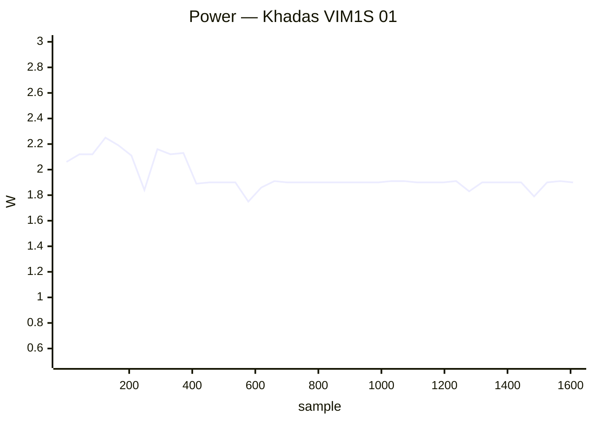
```mermaid
xychart-beta
    title "Power — Khadas VIM1S 01"
    x-axis "sample" 1 --> 1608
    y-axis "W" 0.5 --> 3.0
    line [2.06, 2.12, 2.12, 2.25, 2.19, 2.11, 1.84, 2.16, 2.12, 2.13, 1.89, 1.90, 1.90, 1.90, 1.75, 1.86, 1.91, 1.90, 1.90, 1.90, 1.90, 1.90, 1.90, 1.90, 1.90, 1.91, 1.91, 1.90, 1.90, 1.90, 1.91, 1.83, 1.90, 1.90, 1.90, 1.90, 1.79, 1.90, 1.91, 1.90]
```

### ❌ NanoPi K2 01

`nanopik2-s905` · **inplace** · image `26.11.0-trunk.62` · 14 ✅ · 1 ❌ · 1 ⏭️

| Module | Status | Time | Detail |
|:--|:--:|--:|:--|
| upgrade | ⏭️ | 14.2 s | — |
| reboot | ✅ | 44.7 s | warm · up 29 s |
| kernel-switch | ✅ | 38.8 s | branch=current · family=meson64 · installed=26.11.0-trunk.62 · boot_image=/boot/vmlinuz-6.18.54-current-meson64 · kernel_before=6.18.54-current-meson64 |
| reboot | ✅ | 129.6 s | warm · 4/4 boots · up 19 s |
| hw-performance | ✅ | 30.9 s | AES 51 · mem 3700 · disk W 10 / R 1 MB/s · 63 °C · 2016 MHz |
| dvfs | ✅ | 21.3 s | ondemand · 500–1536 MHz (peak 1536) |
| network-iperf | ✅ | 71.5 s | end0 ↑934/↓941 (1GE) · wlan0 ↑15/↓28 (Wi-Fi 4) Mbps |
| store-versions | ✅ | 4.9 s | 26.11.0-trunk.62 · 6.18.54-current-meson64 |
| kernel-switch | ❌ | 24.6 s | branch=edge · phase=install · dpkg_state=absent |
| reboot | ✅ | 130.6 s | warm · 4/4 boots · up 19 s |
| hw-performance | ✅ | 30.9 s | AES 51 · mem 3800 · disk W 10 / R 1 MB/s · 65 °C · 2016 MHz |
| dvfs | ✅ | 21.2 s | ondemand · 500–1536 MHz (peak 1536) |
| network-iperf | ✅ | 71.7 s | end0 ↑934/↓941 (1GE) · wlan0 ↑10/↓29 (Wi-Fi 4) Mbps |
| store-versions | ✅ | 4.7 s | 26.11.0-trunk.62 · 6.18.54-current-meson64 |
| kernel-switch | ✅ | 38.7 s | branch=current · family=meson64 · installed=26.11.0-trunk.62 · boot_image=/boot/vmlinuz-6.18.54-current-meson64 · kernel_before=6.18.54-current-meson64 |
| reboot | ✅ | 35.4 s | warm · up 19 s |

### ❌ NanoPi M4V2 01

`nanopim4v2` · **inplace** · image `26.11.0-trunk.62` · 14 ✅ · 1 ❌ · 1 ⏭️

| Module | Status | Time | Detail |
|:--|:--:|--:|:--|
| upgrade | ⏭️ | 12.8 s | — |
| reboot | ✅ | 60.5 s | power-cycle · up 29 s |
| kernel-switch | ✅ | 28.8 s | branch=current · family=rockchip64 · installed=26.11.0-trunk.62 · boot_image=/boot/vmlinuz-6.18.54-current-rockchip64 · kernel_before=6.18.54-current-rockchip64 |
| reboot | ✅ | 164.6 s | power-cycle · 4/4 boots · up 25 s |
| hw-performance | ✅ | 21.9 s | AES 1020 · mem 6600 · disk W 54 / R 45 MB/s · 47.5 °C · 1416 MHz |
| dvfs | ✅ | 20.0 s | ondemand · 408–1416 MHz (peak 1800) |
| network-iperf | ✅ | 125.1 s | end0 ↑939/↓870 (1GE) · wlan0 ↑172/↓141 (Wi-Fi 5) · wlx803f5d16af63 ↑81/↓137 (Wi-Fi 5) Mbps |
| store-versions | ✅ | 5.0 s | 26.11.0-trunk.62 · 6.18.54-current-rockchip64 |
| kernel-switch | ❌ | 18.2 s | branch=edge · phase=install · dpkg_state=absent |
| reboot | ✅ | 170.8 s | power-cycle · 4/4 boots · up 28 s |
| hw-performance | ✅ | 21.5 s | AES 1021 · mem 6600 · disk W 52 / R 55 MB/s · 48.1 °C · 1416 MHz |
| dvfs | ✅ | 20.7 s | ondemand · 408–1416 MHz (peak 1800) |
| network-iperf | ✅ | 90.3 s | end0 ↑939/↓939 (1GE) · wlan0 ↑144/↓156 (Wi-Fi 5) · wlx803f5d16af63 ↑62/↓130 (Wi-Fi 5) Mbps |
| store-versions | ✅ | 4.6 s | 26.11.0-trunk.62 · 6.18.54-current-rockchip64 |
| kernel-switch | ✅ | 30.5 s | branch=current · family=rockchip64 · installed=26.11.0-trunk.62 · boot_image=/boot/vmlinuz-6.18.54-current-rockchip64 · kernel_before=6.18.54-current-rockchip64 |
| reboot | ✅ | 56.3 s | power-cycle · up 25 s |

**Power** — min 1.20 W · avg 6.99 W · peak 12.40 W · 674 samples

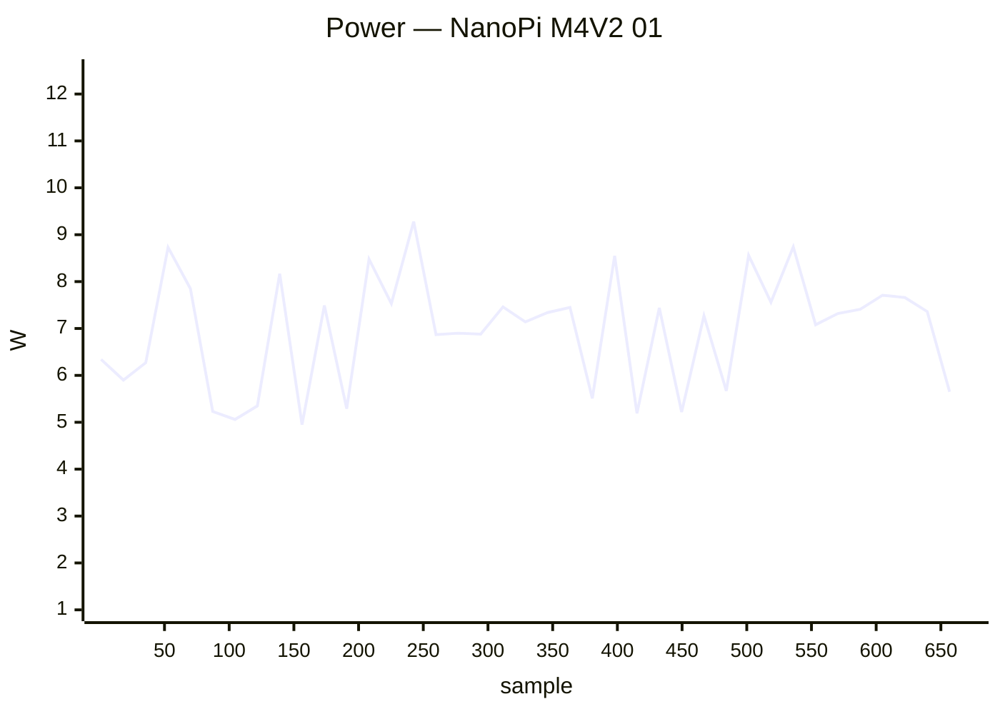
```mermaid
xychart-beta
    title "Power — NanoPi M4V2 01"
    x-axis "sample" 1 --> 674
    y-axis "W" 1.0 --> 12.5
    line [6.34, 5.90, 6.27, 8.73, 7.85, 5.23, 5.06, 5.35, 8.17, 4.95, 7.49, 5.29, 8.48, 7.53, 9.28, 6.87, 6.90, 6.88, 7.46, 7.14, 7.34, 7.45, 5.51, 8.55, 5.19, 7.44, 5.22, 7.27, 5.67, 8.56, 7.56, 8.74, 7.08, 7.32, 7.41, 7.71, 7.66, 7.36, 5.65, 7.65]
```

### ❌ NanoPi M6 01

`nanopi-m6` · **inplace** · image `26.11.0-trunk.62` · 19 ✅ · 2 ❌ · 1 ⏭️

| Module | Status | Time | Detail |
|:--|:--:|--:|:--|
| upgrade | ⏭️ | 8.1 s | — |
| reboot | ✅ | 53.5 s | power-cycle · up 23 s |
| kernel-switch | ✅ | 21.1 s | branch=vendor · family=rk35xx · installed=26.11.0-trunk.62 · boot_image=/boot/vmlinuz-6.1.172-vendor-rk35xx · kernel_before=6.1.172-vendor-rk35xx |
| reboot | ✅ | 137.4 s | power-cycle · 4/4 boots · up 23 s |
| hw-performance | ✅ | 17.7 s | AES 1269 · mem 14100 · disk W 52 / R 75 MB/s · 47.2 °C · 1800 MHz |
| dvfs | ✅ | 16.5 s | ondemand · 1800–1800 MHz (peak 2256) |
| network-iperf | ✅ | 72.1 s | lan ↑928/↓852 (1GE) · wlP3p49s0 ↑180/↓142 (Wi-Fi 5) Mbps |
| store-versions | ✅ | 4.2 s | 26.11.0-trunk.62 · 6.1.172-vendor-rk35xx |
| kernel-switch | ❌ | 13.4 s | branch=current · phase=install · dpkg_state=absent |
| reboot | ✅ | 130.0 s | power-cycle · 4/4 boots · up 23 s |
| hw-performance | ✅ | 17.7 s | AES 1269 · mem 15100 · disk W 52 / R 77 MB/s · 48.1 °C · 1800 MHz |
| dvfs | ✅ | 17.4 s | ondemand · 1800–1800 MHz (peak 2256) |
| network-iperf | ✅ | 55.1 s | lan ↑937/↓931 (1GE) · wlP3p49s0 ↑256/↓277 (Wi-Fi 5) Mbps |
| store-versions | ✅ | 4.1 s | 26.11.0-trunk.62 · 6.1.172-vendor-rk35xx |
| kernel-switch | ❌ | 13.2 s | branch=edge · phase=install · dpkg_state=absent |
| reboot | ✅ | 129.0 s | power-cycle · 4/4 boots · up 23 s |
| hw-performance | ✅ | 18.4 s | AES 1268 · mem 14100 · disk W 51 / R 77 MB/s · 49 °C · 1800 MHz |
| dvfs | ✅ | 16.7 s | ondemand · 1800–1800 MHz (peak 2256) |
| network-iperf | ✅ | 59.5 s | lan ↑938/↓938 (1GE) · wlP3p49s0 ↑129/↓268 (Wi-Fi 5) Mbps |
| store-versions | ✅ | 3.9 s | 26.11.0-trunk.62 · 6.1.172-vendor-rk35xx |
| kernel-switch | ✅ | 20.8 s | branch=vendor · family=rk35xx · installed=26.11.0-trunk.62 · boot_image=/boot/vmlinuz-6.1.172-vendor-rk35xx · kernel_before=6.1.172-vendor-rk35xx |
| reboot | ✅ | 48.0 s | power-cycle · up 21 s |

**Power** — min 0.90 W · avg 3.67 W · peak 9.50 W · 685 samples

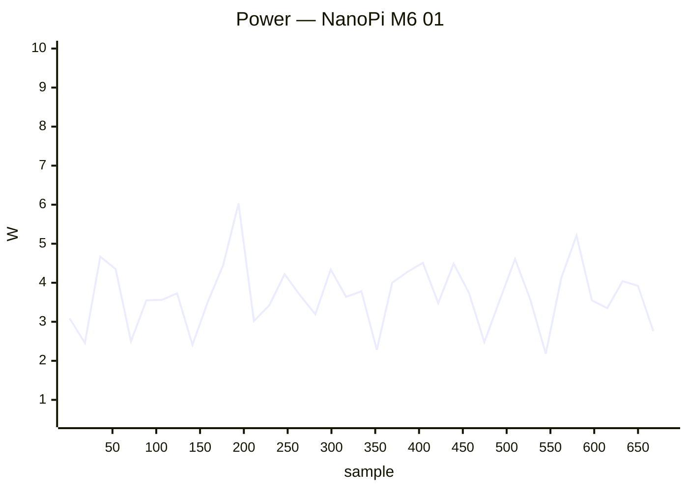
```mermaid
xychart-beta
    title "Power — NanoPi M6 01"
    x-axis "sample" 1 --> 685
    y-axis "W" 0.5 --> 10.0
    line [3.09, 2.46, 4.67, 4.35, 2.50, 3.55, 3.56, 3.73, 2.41, 3.51, 4.45, 6.03, 3.02, 3.42, 4.22, 3.68, 3.19, 4.34, 3.64, 3.78, 2.28, 4.00, 4.28, 4.51, 3.48, 4.49, 3.74, 2.48, 3.55, 4.61, 3.56, 2.18, 4.11, 5.21, 3.55, 3.35, 4.04, 3.92, 2.76, 3.13]
```

### ❌ NanoPi Neo 2 Black 01

`nanopineo2black` · **inplace** · image `26.11.0-trunk.62` · 13 ✅ · 2 ❌ · 1 ⏭️

| Module | Status | Time | Detail |
|:--|:--:|--:|:--|
| upgrade | ⏭️ | 15.8 s | — |
| reboot | ✅ | 54.7 s | power-cycle · up 23 s |
| kernel-switch | ❌ | 22.9 s | branch=current · phase=install · dpkg_state=absent |
| reboot | ✅ | 591.0 s | power-cycle · 2/4 boots · up 22 s |
| hw-performance | ✅ | 32.2 s | AES 638 · mem 3500 · disk W 18 / R 0 MB/s · 59 °C · 1368 MHz |
| dvfs | ✅ | 24.2 s | ondemand · 480–1368 MHz (peak 1368) |
| network-iperf | ✅ | 31.8 s | end0 ↑824/↓727 (1GE) Mbps |
| store-versions | ✅ | 5.2 s | 26.11.0-trunk.62 · 7.2.8-edge-sunxi64 |
| kernel-switch | ✅ | 41.7 s | branch=edge · family=sunxi64 · installed=26.11.0-trunk.62 · boot_image=/boot/vmlinuz-7.2.8-edge-sunxi64 · kernel_before=7.2.8-edge-sunxi64 |
| reboot | ✅ | 819.2 s | power-cycle · 1/4 boots · up 21 s |
| hw-performance | ✅ | 31.3 s | AES 638 · mem 3500 · disk W 16 / R 0 MB/s · 63.9 °C · 1368 MHz |
| dvfs | ✅ | 24.1 s | ondemand · 480–1368 MHz (peak 1368) |
| network-iperf | ✅ | 32.0 s | end0 ↑648/↓584 (1GE) Mbps |
| store-versions | ✅ | 5.5 s | 26.11.0-trunk.62 · 7.2.8-edge-sunxi64 |
| kernel-switch | ❌ | 24.1 s | branch=current · phase=install · dpkg_state=absent |
| reboot | ✅ | 54.3 s | power-cycle · up 23 s |

**Power** — min 0.80 W · avg 2.18 W · peak 5.20 W · 1422 samples

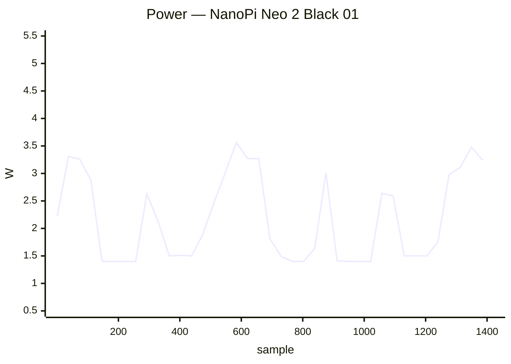
```mermaid
xychart-beta
    title "Power — NanoPi Neo 2 Black 01"
    x-axis "sample" 1 --> 1422
    y-axis "W" 0.5 --> 5.5
    line [2.22, 3.31, 3.26, 2.88, 1.40, 1.40, 1.40, 1.40, 2.63, 2.13, 1.50, 1.51, 1.50, 1.89, 2.47, 3.01, 3.56, 3.27, 3.27, 1.81, 1.49, 1.40, 1.40, 1.64, 3.01, 1.41, 1.40, 1.40, 1.40, 2.64, 2.59, 1.50, 1.50, 1.50, 1.75, 2.98, 3.11, 3.48, 3.24, 2.38]
```

### ❌ NanoPi Neo 3 01

`nanopineo3` · **inplace** · image `26.11.0-trunk.62` · 14 ✅ · 1 ❌ · 1 ⏭️

| Module | Status | Time | Detail |
|:--|:--:|--:|:--|
| upgrade | ⏭️ | 21.1 s | — |
| reboot | ✅ | 54.8 s | power-cycle · up 26 s |
| kernel-switch | ✅ | 55.9 s | branch=current · family=rockchip64 · installed=26.11.0-trunk.62 · boot_image=/boot/vmlinuz-6.18.54-current-rockchip64 · kernel_before=6.18.54-current-rockchip64 |
| reboot | ✅ | 165.6 s | power-cycle · 4/4 boots · up 25 s |
| hw-performance | ✅ | 28.5 s | AES 593 · mem 2400 · disk W 1 / R 63 MB/s · 78.5 °C · 1296 MHz |
| dvfs | ✅ | 31.1 s | ondemand · 408–1296 MHz (peak 1296) |
| network-iperf | ✅ | 81.9 s | end0 ↑920/↓941 (1GE) · wlx7cdd905518f9 ↑37/↓29 (Wi-Fi 4) Mbps |
| store-versions | ✅ | 6.6 s | 26.11.0-trunk.62 · 6.18.54-current-rockchip64 |
| kernel-switch | ❌ | 31.6 s | branch=edge · phase=install · dpkg_state=absent |
| reboot | ✅ | 168.9 s | power-cycle · 4/4 boots · up 26 s |
| hw-performance | ✅ | 28.3 s | AES 588 · mem 2400 · disk W 52 / R 63 MB/s · 81.2 °C · 1296 MHz |
| dvfs | ✅ | 30.1 s | ondemand · 408–1296 MHz (peak 1296) |
| network-iperf | ✅ | 77.2 s | end0 ↑908/↓941 (1GE) · wlx7cdd905518f9 ↑34/↓30 (Wi-Fi 4) Mbps |
| store-versions | ✅ | 6.7 s | 26.11.0-trunk.62 · 6.18.54-current-rockchip64 |
| kernel-switch | ✅ | 55.7 s | branch=current · family=rockchip64 · installed=26.11.0-trunk.62 · boot_image=/boot/vmlinuz-6.18.54-current-rockchip64 · kernel_before=6.18.54-current-rockchip64 |
| reboot | ✅ | 54.3 s | power-cycle · up 25 s |

### ❌ NanoPi R6S 01

`nanopi-r6s` · **inplace** · image `26.11.0-trunk.62` · 19 ✅ · 2 ❌ · 1 ⏭️

| Module | Status | Time | Detail |
|:--|:--:|--:|:--|
| upgrade | ⏭️ | 8.7 s | — |
| reboot | ✅ | 42.4 s | power-cycle · up 17 s |
| kernel-switch | ✅ | 18.9 s | branch=vendor · family=rk35xx · installed=26.11.0-trunk.62 · boot_image=/boot/vmlinuz-6.1.172-vendor-rk35xx · kernel_before=6.1.172-vendor-rk35xx |
| reboot | ✅ | 102.1 s | power-cycle · 4/4 boots · up 16 s |
| hw-performance | ✅ | 14.1 s | AES 1328 · mem 15400 · disk W 206 / R 274 MB/s · 37.9 °C · 1800 MHz |
| dvfs | ✅ | 17.0 s | ondemand · 1800–1800 MHz (peak 2352) |
| network-iperf | ✅ | 31.3 s | lan2 ↑923/↓938 (1GE) Mbps |
| store-versions | ✅ | 4.1 s | 26.11.0-trunk.62 · 6.1.172-vendor-rk35xx |
| kernel-switch | ❌ | 11.0 s | branch=current · phase=install · dpkg_state=absent |
| reboot | ✅ | 105.0 s | power-cycle · 4/4 boots · up 15 s |
| hw-performance | ✅ | 14.5 s | AES 1278 · mem 15900 · disk W 212 / R 274 MB/s · 37.9 °C · 1800 MHz |
| dvfs | ✅ | 17.2 s | ondemand · 1800–1800 MHz (peak 2352) |
| network-iperf | ✅ | 28.3 s | lan2 ↑635/↓792 (1GE) Mbps |
| store-versions | ✅ | 4.0 s | 26.11.0-trunk.62 · 6.1.172-vendor-rk35xx |
| kernel-switch | ❌ | 10.5 s | branch=edge · phase=install · dpkg_state=absent |
| reboot | ✅ | 94.1 s | power-cycle · 4/4 boots · up 11 s |
| hw-performance | ✅ | 14.3 s | AES 1278 · mem 14100 · disk W 212 / R 274 MB/s · 38.8 °C · 1800 MHz |
| dvfs | ✅ | 17.9 s | ondemand · 1800–1800 MHz (peak 2352) |
| network-iperf | ✅ | 30.6 s | lan2 ↑729/↓829 (1GE) Mbps |
| store-versions | ✅ | 4.0 s | 26.11.0-trunk.62 · 6.1.172-vendor-rk35xx |
| kernel-switch | ✅ | 19.1 s | branch=vendor · family=rk35xx · installed=26.11.0-trunk.62 · boot_image=/boot/vmlinuz-6.1.172-vendor-rk35xx · kernel_before=6.1.172-vendor-rk35xx |
| reboot | ✅ | 49.9 s | power-cycle · up 18 s |

**Power** — min 0.90 W · avg 4.27 W · peak 9.70 W · 511 samples

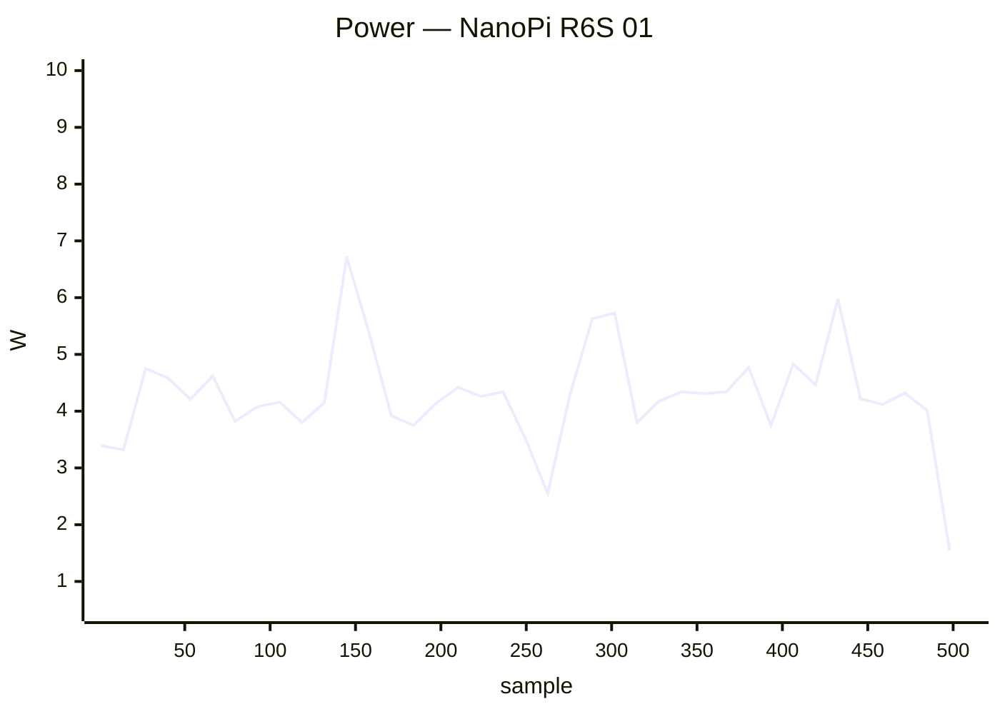
```mermaid
xychart-beta
    title "Power — NanoPi R6S 01"
    x-axis "sample" 1 --> 511
    y-axis "W" 0.5 --> 10.0
    line [3.39, 3.32, 4.75, 4.58, 4.21, 4.62, 3.82, 4.08, 4.16, 3.80, 4.15, 6.72, 5.38, 3.92, 3.75, 4.14, 4.42, 4.26, 4.34, 3.52, 2.55, 4.29, 5.63, 5.73, 3.80, 4.18, 4.34, 4.31, 4.34, 4.77, 3.75, 4.83, 4.46, 5.98, 4.22, 4.12, 4.32, 4.01, 1.55, 4.16]
```

### ❌ NanoPi R76S 01

`nanopi-r76s` · **inplace** · image `26.11.0-trunk.57` · 14 ✅ · 1 ❌ · 1 ⏭️

| Module | Status | Time | Detail |
|:--|:--:|--:|:--|
| upgrade | ⏭️ | 12.2 s | — |
| reboot | ✅ | 68.7 s | power-cycle · up 26 s |
| kernel-switch | ✅ | 28.6 s | branch=vendor · family=rk35xx · installed=26.11.0-trunk.62 · boot_image=/boot/vmlinuz-6.1.172-vendor-rk35xx · kernel_before=6.1.172-vendor-rk35xx |
| reboot | ✅ | 188.3 s | power-cycle · 4/4 boots · up 30 s |
| hw-performance | ✅ | 23.9 s | AES 1274 · mem 7400 · disk W 13 / R 77 MB/s · 42.5 °C · 2016 MHz |
| dvfs | ✅ | 21.2 s | ondemand · 2016–2016 MHz (peak 2208) |
| network-iperf | ✅ | 118.7 s | end0 ↑906/↓862 (1GE) · end1 ↑744/↓715 (1GE) · wlan0 ↑39/↓88 (Wi-Fi 5) · wlxe0e1a933de37 ↑195/↓194 (Wi-Fi 5) Mbps |
| store-versions | ✅ | 4.6 s | 26.11.0-trunk.57 · 6.1.172-vendor-rk35xx |
| kernel-switch | ❌ | 20.4 s | branch=edge · phase=install · dpkg_state=absent |
| reboot | ✅ | 174.0 s | power-cycle · 4/4 boots · up 30 s |
| hw-performance | ✅ | 20.7 s | AES 1274 · mem 7600 · disk W 62 / R 77 MB/s · 43.5 °C · 2016 MHz |
| dvfs | ✅ | 21.4 s | ondemand · 2016–2016 MHz (peak 2208) |
| network-iperf | ✅ | 139.6 s | end0 ↑939/↓939 (1GE) · end1 ↑747/↓812 (1GE) · wlan0 ↑44/↓61 (Wi-Fi 5) · wlxe0e1a933de37 ↑125/↓178 (Wi-Fi 5) Mbps |
| store-versions | ✅ | 4.7 s | 26.11.0-trunk.57 · 6.1.172-vendor-rk35xx |
| kernel-switch | ✅ | 25.0 s | branch=vendor · family=rk35xx · installed=26.11.0-trunk.62 · boot_image=/boot/vmlinuz-6.1.172-vendor-rk35xx · kernel_before=6.1.172-vendor-rk35xx |
| reboot | ✅ | 69.7 s | power-cycle · up 26 s |

**Power** — min 1.70 W · avg 3.63 W · peak 7.60 W · 731 samples

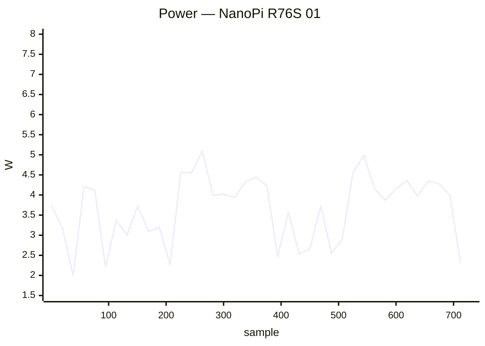
```mermaid
xychart-beta
    title "Power — NanoPi R76S 01"
    x-axis "sample" 1 --> 731
    y-axis "W" 1.5 --> 8.0
    line [3.73, 3.18, 1.99, 4.21, 4.12, 2.21, 3.36, 3.01, 3.73, 3.09, 3.20, 2.27, 4.57, 4.55, 5.09, 3.99, 4.02, 3.94, 4.33, 4.44, 4.23, 2.47, 3.57, 2.53, 2.66, 3.73, 2.55, 2.90, 4.56, 4.99, 4.16, 3.87, 4.15, 4.36, 3.98, 4.35, 4.28, 4.00, 2.30, 2.48]
```

### ❌ Odroid C2 01

`odroidc2` · **inplace** · image `26.11.0-trunk.62` · 14 ✅ · 1 ❌ · 1 ⏭️

| Module | Status | Time | Detail |
|:--|:--:|--:|:--|
| upgrade | ⏭️ | 14.1 s | — |
| reboot | ✅ | 33.4 s | warm · up 16 s |
| kernel-switch | ✅ | 36.5 s | branch=current · family=meson64 · installed=26.11.0-trunk.62 · boot_image=/boot/vmlinuz-6.18.54-current-meson64 · kernel_before=6.18.54-current-meson64 |
| reboot | ✅ | 117.9 s | warm · 4/4 boots · up 17 s |
| hw-performance | ✅ | 22.3 s | AES 51 · mem 3500 · disk W 33 / R 142 MB/s · 49 °C · 1536 MHz |
| dvfs | ✅ | 21.9 s | ondemand · 500–1536 MHz (peak 1536) |
| network-iperf | ✅ | 32.0 s | end0 ↑940/↓941 (1GE) Mbps |
| store-versions | ✅ | 5.6 s | 26.11.0-trunk.62 · 6.18.54-current-meson64 |
| kernel-switch | ❌ | 21.8 s | branch=edge · phase=install · dpkg_state=absent |
| reboot | ✅ | 117.5 s | warm · 4/4 boots · up 17 s |
| hw-performance | ✅ | 22.5 s | AES 51 · mem 3400 · disk W 33 / R 143 MB/s · 49 °C · 1536 MHz |
| dvfs | ✅ | 22.2 s | ondemand · 500–1536 MHz (peak 1536) |
| network-iperf | ✅ | 36.7 s | end0 ↑939/↓941 (1GE) Mbps |
| store-versions | ✅ | 5.9 s | 26.11.0-trunk.62 · 6.18.54-current-meson64 |
| kernel-switch | ✅ | 36.8 s | branch=current · family=meson64 · installed=26.11.0-trunk.62 · boot_image=/boot/vmlinuz-6.18.54-current-meson64 · kernel_before=6.18.54-current-meson64 |
| reboot | ✅ | 34.2 s | warm · up 16 s |

### ❌ Odroid C4 01

`odroidc4` · **inplace** · image `26.11.0-trunk.62` · 14 ✅ · 1 ❌ · 1 ⏭️

| Module | Status | Time | Detail |
|:--|:--:|--:|:--|
| upgrade | ⏭️ | 11.2 s | — |
| reboot | ✅ | 49.6 s | power-cycle · up 17 s |
| kernel-switch | ✅ | 29.2 s | branch=current · family=meson64 · installed=26.11.0-trunk.62 · boot_image=/boot/vmlinuz-6.18.54-current-meson64 · kernel_before=6.18.54-current-meson64 |
| reboot | ✅ | 128.2 s | power-cycle · 4/4 boots · up 17 s |
| hw-performance | ✅ | 25.1 s | AES 980 · mem 5200 · disk W 30 / R 76 MB/s · 41.9 °C · 2100 MHz |
| dvfs | ✅ | 19.1 s | ondemand · 1000–2100 MHz (peak 2100) |
| network-iperf | ✅ | 62.8 s | end0 ↑881/↓862 (1GE) · wlx24050fdd332b ↑100/↓93 (Wi-Fi 4) Mbps |
| store-versions | ✅ | 4.3 s | 26.11.0-trunk.62 · 6.18.54-current-meson64 |
| kernel-switch | ❌ | 18.0 s | branch=edge · phase=install · dpkg_state=absent |
| reboot | ✅ | 130.2 s | power-cycle · 4/4 boots · up 18 s |
| hw-performance | ✅ | 21.7 s | AES 980 · mem 5200 · disk W 30 / R 78 MB/s · 42.8 °C · 2100 MHz |
| dvfs | ✅ | 19.3 s | ondemand · 1000–2100 MHz (peak 2100) |
| network-iperf | ✅ | 63.2 s | end0 ↑905/↓915 (1GE) · wlx24050fdd332b ↑115/↓131 (Wi-Fi 4) Mbps |
| store-versions | ✅ | 4.4 s | 26.11.0-trunk.62 · 6.18.54-current-meson64 |
| kernel-switch | ✅ | 29.3 s | branch=current · family=meson64 · installed=26.11.0-trunk.62 · boot_image=/boot/vmlinuz-6.18.54-current-meson64 · kernel_before=6.18.54-current-meson64 |
| reboot | ✅ | 47.8 s | power-cycle · up 17 s |

**Power** — min 0.90 W · avg 3.39 W · peak 5.10 W · 519 samples

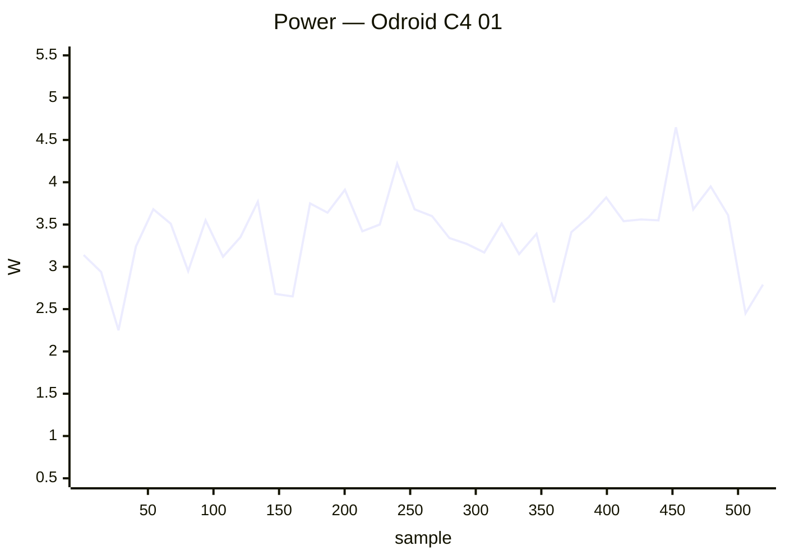
```mermaid
xychart-beta
    title "Power — Odroid C4 01"
    x-axis "sample" 1 --> 519
    y-axis "W" 0.5 --> 5.5
    line [3.14, 2.94, 2.25, 3.24, 3.68, 3.51, 2.95, 3.55, 3.12, 3.35, 3.77, 2.68, 2.65, 3.75, 3.64, 3.91, 3.42, 3.50, 4.22, 3.68, 3.60, 3.34, 3.27, 3.17, 3.51, 3.15, 3.39, 2.58, 3.41, 3.59, 3.82, 3.54, 3.56, 3.55, 4.65, 3.68, 3.95, 3.61, 2.45, 2.79]
```

### ❌ Odroid M1 01

`odroidm1` · **inplace** · image `26.11.0-trunk.62` · 14 ✅ · 1 ❌ · 1 ⏭️

| Module | Status | Time | Detail |
|:--|:--:|--:|:--|
| upgrade | ⏭️ | 13.1 s | — |
| reboot | ✅ | 59.4 s | power-cycle · up 23 s |
| kernel-switch | ✅ | 30.7 s | branch=current · family=rockchip64 · installed=26.11.0-trunk.62 · boot_image=/boot/vmlinuz-6.18.54-current-rockchip64 · kernel_before=6.18.54-current-rockchip64 |
| reboot | ✅ | 144.7 s | power-cycle · 4/4 boots · up 20 s |
| hw-performance | ✅ | 17.8 s | AES 915 · mem 5100 · disk W 1037 / R 1031 MB/s · 36.7 °C · 1992 MHz |
| dvfs | ✅ | 21.2 s | ondemand · 408–1992 MHz (peak 1992) |
| network-iperf | ✅ | 63.6 s | eth0 ↑604/↓941 (1GE) · wlx40a5eff39254 ↑189/↓108 (Wi-Fi 5) Mbps |
| store-versions | ✅ | 4.8 s | 26.11.0-trunk.62 · 6.18.54-current-rockchip64 |
| kernel-switch | ❌ | 17.7 s | branch=edge · phase=install · dpkg_state=absent |
| reboot | ✅ | 145.4 s | power-cycle · 4/4 boots · up 20 s |
| hw-performance | ✅ | 16.9 s | AES 914 · mem 5000 · disk W 1014 / R 1018 MB/s · 37.8 °C · 1992 MHz |
| dvfs | ✅ | 21.6 s | ondemand · 408–1992 MHz (peak 1992) |
| network-iperf | ✅ | 66.3 s | eth0 ↑610/↓941 (1GE) · wlx40a5eff39254 ↑189/↓137 (Wi-Fi 5) Mbps |
| store-versions | ✅ | 4.7 s | 26.11.0-trunk.62 · 6.18.54-current-rockchip64 |
| kernel-switch | ✅ | 30.5 s | branch=current · family=rockchip64 · installed=26.11.0-trunk.62 · boot_image=/boot/vmlinuz-6.18.54-current-rockchip64 · kernel_before=6.18.54-current-rockchip64 |
| reboot | ✅ | 59.3 s | power-cycle · up 23 s |

**Power** — min 1.90 W · avg 6.35 W · peak 10.60 W · 538 samples

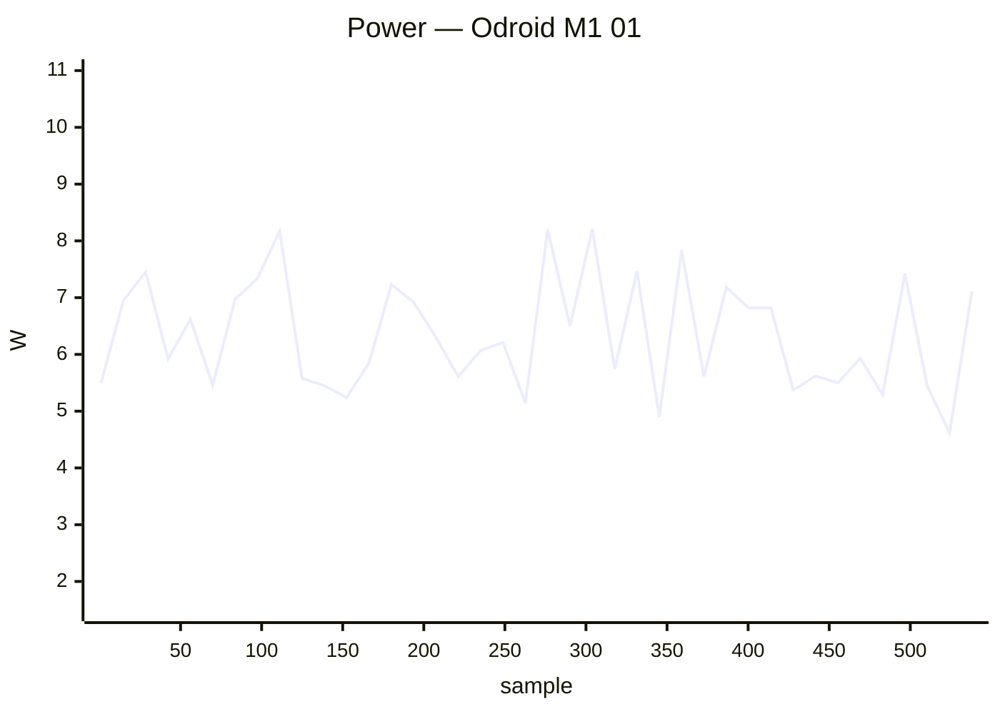
```mermaid
xychart-beta
    title "Power — Odroid M1 01"
    x-axis "sample" 1 --> 538
    y-axis "W" 1.5 --> 11.0
    line [5.50, 6.95, 7.45, 5.92, 6.62, 5.46, 6.97, 7.34, 8.17, 5.58, 5.45, 5.24, 5.85, 7.23, 6.92, 6.30, 5.61, 6.07, 6.21, 5.14, 8.20, 6.50, 8.21, 5.74, 7.46, 4.90, 7.84, 5.61, 7.18, 6.82, 6.82, 5.37, 5.62, 5.50, 5.93, 5.29, 7.42, 5.44, 4.62, 7.11]
```

### ❌ Odroid N2 01

`odroidn2` · **inplace** · image `26.11.0-trunk.62` · 14 ✅ · 1 ❌ · 1 ⏭️

| Module | Status | Time | Detail |
|:--|:--:|--:|:--|
| upgrade | ⏭️ | 9.3 s | — |
| reboot | ✅ | 58.9 s | power-cycle · up 28 s |
| kernel-switch | ✅ | 23.3 s | branch=current · family=meson64 · installed=26.11.0-trunk.62 · boot_image=/boot/vmlinuz-6.18.54-current-meson64 · kernel_before=6.18.54-current-meson64 |
| reboot | ✅ | 171.2 s | power-cycle · 4/4 boots · up 27 s |
| hw-performance | ✅ | 18.7 s | AES 1085 · mem 4900 · disk W 27 / R 135 MB/s · 39.8 °C · 1992 MHz |
| dvfs | ✅ | 16.9 s | performance · 1000–1992 MHz (peak 1992) |
| network-iperf | ✅ | 27.5 s | end0 ↑940/↓942 (1GE) Mbps |
| store-versions | ✅ | 3.7 s | 26.11.0-trunk.62 · 6.18.54-current-meson64 |
| kernel-switch | ❌ | 14.6 s | branch=edge · phase=install · dpkg_state=absent |
| reboot | ✅ | 175.1 s | power-cycle · 4/4 boots · up 30 s |
| hw-performance | ✅ | 18.5 s | AES 1085 · mem 4900 · disk W 27 / R 138 MB/s · 40.4 °C · 1992 MHz |
| dvfs | ✅ | 17.3 s | performance · 1000–1992 MHz (peak 1992) |
| network-iperf | ✅ | 27.7 s | end0 ↑940/↓941 (1GE) Mbps |
| store-versions | ✅ | 4.6 s | 26.11.0-trunk.62 · 6.18.54-current-meson64 |
| kernel-switch | ✅ | 21.5 s | branch=current · family=meson64 · installed=26.11.0-trunk.62 · boot_image=/boot/vmlinuz-6.18.54-current-meson64 · kernel_before=6.18.54-current-meson64 |
| reboot | ✅ | 58.8 s | power-cycle · up 24 s |

**Power** — min 1.00 W · avg 4.56 W · peak 10.90 W · 516 samples

```mermaid
xychart-beta
    title "Power — Odroid N2 01"
    x-axis "sample" 1 --> 516
    y-axis "W" 0.5 --> 11.0
    line [4.53, 4.07, 3.12, 4.98, 5.83, 4.95, 3.08, 5.63, 3.40, 4.50, 4.52, 3.52, 5.15, 4.15, 3.96, 5.33, 6.45, 6.65, 4.46, 4.40, 4.42, 3.60, 5.55, 3.89, 3.84, 5.33, 3.26, 4.48, 5.20, 3.21, 4.94, 5.28, 6.92, 4.86, 4.45, 4.84, 4.72, 4.34, 2.02, 4.77]
```

### ❌ Odroid XU4 01

`odroidxu4` · **inplace** · image `26.11.0-trunk.62` · 14 ✅ · 1 ❌ · 1 ⏭️

| Module | Status | Time | Detail |
|:--|:--:|--:|:--|
| upgrade | ⏭️ | 17.0 s | — |
| reboot | ✅ | 59.9 s | power-cycle · up 32 s |
| kernel-switch | ✅ | 38.1 s | branch=current · family=odroidxu4 · installed=26.11.0-trunk.62 · boot_image=/boot/vmlinuz-6.6.155-current-odroidxu4 · kernel_before=6.6.155-current-odroidxu4 |
| reboot | ✅ | 176.6 s | power-cycle · 4/4 boots · up 29 s |
| hw-performance | ✅ | 35.0 s | AES 68 · mem 5300 · disk W 1 / R 61 MB/s · 63 °C · 1400 MHz |
| dvfs | ✅ | 31.2 s | ondemand · 600–1400 MHz (peak 2000) |
| network-iperf | ✅ | 45.2 s | end0 ↑923/↓941 (1GE) Mbps |
| store-versions | ✅ | 6.4 s | 26.11.0-trunk.62 · 6.6.155-current-odroidxu4 |
| kernel-switch | ❌ | 26.5 s | branch=edge · phase=install · dpkg_state=absent |
| reboot | ✅ | 174.0 s | power-cycle · 4/4 boots · up 28 s |
| hw-performance | ✅ | 36.7 s | AES 65 · mem 4000 · disk W 1 / R 60 MB/s · 67 °C · 1400 MHz |
| dvfs | ✅ | 31.8 s | ondemand · 600–1400 MHz (peak 2000) |
| network-iperf | ✅ | 42.5 s | end0 ↑923/↓941 (1GE) Mbps |
| store-versions | ✅ | 7.1 s | 26.11.0-trunk.62 · 6.6.155-current-odroidxu4 |
| kernel-switch | ✅ | 38.8 s | branch=current · family=odroidxu4 · installed=26.11.0-trunk.62 · boot_image=/boot/vmlinuz-6.6.155-current-odroidxu4 · kernel_before=6.6.155-current-odroidxu4 |
| reboot | ✅ | 57.1 s | power-cycle · up 29 s |

### ❌ Orange Pi 5 01

`orangepi5` · **inplace** · image `26.8.3` · 0 ✅ · 1 ❌ · 0 ⏭️

| Module | Status | Time | Detail |
|:--|:--:|--:|:--|
| reachable | ❌ | 0.0 s | ip=10.0.50.46 · reachable=False · port=22 |

### ❌ Orange Pi 5 Plus 01

`orangepi5-plus` · **inplace** · image `26.11.0-trunk.62` · 17 ✅ · 4 ❌ · 1 ⏭️

| Module | Status | Time | Detail |
|:--|:--:|--:|:--|
| upgrade | ⏭️ | 9.6 s | — |
| reboot | ✅ | 62.7 s | power-cycle · up 37 s |
| kernel-switch | ✅ | 20.9 s | branch=vendor · family=rk35xx · installed=26.11.0-trunk.62 · boot_image=/boot/vmlinuz-6.1.172-vendor-rk35xx · kernel_before=6.1.172-vendor-rk35xx |
| reboot | ✅ | 157.1 s | power-cycle · 4/4 boots · up 25 s |
| hw-performance | ✅ | 17.7 s | AES 1252 · mem 15300 · disk W 54 / R 62 MB/s · 59.2 °C · 1800 MHz |
| dvfs | ✅ | 16.3 s | ondemand · 1800–1800 MHz (peak 2256) |
| network-iperf | ❌ | 138.4 s | enP3p49s0 ↑941/↓0 (1GE) · wlxe0e1a9380c53 ↑0/↓359 (Wi-Fi 6) Mbps |
| store-versions | ✅ | 3.7 s | 26.11.0-trunk.62 · 6.1.172-vendor-rk35xx |
| kernel-switch | ❌ | 11.8 s | branch=current · phase=install · dpkg_state=absent |
| reboot | ✅ | 157.6 s | power-cycle · 4/4 boots · up 26 s |
| hw-performance | ✅ | 18.2 s | AES 1262 · mem 13900 · disk W 54 / R 62 MB/s · 59.2 °C · 1800 MHz |
| dvfs | ✅ | 16.4 s | ondemand · 1800–1800 MHz (peak 2256) |
| network-iperf | ✅ | 55.5 s | enP3p49s0 ↑941/↓940 (1GE) · wlxe0e1a9380c53 ↑677/↓439 (Wi-Fi 6) Mbps |
| store-versions | ✅ | 3.9 s | 26.11.0-trunk.62 · 6.1.172-vendor-rk35xx |
| kernel-switch | ❌ | 12.0 s | branch=edge · phase=install · dpkg_state=absent |
| reboot | ✅ | 159.5 s | power-cycle · 4/4 boots · up 26 s |
| hw-performance | ✅ | 17.4 s | AES 1251 · mem 15200 · disk W 54 / R 62 MB/s · 60.1 °C · 1800 MHz |
| dvfs | ✅ | 16.3 s | ondemand · 1800–1800 MHz (peak 2256) |
| network-iperf | ❌ | 125.0 s | enP3p49s0 ↑941/↓0 (1GE) · wlxe0e1a9380c53 ↑638/↓444 (Wi-Fi 6) Mbps |
| store-versions | ✅ | 3.6 s | 26.11.0-trunk.62 · 6.1.172-vendor-rk35xx |
| kernel-switch | ✅ | 17.4 s | branch=vendor · family=rk35xx · installed=26.11.0-trunk.62 · boot_image=/boot/vmlinuz-6.1.172-vendor-rk35xx · kernel_before=6.1.172-vendor-rk35xx |
| reboot | ✅ | 55.5 s | power-cycle · up 28 s |

**Power** — min 0.60 W · avg 5.55 W · peak 11.80 W · 866 samples

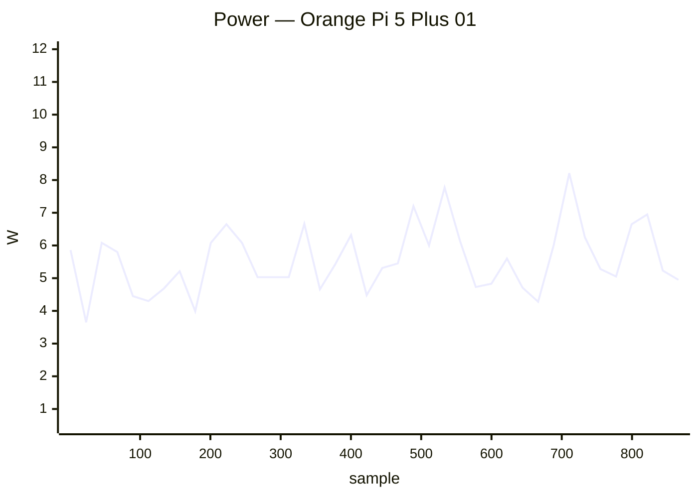
```mermaid
xychart-beta
    title "Power — Orange Pi 5 Plus 01"
    x-axis "sample" 1 --> 866
    y-axis "W" 0.5 --> 12.0
    line [5.86, 3.65, 6.08, 5.80, 4.45, 4.30, 4.69, 5.21, 3.99, 6.08, 6.65, 6.08, 5.03, 5.03, 5.03, 6.66, 4.66, 5.44, 6.32, 4.48, 5.31, 5.45, 7.20, 6.00, 7.77, 6.12, 4.73, 4.83, 5.60, 4.71, 4.28, 6.01, 8.21, 6.25, 5.28, 5.05, 6.65, 6.95, 5.23, 4.95]
```

### ❌ Orange Pi Lite 2 01

`orangepilite2` · **inplace** · image `26.11.0-trunk.62` · 14 ✅ · 1 ❌ · 1 ⏭️

| Module | Status | Time | Detail |
|:--|:--:|--:|:--|
| upgrade | ⏭️ | 13.5 s | — |
| reboot | ✅ | 37.6 s | warm · up 19 s |
| kernel-switch | ✅ | 38.0 s | branch=current · family=sunxi64 · installed=26.11.0-trunk.62 · boot_image=/boot/vmlinuz-6.18.54-current-sunxi64 · kernel_before=6.18.54-current-sunxi64 |
| reboot | ✅ | 149.9 s | warm · 4/4 boots · up 24 s |
| hw-performance | ✅ | 31.0 s | AES 772 · mem 4200 · disk W 17 / R 23 MB/s · 75.1 °C · 1800 MHz |
| dvfs | ✅ | 25.8 s | ondemand · 480–1704 MHz (peak 1800) |
| network-iperf | ✅ | 46.6 s | wlan0 ↑10/↓5 (Wi-Fi 5) Mbps |
| store-versions | ✅ | 6.0 s | 26.11.0-trunk.62 · 6.18.54-current-sunxi64 |
| kernel-switch | ❌ | 21.8 s | branch=edge · phase=install · dpkg_state=absent |
| reboot | ✅ | 163.2 s | warm · 4/4 boots · up 38 s |
| hw-performance | ✅ | 31.8 s | AES 772 · mem 4400 · disk W 14 / R 23 MB/s · 75.4 °C · 1800 MHz |
| dvfs | ✅ | 26.1 s | ondemand · 480–1704 MHz (peak 1704) |
| network-iperf | ✅ | 67.4 s | wlan0 ↑5/↓20 (Wi-Fi 5) Mbps |
| store-versions | ✅ | 6.1 s | 26.11.0-trunk.62 · 6.18.54-current-sunxi64 |
| kernel-switch | ✅ | 38.4 s | branch=current · family=sunxi64 · installed=26.11.0-trunk.62 · boot_image=/boot/vmlinuz-6.18.54-current-sunxi64 · kernel_before=6.18.54-current-sunxi64 |
| reboot | ✅ | 41.8 s | warm · up 24 s |

### ❌ Orange Pi One+ 01

`orangepioneplus` · **inplace** · image `26.11.0-trunk.62` · 13 ✅ · 2 ❌ · 1 ⏭️

| Module | Status | Time | Detail |
|:--|:--:|--:|:--|
| upgrade | ⏭️ | 15.8 s | — |
| reboot | ✅ | 42.3 s | warm · up 24 s |
| kernel-switch | ❌ | 23.3 s | branch=current · phase=install · dpkg_state=absent |
| reboot | ✅ | 136.8 s | warm · 4/4 boots · up 20 s |
| hw-performance | ✅ | 29.9 s | AES 839 · mem 4600 · disk W 20 / R 23 MB/s · 63.6 °C · 1800 MHz |
| dvfs | ✅ | 23.1 s | ondemand · 480–1800 MHz (peak 1800) |
| network-iperf | ✅ | 67.5 s | end0 ↑916/↓941 (1GE) · wlx00e04c881724 ↑106/↓69 (Wi-Fi 5) Mbps |
| store-versions | ✅ | 5.0 s | 26.11.0-trunk.62 · 7.2.8-edge-sunxi64 |
| kernel-switch | ✅ | 38.8 s | branch=edge · family=sunxi64 · installed=26.11.0-trunk.62 · boot_image=/boot/vmlinuz-7.2.8-edge-sunxi64 · kernel_before=7.2.8-edge-sunxi64 |
| reboot | ✅ | 132.2 s | warm · 4/4 boots · up 20 s |
| hw-performance | ✅ | 29.7 s | AES 840 · mem 4600 · disk W 21 / R 23 MB/s · 62.8 °C · 1800 MHz |
| dvfs | ✅ | 23.3 s | ondemand · 480–1800 MHz (peak 1800) |
| network-iperf | ✅ | 65.5 s | end0 ↑914/↓941 (1GE) · wlx00e04c881724 ↑75/↓87 (Wi-Fi 5) Mbps |
| store-versions | ✅ | 5.1 s | 26.11.0-trunk.62 · 7.2.8-edge-sunxi64 |
| kernel-switch | ❌ | 22.1 s | branch=current · phase=install · dpkg_state=absent |
| reboot | ✅ | 37.0 s | warm · up 20 s |

### ❌ Orange Pi Prime 01

`orangepiprime` · **inplace** · image `26.11.0-trunk.59` · 11 ✅ · 2 ❌ · 3 ⏭️

| Module | Status | Time | Detail |
|:--|:--:|--:|:--|
| upgrade | ⏭️ | 31.2 s | — |
| reboot | ✅ | 49.8 s | warm · up 31 s |
| kernel-switch | ✅ | 63.1 s | branch=current · family=sunxi64 · installed=26.11.0-trunk.62 · boot_image=/boot/vmlinuz-6.18.54-current-sunxi64 · kernel_before=6.18.54-current-sunxi64 |
| reboot | ✅ | 186.9 s | warm · 4/4 boots · up 33 s |
| hw-performance | ✅ | 44.4 s | AES 380 · mem 2100 · disk W 21 / R 23 MB/s · 45.9 °C · None MHz |
| dvfs | ➖ | 3.2 s | no cpufreq |
| network-iperf | ✅ | 76.9 s | end0 ↑893/↓900 (1GE) · wlan0 ↑9/↓5 (Wi-Fi 4) Mbps |
| store-versions | ✅ | 7.4 s | 26.11.0-trunk.62 · 6.18.54-current-sunxi64 |
| kernel-switch | ❌ | 38.9 s | branch=edge · phase=install · dpkg_state=absent |
| reboot | ✅ | 187.4 s | warm · 4/4 boots · up 33 s |
| hw-performance | ✅ | 44.5 s | AES 380 · mem 2100 · disk W 21 / R 23 MB/s · 45.9 °C · None MHz |
| dvfs | ➖ | 3.2 s | no cpufreq |
| network-iperf | ❌ | 354.8 s | end0 ↑765/↓917 (1GE) · wlan0 ↑0/↓0 (Wi-Fi 4) Mbps |
| store-versions | ✅ | 7.3 s | 26.11.0-trunk.62 · 6.18.54-current-sunxi64 |
| kernel-switch | ✅ | 59.0 s | branch=current · family=sunxi64 · installed=26.11.0-trunk.62 · boot_image=/boot/vmlinuz-6.18.54-current-sunxi64 · kernel_before=6.18.54-current-sunxi64 |
| reboot | ✅ | 48.8 s | warm · up 31 s |

### ❌ Orange Pi Zero2 01

`orangepizero2` · **inplace** · image `26.11.0-trunk.62` · 14 ✅ · 1 ❌ · 1 ⏭️

| Module | Status | Time | Detail |
|:--|:--:|--:|:--|
| upgrade | ⏭️ | 45.5 s | — |
| reboot | ✅ | 44.0 s | warm · up 25 s |
| kernel-switch | ✅ | 67.6 s | branch=current · family=sunxi64 · installed=26.11.0-trunk.62 · boot_image=/boot/vmlinuz-6.18.54-current-sunxi64 · kernel_before=6.18.54-current-sunxi64 |
| reboot | ✅ | 148.0 s | warm · 4/4 boots · up 22 s |
| hw-performance | ✅ | 32.5 s | AES 696 · mem 3000 · disk W 21 / R 23 MB/s · 66.5 °C · 1512 MHz |
| dvfs | ✅ | 26.0 s | ondemand · 480–1512 MHz (peak 1512) |
| network-iperf | ✅ | 63.6 s | end0 ↑873/↓938 (1GE) · wlx7c023a625db1 ↑35/↓39 (Wi-Fi 5) Mbps |
| store-versions | ✅ | 5.8 s | 26.11.0-trunk.62 · 6.18.54-current-sunxi64 |
| kernel-switch | ❌ | 51.4 s | branch=edge · phase=install · dpkg_state=absent |
| reboot | ✅ | 150.6 s | warm · 4/4 boots · up 24 s |
| hw-performance | ✅ | 32.5 s | AES 704 · mem 3000 · disk W 21 / R 23 MB/s · 66.7 °C · 1512 MHz |
| dvfs | ✅ | 25.9 s | ondemand · 480–1512 MHz (peak 1512) |
| network-iperf | ✅ | 176.4 s | end0 ↑864/↓895 (1GE) · wlx7c023a625db1 ↑27/↓29 (Wi-Fi 5) Mbps |
| store-versions | ✅ | 6.0 s | 26.11.0-trunk.62 · 6.18.54-current-sunxi64 |
| kernel-switch | ✅ | 67.4 s | branch=current · family=sunxi64 · installed=26.11.0-trunk.62 · boot_image=/boot/vmlinuz-6.18.54-current-sunxi64 · kernel_before=6.18.54-current-sunxi64 |
| reboot | ✅ | 42.7 s | warm · up 23 s |

### ❌ OrangePi 3 LTS 01

`orangepi3-lts` · **inplace** · image `26.11.0-trunk.62` · 1 ✅ · 1 ❌ · 14 ⏭️

| Module | Status | Time | Detail |
|:--|:--:|--:|:--|
| upgrade | ✅ | 89.1 s | nightly · 26.11.0-trunk.62 → 26.11.0-trunk.62 |
| reboot | ❌ | 218.5 s | power-cycle |
| kernel-switch | ⏭️ | 0.0 s | skipped=board down after reboot/power-cycle |
| reboot | ⏭️ | 0.0 s | reboot |
| hw-perf | ⏭️ | 0.0 s | board down after reboot/power-cycle |
| dvfs | ⏭️ | 0.0 s | — |
| net-iperf | ⏭️ | 0.0 s | board down after reboot/power-cycle |
| store-versions | ⏭️ | 0.0 s | — |
| kernel-switch | ⏭️ | 0.0 s | skipped=board down after reboot/power-cycle |
| reboot | ⏭️ | 0.0 s | reboot |
| hw-perf | ⏭️ | 0.0 s | board down after reboot/power-cycle |
| dvfs | ⏭️ | 0.0 s | — |
| net-iperf | ⏭️ | 0.0 s | board down after reboot/power-cycle |
| store-versions | ⏭️ | 0.0 s | — |
| kernel-switch | ⏭️ | 0.0 s | skipped=board down after reboot/power-cycle |
| reboot | ⏭️ | 0.0 s | reboot |

**Power** — min 1.00 W · avg 2.85 W · peak 4.40 W · 245 samples

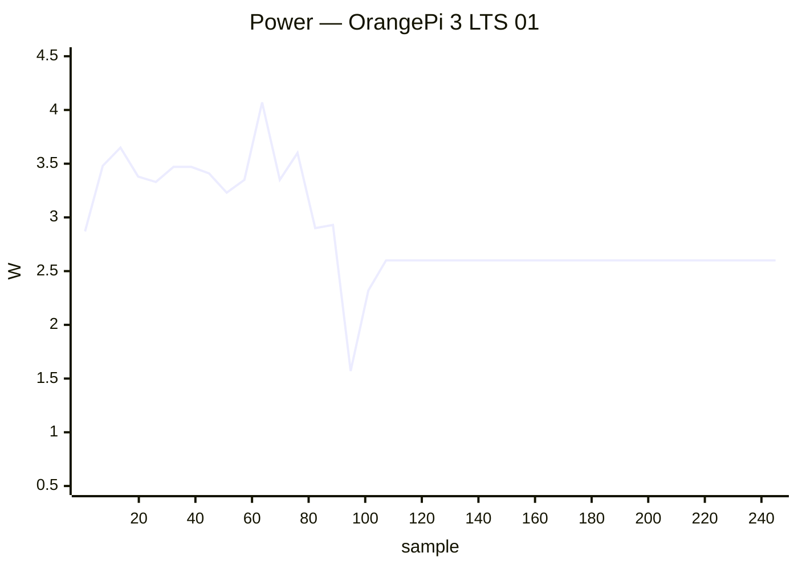
```mermaid
xychart-beta
    title "Power — OrangePi 3 LTS 01"
    x-axis "sample" 1 --> 245
    y-axis "W" 0.5 --> 4.5
    line [2.87, 3.48, 3.65, 3.38, 3.33, 3.47, 3.47, 3.41, 3.23, 3.35, 4.07, 3.35, 3.60, 2.90, 2.93, 1.57, 2.32, 2.60, 2.60, 2.60, 2.60, 2.60, 2.60, 2.60, 2.60, 2.60, 2.60, 2.60, 2.60, 2.60, 2.60, 2.60, 2.60, 2.60, 2.60, 2.60, 2.60, 2.60, 2.60, 2.60]
```

### ❌ Radxa Dragon Q6A 01

`radxa-dragon-q6a` · **inplace** · image `26.11.0-trunk.62` · 14 ✅ · 1 ❌ · 1 ⏭️

| Module | Status | Time | Detail |
|:--|:--:|--:|:--|
| upgrade | ⏭️ | 8.4 s | — |
| reboot | ✅ | 141.0 s | power-cycle · up 106 s |
| kernel-switch | ✅ | 17.0 s | branch=current · family=qcs6490 · installed=26.11.0-trunk.62 · boot_image=/boot/vmlinuz-6.18.2-current-qcs6490 · kernel_before=6.18.2-current-qcs6490 |
| reboot | ✅ | 463.8 s | power-cycle · 4/4 boots · up 106 s |
| hw-performance | ✅ | 13.2 s | AES 1494 · mem 19900 · disk W 241 / R 1145 MB/s · 50.4 °C · 1958 MHz |
| dvfs | ✅ | 14.7 s | ondemand · 300–1958 MHz (peak 2707) |
| network-iperf | ✅ | 39.8 s | enp1s0 ↑941/↓941 (1GE) Mbps |
| store-versions | ✅ | 3.8 s | 26.11.0-trunk.62 · 6.18.2-current-qcs6490 |
| kernel-switch | ❌ | 10.1 s | branch=edge · phase=install · dpkg_state=absent |
| reboot | ✅ | 471.0 s | power-cycle · 4/4 boots · up 106 s |
| hw-performance | ✅ | 13.1 s | AES 1493 · mem 15800 · disk W 235 / R 1118 MB/s · 50.8 °C · 1958 MHz |
| dvfs | ✅ | 14.0 s | ondemand · 300–1958 MHz (peak 2707) |
| network-iperf | ✅ | 28.2 s | enp1s0 ↑941/↓941 (1GE) Mbps |
| store-versions | ✅ | 3.6 s | 26.11.0-trunk.62 · 6.18.2-current-qcs6490 |
| kernel-switch | ✅ | 16.2 s | branch=current · family=qcs6490 · installed=26.11.0-trunk.62 · boot_image=/boot/vmlinuz-6.18.2-current-qcs6490 · kernel_before=6.18.2-current-qcs6490 |
| reboot | ✅ | 139.5 s | power-cycle · up 106 s |

**Power** — min 1.10 W · avg 2.17 W · peak 6.90 W · 1116 samples

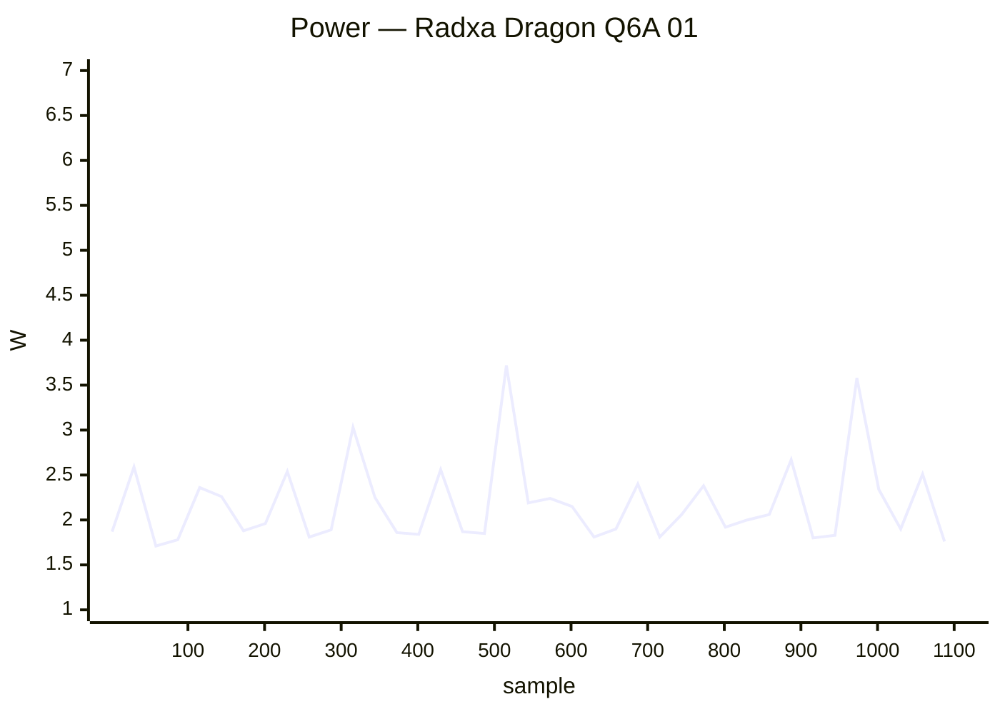
```mermaid
xychart-beta
    title "Power — Radxa Dragon Q6A 01"
    x-axis "sample" 1 --> 1116
    y-axis "W" 1.0 --> 7.0
    line [1.87, 2.59, 1.71, 1.78, 2.36, 2.26, 1.88, 1.96, 2.54, 1.81, 1.89, 3.03, 2.25, 1.86, 1.84, 2.56, 1.87, 1.85, 3.72, 2.19, 2.24, 2.15, 1.81, 1.90, 2.40, 1.81, 2.06, 2.38, 1.92, 2.00, 2.06, 2.67, 1.80, 1.83, 3.58, 2.34, 1.90, 2.51, 1.76, 1.75]
```

### ❌ Raspberry Pi 3B

`rpi4b` · **inplace** · image `26.11.0-trunk.62` · 14 ✅ · 1 ❌ · 1 ⏭️

| Module | Status | Time | Detail |
|:--|:--:|--:|:--|
| upgrade | ⏭️ | 32.4 s | — |
| reboot | ✅ | 53.3 s | warm · up 33 s |
| kernel-switch | ✅ | 75.5 s | branch=current · family=bcm2711 · installed=26.11.0-trunk.62 · boot_image=/boot/vmlinuz-6.18.53-current-bcm2711 · kernel_before=6.18.53-current-bcm2711 |
| reboot | ✅ | 187.6 s | warm · 4/4 boots · up 31 s |
| hw-performance | ✅ | 43.6 s | AES 20 · mem 1400 · disk W 20 / R 22 MB/s · 58 °C · 1200 MHz |
| dvfs | ✅ | 39.4 s | ondemand · 600–1200 MHz (peak 1200) |
| network-iperf | ✅ | 85.0 s | enxb827eb253a53 ↑94/↓94 (10/100ME) · wlan0 ↑16/↓38 (Wi-Fi 4) Mbps |
| store-versions | ✅ | 8.6 s | 26.11.0-trunk.62 · 6.18.53-current-bcm2711 |
| kernel-switch | ❌ | 46.3 s | branch=edge · phase=install · dpkg_state=absent |
| reboot | ✅ | 186.1 s | warm · 4/4 boots · up 31 s |
| hw-performance | ✅ | 43.5 s | AES 22 · mem 1400 · disk W 20 / R 22 MB/s · 57.5 °C · 1200 MHz |
| dvfs | ✅ | 36.7 s | ondemand · 600–1200 MHz (peak 1200) |
| network-iperf | ✅ | 85.0 s | enxb827eb253a53 ↑94/↓94 (10/100ME) · wlan0 ↑18/↓22 (Wi-Fi 4) Mbps |
| store-versions | ✅ | 8.7 s | 26.11.0-trunk.62 · 6.18.53-current-bcm2711 |
| kernel-switch | ✅ | 73.0 s | branch=current · family=bcm2711 · installed=26.11.0-trunk.62 · boot_image=/boot/vmlinuz-6.18.53-current-bcm2711 · kernel_before=6.18.53-current-bcm2711 |
| reboot | ✅ | 51.8 s | warm · up 31 s |

### ❌ Raspberry Pi 5B

`rpi4b` · **inplace** · image `26.11.0-trunk.62` · 14 ✅ · 1 ❌ · 1 ⏭️

| Module | Status | Time | Detail |
|:--|:--:|--:|:--|
| upgrade | ⏭️ | 5.1 s | — |
| reboot | ✅ | 50.5 s | power-cycle · up 22 s |
| kernel-switch | ✅ | 13.0 s | branch=current · family=bcm2711 · installed=26.11.0-trunk.62 · boot_image=/boot/vmlinuz-6.18.53-current-bcm2711 · kernel_before=6.18.53-current-bcm2711 |
| reboot | ✅ | 124.7 s | power-cycle · 4/4 boots · up 23 s |
| hw-performance | ✅ | 14.8 s | AES 1368 · mem 12100 · disk W 55 / R 85 MB/s · 69.4 °C · 2400 MHz |
| dvfs | ✅ | 13.4 s | ondemand · 1500–2400 MHz (peak 2400) |
| network-iperf | ✅ | 52.1 s | end0 ↑935/↓941 (1GE) · wlan0 ↑41/↓32 (Wi-Fi 5) Mbps |
| store-versions | ✅ | 3.3 s | 26.11.0-trunk.62 · 6.18.53-current-bcm2711 |
| kernel-switch | ❌ | 7.8 s | branch=edge · phase=install · dpkg_state=absent |
| reboot | ✅ | 122.2 s | power-cycle · 4/4 boots · up 19 s |
| hw-performance | ✅ | 15.8 s | AES 1368 · mem 12100 · disk W 55 / R 81 MB/s · 71.6 °C · 2400 MHz |
| dvfs | ✅ | 13.4 s | ondemand · 1500–2400 MHz (peak 2400) |
| network-iperf | ✅ | 51.7 s | end0 ↑936/↓941 (1GE) · wlan0 ↑39/↓13 (Wi-Fi 5) Mbps |
| store-versions | ✅ | 3.3 s | 26.11.0-trunk.62 · 6.18.53-current-bcm2711 |
| kernel-switch | ✅ | 13.3 s | branch=current · family=bcm2711 · installed=26.11.0-trunk.62 · boot_image=/boot/vmlinuz-6.18.53-current-bcm2711 · kernel_before=6.18.53-current-bcm2711 |
| reboot | ✅ | 47.3 s | power-cycle · up 21 s |

**Power** — min 2.50 W · avg 5.86 W · peak 10.30 W · 426 samples

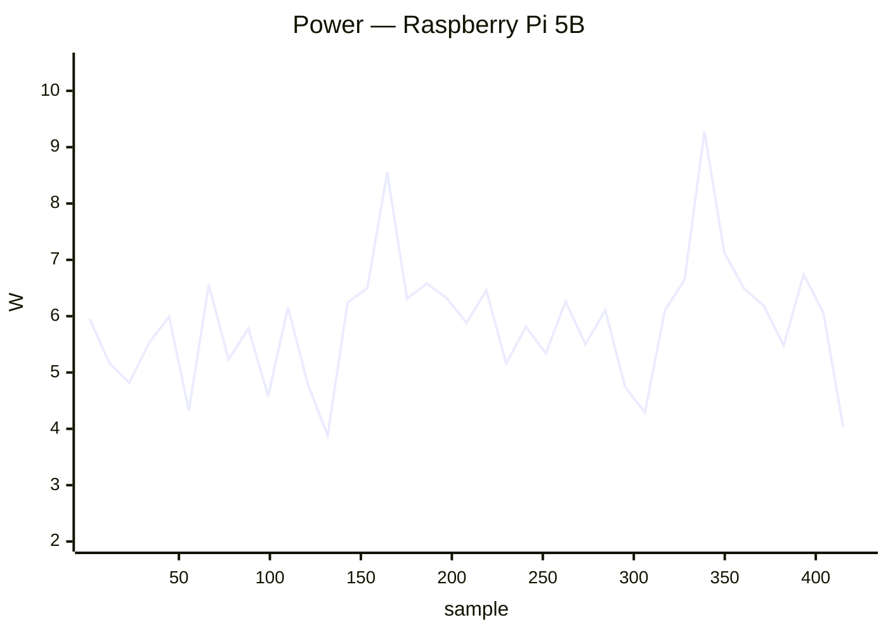
```mermaid
xychart-beta
    title "Power — Raspberry Pi 5B"
    x-axis "sample" 1 --> 426
    y-axis "W" 2.0 --> 10.5
    line [5.95, 5.16, 4.82, 5.53, 5.99, 4.32, 6.56, 5.23, 5.78, 4.58, 6.16, 4.79, 3.88, 6.24, 6.50, 8.55, 6.31, 6.58, 6.32, 5.88, 6.46, 5.16, 5.81, 5.34, 6.26, 5.50, 6.11, 4.74, 4.29, 6.10, 6.65, 9.28, 7.13, 6.49, 6.18, 5.48, 6.74, 6.06, 4.03, 5.66]
```

### ❌ Raspberry Pi Zero 2W

`rpi4b` · **inplace** · image `26.11.0-trunk.62` · 14 ✅ · 1 ❌ · 1 ⏭️

| Module | Status | Time | Detail |
|:--|:--:|--:|:--|
| upgrade | ⏭️ | 24.5 s | — |
| reboot | ✅ | 41.1 s | warm · up 22 s |
| kernel-switch | ✅ | 54.3 s | branch=current · family=bcm2711 · installed=26.11.0-trunk.62 · boot_image=/boot/vmlinuz-6.18.53-current-bcm2711 · kernel_before=6.18.53-current-bcm2711 |
| reboot | ✅ | 143.6 s | warm · 4/4 boots · up 22 s |
| hw-performance | ✅ | 34.7 s | AES 33 · mem 2200 · disk W 1 / R 23 MB/s · 56.9 °C · 1000 MHz |
| dvfs | ✅ | 26.9 s | ondemand · 600–1000 MHz (peak 1000) |
| network-iperf | ✅ | 44.6 s | wlan0 ↑35/↓33 (Wi-Fi 4) Mbps |
| store-versions | ✅ | 5.7 s | 26.11.0-trunk.62 · 6.18.53-current-bcm2711 |
| kernel-switch | ❌ | 35.2 s | branch=edge · phase=install · dpkg_state=absent |
| reboot | ✅ | 146.6 s | warm · 4/4 boots · up 22 s |
| hw-performance | ✅ | 34.2 s | AES 33 · mem 2200 · disk W 1 / R 23 MB/s · 59.1 °C · 1000 MHz |
| dvfs | ✅ | 27.9 s | ondemand · 600–1000 MHz (peak 1000) |
| network-iperf | ✅ | 81.4 s | wlan0 ↑15/↓25 (Wi-Fi 4) Mbps |
| store-versions | ✅ | 6.3 s | 26.11.0-trunk.62 · 6.18.53-current-bcm2711 |
| kernel-switch | ✅ | 58.8 s | branch=current · family=bcm2711 · installed=26.11.0-trunk.62 · boot_image=/boot/vmlinuz-6.18.53-current-bcm2711 · kernel_before=6.18.53-current-bcm2711 |
| reboot | ✅ | 41.7 s | warm · up 22 s |

### ❌ ROCK 2F 01

`rock-2f` · **inplace** · image `26.8.1` · 0 ✅ · 1 ❌ · 0 ⏭️

| Module | Status | Time | Detail |
|:--|:--:|--:|:--|
| reachable | ❌ | 0.0 s | ip=10.0.20.164 · reachable=False · port=22 |

### ❌ Rock 5B 01

`rock-5b` · **inplace** · image `26.11.0-trunk.62` · 19 ✅ · 2 ❌ · 1 ⏭️

| Module | Status | Time | Detail |
|:--|:--:|--:|:--|
| upgrade | ⏭️ | 7.9 s | — |
| reboot | ✅ | 51.3 s | power-cycle · up 23 s |
| kernel-switch | ✅ | 22.5 s | branch=vendor · family=rk35xx · installed=26.11.0-trunk.62 · boot_image=/boot/vmlinuz-6.1.172-vendor-rk35xx · kernel_before=6.1.172-vendor-rk35xx |
| reboot | ✅ | 131.1 s | power-cycle · 4/4 boots · up 18 s |
| hw-performance | ✅ | 19.7 s | AES 1292 · mem 14200 · disk W 26 / R 86 MB/s · 55 °C · 1800 MHz |
| dvfs | ✅ | 16.9 s | ondemand · 1800–1800 MHz (peak 2352) |
| network-iperf | ✅ | 57.1 s | enP4p65s0 ↑941/↓938 (1GE) · wlP2p33s0 ↑611/↓312 (Wi-Fi 6) Mbps |
| store-versions | ✅ | 4.8 s | 26.11.0-trunk.62 · 6.1.172-vendor-rk35xx |
| kernel-switch | ❌ | 14.2 s | branch=current · phase=install · dpkg_state=absent |
| reboot | ✅ | 124.9 s | power-cycle · 4/4 boots · up 18 s |
| hw-performance | ✅ | 20.0 s | AES 1292 · mem 14200 · disk W 27 / R 71 MB/s · 59 °C · 1800 MHz |
| dvfs | ✅ | 17.1 s | ondemand · 1800–1800 MHz (peak 2352) |
| network-iperf | ✅ | 67.4 s | enP4p65s0 ↑941/↓941 (1GE) · wlP2p33s0 ↑728/↓314 (Wi-Fi 6) Mbps |
| store-versions | ✅ | 4.0 s | 26.11.0-trunk.62 · 6.1.172-vendor-rk35xx |
| kernel-switch | ❌ | 14.5 s | branch=edge · phase=install · dpkg_state=absent |
| reboot | ✅ | 127.8 s | power-cycle · 4/4 boots · up 21 s |
| hw-performance | ✅ | 20.0 s | AES 1288 · mem 15500 · disk W 27 / R 83 MB/s · 59 °C · 1800 MHz |
| dvfs | ✅ | 16.6 s | ondemand · 1800–1800 MHz (peak 2352) |
| network-iperf | ✅ | 55.3 s | enP4p65s0 ↑941/↓939 (1GE) · wlP2p33s0 ↑712/↓499 (Wi-Fi 6) Mbps |
| store-versions | ✅ | 3.9 s | 26.11.0-trunk.62 · 6.1.172-vendor-rk35xx |
| kernel-switch | ✅ | 22.5 s | branch=vendor · family=rk35xx · installed=26.11.0-trunk.62 · boot_image=/boot/vmlinuz-6.1.172-vendor-rk35xx · kernel_before=6.1.172-vendor-rk35xx |
| reboot | ✅ | 47.4 s | power-cycle · up 20 s |

**Power** — min 0.70 W · avg 4.12 W · peak 9.60 W · 670 samples

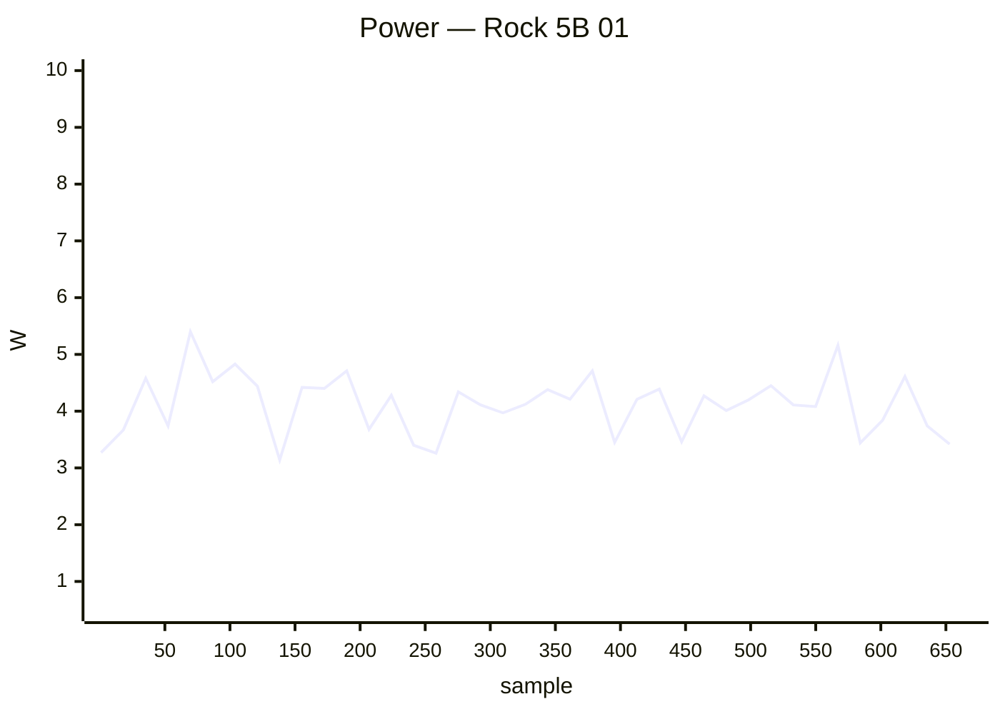
```mermaid
xychart-beta
    title "Power — Rock 5B 01"
    x-axis "sample" 1 --> 670
    y-axis "W" 0.5 --> 10.0
    line [3.27, 3.67, 4.58, 3.74, 5.40, 4.52, 4.83, 4.44, 3.14, 4.42, 4.40, 4.71, 3.68, 4.28, 3.40, 3.26, 4.34, 4.11, 3.97, 4.12, 4.38, 4.21, 4.71, 3.45, 4.21, 4.39, 3.46, 4.27, 4.01, 4.20, 4.45, 4.11, 4.08, 5.16, 3.44, 3.84, 4.61, 3.74, 3.42, 4.21]
```

### ❌ Rock 5B 02

`rock-5b` · **inplace** · image `26.11.0-trunk.62` · 0 ✅ · 1 ❌ · 21 ⏭️

| Module | Status | Time | Detail |
|:--|:--:|--:|:--|
| upgrade | ⏭️ | 9.4 s | — |
| reboot | ❌ | 133.2 s | power-cycle · up 102 s |
| kernel-switch | ⏭️ | 0.0 s | skipped=board down after reboot/power-cycle |
| reboot | ⏭️ | 0.0 s | reboot |
| hw-perf | ⏭️ | 0.0 s | board down after reboot/power-cycle |
| dvfs | ⏭️ | 0.0 s | — |
| net-iperf | ⏭️ | 0.0 s | board down after reboot/power-cycle |
| store-versions | ⏭️ | 0.0 s | — |
| kernel-switch | ⏭️ | 0.0 s | skipped=board down after reboot/power-cycle |
| reboot | ⏭️ | 0.0 s | reboot |
| hw-perf | ⏭️ | 0.0 s | board down after reboot/power-cycle |
| dvfs | ⏭️ | 0.0 s | — |
| net-iperf | ⏭️ | 0.0 s | board down after reboot/power-cycle |
| store-versions | ⏭️ | 0.0 s | — |
| kernel-switch | ⏭️ | 0.0 s | skipped=board down after reboot/power-cycle |
| reboot | ⏭️ | 0.0 s | reboot |
| hw-perf | ⏭️ | 0.0 s | board down after reboot/power-cycle |
| dvfs | ⏭️ | 0.0 s | — |
| net-iperf | ⏭️ | 0.0 s | board down after reboot/power-cycle |
| store-versions | ⏭️ | 0.0 s | — |
| kernel-switch | ⏭️ | 0.0 s | skipped=board down after reboot/power-cycle |
| reboot | ⏭️ | 0.0 s | reboot |

**Power** — min 2.40 W · avg 3.76 W · peak 6.70 W · 108 samples

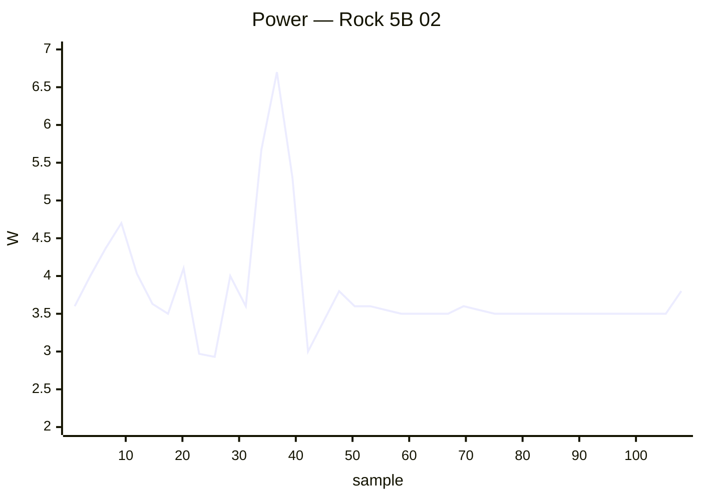
```mermaid
xychart-beta
    title "Power — Rock 5B 02"
    x-axis "sample" 1 --> 108
    y-axis "W" 2.0 --> 7.0
    line [3.60, 4.00, 4.37, 4.70, 4.03, 3.63, 3.50, 4.10, 2.97, 2.93, 4.00, 3.60, 5.67, 6.70, 5.30, 3.00, 3.40, 3.80, 3.60, 3.60, 3.55, 3.50, 3.50, 3.50, 3.50, 3.60, 3.55, 3.50, 3.50, 3.50, 3.50, 3.50, 3.50, 3.50, 3.50, 3.50, 3.50, 3.50, 3.50, 3.80]
```

### ❌ Rock 5B Plus 01

`rock-5b-plus` · **inplace** · image `26.11.0-trunk.62` · 19 ✅ · 2 ❌ · 1 ⏭️

| Module | Status | Time | Detail |
|:--|:--:|--:|:--|
| upgrade | ⏭️ | 13.6 s | — |
| reboot | ✅ | 65.6 s | power-cycle · up 37 s |
| kernel-switch | ✅ | 22.4 s | branch=vendor · family=rk35xx · installed=26.11.0-trunk.62 · boot_image=/boot/vmlinuz-6.1.172-vendor-rk35xx · kernel_before=6.1.172-vendor-rk35xx |
| reboot | ✅ | 156.6 s | power-cycle · 4/4 boots · up 26 s |
| hw-performance | ✅ | 17.3 s | AES 1280 · mem 14100 · disk W 69 / R 81 MB/s · 56.4 °C · 1800 MHz |
| dvfs | ✅ | 17.5 s | ondemand · 1800–1800 MHz (peak 2304) |
| network-iperf | ✅ | 30.5 s | enP4p65s0 ↑941/↓940 (1GE) Mbps |
| store-versions | ✅ | 4.3 s | 26.11.0-trunk.62 · 6.1.172-vendor-rk35xx |
| kernel-switch | ❌ | 13.1 s | branch=current · phase=install · dpkg_state=absent |
| reboot | ✅ | 149.6 s | power-cycle · 4/4 boots · up 24 s |
| hw-performance | ✅ | 17.5 s | AES 1278 · mem 15400 · disk W 67 / R 81 MB/s · 57.3 °C · 1800 MHz |
| dvfs | ✅ | 16.8 s | ondemand · 1800–1800 MHz (peak 2304) |
| network-iperf | ✅ | 60.4 s | enP4p65s0 ↑941/↓941 (1GE) Mbps |
| store-versions | ✅ | 3.9 s | 26.11.0-trunk.62 · 6.1.172-vendor-rk35xx |
| kernel-switch | ❌ | 13.2 s | branch=edge · phase=install · dpkg_state=absent |
| reboot | ✅ | 149.2 s | power-cycle · 4/4 boots · up 23 s |
| hw-performance | ✅ | 17.1 s | AES 1292 · mem 13800 · disk W 69 / R 81 MB/s · 57.3 °C · 1800 MHz |
| dvfs | ✅ | 16.8 s | ondemand · 1800–1800 MHz (peak 2304) |
| network-iperf | ✅ | 28.9 s | enP4p65s0 ↑941/↓941 (1GE) Mbps |
| store-versions | ✅ | 4.0 s | 26.11.0-trunk.62 · 6.1.172-vendor-rk35xx |
| kernel-switch | ✅ | 18.2 s | branch=vendor · family=rk35xx · installed=26.11.0-trunk.62 · boot_image=/boot/vmlinuz-6.1.172-vendor-rk35xx · kernel_before=6.1.172-vendor-rk35xx |
| reboot | ✅ | 49.5 s | power-cycle · up 22 s |

**Power** — min 2.40 W · avg 3.86 W · peak 9.20 W · 690 samples

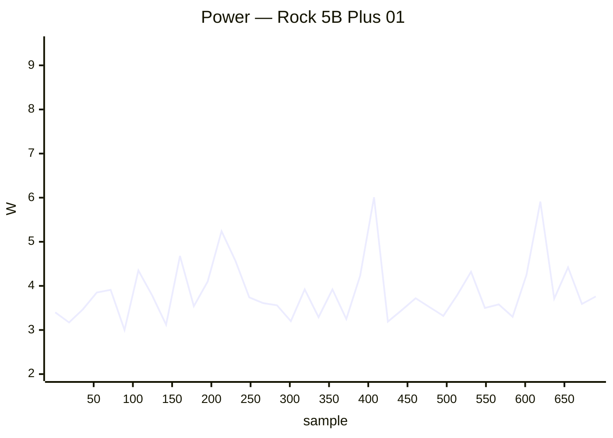
```mermaid
xychart-beta
    title "Power — Rock 5B Plus 01"
    x-axis "sample" 1 --> 690
    y-axis "W" 2.0 --> 9.5
    line [3.40, 3.17, 3.47, 3.85, 3.91, 3.00, 4.35, 3.78, 3.12, 4.68, 3.54, 4.10, 5.24, 4.57, 3.74, 3.61, 3.56, 3.20, 3.92, 3.29, 3.92, 3.25, 4.23, 6.01, 3.19, 3.45, 3.72, 3.52, 3.32, 3.79, 4.32, 3.50, 3.58, 3.30, 4.25, 5.91, 3.71, 4.42, 3.59, 3.76]
```

### ❌ Rock 5T 01

`rock-5t` · **inplace** · image `26.11.0-trunk.62` · 14 ✅ · 1 ❌ · 1 ⏭️

| Module | Status | Time | Detail |
|:--|:--:|--:|:--|
| upgrade | ⏭️ | 10.4 s | — |
| reboot | ✅ | 57.6 s | power-cycle · up 22 s |
| kernel-switch | ✅ | 20.5 s | branch=current · family=rockchip64 · installed=26.11.0-trunk.62 · boot_image=/boot/vmlinuz-6.18.54-current-rockchip64 · kernel_before=6.18.54-current-rockchip64 |
| reboot | ✅ | 146.3 s | power-cycle · 4/4 boots · up 23 s |
| hw-performance | ✅ | 18.3 s | AES 1251 · mem 8300 · disk W 51 / R 82 MB/s · 58.2 °C · 1800 MHz |
| dvfs | ✅ | 15.7 s | ondemand · 408–1800 MHz (peak 2400) |
| network-iperf | ✅ | 56.9 s | enP4p65s0 ↑941/↓941 (1GE) · wlP2p33s0 ↑440/↓203 (Wi-Fi 6) Mbps |
| store-versions | ✅ | 4.3 s | 26.11.0-trunk.62 · 6.18.54-current-rockchip64 |
| kernel-switch | ❌ | 14.2 s | branch=edge · phase=install · dpkg_state=absent |
| reboot | ✅ | 140.9 s | power-cycle · 4/4 boots · up 24 s |
| hw-performance | ✅ | 18.0 s | AES 1251 · mem 7300 · disk W 51 / R 79 MB/s · 58.2 °C · 1800 MHz |
| dvfs | ✅ | 15.6 s | ondemand · 408–1800 MHz (peak 2400) |
| network-iperf | ✅ | 61.0 s | enP4p65s0 ↑941/↓941 (1GE) · wlP2p33s0 ↑474/↓160 (Wi-Fi 6) Mbps |
| store-versions | ✅ | 4.3 s | 26.11.0-trunk.62 · 6.18.54-current-rockchip64 |
| kernel-switch | ✅ | 19.8 s | branch=current · family=rockchip64 · installed=26.11.0-trunk.62 · boot_image=/boot/vmlinuz-6.18.54-current-rockchip64 · kernel_before=6.18.54-current-rockchip64 |
| reboot | ✅ | 56.5 s | power-cycle · up 21 s |

**Power** — min 1.80 W · avg 6.90 W · peak 13.70 W · 510 samples

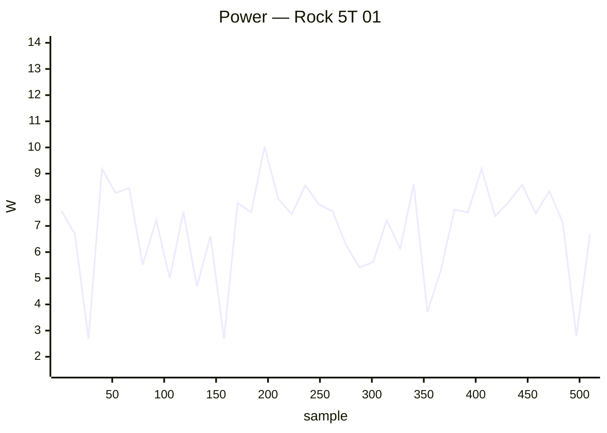
```mermaid
xychart-beta
    title "Power — Rock 5T 01"
    x-axis "sample" 1 --> 510
    y-axis "W" 1.5 --> 14.0
    line [7.58, 6.69, 2.68, 9.18, 8.26, 8.45, 5.52, 7.22, 5.00, 7.55, 4.68, 6.61, 2.68, 7.88, 7.52, 10.03, 8.03, 7.45, 8.55, 7.82, 7.57, 6.28, 5.41, 5.62, 7.22, 6.14, 8.60, 3.71, 5.30, 7.62, 7.52, 9.18, 7.38, 7.91, 8.58, 7.48, 8.33, 7.12, 2.78, 6.70]
```

### ❌ Rockpi E 01

`rockpi-e` · **inplace** · image `26.11.0-trunk.62` · 14 ✅ · 1 ❌ · 1 ⏭️

| Module | Status | Time | Detail |
|:--|:--:|--:|:--|
| upgrade | ⏭️ | 18.3 s | — |
| reboot | ✅ | 56.4 s | power-cycle · up 24 s |
| kernel-switch | ✅ | 41.7 s | branch=current · family=rockchip64 · installed=26.11.0-trunk.62 · boot_image=/boot/vmlinuz-6.18.54-current-rockchip64 · kernel_before=6.18.54-current-rockchip64 |
| reboot | ✅ | 157.0 s | power-cycle · 4/4 boots · up 24 s |
| hw-performance | ✅ | 31.9 s | AES 603 · mem 3300 · disk W 21 / R 23 MB/s · 60.8 °C · 1296 MHz |
| dvfs | ✅ | 25.1 s | ondemand · 408–1296 MHz (peak 1296) |
| network-iperf | ✅ | 147.0 s | end0 ↑941/↓941 (1GE) · end1 ↑94/↓94 (10/100ME) · wlx7ca7b020e87c ↑167/↓187 (Wi-Fi 5) Mbps |
| store-versions | ✅ | 5.7 s | 26.11.0-trunk.62 · 6.18.54-current-rockchip64 |
| kernel-switch | ❌ | 24.1 s | branch=edge · phase=install · dpkg_state=absent |
| reboot | ✅ | 158.4 s | power-cycle · 4/4 boots · up 25 s |
| hw-performance | ✅ | 31.8 s | AES 604 · mem 3300 · disk W 21 / R 23 MB/s · 61.2 °C · 1296 MHz |
| dvfs | ✅ | 25.2 s | ondemand · 408–1296 MHz (peak 1296) |
| network-iperf | ✅ | 91.3 s | end0 ↑941/↓941 (1GE) · end1 ↑94/↓94 (10/100ME) · wlx7ca7b020e87c ↑175/↓210 (Wi-Fi 5) Mbps |
| store-versions | ✅ | 6.5 s | 26.11.0-trunk.62 · 6.18.54-current-rockchip64 |
| kernel-switch | ✅ | 41.3 s | branch=current · family=rockchip64 · installed=26.11.0-trunk.62 · boot_image=/boot/vmlinuz-6.18.54-current-rockchip64 · kernel_before=6.18.54-current-rockchip64 |
| reboot | ✅ | 56.8 s | power-cycle · up 24 s |

### ❌ Rockpi S 01

`rockpi-s` · **inplace** · image `26.11.0-trunk.62` · 14 ✅ · 1 ❌ · 1 ⏭️

| Module | Status | Time | Detail |
|:--|:--:|--:|:--|
| upgrade | ⏭️ | 29.7 s | — |
| reboot | ✅ | 66.5 s | power-cycle · up 30 s |
| kernel-switch | ✅ | 69.2 s | branch=current · family=rockchip64 · installed=26.11.0-trunk.62 · boot_image=/boot/vmlinuz-6.18.54-current-rockchip64 · kernel_before=6.18.54-current-rockchip64 |
| reboot | ✅ | 427.4 s | power-cycle · 3/4 boots · up 30 s |
| hw-performance | ✅ | 41.6 s | AES 218 · mem 1300 · disk W 20 / R 22 MB/s · 53.3 °C · 1008 MHz |
| dvfs | ✅ | 35.7 s | ondemand · 408–1008 MHz (peak 1008) |
| network-iperf | ✅ | 83.2 s | end0 ↑94/↓94 (10/100ME) · wlan0 ↑8/↓8 (Wi-Fi 4) Mbps |
| store-versions | ✅ | 7.9 s | 26.11.0-trunk.62 · 6.18.54-current-rockchip64 |
| kernel-switch | ❌ | 41.0 s | branch=edge · phase=install · dpkg_state=absent |
| reboot | ✅ | 186.1 s | power-cycle · 4/4 boots · up 30 s |
| hw-performance | ✅ | 41.2 s | AES 219 · mem 1300 · disk W 21 / R 22 MB/s · 55 °C · 1008 MHz |
| dvfs | ✅ | 35.9 s | ondemand · 408–1008 MHz (peak 1008) |
| network-iperf | ✅ | 77.3 s | end0 ↑94/↓94 (10/100ME) · wlan0 ↑10/↓8 (Wi-Fi 4) Mbps |
| store-versions | ✅ | 9.5 s | 26.11.0-trunk.62 · 6.18.54-current-rockchip64 |
| kernel-switch | ✅ | 70.0 s | branch=current · family=rockchip64 · installed=26.11.0-trunk.62 · boot_image=/boot/vmlinuz-6.18.54-current-rockchip64 · kernel_before=6.18.54-current-rockchip64 |
| reboot | ✅ | 66.6 s | power-cycle · up 31 s |

**Power** — min 1.00 W · avg 1.45 W · peak 2.80 W · 1020 samples

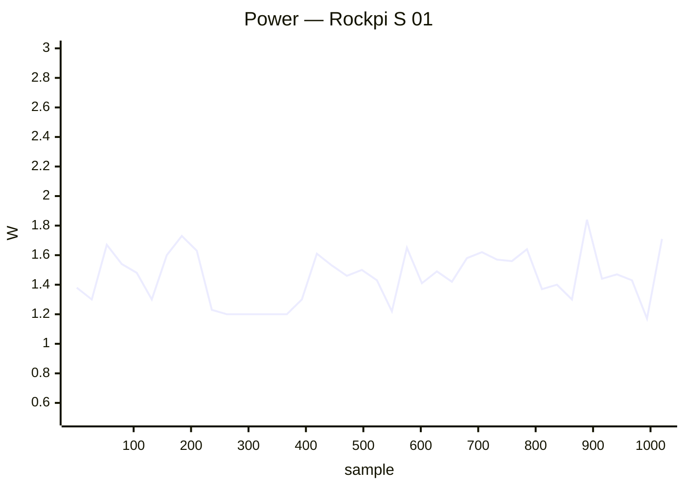
```mermaid
xychart-beta
    title "Power — Rockpi S 01"
    x-axis "sample" 1 --> 1020
    y-axis "W" 0.5 --> 3.0
    line [1.38, 1.30, 1.67, 1.54, 1.48, 1.30, 1.60, 1.73, 1.63, 1.23, 1.20, 1.20, 1.20, 1.20, 1.20, 1.30, 1.61, 1.53, 1.46, 1.50, 1.43, 1.22, 1.65, 1.41, 1.49, 1.42, 1.58, 1.62, 1.57, 1.56, 1.64, 1.37, 1.40, 1.30, 1.84, 1.44, 1.47, 1.43, 1.17, 1.71]
```

### ❌ SpacemiT MusePi Pro 01

`musepipro` · **inplace** · image `26.11.0-trunk.61` · 0 ✅ · 1 ❌ · 5 ⏭️

| Module | Status | Time | Detail |
|:--|:--:|--:|:--|
| upgrade | ⏭️ | 22.1 s | — |
| reboot | ❌ | 213.4 s | power-cycle |
| hw-perf | ⏭️ | 0.0 s | board down after reboot/power-cycle |
| dvfs | ⏭️ | 0.0 s | — |
| net-iperf | ⏭️ | 0.0 s | board down after reboot/power-cycle |
| store-versions | ⏭️ | 0.0 s | — |

**Power** — min 1.90 W · avg 3.15 W · peak 5.50 W · 186 samples

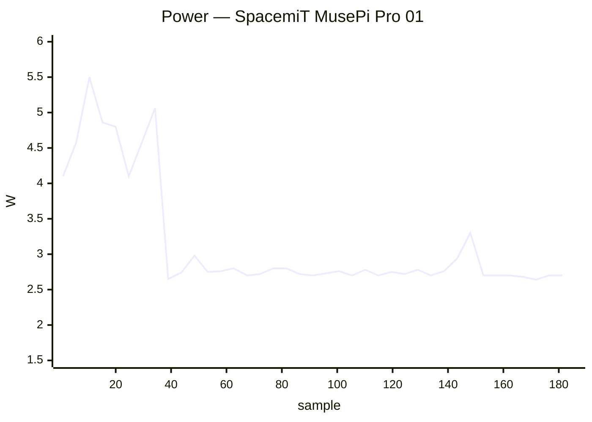
```mermaid
xychart-beta
    title "Power — SpacemiT MusePi Pro 01"
    x-axis "sample" 1 --> 186
    y-axis "W" 1.5 --> 6.0
    line [4.10, 4.58, 5.50, 4.86, 4.80, 4.10, 4.58, 5.06, 2.65, 2.74, 2.98, 2.75, 2.76, 2.80, 2.70, 2.72, 2.80, 2.80, 2.72, 2.70, 2.73, 2.76, 2.70, 2.78, 2.70, 2.75, 2.72, 2.78, 2.70, 2.76, 2.94, 3.30, 2.70, 2.70, 2.70, 2.68, 2.64, 2.70, 2.70, 2.70]
```

### ❌ Tinker Board 01

`tinkerboard` · **inplace** · image `26.11.0-trunk.62` · 14 ✅ · 1 ❌ · 1 ⏭️

| Module | Status | Time | Detail |
|:--|:--:|--:|:--|
| upgrade | ⏭️ | 11.7 s | — |
| reboot | ✅ | 64.7 s | power-cycle · up 30 s |
| kernel-switch | ✅ | 29.0 s | branch=current · family=rockchip · installed=26.11.0-trunk.62 · boot_image=/boot/vmlinuz-6.18.54-current-rockchip · kernel_before=6.18.54-current-rockchip |
| reboot | ✅ | 167.4 s | power-cycle · 4/4 boots · up 29 s |
| hw-performance | ✅ | 28.0 s | AES 67 · mem 3300 · disk W 13 / R 63 MB/s · 62.1 °C · 1800 MHz |
| dvfs | ✅ | 20.3 s | ondemand · 600–1800 MHz (peak 1800) |
| network-iperf | ✅ | 65.4 s | end0 ↑940/↓941 (1GE) · wlan0 ↑13/↓13 (Wi-Fi 4) Mbps |
| store-versions | ✅ | 4.5 s | 26.11.0-trunk.62 · 6.18.54-current-rockchip |
| kernel-switch | ❌ | 19.3 s | branch=edge · phase=install · dpkg_state=absent |
| reboot | ✅ | 180.0 s | power-cycle · 4/4 boots · up 28 s |
| hw-performance | ✅ | 27.5 s | AES 67 · mem 3300 · disk W 15 / R 63 MB/s · 62.5 °C · 1800 MHz |
| dvfs | ✅ | 20.3 s | ondemand · 600–1800 MHz (peak 1800) |
| network-iperf | ✅ | 60.8 s | end0 ↑941/↓941 (1GE) · wlan0 ↑30/↓27 (Wi-Fi 4) Mbps |
| store-versions | ✅ | 4.7 s | 26.11.0-trunk.62 · 6.18.54-current-rockchip |
| kernel-switch | ✅ | 29.8 s | branch=current · family=rockchip · installed=26.11.0-trunk.62 · boot_image=/boot/vmlinuz-6.18.54-current-rockchip · kernel_before=6.18.54-current-rockchip |
| reboot | ✅ | 66.8 s | power-cycle · up 31 s |

**Power** — min 2.30 W · avg 3.90 W · peak 8.50 W · 630 samples

```mermaid
xychart-beta
    title "Power — Tinker Board 01"
    x-axis "sample" 1 --> 630
    y-axis "W" 2.0 --> 9.0
    line [3.40, 3.59, 3.00, 3.62, 4.57, 3.76, 3.44, 3.91, 3.83, 3.95, 4.44, 3.69, 2.75, 4.23, 4.08, 5.31, 4.11, 4.04, 4.38, 4.20, 4.29, 3.14, 4.05, 2.99, 3.31, 3.52, 3.46, 3.16, 2.77, 4.62, 3.86, 5.62, 4.15, 4.31, 5.20, 4.84, 4.07, 3.31, 2.97, 3.77]
```

### ❌ Udoo 01

`udoo` · **inplace** · image `26.11.0-trunk.62` · 14 ✅ · 1 ❌ · 1 ⏭️

| Module | Status | Time | Detail |
|:--|:--:|--:|:--|
| upgrade | ⏭️ | 35.1 s | — |
| reboot | ✅ | 71.0 s | power-cycle · up 34 s |
| kernel-switch | ✅ | 76.0 s | branch=current · family=imx6 · installed=26.11.0-trunk.62 · boot_image=/boot/vmlinuz-6.18.54-current-imx6 · kernel_before=6.18.54-current-imx6 |
| reboot | ✅ | 203.3 s | power-cycle · 4/4 boots · up 34 s |
| hw-performance | ✅ | 50.7 s | AES 26 · mem 745 · disk W 13 / R 20 MB/s · 55.5 °C · 996 MHz |
| dvfs | ✅ | 43.8 s | ondemand · 396–996 MHz (peak 996) |
| network-iperf | ✅ | 82.2 s | end0 ↑400/↓248 (1GE) · wlx7cdd903aa418 ↑31/↓19 (Wi-Fi 4) Mbps |
| store-versions | ✅ | 9.3 s | 26.11.0-trunk.62 · 6.18.54-current-imx6 |
| kernel-switch | ❌ | 51.8 s | branch=edge · phase=install · dpkg_state=absent |
| reboot | ✅ | 201.5 s | power-cycle · 4/4 boots · up 34 s |
| hw-performance | ✅ | 50.9 s | AES 26 · mem 716 · disk W 13 / R 20 MB/s · 56.1 °C · 996 MHz |
| dvfs | ✅ | 44.4 s | ondemand · 396–996 MHz (peak 996) |
| network-iperf | ✅ | 85.6 s | end0 ↑399/↓232 (1GE) · wlx7cdd903aa418 ↑32/↓22 (Wi-Fi 4) Mbps |
| store-versions | ✅ | 9.7 s | 26.11.0-trunk.62 · 6.18.54-current-imx6 |
| kernel-switch | ✅ | 81.6 s | branch=current · family=imx6 · installed=26.11.0-trunk.62 · boot_image=/boot/vmlinuz-6.18.54-current-imx6 · kernel_before=6.18.54-current-imx6 |
| reboot | ✅ | 71.1 s | power-cycle · up 34 s |

**Power** — min 1.30 W · avg 6.06 W · peak 8.40 W · 934 samples

```mermaid
xychart-beta
    title "Power — Udoo 01"
    x-axis "sample" 1 --> 934
    y-axis "W" 1.0 --> 8.5
    line [6.05, 5.70, 5.44, 7.43, 6.17, 6.03, 5.48, 6.65, 5.26, 6.36, 6.38, 5.87, 6.83, 6.39, 5.70, 6.82, 5.57, 6.31, 6.01, 5.86, 6.27, 5.16, 6.38, 5.57, 6.57, 6.32, 5.36, 6.51, 6.16, 5.59, 6.67, 5.70, 6.66, 6.32, 5.78, 6.23, 5.97, 6.15, 4.76, 5.92]
```

### ❌ UEFI x86 01

`uefi-x86` · **inplace** · image `26.11.0-trunk.62` · 12 ✅ · 1 ❌ · 3 ⏭️

| Module | Status | Time | Detail |
|:--|:--:|--:|:--|
| upgrade | ⏭️ | 15.3 s | — |
| reboot | ✅ | 94.3 s | power-cycle · up 61 s |
| kernel-switch | ✅ | 35.3 s | branch=current · family=x86 · installed=26.11.0-trunk.62 · boot_image=/boot/vmlinuz-6.18.54-current-x86 · kernel_before=6.18.54-current-x86 |
| reboot | ✅ | 243.6 s | power-cycle · 4/4 boots · up 60 s |
| hw-performance | ✅ | 25.3 s | AES 237 · mem 5600 · disk W 24 / R 107 MB/s · 65 °C · 1920 MHz |
| dvfs | ➖ | 23.5 s | schedutil · 480–1920 MHz (peak 1680) · max_khz is single-core turbo, not an all-core target |
| network-iperf | ✅ | 61.0 s | enp1s0 ↑921/↓941 (1GE) · wlan0 ↑35/↓39 (Wi-Fi 5) Mbps |
| store-versions | ✅ | 5.2 s | 26.11.0-trunk.62 · 6.18.54-current-x86 |
| kernel-switch | ❌ | 23.6 s | branch=edge · phase=install · dpkg_state=absent |
| reboot | ✅ | 242.5 s | power-cycle · 4/4 boots · up 56 s |
| hw-performance | ✅ | 25.3 s | AES 237 · mem 4600 · disk W 26 / R 107 MB/s · 66 °C · 1920 MHz |
| dvfs | ➖ | 23.5 s | schedutil · 480–1920 MHz (peak 1706) · max_khz is single-core turbo, not an all-core target |
| network-iperf | ✅ | 61.2 s | enp1s0 ↑920/↓941 (1GE) · wlan0 ↑35/↓37 (Wi-Fi 5) Mbps |
| store-versions | ✅ | 5.3 s | 26.11.0-trunk.62 · 6.18.54-current-x86 |
| kernel-switch | ✅ | 34.4 s | branch=current · family=x86 · installed=26.11.0-trunk.62 · boot_image=/boot/vmlinuz-6.18.54-current-x86 · kernel_before=6.18.54-current-x86 |
| reboot | ✅ | 88.2 s | power-cycle · up 57 s |

**Power** — min 0.80 W · avg 4.23 W · peak 8.50 W · 808 samples

```mermaid
xychart-beta
    title "Power — UEFI x86 01"
    x-axis "sample" 1 --> 808
    y-axis "W" 0.5 --> 9.0
    line [3.52, 3.31, 4.19, 5.00, 3.78, 3.92, 4.17, 5.84, 4.12, 5.35, 3.89, 5.41, 2.94, 3.72, 4.77, 4.74, 4.01, 3.69, 3.34, 3.67, 4.24, 4.09, 5.08, 4.66, 4.68, 4.20, 4.77, 4.55, 4.35, 4.70, 4.53, 4.23, 3.70, 3.98, 3.54, 4.19, 3.76, 3.12, 4.09, 5.40]
```

### ❌ ZeroPi 01

`zeropi` · **inplace** · image `26.11.0-trunk.58` · 14 ✅ · 1 ❌ · 1 ⏭️

| Module | Status | Time | Detail |
|:--|:--:|--:|:--|
| upgrade | ⏭️ | 27.0 s | — |
| reboot | ✅ | 59.4 s | power-cycle · up 26 s |
| kernel-switch | ✅ | 63.0 s | branch=current · family=sunxi · installed=26.11.0-trunk.62 · boot_image=/boot/vmlinuz-6.18.54-current-sunxi · kernel_before=6.18.54-current-sunxi |
| reboot | ✅ | 164.5 s | power-cycle · 4/4 boots · up 25 s |
| hw-performance | ✅ | 39.4 s | AES 25 · mem 1500 · disk W 21 / R 23 MB/s · 50.7 °C · 1296 MHz |
| dvfs | ✅ | 34.0 s | ondemand · 480–1296 MHz (peak 1296) |
| network-iperf | ✅ | 41.1 s | end0 ↑631/↓936 (1GE) Mbps |
| store-versions | ✅ | 7.3 s | 26.11.0-trunk.58 · 6.18.54-current-sunxi |
| kernel-switch | ❌ | 38.1 s | branch=edge · phase=install · dpkg_state=absent |
| reboot | ✅ | 164.2 s | power-cycle · 4/4 boots · up 25 s |
| hw-performance | ✅ | 39.5 s | AES 25 · mem 1500 · disk W 21 / R 23 MB/s · 51.8 °C · 1296 MHz |
| dvfs | ✅ | 34.1 s | ondemand · 480–1296 MHz (peak 1296) |
| network-iperf | ✅ | 38.6 s | end0 ↑640/↓936 (1GE) Mbps |
| store-versions | ✅ | 7.4 s | 26.11.0-trunk.58 · 6.18.54-current-sunxi |
| kernel-switch | ✅ | 62.5 s | branch=current · family=sunxi · installed=26.11.0-trunk.62 · boot_image=/boot/vmlinuz-6.18.54-current-sunxi · kernel_before=6.18.54-current-sunxi |
| reboot | ✅ | 59.0 s | power-cycle · up 24 s |

**Power** — min 1.20 W · avg 2.22 W · peak 3.20 W · 705 samples

```mermaid
xychart-beta
    title "Power — ZeroPi 01"
    x-axis "sample" 1 --> 705
    y-axis "W" 1.0 --> 3.5
    line [1.93, 2.04, 1.80, 2.41, 2.39, 2.18, 2.08, 1.98, 2.37, 2.34, 2.65, 2.39, 2.08, 2.00, 2.37, 2.05, 2.41, 2.19, 2.26, 2.34, 2.29, 2.16, 2.09, 2.71, 2.40, 2.34, 2.20, 1.92, 2.35, 2.19, 2.04, 2.63, 2.04, 2.20, 2.44, 2.26, 2.14, 1.96, 1.81, 2.39]
```

## ✅ Passed (27)

### ✅ Arduino UNO Q 01

`arduino-uno-q` · **inplace** · image `26.11.0-trunk.57` · 8 ✅ · 0 ❌ · 0 ⏭️

| Module | Status | Time | Detail |
|:--|:--:|--:|:--|
| upgrade | ✅ | 254.5 s | nightly · 26.11.0-trunk.57 → 26.11.0-trunk.62 |
| reboot | ✅ | 55.2 s | warm · up 36 s |
| kernel-switch | ✅ | 46.5 s | branch=edge · family=qrb2210 · installed=26.11.0-trunk.62 · boot_image=? · kernel_before=7.2.3-edge-qrb2210 |
| reboot | ✅ | 198.6 s | warm · 4/4 boots · up 35 s |
| hw-performance | ✅ | 24.6 s | AES 939 · mem 5100 · disk W 168 / R 223 MB/s · 38.4 °C · 2016 MHz |
| dvfs | ✅ | 32.1 s | schedutil · 300–2016 MHz (peak 2016) |
| network-iperf | ✅ | 46.1 s | wlan0 ↑24/↓21 (Wi-Fi 5) · usb0 ↑?/↓? Mbps |
| store-versions | ✅ | 7.0 s | 26.11.0-trunk.62 · 7.2.3-edge-qrb2210 |

### ✅ Banana Pi CM4IO 01

`bananapicm4io` · **inplace** · image `26.8.3` · 14 ✅ · 2 ❌ · 0 ⏭️

| Module | Status | Time | Detail |
|:--|:--:|--:|:--|
| upgrade | ✅ | 55.6 s | nightly · 26.8.3 → 26.8.3 |
| reboot | ✅ | 48.7 s | power-cycle · up 23 s |
| kernel-switch | ✅ | 40.5 s | branch=current · family=meson64 · installed=26.11.0-trunk.62 · boot_image=/boot/vmlinuz-6.18.54-current-meson64 · kernel_before=6.18.54-current-meson64 |
| reboot | ✅ | 136.5 s | power-cycle · 4/4 boots · up 22 s |
| hw-performance | ✅ | 17.6 s | AES 852 · mem 3900 · disk W 43 / R 151 MB/s · 52.5 °C · 2016 MHz |
| dvfs | ✅ | 18.1 s | ondemand · 1000–1512 MHz (peak 1512) |
| network-iperf | ❌ | 297.0 s | eth0 ↑940/↓941 (1GE) · wlan0 ↑0/↓0 (Wi-Fi 5) Mbps |
| store-versions | ✅ | 4.0 s | 26.8.3 · 6.18.54-current-meson64 |
| kernel-switch | ✅ | 195.0 s | branch=edge · family=meson64 · installed=26.11.0-trunk.62 · boot_image=/boot/vmlinuz-7.2.8-edge-meson64 · kernel_before=6.18.54-current-meson64 |
| reboot | ✅ | 143.2 s | power-cycle · 4/4 boots · up 22 s |
| hw-performance | ✅ | 18.9 s | AES 852 · mem 3900 · disk W 38 / R 158 MB/s · 53.5 °C · 2016 MHz |
| dvfs | ✅ | 18.3 s | ondemand · 1000–1512 MHz (peak 1512) |
| network-iperf | ❌ | 283.5 s | eth0 ↑941/↓0 (1GE) · wlan0 ↑0/↓0 (Wi-Fi 5) Mbps |
| store-versions | ✅ | 4.0 s | 26.8.3 · 7.2.8-edge-meson64 |
| kernel-switch | ✅ | 194.4 s | branch=current · family=meson64 · installed=26.11.0-trunk.62 · boot_image=/boot/vmlinuz-6.18.54-current-meson64 · kernel_before=7.2.8-edge-meson64 |
| reboot | ✅ | 52.9 s | power-cycle · up 22 s |

### ✅ Banana Pi M2Pro 01

`bananapim2pro` · **inplace** · image `26.11.0-trunk.62` · 16 ✅ · 0 ❌ · 0 ⏭️

| Module | Status | Time | Detail |
|:--|:--:|--:|:--|
| upgrade | ✅ | 45.4 s | nightly · 26.11.0-trunk.62 → 26.11.0-trunk.62 |
| reboot | ✅ | 57.0 s | power-cycle · up 22 s |
| kernel-switch | ✅ | 31.4 s | branch=current · family=meson64 · installed=26.11.0-trunk.62 · boot_image=/boot/vmlinuz-6.18.54-current-meson64 · kernel_before=6.18.54-current-meson64 |
| reboot | ✅ | 138.4 s | power-cycle · 4/4 boots · up 21 s |
| hw-performance | ✅ | 19.3 s | AES 981 · mem 5300 · disk W 43 / R 150 MB/s · 49.2 °C · 2100 MHz |
| dvfs | ✅ | 19.3 s | ondemand · 1000–2100 MHz (peak 2100) |
| network-iperf | ✅ | 30.6 s | end0 ↑940/↓941 (1GE) Mbps |
| store-versions | ✅ | 4.4 s | 26.11.0-trunk.62 · 6.18.54-current-meson64 |
| kernel-switch | ✅ | 94.0 s | branch=edge · family=meson64 · installed=26.11.0-trunk.62 · boot_image=/boot/vmlinuz-7.2.8-edge-meson64 · kernel_before=6.18.54-current-meson64 |
| reboot | ✅ | 138.7 s | power-cycle · 4/4 boots · up 22 s |
| hw-performance | ✅ | 19.4 s | AES 979 · mem 5300 · disk W 42 / R 157 MB/s · 50 °C · 2100 MHz |
| dvfs | ✅ | 19.9 s | ondemand · 1000–2100 MHz (peak 2100) |
| network-iperf | ✅ | 33.2 s | end0 ↑941/↓941 (1GE) Mbps |
| store-versions | ✅ | 4.6 s | 26.11.0-trunk.62 · 7.2.8-edge-meson64 |
| kernel-switch | ✅ | 93.0 s | branch=current · family=meson64 · installed=26.11.0-trunk.62 · boot_image=/boot/vmlinuz-6.18.54-current-meson64 · kernel_before=7.2.8-edge-meson64 |
| reboot | ✅ | 55.3 s | power-cycle · up 23 s |

**Power** — min 1.50 W · avg 3.12 W · peak 4.80 W · 623 samples

```mermaid
xychart-beta
    title "Power — Banana Pi M2Pro 01"
    x-axis "sample" 1 --> 623
    y-axis "W" 1.0 --> 5.0
    line [3.11, 3.12, 3.15, 2.02, 3.36, 3.14, 3.24, 2.51, 3.31, 2.81, 3.01, 2.84, 2.42, 3.26, 3.19, 3.36, 3.17, 3.19, 3.62, 3.31, 3.25, 3.23, 3.14, 3.10, 3.04, 3.33, 3.29, 2.30, 3.53, 3.11, 3.62, 3.09, 3.19, 3.19, 3.83, 3.19, 3.35, 3.13, 2.46, 3.29]
```

### ✅ Banana Pi M5 01

`bananapim5` · **inplace** · image `26.11.0-trunk.56` · 16 ✅ · 0 ❌ · 0 ⏭️

| Module | Status | Time | Detail |
|:--|:--:|--:|:--|
| upgrade | ✅ | 316.6 s | nightly · 26.11.0-trunk.56 → 26.11.0-trunk.58 |
| reboot | ✅ | 179.3 s | warm · up 154 s |
| kernel-switch | ✅ | 50.7 s | branch=current · family=meson64 · installed=26.11.0-trunk.58 · boot_image=/boot/vmlinuz-6.18.53-current-meson64 · kernel_before=6.18.53-current-meson64 |
| reboot | ✅ | 639.9 s | warm · 4/4 boots · up 149 s |
| hw-performance | ✅ | 38.7 s | AES 979 · mem 5300 · disk W 10 / R 15 MB/s · 53.2 °C · 2100 MHz |
| dvfs | ✅ | 20.9 s | ondemand · 1000–2100 MHz (peak 2100) |
| network-iperf | ✅ | 60.1 s | end0 ↑940/↓941 (1GE) · wlx000f13960190 ↑1/↓5 (Wi-Fi 4) Mbps |
| store-versions | ✅ | 4.7 s | 26.11.0-trunk.58 · 6.18.53-current-meson64 |
| kernel-switch | ✅ | 168.5 s | branch=edge · family=meson64 · installed=26.11.0-trunk.58 · boot_image=/boot/vmlinuz-7.2.7-edge-meson64 · kernel_before=6.18.53-current-meson64 |
| reboot | ✅ | 763.3 s | warm · 4/4 boots · up 178 s |
| hw-performance | ✅ | 38.8 s | AES 969 · mem 5300 · disk W 10 / R 15 MB/s · 53.3 °C · 2100 MHz |
| dvfs | ✅ | 21.1 s | ondemand · 1000–2100 MHz (peak 2100) |
| network-iperf | ✅ | 67.2 s | end0 ↑941/↓941 (1GE) · wlx000f13960190 ↑1/↓5 (Wi-Fi 4) Mbps |
| store-versions | ✅ | 4.7 s | 26.11.0-trunk.58 · 7.2.7-edge-meson64 |
| kernel-switch | ✅ | 166.5 s | branch=current · family=meson64 · installed=26.11.0-trunk.58 · boot_image=/boot/vmlinuz-6.18.53-current-meson64 · kernel_before=7.2.7-edge-meson64 |
| reboot | ✅ | 172.0 s | warm · up 148 s |

### ✅ Banana Pi M7 01

`bananapim7` · **inplace** · image `26.11.0-trunk.62` · 22 ✅ · 0 ❌ · 0 ⏭️

| Module | Status | Time | Detail |
|:--|:--:|--:|:--|
| upgrade | ✅ | 27.2 s | nightly · 26.11.0-trunk.62 → 26.11.0-trunk.62 |
| reboot | ✅ | 47.6 s | power-cycle · up 13 s |
| kernel-switch | ✅ | 18.5 s | branch=vendor · family=rk35xx · installed=26.11.0-trunk.62 · boot_image=/boot/vmlinuz-6.1.172-vendor-rk35xx · kernel_before=6.1.172-vendor-rk35xx |
| reboot | ✅ | 99.6 s | power-cycle · 4/4 boots · up 16 s |
| hw-performance | ✅ | 13.3 s | AES 1262 · mem 13700 · disk W 921 / R 964 MB/s · 53.6 °C · 1800 MHz |
| dvfs | ✅ | 17.2 s | ondemand · 1800–1800 MHz (peak 2256) |
| network-iperf | ✅ | 29.2 s | enP2p33s0 ↑941/↓941 (1GE) Mbps |
| store-versions | ✅ | 3.9 s | 26.11.0-trunk.62 · 6.1.172-vendor-rk35xx |
| kernel-switch | ✅ | 47.8 s | branch=current · family=rockchip64 · installed=26.11.0-trunk.62 · boot_image=/boot/vmlinuz-6.18.54-current-rockchip64 · kernel_before=6.1.172-vendor-rk35xx |
| reboot | ✅ | 668.8 s | power-cycle · 3/4 boots · up 98 s |
| hw-performance | ✅ | 13.4 s | AES 1256 · mem 10100 · disk W 956 / R 1607 MB/s · 60.1 °C · 1800 MHz |
| dvfs | ✅ | 15.2 s | ondemand · 408–1800 MHz (peak 2400) |
| network-iperf | ✅ | 29.9 s | enP2p33s0 ↑941/↓941 (1GE) Mbps |
| store-versions | ✅ | 4.1 s | 26.11.0-trunk.62 · 6.18.54-current-rockchip64 |
| kernel-switch | ✅ | 40.2 s | branch=edge · family=rockchip64 · installed=26.11.0-trunk.62 · boot_image=/boot/vmlinuz-7.2.8-edge-rockchip64 · kernel_before=6.18.54-current-rockchip64 |
| reboot | ✅ | 435.2 s | power-cycle · 4/4 boots · up 96 s |
| hw-performance | ✅ | 14.1 s | AES 1256 · mem 8000 · disk W 958 / R 1598 MB/s · 62.8 °C · 1800 MHz |
| dvfs | ✅ | 14.1 s | ondemand · 408–1800 MHz (peak 2400) |
| network-iperf | ✅ | 28.9 s | enP2p33s0 ↑941/↓941 (1GE) Mbps |
| store-versions | ✅ | 4.2 s | 26.11.0-trunk.62 · 7.2.8-edge-rockchip64 |
| kernel-switch | ✅ | 38.0 s | branch=vendor · family=rk35xx · installed=26.11.0-trunk.62 · boot_image=/boot/vmlinuz-6.1.172-vendor-rk35xx · kernel_before=7.2.8-edge-rockchip64 |
| reboot | ✅ | 42.2 s | power-cycle · up 15 s |

**Power** — min 4.00 W · avg 5.89 W · peak 12.80 W · 1297 samples

```mermaid
xychart-beta
    title "Power — Banana Pi M7 01"
    x-axis "sample" 1 --> 1297
    y-axis "W" 3.5 --> 13.0
    line [5.27, 5.75, 6.63, 6.06, 6.50, 6.15, 5.71, 6.38, 5.40, 5.41, 5.66, 5.41, 5.40, 5.40, 5.40, 5.75, 5.40, 5.40, 5.87, 5.40, 5.61, 5.98, 5.40, 6.73, 6.39, 6.94, 5.66, 5.49, 6.10, 6.02, 5.45, 6.61, 5.44, 5.41, 6.21, 5.41, 5.62, 6.85, 7.07, 6.75]
```

### ✅ Banana Pi R3 Mini 01

`bananapir3mini` · **inplace** · image `26.11.0-trunk` · 4 ✅ · 0 ❌ · 2 ⏭️

| Module | Status | Time | Detail |
|:--|:--:|--:|:--|
| upgrade | ⏭️ | 21.8 s | — |
| reboot | ✅ | 65.9 s | power-cycle · up 33 s |
| hw-performance | ✅ | 26.9 s | AES 934 · mem 3200 · disk W 75 / R 91 MB/s · 69.2 °C · None MHz |
| dvfs | ➖ | 2.3 s | no cpufreq |
| network-iperf | ✅ | 119.2 s | eth0 ↑928/↓894 (1GE) · eth1 ↑938/↓939 (1GE) · wlan0 ↑25/↓23 (Wi-Fi 6) · wlan1 ↑336/↓365 (Wi-Fi 6) Mbps |
| store-versions | ✅ | 5.0 s | 26.11.0-trunk · 6.18.52-current-filogic-mt7986 |

**Power** — min 3.40 W · avg 6.23 W · peak 10.90 W · 199 samples

```mermaid
xychart-beta
    title "Power — Banana Pi R3 Mini 01"
    x-axis "sample" 1 --> 199
    y-axis "W" 3.0 --> 11.0
    line [6.00, 6.00, 6.10, 6.50, 6.48, 6.32, 6.00, 6.02, 5.56, 3.42, 3.50, 3.60, 4.06, 4.62, 5.90, 6.62, 6.34, 6.50, 6.20, 6.40, 6.30, 6.26, 6.10, 6.18, 6.50, 6.50, 6.50, 6.16, 6.36, 6.22, 6.68, 8.24, 8.02, 6.44, 6.28, 7.46, 10.08, 6.84, 7.00, 6.84]
```

### ✅ BananaPi BPI-F3 01

`musepipro` · **inplace** · image `26.11.0-trunk.62` · 5 ✅ · 0 ❌ · 1 ⏭️

| Module | Status | Time | Detail |
|:--|:--:|--:|:--|
| upgrade | ⏭️ | 17.6 s | — |
| reboot | ✅ | 57.1 s | power-cycle · up 19 s |
| hw-performance | ✅ | 24.8 s | AES 27 · mem 3000 · disk W 22 / R 81 MB/s · 51 °C · 1600 MHz |
| dvfs | ✅ | 23.8 s | performance · 614–1600 MHz (peak 1600) |
| network-iperf | ✅ | 100.2 s | eth0 ↑940/↓941 (1GE) · wlan0 ↑302/↓321 (Wi-Fi 6) · wlan1 ↑229/↓184 (Wi-Fi 5) Mbps |
| store-versions | ✅ | 5.3 s | 26.11.0-trunk.62 · 6.18.54-current-spacemit |

**Power** — min 2.90 W · avg 5.32 W · peak 8.00 W · 183 samples

```mermaid
xychart-beta
    title "Power — BananaPi BPI-F3 01"
    x-axis "sample" 1 --> 183
    y-axis "W" 2.5 --> 8.5
    line [4.92, 4.76, 5.15, 5.30, 5.35, 4.92, 4.70, 4.85, 4.34, 3.40, 3.78, 4.67, 5.40, 5.42, 5.25, 5.22, 5.10, 4.78, 5.40, 7.94, 6.32, 5.28, 5.44, 5.10, 5.34, 5.38, 5.22, 5.70, 5.03, 5.12, 6.80, 6.90, 5.42, 5.84, 5.24, 5.85, 5.96, 5.22, 5.40, 5.10]
```

### ✅ Clearfog Pro 01

`clearfogpro` · **inplace** · image `26.11.0-trunk.62` · 14 ✅ · 0 ❌ · 2 ⏭️

| Module | Status | Time | Detail |
|:--|:--:|--:|:--|
| upgrade | ✅ | 73.5 s | nightly · 26.11.0-trunk.62 → 26.11.0-trunk.62 |
| reboot | ✅ | 39.6 s | warm · up 21 s |
| kernel-switch | ✅ | 40.9 s | branch=current · family=mvebu · installed=26.11.0-trunk.62 · boot_image=/boot/vmlinuz-6.18.54-current-mvebu · kernel_before=6.18.54-current-mvebu |
| reboot | ✅ | 137.6 s | warm · 4/4 boots · up 21 s |
| hw-performance | ✅ | 41.4 s | AES 43 · mem 3800 · disk W 20 / R 23 MB/s · 62.7 °C · None MHz |
| dvfs | ➖ | 2.9 s | no cpufreq |
| network-iperf | ✅ | 34.6 s | lan2 ↑936/↓936 Mbps |
| store-versions | ✅ | 6.0 s | 26.11.0-trunk.62 · 6.18.54-current-mvebu |
| kernel-switch | ✅ | 104.8 s | branch=edge · family=mvebu · installed=26.11.0-trunk.62 · boot_image=/boot/vmlinuz-7.2.8-edge-mvebu · kernel_before=6.18.54-current-mvebu |
| reboot | ✅ | 136.6 s | warm · 4/4 boots · up 19 s |
| hw-performance | ✅ | 42.4 s | AES 43 · mem 3800 · disk W 20 / R 22 MB/s · 63.7 °C · None MHz |
| dvfs | ➖ | 2.9 s | no cpufreq |
| network-iperf | ✅ | 42.8 s | lan2 ↑935/↓936 Mbps |
| store-versions | ✅ | 6.0 s | 26.11.0-trunk.62 · 7.2.8-edge-mvebu |
| kernel-switch | ✅ | 107.2 s | branch=current · family=mvebu · installed=26.11.0-trunk.62 · boot_image=/boot/vmlinuz-6.18.54-current-mvebu · kernel_before=7.2.8-edge-mvebu |
| reboot | ✅ | 40.5 s | warm · up 20 s |

### ✅ Cubie A5E 01

`radxa-cubie-a5e` · **inplace** · image `26.11.0-trunk.61` · 12 ✅ · 2 ❌ · 2 ⏭️

| Module | Status | Time | Detail |
|:--|:--:|--:|:--|
| upgrade | ✅ | 86.5 s | nightly · 26.11.0-trunk.61 → 26.11.0-trunk.61 |
| reboot | ✅ | 63.4 s | power-cycle · up 29 s |
| kernel-switch | ✅ | 63.9 s | branch=current · family=sunxi64 · installed=26.11.0-trunk.61 · boot_image=? · kernel_before=6.18.54-current-sunxi64 |
| reboot | ✅ | 176.9 s | power-cycle · 4/4 boots · up 31 s |
| hw-performance | ✅ | 41.4 s | AES 358 · mem 2000 · disk W 20 / R 23 MB/s · 62.2 °C · None MHz |
| dvfs | ➖ | 2.7 s | no cpufreq |
| network-iperf | ❌ | 88.8 s | end0 ↑825/↓941 (1GE) · end1 ↑941/↓940 (1GE) · wlan0 ↑123/↓0 (Wi-Fi 6) Mbps |
| store-versions | ✅ | 5.9 s | 26.11.0-trunk.61 · 6.18.54-current-sunxi64 |
| kernel-switch | ✅ | 570.4 s | branch=edge · family=sunxi64 · installed=26.11.0-trunk.61 · boot_image=? · kernel_before=6.18.54-current-sunxi64 |
| reboot | ✅ | 189.9 s | power-cycle · 4/4 boots · up 32 s |
| hw-performance | ✅ | 41.6 s | AES 358 · mem 2000 · disk W 21 / R 23 MB/s · 66.5 °C · None MHz |
| dvfs | ➖ | 2.8 s | no cpufreq |
| network-iperf | ❌ | 89.8 s | end0 ↑828/↓941 (1GE) · end1 ↑941/↓940 (1GE) · wlan0 ↑123/↓0 (Wi-Fi 6) Mbps |
| store-versions | ✅ | 5.9 s | 26.11.0-trunk.61 · 7.2.8-edge-sunxi64 |
| kernel-switch | ✅ | 558.2 s | branch=current · family=sunxi64 · installed=26.11.0-trunk.61 · boot_image=? · kernel_before=7.2.8-edge-sunxi64 |
| reboot | ✅ | 79.1 s | power-cycle · up 31 s |

**Power** — min 1.80 W · avg 3.87 W · peak 5.80 W · 1682 samples

```mermaid
xychart-beta
    title "Power — Cubie A5E 01"
    x-axis "sample" 1 --> 1682
    y-axis "W" 1.5 --> 6.0
    line [3.59, 3.54, 3.13, 3.55, 3.37, 3.20, 2.93, 3.67, 3.50, 3.56, 3.54, 3.60, 3.51, 4.07, 3.71, 5.00, 4.17, 3.93, 5.17, 3.83, 3.58, 3.37, 3.77, 3.57, 3.30, 3.72, 3.87, 3.81, 3.86, 3.77, 3.94, 4.28, 4.84, 5.17, 3.94, 5.52, 4.89, 3.90, 3.78, 3.37]
```

### ✅ Cubietruck 01

`cubietruck` · **inplace** · image `26.11.0-trunk.62` · 16 ✅ · 0 ❌ · 0 ⏭️

| Module | Status | Time | Detail |
|:--|:--:|--:|:--|
| upgrade | ✅ | 138.5 s | nightly · 26.11.0-trunk.62 → 26.11.0-trunk.62 |
| reboot | ✅ | 67.6 s | warm · up 43 s |
| kernel-switch | ✅ | 91.9 s | branch=current · family=sunxi · installed=26.11.0-trunk.62 · boot_image=/boot/vmlinuz-6.18.54-current-sunxi · kernel_before=6.18.54-current-sunxi |
| reboot | ✅ | 243.3 s | warm · 4/4 boots · up 42 s |
| hw-performance | ✅ | 59.3 s | AES 18 · mem 1700 · disk W 14 / R 22 MB/s · 48.3 °C · 960 MHz |
| dvfs | ✅ | 56.5 s | ondemand · 528–960 MHz (peak 960) |
| network-iperf | ✅ | 100.3 s | end0 ↑714/↓852 (1GE) · wlan0 ↑21/↓23 (Wi-Fi 4) Mbps |
| store-versions | ✅ | 11.9 s | 26.11.0-trunk.62 · 6.18.54-current-sunxi |
| kernel-switch | ✅ | 233.3 s | branch=edge · family=sunxi · installed=26.11.0-trunk.62 · boot_image=/boot/vmlinuz-7.2.8-edge-sunxi · kernel_before=6.18.54-current-sunxi |
| reboot | ✅ | 239.8 s | warm · 4/4 boots · up 41 s |
| hw-performance | ✅ | 57.9 s | AES 19 · mem 1700 · disk W 15 / R 22 MB/s · 49 °C · 960 MHz |
| dvfs | ✅ | 57.3 s | ondemand · 528–960 MHz (peak 960) |
| network-iperf | ✅ | 108.8 s | end0 ↑771/↓891 (1GE) · wlan0 ↑20/↓27 (Wi-Fi 4) Mbps |
| store-versions | ✅ | 11.5 s | 26.11.0-trunk.62 · 7.2.8-edge-sunxi |
| kernel-switch | ✅ | 227.4 s | branch=current · family=sunxi · installed=26.11.0-trunk.62 · boot_image=/boot/vmlinuz-6.18.54-current-sunxi · kernel_before=7.2.8-edge-sunxi |
| reboot | ✅ | 67.9 s | warm · up 43 s |

### ✅ Cubox i2eX/i4 01

`cubox-i` · **inplace** · image `26.11.0-trunk.62` · 16 ✅ · 0 ❌ · 0 ⏭️

| Module | Status | Time | Detail |
|:--|:--:|--:|:--|
| upgrade | ✅ | 108.0 s | nightly · 26.11.0-trunk.62 → 26.11.0-trunk.62 |
| reboot | ✅ | 80.8 s | power-cycle · up 42 s |
| kernel-switch | ✅ | 72.0 s | branch=current · family=imx6 · installed=26.11.0-trunk.62 · boot_image=/boot/vmlinuz-6.18.54-current-imx6 · kernel_before=6.18.54-current-imx6 |
| reboot | ✅ | 243.2 s | power-cycle · 4/4 boots · up 45 s |
| hw-performance | ✅ | 46.9 s | AES 26 · mem 740 · disk W 19 / R 20 MB/s · 51.4 °C · 996 MHz |
| dvfs | ✅ | 40.5 s | ondemand · 396–996 MHz (peak 996) |
| network-iperf | ✅ | 92.8 s | end0 ↑94/↓94 (10/100ME) · wlan0 ↑19/↓15 (Wi-Fi 4) Mbps |
| store-versions | ✅ | 9.5 s | 26.11.0-trunk.62 · 6.18.54-current-imx6 |
| kernel-switch | ✅ | 266.1 s | branch=edge · family=imx6 · installed=26.11.0-trunk.62 · boot_image=/boot/vmlinuz-7.1.13-edge-imx6 · kernel_before=6.18.54-current-imx6 |
| reboot | ✅ | 252.5 s | power-cycle · 4/4 boots · up 46 s |
| hw-performance | ✅ | 47.8 s | AES 26 · mem 745 · disk W 19 / R 20 MB/s · 52.6 °C · 996 MHz |
| dvfs | ✅ | 44.3 s | ondemand · 396–996 MHz (peak 996) |
| network-iperf | ✅ | 82.7 s | end0 ↑94/↓94 (10/100ME) · wlan0 ↑19/↓14 (Wi-Fi 4) Mbps |
| store-versions | ✅ | 8.8 s | 26.11.0-trunk.62 · 7.1.13-edge-imx6 |
| kernel-switch | ✅ | 265.2 s | branch=current · family=imx6 · installed=26.11.0-trunk.62 · boot_image=/boot/vmlinuz-6.18.54-current-imx6 · kernel_before=7.1.13-edge-imx6 |
| reboot | ✅ | 78.3 s | power-cycle · up 42 s |

**Power** — min 1.90 W · avg 3.39 W · peak 5.80 W · 1385 samples

```mermaid
xychart-beta
    title "Power — Cubox i2eX/i4 01"
    x-axis "sample" 1 --> 1385
    y-axis "W" 1.5 --> 6.0
    line [3.35, 3.62, 2.97, 3.57, 3.58, 3.47, 3.40, 3.29, 3.89, 3.95, 3.23, 3.33, 3.33, 3.16, 3.00, 3.09, 3.66, 3.89, 3.48, 3.25, 3.25, 3.46, 3.30, 3.01, 3.97, 3.83, 2.96, 3.29, 3.34, 3.07, 3.37, 3.36, 3.51, 3.58, 3.44, 3.44, 3.11, 3.46, 2.87, 3.56]
```

### ✅ Espressobin 01

`espressobin` · **inplace** · image `26.11.0-trunk.62` · 16 ✅ · 0 ❌ · 0 ⏭️

| Module | Status | Time | Detail |
|:--|:--:|--:|:--|
| upgrade | ✅ | 165.1 s | nightly · 26.11.0-trunk.62 → 26.11.0-trunk.62 |
| reboot | ✅ | 80.7 s | power-cycle · up 46 s |
| kernel-switch | ✅ | 88.6 s | branch=current · family=mvebu64 · installed=26.11.0-trunk.62 · boot_image=/boot/vmlinuz-6.18.54-current-mvebu64 · kernel_before=6.18.54-current-mvebu64 |
| reboot | ✅ | 237.8 s | power-cycle · 4/4 boots · up 46 s |
| hw-performance | ✅ | 33.2 s | AES 371 · mem 2000 · disk W 43 / R 130 MB/s · None °C · 800 MHz |
| dvfs | ✅ | 34.6 s | ondemand · 200–800 MHz (peak 800) |
| network-iperf | ✅ | 38.8 s | lan0 ↑936/↓755 (1GE) Mbps |
| store-versions | ✅ | 7.4 s | 26.11.0-trunk.62 · 6.18.54-current-mvebu64 |
| kernel-switch | ✅ | 349.0 s | branch=edge · family=mvebu64 · installed=26.11.0-trunk.62 · boot_image=/boot/vmlinuz-7.1.13-edge-mvebu64 · kernel_before=6.18.54-current-mvebu64 |
| reboot | ✅ | 234.3 s | power-cycle · 4/4 boots · up 45 s |
| hw-performance | ✅ | 33.1 s | AES 370 · mem 2000 · disk W 29 / R 139 MB/s · None °C · 800 MHz |
| dvfs | ✅ | 35.2 s | ondemand · 200–800 MHz (peak 800) |
| network-iperf | ✅ | 39.0 s | lan0 ↑936/↓762 (1GE) · end0 ↑?/↓? Mbps |
| store-versions | ✅ | 7.5 s | 26.11.0-trunk.62 · 7.1.13-edge-mvebu64 |
| kernel-switch | ✅ | 387.4 s | branch=current · family=mvebu64 · installed=26.11.0-trunk.62 · boot_image=/boot/vmlinuz-6.18.54-current-mvebu64 · kernel_before=7.1.13-edge-mvebu64 |
| reboot | ✅ | 74.4 s | power-cycle · up 45 s |

### ✅ Helios4 01

`helios4` · **inplace** · image `26.11.0-trunk.62` · 14 ✅ · 0 ❌ · 2 ⏭️

| Module | Status | Time | Detail |
|:--|:--:|--:|:--|
| upgrade | ✅ | 52.3 s | nightly · 26.11.0-trunk.62 → 26.11.0-trunk.62 |
| reboot | ✅ | 127.3 s | warm · up 103 s |
| kernel-switch | ✅ | 35.1 s | branch=current · family=mvebu · installed=26.11.0-trunk.62 · boot_image=/boot/vmlinuz-6.18.54-current-mvebu · kernel_before=6.18.54-current-mvebu |
| reboot | ✅ | 469.9 s | warm · 4/4 boots · up 102 s |
| hw-performance | ✅ | 44.5 s | AES 43 · mem 3800 · disk W 21 / R 23 MB/s · 53.7 °C · None MHz |
| dvfs | ➖ | 2.4 s | no cpufreq |
| network-iperf | ✅ | 31.3 s | end1 ↑939/↓939 (1GE) Mbps |
| store-versions | ✅ | 12.6 s | 26.11.0-trunk.62 · 6.18.54-current-mvebu |
| kernel-switch | ✅ | 95.9 s | branch=edge · family=mvebu · installed=26.11.0-trunk.62 · boot_image=/boot/vmlinuz-7.2.8-edge-mvebu · kernel_before=6.18.54-current-mvebu |
| reboot | ✅ | 463.7 s | warm · 4/4 boots · up 103 s |
| hw-performance | ✅ | 36.8 s | AES 43 · mem 3800 · disk W 21 / R 23 MB/s · 54.6 °C · None MHz |
| dvfs | ➖ | 2.4 s | no cpufreq |
| network-iperf | ✅ | 31.6 s | end1 ↑939/↓939 (1GE) Mbps |
| store-versions | ✅ | 5.1 s | 26.11.0-trunk.62 · 7.2.8-edge-mvebu |
| kernel-switch | ✅ | 99.4 s | branch=current · family=mvebu · installed=26.11.0-trunk.62 · boot_image=/boot/vmlinuz-6.18.54-current-mvebu · kernel_before=7.2.8-edge-mvebu |
| reboot | ✅ | 121.2 s | warm · up 104 s |

### ✅ Khadas Edge2 01

`khadas-edge2` · **inplace** · image `26.8.3` · 14 ✅ · 0 ❌ · 2 ⏭️

| Module | Status | Time | Detail |
|:--|:--:|--:|:--|
| upgrade | ✅ | 112.6 s | nightly · 26.8.3 → 26.11.0-trunk.62 |
| reboot | ✅ | 30.0 s | warm · up 12 s |
| kernel-switch | ✅ | 21.8 s | branch=vendor · family=rk35xx · installed=26.11.0-trunk.62 · boot_image=/boot/vmlinuz-6.1.172-vendor-rk35xx · kernel_before=6.1.172-vendor-rk35xx |
| reboot | ✅ | 95.6 s | warm · 4/4 boots · up 16 s |
| hw-performance | ✅ | 15.4 s | AES 1274 · mem 14000 · disk W 105 / R 261 MB/s · 35.2 °C · 1800 MHz |
| dvfs | ✅ | 17.8 s | ondemand · 1800–1800 MHz (peak 2256) |
| network-iperf | ⏭️ | 6.7 s | no cabled interfaces |
| store-versions | ✅ | 3.9 s | 26.11.0-trunk.62 · 6.1.172-vendor-rk35xx |
| kernel-switch | ✅ | 67.4 s | branch=current · family=rockchip64 · installed=26.11.0-trunk.62 · boot_image=/boot/vmlinuz-6.18.54-current-rockchip64 · kernel_before=6.1.172-vendor-rk35xx |
| reboot | ✅ | 82.0 s | warm · 4/4 boots · up 8 s |
| hw-performance | ✅ | 15.5 s | AES 1276 · mem 10000 · disk W 104 / R 210 MB/s · 37.9 °C · 1800 MHz |
| dvfs | ✅ | 16.3 s | ondemand · 408–1800 MHz (peak 2400) |
| network-iperf | ⏭️ | 6.5 s | no cabled interfaces |
| store-versions | ✅ | 4.2 s | 26.11.0-trunk.62 · 6.18.54-current-rockchip64 |
| kernel-switch | ✅ | 53.6 s | branch=vendor · family=rk35xx · installed=26.11.0-trunk.62 · boot_image=/boot/vmlinuz-6.1.172-vendor-rk35xx · kernel_before=6.18.54-current-rockchip64 |
| reboot | ✅ | 27.7 s | warm · up 9 s |

### ✅ Khadas VIM1 01

`khadas-vim1` · **inplace** · image `26.8.0-trunk.236` · 7 ✅ · 1 ❌ · 0 ⏭️

| Module | Status | Time | Detail |
|:--|:--:|--:|:--|
| upgrade | ✅ | 182.5 s | nightly · 26.8.0-trunk.236 → 26.8.0-trunk.236 |
| reboot | ✅ | 32.7 s | warm · up 18 s |
| hw-performance | ✅ | 22.5 s | AES 658 · mem 3500 · disk W 43 / R 151 MB/s · 55 °C · 1512 MHz |
| dvfs | ✅ | 19.2 s | ondemand · 500–1512 MHz (peak 1512) |
| network-iperf | ❌ | 371.3 s | end0 ↑94/↓94 (10/100ME) · wlan0 ↑0/↓39 (Wi-Fi 5) Mbps |
| restore-stable | ✅ | 163.1 s | stable |
| reboot | ✅ | 33.1 s | warm · up 18 s |
| store-versions | ✅ | 5.3 s | 26.8.0-trunk.236 · 6.18.34-current-meson64 |

### ✅ Khadas VIM2 01

`khadas-vim2` · **inplace** · image `26.11.0-trunk.62` · 16 ✅ · 0 ❌ · 0 ⏭️

| Module | Status | Time | Detail |
|:--|:--:|--:|:--|
| upgrade | ✅ | 96.1 s | nightly · 26.11.0-trunk.62 → 26.11.0-trunk.62 |
| reboot | ✅ | 39.6 s | warm · up 22 s |
| kernel-switch | ✅ | 52.8 s | branch=current · family=meson64 · installed=26.11.0-trunk.62 · boot_image=/boot/vmlinuz-6.18.54-current-meson64 · kernel_before=6.18.54-current-meson64 |
| reboot | ✅ | 150.6 s | warm · 4/4 boots · up 25 s |
| hw-performance | ✅ | 24.3 s | AES 659 · mem 3600 · disk W 42 / R 143 MB/s · 51 °C · 1512 MHz |
| dvfs | ✅ | 25.4 s | ondemand · 500–1512 MHz (peak 1512) |
| network-iperf | ✅ | 64.2 s | eth0 ↑940/↓941 (1GE) · wlan0 ↑104/↓90 (Wi-Fi 5) Mbps |
| store-versions | ✅ | 5.6 s | 26.11.0-trunk.62 · 6.18.54-current-meson64 |
| kernel-switch | ✅ | 157.8 s | branch=edge · family=meson64 · installed=26.11.0-trunk.62 · boot_image=/boot/vmlinuz-7.2.8-edge-meson64 · kernel_before=6.18.54-current-meson64 |
| reboot | ✅ | 150.9 s | warm · 4/4 boots · up 25 s |
| hw-performance | ✅ | 25.4 s | AES 658 · mem 3600 · disk W 42 / R 151 MB/s · 52 °C · 1512 MHz |
| dvfs | ✅ | 26.2 s | ondemand · 500–1512 MHz (peak 1512) |
| network-iperf | ✅ | 70.4 s | eth0 ↑940/↓941 (1GE) · wlan0 ↑88/↓82 (Wi-Fi 5) Mbps |
| store-versions | ✅ | 5.6 s | 26.11.0-trunk.62 · 7.2.8-edge-meson64 |
| kernel-switch | ✅ | 157.4 s | branch=current · family=meson64 · installed=26.11.0-trunk.62 · boot_image=/boot/vmlinuz-6.18.54-current-meson64 · kernel_before=7.2.8-edge-meson64 |
| reboot | ✅ | 37.6 s | warm · up 20 s |

### ✅ Khadas VIM3 01

`khadas-vim3` · **inplace** · image `26.11.0-trunk.61` · 16 ✅ · 0 ❌ · 0 ⏭️

| Module | Status | Time | Detail |
|:--|:--:|--:|:--|
| upgrade | ✅ | 34.6 s | nightly · 26.11.0-trunk.62 → 26.11.0-trunk.62 |
| reboot | ✅ | 32.2 s | warm · up 17 s |
| kernel-switch | ✅ | 22.8 s | branch=current · family=meson64 · installed=26.11.0-trunk.62 · boot_image=/boot/vmlinuz-6.18.54-current-meson64 · kernel_before=6.18.54-current-meson64 |
| reboot | ✅ | 114.0 s | warm · 4/4 boots · up 17 s |
| hw-performance | ✅ | 16.4 s | AES 852 · mem 3900 · disk W 63 / R 160 MB/s · 55.9 °C · 2016 MHz |
| dvfs | ✅ | 17.6 s | ondemand · 1000–1512 MHz (peak 1512) |
| network-iperf | ✅ | 56.0 s | end0 ↑940/↓941 (1GE) · wlan0 ↑44/↓40 (Wi-Fi 5) Mbps |
| store-versions | ✅ | 4.7 s | 26.11.0-trunk.62 · 6.18.54-current-meson64 |
| kernel-switch | ✅ | 69.5 s | branch=edge · family=meson64 · installed=26.11.0-trunk.62 · boot_image=/boot/vmlinuz-7.2.8-edge-meson64 · kernel_before=6.18.54-current-meson64 |
| reboot | ✅ | 113.2 s | warm · 4/4 boots · up 15 s |
| hw-performance | ✅ | 16.6 s | AES 852 · mem 3800 · disk W 66 / R 150 MB/s · 57.7 °C · 2016 MHz |
| dvfs | ✅ | 17.6 s | ondemand · 1000–1512 MHz (peak 1512) |
| network-iperf | ✅ | 58.7 s | end0 ↑941/↓941 (1GE) · wlan0 ↑42/↓40 (Wi-Fi 5) Mbps |
| store-versions | ✅ | 4.0 s | 26.11.0-trunk.62 · 7.2.8-edge-meson64 |
| kernel-switch | ✅ | 68.5 s | branch=current · family=meson64 · installed=26.11.0-trunk.62 · boot_image=/boot/vmlinuz-6.18.54-current-meson64 · kernel_before=7.2.8-edge-meson64 |
| reboot | ✅ | 32.3 s | warm · up 16 s |

### ✅ Khadas VIM4 01

`khadas-vim4` · **inplace** · image `26.11.0-trunk.51` · 8 ✅ · 0 ❌ · 0 ⏭️

| Module | Status | Time | Detail |
|:--|:--:|--:|:--|
| upgrade | ✅ | 131.8 s | nightly · 26.11.0-trunk.51 → 26.11.0-trunk.54 |
| reboot | ✅ | 53.6 s | power-cycle · up 20 s |
| kernel-switch | ✅ | 24.3 s | branch=legacy · family=meson-s4t7 · installed=26.11.0-trunk.54 · boot_image=vmlinuz-5.15.137-legacy-meson-s4t7 · kernel_before=5.15.137-legacy-meson-s4t7 |
| reboot | ✅ | 52.8 s | power-cycle · up 19 s |
| hw-performance | ✅ | 19.8 s | AES 1246 · mem 6800 · disk W 106 / R 169 MB/s · 47.4 °C · 2208 MHz |
| dvfs | ✅ | 22.4 s | ondemand · 500–2208 MHz (peak 2208) |
| network-iperf | ✅ | 106.6 s | eth0 ↑927/↓935 (1GE) · wlan0 ↑5/↓2 (Wi-Fi 6) · wlan1 ↑77/↓3 (Wi-Fi 6) Mbps |
| store-versions | ✅ | 5.0 s | 26.11.0-trunk.54 · 5.15.137-legacy-meson-s4t7 |

**Power** — min 0.60 W · avg 3.93 W · peak 8.40 W · 336 samples

```mermaid
xychart-beta
    title "Power — Khadas VIM4 01"
    x-axis "sample" 1 --> 336
    y-axis "W" 0.5 --> 8.5
    line [3.20, 3.85, 4.13, 4.23, 4.00, 4.31, 4.14, 4.14, 4.20, 4.04, 3.90, 3.86, 4.10, 4.08, 3.38, 2.85, 2.74, 3.68, 4.25, 4.27, 4.16, 3.50, 3.47, 3.75, 4.59, 4.41, 4.10, 4.94, 5.27, 3.80, 3.73, 3.88, 3.91, 3.47, 3.60, 3.65, 3.51, 4.26, 4.00, 3.63]
```

### ✅ Mekotronics R58HD 01

`mekotronics-r58hd` · **inplace** · image `26.11.0-trunk.62` · 5 ✅ · 1 ❌ · 0 ⏭️

| Module | Status | Time | Detail |
|:--|:--:|--:|:--|
| upgrade | ✅ | 23.8 s | nightly · 26.11.0-trunk.62 → 26.11.0-trunk.62 |
| reboot | ✅ | 46.1 s | power-cycle · up 15 s |
| hw-performance | ✅ | 13.6 s | AES 1297 · mem 9200 · disk W 248 / R 289 MB/s · 44.4 °C · 1800 MHz |
| dvfs | ✅ | 16.0 s | ondemand · 1200–1800 MHz (peak 2304) |
| network-iperf | ❌ | 741.0 s | end0 ↑495/↓0 (1GE) · enP3p49s0 ↑0/↓939 (1GE) Mbps |
| store-versions | ✅ | 100.2 s | 6.1.172-vendor-rk35xx |

**Power** — min 3.50 W · avg 5.22 W · peak 12.10 W · 774 samples

```mermaid
xychart-beta
    title "Power — Mekotronics R58HD 01"
    x-axis "sample" 1 --> 774
    y-axis "W" 3.0 --> 12.5
    line [5.11, 5.99, 4.71, 6.51, 7.38, 5.33, 5.13, 5.10, 5.10, 5.10, 5.10, 5.10, 5.10, 5.10, 5.10, 5.10, 5.10, 5.10, 5.10, 5.10, 5.10, 5.10, 5.10, 5.10, 5.10, 5.10, 5.10, 5.10, 5.10, 5.10, 5.10, 5.10, 5.13, 5.10, 5.10, 5.43, 5.10, 5.10, 5.10, 5.13]
```

### ✅ Mekotronics R58S2 01

`mekotronics-r58s2` · **inplace** · image `26.8.3` · 5 ✅ · 0 ❌ · 1 ⏭️

| Module | Status | Time | Detail |
|:--|:--:|--:|:--|
| upgrade | ⏭️ | 27.9 s | — |
| reboot | ✅ | 45.6 s | power-cycle · up 15 s |
| hw-performance | ✅ | 14.9 s | AES 1273 · mem 14000 · disk W 211 / R 273 MB/s · 43.5 °C · 1800 MHz |
| dvfs | ✅ | 16.5 s | ondemand · 1800–1800 MHz (peak 2352) |
| network-iperf | ✅ | 54.9 s | end1 ↑939/↓919 (1GE) · wlan0 ↑48/↓159 (Wi-Fi 5) Mbps |
| store-versions | ✅ | 4.3 s | 26.8.3 · 6.1.172-vendor-rk35xx |

### ✅ NanoPi Fire3 01

`nanopifire3` · **inplace** · image `26.11.0-trunk.58` · 7 ✅ · 0 ❌ · 1 ⏭️

| Module | Status | Time | Detail |
|:--|:--:|--:|:--|
| upgrade | ✅ | 434.0 s | nightly · 26.11.0-trunk.58 → 26.11.0-trunk.62 |
| reboot | ✅ | 57.1 s | power-cycle · up 17 s |
| kernel-switch | ✅ | 70.3 s | branch=edge · family=s5p6818 · installed=26.11.0-trunk.62 · boot_image=/boot/vmlinuz-7.2.8-edge-s5p6818 · kernel_before=7.2.8-edge-s5p6818 |
| reboot | ✅ | 178.0 s | power-cycle · 4/4 boots · up 25 s |
| hw-performance | ✅ | 43.1 s | AES 372 · mem 2000 · disk W 1 / R 22 MB/s · 65 °C · None MHz |
| dvfs | ➖ | 3.0 s | no cpufreq |
| network-iperf | ✅ | 39.4 s | eth0 ↑938/↓939 (1GE) Mbps |
| store-versions | ✅ | 6.1 s | 26.11.0-trunk.62 · 7.2.8-edge-s5p6818 |

### ✅ NanoPi M5 01

`nanopi-m5` · **inplace** · image `26.11.0-trunk.56` · 22 ✅ · 0 ❌ · 0 ⏭️

| Module | Status | Time | Detail |
|:--|:--:|--:|:--|
| upgrade | ✅ | 39.8 s | nightly · 26.11.0-trunk.56 → 26.11.0-trunk.56 |
| reboot | ✅ | 48.1 s | power-cycle · up 23 s |
| kernel-switch | ✅ | 22.9 s | branch=vendor · family=rk35xx · installed=26.11.0-trunk.56 · boot_image=/boot/vmlinuz-6.1.172-vendor-rk35xx · kernel_before=6.1.172-vendor-rk35xx |
| reboot | ✅ | 137.9 s | power-cycle · 4/4 boots · up 22 s |
| hw-performance | ✅ | 18.1 s | AES 1275 · mem 8000 · disk W 68 / R 77 MB/s · 43.5 °C · 2016 MHz |
| dvfs | ✅ | 19.1 s | ondemand · 2016–2016 MHz (peak 2208) |
| network-iperf | ✅ | 106.1 s | end0 ↑939/↓939 (1GE) · end1 ↑939/↓939 (1GE) · wlan0 ↑44/↓87 (Wi-Fi 5) · wlx44334c47dec3 ↑39/↓22 (Wi-Fi 4) Mbps |
| store-versions | ✅ | 4.3 s | 26.11.0-trunk.56 · 6.1.172-vendor-rk35xx |
| kernel-switch | ✅ | 100.2 s | branch=current · family=rockchip64 · installed=26.11.0-trunk.56 · boot_image=/boot/vmlinuz-6.18.53-current-rockchip64 · kernel_before=6.1.172-vendor-rk35xx |
| reboot | ✅ | 152.5 s | power-cycle · 4/4 boots · up 29 s |
| hw-performance | ✅ | 26.4 s | AES 1326 · mem 9000 · disk W 20 / R 21 MB/s · 42.5 °C · 2016 MHz |
| dvfs | ✅ | 16.9 s | ondemand · 408–2016 MHz (peak 2208) |
| network-iperf | ✅ | 105.2 s | end0 ↑930/↓935 (1GE) · end1 ↑938/↓880 (1GE) · wlan0 ↑71/↓196 (Wi-Fi 5) · wlx44334c47dec3 ↑39/↓20 (Wi-Fi 4) Mbps |
| store-versions | ✅ | 3.9 s | 26.11.0-trunk.56 · 6.18.53-current-rockchip64 |
| kernel-switch | ✅ | 98.2 s | branch=edge · family=rockchip64 · installed=26.11.0-trunk.56 · boot_image=/boot/vmlinuz-7.2.7-edge-rockchip64 · kernel_before=6.18.53-current-rockchip64 |
| reboot | ✅ | 156.3 s | power-cycle · 4/4 boots · up 25 s |
| hw-performance | ✅ | 26.5 s | AES 1333 · mem 9000 · disk W 20 / R 21 MB/s · 43.5 °C · 2016 MHz |
| dvfs | ✅ | 18.1 s | ondemand · 408–2016 MHz (peak 2208) |
| network-iperf | ✅ | 107.3 s | end0 ↑927/↓936 (1GE) · end1 ↑922/↓883 (1GE) · wlan0 ↑113/↓108 (Wi-Fi 5) · wlx44334c47dec3 ↑40/↓12 (Wi-Fi 4) Mbps |
| store-versions | ✅ | 4.6 s | 26.11.0-trunk.56 · 7.2.7-edge-rockchip64 |
| kernel-switch | ✅ | 103.6 s | branch=vendor · family=rk35xx · installed=26.11.0-trunk.56 · boot_image=/boot/vmlinuz-6.1.172-vendor-rk35xx · kernel_before=7.2.7-edge-rockchip64 |
| reboot | ✅ | 131.8 s | power-cycle · up 108 s |

**Power** — min 0.70 W · avg 4.86 W · peak 9.30 W · 1176 samples

```mermaid
xychart-beta
    title "Power — NanoPi M5 01"
    x-axis "sample" 1 --> 1176
    y-axis "W" 0.5 --> 9.5
    line [5.62, 4.30, 4.97, 4.06, 4.59, 4.20, 4.12, 6.17, 5.20, 5.23, 5.10, 5.58, 5.45, 5.25, 3.84, 3.92, 4.32, 4.22, 6.09, 5.43, 5.39, 5.20, 5.57, 5.28, 5.87, 4.02, 3.98, 4.27, 2.68, 5.25, 6.19, 5.31, 5.33, 5.17, 5.29, 5.37, 5.07, 3.77, 3.92, 3.92]
```

### ✅ Orange Pi 3 01

`orangepi3` · **inplace** · image `26.11.0-trunk.58` · 15 ✅ · 0 ❌ · 1 ⏭️

| Module | Status | Time | Detail |
|:--|:--:|--:|:--|
| upgrade | ⏭️ | 20.8 s | — |
| reboot | ✅ | 55.6 s | power-cycle · up 33 s |
| kernel-switch | ✅ | 37.5 s | branch=current · family=sunxi64 · installed=26.8.0-trunk.61 · boot_image=/boot/vmlinuz-6.18.33-current-sunxi64 · kernel_before=6.18.33-current-sunxi64 |
| reboot | ✅ | 838.2 s | power-cycle · 1/4 boots · up 25 s |
| hw-performance | ✅ | 28.8 s | AES 833 · mem 4600 · disk W 20 / R 0 MB/s · 46.7 °C · 1800 MHz |
| dvfs | ✅ | 20.7 s | ondemand · 480–1800 MHz (peak 1800) |
| network-iperf | ✅ | 133.3 s | end0 ↑913/↓938 (1GE) · wlan0 ↑59/↓111 (Wi-Fi 5) Mbps |
| store-versions | ✅ | 4.8 s | 26.11.0-trunk.58 · 6.18.33-current-sunxi64 |
| kernel-switch | ✅ | 103.7 s | branch=edge · family=sunxi64 · installed=26.8.0-trunk.61 · boot_image=/boot/vmlinuz-7.0.10-edge-sunxi64 · kernel_before=6.18.33-current-sunxi64 |
| reboot | ✅ | 802.3 s | power-cycle · 1/4 boots · up 24 s |
| hw-performance | ✅ | 29.1 s | AES 839 · mem 4600 · disk W 21 / R 23 MB/s · 45.2 °C · 1800 MHz |
| dvfs | ✅ | 20.9 s | ondemand · 480–1800 MHz (peak 1800) |
| network-iperf | ✅ | 59.5 s | end0 ↑918/↓939 (1GE) · wlan0 ↑59/↓115 (Wi-Fi 5) Mbps |
| store-versions | ✅ | 4.9 s | 26.11.0-trunk.58 · 7.0.10-edge-sunxi64 |
| kernel-switch | ✅ | 96.6 s | branch=current · family=sunxi64 · installed=26.8.0-trunk.61 · boot_image=/boot/vmlinuz-6.18.33-current-sunxi64 · kernel_before=7.0.10-edge-sunxi64 |
| reboot | ✅ | 57.7 s | power-cycle · up 28 s |

### ✅ Radxa ZERO 3 01

`radxa-zero3` · **inplace** · image `26.5.1` · 4 ✅ · 0 ❌ · 2 ⏭️

| Module | Status | Time | Detail |
|:--|:--:|--:|:--|
| upgrade | ⏭️ | 0.0 s | — |
| reboot | ⏭️ | 0.0 s | reboot |
| hw-performance | ✅ | 34.0 s | AES 719 · mem 3900 · disk W 20 / R 22 MB/s · 53.1 °C · 1416 MHz |
| dvfs | ✅ | 26.9 s | ondemand · 408–1416 MHz (peak 1416) |
| network-iperf | ✅ | 43.0 s | wlan0 ↑8/↓20 (Wi-Fi 6) Mbps |
| store-versions | ✅ | 5.9 s | 26.5.1 · 6.18.44-current-rockchip64 |

### ✅ RockPro 64 01

`rockpro64` · **inplace** · image `26.11.0-trunk.62` · 16 ✅ · 0 ❌ · 0 ⏭️

| Module | Status | Time | Detail |
|:--|:--:|--:|:--|
| upgrade | ✅ | 54.2 s | nightly · 26.11.0-trunk.62 → 26.11.0-trunk.62 |
| reboot | ✅ | 66.3 s | power-cycle · up 31 s |
| kernel-switch | ✅ | 49.0 s | branch=current · family=rockchip64 · installed=26.11.0-trunk.62 · boot_image=/boot/vmlinuz-6.18.54-current-rockchip64 · kernel_before=6.18.54-current-rockchip64 |
| reboot | ✅ | 860.2 s | power-cycle · 1/4 boots · up 30 s |
| hw-performance | ✅ | 20.7 s | AES 1020 · mem 6600 · disk W 66 / R 120 MB/s · 44.4 °C · 1416 MHz |
| dvfs | ✅ | 21.6 s | ondemand · 408–1416 MHz (peak 1800) |
| network-iperf | ✅ | 62.8 s | end0 ↑940/↓941 (1GE) · wlan0 ↑71/↓98 (Wi-Fi 5) Mbps |
| store-versions | ✅ | 5.4 s | 26.11.0-trunk.62 · 6.18.54-current-rockchip64 |
| kernel-switch | ✅ | 107.0 s | branch=edge · family=rockchip64 · installed=26.11.0-trunk.62 · boot_image=/boot/vmlinuz-7.2.8-edge-rockchip64 · kernel_before=6.18.54-current-rockchip64 |
| reboot | ✅ | 836.8 s | power-cycle · 1/4 boots · up 30 s |
| hw-performance | ✅ | 21.0 s | AES 1021 · mem 6500 · disk W 66 / R 115 MB/s · 45.6 °C · 1416 MHz |
| dvfs | ✅ | 21.7 s | ondemand · 408–1416 MHz (peak 1800) |
| network-iperf | ✅ | 60.1 s | end0 ↑941/↓941 (1GE) · wlan0 ↑106/↓93 (Wi-Fi 5) Mbps |
| store-versions | ✅ | 13.5 s | 26.11.0-trunk.62 · 7.2.8-edge-rockchip64 |
| kernel-switch | ✅ | 105.5 s | branch=current · family=rockchip64 · installed=26.11.0-trunk.62 · boot_image=/boot/vmlinuz-6.18.54-current-rockchip64 · kernel_before=7.2.8-edge-rockchip64 |
| reboot | ✅ | 63.0 s | power-cycle · up 28 s |

**Power** — min 2.90 W · avg 4.54 W · peak 8.90 W · 1863 samples

```mermaid
xychart-beta
    title "Power — RockPro 64 01"
    x-axis "sample" 1 --> 1863
    y-axis "W" 2.5 --> 9.0
    line [4.80, 3.86, 4.09, 4.49, 4.41, 4.48, 4.44, 4.33, 4.20, 4.20, 4.22, 4.66, 4.24, 4.25, 4.27, 4.11, 4.50, 5.63, 4.76, 4.46, 5.01, 4.65, 4.78, 4.77, 4.57, 5.16, 4.80, 4.81, 4.80, 4.74, 4.45, 4.40, 4.40, 4.09, 4.42, 5.04, 4.61, 4.20, 4.95, 4.68]
```

### ✅ SpacemiT K3 Pico-ITX 01

`k3picoitx` · **inplace** · image `26.11.0-trunk.62` · 7 ✅ · 0 ❌ · 1 ⏭️

| Module | Status | Time | Detail |
|:--|:--:|--:|:--|
| upgrade | ⏭️ | 8.8 s | — |
| reboot | ✅ | 45.2 s | power-cycle · up 23 s |
| kernel-switch | ✅ | 19.5 s | branch=legacy · family=spacemit-k3 · installed=26.11.0-trunk.62 · boot_image=/boot/vmlinuz-6.18.3-legacy-spacemit-k3 · kernel_before=6.18.3-legacy-spacemit-k3 |
| reboot | ✅ | 137.0 s | power-cycle · 4/4 boots · up 23 s |
| hw-performance | ✅ | 13.4 s | AES 778 · mem 12300 · disk W 1322 / R 1478 MB/s · 46 °C · 2150 MHz |
| dvfs | ✅ | 15.5 s | performance · 614–2150 MHz (peak 2150) |
| network-iperf | ✅ | 98.0 s | eth0 ↑904/↓840 (1GE) · eth1 ↑505/↓564 (10GE) · wlan0 ↑38/↓132 (Wi-Fi 6) Mbps |
| store-versions | ✅ | 3.8 s | 26.11.0-trunk.62 · 6.18.3-legacy-spacemit-k3 |

### ✅ UEFI arm64 01

`uefi-arm64` · **inplace** · image `26.11.0-trunk.56` · 16 ✅ · 0 ❌ · 0 ⏭️

| Module | Status | Time | Detail |
|:--|:--:|--:|:--|
| upgrade | ✅ | 23.4 s | nightly · 26.11.0-trunk.56 → 26.11.0-trunk.56 |
| reboot | ✅ | 50.7 s | warm · up 29 s |
| kernel-switch | ✅ | 76.8 s | branch=current · family=arm64 · installed=26.11.0-trunk.56 · boot_image=/boot/vmlinuz-6.18.53-current-arm64 · kernel_before=7.2.7-edge-arm64 |
| reboot | ✅ | 180.2 s | warm · 4/4 boots · up 30 s |
| hw-performance | ✅ | 15.0 s | AES 1458 · mem 13000 · disk W 1545 / R 2363 MB/s · 45 °C · 2600 MHz |
| dvfs | ✅ | 15.0 s | ondemand · 800–2600 MHz (peak 2600) |
| network-iperf | ✅ | 79.3 s | enp1s0 ↑6907/↓2757 (10GE) · enp49s0 ↑7786/↓9371 (10GE) · wlp97s0 ↑121/↓101 (Wi-Fi 6) Mbps |
| store-versions | ✅ | 4.3 s | 26.11.0-trunk.56 · 6.18.53-current-arm64 |
| kernel-switch | ✅ | 70.8 s | branch=edge · family=arm64 · installed=26.11.0-trunk.56 · boot_image=/boot/vmlinuz-7.2.7-edge-arm64 · kernel_before=6.18.53-current-arm64 |
| reboot | ✅ | 182.8 s | warm · 4/4 boots · up 32 s |
| hw-performance | ✅ | 15.5 s | AES 1402 · mem 13000 · disk W 1556 / R 2112 MB/s · 45 °C · 2600 MHz |
| dvfs | ✅ | 18.4 s | ondemand · 800–2600 MHz (peak 2600) |
| network-iperf | ✅ | 80.3 s | enp1s0 ↑8544/↓2770 (10GE) · enp49s0 ↑8845/↓8876 (10GE) · wlp97s0 ↑122/↓87 (Wi-Fi 6) Mbps |
| store-versions | ✅ | 4.4 s | 26.11.0-trunk.56 · 7.2.7-edge-arm64 |
| kernel-switch | ✅ | 73.5 s | branch=current · family=arm64 · installed=26.11.0-trunk.56 · boot_image=/boot/vmlinuz-6.18.53-current-arm64 · kernel_before=7.2.7-edge-arm64 |
| reboot | ✅ | 50.6 s | warm · up 30 s |

<!-- FLEET-STOP -->
