# Tested boards

Every board in the Armbian test datacenter runs an automated pipeline — a nightly **upgrade**, a **reboot**, hardware **performance** and **DVFS** checks and a **network** throughput test — before being restored to the stable release. Boards are grouped **failures first**, each with its per-module results, timings and power shown inline; use the table of contents on the right to jump straight to a board. The set is the **current status**: the most recent test of every board.

The list is refreshed automatically by the Armbian autotests fleet: a scheduled job reads the fleet's rolling test results and opens a pull request to update this page — the same mechanism used for the [datacenter boards](/status/boards/) and [Wi-Fi performance](/status/wifi-performance/) pages.

Legend: ✅ pass · ❌ fail · ⏭️ skipped · ➖ not run.

<!-- FLEET-START -->

**67** boards — **58** passed, **9** failed. Most recent test of every board; failures first.

## ❌ Failed (9)

### ❌ Khadas VIM1S 01

`khadas-vim1s` · **inplace** · image `26.8.3` · 0 ✅ · 1 ❌ · 0 ⏭️

| Module | Status | Time | Detail |
|:--|:--:|--:|:--|
| reachable | ❌ | 0.0 s | ip=10.0.50.19 · reachable=False · port=22 |

**Power** — min 1.70 W · avg 1.70 W · peak 1.70 W · 45 samples

```mermaid
xychart-beta
    title "Power — Khadas VIM1S 01"
    x-axis "sample" 1 --> 45
    y-axis "W" 1.5 --> 2.0
    line [1.70, 1.70, 1.70, 1.70, 1.70, 1.70, 1.70, 1.70, 1.70, 1.70, 1.70, 1.70, 1.70, 1.70, 1.70, 1.70, 1.70, 1.70, 1.70, 1.70, 1.70, 1.70, 1.70, 1.70, 1.70, 1.70, 1.70, 1.70, 1.70, 1.70, 1.70, 1.70, 1.70, 1.70, 1.70, 1.70, 1.70, 1.70, 1.70, 1.70]
```

### ❌ Khadas VIM3 01

`khadas-vim3` · **inplace** · image `26.11.0-trunk.73` · 1 ✅ · 1 ❌ · 14 ⏭️

| Module | Status | Time | Detail |
|:--|:--:|--:|:--|
| upgrade | ✅ | 154.8 s | nightly · 26.11.0-trunk.73 → 26.11.0-trunk.74 |
| reboot | ❌ | 202.1 s | warm |
| kernel-switch | ⏭️ | 0.0 s | skipped=board down after reboot/power-cycle |
| reboot | ⏭️ | 0.0 s | reboot |
| hw-perf | ⏭️ | 0.0 s | board down after reboot/power-cycle |
| dvfs | ⏭️ | 0.0 s | — |
| net-iperf | ⏭️ | 0.0 s | board down after reboot/power-cycle |
| store-versions | ⏭️ | 0.0 s | — |
| kernel-switch | ⏭️ | 0.0 s | skipped=board down after reboot/power-cycle |
| reboot | ⏭️ | 0.0 s | reboot |
| hw-perf | ⏭️ | 0.0 s | board down after reboot/power-cycle |
| dvfs | ⏭️ | 0.0 s | — |
| net-iperf | ⏭️ | 0.0 s | board down after reboot/power-cycle |
| store-versions | ⏭️ | 0.0 s | — |
| kernel-switch | ⏭️ | 0.0 s | skipped=board down after reboot/power-cycle |
| reboot | ⏭️ | 0.0 s | reboot |

### ❌ Khadas VIM4 01

`khadas-vim4` · **inplace** · image `26.11.0-trunk.74` · 3 ✅ · 1 ❌ · 4 ⏭️

| Module | Status | Time | Detail |
|:--|:--:|--:|:--|
| upgrade | ✅ | 62.6 s | nightly · 26.11.0-trunk.74 → 26.11.0-trunk.74 |
| reboot | ✅ | 32.5 s | warm · up 16 s |
| kernel-switch | ✅ | 50.2 s | branch=legacy · family=meson-s4t7 · installed=26.11.0-trunk.74 · boot_image=/boot/vmlinuz-5.15.137-legacy-meson-s4t7 · kernel_before=5.15.137-legacy-meson-s4t7 |
| reboot | ❌ | 201.8 s | warm · 0/2 boots |
| hw-perf | ⏭️ | 0.0 s | board down after reboot/power-cycle |
| dvfs | ⏭️ | 0.0 s | — |
| net-iperf | ⏭️ | 0.0 s | board down after reboot/power-cycle |
| store-versions | ⏭️ | 0.0 s | — |

### ❌ Odroid M1 01

`odroidm1` · **inplace** · image `26.11.0-trunk.74` · 9 ✅ · 1 ❌ · 6 ⏭️

| Module | Status | Time | Detail |
|:--|:--:|--:|:--|
| upgrade | ✅ | 48.3 s | nightly · 26.11.0-trunk.74 → 26.11.0-trunk.74 |
| reboot | ✅ | 140.5 s | power-cycle · up 103 s |
| kernel-switch | ✅ | 31.1 s | branch=current · family=rockchip64 · installed=26.11.0-trunk.74 · boot_image=/boot/vmlinuz-6.18.55-current-rockchip64 · kernel_before=6.18.55-current-rockchip64 |
| reboot | ✅ | 248.8 s | power-cycle · 2/2 boots · up 102 s |
| hw-performance | ✅ | 16.7 s | AES 916 · mem 5100 · disk W 1036 / R 1024 MB/s · 36.1 °C · 1992 MHz |
| dvfs | ✅ | 21.5 s | ondemand · 408–1992 MHz (peak 1992) |
| network-iperf | ✅ | 30.5 s | eth0 ↑644/↓941 (1GE) Mbps |
| store-versions | ✅ | 4.6 s | 26.11.0-trunk.74 · 6.18.55-current-rockchip64 |
| kernel-switch | ✅ | 85.7 s | branch=edge · family=rockchip64 · installed=26.11.0-trunk.74 · boot_image=/boot/vmlinuz-7.3.0-rc6-edge-rockchip64 · kernel_before=6.18.55-current-rockchip64 |
| reboot | ❌ | 669.9 s | power-cycle · 0/2 boots |
| hw-perf | ⏭️ | 0.0 s | board down after reboot/power-cycle |
| dvfs | ⏭️ | 0.0 s | — |
| net-iperf | ⏭️ | 0.0 s | board down after reboot/power-cycle |
| store-versions | ⏭️ | 0.0 s | — |
| kernel-switch | ⏭️ | 0.0 s | skipped=board down after reboot/power-cycle |
| reboot | ⏭️ | 0.0 s | reboot |

**Power** — min 1.90 W · avg 5.66 W · peak 11.00 W · 1005 samples

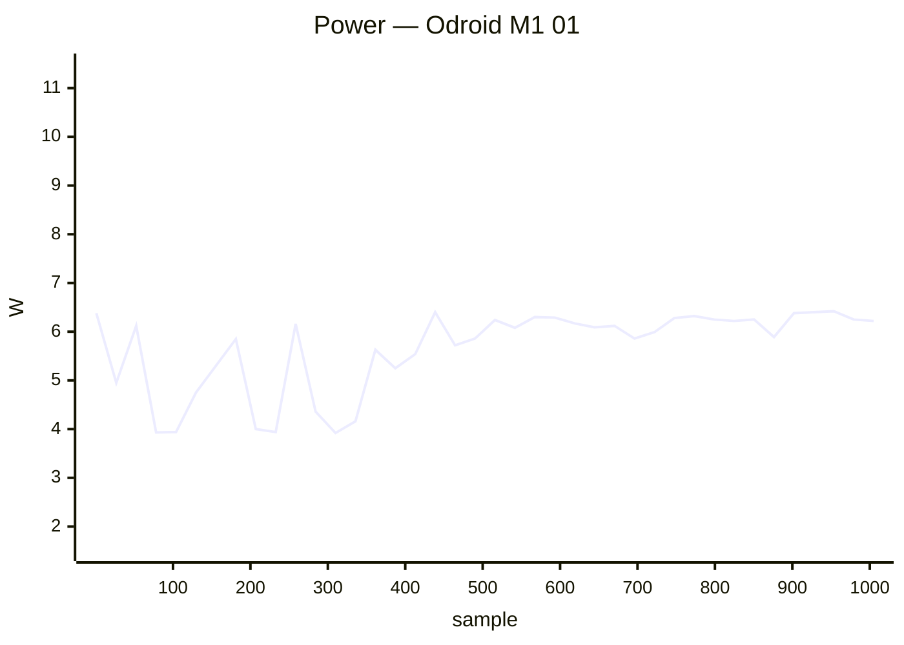

### ❌ Orange Pi 5 01

`orangepi5` · **inplace** · image `26.11.0-trunk.74` · 2 ✅ · 1 ❌ · 19 ⏭️

| Module | Status | Time | Detail |
|:--|:--:|--:|:--|
| upgrade | ⏭️ | 9.2 s | — |
| reboot | ✅ | 51.5 s | power-cycle · up 22 s |
| kernel-switch | ✅ | 84.5 s | branch=vendor · family=rk35xx · installed=26.11.0-trunk.74 · boot_image=/boot/vmlinuz-6.1.172-vendor-rk35xx · kernel_before=6.18.55-current-rockchip64 |
| reboot | ❌ | 664.7 s | power-cycle · 0/2 boots |
| hw-perf | ⏭️ | 0.0 s | board down after reboot/power-cycle |
| dvfs | ⏭️ | 0.0 s | — |
| net-iperf | ⏭️ | 0.0 s | board down after reboot/power-cycle |
| store-versions | ⏭️ | 0.0 s | — |
| kernel-switch | ⏭️ | 0.0 s | skipped=board down after reboot/power-cycle |
| reboot | ⏭️ | 0.0 s | reboot |
| hw-perf | ⏭️ | 0.0 s | board down after reboot/power-cycle |
| dvfs | ⏭️ | 0.0 s | — |
| net-iperf | ⏭️ | 0.0 s | board down after reboot/power-cycle |
| store-versions | ⏭️ | 0.0 s | — |
| kernel-switch | ⏭️ | 0.0 s | skipped=board down after reboot/power-cycle |
| reboot | ⏭️ | 0.0 s | reboot |
| hw-perf | ⏭️ | 0.0 s | board down after reboot/power-cycle |
| dvfs | ⏭️ | 0.0 s | — |
| net-iperf | ⏭️ | 0.0 s | board down after reboot/power-cycle |
| store-versions | ⏭️ | 0.0 s | — |
| kernel-switch | ⏭️ | 0.0 s | skipped=board down after reboot/power-cycle |
| reboot | ⏭️ | 0.0 s | reboot |

**Power** — min 0.60 W · avg 2.00 W · peak 6.30 W · 518 samples


### ❌ Orange Pi PC + 01

`orangepipcplus` · **inplace** · image `26.11.0-trunk.72` · 0 ✅ · 1 ❌ · 0 ⏭️

| Module | Status | Time | Detail |
|:--|:--:|--:|:--|
| reachable | ❌ | 0.0 s | ip=10.0.50.38 · reachable=False · port=22 |

### ❌ OrangePi 3 LTS 01

`orangepi3-lts` · **inplace** · image `26.8.3` · 15 ✅ · 1 ❌ · 0 ⏭️

| Module | Status | Time | Detail |
|:--|:--:|--:|:--|
| upgrade | ✅ | 155.1 s | nightly · 26.8.3 → 26.11.0-trunk.74 |
| reboot | ✅ | 63.7 s | power-cycle · up 24 s |
| kernel-switch | ✅ | 36.3 s | branch=current · family=sunxi64 · installed=26.11.0-trunk.74 · boot_image=/boot/vmlinuz-6.18.55-current-sunxi64 · kernel_before=6.18.55-current-sunxi64 |
| reboot | ✅ | 96.2 s | power-cycle · 2/2 boots · up 25 s |
| hw-performance | ✅ | 19.5 s | AES 750 · mem 4100 · disk W 54 / R 128 MB/s · 67.5 °C · 1608 MHz |
| dvfs | ✅ | 21.4 s | ondemand · 480–1608 MHz (peak 1608) |
| network-iperf | ✅ | 64.2 s | end0 ↑914/↓941 (1GE) · wlan0 ↑142/↓133 (Wi-Fi 5) Mbps |
| store-versions | ✅ | 4.5 s | 26.11.0-trunk.74 · 6.18.55-current-sunxi64 |
| kernel-switch | ✅ | 89.8 s | branch=edge · family=sunxi64 · installed=26.11.0-trunk.74 · boot_image=/boot/vmlinuz-7.2.9-edge-sunxi64 · kernel_before=6.18.55-current-sunxi64 |
| reboot | ✅ | 92.0 s | power-cycle · 2/2 boots · up 24 s |
| hw-performance | ✅ | 21.0 s | AES 750 · mem 4100 · disk W 54 / R 125 MB/s · 70.8 °C · 1608 MHz |
| dvfs | ✅ | 22.3 s | ondemand · 480–1608 MHz (peak 1608) |
| network-iperf | ✅ | 153.8 s | end0 ↑911/↓937 (1GE) · wlan0 ↑135/↓108 (Wi-Fi 5) Mbps |
| store-versions | ✅ | 4.9 s | 26.11.0-trunk.74 · 7.2.9-edge-sunxi64 |
| kernel-switch | ✅ | 90.1 s | branch=current · family=sunxi64 · installed=26.11.0-trunk.74 · boot_image=/boot/vmlinuz-6.18.55-current-sunxi64 · kernel_before=7.2.9-edge-sunxi64 |
| reboot | ❌ | 224.2 s | power-cycle |

**Power** — min 1.00 W · avg 3.06 W · peak 4.90 W · 911 samples

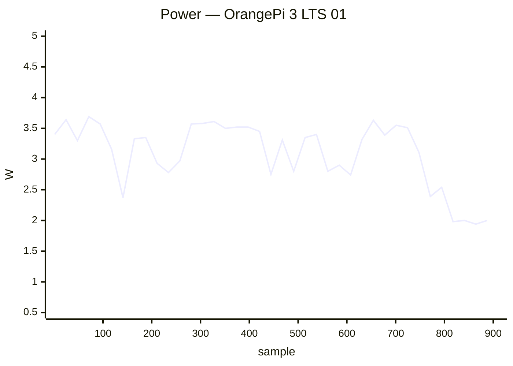

### ❌ ROCK 2F 01

`rock-2f` · **inplace** · image `26.8.1` · 8 ✅ · 2 ❌ · 6 ⏭️

| Module | Status | Time | Detail |
|:--|:--:|--:|:--|
| upgrade | ✅ | 870.4 s | nightly · 26.8.1 → 26.11.0-trunk.74 |
| reboot | ✅ | 10.9 s | power-cycle |
| kernel-switch | ✅ | 41.5 s | branch=vendor · family=rk35xx · installed=26.11.0-trunk.74 · boot_image=/boot/vmlinuz-6.1.172-vendor-rk35xx · kernel_before=6.1.115-vendor-rk35xx |
| reboot | ✅ | 41.9 s | power-cycle · 1/2 boots · up 19 s |
| hw-performance | ✅ | 29.7 s | AES 830 · mem 6000 · disk W 20 / R 22 MB/s · 56.6 °C · 2016 MHz |
| dvfs | ✅ | 22.3 s | ondemand · 408–2016 MHz (peak 2016) |
| network-iperf | ✅ | 39.9 s | wlan0 ↑211/↓249 (Wi-Fi 6) Mbps |
| store-versions | ✅ | 4.8 s | 26.11.0-trunk.74 · 6.1.172-vendor-rk35xx |
| kernel-switch | ❌ | 812.2 s | branch=edge · phase=install · dpkg_state=absent |
| reboot | ❌ | 208.4 s | power-cycle · 0/2 boots |
| hw-perf | ⏭️ | 0.0 s | board down after reboot/power-cycle |
| dvfs | ⏭️ | 0.0 s | — |
| net-iperf | ⏭️ | 0.0 s | board down after reboot/power-cycle |
| store-versions | ⏭️ | 0.0 s | — |
| kernel-switch | ⏭️ | 0.0 s | skipped=board down after reboot/power-cycle |
| reboot | ⏭️ | 0.0 s | reboot |

### ❌ SpacemiT MusePi Pro 01

`musepipro` · **inplace** · image `26.11.0-trunk.74` · 1 ✅ · 1 ❌ · 4 ⏭️

| Module | Status | Time | Detail |
|:--|:--:|--:|:--|
| upgrade | ✅ | 79.4 s | nightly · 26.11.0-trunk.74 → 26.11.0-trunk.74 |
| reboot | ❌ | 222.5 s | power-cycle |
| hw-perf | ⏭️ | 0.0 s | board down after reboot/power-cycle |
| dvfs | ⏭️ | 0.0 s | — |
| net-iperf | ⏭️ | 0.0 s | board down after reboot/power-cycle |
| store-versions | ⏭️ | 0.0 s | — |

**Power** — min 2.00 W · avg 3.04 W · peak 4.10 W · 238 samples

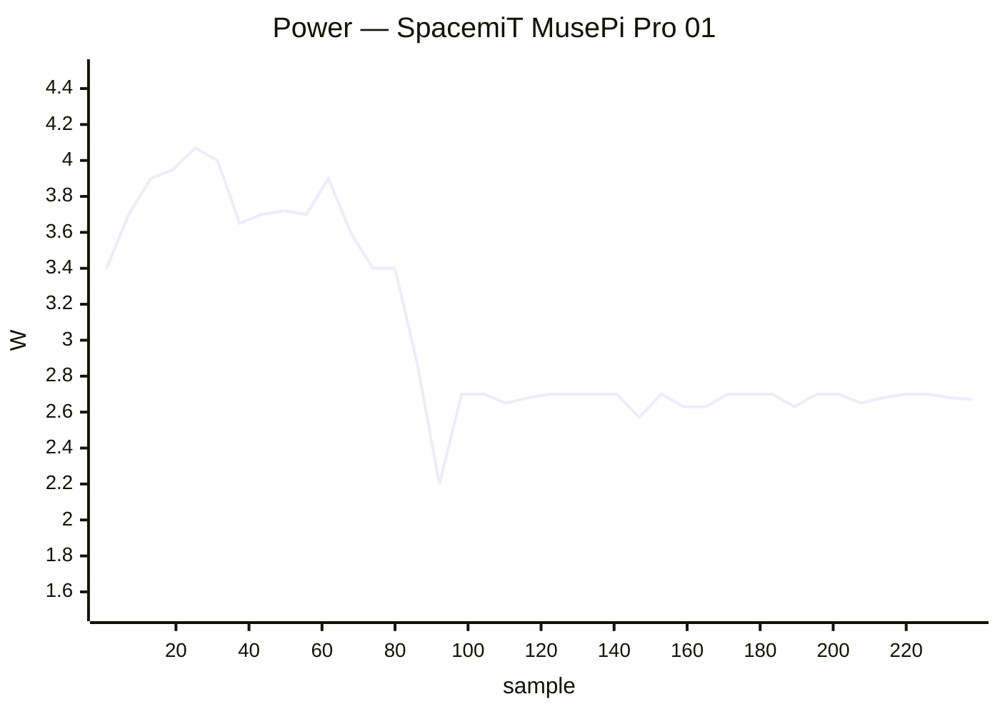

## ✅ Passed (58)

### ✅ Arduino UNO Q 01

`arduino-uno-q` · **inplace** · image `26.11.0-trunk.74` · 7 ✅ · 1 ❌ · 0 ⏭️

| Module | Status | Time | Detail |
|:--|:--:|--:|:--|
| upgrade | ✅ | 80.2 s | nightly · 26.11.0-trunk.74 → 26.11.0-trunk.74 |
| reboot | ✅ | 53.7 s | warm · up 35 s |
| kernel-switch | ✅ | 46.2 s | branch=edge · family=qrb2210 · installed=26.11.0-trunk.74 · boot_image=? · kernel_before=7.2.3-edge-qrb2210 |
| reboot | ✅ | 108.8 s | warm · 2/2 boots · up 42 s |
| hw-performance | ✅ | 25.9 s | AES 936 · mem 5100 · disk W 184 / R 259 MB/s · 43.1 °C · 2016 MHz |
| dvfs | ✅ | 32.8 s | schedutil · 300–2016 MHz (peak 2016) |
| network-iperf | ❌ | 305.5 s | wlan0 ↑0/↓9 (Wi-Fi 5) · usb0 ↑?/↓? Mbps |
| store-versions | ✅ | 7.4 s | 26.11.0-trunk.74 · 7.2.3-edge-qrb2210 |

### ✅ Banana Pi CM4IO 01

`bananapicm4io` · **inplace** · image `26.11.0-trunk.74` · 16 ✅ · 0 ❌ · 0 ⏭️

| Module | Status | Time | Detail |
|:--|:--:|--:|:--|
| upgrade | ✅ | 37.5 s | nightly · 26.11.0-trunk.74 → 26.11.0-trunk.74 |
| reboot | ✅ | 65.1 s | power-cycle · up 28 s |
| kernel-switch | ✅ | 24.2 s | branch=current · family=meson64 · installed=26.11.0-trunk.74 · boot_image=/boot/vmlinuz-6.18.55-current-meson64 · kernel_before=6.18.55-current-meson64 |
| reboot | ✅ | 86.4 s | power-cycle · 2/2 boots · up 25 s |
| hw-performance | ✅ | 32.5 s | AES 1365 · mem 6200 · disk W 8 / R 22 MB/s · 65.3 °C · 2016 MHz |
| dvfs | ✅ | 15.4 s | performance · 1000–2016 MHz (peak 2400) |
| network-iperf | ✅ | 134.0 s | end0 ↑937/↓941 (1GE) · wlan0 ↑43/↓33 (Wi-Fi 5) Mbps |
| store-versions | ✅ | 3.5 s | 26.11.0-trunk.74 · 6.18.55-current-meson64 |
| kernel-switch | ✅ | 122.1 s | branch=edge · family=meson64 · installed=26.11.0-trunk.74 · boot_image=/boot/vmlinuz-7.3.0-rc6-edge-meson64 · kernel_before=6.18.55-current-meson64 |
| reboot | ✅ | 83.8 s | power-cycle · 2/2 boots · up 25 s |
| hw-performance | ✅ | 32.5 s | AES 1365 · mem 6200 · disk W 9 / R 22 MB/s · 67.4 °C · 2016 MHz |
| dvfs | ✅ | 17.0 s | performance · 1000–2016 MHz (peak 2400) |
| network-iperf | ✅ | 137.2 s | end0 ↑937/↓941 (1GE) · wlan0 ↑43/↓33 (Wi-Fi 5) Mbps |
| store-versions | ✅ | 3.3 s | 26.11.0-trunk.74 · 7.3.0-rc6-edge-meson64 |
| kernel-switch | ✅ | 120.8 s | branch=current · family=meson64 · installed=26.11.0-trunk.74 · boot_image=/boot/vmlinuz-6.18.55-current-meson64 · kernel_before=7.3.0-rc6-edge-meson64 |
| reboot | ✅ | 62.5 s | power-cycle · up 26 s |

**Power** — min 2.40 W · avg 4.93 W · peak 11.20 W · 778 samples

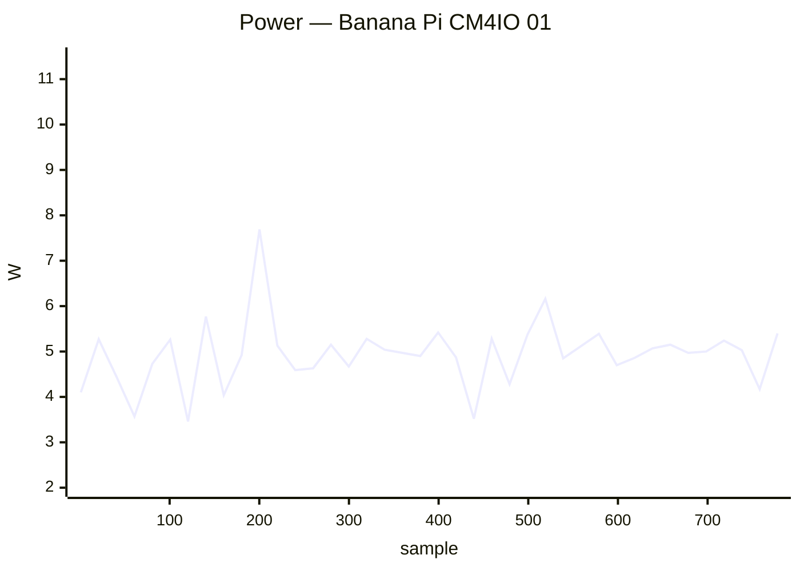

### ✅ Banana Pi M2 Ultra 01

`bananapim2ultra` · **inplace** · image `26.11.0-trunk.74` · 16 ✅ · 0 ❌ · 0 ⏭️

| Module | Status | Time | Detail |
|:--|:--:|--:|:--|
| upgrade | ✅ | 100.4 s | nightly · 26.11.0-trunk.74 → 26.11.0-trunk.74 |
| reboot | ✅ | 44.9 s | warm · up 26 s |
| kernel-switch | ✅ | 66.9 s | branch=current · family=sunxi · installed=26.11.0-trunk.74 · boot_image=/boot/vmlinuz-6.18.55-current-sunxi · kernel_before=6.18.55-current-sunxi |
| reboot | ✅ | 85.5 s | warm · 2/2 boots · up 28 s |
| hw-performance | ✅ | 41.7 s | AES 23 · mem 2100 · disk W 7 / R 42 MB/s · 56.6 °C · 1200 MHz |
| dvfs | ✅ | 33.7 s | ondemand · 720–1200 MHz (peak 1200) |
| network-iperf | ✅ | 326.1 s | end0 ↑808/↓941 (1GE) · wlan0 ↑32/↓40 (Wi-Fi 4) Mbps |
| store-versions | ✅ | 7.3 s | 26.11.0-trunk.74 · 6.18.55-current-sunxi |
| kernel-switch | ✅ | 201.7 s | branch=edge · family=sunxi · installed=26.11.0-trunk.74 · boot_image=/boot/vmlinuz-7.2.9-edge-sunxi · kernel_before=6.18.55-current-sunxi |
| reboot | ✅ | 82.6 s | warm · 2/2 boots · up 26 s |
| hw-performance | ✅ | 37.1 s | AES 23 · mem 2000 · disk W 15 / R 43 MB/s · 55.9 °C · 1200 MHz |
| dvfs | ✅ | 37.0 s | ondemand · 720–1200 MHz (peak 1200) |
| network-iperf | ✅ | 150.1 s | end0 ↑819/↓941 (1GE) · wlan0 ↑17/↓19 (Wi-Fi 4) Mbps |
| store-versions | ✅ | 7.5 s | 26.11.0-trunk.74 · 7.2.9-edge-sunxi |
| kernel-switch | ✅ | 183.9 s | branch=current · family=sunxi · installed=26.11.0-trunk.74 · boot_image=/boot/vmlinuz-6.18.55-current-sunxi · kernel_before=7.2.9-edge-sunxi |
| reboot | ✅ | 45.0 s | warm · up 26 s |

### ✅ Banana Pi M2Pro 01

`bananapim2pro` · **inplace** · image `26.11.0-trunk.74` · 16 ✅ · 0 ❌ · 0 ⏭️

| Module | Status | Time | Detail |
|:--|:--:|--:|:--|
| upgrade | ✅ | 47.0 s | nightly · 26.11.0-trunk.74 → 26.11.0-trunk.74 |
| reboot | ✅ | 140.6 s | power-cycle · up 103 s |
| kernel-switch | ✅ | 31.0 s | branch=current · family=meson64 · installed=26.11.0-trunk.74 · boot_image=/boot/vmlinuz-6.18.55-current-meson64 · kernel_before=6.18.55-current-meson64 |
| reboot | ✅ | 247.4 s | power-cycle · 2/2 boots · up 102 s |
| hw-performance | ✅ | 19.7 s | AES 981 · mem 5300 · disk W 37 / R 156 MB/s · 52.8 °C · 2100 MHz |
| dvfs | ✅ | 19.5 s | ondemand · 1000–2100 MHz (peak 2100) |
| network-iperf | ✅ | 93.4 s | end0 ↑940/↓941 (1GE) Mbps |
| store-versions | ✅ | 4.2 s | 26.11.0-trunk.74 · 6.18.55-current-meson64 |
| kernel-switch | ✅ | 98.7 s | branch=edge · family=meson64 · installed=26.11.0-trunk.74 · boot_image=/boot/vmlinuz-7.3.0-rc6-edge-meson64 · kernel_before=6.18.55-current-meson64 |
| reboot | ✅ | 248.0 s | power-cycle · 2/2 boots · up 102 s |
| hw-performance | ✅ | 19.9 s | AES 980 · mem 5300 · disk W 37 / R 157 MB/s · 53.6 °C · 2100 MHz |
| dvfs | ✅ | 21.0 s | ondemand · 1000–2100 MHz (peak 2100) |
| network-iperf | ✅ | 91.6 s | end0 ↑940/↓941 (1GE) Mbps |
| store-versions | ✅ | 4.3 s | 26.11.0-trunk.74 · 7.3.0-rc6-edge-meson64 |
| kernel-switch | ✅ | 95.3 s | branch=current · family=meson64 · installed=26.11.0-trunk.74 · boot_image=/boot/vmlinuz-6.18.55-current-meson64 · kernel_before=7.3.0-rc6-edge-meson64 |
| reboot | ✅ | 137.9 s | power-cycle · up 101 s |

**Power** — min 1.50 W · avg 3.05 W · peak 5.00 W · 1046 samples

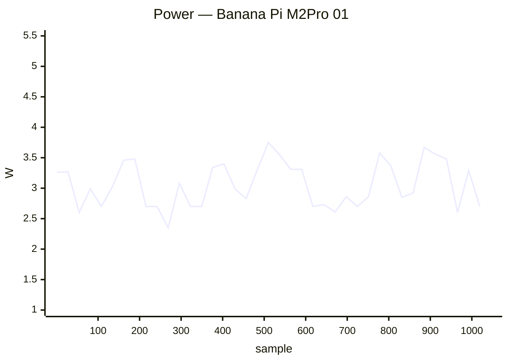

### ✅ Banana Pi M5 01

`bananapim5` · **inplace** · image `26.11.0-trunk.74` · 16 ✅ · 0 ❌ · 0 ⏭️

| Module | Status | Time | Detail |
|:--|:--:|--:|:--|
| upgrade | ✅ | 92.0 s | nightly · 26.11.0-trunk.74 → 26.11.0-trunk.74 |
| reboot | ✅ | 172.7 s | warm · up 155 s |
| kernel-switch | ✅ | 50.6 s | branch=current · family=meson64 · installed=26.11.0-trunk.74 · boot_image=/boot/vmlinuz-6.18.55-current-meson64 · kernel_before=6.18.55-current-meson64 |
| reboot | ✅ | 321.3 s | warm · 2/2 boots · up 147 s |
| hw-performance | ✅ | 38.8 s | AES 980 · mem 5200 · disk W 9 / R 15 MB/s · 57.1 °C · 2100 MHz |
| dvfs | ✅ | 21.2 s | ondemand · 1000–2100 MHz (peak 2100) |
| network-iperf | ✅ | 99.4 s | end0 ↑941/↓941 (1GE) · wlx000f13960190 ↑1/↓12 (Wi-Fi 4) Mbps |
| store-versions | ✅ | 4.7 s | 26.11.0-trunk.74 · 6.18.55-current-meson64 |
| kernel-switch | ✅ | 179.6 s | branch=edge · family=meson64 · installed=26.11.0-trunk.74 · boot_image=/boot/vmlinuz-7.3.0-rc6-edge-meson64 · kernel_before=6.18.55-current-meson64 |
| reboot | ✅ | 110.4 s | warm · 2/2 boots · up 27 s |
| hw-performance | ✅ | 38.6 s | AES 980 · mem 5100 · disk W 10 / R 15 MB/s · 59.5 °C · 2100 MHz |
| dvfs | ✅ | 23.5 s | ondemand · 1000–2100 MHz (peak 2100) |
| network-iperf | ✅ | 92.8 s | end0 ↑941/↓941 (1GE) · wlx000f13960190 ↑1/↓5 (Wi-Fi 4) Mbps |
| store-versions | ✅ | 4.7 s | 26.11.0-trunk.74 · 7.3.0-rc6-edge-meson64 |
| kernel-switch | ✅ | 172.1 s | branch=current · family=meson64 · installed=26.11.0-trunk.74 · boot_image=/boot/vmlinuz-6.18.55-current-meson64 · kernel_before=7.3.0-rc6-edge-meson64 |
| reboot | ✅ | 133.1 s | warm · up 116 s |

### ✅ Banana Pi M7 01

`bananapim7` · **inplace** · image `26.11.0-trunk.74` · 22 ✅ · 0 ❌ · 0 ⏭️

| Module | Status | Time | Detail |
|:--|:--:|--:|:--|
| upgrade | ✅ | 28.1 s | nightly · 26.11.0-trunk.74 → 26.11.0-trunk.74 |
| reboot | ✅ | 45.5 s | power-cycle · up 16 s |
| kernel-switch | ✅ | 18.4 s | branch=vendor · family=rk35xx · installed=26.11.0-trunk.74 · boot_image=/boot/vmlinuz-6.1.172-vendor-rk35xx · kernel_before=6.1.172-vendor-rk35xx |
| reboot | ✅ | 71.0 s | power-cycle · 2/2 boots · up 15 s |
| hw-performance | ✅ | 13.8 s | AES 1253 · mem 15100 · disk W 922 / R 1402 MB/s · 65.6 °C · 1800 MHz |
| dvfs | ✅ | 17.5 s | ondemand · 1800–1800 MHz (peak 2256) |
| network-iperf | ✅ | 54.6 s | enP2p33s0 ↑2347/↓2297 (2.5GE) · enP4p65s0 ↑2351/↓2341 (2.5GE) Mbps |
| store-versions | ✅ | 3.7 s | 26.11.0-trunk.74 · 6.1.172-vendor-rk35xx |
| kernel-switch | ✅ | 47.9 s | branch=current · family=rockchip64 · installed=26.11.0-trunk.74 · boot_image=/boot/vmlinuz-6.18.55-current-rockchip64 · kernel_before=6.1.172-vendor-rk35xx |
| reboot | ✅ | 230.2 s | power-cycle · 2/2 boots · up 97 s |
| hw-performance | ✅ | 13.6 s | AES 1249 · mem 10100 · disk W 883 / R 1572 MB/s · 71.2 °C · 1800 MHz |
| dvfs | ✅ | 15.8 s | ondemand · 408–1800 MHz (peak 2400) |
| network-iperf | ✅ | 123.7 s | enP2p33s0 ↑2353/↓2354 (2.5GE) · enP4p65s0 ↑1924/↓2247 (2.5GE) Mbps |
| store-versions | ✅ | 5.8 s | 26.11.0-trunk.74 · 6.18.55-current-rockchip64 |
| kernel-switch | ✅ | 51.1 s | branch=edge · family=rockchip64 · installed=26.11.0-trunk.74 · boot_image=/boot/vmlinuz-7.3.0-rc6-edge-rockchip64 · kernel_before=6.18.55-current-rockchip64 |
| reboot | ✅ | 229.3 s | power-cycle · 2/2 boots · up 97 s |
| hw-performance | ✅ | 13.5 s | AES 1247 · mem 8000 · disk W 825 / R 1398 MB/s · 73.9 °C · 1800 MHz |
| dvfs | ✅ | 16.9 s | ondemand · 408–1800 MHz (peak 2400) |
| network-iperf | ✅ | 58.3 s | enP2p33s0 ↑2352/↓2354 (2.5GE) Mbps |
| store-versions | ✅ | 3.7 s | 26.11.0-trunk.74 · 7.3.0-rc6-edge-rockchip64 |
| kernel-switch | ✅ | 37.6 s | branch=vendor · family=rk35xx · installed=26.11.0-trunk.74 · boot_image=/boot/vmlinuz-6.1.172-vendor-rk35xx · kernel_before=7.3.0-rc6-edge-rockchip64 |
| reboot | ✅ | 44.5 s | power-cycle · up 15 s |

**Power** — min 0.60 W · avg 7.19 W · peak 14.80 W · 751 samples


### ✅ Banana Pi R2 01

`bananapir2` · **inplace** · image `26.11.0-trunk.74` · 16 ✅ · 0 ❌ · 0 ⏭️

| Module | Status | Time | Detail |
|:--|:--:|--:|:--|
| upgrade | ✅ | 93.6 s | nightly · 26.11.0-trunk.74 → 26.11.0-trunk.74 |
| reboot | ✅ | 73.9 s | power-cycle · up 35 s |
| kernel-switch | ✅ | 61.6 s | branch=current · family=mt7623 · installed=26.11.0-trunk.74 · boot_image=/boot/vmlinuz-6.18.55-current-mt7623 · kernel_before=6.18.55-current-mt7623 |
| reboot | ✅ | 113.6 s | power-cycle · 2/2 boots · up 36 s |
| hw-performance | ✅ | 43.8 s | AES 25 · mem 1600 · disk W 20 / R 22 MB/s · 53.8 °C · 1300 MHz |
| dvfs | ✅ | 40.8 s | ondemand · 98–1300 MHz (peak 1300) |
| network-iperf | ✅ | 163.1 s | lan2 ↑939/↓939 Mbps |
| store-versions | ✅ | 8.7 s | 26.11.0-trunk.74 · 6.18.55-current-mt7623 |
| kernel-switch | ✅ | 140.5 s | branch=edge · family=mt7623 · installed=26.11.0-trunk.74 · boot_image=/boot/vmlinuz-7.2.9-edge-mt7623 · kernel_before=6.18.55-current-mt7623 |
| reboot | ✅ | 115.1 s | power-cycle · 2/2 boots · up 35 s |
| hw-performance | ✅ | 44.6 s | AES 25 · mem 1600 · disk W 20 / R 22 MB/s · 54 °C · 1300 MHz |
| dvfs | ✅ | 43.0 s | ondemand · 98–1300 MHz (peak 1300) |
| network-iperf | ✅ | 93.2 s | lan2 ↑924/↓919 Mbps |
| store-versions | ✅ | 8.5 s | 26.11.0-trunk.74 · 7.2.9-edge-mt7623 |
| kernel-switch | ✅ | 138.9 s | branch=current · family=mt7623 · installed=26.11.0-trunk.74 · boot_image=/boot/vmlinuz-6.18.55-current-mt7623 · kernel_before=7.2.9-edge-mt7623 |
| reboot | ✅ | 77.7 s | power-cycle · up 38 s |

**Power** — min 2.50 W · avg 5.16 W · peak 6.60 W · 1012 samples

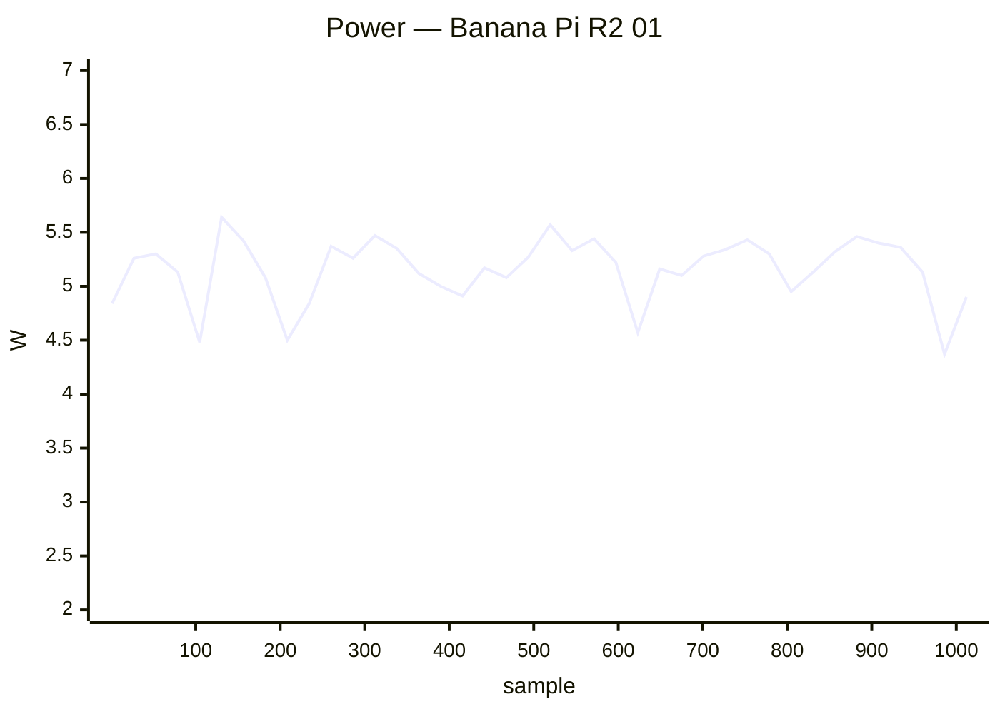

### ✅ Banana Pi R3 Mini 01

`bananapir3mini` · **inplace** · image `26.11.0-trunk` · 4 ✅ · 0 ❌ · 2 ⏭️

| Module | Status | Time | Detail |
|:--|:--:|--:|:--|
| upgrade | ⏭️ | 19.4 s | — |
| reboot | ✅ | 75.7 s | power-cycle · up 40 s |
| hw-performance | ✅ | 20.2 s | AES 934 · mem 3200 · disk W 76 / R 90 MB/s · 76.9 °C · None MHz |
| dvfs | ➖ | 2.3 s | no cpufreq |
| network-iperf | ✅ | 210.5 s | eth0 ↑2352/↓2356 (2.5GE) · eth1 ↑2353/↓2251 (2.5GE) · wlan0 ↑17/↓16 (Wi-Fi 6) · wlan1 ↑293/↓265 (Wi-Fi 6) Mbps |
| store-versions | ✅ | 4.7 s | 26.11.0-trunk · 6.18.52-current-filogic-mt7986 |

**Power** — min 1.80 W · avg 8.30 W · peak 13.50 W · 228 samples

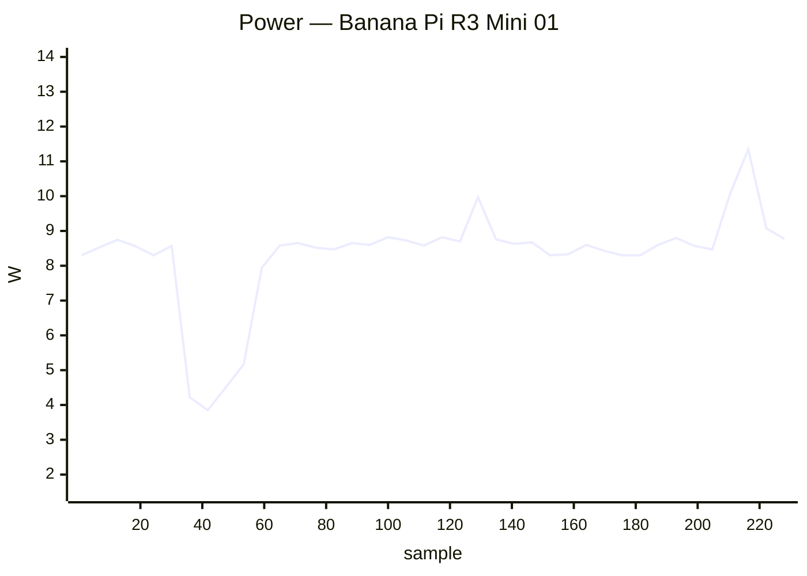

### ✅ BananaPi BPI-F3 01

`musepipro` · **inplace** · image `26.11.0-trunk.74` · 6 ✅ · 0 ❌ · 0 ⏭️

| Module | Status | Time | Detail |
|:--|:--:|--:|:--|
| upgrade | ✅ | 87.9 s | nightly · 26.11.0-trunk.74 → 26.11.0-trunk.74 |
| reboot | ✅ | 57.5 s | power-cycle · up 20 s |
| hw-performance | ✅ | 27.1 s | AES 27 · mem 3000 · disk W 13 / R 82 MB/s · 51 °C · 1600 MHz |
| dvfs | ✅ | 23.7 s | performance · 614–1600 MHz (peak 1600) |
| network-iperf | ✅ | 160.6 s | eth0 ↑941/↓941 (1GE) · wlan0 ↑220/↓311 (Wi-Fi 6) · wlan1 ↑239/↓188 (Wi-Fi 5) Mbps |
| store-versions | ✅ | 5.1 s | 26.11.0-trunk.74 · 6.18.55-current-spacemit |

**Power** — min 3.10 W · avg 5.20 W · peak 7.90 W · 287 samples

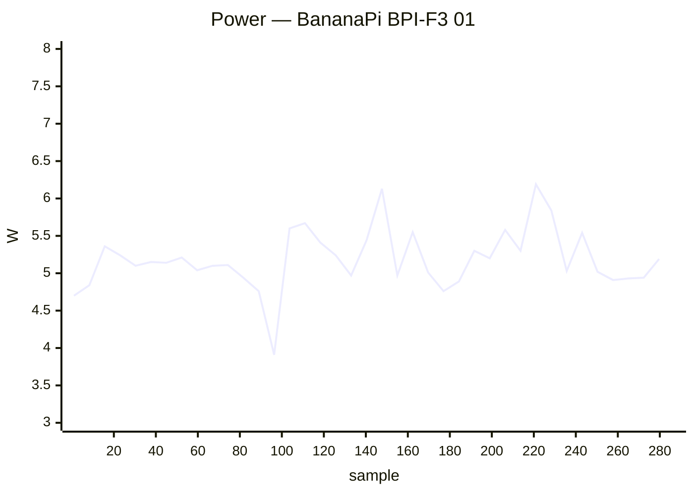

### ✅ BananaPi BPI-M4-Zero 01

`bananapim4zero` · **inplace** · image `26.11.0-trunk.74` · 8 ✅ · 0 ❌ · 0 ⏭️

| Module | Status | Time | Detail |
|:--|:--:|--:|:--|
| upgrade | ✅ | 119.5 s | nightly · 26.11.0-trunk.74 → 26.11.0-trunk.74 |
| reboot | ✅ | 75.4 s | power-cycle · up 24 s |
| kernel-switch | ✅ | 51.1 s | branch=current · family=sunxi64 · installed=26.11.0-trunk.74 · boot_image=/boot/vmlinuz-6.18.55-current-sunxi64 · kernel_before=6.18.55-current-sunxi64 |
| reboot | ✅ | 407.2 s | power-cycle · 1/2 boots · up 33 s |
| hw-performance | ✅ | 33.4 s | AES 652 · mem 3600 · disk W 13 / R 22 MB/s · 54.1 °C · 1416 MHz |
| dvfs | ✅ | 41.9 s | ondemand · 480–1416 MHz (peak 1416) |
| network-iperf | ✅ | 65.9 s | wlan0 ↑83/↓102 (Wi-Fi 5) Mbps |
| store-versions | ✅ | 5.6 s | 26.11.0-trunk.74 · 6.18.55-current-sunxi64 |

### ✅ Clearfog Pro 01

`clearfogpro` · **inplace** · image `26.11.0-trunk.74` · 14 ✅ · 0 ❌ · 2 ⏭️

| Module | Status | Time | Detail |
|:--|:--:|--:|:--|
| upgrade | ✅ | 59.4 s | nightly · 26.11.0-trunk.74 → 26.11.0-trunk.74 |
| reboot | ✅ | 43.5 s | warm · up 24 s |
| kernel-switch | ✅ | 41.7 s | branch=current · family=mvebu · installed=26.11.0-trunk.74 · boot_image=/boot/vmlinuz-6.18.55-current-mvebu · kernel_before=6.18.55-current-mvebu |
| reboot | ✅ | 79.1 s | warm · 2/2 boots · up 26 s |
| hw-performance | ✅ | 33.5 s | AES 43 · mem 3800 · disk W 21 / R 23 MB/s · 64.6 °C · None MHz |
| dvfs | ➖ | 2.8 s | no cpufreq |
| network-iperf | ✅ | 42.4 s | lan2 ↑936/↓936 Mbps |
| store-versions | ✅ | 6.5 s | 26.11.0-trunk.74 · 6.18.55-current-mvebu |
| kernel-switch | ✅ | 103.2 s | branch=edge · family=mvebu · installed=26.11.0-trunk.74 · boot_image=/boot/vmlinuz-7.2.9-edge-mvebu · kernel_before=6.18.55-current-mvebu |
| reboot | ✅ | 77.9 s | warm · 2/2 boots · up 21 s |
| hw-performance | ✅ | 33.8 s | AES 43 · mem 3800 · disk W 21 / R 24 MB/s · 67 °C · None MHz |
| dvfs | ➖ | 3.6 s | no cpufreq |
| network-iperf | ✅ | 34.8 s | lan2 ↑936/↓936 Mbps |
| store-versions | ✅ | 6.8 s | 26.11.0-trunk.74 · 7.2.9-edge-mvebu |
| kernel-switch | ✅ | 103.6 s | branch=current · family=mvebu · installed=26.11.0-trunk.74 · boot_image=/boot/vmlinuz-6.18.55-current-mvebu · kernel_before=7.2.9-edge-mvebu |
| reboot | ✅ | 43.5 s | warm · up 24 s |

### ✅ Cubie A5E 01

`radxa-cubie-a5e` · **inplace** · image `26.11.0-trunk.74` · 14 ✅ · 0 ❌ · 2 ⏭️

| Module | Status | Time | Detail |
|:--|:--:|--:|:--|
| upgrade | ✅ | 85.2 s | nightly · 26.11.0-trunk.74 → 26.11.0-trunk.74 |
| reboot | ✅ | 73.4 s | power-cycle · up 31 s |
| kernel-switch | ✅ | 56.0 s | branch=current · family=sunxi64 · installed=26.11.0-trunk.74 · boot_image=? · kernel_before=6.18.55-current-sunxi64 |
| reboot | ✅ | 104.9 s | power-cycle · 2/2 boots · up 32 s |
| hw-performance | ✅ | 33.8 s | AES 358 · mem 2000 · disk W 20 / R 23 MB/s · 67.3 °C · None MHz |
| dvfs | ➖ | 2.7 s | no cpufreq |
| network-iperf | ✅ | 373.7 s | end0 ↑817/↓941 (1GE) · end1 ↑941/↓941 (1GE) · wlan0 ↑120/↓95 (Wi-Fi 6) Mbps |
| store-versions | ✅ | 5.8 s | 26.11.0-trunk.74 · 6.18.55-current-sunxi64 |
| kernel-switch | ✅ | 564.3 s | branch=edge · family=sunxi64 · installed=26.11.0-trunk.74 · boot_image=? · kernel_before=6.18.55-current-sunxi64 |
| reboot | ✅ | 109.8 s | power-cycle · 2/2 boots · up 33 s |
| hw-performance | ✅ | 33.8 s | AES 358 · mem 2000 · disk W 21 / R 23 MB/s · 73.8 °C · None MHz |
| dvfs | ➖ | 2.8 s | no cpufreq |
| network-iperf | ✅ | 353.9 s | end0 ↑815/↓941 (1GE) · end1 ↑940/↓940 (1GE) · wlan0 ↑49/↓42 (Wi-Fi 6) Mbps |
| store-versions | ✅ | 5.9 s | 26.11.0-trunk.74 · 7.2.9-edge-sunxi64 |
| kernel-switch | ✅ | 562.6 s | branch=current · family=sunxi64 · installed=26.11.0-trunk.74 · boot_image=? · kernel_before=7.2.9-edge-sunxi64 |
| reboot | ✅ | 67.9 s | power-cycle · up 32 s |

**Power** — min 0.80 W · avg 4.12 W · peak 6.50 W · 1959 samples


### ✅ Cubietruck 01

`cubietruck` · **inplace** · image `26.11.0-trunk.74` · 16 ✅ · 0 ❌ · 0 ⏭️

| Module | Status | Time | Detail |
|:--|:--:|--:|:--|
| upgrade | ✅ | 139.1 s | nightly · 26.11.0-trunk.74 → 26.11.0-trunk.74 |
| reboot | ✅ | 75.5 s | warm · up 50 s |
| kernel-switch | ✅ | 95.7 s | branch=current · family=sunxi · installed=26.11.0-trunk.74 · boot_image=/boot/vmlinuz-6.18.55-current-sunxi · kernel_before=6.18.55-current-sunxi |
| reboot | ✅ | 134.9 s | warm · 2/2 boots · up 47 s |
| hw-performance | ✅ | 59.3 s | AES 18 · mem 1700 · disk W 14 / R 22 MB/s · 51.5 °C · 960 MHz |
| dvfs | ✅ | 56.0 s | ondemand · 528–960 MHz (peak 960) |
| network-iperf | ✅ | 200.6 s | end0 ↑728/↓802 (1GE) · wlan0 ↑18/↓21 (Wi-Fi 4) Mbps |
| store-versions | ✅ | 11.6 s | 26.11.0-trunk.74 · 6.18.55-current-sunxi |
| kernel-switch | ✅ | 230.1 s | branch=edge · family=sunxi · installed=26.11.0-trunk.74 · boot_image=/boot/vmlinuz-7.2.9-edge-sunxi · kernel_before=6.18.55-current-sunxi |
| reboot | ✅ | 133.0 s | warm · 2/2 boots · up 47 s |
| hw-performance | ✅ | 58.6 s | AES 19 · mem 1700 · disk W 14 / R 22 MB/s · 51.8 °C · 960 MHz |
| dvfs | ✅ | 57.0 s | ondemand · 528–960 MHz (peak 960) |
| network-iperf | ✅ | 114.8 s | end0 ↑607/↓930 (1GE) · wlan0 ↑20/↓16 (Wi-Fi 4) Mbps |
| store-versions | ✅ | 11.5 s | 26.11.0-trunk.74 · 7.2.9-edge-sunxi |
| kernel-switch | ✅ | 224.5 s | branch=current · family=sunxi · installed=26.11.0-trunk.74 · boot_image=/boot/vmlinuz-6.18.55-current-sunxi · kernel_before=7.2.9-edge-sunxi |
| reboot | ✅ | 73.1 s | warm · up 49 s |

### ✅ Cubox i2eX/i4 01

`cubox-i` · **inplace** · image `26.11.0-trunk.73` · 16 ✅ · 0 ❌ · 0 ⏭️

| Module | Status | Time | Detail |
|:--|:--:|--:|:--|
| upgrade | ✅ | 634.2 s | nightly · 26.11.0-trunk.73 → 26.11.0-trunk.74 |
| reboot | ✅ | 88.2 s | power-cycle · up 48 s |
| kernel-switch | ✅ | 71.8 s | branch=current · family=imx6 · installed=26.11.0-trunk.74 · boot_image=/boot/vmlinuz-6.18.55-current-imx6 · kernel_before=6.18.55-current-imx6 |
| reboot | ✅ | 162.1 s | power-cycle · 2/2 boots · up 47 s |
| hw-performance | ✅ | 47.5 s | AES 26 · mem 782 · disk W 19 / R 20 MB/s · 54.3 °C · 996 MHz |
| dvfs | ✅ | 40.3 s | ondemand · 396–996 MHz (peak 996) |
| network-iperf | ✅ | 304.6 s | end0 ↑94/↓94 (10/100ME) · wlan0 ↑18/↓16 (Wi-Fi 4) Mbps |
| store-versions | ✅ | 8.6 s | 26.11.0-trunk.74 · 6.18.55-current-imx6 |
| kernel-switch | ✅ | 298.0 s | branch=edge · family=imx6 · installed=26.11.0-trunk.74 · boot_image=/boot/vmlinuz-7.1.13-edge-imx6 · kernel_before=6.18.55-current-imx6 |
| reboot | ✅ | 144.4 s | power-cycle · 2/2 boots · up 46 s |
| hw-performance | ✅ | 47.2 s | AES 25 · mem 727 · disk W 19 / R 20 MB/s · 56 °C · 996 MHz |
| dvfs | ✅ | 44.1 s | ondemand · 396–996 MHz (peak 996) |
| network-iperf | ✅ | 159.8 s | end0 ↑94/↓94 (10/100ME) · wlan0 ↑17/↓17 (Wi-Fi 4) Mbps |
| store-versions | ✅ | 8.7 s | 26.11.0-trunk.74 · 7.1.13-edge-imx6 |
| kernel-switch | ✅ | 279.8 s | branch=current · family=imx6 · installed=26.11.0-trunk.74 · boot_image=/boot/vmlinuz-6.18.55-current-imx6 · kernel_before=7.1.13-edge-imx6 |
| reboot | ✅ | 87.0 s | power-cycle · up 46 s |

**Power** — min 1.80 W · avg 3.03 W · peak 6.10 W · 1937 samples

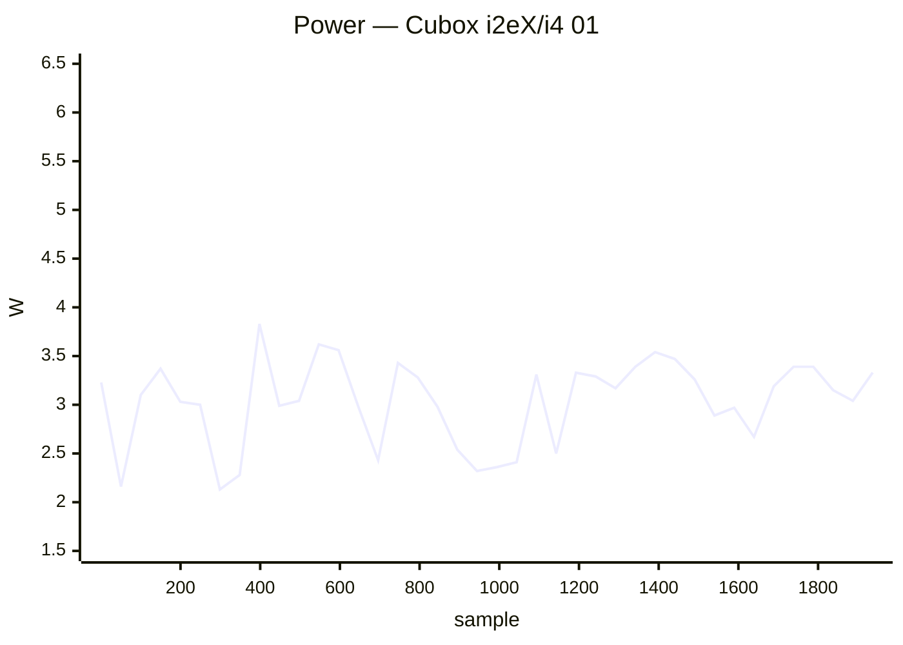

### ✅ Espressobin 01

`espressobin` · **inplace** · image `26.11.0-trunk.74` · 16 ✅ · 0 ❌ · 0 ⏭️

| Module | Status | Time | Detail |
|:--|:--:|--:|:--|
| upgrade | ✅ | 151.5 s | nightly · 26.11.0-trunk.74 → 26.11.0-trunk.74 |
| reboot | ✅ | 81.3 s | power-cycle · up 42 s |
| kernel-switch | ✅ | 81.0 s | branch=current · family=mvebu64 · installed=26.11.0-trunk.74 · boot_image=/boot/vmlinuz-6.18.55-current-mvebu64 · kernel_before=6.18.55-current-mvebu64 |
| reboot | ✅ | 128.2 s | power-cycle · 2/2 boots · up 42 s |
| hw-performance | ✅ | 39.4 s | AES 367 · mem 2000 · disk W 11 / R 132 MB/s · None °C · 800 MHz |
| dvfs | ✅ | 34.8 s | ondemand · 200–800 MHz (peak 800) |
| network-iperf | ✅ | 108.5 s | lan0 ↑936/↓740 (1GE) Mbps |
| store-versions | ✅ | 7.5 s | 26.11.0-trunk.74 · 6.18.55-current-mvebu64 |
| kernel-switch | ✅ | 366.9 s | branch=edge · family=mvebu64 · installed=26.11.0-trunk.74 · boot_image=/boot/vmlinuz-7.1.13-edge-mvebu64 · kernel_before=6.18.55-current-mvebu64 |
| reboot | ✅ | 132.7 s | power-cycle · 2/2 boots · up 45 s |
| hw-performance | ✅ | 38.9 s | AES 370 · mem 2000 · disk W 9 / R 131 MB/s · None °C · 800 MHz |
| dvfs | ✅ | 36.2 s | ondemand · 200–800 MHz (peak 800) |
| network-iperf | ✅ | 46.9 s | lan0 ↑936/↓885 (1GE) Mbps |
| store-versions | ✅ | 8.2 s | 26.11.0-trunk.74 · 7.1.13-edge-mvebu64 |
| kernel-switch | ✅ | 376.0 s | branch=current · family=mvebu64 · installed=26.11.0-trunk.74 · boot_image=/boot/vmlinuz-6.18.55-current-mvebu64 · kernel_before=7.1.13-edge-mvebu64 |
| reboot | ✅ | 79.1 s | power-cycle · up 44 s |

### ✅ Helios4 01

`helios4` · **inplace** · image `26.11.0-trunk.74` · 14 ✅ · 0 ❌ · 2 ⏭️

| Module | Status | Time | Detail |
|:--|:--:|--:|:--|
| upgrade | ✅ | 55.3 s | nightly · 26.11.0-trunk.74 → 26.11.0-trunk.74 |
| reboot | ✅ | 120.8 s | warm · up 104 s |
| kernel-switch | ✅ | 34.1 s | branch=current · family=mvebu · installed=26.11.0-trunk.74 · boot_image=/boot/vmlinuz-6.18.55-current-mvebu · kernel_before=6.18.55-current-mvebu |
| reboot | ✅ | 235.4 s | warm · 2/2 boots · up 103 s |
| hw-performance | ✅ | 29.6 s | AES 43 · mem 3800 · disk W 21 / R 23 MB/s · 56.5 °C · None MHz |
| dvfs | ➖ | 2.4 s | no cpufreq |
| network-iperf | ✅ | 36.6 s | end1 ↑941/↓941 (1GE) Mbps |
| store-versions | ✅ | 5.5 s | 26.11.0-trunk.74 · 6.18.55-current-mvebu |
| kernel-switch | ✅ | 97.5 s | branch=edge · family=mvebu · installed=26.11.0-trunk.74 · boot_image=/boot/vmlinuz-7.2.9-edge-mvebu · kernel_before=6.18.55-current-mvebu |
| reboot | ✅ | 234.7 s | warm · 2/2 boots · up 103 s |
| hw-performance | ✅ | 29.8 s | AES 43 · mem 3800 · disk W 21 / R 23 MB/s · 57 °C · None MHz |
| dvfs | ➖ | 2.4 s | no cpufreq |
| network-iperf | ✅ | 34.3 s | end1 ↑939/↓941 (1GE) Mbps |
| store-versions | ✅ | 5.0 s | 26.11.0-trunk.74 · 7.2.9-edge-mvebu |
| kernel-switch | ✅ | 93.6 s | branch=current · family=mvebu · installed=26.11.0-trunk.74 · boot_image=/boot/vmlinuz-6.18.55-current-mvebu · kernel_before=7.2.9-edge-mvebu |
| reboot | ✅ | 120.9 s | warm · up 105 s |

### ✅ Inovato Quadra 01

`inovato-quadra` · **inplace** · image `26.11.0-trunk.74` · 15 ✅ · 1 ❌ · 0 ⏭️

| Module | Status | Time | Detail |
|:--|:--:|--:|:--|
| upgrade | ✅ | 56.4 s | nightly · 26.11.0-trunk.74 → 26.11.0-trunk.74 |
| reboot | ✅ | 68.8 s | power-cycle · up 25 s |
| kernel-switch | ✅ | 39.7 s | branch=current · family=sunxi64 · installed=26.11.0-trunk.74 · boot_image=/boot/vmlinuz-6.18.55-current-sunxi64 · kernel_before=6.18.55-current-sunxi64 |
| reboot | ✅ | 91.2 s | power-cycle · 2/2 boots · up 25 s |
| hw-performance | ✅ | 30.4 s | AES 794 · mem 2800 · disk W 14 / R 23 MB/s · 68.9 °C · 1704 MHz |
| dvfs | ❌ | 21.1 s | ondemand · 480–1704 MHz (peak 1488) |
| network-iperf | ✅ | 212.6 s | eth0 ↑94/↓94 (10/100ME) · wlan0 ↑7/↓17 (Wi-Fi 4) Mbps |
| store-versions | ✅ | 4.8 s | 26.11.0-trunk.74 · 6.18.55-current-sunxi64 |
| kernel-switch | ✅ | 118.9 s | branch=edge · family=sunxi64 · installed=26.11.0-trunk.74 · boot_image=/boot/vmlinuz-7.2.9-edge-sunxi64 · kernel_before=6.18.55-current-sunxi64 |
| reboot | ✅ | 90.7 s | power-cycle · 2/2 boots · up 25 s |
| hw-performance | ✅ | 30.4 s | AES 794 · mem 2800 · disk W 21 / R 23 MB/s · 70.9 °C · 1704 MHz |
| dvfs | ✅ | 22.4 s | ondemand · 480–1704 MHz (peak 1704) |
| network-iperf | ✅ | 95.3 s | eth0 ↑94/↓94 (10/100ME) · wlan0 ↑8/↓16 (Wi-Fi 4) Mbps |
| store-versions | ✅ | 4.8 s | 26.11.0-trunk.74 · 7.2.9-edge-sunxi64 |
| kernel-switch | ✅ | 110.3 s | branch=current · family=sunxi64 · installed=26.11.0-trunk.74 · boot_image=/boot/vmlinuz-6.18.55-current-sunxi64 · kernel_before=7.2.9-edge-sunxi64 |
| reboot | ✅ | 61.6 s | power-cycle · up 24 s |

**Power** — min 2.20 W · avg 4.04 W · peak 6.10 W · 840 samples

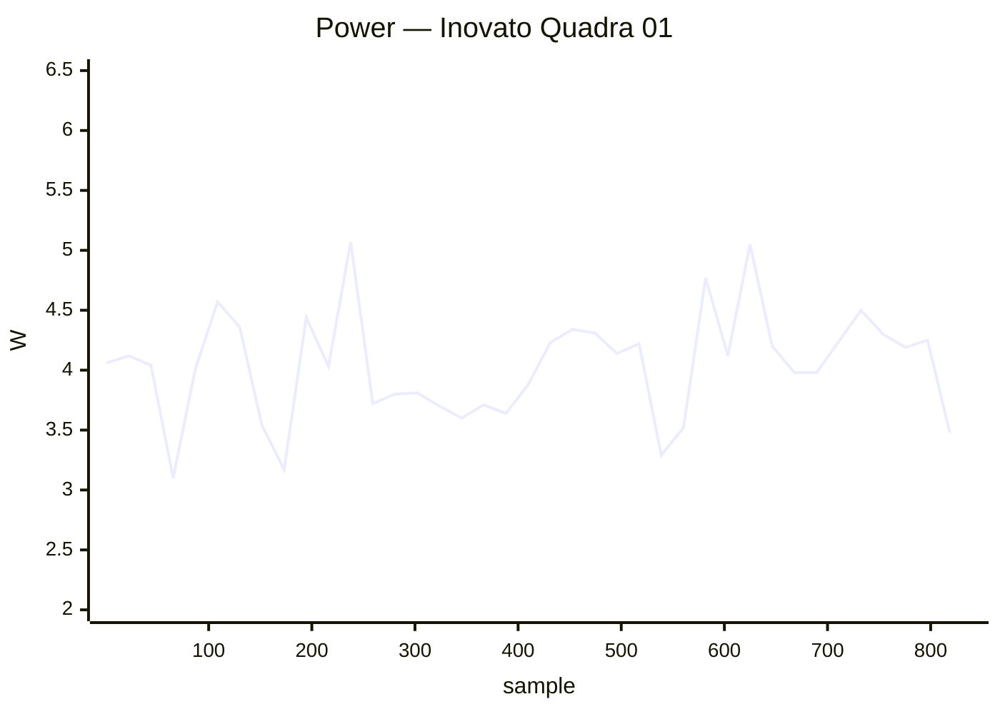

### ✅ Khadas Edge2 01

`khadas-edge2` · **inplace** · image `26.11.0-trunk.74` · 14 ✅ · 0 ❌ · 2 ⏭️

| Module | Status | Time | Detail |
|:--|:--:|--:|:--|
| upgrade | ✅ | 47.1 s | nightly · 26.11.0-trunk.74 → 26.11.0-trunk.74 |
| reboot | ✅ | 33.0 s | warm · up 15 s |
| kernel-switch | ✅ | 22.6 s | branch=vendor · family=rk35xx · installed=26.11.0-trunk.74 · boot_image=/boot/vmlinuz-6.1.172-vendor-rk35xx · kernel_before=6.1.172-vendor-rk35xx |
| reboot | ✅ | 60.3 s | warm · 2/2 boots · up 17 s |
| hw-performance | ✅ | 15.3 s | AES 1272 · mem 14000 · disk W 105 / R 257 MB/s · 36.1 °C · 1800 MHz |
| dvfs | ✅ | 17.8 s | ondemand · 1800–1800 MHz (peak 2256) |
| network-iperf | ⏭️ | 6.5 s | no cabled interfaces |
| store-versions | ✅ | 4.1 s | 26.11.0-trunk.74 · 6.1.172-vendor-rk35xx |
| kernel-switch | ✅ | 68.7 s | branch=current · family=rockchip64 · installed=26.11.0-trunk.74 · boot_image=/boot/vmlinuz-6.18.55-current-rockchip64 · kernel_before=6.1.172-vendor-rk35xx |
| reboot | ✅ | 47.2 s | warm · 2/2 boots · up 8 s |
| hw-performance | ✅ | 15.7 s | AES 1270 · mem 10000 · disk W 101 / R 212 MB/s · 39.8 °C · 1800 MHz |
| dvfs | ✅ | 15.2 s | ondemand · 408–1800 MHz (peak 2400) |
| network-iperf | ⏭️ | 6.5 s | no cabled interfaces |
| store-versions | ✅ | 3.9 s | 26.11.0-trunk.74 · 6.18.55-current-rockchip64 |
| kernel-switch | ✅ | 55.3 s | branch=vendor · family=rk35xx · installed=26.11.0-trunk.74 · boot_image=/boot/vmlinuz-6.1.172-vendor-rk35xx · kernel_before=6.18.55-current-rockchip64 |
| reboot | ✅ | 27.7 s | warm · up 10 s |

### ✅ Khadas VIM1 01

`khadas-vim1` · **inplace** · image `26.11.0-trunk.74` · 16 ✅ · 0 ❌ · 0 ⏭️

| Module | Status | Time | Detail |
|:--|:--:|--:|:--|
| upgrade | ✅ | 66.3 s | nightly · 26.11.0-trunk.74 → 26.11.0-trunk.74 |
| reboot | ✅ | 91.3 s | power-cycle · up 54 s |
| kernel-switch | ✅ | 46.6 s | branch=current · family=meson64 · installed=26.11.0-trunk.74 · boot_image=/boot/vmlinuz-6.18.55-current-meson64 · kernel_before=6.18.55-current-meson64 |
| reboot | ✅ | 115.8 s | power-cycle · 2/2 boots · up 36 s |
| hw-performance | ✅ | 30.5 s | AES 658 · mem 3600 · disk W 19 / R 22 MB/s · 56 °C · 1512 MHz |
| dvfs | ✅ | 22.7 s | ondemand · 500–1512 MHz (peak 1512) |
| network-iperf | ✅ | 100.1 s | end0 ↑94/↓94 (10/100ME) · wlan0 ↑45/↓32 (Wi-Fi 5) Mbps |
| store-versions | ✅ | 4.9 s | 26.11.0-trunk.74 · 6.18.55-current-meson64 |
| kernel-switch | ✅ | 158.0 s | branch=edge · family=meson64 · installed=26.11.0-trunk.74 · boot_image=/boot/vmlinuz-7.3.0-rc6-edge-meson64 · kernel_before=6.18.55-current-meson64 |
| reboot | ✅ | 118.9 s | power-cycle · 2/2 boots · up 39 s |
| hw-performance | ✅ | 30.8 s | AES 659 · mem 3600 · disk W 19 / R 22 MB/s · 56 °C · 1512 MHz |
| dvfs | ✅ | 25.3 s | ondemand · 500–1512 MHz (peak 1512) |
| network-iperf | ✅ | 65.4 s | end0 ↑94/↓94 (10/100ME) · wlan0 ↑13/↓21 (Wi-Fi 5) Mbps |
| store-versions | ✅ | 5.1 s | 26.11.0-trunk.74 · 7.3.0-rc6-edge-meson64 |
| kernel-switch | ✅ | 155.4 s | branch=current · family=meson64 · installed=26.11.0-trunk.74 · boot_image=/boot/vmlinuz-6.18.55-current-meson64 · kernel_before=7.3.0-rc6-edge-meson64 |
| reboot | ✅ | 74.8 s | power-cycle · up 37 s |

**Power** — min 1.20 W · avg 2.26 W · peak 3.80 W · 878 samples


### ✅ Khadas VIM2 01

`khadas-vim2` · **inplace** · image `26.11.0-trunk.74` · 16 ✅ · 0 ❌ · 0 ⏭️

| Module | Status | Time | Detail |
|:--|:--:|--:|:--|
| upgrade | ✅ | 141.0 s | nightly · 26.11.0-trunk.74 → 26.11.0-trunk.74 |
| reboot | ✅ | 41.9 s | warm · up 23 s |
| kernel-switch | ✅ | 53.6 s | branch=current · family=meson64 · installed=26.11.0-trunk.74 · boot_image=/boot/vmlinuz-6.18.55-current-meson64 · kernel_before=6.18.55-current-meson64 |
| reboot | ✅ | 74.4 s | warm · 2/2 boots · up 26 s |
| hw-performance | ✅ | 24.6 s | AES 658 · mem 3600 · disk W 40 / R 138 MB/s · 62 °C · 1512 MHz |
| dvfs | ✅ | 25.3 s | ondemand · 500–1512 MHz (peak 1512) |
| network-iperf | ✅ | 307.8 s | eth0 ↑940/↓941 (1GE) · wlan0 ↑95/↓93 (Wi-Fi 5) Mbps |
| store-versions | ✅ | 6.0 s | 26.11.0-trunk.74 · 6.18.55-current-meson64 |
| kernel-switch | ✅ | 162.7 s | branch=edge · family=meson64 · installed=26.11.0-trunk.74 · boot_image=/boot/vmlinuz-7.3.0-rc6-edge-meson64 · kernel_before=6.18.55-current-meson64 |
| reboot | ✅ | 78.6 s | warm · 2/2 boots · up 26 s |
| hw-performance | ✅ | 24.7 s | AES 658 · mem 3500 · disk W 40 / R 137 MB/s · 63 °C · 1512 MHz |
| dvfs | ✅ | 28.1 s | ondemand · 500–1512 MHz (peak 1512) |
| network-iperf | ✅ | 135.2 s | eth0 ↑940/↓941 (1GE) · wlan0 ↑82/↓88 (Wi-Fi 5) Mbps |
| store-versions | ✅ | 5.7 s | 26.11.0-trunk.74 · 7.3.0-rc6-edge-meson64 |
| kernel-switch | ✅ | 160.2 s | branch=current · family=meson64 · installed=26.11.0-trunk.74 · boot_image=/boot/vmlinuz-6.18.55-current-meson64 · kernel_before=7.3.0-rc6-edge-meson64 |
| reboot | ✅ | 38.3 s | warm · up 20 s |

### ✅ Mekotronics R58HD 01

`mekotronics-r58hd` · **inplace** · image `26.11.0-trunk.75` · 6 ✅ · 0 ❌ · 0 ⏭️

| Module | Status | Time | Detail |
|:--|:--:|--:|:--|
| upgrade | ✅ | 25.6 s | nightly · 26.11.0-trunk.75 → 26.11.0-trunk.75 |
| reboot | ✅ | 52.7 s | power-cycle · up 18 s |
| hw-performance | ✅ | 13.8 s | AES 1290 · mem 16000 · disk W 249 / R 288 MB/s · 53.6 °C · 1800 MHz |
| dvfs | ✅ | 17.3 s | ondemand · 1800–1800 MHz (peak 2304) |
| network-iperf | ✅ | 252.2 s | end0 ↑726/↓940 (1GE) · enP3p49s0 ↑941/↓941 (1GE) Mbps |
| store-versions | ✅ | 8.5 s | 26.11.0-trunk.75 · 6.1.172-vendor-rk35xx |

**Power** — min 3.90 W · avg 5.55 W · peak 12.30 W · 313 samples

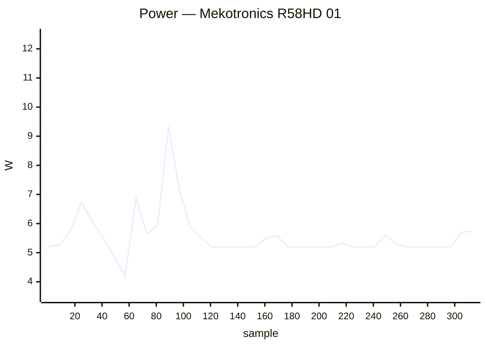

### ✅ Mekotronics R58S2 01

`mekotronics-r58s2` · **inplace** · image `26.11.0-trunk.72` · 5 ✅ · 0 ❌ · 1 ⏭️

| Module | Status | Time | Detail |
|:--|:--:|--:|:--|
| upgrade | ⏭️ | 10.7 s | — |
| reboot | ✅ | 52.2 s | power-cycle · up 15 s |
| hw-performance | ✅ | 14.6 s | AES 1281 · mem 14000 · disk W 223 / R 273 MB/s · 42.5 °C · 1800 MHz |
| dvfs | ✅ | 17.2 s | ondemand · 1800–1800 MHz (peak 2352) |
| network-iperf | ✅ | 55.5 s | end1 ↑940/↓941 (1GE) · wlan0 ↑62/↓175 (Wi-Fi 5) Mbps |
| store-versions | ✅ | 4.1 s | 26.11.0-trunk.72 · 6.1.172-vendor-rk35xx |

**Power** — min 2.10 W · avg 3.50 W · peak 10.40 W · 124 samples

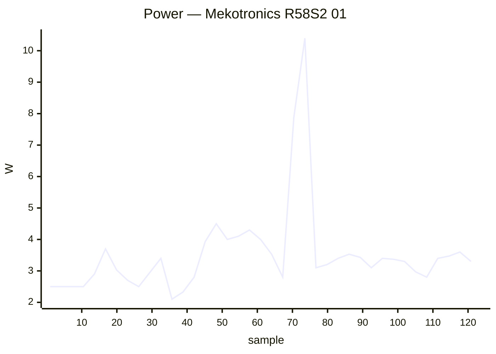

### ✅ NanoPi Fire3 01

`nanopifire3` · **inplace** · image `26.11.0-trunk.74` · 7 ✅ · 0 ❌ · 1 ⏭️

| Module | Status | Time | Detail |
|:--|:--:|--:|:--|
| upgrade | ✅ | 141.4 s | nightly · 26.11.0-trunk.74 → 26.11.0-trunk.74 |
| reboot | ✅ | 75.0 s | power-cycle · up 32 s |
| kernel-switch | ✅ | 71.8 s | branch=edge · family=s5p6818 · installed=26.11.0-trunk.74 · boot_image=/boot/vmlinuz-7.2.9-edge-s5p6818 · kernel_before=7.2.9-edge-s5p6818 |
| reboot | ✅ | 108.4 s | power-cycle · 2/2 boots · up 32 s |
| hw-performance | ✅ | 35.9 s | AES 372 · mem 2000 · disk W 20 / R 21 MB/s · 68 °C · None MHz |
| dvfs | ➖ | 3.0 s | no cpufreq |
| network-iperf | ✅ | 199.7 s | eth0 ↑94/↓94 (10/100ME) Mbps |
| store-versions | ✅ | 6.2 s | 26.11.0-trunk.74 · 7.2.9-edge-s5p6818 |

**Power** — min 2.00 W · avg 2.91 W · peak 4.00 W · 514 samples

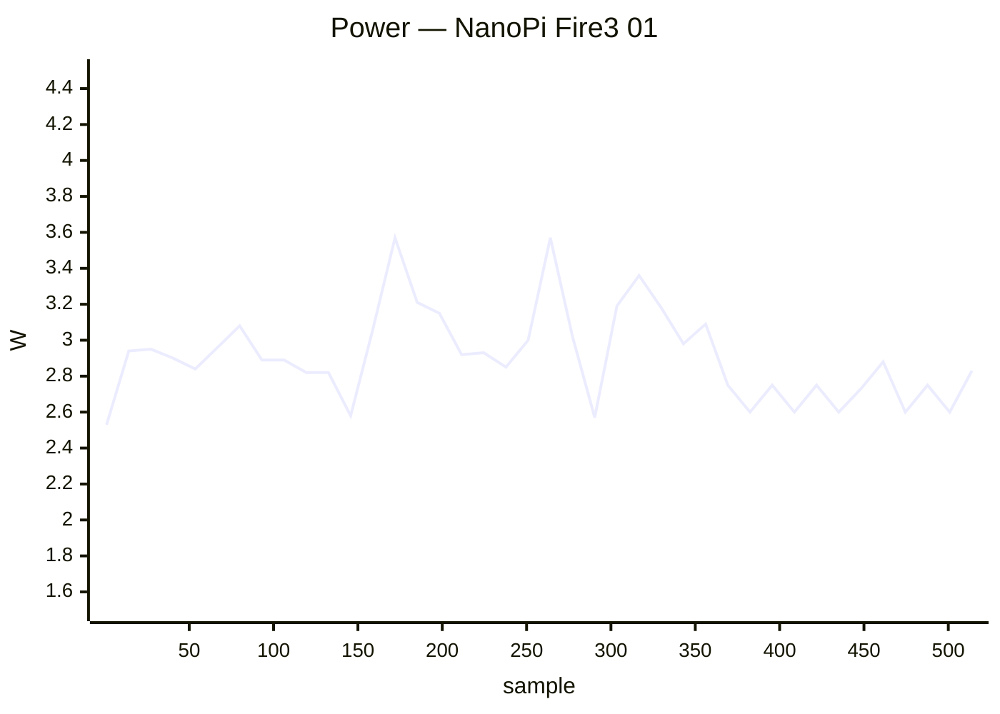

### ✅ NanoPi K2 01

`nanopik2-s905` · **inplace** · image `26.11.0-trunk.74` · 16 ✅ · 0 ❌ · 0 ⏭️

| Module | Status | Time | Detail |
|:--|:--:|--:|:--|
| upgrade | ✅ | 58.9 s | nightly · 26.11.0-trunk.74 → 26.11.0-trunk.74 |
| reboot | ✅ | 44.6 s | warm · up 29 s |
| kernel-switch | ✅ | 41.8 s | branch=current · family=meson64 · installed=26.11.0-trunk.74 · boot_image=/boot/vmlinuz-6.18.55-current-meson64 · kernel_before=6.18.55-current-meson64 |
| reboot | ✅ | 71.5 s | warm · 2/2 boots · up 24 s |
| hw-performance | ✅ | 33.4 s | AES 51 · mem 3800 · disk W 8 / R 41 MB/s · 62 °C · 2016 MHz |
| dvfs | ✅ | 21.1 s | ondemand · 500–1536 MHz (peak 1536) |
| network-iperf | ✅ | 120.5 s | end0 ↑934/↓941 (1GE) · wlan0 ↑14/↓17 (Wi-Fi 4) Mbps |
| store-versions | ✅ | 4.8 s | 26.11.0-trunk.74 · 6.18.55-current-meson64 |
| kernel-switch | ✅ | 160.7 s | branch=edge · family=meson64 · installed=26.11.0-trunk.74 · boot_image=/boot/vmlinuz-7.3.0-rc6-edge-meson64 · kernel_before=6.18.55-current-meson64 |
| reboot | ✅ | 68.1 s | warm · 2/2 boots · up 19 s |
| hw-performance | ✅ | 34.6 s | AES 51 · mem 3700 · disk W 7 / R 41 MB/s · 64 °C · 2016 MHz |
| dvfs | ✅ | 23.5 s | ondemand · 500–1536 MHz (peak 1536) |
| network-iperf | ✅ | 165.2 s | end0 ↑935/↓941 (1GE) · wlan0 ↑14/↓18 (Wi-Fi 4) Mbps |
| store-versions | ✅ | 5.3 s | 26.11.0-trunk.74 · 7.3.0-rc6-edge-meson64 |
| kernel-switch | ✅ | 158.7 s | branch=current · family=meson64 · installed=26.11.0-trunk.74 · boot_image=/boot/vmlinuz-6.18.55-current-meson64 · kernel_before=7.3.0-rc6-edge-meson64 |
| reboot | ✅ | 36.3 s | warm · up 20 s |

### ✅ NanoPi M4V2 01

`nanopim4v2` · **inplace** · image `26.11.0-trunk.74` · 16 ✅ · 0 ❌ · 0 ⏭️

| Module | Status | Time | Detail |
|:--|:--:|--:|:--|
| upgrade | ✅ | 63.1 s | nightly · 26.11.0-trunk.74 → 26.11.0-trunk.74 |
| reboot | ✅ | 67.5 s | power-cycle · up 34 s |
| kernel-switch | ✅ | 33.9 s | branch=current · family=rockchip64 · installed=26.11.0-trunk.74 · boot_image=/boot/vmlinuz-6.18.55-current-rockchip64 · kernel_before=6.18.55-current-rockchip64 |
| reboot | ✅ | 94.6 s | power-cycle · 2/2 boots · up 24 s |
| hw-performance | ✅ | 21.7 s | AES 1021 · mem 6600 · disk W 53 / R 60 MB/s · 46.2 °C · 1416 MHz |
| dvfs | ✅ | 20.5 s | ondemand · 408–1416 MHz (peak 1800) |
| network-iperf | ✅ | 125.5 s | end0 ↑941/↓941 (1GE) · wlan0 ↑136/↓120 (Wi-Fi 5) · wlx803f5d16af63 ↑154/↓199 (Wi-Fi 5) Mbps |
| store-versions | ✅ | 5.0 s | 26.11.0-trunk.74 · 6.18.55-current-rockchip64 |
| kernel-switch | ✅ | 95.9 s | branch=edge · family=rockchip64 · installed=26.11.0-trunk.74 · boot_image=/boot/vmlinuz-7.3.0-rc6-edge-rockchip64 · kernel_before=6.18.55-current-rockchip64 |
| reboot | ✅ | 319.2 s | power-cycle · 1/2 boots · up 24 s |
| hw-performance | ✅ | 21.5 s | AES 1020 · mem 6600 · disk W 53 / R 60 MB/s · 48.8 °C · 1416 MHz |
| dvfs | ✅ | 69.3 s | ondemand · 408–1416 MHz (peak 1800) |
| network-iperf | ✅ | 95.0 s | end0 ↑941/↓941 (1GE) · wlan0 ↑89/↓66 (Wi-Fi 5) · wlx803f5d16af63 ↑106/↓193 (Wi-Fi 5) Mbps |
| store-versions | ✅ | 4.9 s | 26.11.0-trunk.74 · 7.3.0-rc6-edge-rockchip64 |
| kernel-switch | ✅ | 94.0 s | branch=current · family=rockchip64 · installed=26.11.0-trunk.74 · boot_image=/boot/vmlinuz-6.18.55-current-rockchip64 · kernel_before=7.3.0-rc6-edge-rockchip64 |
| reboot | ✅ | 59.5 s | power-cycle · up 25 s |

**Power** — min 2.20 W · avg 7.23 W · peak 12.30 W · 939 samples

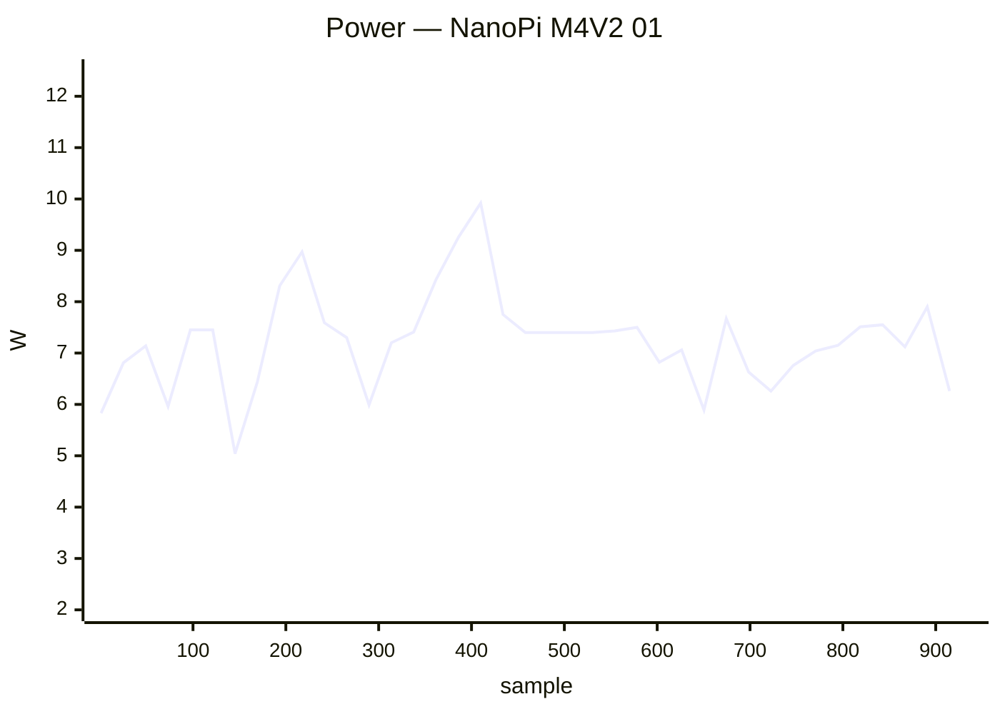

### ✅ NanoPi M5 01

`nanopi-m5` · **inplace** · image `26.11.0-trunk.74` · 22 ✅ · 0 ❌ · 0 ⏭️

| Module | Status | Time | Detail |
|:--|:--:|--:|:--|
| upgrade | ✅ | 34.6 s | nightly · 26.11.0-trunk.74 → 26.11.0-trunk.74 |
| reboot | ✅ | 140.4 s | power-cycle · up 111 s |
| kernel-switch | ✅ | 22.7 s | branch=vendor · family=rk35xx · installed=26.11.0-trunk.74 · boot_image=/boot/vmlinuz-6.1.172-vendor-rk35xx · kernel_before=6.1.172-vendor-rk35xx |
| reboot | ✅ | 261.1 s | power-cycle · 2/2 boots · up 111 s |
| hw-performance | ✅ | 17.9 s | AES 1276 · mem 8000 · disk W 67 / R 77 MB/s · 43.5 °C · 2016 MHz |
| dvfs | ✅ | 18.5 s | ondemand · 2016–2016 MHz (peak 2208) |
| network-iperf | ✅ | 57.9 s | end1 ↑941/↓941 (1GE) · wlx44334c47dec3 ↑38/↓22 (Wi-Fi 4) Mbps |
| store-versions | ✅ | 4.4 s | 26.11.0-trunk.74 · 6.1.172-vendor-rk35xx |
| kernel-switch | ✅ | 102.8 s | branch=current · family=rockchip64 · installed=26.11.0-trunk.74 · boot_image=/boot/vmlinuz-6.18.55-current-rockchip64 · kernel_before=6.1.172-vendor-rk35xx |
| reboot | ✅ | 254.6 s | power-cycle · 2/2 boots · up 109 s |
| hw-performance | ✅ | 26.1 s | AES 1333 · mem 9000 · disk W 20 / R 21 MB/s · 42.5 °C · 2016 MHz |
| dvfs | ✅ | 17.9 s | ondemand · 408–2016 MHz (peak 2208) |
| network-iperf | ✅ | 139.7 s | end1 ↑941/↓939 (1GE) · wlx44334c47dec3 ↑29/↓22 (Wi-Fi 4) Mbps |
| store-versions | ✅ | 4.4 s | 26.11.0-trunk.74 · 6.18.55-current-rockchip64 |
| kernel-switch | ✅ | 100.1 s | branch=edge · family=rockchip64 · installed=26.11.0-trunk.74 · boot_image=/boot/vmlinuz-7.3.0-rc6-edge-rockchip64 · kernel_before=6.18.55-current-rockchip64 |
| reboot | ✅ | 253.3 s | power-cycle · 2/2 boots · up 110 s |
| hw-performance | ✅ | 26.5 s | AES 1327 · mem 8900 · disk W 20 / R 21 MB/s · 42.5 °C · 2016 MHz |
| dvfs | ✅ | 19.6 s | ondemand · 408–2016 MHz (peak 2208) |
| network-iperf | ✅ | 59.9 s | end1 ↑941/↓941 (1GE) · wlx44334c47dec3 ↑33/↓20 (Wi-Fi 4) Mbps |
| store-versions | ✅ | 4.8 s | 26.11.0-trunk.74 · 7.3.0-rc6-edge-rockchip64 |
| kernel-switch | ✅ | 103.8 s | branch=vendor · family=rk35xx · installed=26.11.0-trunk.74 · boot_image=/boot/vmlinuz-6.1.172-vendor-rk35xx · kernel_before=7.3.0-rc6-edge-rockchip64 |
| reboot | ✅ | 58.0 s | power-cycle · up 28 s |

**Power** — min 1.80 W · avg 4.24 W · peak 8.30 W · 1372 samples


### ✅ NanoPi Neo 2 Black 01

`nanopineo2black` · **inplace** · image `26.11.0-trunk.74` · 16 ✅ · 0 ❌ · 0 ⏭️

| Module | Status | Time | Detail |
|:--|:--:|--:|:--|
| upgrade | ✅ | 63.3 s | nightly · 26.11.0-trunk.74 → 26.11.0-trunk.74 |
| reboot | ✅ | 55.4 s | power-cycle · up 17 s |
| kernel-switch | ✅ | 42.1 s | branch=current · family=sunxi64 · installed=26.11.0-trunk.74 · boot_image=/boot/vmlinuz-6.18.55-current-sunxi64 · kernel_before=6.18.55-current-sunxi64 |
| reboot | ✅ | 318.4 s | power-cycle · 1/2 boots · up 17 s |
| hw-performance | ✅ | 23.8 s | AES 638 · mem 3500 · disk W 43 / R 44 MB/s · 64.1 °C · 1368 MHz |
| dvfs | ✅ | 22.9 s | ondemand · 480–1368 MHz (peak 1368) |
| network-iperf | ✅ | 118.6 s | end0 ↑893/↓890 (1GE) Mbps |
| store-versions | ✅ | 5.0 s | 26.11.0-trunk.74 · 6.18.55-current-sunxi64 |
| kernel-switch | ✅ | 109.0 s | branch=edge · family=sunxi64 · installed=26.11.0-trunk.74 · boot_image=/boot/vmlinuz-7.2.9-edge-sunxi64 · kernel_before=6.18.55-current-sunxi64 |
| reboot | ✅ | 303.7 s | power-cycle · 1/2 boots · up 17 s |
| hw-performance | ✅ | 23.4 s | AES 633 · mem 3500 · disk W 43 / R 43 MB/s · 65.2 °C · 1368 MHz |
| dvfs | ✅ | 23.3 s | ondemand · 480–1368 MHz (peak 1368) |
| network-iperf | ✅ | 35.8 s | end0 ↑893/↓917 (1GE) Mbps |
| store-versions | ✅ | 5.0 s | 26.11.0-trunk.74 · 7.2.9-edge-sunxi64 |
| kernel-switch | ✅ | 108.8 s | branch=current · family=sunxi64 · installed=26.11.0-trunk.74 · boot_image=/boot/vmlinuz-6.18.55-current-sunxi64 · kernel_before=7.2.9-edge-sunxi64 |
| reboot | ✅ | 56.5 s | power-cycle · up 18 s |

**Power** — min 1.00 W · avg 2.50 W · peak 5.10 W · 1041 samples

```mermaid
xychart-beta
    title "Power — NanoPi Neo 2 Black 01"
    x-axis "sample" 1 --> 1041
    y-axis "W" 0.5 --> 5.5
    line [2.37, 2.85, 2.63, 2.80, 3.12, 3.10, 1.88, 1.40, 1.42, 1.40, 1.40, 1.40, 1.65, 3.28, 3.70, 3.30, 2.52, 1.79, 1.78, 3.41, 3.28, 3.24, 3.17, 3.08, 2.52, 1.50, 1.50, 1.45, 1.40, 1.40, 2.32, 2.71, 3.18, 3.48, 3.17, 3.37, 3.32, 3.27, 2.61, 2.93]
```

### ✅ NanoPi Neo 3 01

`nanopineo3` · **inplace** · image `26.11.0-trunk.74` · 16 ✅ · 0 ❌ · 0 ⏭️

| Module | Status | Time | Detail |
|:--|:--:|--:|:--|
| upgrade | ✅ | 85.6 s | nightly · 26.11.0-trunk.74 → 26.11.0-trunk.74 |
| reboot | ✅ | 67.6 s | power-cycle · up 27 s |
| kernel-switch | ✅ | 57.6 s | branch=current · family=rockchip64 · installed=26.11.0-trunk.74 · boot_image=/boot/vmlinuz-6.18.55-current-rockchip64 · kernel_before=6.18.55-current-rockchip64 |
| reboot | ✅ | 102.8 s | power-cycle · 2/2 boots · up 29 s |
| hw-performance | ✅ | 28.2 s | AES 595 · mem 2300 · disk W 53 / R 63 MB/s · 78.1 °C · 1296 MHz |
| dvfs | ✅ | 29.9 s | ondemand · 408–1296 MHz (peak 1296) |
| network-iperf | ✅ | 377.7 s | end0 ↑919/↓939 (1GE) · wlx7cdd905518f9 ↑32/↓28 (Wi-Fi 4) Mbps |
| store-versions | ✅ | 6.5 s | 26.11.0-trunk.74 · 6.18.55-current-rockchip64 |
| kernel-switch | ✅ | 173.1 s | branch=edge · family=rockchip64 · installed=26.11.0-trunk.74 · boot_image=/boot/vmlinuz-7.3.0-rc6-edge-rockchip64 · kernel_before=6.18.55-current-rockchip64 |
| reboot | ✅ | 99.2 s | power-cycle · 2/2 boots · up 26 s |
| hw-performance | ✅ | 30.0 s | AES 599 · mem 2300 · disk W 1 / R 62 MB/s · 80 °C · 1296 MHz |
| dvfs | ✅ | 32.6 s | ondemand · 408–1296 MHz (peak 1296) |
| network-iperf | ✅ | 141.4 s | end0 ↑921/↓940 (1GE) · wlx7cdd905518f9 ↑31/↓12 (Wi-Fi 4) Mbps |
| store-versions | ✅ | 6.7 s | 26.11.0-trunk.74 · 7.3.0-rc6-edge-rockchip64 |
| kernel-switch | ✅ | 169.6 s | branch=current · family=rockchip64 · installed=26.11.0-trunk.74 · boot_image=/boot/vmlinuz-6.18.55-current-rockchip64 · kernel_before=7.3.0-rc6-edge-rockchip64 |
| reboot | ✅ | 68.5 s | power-cycle · up 30 s |

**Power** — min 3.00 W · avg 4.47 W · peak 5.70 W · 1173 samples

```mermaid
xychart-beta
    title "Power — NanoPi Neo 3 01"
    x-axis "sample" 1 --> 1173
    y-axis "W" 2.5 --> 6.0
    line [4.32, 4.64, 4.41, 4.25, 4.88, 4.67, 4.44, 4.48, 4.90, 4.80, 4.31, 3.97, 3.97, 3.95, 4.14, 3.93, 4.78, 4.20, 3.90, 3.96, 4.58, 4.84, 4.88, 4.71, 4.72, 4.28, 4.67, 4.40, 4.87, 4.88, 4.66, 4.06, 4.28, 4.41, 4.71, 4.92, 4.77, 4.68, 4.39, 4.38]
```

### ✅ NanoPi R6S 01

`nanopi-r6s` · **inplace** · image `26.11.0-trunk.74` · 22 ✅ · 0 ❌ · 0 ⏭️

| Module | Status | Time | Detail |
|:--|:--:|--:|:--|
| upgrade | ✅ | 29.5 s | nightly · 26.11.0-trunk.74 → 26.11.0-trunk.74 |
| reboot | ✅ | 41.6 s | power-cycle · up 15 s |
| kernel-switch | ✅ | 19.4 s | branch=vendor · family=rk35xx · installed=26.11.0-trunk.74 · boot_image=/boot/vmlinuz-6.1.172-vendor-rk35xx · kernel_before=6.1.172-vendor-rk35xx |
| reboot | ✅ | 69.5 s | power-cycle · 2/2 boots · up 23 s |
| hw-performance | ✅ | 14.5 s | AES 1268 · mem 13800 · disk W 210 / R 259 MB/s · 42.5 °C · 1800 MHz |
| dvfs | ✅ | 16.6 s | ondemand · 1800–1800 MHz (peak 2256) |
| network-iperf | ✅ | 82.5 s | lan2 ↑941/↓941 (1GE) · wan ↑2352/↓2327 (2.5GE) Mbps |
| store-versions | ✅ | 3.8 s | 26.11.0-trunk.74 · 6.1.172-vendor-rk35xx |
| kernel-switch | ✅ | 50.9 s | branch=current · family=rockchip64 · installed=26.11.0-trunk.74 · boot_image=/boot/vmlinuz-6.18.55-current-rockchip64 · kernel_before=6.1.172-vendor-rk35xx |
| reboot | ✅ | 69.2 s | power-cycle · 2/2 boots · up 22 s |
| hw-performance | ✅ | 15.3 s | AES 1273 · mem 10200 · disk W 145 / R 149 MB/s · 44.4 °C · 1800 MHz |
| dvfs | ✅ | 15.0 s | ondemand · 408–1800 MHz (peak 2400) |
| network-iperf | ✅ | 52.8 s | lan2 ↑941/↓941 (1GE) · wan ↑2352/↓2320 (2.5GE) Mbps |
| store-versions | ✅ | 3.9 s | 26.11.0-trunk.74 · 6.18.55-current-rockchip64 |
| kernel-switch | ✅ | 42.5 s | branch=edge · family=rockchip64 · installed=26.11.0-trunk.74 · boot_image=/boot/vmlinuz-7.3.0-rc6-edge-rockchip64 · kernel_before=6.18.55-current-rockchip64 |
| reboot | ✅ | 61.3 s | power-cycle · 2/2 boots · up 16 s |
| hw-performance | ✅ | 15.4 s | AES 1272 · mem 5200 · disk W 145 / R 158 MB/s · 45.3 °C · 1800 MHz |
| dvfs | ✅ | 17.5 s | ondemand · 408–1800 MHz (peak 2400) |
| network-iperf | ✅ | 133.6 s | lan2 ↑941/↓941 (1GE) · wan ↑2351/↓1712 (2.5GE) Mbps |
| store-versions | ✅ | 4.0 s | 26.11.0-trunk.74 · 7.3.0-rc6-edge-rockchip64 |
| kernel-switch | ✅ | 38.8 s | branch=vendor · family=rk35xx · installed=26.11.0-trunk.74 · boot_image=/boot/vmlinuz-6.1.172-vendor-rk35xx · kernel_before=7.3.0-rc6-edge-rockchip64 |
| reboot | ✅ | 42.1 s | power-cycle · up 16 s |

**Power** — min 2.40 W · avg 3.98 W · peak 10.20 W · 647 samples

```mermaid
xychart-beta
    title "Power — NanoPi R6S 01"
    x-axis "sample" 1 --> 647
    y-axis "W" 2.0 --> 10.5
    line [2.80, 4.19, 3.60, 3.50, 4.19, 4.02, 3.48, 3.83, 4.90, 3.22, 3.86, 3.18, 3.21, 4.01, 4.36, 4.26, 3.01, 3.19, 3.80, 4.01, 5.04, 3.91, 4.34, 3.89, 4.59, 5.73, 3.74, 4.10, 4.35, 5.71, 4.01, 3.20, 3.25, 3.69, 3.34, 4.07, 4.37, 4.54, 4.39, 4.36]
```

### ✅ NanoPi R76S 01

`nanopi-r76s` · **inplace** · image `26.11.0-trunk.72` · 15 ✅ · 0 ❌ · 1 ⏭️

| Module | Status | Time | Detail |
|:--|:--:|--:|:--|
| upgrade | ⏭️ | 13.8 s | — |
| reboot | ✅ | 77.2 s | power-cycle · up 31 s |
| kernel-switch | ✅ | 31.2 s | branch=vendor · family=rk35xx · installed=26.11.0-trunk.74 · boot_image=/boot/vmlinuz-6.1.172-vendor-rk35xx · kernel_before=6.1.172-vendor-rk35xx |
| reboot | ✅ | 108.4 s | power-cycle · 2/2 boots · up 31 s |
| hw-performance | ✅ | 23.1 s | AES 1273 · mem 7400 · disk W 63 / R 77 MB/s · 47.2 °C · 2016 MHz |
| dvfs | ✅ | 20.6 s | ondemand · 2016–2016 MHz (peak 2208) |
| network-iperf | ✅ | 93.4 s | end1 ↑2335/↓2354 (2.5GE) · wlan0 ↑47/↓72 (Wi-Fi 5) · wlxe0e1a933de37 ↑75/↓217 (Wi-Fi 5) Mbps |
| store-versions | ✅ | 4.8 s | 26.11.0-trunk.72 · 6.1.172-vendor-rk35xx |
| kernel-switch | ✅ | 162.2 s | branch=edge · family=rockchip64 · installed=26.11.0-trunk.74 · boot_image=/boot/vmlinuz-7.3.0-rc6-edge-rockchip64 · kernel_before=6.1.172-vendor-rk35xx |
| reboot | ✅ | 112.2 s | power-cycle · 2/2 boots · up 30 s |
| hw-performance | ✅ | 21.2 s | AES 1304 · mem 8600 · disk W 21 / R 71 MB/s · 47.2 °C · 2016 MHz |
| dvfs | ✅ | 22.1 s | ondemand · 408–2016 MHz (peak 2208) |
| network-iperf | ✅ | 167.7 s | end0 ↑2346/↓2033 (2.5GE) · end1 ↑2352/↓2354 (2.5GE) · wlan0 ↑56/↓180 (Wi-Fi 5) · wlxe0e1a933de37 ↑193/↓206 (Wi-Fi 5) Mbps |
| store-versions | ✅ | 4.4 s | 26.11.0-trunk.72 · 7.3.0-rc6-edge-rockchip64 |
| kernel-switch | ✅ | 94.9 s | branch=vendor · family=rk35xx · installed=26.11.0-trunk.74 · boot_image=/boot/vmlinuz-6.1.172-vendor-rk35xx · kernel_before=7.3.0-rc6-edge-rockchip64 |
| reboot | ✅ | 77.1 s | power-cycle · up 33 s |

**Power** — min 0.60 W · avg 4.40 W · peak 9.40 W · 677 samples

```mermaid
xychart-beta
    title "Power — NanoPi R76S 01"
    x-axis "sample" 1 --> 677
    y-axis "W" 0.5 --> 9.5
    line [4.36, 4.18, 2.55, 4.15, 5.05, 3.35, 3.89, 3.04, 4.09, 4.97, 5.81, 5.18, 4.86, 5.00, 5.15, 5.18, 4.84, 4.89, 4.52, 4.25, 4.71, 3.36, 3.75, 2.86, 3.68, 4.73, 6.38, 4.34, 4.67, 4.92, 4.76, 4.42, 4.49, 4.67, 4.96, 4.96, 5.19, 4.21, 2.00, 3.78]
```

### ✅ Odroid C2 01

`odroidc2` · **inplace** · image `26.11.0-trunk.74` · 16 ✅ · 0 ❌ · 0 ⏭️

| Module | Status | Time | Detail |
|:--|:--:|--:|:--|
| upgrade | ✅ | 60.8 s | nightly · 26.11.0-trunk.74 → 26.11.0-trunk.74 |
| reboot | ✅ | 33.3 s | warm · up 17 s |
| kernel-switch | ✅ | 37.4 s | branch=current · family=meson64 · installed=26.11.0-trunk.74 · boot_image=/boot/vmlinuz-6.18.55-current-meson64 · kernel_before=6.18.55-current-meson64 |
| reboot | ✅ | 61.4 s | warm · 2/2 boots · up 17 s |
| hw-performance | ✅ | 22.2 s | AES 51 · mem 3500 · disk W 32 / R 150 MB/s · 47 °C · 1536 MHz |
| dvfs | ✅ | 21.7 s | ondemand · 500–1536 MHz (peak 1536) |
| network-iperf | ✅ | 35.1 s | end0 ↑940/↓941 (1GE) Mbps |
| store-versions | ✅ | 4.9 s | 26.11.0-trunk.74 · 6.18.55-current-meson64 |
| kernel-switch | ✅ | 115.3 s | branch=edge · family=meson64 · installed=26.11.0-trunk.74 · boot_image=/boot/vmlinuz-7.3.0-rc6-edge-meson64 · kernel_before=6.18.55-current-meson64 |
| reboot | ✅ | 63.7 s | warm · 2/2 boots · up 18 s |
| hw-performance | ✅ | 22.7 s | AES 51 · mem 3400 · disk W 32 / R 139 MB/s · 49 °C · 1536 MHz |
| dvfs | ✅ | 24.4 s | ondemand · 500–1536 MHz (peak 1536) |
| network-iperf | ✅ | 32.6 s | end0 ↑940/↓941 (1GE) Mbps |
| store-versions | ✅ | 5.0 s | 26.11.0-trunk.74 · 7.3.0-rc6-edge-meson64 |
| kernel-switch | ✅ | 111.2 s | branch=current · family=meson64 · installed=26.11.0-trunk.74 · boot_image=/boot/vmlinuz-6.18.55-current-meson64 · kernel_before=7.3.0-rc6-edge-meson64 |
| reboot | ✅ | 31.7 s | warm · up 15 s |

### ✅ Odroid C4 01

`odroidc4` · **inplace** · image `26.11.0-trunk.74` · 16 ✅ · 0 ❌ · 0 ⏭️

| Module | Status | Time | Detail |
|:--|:--:|--:|:--|
| upgrade | ✅ | 43.8 s | nightly · 26.11.0-trunk.74 → 26.11.0-trunk.74 |
| reboot | ✅ | 53.4 s | power-cycle · up 17 s |
| kernel-switch | ✅ | 30.2 s | branch=current · family=meson64 · installed=26.11.0-trunk.74 · boot_image=/boot/vmlinuz-6.18.55-current-meson64 · kernel_before=6.18.55-current-meson64 |
| reboot | ✅ | 75.6 s | power-cycle · 2/2 boots · up 17 s |
| hw-performance | ✅ | 22.1 s | AES 981 · mem 5200 · disk W 30 / R 77 MB/s · 41.4 °C · 2100 MHz |
| dvfs | ✅ | 19.1 s | ondemand · 1000–2100 MHz (peak 2100) |
| network-iperf | ✅ | 182.4 s | end0 ↑941/↓941 (1GE) · wlx24050fdd332b ↑117/↓123 (Wi-Fi 4) Mbps |
| store-versions | ✅ | 4.4 s | 26.11.0-trunk.74 · 6.18.55-current-meson64 |
| kernel-switch | ✅ | 107.1 s | branch=edge · family=meson64 · installed=26.11.0-trunk.74 · boot_image=/boot/vmlinuz-7.3.0-rc6-edge-meson64 · kernel_before=6.18.55-current-meson64 |
| reboot | ✅ | 81.7 s | power-cycle · 2/2 boots · up 16 s |
| hw-performance | ✅ | 21.7 s | AES 980 · mem 5200 · disk W 30 / R 78 MB/s · 42.3 °C · 2100 MHz |
| dvfs | ✅ | 21.5 s | ondemand · 1000–2100 MHz (peak 2100) |
| network-iperf | ✅ | 91.4 s | end0 ↑941/↓941 (1GE) · wlx24050fdd332b ↑88/↓129 (Wi-Fi 4) Mbps |
| store-versions | ✅ | 4.5 s | 26.11.0-trunk.74 · 7.3.0-rc6-edge-meson64 |
| kernel-switch | ✅ | 107.7 s | branch=current · family=meson64 · installed=26.11.0-trunk.74 · boot_image=/boot/vmlinuz-6.18.55-current-meson64 · kernel_before=7.3.0-rc6-edge-meson64 |
| reboot | ✅ | 55.3 s | power-cycle · up 18 s |

**Power** — min 1.00 W · avg 3.41 W · peak 5.10 W · 730 samples

```mermaid
xychart-beta
    title "Power — Odroid C4 01"
    x-axis "sample" 1 --> 730
    y-axis "W" 0.5 --> 5.5
    line [3.52, 3.76, 3.32, 2.57, 3.83, 3.57, 3.29, 2.99, 3.34, 3.59, 3.72, 3.05, 3.36, 2.90, 3.55, 3.99, 3.02, 3.00, 3.80, 3.74, 3.70, 3.68, 3.67, 3.53, 3.56, 2.75, 2.82, 3.57, 3.73, 3.60, 3.36, 3.03, 4.38, 3.60, 3.63, 3.70, 3.64, 3.62, 2.74, 2.37]
```

### ✅ Odroid N2 01

`odroidn2` · **inplace** · image `26.11.0-trunk.74` · 16 ✅ · 0 ❌ · 0 ⏭️

| Module | Status | Time | Detail |
|:--|:--:|--:|:--|
| upgrade | ✅ | 49.3 s | nightly · 26.11.0-trunk.74 → 26.11.0-trunk.74 |
| reboot | ✅ | 71.0 s | power-cycle · up 29 s |
| kernel-switch | ✅ | 24.7 s | branch=current · family=meson64 · installed=26.11.0-trunk.74 · boot_image=/boot/vmlinuz-6.18.55-current-meson64 · kernel_before=6.18.55-current-meson64 |
| reboot | ✅ | 96.4 s | power-cycle · 2/2 boots · up 30 s |
| hw-performance | ✅ | 18.6 s | AES 1085 · mem 4900 · disk W 27 / R 138 MB/s · 41.6 °C · 1992 MHz |
| dvfs | ✅ | 16.7 s | performance · 1000–1992 MHz (peak 1992) |
| network-iperf | ✅ | 30.7 s | end0 ↑939/↓941 (1GE) Mbps |
| store-versions | ✅ | 3.7 s | 26.11.0-trunk.74 · 6.18.55-current-meson64 |
| kernel-switch | ✅ | 82.8 s | branch=edge · family=meson64 · installed=26.11.0-trunk.74 · boot_image=/boot/vmlinuz-7.3.0-rc6-edge-meson64 · kernel_before=6.18.55-current-meson64 |
| reboot | ✅ | 97.1 s | power-cycle · 2/2 boots · up 31 s |
| hw-performance | ✅ | 19.4 s | AES 1085 · mem 4900 · disk W 27 / R 137 MB/s · 42 °C · 1992 MHz |
| dvfs | ✅ | 18.7 s | performance · 1000–1992 MHz (peak 1992) |
| network-iperf | ✅ | 28.3 s | end0 ↑940/↓941 (1GE) Mbps |
| store-versions | ✅ | 4.1 s | 26.11.0-trunk.74 · 7.3.0-rc6-edge-meson64 |
| kernel-switch | ✅ | 82.3 s | branch=current · family=meson64 · installed=26.11.0-trunk.74 · boot_image=/boot/vmlinuz-6.18.55-current-meson64 · kernel_before=7.3.0-rc6-edge-meson64 |
| reboot | ✅ | 65.0 s | power-cycle · up 28 s |

**Power** — min 1.00 W · avg 4.95 W · peak 11.20 W · 556 samples

```mermaid
xychart-beta
    title "Power — Odroid N2 01"
    x-axis "sample" 1 --> 556
    y-axis "W" 0.5 --> 11.5
    line [4.90, 5.00, 5.10, 4.98, 3.39, 3.37, 5.91, 5.91, 4.87, 4.18, 5.34, 4.44, 3.94, 5.57, 7.24, 6.47, 4.81, 4.43, 5.37, 5.07, 5.23, 5.32, 4.91, 2.99, 5.61, 4.27, 3.31, 5.35, 5.84, 8.50, 4.48, 4.74, 5.51, 5.14, 5.24, 5.22, 5.11, 3.71, 2.46, 4.81]
```

### ✅ Odroid XU4 01

`odroidxu4` · **inplace** · image `26.8.3` · 16 ✅ · 0 ❌ · 0 ⏭️

| Module | Status | Time | Detail |
|:--|:--:|--:|:--|
| upgrade | ✅ | 151.1 s | nightly · 26.8.3 → 26.11.0-trunk.74 |
| reboot | ✅ | 61.0 s | power-cycle · up 29 s |
| kernel-switch | ✅ | 38.2 s | branch=current · family=odroidxu4 · installed=26.11.0-trunk.74 · boot_image=/boot/vmlinuz-6.6.155-current-odroidxu4 · kernel_before=6.6.155-current-odroidxu4 |
| reboot | ✅ | 100.2 s | power-cycle · 2/2 boots · up 28 s |
| hw-performance | ✅ | 29.7 s | AES 65 · mem 5100 · disk W 49 / R 60 MB/s · 69 °C · 1400 MHz |
| dvfs | ✅ | 31.6 s | ondemand · 600–1300 MHz (peak 2000) |
| network-iperf | ✅ | 43.3 s | end0 ↑922/↓941 Mbps |
| store-versions | ✅ | 6.8 s | 26.11.0-trunk.74 · 6.6.155-current-odroidxu4 |
| kernel-switch | ✅ | 95.4 s | branch=edge · family=odroidxu4 · installed=26.11.0-trunk.74 · boot_image=/boot/vmlinuz-7.2.9-edge-odroidxu4 · kernel_before=6.6.155-current-odroidxu4 |
| reboot | ✅ | 99.9 s | power-cycle · 2/2 boots · up 31 s |
| hw-performance | ✅ | 28.2 s | AES 64 · mem 4000 · disk W 51 / R 62 MB/s · 68 °C · 1400 MHz |
| dvfs | ✅ | 33.7 s | ondemand · 600–1300 MHz (peak 1800) |
| network-iperf | ✅ | 39.0 s | end0 ↑921/↓941 Mbps |
| store-versions | ✅ | 6.3 s | 26.11.0-trunk.74 · 7.2.9-edge-odroidxu4 |
| kernel-switch | ✅ | 88.9 s | branch=current · family=odroidxu4 · installed=26.11.0-trunk.74 · boot_image=/boot/vmlinuz-6.6.155-current-odroidxu4 · kernel_before=7.2.9-edge-odroidxu4 |
| reboot | ✅ | 64.6 s | power-cycle · up 32 s |

### ✅ Orange Pi 3 01

`orangepi3` · **inplace** · image `26.11.0-trunk.58` · 15 ✅ · 0 ❌ · 1 ⏭️

| Module | Status | Time | Detail |
|:--|:--:|--:|:--|
| upgrade | ⏭️ | 44.4 s | — |
| reboot | ✅ | 62.3 s | power-cycle · up 28 s |
| kernel-switch | ✅ | 36.0 s | branch=current · family=sunxi64 · installed=26.8.0-trunk.61 · boot_image=/boot/vmlinuz-6.18.33-current-sunxi64 · kernel_before=6.18.33-current-sunxi64 |
| reboot | ✅ | 323.2 s | power-cycle · 1/2 boots · up 25 s |
| hw-performance | ✅ | 29.1 s | AES 838 · mem 4600 · disk W 20 / R 23 MB/s · 47.7 °C · 1800 MHz |
| dvfs | ✅ | 19.7 s | ondemand · 480–1800 MHz (peak 1800) |
| network-iperf | ✅ | 57.8 s | end0 ↑912/↓941 (1GE) · wlan0 ↑57/↓113 (Wi-Fi 5) Mbps |
| store-versions | ✅ | 4.6 s | 26.11.0-trunk.58 · 6.18.33-current-sunxi64 |
| kernel-switch | ✅ | 104.3 s | branch=edge · family=sunxi64 · installed=26.8.0-trunk.61 · boot_image=/boot/vmlinuz-7.0.10-edge-sunxi64 · kernel_before=6.18.33-current-sunxi64 |
| reboot | ✅ | 319.5 s | power-cycle · 1/2 boots · up 24 s |
| hw-performance | ✅ | 27.8 s | AES 838 · mem 4600 · disk W 21 / R 23 MB/s · 46.4 °C · 1800 MHz |
| dvfs | ✅ | 20.2 s | ondemand · 480–1800 MHz (peak 1800) |
| network-iperf | ✅ | 185.5 s | end0 ↑916/↓941 (1GE) · wlan0 ↑19/↓46 (Wi-Fi 5) Mbps |
| store-versions | ✅ | 4.6 s | 26.11.0-trunk.58 · 7.0.10-edge-sunxi64 |
| kernel-switch | ✅ | 97.7 s | branch=current · family=sunxi64 · installed=26.8.0-trunk.61 · boot_image=/boot/vmlinuz-6.18.33-current-sunxi64 · kernel_before=7.0.10-edge-sunxi64 |
| reboot | ✅ | 57.4 s | power-cycle · up 24 s |

### ✅ Orange Pi 5 Plus 01

`orangepi5-plus` · **inplace** · image `26.11.0-trunk.74` · 22 ✅ · 0 ❌ · 0 ⏭️

| Module | Status | Time | Detail |
|:--|:--:|--:|:--|
| upgrade | ✅ | 24.6 s | nightly · 26.11.0-trunk.74 → 26.11.0-trunk.74 |
| reboot | ✅ | 65.4 s | power-cycle · up 36 s |
| kernel-switch | ✅ | 22.2 s | branch=vendor · family=rk35xx · installed=26.11.0-trunk.74 · boot_image=/boot/vmlinuz-6.1.172-vendor-rk35xx · kernel_before=6.1.172-vendor-rk35xx |
| reboot | ✅ | 96.1 s | power-cycle · 2/2 boots · up 29 s |
| hw-performance | ✅ | 17.5 s | AES 1260 · mem 13800 · disk W 52 / R 62 MB/s · 61.9 °C · 1800 MHz |
| dvfs | ✅ | 16.1 s | ondemand · 1800–1800 MHz (peak 2256) |
| network-iperf | ✅ | 140.0 s | enP3p49s0 ↑2349/↓2347 (2.5GE) · enP4p65s0 ↑2353/↓2330 (2.5GE) · wlxe0e1a9380c53 ↑525/↓358 (Wi-Fi 6) Mbps |
| store-versions | ✅ | 4.5 s | 26.11.0-trunk.74 · 6.1.172-vendor-rk35xx |
| kernel-switch | ✅ | 97.3 s | branch=current · family=rockchip64 · installed=26.11.0-trunk.74 · boot_image=/boot/vmlinuz-6.18.55-current-rockchip64 · kernel_before=6.1.172-vendor-rk35xx |
| reboot | ✅ | 91.0 s | power-cycle · 2/2 boots · up 24 s |
| hw-performance | ✅ | 18.4 s | AES 1246 · mem 10200 · disk W 52 / R 57 MB/s · 64.7 °C · 1800 MHz |
| dvfs | ✅ | 15.6 s | ondemand · 408–1800 MHz (peak 2400) |
| network-iperf | ✅ | 80.0 s | enP3p49s0 ↑2350/↓2354 (2.5GE) · enP4p65s0 ↑2340/↓2319 (2.5GE) · wlxe0e1a9380c53 ↑600/↓310 (Wi-Fi 6) Mbps |
| store-versions | ✅ | 4.0 s | 26.11.0-trunk.74 · 6.18.55-current-rockchip64 |
| kernel-switch | ✅ | 65.8 s | branch=edge · family=rockchip64 · installed=26.11.0-trunk.74 · boot_image=/boot/vmlinuz-7.3.0-rc6-edge-rockchip64 · kernel_before=6.18.55-current-rockchip64 |
| reboot | ✅ | 92.1 s | power-cycle · 2/2 boots · up 30 s |
| hw-performance | ✅ | 18.7 s | AES 1245 · mem 8000 · disk W 45 / R 56 MB/s · 66.5 °C · 1800 MHz |
| dvfs | ✅ | 17.4 s | ondemand · 408–1800 MHz (peak 2400) |
| network-iperf | ✅ | 108.2 s | enP3p49s0 ↑2353/↓2346 (2.5GE) · enP4p65s0 ↑2331/↓2285 (2.5GE) · wlxe0e1a9380c53 ↑161/↓130 (Wi-Fi 6) Mbps |
| store-versions | ✅ | 4.2 s | 26.11.0-trunk.74 · 7.3.0-rc6-edge-rockchip64 |
| kernel-switch | ✅ | 66.8 s | branch=vendor · family=rk35xx · installed=26.11.0-trunk.74 · boot_image=/boot/vmlinuz-6.1.172-vendor-rk35xx · kernel_before=7.3.0-rc6-edge-rockchip64 |
| reboot | ✅ | 57.7 s | power-cycle · up 28 s |

**Power** — min 0.70 W · avg 7.60 W · peak 15.50 W · 708 samples

```mermaid
xychart-beta
    title "Power — Orange Pi 5 Plus 01"
    x-axis "sample" 1 --> 708
    y-axis "W" 0.5 --> 16.0
    line [7.76, 5.86, 5.53, 7.80, 4.95, 6.78, 4.38, 7.41, 8.95, 7.84, 8.04, 6.49, 6.66, 8.56, 8.14, 7.39, 7.52, 7.33, 5.47, 6.48, 6.74, 10.03, 8.71, 9.11, 10.08, 8.69, 8.62, 7.93, 6.72, 4.93, 8.47, 10.06, 8.17, 8.28, 9.00, 8.58, 8.92, 8.98, 6.94, 5.73]
```

### ✅ Orange Pi Lite 2 01

`orangepilite2` · **inplace** · image `26.11.0-trunk.73` · 16 ✅ · 0 ❌ · 0 ⏭️

| Module | Status | Time | Detail |
|:--|:--:|--:|:--|
| upgrade | ✅ | 59.6 s | nightly · 26.11.0-trunk.73 → 26.11.0-trunk.73 |
| reboot | ✅ | 38.2 s | warm · up 22 s |
| kernel-switch | ✅ | 40.0 s | branch=current · family=sunxi64 · installed=26.11.0-trunk.73 · boot_image=/boot/vmlinuz-6.18.55-current-sunxi64 · kernel_before=6.18.55-current-sunxi64 |
| reboot | ✅ | 76.9 s | warm · 2/2 boots · up 25 s |
| hw-performance | ✅ | 32.4 s | AES 833 · mem 4400 · disk W 21 / R 22 MB/s · 73 °C · 1800 MHz |
| dvfs | ✅ | 24.7 s | ondemand · 480–1800 MHz (peak 1800) |
| network-iperf | ✅ | 45.1 s | wlan0 ↑6/↓3 (Wi-Fi 5) Mbps |
| store-versions | ✅ | 5.4 s | 26.11.0-trunk.73 · 6.18.55-current-sunxi64 |
| kernel-switch | ✅ | 134.3 s | branch=edge · family=sunxi64 · installed=26.11.0-trunk.73 · boot_image=/boot/vmlinuz-7.2.9-edge-sunxi64 · kernel_before=6.18.55-current-sunxi64 |
| reboot | ✅ | 72.1 s | warm · 2/2 boots · up 20 s |
| hw-performance | ✅ | 32.1 s | AES 793 · mem 4600 · disk W 22 / R 3 MB/s · 71.6 °C · 1800 MHz |
| dvfs | ✅ | 25.4 s | ondemand · 480–1800 MHz (peak 1800) |
| network-iperf | ✅ | 38.6 s | wlan0 ↑23/↓21 (Wi-Fi 5) Mbps |
| store-versions | ✅ | 5.3 s | 26.11.0-trunk.73 · 7.2.9-edge-sunxi64 |
| kernel-switch | ✅ | 135.1 s | branch=current · family=sunxi64 · installed=26.11.0-trunk.73 · boot_image=/boot/vmlinuz-6.18.55-current-sunxi64 · kernel_before=7.2.9-edge-sunxi64 |
| reboot | ✅ | 39.8 s | warm · up 23 s |

### ✅ Orange Pi One+ 01

`orangepioneplus` · **inplace** · image `26.11.0-trunk.74` · 16 ✅ · 0 ❌ · 0 ⏭️

| Module | Status | Time | Detail |
|:--|:--:|--:|:--|
| upgrade | ✅ | 87.4 s | nightly · 26.11.0-trunk.74 → 26.11.0-trunk.74 |
| reboot | ✅ | 40.8 s | warm · up 24 s |
| kernel-switch | ✅ | 43.1 s | branch=current · family=sunxi64 · installed=26.11.0-trunk.74 · boot_image=/boot/vmlinuz-6.18.55-current-sunxi64 · kernel_before=6.18.55-current-sunxi64 |
| reboot | ✅ | 70.4 s | warm · 2/2 boots · up 21 s |
| hw-performance | ✅ | 29.4 s | AES 839 · mem 4600 · disk W 21 / R 23 MB/s · 65.4 °C · 1800 MHz |
| dvfs | ✅ | 22.4 s | ondemand · 480–1800 MHz (peak 1800) |
| network-iperf | ✅ | 129.6 s | end0 ↑914/↓941 (1GE) · wlx00e04c881724 ↑68/↓103 (Wi-Fi 5) Mbps |
| store-versions | ✅ | 5.0 s | 26.11.0-trunk.74 · 6.18.55-current-sunxi64 |
| kernel-switch | ✅ | 125.1 s | branch=edge · family=sunxi64 · installed=26.11.0-trunk.74 · boot_image=/boot/vmlinuz-7.2.9-edge-sunxi64 · kernel_before=6.18.55-current-sunxi64 |
| reboot | ✅ | 71.6 s | warm · 2/2 boots · up 23 s |
| hw-performance | ✅ | 29.6 s | AES 839 · mem 4600 · disk W 21 / R 1 MB/s · 64 °C · 1800 MHz |
| dvfs | ✅ | 23.2 s | ondemand · 480–1800 MHz (peak 1800) |
| network-iperf | ✅ | 62.0 s | end0 ↑910/↓940 (1GE) · wlx00e04c881724 ↑25/↓30 (Wi-Fi 5) Mbps |
| store-versions | ✅ | 4.8 s | 26.11.0-trunk.74 · 7.2.9-edge-sunxi64 |
| kernel-switch | ✅ | 127.3 s | branch=current · family=sunxi64 · installed=26.11.0-trunk.74 · boot_image=/boot/vmlinuz-6.18.55-current-sunxi64 · kernel_before=7.2.9-edge-sunxi64 |
| reboot | ✅ | 36.9 s | warm · up 20 s |

### ✅ Orange Pi Prime 01

`orangepiprime` · **inplace** · image `26.11.0-trunk.74` · 14 ✅ · 0 ❌ · 2 ⏭️

| Module | Status | Time | Detail |
|:--|:--:|--:|:--|
| upgrade | ✅ | 98.2 s | nightly · 26.11.0-trunk.74 → 26.11.0-trunk.74 |
| reboot | ✅ | 54.3 s | warm · up 37 s |
| kernel-switch | ✅ | 61.0 s | branch=current · family=sunxi64 · installed=26.11.0-trunk.74 · boot_image=/boot/vmlinuz-6.18.55-current-sunxi64 · kernel_before=6.18.55-current-sunxi64 |
| reboot | ✅ | 96.1 s | warm · 2/2 boots · up 32 s |
| hw-performance | ✅ | 35.9 s | AES 379 · mem 2100 · disk W 1 / R 22 MB/s · 44.9 °C · None MHz |
| dvfs | ➖ | 3.2 s | no cpufreq |
| network-iperf | ✅ | 83.5 s | end0 ↑879/↓941 (1GE) · wlan0 ↑21/↓10 (Wi-Fi 4) Mbps |
| store-versions | ✅ | 6.4 s | 26.11.0-trunk.74 · 6.18.55-current-sunxi64 |
| kernel-switch | ✅ | 162.1 s | branch=edge · family=sunxi64 · installed=26.11.0-trunk.74 · boot_image=/boot/vmlinuz-7.2.9-edge-sunxi64 · kernel_before=6.18.55-current-sunxi64 |
| reboot | ✅ | 94.1 s | warm · 2/2 boots · up 34 s |
| hw-performance | ✅ | 36.5 s | AES 380 · mem 2100 · disk W 20 / R 22 MB/s · 45.7 °C · None MHz |
| dvfs | ➖ | 3.0 s | no cpufreq |
| network-iperf | ✅ | 146.0 s | end0 ↑881/↓930 (1GE) · wlan0 ↑18/↓19 (Wi-Fi 4) Mbps |
| store-versions | ✅ | 6.6 s | 26.11.0-trunk.74 · 7.2.9-edge-sunxi64 |
| kernel-switch | ✅ | 157.7 s | branch=current · family=sunxi64 · installed=26.11.0-trunk.74 · boot_image=/boot/vmlinuz-6.18.55-current-sunxi64 · kernel_before=7.2.9-edge-sunxi64 |
| reboot | ✅ | 49.1 s | warm · up 30 s |

### ✅ Orange Pi Zero2 01

`orangepizero2` · **inplace** · image `26.11.0-trunk.74` · 16 ✅ · 0 ❌ · 0 ⏭️

| Module | Status | Time | Detail |
|:--|:--:|--:|:--|
| upgrade | ✅ | 90.2 s | nightly · 26.11.0-trunk.74 → 26.11.0-trunk.74 |
| reboot | ✅ | 60.7 s | power-cycle · up 24 s |
| kernel-switch | ✅ | 68.6 s | branch=current · family=sunxi64 · installed=26.11.0-trunk.74 · boot_image=/boot/vmlinuz-6.18.55-current-sunxi64 · kernel_before=6.18.55-current-sunxi64 |
| reboot | ✅ | 96.2 s | power-cycle · 2/2 boots · up 25 s |
| hw-performance | ✅ | 33.0 s | AES 697 · mem 3000 · disk W 17 / R 23 MB/s · 68 °C · 1512 MHz |
| dvfs | ✅ | 26.7 s | ondemand · 480–1512 MHz (peak 1512) |
| network-iperf | ✅ | 94.2 s | end0 ↑876/↓941 (1GE) · wlx7c023a625db1 ↑38/↓31 (Wi-Fi 5) Mbps |
| store-versions | ✅ | 6.4 s | 26.11.0-trunk.74 · 6.18.55-current-sunxi64 |
| kernel-switch | ✅ | 155.5 s | branch=edge · family=sunxi64 · installed=26.11.0-trunk.74 · boot_image=/boot/vmlinuz-7.2.9-edge-sunxi64 · kernel_before=6.18.55-current-sunxi64 |
| reboot | ✅ | 95.4 s | power-cycle · 2/2 boots · up 24 s |
| hw-performance | ✅ | 32.7 s | AES 705 · mem 3000 · disk W 21 / R 22 MB/s · 68.4 °C · 1512 MHz |
| dvfs | ✅ | 26.5 s | ondemand · 480–1512 MHz (peak 1512) |
| network-iperf | ✅ | 171.7 s | end0 ↑876/↓941 (1GE) · wlx7c023a625db1 ↑36/↓23 (Wi-Fi 5) Mbps |
| store-versions | ✅ | 5.9 s | 26.11.0-trunk.74 · 7.2.9-edge-sunxi64 |
| kernel-switch | ✅ | 150.7 s | branch=current · family=sunxi64 · installed=26.11.0-trunk.74 · boot_image=/boot/vmlinuz-6.18.55-current-sunxi64 · kernel_before=7.2.9-edge-sunxi64 |
| reboot | ✅ | 60.2 s | power-cycle · up 24 s |

**Power** — min 1.90 W · avg 2.79 W · peak 4.30 W · 917 samples

```mermaid
xychart-beta
    title "Power — Orange Pi Zero2 01"
    x-axis "sample" 1 --> 917
    y-axis "W" 1.5 --> 4.5
    line [2.49, 2.72, 2.64, 2.63, 3.04, 2.80, 2.90, 2.99, 2.90, 2.53, 2.92, 2.68, 2.68, 2.52, 2.77, 3.09, 2.66, 2.92, 2.97, 2.65, 2.65, 2.57, 2.43, 2.94, 3.03, 2.72, 3.06, 2.47, 2.63, 2.47, 2.84, 2.79, 3.41, 2.80, 3.03, 3.10, 2.76, 2.83, 2.57, 3.11]
```

### ✅ Radxa Dragon Q6A 01

`radxa-dragon-q6a` · **inplace** · image `26.11.0-trunk.73` · 16 ✅ · 0 ❌ · 0 ⏭️

| Module | Status | Time | Detail |
|:--|:--:|--:|:--|
| upgrade | ✅ | 72.9 s | nightly · 26.11.0-trunk.73 → 26.11.0-trunk.74 |
| reboot | ✅ | 141.9 s | power-cycle · up 107 s |
| kernel-switch | ✅ | 17.3 s | branch=current · family=qcs6490 · installed=26.11.0-trunk.74 · boot_image=/boot/vmlinuz-6.18.2-current-qcs6490 · kernel_before=6.18.2-current-qcs6490 |
| reboot | ✅ | 249.7 s | power-cycle · 2/2 boots · up 106 s |
| hw-performance | ✅ | 13.8 s | AES 1498 · mem 20000 · disk W 240 / R 1182 MB/s · 48 °C · 1958 MHz |
| dvfs | ✅ | 13.7 s | ondemand · 300–1958 MHz (peak 2707) |
| network-iperf | ✅ | 27.4 s | enp1s0 ↑941/↓941 (1GE) Mbps |
| store-versions | ✅ | 3.8 s | 26.11.0-trunk.74 · 6.18.2-current-qcs6490 |
| kernel-switch | ✅ | 80.2 s | branch=edge · family=qcs6490 · installed=26.11.0-trunk.74 · boot_image=/boot/vmlinuz-7.2.3-edge-qcs6490 · kernel_before=6.18.2-current-qcs6490 |
| reboot | ✅ | 249.9 s | power-cycle · 2/2 boots · up 106 s |
| hw-performance | ✅ | 13.3 s | AES 1524 · mem 18600 · disk W 241 / R 1094 MB/s · 49.2 °C · 1958 MHz |
| dvfs | ✅ | 15.0 s | ondemand · 300–1958 MHz (peak 2707) |
| network-iperf | ✅ | 29.7 s | enp1s0 ↑941/↓941 (1GE) Mbps |
| store-versions | ✅ | 3.8 s | 26.11.0-trunk.74 · 7.2.3-edge-qcs6490 |
| kernel-switch | ✅ | 79.3 s | branch=current · family=qcs6490 · installed=26.11.0-trunk.74 · boot_image=/boot/vmlinuz-6.18.2-current-qcs6490 · kernel_before=7.2.3-edge-qcs6490 |
| reboot | ✅ | 147.6 s | power-cycle · up 112 s |

**Power** — min 1.10 W · avg 2.48 W · peak 9.70 W · 920 samples

```mermaid
xychart-beta
    title "Power — Radxa Dragon Q6A 01"
    x-axis "sample" 1 --> 920
    y-axis "W" 1.0 --> 10.0
    line [2.41, 4.60, 3.46, 1.93, 2.43, 1.99, 1.80, 2.17, 2.80, 2.37, 1.80, 1.88, 1.75, 3.03, 1.84, 1.89, 2.17, 3.38, 2.32, 3.12, 4.22, 2.68, 2.42, 1.94, 1.87, 1.79, 2.30, 2.04, 1.83, 1.83, 3.52, 2.15, 2.90, 4.56, 3.30, 1.93, 3.25, 1.97, 1.80, 1.89]
```

### ✅ Radxa ZERO 3 01

`radxa-zero3` · **inplace** · image `26.5.1` · 3 ✅ · 1 ❌ · 2 ⏭️

| Module | Status | Time | Detail |
|:--|:--:|--:|:--|
| upgrade | ⏭️ | 0.0 s | — |
| reboot | ⏭️ | 0.0 s | reboot |
| hw-performance | ✅ | 37.8 s | AES 718 · mem 3900 · disk W 21 / R 22 MB/s · 54.4 °C · 1416 MHz |
| dvfs | ✅ | 26.3 s | ondemand · 408–1416 MHz (peak 1416) |
| network-iperf | ❌ | 76.8 s | wlan0 ↑0/↓14 (Wi-Fi 6) Mbps |
| store-versions | ✅ | 8.2 s | 26.5.1 · 6.18.44-current-rockchip64 |

### ✅ Raspberry Pi 3B

`rpi4b` · **inplace** · image `26.11.0-trunk.74` · 16 ✅ · 0 ❌ · 0 ⏭️

| Module | Status | Time | Detail |
|:--|:--:|--:|:--|
| upgrade | ✅ | 102.9 s | nightly · 26.11.0-trunk.74 → 26.11.0-trunk.74 |
| reboot | ✅ | 50.1 s | warm · up 30 s |
| kernel-switch | ✅ | 69.5 s | branch=current · family=bcm2711 · installed=26.11.0-trunk.74 · boot_image=/boot/vmlinuz-6.18.55-current-bcm2711 · kernel_before=6.18.55-current-bcm2711 |
| reboot | ✅ | 93.9 s | warm · 2/2 boots · up 31 s |
| hw-performance | ✅ | 40.6 s | AES 20 · mem 1400 · disk W 20 / R 22 MB/s · 55.3 °C · 1200 MHz |
| dvfs | ✅ | 35.7 s | ondemand · 600–1200 MHz (peak 1200) |
| network-iperf | ✅ | 126.4 s | enxb827eb253a53 ↑94/↓94 (10/100ME) · wlan0 ↑21/↓14 (Wi-Fi 4) Mbps |
| store-versions | ✅ | 7.6 s | 26.11.0-trunk.74 · 6.18.55-current-bcm2711 |
| kernel-switch | ✅ | 230.9 s | branch=edge · family=bcm2711 · installed=26.11.0-trunk.74 · boot_image=/boot/vmlinuz-7.2.9-edge-bcm2711 · kernel_before=6.18.55-current-bcm2711 |
| reboot | ✅ | 95.7 s | warm · 2/2 boots · up 31 s |
| hw-performance | ✅ | 43.2 s | AES 20 · mem 1400 · disk W 20 / R 22 MB/s · 55.8 °C · 1200 MHz |
| dvfs | ✅ | 40.8 s | ondemand · 600–1200 MHz (peak 1200) |
| network-iperf | ✅ | 118.2 s | enxb827eb253a53 ↑94/↓94 (10/100ME) · wlan0 ↑19/↓10 (Wi-Fi 4) Mbps |
| store-versions | ✅ | 8.2 s | 26.11.0-trunk.74 · 7.2.9-edge-bcm2711 |
| kernel-switch | ✅ | 221.2 s | branch=current · family=bcm2711 · installed=26.11.0-trunk.74 · boot_image=/boot/vmlinuz-6.18.55-current-bcm2711 · kernel_before=7.2.9-edge-bcm2711 |
| reboot | ✅ | 50.8 s | warm · up 30 s |

### ✅ Raspberry Pi 5B

`rpi4b` · **inplace** · image `26.11.0-trunk.74` · 16 ✅ · 0 ❌ · 0 ⏭️

| Module | Status | Time | Detail |
|:--|:--:|--:|:--|
| upgrade | ✅ | 19.6 s | nightly · 26.11.0-trunk.74 → 26.11.0-trunk.74 |
| reboot | ✅ | 47.3 s | power-cycle · up 19 s |
| kernel-switch | ✅ | 12.8 s | branch=current · family=bcm2711 · installed=26.11.0-trunk.74 · boot_image=/boot/vmlinuz-6.18.55-current-bcm2711 · kernel_before=6.18.55-current-bcm2711 |
| reboot | ✅ | 76.4 s | power-cycle · 2/2 boots · up 22 s |
| hw-performance | ✅ | 14.7 s | AES 1368 · mem 12100 · disk W 56 / R 74 MB/s · 67.8 °C · 2400 MHz |
| dvfs | ✅ | 13.1 s | ondemand · 1500–2400 MHz (peak 2400) |
| network-iperf | ✅ | 51.3 s | end0 ↑936/↓941 (1GE) · wlan0 ↑46/↓33 (Wi-Fi 5) Mbps |
| store-versions | ✅ | 3.1 s | 26.11.0-trunk.74 · 6.18.55-current-bcm2711 |
| kernel-switch | ✅ | 127.2 s | branch=edge · family=bcm2711 · installed=26.11.0-trunk.74 · boot_image=/boot/vmlinuz-7.2.9-edge-bcm2711 · kernel_before=6.18.55-current-bcm2711 |
| reboot | ✅ | 73.2 s | power-cycle · 2/2 boots · up 22 s |
| hw-performance | ✅ | 14.8 s | AES 1368 · mem 9200 · disk W 50 / R 80 MB/s · 72.2 °C · 2400 MHz |
| dvfs | ✅ | 13.6 s | ondemand · 1500–2400 MHz (peak 2400) |
| network-iperf | ✅ | 55.0 s | end0 ↑936/↓941 (1GE) · wlan0 ↑37/↓31 (Wi-Fi 5) Mbps |
| store-versions | ✅ | 3.1 s | 26.11.0-trunk.74 · 7.2.9-edge-bcm2711 |
| kernel-switch | ✅ | 123.7 s | branch=current · family=bcm2711 · installed=26.11.0-trunk.74 · boot_image=/boot/vmlinuz-6.18.55-current-bcm2711 · kernel_before=7.2.9-edge-bcm2711 |
| reboot | ✅ | 50.0 s | power-cycle · up 22 s |

**Power** — min 2.60 W · avg 6.20 W · peak 10.60 W · 545 samples

```mermaid
xychart-beta
    title "Power — Raspberry Pi 5B"
    x-axis "sample" 1 --> 545
    y-axis "W" 2.5 --> 11.0
    line [6.55, 5.90, 4.92, 6.52, 6.55, 5.15, 5.41, 4.67, 5.86, 7.66, 6.11, 6.26, 5.98, 5.67, 5.70, 5.63, 6.46, 8.84, 6.95, 6.61, 6.71, 5.86, 5.44, 4.06, 6.86, 6.36, 7.69, 6.36, 6.64, 5.47, 6.53, 5.76, 5.55, 6.77, 8.55, 5.81, 6.94, 6.42, 4.94, 5.76]
```

### ✅ Raspberry Pi Zero 2W

`rpi4b` · **inplace** · image `26.11.0-trunk.74` · 16 ✅ · 0 ❌ · 0 ⏭️

| Module | Status | Time | Detail |
|:--|:--:|--:|:--|
| upgrade | ✅ | 90.9 s | nightly · 26.11.0-trunk.74 → 26.11.0-trunk.74 |
| reboot | ✅ | 42.4 s | warm · up 24 s |
| kernel-switch | ✅ | 54.1 s | branch=current · family=bcm2711 · installed=26.11.0-trunk.74 · boot_image=/boot/vmlinuz-6.18.55-current-bcm2711 · kernel_before=6.18.55-current-bcm2711 |
| reboot | ✅ | 78.0 s | warm · 2/2 boots · up 22 s |
| hw-performance | ✅ | 33.6 s | AES 33 · mem 2100 · disk W 1 / R 23 MB/s · 55.8 °C · 1000 MHz |
| dvfs | ✅ | 27.9 s | ondemand · 600–1000 MHz (peak 1000) |
| network-iperf | ✅ | 41.0 s | wlan0 ↑32/↓35 (Wi-Fi 4) Mbps |
| store-versions | ✅ | 5.6 s | 26.11.0-trunk.74 · 6.18.55-current-bcm2711 |
| kernel-switch | ✅ | 199.1 s | branch=edge · family=bcm2711 · installed=26.11.0-trunk.74 · boot_image=/boot/vmlinuz-7.2.9-edge-bcm2711 · kernel_before=6.18.55-current-bcm2711 |
| reboot | ✅ | 82.2 s | warm · 2/2 boots · up 25 s |
| hw-performance | ✅ | 39.5 s | AES 33 · mem 2200 · disk W 20 / R 23 MB/s · 55.8 °C · 1000 MHz |
| dvfs | ✅ | 28.8 s | ondemand · 600–1000 MHz (peak 1000) |
| network-iperf | ✅ | 45.1 s | wlan0 ↑37/↓32 (Wi-Fi 4) Mbps |
| store-versions | ✅ | 6.3 s | 26.11.0-trunk.74 · 7.2.9-edge-bcm2711 |
| kernel-switch | ✅ | 191.2 s | branch=current · family=bcm2711 · installed=26.11.0-trunk.74 · boot_image=/boot/vmlinuz-6.18.55-current-bcm2711 · kernel_before=7.2.9-edge-bcm2711 |
| reboot | ✅ | 44.2 s | warm · up 24 s |

### ✅ Rock 5B 01

`rock-5b` · **inplace** · image `26.11.0-trunk.74` · 22 ✅ · 0 ❌ · 0 ⏭️

| Module | Status | Time | Detail |
|:--|:--:|--:|:--|
| upgrade | ✅ | 27.3 s | nightly · 26.11.0-trunk.74 → 26.11.0-trunk.74 |
| reboot | ✅ | 136.0 s | power-cycle · up 102 s |
| kernel-switch | ✅ | 23.1 s | branch=vendor · family=rk35xx · installed=26.11.0-trunk.74 · boot_image=/boot/vmlinuz-6.1.172-vendor-rk35xx · kernel_before=6.1.172-vendor-rk35xx |
| reboot | ✅ | 244.2 s | power-cycle · 2/2 boots · up 103 s |
| hw-performance | ✅ | 20.2 s | AES 1296 · mem 6800 · disk W 27 / R 82 MB/s · 53.6 °C · 1800 MHz |
| dvfs | ✅ | 16.7 s | ondemand · 1800–1800 MHz (peak 2352) |
| network-iperf | ✅ | 194.2 s | enP4p65s0 ↑2343/↓2354 (2.5GE) · wlP2p33s0 ↑513/↓355 (Wi-Fi 6) Mbps |
| store-versions | ✅ | 3.9 s | 26.11.0-trunk.74 · 6.1.172-vendor-rk35xx |
| kernel-switch | ✅ | 84.9 s | branch=current · family=rockchip64 · installed=26.11.0-trunk.74 · boot_image=/boot/vmlinuz-6.18.55-current-rockchip64 · kernel_before=6.1.172-vendor-rk35xx |
| reboot | ✅ | 240.1 s | power-cycle · 2/2 boots · up 102 s |
| hw-performance | ✅ | 20.5 s | AES 1287 · mem 10500 · disk W 23 / R 82 MB/s · 61.9 °C · 1800 MHz |
| dvfs | ✅ | 15.8 s | ondemand · 408–1800 MHz (peak 2400) |
| network-iperf | ✅ | 33.0 s | enP4p65s0 ↑2353/↓2354 (2.5GE) Mbps |
| store-versions | ✅ | 4.0 s | 26.11.0-trunk.74 · 6.18.55-current-rockchip64 |
| kernel-switch | ✅ | 68.5 s | branch=edge · family=rockchip64 · installed=26.11.0-trunk.74 · boot_image=/boot/vmlinuz-7.3.0-rc6-edge-rockchip64 · kernel_before=6.18.55-current-rockchip64 |
| reboot | ✅ | 239.3 s | power-cycle · 2/2 boots · up 101 s |
| hw-performance | ✅ | 20.1 s | AES 1282 · mem 8100 · disk W 24 / R 81 MB/s · 65.6 °C · 1800 MHz |
| dvfs | ✅ | 16.8 s | ondemand · 408–1800 MHz (peak 2400) |
| network-iperf | ✅ | 28.1 s | end0 ↑2353/↓2354 Mbps |
| store-versions | ✅ | 5.0 s | 26.11.0-trunk.74 · 7.3.0-rc6-edge-rockchip64 |
| kernel-switch | ✅ | 69.5 s | branch=vendor · family=rk35xx · installed=26.11.0-trunk.74 · boot_image=/boot/vmlinuz-6.1.172-vendor-rk35xx · kernel_before=7.3.0-rc6-edge-rockchip64 |
| reboot | ✅ | 133.2 s | power-cycle · up 105 s |

**Power** — min 0.80 W · avg 4.96 W · peak 13.70 W · 1074 samples

```mermaid
xychart-beta
    title "Power — Rock 5B 01"
    x-axis "sample" 1 --> 1074
    y-axis "W" 0.5 --> 14.0
    line [4.22, 3.72, 3.20, 3.50, 4.05, 3.40, 3.20, 4.31, 3.32, 3.35, 5.00, 3.37, 3.41, 3.65, 3.99, 4.63, 4.25, 4.01, 5.88, 5.70, 5.27, 5.87, 5.70, 7.11, 6.94, 6.75, 6.74, 5.71, 5.76, 5.83, 5.80, 5.80, 5.84, 7.84, 6.58, 6.77, 6.60, 4.61, 3.41, 3.50]
```

### ✅ Rock 5B 02

`rock-5b` · **inplace** · image `26.11.0-trunk.74` · 21 ✅ · 0 ❌ · 1 ⏭️

| Module | Status | Time | Detail |
|:--|:--:|--:|:--|
| upgrade | ⏭️ | 10.0 s | — |
| reboot | ✅ | 157.3 s | power-cycle · up 121 s |
| kernel-switch | ✅ | 20.3 s | branch=vendor · family=rk35xx · installed=26.11.0-trunk.74 · boot_image=/boot/vmlinuz-6.1.172-vendor-rk35xx · kernel_before=6.1.172-vendor-rk35xx |
| reboot | ✅ | 315.3 s | power-cycle · 2/2 boots · up 121 s |
| hw-performance | ✅ | 18.0 s | AES 1303 · mem 14000 · disk W 65 / R 80 MB/s · 58.2 °C · 1800 MHz |
| dvfs | ✅ | 17.2 s | ondemand · 1800–1800 MHz (peak 2352) |
| network-iperf | ✅ | 169.0 s | enP4p65s0 ↑2349/↓2349 (2.5GE) · wlP2p33s0 ↑546/↓295 (Wi-Fi 6) Mbps |
| store-versions | ✅ | 4.9 s | 26.11.0-trunk.74 · 6.1.172-vendor-rk35xx |
| kernel-switch | ✅ | 96.4 s | branch=current · family=rockchip64 · installed=26.11.0-trunk.74 · boot_image=/boot/vmlinuz-6.18.55-current-rockchip64 · kernel_before=6.1.172-vendor-rk35xx |
| reboot | ✅ | 259.6 s | power-cycle · 2/2 boots · up 100 s |
| hw-performance | ✅ | 17.9 s | AES 1298 · mem 11000 · disk W 61 / R 73 MB/s · 62.8 °C · 1800 MHz |
| dvfs | ✅ | 16.5 s | ondemand · 408–1800 MHz (peak 2400) |
| network-iperf | ✅ | 55.5 s | enP4p65s0 ↑2353/↓2353 (2.5GE) · wlP2p33s0 ↑626/↓338 (Wi-Fi 6) Mbps |
| store-versions | ✅ | 4.9 s | 26.11.0-trunk.74 · 6.18.55-current-rockchip64 |
| kernel-switch | ✅ | 75.4 s | branch=edge · family=rockchip64 · installed=26.11.0-trunk.74 · boot_image=/boot/vmlinuz-7.3.0-rc6-edge-rockchip64 · kernel_before=6.18.55-current-rockchip64 |
| reboot | ✅ | 240.3 s | power-cycle · 2/2 boots · up 99 s |
| hw-performance | ✅ | 17.8 s | AES 1295 · mem 8300 · disk W 64 / R 73 MB/s · 66.5 °C · 1800 MHz |
| dvfs | ✅ | 18.8 s | ondemand · 408–1800 MHz (peak 2400) |
| network-iperf | ✅ | 55.5 s | end0 ↑2353/↓2353 · wlP2p33s0 ↑528/↓189 (Wi-Fi 6) Mbps |
| store-versions | ✅ | 4.0 s | 26.11.0-trunk.74 · 7.3.0-rc6-edge-rockchip64 |
| kernel-switch | ✅ | 76.7 s | branch=vendor · family=rk35xx · installed=26.11.0-trunk.74 · boot_image=/boot/vmlinuz-6.1.172-vendor-rk35xx · kernel_before=7.3.0-rc6-edge-rockchip64 |
| reboot | ✅ | 57.3 s | power-cycle · up 22 s |

**Power** — min 0.60 W · avg 5.16 W · peak 15.20 W · 1119 samples

```mermaid
xychart-beta
    title "Power — Rock 5B 02"
    x-axis "sample" 1 --> 1119
    y-axis "W" 0.5 --> 15.5
    line [3.62, 3.92, 3.30, 3.74, 4.25, 3.32, 3.34, 3.31, 4.19, 3.92, 3.91, 5.84, 4.61, 4.08, 4.35, 5.15, 5.04, 5.11, 5.14, 5.50, 5.60, 4.38, 5.94, 5.57, 7.75, 6.83, 6.80, 6.62, 5.72, 5.73, 5.60, 4.32, 5.91, 5.60, 7.49, 7.04, 6.75, 6.44, 6.66, 3.89]
```

### ✅ Rock 5B Plus 01

`rock-5b-plus` · **inplace** · image `26.11.0-trunk.74` · 22 ✅ · 0 ❌ · 0 ⏭️

| Module | Status | Time | Detail |
|:--|:--:|--:|:--|
| upgrade | ✅ | 24.8 s | nightly · 26.11.0-trunk.74 → 26.11.0-trunk.74 |
| reboot | ✅ | 52.2 s | power-cycle · up 23 s |
| kernel-switch | ✅ | 15.9 s | branch=vendor · family=rk35xx · installed=26.11.0-trunk.74 · boot_image=/boot/vmlinuz-6.1.172-vendor-rk35xx · kernel_before=6.1.172-vendor-rk35xx |
| reboot | ✅ | 80.5 s | power-cycle · 2/2 boots · up 24 s |
| hw-performance | ✅ | 18.1 s | AES 1280 · mem 14100 · disk W 21 / R 82 MB/s · 55.5 °C · 1800 MHz |
| dvfs | ✅ | 15.5 s | ondemand · 1800–1800 MHz (peak 2352) |
| network-iperf | ✅ | 29.2 s | enP4p65s0 ↑2351/↓2353 (2.5GE) Mbps |
| store-versions | ✅ | 3.8 s | 26.11.0-trunk.74 · 6.1.172-vendor-rk35xx |
| kernel-switch | ✅ | 121.1 s | branch=current · family=rockchip64 · installed=26.11.0-trunk.74 · boot_image=/boot/vmlinuz-6.18.55-current-rockchip64 · kernel_before=6.1.172-vendor-rk35xx |
| reboot | ✅ | 79.7 s | power-cycle · 2/2 boots · up 23 s |
| hw-performance | ✅ | 19.4 s | AES 1278 · mem 10400 · disk W 66 / R 73 MB/s · 57.3 °C · 1800 MHz |
| dvfs | ✅ | 15.3 s | ondemand · 408–1800 MHz (peak 2400) |
| network-iperf | ✅ | 117.0 s | enP4p65s0 ↑2352/↓2354 (2.5GE) Mbps |
| store-versions | ✅ | 4.0 s | 26.11.0-trunk.74 · 6.18.55-current-rockchip64 |
| kernel-switch | ✅ | 65.9 s | branch=edge · family=rockchip64 · installed=26.11.0-trunk.74 · boot_image=/boot/vmlinuz-7.3.0-rc6-edge-rockchip64 · kernel_before=6.18.55-current-rockchip64 |
| reboot | ✅ | 81.2 s | power-cycle · 2/2 boots · up 23 s |
| hw-performance | ✅ | 19.8 s | AES 1275 · mem 8100 · disk W 21 / R 71 MB/s · 61 °C · 1800 MHz |
| dvfs | ✅ | 16.8 s | ondemand · 408–1800 MHz (peak 2400) |
| network-iperf | ✅ | 28.4 s | end0 ↑2353/↓2354 Mbps |
| store-versions | ✅ | 4.0 s | 26.11.0-trunk.74 · 7.3.0-rc6-edge-rockchip64 |
| kernel-switch | ✅ | 62.2 s | branch=vendor · family=rk35xx · installed=26.11.0-trunk.74 · boot_image=/boot/vmlinuz-6.1.172-vendor-rk35xx · kernel_before=7.3.0-rc6-edge-rockchip64 |
| reboot | ✅ | 52.2 s | power-cycle · up 22 s |

**Power** — min 0.80 W · avg 5.30 W · peak 12.40 W · 573 samples

```mermaid
xychart-beta
    title "Power — Rock 5B Plus 01"
    x-axis "sample" 1 --> 573
    y-axis "W" 0.5 --> 12.5
    line [4.36, 4.01, 3.53, 4.55, 3.42, 3.39, 3.87, 4.14, 5.86, 4.47, 4.30, 4.15, 4.26, 3.74, 3.71, 3.78, 5.06, 4.04, 6.03, 7.89, 6.70, 5.99, 5.94, 5.94, 6.49, 6.59, 6.59, 6.80, 6.01, 4.29, 4.85, 5.53, 6.60, 8.55, 6.84, 6.66, 6.87, 6.89, 5.53, 3.71]
```

### ✅ Rock 5T 01

`rock-5t` · **inplace** · image `26.8.3` · 16 ✅ · 0 ❌ · 0 ⏭️

| Module | Status | Time | Detail |
|:--|:--:|--:|:--|
| upgrade | ✅ | 114.6 s | nightly · 26.8.3 → 26.11.0-trunk.74 |
| reboot | ✅ | 58.3 s | power-cycle · up 22 s |
| kernel-switch | ✅ | 77.6 s | branch=current · family=rockchip64 · installed=26.11.0-trunk.74 · boot_image=/boot/vmlinuz-6.18.55-current-rockchip64 · kernel_before=6.1.172-vendor-rk35xx |
| reboot | ✅ | 81.5 s | power-cycle · 2/2 boots · up 23 s |
| hw-performance | ✅ | 16.9 s | AES 1252 · mem 10200 · disk W 66 / R 82 MB/s · 62.8 °C · 1800 MHz |
| dvfs | ✅ | 15.8 s | ondemand · 408–1800 MHz (peak 2400) |
| network-iperf | ✅ | 285.0 s | enP3p49s0 ↑2352/↓2318 (2.5GE) · enP4p65s0 ↑2344/↓2354 (2.5GE) · wlP2p33s0 ↑477/↓226 (Wi-Fi 6) Mbps |
| store-versions | ✅ | 4.2 s | 26.11.0-trunk.74 · 6.18.55-current-rockchip64 |
| kernel-switch | ✅ | 67.4 s | branch=edge · family=rockchip64 · installed=26.11.0-trunk.74 · boot_image=/boot/vmlinuz-7.3.0-rc6-edge-rockchip64 · kernel_before=6.18.55-current-rockchip64 |
| reboot | ✅ | 77.1 s | power-cycle · 2/2 boots · up 22 s |
| hw-performance | ✅ | 17.5 s | AES 1247 · mem 8000 · disk W 66 / R 81 MB/s · 63.8 °C · 1800 MHz |
| dvfs | ✅ | 17.5 s | ondemand · 408–1800 MHz (peak 2400) |
| network-iperf | ✅ | 85.9 s | end0 ↑2342/↓2353 · end1 ↑2300/↓2220 · wlP2p33s0 ↑592/↓244 (Wi-Fi 6) Mbps |
| store-versions | ✅ | 4.0 s | 26.11.0-trunk.74 · 7.3.0-rc6-edge-rockchip64 |
| kernel-switch | ✅ | 63.9 s | branch=current · family=rockchip64 · installed=26.11.0-trunk.74 · boot_image=/boot/vmlinuz-6.18.55-current-rockchip64 · kernel_before=7.3.0-rc6-edge-rockchip64 |
| reboot | ✅ | 50.5 s | power-cycle · up 23 s |

**Power** — min 1.80 W · avg 8.18 W · peak 14.40 W · 649 samples

```mermaid
xychart-beta
    title "Power — Rock 5T 01"
    x-axis "sample" 1 --> 649
    y-axis "W" 1.5 --> 14.5
    line [8.65, 8.43, 8.99, 9.07, 8.51, 3.77, 8.53, 8.87, 8.75, 7.90, 7.18, 5.79, 8.48, 9.86, 7.89, 8.56, 8.59, 7.88, 7.91, 8.26, 8.01, 7.94, 8.06, 8.07, 8.66, 8.89, 8.60, 8.68, 6.26, 6.08, 8.28, 9.96, 8.39, 8.78, 9.34, 8.36, 8.58, 9.02, 8.57, 6.44]
```

### ✅ Rockpi E 01

`rockpi-e` · **inplace** · image `26.11.0-trunk.74` · 16 ✅ · 0 ❌ · 0 ⏭️

| Module | Status | Time | Detail |
|:--|:--:|--:|:--|
| upgrade | ✅ | 99.6 s | nightly · 26.11.0-trunk.74 → 26.11.0-trunk.74 |
| reboot | ✅ | 59.4 s | power-cycle · up 25 s |
| kernel-switch | ✅ | 51.4 s | branch=current · family=rockchip64 · installed=26.11.0-trunk.74 · boot_image=/boot/vmlinuz-6.18.55-current-rockchip64 · kernel_before=6.18.55-current-rockchip64 |
| reboot | ✅ | 92.3 s | power-cycle · 2/2 boots · up 25 s |
| hw-performance | ✅ | 31.9 s | AES 600 · mem 3300 · disk W 20 / R 22 MB/s · 60.4 °C · 1296 MHz |
| dvfs | ✅ | 25.5 s | ondemand · 408–1296 MHz (peak 1296) |
| network-iperf | ✅ | 180.9 s | end0 ↑940/↓941 (1GE) · end1 ↑94/↓94 (10/100ME) · wlx7ca7b020e87c ↑167/↓209 (Wi-Fi 5) Mbps |
| store-versions | ✅ | 5.7 s | 26.11.0-trunk.74 · 6.18.55-current-rockchip64 |
| kernel-switch | ✅ | 179.6 s | branch=edge · family=rockchip64 · installed=26.11.0-trunk.74 · boot_image=/boot/vmlinuz-7.3.0-rc6-edge-rockchip64 · kernel_before=6.18.55-current-rockchip64 |
| reboot | ✅ | 88.5 s | power-cycle · 2/2 boots · up 22 s |
| hw-performance | ✅ | 32.6 s | AES 598 · mem 3300 · disk W 19 / R 23 MB/s · 61.2 °C · 1296 MHz |
| dvfs | ✅ | 27.4 s | ondemand · 408–1296 MHz (peak 1296) |
| network-iperf | ✅ | 120.8 s | end0 ↑941/↓941 (1GE) · end1 ↑94/↓94 (10/100ME) · wlx7ca7b020e87c ↑160/↓194 (Wi-Fi 5) Mbps |
| store-versions | ✅ | 6.4 s | 26.11.0-trunk.74 · 7.3.0-rc6-edge-rockchip64 |
| kernel-switch | ✅ | 176.7 s | branch=current · family=rockchip64 · installed=26.11.0-trunk.74 · boot_image=/boot/vmlinuz-6.18.55-current-rockchip64 · kernel_before=7.3.0-rc6-edge-rockchip64 |
| reboot | ✅ | 62.0 s | power-cycle · up 24 s |

### ✅ Rockpi S 01

`rockpi-s` · **inplace** · image `26.11.0-trunk.73` · 15 ✅ · 1 ❌ · 0 ⏭️

| Module | Status | Time | Detail |
|:--|:--:|--:|:--|
| upgrade | ✅ | 415.3 s | nightly · 26.11.0-trunk.73 → 26.11.0-trunk.74 |
| reboot | ✅ | 69.9 s | power-cycle · up 31 s |
| kernel-switch | ✅ | 73.8 s | branch=current · family=rockchip64 · installed=26.11.0-trunk.74 · boot_image=/boot/vmlinuz-6.18.55-current-rockchip64 · kernel_before=6.18.55-current-rockchip64 |
| reboot | ✅ | 114.0 s | power-cycle · 2/2 boots · up 34 s |
| hw-performance | ✅ | 41.2 s | AES 218 · mem 1300 · disk W 20 / R 22 MB/s · 53.3 °C · 1008 MHz |
| dvfs | ✅ | 35.8 s | ondemand · 408–1008 MHz (peak 1008) |
| network-iperf | ✅ | 253.7 s | end0 ↑94/↓94 (10/100ME) · wlan0 ↑1/↓1 (Wi-Fi 4) Mbps |
| store-versions | ✅ | 7.7 s | 26.11.0-trunk.74 · 6.18.55-current-rockchip64 |
| kernel-switch | ✅ | 240.1 s | branch=edge · family=rockchip64 · installed=26.11.0-trunk.74 · boot_image=/boot/vmlinuz-7.3.0-rc6-edge-rockchip64 · kernel_before=6.18.55-current-rockchip64 |
| reboot | ✅ | 110.9 s | power-cycle · 2/2 boots · up 32 s |
| hw-performance | ✅ | 41.5 s | AES 218 · mem 1300 · disk W 20 / R 22 MB/s · 52.5 °C · 1008 MHz |
| dvfs | ✅ | 37.4 s | ondemand · 408–1008 MHz (peak 1008) |
| network-iperf | ❌ | 79.1 s | end0 ↑94/↓94 (10/100ME) · wlan0 ↑1/↓0 (Wi-Fi 4) Mbps |
| store-versions | ✅ | 8.0 s | 26.11.0-trunk.74 · 7.3.0-rc6-edge-rockchip64 |
| kernel-switch | ✅ | 238.8 s | branch=current · family=rockchip64 · installed=26.11.0-trunk.74 · boot_image=/boot/vmlinuz-6.18.55-current-rockchip64 · kernel_before=7.3.0-rc6-edge-rockchip64 |
| reboot | ✅ | 89.7 s | power-cycle · up 33 s |

**Power** — min 1.00 W · avg 1.44 W · peak 2.60 W · 1494 samples

```mermaid
xychart-beta
    title "Power — Rockpi S 01"
    x-axis "sample" 1 --> 1494
    y-axis "W" 0.5 --> 3.0
    line [1.40, 1.53, 1.46, 1.47, 1.42, 1.54, 1.78, 1.41, 1.43, 1.31, 1.56, 1.47, 1.50, 1.42, 1.47, 1.39, 1.37, 1.31, 1.17, 1.12, 1.13, 1.32, 1.43, 1.66, 1.46, 1.41, 1.45, 1.48, 1.48, 1.48, 1.46, 1.44, 1.46, 1.54, 1.64, 1.55, 1.47, 1.47, 1.27, 1.56]
```

### ✅ RockPro 64 01

`rockpro64` · **inplace** · image `26.11.0-trunk.74` · 16 ✅ · 0 ❌ · 0 ⏭️

| Module | Status | Time | Detail |
|:--|:--:|--:|:--|
| upgrade | ✅ | 56.9 s | nightly · 26.11.0-trunk.74 → 26.11.0-trunk.74 |
| reboot | ✅ | 69.0 s | power-cycle · up 30 s |
| kernel-switch | ✅ | 29.4 s | branch=current · family=rockchip64 · installed=26.11.0-trunk.74 · boot_image=/boot/vmlinuz-6.18.55-current-rockchip64 · kernel_before=6.18.55-current-rockchip64 |
| reboot | ✅ | 343.7 s | power-cycle · 1/2 boots · up 30 s |
| hw-performance | ✅ | 21.0 s | AES 1018 · mem 6500 · disk W 66 / R 118 MB/s · 51.1 °C · 1416 MHz |
| dvfs | ✅ | 21.5 s | ondemand · 408–1416 MHz (peak 1800) |
| network-iperf | ✅ | 118.9 s | end0 ↑94/↓94 (10/100ME) · wlan0 ↑104/↓115 (Wi-Fi 5) Mbps |
| store-versions | ✅ | 6.0 s | 26.11.0-trunk.74 · 6.18.55-current-rockchip64 |
| kernel-switch | ✅ | 108.3 s | branch=edge · family=rockchip64 · installed=26.11.0-trunk.74 · boot_image=/boot/vmlinuz-7.3.0-rc6-edge-rockchip64 · kernel_before=6.18.55-current-rockchip64 |
| reboot | ✅ | 331.5 s | power-cycle · 1/2 boots · up 29 s |
| hw-performance | ✅ | 21.4 s | AES 1019 · mem 6500 · disk W 64 / R 117 MB/s · 52.2 °C · 1416 MHz |
| dvfs | ✅ | 44.2 s | ondemand · 408–1416 MHz (peak 1800) |
| network-iperf | ✅ | 60.2 s | end0 ↑94/↓94 (10/100ME) · wlan0 ↑95/↓91 (Wi-Fi 5) Mbps |
| store-versions | ✅ | 5.4 s | 26.11.0-trunk.74 · 7.3.0-rc6-edge-rockchip64 |
| kernel-switch | ✅ | 107.9 s | branch=current · family=rockchip64 · installed=26.11.0-trunk.74 · boot_image=/boot/vmlinuz-6.18.55-current-rockchip64 · kernel_before=7.3.0-rc6-edge-rockchip64 |
| reboot | ✅ | 71.7 s | power-cycle · up 33 s |

**Power** — min 3.00 W · avg 4.68 W · peak 9.50 W · 1103 samples

```mermaid
xychart-beta
    title "Power — RockPro 64 01"
    x-axis "sample" 1 --> 1103
    y-axis "W" 2.5 --> 10.0
    line [4.60, 4.76, 3.86, 4.34, 4.83, 4.99, 5.00, 5.00, 5.03, 5.09, 4.93, 4.37, 4.80, 4.86, 6.22, 4.33, 3.94, 4.06, 5.06, 4.59, 4.07, 5.48, 4.55, 4.93, 4.97, 5.00, 5.00, 5.00, 4.81, 4.59, 3.83, 5.16, 3.97, 3.89, 4.52, 5.01, 4.47, 5.22, 3.68, 4.49]
```

### ✅ SpacemiT K3 Pico-ITX 01

`k3picoitx` · **inplace** · image `26.11.0-trunk.74` · 8 ✅ · 0 ❌ · 0 ⏭️

| Module | Status | Time | Detail |
|:--|:--:|--:|:--|
| upgrade | ✅ | 29.8 s | nightly · 26.11.0-trunk.74 → 26.11.0-trunk.74 |
| reboot | ✅ | 46.3 s | power-cycle · up 22 s |
| kernel-switch | ✅ | 19.0 s | branch=legacy · family=spacemit-k3 · installed=26.11.0-trunk.74 · boot_image=/boot/vmlinuz-6.18.3-legacy-spacemit-k3 · kernel_before=6.18.3-legacy-spacemit-k3 |
| reboot | ✅ | 77.3 s | power-cycle · 2/2 boots · up 23 s |
| hw-performance | ✅ | 13.6 s | AES 778 · mem 5300 · disk W 1314 / R 1512 MB/s · 46 °C · 2150 MHz |
| dvfs | ✅ | 15.5 s | performance · 614–2150 MHz (peak 2150) |
| network-iperf | ✅ | 183.7 s | eth0 ↑941/↓941 (1GE) · eth1 ↑8399/↓4572 (10GE) · wlan0 ↑4/↓139 (Wi-Fi 6) Mbps |
| store-versions | ✅ | 3.7 s | 26.11.0-trunk.74 · 6.18.3-legacy-spacemit-k3 |

### ✅ Tinker Board 01

`tinkerboard` · **inplace** · image `26.11.0-trunk.74` · 16 ✅ · 0 ❌ · 0 ⏭️

| Module | Status | Time | Detail |
|:--|:--:|--:|:--|
| upgrade | ✅ | 50.1 s | nightly · 26.11.0-trunk.74 → 26.11.0-trunk.74 |
| reboot | ✅ | 65.9 s | power-cycle · up 28 s |
| kernel-switch | ✅ | 28.1 s | branch=current · family=rockchip · installed=26.11.0-trunk.74 · boot_image=/boot/vmlinuz-6.18.55-current-rockchip · kernel_before=6.18.55-current-rockchip |
| reboot | ✅ | 95.1 s | power-cycle · 2/2 boots · up 31 s |
| hw-performance | ✅ | 28.1 s | AES 67 · mem 3300 · disk W 13 / R 63 MB/s · 62.5 °C · 1800 MHz |
| dvfs | ✅ | 20.3 s | ondemand · 600–1800 MHz (peak 1800) |
| network-iperf | ✅ | 152.1 s | end0 ↑940/↓941 (1GE) · wlan0 ↑25/↓8 (Wi-Fi 4) Mbps |
| store-versions | ✅ | 4.6 s | 26.11.0-trunk.74 · 6.18.55-current-rockchip |
| kernel-switch | ✅ | 78.6 s | branch=edge · family=rockchip · installed=26.11.0-trunk.74 · boot_image=/boot/vmlinuz-7.3.0-rc6-edge-rockchip · kernel_before=6.18.55-current-rockchip |
| reboot | ✅ | 103.2 s | power-cycle · 2/2 boots · up 30 s |
| hw-performance | ✅ | 28.0 s | AES 67 · mem 3300 · disk W 13 / R 1 MB/s · 65.4 °C · 1800 MHz |
| dvfs | ✅ | 23.0 s | ondemand · 600–1800 MHz (peak 1800) |
| network-iperf | ✅ | 30.2 s | end0 ↑941/↓941 (1GE) Mbps |
| store-versions | ✅ | 4.6 s | 26.11.0-trunk.74 · 7.3.0-rc6-edge-rockchip |
| kernel-switch | ✅ | 81.7 s | branch=current · family=rockchip · installed=26.11.0-trunk.74 · boot_image=/boot/vmlinuz-6.18.55-current-rockchip · kernel_before=7.3.0-rc6-edge-rockchip |
| reboot | ✅ | 67.2 s | power-cycle · up 29 s |

**Power** — min 2.10 W · avg 3.97 W · peak 7.70 W · 670 samples

```mermaid
xychart-beta
    title "Power — Tinker Board 01"
    x-axis "sample" 1 --> 670
    y-axis "W" 2.0 --> 8.0
    line [4.24, 4.04, 3.57, 3.25, 4.12, 4.36, 3.87, 3.00, 3.96, 2.85, 4.67, 4.09, 6.19, 4.46, 3.55, 3.31, 2.73, 3.77, 2.94, 4.26, 4.11, 4.19, 4.09, 4.12, 3.40, 4.01, 4.48, 3.09, 3.91, 4.11, 5.26, 4.79, 4.12, 4.52, 4.06, 4.44, 4.28, 3.52, 3.62, 3.57]
```

### ✅ Udoo 01

`udoo` · **inplace** · image `26.11.0-trunk.72` · 16 ✅ · 0 ❌ · 0 ⏭️

| Module | Status | Time | Detail |
|:--|:--:|--:|:--|
| upgrade | ✅ | 149.2 s | nightly · 26.11.0-trunk.72 → 26.11.0-trunk.72 |
| reboot | ✅ | 76.5 s | power-cycle · up 34 s |
| kernel-switch | ✅ | 79.1 s | branch=current · family=imx6 · installed=26.11.0-trunk.72 · boot_image=/boot/vmlinuz-6.18.55-current-imx6 · kernel_before=6.18.55-current-imx6 |
| reboot | ✅ | 117.4 s | power-cycle · 2/2 boots · up 34 s |
| hw-performance | ✅ | 50.8 s | AES 26 · mem 756 · disk W 13 / R 20 MB/s · 54.9 °C · 996 MHz |
| dvfs | ✅ | 43.5 s | ondemand · 396–996 MHz (peak 996) |
| network-iperf | ✅ | 93.4 s | end0 ↑400/↓235 (1GE) · wlx7cdd903aa418 ↑33/↓9 (Wi-Fi 4) Mbps |
| store-versions | ✅ | 9.5 s | 26.11.0-trunk.72 · 6.18.55-current-imx6 |
| kernel-switch | ✅ | 901.4 s | branch=edge · family=imx6 · installed=26.11.0-trunk.72 · boot_image=/boot/vmlinuz-7.1.13-edge-imx6 · kernel_before=6.18.55-current-imx6 |
| reboot | ✅ | 137.6 s | power-cycle · 2/2 boots · up 35 s |
| hw-performance | ✅ | 51.7 s | AES 26 · mem 704 · disk W 13 / R 20 MB/s · 55.5 °C · 996 MHz |
| dvfs | ✅ | 47.2 s | ondemand · 396–996 MHz (peak 996) |
| network-iperf | ✅ | 99.7 s | end0 ↑399/↓228 (1GE) · wlx7cdd903aa418 ↑31/↓20 (Wi-Fi 4) Mbps |
| store-versions | ✅ | 9.5 s | 26.11.0-trunk.72 · 7.1.13-edge-imx6 |
| kernel-switch | ✅ | 1062.0 s | branch=current · family=imx6 · installed=26.11.0-trunk.72 · boot_image=/boot/vmlinuz-6.18.55-current-imx6 · kernel_before=7.1.13-edge-imx6 |
| reboot | ✅ | 89.8 s | power-cycle · up 35 s |

**Power** — min 1.30 W · avg 5.53 W · peak 8.50 W · 2467 samples

```mermaid
xychart-beta
    title "Power — Udoo 01"
    x-axis "sample" 1 --> 2467
    y-axis "W" 1.0 --> 9.0
    line [6.09, 6.10, 5.94, 6.13, 5.69, 6.05, 5.93, 6.25, 5.73, 5.07, 5.02, 5.02, 5.00, 5.04, 5.03, 5.02, 5.00, 5.98, 6.14, 6.03, 5.72, 5.76, 6.13, 5.70, 6.05, 5.41, 4.99, 5.02, 5.01, 5.02, 4.99, 5.00, 5.02, 5.03, 5.03, 5.13, 6.16, 5.97, 6.22, 5.55]
```

### ✅ UEFI arm64 01

`uefi-arm64` · **inplace** · image `26.11.0-trunk.74` · 16 ✅ · 0 ❌ · 0 ⏭️

| Module | Status | Time | Detail |
|:--|:--:|--:|:--|
| upgrade | ✅ | 50.7 s | nightly · 26.11.0-trunk.74 → 26.11.0-trunk.74 |
| reboot | ✅ | 53.2 s | warm · up 32 s |
| kernel-switch | ✅ | 16.2 s | branch=current · family=arm64 · installed=26.11.0-trunk.74 · boot_image=/boot/vmlinuz-6.18.55-current-arm64 · kernel_before=6.18.55-current-arm64 |
| reboot | ✅ | 96.1 s | warm · 2/2 boots · up 29 s |
| hw-performance | ✅ | 14.8 s | AES 1402 · mem 14000 · disk W 1537 / R 2140 MB/s · 47 °C · 2600 MHz |
| dvfs | ✅ | 16.7 s | ondemand · 800–2600 MHz (peak 2600) |
| network-iperf | ✅ | 202.5 s | enp1s0 ↑7267/↓2673 (10GE) · enp49s0 ↑7624/↓9373 (10GE) · wlp97s0 ↑78/↓58 (Wi-Fi 6) Mbps |
| store-versions | ✅ | 4.3 s | 26.11.0-trunk.74 · 6.18.55-current-arm64 |
| kernel-switch | ✅ | 73.6 s | branch=edge · family=arm64 · installed=26.11.0-trunk.74 · boot_image=/boot/vmlinuz-7.3.0-rc6-edge-arm64 · kernel_before=6.18.55-current-arm64 |
| reboot | ✅ | 95.5 s | warm · 2/2 boots · up 33 s |
| hw-performance | ✅ | 15.6 s | AES 1402 · mem 12000 · disk W 1528 / R 1859 MB/s · 46 °C · 2600 MHz |
| dvfs | ✅ | 20.6 s | ondemand · 800–2600 MHz (peak 2600) |
| network-iperf | ✅ | 114.0 s | enp1s0 ↑6571/↓2690 (10GE) · enp49s0 ↑7172/↓8882 (10GE) · wlp97s0 ↑60/↓24 (Wi-Fi 6) Mbps |
| store-versions | ✅ | 4.6 s | 26.11.0-trunk.74 · 7.3.0-rc6-edge-arm64 |
| kernel-switch | ✅ | 76.5 s | branch=current · family=arm64 · installed=26.11.0-trunk.74 · boot_image=/boot/vmlinuz-6.18.55-current-arm64 · kernel_before=7.3.0-rc6-edge-arm64 |
| reboot | ✅ | 56.3 s | warm · up 35 s |

### ✅ UEFI x86 01

`uefi-x86` · **inplace** · image `26.11.0-trunk.74` · 14 ✅ · 0 ❌ · 2 ⏭️

| Module | Status | Time | Detail |
|:--|:--:|--:|:--|
| upgrade | ✅ | 240.4 s | nightly · 26.11.0-trunk.74 → 26.11.0-trunk.74 |
| reboot | ✅ | 96.0 s | power-cycle · up 59 s |
| kernel-switch | ✅ | 35.2 s | branch=current · family=x86 · installed=26.11.0-trunk.74 · boot_image=/boot/vmlinuz-6.18.55-current-x86 · kernel_before=6.18.55-current-x86 |
| reboot | ✅ | 142.9 s | power-cycle · 2/2 boots · up 58 s |
| hw-performance | ✅ | 26.1 s | AES 237 · mem 5200 · disk W 18 / R 109 MB/s · 66 °C · 1920 MHz |
| dvfs | ➖ | 23.6 s | schedutil · 480–1920 MHz (peak 1738) · max_khz is single-core turbo, not an all-core target |
| network-iperf | ✅ | 164.4 s | enp1s0 ↑902/↓941 (1GE) · wlan0 ↑38/↓32 (Wi-Fi 5) Mbps |
| store-versions | ✅ | 5.2 s | 26.11.0-trunk.74 · 6.18.55-current-x86 |
| kernel-switch | ✅ | 166.9 s | branch=edge · family=x86 · installed=26.11.0-trunk.74 · boot_image=/boot/vmlinuz-7.3.0-rc6-edge-x86 · kernel_before=6.18.55-current-x86 |
| reboot | ✅ | 137.3 s | power-cycle · 2/2 boots · up 54 s |
| hw-performance | ✅ | 25.3 s | AES 237 · mem 5300 · disk W 25 / R 100 MB/s · 65 °C · 1920 MHz |
| dvfs | ➖ | 26.2 s | schedutil · 480–1920 MHz (peak 1680) · max_khz is single-core turbo, not an all-core target |
| network-iperf | ✅ | 63.1 s | enp1s0 ↑921/↓941 (1GE) · wlan0 ↑36/↓37 (Wi-Fi 5) Mbps |
| store-versions | ✅ | 5.3 s | 26.11.0-trunk.74 · 7.3.0-rc6-edge-x86 |
| kernel-switch | ✅ | 189.0 s | branch=current · family=x86 · installed=26.11.0-trunk.74 · boot_image=/boot/vmlinuz-6.18.55-current-x86 · kernel_before=7.3.0-rc6-edge-x86 |
| reboot | ✅ | 95.2 s | power-cycle · up 61 s |

**Power** — min 2.10 W · avg 3.98 W · peak 8.70 W · 1162 samples

```mermaid
xychart-beta
    title "Power — UEFI x86 01"
    x-axis "sample" 1 --> 1162
    y-axis "W" 2.0 --> 9.0
    line [3.75, 3.90, 4.23, 3.81, 4.17, 3.38, 3.92, 3.83, 4.81, 4.50, 3.55, 5.22, 4.19, 5.06, 3.84, 4.78, 2.84, 2.96, 3.03, 3.79, 3.76, 4.02, 3.87, 4.10, 3.84, 3.84, 4.46, 4.26, 4.77, 3.92, 3.10, 3.41, 3.84, 4.36, 3.74, 4.11, 3.92, 3.46, 3.91, 4.94]
```

### ✅ ZeroPi 01

`zeropi` · **inplace** · image `26.11.0-trunk.74` · 16 ✅ · 0 ❌ · 0 ⏭️

| Module | Status | Time | Detail |
|:--|:--:|--:|:--|
| upgrade | ✅ | 98.7 s | nightly · 26.11.0-trunk.74 → 26.11.0-trunk.74 |
| reboot | ✅ | 63.8 s | power-cycle · up 26 s |
| kernel-switch | ✅ | 62.6 s | branch=current · family=sunxi · installed=26.11.0-trunk.74 · boot_image=/boot/vmlinuz-6.18.55-current-sunxi · kernel_before=6.18.55-current-sunxi |
| reboot | ✅ | 99.0 s | power-cycle · 2/2 boots · up 26 s |
| hw-performance | ✅ | 39.4 s | AES 25 · mem 1500 · disk W 21 / R 23 MB/s · 47.7 °C · 1296 MHz |
| dvfs | ✅ | 34.5 s | ondemand · 480–1296 MHz (peak 1296) |
| network-iperf | ✅ | 38.6 s | end0 ↑640/↓941 (1GE) Mbps |
| store-versions | ✅ | 8.0 s | 26.11.0-trunk.74 · 6.18.55-current-sunxi |
| kernel-switch | ✅ | 168.1 s | branch=edge · family=sunxi · installed=26.11.0-trunk.74 · boot_image=/boot/vmlinuz-7.2.9-edge-sunxi · kernel_before=6.18.55-current-sunxi |
| reboot | ✅ | 97.4 s | power-cycle · 2/2 boots · up 24 s |
| hw-performance | ✅ | 39.7 s | AES 25 · mem 1600 · disk W 21 / R 23 MB/s · 49.2 °C · 1296 MHz |
| dvfs | ✅ | 36.2 s | ondemand · 480–1296 MHz (peak 1296) |
| network-iperf | ✅ | 38.8 s | end0 ↑625/↓941 (1GE) Mbps |
| store-versions | ✅ | 7.5 s | 26.11.0-trunk.74 · 7.2.9-edge-sunxi |
| kernel-switch | ✅ | 172.4 s | branch=current · family=sunxi · installed=26.11.0-trunk.74 · boot_image=/boot/vmlinuz-6.18.55-current-sunxi · kernel_before=7.2.9-edge-sunxi |
| reboot | ✅ | 62.7 s | power-cycle · up 25 s |

**Power** — min 1.00 W · avg 2.16 W · peak 3.50 W · 856 samples

```mermaid
xychart-beta
    title "Power — ZeroPi 01"
    x-axis "sample" 1 --> 856
    y-axis "W" 0.5 --> 4.0
    line [1.92, 2.19, 2.04, 2.07, 1.60, 2.40, 2.25, 2.23, 2.04, 2.28, 2.17, 2.15, 2.20, 2.06, 2.23, 2.25, 2.23, 2.21, 2.12, 2.18, 2.09, 2.10, 2.14, 2.03, 2.06, 2.03, 2.41, 2.10, 2.58, 2.18, 2.37, 2.09, 2.30, 2.41, 2.17, 2.22, 2.14, 2.11, 1.75, 2.34]
```


<!-- FLEET-STOP -->
