# Tested boards

Every board in the Armbian test datacenter runs an automated pipeline — a nightly **upgrade**, a **reboot**, hardware **performance** and **DVFS** checks and a **network** throughput test — before being restored to the stable release. Boards are grouped **failures first**, each with its per-module results, timings and power shown inline; use the table of contents on the right to jump straight to a board. The set is the **current status**: the most recent test of every board.

The list is refreshed automatically by the Armbian autotests fleet: a scheduled job reads the fleet's rolling test results and opens a pull request to update this page — the same mechanism used for the [datacenter boards](/status/boards/) and [Wi-Fi performance](/status/wifi-performance/) pages.

Legend: ✅ pass · ❌ fail · ⏭️ skipped · ➖ not run.

<!-- FLEET-START -->

**68** boards — **58** passed, **10** failed. Most recent test of every board; failures first.

## ❌ Failed (10)

### ❌ Arduino UNO Q 01

`arduino-uno-q` · **inplace** · image `26.11.0-trunk.72` · 5 ✅ · 1 ❌ · 2 ⏭️

| Module | Status | Time | Detail |
|:--|:--:|--:|:--|
| upgrade | ✅ | 234.6 s | nightly · 26.11.0-trunk.72 → 26.11.0-trunk.73 |
| reboot | ✅ | 54.0 s | warm · up 34 s |
| kernel-switch | ✅ | 48.4 s | branch=edge · family=qrb2210 · installed=26.11.0-trunk.73 · boot_image=? · kernel_before=7.2.3-edge-qrb2210 |
| reboot | ✅ | 103.4 s | warm · 2/2 boots · up 35 s |
| hw-performance | ✅ | 103.7 s | AES 940 · mem 5100 · disk W 167 / R 222 MB/s · 40.3 °C · 2016 MHz |
| dvfs | ➖ | 64.3 s | no cpufreq |
| network-iperf | ⏭️ | 19.6 s | no iperf3 on board |
| store-versions | ❌ | 22.5 s | — |

### ❌ Khadas VIM1S 01

`khadas-vim1s` · **inplace** · image `26.8.3` · 0 ✅ · 1 ❌ · 0 ⏭️

| Module | Status | Time | Detail |
|:--|:--:|--:|:--|
| reachable | ❌ | 0.0 s | ip=10.0.50.19 · reachable=False · port=22 |

**Power** — min 1.70 W · avg 1.70 W · peak 1.70 W · 45 samples

```mermaid
xychart-beta
    title "Power — Khadas VIM1S 01"
    x-axis "sample" 1 --> 45
    y-axis "W" 1.5 --> 2.0
    line [1.70, 1.70, 1.70, 1.70, 1.70, 1.70, 1.70, 1.70, 1.70, 1.70, 1.70, 1.70, 1.70, 1.70, 1.70, 1.70, 1.70, 1.70, 1.70, 1.70, 1.70, 1.70, 1.70, 1.70, 1.70, 1.70, 1.70, 1.70, 1.70, 1.70, 1.70, 1.70, 1.70, 1.70, 1.70, 1.70, 1.70, 1.70, 1.70, 1.70]
```

### ❌ Khadas VIM4 01

`khadas-vim4` · **inplace** · image `26.11.0-trunk.58` · 7 ✅ · 1 ❌ · 0 ⏭️

| Module | Status | Time | Detail |
|:--|:--:|--:|:--|
| upgrade | ✅ | 92.3 s | nightly · 26.11.0-trunk.66 → 26.11.0-trunk.66 |
| reboot | ✅ | 36.7 s | warm · up 18 s |
| kernel-switch | ❌ | 39.7 s | branch=legacy · family=meson-s4t7 · installed=26.11.0-trunk.66 · boot_image=/boot/vmlinuz-6.18.54-current-mt7623 · kernel_before=5.15.137-legacy-meson-s4t7 |
| reboot | ✅ | 46.3 s | warm · 2/2 boots · up 6 s |
| hw-performance | ✅ | 49.4 s | AES 25 · mem 1600 · disk W 20 / R 22 MB/s · 47.7 °C · 2208 MHz |
| dvfs | ✅ | 30.5 s | ondemand · 500–2208 MHz (peak 2208) |
| network-iperf | ✅ | 42.8 s | lan2 ↑939/↓916 Mbps |
| store-versions | ✅ | 8.7 s | 26.11.0-trunk.66 · 6.18.54-current-mt7623 |

### ❌ Odroid XU4 01

`odroidxu4` · **inplace** · image `26.11.0-trunk.66` · 0 ✅ · 1 ❌ · 0 ⏭️

| Module | Status | Time | Detail |
|:--|:--:|--:|:--|
| reachable | ❌ | 0.0 s | ip=10.0.50.30 · reachable=False · port=22 |

### ❌ Orange Pi 5 01

`orangepi5` · **inplace** · image `26.11.0-trunk.72` · 0 ✅ · 1 ❌ · 0 ⏭️

| Module | Status | Time | Detail |
|:--|:--:|--:|:--|
| reachable | ❌ | 0.0 s | ip=10.0.50.60 · reachable=False · port=22 |

**Power** — min 2.30 W · avg 2.32 W · peak 2.40 W · 41 samples

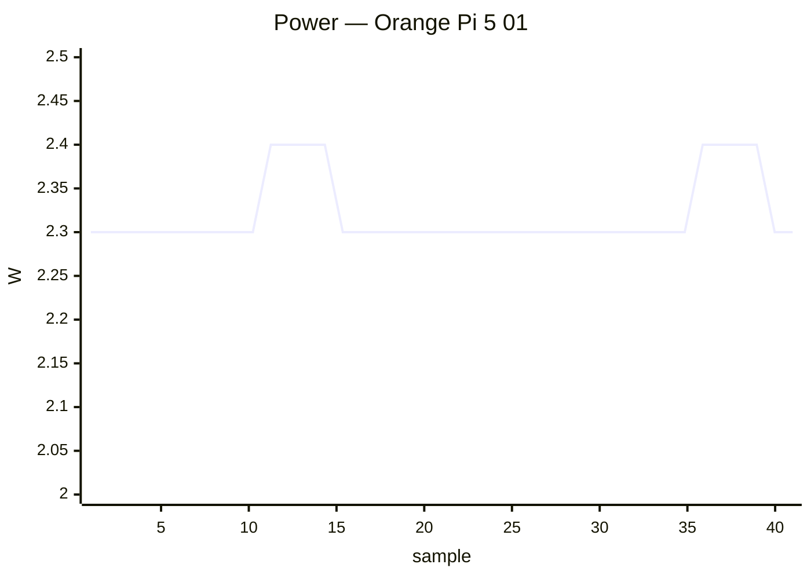
```mermaid
xychart-beta
    title "Power — Orange Pi 5 01"
    x-axis "sample" 1 --> 41
    y-axis "W" 2.0 --> 2.5
    line [2.30, 2.30, 2.30, 2.30, 2.30, 2.30, 2.30, 2.30, 2.30, 2.30, 2.40, 2.40, 2.40, 2.40, 2.30, 2.30, 2.30, 2.30, 2.30, 2.30, 2.30, 2.30, 2.30, 2.30, 2.30, 2.30, 2.30, 2.30, 2.30, 2.30, 2.30, 2.30, 2.30, 2.30, 2.40, 2.40, 2.40, 2.40, 2.30, 2.30]
```

### ❌ Orange Pi PC + 01

`orangepipcplus` · **inplace** · image `26.11.0-trunk.72` · 0 ✅ · 1 ❌ · 0 ⏭️

| Module | Status | Time | Detail |
|:--|:--:|--:|:--|
| reachable | ❌ | 0.0 s | ip=10.0.50.38 · reachable=False · port=22 |

### ❌ Orange Pi Prime 01

`orangepiprime` · **inplace** · image `26.11.0-trunk.66` · 0 ✅ · 1 ❌ · 0 ⏭️

| Module | Status | Time | Detail |
|:--|:--:|--:|:--|
| reachable | ❌ | 0.0 s | ip=10.0.50.36 · reachable=False · port=22 |

### ❌ ROCK 2F 01

`rock-2f` · **inplace** · image `26.8.1` · 15 ✅ · 1 ❌ · 0 ⏭️

| Module | Status | Time | Detail |
|:--|:--:|--:|:--|
| upgrade | ✅ | 710.2 s | nightly · 26.8.1 → 26.8.1 |
| reboot | ✅ | 13.1 s | power-cycle |
| kernel-switch | ✅ | 677.9 s | branch=vendor · family=rk35xx · installed=26.8.3 · boot_image=/boot/vmlinuz-6.1.115-vendor-rk35xx · kernel_before=6.1.115-vendor-rk35xx |
| reboot | ✅ | 47.4 s | power-cycle · 1/2 boots · up 24 s |
| hw-performance | ✅ | 29.8 s | AES 831 · mem 6100 · disk W 21 / R 22 MB/s · 57.7 °C · 2016 MHz |
| dvfs | ✅ | 22.6 s | ondemand · 408–2016 MHz (peak 2016) |
| network-iperf | ✅ | 38.9 s | wlan0 ↑211/↓269 (Wi-Fi 6) Mbps |
| store-versions | ✅ | 5.0 s | 26.8.1 · 6.1.115-vendor-rk35xx |
| kernel-switch | ❌ | 25.1 s | branch=edge · phase=install · dpkg_state=absent |
| reboot | ✅ | 44.6 s | power-cycle · 1/2 boots · up 23 s |
| hw-performance | ✅ | 29.6 s | AES 832 · mem 6000 · disk W 21 / R 22 MB/s · 56.6 °C · 2016 MHz |
| dvfs | ✅ | 22.5 s | ondemand · 408–2016 MHz (peak 2016) |
| network-iperf | ✅ | 36.2 s | wlan0 ↑212/↓268 (Wi-Fi 6) Mbps |
| store-versions | ✅ | 5.0 s | 26.8.1 · 6.1.115-vendor-rk35xx |
| kernel-switch | ✅ | 690.0 s | branch=vendor · family=rk35xx · installed=26.8.3 · boot_image=/boot/vmlinuz-6.1.115-vendor-rk35xx · kernel_before=6.1.115-vendor-rk35xx |
| reboot | ✅ | 25.9 s | power-cycle |

### ❌ Rock 5B Plus 01

`rock-5b-plus` · **inplace** · image `26.11.0-trunk.66` · 0 ✅ · 1 ❌ · 0 ⏭️

| Module | Status | Time | Detail |
|:--|:--:|--:|:--|
| reachable | ❌ | 0.0 s | ip=10.0.50.59 · reachable=False · port=22 |

**Power** — min 5.30 W · avg 5.38 W · peak 5.40 W · 41 samples

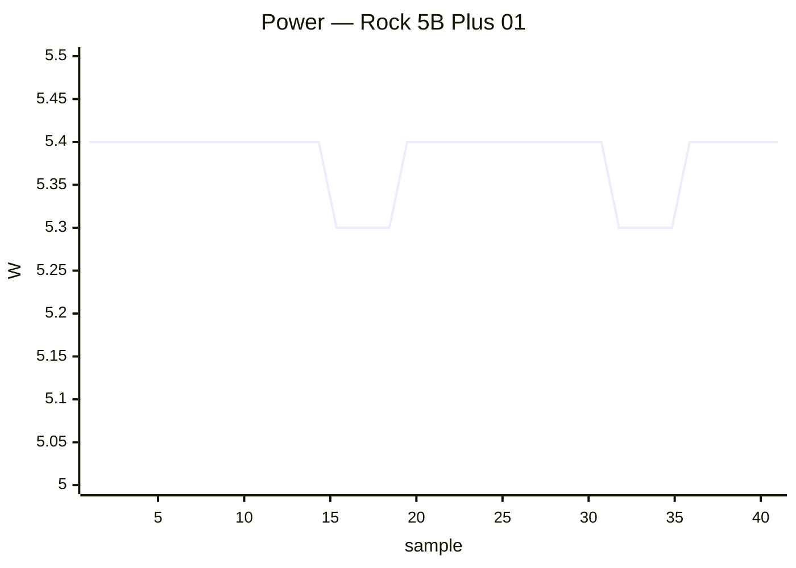
```mermaid
xychart-beta
    title "Power — Rock 5B Plus 01"
    x-axis "sample" 1 --> 41
    y-axis "W" 5.0 --> 5.5
    line [5.40, 5.40, 5.40, 5.40, 5.40, 5.40, 5.40, 5.40, 5.40, 5.40, 5.40, 5.40, 5.40, 5.40, 5.30, 5.30, 5.30, 5.30, 5.40, 5.40, 5.40, 5.40, 5.40, 5.40, 5.40, 5.40, 5.40, 5.40, 5.40, 5.40, 5.30, 5.30, 5.30, 5.30, 5.40, 5.40, 5.40, 5.40, 5.40, 5.40]
```

### ❌ SpacemiT MusePi Pro 01

`musepipro` · **inplace** · image `26.11.0-trunk.72` · 0 ✅ · 1 ❌ · 0 ⏭️

| Module | Status | Time | Detail |
|:--|:--:|--:|:--|
| reachable | ❌ | 0.0 s | ip=10.0.50.65 · reachable=False · port=22 |

**Power** — min 2.50 W · avg 2.59 W · peak 2.60 W · 42 samples

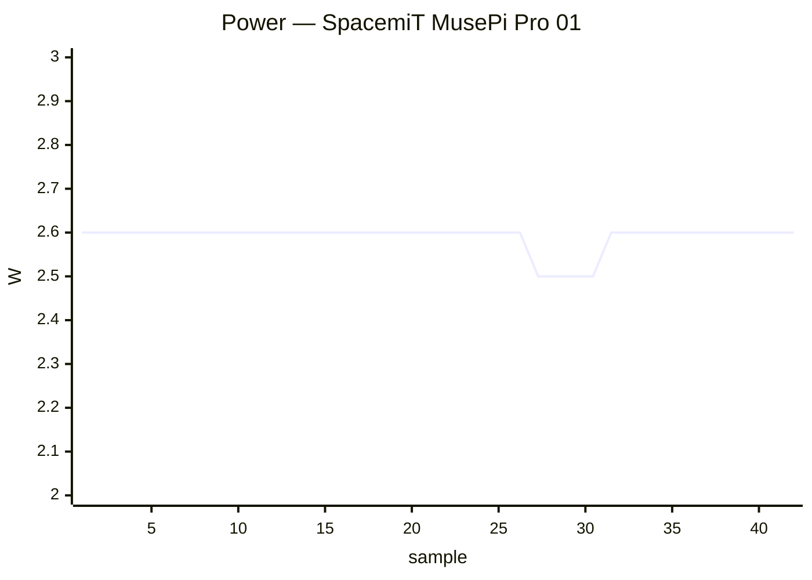
```mermaid
xychart-beta
    title "Power — SpacemiT MusePi Pro 01"
    x-axis "sample" 1 --> 42
    y-axis "W" 2.0 --> 3.0
    line [2.60, 2.60, 2.60, 2.60, 2.60, 2.60, 2.60, 2.60, 2.60, 2.60, 2.60, 2.60, 2.60, 2.60, 2.60, 2.60, 2.60, 2.60, 2.60, 2.60, 2.60, 2.60, 2.60, 2.60, 2.60, 2.50, 2.50, 2.50, 2.50, 2.60, 2.60, 2.60, 2.60, 2.60, 2.60, 2.60, 2.60, 2.60, 2.60, 2.60]
```

## ✅ Passed (58)

### ✅ Banana Pi CM4IO 01

`bananapicm4io` · **inplace** · image `26.8.3` · 14 ✅ · 2 ❌ · 0 ⏭️

| Module | Status | Time | Detail |
|:--|:--:|--:|:--|
| upgrade | ✅ | 298.2 s | nightly · 26.8.3 → 26.8.3 |
| reboot | ✅ | 54.4 s | power-cycle · up 23 s |
| kernel-switch | ✅ | 40.7 s | branch=current · family=meson64 · installed=26.11.0-trunk.73 · boot_image=/boot/vmlinuz-6.18.55-current-meson64 · kernel_before=6.18.55-current-meson64 |
| reboot | ✅ | 83.8 s | power-cycle · 2/2 boots · up 24 s |
| hw-performance | ✅ | 17.9 s | AES 852 · mem 3900 · disk W 39 / R 152 MB/s · 57.9 °C · 2016 MHz |
| dvfs | ✅ | 17.5 s | ondemand · 1000–1512 MHz (peak 1512) |
| network-iperf | ❌ | 361.6 s | eth0 ↑0/↓0 (1GE) · wlan0 ↑0/↓0 (Wi-Fi 5) Mbps |
| store-versions | ✅ | 3.8 s | 26.8.3 · 6.18.55-current-meson64 |
| kernel-switch | ✅ | 199.6 s | branch=edge · family=meson64 · installed=26.11.0-trunk.73 · boot_image=/boot/vmlinuz-7.2.9-edge-meson64 · kernel_before=6.18.55-current-meson64 |
| reboot | ✅ | 92.0 s | power-cycle · 2/2 boots · up 26 s |
| hw-performance | ✅ | 18.1 s | AES 852 · mem 3900 · disk W 35 / R 159 MB/s · 58.6 °C · 2016 MHz |
| dvfs | ✅ | 17.8 s | ondemand · 1000–1512 MHz (peak 1512) |
| network-iperf | ❌ | 356.4 s | eth0 ↑0/↓0 (1GE) · wlan0 ↑0/↓0 (Wi-Fi 5) Mbps |
| store-versions | ✅ | 3.9 s | 26.8.3 · 7.2.9-edge-meson64 |
| kernel-switch | ✅ | 195.2 s | branch=current · family=meson64 · installed=26.11.0-trunk.73 · boot_image=/boot/vmlinuz-6.18.55-current-meson64 · kernel_before=7.2.9-edge-meson64 |
| reboot | ✅ | 60.7 s | power-cycle · up 25 s |

**Power** — min 1.80 W · avg 4.38 W · peak 8.10 W · 1447 samples

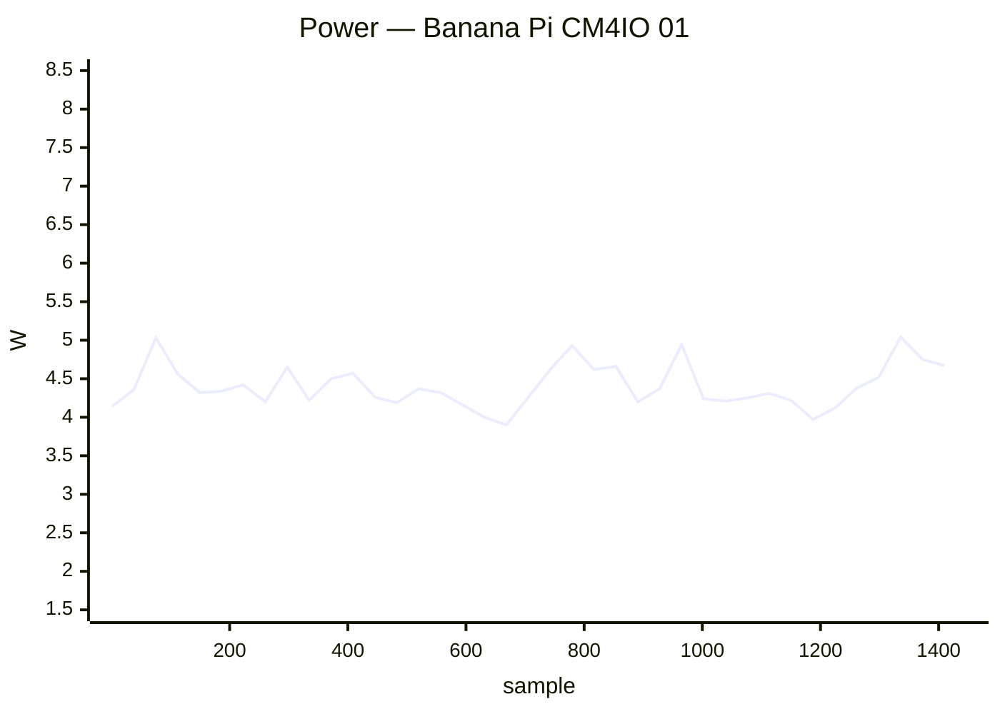
```mermaid
xychart-beta
    title "Power — Banana Pi CM4IO 01"
    x-axis "sample" 1 --> 1447
    y-axis "W" 1.5 --> 8.5
    line [4.14, 4.36, 5.03, 4.56, 4.32, 4.34, 4.42, 4.20, 4.65, 4.22, 4.50, 4.57, 4.26, 4.19, 4.37, 4.32, 4.16, 4.00, 3.90, 4.26, 4.62, 4.93, 4.62, 4.66, 4.20, 4.37, 4.94, 4.24, 4.21, 4.25, 4.31, 4.22, 3.97, 4.12, 4.38, 4.52, 5.04, 4.75, 4.67, 3.55]
```

### ✅ Banana Pi M2 Ultra 01

`bananapim2ultra` · **inplace** · image `26.11.0-trunk.72` · 16 ✅ · 0 ❌ · 0 ⏭️

| Module | Status | Time | Detail |
|:--|:--:|--:|:--|
| upgrade | ✅ | 399.9 s | nightly · 26.11.0-trunk.72 → 26.11.0-trunk.73 |
| reboot | ✅ | 44.6 s | warm · up 25 s |
| kernel-switch | ✅ | 65.1 s | branch=current · family=sunxi · installed=26.11.0-trunk.73 · boot_image=/boot/vmlinuz-6.18.55-current-sunxi · kernel_before=6.18.55-current-sunxi |
| reboot | ✅ | 83.9 s | warm · 2/2 boots · up 25 s |
| hw-performance | ✅ | 38.9 s | AES 23 · mem 2100 · disk W 11 / R 42 MB/s · 55.8 °C · 1200 MHz |
| dvfs | ✅ | 33.5 s | ondemand · 720–1200 MHz (peak 1200) |
| network-iperf | ✅ | 155.3 s | end0 ↑821/↓937 (1GE) · wlan0 ↑30/↓14 (Wi-Fi 4) Mbps |
| store-versions | ✅ | 8.1 s | 26.11.0-trunk.73 · 6.18.55-current-sunxi |
| kernel-switch | ✅ | 194.1 s | branch=edge · family=sunxi · installed=26.11.0-trunk.73 · boot_image=/boot/vmlinuz-7.2.9-edge-sunxi · kernel_before=6.18.55-current-sunxi |
| reboot | ✅ | 81.3 s | warm · 2/2 boots · up 26 s |
| hw-performance | ✅ | 41.4 s | AES 23 · mem 2000 · disk W 8 / R 43 MB/s · 54.4 °C · 1200 MHz |
| dvfs | ✅ | 37.0 s | ondemand · 720–1200 MHz (peak 1200) |
| network-iperf | ✅ | 115.9 s | end0 ↑800/↓935 (1GE) · wlan0 ↑21/↓17 (Wi-Fi 4) Mbps |
| store-versions | ✅ | 7.4 s | 26.11.0-trunk.73 · 7.2.9-edge-sunxi |
| kernel-switch | ✅ | 193.3 s | branch=current · family=sunxi · installed=26.11.0-trunk.73 · boot_image=/boot/vmlinuz-6.18.55-current-sunxi · kernel_before=7.2.9-edge-sunxi |
| reboot | ✅ | 44.8 s | warm · up 26 s |

### ✅ Banana Pi M2Pro 01

`bananapim2pro` · **inplace** · image `26.11.0-trunk.72` · 16 ✅ · 0 ❌ · 0 ⏭️

| Module | Status | Time | Detail |
|:--|:--:|--:|:--|
| upgrade | ✅ | 178.8 s | nightly · 26.11.0-trunk.72 → 26.11.0-trunk.73 |
| reboot | ✅ | 134.0 s | power-cycle · up 104 s |
| kernel-switch | ✅ | 31.8 s | branch=current · family=meson64 · installed=26.11.0-trunk.73 · boot_image=/boot/vmlinuz-6.18.55-current-meson64 · kernel_before=6.18.55-current-meson64 |
| reboot | ✅ | 247.9 s | power-cycle · 2/2 boots · up 102 s |
| hw-performance | ✅ | 19.5 s | AES 981 · mem 5300 · disk W 43 / R 157 MB/s · 51.1 °C · 2100 MHz |
| dvfs | ✅ | 19.3 s | ondemand · 1000–2100 MHz (peak 2100) |
| network-iperf | ✅ | 147.9 s | end0 ↑939/↓941 (1GE) Mbps |
| store-versions | ✅ | 4.3 s | 26.11.0-trunk.73 · 6.18.55-current-meson64 |
| kernel-switch | ✅ | 98.8 s | branch=edge · family=meson64 · installed=26.11.0-trunk.73 · boot_image=/boot/vmlinuz-7.2.9-edge-meson64 · kernel_before=6.18.55-current-meson64 |
| reboot | ✅ | 249.1 s | power-cycle · 2/2 boots · up 104 s |
| hw-performance | ✅ | 19.3 s | AES 981 · mem 5300 · disk W 43 / R 158 MB/s · 51.1 °C · 2100 MHz |
| dvfs | ✅ | 19.8 s | ondemand · 1000–2100 MHz (peak 2100) |
| network-iperf | ✅ | 29.6 s | end0 ↑940/↓941 (1GE) Mbps |
| store-versions | ✅ | 4.3 s | 26.11.0-trunk.73 · 7.2.9-edge-meson64 |
| kernel-switch | ✅ | 97.3 s | branch=current · family=meson64 · installed=26.11.0-trunk.73 · boot_image=/boot/vmlinuz-6.18.55-current-meson64 · kernel_before=7.2.9-edge-meson64 |
| reboot | ✅ | 139.7 s | power-cycle · up 102 s |

**Power** — min 1.50 W · avg 3.03 W · peak 5.50 W · 1144 samples

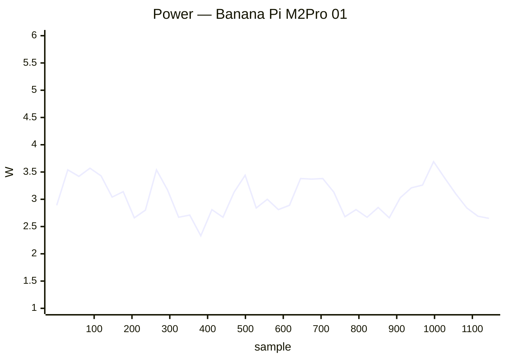
```mermaid
xychart-beta
    title "Power — Banana Pi M2Pro 01"
    x-axis "sample" 1 --> 1144
    y-axis "W" 1.0 --> 6.0
    line [2.89, 3.54, 3.42, 3.57, 3.43, 3.04, 3.14, 2.66, 2.80, 3.54, 3.17, 2.67, 2.71, 2.33, 2.81, 2.67, 3.13, 3.44, 2.84, 3.00, 2.81, 2.89, 3.38, 3.37, 3.38, 3.13, 2.68, 2.81, 2.67, 2.85, 2.66, 3.03, 3.21, 3.26, 3.69, 3.39, 3.10, 2.84, 2.69, 2.65]
```

### ✅ Banana Pi M5 01

`bananapim5` · **inplace** · image `26.11.0-trunk.72` · 15 ✅ · 1 ❌ · 0 ⏭️

| Module | Status | Time | Detail |
|:--|:--:|--:|:--|
| upgrade | ✅ | 335.4 s | nightly · 26.11.0-trunk.72 → 26.11.0-trunk.73 |
| reboot | ✅ | 172.3 s | warm · up 156 s |
| kernel-switch | ✅ | 51.3 s | branch=current · family=meson64 · installed=26.11.0-trunk.73 · boot_image=/boot/vmlinuz-6.18.55-current-meson64 · kernel_before=6.18.55-current-meson64 |
| reboot | ✅ | 320.1 s | warm · 2/2 boots · up 147 s |
| hw-performance | ✅ | 39.4 s | AES 980 · mem 5200 · disk W 9 / R 15 MB/s · 56 °C · 2100 MHz |
| dvfs | ✅ | 20.9 s | ondemand · 1000–2100 MHz (peak 2100) |
| network-iperf | ✅ | 97.0 s | end0 ↑939/↓941 (1GE) · wlx000f13960190 ↑1/↓13 (Wi-Fi 4) Mbps |
| store-versions | ✅ | 4.6 s | 26.11.0-trunk.73 · 6.18.55-current-meson64 |
| kernel-switch | ✅ | 175.8 s | branch=edge · family=meson64 · installed=26.11.0-trunk.73 · boot_image=/boot/vmlinuz-7.2.9-edge-meson64 · kernel_before=6.18.55-current-meson64 |
| reboot | ✅ | 382.5 s | warm · 2/2 boots · up 178 s |
| hw-performance | ✅ | 38.8 s | AES 980 · mem 5300 · disk W 10 / R 15 MB/s · 55.6 °C · 2100 MHz |
| dvfs | ✅ | 21.1 s | ondemand · 1000–2100 MHz (peak 2100) |
| network-iperf | ❌ | 100.6 s | end0 ↑940/↓941 (1GE) · wlx000f13960190 ↑0/↓9 (Wi-Fi 4) Mbps |
| store-versions | ✅ | 4.7 s | 26.11.0-trunk.73 · 7.2.9-edge-meson64 |
| kernel-switch | ✅ | 176.9 s | branch=current · family=meson64 · installed=26.11.0-trunk.73 · boot_image=/boot/vmlinuz-6.18.55-current-meson64 · kernel_before=7.2.9-edge-meson64 |
| reboot | ✅ | 162.0 s | warm · up 145 s |

### ✅ Banana Pi M7 01

`bananapim7` · **inplace** · image `26.11.0-trunk.72` · 22 ✅ · 0 ❌ · 0 ⏭️

| Module | Status | Time | Detail |
|:--|:--:|--:|:--|
| upgrade | ✅ | 97.2 s | nightly · 26.11.0-trunk.72 → 26.11.0-trunk.73 |
| reboot | ✅ | 44.9 s | power-cycle · up 15 s |
| kernel-switch | ✅ | 19.2 s | branch=vendor · family=rk35xx · installed=26.11.0-trunk.73 · boot_image=/boot/vmlinuz-6.1.172-vendor-rk35xx · kernel_before=6.1.172-vendor-rk35xx |
| reboot | ✅ | 63.7 s | power-cycle · 2/2 boots · up 15 s |
| hw-performance | ✅ | 14.0 s | AES 1255 · mem 15200 · disk W 890 / R 1305 MB/s · 61.9 °C · 1800 MHz |
| dvfs | ✅ | 17.3 s | ondemand · 1800–1800 MHz (peak 2256) |
| network-iperf | ✅ | 28.1 s | enP2p33s0 ↑940/↓941 (1GE) Mbps |
| store-versions | ✅ | 4.5 s | 26.11.0-trunk.73 · 6.1.172-vendor-rk35xx |
| kernel-switch | ✅ | 52.8 s | branch=current · family=rockchip64 · installed=26.11.0-trunk.73 · boot_image=/boot/vmlinuz-6.18.55-current-rockchip64 · kernel_before=6.1.172-vendor-rk35xx |
| reboot | ✅ | 230.8 s | power-cycle · 2/2 boots · up 97 s |
| hw-performance | ✅ | 13.5 s | AES 1252 · mem 10100 · disk W 896 / R 1561 MB/s · 65.6 °C · 1800 MHz |
| dvfs | ✅ | 14.7 s | ondemand · 408–1800 MHz (peak 2400) |
| network-iperf | ✅ | 29.5 s | enP2p33s0 ↑941/↓941 (1GE) Mbps |
| store-versions | ✅ | 3.9 s | 26.11.0-trunk.73 · 6.18.55-current-rockchip64 |
| kernel-switch | ✅ | 45.6 s | branch=edge · family=rockchip64 · installed=26.11.0-trunk.73 · boot_image=/boot/vmlinuz-7.2.9-edge-rockchip64 · kernel_before=6.18.55-current-rockchip64 |
| reboot | ✅ | 237.3 s | power-cycle · 2/2 boots · up 97 s |
| hw-performance | ✅ | 13.6 s | AES 1253 · mem 8000 · disk W 860 / R 1598 MB/s · 66.5 °C · 1800 MHz |
| dvfs | ✅ | 14.9 s | ondemand · 408–1800 MHz (peak 2400) |
| network-iperf | ✅ | 57.9 s | enP2p33s0 ↑941/↓941 (1GE) Mbps |
| store-versions | ✅ | 4.5 s | 26.11.0-trunk.73 · 7.2.9-edge-rockchip64 |
| kernel-switch | ✅ | 45.1 s | branch=vendor · family=rk35xx · installed=26.11.0-trunk.73 · boot_image=/boot/vmlinuz-6.1.172-vendor-rk35xx · kernel_before=7.2.9-edge-rockchip64 |
| reboot | ✅ | 51.1 s | power-cycle · up 15 s |

**Power** — min 1.00 W · avg 6.09 W · peak 12.00 W · 834 samples

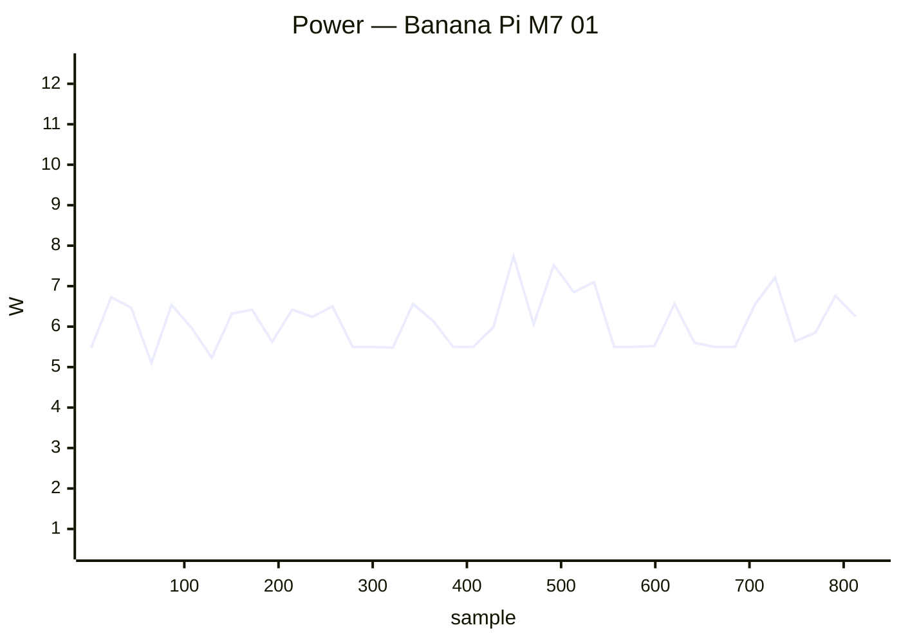
```mermaid
xychart-beta
    title "Power — Banana Pi M7 01"
    x-axis "sample" 1 --> 834
    y-axis "W" 0.5 --> 12.5
    line [5.47, 6.73, 6.46, 5.10, 6.54, 5.97, 5.23, 6.32, 6.42, 5.62, 6.42, 6.24, 6.50, 5.50, 5.50, 5.48, 6.56, 6.14, 5.50, 5.50, 5.99, 7.74, 6.06, 7.52, 6.85, 7.10, 5.50, 5.50, 5.52, 6.56, 5.60, 5.50, 5.50, 6.55, 7.21, 5.64, 5.85, 6.76, 6.25, 5.10]
```

### ✅ Banana Pi R2 01

`bananapir2` · **inplace** · image `26.11.0-trunk.72` · 16 ✅ · 0 ❌ · 0 ⏭️

| Module | Status | Time | Detail |
|:--|:--:|--:|:--|
| upgrade | ✅ | 258.7 s | nightly · 26.11.0-trunk.72 → 26.11.0-trunk.73 |
| reboot | ✅ | 75.5 s | power-cycle · up 36 s |
| kernel-switch | ✅ | 60.5 s | branch=current · family=mt7623 · installed=26.11.0-trunk.73 · boot_image=/boot/vmlinuz-6.18.55-current-mt7623 · kernel_before=6.18.55-current-mt7623 |
| reboot | ✅ | 115.2 s | power-cycle · 2/2 boots · up 36 s |
| hw-performance | ✅ | 43.7 s | AES 25 · mem 1600 · disk W 20 / R 22 MB/s · 52.1 °C · 1300 MHz |
| dvfs | ✅ | 39.9 s | ondemand · 98–1300 MHz (peak 1300) |
| network-iperf | ✅ | 43.3 s | lan2 ↑939/↓925 Mbps |
| store-versions | ✅ | 8.4 s | 26.11.0-trunk.73 · 6.18.55-current-mt7623 |
| kernel-switch | ✅ | 141.4 s | branch=edge · family=mt7623 · installed=26.11.0-trunk.73 · boot_image=/boot/vmlinuz-7.2.9-edge-mt7623 · kernel_before=6.18.55-current-mt7623 |
| reboot | ✅ | 117.3 s | power-cycle · 2/2 boots · up 38 s |
| hw-performance | ✅ | 44.3 s | AES 25 · mem 1600 · disk W 20 / R 22 MB/s · 52 °C · 1300 MHz |
| dvfs | ✅ | 43.4 s | ondemand · 98–1300 MHz (peak 1300) |
| network-iperf | ✅ | 115.9 s | lan2 ↑938/↓928 Mbps |
| store-versions | ✅ | 8.7 s | 26.11.0-trunk.73 · 7.2.9-edge-mt7623 |
| kernel-switch | ✅ | 141.2 s | branch=current · family=mt7623 · installed=26.11.0-trunk.73 · boot_image=/boot/vmlinuz-6.18.55-current-mt7623 · kernel_before=7.2.9-edge-mt7623 |
| reboot | ✅ | 76.2 s | power-cycle · up 36 s |

**Power** — min 2.60 W · avg 5.19 W · peak 6.50 W · 1049 samples

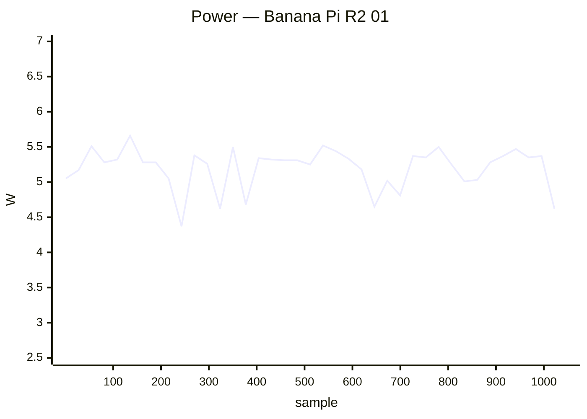
```mermaid
xychart-beta
    title "Power — Banana Pi R2 01"
    x-axis "sample" 1 --> 1049
    y-axis "W" 2.5 --> 7.0
    line [5.05, 5.17, 5.51, 5.28, 5.32, 5.66, 5.28, 5.28, 5.05, 4.37, 5.38, 5.26, 4.62, 5.50, 4.68, 5.34, 5.32, 5.31, 5.31, 5.25, 5.52, 5.44, 5.33, 5.18, 4.65, 5.02, 4.81, 5.37, 5.35, 5.50, 5.25, 5.01, 5.03, 5.28, 5.37, 5.47, 5.35, 5.37, 4.62, 4.62]
```

### ✅ Banana Pi R3 Mini 01

`bananapir3mini` · **inplace** · image `26.11.0-trunk` · 4 ✅ · 0 ❌ · 2 ⏭️

| Module | Status | Time | Detail |
|:--|:--:|--:|:--|
| upgrade | ⏭️ | 24.2 s | — |
| reboot | ✅ | 66.3 s | power-cycle · up 31 s |
| hw-performance | ✅ | 19.5 s | AES 934 · mem 3200 · disk W 78 / R 91 MB/s · 70.7 °C · None MHz |
| dvfs | ➖ | 2.1 s | no cpufreq |
| network-iperf | ✅ | 113.2 s | eth0 ↑941/↓941 (1GE) · eth1 ↑941/↓942 (1GE) · wlan0 ↑20/↓33 (Wi-Fi 6) · wlan1 ↑475/↓379 (Wi-Fi 6) Mbps |
| store-versions | ✅ | 5.3 s | 26.11.0-trunk · 6.18.52-current-filogic-mt7986 |

**Power** — min 3.50 W · avg 8.11 W · peak 13.10 W · 197 samples

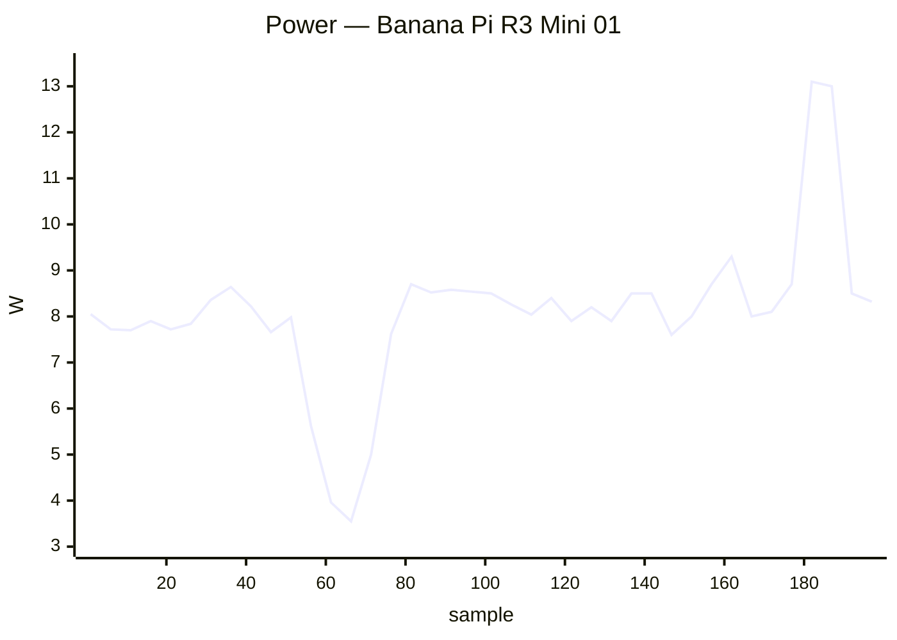
```mermaid
xychart-beta
    title "Power — Banana Pi R3 Mini 01"
    x-axis "sample" 1 --> 197
    y-axis "W" 3.0 --> 13.5
    line [8.05, 7.72, 7.70, 7.90, 7.72, 7.84, 8.36, 8.64, 8.22, 7.66, 7.98, 5.62, 3.96, 3.55, 5.00, 7.62, 8.70, 8.52, 8.58, 8.54, 8.50, 8.26, 8.04, 8.40, 7.90, 8.20, 7.90, 8.50, 8.50, 7.60, 8.00, 8.70, 9.30, 8.00, 8.10, 8.70, 13.10, 13.00, 8.50, 8.32]
```

### ✅ BananaPi BPI-F3 01

`musepipro` · **inplace** · image `26.11.0-trunk.72` · 6 ✅ · 0 ❌ · 0 ⏭️

| Module | Status | Time | Detail |
|:--|:--:|--:|:--|
| upgrade | ✅ | 199.6 s | nightly · ? → 26.11.0-trunk.73 |
| reboot | ✅ | 59.8 s | power-cycle · up 20 s |
| hw-performance | ✅ | 24.7 s | AES 27 · mem 3000 · disk W 22 / R 82 MB/s · 50 °C · 1600 MHz |
| dvfs | ✅ | 24.7 s | performance · 614–1600 MHz (peak 1600) |
| network-iperf | ✅ | 92.8 s | eth0 ↑940/↓940 (1GE) · wlan0 ↑309/↓317 (Wi-Fi 6) · wlan1 ↑239/↓139 (Wi-Fi 5) Mbps |
| store-versions | ✅ | 5.2 s | 26.11.0-trunk.73 · 6.18.55-current-spacemit |

**Power** — min 3.00 W · avg 5.21 W · peak 8.20 W · 326 samples

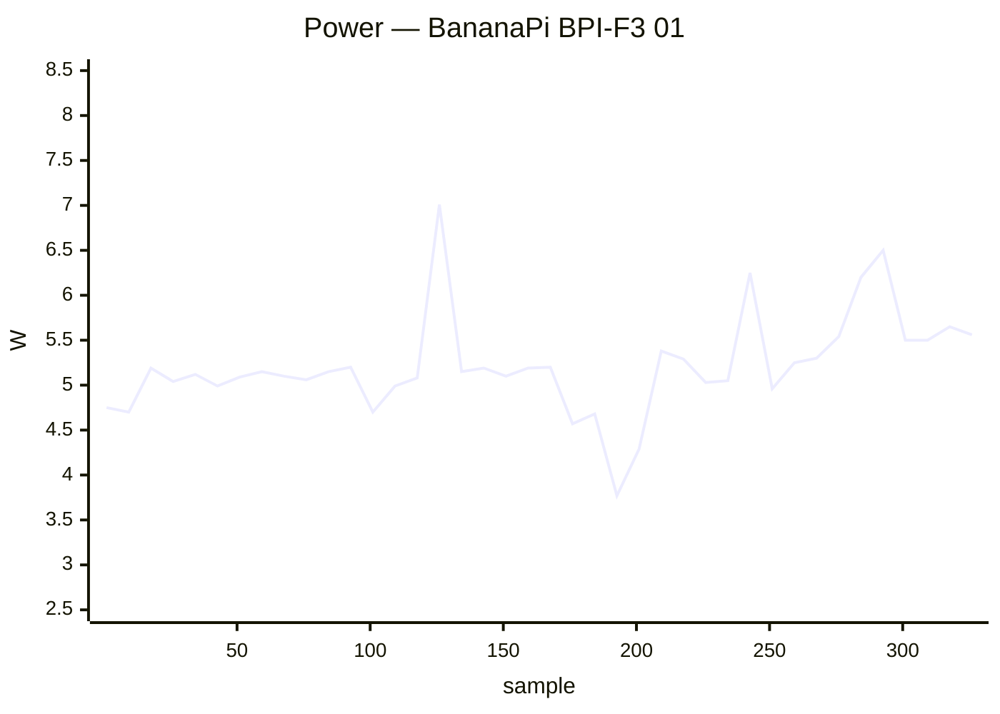
```mermaid
xychart-beta
    title "Power — BananaPi BPI-F3 01"
    x-axis "sample" 1 --> 326
    y-axis "W" 2.5 --> 8.5
    line [4.75, 4.70, 5.19, 5.04, 5.12, 4.99, 5.09, 5.15, 5.10, 5.06, 5.15, 5.20, 4.70, 4.99, 5.08, 7.01, 5.15, 5.19, 5.10, 5.19, 5.20, 4.57, 4.68, 3.77, 4.29, 5.38, 5.29, 5.03, 5.05, 6.25, 4.96, 5.25, 5.30, 5.54, 6.20, 6.50, 5.50, 5.50, 5.65, 5.56]
```

### ✅ BananaPi BPI-M4-Zero 01

`bananapim4zero` · **inplace** · image `26.11.0-trunk.72` · 8 ✅ · 0 ❌ · 0 ⏭️

| Module | Status | Time | Detail |
|:--|:--:|--:|:--|
| upgrade | ✅ | 309.4 s | nightly · 26.11.0-trunk.72 → 26.11.0-trunk.73 |
| reboot | ✅ | 77.5 s | power-cycle · up 24 s |
| kernel-switch | ✅ | 134.1 s | branch=current · family=sunxi64 · installed=26.11.0-trunk.73 · boot_image=? · kernel_before=6.18.55-current-sunxi64 |
| reboot | ✅ | 142.6 s | power-cycle · 2/2 boots · up 25 s |
| hw-performance | ✅ | 32.6 s | AES 660 · mem 3600 · disk W 13 / R 22 MB/s · 49.6 °C · 1416 MHz |
| dvfs | ✅ | 44.0 s | ondemand · 480–1416 MHz (peak 1416) |
| network-iperf | ✅ | 104.8 s | wlan0 ↑23/↓100 (Wi-Fi 5) Mbps |
| store-versions | ✅ | 4.8 s | 26.11.0-trunk.73 · 6.18.55-current-sunxi64 |

### ✅ Clearfog Pro 01

`clearfogpro` · **inplace** · image `26.11.0-trunk.72` · 14 ✅ · 0 ❌ · 2 ⏭️

| Module | Status | Time | Detail |
|:--|:--:|--:|:--|
| upgrade | ✅ | 208.8 s | nightly · 26.11.0-trunk.72 → 26.11.0-trunk.73 |
| reboot | ✅ | 41.3 s | warm · up 21 s |
| kernel-switch | ✅ | 41.6 s | branch=current · family=mvebu · installed=26.11.0-trunk.73 · boot_image=/boot/vmlinuz-6.18.55-current-mvebu · kernel_before=6.18.55-current-mvebu |
| reboot | ✅ | 76.1 s | warm · 2/2 boots · up 20 s |
| hw-performance | ✅ | 33.6 s | AES 43 · mem 3800 · disk W 20 / R 22 MB/s · 63.7 °C · None MHz |
| dvfs | ➖ | 2.8 s | no cpufreq |
| network-iperf | ✅ | 34.5 s | lan2 ↑936/↓936 Mbps |
| store-versions | ✅ | 5.8 s | 26.11.0-trunk.73 · 6.18.55-current-mvebu |
| kernel-switch | ✅ | 101.2 s | branch=edge · family=mvebu · installed=26.11.0-trunk.73 · boot_image=/boot/vmlinuz-7.2.9-edge-mvebu · kernel_before=6.18.55-current-mvebu |
| reboot | ✅ | 77.9 s | warm · 2/2 boots · up 21 s |
| hw-performance | ✅ | 33.7 s | AES 43 · mem 3800 · disk W 21 / R 22 MB/s · 66.1 °C · None MHz |
| dvfs | ➖ | 2.9 s | no cpufreq |
| network-iperf | ✅ | 139.4 s | lan2 ↑936/↓936 Mbps |
| store-versions | ✅ | 6.1 s | 26.11.0-trunk.73 · 7.2.9-edge-mvebu |
| kernel-switch | ✅ | 103.3 s | branch=current · family=mvebu · installed=26.11.0-trunk.73 · boot_image=/boot/vmlinuz-6.18.55-current-mvebu · kernel_before=7.2.9-edge-mvebu |
| reboot | ✅ | 41.3 s | warm · up 21 s |

### ✅ Cubie A5E 01

`radxa-cubie-a5e` · **inplace** · image `26.11.0-trunk.72` · 14 ✅ · 0 ❌ · 2 ⏭️

| Module | Status | Time | Detail |
|:--|:--:|--:|:--|
| upgrade | ✅ | 599.2 s | nightly · 26.11.0-trunk.72 → 26.11.0-trunk.73 |
| reboot | ✅ | 69.8 s | power-cycle · up 33 s |
| kernel-switch | ✅ | 56.6 s | branch=current · family=sunxi64 · installed=26.11.0-trunk.73 · boot_image=? · kernel_before=6.18.55-current-sunxi64 |
| reboot | ✅ | 103.3 s | power-cycle · 2/2 boots · up 31 s |
| hw-performance | ✅ | 33.7 s | AES 358 · mem 2000 · disk W 21 / R 23 MB/s · 67.9 °C · None MHz |
| dvfs | ➖ | 2.8 s | no cpufreq |
| network-iperf | ✅ | 291.9 s | end0 ↑826/↓941 (1GE) · end1 ↑941/↓941 (1GE) · wlan0 ↑120/↓116 (Wi-Fi 6) Mbps |
| store-versions | ✅ | 6.5 s | 26.11.0-trunk.73 · 6.18.55-current-sunxi64 |
| kernel-switch | ✅ | 561.8 s | branch=edge · family=sunxi64 · installed=26.11.0-trunk.73 · boot_image=? · kernel_before=6.18.55-current-sunxi64 |
| reboot | ✅ | 105.4 s | power-cycle · 2/2 boots · up 32 s |
| hw-performance | ✅ | 33.9 s | AES 358 · mem 2000 · disk W 21 / R 23 MB/s · 73.3 °C · None MHz |
| dvfs | ➖ | 2.8 s | no cpufreq |
| network-iperf | ✅ | 95.0 s | end0 ↑814/↓941 (1GE) · end1 ↑941/↓940 (1GE) · wlan0 ↑119/↓116 (Wi-Fi 6) Mbps |
| store-versions | ✅ | 5.9 s | 26.11.0-trunk.73 · 7.2.9-edge-sunxi64 |
| kernel-switch | ✅ | 564.8 s | branch=current · family=sunxi64 · installed=26.11.0-trunk.73 · boot_image=? · kernel_before=7.2.9-edge-sunxi64 |
| reboot | ✅ | 67.8 s | power-cycle · up 33 s |

**Power** — min 1.90 W · avg 4.14 W · peak 6.80 W · 2097 samples

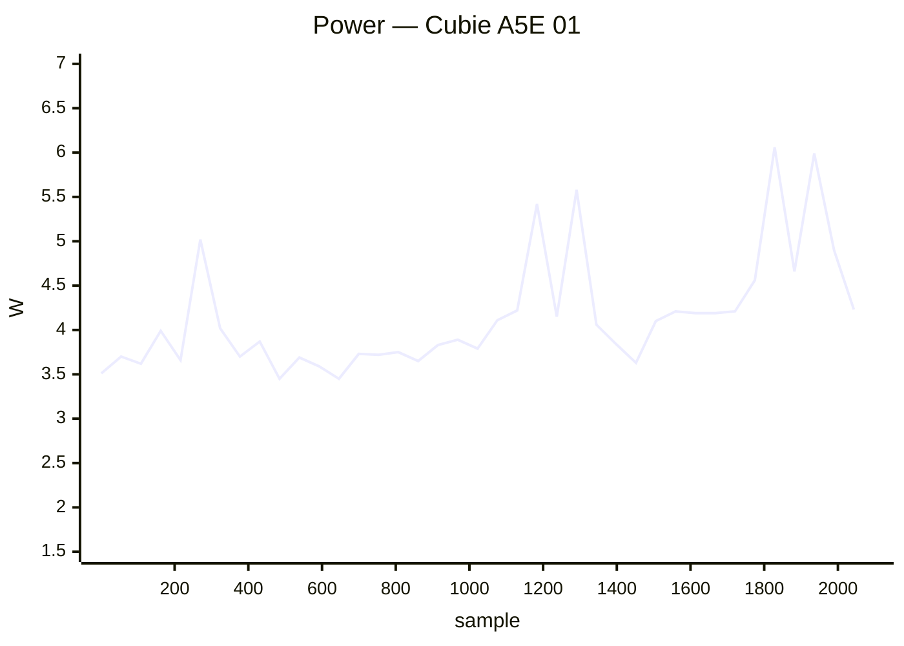
```mermaid
xychart-beta
    title "Power — Cubie A5E 01"
    x-axis "sample" 1 --> 2097
    y-axis "W" 1.5 --> 7.0
    line [3.51, 3.70, 3.62, 3.99, 3.66, 5.02, 4.02, 3.70, 3.87, 3.45, 3.69, 3.59, 3.45, 3.73, 3.72, 3.75, 3.65, 3.83, 3.89, 3.79, 4.11, 4.22, 5.42, 4.15, 5.58, 4.06, 3.84, 3.63, 4.10, 4.21, 4.19, 4.19, 4.21, 4.56, 6.06, 4.66, 5.99, 4.90, 4.23, 3.61]
```

### ✅ Cubietruck 01

`cubietruck` · **inplace** · image `26.11.0-trunk.72` · 16 ✅ · 0 ❌ · 0 ⏭️

| Module | Status | Time | Detail |
|:--|:--:|--:|:--|
| upgrade | ✅ | 419.0 s | nightly · 26.11.0-trunk.72 → 26.11.0-trunk.73 |
| reboot | ✅ | 70.9 s | warm · up 46 s |
| kernel-switch | ✅ | 91.6 s | branch=current · family=sunxi · installed=26.11.0-trunk.73 · boot_image=/boot/vmlinuz-6.18.55-current-sunxi · kernel_before=6.18.55-current-sunxi |
| reboot | ✅ | 129.9 s | warm · 2/2 boots · up 45 s |
| hw-performance | ✅ | 60.2 s | AES 18 · mem 1700 · disk W 13 / R 22 MB/s · 50.4 °C · 960 MHz |
| dvfs | ✅ | 56.5 s | ondemand · 528–960 MHz (peak 960) |
| network-iperf | ✅ | 279.0 s | end0 ↑722/↓858 (1GE) · wlan0 ↑14/↓11 (Wi-Fi 4) Mbps |
| store-versions | ✅ | 12.0 s | 26.11.0-trunk.73 · 6.18.55-current-sunxi |
| kernel-switch | ✅ | 226.1 s | branch=edge · family=sunxi · installed=26.11.0-trunk.73 · boot_image=/boot/vmlinuz-7.2.9-edge-sunxi · kernel_before=6.18.55-current-sunxi |
| reboot | ✅ | 127.0 s | warm · 2/2 boots · up 43 s |
| hw-performance | ✅ | 57.1 s | AES 19 · mem 1700 · disk W 14 / R 22 MB/s · 49.6 °C · 960 MHz |
| dvfs | ✅ | 57.9 s | ondemand · 528–960 MHz (peak 960) |
| network-iperf | ✅ | 200.6 s | end0 ↑786/↓941 (1GE) · wlan0 ↑15/↓22 (Wi-Fi 4) Mbps |
| store-versions | ✅ | 11.7 s | 26.11.0-trunk.73 · 7.2.9-edge-sunxi |
| kernel-switch | ✅ | 230.1 s | branch=current · family=sunxi · installed=26.11.0-trunk.73 · boot_image=/boot/vmlinuz-6.18.55-current-sunxi · kernel_before=7.2.9-edge-sunxi |
| reboot | ✅ | 69.0 s | warm · up 44 s |

### ✅ Cubox i2eX/i4 01

`cubox-i` · **inplace** · image `26.11.0-trunk.72` · 16 ✅ · 0 ❌ · 0 ⏭️

| Module | Status | Time | Detail |
|:--|:--:|--:|:--|
| upgrade | ✅ | 469.1 s | nightly · 26.11.0-trunk.72 → 26.11.0-trunk.73 |
| reboot | ✅ | 82.0 s | power-cycle · up 42 s |
| kernel-switch | ✅ | 71.8 s | branch=current · family=imx6 · installed=26.11.0-trunk.73 · boot_image=/boot/vmlinuz-6.18.55-current-imx6 · kernel_before=6.18.55-current-imx6 |
| reboot | ✅ | 139.7 s | power-cycle · 2/2 boots · up 42 s |
| hw-performance | ✅ | 46.9 s | AES 25 · mem 735 · disk W 19 / R 20 MB/s · 48.6 °C · 996 MHz |
| dvfs | ✅ | 40.4 s | ondemand · 396–996 MHz (peak 996) |
| network-iperf | ✅ | 216.3 s | end0 ↑94/↓94 (10/100ME) · wlan0 ↑14/↓10 (Wi-Fi 4) Mbps |
| store-versions | ✅ | 8.7 s | 26.11.0-trunk.73 · 6.18.55-current-imx6 |
| kernel-switch | ✅ | 268.4 s | branch=edge · family=imx6 · installed=26.11.0-trunk.73 · boot_image=/boot/vmlinuz-7.1.13-edge-imx6 · kernel_before=6.18.55-current-imx6 |
| reboot | ✅ | 137.2 s | power-cycle · 2/2 boots · up 44 s |
| hw-performance | ✅ | 47.1 s | AES 26 · mem 711 · disk W 19 / R 20 MB/s · 50.3 °C · 996 MHz |
| dvfs | ✅ | 44.0 s | ondemand · 396–996 MHz (peak 996) |
| network-iperf | ✅ | 239.1 s | end0 ↑94/↓94 (10/100ME) · wlan0 ↑19/↓20 (Wi-Fi 4) Mbps |
| store-versions | ✅ | 8.8 s | 26.11.0-trunk.73 · 7.1.13-edge-imx6 |
| kernel-switch | ✅ | 275.4 s | branch=current · family=imx6 · installed=26.11.0-trunk.73 · boot_image=/boot/vmlinuz-6.18.55-current-imx6 · kernel_before=7.1.13-edge-imx6 |
| reboot | ✅ | 84.2 s | power-cycle · up 44 s |

**Power** — min 1.90 W · avg 3.27 W · peak 6.10 W · 1745 samples

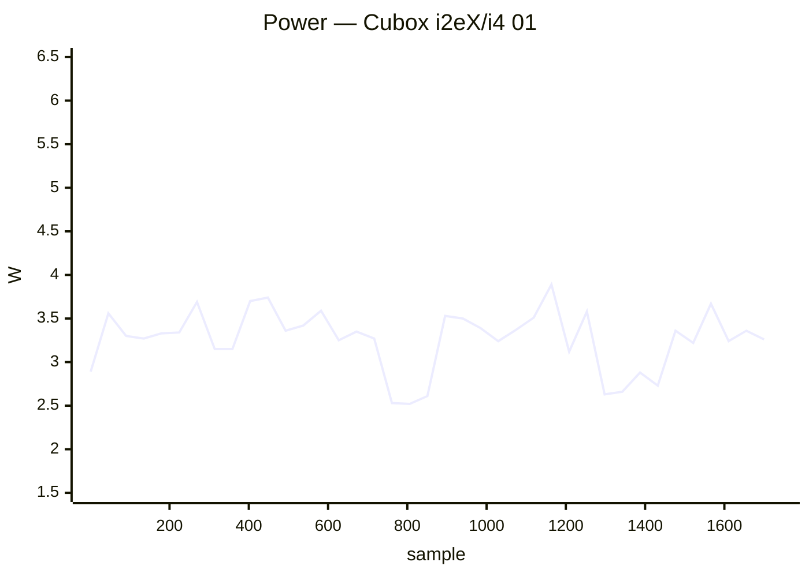
```mermaid
xychart-beta
    title "Power — Cubox i2eX/i4 01"
    x-axis "sample" 1 --> 1745
    y-axis "W" 1.5 --> 6.5
    line [2.89, 3.56, 3.30, 3.27, 3.33, 3.34, 3.69, 3.15, 3.15, 3.70, 3.74, 3.36, 3.42, 3.59, 3.25, 3.35, 3.27, 2.53, 2.52, 2.61, 3.53, 3.50, 3.39, 3.24, 3.37, 3.51, 3.89, 3.12, 3.58, 2.63, 2.66, 2.88, 2.73, 3.36, 3.22, 3.67, 3.24, 3.36, 3.26, 3.52]
```

### ✅ Espressobin 01

`espressobin` · **inplace** · image `26.11.0-trunk.72` · 16 ✅ · 0 ❌ · 0 ⏭️

| Module | Status | Time | Detail |
|:--|:--:|--:|:--|
| upgrade | ✅ | 700.7 s | nightly · 26.11.0-trunk.72 → 26.11.0-trunk.73 |
| reboot | ✅ | 78.2 s | power-cycle · up 43 s |
| kernel-switch | ✅ | 80.0 s | branch=current · family=mvebu64 · installed=26.11.0-trunk.73 · boot_image=/boot/vmlinuz-6.18.55-current-mvebu64 · kernel_before=6.18.55-current-mvebu64 |
| reboot | ✅ | 131.4 s | power-cycle · 2/2 boots · up 45 s |
| hw-performance | ✅ | 34.9 s | AES 371 · mem 2000 · disk W 21 / R 129 MB/s · None °C · 800 MHz |
| dvfs | ✅ | 34.4 s | ondemand · 200–800 MHz (peak 800) |
| network-iperf | ✅ | 82.5 s | lan0 ↑936/↓751 (1GE) Mbps |
| store-versions | ✅ | 7.4 s | 26.11.0-trunk.73 · 6.18.55-current-mvebu64 |
| kernel-switch | ✅ | 361.4 s | branch=edge · family=mvebu64 · installed=26.11.0-trunk.73 · boot_image=/boot/vmlinuz-7.1.13-edge-mvebu64 · kernel_before=6.18.55-current-mvebu64 |
| reboot | ✅ | 132.8 s | power-cycle · 2/2 boots · up 44 s |
| hw-performance | ✅ | 34.7 s | AES 370 · mem 2000 · disk W 23 / R 116 MB/s · None °C · 800 MHz |
| dvfs | ✅ | 35.7 s | ondemand · 200–800 MHz (peak 800) |
| network-iperf | ✅ | 116.2 s | lan0 ↑936/↓863 (1GE) Mbps |
| store-versions | ✅ | 7.6 s | 26.11.0-trunk.73 · 7.1.13-edge-mvebu64 |
| kernel-switch | ✅ | 365.3 s | branch=current · family=mvebu64 · installed=26.11.0-trunk.73 · boot_image=/boot/vmlinuz-6.18.55-current-mvebu64 · kernel_before=7.1.13-edge-mvebu64 |
| reboot | ✅ | 80.8 s | power-cycle · up 42 s |

### ✅ Helios4 01

`helios4` · **inplace** · image `26.11.0-trunk.72` · 14 ✅ · 0 ❌ · 2 ⏭️

| Module | Status | Time | Detail |
|:--|:--:|--:|:--|
| upgrade | ✅ | 197.4 s | nightly · 26.11.0-trunk.72 → 26.11.0-trunk.73 |
| reboot | ✅ | 119.9 s | warm · up 104 s |
| kernel-switch | ✅ | 35.1 s | branch=current · family=mvebu · installed=26.11.0-trunk.73 · boot_image=/boot/vmlinuz-6.18.55-current-mvebu · kernel_before=6.18.55-current-mvebu |
| reboot | ✅ | 233.8 s | warm · 2/2 boots · up 103 s |
| hw-performance | ✅ | 29.7 s | AES 43 · mem 3800 · disk W 20 / R 23 MB/s · 55.6 °C · None MHz |
| dvfs | ➖ | 2.2 s | no cpufreq |
| network-iperf | ✅ | 34.2 s | end1 ↑940/↓941 (1GE) Mbps |
| store-versions | ✅ | 4.8 s | 26.11.0-trunk.73 · 6.18.55-current-mvebu |
| kernel-switch | ✅ | 96.9 s | branch=edge · family=mvebu · installed=26.11.0-trunk.73 · boot_image=/boot/vmlinuz-7.2.9-edge-mvebu · kernel_before=6.18.55-current-mvebu |
| reboot | ✅ | 235.6 s | warm · 2/2 boots · up 103 s |
| hw-performance | ✅ | 30.0 s | AES 43 · mem 3800 · disk W 21 / R 23 MB/s · 56.1 °C · None MHz |
| dvfs | ➖ | 2.3 s | no cpufreq |
| network-iperf | ✅ | 34.1 s | end1 ↑941/↓941 (1GE) Mbps |
| store-versions | ✅ | 5.0 s | 26.11.0-trunk.73 · 7.2.9-edge-mvebu |
| kernel-switch | ✅ | 99.7 s | branch=current · family=mvebu · installed=26.11.0-trunk.73 · boot_image=/boot/vmlinuz-6.18.55-current-mvebu · kernel_before=7.2.9-edge-mvebu |
| reboot | ✅ | 118.9 s | warm · up 103 s |

### ✅ Inovato Quadra 01

`inovato-quadra` · **inplace** · image `26.11.0-trunk.66` · 16 ✅ · 0 ❌ · 0 ⏭️

| Module | Status | Time | Detail |
|:--|:--:|--:|:--|
| upgrade | ✅ | 56.1 s | nightly · 26.11.0-trunk.66 → 26.11.0-trunk.66 |
| reboot | ✅ | 66.6 s | power-cycle · up 24 s |
| kernel-switch | ✅ | 40.0 s | branch=current · family=sunxi64 · installed=26.11.0-trunk.66 · boot_image=/boot/vmlinuz-6.18.54-current-sunxi64 · kernel_before=6.18.54-current-sunxi64 |
| reboot | ✅ | 88.2 s | power-cycle · 2/2 boots · up 22 s |
| hw-performance | ✅ | 30.6 s | AES 794 · mem 2800 · disk W 15 / R 1 MB/s · 61.6 °C · 1704 MHz |
| dvfs | ✅ | 21.7 s | ondemand · 480–1704 MHz (peak 1704) |
| network-iperf | ✅ | 62.9 s | eth0 ↑94/↓94 (10/100ME) · wlan0 ↑12/↓1 (Wi-Fi 4) Mbps |
| store-versions | ✅ | 4.5 s | 26.11.0-trunk.66 · 6.18.54-current-sunxi64 |
| kernel-switch | ✅ | 116.6 s | branch=edge · family=sunxi64 · installed=26.11.0-trunk.66 · boot_image=/boot/vmlinuz-7.2.8-edge-sunxi64 · kernel_before=6.18.54-current-sunxi64 |
| reboot | ✅ | 86.7 s | power-cycle · 2/2 boots · up 21 s |
| hw-performance | ✅ | 30.9 s | AES 794 · mem 2800 · disk W 21 / R 23 MB/s · 64.6 °C · 1704 MHz |
| dvfs | ✅ | 21.9 s | ondemand · 480–1704 MHz (peak 1704) |
| network-iperf | ✅ | 99.8 s | eth0 ↑94/↓94 (10/100ME) · wlan0 ↑15/↓11 (Wi-Fi 4) Mbps |
| store-versions | ✅ | 4.6 s | 26.11.0-trunk.66 · 7.2.8-edge-sunxi64 |
| kernel-switch | ✅ | 117.8 s | branch=current · family=sunxi64 · installed=26.11.0-trunk.66 · boot_image=/boot/vmlinuz-6.18.54-current-sunxi64 · kernel_before=7.2.8-edge-sunxi64 |
| reboot | ✅ | 59.4 s | power-cycle · up 22 s |

**Power** — min 2.10 W · avg 3.94 W · peak 6.90 W · 717 samples

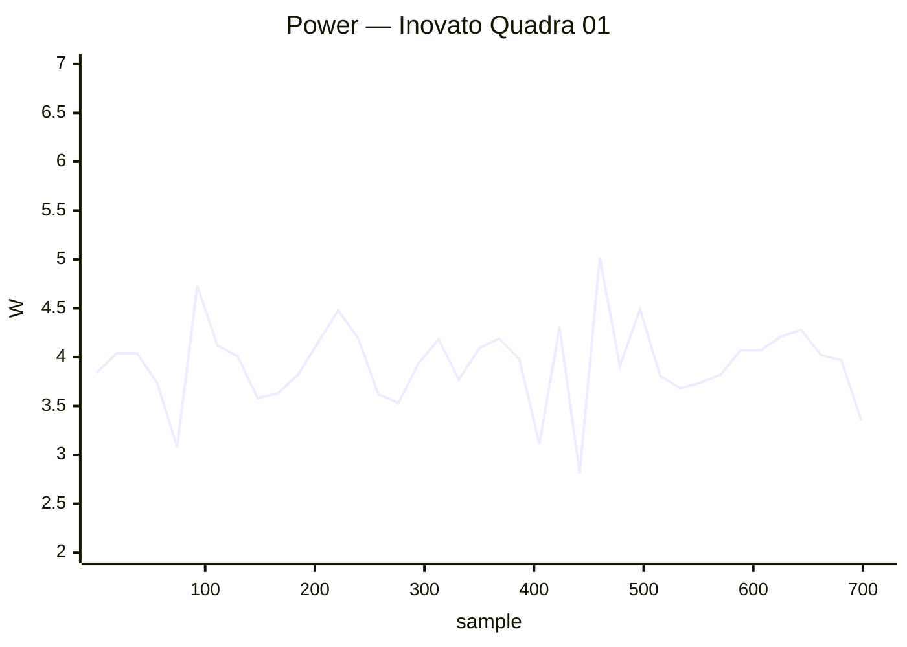
```mermaid
xychart-beta
    title "Power — Inovato Quadra 01"
    x-axis "sample" 1 --> 717
    y-axis "W" 2.0 --> 7.0
    line [3.84, 4.04, 4.04, 3.74, 3.08, 4.73, 4.12, 4.01, 3.58, 3.63, 3.82, 4.15, 4.48, 4.19, 3.62, 3.53, 3.94, 4.18, 3.77, 4.09, 4.19, 3.98, 3.11, 4.31, 2.81, 5.02, 3.91, 4.49, 3.81, 3.68, 3.74, 3.82, 4.07, 4.07, 4.21, 4.28, 4.02, 3.97, 3.35, 4.14]
```

### ✅ Khadas Edge2 01

`khadas-edge2` · **inplace** · image `26.11.0-trunk.72` · 14 ✅ · 0 ❌ · 2 ⏭️

| Module | Status | Time | Detail |
|:--|:--:|--:|:--|
| upgrade | ✅ | 133.9 s | nightly · 26.11.0-trunk.72 → 26.11.0-trunk.73 |
| reboot | ✅ | 29.5 s | warm · up 12 s |
| kernel-switch | ✅ | 22.5 s | branch=vendor · family=rk35xx · installed=26.11.0-trunk.73 · boot_image=/boot/vmlinuz-6.1.172-vendor-rk35xx · kernel_before=6.1.172-vendor-rk35xx |
| reboot | ✅ | 60.5 s | warm · 2/2 boots · up 18 s |
| hw-performance | ✅ | 15.8 s | AES 1274 · mem 14000 · disk W 106 / R 256 MB/s · 35.2 °C · 1800 MHz |
| dvfs | ✅ | 17.9 s | ondemand · 1800–1800 MHz (peak 2256) |
| network-iperf | ⏭️ | 6.5 s | no cabled interfaces |
| store-versions | ✅ | 4.2 s | 26.11.0-trunk.73 · 6.1.172-vendor-rk35xx |
| kernel-switch | ✅ | 73.7 s | branch=current · family=rockchip64 · installed=26.11.0-trunk.73 · boot_image=/boot/vmlinuz-6.18.55-current-rockchip64 · kernel_before=6.1.172-vendor-rk35xx |
| reboot | ✅ | 45.7 s | warm · 2/2 boots · up 7 s |
| hw-performance | ✅ | 15.2 s | AES 1272 · mem 10000 · disk W 103 / R 238 MB/s · 37.9 °C · 1800 MHz |
| dvfs | ✅ | 15.0 s | ondemand · 408–1800 MHz (peak 2400) |
| network-iperf | ⏭️ | 6.3 s | no cabled interfaces |
| store-versions | ✅ | 3.9 s | 26.11.0-trunk.73 · 6.18.55-current-rockchip64 |
| kernel-switch | ✅ | 57.6 s | branch=vendor · family=rk35xx · installed=26.11.0-trunk.73 · boot_image=/boot/vmlinuz-6.1.172-vendor-rk35xx · kernel_before=6.18.55-current-rockchip64 |
| reboot | ✅ | 27.2 s | warm · up 10 s |

### ✅ Khadas VIM1 01

`khadas-vim1` · **inplace** · image `26.11.0-trunk.72` · 16 ✅ · 0 ❌ · 0 ⏭️

| Module | Status | Time | Detail |
|:--|:--:|--:|:--|
| upgrade | ✅ | 333.7 s | nightly · 26.11.0-trunk.72 → 26.11.0-trunk.73 |
| reboot | ✅ | 91.9 s | power-cycle · up 49 s |
| kernel-switch | ✅ | 44.0 s | branch=current · family=meson64 · installed=26.11.0-trunk.73 · boot_image=/boot/vmlinuz-6.18.55-current-meson64 · kernel_before=6.18.55-current-meson64 |
| reboot | ✅ | 105.3 s | power-cycle · 2/2 boots · up 31 s |
| hw-performance | ✅ | 30.7 s | AES 659 · mem 3600 · disk W 18 / R 22 MB/s · 53 °C · 1512 MHz |
| dvfs | ✅ | 22.8 s | ondemand · 500–1512 MHz (peak 1512) |
| network-iperf | ✅ | 93.2 s | end0 ↑94/↓94 (10/100ME) · wlan0 ↑25/↓10 (Wi-Fi 5) Mbps |
| store-versions | ✅ | 5.0 s | 26.11.0-trunk.73 · 6.18.55-current-meson64 |
| kernel-switch | ✅ | 161.7 s | branch=edge · family=meson64 · installed=26.11.0-trunk.73 · boot_image=/boot/vmlinuz-7.2.9-edge-meson64 · kernel_before=6.18.55-current-meson64 |
| reboot | ✅ | 110.1 s | power-cycle · 2/2 boots · up 32 s |
| hw-performance | ✅ | 30.9 s | AES 658 · mem 3600 · disk W 18 / R 1 MB/s · 54 °C · 1512 MHz |
| dvfs | ✅ | 22.8 s | ondemand · 500–1512 MHz (peak 1512) |
| network-iperf | ✅ | 65.5 s | end0 ↑94/↓94 (10/100ME) · wlan0 ↑17/↓16 (Wi-Fi 5) Mbps |
| store-versions | ✅ | 4.9 s | 26.11.0-trunk.73 · 7.2.9-edge-meson64 |
| kernel-switch | ✅ | 161.9 s | branch=current · family=meson64 · installed=26.11.0-trunk.73 · boot_image=/boot/vmlinuz-6.18.55-current-meson64 · kernel_before=7.2.9-edge-meson64 |
| reboot | ✅ | 73.9 s | power-cycle · up 36 s |

**Power** — min 1.20 W · avg 2.20 W · peak 3.80 W · 1062 samples

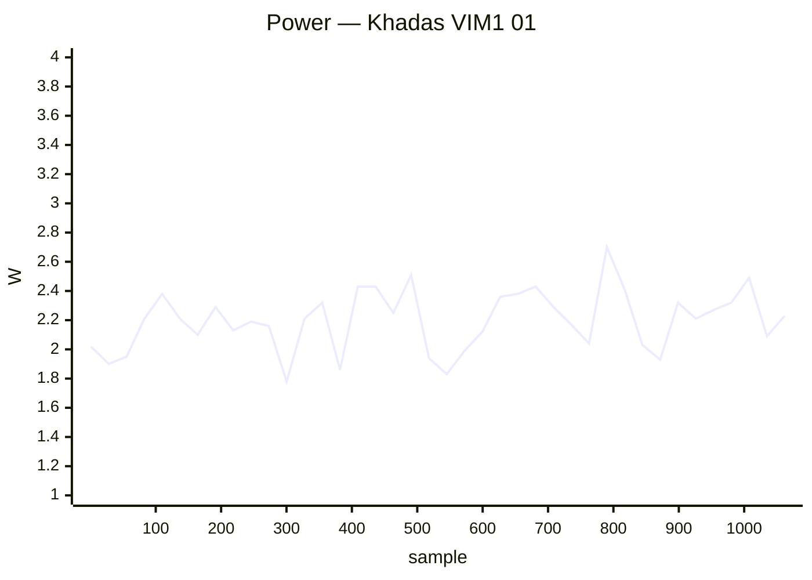
```mermaid
xychart-beta
    title "Power — Khadas VIM1 01"
    x-axis "sample" 1 --> 1062
    y-axis "W" 1.0 --> 4.0
    line [2.02, 1.90, 1.95, 2.21, 2.38, 2.21, 2.10, 2.29, 2.13, 2.19, 2.16, 1.78, 2.21, 2.32, 1.86, 2.43, 2.43, 2.25, 2.51, 1.94, 1.83, 1.99, 2.12, 2.36, 2.38, 2.43, 2.29, 2.17, 2.04, 2.70, 2.41, 2.03, 1.93, 2.32, 2.21, 2.27, 2.32, 2.49, 2.09, 2.23]
```

### ✅ Khadas VIM2 01

`khadas-vim2` · **inplace** · image `26.11.0-trunk.72` · 16 ✅ · 0 ❌ · 0 ⏭️

| Module | Status | Time | Detail |
|:--|:--:|--:|:--|
| upgrade | ✅ | 303.0 s | nightly · 26.11.0-trunk.72 → 26.11.0-trunk.73 |
| reboot | ✅ | 41.5 s | warm · up 23 s |
| kernel-switch | ✅ | 54.0 s | branch=current · family=meson64 · installed=26.11.0-trunk.73 · boot_image=/boot/vmlinuz-6.18.55-current-meson64 · kernel_before=6.18.55-current-meson64 |
| reboot | ✅ | 74.6 s | warm · 2/2 boots · up 25 s |
| hw-performance | ✅ | 24.1 s | AES 658 · mem 3600 · disk W 42 / R 142 MB/s · 60 °C · 1512 MHz |
| dvfs | ✅ | 25.0 s | ondemand · 500–1512 MHz (peak 1512) |
| network-iperf | ✅ | 95.8 s | eth0 ↑940/↓941 (1GE) · wlan0 ↑87/↓86 (Wi-Fi 5) Mbps |
| store-versions | ✅ | 5.6 s | 26.11.0-trunk.73 · 6.18.55-current-meson64 |
| kernel-switch | ✅ | 165.5 s | branch=edge · family=meson64 · installed=26.11.0-trunk.73 · boot_image=/boot/vmlinuz-7.2.9-edge-meson64 · kernel_before=6.18.55-current-meson64 |
| reboot | ✅ | 77.8 s | warm · 2/2 boots · up 26 s |
| hw-performance | ✅ | 24.1 s | AES 658 · mem 3600 · disk W 42 / R 138 MB/s · 60 °C · 1512 MHz |
| dvfs | ✅ | 25.8 s | ondemand · 500–1512 MHz (peak 1512) |
| network-iperf | ✅ | 75.0 s | eth0 ↑939/↓941 (1GE) · wlan0 ↑90/↓85 (Wi-Fi 5) Mbps |
| store-versions | ✅ | 6.1 s | 26.11.0-trunk.73 · 7.2.9-edge-meson64 |
| kernel-switch | ✅ | 165.0 s | branch=current · family=meson64 · installed=26.11.0-trunk.73 · boot_image=/boot/vmlinuz-6.18.55-current-meson64 · kernel_before=7.2.9-edge-meson64 |
| reboot | ✅ | 40.6 s | warm · up 23 s |

### ✅ Khadas VIM3 01

`khadas-vim3` · **inplace** · image `26.11.0-trunk.72` · 16 ✅ · 0 ❌ · 0 ⏭️

| Module | Status | Time | Detail |
|:--|:--:|--:|:--|
| upgrade | ✅ | 289.6 s | nightly · 26.11.0-trunk.72 → 26.11.0-trunk.73 |
| reboot | ✅ | 33.3 s | warm · up 17 s |
| kernel-switch | ✅ | 22.7 s | branch=current · family=meson64 · installed=26.11.0-trunk.73 · boot_image=/boot/vmlinuz-6.18.55-current-meson64 · kernel_before=6.18.55-current-meson64 |
| reboot | ✅ | 59.2 s | warm · 2/2 boots · up 16 s |
| hw-performance | ✅ | 16.3 s | AES 852 · mem 3900 · disk W 68 / R 158 MB/s · 62.8 °C · 2016 MHz |
| dvfs | ✅ | 17.2 s | ondemand · 1000–1512 MHz (peak 1512) |
| network-iperf | ✅ | 56.5 s | end0 ↑940/↓941 (1GE) · wlan0 ↑44/↓42 (Wi-Fi 5) Mbps |
| store-versions | ✅ | 3.9 s | 26.11.0-trunk.73 · 6.18.55-current-meson64 |
| kernel-switch | ✅ | 74.0 s | branch=edge · family=meson64 · installed=26.11.0-trunk.73 · boot_image=/boot/vmlinuz-7.2.9-edge-meson64 · kernel_before=6.18.55-current-meson64 |
| reboot | ✅ | 59.8 s | warm · 2/2 boots · up 17 s |
| hw-performance | ✅ | 17.1 s | AES 852 · mem 3900 · disk W 68 / R 148 MB/s · 63.1 °C · 2016 MHz |
| dvfs | ✅ | 17.6 s | ondemand · 1000–1512 MHz (peak 1512) |
| network-iperf | ✅ | 84.9 s | end0 ↑941/↓942 (1GE) · wlan0 ↑41/↓40 (Wi-Fi 5) Mbps |
| store-versions | ✅ | 4.5 s | 26.11.0-trunk.73 · 7.2.9-edge-meson64 |
| kernel-switch | ✅ | 75.1 s | branch=current · family=meson64 · installed=26.11.0-trunk.73 · boot_image=/boot/vmlinuz-6.18.55-current-meson64 · kernel_before=7.2.9-edge-meson64 |
| reboot | ✅ | 32.9 s | warm · up 16 s |

### ✅ Mekotronics R58HD 01

`mekotronics-r58hd` · **inplace** · image `26.11.0-trunk.72` · 5 ✅ · 0 ❌ · 1 ⏭️

| Module | Status | Time | Detail |
|:--|:--:|--:|:--|
| upgrade | ⏭️ | 151.5 s | — |
| reboot | ✅ | 160.7 s | power-cycle · up 16 s |
| hw-performance | ✅ | 14.3 s | AES 1305 · mem 16000 · disk W 245 / R 285 MB/s · 44.4 °C · 1800 MHz |
| dvfs | ✅ | 16.6 s | ondemand · 1800–1800 MHz (peak 2304) |
| network-iperf | ✅ | 51.9 s | end0 ↑941/↓941 (1GE) · enP3p49s0 ↑941/↓941 (1GE) Mbps |
| store-versions | ✅ | 4.5 s | 26.11.0-trunk.72 · 6.1.172-vendor-rk35xx |

**Power** — min 3.60 W · avg 5.13 W · peak 12.20 W · 324 samples

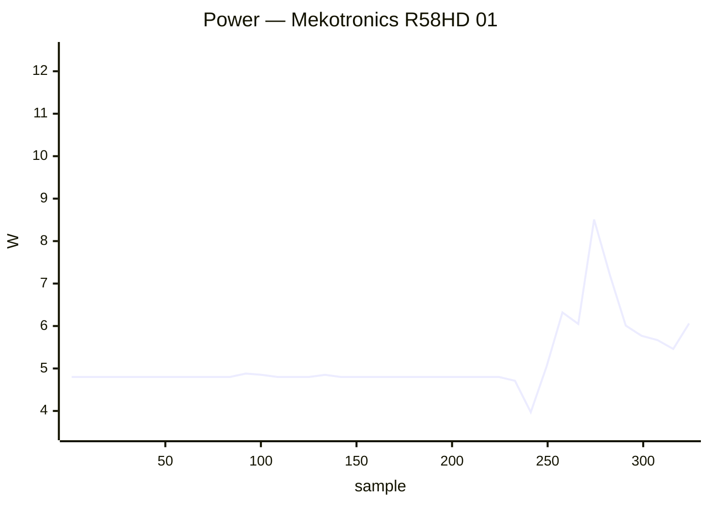
```mermaid
xychart-beta
    title "Power — Mekotronics R58HD 01"
    x-axis "sample" 1 --> 324
    y-axis "W" 3.5 --> 12.5
    line [4.80, 4.80, 4.80, 4.80, 4.80, 4.80, 4.80, 4.80, 4.80, 4.80, 4.80, 4.88, 4.85, 4.80, 4.80, 4.80, 4.85, 4.80, 4.80, 4.80, 4.80, 4.80, 4.80, 4.80, 4.80, 4.80, 4.80, 4.80, 4.71, 3.97, 5.05, 6.32, 6.05, 8.51, 7.20, 6.01, 5.77, 5.67, 5.46, 6.06]
```

### ✅ Mekotronics R58S2 01

`mekotronics-r58s2` · **inplace** · image `26.11.0-trunk.72` · 5 ✅ · 0 ❌ · 1 ⏭️

| Module | Status | Time | Detail |
|:--|:--:|--:|:--|
| upgrade | ⏭️ | 12.1 s | — |
| reboot | ✅ | 50.9 s | power-cycle · up 16 s |
| hw-performance | ✅ | 15.1 s | AES 1274 · mem 14000 · disk W 224 / R 271 MB/s · 42.5 °C · 1800 MHz |
| dvfs | ✅ | 18.0 s | ondemand · 1800–1800 MHz (peak 2352) |
| network-iperf | ✅ | 55.7 s | end1 ↑941/↓941 (1GE) · wlan0 ↑55/↓164 (Wi-Fi 5) Mbps |
| store-versions | ✅ | 4.6 s | 26.11.0-trunk.72 · 6.1.172-vendor-rk35xx |

**Power** — min 0.60 W · avg 3.48 W · peak 10.50 W · 134 samples

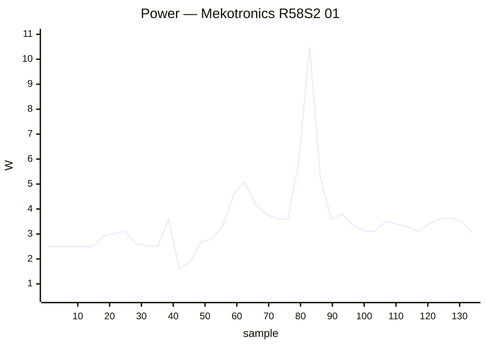
```mermaid
xychart-beta
    title "Power — Mekotronics R58S2 01"
    x-axis "sample" 1 --> 134
    y-axis "W" 0.5 --> 11.0
    line [2.50, 2.50, 2.50, 2.50, 2.50, 2.90, 3.03, 3.10, 2.60, 2.53, 2.50, 3.60, 1.60, 1.87, 2.70, 2.80, 3.33, 4.58, 5.10, 4.20, 3.80, 3.60, 3.60, 5.90, 10.50, 5.25, 3.60, 3.80, 3.35, 3.13, 3.10, 3.50, 3.40, 3.30, 3.10, 3.40, 3.60, 3.65, 3.50, 3.05]
```

### ✅ NanoPi Fire3 01

`nanopifire3` · **inplace** · image `26.11.0-trunk.72` · 7 ✅ · 0 ❌ · 1 ⏭️

| Module | Status | Time | Detail |
|:--|:--:|--:|:--|
| upgrade | ✅ | 445.1 s | nightly · 26.11.0-trunk.72 → 26.11.0-trunk.73 |
| reboot | ✅ | 74.6 s | power-cycle · up 31 s |
| kernel-switch | ✅ | 71.8 s | branch=edge · family=s5p6818 · installed=26.11.0-trunk.73 · boot_image=/boot/vmlinuz-7.2.9-edge-s5p6818 · kernel_before=7.2.9-edge-s5p6818 |
| reboot | ✅ | 110.4 s | power-cycle · 2/2 boots · up 33 s |
| hw-performance | ✅ | 35.3 s | AES 373 · mem 2000 · disk W 19 / R 22 MB/s · 65 °C · None MHz |
| dvfs | ➖ | 3.0 s | no cpufreq |
| network-iperf | ✅ | 38.7 s | eth0 ↑94/↓94 (10/100ME) Mbps |
| store-versions | ✅ | 6.3 s | 26.11.0-trunk.73 · 7.2.9-edge-s5p6818 |

**Power** — min 2.00 W · avg 2.95 W · peak 3.90 W · 634 samples

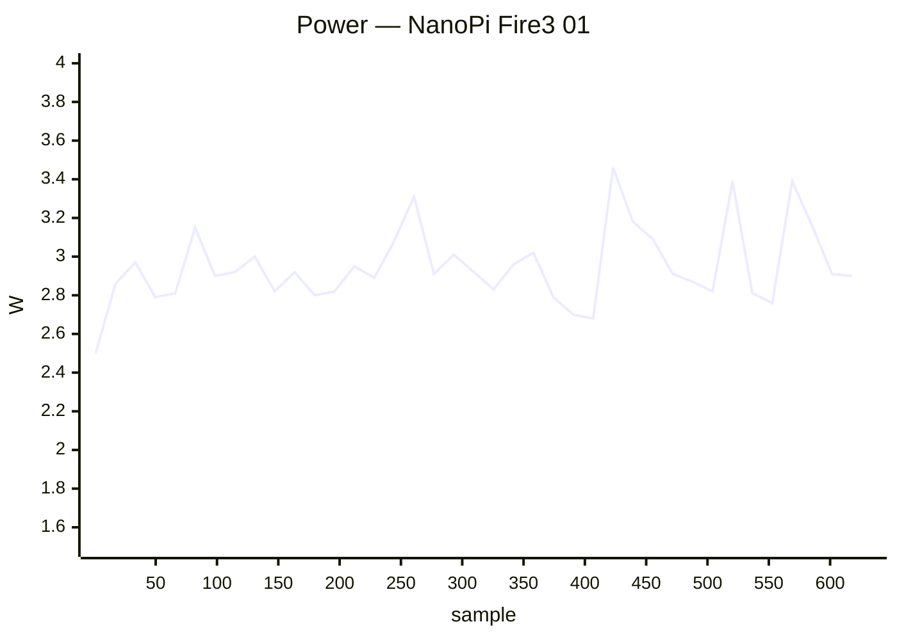
```mermaid
xychart-beta
    title "Power — NanoPi Fire3 01"
    x-axis "sample" 1 --> 634
    y-axis "W" 1.5 --> 4.0
    line [2.50, 2.86, 2.97, 2.79, 2.81, 3.15, 2.90, 2.92, 3.00, 2.82, 2.92, 2.80, 2.82, 2.95, 2.89, 3.08, 3.31, 2.91, 3.01, 2.92, 2.83, 2.96, 3.02, 2.79, 2.70, 2.68, 3.46, 3.18, 3.09, 2.91, 2.87, 2.82, 3.39, 2.81, 2.76, 3.39, 3.16, 2.91, 2.90, 2.85]
```

### ✅ NanoPi K2 01

`nanopik2-s905` · **inplace** · image `26.11.0-trunk.72` · 16 ✅ · 0 ❌ · 0 ⏭️

| Module | Status | Time | Detail |
|:--|:--:|--:|:--|
| upgrade | ✅ | 303.4 s | nightly · 26.11.0-trunk.72 → 26.11.0-trunk.73 |
| reboot | ✅ | 45.6 s | warm · up 29 s |
| kernel-switch | ✅ | 40.2 s | branch=current · family=meson64 · installed=26.11.0-trunk.73 · boot_image=/boot/vmlinuz-6.18.55-current-meson64 · kernel_before=6.18.55-current-meson64 |
| reboot | ✅ | 66.7 s | warm · 2/2 boots · up 21 s |
| hw-performance | ✅ | 30.4 s | AES 51 · mem 3700 · disk W 10 / R 41 MB/s · 62 °C · 2016 MHz |
| dvfs | ✅ | 21.2 s | ondemand · 500–1536 MHz (peak 1536) |
| network-iperf | ✅ | 64.7 s | end0 ↑936/↓941 (1GE) · wlan0 ↑14/↓17 (Wi-Fi 4) Mbps |
| store-versions | ✅ | 4.7 s | 26.11.0-trunk.73 · 6.18.55-current-meson64 |
| kernel-switch | ✅ | 162.9 s | branch=edge · family=meson64 · installed=26.11.0-trunk.73 · boot_image=/boot/vmlinuz-7.2.9-edge-meson64 · kernel_before=6.18.55-current-meson64 |
| reboot | ✅ | 65.8 s | warm · 2/2 boots · up 19 s |
| hw-performance | ✅ | 30.8 s | AES 51 · mem 3700 · disk W 10 / R 2 MB/s · 63 °C · 2016 MHz |
| dvfs | ✅ | 21.8 s | ondemand · 500–1536 MHz (peak 1536) |
| network-iperf | ✅ | 67.2 s | end0 ↑935/↓941 (1GE) · wlan0 ↑14/↓16 (Wi-Fi 4) Mbps |
| store-versions | ✅ | 4.6 s | 26.11.0-trunk.73 · 7.2.9-edge-meson64 |
| kernel-switch | ✅ | 155.0 s | branch=current · family=meson64 · installed=26.11.0-trunk.73 · boot_image=/boot/vmlinuz-6.18.55-current-meson64 · kernel_before=7.2.9-edge-meson64 |
| reboot | ✅ | 35.3 s | warm · up 19 s |

### ✅ NanoPi M4V2 01

`nanopim4v2` · **inplace** · image `26.11.0-trunk.72` · 16 ✅ · 0 ❌ · 0 ⏭️

| Module | Status | Time | Detail |
|:--|:--:|--:|:--|
| upgrade | ✅ | 211.5 s | nightly · 26.11.0-trunk.72 → 26.11.0-trunk.73 |
| reboot | ✅ | 56.4 s | power-cycle · up 26 s |
| kernel-switch | ✅ | 98.9 s | branch=current · family=rockchip64 · installed=26.11.0-trunk.73 · boot_image=/boot/vmlinuz-6.18.55-current-rockchip64 · kernel_before=7.2.9-edge-rockchip64 |
| reboot | ✅ | 93.0 s | power-cycle · 2/2 boots · up 24 s |
| hw-performance | ✅ | 21.2 s | AES 1020 · mem 6600 · disk W 53 / R 61 MB/s · 46.2 °C · 1416 MHz |
| dvfs | ✅ | 20.7 s | ondemand · 408–1416 MHz (peak 1800) |
| network-iperf | ✅ | 97.8 s | end0 ↑940/↓941 (1GE) · wlan0 ↑146/↓80 (Wi-Fi 5) · wlx803f5d16af63 ↑117/↓152 (Wi-Fi 5) Mbps |
| store-versions | ✅ | 4.9 s | 26.11.0-trunk.73 · 6.18.55-current-rockchip64 |
| kernel-switch | ✅ | 98.6 s | branch=edge · family=rockchip64 · installed=26.11.0-trunk.73 · boot_image=/boot/vmlinuz-7.2.9-edge-rockchip64 · kernel_before=6.18.55-current-rockchip64 |
| reboot | ✅ | 91.3 s | power-cycle · 2/2 boots · up 26 s |
| hw-performance | ✅ | 22.3 s | AES 1020 · mem 6500 · disk W 52 / R 60 MB/s · 46.2 °C · 1416 MHz |
| dvfs | ✅ | 20.1 s | ondemand · 408–1416 MHz (peak 1800) |
| network-iperf | ✅ | 224.4 s | end0 ↑941/↓941 (1GE) · wlan0 ↑69/↓28 (Wi-Fi 5) · wlx803f5d16af63 ↑12/↓14 (Wi-Fi 5) Mbps |
| store-versions | ✅ | 5.0 s | 26.11.0-trunk.73 · 7.2.9-edge-rockchip64 |
| kernel-switch | ✅ | 90.5 s | branch=current · family=rockchip64 · installed=26.11.0-trunk.73 · boot_image=/boot/vmlinuz-6.18.55-current-rockchip64 · kernel_before=7.2.9-edge-rockchip64 |
| reboot | ✅ | 56.6 s | power-cycle · up 26 s |

**Power** — min 2.20 W · avg 7.02 W · peak 12.80 W · 962 samples

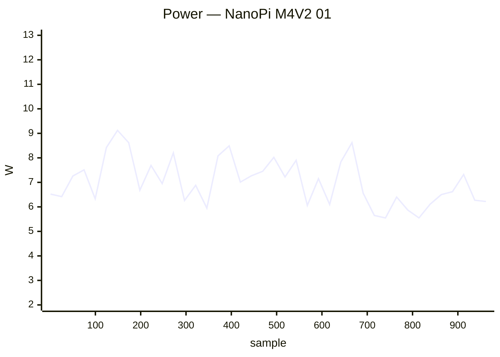
```mermaid
xychart-beta
    title "Power — NanoPi M4V2 01"
    x-axis "sample" 1 --> 962
    y-axis "W" 2.0 --> 13.0
    line [6.52, 6.42, 7.26, 7.51, 6.33, 8.42, 9.12, 8.62, 6.68, 7.69, 6.95, 8.20, 6.26, 6.88, 5.95, 8.08, 8.49, 7.01, 7.27, 7.45, 8.02, 7.22, 7.90, 6.06, 7.15, 6.10, 7.83, 8.62, 6.56, 5.65, 5.55, 6.40, 5.87, 5.55, 6.11, 6.50, 6.62, 7.32, 6.27, 6.22]
```

### ✅ NanoPi M5 01

`nanopi-m5` · **inplace** · image `26.11.0-trunk.66` · 21 ✅ · 0 ❌ · 1 ⏭️

| Module | Status | Time | Detail |
|:--|:--:|--:|:--|
| upgrade | ⏭️ | 9.9 s | — |
| reboot | ✅ | 56.2 s | power-cycle · up 25 s |
| kernel-switch | ✅ | 104.0 s | branch=vendor · family=rk35xx · installed=26.11.0-trunk.66 · boot_image=/boot/vmlinuz-6.1.172-vendor-rk35xx · kernel_before=7.2.8-edge-rockchip64 |
| reboot | ✅ | 84.9 s | power-cycle · 2/2 boots · up 21 s |
| hw-performance | ✅ | 17.8 s | AES 1271 · mem 7900 · disk W 66 / R 77 MB/s · 40.7 °C · 2016 MHz |
| dvfs | ✅ | 18.9 s | ondemand · 2016–2016 MHz (peak 2208) |
| network-iperf | ✅ | 132.2 s | end0 ↑941/↓941 (1GE) · end1 ↑941/↓941 (1GE) · wlan0 ↑44/↓79 (Wi-Fi 5) · wlx44334c47dec3 ↑31/↓8 (Wi-Fi 4) Mbps |
| store-versions | ✅ | 4.2 s | 26.11.0-trunk.66 · 6.1.172-vendor-rk35xx |
| kernel-switch | ✅ | 115.1 s | branch=current · family=rockchip64 · installed=26.11.0-trunk.66 · boot_image=/boot/vmlinuz-6.18.54-current-rockchip64 · kernel_before=6.1.172-vendor-rk35xx |
| reboot | ✅ | 85.7 s | power-cycle · 2/2 boots · up 26 s |
| hw-performance | ✅ | 26.2 s | AES 1335 · mem 9000 · disk W 20 / R 21 MB/s · 40.7 °C · 2016 MHz |
| dvfs | ✅ | 16.6 s | ondemand · 408–2016 MHz (peak 2208) |
| network-iperf | ✅ | 116.2 s | end0 ↑941/↓941 (1GE) · end1 ↑941/↓941 (1GE) · wlan0 ↑64/↓136 (Wi-Fi 5) · wlx44334c47dec3 ↑36/↓16 (Wi-Fi 4) Mbps |
| store-versions | ✅ | 4.0 s | 26.11.0-trunk.66 · 6.18.54-current-rockchip64 |
| kernel-switch | ✅ | 102.9 s | branch=edge · family=rockchip64 · installed=26.11.0-trunk.66 · boot_image=/boot/vmlinuz-7.2.8-edge-rockchip64 · kernel_before=6.18.54-current-rockchip64 |
| reboot | ✅ | 86.4 s | power-cycle · 2/2 boots · up 24 s |
| hw-performance | ✅ | 26.9 s | AES 1335 · mem 9000 · disk W 20 / R 21 MB/s · 41.6 °C · 2016 MHz |
| dvfs | ✅ | 17.3 s | ondemand · 408–2016 MHz (peak 2208) |
| network-iperf | ✅ | 121.4 s | end0 ↑941/↓941 (1GE) · end1 ↑940/↓941 (1GE) · wlan0 ↑67/↓76 (Wi-Fi 5) · wlx44334c47dec3 ↑32/↓17 (Wi-Fi 4) Mbps |
| store-versions | ✅ | 4.1 s | 26.11.0-trunk.66 · 7.2.8-edge-rockchip64 |
| kernel-switch | ✅ | 101.4 s | branch=vendor · family=rk35xx · installed=26.11.0-trunk.66 · boot_image=/boot/vmlinuz-6.1.172-vendor-rk35xx · kernel_before=7.2.8-edge-rockchip64 |
| reboot | ✅ | 49.1 s | power-cycle · up 22 s |

**Power** — min 0.60 W · avg 5.04 W · peak 8.90 W · 1029 samples

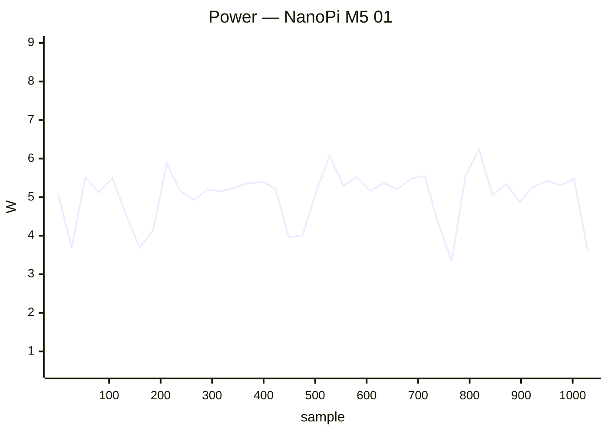
```mermaid
xychart-beta
    title "Power — NanoPi M5 01"
    x-axis "sample" 1 --> 1029
    y-axis "W" 0.5 --> 9.0
    line [5.08, 3.69, 5.51, 5.12, 5.50, 4.55, 3.69, 4.14, 5.87, 5.16, 4.92, 5.20, 5.15, 5.25, 5.36, 5.40, 5.23, 3.96, 4.01, 5.13, 6.08, 5.30, 5.52, 5.17, 5.36, 5.21, 5.48, 5.55, 4.32, 3.34, 5.55, 6.24, 5.05, 5.35, 4.88, 5.27, 5.42, 5.31, 5.47, 3.64]
```

### ✅ NanoPi M6 01

`nanopi-m6` · **inplace** · image `26.11.0-trunk.72` · 22 ✅ · 0 ❌ · 0 ⏭️

| Module | Status | Time | Detail |
|:--|:--:|--:|:--|
| upgrade | ✅ | 149.7 s | nightly · 26.11.0-trunk.72 → 26.11.0-trunk.73 |
| reboot | ✅ | 58.2 s | power-cycle · up 22 s |
| kernel-switch | ✅ | 20.6 s | branch=vendor · family=rk35xx · installed=26.11.0-trunk.73 · boot_image=/boot/vmlinuz-6.1.172-vendor-rk35xx · kernel_before=6.1.172-vendor-rk35xx |
| reboot | ✅ | 83.6 s | power-cycle · 2/2 boots · up 22 s |
| hw-performance | ✅ | 17.3 s | AES 1274 · mem 15200 · disk W 55 / R 77 MB/s · 40.7 °C · 1800 MHz |
| dvfs | ✅ | 16.3 s | ondemand · 1800–1800 MHz (peak 2256) |
| network-iperf | ✅ | 59.6 s | lan ↑940/↓941 (1GE) · wlP3p49s0 ↑201/↓224 (Wi-Fi 5) Mbps |
| store-versions | ✅ | 4.0 s | 26.11.0-trunk.73 · 6.1.172-vendor-rk35xx |
| kernel-switch | ✅ | 103.2 s | branch=current · family=rockchip64 · installed=26.11.0-trunk.73 · boot_image=/boot/vmlinuz-6.18.55-current-rockchip64 · kernel_before=6.1.172-vendor-rk35xx |
| reboot | ✅ | 84.9 s | power-cycle · 2/2 boots · up 23 s |
| hw-performance | ✅ | 18.3 s | AES 1218 · mem 10000 · disk W 48 / R 57 MB/s · 43.5 °C · 1800 MHz |
| dvfs | ✅ | 15.6 s | ondemand · 408–1800 MHz (peak 2400) |
| network-iperf | ✅ | 81.3 s | lan ↑935/↓941 (1GE) · wlP3p49s0 ↑276/↓294 (Wi-Fi 5) Mbps |
| store-versions | ✅ | 4.0 s | 26.11.0-trunk.73 · 6.18.55-current-rockchip64 |
| kernel-switch | ✅ | 73.8 s | branch=edge · family=rockchip64 · installed=26.11.0-trunk.73 · boot_image=/boot/vmlinuz-7.2.9-edge-rockchip64 · kernel_before=6.18.55-current-rockchip64 |
| reboot | ✅ | 77.3 s | power-cycle · 2/2 boots · up 19 s |
| hw-performance | ✅ | 18.3 s | AES 1207 · mem 7800 · disk W 46 / R 56 MB/s · 45.3 °C · 1800 MHz |
| dvfs | ✅ | 14.4 s | ondemand · 408–1800 MHz (peak 2400) |
| network-iperf | ✅ | 141.6 s | lan ↑939/↓941 (1GE) · wlP3p49s0 ↑192/↓280 (Wi-Fi 5) Mbps |
| store-versions | ✅ | 4.4 s | 26.11.0-trunk.73 · 7.2.9-edge-rockchip64 |
| kernel-switch | ✅ | 76.6 s | branch=vendor · family=rk35xx · installed=26.11.0-trunk.73 · boot_image=/boot/vmlinuz-6.1.172-vendor-rk35xx · kernel_before=7.2.9-edge-rockchip64 |
| reboot | ✅ | 56.5 s | power-cycle · up 20 s |

**Power** — min 0.80 W · avg 3.90 W · peak 10.30 W · 926 samples

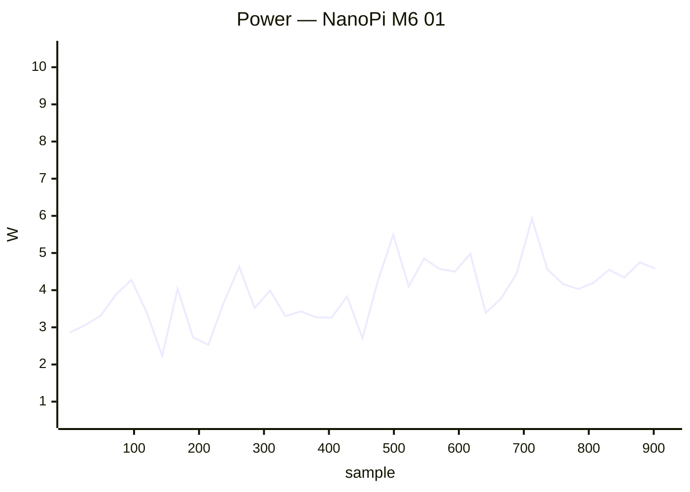
```mermaid
xychart-beta
    title "Power — NanoPi M6 01"
    x-axis "sample" 1 --> 926
    y-axis "W" 0.5 --> 10.5
    line [2.86, 3.06, 3.31, 3.88, 4.28, 3.40, 2.23, 4.04, 2.73, 2.53, 3.67, 4.63, 3.52, 3.99, 3.30, 3.43, 3.27, 3.26, 3.83, 2.71, 4.25, 5.49, 4.10, 4.85, 4.57, 4.50, 4.98, 3.39, 3.78, 4.44, 5.93, 4.56, 4.17, 4.03, 4.20, 4.55, 4.34, 4.75, 4.58, 2.82]
```

### ✅ NanoPi Neo 2 Black 01

`nanopineo2black` · **inplace** · image `26.11.0-trunk.72` · 16 ✅ · 0 ❌ · 0 ⏭️

| Module | Status | Time | Detail |
|:--|:--:|--:|:--|
| upgrade | ✅ | 201.0 s | nightly · 26.11.0-trunk.72 → 26.11.0-trunk.73 |
| reboot | ✅ | 57.3 s | power-cycle · up 17 s |
| kernel-switch | ✅ | 42.6 s | branch=current · family=sunxi64 · installed=26.11.0-trunk.73 · boot_image=/boot/vmlinuz-6.18.55-current-sunxi64 · kernel_before=6.18.55-current-sunxi64 |
| reboot | ✅ | 82.7 s | power-cycle · 2/2 boots · up 18 s |
| hw-performance | ✅ | 23.9 s | AES 637 · mem 3400 · disk W 43 / R 44 MB/s · 68.9 °C · 1368 MHz |
| dvfs | ✅ | 23.0 s | ondemand · 480–1368 MHz (peak 1368) |
| network-iperf | ✅ | 37.3 s | end0 ↑790/↓917 (1GE) Mbps |
| store-versions | ✅ | 4.9 s | 26.11.0-trunk.73 · 6.18.55-current-sunxi64 |
| kernel-switch | ✅ | 113.9 s | branch=edge · family=sunxi64 · installed=26.11.0-trunk.73 · boot_image=/boot/vmlinuz-7.2.9-edge-sunxi64 · kernel_before=6.18.55-current-sunxi64 |
| reboot | ✅ | 312.6 s | power-cycle · 1/2 boots · up 17 s |
| hw-performance | ✅ | 24.1 s | AES 601 · mem 3500 · disk W 43 / R 44 MB/s · 63.9 °C · 1368 MHz |
| dvfs | ✅ | 23.4 s | ondemand · 480–1368 MHz (peak 1368) |
| network-iperf | ✅ | 31.1 s | end0 ↑886/↓924 (1GE) Mbps |
| store-versions | ✅ | 5.0 s | 26.11.0-trunk.73 · 7.2.9-edge-sunxi64 |
| kernel-switch | ✅ | 112.5 s | branch=current · family=sunxi64 · installed=26.11.0-trunk.73 · boot_image=/boot/vmlinuz-6.18.55-current-sunxi64 · kernel_before=7.2.9-edge-sunxi64 |
| reboot | ✅ | 60.2 s | power-cycle · up 22 s |

**Power** — min 1.00 W · avg 2.74 W · peak 5.50 W · 921 samples

```mermaid
xychart-beta
    title "Power — NanoPi Neo 2 Black 01"
    x-axis "sample" 1 --> 921
    y-axis "W" 0.5 --> 6.0
    line [1.40, 2.90, 3.23, 2.87, 2.84, 3.41, 3.21, 2.94, 1.77, 3.97, 3.16, 2.60, 3.19, 3.04, 3.57, 3.19, 3.29, 3.11, 3.53, 3.06, 3.05, 3.41, 1.93, 1.50, 1.54, 1.50, 1.50, 1.50, 1.50, 2.43, 2.23, 3.29, 3.38, 2.94, 3.00, 2.91, 3.07, 3.11, 2.71, 2.72]
```

### ✅ NanoPi Neo 3 01

`nanopineo3` · **inplace** · image `26.11.0-trunk.72` · 16 ✅ · 0 ❌ · 0 ⏭️

| Module | Status | Time | Detail |
|:--|:--:|--:|:--|
| upgrade | ✅ | 302.9 s | nightly · 26.11.0-trunk.72 → 26.11.0-trunk.73 |
| reboot | ✅ | 64.9 s | power-cycle · up 27 s |
| kernel-switch | ✅ | 59.0 s | branch=current · family=rockchip64 · installed=26.11.0-trunk.73 · boot_image=/boot/vmlinuz-6.18.55-current-rockchip64 · kernel_before=6.18.55-current-rockchip64 |
| reboot | ✅ | 99.8 s | power-cycle · 2/2 boots · up 27 s |
| hw-performance | ✅ | 28.9 s | AES 599 · mem 2400 · disk W 1 / R 63 MB/s · 79.6 °C · 1296 MHz |
| dvfs | ✅ | 29.8 s | ondemand · 408–1296 MHz (peak 1296) |
| network-iperf | ✅ | 249.4 s | end0 ↑906/↓939 (1GE) · wlx7cdd905518f9 ↑38/↓33 (Wi-Fi 4) Mbps |
| store-versions | ✅ | 6.6 s | 26.11.0-trunk.73 · 6.18.55-current-rockchip64 |
| kernel-switch | ✅ | 177.8 s | branch=edge · family=rockchip64 · installed=26.11.0-trunk.73 · boot_image=/boot/vmlinuz-7.2.9-edge-rockchip64 · kernel_before=6.18.55-current-rockchip64 |
| reboot | ✅ | 99.8 s | power-cycle · 2/2 boots · up 27 s |
| hw-performance | ✅ | 29.4 s | AES 599 · mem 2300 · disk W 1 / R 63 MB/s · 80.4 °C · 1296 MHz |
| dvfs | ✅ | 30.9 s | ondemand · 408–1296 MHz (peak 1296) |
| network-iperf | ✅ | 113.3 s | end0 ↑919/↓939 (1GE) · wlx7cdd905518f9 ↑38/↓20 (Wi-Fi 4) Mbps |
| store-versions | ✅ | 6.7 s | 26.11.0-trunk.73 · 7.2.9-edge-rockchip64 |
| kernel-switch | ✅ | 172.9 s | branch=current · family=rockchip64 · installed=26.11.0-trunk.73 · boot_image=/boot/vmlinuz-6.18.55-current-rockchip64 · kernel_before=7.2.9-edge-rockchip64 |
| reboot | ✅ | 67.0 s | power-cycle · up 29 s |

**Power** — min 1.60 W · avg 4.51 W · peak 6.00 W · 1232 samples

```mermaid
xychart-beta
    title "Power — NanoPi Neo 3 01"
    x-axis "sample" 1 --> 1232
    y-axis "W" 1.5 --> 6.5
    line [3.85, 4.56, 4.80, 4.71, 4.70, 4.54, 5.13, 4.65, 4.33, 4.45, 4.89, 4.27, 4.83, 4.09, 4.66, 4.84, 4.17, 4.79, 4.11, 3.80, 4.06, 4.10, 4.46, 4.81, 4.74, 4.70, 4.61, 4.31, 4.18, 4.78, 4.53, 4.15, 4.79, 4.62, 4.64, 4.87, 4.71, 4.62, 4.38, 4.17]
```

### ✅ NanoPi R6S 01

`nanopi-r6s` · **inplace** · image `26.11.0-trunk.72` · 22 ✅ · 0 ❌ · 0 ⏭️

| Module | Status | Time | Detail |
|:--|:--:|--:|:--|
| upgrade | ✅ | 92.4 s | nightly · 26.11.0-trunk.72 → 26.11.0-trunk.73 |
| reboot | ✅ | 43.0 s | power-cycle · up 16 s |
| kernel-switch | ✅ | 18.5 s | branch=vendor · family=rk35xx · installed=26.11.0-trunk.73 · boot_image=/boot/vmlinuz-6.1.172-vendor-rk35xx · kernel_before=6.1.172-vendor-rk35xx |
| reboot | ✅ | 66.7 s | power-cycle · 2/2 boots · up 16 s |
| hw-performance | ✅ | 14.0 s | AES 1325 · mem 15900 · disk W 208 / R 269 MB/s · 40.7 °C · 1800 MHz |
| dvfs | ✅ | 17.1 s | ondemand · 1800–1800 MHz (peak 2352) |
| network-iperf | ✅ | 51.9 s | lan2 ↑941/↓942 (1GE) · wan ↑2353/↓2314 (2.5GE) Mbps |
| store-versions | ✅ | 3.9 s | 26.11.0-trunk.73 · 6.1.172-vendor-rk35xx |
| kernel-switch | ✅ | 53.2 s | branch=current · family=rockchip64 · installed=26.11.0-trunk.73 · boot_image=/boot/vmlinuz-6.18.55-current-rockchip64 · kernel_before=6.1.172-vendor-rk35xx |
| reboot | ✅ | 76.2 s | power-cycle · 2/2 boots · up 15 s |
| hw-performance | ✅ | 15.4 s | AES 1275 · mem 6700 · disk W 146 / R 140 MB/s · 42.5 °C · 1800 MHz |
| dvfs | ✅ | 15.7 s | ondemand · 408–1800 MHz (peak 2400) |
| network-iperf | ✅ | 54.1 s | lan2 ↑941/↓942 (1GE) · wan ↑2352/↓2295 (2.5GE) Mbps |
| store-versions | ✅ | 4.0 s | 26.11.0-trunk.73 · 6.18.55-current-rockchip64 |
| kernel-switch | ✅ | 48.9 s | branch=edge · family=rockchip64 · installed=26.11.0-trunk.73 · boot_image=/boot/vmlinuz-7.2.9-edge-rockchip64 · kernel_before=6.18.55-current-rockchip64 |
| reboot | ✅ | 70.6 s | power-cycle · 2/2 boots · up 22 s |
| hw-performance | ✅ | 15.3 s | AES 1274 · mem 8100 · disk W 143 / R 150 MB/s · 42.5 °C · 1800 MHz |
| dvfs | ✅ | 16.3 s | ondemand · 408–1800 MHz (peak 2400) |
| network-iperf | ✅ | 82.9 s | lan2 ↑937/↓941 (1GE) · wan ↑2350/↓2288 (2.5GE) Mbps |
| store-versions | ✅ | 4.2 s | 26.11.0-trunk.73 · 7.2.9-edge-rockchip64 |
| kernel-switch | ✅ | 46.7 s | branch=vendor · family=rk35xx · installed=26.11.0-trunk.73 · boot_image=/boot/vmlinuz-6.1.172-vendor-rk35xx · kernel_before=7.2.9-edge-rockchip64 |
| reboot | ✅ | 41.4 s | power-cycle · up 16 s |

**Power** — min 2.10 W · avg 4.06 W · peak 10.50 W · 649 samples

```mermaid
xychart-beta
    title "Power — NanoPi R6S 01"
    x-axis "sample" 1 --> 649
    y-axis "W" 2.0 --> 11.0
    line [2.80, 3.79, 5.72, 4.26, 4.01, 3.83, 3.68, 4.13, 3.44, 3.22, 3.70, 6.90, 3.68, 3.74, 3.49, 3.90, 4.52, 3.68, 3.41, 3.35, 3.96, 6.51, 3.59, 4.07, 4.35, 4.12, 4.51, 3.94, 3.31, 3.84, 4.03, 5.08, 3.72, 4.13, 3.42, 4.26, 3.57, 4.54, 4.39, 3.92]
```

### ✅ NanoPi R76S 01

`nanopi-r76s` · **inplace** · image `26.11.0-trunk.72` · 15 ✅ · 0 ❌ · 1 ⏭️

| Module | Status | Time | Detail |
|:--|:--:|--:|:--|
| upgrade | ⏭️ | 17.8 s | — |
| reboot | ✅ | 75.5 s | power-cycle · up 33 s |
| kernel-switch | ✅ | 147.2 s | branch=vendor · family=rk35xx · installed=26.11.0-trunk.73 · boot_image=/boot/vmlinuz-6.1.172-vendor-rk35xx · kernel_before=6.1.172-vendor-rk35xx |
| reboot | ✅ | 122.6 s | power-cycle · 2/2 boots · up 34 s |
| hw-performance | ✅ | 22.2 s | AES 1271 · mem 7200 · disk W 23 / R 77 MB/s · 44.4 °C · 2016 MHz |
| dvfs | ✅ | 20.6 s | ondemand · 2016–2016 MHz (peak 2208) |
| network-iperf | ✅ | 182.6 s | end1 ↑2347/↓2354 (2.5GE) · wlan0 ↑43/↓88 (Wi-Fi 5) · wlxe0e1a933de37 ↑132/↓135 (Wi-Fi 5) Mbps |
| store-versions | ✅ | 4.7 s | 26.11.0-trunk.72 · 6.1.172-vendor-rk35xx |
| kernel-switch | ✅ | 164.8 s | branch=edge · family=rockchip64 · installed=26.11.0-trunk.73 · boot_image=/boot/vmlinuz-7.2.9-edge-rockchip64 · kernel_before=6.1.172-vendor-rk35xx |
| reboot | ✅ | 120.9 s | power-cycle · 2/2 boots · up 30 s |
| hw-performance | ✅ | 23.4 s | AES 1306 · mem 8700 · disk W 21 / R 70 MB/s · 44.4 °C · 2016 MHz |
| dvfs | ✅ | 18.9 s | ondemand · 408–2016 MHz (peak 2208) |
| network-iperf | ✅ | 274.5 s | end0 ↑2352/↓2246 (2.5GE) · end1 ↑2343/↓2354 (2.5GE) · wlan0 ↑91/↓134 (Wi-Fi 5) · wlxe0e1a933de37 ↑176/↓190 (Wi-Fi 5) Mbps |
| store-versions | ✅ | 4.8 s | 26.11.0-trunk.72 · 7.2.9-edge-rockchip64 |
| kernel-switch | ✅ | 93.1 s | branch=vendor · family=rk35xx · installed=26.11.0-trunk.73 · boot_image=/boot/vmlinuz-6.1.172-vendor-rk35xx · kernel_before=7.2.9-edge-rockchip64 |
| reboot | ✅ | 66.8 s | power-cycle · up 30 s |

**Power** — min 0.60 W · avg 4.34 W · peak 8.90 W · 932 samples

```mermaid
xychart-beta
    title "Power — NanoPi R76S 01"
    x-axis "sample" 1 --> 932
    y-axis "W" 0.5 --> 9.0
    line [4.06, 3.93, 3.10, 4.83, 4.55, 4.30, 4.76, 4.49, 2.90, 3.21, 3.94, 5.61, 4.71, 4.18, 4.84, 4.74, 4.34, 4.97, 4.92, 4.73, 4.88, 4.41, 4.85, 2.63, 4.01, 3.08, 5.18, 5.17, 4.39, 4.28, 4.09, 4.45, 4.54, 4.04, 4.30, 4.70, 4.88, 4.90, 4.54, 3.20]
```

### ✅ Odroid C2 01

`odroidc2` · **inplace** · image `26.11.0-trunk.72` · 16 ✅ · 0 ❌ · 0 ⏭️

| Module | Status | Time | Detail |
|:--|:--:|--:|:--|
| upgrade | ✅ | 215.0 s | nightly · 26.11.0-trunk.72 → 26.11.0-trunk.73 |
| reboot | ✅ | 33.3 s | warm · up 17 s |
| kernel-switch | ✅ | 37.6 s | branch=current · family=meson64 · installed=26.11.0-trunk.73 · boot_image=/boot/vmlinuz-6.18.55-current-meson64 · kernel_before=6.18.55-current-meson64 |
| reboot | ✅ | 61.4 s | warm · 2/2 boots · up 17 s |
| hw-performance | ✅ | 22.3 s | AES 51 · mem 3500 · disk W 33 / R 152 MB/s · 47 °C · 1536 MHz |
| dvfs | ✅ | 22.9 s | ondemand · 500–1536 MHz (peak 1536) |
| network-iperf | ✅ | 33.8 s | end0 ↑940/↓941 (1GE) Mbps |
| store-versions | ✅ | 4.9 s | 26.11.0-trunk.73 · 6.18.55-current-meson64 |
| kernel-switch | ✅ | 116.3 s | branch=edge · family=meson64 · installed=26.11.0-trunk.73 · boot_image=/boot/vmlinuz-7.2.9-edge-meson64 · kernel_before=6.18.55-current-meson64 |
| reboot | ✅ | 61.5 s | warm · 2/2 boots · up 17 s |
| hw-performance | ✅ | 22.1 s | AES 51 · mem 3500 · disk W 33 / R 151 MB/s · 49 °C · 1536 MHz |
| dvfs | ✅ | 22.2 s | ondemand · 500–1536 MHz (peak 1536) |
| network-iperf | ✅ | 94.3 s | end0 ↑940/↓941 (1GE) Mbps |
| store-versions | ✅ | 5.0 s | 26.11.0-trunk.73 · 7.2.9-edge-meson64 |
| kernel-switch | ✅ | 115.5 s | branch=current · family=meson64 · installed=26.11.0-trunk.73 · boot_image=/boot/vmlinuz-6.18.55-current-meson64 · kernel_before=7.2.9-edge-meson64 |
| reboot | ✅ | 32.0 s | warm · up 15 s |

### ✅ Odroid C4 01

`odroidc4` · **inplace** · image `26.11.0-trunk.72` · 16 ✅ · 0 ❌ · 0 ⏭️

| Module | Status | Time | Detail |
|:--|:--:|--:|:--|
| upgrade | ✅ | 200.3 s | nightly · 26.11.0-trunk.72 → 26.11.0-trunk.73 |
| reboot | ✅ | 56.2 s | power-cycle · up 21 s |
| kernel-switch | ✅ | 30.6 s | branch=current · family=meson64 · installed=26.11.0-trunk.73 · boot_image=/boot/vmlinuz-6.18.55-current-meson64 · kernel_before=6.18.55-current-meson64 |
| reboot | ✅ | 77.4 s | power-cycle · 2/2 boots · up 19 s |
| hw-performance | ✅ | 21.7 s | AES 980 · mem 5300 · disk W 31 / R 77 MB/s · 40.6 °C · 2100 MHz |
| dvfs | ✅ | 19.1 s | ondemand · 1000–2100 MHz (peak 2100) |
| network-iperf | ✅ | 58.2 s | end0 ↑941/↓941 (1GE) · wlx24050fdd332b ↑117/↓135 (Wi-Fi 4) Mbps |
| store-versions | ✅ | 4.3 s | 26.11.0-trunk.73 · 6.18.55-current-meson64 |
| kernel-switch | ✅ | 111.9 s | branch=edge · family=meson64 · installed=26.11.0-trunk.73 · boot_image=/boot/vmlinuz-7.2.9-edge-meson64 · kernel_before=6.18.55-current-meson64 |
| reboot | ✅ | 80.5 s | power-cycle · 2/2 boots · up 17 s |
| hw-performance | ✅ | 21.5 s | AES 980 · mem 5300 · disk W 31 / R 78 MB/s · 41.2 °C · 2100 MHz |
| dvfs | ✅ | 19.7 s | ondemand · 1000–2100 MHz (peak 2100) |
| network-iperf | ✅ | 121.7 s | end0 ↑941/↓941 (1GE) · wlx24050fdd332b ↑112/↓119 (Wi-Fi 4) Mbps |
| store-versions | ✅ | 4.5 s | 26.11.0-trunk.73 · 7.2.9-edge-meson64 |
| kernel-switch | ✅ | 110.9 s | branch=current · family=meson64 · installed=26.11.0-trunk.73 · boot_image=/boot/vmlinuz-6.18.55-current-meson64 · kernel_before=7.2.9-edge-meson64 |
| reboot | ✅ | 55.3 s | power-cycle · up 17 s |

**Power** — min 0.90 W · avg 3.38 W · peak 5.10 W · 785 samples

```mermaid
xychart-beta
    title "Power — Odroid C4 01"
    x-axis "sample" 1 --> 785
    y-axis "W" 0.5 --> 5.5
    line [3.13, 3.62, 3.58, 3.53, 3.51, 3.38, 3.98, 3.57, 3.53, 2.59, 3.00, 3.67, 3.20, 3.45, 2.90, 3.65, 3.93, 3.45, 4.18, 3.55, 3.58, 3.59, 3.56, 3.51, 3.56, 2.38, 2.94, 3.61, 3.25, 2.91, 3.07, 3.30, 3.76, 3.49, 3.60, 3.59, 3.57, 3.60, 2.90, 2.26]
```

### ✅ Odroid M1 01

`odroidm1` · **inplace** · image `26.11.0-trunk.72` · 16 ✅ · 0 ❌ · 0 ⏭️

| Module | Status | Time | Detail |
|:--|:--:|--:|:--|
| upgrade | ✅ | 164.1 s | nightly · 26.11.0-trunk.72 → 26.11.0-trunk.73 |
| reboot | ✅ | 141.1 s | power-cycle · up 103 s |
| kernel-switch | ✅ | 31.3 s | branch=current · family=rockchip64 · installed=26.11.0-trunk.73 · boot_image=/boot/vmlinuz-6.18.55-current-rockchip64 · kernel_before=6.18.55-current-rockchip64 |
| reboot | ✅ | 247.6 s | power-cycle · 2/2 boots · up 103 s |
| hw-performance | ✅ | 16.7 s | AES 918 · mem 5100 · disk W 1061 / R 1019 MB/s · 34.4 °C · 1992 MHz |
| dvfs | ✅ | 22.0 s | ondemand · 408–1992 MHz (peak 1992) |
| network-iperf | ✅ | 33.0 s | eth0 ↑673/↓941 (1GE) Mbps |
| store-versions | ✅ | 4.8 s | 26.11.0-trunk.73 · 6.18.55-current-rockchip64 |
| kernel-switch | ✅ | 90.5 s | branch=edge · family=rockchip64 · installed=26.11.0-trunk.73 · boot_image=/boot/vmlinuz-7.2.9-edge-rockchip64 · kernel_before=6.18.55-current-rockchip64 |
| reboot | ✅ | 249.8 s | power-cycle · 2/2 boots · up 102 s |
| hw-performance | ✅ | 17.9 s | AES 917 · mem 5100 · disk W 1072 / R 1035 MB/s · 34.4 °C · 1992 MHz |
| dvfs | ✅ | 22.1 s | ondemand · 408–1992 MHz (peak 1992) |
| network-iperf | ✅ | 34.1 s | eth0 ↑941/↓941 (1GE) Mbps |
| store-versions | ✅ | 5.6 s | 26.11.0-trunk.73 · 7.2.9-edge-rockchip64 |
| kernel-switch | ✅ | 90.1 s | branch=current · family=rockchip64 · installed=26.11.0-trunk.73 · boot_image=/boot/vmlinuz-6.18.55-current-rockchip64 · kernel_before=7.2.9-edge-rockchip64 |
| reboot | ✅ | 141.2 s | power-cycle · up 103 s |

**Power** — min 1.90 W · avg 4.89 W · peak 10.60 W · 1005 samples

```mermaid
xychart-beta
    title "Power — Odroid M1 01"
    x-axis "sample" 1 --> 1005
    y-axis "W" 1.5 --> 11.0
    line [4.84, 6.40, 5.19, 6.06, 5.82, 5.41, 5.70, 3.90, 3.90, 5.96, 4.61, 4.55, 3.93, 3.96, 5.31, 3.94, 3.93, 4.16, 5.03, 5.38, 5.40, 5.81, 5.58, 5.15, 4.19, 3.92, 4.00, 5.83, 3.90, 3.90, 4.72, 4.92, 5.15, 5.86, 6.37, 5.52, 4.38, 5.37, 3.93, 3.96]
```

### ✅ Odroid N2 01

`odroidn2` · **inplace** · image `26.11.0-trunk.72` · 16 ✅ · 0 ❌ · 0 ⏭️

| Module | Status | Time | Detail |
|:--|:--:|--:|:--|
| upgrade | ✅ | 183.3 s | nightly · 26.11.0-trunk.72 → 26.11.0-trunk.73 |
| reboot | ✅ | 76.5 s | power-cycle · up 36 s |
| kernel-switch | ✅ | 25.0 s | branch=current · family=meson64 · installed=26.11.0-trunk.73 · boot_image=/boot/vmlinuz-6.18.55-current-meson64 · kernel_before=6.18.55-current-meson64 |
| reboot | ✅ | 95.4 s | power-cycle · 2/2 boots · up 30 s |
| hw-performance | ✅ | 18.6 s | AES 1085 · mem 4900 · disk W 27 / R 137 MB/s · 39.9 °C · 1992 MHz |
| dvfs | ✅ | 17.5 s | performance · 1000–1992 MHz (peak 1992) |
| network-iperf | ✅ | 28.2 s | end0 ↑939/↓941 (1GE) Mbps |
| store-versions | ✅ | 3.7 s | 26.11.0-trunk.73 · 6.18.55-current-meson64 |
| kernel-switch | ✅ | 92.4 s | branch=edge · family=meson64 · installed=26.11.0-trunk.73 · boot_image=/boot/vmlinuz-7.2.9-edge-meson64 · kernel_before=6.18.55-current-meson64 |
| reboot | ✅ | 96.4 s | power-cycle · 2/2 boots · up 30 s |
| hw-performance | ✅ | 19.5 s | AES 1085 · mem 4900 · disk W 27 / R 133 MB/s · 40.1 °C · 1992 MHz |
| dvfs | ✅ | 18.2 s | performance · 1000–1992 MHz (peak 1992) |
| network-iperf | ✅ | 217.9 s | end0 ↑940/↓940 (1GE) Mbps |
| store-versions | ✅ | 3.9 s | 26.11.0-trunk.73 · 7.2.9-edge-meson64 |
| kernel-switch | ✅ | 87.7 s | branch=current · family=meson64 · installed=26.11.0-trunk.73 · boot_image=/boot/vmlinuz-6.18.55-current-meson64 · kernel_before=7.2.9-edge-meson64 |
| reboot | ✅ | 65.8 s | power-cycle · up 29 s |

**Power** — min 1.00 W · avg 4.86 W · peak 11.20 W · 830 samples

```mermaid
xychart-beta
    title "Power — Odroid N2 01"
    x-axis "sample" 1 --> 830
    y-axis "W" 0.5 --> 11.5
    line [5.46, 6.10, 5.70, 5.33, 4.70, 5.79, 5.83, 5.21, 2.40, 5.09, 5.95, 3.57, 4.34, 3.12, 5.60, 7.49, 4.65, 4.66, 5.00, 5.16, 5.15, 4.36, 4.20, 4.33, 6.02, 6.15, 4.25, 4.16, 4.40, 4.18, 4.47, 4.37, 4.38, 4.33, 4.91, 4.94, 5.39, 5.00, 3.31, 4.85]
```

### ✅ Orange Pi 3 01

`orangepi3` · **inplace** · image `26.11.0-trunk.58` · 15 ✅ · 0 ❌ · 1 ⏭️

| Module | Status | Time | Detail |
|:--|:--:|--:|:--|
| upgrade | ⏭️ | 18.2 s | — |
| reboot | ✅ | 63.3 s | power-cycle · up 30 s |
| kernel-switch | ✅ | 36.9 s | branch=current · family=sunxi64 · installed=26.8.0-trunk.61 · boot_image=/boot/vmlinuz-6.18.33-current-sunxi64 · kernel_before=6.18.33-current-sunxi64 |
| reboot | ✅ | 323.8 s | power-cycle · 1/2 boots · up 26 s |
| hw-performance | ✅ | 27.7 s | AES 838 · mem 4600 · disk W 21 / R 0 MB/s · 46.3 °C · 1800 MHz |
| dvfs | ✅ | 19.7 s | ondemand · 480–1800 MHz (peak 1800) |
| network-iperf | ✅ | 175.0 s | end0 ↑910/↓942 (1GE) · wlan0 ↑23/↓105 (Wi-Fi 5) Mbps |
| store-versions | ✅ | 4.4 s | 26.11.0-trunk.58 · 6.18.33-current-sunxi64 |
| kernel-switch | ✅ | 101.3 s | branch=edge · family=sunxi64 · installed=26.8.0-trunk.61 · boot_image=/boot/vmlinuz-7.0.10-edge-sunxi64 · kernel_before=6.18.33-current-sunxi64 |
| reboot | ✅ | 312.6 s | power-cycle · 1/2 boots · up 23 s |
| hw-performance | ✅ | 28.2 s | AES 839 · mem 4600 · disk W 21 / R 23 MB/s · 45.5 °C · 1800 MHz |
| dvfs | ✅ | 19.7 s | ondemand · 480–1800 MHz (peak 1800) |
| network-iperf | ✅ | 88.9 s | end0 ↑913/↓941 (1GE) · wlan0 ↑47/↓113 (Wi-Fi 5) Mbps |
| store-versions | ✅ | 4.4 s | 26.11.0-trunk.58 · 7.0.10-edge-sunxi64 |
| kernel-switch | ✅ | 98.7 s | branch=current · family=sunxi64 · installed=26.8.0-trunk.61 · boot_image=/boot/vmlinuz-6.18.33-current-sunxi64 · kernel_before=7.0.10-edge-sunxi64 |
| reboot | ✅ | 59.4 s | power-cycle · up 25 s |

### ✅ Orange Pi 5 Plus 01

`orangepi5-plus` · **inplace** · image `26.11.0-trunk.72` · 22 ✅ · 0 ❌ · 0 ⏭️

| Module | Status | Time | Detail |
|:--|:--:|--:|:--|
| upgrade | ✅ | 178.0 s | nightly · 26.11.0-trunk.72 → 26.11.0-trunk.73 |
| reboot | ✅ | 64.7 s | power-cycle · up 35 s |
| kernel-switch | ✅ | 20.5 s | branch=vendor · family=rk35xx · installed=26.11.0-trunk.73 · boot_image=/boot/vmlinuz-6.1.172-vendor-rk35xx · kernel_before=6.1.172-vendor-rk35xx |
| reboot | ✅ | 107.0 s | power-cycle · 2/2 boots · up 30 s |
| hw-performance | ✅ | 17.4 s | AES 1266 · mem 15200 · disk W 55 / R 62 MB/s · 55.5 °C · 1800 MHz |
| dvfs | ✅ | 16.0 s | ondemand · 1800–1800 MHz (peak 2256) |
| network-iperf | ✅ | 53.7 s | enP3p49s0 ↑941/↓941 (1GE) · wlxe0e1a9380c53 ↑579/↓460 (Wi-Fi 6) Mbps |
| store-versions | ✅ | 4.2 s | 26.11.0-trunk.73 · 6.1.172-vendor-rk35xx |
| kernel-switch | ✅ | 101.0 s | branch=current · family=rockchip64 · installed=26.11.0-trunk.73 · boot_image=/boot/vmlinuz-6.18.55-current-rockchip64 · kernel_before=6.1.172-vendor-rk35xx |
| reboot | ✅ | 88.2 s | power-cycle · 2/2 boots · up 25 s |
| hw-performance | ✅ | 18.6 s | AES 1252 · mem 10000 · disk W 47 / R 57 MB/s · 58.2 °C · 1800 MHz |
| dvfs | ✅ | 15.7 s | ondemand · 408–1800 MHz (peak 2400) |
| network-iperf | ✅ | 88.8 s | enP3p49s0 ↑939/↓941 (1GE) · wlxe0e1a9380c53 ↑148/↓119 (Wi-Fi 6) Mbps |
| store-versions | ✅ | 4.1 s | 26.11.0-trunk.73 · 6.18.55-current-rockchip64 |
| kernel-switch | ✅ | 76.3 s | branch=edge · family=rockchip64 · installed=26.11.0-trunk.73 · boot_image=/boot/vmlinuz-7.2.9-edge-rockchip64 · kernel_before=6.18.55-current-rockchip64 |
| reboot | ✅ | 91.7 s | power-cycle · 2/2 boots · up 30 s |
| hw-performance | ✅ | 18.6 s | AES 1261 · mem 8000 · disk W 52 / R 56 MB/s · 60.1 °C · 1800 MHz |
| dvfs | ✅ | 15.1 s | ondemand · 408–1800 MHz (peak 2400) |
| network-iperf | ✅ | 56.8 s | enP3p49s0 ↑941/↓941 (1GE) · wlxe0e1a9380c53 ↑137/↓118 (Wi-Fi 6) Mbps |
| store-versions | ✅ | 4.0 s | 26.11.0-trunk.73 · 7.2.9-edge-rockchip64 |
| kernel-switch | ✅ | 71.8 s | branch=vendor · family=rk35xx · installed=26.11.0-trunk.73 · boot_image=/boot/vmlinuz-6.1.172-vendor-rk35xx · kernel_before=7.2.9-edge-rockchip64 |
| reboot | ✅ | 63.2 s | power-cycle · up 27 s |

**Power** — min 0.60 W · avg 6.32 W · peak 13.90 W · 926 samples

```mermaid
xychart-beta
    title "Power — Orange Pi 5 Plus 01"
    x-axis "sample" 1 --> 926
    y-axis "W" 0.5 --> 14.0
    line [5.75, 5.51, 5.49, 5.92, 6.62, 5.80, 5.28, 3.85, 7.05, 4.18, 5.13, 2.39, 4.66, 6.67, 6.24, 7.97, 6.01, 6.16, 5.48, 4.98, 5.64, 4.95, 8.23, 8.56, 7.28, 7.10, 7.41, 7.96, 7.55, 6.56, 5.90, 5.17, 7.77, 9.28, 7.32, 7.39, 8.45, 8.17, 6.41, 4.35]
```

### ✅ Orange Pi Lite 2 01

`orangepilite2` · **inplace** · image `26.11.0-trunk.72` · 16 ✅ · 0 ❌ · 0 ⏭️

| Module | Status | Time | Detail |
|:--|:--:|--:|:--|
| upgrade | ✅ | 292.6 s | nightly · 26.11.0-trunk.72 → 26.11.0-trunk.73 |
| reboot | ✅ | 43.8 s | warm · up 27 s |
| kernel-switch | ✅ | 41.6 s | branch=current · family=sunxi64 · installed=26.11.0-trunk.73 · boot_image=/boot/vmlinuz-6.18.55-current-sunxi64 · kernel_before=6.18.55-current-sunxi64 |
| reboot | ✅ | 69.3 s | warm · 2/2 boots · up 19 s |
| hw-performance | ✅ | 31.9 s | AES 770 · mem 4200 · disk W 22 / R 3 MB/s · 74.4 °C · 1800 MHz |
| dvfs | ✅ | 24.5 s | ondemand · 480–1704 MHz (peak 1800) |
| network-iperf | ✅ | 46.0 s | wlan0 ↑14/↓15 (Wi-Fi 5) Mbps |
| store-versions | ✅ | 5.2 s | 26.11.0-trunk.73 · 6.18.55-current-sunxi64 |
| kernel-switch | ✅ | 140.8 s | branch=edge · family=sunxi64 · installed=26.11.0-trunk.73 · boot_image=/boot/vmlinuz-7.2.9-edge-sunxi64 · kernel_before=6.18.55-current-sunxi64 |
| reboot | ✅ | 71.1 s | warm · 2/2 boots · up 21 s |
| hw-performance | ✅ | 30.9 s | AES 772 · mem 4400 · disk W 18 / R 1 MB/s · 72.3 °C · 1800 MHz |
| dvfs | ✅ | 25.7 s | ondemand · 480–1704 MHz (peak 1800) |
| network-iperf | ✅ | 40.7 s | wlan0 ↑25/↓21 (Wi-Fi 5) Mbps |
| store-versions | ✅ | 5.5 s | 26.11.0-trunk.73 · 7.2.9-edge-sunxi64 |
| kernel-switch | ✅ | 123.1 s | branch=current · family=sunxi64 · installed=26.11.0-trunk.73 · boot_image=/boot/vmlinuz-6.18.55-current-sunxi64 · kernel_before=7.2.9-edge-sunxi64 |
| reboot | ✅ | 42.2 s | warm · up 24 s |

### ✅ Orange Pi One+ 01

`orangepioneplus` · **inplace** · image `26.11.0-trunk.72` · 16 ✅ · 0 ❌ · 0 ⏭️

| Module | Status | Time | Detail |
|:--|:--:|--:|:--|
| upgrade | ✅ | 243.9 s | nightly · 26.11.0-trunk.72 → 26.11.0-trunk.73 |
| reboot | ✅ | 41.4 s | warm · up 24 s |
| kernel-switch | ✅ | 46.2 s | branch=current · family=sunxi64 · installed=26.11.0-trunk.73 · boot_image=/boot/vmlinuz-6.18.55-current-sunxi64 · kernel_before=6.18.55-current-sunxi64 |
| reboot | ✅ | 69.1 s | warm · 2/2 boots · up 20 s |
| hw-performance | ✅ | 29.4 s | AES 839 · mem 4600 · disk W 21 / R 23 MB/s · 64.3 °C · 1800 MHz |
| dvfs | ✅ | 22.5 s | ondemand · 480–1800 MHz (peak 1800) |
| network-iperf | ✅ | 94.2 s | end0 ↑912/↓941 (1GE) · wlx00e04c881724 ↑160/↓119 (Wi-Fi 5) Mbps |
| store-versions | ✅ | 4.9 s | 26.11.0-trunk.73 · 6.18.55-current-sunxi64 |
| kernel-switch | ✅ | 129.6 s | branch=edge · family=sunxi64 · installed=26.11.0-trunk.73 · boot_image=/boot/vmlinuz-7.2.9-edge-sunxi64 · kernel_before=6.18.55-current-sunxi64 |
| reboot | ✅ | 67.7 s | warm · 2/2 boots · up 20 s |
| hw-performance | ✅ | 29.6 s | AES 839 · mem 4600 · disk W 21 / R 23 MB/s · 66.3 °C · 1800 MHz |
| dvfs | ✅ | 22.9 s | ondemand · 480–1800 MHz (peak 1800) |
| network-iperf | ✅ | 65.6 s | end0 ↑904/↓940 (1GE) · wlx00e04c881724 ↑146/↓107 (Wi-Fi 5) Mbps |
| store-versions | ✅ | 5.0 s | 26.11.0-trunk.73 · 7.2.9-edge-sunxi64 |
| kernel-switch | ✅ | 130.3 s | branch=current · family=sunxi64 · installed=26.11.0-trunk.73 · boot_image=/boot/vmlinuz-6.18.55-current-sunxi64 · kernel_before=7.2.9-edge-sunxi64 |
| reboot | ✅ | 41.5 s | warm · up 23 s |

### ✅ Orange Pi Zero2 01

`orangepizero2` · **inplace** · image `26.11.0-trunk.72` · 16 ✅ · 0 ❌ · 0 ⏭️

| Module | Status | Time | Detail |
|:--|:--:|--:|:--|
| upgrade | ✅ | 253.4 s | nightly · 26.11.0-trunk.72 → 26.11.0-trunk.73 |
| reboot | ✅ | 60.8 s | power-cycle · up 25 s |
| kernel-switch | ✅ | 68.7 s | branch=current · family=sunxi64 · installed=26.11.0-trunk.73 · boot_image=/boot/vmlinuz-6.18.55-current-sunxi64 · kernel_before=6.18.55-current-sunxi64 |
| reboot | ✅ | 95.0 s | power-cycle · 2/2 boots · up 24 s |
| hw-performance | ✅ | 32.3 s | AES 701 · mem 3000 · disk W 21 / R 23 MB/s · 67 °C · 1512 MHz |
| dvfs | ✅ | 25.4 s | ondemand · 480–1512 MHz (peak 1512) |
| network-iperf | ✅ | 65.4 s | end0 ↑885/↓941 (1GE) · wlx7c023a625db1 ↑35/↓31 (Wi-Fi 5) Mbps |
| store-versions | ✅ | 6.5 s | 26.11.0-trunk.73 · 6.18.55-current-sunxi64 |
| kernel-switch | ✅ | 153.0 s | branch=edge · family=sunxi64 · installed=26.11.0-trunk.73 · boot_image=/boot/vmlinuz-7.2.9-edge-sunxi64 · kernel_before=6.18.55-current-sunxi64 |
| reboot | ✅ | 92.3 s | power-cycle · 2/2 boots · up 24 s |
| hw-performance | ✅ | 33.0 s | AES 705 · mem 3000 · disk W 20 / R 23 MB/s · 65.8 °C · 1512 MHz |
| dvfs | ✅ | 26.8 s | ondemand · 480–1512 MHz (peak 1512) |
| network-iperf | ✅ | 108.5 s | end0 ↑870/↓940 (1GE) · wlx7c023a625db1 ↑31/↓29 (Wi-Fi 5) Mbps |
| store-versions | ✅ | 6.4 s | 26.11.0-trunk.73 · 7.2.9-edge-sunxi64 |
| kernel-switch | ✅ | 149.9 s | branch=current · family=sunxi64 · installed=26.11.0-trunk.73 · boot_image=/boot/vmlinuz-6.18.55-current-sunxi64 · kernel_before=7.2.9-edge-sunxi64 |
| reboot | ✅ | 60.0 s | power-cycle · up 24 s |

**Power** — min 1.80 W · avg 2.82 W · peak 4.10 W · 962 samples

```mermaid
xychart-beta
    title "Power — Orange Pi Zero2 01"
    x-axis "sample" 1 --> 962
    y-axis "W" 1.5 --> 4.5
    line [2.81, 3.06, 2.60, 2.72, 2.70, 3.02, 2.80, 2.75, 2.44, 3.01, 2.88, 3.00, 2.47, 2.78, 2.42, 2.88, 3.00, 2.64, 3.18, 3.14, 2.84, 2.97, 2.85, 2.77, 3.07, 2.98, 2.93, 2.79, 2.72, 2.78, 2.35, 2.75, 3.52, 2.89, 2.80, 2.76, 2.82, 2.67, 2.33, 2.80]
```

### ✅ OrangePi 3 LTS 01

`orangepi3-lts` · **inplace** · image `26.11.0-trunk.72` · 16 ✅ · 0 ❌ · 0 ⏭️

| Module | Status | Time | Detail |
|:--|:--:|--:|:--|
| upgrade | ✅ | 170.2 s | nightly · 26.11.0-trunk.72 → 26.11.0-trunk.73 |
| reboot | ✅ | 64.4 s | power-cycle · up 27 s |
| kernel-switch | ✅ | 36.5 s | branch=current · family=sunxi64 · installed=26.11.0-trunk.73 · boot_image=/boot/vmlinuz-6.18.55-current-sunxi64 · kernel_before=6.18.55-current-sunxi64 |
| reboot | ✅ | 96.7 s | power-cycle · 2/2 boots · up 25 s |
| hw-performance | ✅ | 20.5 s | AES 744 · mem 4100 · disk W 46 / R 128 MB/s · 64.6 °C · 1608 MHz |
| dvfs | ✅ | 21.3 s | ondemand · 480–1608 MHz (peak 1608) |
| network-iperf | ✅ | 58.2 s | end0 ↑915/↓941 (1GE) · wlan0 ↑138/↓132 (Wi-Fi 5) Mbps |
| store-versions | ✅ | 4.7 s | 26.11.0-trunk.73 · 6.18.55-current-sunxi64 |
| kernel-switch | ✅ | 97.5 s | branch=edge · family=sunxi64 · installed=26.11.0-trunk.73 · boot_image=/boot/vmlinuz-7.2.9-edge-sunxi64 · kernel_before=6.18.55-current-sunxi64 |
| reboot | ✅ | 96.6 s | power-cycle · 2/2 boots · up 24 s |
| hw-performance | ✅ | 20.7 s | AES 748 · mem 4100 · disk W 52 / R 125 MB/s · 64.8 °C · 1608 MHz |
| dvfs | ✅ | 21.7 s | ondemand · 480–1608 MHz (peak 1608) |
| network-iperf | ✅ | 130.9 s | end0 ↑911/↓940 (1GE) · wlan0 ↑136/↓135 (Wi-Fi 5) Mbps |
| store-versions | ✅ | 5.2 s | 26.11.0-trunk.73 · 7.2.9-edge-sunxi64 |
| kernel-switch | ✅ | 98.0 s | branch=current · family=sunxi64 · installed=26.11.0-trunk.73 · boot_image=/boot/vmlinuz-6.18.55-current-sunxi64 · kernel_before=7.2.9-edge-sunxi64 |
| reboot | ✅ | 62.0 s | power-cycle · up 23 s |

**Power** — min 1.00 W · avg 3.19 W · peak 4.80 W · 787 samples

```mermaid
xychart-beta
    title "Power — OrangePi 3 LTS 01"
    x-axis "sample" 1 --> 787
    y-axis "W" 0.5 --> 5.0
    line [3.11, 3.22, 3.37, 3.36, 3.50, 3.55, 3.36, 3.28, 1.91, 3.57, 3.50, 2.95, 3.33, 2.39, 3.42, 3.48, 3.26, 3.72, 3.52, 3.21, 3.33, 3.36, 3.32, 2.51, 3.16, 2.44, 3.42, 3.75, 3.25, 2.66, 3.39, 3.49, 2.56, 3.03, 3.28, 3.51, 3.28, 3.45, 2.59, 2.94]
```

### ✅ Radxa Dragon Q6A 01

`radxa-dragon-q6a` · **inplace** · image `26.11.0-trunk.72` · 16 ✅ · 0 ❌ · 0 ⏭️

| Module | Status | Time | Detail |
|:--|:--:|--:|:--|
| upgrade | ✅ | 169.1 s | nightly · 26.11.0-trunk.72 → 26.11.0-trunk.73 |
| reboot | ✅ | 148.4 s | power-cycle · up 112 s |
| kernel-switch | ✅ | 18.1 s | branch=current · family=qcs6490 · installed=26.11.0-trunk.73 · boot_image=/boot/vmlinuz-6.18.2-current-qcs6490 · kernel_before=6.18.2-current-qcs6490 |
| reboot | ✅ | 261.2 s | power-cycle · 2/2 boots · up 112 s |
| hw-performance | ✅ | 13.0 s | AES 1499 · mem 18600 · disk W 236 / R 1092 MB/s · 46.1 °C · 1958 MHz |
| dvfs | ✅ | 14.7 s | ondemand · 300–1958 MHz (peak 2707) |
| network-iperf | ✅ | 29.0 s | enp1s0 ↑941/↓940 (1GE) Mbps |
| store-versions | ✅ | 3.7 s | 26.11.0-trunk.73 · 6.18.2-current-qcs6490 |
| kernel-switch | ✅ | 82.7 s | branch=edge · family=qcs6490 · installed=26.11.0-trunk.73 · boot_image=/boot/vmlinuz-7.2.3-edge-qcs6490 · kernel_before=6.18.2-current-qcs6490 |
| reboot | ✅ | 256.7 s | power-cycle · 2/2 boots · up 107 s |
| hw-performance | ✅ | 13.6 s | AES 1524 · mem 15500 · disk W 235 / R 1031 MB/s · 46.9 °C · 1958 MHz |
| dvfs | ✅ | 15.3 s | ondemand · 300–1958 MHz (peak 2707) |
| network-iperf | ✅ | 28.3 s | enp1s0 ↑941/↓941 (1GE) Mbps |
| store-versions | ✅ | 4.4 s | 26.11.0-trunk.73 · 7.2.3-edge-qcs6490 |
| kernel-switch | ✅ | 87.8 s | branch=current · family=qcs6490 · installed=26.11.0-trunk.73 · boot_image=/boot/vmlinuz-6.18.2-current-qcs6490 · kernel_before=7.2.3-edge-qcs6490 |
| reboot | ✅ | 141.0 s | power-cycle · up 105 s |

**Power** — min 1.10 W · avg 2.49 W · peak 8.70 W · 1011 samples

```mermaid
xychart-beta
    title "Power — Radxa Dragon Q6A 01"
    x-axis "sample" 1 --> 1011
    y-axis "W" 1.0 --> 9.0
    line [2.58, 3.93, 3.32, 2.02, 4.52, 2.77, 2.09, 2.12, 1.88, 1.82, 2.82, 2.44, 1.70, 1.72, 1.82, 2.28, 1.88, 1.80, 2.15, 3.45, 2.63, 3.09, 3.37, 2.46, 2.58, 1.86, 1.90, 1.78, 2.40, 1.86, 1.96, 3.70, 2.37, 2.62, 4.28, 3.19, 2.19, 2.70, 1.87, 1.82]
```

### ✅ Radxa ZERO 3 01

`radxa-zero3` · **inplace** · image `26.5.1` · 4 ✅ · 0 ❌ · 2 ⏭️

| Module | Status | Time | Detail |
|:--|:--:|--:|:--|
| upgrade | ⏭️ | 0.0 s | — |
| reboot | ⏭️ | 0.0 s | reboot |
| hw-performance | ✅ | 32.5 s | AES 718 · mem 3900 · disk W 21 / R 22 MB/s · 54.4 °C · 1416 MHz |
| dvfs | ✅ | 24.6 s | ondemand · 408–1416 MHz (peak 1416) |
| network-iperf | ✅ | 78.5 s | wlan0 ↑60/↓122 (Wi-Fi 6) Mbps |
| store-versions | ✅ | 6.4 s | 26.5.1 · 6.18.44-current-rockchip64 |

### ✅ Raspberry Pi 3B

`rpi4b` · **inplace** · image `26.11.0-trunk.72` · 16 ✅ · 0 ❌ · 0 ⏭️

| Module | Status | Time | Detail |
|:--|:--:|--:|:--|
| upgrade | ✅ | 357.2 s | nightly · 26.11.0-trunk.72 → 26.11.0-trunk.73 |
| reboot | ✅ | 50.5 s | warm · up 32 s |
| kernel-switch | ✅ | 71.0 s | branch=current · family=bcm2711 · installed=26.11.0-trunk.73 · boot_image=/boot/vmlinuz-6.18.55-current-bcm2711 · kernel_before=6.18.55-current-bcm2711 |
| reboot | ✅ | 92.8 s | warm · 2/2 boots · up 30 s |
| hw-performance | ✅ | 41.1 s | AES 34 · mem 1400 · disk W 20 / R 22 MB/s · 54.2 °C · 1200 MHz |
| dvfs | ✅ | 37.7 s | ondemand · 600–1200 MHz (peak 1200) |
| network-iperf | ✅ | 161.7 s | enxb827eb253a53 ↑94/↓94 (10/100ME) · wlan0 ↑2/↓9 (Wi-Fi 4) Mbps |
| store-versions | ✅ | 7.6 s | 26.11.0-trunk.73 · 6.18.55-current-bcm2711 |
| kernel-switch | ✅ | 229.1 s | branch=edge · family=bcm2711 · installed=26.11.0-trunk.73 · boot_image=/boot/vmlinuz-7.2.9-edge-bcm2711 · kernel_before=6.18.55-current-bcm2711 |
| reboot | ✅ | 92.3 s | warm · 2/2 boots · up 29 s |
| hw-performance | ✅ | 43.6 s | AES 20 · mem 1500 · disk W 20 / R 22 MB/s · 53.7 °C · 1200 MHz |
| dvfs | ✅ | 39.9 s | ondemand · 600–1200 MHz (peak 1200) |
| network-iperf | ✅ | 83.8 s | enxb827eb253a53 ↑94/↓94 (10/100ME) · wlan0 ↑10/↓34 (Wi-Fi 4) Mbps |
| store-versions | ✅ | 8.0 s | 26.11.0-trunk.73 · 7.2.9-edge-bcm2711 |
| kernel-switch | ✅ | 228.2 s | branch=current · family=bcm2711 · installed=26.11.0-trunk.73 · boot_image=/boot/vmlinuz-6.18.55-current-bcm2711 · kernel_before=7.2.9-edge-bcm2711 |
| reboot | ✅ | 49.1 s | warm · up 29 s |

### ✅ Raspberry Pi 5B

`rpi4b` · **inplace** · image `26.11.0-trunk.72` · 16 ✅ · 0 ❌ · 0 ⏭️

| Module | Status | Time | Detail |
|:--|:--:|--:|:--|
| upgrade | ✅ | 156.8 s | nightly · 26.11.0-trunk.72 → 26.11.0-trunk.73 |
| reboot | ✅ | 50.4 s | power-cycle · up 21 s |
| kernel-switch | ✅ | 15.9 s | branch=current · family=bcm2711 · installed=26.11.0-trunk.73 · boot_image=/boot/vmlinuz-6.18.55-current-bcm2711 · kernel_before=6.18.55-current-bcm2711 |
| reboot | ✅ | 74.5 s | power-cycle · 2/2 boots · up 22 s |
| hw-performance | ✅ | 14.5 s | AES 1368 · mem 12100 · disk W 57 / R 81 MB/s · 68.8 °C · 2400 MHz |
| dvfs | ✅ | 13.2 s | ondemand · 1500–2400 MHz (peak 2400) |
| network-iperf | ✅ | 52.3 s | end0 ↑936/↓941 (1GE) · wlan0 ↑42/↓31 (Wi-Fi 5) Mbps |
| store-versions | ✅ | 3.1 s | 26.11.0-trunk.73 · 6.18.55-current-bcm2711 |
| kernel-switch | ✅ | 124.8 s | branch=edge · family=bcm2711 · installed=26.11.0-trunk.73 · boot_image=/boot/vmlinuz-7.2.9-edge-bcm2711 · kernel_before=6.18.55-current-bcm2711 |
| reboot | ✅ | 82.6 s | power-cycle · 2/2 boots · up 22 s |
| hw-performance | ✅ | 14.9 s | AES 1368 · mem 9200 · disk W 48 / R 85 MB/s · 71.6 °C · 2400 MHz |
| dvfs | ✅ | 13.6 s | ondemand · 1500–2400 MHz (peak 2400) |
| network-iperf | ✅ | 106.0 s | end0 ↑936/↓942 (1GE) · wlan0 ↑41/↓27 (Wi-Fi 5) Mbps |
| store-versions | ✅ | 3.0 s | 26.11.0-trunk.73 · 7.2.9-edge-bcm2711 |
| kernel-switch | ✅ | 132.8 s | branch=current · family=bcm2711 · installed=26.11.0-trunk.73 · boot_image=/boot/vmlinuz-6.18.55-current-bcm2711 · kernel_before=7.2.9-edge-bcm2711 |
| reboot | ✅ | 50.2 s | power-cycle · up 21 s |

**Power** — min 2.60 W · avg 6.17 W · peak 10.60 W · 708 samples

```mermaid
xychart-beta
    title "Power — Raspberry Pi 5B"
    x-axis "sample" 1 --> 708
    y-axis "W" 2.5 --> 11.0
    line [5.57, 5.60, 5.61, 7.74, 7.38, 6.37, 6.09, 5.92, 5.88, 5.86, 5.17, 5.36, 5.81, 7.60, 7.13, 6.47, 5.84, 5.84, 5.74, 8.32, 7.58, 6.96, 6.37, 6.09, 4.05, 5.79, 7.35, 5.69, 5.78, 6.42, 5.25, 5.79, 5.87, 5.81, 5.89, 7.84, 6.28, 6.69, 4.68, 5.47]
```

### ✅ Raspberry Pi Zero 2W

`rpi4b` · **inplace** · image `26.11.0-trunk.72` · 16 ✅ · 0 ❌ · 0 ⏭️

| Module | Status | Time | Detail |
|:--|:--:|--:|:--|
| upgrade | ✅ | 302.0 s | nightly · 26.11.0-trunk.72 → 26.11.0-trunk.73 |
| reboot | ✅ | 43.3 s | warm · up 25 s |
| kernel-switch | ✅ | 55.5 s | branch=current · family=bcm2711 · installed=26.11.0-trunk.73 · boot_image=/boot/vmlinuz-6.18.55-current-bcm2711 · kernel_before=6.18.55-current-bcm2711 |
| reboot | ✅ | 74.7 s | warm · 2/2 boots · up 22 s |
| hw-performance | ✅ | 33.3 s | AES 33 · mem 2200 · disk W 20 / R 23 MB/s · 55.3 °C · 1000 MHz |
| dvfs | ✅ | 26.7 s | ondemand · 600–1000 MHz (peak 1000) |
| network-iperf | ✅ | 111.3 s | wlan0 ↑31/↓22 (Wi-Fi 4) Mbps |
| store-versions | ✅ | 5.9 s | 26.11.0-trunk.73 · 6.18.55-current-bcm2711 |
| kernel-switch | ✅ | 203.5 s | branch=edge · family=bcm2711 · installed=26.11.0-trunk.73 · boot_image=/boot/vmlinuz-7.2.9-edge-bcm2711 · kernel_before=6.18.55-current-bcm2711 |
| reboot | ✅ | 75.7 s | warm · 2/2 boots · up 22 s |
| hw-performance | ✅ | 34.7 s | AES 33 · mem 2100 · disk W 1 / R 23 MB/s · 55.3 °C · 1000 MHz |
| dvfs | ✅ | 27.7 s | ondemand · 600–1000 MHz (peak 1000) |
| network-iperf | ✅ | 46.3 s | wlan0 ↑27/↓13 (Wi-Fi 4) Mbps |
| store-versions | ✅ | 6.1 s | 26.11.0-trunk.73 · 7.2.9-edge-bcm2711 |
| kernel-switch | ✅ | 197.1 s | branch=current · family=bcm2711 · installed=26.11.0-trunk.73 · boot_image=/boot/vmlinuz-6.18.55-current-bcm2711 · kernel_before=7.2.9-edge-bcm2711 |
| reboot | ✅ | 40.6 s | warm · up 22 s |

### ✅ Rock 5B 01

`rock-5b` · **inplace** · image `26.11.0-trunk.72` · 22 ✅ · 0 ❌ · 0 ⏭️

| Module | Status | Time | Detail |
|:--|:--:|--:|:--|
| upgrade | ✅ | 156.3 s | nightly · 26.11.0-trunk.72 → 26.11.0-trunk.73 |
| reboot | ✅ | 133.8 s | power-cycle · up 102 s |
| kernel-switch | ✅ | 21.7 s | branch=vendor · family=rk35xx · installed=26.11.0-trunk.73 · boot_image=/boot/vmlinuz-6.1.172-vendor-rk35xx · kernel_before=6.1.172-vendor-rk35xx |
| reboot | ✅ | 245.5 s | power-cycle · 2/2 boots · up 103 s |
| hw-performance | ✅ | 19.9 s | AES 1294 · mem 13300 · disk W 25 / R 82 MB/s · 51.8 °C · 1800 MHz |
| dvfs | ✅ | 16.4 s | ondemand · 1800–1800 MHz (peak 2352) |
| network-iperf | ✅ | 28.7 s | enP4p65s0 ↑941/↓939 (1GE) Mbps |
| store-versions | ✅ | 3.9 s | 26.11.0-trunk.73 · 6.1.172-vendor-rk35xx |
| kernel-switch | ✅ | 88.6 s | branch=current · family=rockchip64 · installed=26.11.0-trunk.73 · boot_image=/boot/vmlinuz-6.18.55-current-rockchip64 · kernel_before=6.1.172-vendor-rk35xx |
| reboot | ✅ | 237.0 s | power-cycle · 2/2 boots · up 101 s |
| hw-performance | ✅ | 20.3 s | AES 1288 · mem 10400 · disk W 25 / R 82 MB/s · 60.1 °C · 1800 MHz |
| dvfs | ✅ | 14.4 s | ondemand · 408–1800 MHz (peak 2400) |
| network-iperf | ✅ | 28.9 s | enP4p65s0 ↑941/↓939 (1GE) Mbps |
| store-versions | ✅ | 4.6 s | 26.11.0-trunk.73 · 6.18.55-current-rockchip64 |
| kernel-switch | ✅ | 71.1 s | branch=edge · family=rockchip64 · installed=26.11.0-trunk.73 · boot_image=/boot/vmlinuz-7.2.9-edge-rockchip64 · kernel_before=6.18.55-current-rockchip64 |
| reboot | ✅ | 239.4 s | power-cycle · 2/2 boots · up 103 s |
| hw-performance | ✅ | 19.9 s | AES 1285 · mem 8100 · disk W 27 / R 81 MB/s · 62.8 °C · 1800 MHz |
| dvfs | ✅ | 14.8 s | ondemand · 408–1800 MHz (peak 2400) |
| network-iperf | ✅ | 29.9 s | end0 ↑941/↓941 Mbps |
| store-versions | ✅ | 3.7 s | 26.11.0-trunk.73 · 7.2.9-edge-rockchip64 |
| kernel-switch | ✅ | 71.8 s | branch=vendor · family=rk35xx · installed=26.11.0-trunk.73 · boot_image=/boot/vmlinuz-6.1.172-vendor-rk35xx · kernel_before=7.2.9-edge-rockchip64 |
| reboot | ✅ | 134.9 s | power-cycle · up 104 s |

**Power** — min 0.70 W · avg 4.46 W · peak 12.40 W · 1274 samples

```mermaid
xychart-beta
    title "Power — Rock 5B 01"
    x-axis "sample" 1 --> 1274
    y-axis "W" 0.5 --> 12.5
    line [3.40, 3.40, 4.07, 3.98, 3.86, 3.12, 2.72, 3.52, 3.47, 2.76, 2.61, 3.65, 2.75, 2.89, 4.54, 3.25, 3.55, 3.74, 5.00, 5.11, 5.14, 4.99, 5.16, 5.37, 7.05, 6.28, 6.13, 5.94, 5.20, 5.20, 5.54, 5.20, 5.20, 7.35, 5.69, 6.55, 5.76, 3.72, 2.84, 2.80]
```

### ✅ Rock 5B 02

`rock-5b` · **inplace** · image `26.11.0-trunk.72` · 22 ✅ · 0 ❌ · 0 ⏭️

| Module | Status | Time | Detail |
|:--|:--:|--:|:--|
| upgrade | ✅ | 147.8 s | nightly · 26.11.0-trunk.72 → 26.11.0-trunk.73 |
| reboot | ✅ | 53.4 s | power-cycle · up 18 s |
| kernel-switch | ✅ | 75.0 s | branch=vendor · family=rk35xx · installed=26.11.0-trunk.73 · boot_image=/boot/vmlinuz-6.1.172-vendor-rk35xx · kernel_before=6.18.55-current-rockchip64 |
| reboot | ✅ | 82.9 s | power-cycle · 2/2 boots · up 22 s |
| hw-performance | ✅ | 17.0 s | AES 1289 · mem 14000 · disk W 65 / R 82 MB/s · 60.1 °C · 1800 MHz |
| dvfs | ✅ | 17.2 s | ondemand · 1800–1800 MHz (peak 2352) |
| network-iperf | ✅ | 66.0 s | enP4p65s0 ↑941/↓941 (1GE) · wlP2p33s0 ↑419/↓377 (Wi-Fi 6) Mbps |
| store-versions | ✅ | 4.8 s | 26.11.0-trunk.73 · 6.1.172-vendor-rk35xx |
| kernel-switch | ✅ | 96.7 s | branch=current · family=rockchip64 · installed=26.11.0-trunk.73 · boot_image=/boot/vmlinuz-6.18.55-current-rockchip64 · kernel_before=6.1.172-vendor-rk35xx |
| reboot | ✅ | 74.6 s | power-cycle · 2/2 boots · up 18 s |
| hw-performance | ✅ | 17.4 s | AES 1288 · mem 11000 · disk W 64 / R 74 MB/s · 60.1 °C · 1800 MHz |
| dvfs | ✅ | 15.1 s | ondemand · 408–1800 MHz (peak 2400) |
| network-iperf | ✅ | 87.3 s | enP4p65s0 ↑941/↓941 (1GE) · wlP2p33s0 ↑469/↓162 (Wi-Fi 6) Mbps |
| store-versions | ✅ | 4.0 s | 26.11.0-trunk.73 · 6.18.55-current-rockchip64 |
| kernel-switch | ✅ | 79.0 s | branch=edge · family=rockchip64 · installed=26.11.0-trunk.73 · boot_image=/boot/vmlinuz-7.2.9-edge-rockchip64 · kernel_before=6.18.55-current-rockchip64 |
| reboot | ✅ | 81.4 s | power-cycle · 2/2 boots · up 20 s |
| hw-performance | ✅ | 17.7 s | AES 1286 · mem 8300 · disk W 63 / R 72 MB/s · 62.8 °C · 1800 MHz |
| dvfs | ✅ | 16.0 s | ondemand · 408–1800 MHz (peak 2400) |
| network-iperf | ✅ | 56.8 s | end0 ↑941/↓937 · wlP2p33s0 ↑578/↓268 (Wi-Fi 6) Mbps |
| store-versions | ✅ | 4.1 s | 26.11.0-trunk.73 · 7.2.9-edge-rockchip64 |
| kernel-switch | ✅ | 70.8 s | branch=vendor · family=rk35xx · installed=26.11.0-trunk.73 · boot_image=/boot/vmlinuz-6.1.172-vendor-rk35xx · kernel_before=7.2.9-edge-rockchip64 |
| reboot | ✅ | 55.4 s | power-cycle · up 22 s |

**Power** — min 2.40 W · avg 5.72 W · peak 14.00 W · 867 samples

```mermaid
xychart-beta
    title "Power — Rock 5B 02"
    x-axis "sample" 1 --> 867
    y-axis "W" 2.0 --> 14.5
    line [5.95, 5.89, 6.16, 5.68, 6.93, 5.98, 4.74, 5.58, 5.80, 6.50, 5.76, 4.29, 4.67, 7.08, 4.62, 4.47, 4.18, 4.23, 4.81, 4.70, 4.89, 5.54, 5.68, 8.15, 5.54, 5.14, 6.20, 5.93, 6.12, 6.40, 6.23, 4.98, 6.66, 8.35, 5.63, 6.21, 5.79, 6.14, 5.90, 5.26]
```

### ✅ Rock 5T 01

`rock-5t` · **inplace** · image `26.11.0-trunk.72` · 15 ✅ · 0 ❌ · 1 ⏭️

| Module | Status | Time | Detail |
|:--|:--:|--:|:--|
| upgrade | ⏭️ | 144.9 s | — |
| reboot | ✅ | 56.2 s | power-cycle · up 21 s |
| kernel-switch | ✅ | 22.6 s | branch=current · family=rockchip64 · installed=26.11.0-trunk.73 · boot_image=/boot/vmlinuz-6.18.55-current-rockchip64 · kernel_before=6.18.55-current-rockchip64 |
| reboot | ✅ | 83.8 s | power-cycle · 2/2 boots · up 22 s |
| hw-performance | ✅ | 18.4 s | AES 1256 · mem 7000 · disk W 52 / R 79 MB/s · 60.1 °C · 1800 MHz |
| dvfs | ✅ | 16.4 s | ondemand · 408–1800 MHz (peak 2400) |
| network-iperf | ✅ | 78.9 s | enP3p49s0 ↑2353/↓2308 (2.5GE) · enP4p65s0 ↑2352/↓2354 (2.5GE) · wlP2p33s0 ↑758/↓119 (Wi-Fi 6) Mbps |
| store-versions | ✅ | 4.3 s | 26.11.0-trunk.72 · 6.18.55-current-rockchip64 |
| kernel-switch | ✅ | 94.3 s | branch=edge · family=rockchip64 · installed=26.11.0-trunk.73 · boot_image=/boot/vmlinuz-7.2.9-edge-rockchip64 · kernel_before=6.18.55-current-rockchip64 |
| reboot | ✅ | 82.4 s | power-cycle · 2/2 boots · up 23 s |
| hw-performance | ✅ | 18.2 s | AES 1248 · mem 8000 · disk W 49 / R 80 MB/s · 61.9 °C · 1800 MHz |
| dvfs | ✅ | 15.4 s | ondemand · 408–1800 MHz (peak 2400) |
| network-iperf | ✅ | 139.3 s | end0 ↑2352/↓2342 · end1 ↑2352/↓2242 · wlP2p33s0 ↑571/↓229 (Wi-Fi 6) Mbps |
| store-versions | ✅ | 5.0 s | 26.11.0-trunk.72 · 7.2.9-edge-rockchip64 |
| kernel-switch | ✅ | 84.5 s | branch=current · family=rockchip64 · installed=26.11.0-trunk.73 · boot_image=/boot/vmlinuz-6.18.55-current-rockchip64 · kernel_before=7.2.9-edge-rockchip64 |
| reboot | ✅ | 58.4 s | power-cycle · up 23 s |

**Power** — min 1.80 W · avg 8.05 W · peak 14.90 W · 632 samples

```mermaid
xychart-beta
    title "Power — Rock 5T 01"
    x-axis "sample" 1 --> 632
    y-axis "W" 1.5 --> 15.0
    line [8.61, 8.56, 8.44, 8.44, 7.62, 7.53, 7.62, 4.16, 8.23, 8.47, 6.01, 6.10, 5.99, 8.70, 10.39, 8.91, 8.82, 9.28, 8.40, 8.76, 8.49, 8.85, 8.49, 6.00, 7.29, 7.00, 8.51, 10.49, 7.75, 8.65, 8.65, 7.99, 9.40, 8.46, 8.73, 8.37, 8.84, 8.53, 4.91, 7.31]
```

### ✅ Rockpi E 01

`rockpi-e` · **inplace** · image `26.11.0-trunk.72` · 16 ✅ · 0 ❌ · 0 ⏭️

| Module | Status | Time | Detail |
|:--|:--:|--:|:--|
| upgrade | ✅ | 326.0 s | nightly · 26.11.0-trunk.72 → 26.11.0-trunk.73 |
| reboot | ✅ | 61.3 s | power-cycle · up 24 s |
| kernel-switch | ✅ | 51.8 s | branch=current · family=rockchip64 · installed=26.11.0-trunk.73 · boot_image=/boot/vmlinuz-6.18.55-current-rockchip64 · kernel_before=6.18.55-current-rockchip64 |
| reboot | ✅ | 92.0 s | power-cycle · 2/2 boots · up 24 s |
| hw-performance | ✅ | 31.9 s | AES 600 · mem 3300 · disk W 21 / R 23 MB/s · 58.2 °C · 1296 MHz |
| dvfs | ✅ | 25.4 s | ondemand · 408–1296 MHz (peak 1296) |
| network-iperf | ✅ | 167.3 s | end0 ↑941/↓941 (1GE) · end1 ↑94/↓94 (10/100ME) · wlx7ca7b020e87c ↑160/↓124 (Wi-Fi 5) Mbps |
| store-versions | ✅ | 6.4 s | 26.11.0-trunk.73 · 6.18.55-current-rockchip64 |
| kernel-switch | ✅ | 185.0 s | branch=edge · family=rockchip64 · installed=26.11.0-trunk.73 · boot_image=/boot/vmlinuz-7.2.9-edge-rockchip64 · kernel_before=6.18.55-current-rockchip64 |
| reboot | ✅ | 90.3 s | power-cycle · 2/2 boots · up 25 s |
| hw-performance | ✅ | 32.2 s | AES 603 · mem 3300 · disk W 21 / R 22 MB/s · 59.5 °C · 1296 MHz |
| dvfs | ✅ | 25.6 s | ondemand · 408–1296 MHz (peak 1296) |
| network-iperf | ✅ | 88.0 s | end0 ↑941/↓941 (1GE) · end1 ↑94/↓94 (10/100ME) · wlx7ca7b020e87c ↑161/↓209 (Wi-Fi 5) Mbps |
| store-versions | ✅ | 5.7 s | 26.11.0-trunk.73 · 7.2.9-edge-rockchip64 |
| kernel-switch | ✅ | 183.9 s | branch=current · family=rockchip64 · installed=26.11.0-trunk.73 · boot_image=/boot/vmlinuz-6.18.55-current-rockchip64 · kernel_before=7.2.9-edge-rockchip64 |
| reboot | ✅ | 58.8 s | power-cycle · up 24 s |

### ✅ Rockpi S 01

`rockpi-s` · **inplace** · image `26.11.0-trunk.72` · 16 ✅ · 0 ❌ · 0 ⏭️

| Module | Status | Time | Detail |
|:--|:--:|--:|:--|
| upgrade | ✅ | 450.4 s | nightly · 26.11.0-trunk.72 → 26.11.0-trunk.73 |
| reboot | ✅ | 70.4 s | power-cycle · up 30 s |
| kernel-switch | ✅ | 70.2 s | branch=current · family=rockchip64 · installed=26.11.0-trunk.73 · boot_image=/boot/vmlinuz-6.18.55-current-rockchip64 · kernel_before=6.18.55-current-rockchip64 |
| reboot | ✅ | 110.7 s | power-cycle · 2/2 boots · up 30 s |
| hw-performance | ✅ | 41.1 s | AES 219 · mem 1300 · disk W 21 / R 22 MB/s · 51.2 °C · 1008 MHz |
| dvfs | ✅ | 35.9 s | ondemand · 408–1008 MHz (peak 1008) |
| network-iperf | ✅ | 75.5 s | end0 ↑94/↓94 (10/100ME) · wlan0 ↑6/↓6 (Wi-Fi 4) Mbps |
| store-versions | ✅ | 7.7 s | 26.11.0-trunk.73 · 6.18.55-current-rockchip64 |
| kernel-switch | ✅ | 251.5 s | branch=edge · family=rockchip64 · installed=26.11.0-trunk.73 · boot_image=/boot/vmlinuz-7.2.9-edge-rockchip64 · kernel_before=6.18.55-current-rockchip64 |
| reboot | ✅ | 107.6 s | power-cycle · 2/2 boots · up 30 s |
| hw-performance | ✅ | 41.4 s | AES 218 · mem 1300 · disk W 21 / R 22 MB/s · 52.5 °C · 1008 MHz |
| dvfs | ✅ | 36.4 s | ondemand · 408–1008 MHz (peak 1008) |
| network-iperf | ✅ | 74.6 s | end0 ↑94/↓94 (10/100ME) · wlan0 ↑12/↓6 (Wi-Fi 4) Mbps |
| store-versions | ✅ | 7.7 s | 26.11.0-trunk.73 · 7.2.9-edge-rockchip64 |
| kernel-switch | ✅ | 252.5 s | branch=current · family=rockchip64 · installed=26.11.0-trunk.73 · boot_image=/boot/vmlinuz-6.18.55-current-rockchip64 · kernel_before=7.2.9-edge-rockchip64 |
| reboot | ✅ | 70.6 s | power-cycle · up 31 s |

**Power** — min 1.00 W · avg 1.46 W · peak 2.80 W · 1361 samples

```mermaid
xychart-beta
    title "Power — Rockpi S 01"
    x-axis "sample" 1 --> 1361
    y-axis "W" 0.5 --> 3.0
    line [1.31, 1.28, 1.59, 1.45, 1.42, 1.41, 1.30, 1.65, 1.46, 1.40, 1.38, 1.40, 1.58, 1.42, 1.49, 1.36, 1.63, 1.44, 1.34, 1.46, 1.54, 1.32, 1.64, 1.44, 1.40, 1.42, 1.40, 1.49, 1.52, 1.49, 1.29, 1.69, 1.44, 1.41, 1.65, 1.44, 1.45, 1.41, 1.35, 1.61]
```

### ✅ RockPro 64 01

`rockpro64` · **inplace** · image `26.11.0-trunk.72` · 16 ✅ · 0 ❌ · 0 ⏭️

| Module | Status | Time | Detail |
|:--|:--:|--:|:--|
| upgrade | ✅ | 206.2 s | nightly · 26.11.0-trunk.72 → 26.11.0-trunk.73 |
| reboot | ✅ | 63.6 s | power-cycle · up 30 s |
| kernel-switch | ✅ | 31.4 s | branch=current · family=rockchip64 · installed=26.11.0-trunk.73 · boot_image=/boot/vmlinuz-6.18.55-current-rockchip64 · kernel_before=6.18.55-current-rockchip64 |
| reboot | ✅ | 330.4 s | power-cycle · 1/2 boots · up 29 s |
| hw-performance | ✅ | 20.7 s | AES 1022 · mem 6400 · disk W 68 / R 120 MB/s · 46.9 °C · 1416 MHz |
| dvfs | ✅ | 21.4 s | ondemand · 408–1416 MHz (peak 1800) |
| network-iperf | ✅ | 63.2 s | end0 ↑940/↓941 (1GE) · wlan0 ↑75/↓91 (Wi-Fi 5) Mbps |
| store-versions | ✅ | 5.3 s | 26.11.0-trunk.73 · 6.18.55-current-rockchip64 |
| kernel-switch | ✅ | 110.1 s | branch=edge · family=rockchip64 · installed=26.11.0-trunk.73 · boot_image=/boot/vmlinuz-7.2.9-edge-rockchip64 · kernel_before=6.18.55-current-rockchip64 |
| reboot | ✅ | 329.9 s | power-cycle · 1/2 boots · up 30 s |
| hw-performance | ✅ | 21.1 s | AES 1020 · mem 6600 · disk W 65 / R 117 MB/s · 47.5 °C · 1416 MHz |
| dvfs | ✅ | 21.7 s | ondemand · 408–1416 MHz (peak 1800) |
| network-iperf | ✅ | 60.4 s | end0 ↑940/↓941 (1GE) · wlan0 ↑113/↓85 (Wi-Fi 5) Mbps |
| store-versions | ✅ | 5.4 s | 26.11.0-trunk.73 · 7.2.9-edge-rockchip64 |
| kernel-switch | ✅ | 108.2 s | branch=current · family=rockchip64 · installed=26.11.0-trunk.73 · boot_image=/boot/vmlinuz-6.18.55-current-rockchip64 · kernel_before=7.2.9-edge-rockchip64 |
| reboot | ✅ | 59.8 s | power-cycle · up 30 s |

**Power** — min 2.90 W · avg 4.77 W · peak 9.80 W · 1137 samples

```mermaid
xychart-beta
    title "Power — RockPro 64 01"
    x-axis "sample" 1 --> 1137
    y-axis "W" 2.5 --> 10.0
    line [4.54, 5.28, 5.00, 4.89, 4.57, 5.08, 3.80, 4.81, 4.74, 4.71, 4.75, 4.79, 4.80, 4.80, 4.68, 4.40, 3.72, 5.39, 5.96, 4.95, 4.59, 4.33, 5.02, 4.71, 4.90, 4.91, 4.91, 4.97, 4.97, 4.99, 4.09, 3.60, 5.18, 5.37, 4.62, 5.07, 5.55, 4.94, 4.52, 3.85]
```

### ✅ SpacemiT K3 Pico-ITX 01

`k3picoitx` · **inplace** · image `26.11.0-trunk.72` · 8 ✅ · 0 ❌ · 0 ⏭️

| Module | Status | Time | Detail |
|:--|:--:|--:|:--|
| upgrade | ✅ | 94.6 s | nightly · 26.11.0-trunk.72 → 26.11.0-trunk.73 |
| reboot | ✅ | 48.4 s | power-cycle · up 23 s |
| kernel-switch | ✅ | 19.3 s | branch=legacy · family=spacemit-k3 · installed=26.11.0-trunk.73 · boot_image=/boot/vmlinuz-6.18.3-legacy-spacemit-k3 · kernel_before=6.18.3-legacy-spacemit-k3 |
| reboot | ✅ | 85.9 s | power-cycle · 2/2 boots · up 22 s |
| hw-performance | ✅ | 13.4 s | AES 778 · mem 4100 · disk W 1335 / R 1422 MB/s · 44 °C · 2150 MHz |
| dvfs | ✅ | 15.4 s | performance · 614–2150 MHz (peak 2150) |
| network-iperf | ✅ | 162.5 s | eth0 ↑941/↓941 (1GE) · eth1 ↑7884/↓4644 (10GE) · wlan0 ↑23/↓156 (Wi-Fi 6) Mbps |
| store-versions | ✅ | 3.7 s | 26.11.0-trunk.73 · 6.18.3-legacy-spacemit-k3 |

### ✅ Tinker Board 01

`tinkerboard` · **inplace** · image `26.11.0-trunk.72` · 16 ✅ · 0 ❌ · 0 ⏭️

| Module | Status | Time | Detail |
|:--|:--:|--:|:--|
| upgrade | ✅ | 170.6 s | nightly · 26.11.0-trunk.72 → 26.11.0-trunk.73 |
| reboot | ✅ | 58.8 s | power-cycle · up 28 s |
| kernel-switch | ✅ | 30.0 s | branch=current · family=rockchip · installed=26.11.0-trunk.73 · boot_image=/boot/vmlinuz-6.18.55-current-rockchip · kernel_before=6.18.55-current-rockchip |
| reboot | ✅ | 101.5 s | power-cycle · 2/2 boots · up 30 s |
| hw-performance | ✅ | 29.1 s | AES 67 · mem 3300 · disk W 13 / R 63 MB/s · 62.5 °C · 1800 MHz |
| dvfs | ✅ | 20.4 s | ondemand · 600–1800 MHz (peak 1800) |
| network-iperf | ✅ | 123.5 s | end0 ↑941/↓941 (1GE) · wlan0 ↑25/↓11 (Wi-Fi 4) Mbps |
| store-versions | ✅ | 4.5 s | 26.11.0-trunk.73 · 6.18.55-current-rockchip |
| kernel-switch | ✅ | 81.4 s | branch=edge · family=rockchip · installed=26.11.0-trunk.73 · boot_image=/boot/vmlinuz-7.3.0-rc6-edge-rockchip · kernel_before=6.18.55-current-rockchip |
| reboot | ✅ | 102.8 s | power-cycle · 2/2 boots · up 30 s |
| hw-performance | ✅ | 28.6 s | AES 67 · mem 3200 · disk W 13 / R 63 MB/s · 63.8 °C · 1800 MHz |
| dvfs | ✅ | 23.2 s | ondemand · 600–1800 MHz (peak 1800) |
| network-iperf | ✅ | 58.2 s | end0 ↑941/↓941 (1GE) Mbps |
| store-versions | ✅ | 4.6 s | 26.11.0-trunk.73 · 7.3.0-rc6-edge-rockchip |
| kernel-switch | ✅ | 82.9 s | branch=current · family=rockchip · installed=26.11.0-trunk.73 · boot_image=/boot/vmlinuz-6.18.55-current-rockchip · kernel_before=7.3.0-rc6-edge-rockchip |
| reboot | ✅ | 66.6 s | power-cycle · up 30 s |

**Power** — min 2.50 W · avg 3.81 W · peak 7.20 W · 768 samples

```mermaid
xychart-beta
    title "Power — Tinker Board 01"
    x-axis "sample" 1 --> 768
    y-axis "W" 2.0 --> 7.5
    line [3.69, 3.65, 3.96, 4.34, 4.21, 3.81, 4.07, 3.84, 2.97, 4.53, 3.96, 3.94, 4.04, 3.17, 4.30, 4.43, 4.73, 4.29, 3.04, 3.33, 2.94, 3.82, 4.28, 4.08, 4.26, 3.65, 3.39, 3.86, 2.78, 4.16, 4.03, 3.65, 2.85, 3.79, 3.92, 3.88, 4.25, 3.29, 3.87, 3.28]
```

### ✅ Udoo 01

`udoo` · **inplace** · image `26.11.0-trunk.72` · 16 ✅ · 0 ❌ · 0 ⏭️

| Module | Status | Time | Detail |
|:--|:--:|--:|:--|
| upgrade | ✅ | 149.2 s | nightly · 26.11.0-trunk.72 → 26.11.0-trunk.72 |
| reboot | ✅ | 76.5 s | power-cycle · up 34 s |
| kernel-switch | ✅ | 79.1 s | branch=current · family=imx6 · installed=26.11.0-trunk.72 · boot_image=/boot/vmlinuz-6.18.55-current-imx6 · kernel_before=6.18.55-current-imx6 |
| reboot | ✅ | 117.4 s | power-cycle · 2/2 boots · up 34 s |
| hw-performance | ✅ | 50.8 s | AES 26 · mem 756 · disk W 13 / R 20 MB/s · 54.9 °C · 996 MHz |
| dvfs | ✅ | 43.5 s | ondemand · 396–996 MHz (peak 996) |
| network-iperf | ✅ | 93.4 s | end0 ↑400/↓235 (1GE) · wlx7cdd903aa418 ↑33/↓9 (Wi-Fi 4) Mbps |
| store-versions | ✅ | 9.5 s | 26.11.0-trunk.72 · 6.18.55-current-imx6 |
| kernel-switch | ✅ | 901.4 s | branch=edge · family=imx6 · installed=26.11.0-trunk.72 · boot_image=/boot/vmlinuz-7.1.13-edge-imx6 · kernel_before=6.18.55-current-imx6 |
| reboot | ✅ | 137.6 s | power-cycle · 2/2 boots · up 35 s |
| hw-performance | ✅ | 51.7 s | AES 26 · mem 704 · disk W 13 / R 20 MB/s · 55.5 °C · 996 MHz |
| dvfs | ✅ | 47.2 s | ondemand · 396–996 MHz (peak 996) |
| network-iperf | ✅ | 99.7 s | end0 ↑399/↓228 (1GE) · wlx7cdd903aa418 ↑31/↓20 (Wi-Fi 4) Mbps |
| store-versions | ✅ | 9.5 s | 26.11.0-trunk.72 · 7.1.13-edge-imx6 |
| kernel-switch | ✅ | 1062.0 s | branch=current · family=imx6 · installed=26.11.0-trunk.72 · boot_image=/boot/vmlinuz-6.18.55-current-imx6 · kernel_before=7.1.13-edge-imx6 |
| reboot | ✅ | 89.8 s | power-cycle · up 35 s |

**Power** — min 1.30 W · avg 5.53 W · peak 8.50 W · 2467 samples

```mermaid
xychart-beta
    title "Power — Udoo 01"
    x-axis "sample" 1 --> 2467
    y-axis "W" 1.0 --> 9.0
    line [6.09, 6.10, 5.94, 6.13, 5.69, 6.05, 5.93, 6.25, 5.73, 5.07, 5.02, 5.02, 5.00, 5.04, 5.03, 5.02, 5.00, 5.98, 6.14, 6.03, 5.72, 5.76, 6.13, 5.70, 6.05, 5.41, 4.99, 5.02, 5.01, 5.02, 4.99, 5.00, 5.02, 5.03, 5.03, 5.13, 6.16, 5.97, 6.22, 5.55]
```

### ✅ UEFI arm64 01

`uefi-arm64` · **inplace** · image `26.11.0-trunk.72` · 16 ✅ · 0 ❌ · 0 ⏭️

| Module | Status | Time | Detail |
|:--|:--:|--:|:--|
| upgrade | ✅ | 191.6 s | nightly · 26.11.0-trunk.72 → 26.11.0-trunk.73 |
| reboot | ✅ | 52.4 s | warm · up 31 s |
| kernel-switch | ✅ | 16.5 s | branch=current · family=arm64 · installed=26.11.0-trunk.73 · boot_image=/boot/vmlinuz-6.18.55-current-arm64 · kernel_before=6.18.55-current-arm64 |
| reboot | ✅ | 96.7 s | warm · 2/2 boots · up 30 s |
| hw-performance | ✅ | 14.9 s | AES 1458 · mem 13000 · disk W 1537 / R 2143 MB/s · 46 °C · 2600 MHz |
| dvfs | ✅ | 16.5 s | ondemand · 800–2600 MHz (peak 2600) |
| network-iperf | ✅ | 113.9 s | enp1s0 ↑7723/↓8640 (10GE) · enp49s0 ↑7422/↓9107 (10GE) · wlp97s0 ↑111/↓83 (Wi-Fi 6) Mbps |
| store-versions | ✅ | 4.5 s | 26.11.0-trunk.73 · 6.18.55-current-arm64 |
| kernel-switch | ✅ | 78.3 s | branch=edge · family=arm64 · installed=26.11.0-trunk.73 · boot_image=/boot/vmlinuz-7.2.9-edge-arm64 · kernel_before=6.18.55-current-arm64 |
| reboot | ✅ | 91.2 s | warm · 2/2 boots · up 30 s |
| hw-performance | ✅ | 16.2 s | AES 1402 · mem 13000 · disk W 1598 / R 2141 MB/s · 45 °C · 2600 MHz |
| dvfs | ✅ | 17.7 s | ondemand · 800–2600 MHz (peak 2600) |
| network-iperf | ✅ | 89.9 s | enp1s0 ↑7456/↓8665 (10GE) · enp49s0 ↑7860/↓8895 (10GE) · wlp97s0 ↑117/↓86 (Wi-Fi 6) Mbps |
| store-versions | ✅ | 4.5 s | 26.11.0-trunk.73 · 7.2.9-edge-arm64 |
| kernel-switch | ✅ | 82.9 s | branch=current · family=arm64 · installed=26.11.0-trunk.73 · boot_image=/boot/vmlinuz-6.18.55-current-arm64 · kernel_before=7.2.9-edge-arm64 |
| reboot | ✅ | 55.9 s | warm · up 34 s |

### ✅ UEFI x86 01

`uefi-x86` · **inplace** · image `26.11.0-trunk.72` · 14 ✅ · 0 ❌ · 2 ⏭️

| Module | Status | Time | Detail |
|:--|:--:|--:|:--|
| upgrade | ✅ | 492.6 s | nightly · 26.11.0-trunk.72 → 26.11.0-trunk.73 |
| reboot | ✅ | 100.7 s | power-cycle · up 60 s |
| kernel-switch | ✅ | 33.9 s | branch=current · family=x86 · installed=26.11.0-trunk.73 · boot_image=/boot/vmlinuz-6.18.55-current-x86 · kernel_before=6.18.55-current-x86 |
| reboot | ✅ | 141.8 s | power-cycle · 2/2 boots · up 56 s |
| hw-performance | ✅ | 25.0 s | AES 237 · mem 4900 · disk W 25 / R 108 MB/s · 66 °C · 1920 MHz |
| dvfs | ➖ | 23.4 s | schedutil · 480–1920 MHz (peak 1680) · max_khz is single-core turbo, not an all-core target |
| network-iperf | ✅ | 63.0 s | enp1s0 ↑911/↓940 (1GE) · wlan0 ↑36/↓31 (Wi-Fi 5) Mbps |
| store-versions | ✅ | 5.3 s | 26.11.0-trunk.73 · 6.18.55-current-x86 |
| kernel-switch | ✅ | 191.4 s | branch=edge · family=x86 · installed=26.11.0-trunk.73 · boot_image=/boot/vmlinuz-7.2.9-edge-x86 · kernel_before=6.18.55-current-x86 |
| reboot | ✅ | 148.4 s | power-cycle · 2/2 boots · up 61 s |
| hw-performance | ✅ | 24.8 s | AES 237 · mem 5000 · disk W 31 / R 106 MB/s · 64 °C · 1920 MHz |
| dvfs | ➖ | 23.9 s | schedutil · 480–1920 MHz (peak 1680) · max_khz is single-core turbo, not an all-core target |
| network-iperf | ✅ | 62.0 s | enp1s0 ↑905/↓941 (1GE) · wlan0 ↑36/↓34 (Wi-Fi 5) Mbps |
| store-versions | ✅ | 5.2 s | 26.11.0-trunk.73 · 7.2.9-edge-x86 |
| kernel-switch | ✅ | 194.8 s | branch=current · family=x86 · installed=26.11.0-trunk.73 · boot_image=/boot/vmlinuz-6.18.55-current-x86 · kernel_before=7.2.9-edge-x86 |
| reboot | ✅ | 97.3 s | power-cycle · up 59 s |

**Power** — min 2.10 W · avg 4.00 W · peak 8.20 W · 1308 samples

```mermaid
xychart-beta
    title "Power — UEFI x86 01"
    x-axis "sample" 1 --> 1308
    y-axis "W" 2.0 --> 8.5
    line [3.60, 3.68, 3.90, 4.12, 4.22, 3.35, 3.28, 3.73, 3.59, 3.35, 3.81, 4.26, 3.58, 4.36, 5.17, 4.14, 4.91, 4.09, 5.24, 4.38, 3.68, 3.40, 3.72, 4.14, 3.95, 3.64, 3.96, 5.11, 4.17, 4.78, 3.73, 3.65, 3.43, 3.44, 3.95, 3.90, 4.07, 3.88, 3.71, 4.91]
```

### ✅ ZeroPi 01

`zeropi` · **inplace** · image `26.11.0-trunk.68` · 16 ✅ · 0 ❌ · 0 ⏭️

| Module | Status | Time | Detail |
|:--|:--:|--:|:--|
| upgrade | ✅ | 335.2 s | nightly · 26.11.0-trunk.72 → 26.11.0-trunk.73 |
| reboot | ✅ | 64.5 s | power-cycle · up 26 s |
| kernel-switch | ✅ | 62.4 s | branch=current · family=sunxi · installed=26.11.0-trunk.73 · boot_image=/boot/vmlinuz-6.18.55-current-sunxi · kernel_before=6.18.55-current-sunxi |
| reboot | ✅ | 93.2 s | power-cycle · 2/2 boots · up 23 s |
| hw-performance | ✅ | 39.7 s | AES 25 · mem 1500 · disk W 21 / R 23 MB/s · 46.9 °C · 1296 MHz |
| dvfs | ✅ | 35.1 s | ondemand · 480–1296 MHz (peak 1296) |
| network-iperf | ✅ | 112.9 s | end0 ↑627/↓938 (1GE) Mbps |
| store-versions | ✅ | 7.2 s | 26.11.0-trunk.73 · 6.18.55-current-sunxi |
| kernel-switch | ✅ | 177.7 s | branch=edge · family=sunxi · installed=26.11.0-trunk.73 · boot_image=/boot/vmlinuz-7.2.9-edge-sunxi · kernel_before=6.18.55-current-sunxi |
| reboot | ✅ | 98.0 s | power-cycle · 2/2 boots · up 26 s |
| hw-performance | ✅ | 39.5 s | AES 25 · mem 1500 · disk W 21 / R 22 MB/s · 46.2 °C · 1296 MHz |
| dvfs | ✅ | 36.0 s | ondemand · 480–1296 MHz (peak 1296) |
| network-iperf | ✅ | 44.2 s | end0 ↑633/↓937 (1GE) Mbps |
| store-versions | ✅ | 7.3 s | 26.11.0-trunk.73 · 7.2.9-edge-sunxi |
| kernel-switch | ✅ | 173.6 s | branch=current · family=sunxi · installed=26.11.0-trunk.73 · boot_image=/boot/vmlinuz-6.18.55-current-sunxi · kernel_before=7.2.9-edge-sunxi |
| reboot | ✅ | 63.2 s | power-cycle · up 25 s |

**Power** — min 1.10 W · avg 2.12 W · peak 3.20 W · 1116 samples

```mermaid
xychart-beta
    title "Power — ZeroPi 01"
    x-axis "sample" 1 --> 1116
    y-axis "W" 1.0 --> 3.5
    line [1.89, 2.00, 2.06, 2.08, 2.05, 2.06, 2.27, 2.19, 2.13, 2.09, 1.70, 2.44, 2.19, 2.00, 2.28, 2.26, 2.07, 2.36, 1.79, 1.73, 1.84, 2.32, 2.06, 2.16, 2.12, 2.10, 2.02, 2.38, 2.04, 2.40, 2.12, 2.33, 2.33, 2.20, 2.20, 2.14, 2.15, 2.13, 1.97, 2.19]
```

<!-- FLEET-STOP -->
