# Tested boards

Every board in the Armbian test datacenter runs an automated pipeline — a nightly **upgrade**, a **reboot**, hardware **performance** and **DVFS** checks and a **network** throughput test — before being restored to the stable release. Boards are grouped **failures first**, each with its per-module results, timings and power shown inline; use the table of contents on the right to jump straight to a board. The set is the **current status**: the most recent test of every board.

The list is refreshed automatically by the Armbian autotests fleet: a scheduled job reads the fleet's rolling test results and opens a pull request to update this page — the same mechanism used for the [datacenter boards](/status/boards/) and [Wi-Fi performance](/status/wifi-performance/) pages.

Legend: ✅ pass · ❌ fail · ⏭️ skipped · ➖ not run.

<!-- FLEET-START -->

**68** boards — **56** passed, **12** failed. Most recent test of every board; failures first.

## ❌ Failed (12)

### ❌ Khadas VIM1S 01

`khadas-vim1s` · **inplace** · image `26.8.3` · 0 ✅ · 1 ❌ · 0 ⏭️

| Module | Status | Time | Detail |
|:--|:--:|--:|:--|
| reachable | ❌ | 0.0 s | ip=10.0.50.19 · reachable=False · port=22 |

**Power** — min 1.70 W · avg 1.70 W · peak 1.70 W · 45 samples

```mermaid
xychart-beta
    title "Power — Khadas VIM1S 01"
    x-axis "sample" 1 --> 45
    y-axis "W" 1.5 --> 2.0
    line [1.70, 1.70, 1.70, 1.70, 1.70, 1.70, 1.70, 1.70, 1.70, 1.70, 1.70, 1.70, 1.70, 1.70, 1.70, 1.70, 1.70, 1.70, 1.70, 1.70, 1.70, 1.70, 1.70, 1.70, 1.70, 1.70, 1.70, 1.70, 1.70, 1.70, 1.70, 1.70, 1.70, 1.70, 1.70, 1.70, 1.70, 1.70, 1.70, 1.70]
```

### ❌ Khadas VIM3 01

`khadas-vim3` · **inplace** · image `26.11.0-trunk.73` · 1 ✅ · 1 ❌ · 14 ⏭️

| Module | Status | Time | Detail |
|:--|:--:|--:|:--|
| upgrade | ✅ | 154.8 s | nightly · 26.11.0-trunk.73 → 26.11.0-trunk.74 |
| reboot | ❌ | 202.1 s | warm |
| kernel-switch | ⏭️ | 0.0 s | skipped=board down after reboot/power-cycle |
| reboot | ⏭️ | 0.0 s | reboot |
| hw-perf | ⏭️ | 0.0 s | board down after reboot/power-cycle |
| dvfs | ⏭️ | 0.0 s | — |
| net-iperf | ⏭️ | 0.0 s | board down after reboot/power-cycle |
| store-versions | ⏭️ | 0.0 s | — |
| kernel-switch | ⏭️ | 0.0 s | skipped=board down after reboot/power-cycle |
| reboot | ⏭️ | 0.0 s | reboot |
| hw-perf | ⏭️ | 0.0 s | board down after reboot/power-cycle |
| dvfs | ⏭️ | 0.0 s | — |
| net-iperf | ⏭️ | 0.0 s | board down after reboot/power-cycle |
| store-versions | ⏭️ | 0.0 s | — |
| kernel-switch | ⏭️ | 0.0 s | skipped=board down after reboot/power-cycle |
| reboot | ⏭️ | 0.0 s | reboot |

### ❌ Khadas VIM4 01

`khadas-vim4` · **inplace** · image `26.11.0-trunk.58` · 7 ✅ · 1 ❌ · 0 ⏭️

| Module | Status | Time | Detail |
|:--|:--:|--:|:--|
| upgrade | ✅ | 92.3 s | nightly · 26.11.0-trunk.66 → 26.11.0-trunk.66 |
| reboot | ✅ | 36.7 s | warm · up 18 s |
| kernel-switch | ❌ | 39.7 s | branch=legacy · family=meson-s4t7 · installed=26.11.0-trunk.66 · boot_image=/boot/vmlinuz-6.18.54-current-mt7623 · kernel_before=5.15.137-legacy-meson-s4t7 |
| reboot | ✅ | 46.3 s | warm · 2/2 boots · up 6 s |
| hw-performance | ✅ | 49.4 s | AES 25 · mem 1600 · disk W 20 / R 22 MB/s · 47.7 °C · 2208 MHz |
| dvfs | ✅ | 30.5 s | ondemand · 500–2208 MHz (peak 2208) |
| network-iperf | ✅ | 42.8 s | lan2 ↑939/↓916 Mbps |
| store-versions | ✅ | 8.7 s | 26.11.0-trunk.66 · 6.18.54-current-mt7623 |

### ❌ Odroid XU4 01

`odroidxu4` · **inplace** · image `26.11.0-trunk.66` · 0 ✅ · 1 ❌ · 0 ⏭️

| Module | Status | Time | Detail |
|:--|:--:|--:|:--|
| reachable | ❌ | 0.0 s | ip=10.0.50.30 · reachable=False · port=22 |

### ❌ Orange Pi 5 01

`orangepi5` · **inplace** · image `26.11.0-trunk.72` · 0 ✅ · 1 ❌ · 0 ⏭️

| Module | Status | Time | Detail |
|:--|:--:|--:|:--|
| reachable | ❌ | 0.0 s | ip=10.0.50.60 · reachable=False · port=22 |

**Power** — min 2.30 W · avg 2.32 W · peak 2.40 W · 41 samples

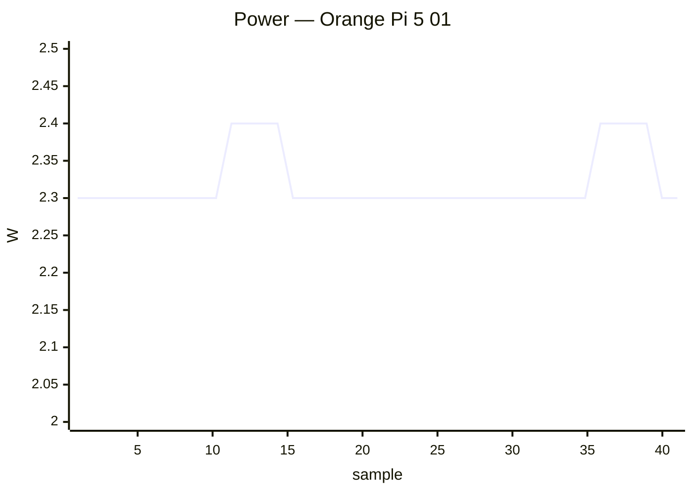
```mermaid
xychart-beta
    title "Power — Orange Pi 5 01"
    x-axis "sample" 1 --> 41
    y-axis "W" 2.0 --> 2.5
    line [2.30, 2.30, 2.30, 2.30, 2.30, 2.30, 2.30, 2.30, 2.30, 2.30, 2.40, 2.40, 2.40, 2.40, 2.30, 2.30, 2.30, 2.30, 2.30, 2.30, 2.30, 2.30, 2.30, 2.30, 2.30, 2.30, 2.30, 2.30, 2.30, 2.30, 2.30, 2.30, 2.30, 2.30, 2.40, 2.40, 2.40, 2.40, 2.30, 2.30]
```

### ❌ Orange Pi PC + 01

`orangepipcplus` · **inplace** · image `26.11.0-trunk.72` · 0 ✅ · 1 ❌ · 0 ⏭️

| Module | Status | Time | Detail |
|:--|:--:|--:|:--|
| reachable | ❌ | 0.0 s | ip=10.0.50.38 · reachable=False · port=22 |

### ❌ OrangePi 3 LTS 01

`orangepi3-lts` · **inplace** · image `26.11.0-trunk.73` · 0 ✅ · 1 ❌ · 0 ⏭️

| Module | Status | Time | Detail |
|:--|:--:|--:|:--|
| reachable | ❌ | 0.0 s | ip=10.0.50.46 · reachable=False · port=22 |

**Power** — min 1.80 W · avg 1.83 W · peak 1.90 W · 46 samples

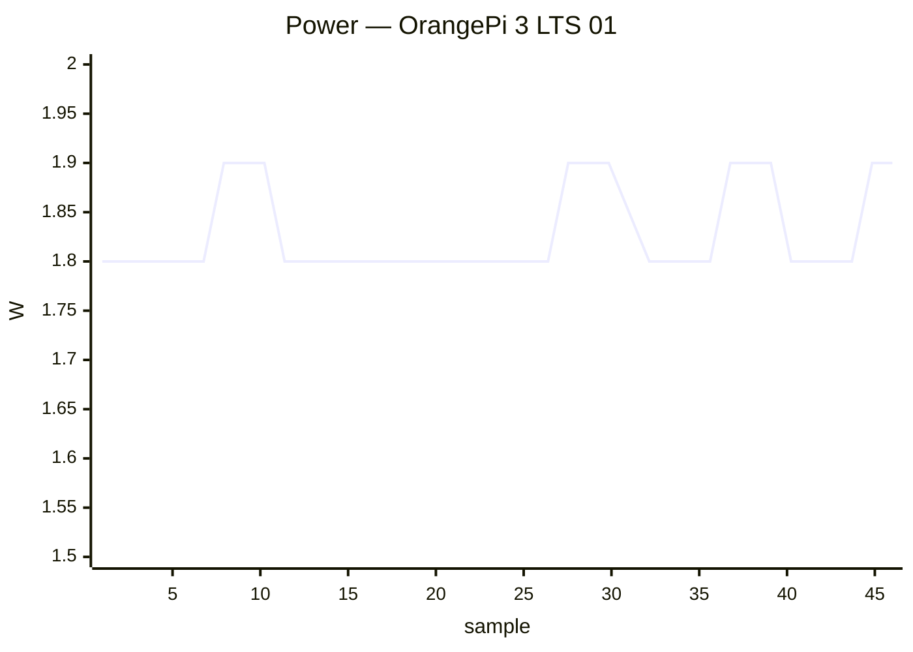
```mermaid
xychart-beta
    title "Power — OrangePi 3 LTS 01"
    x-axis "sample" 1 --> 46
    y-axis "W" 1.5 --> 2.0
    line [1.80, 1.80, 1.80, 1.80, 1.80, 1.80, 1.90, 1.90, 1.90, 1.80, 1.80, 1.80, 1.80, 1.80, 1.80, 1.80, 1.80, 1.80, 1.80, 1.80, 1.80, 1.80, 1.80, 1.90, 1.90, 1.90, 1.85, 1.80, 1.80, 1.80, 1.80, 1.90, 1.90, 1.90, 1.80, 1.80, 1.80, 1.80, 1.90, 1.90]
```

### ❌ Radxa Dragon Q6A 01

`radxa-dragon-q6a` · **inplace** · image `26.11.0-trunk.73` · 15 ✅ · 1 ❌ · 0 ⏭️

| Module | Status | Time | Detail |
|:--|:--:|--:|:--|
| upgrade | ❌ | 0.0 s | — |
| reboot | ✅ | 157.3 s | power-cycle · up 106 s |
| kernel-switch | ✅ | 17.2 s | branch=current · family=qcs6490 · installed=26.11.0-trunk.74 · boot_image=/boot/vmlinuz-6.18.2-current-qcs6490 · kernel_before=6.18.2-current-qcs6490 |
| reboot | ✅ | 263.5 s | power-cycle · 2/2 boots · up 105 s |
| hw-performance | ✅ | 13.7 s | AES 1499 · mem 18400 · disk W 234 / R 1140 MB/s · 48.4 °C · 1958 MHz |
| dvfs | ✅ | 14.8 s | ondemand · 300–1958 MHz (peak 2707) |
| network-iperf | ✅ | 36.2 s | enp1s0 ↑941/↓940 (1GE) Mbps |
| store-versions | ✅ | 3.9 s | 26.11.0-trunk.73 · 6.18.2-current-qcs6490 |
| kernel-switch | ✅ | 83.3 s | branch=edge · family=qcs6490 · installed=26.11.0-trunk.74 · boot_image=/boot/vmlinuz-7.2.3-edge-qcs6490 · kernel_before=6.18.2-current-qcs6490 |
| reboot | ✅ | 271.5 s | power-cycle · 2/2 boots · up 106 s |
| hw-performance | ✅ | 13.8 s | AES 1524 · mem 20000 · disk W 238 / R 1115 MB/s · 50 °C · 1958 MHz |
| dvfs | ✅ | 23.1 s | ondemand · 300–1958 MHz (peak 2707) |
| network-iperf | ✅ | 28.6 s | enp1s0 ↑941/↓941 (1GE) Mbps |
| store-versions | ✅ | 4.0 s | 26.11.0-trunk.73 · 7.2.3-edge-qcs6490 |
| kernel-switch | ✅ | 76.8 s | branch=current · family=qcs6490 · installed=26.11.0-trunk.74 · boot_image=/boot/vmlinuz-6.18.2-current-qcs6490 · kernel_before=7.2.3-edge-qcs6490 |
| reboot | ✅ | 157.5 s | power-cycle · up 106 s |

**Power** — min 1.10 W · avg 2.01 W · peak 8.20 W · 3152 samples

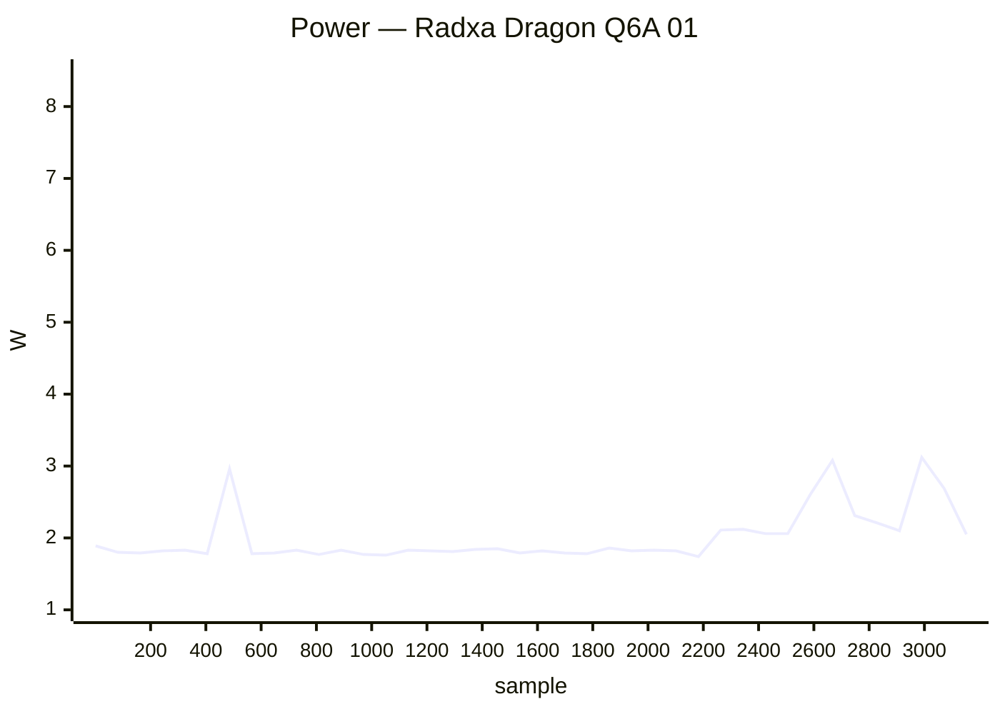
```mermaid
xychart-beta
    title "Power — Radxa Dragon Q6A 01"
    x-axis "sample" 1 --> 3152
    y-axis "W" 1.0 --> 8.5
    line [1.89, 1.80, 1.79, 1.82, 1.83, 1.78, 2.96, 1.78, 1.79, 1.83, 1.77, 1.83, 1.77, 1.76, 1.83, 1.82, 1.81, 1.84, 1.85, 1.79, 1.82, 1.79, 1.78, 1.86, 1.82, 1.83, 1.82, 1.74, 2.11, 2.12, 2.06, 2.06, 2.60, 3.08, 2.31, 2.21, 2.10, 3.12, 2.69, 2.05]
```

### ❌ ROCK 2F 01

`rock-2f` · **inplace** · image `26.8.1` · 0 ✅ · 1 ❌ · 0 ⏭️

| Module | Status | Time | Detail |
|:--|:--:|--:|:--|
| reachable | ❌ | 0.0 s | ip=10.0.20.164 · reachable=False · port=22 |

### ❌ Rock 5T 01

`rock-5t` · **inplace** · image `26.11.0-trunk.73` · 9 ✅ · 1 ❌ · 6 ⏭️

| Module | Status | Time | Detail |
|:--|:--:|--:|:--|
| upgrade | ✅ | 166.7 s | nightly · 26.11.0-trunk.73 → 26.11.0-trunk.74 |
| reboot | ✅ | 59.3 s | power-cycle · up 22 s |
| kernel-switch | ✅ | 22.1 s | branch=current · family=rockchip64 · installed=26.11.0-trunk.74 · boot_image=/boot/vmlinuz-6.18.55-current-rockchip64 · kernel_before=6.18.55-current-rockchip64 |
| reboot | ✅ | 82.3 s | power-cycle · 2/2 boots · up 23 s |
| hw-performance | ✅ | 18.3 s | AES 1219 · mem 10000 · disk W 47 / R 77 MB/s · 61.9 °C · 1800 MHz |
| dvfs | ✅ | 15.0 s | ondemand · 408–1800 MHz (peak 2400) |
| network-iperf | ✅ | 88.0 s | enP3p49s0 ↑2294/↓2196 (2.5GE) · enP4p65s0 ↑2352/↓2354 (2.5GE) · wlP2p33s0 ↑134/↓92 (Wi-Fi 6) Mbps |
| store-versions | ✅ | 4.3 s | 26.11.0-trunk.74 · 6.18.55-current-rockchip64 |
| kernel-switch | ✅ | 86.5 s | branch=edge · family=rockchip64 · installed=26.11.0-trunk.74 · boot_image=/boot/vmlinuz-7.2.9-edge-rockchip64 · kernel_before=6.18.55-current-rockchip64 |
| reboot | ❌ | 251.2 s | power-cycle · 1/2 boots · up 18 s |
| hw-perf | ⏭️ | 0.0 s | board down after reboot/power-cycle |
| dvfs | ⏭️ | 0.0 s | — |
| net-iperf | ⏭️ | 0.0 s | board down after reboot/power-cycle |
| store-versions | ⏭️ | 0.0 s | — |
| kernel-switch | ⏭️ | 0.0 s | skipped=board down after reboot/power-cycle |
| reboot | ⏭️ | 0.0 s | reboot |

**Power** — min 1.80 W · avg 6.89 W · peak 14.60 W · 499 samples

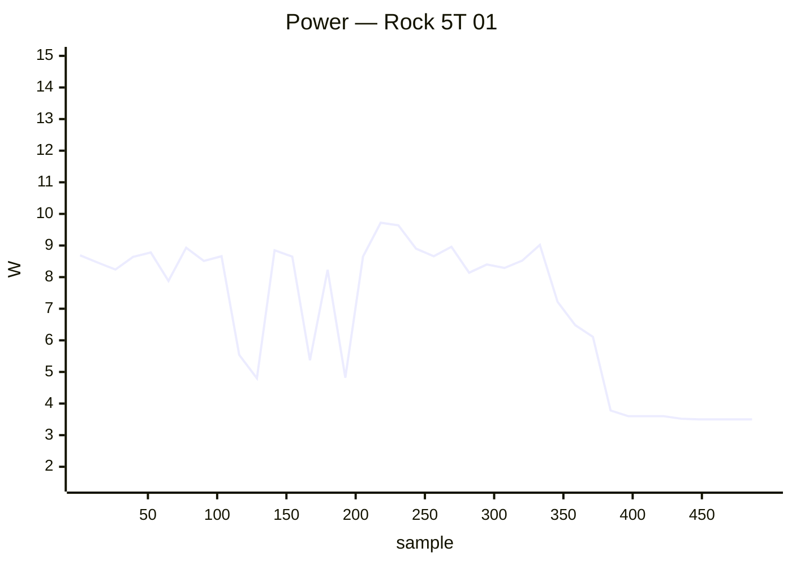
```mermaid
xychart-beta
    title "Power — Rock 5T 01"
    x-axis "sample" 1 --> 499
    y-axis "W" 1.5 --> 15.0
    line [8.69, 8.46, 8.24, 8.64, 8.78, 7.88, 8.93, 8.51, 8.66, 5.54, 4.80, 8.85, 8.65, 5.37, 8.23, 4.82, 8.65, 9.72, 9.64, 8.90, 8.66, 8.96, 8.14, 8.40, 8.29, 8.52, 9.02, 7.22, 6.48, 6.11, 3.78, 3.60, 3.60, 3.60, 3.52, 3.50, 3.50, 3.50, 3.50, 3.50]
```

### ❌ Rockpi S 01

`rockpi-s` · **inplace** · image `26.11.0-trunk.73` · 15 ✅ · 1 ❌ · 0 ⏭️

| Module | Status | Time | Detail |
|:--|:--:|--:|:--|
| upgrade | ✅ | 112.9 s | nightly · 26.11.0-trunk.73 → 26.11.0-trunk.73 |
| reboot | ✅ | 72.5 s | power-cycle · up 33 s |
| kernel-switch | ✅ | 72.7 s | branch=current · family=rockchip64 · installed=26.11.0-trunk.73 · boot_image=/boot/vmlinuz-6.18.55-current-rockchip64 · kernel_before=6.18.55-current-rockchip64 |
| reboot | ✅ | 109.5 s | power-cycle · 2/2 boots · up 31 s |
| hw-performance | ✅ | 41.2 s | AES 218 · mem 1300 · disk W 20 / R 22 MB/s · 49.5 °C · 1008 MHz |
| dvfs | ✅ | 35.8 s | ondemand · 408–1008 MHz (peak 1008) |
| network-iperf | ✅ | 120.2 s | end0 ↑94/↓94 (10/100ME) · wlan0 ↑3/↓9 (Wi-Fi 4) Mbps |
| store-versions | ✅ | 7.7 s | 26.11.0-trunk.73 · 6.18.55-current-rockchip64 |
| kernel-switch | ✅ | 262.6 s | branch=edge · family=rockchip64 · installed=26.11.0-trunk.73 · boot_image=/boot/vmlinuz-7.2.9-edge-rockchip64 · kernel_before=6.18.55-current-rockchip64 |
| reboot | ✅ | 108.8 s | power-cycle · 2/2 boots · up 30 s |
| hw-performance | ✅ | 41.3 s | AES 218 · mem 1300 · disk W 21 / R 22 MB/s · 51.7 °C · 1008 MHz |
| dvfs | ✅ | 36.2 s | ondemand · 408–1008 MHz (peak 1008) |
| network-iperf | ✅ | 75.5 s | end0 ↑94/↓94 (10/100ME) · wlan0 ↑1/↓5 (Wi-Fi 4) Mbps |
| store-versions | ✅ | 7.7 s | 26.11.0-trunk.73 · 7.2.9-edge-rockchip64 |
| kernel-switch | ✅ | 254.5 s | branch=current · family=rockchip64 · installed=26.11.0-trunk.73 · boot_image=/boot/vmlinuz-6.18.55-current-rockchip64 · kernel_before=7.2.9-edge-rockchip64 |
| reboot | ❌ | 223.5 s | power-cycle |

**Power** — min 1.00 W · avg 1.42 W · peak 2.30 W · 1274 samples

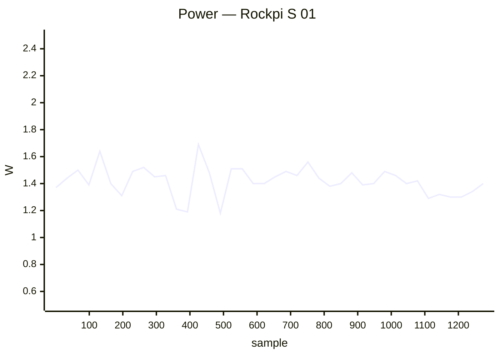
```mermaid
xychart-beta
    title "Power — Rockpi S 01"
    x-axis "sample" 1 --> 1274
    y-axis "W" 0.5 --> 2.5
    line [1.37, 1.44, 1.50, 1.39, 1.64, 1.40, 1.31, 1.49, 1.52, 1.45, 1.46, 1.21, 1.19, 1.69, 1.48, 1.18, 1.51, 1.51, 1.40, 1.40, 1.45, 1.49, 1.46, 1.56, 1.44, 1.38, 1.40, 1.48, 1.39, 1.40, 1.49, 1.46, 1.40, 1.42, 1.29, 1.32, 1.30, 1.30, 1.34, 1.40]
```

### ❌ SpacemiT MusePi Pro 01

`musepipro` · **inplace** · image `26.11.0-trunk.73` · 1 ✅ · 1 ❌ · 4 ⏭️

| Module | Status | Time | Detail |
|:--|:--:|--:|:--|
| upgrade | ✅ | 244.3 s | nightly · 26.11.0-trunk.73 → 26.11.0-trunk.74 |
| reboot | ❌ | 218.2 s | power-cycle |
| hw-perf | ⏭️ | 0.0 s | board down after reboot/power-cycle |
| dvfs | ⏭️ | 0.0 s | — |
| net-iperf | ⏭️ | 0.0 s | board down after reboot/power-cycle |
| store-versions | ⏭️ | 0.0 s | — |

**Power** — min 1.90 W · avg 3.34 W · peak 5.00 W · 368 samples

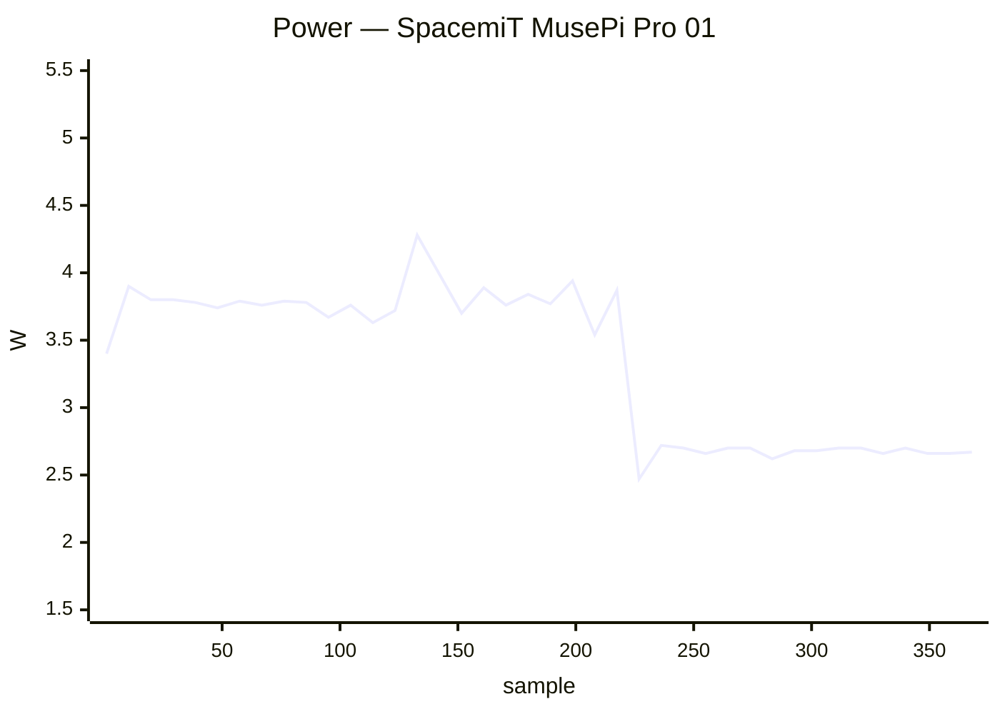
```mermaid
xychart-beta
    title "Power — SpacemiT MusePi Pro 01"
    x-axis "sample" 1 --> 368
    y-axis "W" 1.5 --> 5.5
    line [3.40, 3.90, 3.80, 3.80, 3.78, 3.74, 3.79, 3.76, 3.79, 3.78, 3.67, 3.76, 3.63, 3.72, 4.28, 3.99, 3.70, 3.89, 3.76, 3.84, 3.77, 3.94, 3.54, 3.87, 2.47, 2.72, 2.70, 2.66, 2.70, 2.70, 2.62, 2.68, 2.68, 2.70, 2.70, 2.66, 2.70, 2.66, 2.66, 2.67]
```

## ✅ Passed (56)

### ✅ Arduino UNO Q 01

`arduino-uno-q` · **inplace** · image `26.11.0-trunk.73` · 8 ✅ · 0 ❌ · 0 ⏭️

| Module | Status | Time | Detail |
|:--|:--:|--:|:--|
| upgrade | ✅ | 252.2 s | nightly · 26.11.0-trunk.73 → 26.11.0-trunk.74 |
| reboot | ✅ | 60.2 s | warm · up 41 s |
| kernel-switch | ✅ | 48.0 s | branch=edge · family=qrb2210 · installed=26.11.0-trunk.74 · boot_image=? · kernel_before=7.2.3-edge-qrb2210 |
| reboot | ✅ | 105.1 s | warm · 2/2 boots · up 36 s |
| hw-performance | ✅ | 25.5 s | AES 931 · mem 5100 · disk W 184 / R 258 MB/s · 44 °C · 2016 MHz |
| dvfs | ✅ | 32.0 s | schedutil · 300–2016 MHz (peak 2016) |
| network-iperf | ✅ | 45.9 s | wlan0 ↑15/↓22 (Wi-Fi 5) · usb0 ↑?/↓? Mbps |
| store-versions | ✅ | 7.3 s | 26.11.0-trunk.74 · 7.2.3-edge-qrb2210 |

### ✅ Banana Pi CM4IO 01

`bananapicm4io` · **inplace** · image `26.8.1` · 16 ✅ · 0 ❌ · 0 ⏭️

| Module | Status | Time | Detail |
|:--|:--:|--:|:--|
| upgrade | ✅ | 236.7 s | nightly · 26.8.3 → 26.11.0-trunk.74 |
| reboot | ✅ | 68.0 s | power-cycle · up 26 s |
| kernel-switch | ✅ | 28.5 s | branch=current · family=meson64 · installed=26.11.0-trunk.74 · boot_image=/boot/vmlinuz-6.18.55-current-meson64 · kernel_before=6.18.55-current-meson64 |
| reboot | ✅ | 84.2 s | power-cycle · 2/2 boots · up 26 s |
| hw-performance | ✅ | 32.2 s | AES 1365 · mem 6200 · disk W 8 / R 22 MB/s · 65.6 °C · 2016 MHz |
| dvfs | ✅ | 15.3 s | performance · 1000–2016 MHz (peak 2400) |
| network-iperf | ✅ | 87.4 s | end0 ↑937/↓941 (1GE) · wlan0 ↑43/↓28 (Wi-Fi 5) Mbps |
| store-versions | ✅ | 4.1 s | 26.11.0-trunk.74 · 6.18.55-current-meson64 |
| kernel-switch | ✅ | 125.4 s | branch=edge · family=meson64 · installed=26.11.0-trunk.74 · boot_image=/boot/vmlinuz-7.2.9-edge-meson64 · kernel_before=6.18.55-current-meson64 |
| reboot | ✅ | 83.7 s | power-cycle · 2/2 boots · up 26 s |
| hw-performance | ✅ | 33.6 s | AES 1365 · mem 6200 · disk W 8 / R 22 MB/s · 67.5 °C · 2016 MHz |
| dvfs | ✅ | 15.3 s | performance · 1000–2016 MHz (peak 2400) |
| network-iperf | ✅ | 52.4 s | end0 ↑938/↓941 (1GE) · wlan0 ↑41/↓37 (Wi-Fi 5) Mbps |
| store-versions | ✅ | 4.3 s | 26.11.0-trunk.74 · 7.2.9-edge-meson64 |
| kernel-switch | ✅ | 122.7 s | branch=current · family=meson64 · installed=26.11.0-trunk.74 · boot_image=/boot/vmlinuz-6.18.55-current-meson64 · kernel_before=7.2.9-edge-meson64 |
| reboot | ✅ | 62.7 s | power-cycle · up 28 s |

**Power** — min 2.00 W · avg 4.92 W · peak 11.20 W · 830 samples

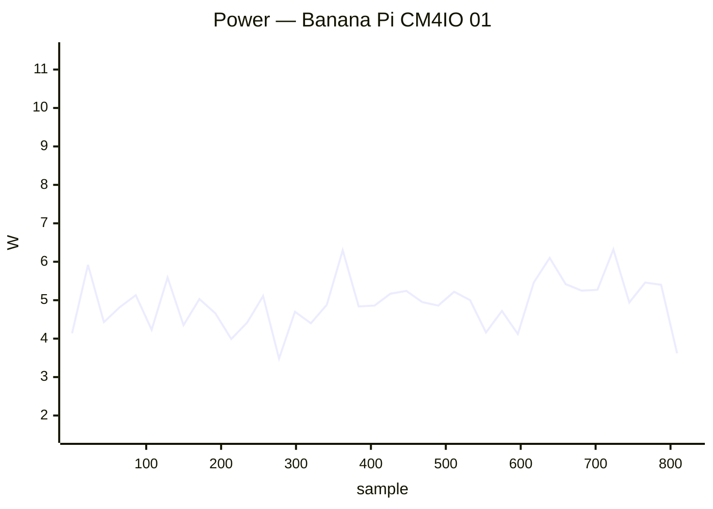
```mermaid
xychart-beta
    title "Power — Banana Pi CM4IO 01"
    x-axis "sample" 1 --> 830
    y-axis "W" 1.5 --> 11.5
    line [4.14, 5.92, 4.43, 4.82, 5.13, 4.23, 5.59, 4.35, 5.03, 4.66, 3.99, 4.42, 5.11, 3.48, 4.70, 4.40, 4.88, 6.30, 4.84, 4.86, 5.17, 5.24, 4.95, 4.86, 5.22, 5.00, 4.16, 4.72, 4.12, 5.46, 6.10, 5.42, 5.25, 5.27, 6.32, 4.94, 5.46, 5.40, 3.62, 4.68]
```

### ✅ Banana Pi M2 Ultra 01

`bananapim2ultra` · **inplace** · image `26.11.0-trunk.73` · 16 ✅ · 0 ❌ · 0 ⏭️

| Module | Status | Time | Detail |
|:--|:--:|--:|:--|
| upgrade | ✅ | 393.4 s | nightly · 26.11.0-trunk.73 → 26.11.0-trunk.74 |
| reboot | ✅ | 44.7 s | warm · up 26 s |
| kernel-switch | ✅ | 69.5 s | branch=current · family=sunxi · installed=26.11.0-trunk.74 · boot_image=/boot/vmlinuz-6.18.55-current-sunxi · kernel_before=6.18.55-current-sunxi |
| reboot | ✅ | 83.3 s | warm · 2/2 boots · up 25 s |
| hw-performance | ✅ | 37.3 s | AES 23 · mem 2100 · disk W 14 / R 42 MB/s · 55.4 °C · 1200 MHz |
| dvfs | ✅ | 33.8 s | ondemand · 720–1200 MHz (peak 1200) |
| network-iperf | ✅ | 511.7 s | end0 ↑807/↓941 (1GE) · wlan0 ↑24/↓22 (Wi-Fi 4) Mbps |
| store-versions | ✅ | 7.3 s | 26.11.0-trunk.74 · 6.18.55-current-sunxi |
| kernel-switch | ✅ | 194.8 s | branch=edge · family=sunxi · installed=26.11.0-trunk.74 · boot_image=/boot/vmlinuz-7.2.9-edge-sunxi · kernel_before=6.18.55-current-sunxi |
| reboot | ✅ | 83.3 s | warm · 2/2 boots · up 26 s |
| hw-performance | ✅ | 41.8 s | AES 23 · mem 2100 · disk W 7 / R 43 MB/s · 55.7 °C · 1200 MHz |
| dvfs | ✅ | 36.5 s | ondemand · 720–1200 MHz (peak 1200) |
| network-iperf | ✅ | 71.7 s | end0 ↑817/↓941 (1GE) · wlan0 ↑24/↓38 (Wi-Fi 4) Mbps |
| store-versions | ✅ | 7.3 s | 26.11.0-trunk.74 · 7.2.9-edge-sunxi |
| kernel-switch | ✅ | 191.4 s | branch=current · family=sunxi · installed=26.11.0-trunk.74 · boot_image=/boot/vmlinuz-6.18.55-current-sunxi · kernel_before=7.2.9-edge-sunxi |
| reboot | ✅ | 44.8 s | warm · up 24 s |

### ✅ Banana Pi M2Pro 01

`bananapim2pro` · **inplace** · image `26.11.0-trunk.73` · 16 ✅ · 0 ❌ · 0 ⏭️

| Module | Status | Time | Detail |
|:--|:--:|--:|:--|
| upgrade | ✅ | 180.7 s | nightly · 26.11.0-trunk.73 → 26.11.0-trunk.74 |
| reboot | ✅ | 142.0 s | power-cycle · up 104 s |
| kernel-switch | ✅ | 31.7 s | branch=current · family=meson64 · installed=26.11.0-trunk.74 · boot_image=/boot/vmlinuz-6.18.55-current-meson64 · kernel_before=6.18.55-current-meson64 |
| reboot | ✅ | 244.5 s | power-cycle · 2/2 boots · up 101 s |
| hw-performance | ✅ | 19.2 s | AES 979 · mem 5300 · disk W 42 / R 157 MB/s · 53.5 °C · 2100 MHz |
| dvfs | ✅ | 19.1 s | ondemand · 1000–2100 MHz (peak 2100) |
| network-iperf | ✅ | 92.2 s | end0 ↑940/↓941 (1GE) Mbps |
| store-versions | ✅ | 4.3 s | 26.11.0-trunk.74 · 6.18.55-current-meson64 |
| kernel-switch | ✅ | 99.9 s | branch=edge · family=meson64 · installed=26.11.0-trunk.74 · boot_image=/boot/vmlinuz-7.2.9-edge-meson64 · kernel_before=6.18.55-current-meson64 |
| reboot | ✅ | 251.0 s | power-cycle · 2/2 boots · up 102 s |
| hw-performance | ✅ | 19.6 s | AES 978 · mem 5300 · disk W 39 / R 158 MB/s · 53.6 °C · 2100 MHz |
| dvfs | ✅ | 19.8 s | ondemand · 1000–2100 MHz (peak 2100) |
| network-iperf | ✅ | 64.5 s | end0 ↑940/↓941 (1GE) Mbps |
| store-versions | ✅ | 4.4 s | 26.11.0-trunk.74 · 7.2.9-edge-meson64 |
| kernel-switch | ✅ | 98.3 s | branch=current · family=meson64 · installed=26.11.0-trunk.74 · boot_image=/boot/vmlinuz-6.18.55-current-meson64 · kernel_before=7.2.9-edge-meson64 |
| reboot | ✅ | 139.3 s | power-cycle · up 102 s |

**Power** — min 1.50 W · avg 2.91 W · peak 4.90 W · 1138 samples

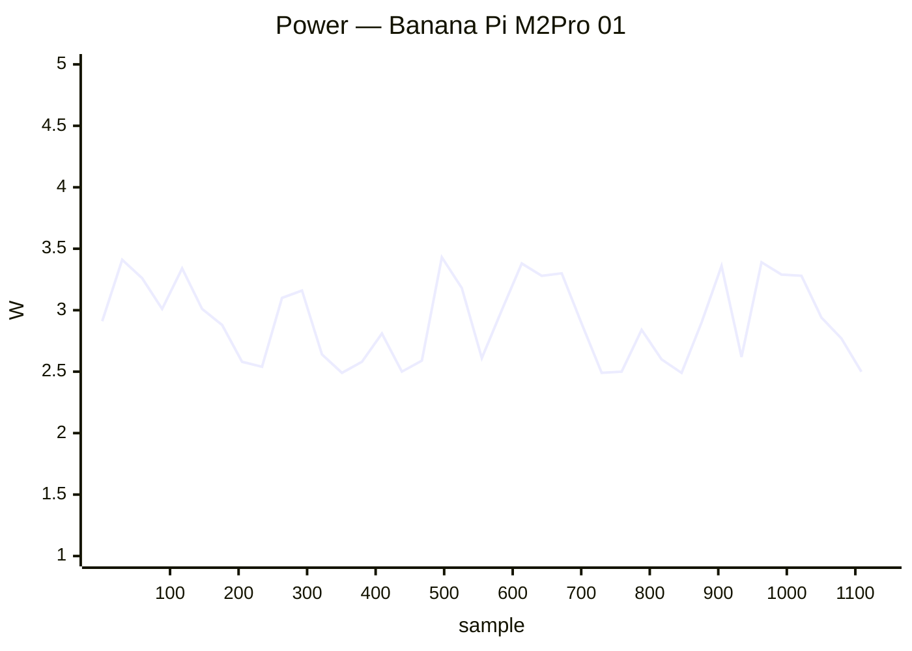
```mermaid
xychart-beta
    title "Power — Banana Pi M2Pro 01"
    x-axis "sample" 1 --> 1138
    y-axis "W" 1.0 --> 5.0
    line [2.91, 3.41, 3.26, 3.01, 3.34, 3.01, 2.88, 2.58, 2.54, 3.10, 3.16, 2.64, 2.49, 2.58, 2.81, 2.50, 2.59, 3.43, 3.18, 2.61, 3.00, 3.38, 3.28, 3.30, 2.89, 2.49, 2.50, 2.84, 2.60, 2.49, 2.90, 3.36, 2.62, 3.39, 3.29, 3.28, 2.94, 2.77, 2.50, 2.49]
```

### ✅ Banana Pi M5 01

`bananapim5` · **inplace** · image `26.11.0-trunk.73` · 16 ✅ · 0 ❌ · 0 ⏭️

| Module | Status | Time | Detail |
|:--|:--:|--:|:--|
| upgrade | ✅ | 345.9 s | nightly · 26.11.0-trunk.73 → 26.11.0-trunk.74 |
| reboot | ✅ | 172.3 s | warm · up 156 s |
| kernel-switch | ✅ | 50.9 s | branch=current · family=meson64 · installed=26.11.0-trunk.74 · boot_image=/boot/vmlinuz-6.18.55-current-meson64 · kernel_before=6.18.55-current-meson64 |
| reboot | ✅ | 323.0 s | warm · 2/2 boots · up 148 s |
| hw-performance | ✅ | 38.7 s | AES 980 · mem 5300 · disk W 10 / R 15 MB/s · 58.8 °C · 2100 MHz |
| dvfs | ✅ | 20.8 s | ondemand · 1000–2100 MHz (peak 2100) |
| network-iperf | ✅ | 216.5 s | end0 ↑940/↓941 (1GE) · wlx000f13960190 ↑1/↓6 (Wi-Fi 4) Mbps |
| store-versions | ✅ | 4.6 s | 26.11.0-trunk.74 · 6.18.55-current-meson64 |
| kernel-switch | ✅ | 178.3 s | branch=edge · family=meson64 · installed=26.11.0-trunk.74 · boot_image=/boot/vmlinuz-7.2.9-edge-meson64 · kernel_before=6.18.55-current-meson64 |
| reboot | ✅ | 353.5 s | warm · 2/2 boots · up 179 s |
| hw-performance | ✅ | 38.0 s | AES 980 · mem 5200 · disk W 11 / R 15 MB/s · 58.9 °C · 2100 MHz |
| dvfs | ✅ | 21.0 s | ondemand · 1000–2100 MHz (peak 2100) |
| network-iperf | ✅ | 156.5 s | end0 ↑940/↓941 (1GE) · wlx000f13960190 ↑2/↓12 (Wi-Fi 4) Mbps |
| store-versions | ✅ | 4.7 s | 26.11.0-trunk.74 · 7.2.9-edge-meson64 |
| kernel-switch | ✅ | 175.9 s | branch=current · family=meson64 · installed=26.11.0-trunk.74 · boot_image=/boot/vmlinuz-6.18.55-current-meson64 · kernel_before=7.2.9-edge-meson64 |
| reboot | ✅ | 163.7 s | warm · up 147 s |

### ✅ Banana Pi M7 01

`bananapim7` · **inplace** · image `26.11.0-trunk.73` · 22 ✅ · 0 ❌ · 0 ⏭️

| Module | Status | Time | Detail |
|:--|:--:|--:|:--|
| upgrade | ✅ | 89.0 s | nightly · 26.11.0-trunk.73 → 26.11.0-trunk.74 |
| reboot | ✅ | 44.0 s | power-cycle · up 15 s |
| kernel-switch | ✅ | 18.6 s | branch=vendor · family=rk35xx · installed=26.11.0-trunk.74 · boot_image=/boot/vmlinuz-6.1.172-vendor-rk35xx · kernel_before=6.1.172-vendor-rk35xx |
| reboot | ✅ | 64.5 s | power-cycle · 2/2 boots · up 16 s |
| hw-performance | ✅ | 13.3 s | AES 1250 · mem 9600 · disk W 1070 / R 1335 MB/s · 70.2 °C · 1800 MHz |
| dvfs | ✅ | 17.2 s | ondemand · 1800–1800 MHz (peak 2256) |
| network-iperf | ✅ | 51.3 s | enP2p33s0 ↑2349/↓2308 (2.5GE) · enP4p65s0 ↑2353/↓2323 (2.5GE) Mbps |
| store-versions | ✅ | 3.8 s | 26.11.0-trunk.74 · 6.1.172-vendor-rk35xx |
| kernel-switch | ✅ | 52.4 s | branch=current · family=rockchip64 · installed=26.11.0-trunk.74 · boot_image=/boot/vmlinuz-6.18.55-current-rockchip64 · kernel_before=6.1.172-vendor-rk35xx |
| reboot | ✅ | 231.3 s | power-cycle · 2/2 boots · up 99 s |
| hw-performance | ✅ | 13.4 s | AES 1244 · mem 9900 · disk W 892 / R 1564 MB/s · 73 °C · 1800 MHz |
| dvfs | ✅ | 14.6 s | ondemand · 408–1800 MHz (peak 2400) |
| network-iperf | ✅ | 62.9 s | enP2p33s0 ↑2353/↓2354 (2.5GE) · enP4p65s0 ↑2349/↓2294 (2.5GE) Mbps |
| store-versions | ✅ | 4.0 s | 26.11.0-trunk.74 · 6.18.55-current-rockchip64 |
| kernel-switch | ✅ | 44.4 s | branch=edge · family=rockchip64 · installed=26.11.0-trunk.74 · boot_image=/boot/vmlinuz-7.2.9-edge-rockchip64 · kernel_before=6.18.55-current-rockchip64 |
| reboot | ✅ | 240.2 s | power-cycle · 2/2 boots · up 99 s |
| hw-performance | ✅ | 13.8 s | AES 1243 · mem 7900 · disk W 887 / R 1601 MB/s · 74.8 °C · 1800 MHz |
| dvfs | ✅ | 14.8 s | ondemand · 408–1800 MHz (peak 2400) |
| network-iperf | ✅ | 83.6 s | enP2p33s0 ↑2351/↓2354 (2.5GE) · enP4p65s0 ↑2351/↓2269 (2.5GE) Mbps |
| store-versions | ✅ | 3.9 s | 26.11.0-trunk.74 · 7.2.9-edge-rockchip64 |
| kernel-switch | ✅ | 50.2 s | branch=vendor · family=rk35xx · installed=26.11.0-trunk.74 · boot_image=/boot/vmlinuz-6.1.172-vendor-rk35xx · kernel_before=7.2.9-edge-rockchip64 |
| reboot | ✅ | 43.7 s | power-cycle · up 14 s |

**Power** — min 0.70 W · avg 7.32 W · peak 15.10 W · 779 samples

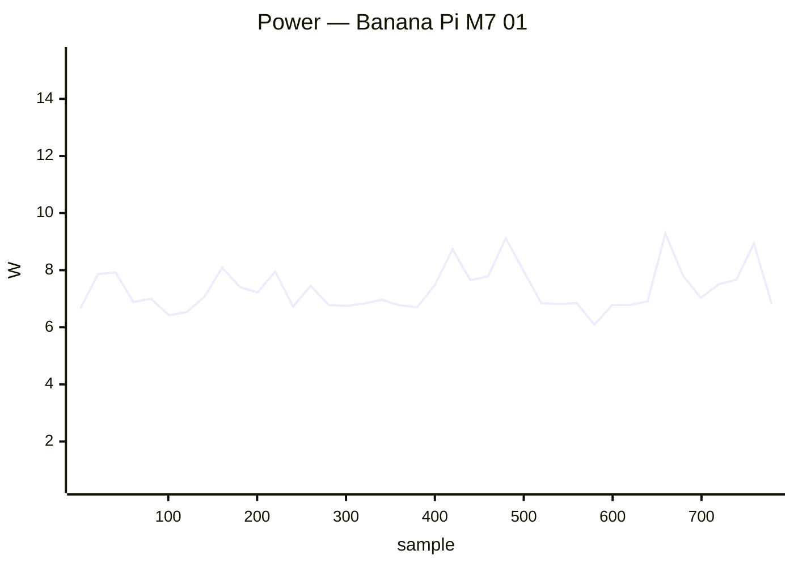
```mermaid
xychart-beta
    title "Power — Banana Pi M7 01"
    x-axis "sample" 1 --> 779
    y-axis "W" 0.5 --> 15.5
    line [6.65, 7.86, 7.92, 6.88, 7.00, 6.42, 6.53, 7.06, 8.09, 7.41, 7.22, 7.95, 6.73, 7.45, 6.78, 6.75, 6.83, 6.96, 6.77, 6.70, 7.48, 8.73, 7.65, 7.78, 9.12, 7.98, 6.85, 6.81, 6.85, 6.09, 6.78, 6.78, 6.91, 9.28, 7.81, 7.03, 7.50, 7.66, 8.93, 6.81]
```

### ✅ Banana Pi R2 01

`bananapir2` · **inplace** · image `26.11.0-trunk.73` · 16 ✅ · 0 ❌ · 0 ⏭️

| Module | Status | Time | Detail |
|:--|:--:|--:|:--|
| upgrade | ✅ | 256.3 s | nightly · 26.11.0-trunk.73 → 26.11.0-trunk.74 |
| reboot | ✅ | 78.1 s | power-cycle · up 38 s |
| kernel-switch | ✅ | 60.6 s | branch=current · family=mt7623 · installed=26.11.0-trunk.74 · boot_image=/boot/vmlinuz-6.18.55-current-mt7623 · kernel_before=6.18.55-current-mt7623 |
| reboot | ✅ | 115.4 s | power-cycle · 2/2 boots · up 38 s |
| hw-performance | ✅ | 43.9 s | AES 25 · mem 1600 · disk W 20 / R 22 MB/s · 54.7 °C · 1300 MHz |
| dvfs | ✅ | 40.4 s | ondemand · 98–1300 MHz (peak 1300) |
| network-iperf | ✅ | 96.9 s | lan2 ↑938/↓921 Mbps |
| store-versions | ✅ | 8.7 s | 26.11.0-trunk.74 · 6.18.55-current-mt7623 |
| kernel-switch | ✅ | 140.5 s | branch=edge · family=mt7623 · installed=26.11.0-trunk.74 · boot_image=/boot/vmlinuz-7.2.9-edge-mt7623 · kernel_before=6.18.55-current-mt7623 |
| reboot | ✅ | 114.8 s | power-cycle · 2/2 boots · up 36 s |
| hw-performance | ✅ | 44.4 s | AES 25 · mem 1600 · disk W 20 / R 22 MB/s · 54.8 °C · 1300 MHz |
| dvfs | ✅ | 43.7 s | ondemand · 98–1300 MHz (peak 1300) |
| network-iperf | ✅ | 52.7 s | lan2 ↑912/↓921 Mbps |
| store-versions | ✅ | 8.9 s | 26.11.0-trunk.74 · 7.2.9-edge-mt7623 |
| kernel-switch | ✅ | 140.0 s | branch=current · family=mt7623 · installed=26.11.0-trunk.74 · boot_image=/boot/vmlinuz-6.18.55-current-mt7623 · kernel_before=7.2.9-edge-mt7623 |
| reboot | ✅ | 76.1 s | power-cycle · up 36 s |

**Power** — min 2.00 W · avg 5.24 W · peak 6.70 W · 1053 samples

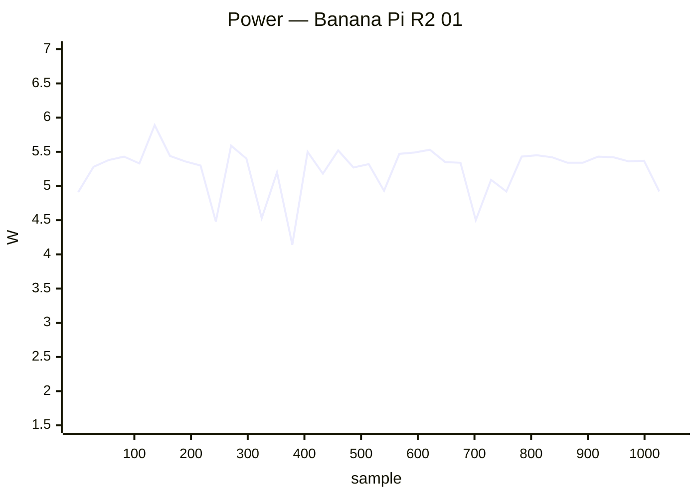
```mermaid
xychart-beta
    title "Power — Banana Pi R2 01"
    x-axis "sample" 1 --> 1053
    y-axis "W" 1.5 --> 7.0
    line [4.91, 5.28, 5.38, 5.43, 5.33, 5.89, 5.44, 5.36, 5.30, 4.48, 5.59, 5.40, 4.53, 5.20, 4.14, 5.50, 5.18, 5.52, 5.27, 5.32, 4.93, 5.47, 5.49, 5.53, 5.35, 5.34, 4.50, 5.09, 4.92, 5.43, 5.45, 5.42, 5.34, 5.34, 5.43, 5.42, 5.36, 5.37, 4.92, 5.14]
```

### ✅ Banana Pi R3 Mini 01

`bananapir3mini` · **inplace** · image `26.11.0-trunk` · 4 ✅ · 0 ❌ · 2 ⏭️

| Module | Status | Time | Detail |
|:--|:--:|--:|:--|
| upgrade | ⏭️ | 22.1 s | — |
| reboot | ✅ | 60.2 s | power-cycle · up 25 s |
| hw-performance | ✅ | 19.3 s | AES 934 · mem 3200 · disk W 77 / R 91 MB/s · 79.3 °C · None MHz |
| dvfs | ➖ | 2.1 s | no cpufreq |
| network-iperf | ✅ | 109.9 s | eth0 ↑2354/↓2356 (2.5GE) · eth1 ↑2352/↓2264 (2.5GE) · wlan0 ↑6/↓20 (Wi-Fi 6) · wlan1 ↑194/↓389 (Wi-Fi 6) Mbps |
| store-versions | ✅ | 4.6 s | 26.11.0-trunk · 6.18.52-current-filogic-mt7986 |

### ✅ BananaPi BPI-F3 01

`musepipro` · **inplace** · image `26.11.0-trunk.73` · 6 ✅ · 0 ❌ · 0 ⏭️

| Module | Status | Time | Detail |
|:--|:--:|--:|:--|
| upgrade | ✅ | 199.2 s | nightly · 26.11.0-trunk.73 → 26.11.0-trunk.74 |
| reboot | ✅ | 56.4 s | power-cycle · up 18 s |
| hw-performance | ✅ | 24.8 s | AES 27 · mem 3000 · disk W 70 / R 81 MB/s · 54 °C · 1600 MHz |
| dvfs | ✅ | 23.9 s | performance · 614–1600 MHz (peak 1600) |
| network-iperf | ✅ | 91.6 s | eth0 ↑941/↓940 (1GE) · wlan0 ↑315/↓311 (Wi-Fi 6) · wlan1 ↑271/↓251 (Wi-Fi 5) Mbps |
| store-versions | ✅ | 6.0 s | 26.11.0-trunk.74 · 6.18.55-current-spacemit |

**Power** — min 2.80 W · avg 5.26 W · peak 8.30 W · 323 samples

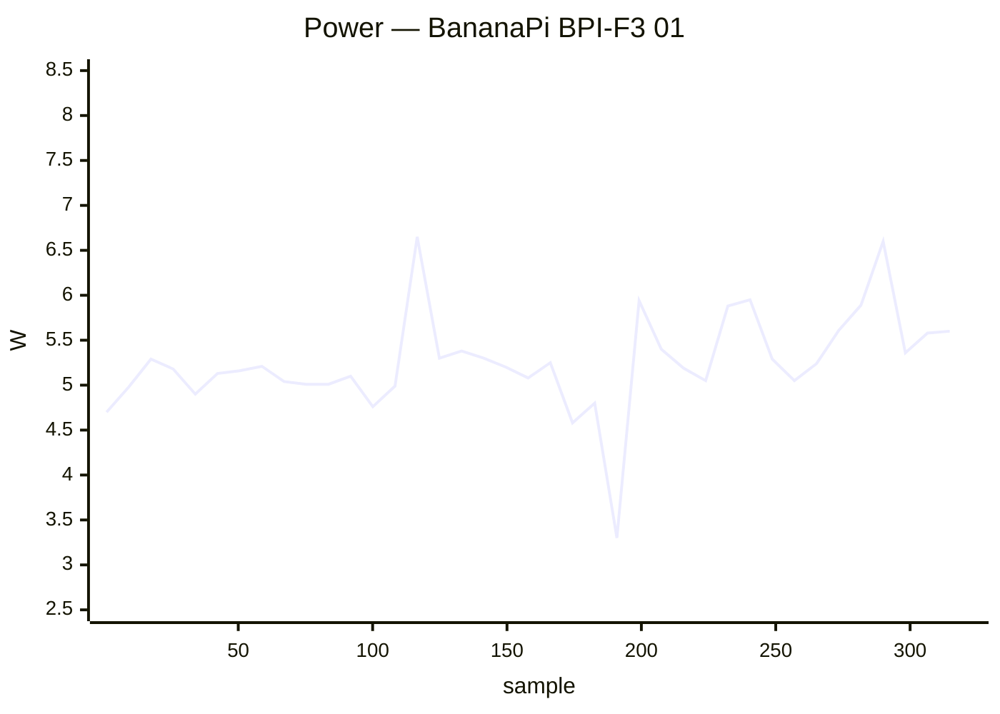
```mermaid
xychart-beta
    title "Power — BananaPi BPI-F3 01"
    x-axis "sample" 1 --> 323
    y-axis "W" 2.5 --> 8.5
    line [4.70, 4.98, 5.29, 5.18, 4.90, 5.13, 5.16, 5.21, 5.04, 5.01, 5.01, 5.10, 4.76, 4.99, 6.65, 5.30, 5.38, 5.30, 5.20, 5.08, 5.25, 4.58, 4.80, 3.30, 5.94, 5.40, 5.19, 5.05, 5.88, 5.95, 5.29, 5.05, 5.24, 5.61, 5.89, 6.60, 5.36, 5.58, 5.60, 5.40]
```

### ✅ BananaPi BPI-M4-Zero 01

`bananapim4zero` · **inplace** · image `26.11.0-trunk.73` · 8 ✅ · 0 ❌ · 0 ⏭️

| Module | Status | Time | Detail |
|:--|:--:|--:|:--|
| upgrade | ✅ | 319.0 s | nightly · 26.11.0-trunk.73 → 26.11.0-trunk.74 |
| reboot | ✅ | 76.8 s | power-cycle · up 26 s |
| kernel-switch | ✅ | 73.1 s | branch=current · family=sunxi64 · installed=26.11.0-trunk.74 · boot_image=/boot/vmlinuz-6.18.55-current-sunxi64 · kernel_before=6.18.55-current-sunxi64 |
| reboot | ✅ | 107.5 s | power-cycle · 2/2 boots · up 26 s |
| hw-performance | ✅ | 33.3 s | AES 660 · mem 3600 · disk W 13 / R 22 MB/s · 58.9 °C · 1416 MHz |
| dvfs | ✅ | 51.4 s | ondemand · 480–1416 MHz (peak 1416) |
| network-iperf | ✅ | 72.7 s | wlan0 ↑85/↓101 (Wi-Fi 5) Mbps |
| store-versions | ✅ | 5.2 s | 26.11.0-trunk.74 · 6.18.55-current-sunxi64 |

### ✅ Clearfog Pro 01

`clearfogpro` · **inplace** · image `26.11.0-trunk.73` · 14 ✅ · 0 ❌ · 2 ⏭️

| Module | Status | Time | Detail |
|:--|:--:|--:|:--|
| upgrade | ✅ | 206.0 s | nightly · 26.11.0-trunk.73 → 26.11.0-trunk.74 |
| reboot | ✅ | 44.1 s | warm · up 25 s |
| kernel-switch | ✅ | 44.3 s | branch=current · family=mvebu · installed=26.11.0-trunk.74 · boot_image=/boot/vmlinuz-6.18.55-current-mvebu · kernel_before=6.18.55-current-mvebu |
| reboot | ✅ | 76.6 s | warm · 2/2 boots · up 22 s |
| hw-performance | ✅ | 33.8 s | AES 43 · mem 3800 · disk W 21 / R 22 MB/s · 66.5 °C · None MHz |
| dvfs | ➖ | 2.9 s | no cpufreq |
| network-iperf | ✅ | 38.5 s | lan2 ↑935/↓936 Mbps |
| store-versions | ✅ | 6.0 s | 26.11.0-trunk.74 · 6.18.55-current-mvebu |
| kernel-switch | ✅ | 103.5 s | branch=edge · family=mvebu · installed=26.11.0-trunk.74 · boot_image=/boot/vmlinuz-7.2.9-edge-mvebu · kernel_before=6.18.55-current-mvebu |
| reboot | ✅ | 75.0 s | warm · 2/2 boots · up 22 s |
| hw-performance | ✅ | 33.9 s | AES 43 · mem 3800 · disk W 21 / R 23 MB/s · 67.5 °C · None MHz |
| dvfs | ➖ | 2.9 s | no cpufreq |
| network-iperf | ✅ | 37.6 s | lan2 ↑936/↓937 Mbps |
| store-versions | ✅ | 6.1 s | 26.11.0-trunk.74 · 7.2.9-edge-mvebu |
| kernel-switch | ✅ | 105.3 s | branch=current · family=mvebu · installed=26.11.0-trunk.74 · boot_image=/boot/vmlinuz-6.18.55-current-mvebu · kernel_before=7.2.9-edge-mvebu |
| reboot | ✅ | 41.2 s | warm · up 21 s |

### ✅ Cubie A5E 01

`radxa-cubie-a5e` · **inplace** · image `26.11.0-trunk.73` · 14 ✅ · 0 ❌ · 2 ⏭️

| Module | Status | Time | Detail |
|:--|:--:|--:|:--|
| upgrade | ✅ | 606.7 s | nightly · 26.11.0-trunk.73 → 26.11.0-trunk.74 |
| reboot | ✅ | 68.7 s | power-cycle · up 30 s |
| kernel-switch | ✅ | 56.2 s | branch=current · family=sunxi64 · installed=26.11.0-trunk.74 · boot_image=? · kernel_before=6.18.55-current-sunxi64 |
| reboot | ✅ | 103.5 s | power-cycle · 2/2 boots · up 31 s |
| hw-performance | ✅ | 34.9 s | AES 358 · mem 2000 · disk W 18 / R 22 MB/s · 68.7 °C · None MHz |
| dvfs | ➖ | 2.8 s | no cpufreq |
| network-iperf | ✅ | 132.0 s | end0 ↑831/↓941 (1GE) · end1 ↑940/↓940 (1GE) · wlan0 ↑120/↓128 (Wi-Fi 6) Mbps |
| store-versions | ✅ | 5.7 s | 26.11.0-trunk.74 · 6.18.55-current-sunxi64 |
| kernel-switch | ✅ | 562.2 s | branch=edge · family=sunxi64 · installed=26.11.0-trunk.74 · boot_image=? · kernel_before=6.18.55-current-sunxi64 |
| reboot | ✅ | 105.6 s | power-cycle · 2/2 boots · up 31 s |
| hw-performance | ✅ | 34.1 s | AES 358 · mem 2000 · disk W 21 / R 23 MB/s · 73.8 °C · None MHz |
| dvfs | ➖ | 2.8 s | no cpufreq |
| network-iperf | ✅ | 165.3 s | end0 ↑830/↓941 (1GE) · end1 ↑941/↓940 (1GE) · wlan0 ↑120/↓130 (Wi-Fi 6) Mbps |
| store-versions | ✅ | 5.8 s | 26.11.0-trunk.74 · 7.2.9-edge-sunxi64 |
| kernel-switch | ✅ | 563.2 s | branch=current · family=sunxi64 · installed=26.11.0-trunk.74 · boot_image=? · kernel_before=7.2.9-edge-sunxi64 |
| reboot | ✅ | 67.9 s | power-cycle · up 32 s |

**Power** — min 0.70 W · avg 4.19 W · peak 6.60 W · 2020 samples

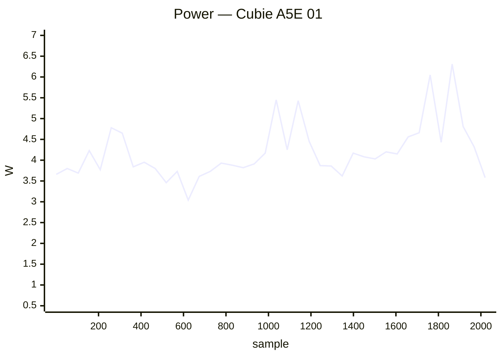
```mermaid
xychart-beta
    title "Power — Cubie A5E 01"
    x-axis "sample" 1 --> 2020
    y-axis "W" 0.5 --> 7.0
    line [3.66, 3.80, 3.69, 4.23, 3.77, 4.78, 4.65, 3.84, 3.95, 3.80, 3.46, 3.73, 3.04, 3.61, 3.73, 3.93, 3.88, 3.82, 3.91, 4.17, 5.45, 4.25, 5.43, 4.45, 3.87, 3.86, 3.62, 4.17, 4.08, 4.03, 4.20, 4.15, 4.56, 4.66, 6.05, 4.43, 6.31, 4.81, 4.32, 3.58]
```

### ✅ Cubietruck 01

`cubietruck` · **inplace** · image `26.11.0-trunk.73` · 16 ✅ · 0 ❌ · 0 ⏭️

| Module | Status | Time | Detail |
|:--|:--:|--:|:--|
| upgrade | ✅ | 414.9 s | nightly · 26.11.0-trunk.73 → 26.11.0-trunk.74 |
| reboot | ✅ | 72.3 s | warm · up 48 s |
| kernel-switch | ✅ | 92.2 s | branch=current · family=sunxi · installed=26.11.0-trunk.74 · boot_image=/boot/vmlinuz-6.18.55-current-sunxi · kernel_before=6.18.55-current-sunxi |
| reboot | ✅ | 134.5 s | warm · 2/2 boots · up 48 s |
| hw-performance | ✅ | 59.5 s | AES 19 · mem 1700 · disk W 16 / R 21 MB/s · 52.4 °C · 960 MHz |
| dvfs | ✅ | 57.3 s | ondemand · 528–960 MHz (peak 960) |
| network-iperf | ✅ | 150.4 s | end0 ↑699/↓881 (1GE) · wlan0 ↑19/↓19 (Wi-Fi 4) Mbps |
| store-versions | ✅ | 11.9 s | 26.11.0-trunk.74 · 6.18.55-current-sunxi |
| kernel-switch | ✅ | 229.3 s | branch=edge · family=sunxi · installed=26.11.0-trunk.74 · boot_image=/boot/vmlinuz-7.2.9-edge-sunxi · kernel_before=6.18.55-current-sunxi |
| reboot | ✅ | 133.7 s | warm · 2/2 boots · up 47 s |
| hw-performance | ✅ | 58.8 s | AES 18 · mem 1700 · disk W 14 / R 22 MB/s · 51.5 °C · 960 MHz |
| dvfs | ✅ | 57.3 s | ondemand · 528–960 MHz (peak 960) |
| network-iperf | ✅ | 108.9 s | end0 ↑743/↓921 (1GE) · wlan0 ↑15/↓24 (Wi-Fi 4) Mbps |
| store-versions | ✅ | 11.4 s | 26.11.0-trunk.74 · 7.2.9-edge-sunxi |
| kernel-switch | ✅ | 227.3 s | branch=current · family=sunxi · installed=26.11.0-trunk.74 · boot_image=/boot/vmlinuz-6.18.55-current-sunxi · kernel_before=7.2.9-edge-sunxi |
| reboot | ✅ | 71.1 s | warm · up 47 s |

### ✅ Cubox i2eX/i4 01

`cubox-i` · **inplace** · image `26.11.0-trunk.73` · 16 ✅ · 0 ❌ · 0 ⏭️

| Module | Status | Time | Detail |
|:--|:--:|--:|:--|
| upgrade | ✅ | 634.2 s | nightly · 26.11.0-trunk.73 → 26.11.0-trunk.74 |
| reboot | ✅ | 88.2 s | power-cycle · up 48 s |
| kernel-switch | ✅ | 71.8 s | branch=current · family=imx6 · installed=26.11.0-trunk.74 · boot_image=/boot/vmlinuz-6.18.55-current-imx6 · kernel_before=6.18.55-current-imx6 |
| reboot | ✅ | 162.1 s | power-cycle · 2/2 boots · up 47 s |
| hw-performance | ✅ | 47.5 s | AES 26 · mem 782 · disk W 19 / R 20 MB/s · 54.3 °C · 996 MHz |
| dvfs | ✅ | 40.3 s | ondemand · 396–996 MHz (peak 996) |
| network-iperf | ✅ | 304.6 s | end0 ↑94/↓94 (10/100ME) · wlan0 ↑18/↓16 (Wi-Fi 4) Mbps |
| store-versions | ✅ | 8.6 s | 26.11.0-trunk.74 · 6.18.55-current-imx6 |
| kernel-switch | ✅ | 298.0 s | branch=edge · family=imx6 · installed=26.11.0-trunk.74 · boot_image=/boot/vmlinuz-7.1.13-edge-imx6 · kernel_before=6.18.55-current-imx6 |
| reboot | ✅ | 144.4 s | power-cycle · 2/2 boots · up 46 s |
| hw-performance | ✅ | 47.2 s | AES 25 · mem 727 · disk W 19 / R 20 MB/s · 56 °C · 996 MHz |
| dvfs | ✅ | 44.1 s | ondemand · 396–996 MHz (peak 996) |
| network-iperf | ✅ | 159.8 s | end0 ↑94/↓94 (10/100ME) · wlan0 ↑17/↓17 (Wi-Fi 4) Mbps |
| store-versions | ✅ | 8.7 s | 26.11.0-trunk.74 · 7.1.13-edge-imx6 |
| kernel-switch | ✅ | 279.8 s | branch=current · family=imx6 · installed=26.11.0-trunk.74 · boot_image=/boot/vmlinuz-6.18.55-current-imx6 · kernel_before=7.1.13-edge-imx6 |
| reboot | ✅ | 87.0 s | power-cycle · up 46 s |

**Power** — min 1.80 W · avg 3.03 W · peak 6.10 W · 1937 samples

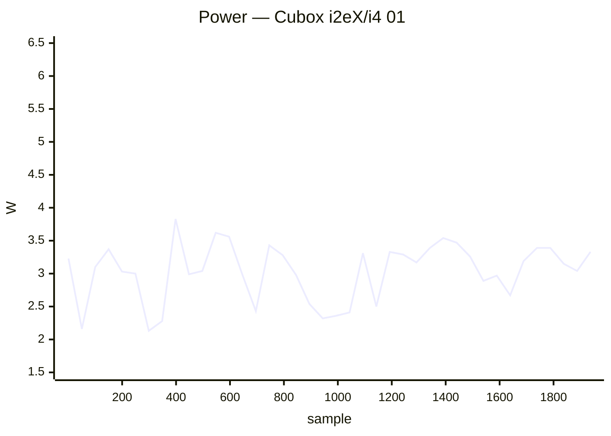
```mermaid
xychart-beta
    title "Power — Cubox i2eX/i4 01"
    x-axis "sample" 1 --> 1937
    y-axis "W" 1.5 --> 6.5
    line [3.23, 2.16, 3.10, 3.37, 3.03, 3.00, 2.13, 2.28, 3.83, 2.99, 3.04, 3.62, 3.56, 2.98, 2.43, 3.43, 3.28, 2.98, 2.54, 2.32, 2.36, 2.41, 3.31, 2.50, 3.33, 3.29, 3.17, 3.39, 3.54, 3.47, 3.26, 2.89, 2.97, 2.67, 3.19, 3.39, 3.39, 3.15, 3.04, 3.33]
```

### ✅ Espressobin 01

`espressobin` · **inplace** · image `26.11.0-trunk.73` · 16 ✅ · 0 ❌ · 0 ⏭️

| Module | Status | Time | Detail |
|:--|:--:|--:|:--|
| upgrade | ✅ | 684.2 s | nightly · 26.11.0-trunk.73 → 26.11.0-trunk.74 |
| reboot | ✅ | 78.3 s | power-cycle · up 43 s |
| kernel-switch | ✅ | 80.3 s | branch=current · family=mvebu64 · installed=26.11.0-trunk.74 · boot_image=/boot/vmlinuz-6.18.55-current-mvebu64 · kernel_before=6.18.55-current-mvebu64 |
| reboot | ✅ | 133.5 s | power-cycle · 2/2 boots · up 45 s |
| hw-performance | ✅ | 40.1 s | AES 371 · mem 2000 · disk W 22 / R 133 MB/s · None °C · 800 MHz |
| dvfs | ✅ | 34.8 s | ondemand · 200–800 MHz (peak 800) |
| network-iperf | ✅ | 152.1 s | lan0 ↑929/↓739 (1GE) Mbps |
| store-versions | ✅ | 7.3 s | 26.11.0-trunk.74 · 6.18.55-current-mvebu64 |
| kernel-switch | ✅ | 373.4 s | branch=edge · family=mvebu64 · installed=26.11.0-trunk.74 · boot_image=/boot/vmlinuz-7.1.13-edge-mvebu64 · kernel_before=6.18.55-current-mvebu64 |
| reboot | ✅ | 133.8 s | power-cycle · 2/2 boots · up 45 s |
| hw-performance | ✅ | 35.5 s | AES 371 · mem 2000 · disk W 16 / R 139 MB/s · None °C · 800 MHz |
| dvfs | ✅ | 35.4 s | ondemand · 200–800 MHz (peak 800) |
| network-iperf | ✅ | 195.1 s | lan0 ↑936/↓771 (1GE) Mbps |
| store-versions | ✅ | 7.4 s | 26.11.0-trunk.74 · 7.1.13-edge-mvebu64 |
| kernel-switch | ✅ | 367.9 s | branch=current · family=mvebu64 · installed=26.11.0-trunk.74 · boot_image=/boot/vmlinuz-6.18.55-current-mvebu64 · kernel_before=7.1.13-edge-mvebu64 |
| reboot | ✅ | 75.5 s | power-cycle · up 41 s |

### ✅ Helios4 01

`helios4` · **inplace** · image `26.11.0-trunk.73` · 14 ✅ · 0 ❌ · 2 ⏭️

| Module | Status | Time | Detail |
|:--|:--:|--:|:--|
| upgrade | ✅ | 200.0 s | nightly · 26.11.0-trunk.73 → 26.11.0-trunk.74 |
| reboot | ✅ | 120.1 s | warm · up 104 s |
| kernel-switch | ✅ | 35.1 s | branch=current · family=mvebu · installed=26.11.0-trunk.74 · boot_image=/boot/vmlinuz-6.18.55-current-mvebu · kernel_before=6.18.55-current-mvebu |
| reboot | ✅ | 234.6 s | warm · 2/2 boots · up 103 s |
| hw-performance | ✅ | 29.4 s | AES 43 · mem 3800 · disk W 21 / R 23 MB/s · 56.5 °C · None MHz |
| dvfs | ➖ | 2.4 s | no cpufreq |
| network-iperf | ✅ | 33.8 s | end1 ↑941/↓941 (1GE) Mbps |
| store-versions | ✅ | 4.9 s | 26.11.0-trunk.74 · 6.18.55-current-mvebu |
| kernel-switch | ✅ | 106.1 s | branch=edge · family=mvebu · installed=26.11.0-trunk.74 · boot_image=/boot/vmlinuz-7.2.9-edge-mvebu · kernel_before=6.18.55-current-mvebu |
| reboot | ✅ | 234.7 s | warm · 2/2 boots · up 104 s |
| hw-performance | ✅ | 30.0 s | AES 43 · mem 3800 · disk W 20 / R 23 MB/s · 57.5 °C · None MHz |
| dvfs | ➖ | 2.3 s | no cpufreq |
| network-iperf | ✅ | 126.6 s | end1 ↑940/↓941 (1GE) Mbps |
| store-versions | ✅ | 4.8 s | 26.11.0-trunk.74 · 7.2.9-edge-mvebu |
| kernel-switch | ✅ | 95.4 s | branch=current · family=mvebu · installed=26.11.0-trunk.74 · boot_image=/boot/vmlinuz-6.18.55-current-mvebu · kernel_before=7.2.9-edge-mvebu |
| reboot | ✅ | 121.1 s | warm · up 104 s |

### ✅ Inovato Quadra 01

`inovato-quadra` · **inplace** · image `26.11.0-trunk.73` · 16 ✅ · 0 ❌ · 0 ⏭️

| Module | Status | Time | Detail |
|:--|:--:|--:|:--|
| upgrade | ✅ | 233.7 s | nightly · 26.11.0-trunk.73 → 26.11.0-trunk.74 |
| reboot | ✅ | 67.7 s | power-cycle · up 24 s |
| kernel-switch | ✅ | 40.2 s | branch=current · family=sunxi64 · installed=26.11.0-trunk.74 · boot_image=/boot/vmlinuz-6.18.55-current-sunxi64 · kernel_before=6.18.55-current-sunxi64 |
| reboot | ✅ | 90.5 s | power-cycle · 2/2 boots · up 25 s |
| hw-performance | ✅ | 31.5 s | AES 794 · mem 2800 · disk W 16 / R 23 MB/s · 71.8 °C · 1704 MHz |
| dvfs | ✅ | 21.6 s | ondemand · 480–1704 MHz (peak 1704) |
| network-iperf | ✅ | 61.1 s | eth0 ↑94/↓94 (10/100ME) · wlan0 ↑8/↓17 (Wi-Fi 4) Mbps |
| store-versions | ✅ | 4.7 s | 26.11.0-trunk.74 · 6.18.55-current-sunxi64 |
| kernel-switch | ✅ | 117.6 s | branch=edge · family=sunxi64 · installed=26.11.0-trunk.74 · boot_image=/boot/vmlinuz-7.2.9-edge-sunxi64 · kernel_before=6.18.55-current-sunxi64 |
| reboot | ✅ | 92.0 s | power-cycle · 2/2 boots · up 24 s |
| hw-performance | ✅ | 31.6 s | AES 744 · mem 2800 · disk W 14 / R 23 MB/s · 71.4 °C · 1704 MHz |
| dvfs | ✅ | 21.8 s | ondemand · 480–1704 MHz (peak 1704) |
| network-iperf | ✅ | 66.1 s | eth0 ↑94/↓94 (10/100ME) · wlan0 ↑8/↓17 (Wi-Fi 4) Mbps |
| store-versions | ✅ | 5.0 s | 26.11.0-trunk.74 · 7.2.9-edge-sunxi64 |
| kernel-switch | ✅ | 115.3 s | branch=current · family=sunxi64 · installed=26.11.0-trunk.74 · boot_image=/boot/vmlinuz-6.18.55-current-sunxi64 · kernel_before=7.2.9-edge-sunxi64 |
| reboot | ✅ | 59.9 s | power-cycle · up 22 s |

**Power** — min 2.30 W · avg 4.13 W · peak 6.70 W · 847 samples

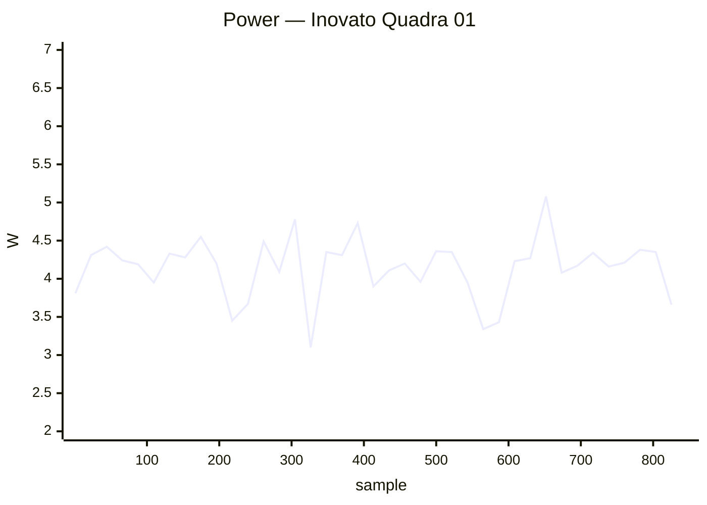
```mermaid
xychart-beta
    title "Power — Inovato Quadra 01"
    x-axis "sample" 1 --> 847
    y-axis "W" 2.0 --> 7.0
    line [3.81, 4.31, 4.42, 4.24, 4.19, 3.95, 4.33, 4.28, 4.55, 4.20, 3.45, 3.67, 4.49, 4.09, 4.78, 3.10, 4.35, 4.31, 4.73, 3.90, 4.11, 4.20, 3.96, 4.36, 4.35, 3.95, 3.34, 3.43, 4.23, 4.27, 5.08, 4.08, 4.17, 4.34, 4.16, 4.21, 4.38, 4.35, 3.66, 3.27]
```

### ✅ Khadas Edge2 01

`khadas-edge2` · **inplace** · image `26.11.0-trunk.73` · 14 ✅ · 0 ❌ · 2 ⏭️

| Module | Status | Time | Detail |
|:--|:--:|--:|:--|
| upgrade | ✅ | 187.6 s | nightly · 26.11.0-trunk.73 → 26.11.0-trunk.74 |
| reboot | ✅ | 28.7 s | warm · up 11 s |
| kernel-switch | ✅ | 22.7 s | branch=vendor · family=rk35xx · installed=26.11.0-trunk.74 · boot_image=/boot/vmlinuz-6.1.172-vendor-rk35xx · kernel_before=6.1.172-vendor-rk35xx |
| reboot | ✅ | 54.6 s | warm · 2/2 boots · up 15 s |
| hw-performance | ✅ | 16.3 s | AES 1276 · mem 15000 · disk W 105 / R 256 MB/s · 38.8 °C · 1800 MHz |
| dvfs | ✅ | 18.0 s | ondemand · 1800–1800 MHz (peak 2256) |
| network-iperf | ⏭️ | 6.6 s | no cabled interfaces |
| store-versions | ✅ | 4.0 s | 26.11.0-trunk.74 · 6.1.172-vendor-rk35xx |
| kernel-switch | ✅ | 72.0 s | branch=current · family=rockchip64 · installed=26.11.0-trunk.74 · boot_image=/boot/vmlinuz-6.18.55-current-rockchip64 · kernel_before=6.1.172-vendor-rk35xx |
| reboot | ✅ | 47.2 s | warm · 2/2 boots · up 9 s |
| hw-performance | ✅ | 15.3 s | AES 1273 · mem 10000 · disk W 104 / R 233 MB/s · 41.6 °C · 1800 MHz |
| dvfs | ✅ | 16.0 s | ondemand · 408–1800 MHz (peak 2400) |
| network-iperf | ⏭️ | 6.6 s | no cabled interfaces |
| store-versions | ✅ | 4.0 s | 26.11.0-trunk.74 · 6.18.55-current-rockchip64 |
| kernel-switch | ✅ | 57.0 s | branch=vendor · family=rk35xx · installed=26.11.0-trunk.74 · boot_image=/boot/vmlinuz-6.1.172-vendor-rk35xx · kernel_before=6.18.55-current-rockchip64 |
| reboot | ✅ | 28.3 s | warm · up 10 s |

### ✅ Khadas VIM1 01

`khadas-vim1` · **inplace** · image `26.11.0-trunk.73` · 16 ✅ · 0 ❌ · 0 ⏭️

| Module | Status | Time | Detail |
|:--|:--:|--:|:--|
| upgrade | ✅ | 329.6 s | nightly · 26.11.0-trunk.73 → 26.11.0-trunk.74 |
| reboot | ✅ | 82.2 s | power-cycle · up 40 s |
| kernel-switch | ✅ | 44.8 s | branch=current · family=meson64 · installed=26.11.0-trunk.74 · boot_image=/boot/vmlinuz-6.18.55-current-meson64 · kernel_before=6.18.55-current-meson64 |
| reboot | ✅ | 110.3 s | power-cycle · 2/2 boots · up 35 s |
| hw-performance | ✅ | 30.8 s | AES 658 · mem 3600 · disk W 18 / R 22 MB/s · 58 °C · 1512 MHz |
| dvfs | ✅ | 23.0 s | ondemand · 500–1512 MHz (peak 1512) |
| network-iperf | ✅ | 197.1 s | end0 ↑94/↓94 (10/100ME) · wlan0 ↑6/↓21 (Wi-Fi 5) Mbps |
| store-versions | ✅ | 4.8 s | 26.11.0-trunk.74 · 6.18.55-current-meson64 |
| kernel-switch | ✅ | 178.8 s | branch=edge · family=meson64 · installed=26.11.0-trunk.74 · boot_image=/boot/vmlinuz-7.2.9-edge-meson64 · kernel_before=6.18.55-current-meson64 |
| reboot | ✅ | 112.4 s | power-cycle · 2/2 boots · up 33 s |
| hw-performance | ✅ | 30.9 s | AES 658 · mem 3600 · disk W 19 / R 1 MB/s · 58 °C · 1512 MHz |
| dvfs | ✅ | 23.0 s | ondemand · 500–1512 MHz (peak 1512) |
| network-iperf | ✅ | 96.3 s | end0 ↑94/↓94 (10/100ME) · wlan0 ↑12/↓10 (Wi-Fi 5) Mbps |
| store-versions | ✅ | 5.0 s | 26.11.0-trunk.74 · 7.2.9-edge-meson64 |
| kernel-switch | ✅ | 182.8 s | branch=current · family=meson64 · installed=26.11.0-trunk.74 · boot_image=/boot/vmlinuz-6.18.55-current-meson64 · kernel_before=7.2.9-edge-meson64 |
| reboot | ✅ | 76.2 s | power-cycle · up 39 s |

**Power** — min 1.20 W · avg 2.18 W · peak 3.80 W · 1216 samples

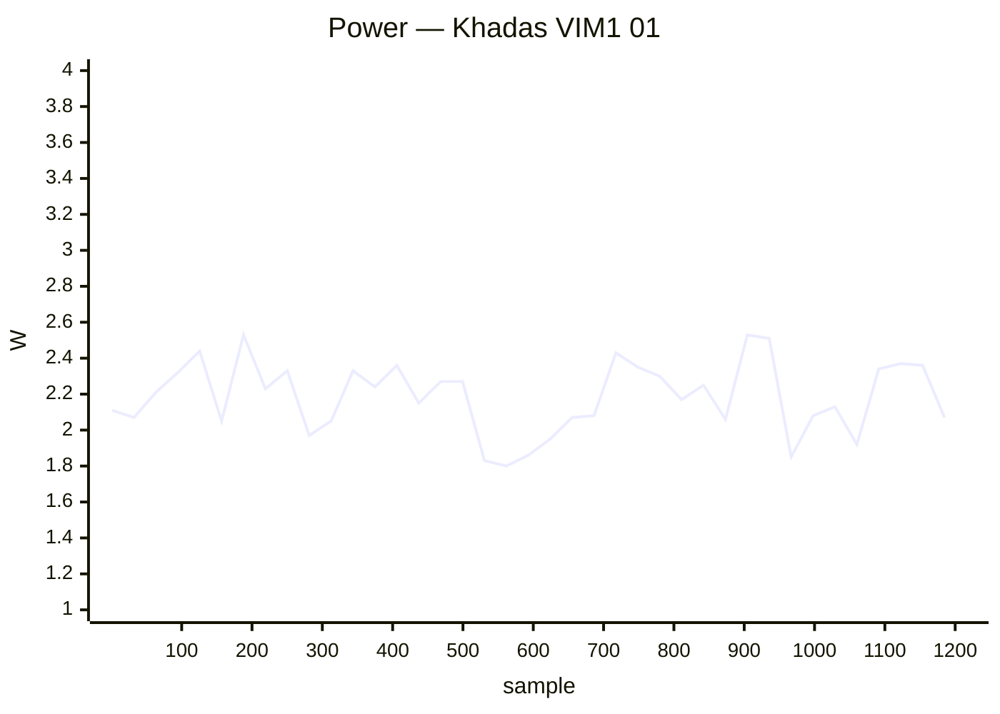
```mermaid
xychart-beta
    title "Power — Khadas VIM1 01"
    x-axis "sample" 1 --> 1216
    y-axis "W" 1.0 --> 4.0
    line [2.11, 2.07, 2.21, 2.32, 2.44, 2.05, 2.53, 2.23, 2.33, 1.97, 2.05, 2.33, 2.24, 2.36, 2.15, 2.27, 2.27, 1.83, 1.80, 1.86, 1.95, 2.07, 2.08, 2.43, 2.35, 2.30, 2.17, 2.25, 2.06, 2.53, 2.51, 1.85, 2.08, 2.13, 1.92, 2.34, 2.37, 2.36, 2.07, 2.05]
```

### ✅ Khadas VIM2 01

`khadas-vim2` · **inplace** · image `26.11.0-trunk.73` · 16 ✅ · 0 ❌ · 0 ⏭️

| Module | Status | Time | Detail |
|:--|:--:|--:|:--|
| upgrade | ✅ | 351.7 s | nightly · 26.11.0-trunk.73 → 26.11.0-trunk.74 |
| reboot | ✅ | 40.5 s | warm · up 24 s |
| kernel-switch | ✅ | 54.5 s | branch=current · family=meson64 · installed=26.11.0-trunk.74 · boot_image=/boot/vmlinuz-6.18.55-current-meson64 · kernel_before=6.18.55-current-meson64 |
| reboot | ✅ | 77.5 s | warm · 2/2 boots · up 25 s |
| hw-performance | ✅ | 25.1 s | AES 658 · mem 3600 · disk W 37 / R 143 MB/s · 64 °C · 1512 MHz |
| dvfs | ✅ | 24.6 s | ondemand · 500–1512 MHz (peak 1512) |
| network-iperf | ✅ | 185.4 s | eth0 ↑939/↓941 (1GE) · wlan0 ↑77/↓89 (Wi-Fi 5) Mbps |
| store-versions | ✅ | 6.1 s | 26.11.0-trunk.74 · 6.18.55-current-meson64 |
| kernel-switch | ✅ | 167.1 s | branch=edge · family=meson64 · installed=26.11.0-trunk.74 · boot_image=/boot/vmlinuz-7.2.9-edge-meson64 · kernel_before=6.18.55-current-meson64 |
| reboot | ✅ | 74.7 s | warm · 2/2 boots · up 25 s |
| hw-performance | ✅ | 24.6 s | AES 659 · mem 3500 · disk W 37 / R 150 MB/s · 64 °C · 1512 MHz |
| dvfs | ✅ | 25.6 s | ondemand · 500–1512 MHz (peak 1512) |
| network-iperf | ✅ | 223.3 s | eth0 ↑940/↓941 (1GE) · wlan0 ↑90/↓85 (Wi-Fi 5) Mbps |
| store-versions | ✅ | 6.0 s | 26.11.0-trunk.74 · 7.2.9-edge-meson64 |
| kernel-switch | ✅ | 165.4 s | branch=current · family=meson64 · installed=26.11.0-trunk.74 · boot_image=/boot/vmlinuz-6.18.55-current-meson64 · kernel_before=7.2.9-edge-meson64 |
| reboot | ✅ | 39.0 s | warm · up 20 s |

### ✅ Mekotronics R58HD 01

`mekotronics-r58hd` · **inplace** · image `26.11.0-trunk.73` · 5 ✅ · 1 ❌ · 0 ⏭️

| Module | Status | Time | Detail |
|:--|:--:|--:|:--|
| upgrade | ✅ | 225.6 s | nightly · 26.11.0-trunk.73 → 26.11.0-trunk.74 |
| reboot | ✅ | 47.4 s | power-cycle · up 14 s |
| hw-performance | ✅ | 13.8 s | AES 1302 · mem 16000 · disk W 250 / R 291 MB/s · 48.1 °C · 1800 MHz |
| dvfs | ✅ | 16.3 s | ondemand · 1800–1800 MHz (peak 2304) |
| network-iperf | ❌ | 1058.3 s | end0 ↑941/↓0 (1GE) · enP3p49s0 ↑941/↓941 (1GE) Mbps |
| store-versions | ✅ | 102.8 s | 26.11.0-trunk.74 |

**Power** — min 3.60 W · avg 5.05 W · peak 11.90 W · 1184 samples

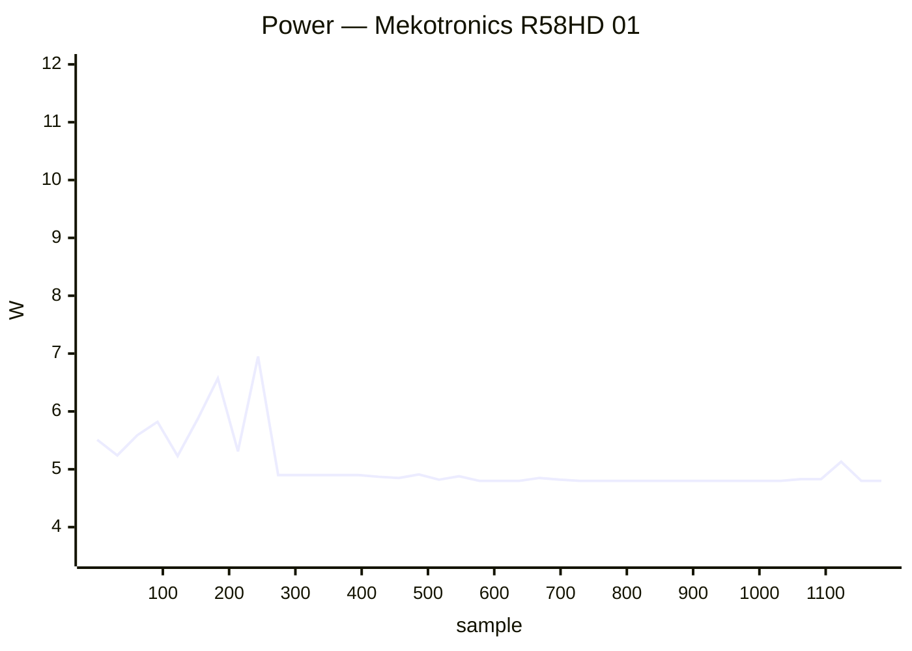
```mermaid
xychart-beta
    title "Power — Mekotronics R58HD 01"
    x-axis "sample" 1 --> 1184
    y-axis "W" 3.5 --> 12.0
    line [5.51, 5.24, 5.59, 5.82, 5.23, 5.87, 6.57, 5.31, 6.95, 4.90, 4.90, 4.90, 4.90, 4.90, 4.87, 4.85, 4.91, 4.82, 4.88, 4.80, 4.80, 4.80, 4.85, 4.82, 4.80, 4.80, 4.80, 4.80, 4.80, 4.80, 4.80, 4.80, 4.80, 4.80, 4.80, 4.83, 4.83, 5.13, 4.80, 4.80]
```

### ✅ Mekotronics R58S2 01

`mekotronics-r58s2` · **inplace** · image `26.11.0-trunk.72` · 5 ✅ · 0 ❌ · 1 ⏭️

| Module | Status | Time | Detail |
|:--|:--:|--:|:--|
| upgrade | ⏭️ | 23.9 s | — |
| reboot | ✅ | 52.0 s | power-cycle · up 15 s |
| hw-performance | ✅ | 14.3 s | AES 1280 · mem 15000 · disk W 226 / R 273 MB/s · 44.4 °C · 1800 MHz |
| dvfs | ✅ | 17.7 s | ondemand · 1800–1800 MHz (peak 2352) |
| network-iperf | ✅ | 59.1 s | end1 ↑941/↓941 (1GE) · wlan0 ↑62/↓99 (Wi-Fi 5) Mbps |
| store-versions | ✅ | 4.3 s | 26.11.0-trunk.72 · 6.1.172-vendor-rk35xx |

**Power** — min 0.60 W · avg 3.45 W · peak 10.50 W · 141 samples

```mermaid
xychart-beta
    title "Power — Mekotronics R58S2 01"
    x-axis "sample" 1 --> 141
    y-axis "W" 0.5 --> 11.0
    line [2.60, 2.60, 2.60, 3.90, 3.63, 3.10, 2.70, 2.62, 2.60, 2.60, 2.60, 3.25, 3.90, 0.60, 2.43, 2.58, 2.80, 3.77, 4.37, 4.90, 3.80, 3.67, 3.83, 4.50, 9.00, 7.93, 2.80, 3.80, 3.35, 3.17, 3.10, 3.40, 3.40, 3.17, 2.70, 3.40, 3.25, 3.10, 3.30, 3.50]
```

### ✅ NanoPi Fire3 01

`nanopifire3` · **inplace** · image `26.11.0-trunk.73` · 7 ✅ · 0 ❌ · 1 ⏭️

| Module | Status | Time | Detail |
|:--|:--:|--:|:--|
| upgrade | ✅ | 461.7 s | nightly · 26.11.0-trunk.73 → 26.11.0-trunk.74 |
| reboot | ✅ | 72.9 s | power-cycle · up 30 s |
| kernel-switch | ✅ | 69.5 s | branch=edge · family=s5p6818 · installed=26.11.0-trunk.74 · boot_image=/boot/vmlinuz-7.2.9-edge-s5p6818 · kernel_before=7.2.9-edge-s5p6818 |
| reboot | ✅ | 108.0 s | power-cycle · 2/2 boots · up 32 s |
| hw-performance | ✅ | 35.8 s | AES 368 · mem 2000 · disk W 20 / R 17 MB/s · 68 °C · None MHz |
| dvfs | ➖ | 3.0 s | no cpufreq |
| network-iperf | ✅ | 40.9 s | eth0 ↑94/↓94 (10/100ME) Mbps |
| store-versions | ✅ | 6.2 s | 26.11.0-trunk.74 · 7.2.9-edge-s5p6818 |

**Power** — min 1.80 W · avg 3.02 W · peak 3.90 W · 644 samples

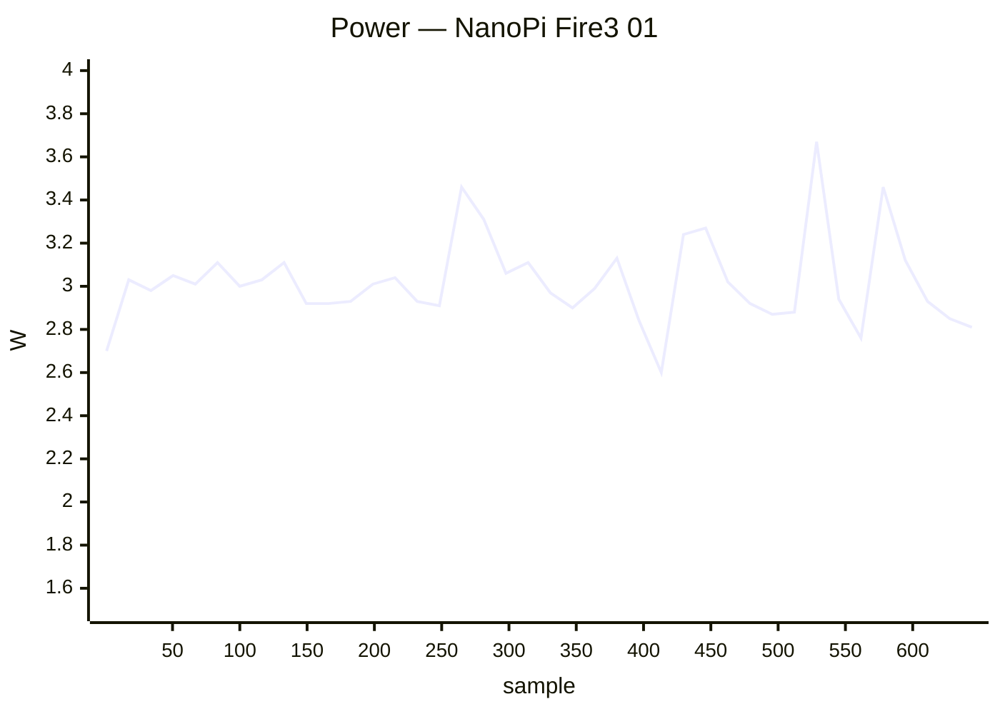
```mermaid
xychart-beta
    title "Power — NanoPi Fire3 01"
    x-axis "sample" 1 --> 644
    y-axis "W" 1.5 --> 4.0
    line [2.70, 3.03, 2.98, 3.05, 3.01, 3.11, 3.00, 3.03, 3.11, 2.92, 2.92, 2.93, 3.01, 3.04, 2.93, 2.91, 3.46, 3.31, 3.06, 3.11, 2.97, 2.90, 2.99, 3.13, 2.84, 2.60, 3.24, 3.27, 3.02, 2.92, 2.87, 2.88, 3.67, 2.94, 2.76, 3.46, 3.12, 2.93, 2.85, 2.81]
```

### ✅ NanoPi K2 01

`nanopik2-s905` · **inplace** · image `26.11.0-trunk.73` · 16 ✅ · 0 ❌ · 0 ⏭️

| Module | Status | Time | Detail |
|:--|:--:|--:|:--|
| upgrade | ✅ | 339.1 s | nightly · 26.11.0-trunk.73 → 26.11.0-trunk.74 |
| reboot | ✅ | 45.3 s | warm · up 29 s |
| kernel-switch | ✅ | 42.8 s | branch=current · family=meson64 · installed=26.11.0-trunk.74 · boot_image=/boot/vmlinuz-6.18.55-current-meson64 · kernel_before=6.18.55-current-meson64 |
| reboot | ✅ | 65.9 s | warm · 2/2 boots · up 19 s |
| hw-performance | ✅ | 32.2 s | AES 51 · mem 3800 · disk W 10 / R 41 MB/s · 65 °C · 2016 MHz |
| dvfs | ✅ | 21.0 s | ondemand · 500–1536 MHz (peak 1536) |
| network-iperf | ✅ | 61.6 s | end0 ↑935/↓941 (1GE) · wlan0 ↑14/↓19 (Wi-Fi 4) Mbps |
| store-versions | ✅ | 4.9 s | 26.11.0-trunk.74 · 6.18.55-current-meson64 |
| kernel-switch | ✅ | 166.4 s | branch=edge · family=meson64 · installed=26.11.0-trunk.74 · boot_image=/boot/vmlinuz-7.2.9-edge-meson64 · kernel_before=6.18.55-current-meson64 |
| reboot | ✅ | 70.6 s | warm · 2/2 boots · up 19 s |
| hw-performance | ✅ | 32.9 s | AES 51 · mem 3700 · disk W 9 / R 40 MB/s · 66 °C · 2016 MHz |
| dvfs | ✅ | 21.9 s | ondemand · 500–1536 MHz (peak 1536) |
| network-iperf | ✅ | 183.8 s | end0 ↑935/↓941 (1GE) · wlan0 ↑14/↓18 (Wi-Fi 4) Mbps |
| store-versions | ✅ | 4.8 s | 26.11.0-trunk.74 · 7.2.9-edge-meson64 |
| kernel-switch | ✅ | 165.2 s | branch=current · family=meson64 · installed=26.11.0-trunk.74 · boot_image=/boot/vmlinuz-6.18.55-current-meson64 · kernel_before=7.2.9-edge-meson64 |
| reboot | ✅ | 38.2 s | warm · up 22 s |

### ✅ NanoPi M4V2 01

`nanopim4v2` · **inplace** · image `26.11.0-trunk.73` · 16 ✅ · 0 ❌ · 0 ⏭️

| Module | Status | Time | Detail |
|:--|:--:|--:|:--|
| upgrade | ✅ | 193.2 s | nightly · 26.11.0-trunk.73 → 26.11.0-trunk.74 |
| reboot | ✅ | 65.7 s | power-cycle · up 30 s |
| kernel-switch | ✅ | 30.3 s | branch=current · family=rockchip64 · installed=26.11.0-trunk.74 · boot_image=/boot/vmlinuz-6.18.55-current-rockchip64 · kernel_before=6.18.55-current-rockchip64 |
| reboot | ✅ | 94.2 s | power-cycle · 2/2 boots · up 25 s |
| hw-performance | ✅ | 21.4 s | AES 1018 · mem 6500 · disk W 51 / R 62 MB/s · 48.1 °C · 1416 MHz |
| dvfs | ✅ | 68.8 s | ondemand · 408–1416 MHz (peak 1800) |
| network-iperf | ✅ | 298.3 s | end0 ↑941/↓941 (1GE) · wlan0 ↑72/↓67 (Wi-Fi 5) · wlx803f5d16af63 ↑60/↓167 (Wi-Fi 5) Mbps |
| store-versions | ✅ | 4.8 s | 26.11.0-trunk.74 · 6.18.55-current-rockchip64 |
| kernel-switch | ✅ | 97.3 s | branch=edge · family=rockchip64 · installed=26.11.0-trunk.74 · boot_image=/boot/vmlinuz-7.2.9-edge-rockchip64 · kernel_before=6.18.55-current-rockchip64 |
| reboot | ✅ | 95.1 s | power-cycle · 2/2 boots · up 25 s |
| hw-performance | ✅ | 21.2 s | AES 1020 · mem 6600 · disk W 53 / R 60 MB/s · 48.8 °C · 1416 MHz |
| dvfs | ✅ | 21.3 s | ondemand · 408–1416 MHz (peak 1800) |
| network-iperf | ✅ | 189.2 s | end0 ↑938/↓941 (1GE) · wlan0 ↑53/↓34 (Wi-Fi 5) · wlx803f5d16af63 ↑124/↓147 (Wi-Fi 5) Mbps |
| store-versions | ✅ | 5.0 s | 26.11.0-trunk.74 · 7.2.9-edge-rockchip64 |
| kernel-switch | ✅ | 96.6 s | branch=current · family=rockchip64 · installed=26.11.0-trunk.74 · boot_image=/boot/vmlinuz-6.18.55-current-rockchip64 · kernel_before=7.2.9-edge-rockchip64 |
| reboot | ✅ | 58.5 s | power-cycle · up 25 s |

**Power** — min 3.00 W · avg 6.92 W · peak 12.50 W · 1082 samples

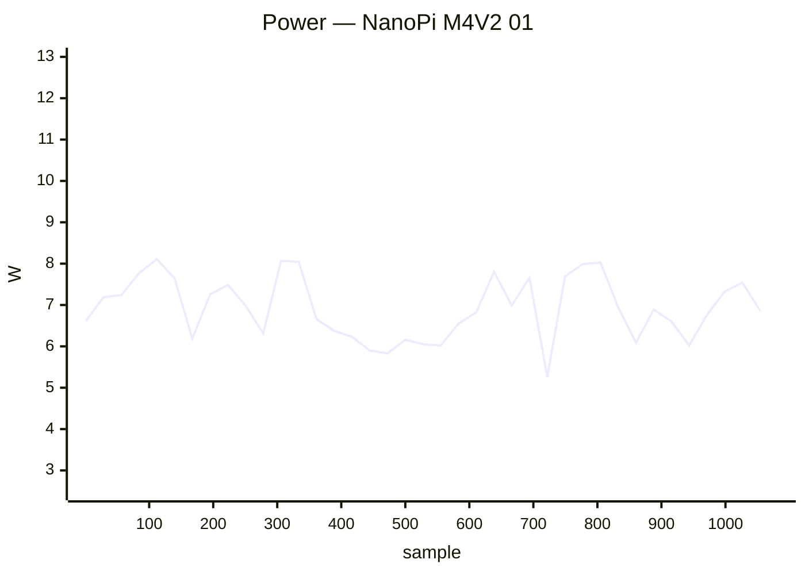
```mermaid
xychart-beta
    title "Power — NanoPi M4V2 01"
    x-axis "sample" 1 --> 1082
    y-axis "W" 2.5 --> 13.0
    line [6.61, 7.19, 7.24, 7.77, 8.11, 7.65, 6.19, 7.25, 7.49, 6.99, 6.31, 8.07, 8.04, 6.66, 6.37, 6.23, 5.90, 5.83, 6.16, 6.05, 6.02, 6.55, 6.82, 7.80, 6.99, 7.66, 5.26, 7.69, 7.99, 8.03, 6.94, 6.09, 6.89, 6.60, 6.02, 6.76, 7.33, 7.54, 6.86, 6.85]
```

### ✅ NanoPi M5 01

`nanopi-m5` · **inplace** · image `26.11.0-trunk.73` · 22 ✅ · 0 ❌ · 0 ⏭️

| Module | Status | Time | Detail |
|:--|:--:|--:|:--|
| upgrade | ✅ | 170.9 s | nightly · 26.11.0-trunk.73 → 26.11.0-trunk.74 |
| reboot | ✅ | 59.0 s | power-cycle · up 28 s |
| kernel-switch | ✅ | 22.7 s | branch=vendor · family=rk35xx · installed=26.11.0-trunk.74 · boot_image=/boot/vmlinuz-6.1.172-vendor-rk35xx · kernel_before=6.1.172-vendor-rk35xx |
| reboot | ✅ | 169.5 s | power-cycle · 2/2 boots · up 26 s |
| hw-performance | ✅ | 17.9 s | AES 1270 · mem 7900 · disk W 68 / R 77 MB/s · 45.3 °C · 2016 MHz |
| dvfs | ✅ | 18.1 s | ondemand · 2016–2016 MHz (peak 2208) |
| network-iperf | ✅ | 119.3 s | end1 ↑941/↓942 (1GE) · wlan0 ↑48/↓55 (Wi-Fi 5) · wlx44334c47dec3 ↑37/↓28 (Wi-Fi 4) Mbps |
| store-versions | ✅ | 3.9 s | 26.11.0-trunk.74 · 6.1.172-vendor-rk35xx |
| kernel-switch | ✅ | 109.2 s | branch=current · family=rockchip64 · installed=26.11.0-trunk.74 · boot_image=/boot/vmlinuz-6.18.55-current-rockchip64 · kernel_before=6.1.172-vendor-rk35xx |
| reboot | ✅ | 99.0 s | power-cycle · 2/2 boots · up 29 s |
| hw-performance | ✅ | 26.0 s | AES 1329 · mem 9000 · disk W 20 / R 21 MB/s · 45.3 °C · 2016 MHz |
| dvfs | ✅ | 16.9 s | ondemand · 408–2016 MHz (peak 2208) |
| network-iperf | ✅ | 200.8 s | end1 ↑940/↓941 (1GE) · wlan0 ↑98/↓152 (Wi-Fi 5) · wlx44334c47dec3 ↑39/↓28 (Wi-Fi 4) Mbps |
| store-versions | ✅ | 4.1 s | 26.11.0-trunk.74 · 6.18.55-current-rockchip64 |
| kernel-switch | ✅ | 98.1 s | branch=edge · family=rockchip64 · installed=26.11.0-trunk.74 · boot_image=/boot/vmlinuz-7.2.9-edge-rockchip64 · kernel_before=6.18.55-current-rockchip64 |
| reboot | ✅ | 91.5 s | power-cycle · 2/2 boots · up 29 s |
| hw-performance | ✅ | 26.4 s | AES 1330 · mem 8800 · disk W 20 / R 21 MB/s · 45.3 °C · 2016 MHz |
| dvfs | ✅ | 17.4 s | ondemand · 408–2016 MHz (peak 2208) |
| network-iperf | ✅ | 89.7 s | end1 ↑941/↓941 (1GE) · wlan0 ↑101/↓167 (Wi-Fi 5) · wlx44334c47dec3 ↑33/↓27 (Wi-Fi 4) Mbps |
| store-versions | ✅ | 4.1 s | 26.11.0-trunk.74 · 7.2.9-edge-rockchip64 |
| kernel-switch | ✅ | 107.0 s | branch=vendor · family=rk35xx · installed=26.11.0-trunk.74 · boot_image=/boot/vmlinuz-6.1.172-vendor-rk35xx · kernel_before=7.2.9-edge-rockchip64 |
| reboot | ✅ | 140.4 s | power-cycle · up 111 s |

**Power** — min 2.40 W · avg 5.13 W · peak 10.00 W · 1273 samples

```mermaid
xychart-beta
    title "Power — NanoPi M5 01"
    x-axis "sample" 1 --> 1273
    y-axis "W" 2.0 --> 10.5
    line [5.19, 5.69, 5.63, 5.78, 5.60, 4.67, 5.10, 4.13, 3.93, 3.72, 4.63, 6.18, 5.16, 5.31, 5.46, 5.74, 5.43, 4.82, 4.33, 5.19, 6.06, 5.05, 5.65, 5.02, 5.12, 5.25, 5.56, 5.79, 4.73, 4.64, 5.91, 6.08, 5.61, 5.16, 5.43, 5.31, 5.49, 4.01, 3.97, 3.88]
```

### ✅ NanoPi M6 01

`nanopi-m6` · **inplace** · image `26.11.0-trunk.73` · 22 ✅ · 0 ❌ · 0 ⏭️

| Module | Status | Time | Detail |
|:--|:--:|--:|:--|
| upgrade | ✅ | 187.4 s | nightly · 26.11.0-trunk.73 → 26.11.0-trunk.74 |
| reboot | ✅ | 50.9 s | power-cycle · up 23 s |
| kernel-switch | ✅ | 21.3 s | branch=vendor · family=rk35xx · installed=26.11.0-trunk.74 · boot_image=/boot/vmlinuz-6.1.172-vendor-rk35xx · kernel_before=6.1.172-vendor-rk35xx |
| reboot | ✅ | 84.0 s | power-cycle · 2/2 boots · up 23 s |
| hw-performance | ✅ | 17.2 s | AES 1272 · mem 13500 · disk W 52 / R 75 MB/s · 43.5 °C · 1800 MHz |
| dvfs | ✅ | 17.0 s | ondemand · 1800–1800 MHz (peak 2256) |
| network-iperf | ✅ | 56.3 s | lan ↑941/↓941 (1GE) · wlP3p49s0 ↑4/↓30 (Wi-Fi 5) Mbps |
| store-versions | ✅ | 4.3 s | 26.11.0-trunk.74 · 6.1.172-vendor-rk35xx |
| kernel-switch | ✅ | 104.1 s | branch=current · family=rockchip64 · installed=26.11.0-trunk.74 · boot_image=/boot/vmlinuz-6.18.55-current-rockchip64 · kernel_before=6.1.172-vendor-rk35xx |
| reboot | ✅ | 80.2 s | power-cycle · 2/2 boots · up 19 s |
| hw-performance | ✅ | 18.5 s | AES 1217 · mem 5900 · disk W 46 / R 57 MB/s · 45.3 °C · 1800 MHz |
| dvfs | ✅ | 14.1 s | ondemand · 408–1800 MHz (peak 2400) |
| network-iperf | ✅ | 88.5 s | lan ↑941/↓941 (1GE) · wlP3p49s0 ↑228/↓228 (Wi-Fi 5) Mbps |
| store-versions | ✅ | 3.8 s | 26.11.0-trunk.74 · 6.18.55-current-rockchip64 |
| kernel-switch | ✅ | 75.4 s | branch=edge · family=rockchip64 · installed=26.11.0-trunk.74 · boot_image=/boot/vmlinuz-7.2.9-edge-rockchip64 · kernel_before=6.18.55-current-rockchip64 |
| reboot | ✅ | 84.2 s | power-cycle · 2/2 boots · up 22 s |
| hw-performance | ✅ | 18.9 s | AES 1215 · mem 7800 · disk W 47 / R 55 MB/s · 47.2 °C · 1800 MHz |
| dvfs | ✅ | 15.9 s | ondemand · 408–1800 MHz (peak 2400) |
| network-iperf | ✅ | 370.6 s | lan ↑941/↓941 (1GE) · wlP3p49s0 ↑210/↓242 (Wi-Fi 5) Mbps |
| store-versions | ✅ | 4.0 s | 26.11.0-trunk.74 · 7.2.9-edge-rockchip64 |
| kernel-switch | ✅ | 72.4 s | branch=vendor · family=rk35xx · installed=26.11.0-trunk.74 · boot_image=/boot/vmlinuz-6.1.172-vendor-rk35xx · kernel_before=7.2.9-edge-rockchip64 |
| reboot | ✅ | 58.8 s | power-cycle · up 23 s |

**Power** — min 1.00 W · avg 3.89 W · peak 10.20 W · 1144 samples

```mermaid
xychart-beta
    title "Power — NanoPi M6 01"
    x-axis "sample" 1 --> 1144
    y-axis "W" 0.5 --> 10.5
    line [3.22, 3.26, 3.65, 2.82, 3.54, 3.79, 3.47, 3.54, 2.84, 3.56, 4.49, 3.54, 3.68, 3.46, 3.39, 3.26, 2.96, 4.69, 5.07, 4.69, 4.30, 4.64, 4.68, 3.83, 3.22, 5.47, 4.14, 4.03, 3.91, 3.84, 3.81, 4.06, 3.96, 4.13, 4.13, 4.13, 4.64, 4.62, 4.65, 2.72]
```

### ✅ NanoPi Neo 2 Black 01

`nanopineo2black` · **inplace** · image `26.11.0-trunk.73` · 15 ✅ · 1 ❌ · 0 ⏭️

| Module | Status | Time | Detail |
|:--|:--:|--:|:--|
| upgrade | ✅ | 196.9 s | nightly · 26.11.0-trunk.73 → 26.11.0-trunk.74 |
| reboot | ✅ | 56.1 s | power-cycle · up 18 s |
| kernel-switch | ✅ | 43.0 s | branch=current · family=sunxi64 · installed=26.11.0-trunk.74 · boot_image=/boot/vmlinuz-6.18.55-current-sunxi64 · kernel_before=6.18.55-current-sunxi64 |
| reboot | ✅ | 86.2 s | power-cycle · 2/2 boots · up 21 s |
| hw-performance | ✅ | 24.3 s | AES 606 · mem 3400 · disk W 43 / R 44 MB/s · 66.1 °C · 1368 MHz |
| dvfs | ❌ | 23.3 s | ondemand · 480–1368 MHz (peak 1296) |
| network-iperf | ✅ | 36.8 s | end0 ↑761/↓932 (1GE) Mbps |
| store-versions | ✅ | 5.8 s | 26.11.0-trunk.74 · 6.18.55-current-sunxi64 |
| kernel-switch | ✅ | 114.9 s | branch=edge · family=sunxi64 · installed=26.11.0-trunk.74 · boot_image=/boot/vmlinuz-7.2.9-edge-sunxi64 · kernel_before=6.18.55-current-sunxi64 |
| reboot | ✅ | 317.4 s | power-cycle · 1/2 boots · up 17 s |
| hw-performance | ✅ | 24.3 s | AES 637 · mem 3500 · disk W 43 / R 43 MB/s · 66.9 °C · 1368 MHz |
| dvfs | ✅ | 24.1 s | ondemand · 480–1368 MHz (peak 1368) |
| network-iperf | ✅ | 67.9 s | end0 ↑884/↓887 (1GE) Mbps |
| store-versions | ✅ | 5.0 s | 26.11.0-trunk.74 · 7.2.9-edge-sunxi64 |
| kernel-switch | ✅ | 112.3 s | branch=current · family=sunxi64 · installed=26.11.0-trunk.74 · boot_image=/boot/vmlinuz-6.18.55-current-sunxi64 · kernel_before=7.2.9-edge-sunxi64 |
| reboot | ✅ | 55.7 s | power-cycle · up 18 s |

**Power** — min 1.00 W · avg 2.74 W · peak 5.10 W · 945 samples

```mermaid
xychart-beta
    title "Power — NanoPi Neo 2 Black 01"
    x-axis "sample" 1 --> 945
    y-axis "W" 0.5 --> 5.5
    line [2.39, 2.84, 3.04, 3.01, 3.21, 3.42, 3.20, 2.14, 2.67, 3.22, 2.33, 3.25, 3.05, 3.27, 3.54, 3.43, 2.75, 3.27, 3.01, 3.20, 3.15, 2.08, 1.50, 1.50, 1.50, 1.50, 1.42, 1.40, 2.53, 2.65, 3.74, 3.53, 2.53, 2.67, 3.38, 3.19, 3.11, 2.98, 2.31, 2.76]
```

### ✅ NanoPi Neo 3 01

`nanopineo3` · **inplace** · image `26.11.0-trunk.73` · 16 ✅ · 0 ❌ · 0 ⏭️

| Module | Status | Time | Detail |
|:--|:--:|--:|:--|
| upgrade | ✅ | 297.5 s | nightly · 26.11.0-trunk.73 → 26.11.0-trunk.74 |
| reboot | ✅ | 67.6 s | power-cycle · up 29 s |
| kernel-switch | ✅ | 57.6 s | branch=current · family=rockchip64 · installed=26.11.0-trunk.74 · boot_image=/boot/vmlinuz-6.18.55-current-rockchip64 · kernel_before=6.18.55-current-rockchip64 |
| reboot | ✅ | 100.9 s | power-cycle · 2/2 boots · up 27 s |
| hw-performance | ✅ | 28.3 s | AES 599 · mem 2400 · disk W 53 / R 62 MB/s · 79.6 °C · 1296 MHz |
| dvfs | ✅ | 30.0 s | ondemand · 408–1296 MHz (peak 1296) |
| network-iperf | ✅ | 241.7 s | end0 ↑905/↓939 (1GE) · wlx7cdd905518f9 ↑31/↓24 (Wi-Fi 4) Mbps |
| store-versions | ✅ | 6.4 s | 26.11.0-trunk.74 · 6.18.55-current-rockchip64 |
| kernel-switch | ✅ | 173.4 s | branch=edge · family=rockchip64 · installed=26.11.0-trunk.74 · boot_image=/boot/vmlinuz-7.2.9-edge-rockchip64 · kernel_before=6.18.55-current-rockchip64 |
| reboot | ✅ | 100.3 s | power-cycle · 2/2 boots · up 27 s |
| hw-performance | ✅ | 28.5 s | AES 599 · mem 2400 · disk W 53 / R 63 MB/s · 81.9 °C · 1296 MHz |
| dvfs | ✅ | 31.2 s | ondemand · 408–1296 MHz (peak 1296) |
| network-iperf | ✅ | 143.3 s | end0 ↑898/↓940 (1GE) · wlx7cdd905518f9 ↑24/↓18 (Wi-Fi 4) Mbps |
| store-versions | ✅ | 6.7 s | 26.11.0-trunk.74 · 7.2.9-edge-rockchip64 |
| kernel-switch | ✅ | 211.5 s | branch=current · family=rockchip64 · installed=26.11.0-trunk.74 · boot_image=/boot/vmlinuz-6.18.55-current-rockchip64 · kernel_before=7.2.9-edge-rockchip64 |
| reboot | ✅ | 66.1 s | power-cycle · up 29 s |

**Power** — min 1.70 W · avg 4.50 W · peak 6.10 W · 1272 samples

```mermaid
xychart-beta
    title "Power — NanoPi Neo 3 01"
    x-axis "sample" 1 --> 1272
    y-axis "W" 1.5 --> 6.5
    line [3.92, 4.62, 5.00, 4.77, 4.58, 5.03, 4.77, 4.67, 3.89, 4.94, 4.62, 4.18, 4.28, 4.91, 4.52, 4.44, 4.22, 4.32, 3.93, 4.06, 4.11, 4.50, 4.78, 4.71, 4.62, 4.47, 4.66, 4.56, 4.82, 4.40, 4.31, 4.79, 4.19, 4.63, 3.88, 4.97, 4.70, 4.61, 4.40, 4.07]
```

### ✅ NanoPi R6S 01

`nanopi-r6s` · **inplace** · image `26.11.0-trunk.73` · 22 ✅ · 0 ❌ · 0 ⏭️

| Module | Status | Time | Detail |
|:--|:--:|--:|:--|
| upgrade | ✅ | 99.3 s | nightly · 26.11.0-trunk.73 → 26.11.0-trunk.74 |
| reboot | ✅ | 42.9 s | power-cycle · up 16 s |
| kernel-switch | ✅ | 19.3 s | branch=vendor · family=rk35xx · installed=26.11.0-trunk.74 · boot_image=/boot/vmlinuz-6.1.172-vendor-rk35xx · kernel_before=6.1.172-vendor-rk35xx |
| reboot | ✅ | 62.9 s | power-cycle · 2/2 boots · up 15 s |
| hw-performance | ✅ | 14.4 s | AES 1274 · mem 15200 · disk W 208 / R 268 MB/s · 43.5 °C · 1800 MHz |
| dvfs | ✅ | 17.0 s | ondemand · 1800–1800 MHz (peak 2352) |
| network-iperf | ✅ | 54.3 s | lan2 ↑941/↓942 (1GE) · wan ↑2344/↓2289 (2.5GE) Mbps |
| store-versions | ✅ | 3.8 s | 26.11.0-trunk.74 · 6.1.172-vendor-rk35xx |
| kernel-switch | ✅ | 52.4 s | branch=current · family=rockchip64 · installed=26.11.0-trunk.74 · boot_image=/boot/vmlinuz-6.18.55-current-rockchip64 · kernel_before=6.1.172-vendor-rk35xx |
| reboot | ✅ | 77.5 s | power-cycle · 2/2 boots · up 23 s |
| hw-performance | ✅ | 15.3 s | AES 1272 · mem 10400 · disk W 144 / R 155 MB/s · 45.3 °C · 1800 MHz |
| dvfs | ✅ | 14.5 s | ondemand · 408–1800 MHz (peak 2400) |
| network-iperf | ✅ | 136.5 s | lan2 ↑941/↓941 (1GE) · wan ↑2352/↓2282 (2.5GE) Mbps |
| store-versions | ✅ | 3.6 s | 26.11.0-trunk.74 · 6.18.55-current-rockchip64 |
| kernel-switch | ✅ | 47.4 s | branch=edge · family=rockchip64 · installed=26.11.0-trunk.74 · boot_image=/boot/vmlinuz-7.2.9-edge-rockchip64 · kernel_before=6.18.55-current-rockchip64 |
| reboot | ✅ | 69.0 s | power-cycle · 2/2 boots · up 21 s |
| hw-performance | ✅ | 15.4 s | AES 1272 · mem 6300 · disk W 146 / R 147 MB/s · 45.3 °C · 1800 MHz |
| dvfs | ✅ | 14.0 s | ondemand · 408–1800 MHz (peak 2400) |
| network-iperf | ✅ | 52.8 s | lan2 ↑941/↓941 (1GE) · wan ↑2353/↓2275 (2.5GE) Mbps |
| store-versions | ✅ | 4.0 s | 26.11.0-trunk.74 · 7.2.9-edge-rockchip64 |
| kernel-switch | ✅ | 42.7 s | branch=vendor · family=rk35xx · installed=26.11.0-trunk.74 · boot_image=/boot/vmlinuz-6.1.172-vendor-rk35xx · kernel_before=7.2.9-edge-rockchip64 |
| reboot | ✅ | 48.7 s | power-cycle · up 15 s |

**Power** — min 2.30 W · avg 3.96 W · peak 9.20 W · 698 samples

```mermaid
xychart-beta
    title "Power — NanoPi R6S 01"
    x-axis "sample" 1 --> 698
    y-axis "W" 2.0 --> 9.5
    line [2.82, 3.86, 3.61, 3.93, 3.93, 3.91, 3.82, 4.07, 4.16, 3.33, 3.46, 5.84, 3.50, 3.84, 3.34, 4.56, 4.07, 3.41, 3.24, 3.47, 4.13, 4.99, 4.07, 3.66, 3.32, 3.38, 3.26, 4.05, 4.26, 4.94, 3.30, 3.99, 4.50, 5.47, 3.91, 3.91, 4.35, 4.39, 4.35, 3.87]
```

### ✅ NanoPi R76S 01

`nanopi-r76s` · **inplace** · image `26.11.0-trunk.72` · 15 ✅ · 0 ❌ · 1 ⏭️

| Module | Status | Time | Detail |
|:--|:--:|--:|:--|
| upgrade | ⏭️ | 15.9 s | — |
| reboot | ✅ | 84.2 s | power-cycle · up 34 s |
| kernel-switch | ✅ | 145.1 s | branch=vendor · family=rk35xx · installed=26.11.0-trunk.74 · boot_image=/boot/vmlinuz-6.1.172-vendor-rk35xx · kernel_before=6.1.172-vendor-rk35xx |
| reboot | ✅ | 118.1 s | power-cycle · 2/2 boots · up 32 s |
| hw-performance | ✅ | 22.2 s | AES 1271 · mem 7600 · disk W 63 / R 77 MB/s · 48.1 °C · 2016 MHz |
| dvfs | ✅ | 21.7 s | ondemand · 2016–2016 MHz (peak 2208) |
| network-iperf | ✅ | 118.3 s | end0 ↑2345/↓2349 (2.5GE) · end1 ↑2346/↓2352 (2.5GE) · wlan0 ↑36/↓49 (Wi-Fi 5) · wlxe0e1a933de37 ↑192/↓207 (Wi-Fi 5) Mbps |
| store-versions | ✅ | 5.1 s | 26.11.0-trunk.72 · 6.1.172-vendor-rk35xx |
| kernel-switch | ✅ | 165.5 s | branch=edge · family=rockchip64 · installed=26.11.0-trunk.74 · boot_image=/boot/vmlinuz-7.2.9-edge-rockchip64 · kernel_before=6.1.172-vendor-rk35xx |
| reboot | ✅ | 121.3 s | power-cycle · 2/2 boots · up 35 s |
| hw-performance | ✅ | 21.2 s | AES 1309 · mem 8600 · disk W 37 / R 71 MB/s · 48.1 °C · 2016 MHz |
| dvfs | ✅ | 19.6 s | ondemand · 408–2016 MHz (peak 2208) |
| network-iperf | ✅ | 121.6 s | end1 ↑2353/↓2353 (2.5GE) · wlan0 ↑101/↓119 (Wi-Fi 5) · wlxe0e1a933de37 ↑191/↓222 (Wi-Fi 5) Mbps |
| store-versions | ✅ | 4.3 s | 26.11.0-trunk.72 · 7.2.9-edge-rockchip64 |
| kernel-switch | ✅ | 91.8 s | branch=vendor · family=rk35xx · installed=26.11.0-trunk.74 · boot_image=/boot/vmlinuz-6.1.172-vendor-rk35xx · kernel_before=7.2.9-edge-rockchip64 |
| reboot | ✅ | 79.2 s | power-cycle · up 34 s |

**Power** — min 0.60 W · avg 4.40 W · peak 8.80 W · 762 samples

```mermaid
xychart-beta
    title "Power — NanoPi R76S 01"
    x-axis "sample" 1 --> 762
    y-axis "W" 0.5 --> 9.0
    line [4.32, 4.05, 1.93, 4.74, 4.67, 4.95, 4.37, 4.73, 5.05, 3.44, 3.31, 3.55, 4.18, 5.08, 5.51, 4.95, 4.90, 4.77, 5.16, 5.01, 4.60, 4.93, 4.41, 4.20, 4.83, 2.82, 4.23, 2.29, 4.96, 5.88, 4.75, 4.73, 4.21, 4.59, 4.92, 4.63, 5.02, 4.67, 2.80, 3.73]
```

### ✅ Odroid C2 01

`odroidc2` · **inplace** · image `26.11.0-trunk.73` · 16 ✅ · 0 ❌ · 0 ⏭️

| Module | Status | Time | Detail |
|:--|:--:|--:|:--|
| upgrade | ✅ | 206.8 s | nightly · 26.11.0-trunk.73 → 26.11.0-trunk.74 |
| reboot | ✅ | 33.2 s | warm · up 17 s |
| kernel-switch | ✅ | 37.3 s | branch=current · family=meson64 · installed=26.11.0-trunk.74 · boot_image=/boot/vmlinuz-6.18.55-current-meson64 · kernel_before=6.18.55-current-meson64 |
| reboot | ✅ | 62.2 s | warm · 2/2 boots · up 16 s |
| hw-performance | ✅ | 22.1 s | AES 51 · mem 3500 · disk W 33 / R 150 MB/s · 49 °C · 1536 MHz |
| dvfs | ✅ | 21.8 s | ondemand · 500–1536 MHz (peak 1536) |
| network-iperf | ✅ | 65.9 s | end0 ↑940/↓941 (1GE) Mbps |
| store-versions | ✅ | 4.9 s | 26.11.0-trunk.74 · 6.18.55-current-meson64 |
| kernel-switch | ✅ | 116.3 s | branch=edge · family=meson64 · installed=26.11.0-trunk.74 · boot_image=/boot/vmlinuz-7.2.9-edge-meson64 · kernel_before=6.18.55-current-meson64 |
| reboot | ✅ | 61.5 s | warm · 2/2 boots · up 17 s |
| hw-performance | ✅ | 22.7 s | AES 51 · mem 3500 · disk W 33 / R 140 MB/s · 51 °C · 1536 MHz |
| dvfs | ✅ | 22.2 s | ondemand · 500–1536 MHz (peak 1536) |
| network-iperf | ✅ | 61.8 s | end0 ↑941/↓941 (1GE) Mbps |
| store-versions | ✅ | 5.0 s | 26.11.0-trunk.74 · 7.2.9-edge-meson64 |
| kernel-switch | ✅ | 113.8 s | branch=current · family=meson64 · installed=26.11.0-trunk.74 · boot_image=/boot/vmlinuz-6.18.55-current-meson64 · kernel_before=7.2.9-edge-meson64 |
| reboot | ✅ | 33.4 s | warm · up 17 s |

### ✅ Odroid C4 01

`odroidc4` · **inplace** · image `26.11.0-trunk.73` · 16 ✅ · 0 ❌ · 0 ⏭️

| Module | Status | Time | Detail |
|:--|:--:|--:|:--|
| upgrade | ✅ | 193.4 s | nightly · 26.11.0-trunk.73 → 26.11.0-trunk.74 |
| reboot | ✅ | 53.4 s | power-cycle · up 17 s |
| kernel-switch | ✅ | 30.1 s | branch=current · family=meson64 · installed=26.11.0-trunk.74 · boot_image=/boot/vmlinuz-6.18.55-current-meson64 · kernel_before=6.18.55-current-meson64 |
| reboot | ✅ | 75.9 s | power-cycle · 2/2 boots · up 18 s |
| hw-performance | ✅ | 21.4 s | AES 980 · mem 5200 · disk W 29 / R 78 MB/s · 43.2 °C · 2100 MHz |
| dvfs | ✅ | 19.1 s | ondemand · 1000–2100 MHz (peak 2100) |
| network-iperf | ✅ | 115.7 s | end0 ↑941/↓941 (1GE) · wlx24050fdd332b ↑109/↓55 (Wi-Fi 4) Mbps |
| store-versions | ✅ | 4.3 s | 26.11.0-trunk.74 · 6.18.55-current-meson64 |
| kernel-switch | ✅ | 112.0 s | branch=edge · family=meson64 · installed=26.11.0-trunk.74 · boot_image=/boot/vmlinuz-7.2.9-edge-meson64 · kernel_before=6.18.55-current-meson64 |
| reboot | ✅ | 81.3 s | power-cycle · 2/2 boots · up 18 s |
| hw-performance | ✅ | 22.3 s | AES 980 · mem 5200 · disk W 30 / R 74 MB/s · 43.5 °C · 2100 MHz |
| dvfs | ✅ | 19.3 s | ondemand · 1000–2100 MHz (peak 2100) |
| network-iperf | ✅ | 59.3 s | end0 ↑941/↓941 (1GE) · wlx24050fdd332b ↑110/↓90 (Wi-Fi 4) Mbps |
| store-versions | ✅ | 4.6 s | 26.11.0-trunk.74 · 7.2.9-edge-meson64 |
| kernel-switch | ✅ | 109.5 s | branch=current · family=meson64 · installed=26.11.0-trunk.74 · boot_image=/boot/vmlinuz-6.18.55-current-meson64 · kernel_before=7.2.9-edge-meson64 |
| reboot | ✅ | 57.6 s | power-cycle · up 21 s |

**Power** — min 0.90 W · avg 3.41 W · peak 5.10 W · 769 samples

```mermaid
xychart-beta
    title "Power — Odroid C4 01"
    x-axis "sample" 1 --> 769
    y-axis "W" 0.5 --> 5.5
    line [3.19, 3.90, 3.48, 3.44, 3.52, 3.62, 3.56, 3.50, 3.38, 2.36, 3.74, 3.55, 3.43, 2.39, 3.45, 3.65, 3.38, 3.14, 3.37, 3.93, 3.31, 3.57, 3.59, 3.62, 3.58, 3.68, 3.35, 2.63, 2.92, 3.65, 3.84, 3.54, 4.11, 3.52, 3.52, 3.61, 3.57, 3.53, 2.52, 2.85]
```

### ✅ Odroid M1 01

`odroidm1` · **inplace** · image `26.11.0-trunk.73` · 16 ✅ · 0 ❌ · 0 ⏭️

| Module | Status | Time | Detail |
|:--|:--:|--:|:--|
| upgrade | ✅ | 155.0 s | nightly · 26.11.0-trunk.73 → 26.11.0-trunk.74 |
| reboot | ✅ | 139.4 s | power-cycle · up 101 s |
| kernel-switch | ✅ | 31.4 s | branch=current · family=rockchip64 · installed=26.11.0-trunk.74 · boot_image=/boot/vmlinuz-6.18.55-current-rockchip64 · kernel_before=6.18.55-current-rockchip64 |
| reboot | ✅ | 249.4 s | power-cycle · 2/2 boots · up 104 s |
| hw-performance | ✅ | 16.7 s | AES 916 · mem 5100 · disk W 1058 / R 1015 MB/s · 36.1 °C · 1992 MHz |
| dvfs | ✅ | 21.1 s | ondemand · 408–1992 MHz (peak 1992) |
| network-iperf | ✅ | 87.3 s | eth0 ↑667/↓941 (1GE) Mbps |
| store-versions | ✅ | 4.6 s | 26.11.0-trunk.74 · 6.18.55-current-rockchip64 |
| kernel-switch | ✅ | 89.2 s | branch=edge · family=rockchip64 · installed=26.11.0-trunk.74 · boot_image=/boot/vmlinuz-7.2.9-edge-rockchip64 · kernel_before=6.18.55-current-rockchip64 |
| reboot | ✅ | 249.5 s | power-cycle · 2/2 boots · up 103 s |
| hw-performance | ✅ | 17.1 s | AES 915 · mem 5100 · disk W 1074 / R 1021 MB/s · 37.2 °C · 1992 MHz |
| dvfs | ✅ | 22.5 s | ondemand · 408–1992 MHz (peak 1992) |
| network-iperf | ✅ | 36.4 s | eth0 ↑941/↓941 (1GE) Mbps |
| store-versions | ✅ | 4.7 s | 26.11.0-trunk.74 · 7.2.9-edge-rockchip64 |
| kernel-switch | ✅ | 91.5 s | branch=current · family=rockchip64 · installed=26.11.0-trunk.74 · boot_image=/boot/vmlinuz-6.18.55-current-rockchip64 · kernel_before=7.2.9-edge-rockchip64 |
| reboot | ✅ | 143.0 s | power-cycle · up 104 s |

**Power** — min 1.90 W · avg 4.98 W · peak 10.30 W · 1054 samples

```mermaid
xychart-beta
    title "Power — Odroid M1 01"
    x-axis "sample" 1 --> 1054
    y-axis "W" 1.5 --> 10.5
    line [4.87, 7.57, 5.29, 6.61, 5.25, 5.01, 4.69, 3.97, 4.61, 5.53, 5.16, 3.97, 3.94, 4.40, 5.09, 3.98, 4.25, 6.09, 4.61, 4.27, 5.22, 6.13, 5.68, 5.55, 4.85, 3.94, 3.96, 4.69, 4.50, 3.94, 4.43, 5.34, 5.05, 5.48, 6.92, 5.82, 4.68, 5.48, 3.98, 4.25]
```

### ✅ Odroid N2 01

`odroidn2` · **inplace** · image `26.11.0-trunk.73` · 16 ✅ · 0 ❌ · 0 ⏭️

| Module | Status | Time | Detail |
|:--|:--:|--:|:--|
| upgrade | ✅ | 173.4 s | nightly · 26.11.0-trunk.73 → 26.11.0-trunk.74 |
| reboot | ✅ | 69.0 s | power-cycle · up 30 s |
| kernel-switch | ✅ | 25.2 s | branch=current · family=meson64 · installed=26.11.0-trunk.74 · boot_image=/boot/vmlinuz-6.18.55-current-meson64 · kernel_before=6.18.55-current-meson64 |
| reboot | ✅ | 100.8 s | power-cycle · 2/2 boots · up 30 s |
| hw-performance | ✅ | 18.5 s | AES 1085 · mem 4900 · disk W 27 / R 137 MB/s · 41.5 °C · 1992 MHz |
| dvfs | ✅ | 16.9 s | performance · 1000–1992 MHz (peak 1992) |
| network-iperf | ✅ | 59.3 s | end0 ↑939/↓941 (1GE) Mbps |
| store-versions | ✅ | 3.8 s | 26.11.0-trunk.74 · 6.18.55-current-meson64 |
| kernel-switch | ✅ | 88.8 s | branch=edge · family=meson64 · installed=26.11.0-trunk.74 · boot_image=/boot/vmlinuz-7.2.9-edge-meson64 · kernel_before=6.18.55-current-meson64 |
| reboot | ✅ | 97.4 s | power-cycle · 2/2 boots · up 30 s |
| hw-performance | ✅ | 19.6 s | AES 1085 · mem 4900 · disk W 27 / R 134 MB/s · 41.7 °C · 1992 MHz |
| dvfs | ✅ | 18.4 s | performance · 1000–1992 MHz (peak 1992) |
| network-iperf | ✅ | 84.2 s | end0 ↑940/↓941 (1GE) Mbps |
| store-versions | ✅ | 4.1 s | 26.11.0-trunk.74 · 7.2.9-edge-meson64 |
| kernel-switch | ✅ | 87.3 s | branch=current · family=meson64 · installed=26.11.0-trunk.74 · boot_image=/boot/vmlinuz-6.18.55-current-meson64 · kernel_before=7.2.9-edge-meson64 |
| reboot | ✅ | 71.3 s | power-cycle · up 34 s |

**Power** — min 1.00 W · avg 5.07 W · peak 11.00 W · 729 samples

```mermaid
xychart-beta
    title "Power — Odroid N2 01"
    x-axis "sample" 1 --> 729
    y-axis "W" 0.5 --> 11.5
    line [5.61, 5.31, 5.84, 6.21, 4.83, 5.67, 5.33, 5.19, 4.36, 3.41, 5.54, 5.24, 4.37, 5.73, 3.62, 5.16, 7.24, 5.78, 4.30, 4.48, 5.02, 5.03, 5.25, 5.16, 4.08, 4.94, 4.43, 4.72, 6.75, 7.29, 4.38, 4.92, 4.28, 4.69, 5.45, 5.14, 5.18, 4.67, 2.92, 5.07]
```

### ✅ Orange Pi 3 01

`orangepi3` · **inplace** · image `26.11.0-trunk.58` · 15 ✅ · 0 ❌ · 1 ⏭️

| Module | Status | Time | Detail |
|:--|:--:|--:|:--|
| upgrade | ⏭️ | 21.3 s | — |
| reboot | ✅ | 64.8 s | power-cycle · up 31 s |
| kernel-switch | ✅ | 35.6 s | branch=current · family=sunxi64 · installed=26.8.0-trunk.61 · boot_image=/boot/vmlinuz-6.18.33-current-sunxi64 · kernel_before=6.18.33-current-sunxi64 |
| reboot | ✅ | 321.0 s | power-cycle · 1/2 boots · up 25 s |
| hw-performance | ✅ | 29.0 s | AES 839 · mem 4600 · disk W 19 / R 23 MB/s · 50.1 °C · 1800 MHz |
| dvfs | ✅ | 19.3 s | ondemand · 480–1800 MHz (peak 1800) |
| network-iperf | ✅ | 176.1 s | end0 ↑911/↓941 (1GE) · wlan0 ↑18/↓103 (Wi-Fi 5) Mbps |
| store-versions | ✅ | 4.5 s | 26.11.0-trunk.58 · 6.18.33-current-sunxi64 |
| kernel-switch | ✅ | 99.6 s | branch=edge · family=sunxi64 · installed=26.8.0-trunk.61 · boot_image=/boot/vmlinuz-7.0.10-edge-sunxi64 · kernel_before=6.18.33-current-sunxi64 |
| reboot | ✅ | 311.9 s | power-cycle · 1/2 boots · up 24 s |
| hw-performance | ✅ | 28.2 s | AES 838 · mem 4600 · disk W 21 / R 23 MB/s · 48.9 °C · 1800 MHz |
| dvfs | ✅ | 19.9 s | ondemand · 480–1800 MHz (peak 1800) |
| network-iperf | ✅ | 120.7 s | end0 ↑914/↓942 (1GE) · wlan0 ↑42/↓117 (Wi-Fi 5) Mbps |
| store-versions | ✅ | 4.6 s | 26.11.0-trunk.58 · 7.0.10-edge-sunxi64 |
| kernel-switch | ✅ | 99.3 s | branch=current · family=sunxi64 · installed=26.8.0-trunk.61 · boot_image=/boot/vmlinuz-6.18.33-current-sunxi64 · kernel_before=7.0.10-edge-sunxi64 |
| reboot | ✅ | 55.5 s | power-cycle · up 23 s |

### ✅ Orange Pi 5 Plus 01

`orangepi5-plus` · **inplace** · image `26.11.0-trunk.73` · 22 ✅ · 0 ❌ · 0 ⏭️

| Module | Status | Time | Detail |
|:--|:--:|--:|:--|
| upgrade | ✅ | 193.7 s | nightly · 26.11.0-trunk.73 → 26.11.0-trunk.74 |
| reboot | ✅ | 68.3 s | power-cycle · up 29 s |
| kernel-switch | ✅ | 17.6 s | branch=vendor · family=rk35xx · installed=26.11.0-trunk.74 · boot_image=/boot/vmlinuz-6.1.172-vendor-rk35xx · kernel_before=6.1.172-vendor-rk35xx |
| reboot | ✅ | 103.3 s | power-cycle · 2/2 boots · up 28 s |
| hw-performance | ✅ | 18.0 s | AES 1259 · mem 13800 · disk W 54 / R 62 MB/s · 62.8 °C · 1800 MHz |
| dvfs | ✅ | 16.2 s | ondemand · 1800–1800 MHz (peak 2256) |
| network-iperf | ✅ | 160.2 s | enP3p49s0 ↑2352/↓2351 (2.5GE) · enP4p65s0 ↑2353/↓2315 (2.5GE) · wlxe0e1a9380c53 ↑590/↓299 (Wi-Fi 6) Mbps |
| store-versions | ✅ | 3.8 s | 26.11.0-trunk.74 · 6.1.172-vendor-rk35xx |
| kernel-switch | ✅ | 101.6 s | branch=current · family=rockchip64 · installed=26.11.0-trunk.74 · boot_image=/boot/vmlinuz-6.18.55-current-rockchip64 · kernel_before=6.1.172-vendor-rk35xx |
| reboot | ✅ | 103.6 s | power-cycle · 2/2 boots · up 28 s |
| hw-performance | ✅ | 18.3 s | AES 1246 · mem 10200 · disk W 53 / R 62 MB/s · 64.7 °C · 1800 MHz |
| dvfs | ✅ | 14.2 s | ondemand · 408–1800 MHz (peak 2400) |
| network-iperf | ✅ | 114.1 s | enP3p49s0 ↑2350/↓2353 (2.5GE) · enP4p65s0 ↑2352/↓2292 (2.5GE) · wlxe0e1a9380c53 ↑170/↓58 (Wi-Fi 6) Mbps |
| store-versions | ✅ | 3.9 s | 26.11.0-trunk.74 · 6.18.55-current-rockchip64 |
| kernel-switch | ✅ | 71.3 s | branch=edge · family=rockchip64 · installed=26.11.0-trunk.74 · boot_image=/boot/vmlinuz-7.2.9-edge-rockchip64 · kernel_before=6.18.55-current-rockchip64 |
| reboot | ✅ | 89.0 s | power-cycle · 2/2 boots · up 26 s |
| hw-performance | ✅ | 19.1 s | AES 1244 · mem 8000 · disk W 52 / R 56 MB/s · 67.5 °C · 1800 MHz |
| dvfs | ✅ | 14.3 s | ondemand · 408–1800 MHz (peak 2400) |
| network-iperf | ✅ | 184.6 s | enP3p49s0 ↑2351/↓2354 (2.5GE) · enP4p65s0 ↑2353/↓2324 (2.5GE) · wlxe0e1a9380c53 ↑128/↓56 (Wi-Fi 6) Mbps |
| store-versions | ✅ | 4.1 s | 26.11.0-trunk.74 · 7.2.9-edge-rockchip64 |
| kernel-switch | ✅ | 68.4 s | branch=vendor · family=rk35xx · installed=26.11.0-trunk.74 · boot_image=/boot/vmlinuz-6.1.172-vendor-rk35xx · kernel_before=7.2.9-edge-rockchip64 |
| reboot | ✅ | 55.6 s | power-cycle · up 26 s |

**Power** — min 0.60 W · avg 7.38 W · peak 14.00 W · 926 samples

```mermaid
xychart-beta
    title "Power — Orange Pi 5 Plus 01"
    x-axis "sample" 1 --> 926
    y-axis "W" 0.5 --> 14.5
    line [7.12, 7.29, 6.96, 7.55, 7.76, 7.43, 4.02, 7.59, 5.13, 5.14, 6.19, 8.54, 6.61, 7.19, 7.13, 8.50, 7.83, 7.61, 7.44, 6.28, 6.97, 4.29, 9.17, 8.39, 8.26, 8.95, 8.48, 8.46, 6.88, 6.69, 6.77, 9.27, 7.73, 7.72, 8.88, 8.30, 8.28, 8.47, 8.67, 5.65]
```

### ✅ Orange Pi Lite 2 01

`orangepilite2` · **inplace** · image `26.11.0-trunk.73` · 16 ✅ · 0 ❌ · 0 ⏭️

| Module | Status | Time | Detail |
|:--|:--:|--:|:--|
| upgrade | ✅ | 59.6 s | nightly · 26.11.0-trunk.73 → 26.11.0-trunk.73 |
| reboot | ✅ | 38.2 s | warm · up 22 s |
| kernel-switch | ✅ | 40.0 s | branch=current · family=sunxi64 · installed=26.11.0-trunk.73 · boot_image=/boot/vmlinuz-6.18.55-current-sunxi64 · kernel_before=6.18.55-current-sunxi64 |
| reboot | ✅ | 76.9 s | warm · 2/2 boots · up 25 s |
| hw-performance | ✅ | 32.4 s | AES 833 · mem 4400 · disk W 21 / R 22 MB/s · 73 °C · 1800 MHz |
| dvfs | ✅ | 24.7 s | ondemand · 480–1800 MHz (peak 1800) |
| network-iperf | ✅ | 45.1 s | wlan0 ↑6/↓3 (Wi-Fi 5) Mbps |
| store-versions | ✅ | 5.4 s | 26.11.0-trunk.73 · 6.18.55-current-sunxi64 |
| kernel-switch | ✅ | 134.3 s | branch=edge · family=sunxi64 · installed=26.11.0-trunk.73 · boot_image=/boot/vmlinuz-7.2.9-edge-sunxi64 · kernel_before=6.18.55-current-sunxi64 |
| reboot | ✅ | 72.1 s | warm · 2/2 boots · up 20 s |
| hw-performance | ✅ | 32.1 s | AES 793 · mem 4600 · disk W 22 / R 3 MB/s · 71.6 °C · 1800 MHz |
| dvfs | ✅ | 25.4 s | ondemand · 480–1800 MHz (peak 1800) |
| network-iperf | ✅ | 38.6 s | wlan0 ↑23/↓21 (Wi-Fi 5) Mbps |
| store-versions | ✅ | 5.3 s | 26.11.0-trunk.73 · 7.2.9-edge-sunxi64 |
| kernel-switch | ✅ | 135.1 s | branch=current · family=sunxi64 · installed=26.11.0-trunk.73 · boot_image=/boot/vmlinuz-6.18.55-current-sunxi64 · kernel_before=7.2.9-edge-sunxi64 |
| reboot | ✅ | 39.8 s | warm · up 23 s |

### ✅ Orange Pi One+ 01

`orangepioneplus` · **inplace** · image `26.11.0-trunk.73` · 16 ✅ · 0 ❌ · 0 ⏭️

| Module | Status | Time | Detail |
|:--|:--:|--:|:--|
| upgrade | ✅ | 238.6 s | nightly · 26.11.0-trunk.73 → 26.11.0-trunk.74 |
| reboot | ✅ | 39.9 s | warm · up 23 s |
| kernel-switch | ✅ | 45.6 s | branch=current · family=sunxi64 · installed=26.11.0-trunk.74 · boot_image=/boot/vmlinuz-6.18.55-current-sunxi64 · kernel_before=6.18.55-current-sunxi64 |
| reboot | ✅ | 71.7 s | warm · 2/2 boots · up 20 s |
| hw-performance | ✅ | 30.4 s | AES 839 · mem 4600 · disk W 21 / R 23 MB/s · 67.5 °C · 1800 MHz |
| dvfs | ✅ | 22.6 s | ondemand · 480–1800 MHz (peak 1800) |
| network-iperf | ✅ | 130.5 s | end0 ↑913/↓940 (1GE) · wlx00e04c881724 ↑79/↓115 (Wi-Fi 5) Mbps |
| store-versions | ✅ | 4.8 s | 26.11.0-trunk.74 · 6.18.55-current-sunxi64 |
| kernel-switch | ✅ | 128.5 s | branch=edge · family=sunxi64 · installed=26.11.0-trunk.74 · boot_image=/boot/vmlinuz-7.2.9-edge-sunxi64 · kernel_before=6.18.55-current-sunxi64 |
| reboot | ✅ | 70.0 s | warm · 2/2 boots · up 20 s |
| hw-performance | ✅ | 30.6 s | AES 840 · mem 4600 · disk W 19 / R 22 MB/s · 67.4 °C · 1800 MHz |
| dvfs | ✅ | 23.1 s | ondemand · 480–1800 MHz (peak 1800) |
| network-iperf | ✅ | 66.8 s | end0 ↑914/↓936 (1GE) · wlx00e04c881724 ↑45/↓98 (Wi-Fi 5) Mbps |
| store-versions | ✅ | 5.1 s | 26.11.0-trunk.74 · 7.2.9-edge-sunxi64 |
| kernel-switch | ✅ | 128.4 s | branch=current · family=sunxi64 · installed=26.11.0-trunk.74 · boot_image=/boot/vmlinuz-6.18.55-current-sunxi64 · kernel_before=7.2.9-edge-sunxi64 |
| reboot | ✅ | 40.9 s | warm · up 23 s |

### ✅ Orange Pi Prime 01

`orangepiprime` · **inplace** · image `26.11.0-trunk.62` · 14 ✅ · 0 ❌ · 2 ⏭️

| Module | Status | Time | Detail |
|:--|:--:|--:|:--|
| upgrade | ✅ | 91.4 s | nightly · 26.11.0-trunk.74 → 26.11.0-trunk.74 |
| reboot | ✅ | 56.9 s | warm · up 38 s |
| kernel-switch | ✅ | 64.6 s | branch=current · family=sunxi64 · installed=26.11.0-trunk.74 · boot_image=/boot/vmlinuz-6.18.55-current-sunxi64 · kernel_before=6.18.55-current-sunxi64 |
| reboot | ✅ | 93.7 s | warm · 2/2 boots · up 31 s |
| hw-performance | ✅ | 36.1 s | AES 379 · mem 2100 · disk W 1 / R 22 MB/s · 44.8 °C · None MHz |
| dvfs | ➖ | 3.1 s | no cpufreq |
| network-iperf | ✅ | 113.6 s | end0 ↑881/↓941 (1GE) · wlan0 ↑30/↓27 (Wi-Fi 4) Mbps |
| store-versions | ✅ | 6.7 s | 26.11.0-trunk.74 · 6.18.55-current-sunxi64 |
| kernel-switch | ✅ | 161.4 s | branch=edge · family=sunxi64 · installed=26.11.0-trunk.74 · boot_image=/boot/vmlinuz-7.2.9-edge-sunxi64 · kernel_before=6.18.55-current-sunxi64 |
| reboot | ✅ | 96.9 s | warm · 2/2 boots · up 34 s |
| hw-performance | ✅ | 36.4 s | AES 379 · mem 2100 · disk W 1 / R 22 MB/s · 44.9 °C · None MHz |
| dvfs | ➖ | 3.2 s | no cpufreq |
| network-iperf | ✅ | 68.2 s | end0 ↑890/↓941 (1GE) · wlan0 ↑27/↓29 (Wi-Fi 4) Mbps |
| store-versions | ✅ | 6.6 s | 26.11.0-trunk.74 · 7.2.9-edge-sunxi64 |
| kernel-switch | ✅ | 160.9 s | branch=current · family=sunxi64 · installed=26.11.0-trunk.74 · boot_image=/boot/vmlinuz-6.18.55-current-sunxi64 · kernel_before=7.2.9-edge-sunxi64 |
| reboot | ✅ | 50.0 s | warm · up 32 s |

### ✅ Orange Pi Zero2 01

`orangepizero2` · **inplace** · image `26.11.0-trunk.73` · 16 ✅ · 0 ❌ · 0 ⏭️

| Module | Status | Time | Detail |
|:--|:--:|--:|:--|
| upgrade | ✅ | 248.7 s | nightly · 26.11.0-trunk.73 → 26.11.0-trunk.74 |
| reboot | ✅ | 61.2 s | power-cycle · up 24 s |
| kernel-switch | ✅ | 68.9 s | branch=current · family=sunxi64 · installed=26.11.0-trunk.74 · boot_image=/boot/vmlinuz-6.18.55-current-sunxi64 · kernel_before=6.18.55-current-sunxi64 |
| reboot | ✅ | 94.2 s | power-cycle · 2/2 boots · up 23 s |
| hw-performance | ✅ | 34.8 s | AES 705 · mem 3000 · disk W 15 / R 22 MB/s · 69.1 °C · 1512 MHz |
| dvfs | ✅ | 25.7 s | ondemand · 480–1512 MHz (peak 1512) |
| network-iperf | ✅ | 67.3 s | end0 ↑876/↓941 (1GE) · wlx7c023a625db1 ↑40/↓15 (Wi-Fi 5) Mbps |
| store-versions | ✅ | 5.7 s | 26.11.0-trunk.74 · 6.18.55-current-sunxi64 |
| kernel-switch | ✅ | 148.8 s | branch=edge · family=sunxi64 · installed=26.11.0-trunk.74 · boot_image=/boot/vmlinuz-7.2.9-edge-sunxi64 · kernel_before=6.18.55-current-sunxi64 |
| reboot | ✅ | 93.5 s | power-cycle · 2/2 boots · up 25 s |
| hw-performance | ✅ | 33.9 s | AES 705 · mem 3000 · disk W 20 / R 23 MB/s · 67.5 °C · 1512 MHz |
| dvfs | ✅ | 26.6 s | ondemand · 480–1512 MHz (peak 1512) |
| network-iperf | ✅ | 132.7 s | end0 ↑875/↓941 (1GE) · wlx7c023a625db1 ↑37/↓16 (Wi-Fi 5) Mbps |
| store-versions | ✅ | 5.8 s | 26.11.0-trunk.74 · 7.2.9-edge-sunxi64 |
| kernel-switch | ✅ | 150.3 s | branch=current · family=sunxi64 · installed=26.11.0-trunk.74 · boot_image=/boot/vmlinuz-6.18.55-current-sunxi64 · kernel_before=7.2.9-edge-sunxi64 |
| reboot | ✅ | 59.1 s | power-cycle · up 23 s |

**Power** — min 1.80 W · avg 2.81 W · peak 4.20 W · 983 samples

```mermaid
xychart-beta
    title "Power — Orange Pi Zero2 01"
    x-axis "sample" 1 --> 983
    y-axis "W" 1.5 --> 4.5
    line [2.63, 2.84, 2.99, 2.72, 2.63, 3.03, 2.75, 2.79, 2.46, 2.68, 2.78, 2.86, 2.53, 3.09, 2.96, 2.70, 3.15, 2.98, 3.33, 2.74, 2.79, 2.98, 2.91, 2.75, 2.62, 2.92, 2.90, 2.66, 2.95, 2.84, 3.19, 2.38, 2.32, 2.80, 2.89, 2.87, 2.77, 2.65, 2.53, 3.12]
```

### ✅ Radxa ZERO 3 01

`radxa-zero3` · **inplace** · image `26.5.1` · 4 ✅ · 0 ❌ · 2 ⏭️

| Module | Status | Time | Detail |
|:--|:--:|--:|:--|
| upgrade | ⏭️ | 0.0 s | — |
| reboot | ⏭️ | 0.0 s | reboot |
| hw-performance | ✅ | 43.3 s | AES 718 · mem 3900 · disk W 21 / R 22 MB/s · 54.4 °C · 1416 MHz |
| dvfs | ✅ | 30.4 s | ondemand · 408–1416 MHz (peak 1416) |
| network-iperf | ✅ | 223.1 s | wlan0 ↑1/↓20 (Wi-Fi 6) Mbps |
| store-versions | ✅ | 6.3 s | 26.5.1 · 6.18.44-current-rockchip64 |

### ✅ Raspberry Pi 3B

`rpi4b` · **inplace** · image `26.11.0-trunk.73` · 16 ✅ · 0 ❌ · 0 ⏭️

| Module | Status | Time | Detail |
|:--|:--:|--:|:--|
| upgrade | ✅ | 347.2 s | nightly · 26.11.0-trunk.73 → 26.11.0-trunk.74 |
| reboot | ✅ | 50.5 s | warm · up 30 s |
| kernel-switch | ✅ | 70.6 s | branch=current · family=bcm2711 · installed=26.11.0-trunk.74 · boot_image=/boot/vmlinuz-6.18.55-current-bcm2711 · kernel_before=6.18.55-current-bcm2711 |
| reboot | ✅ | 143.1 s | warm · 2/2 boots · up 82 s |
| hw-performance | ✅ | 40.4 s | AES 24 · mem 1400 · disk W 20 / R 22 MB/s · 56.4 °C · 1200 MHz |
| dvfs | ✅ | 37.0 s | ondemand · 600–1200 MHz (peak 1200) |
| network-iperf | ✅ | 226.8 s | enxb827eb253a53 ↑94/↓94 (10/100ME) · wlan0 ↑15/↓29 (Wi-Fi 4) Mbps |
| store-versions | ✅ | 7.7 s | 26.11.0-trunk.74 · 6.18.55-current-bcm2711 |
| kernel-switch | ✅ | 230.8 s | branch=edge · family=bcm2711 · installed=26.11.0-trunk.74 · boot_image=/boot/vmlinuz-7.2.9-edge-bcm2711 · kernel_before=6.18.55-current-bcm2711 |
| reboot | ✅ | 94.5 s | warm · 2/2 boots · up 30 s |
| hw-performance | ✅ | 43.6 s | AES 24 · mem 1400 · disk W 20 / R 22 MB/s · 56.9 °C · 1200 MHz |
| dvfs | ✅ | 39.2 s | ondemand · 600–1200 MHz (peak 1200) |
| network-iperf | ✅ | 92.2 s | enxb827eb253a53 ↑94/↓94 (10/100ME) · wlan0 ↑30/↓38 (Wi-Fi 4) Mbps |
| store-versions | ✅ | 9.4 s | 26.11.0-trunk.74 · 7.2.9-edge-bcm2711 |
| kernel-switch | ✅ | 229.8 s | branch=current · family=bcm2711 · installed=26.11.0-trunk.74 · boot_image=/boot/vmlinuz-6.18.55-current-bcm2711 · kernel_before=7.2.9-edge-bcm2711 |
| reboot | ✅ | 51.0 s | warm · up 31 s |

### ✅ Raspberry Pi 5B

`rpi4b` · **inplace** · image `26.11.0-trunk.73` · 16 ✅ · 0 ❌ · 0 ⏭️

| Module | Status | Time | Detail |
|:--|:--:|--:|:--|
| upgrade | ✅ | 151.5 s | nightly · 26.11.0-trunk.73 → 26.11.0-trunk.74 |
| reboot | ✅ | 56.0 s | power-cycle · up 20 s |
| kernel-switch | ✅ | 14.7 s | branch=current · family=bcm2711 · installed=26.11.0-trunk.74 · boot_image=/boot/vmlinuz-6.18.55-current-bcm2711 · kernel_before=6.18.55-current-bcm2711 |
| reboot | ✅ | 71.8 s | power-cycle · 2/2 boots · up 21 s |
| hw-performance | ✅ | 14.3 s | AES 1368 · mem 12100 · disk W 55 / R 86 MB/s · 71.6 °C · 2400 MHz |
| dvfs | ✅ | 13.4 s | ondemand · 1500–2400 MHz (peak 2400) |
| network-iperf | ✅ | 53.1 s | end0 ↑936/↓941 (1GE) · wlan0 ↑35/↓27 (Wi-Fi 5) Mbps |
| store-versions | ✅ | 3.0 s | 26.11.0-trunk.74 · 6.18.55-current-bcm2711 |
| kernel-switch | ✅ | 129.2 s | branch=edge · family=bcm2711 · installed=26.11.0-trunk.74 · boot_image=/boot/vmlinuz-7.2.9-edge-bcm2711 · kernel_before=6.18.55-current-bcm2711 |
| reboot | ✅ | 74.3 s | power-cycle · 2/2 boots · up 22 s |
| hw-performance | ✅ | 15.0 s | AES 1368 · mem 9200 · disk W 52 / R 85 MB/s · 73.8 °C · 2400 MHz |
| dvfs | ✅ | 13.5 s | ondemand · 1500–2400 MHz (peak 2400) |
| network-iperf | ✅ | 53.7 s | end0 ↑936/↓941 (1GE) · wlan0 ↑44/↓16 (Wi-Fi 5) Mbps |
| store-versions | ✅ | 3.2 s | 26.11.0-trunk.74 · 7.2.9-edge-bcm2711 |
| kernel-switch | ✅ | 130.3 s | branch=current · family=bcm2711 · installed=26.11.0-trunk.74 · boot_image=/boot/vmlinuz-6.18.55-current-bcm2711 · kernel_before=7.2.9-edge-bcm2711 |
| reboot | ✅ | 46.6 s | power-cycle · up 20 s |

**Power** — min 3.20 W · avg 6.37 W · peak 10.60 W · 657 samples

```mermaid
xychart-beta
    title "Power — Raspberry Pi 5B"
    x-axis "sample" 1 --> 657
    y-axis "W" 3.0 --> 11.0
    line [6.01, 5.69, 5.88, 7.62, 8.05, 5.81, 6.56, 6.97, 4.44, 4.98, 6.62, 4.88, 6.24, 5.74, 6.04, 7.96, 6.51, 5.98, 6.91, 5.91, 5.76, 7.92, 6.54, 6.55, 6.12, 5.65, 5.24, 7.27, 7.51, 6.33, 6.65, 5.78, 6.31, 5.93, 6.30, 8.91, 6.26, 6.98, 6.30, 5.51]
```

### ✅ Raspberry Pi Zero 2W

`rpi4b` · **inplace** · image `26.11.0-trunk.73` · 16 ✅ · 0 ❌ · 0 ⏭️

| Module | Status | Time | Detail |
|:--|:--:|--:|:--|
| upgrade | ✅ | 299.3 s | nightly · 26.11.0-trunk.73 → 26.11.0-trunk.74 |
| reboot | ✅ | 41.7 s | warm · up 22 s |
| kernel-switch | ✅ | 54.7 s | branch=current · family=bcm2711 · installed=26.11.0-trunk.74 · boot_image=/boot/vmlinuz-6.18.55-current-bcm2711 · kernel_before=6.18.55-current-bcm2711 |
| reboot | ✅ | 78.1 s | warm · 2/2 boots · up 23 s |
| hw-performance | ✅ | 33.2 s | AES 33 · mem 2200 · disk W 1 / R 23 MB/s · 56.9 °C · 1000 MHz |
| dvfs | ✅ | 26.7 s | ondemand · 600–1000 MHz (peak 1000) |
| network-iperf | ✅ | 76.5 s | wlan0 ↑31/↓16 (Wi-Fi 4) Mbps |
| store-versions | ✅ | 5.7 s | 26.11.0-trunk.74 · 6.18.55-current-bcm2711 |
| kernel-switch | ✅ | 214.5 s | branch=edge · family=bcm2711 · installed=26.11.0-trunk.74 · boot_image=/boot/vmlinuz-7.2.9-edge-bcm2711 · kernel_before=6.18.55-current-bcm2711 |
| reboot | ✅ | 79.5 s | warm · 2/2 boots · up 22 s |
| hw-performance | ✅ | 34.0 s | AES 33 · mem 2200 · disk W 1 / R 23 MB/s · 56.9 °C · 1000 MHz |
| dvfs | ✅ | 27.7 s | ondemand · 600–1000 MHz (peak 1000) |
| network-iperf | ✅ | 47.4 s | wlan0 ↑32/↓36 (Wi-Fi 4) Mbps |
| store-versions | ✅ | 5.9 s | 26.11.0-trunk.74 · 7.2.9-edge-bcm2711 |
| kernel-switch | ✅ | 199.6 s | branch=current · family=bcm2711 · installed=26.11.0-trunk.74 · boot_image=/boot/vmlinuz-6.18.55-current-bcm2711 · kernel_before=7.2.9-edge-bcm2711 |
| reboot | ✅ | 41.3 s | warm · up 22 s |

### ✅ Rock 5B 01

`rock-5b` · **inplace** · image `26.11.0-trunk.73` · 21 ✅ · 1 ❌ · 0 ⏭️

| Module | Status | Time | Detail |
|:--|:--:|--:|:--|
| upgrade | ✅ | 159.2 s | nightly · 26.11.0-trunk.73 → 26.11.0-trunk.74 |
| reboot | ✅ | 136.3 s | power-cycle · up 101 s |
| kernel-switch | ✅ | 23.3 s | branch=vendor · family=rk35xx · installed=26.11.0-trunk.74 · boot_image=/boot/vmlinuz-6.1.172-vendor-rk35xx · kernel_before=6.1.172-vendor-rk35xx |
| reboot | ✅ | 246.6 s | power-cycle · 2/2 boots · up 103 s |
| hw-performance | ✅ | 19.9 s | AES 1293 · mem 15600 · disk W 25 / R 82 MB/s · 56.4 °C · 1800 MHz |
| dvfs | ✅ | 16.5 s | ondemand · 1800–1800 MHz (peak 2352) |
| network-iperf | ❌ | 467.3 s | enP4p65s0 ↑2349/↓2354 (2.5GE) · wlP2p33s0 ↑0/↓0 (Wi-Fi 6) Mbps |
| store-versions | ✅ | 3.9 s | 26.11.0-trunk.74 · 6.1.172-vendor-rk35xx |
| kernel-switch | ✅ | 88.1 s | branch=current · family=rockchip64 · installed=26.11.0-trunk.74 · boot_image=/boot/vmlinuz-6.18.55-current-rockchip64 · kernel_before=6.1.172-vendor-rk35xx |
| reboot | ✅ | 239.5 s | power-cycle · 2/2 boots · up 101 s |
| hw-performance | ✅ | 19.9 s | AES 1285 · mem 10400 · disk W 27 / R 82 MB/s · 64.7 °C · 1800 MHz |
| dvfs | ✅ | 14.7 s | ondemand · 408–1800 MHz (peak 2400) |
| network-iperf | ✅ | 30.1 s | enP4p65s0 ↑2353/↓2354 (2.5GE) Mbps |
| store-versions | ✅ | 4.3 s | 26.11.0-trunk.74 · 6.18.55-current-rockchip64 |
| kernel-switch | ✅ | 72.8 s | branch=edge · family=rockchip64 · installed=26.11.0-trunk.74 · boot_image=/boot/vmlinuz-7.2.9-edge-rockchip64 · kernel_before=6.18.55-current-rockchip64 |
| reboot | ✅ | 252.0 s | power-cycle · 2/2 boots · up 108 s |
| hw-performance | ✅ | 20.5 s | AES 1284 · mem 5400 · disk W 21 / R 82 MB/s · 66.5 °C · 1800 MHz |
| dvfs | ✅ | 15.7 s | ondemand · 408–1800 MHz (peak 2400) |
| network-iperf | ✅ | 37.2 s | end0 ↑2353/↓2354 Mbps |
| store-versions | ✅ | 4.0 s | 26.11.0-trunk.74 · 7.2.9-edge-rockchip64 |
| kernel-switch | ✅ | 73.4 s | branch=vendor · family=rk35xx · installed=26.11.0-trunk.74 · boot_image=/boot/vmlinuz-6.1.172-vendor-rk35xx · kernel_before=7.2.9-edge-rockchip64 |
| reboot | ✅ | 134.3 s | power-cycle · up 105 s |

**Power** — min 0.80 W · avg 4.69 W · peak 12.90 W · 1390 samples

```mermaid
xychart-beta
    title "Power — Rock 5B 01"
    x-axis "sample" 1 --> 1390
    y-axis "W" 0.5 --> 13.0
    line [3.99, 4.11, 4.28, 3.99, 3.30, 3.77, 4.05, 3.26, 3.67, 3.29, 4.81, 3.88, 3.43, 3.32, 3.45, 3.35, 3.34, 3.37, 3.35, 3.38, 4.29, 4.15, 5.58, 5.71, 5.63, 5.72, 6.32, 7.28, 6.76, 6.02, 5.92, 5.86, 5.45, 5.79, 7.20, 6.37, 6.67, 6.08, 3.98, 3.38]
```

### ✅ Rock 5B 02

`rock-5b` · **inplace** · image `26.11.0-trunk.73` · 22 ✅ · 0 ❌ · 0 ⏭️

| Module | Status | Time | Detail |
|:--|:--:|--:|:--|
| upgrade | ✅ | 129.8 s | nightly · 26.11.0-trunk.73 → 26.11.0-trunk.74 |
| reboot | ✅ | 55.7 s | power-cycle · up 19 s |
| kernel-switch | ✅ | 76.2 s | branch=vendor · family=rk35xx · installed=26.11.0-trunk.74 · boot_image=/boot/vmlinuz-6.1.172-vendor-rk35xx · kernel_before=6.18.55-current-rockchip64 |
| reboot | ✅ | 85.4 s | power-cycle · 2/2 boots · up 23 s |
| hw-performance | ✅ | 16.4 s | AES 1296 · mem 15000 · disk W 65 / R 82 MB/s · 64.7 °C · 1800 MHz |
| dvfs | ✅ | 16.6 s | ondemand · 1800–1800 MHz (peak 2352) |
| network-iperf | ✅ | 60.6 s | enP4p65s0 ↑2345/↓2347 (2.5GE) · wlP2p33s0 ↑513/↓146 (Wi-Fi 6) Mbps |
| store-versions | ✅ | 3.9 s | 26.11.0-trunk.74 · 6.1.172-vendor-rk35xx |
| kernel-switch | ✅ | 93.3 s | branch=current · family=rockchip64 · installed=26.11.0-trunk.74 · boot_image=/boot/vmlinuz-6.18.55-current-rockchip64 · kernel_before=6.1.172-vendor-rk35xx |
| reboot | ✅ | 77.2 s | power-cycle · 2/2 boots · up 19 s |
| hw-performance | ✅ | 17.5 s | AES 1283 · mem 10000 · disk W 62 / R 73 MB/s · 65.6 °C · 1800 MHz |
| dvfs | ✅ | 15.0 s | ondemand · 408–1800 MHz (peak 2400) |
| network-iperf | ✅ | 60.0 s | enP4p65s0 ↑2350/↓2354 (2.5GE) · wlP2p33s0 ↑520/↓315 (Wi-Fi 6) Mbps |
| store-versions | ✅ | 4.0 s | 26.11.0-trunk.74 · 6.18.55-current-rockchip64 |
| kernel-switch | ✅ | 91.1 s | branch=edge · family=rockchip64 · installed=26.11.0-trunk.74 · boot_image=/boot/vmlinuz-7.2.9-edge-rockchip64 · kernel_before=6.18.55-current-rockchip64 |
| reboot | ✅ | 74.8 s | power-cycle · 2/2 boots · up 18 s |
| hw-performance | ✅ | 18.5 s | AES 1282 · mem 5100 · disk W 62 / R 72 MB/s · 67.5 °C · 1800 MHz |
| dvfs | ✅ | 15.5 s | ondemand · 408–1800 MHz (peak 2400) |
| network-iperf | ✅ | 55.9 s | end0 ↑2353/↓2354 · wlP2p33s0 ↑645/↓257 (Wi-Fi 6) Mbps |
| store-versions | ✅ | 4.3 s | 26.11.0-trunk.74 · 7.2.9-edge-rockchip64 |
| kernel-switch | ✅ | 67.9 s | branch=vendor · family=rk35xx · installed=26.11.0-trunk.74 · boot_image=/boot/vmlinuz-6.1.172-vendor-rk35xx · kernel_before=7.2.9-edge-rockchip64 |
| reboot | ✅ | 57.5 s | power-cycle · up 21 s |

**Power** — min 0.60 W · avg 6.00 W · peak 14.90 W · 696 samples

```mermaid
xychart-beta
    title "Power — Rock 5B 02"
    x-axis "sample" 1 --> 696
    y-axis "W" 0.5 --> 15.0
    line [6.50, 6.56, 6.79, 7.31, 6.83, 3.76, 5.68, 6.83, 6.56, 6.25, 4.78, 2.93, 5.06, 6.61, 5.11, 5.06, 4.77, 5.03, 5.11, 4.65, 5.89, 4.97, 7.43, 8.34, 7.07, 6.36, 6.19, 6.52, 6.86, 5.08, 5.21, 6.12, 8.87, 6.52, 7.13, 6.50, 6.51, 6.79, 4.74, 4.40]
```

### ✅ Rock 5B Plus 01

`rock-5b-plus` · **inplace** · image `26.11.0-trunk.73` · 22 ✅ · 0 ❌ · 0 ⏭️

| Module | Status | Time | Detail |
|:--|:--:|--:|:--|
| upgrade | ✅ | 273.4 s | nightly · 26.11.0-trunk.73 → 26.11.0-trunk.74 |
| reboot | ✅ | 55.4 s | power-cycle · up 22 s |
| kernel-switch | ✅ | 19.7 s | branch=vendor · family=rk35xx · installed=26.11.0-trunk.74 · boot_image=/boot/vmlinuz-6.1.172-vendor-rk35xx · kernel_before=6.1.172-vendor-rk35xx |
| reboot | ✅ | 87.0 s | power-cycle · 2/2 boots · up 23 s |
| hw-performance | ✅ | 18.4 s | AES 1279 · mem 13900 · disk W 21 / R 82 MB/s · 57.3 °C · 1800 MHz |
| dvfs | ✅ | 15.6 s | ondemand · 1800–1800 MHz (peak 2304) |
| network-iperf | ✅ | 81.0 s | enP4p65s0 ↑2349/↓2353 (2.5GE) Mbps |
| store-versions | ✅ | 4.4 s | 26.11.0-trunk.74 · 6.1.172-vendor-rk35xx |
| kernel-switch | ✅ | 124.0 s | branch=current · family=rockchip64 · installed=26.11.0-trunk.74 · boot_image=/boot/vmlinuz-6.18.55-current-rockchip64 · kernel_before=6.1.172-vendor-rk35xx |
| reboot | ✅ | 87.2 s | power-cycle · 2/2 boots · up 23 s |
| hw-performance | ✅ | 19.2 s | AES 1277 · mem 10200 · disk W 25 / R 73 MB/s · 58.2 °C · 1800 MHz |
| dvfs | ✅ | 15.2 s | ondemand · 408–1800 MHz (peak 2400) |
| network-iperf | ✅ | 28.4 s | enP4p65s0 ↑2352/↓2352 (2.5GE) Mbps |
| store-versions | ✅ | 3.9 s | 26.11.0-trunk.74 · 6.18.55-current-rockchip64 |
| kernel-switch | ✅ | 66.4 s | branch=edge · family=rockchip64 · installed=26.11.0-trunk.74 · boot_image=/boot/vmlinuz-7.2.9-edge-rockchip64 · kernel_before=6.18.55-current-rockchip64 |
| reboot | ✅ | 79.8 s | power-cycle · 2/2 boots · up 22 s |
| hw-performance | ✅ | 19.6 s | AES 1275 · mem 8100 · disk W 20 / R 70 MB/s · 61 °C · 1800 MHz |
| dvfs | ✅ | 14.6 s | ondemand · 408–1800 MHz (peak 2400) |
| network-iperf | ✅ | 28.7 s | end0 ↑2353/↓2354 Mbps |
| store-versions | ✅ | 4.0 s | 26.11.0-trunk.74 · 7.2.9-edge-rockchip64 |
| kernel-switch | ✅ | 66.1 s | branch=vendor · family=rk35xx · installed=26.11.0-trunk.74 · boot_image=/boot/vmlinuz-6.1.172-vendor-rk35xx · kernel_before=7.2.9-edge-rockchip64 |
| reboot | ✅ | 52.7 s | power-cycle · up 23 s |

**Power** — min 0.60 W · avg 4.83 W · peak 12.40 W · 739 samples

```mermaid
xychart-beta
    title "Power — Rock 5B Plus 01"
    x-axis "sample" 1 --> 739
    y-axis "W" 0.5 --> 12.5
    line [4.23, 3.92, 3.73, 4.04, 4.01, 3.50, 3.53, 3.88, 4.12, 4.16, 3.13, 4.37, 3.36, 3.14, 4.24, 5.83, 3.64, 3.53, 4.29, 4.15, 4.38, 3.71, 3.71, 3.67, 5.49, 5.19, 7.56, 6.66, 6.67, 6.63, 6.51, 5.16, 4.22, 6.43, 8.26, 6.84, 6.81, 6.77, 6.38, 3.67]
```

### ✅ Rockpi E 01

`rockpi-e` · **inplace** · image `26.11.0-trunk.73` · 16 ✅ · 0 ❌ · 0 ⏭️

| Module | Status | Time | Detail |
|:--|:--:|--:|:--|
| upgrade | ✅ | 325.5 s | nightly · 26.11.0-trunk.73 → 26.11.0-trunk.74 |
| reboot | ✅ | 61.4 s | power-cycle · up 25 s |
| kernel-switch | ✅ | 51.5 s | branch=current · family=rockchip64 · installed=26.11.0-trunk.74 · boot_image=/boot/vmlinuz-6.18.55-current-rockchip64 · kernel_before=6.18.55-current-rockchip64 |
| reboot | ✅ | 92.8 s | power-cycle · 2/2 boots · up 25 s |
| hw-performance | ✅ | 31.8 s | AES 600 · mem 3300 · disk W 21 / R 22 MB/s · 63.3 °C · 1296 MHz |
| dvfs | ✅ | 25.3 s | ondemand · 408–1296 MHz (peak 1296) |
| network-iperf | ✅ | 125.6 s | end0 ↑940/↓941 (1GE) · end1 ↑94/↓94 (10/100ME) · wlx7ca7b020e87c ↑127/↓188 (Wi-Fi 5) Mbps |
| store-versions | ✅ | 5.6 s | 26.11.0-trunk.74 · 6.18.55-current-rockchip64 |
| kernel-switch | ✅ | 209.5 s | branch=edge · family=rockchip64 · installed=26.11.0-trunk.74 · boot_image=/boot/vmlinuz-7.2.9-edge-rockchip64 · kernel_before=6.18.55-current-rockchip64 |
| reboot | ✅ | 90.5 s | power-cycle · 2/2 boots · up 24 s |
| hw-performance | ✅ | 32.2 s | AES 603 · mem 3300 · disk W 21 / R 22 MB/s · 63.3 °C · 1296 MHz |
| dvfs | ✅ | 26.4 s | ondemand · 408–1296 MHz (peak 1296) |
| network-iperf | ✅ | 88.0 s | end0 ↑941/↓941 (1GE) · end1 ↑94/↓94 (10/100ME) · wlx7ca7b020e87c ↑148/↓193 (Wi-Fi 5) Mbps |
| store-versions | ✅ | 5.6 s | 26.11.0-trunk.74 · 7.2.9-edge-rockchip64 |
| kernel-switch | ✅ | 183.3 s | branch=current · family=rockchip64 · installed=26.11.0-trunk.74 · boot_image=/boot/vmlinuz-6.18.55-current-rockchip64 · kernel_before=7.2.9-edge-rockchip64 |
| reboot | ✅ | 60.2 s | power-cycle · up 25 s |

### ✅ RockPro 64 01

`rockpro64` · **inplace** · image `26.11.0-trunk.73` · 16 ✅ · 0 ❌ · 0 ⏭️

| Module | Status | Time | Detail |
|:--|:--:|--:|:--|
| upgrade | ✅ | 215.4 s | nightly · 26.11.0-trunk.73 → 26.11.0-trunk.74 |
| reboot | ✅ | 63.2 s | power-cycle · up 31 s |
| kernel-switch | ✅ | 29.5 s | branch=current · family=rockchip64 · installed=26.11.0-trunk.74 · boot_image=/boot/vmlinuz-6.18.55-current-rockchip64 · kernel_before=6.18.55-current-rockchip64 |
| reboot | ✅ | 329.3 s | power-cycle · 1/2 boots · up 31 s |
| hw-performance | ✅ | 21.5 s | AES 1021 · mem 6600 · disk W 64 / R 118 MB/s · 51.1 °C · 1416 MHz |
| dvfs | ✅ | 21.6 s | ondemand · 408–1416 MHz (peak 1800) |
| network-iperf | ✅ | 62.0 s | end0 ↑941/↓941 (1GE) · wlan0 ↑94/↓104 (Wi-Fi 5) Mbps |
| store-versions | ✅ | 5.2 s | 26.11.0-trunk.74 · 6.18.55-current-rockchip64 |
| kernel-switch | ✅ | 108.0 s | branch=edge · family=rockchip64 · installed=26.11.0-trunk.74 · boot_image=/boot/vmlinuz-7.2.9-edge-rockchip64 · kernel_before=6.18.55-current-rockchip64 |
| reboot | ✅ | 348.6 s | power-cycle · 1/2 boots · up 48 s |
| hw-performance | ✅ | 21.3 s | AES 1019 · mem 6600 · disk W 63 / R 118 MB/s · 52.8 °C · 1416 MHz |
| dvfs | ✅ | 21.8 s | ondemand · 408–1416 MHz (peak 1800) |
| network-iperf | ✅ | 62.4 s | end0 ↑9/↓9 (1GE) · wlan0 ↑35/↓34 (Wi-Fi 5) Mbps |
| store-versions | ✅ | 6.0 s | 26.11.0-trunk.74 · 7.2.9-edge-rockchip64 |
| kernel-switch | ✅ | 144.1 s | branch=current · family=rockchip64 · installed=26.11.0-trunk.74 · boot_image=/boot/vmlinuz-6.18.55-current-rockchip64 · kernel_before=7.2.9-edge-rockchip64 |
| reboot | ✅ | 61.5 s | power-cycle · up 30 s |

**Power** — min 3.00 W · avg 4.70 W · peak 9.30 W · 1189 samples

```mermaid
xychart-beta
    title "Power — RockPro 64 01"
    x-axis "sample" 1 --> 1189
    y-axis "W" 2.5 --> 9.5
    line [4.67, 4.69, 5.14, 4.49, 4.63, 5.09, 4.23, 4.98, 4.79, 5.04, 5.10, 5.10, 5.10, 5.10, 4.41, 4.52, 4.60, 5.27, 4.40, 4.71, 4.53, 5.72, 5.05, 5.14, 5.20, 5.20, 5.20, 5.20, 4.92, 4.30, 4.00, 4.15, 4.96, 3.56, 4.29, 3.70, 4.11, 4.25, 4.15, 4.29]
```

### ✅ SpacemiT K3 Pico-ITX 01

`k3picoitx` · **inplace** · image `26.11.0-trunk.73` · 8 ✅ · 0 ❌ · 0 ⏭️

| Module | Status | Time | Detail |
|:--|:--:|--:|:--|
| upgrade | ✅ | 89.9 s | nightly · 26.11.0-trunk.73 → 26.11.0-trunk.74 |
| reboot | ✅ | 53.5 s | power-cycle · up 21 s |
| kernel-switch | ✅ | 19.3 s | branch=legacy · family=spacemit-k3 · installed=26.11.0-trunk.74 · boot_image=/boot/vmlinuz-6.18.3-legacy-spacemit-k3 · kernel_before=6.18.3-legacy-spacemit-k3 |
| reboot | ✅ | 82.7 s | power-cycle · 2/2 boots · up 25 s |
| hw-performance | ✅ | 13.6 s | AES 778 · mem 4100 · disk W 1338 / R 1518 MB/s · 46 °C · 2150 MHz |
| dvfs | ✅ | 16.1 s | performance · 614–2150 MHz (peak 2150) |
| network-iperf | ✅ | 133.6 s | eth0 ↑941/↓941 (1GE) · eth1 ↑7445/↓4638 (10GE) · wlan0 ↑55/↓167 (Wi-Fi 6) Mbps |
| store-versions | ✅ | 3.7 s | 26.11.0-trunk.74 · 6.18.3-legacy-spacemit-k3 |

### ✅ Tinker Board 01

`tinkerboard` · **inplace** · image `26.11.0-trunk.73` · 16 ✅ · 0 ❌ · 0 ⏭️

| Module | Status | Time | Detail |
|:--|:--:|--:|:--|
| upgrade | ✅ | 171.5 s | nightly · 26.11.0-trunk.73 → 26.11.0-trunk.74 |
| reboot | ✅ | 69.5 s | power-cycle · up 33 s |
| kernel-switch | ✅ | 29.7 s | branch=current · family=rockchip · installed=26.11.0-trunk.74 · boot_image=/boot/vmlinuz-6.18.55-current-rockchip · kernel_before=6.18.55-current-rockchip |
| reboot | ✅ | 106.1 s | power-cycle · 2/2 boots · up 30 s |
| hw-performance | ✅ | 28.2 s | AES 67 · mem 3300 · disk W 13 / R 63 MB/s · 65 °C · 1800 MHz |
| dvfs | ✅ | 20.5 s | ondemand · 600–1800 MHz (peak 1800) |
| network-iperf | ✅ | 151.6 s | end0 ↑940/↓941 (1GE) · wlan0 ↑25/↓24 (Wi-Fi 4) Mbps |
| store-versions | ✅ | 4.5 s | 26.11.0-trunk.74 · 6.18.55-current-rockchip |
| kernel-switch | ✅ | 82.5 s | branch=edge · family=rockchip · installed=26.11.0-trunk.74 · boot_image=/boot/vmlinuz-7.3.0-rc6-edge-rockchip · kernel_before=6.18.55-current-rockchip |
| reboot | ✅ | 100.8 s | power-cycle · 2/2 boots · up 29 s |
| hw-performance | ✅ | 28.3 s | AES 67 · mem 3300 · disk W 14 / R 63 MB/s · 65 °C · 1800 MHz |
| dvfs | ✅ | 23.3 s | ondemand · 600–1800 MHz (peak 1800) |
| network-iperf | ✅ | 32.9 s | end0 ↑941/↓941 (1GE) Mbps |
| store-versions | ✅ | 4.9 s | 26.11.0-trunk.74 · 7.3.0-rc6-edge-rockchip |
| kernel-switch | ✅ | 81.4 s | branch=current · family=rockchip · installed=26.11.0-trunk.74 · boot_image=/boot/vmlinuz-6.18.55-current-rockchip · kernel_before=7.3.0-rc6-edge-rockchip |
| reboot | ✅ | 66.8 s | power-cycle · up 29 s |

**Power** — min 1.30 W · avg 3.84 W · peak 7.90 W · 794 samples

```mermaid
xychart-beta
    title "Power — Tinker Board 01"
    x-axis "sample" 1 --> 794
    y-axis "W" 1.0 --> 8.0
    line [3.53, 3.71, 4.20, 3.75, 4.53, 3.61, 4.63, 4.02, 2.88, 3.67, 4.85, 3.22, 3.87, 2.94, 3.39, 4.40, 5.49, 3.50, 3.10, 2.93, 2.74, 4.20, 3.86, 3.80, 3.91, 4.29, 4.41, 3.33, 3.65, 3.01, 4.51, 4.12, 4.57, 4.18, 3.89, 4.22, 4.28, 4.01, 3.06, 3.40]
```

### ✅ Udoo 01

`udoo` · **inplace** · image `26.11.0-trunk.72` · 16 ✅ · 0 ❌ · 0 ⏭️

| Module | Status | Time | Detail |
|:--|:--:|--:|:--|
| upgrade | ✅ | 149.2 s | nightly · 26.11.0-trunk.72 → 26.11.0-trunk.72 |
| reboot | ✅ | 76.5 s | power-cycle · up 34 s |
| kernel-switch | ✅ | 79.1 s | branch=current · family=imx6 · installed=26.11.0-trunk.72 · boot_image=/boot/vmlinuz-6.18.55-current-imx6 · kernel_before=6.18.55-current-imx6 |
| reboot | ✅ | 117.4 s | power-cycle · 2/2 boots · up 34 s |
| hw-performance | ✅ | 50.8 s | AES 26 · mem 756 · disk W 13 / R 20 MB/s · 54.9 °C · 996 MHz |
| dvfs | ✅ | 43.5 s | ondemand · 396–996 MHz (peak 996) |
| network-iperf | ✅ | 93.4 s | end0 ↑400/↓235 (1GE) · wlx7cdd903aa418 ↑33/↓9 (Wi-Fi 4) Mbps |
| store-versions | ✅ | 9.5 s | 26.11.0-trunk.72 · 6.18.55-current-imx6 |
| kernel-switch | ✅ | 901.4 s | branch=edge · family=imx6 · installed=26.11.0-trunk.72 · boot_image=/boot/vmlinuz-7.1.13-edge-imx6 · kernel_before=6.18.55-current-imx6 |
| reboot | ✅ | 137.6 s | power-cycle · 2/2 boots · up 35 s |
| hw-performance | ✅ | 51.7 s | AES 26 · mem 704 · disk W 13 / R 20 MB/s · 55.5 °C · 996 MHz |
| dvfs | ✅ | 47.2 s | ondemand · 396–996 MHz (peak 996) |
| network-iperf | ✅ | 99.7 s | end0 ↑399/↓228 (1GE) · wlx7cdd903aa418 ↑31/↓20 (Wi-Fi 4) Mbps |
| store-versions | ✅ | 9.5 s | 26.11.0-trunk.72 · 7.1.13-edge-imx6 |
| kernel-switch | ✅ | 1062.0 s | branch=current · family=imx6 · installed=26.11.0-trunk.72 · boot_image=/boot/vmlinuz-6.18.55-current-imx6 · kernel_before=7.1.13-edge-imx6 |
| reboot | ✅ | 89.8 s | power-cycle · up 35 s |

**Power** — min 1.30 W · avg 5.53 W · peak 8.50 W · 2467 samples

```mermaid
xychart-beta
    title "Power — Udoo 01"
    x-axis "sample" 1 --> 2467
    y-axis "W" 1.0 --> 9.0
    line [6.09, 6.10, 5.94, 6.13, 5.69, 6.05, 5.93, 6.25, 5.73, 5.07, 5.02, 5.02, 5.00, 5.04, 5.03, 5.02, 5.00, 5.98, 6.14, 6.03, 5.72, 5.76, 6.13, 5.70, 6.05, 5.41, 4.99, 5.02, 5.01, 5.02, 4.99, 5.00, 5.02, 5.03, 5.03, 5.13, 6.16, 5.97, 6.22, 5.55]
```

### ✅ UEFI arm64 01

`uefi-arm64` · **inplace** · image `26.11.0-trunk.73` · 16 ✅ · 0 ❌ · 0 ⏭️

| Module | Status | Time | Detail |
|:--|:--:|--:|:--|
| upgrade | ✅ | 516.5 s | nightly · 26.11.0-trunk.73 → 26.11.0-trunk.74 |
| reboot | ✅ | 53.2 s | warm · up 33 s |
| kernel-switch | ✅ | 16.5 s | branch=current · family=arm64 · installed=26.11.0-trunk.74 · boot_image=/boot/vmlinuz-6.18.55-current-arm64 · kernel_before=6.18.55-current-arm64 |
| reboot | ✅ | 96.5 s | warm · 2/2 boots · up 32 s |
| hw-performance | ✅ | 15.0 s | AES 1402 · mem 13000 · disk W 1576 / R 2099 MB/s · 47 °C · 2600 MHz |
| dvfs | ✅ | 15.1 s | ondemand · 800–2600 MHz (peak 2600) |
| network-iperf | ✅ | 79.6 s | enp1s0 ↑7851/↓2638 (10GE) · enp49s0 ↑6834/↓9242 (10GE) · wlp97s0 ↑91/↓60 (Wi-Fi 6) Mbps |
| store-versions | ✅ | 4.4 s | 26.11.0-trunk.74 · 6.18.55-current-arm64 |
| kernel-switch | ✅ | 78.1 s | branch=edge · family=arm64 · installed=26.11.0-trunk.74 · boot_image=/boot/vmlinuz-7.2.9-edge-arm64 · kernel_before=6.18.55-current-arm64 |
| reboot | ✅ | 95.4 s | warm · 2/2 boots · up 31 s |
| hw-performance | ✅ | 15.5 s | AES 1458 · mem 12000 · disk W 1438 / R 2095 MB/s · 46 °C · 2600 MHz |
| dvfs | ✅ | 15.5 s | ondemand · 800–2600 MHz (peak 2600) |
| network-iperf | ✅ | 83.0 s | enp1s0 ↑7066/↓2736 (10GE) · enp49s0 ↑6982/↓8893 (10GE) · wlp97s0 ↑100/↓70 (Wi-Fi 6) Mbps |
| store-versions | ✅ | 4.5 s | 26.11.0-trunk.74 · 7.2.9-edge-arm64 |
| kernel-switch | ✅ | 93.2 s | branch=current · family=arm64 · installed=26.11.0-trunk.74 · boot_image=/boot/vmlinuz-6.18.55-current-arm64 · kernel_before=7.2.9-edge-arm64 |
| reboot | ✅ | 51.1 s | warm · up 30 s |

### ✅ UEFI x86 01

`uefi-x86` · **inplace** · image `26.11.0-trunk.73` · 14 ✅ · 0 ❌ · 2 ⏭️

| Module | Status | Time | Detail |
|:--|:--:|--:|:--|
| upgrade | ✅ | 753.2 s | nightly · 26.11.0-trunk.73 → 26.11.0-trunk.74 |
| reboot | ✅ | 99.9 s | power-cycle · up 62 s |
| kernel-switch | ✅ | 35.6 s | branch=current · family=x86 · installed=26.11.0-trunk.74 · boot_image=/boot/vmlinuz-6.18.55-current-x86 · kernel_before=6.18.55-current-x86 |
| reboot | ✅ | 141.7 s | power-cycle · 2/2 boots · up 57 s |
| hw-performance | ✅ | 27.0 s | AES 237 · mem 5200 · disk W 19 / R 99 MB/s · 66 °C · 1920 MHz |
| dvfs | ➖ | 23.7 s | schedutil · 480–1920 MHz (peak 1682) · max_khz is single-core turbo, not an all-core target |
| network-iperf | ✅ | 62.9 s | enp1s0 ↑893/↓941 (1GE) · wlan0 ↑36/↓32 (Wi-Fi 5) Mbps |
| store-versions | ✅ | 5.3 s | 26.11.0-trunk.74 · 6.18.55-current-x86 |
| kernel-switch | ✅ | 190.9 s | branch=edge · family=x86 · installed=26.11.0-trunk.74 · boot_image=/boot/vmlinuz-7.2.9-edge-x86 · kernel_before=6.18.55-current-x86 |
| reboot | ✅ | 152.4 s | power-cycle · 2/2 boots · up 60 s |
| hw-performance | ✅ | 25.0 s | AES 235 · mem 4800 · disk W 25 / R 106 MB/s · 65 °C · 1920 MHz |
| dvfs | ➖ | 23.7 s | schedutil · 480–1920 MHz (peak 1680) · max_khz is single-core turbo, not an all-core target |
| network-iperf | ✅ | 63.3 s | enp1s0 ↑890/↓941 (1GE) · wlan0 ↑37/↓34 (Wi-Fi 5) Mbps |
| store-versions | ✅ | 5.5 s | 26.11.0-trunk.74 · 7.2.9-edge-x86 |
| kernel-switch | ✅ | 202.3 s | branch=current · family=x86 · installed=26.11.0-trunk.74 · boot_image=/boot/vmlinuz-6.18.55-current-x86 · kernel_before=7.2.9-edge-x86 |
| reboot | ✅ | 99.3 s | power-cycle · up 56 s |

**Power** — min 2.30 W · avg 3.84 W · peak 7.90 W · 1538 samples

```mermaid
xychart-beta
    title "Power — UEFI x86 01"
    x-axis "sample" 1 --> 1538
    y-axis "W" 2.0 --> 8.0
    line [3.36, 3.95, 4.02, 3.95, 3.07, 2.88, 2.74, 2.71, 2.77, 2.85, 2.91, 4.44, 3.97, 4.01, 4.22, 4.04, 4.01, 4.92, 4.07, 4.93, 4.20, 4.48, 4.39, 3.45, 3.62, 3.68, 3.94, 4.00, 3.95, 5.05, 4.68, 3.88, 3.59, 3.38, 3.68, 3.80, 3.85, 4.12, 3.57, 4.56]
```

### ✅ ZeroPi 01

`zeropi` · **inplace** · image `26.11.0-trunk.73` · 16 ✅ · 0 ❌ · 0 ⏭️

| Module | Status | Time | Detail |
|:--|:--:|--:|:--|
| upgrade | ✅ | 335.6 s | nightly · 26.11.0-trunk.73 → 26.11.0-trunk.74 |
| reboot | ✅ | 64.0 s | power-cycle · up 25 s |
| kernel-switch | ✅ | 62.8 s | branch=current · family=sunxi · installed=26.11.0-trunk.74 · boot_image=/boot/vmlinuz-6.18.55-current-sunxi · kernel_before=6.18.55-current-sunxi |
| reboot | ✅ | 98.5 s | power-cycle · 2/2 boots · up 25 s |
| hw-performance | ✅ | 39.4 s | AES 25 · mem 1500 · disk W 21 / R 23 MB/s · 48.8 °C · 1296 MHz |
| dvfs | ✅ | 34.0 s | ondemand · 480–1296 MHz (peak 1296) |
| network-iperf | ✅ | 41.1 s | end0 ↑638/↓938 (1GE) Mbps |
| store-versions | ✅ | 7.4 s | 26.11.0-trunk.74 · 6.18.55-current-sunxi |
| kernel-switch | ✅ | 178.8 s | branch=edge · family=sunxi · installed=26.11.0-trunk.74 · boot_image=/boot/vmlinuz-7.2.9-edge-sunxi · kernel_before=6.18.55-current-sunxi |
| reboot | ✅ | 98.2 s | power-cycle · 2/2 boots · up 25 s |
| hw-performance | ✅ | 39.8 s | AES 25 · mem 1600 · disk W 21 / R 22 MB/s · 49 °C · 1296 MHz |
| dvfs | ✅ | 37.1 s | ondemand · 480–1296 MHz (peak 1296) |
| network-iperf | ✅ | 41.7 s | end0 ↑624/↓941 (1GE) Mbps |
| store-versions | ✅ | 8.3 s | 26.11.0-trunk.74 · 7.2.9-edge-sunxi |
| kernel-switch | ✅ | 177.2 s | branch=current · family=sunxi · installed=26.11.0-trunk.74 · boot_image=/boot/vmlinuz-6.18.55-current-sunxi · kernel_before=7.2.9-edge-sunxi |
| reboot | ✅ | 64.0 s | power-cycle · up 26 s |

**Power** — min 1.20 W · avg 2.14 W · peak 3.40 W · 1062 samples

```mermaid
xychart-beta
    title "Power — ZeroPi 01"
    x-axis "sample" 1 --> 1062
    y-axis "W" 1.0 --> 3.5
    line [1.95, 1.99, 2.15, 2.09, 2.08, 2.09, 1.93, 2.59, 2.14, 2.13, 1.92, 2.19, 2.31, 2.13, 2.00, 2.02, 2.27, 2.04, 2.32, 2.15, 2.14, 2.06, 2.10, 2.11, 2.11, 2.14, 2.12, 2.17, 2.41, 2.08, 2.41, 2.20, 2.42, 2.15, 2.21, 2.11, 2.10, 2.10, 1.94, 2.05]
```

<!-- FLEET-STOP -->
