# Tested boards

Every board in the Armbian test datacenter runs an automated pipeline — a nightly **upgrade**, a **reboot**, hardware **performance** and **DVFS** checks and a **network** throughput test — before being restored to the stable release. Boards are grouped **failures first**, each with its per-module results, timings and power shown inline; use the table of contents on the right to jump straight to a board. The set is the **current status**: the most recent test of every board.

The list is refreshed automatically by the Armbian autotests fleet: a scheduled job reads the fleet's rolling test results and opens a pull request to update this page — the same mechanism used for the [datacenter boards](/status/boards/) and [Wi-Fi performance](/status/wifi-performance/) pages.

Legend: ✅ pass · ❌ fail · ⏭️ skipped · ➖ not run.

<!-- FLEET-START -->

**85** boards — **67** passed, **18** failed. Most recent test of every board; failures first.

## ❌ Failed (18)

### ❌ BananaPi BPI-F3 01

`musepipro` · **inplace** · image `26.11.0-trunk.110` · 12 ✅ · 3 ❌ · 1 ⏭️

| Module | Status | Time | Detail |
|:--|:--:|--:|:--|
| upgrade | ⏭️ | 87 s | — |
| reboot | ✅ | 145 s | power-cycle · up 108 s |
| kernel-switch | ❌ | 83 s | branch=current · phase=install · dpkg_state=absent |
| reboot | ✅ | 252 s | power-cycle · 2/2 boots · up 106 s |
| hw-performance | ✅ | 24 s | AES 27 · mem 3000 · disk W 24 / R 82 MB/s · 52 °C · 1600 MHz |
| dvfs | ✅ | 24 s | performance · 614–1600 MHz (peak 1600) |
| network-iperf | ✅ | 133 s | eth0 ↑941/↓940 (1GE) Mbps |
| store-versions | ✅ | 5 s | 6.18.45-current-spacemit |
| kernel-switch | ❌ | 85 s | branch=edge · phase=install · dpkg_state=absent |
| reboot | ✅ | 257 s | power-cycle · 2/2 boots · up 105 s |
| hw-performance | ✅ | 24 s | AES 27 · mem 3000 · disk W 70 / R 82 MB/s · 51 °C · 1600 MHz |
| dvfs | ✅ | 23 s | performance · 614–1600 MHz (peak 1600) |
| network-iperf | ✅ | 32 s | eth0 ↑938/↓941 (1GE) Mbps |
| store-versions | ✅ | 5 s | 6.18.45-current-spacemit |
| kernel-switch | ❌ | 83 s | branch=current · phase=install · dpkg_state=absent |
| reboot | ✅ | 147 s | power-cycle · up 109 s |

**Power** — min 2.9 W · avg 3.9 W · peak 6.9 W · 1103 samples

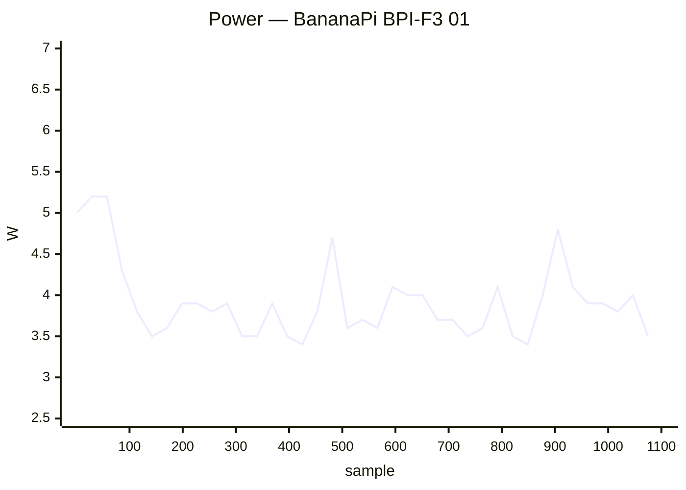
```mermaid
xychart-beta
    title "Power — BananaPi BPI-F3 01"
    x-axis "sample" 1 --> 1103
    y-axis "W" 2.5 --> 7.0
    line [5.0, 5.2, 5.2, 4.3, 3.8, 3.5, 3.6, 3.9, 3.9, 3.8, 3.9, 3.5, 3.5, 3.9, 3.5, 3.4, 3.8, 4.7, 3.6, 3.7, 3.6, 4.1, 4.0, 4.0, 3.7, 3.7, 3.5, 3.6, 4.1, 3.5, 3.4, 4.0, 4.8, 4.1, 3.9, 3.9, 3.8, 4.0, 3.5, 3.6]
```

### ❌ Cubie A5E 01

`radxa-cubie-a5e` · **inplace** · image `26.11.0-trunk.133` · 1 ✅ · 1 ❌ · 14 ⏭️

| Module | Status | Time | Detail |
|:--|:--:|--:|:--|
| upgrade | ✅ | 113 s | nightly · 26.11.0-trunk.134 → 26.11.0-trunk.134 |
| reboot | ❌ | 221 s | power-cycle |
| kernel-switch | ⏭️ | — | skipped=board down after reboot/power-cycle |
| reboot | ⏭️ | — | reboot |
| hw-perf | ⏭️ | — | board down after reboot/power-cycle |
| dvfs | ⏭️ | — | — |
| net-iperf | ⏭️ | — | board down after reboot/power-cycle |
| store-versions | ⏭️ | — | — |
| kernel-switch | ⏭️ | — | skipped=board down after reboot/power-cycle |
| reboot | ⏭️ | — | reboot |
| hw-perf | ⏭️ | — | board down after reboot/power-cycle |
| dvfs | ⏭️ | — | — |
| net-iperf | ⏭️ | — | board down after reboot/power-cycle |
| store-versions | ⏭️ | — | — |
| kernel-switch | ⏭️ | — | skipped=board down after reboot/power-cycle |
| reboot | ⏭️ | — | reboot |

**Power** — min 2.2 W · avg 3.8 W · peak 4.3 W · 274 samples

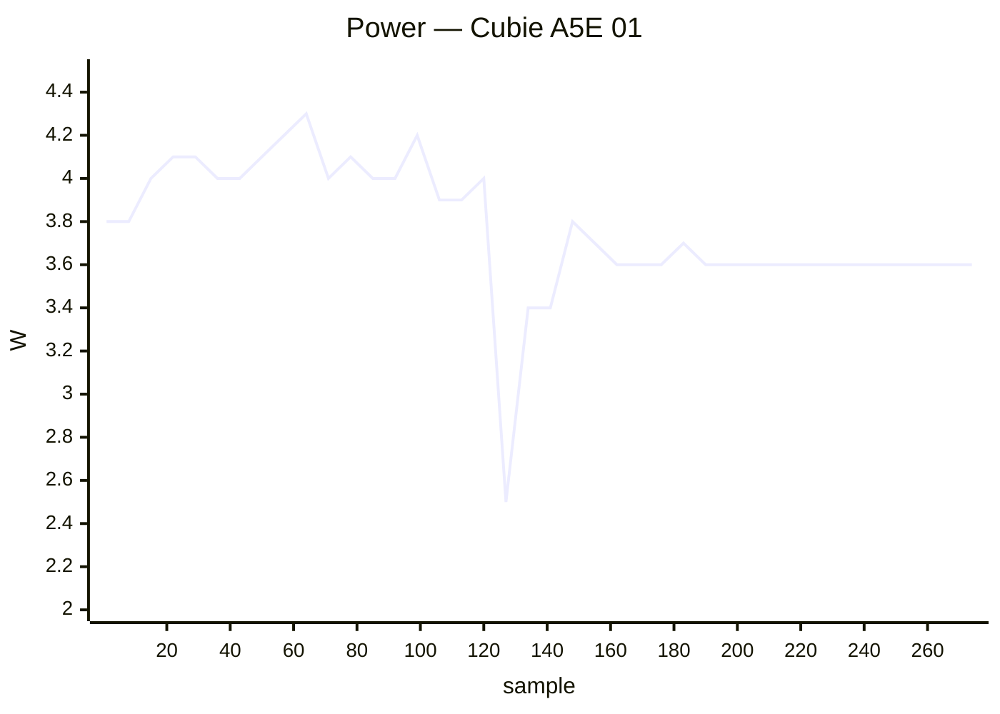
```mermaid
xychart-beta
    title "Power — Cubie A5E 01"
    x-axis "sample" 1 --> 274
    y-axis "W" 2.0 --> 4.5
    line [3.8, 3.8, 4.0, 4.1, 4.1, 4.0, 4.0, 4.1, 4.2, 4.3, 4.0, 4.1, 4.0, 4.0, 4.2, 3.9, 3.9, 4.0, 2.5, 3.4, 3.4, 3.8, 3.7, 3.6, 3.6, 3.6, 3.7, 3.6, 3.6, 3.6, 3.6, 3.6, 3.6, 3.6, 3.6, 3.6, 3.6, 3.6, 3.6, 3.6]
```

### ❌ Edge2 01

`khadas-edge2` · **inplace** · image `26.11.0-trunk.133` · 8 ✅ · 1 ❌ · 7 ⏭️

| Module | Status | Time | Detail |
|:--|:--:|--:|:--|
| upgrade | ⏭️ | 13 s | — |
| reboot | ✅ | 146 s | power-cycle · up 114 s |
| kernel-switch | ✅ | 19 s | branch=current · family=rockchip64 · installed=26.11.0-trunk.134 · boot_image=/boot/vmlinuz-6.18.63-current-rockchip64 · kernel_before=6.18.63-current-rockchip64 |
| reboot | ✅ | 271 s | power-cycle · 2/2 boots · up 117 s |
| hw-performance | ✅ | 15 s | AES 1268 · mem 10000 · disk W 105 / R 238 MB/s · 40.7 °C · 1800 MHz |
| dvfs | ✅ | 15 s | ondemand · 408–1800 MHz (peak 2400) |
| network-iperf | ✅ | 116 s | wlP4p65s0 ↑397/↓380 (Wi-Fi 5) · enx00e04c360603 ↑?/↓? Mbps |
| store-versions | ✅ | 4 s | 26.11.0-trunk.134 · 6.18.63-current-rockchip64 |
| kernel-switch | ✅ | 57 s | branch=edge · family=rockchip64 · installed=26.11.0-trunk.134 · boot_image=/boot/vmlinuz-7.3.4-edge-rockchip64 · kernel_before=6.18.63-current-rockchip64 |
| reboot | ❌ | 249 s | power-cycle · 2/2 boots · up 94 s |
| hw-perf | ⏭️ | — | board down after reboot/power-cycle |
| dvfs | ⏭️ | — | — |
| net-iperf | ⏭️ | — | board down after reboot/power-cycle |
| store-versions | ⏭️ | — | — |
| kernel-switch | ⏭️ | — | skipped=board down after reboot/power-cycle |
| reboot | ⏭️ | — | reboot |

### ❌ NanoPi M5 01

`nanopi-m5` · **inplace** · image `26.11.0-trunk.110` · 18 ✅ · 2 ❌ · 2 ⏭️

| Module | Status | Time | Detail |
|:--|:--:|--:|:--|
| upgrade | ✅ | 42 s | nightly · 26.11.0-trunk.128 → 26.11.0-trunk.128 |
| reboot | ✅ | 48 s | power-cycle · up 23 s |
| kernel-switch | ✅ | 24 s | branch=vendor · family=rk35xx · installed=26.11.0-trunk.128 · boot_image=/boot/vmlinuz-6.1.172-vendor-rk35xx · kernel_before=6.1.172-vendor-rk35xx |
| reboot | ✅ | 83 s | power-cycle · 2/2 boots · up 23 s |
| hw-performance | ✅ | 17 s | AES 1272 · mem 8000 · disk W 64 / R 74 MB/s · 48.1 °C · 2016 MHz |
| dvfs | ✅ | 17 s | ondemand · 2016–2016 MHz (peak 2208) |
| network-iperf | ✅ | 641 s | end0 ↑941/↓942 (1GE) · end1 ↑941/↓941 (1GE) · wlan0 ↑32/↓62 (Wi-Fi 5) · wlx44334c47dec3 ↑39/↓19 (Wi-Fi 4) Mbps |
| store-versions | ✅ | 4 s | 26.11.0-trunk.128 · 6.1.172-vendor-rk35xx |
| kernel-switch | ✅ | 105 s | branch=current · family=rockchip64 · installed=26.11.0-trunk.128 · boot_image=/boot/vmlinuz-6.18.62-current-rockchip64 · kernel_before=6.1.172-vendor-rk35xx |
| reboot | ✅ | 82 s | power-cycle · 2/2 boots · up 23 s |
| hw-performance | ✅ | 25 s | AES 1325 · mem 9000 · disk W 20 / R 21 MB/s · 46.2 °C · 2016 MHz |
| dvfs | ✅ | 16 s | ondemand · 408–2016 MHz (peak 2208) |
| network-iperf | ✅ | 141 s | end0 ↑939/↓942 (1GE) · end1 ↑941/↓942 (1GE) · wlan0 ↑50/↓74 (Wi-Fi 5) · wlx44334c47dec3 ↑38/↓17 (Wi-Fi 4) Mbps |
| store-versions | ✅ | 4 s | 26.11.0-trunk.128 · 6.18.62-current-rockchip64 |
| kernel-switch | ✅ | 108 s | branch=edge · family=rockchip64 · installed=26.11.0-trunk.128 · boot_image=/boot/vmlinuz-7.3.3-edge-rockchip64 · kernel_before=6.18.62-current-rockchip64 |
| reboot | ✅ | 85 s | power-cycle · 2/2 boots · up 26 s |
| hw-performance | ✅ | 156 s | AES 1324 · mem 8800 · disk W None / R None MB/s · None °C · None MHz |
| dvfs | ➖ | 13 s | no cpufreq |
| network-iperf | ⏭️ | 32 s | no iperf3 on board |
| store-versions | ❌ | 15 s | — |
| kernel-switch | ❌ | 33 s | branch=vendor · phase=install · dpkg_state=absent |
| reboot | ✅ | 64 s | power-cycle · up 24 s |

### ❌ NanoPi R76S 01

`nanopi-r76s` · **inplace** · image `26.11.0-trunk.134` · 0 ✅ · 1 ❌ · 15 ⏭️

| Module | Status | Time | Detail |
|:--|:--:|--:|:--|
| upgrade | ⏭️ | 11 s | — |
| reboot | ❌ | 146 s | power-cycle · up 103 s |
| kernel-switch | ⏭️ | — | skipped=board down after reboot/power-cycle |
| reboot | ⏭️ | — | reboot |
| hw-perf | ⏭️ | — | board down after reboot/power-cycle |
| dvfs | ⏭️ | — | — |
| net-iperf | ⏭️ | — | board down after reboot/power-cycle |
| store-versions | ⏭️ | — | — |
| kernel-switch | ⏭️ | — | skipped=board down after reboot/power-cycle |
| reboot | ⏭️ | — | reboot |
| hw-perf | ⏭️ | — | board down after reboot/power-cycle |
| dvfs | ⏭️ | — | — |
| net-iperf | ⏭️ | — | board down after reboot/power-cycle |
| store-versions | ⏭️ | — | — |
| kernel-switch | ⏭️ | — | skipped=board down after reboot/power-cycle |
| reboot | ⏭️ | — | reboot |

**Power** — min 0.7 W · avg 3.5 W · peak 5.4 W · 86 samples

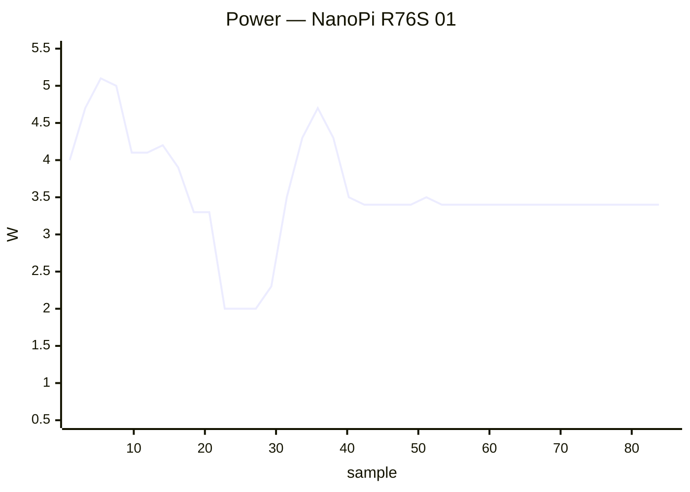
```mermaid
xychart-beta
    title "Power — NanoPi R76S 01"
    x-axis "sample" 1 --> 86
    y-axis "W" 0.5 --> 5.5
    line [4.0, 4.7, 5.1, 5.0, 4.1, 4.1, 4.2, 3.9, 3.3, 3.3, 2.0, 2.0, 2.0, 2.3, 3.5, 4.3, 4.7, 4.3, 3.5, 3.4, 3.4, 3.4, 3.4, 3.5, 3.4, 3.4, 3.4, 3.4, 3.4, 3.4, 3.4, 3.4, 3.4, 3.4, 3.4, 3.4, 3.4, 3.4, 3.4, 3.8]
```

### ❌ Odroid N2 01

`odroidn2` · **inplace** · image `26.11.0-trunk.110` · 0 ✅ · 1 ❌ · 15 ⏭️

| Module | Status | Time | Detail |
|:--|:--:|--:|:--|
| upgrade | ⏭️ | 72 s | — |
| reboot | ❌ | 221 s | power-cycle |
| kernel-switch | ⏭️ | — | skipped=board down after reboot/power-cycle |
| reboot | ⏭️ | — | reboot |
| hw-perf | ⏭️ | — | board down after reboot/power-cycle |
| dvfs | ⏭️ | — | — |
| net-iperf | ⏭️ | — | board down after reboot/power-cycle |
| store-versions | ⏭️ | — | — |
| kernel-switch | ⏭️ | — | skipped=board down after reboot/power-cycle |
| reboot | ⏭️ | — | reboot |
| hw-perf | ⏭️ | — | board down after reboot/power-cycle |
| dvfs | ⏭️ | — | — |
| net-iperf | ⏭️ | — | board down after reboot/power-cycle |
| store-versions | ⏭️ | — | — |
| kernel-switch | ⏭️ | — | skipped=board down after reboot/power-cycle |
| reboot | ⏭️ | — | reboot |

**Power** — min 1.0 W · avg 3.1 W · peak 4.7 W · 233 samples

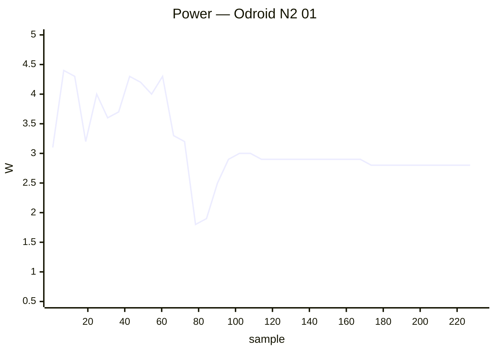
```mermaid
xychart-beta
    title "Power — Odroid N2 01"
    x-axis "sample" 1 --> 233
    y-axis "W" 0.5 --> 5.0
    line [3.1, 4.4, 4.3, 3.2, 4.0, 3.6, 3.7, 4.3, 4.2, 4.0, 4.3, 3.3, 3.2, 1.8, 1.9, 2.5, 2.9, 3.0, 3.0, 2.9, 2.9, 2.9, 2.9, 2.9, 2.9, 2.9, 2.9, 2.9, 2.9, 2.8, 2.8, 2.8, 2.8, 2.8, 2.8, 2.8, 2.8, 2.8, 2.8, 2.8]
```

### ❌ Odroid XU4 01

`odroidxu4` · **inplace** · image `26.11.0-trunk.99` · 0 ✅ · 1 ❌ · 15 ⏭️

| Module | Status | Time | Detail |
|:--|:--:|--:|:--|
| upgrade | ⏭️ | 1 s | — |
| reboot | ❌ | 263 s | power-cycle |
| kernel-switch | ⏭️ | — | skipped=board down after reboot/power-cycle |
| reboot | ⏭️ | — | reboot |
| hw-perf | ⏭️ | — | board down after reboot/power-cycle |
| dvfs | ⏭️ | — | — |
| net-iperf | ⏭️ | — | board down after reboot/power-cycle |
| store-versions | ⏭️ | — | — |
| kernel-switch | ⏭️ | — | skipped=board down after reboot/power-cycle |
| reboot | ⏭️ | — | reboot |
| hw-perf | ⏭️ | — | board down after reboot/power-cycle |
| dvfs | ⏭️ | — | — |
| net-iperf | ⏭️ | — | board down after reboot/power-cycle |
| store-versions | ⏭️ | — | — |
| kernel-switch | ⏭️ | — | skipped=board down after reboot/power-cycle |
| reboot | ⏭️ | — | reboot |

### ❌ Orange Pi PC + 01

`orangepipcplus` · **inplace** · image `26.11.0-trunk.128` · 0 ✅ · 1 ❌ · 15 ⏭️

| Module | Status | Time | Detail |
|:--|:--:|--:|:--|
| upgrade | ⏭️ | 66 s | — |
| reboot | ❌ | 199 s | warm |
| kernel-switch | ⏭️ | — | skipped=board down after reboot/power-cycle |
| reboot | ⏭️ | — | reboot |
| hw-perf | ⏭️ | — | board down after reboot/power-cycle |
| dvfs | ⏭️ | — | — |
| net-iperf | ⏭️ | — | board down after reboot/power-cycle |
| store-versions | ⏭️ | — | — |
| kernel-switch | ⏭️ | — | skipped=board down after reboot/power-cycle |
| reboot | ⏭️ | — | reboot |
| hw-perf | ⏭️ | — | board down after reboot/power-cycle |
| dvfs | ⏭️ | — | — |
| net-iperf | ⏭️ | — | board down after reboot/power-cycle |
| store-versions | ⏭️ | — | — |
| kernel-switch | ⏭️ | — | skipped=board down after reboot/power-cycle |
| reboot | ⏭️ | — | reboot |

### ❌ Orange Pi Prime 01

`orangepiprime` · **inplace** · image `26.11.0-trunk` · 8 ✅ · 1 ❌ · 7 ⏭️

| Module | Status | Time | Detail |
|:--|:--:|--:|:--|
| upgrade | ✅ | 373 s | nightly · 26.11.0-trunk → 26.11.0-trunk.128 |
| reboot | ✅ | 72 s | power-cycle · up 35 s |
| kernel-switch | ✅ | 63 s | branch=current · family=sunxi64 · installed=26.11.0-trunk.128 · boot_image=/boot/vmlinuz-6.18.62-current-sunxi64 · kernel_before=6.18.62-current-sunxi64 |
| reboot | ✅ | 111 s | power-cycle · 2/2 boots · up 33 s |
| hw-performance | ✅ | 39 s | AES 375 · mem 2100 · disk W 1 / R 23 MB/s · 40.8 °C · None MHz |
| dvfs | ➖ | 3 s | no cpufreq |
| network-iperf | ✅ | 73 s | end0 ↑890/↓743 (1GE) · wlan0 ↑25/↓23 (Wi-Fi 4) Mbps |
| store-versions | ✅ | 6 s | 26.11.0-trunk.128 · 6.18.62-current-sunxi64 |
| kernel-switch | ✅ | 174 s | branch=edge · family=sunxi64 · installed=26.11.0-trunk.128 · boot_image=/boot/vmlinuz-7.3.3-edge-sunxi64 · kernel_before=6.18.62-current-sunxi64 |
| reboot | ❌ | 646 s | power-cycle · 0/2 boots |
| hw-perf | ⏭️ | — | board down after reboot/power-cycle |
| dvfs | ⏭️ | — | — |
| net-iperf | ⏭️ | — | board down after reboot/power-cycle |
| store-versions | ⏭️ | — | — |
| kernel-switch | ⏭️ | — | skipped=board down after reboot/power-cycle |
| reboot | ⏭️ | — | reboot |

### ❌ Orange Pi+ 2E 02

`orangepiplus2e` · **inplace** · image `26.11.0-trunk.133` · 1 ✅ · 1 ❌ · 14 ⏭️

| Module | Status | Time | Detail |
|:--|:--:|--:|:--|
| upgrade | ✅ | 94 s | nightly · 26.11.0-trunk.134 → 26.11.0-trunk.134 |
| reboot | ❌ | 221 s | power-cycle |
| kernel-switch | ⏭️ | — | skipped=board down after reboot/power-cycle |
| reboot | ⏭️ | — | reboot |
| hw-perf | ⏭️ | — | board down after reboot/power-cycle |
| dvfs | ⏭️ | — | — |
| net-iperf | ⏭️ | — | board down after reboot/power-cycle |
| store-versions | ⏭️ | — | — |
| kernel-switch | ⏭️ | — | skipped=board down after reboot/power-cycle |
| reboot | ⏭️ | — | reboot |
| hw-perf | ⏭️ | — | board down after reboot/power-cycle |
| dvfs | ⏭️ | — | — |
| net-iperf | ⏭️ | — | board down after reboot/power-cycle |
| store-versions | ⏭️ | — | — |
| kernel-switch | ⏭️ | — | skipped=board down after reboot/power-cycle |
| reboot | ⏭️ | — | reboot |

### ❌ R58HD 01

`mekotronics-r58hd` · **inplace** · image `26.11.0-trunk.133` · 1 ✅ · 1 ❌ · 4 ⏭️

| Module | Status | Time | Detail |
|:--|:--:|--:|:--|
| upgrade | ✅ | 24 s | nightly · 26.11.0-trunk.134 → 26.11.0-trunk.134 |
| reboot | ❌ | 132 s | power-cycle · up 101 s |
| hw-perf | ⏭️ | — | board down after reboot/power-cycle |
| dvfs | ⏭️ | — | — |
| net-iperf | ⏭️ | — | board down after reboot/power-cycle |
| store-versions | ⏭️ | — | — |

**Power** — min 3.4 W · avg 4.7 W · peak 6.1 W · 125 samples

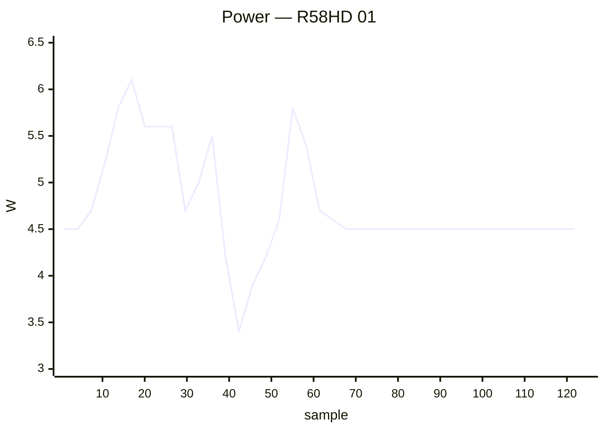
```mermaid
xychart-beta
    title "Power — R58HD 01"
    x-axis "sample" 1 --> 125
    y-axis "W" 3.0 --> 6.5
    line [4.5, 4.5, 4.7, 5.2, 5.8, 6.1, 5.6, 5.6, 5.6, 4.7, 5.0, 5.5, 4.2, 3.4, 3.9, 4.2, 4.6, 5.8, 5.4, 4.7, 4.6, 4.5, 4.5, 4.5, 4.5, 4.5, 4.5, 4.5, 4.5, 4.5, 4.5, 4.5, 4.5, 4.5, 4.5, 4.5, 4.5, 4.5, 4.5, 4.5]
```

### ❌ Raspberry Pi 5B

`rpi4b` · **inplace** · image `26.11.0-trunk.118` · 1 ✅ · 1 ❌ · 14 ⏭️

| Module | Status | Time | Detail |
|:--|:--:|--:|:--|
| upgrade | ✅ | 22 s | nightly · 26.11.0-trunk.128 → 26.11.0-trunk.128 |
| reboot | ❌ | 214 s | power-cycle |
| kernel-switch | ⏭️ | — | skipped=board down after reboot/power-cycle |
| reboot | ⏭️ | — | reboot |
| hw-perf | ⏭️ | — | board down after reboot/power-cycle |
| dvfs | ⏭️ | — | — |
| net-iperf | ⏭️ | — | board down after reboot/power-cycle |
| store-versions | ⏭️ | — | — |
| kernel-switch | ⏭️ | — | skipped=board down after reboot/power-cycle |
| reboot | ⏭️ | — | reboot |
| hw-perf | ⏭️ | — | board down after reboot/power-cycle |
| dvfs | ⏭️ | — | — |
| net-iperf | ⏭️ | — | board down after reboot/power-cycle |
| store-versions | ⏭️ | — | — |
| kernel-switch | ⏭️ | — | skipped=board down after reboot/power-cycle |
| reboot | ⏭️ | — | reboot |

**Power** — min 3.4 W · avg 4.3 W · peak 6.6 W · 184 samples

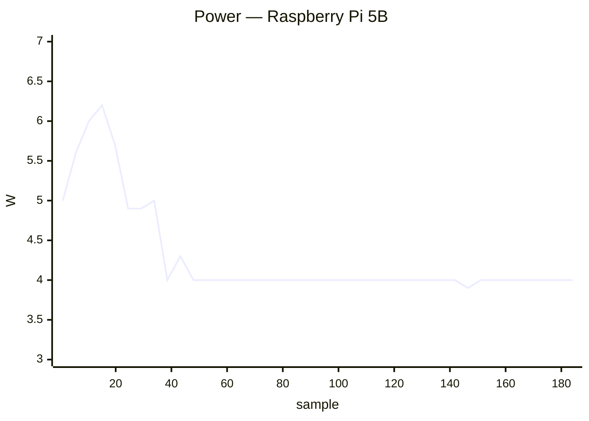
```mermaid
xychart-beta
    title "Power — Raspberry Pi 5B"
    x-axis "sample" 1 --> 184
    y-axis "W" 3.0 --> 7.0
    line [5.0, 5.6, 6.0, 6.2, 5.7, 4.9, 4.9, 5.0, 4.0, 4.3, 4.0, 4.0, 4.0, 4.0, 4.0, 4.0, 4.0, 4.0, 4.0, 4.0, 4.0, 4.0, 4.0, 4.0, 4.0, 4.0, 4.0, 4.0, 4.0, 4.0, 4.0, 3.9, 4.0, 4.0, 4.0, 4.0, 4.0, 4.0, 4.0, 4.0]
```

### ❌ Rock 5B+ 01

`rock-5b-plus` · **inplace** · image `26.11.0-trunk.108` · 20 ✅ · 1 ❌ · 1 ⏭️

| Module | Status | Time | Detail |
|:--|:--:|--:|:--|
| upgrade | ⏭️ | 31 s | — |
| reboot | ✅ | 169 s | power-cycle · up 54 s |
| kernel-switch | ✅ | 133 s | branch=vendor · family=rk35xx · installed=26.11.0-trunk.128 · boot_image=/boot/vmlinuz-6.1.172-vendor-rk35xx · kernel_before=6.1.172-vendor-rk35xx |
| reboot | ✅ | 115 s | power-cycle · 2/2 boots · up 25 s |
| hw-performance | ✅ | 18 s | AES 1296 · mem 13700 · disk W 24 / R 80 MB/s · 52.7 °C · 1800 MHz |
| dvfs | ✅ | 16 s | ondemand · 1800–1800 MHz (peak 2304) |
| network-iperf | ✅ | 92 s | enP4p65s0 ↑2343/↓2345 (2.5GE) Mbps |
| store-versions | ✅ | 4 s | 26.11.0-trunk.108 · 6.1.172-vendor-rk35xx |
| kernel-switch | ✅ | 130 s | branch=current · family=rockchip64 · installed=26.11.0-trunk.128 · boot_image=/boot/vmlinuz-6.18.62-current-rockchip64 · kernel_before=6.1.172-vendor-rk35xx |
| reboot | ✅ | 113 s | power-cycle · 2/2 boots · up 55 s |
| hw-performance | ✅ | 19 s | AES 1281 · mem 10100 · disk W 37 / R 72 MB/s · 54.5 °C · 1800 MHz |
| dvfs | ✅ | 15 s | ondemand · 408–1800 MHz (peak 2400) |
| network-iperf | ✅ | 30 s | enP4p65s0 ↑2350/↓2354 (2.5GE) Mbps |
| store-versions | ✅ | 4 s | 26.11.0-trunk.108 · 6.18.62-current-rockchip64 |
| kernel-switch | ❌ | 87 s | branch=edge · phase=install · dpkg_state=absent |
| reboot | ✅ | 153 s | power-cycle · 2/2 boots · up 53 s |
| hw-performance | ✅ | 53 s | AES 1293 · mem 6800 · disk W 21 / R 71 MB/s · None °C · 1800 MHz |
| dvfs | ✅ | 16 s | ondemand · 408–1800 MHz (peak 2400) |
| network-iperf | ✅ | 29 s | end0 ↑2353/↓2354 Mbps |
| store-versions | ✅ | 4 s | 26.11.0-trunk.108 · 7.3.3-edge-rockchip64 |
| kernel-switch | ✅ | 63 s | branch=vendor · family=rk35xx · installed=26.11.0-trunk.128 · boot_image=/boot/vmlinuz-6.1.172-vendor-rk35xx · kernel_before=7.3.3-edge-rockchip64 |
| reboot | ✅ | 90 s | power-cycle · up 54 s |

**Power** — min 0.6 W · avg 4.8 W · peak 12.3 W · 823 samples

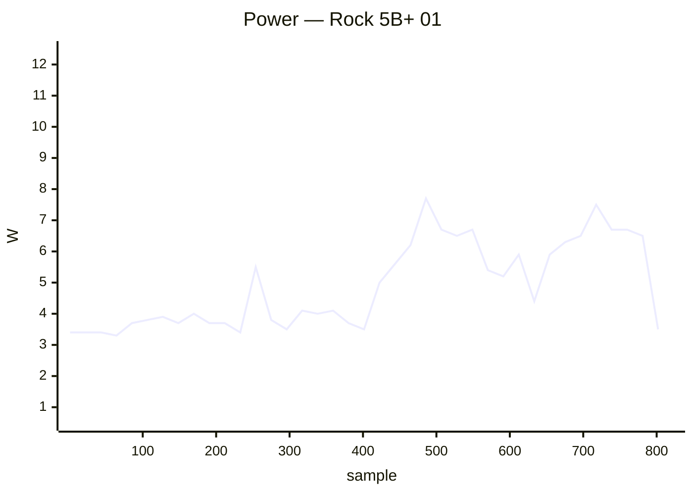
```mermaid
xychart-beta
    title "Power — Rock 5B+ 01"
    x-axis "sample" 1 --> 823
    y-axis "W" 0.5 --> 12.5
    line [3.4, 3.4, 3.4, 3.3, 3.7, 3.8, 3.9, 3.7, 4.0, 3.7, 3.7, 3.4, 5.5, 3.8, 3.5, 4.1, 4.0, 4.1, 3.7, 3.5, 5.0, 5.6, 6.2, 7.7, 6.7, 6.5, 6.7, 5.4, 5.2, 5.9, 4.4, 5.9, 6.3, 6.5, 7.5, 6.7, 6.7, 6.5, 3.5, 3.5]
```

### ❌ Rockpi 4B 01

`rockpi-4b` · **inplace** · image `26.11.0-trunk.110` · 0 ✅ · 1 ❌ · 15 ⏭️

| Module | Status | Time | Detail |
|:--|:--:|--:|:--|
| upgrade | ⏭️ | 70 s | — |
| reboot | ❌ | 226 s | power-cycle |
| kernel-switch | ⏭️ | — | skipped=board down after reboot/power-cycle |
| reboot | ⏭️ | — | reboot |
| hw-perf | ⏭️ | — | board down after reboot/power-cycle |
| dvfs | ⏭️ | — | — |
| net-iperf | ⏭️ | — | board down after reboot/power-cycle |
| store-versions | ⏭️ | — | — |
| kernel-switch | ⏭️ | — | skipped=board down after reboot/power-cycle |
| reboot | ⏭️ | — | reboot |
| hw-perf | ⏭️ | — | board down after reboot/power-cycle |
| dvfs | ⏭️ | — | — |
| net-iperf | ⏭️ | — | board down after reboot/power-cycle |
| store-versions | ⏭️ | — | — |
| kernel-switch | ⏭️ | — | skipped=board down after reboot/power-cycle |
| reboot | ⏭️ | — | reboot |

**Power** — min 2.7 W · avg 3.5 W · peak 8.2 W · 200 samples

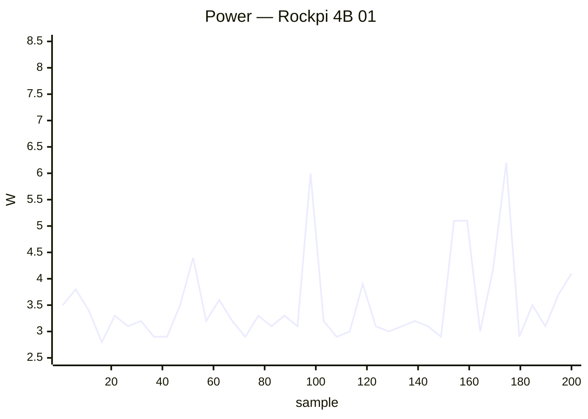
```mermaid
xychart-beta
    title "Power — Rockpi 4B 01"
    x-axis "sample" 1 --> 200
    y-axis "W" 2.5 --> 8.5
    line [3.5, 3.8, 3.4, 2.8, 3.3, 3.1, 3.2, 2.9, 2.9, 3.5, 4.4, 3.2, 3.6, 3.2, 2.9, 3.3, 3.1, 3.3, 3.1, 6.0, 3.2, 2.9, 3.0, 3.9, 3.1, 3.0, 3.1, 3.2, 3.1, 2.9, 5.1, 5.1, 3.0, 4.2, 6.2, 2.9, 3.5, 3.1, 3.7, 4.1]
```

### ❌ Tinker Board 2 01

`tinkerboard-2` · **inplace** · image `26.11.0-trunk.133` · 11 ✅ · 3 ❌ · 2 ⏭️

| Module | Status | Time | Detail |
|:--|:--:|--:|:--|
| upgrade | ✅ | 48 s | nightly · 26.11.0-trunk.134 → 26.11.0-trunk.134 |
| reboot | ✅ | 63 s | power-cycle · up 24 s |
| kernel-switch | ✅ | 141 s | branch=current · family=rockchip64 · installed=26.11.0-trunk.134 · boot_image=/boot/vmlinuz-6.18.63-current-rockchip64 · kernel_before=7.3.4-edge-rockchip64 |
| reboot | ✅ | 94 s | power-cycle · 2/2 boots · up 26 s |
| hw-performance | ✅ | 30 s | AES 680 · mem 4500 · disk W 21 / R 1 MB/s · 45.6 °C · 1416 MHz |
| dvfs | ✅ | 22 s | ondemand · 408–1416 MHz (peak 1416) |
| network-iperf | ✅ | 118 s | end0 ↑940/↓941 (1GE) Mbps |
| store-versions | ✅ | 4 s | 26.11.0-trunk.134 · 6.18.63-current-rockchip64 |
| kernel-switch | ❌ | 13 s | branch=edge · phase=install · dpkg_state=absent |
| reboot | ✅ | 300 s | power-cycle · 1/2 boots · up 27 s |
| hw-performance | ✅ | 29 s | AES 679 · mem 4500 · disk W 21 / R 22 MB/s · 45.6 °C · 1416 MHz |
| dvfs | ➖ | 222 s | ondemand · 408–1416 MHz · no freq read under load |
| network-iperf | ⏭️ | 91 s | no iperf3 on board |
| store-versions | ❌ | 61 s | — |
| kernel-switch | ❌ | 121 s | branch=current · phase=install · dpkg_state=absent |
| reboot | ✅ | 198 s | power-cycle · up 24 s |

**Power** — min 0.8 W · avg 4.9 W · peak 8.0 W · 1246 samples

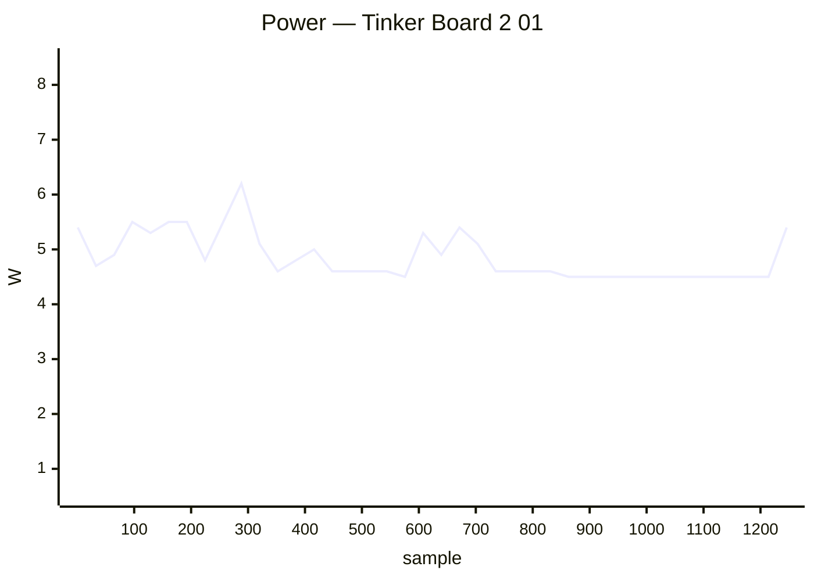
```mermaid
xychart-beta
    title "Power — Tinker Board 2 01"
    x-axis "sample" 1 --> 1246
    y-axis "W" 0.5 --> 8.5
    line [5.4, 4.7, 4.9, 5.5, 5.3, 5.5, 5.5, 4.8, 5.5, 6.2, 5.1, 4.6, 4.8, 5.0, 4.6, 4.6, 4.6, 4.6, 4.5, 5.3, 4.9, 5.4, 5.1, 4.6, 4.6, 4.6, 4.6, 4.5, 4.5, 4.5, 4.5, 4.5, 4.5, 4.5, 4.5, 4.5, 4.5, 4.5, 4.5, 5.4]
```

### ❌ UEFI/DT arm64 01

`jetson-nano` · **inplace** · image `26.11.0-trunk` · 0 ✅ · 1 ❌ · 0 ⏭️

| Module | Status | Time | Detail |
|:--|:--:|--:|:--|
| reachable | ❌ | — | ip=10.0.50.69 · reachable=False · port=22 |

### ❌ VIM3 01

`khadas-vim3` · **inplace** · image `26.11.0-trunk.133` · 1 ✅ · 1 ❌ · 14 ⏭️

| Module | Status | Time | Detail |
|:--|:--:|--:|:--|
| upgrade | ✅ | 33 s | nightly · 26.11.0-trunk.134 → 26.11.0-trunk.134 |
| reboot | ❌ | 199 s | warm |
| kernel-switch | ⏭️ | — | skipped=board down after reboot/power-cycle |
| reboot | ⏭️ | — | reboot |
| hw-perf | ⏭️ | — | board down after reboot/power-cycle |
| dvfs | ⏭️ | — | — |
| net-iperf | ⏭️ | — | board down after reboot/power-cycle |
| store-versions | ⏭️ | — | — |
| kernel-switch | ⏭️ | — | skipped=board down after reboot/power-cycle |
| reboot | ⏭️ | — | reboot |
| hw-perf | ⏭️ | — | board down after reboot/power-cycle |
| dvfs | ⏭️ | — | — |
| net-iperf | ⏭️ | — | board down after reboot/power-cycle |
| store-versions | ⏭️ | — | — |
| kernel-switch | ⏭️ | — | skipped=board down after reboot/power-cycle |
| reboot | ⏭️ | — | reboot |

### ❌ ZERO 3 01

`radxa-zero3` · **inplace** · image `26.5.1` · 2 ✅ · 1 ❌ · 19 ⏭️

| Module | Status | Time | Detail |
|:--|:--:|--:|:--|
| upgrade | ⏭️ | 35 s | — |
| reboot | ✅ | 62 s | warm · up 45 s |
| kernel-switch | ✅ | 502 s | branch=vendor · family=rk35xx · installed=26.8.3 · boot_image=/boot/vmlinuz-6.1.115-vendor-rk35xx · kernel_before=6.18.44-current-rockchip64 |
| reboot | ❌ | 218 s | warm · 0/2 boots |
| hw-perf | ⏭️ | — | board down after reboot/power-cycle |
| dvfs | ⏭️ | — | — |
| net-iperf | ⏭️ | — | board down after reboot/power-cycle |
| store-versions | ⏭️ | — | — |
| kernel-switch | ⏭️ | — | skipped=board down after reboot/power-cycle |
| reboot | ⏭️ | — | reboot |
| hw-perf | ⏭️ | — | board down after reboot/power-cycle |
| dvfs | ⏭️ | — | — |
| net-iperf | ⏭️ | — | board down after reboot/power-cycle |
| store-versions | ⏭️ | — | — |
| kernel-switch | ⏭️ | — | skipped=board down after reboot/power-cycle |
| reboot | ⏭️ | — | reboot |
| hw-perf | ⏭️ | — | board down after reboot/power-cycle |
| dvfs | ⏭️ | — | — |
| net-iperf | ⏭️ | — | board down after reboot/power-cycle |
| store-versions | ⏭️ | — | — |
| kernel-switch | ⏭️ | — | skipped=board down after reboot/power-cycle |
| reboot | ⏭️ | — | reboot |

## ✅ Passed (67)

### ✅ A64 OLinuXino 01

`lime-a64` · **inplace** · image `26.11.0-trunk.133` · 16 ✅ · 0 ❌ · 0 ⏭️

| Module | Status | Time | Detail |
|:--|:--:|--:|:--|
| upgrade | ✅ | 97 s | nightly · 26.11.0-trunk.134 → 26.11.0-trunk.134 |
| reboot | ✅ | 63 s | power-cycle · up 30 s |
| kernel-switch | ✅ | 61 s | branch=current · family=sunxi64 · installed=26.11.0-trunk.134 · boot_image=/boot/vmlinuz-6.18.63-current-sunxi64 · kernel_before=6.18.63-current-sunxi64 |
| reboot | ✅ | 96 s | power-cycle · 2/2 boots · up 27 s |
| hw-performance | ✅ | 33 s | AES 470 · mem 2600 · disk W 11 / R 70 MB/s · 47.8 °C · 1152 MHz |
| dvfs | ✅ | 24 s | performance · 648–1008 MHz (peak 1008) |
| network-iperf | ✅ | 70 s | end0 ↑921/↓849 (1GE) Mbps |
| store-versions | ✅ | 5 s | 26.11.0-trunk.134 · 6.18.63-current-sunxi64 |
| kernel-switch | ✅ | 306 s | branch=edge · family=sunxi64 · installed=26.11.0-trunk.134 · boot_image=/boot/vmlinuz-7.3.4-edge-sunxi64 · kernel_before=6.18.63-current-sunxi64 |
| reboot | ✅ | 93 s | power-cycle · 2/2 boots · up 27 s |
| hw-performance | ✅ | 32 s | AES 469 · mem 2600 · disk W 11 / R 69 MB/s · 49.5 °C · 1152 MHz |
| dvfs | ✅ | 25 s | performance · 648–1008 MHz (peak 1008) |
| network-iperf | ✅ | 63 s | end0 ↑922/↓900 (1GE) Mbps |
| store-versions | ✅ | 5 s | 26.11.0-trunk.134 · 7.3.4-edge-sunxi64 |
| kernel-switch | ✅ | 284 s | branch=current · family=sunxi64 · installed=26.11.0-trunk.134 · boot_image=/boot/vmlinuz-6.18.63-current-sunxi64 · kernel_before=7.3.4-edge-sunxi64 |
| reboot | ✅ | 60 s | power-cycle · up 26 s |

### ✅ Banana Pi CM4IO 01

`bananapicm4io` · **inplace** · image `26.11.0-trunk.133` · 16 ✅ · 0 ❌ · 0 ⏭️

| Module | Status | Time | Detail |
|:--|:--:|--:|:--|
| upgrade | ✅ | 35 s | nightly · 26.11.0-trunk.134 → 26.11.0-trunk.134 |
| reboot | ✅ | 68 s | power-cycle · up 28 s |
| kernel-switch | ✅ | 25 s | branch=current · family=meson64 · installed=26.11.0-trunk.134 · boot_image=/boot/vmlinuz-6.18.63-current-meson64 · kernel_before=6.18.63-current-meson64 |
| reboot | ✅ | 96 s | power-cycle · 2/2 boots · up 28 s |
| hw-performance | ✅ | 33 s | AES 1364 · mem 6000 · disk W 8 / R 22 MB/s · 66.2 °C · 2016 MHz |
| dvfs | ✅ | 16 s | performance · 1000–2016 MHz (peak 2400) |
| network-iperf | ✅ | 258 s | end0 ↑937/↓941 (1GE) · wlan0 ↑42/↓21 (Wi-Fi 5) Mbps |
| store-versions | ✅ | 4 s | 26.11.0-trunk.134 · 6.18.63-current-meson64 |
| kernel-switch | ✅ | 125 s | branch=edge · family=meson64 · installed=26.11.0-trunk.134 · boot_image=/boot/vmlinuz-7.3.4-edge-meson64 · kernel_before=6.18.63-current-meson64 |
| reboot | ✅ | 83 s | power-cycle · 2/2 boots · up 24 s |
| hw-performance | ✅ | 33 s | AES 1365 · mem 6200 · disk W 8 / R 22 MB/s · 68.6 °C · 2016 MHz |
| dvfs | ✅ | 17 s | performance · 1000–2016 MHz (peak 2400) |
| network-iperf | ✅ | 78 s | end0 ↑938/↓941 (1GE) · wlan0 ↑43/↓36 (Wi-Fi 5) Mbps |
| store-versions | ✅ | 3 s | 26.11.0-trunk.134 · 7.3.4-edge-meson64 |
| kernel-switch | ✅ | 125 s | branch=current · family=meson64 · installed=26.11.0-trunk.134 · boot_image=/boot/vmlinuz-6.18.63-current-meson64 · kernel_before=7.3.4-edge-meson64 |
| reboot | ✅ | 59 s | power-cycle · up 25 s |

**Power** — min 2.0 W · avg 5.0 W · peak 11.1 W · 844 samples

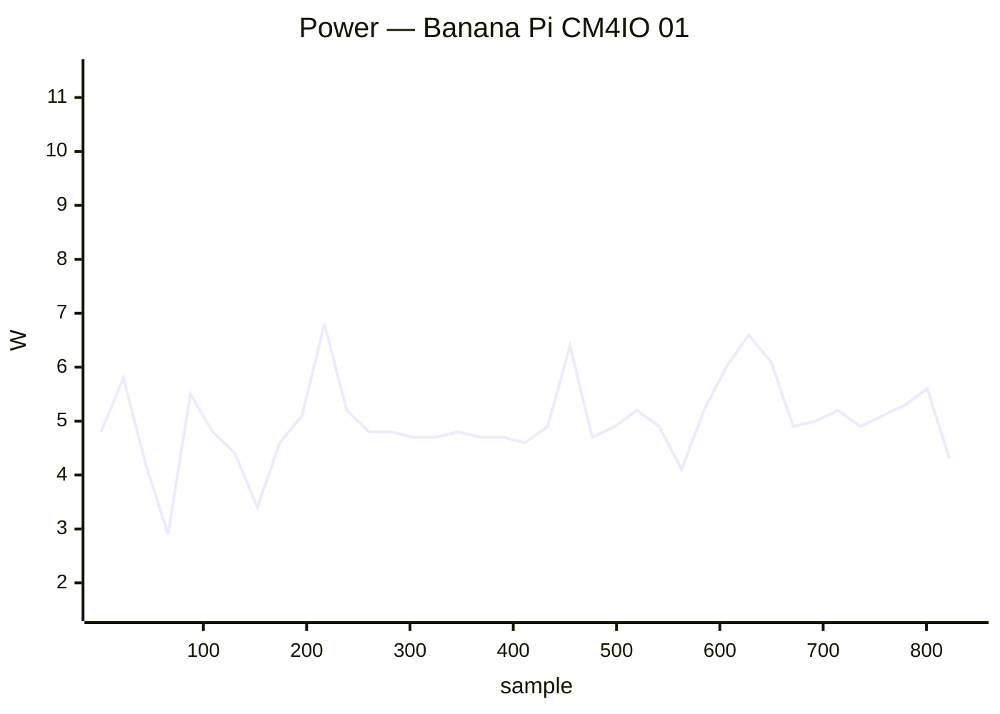
```mermaid
xychart-beta
    title "Power — Banana Pi CM4IO 01"
    x-axis "sample" 1 --> 844
    y-axis "W" 1.5 --> 11.5
    line [4.8, 5.8, 4.2, 2.9, 5.5, 4.8, 4.4, 3.4, 4.6, 5.1, 6.8, 5.2, 4.8, 4.8, 4.7, 4.7, 4.8, 4.7, 4.7, 4.6, 4.9, 6.4, 4.7, 4.9, 5.2, 4.9, 4.1, 5.2, 6.0, 6.6, 6.1, 4.9, 5.0, 5.2, 4.9, 5.1, 5.3, 5.6, 4.3, 4.4]
```

### ✅ Banana Pi M2 Ultra 01

`bananapim2ultra` · **inplace** · image `26.11.0-trunk.133` · 16 ✅ · 0 ❌ · 0 ⏭️

| Module | Status | Time | Detail |
|:--|:--:|--:|:--|
| upgrade | ✅ | 107 s | nightly · 26.11.0-trunk.134 → 26.11.0-trunk.134 |
| reboot | ✅ | 41 s | warm · up 23 s |
| kernel-switch | ✅ | 70 s | branch=current · family=sunxi · installed=26.11.0-trunk.134 · boot_image=/boot/vmlinuz-6.18.63-current-sunxi · kernel_before=6.18.63-current-sunxi |
| reboot | ✅ | 80 s | warm · 2/2 boots · up 25 s |
| hw-performance | ✅ | 33 s | AES 23 · mem 2000 · disk W 1 / R 42 MB/s · 57.1 °C · 1200 MHz |
| dvfs | ✅ | 25 s | ondemand · 720–1200 MHz (peak 1200) |
| network-iperf | ✅ | 276 s | end0 ↑818/↓939 (1GE) · wlan0 ↑26/↓35 (Wi-Fi 4) Mbps |
| store-versions | ✅ | 6 s | 26.11.0-trunk.134 · 6.18.63-current-sunxi |
| kernel-switch | ✅ | 186 s | branch=edge · family=sunxi · installed=26.11.0-trunk.134 · boot_image=/boot/vmlinuz-7.3.4-edge-sunxi · kernel_before=6.18.63-current-sunxi |
| reboot | ✅ | 81 s | warm · 2/2 boots · up 26 s |
| hw-performance | ✅ | 35 s | AES 23 · mem 2100 · disk W 1 / R 42 MB/s · 57.4 °C · 1200 MHz |
| dvfs | ✅ | 29 s | ondemand · 720–1200 MHz (peak 1200) |
| network-iperf | ✅ | 68 s | end0 ↑816/↓941 (1GE) · wlan0 ↑26/↓28 (Wi-Fi 4) Mbps |
| store-versions | ✅ | 6 s | 26.11.0-trunk.134 · 7.3.4-edge-sunxi |
| kernel-switch | ✅ | 189 s | branch=current · family=sunxi · installed=26.11.0-trunk.134 · boot_image=/boot/vmlinuz-6.18.63-current-sunxi · kernel_before=7.3.4-edge-sunxi |
| reboot | ✅ | 42 s | warm · up 25 s |

### ✅ Banana Pi M2Pro 01

`bananapim2pro` · **inplace** · image `26.11.0-trunk.133` · 16 ✅ · 0 ❌ · 0 ⏭️

| Module | Status | Time | Detail |
|:--|:--:|--:|:--|
| upgrade | ✅ | 47 s | nightly · 26.11.0-trunk.134 → 26.11.0-trunk.134 |
| reboot | ✅ | 139 s | power-cycle · up 103 s |
| kernel-switch | ✅ | 30 s | branch=current · family=meson64 · installed=26.11.0-trunk.134 · boot_image=/boot/vmlinuz-6.18.63-current-meson64 · kernel_before=6.18.63-current-meson64 |
| reboot | ✅ | 248 s | power-cycle · 2/2 boots · up 104 s |
| hw-performance | ✅ | 19 s | AES 981 · mem 5300 · disk W 36 / R 158 MB/s · 53.4 °C · 2100 MHz |
| dvfs | ✅ | 18 s | ondemand · 1000–2100 MHz (peak 2100) |
| network-iperf | ✅ | 113 s | end0 ↑940/↓941 (1GE) Mbps |
| store-versions | ✅ | 4 s | 26.11.0-trunk.134 · 6.18.63-current-meson64 |
| kernel-switch | ✅ | 99 s | branch=edge · family=meson64 · installed=26.11.0-trunk.134 · boot_image=/boot/vmlinuz-7.3.4-edge-meson64 · kernel_before=6.18.63-current-meson64 |
| reboot | ✅ | 247 s | power-cycle · 2/2 boots · up 102 s |
| hw-performance | ✅ | 19 s | AES 980 · mem 5300 · disk W 39 / R 150 MB/s · 53.8 °C · 2100 MHz |
| dvfs | ✅ | 20 s | ondemand · 1000–2100 MHz (peak 2100) |
| network-iperf | ✅ | 60 s | end0 ↑940/↓941 (1GE) Mbps |
| store-versions | ✅ | 4 s | 26.11.0-trunk.134 · 7.3.4-edge-meson64 |
| kernel-switch | ✅ | 97 s | branch=current · family=meson64 · installed=26.11.0-trunk.134 · boot_image=/boot/vmlinuz-6.18.63-current-meson64 · kernel_before=7.3.4-edge-meson64 |
| reboot | ✅ | 138 s | power-cycle · up 102 s |

**Power** — min 1.5 W · avg 3.0 W · peak 5.2 W · 1035 samples

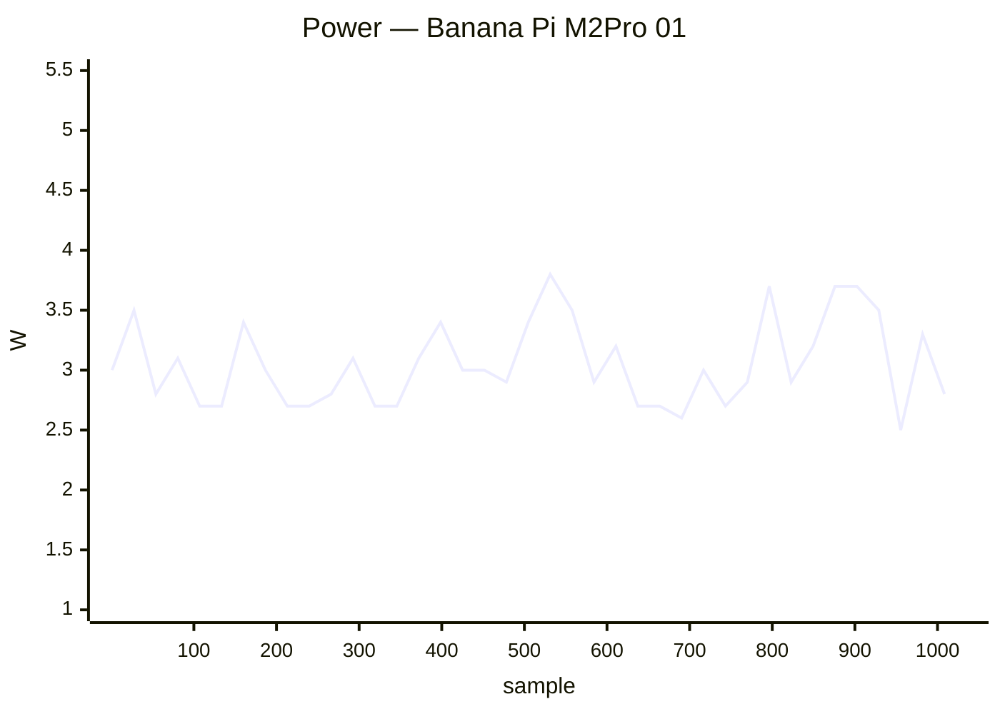
```mermaid
xychart-beta
    title "Power — Banana Pi M2Pro 01"
    x-axis "sample" 1 --> 1035
    y-axis "W" 1.0 --> 5.5
    line [3.0, 3.5, 2.8, 3.1, 2.7, 2.7, 3.4, 3.0, 2.7, 2.7, 2.8, 3.1, 2.7, 2.7, 3.1, 3.4, 3.0, 3.0, 2.9, 3.4, 3.8, 3.5, 2.9, 3.2, 2.7, 2.7, 2.6, 3.0, 2.7, 2.9, 3.7, 2.9, 3.2, 3.7, 3.7, 3.5, 2.5, 3.3, 2.8, 2.7]
```

### ✅ Banana Pi M5 01

`bananapim5` · **inplace** · image `26.11.0-trunk.133` · 16 ✅ · 0 ❌ · 0 ⏭️

| Module | Status | Time | Detail |
|:--|:--:|--:|:--|
| upgrade | ✅ | 63 s | nightly · 26.11.0-trunk.134 → 26.11.0-trunk.134 |
| reboot | ✅ | 165 s | warm · up 149 s |
| kernel-switch | ✅ | 46 s | branch=current · family=meson64 · installed=26.11.0-trunk.134 · boot_image=/boot/vmlinuz-6.18.63-current-meson64 · kernel_before=6.18.63-current-meson64 |
| reboot | ✅ | 319 s | warm · 2/2 boots · up 146 s |
| hw-performance | ✅ | 37 s | AES 980 · mem 5300 · disk W 9 / R 16 MB/s · 58.6 °C · 2100 MHz |
| dvfs | ✅ | 19 s | ondemand · 1000–2100 MHz (peak 2100) |
| network-iperf | ✅ | 111 s | end0 ↑941/↓941 (1GE) Mbps |
| store-versions | ✅ | 5 s | 26.11.0-trunk.134 · 6.18.63-current-meson64 |
| kernel-switch | ✅ | 171 s | branch=edge · family=meson64 · installed=26.11.0-trunk.134 · boot_image=/boot/vmlinuz-7.3.4-edge-meson64 · kernel_before=6.18.63-current-meson64 |
| reboot | ✅ | 104 s | warm · 2/2 boots · up 24 s |
| hw-performance | ✅ | 38 s | AES 980 · mem 5200 · disk W 10 / R 15 MB/s · 61 °C · 2100 MHz |
| dvfs | ✅ | 21 s | ondemand · 1000–2100 MHz (peak 2100) |
| network-iperf | ✅ | 189 s | end0 ↑941/↓941 (1GE) · wlx000f13960190 ↑1/↓11 (Wi-Fi 4) Mbps |
| store-versions | ✅ | 4 s | 26.11.0-trunk.134 · 7.3.4-edge-meson64 |
| kernel-switch | ✅ | 172 s | branch=current · family=meson64 · installed=26.11.0-trunk.134 · boot_image=/boot/vmlinuz-6.18.63-current-meson64 · kernel_before=7.3.4-edge-meson64 |
| reboot | ✅ | 131 s | warm · up 115 s |

### ✅ Banana Pi M7 01

`bananapim7` · **inplace** · image `26.11.0-trunk.133` · 22 ✅ · 0 ❌ · 0 ⏭️

| Module | Status | Time | Detail |
|:--|:--:|--:|:--|
| upgrade | ✅ | 28 s | nightly · 26.11.0-trunk.134 → 26.11.0-trunk.134 |
| reboot | ✅ | 131 s | power-cycle · up 101 s |
| kernel-switch | ✅ | 18 s | branch=vendor · family=rk35xx · installed=26.11.0-trunk.134 · boot_image=/boot/vmlinuz-6.1.172-vendor-rk35xx · kernel_before=6.1.172-vendor-rk35xx |
| reboot | ✅ | 235 s | power-cycle · 2/2 boots · up 101 s |
| hw-performance | ✅ | 13 s | AES 1253 · mem 13700 · disk W 926 / R 1303 MB/s · 66.5 °C · 1800 MHz |
| dvfs | ✅ | 17 s | ondemand · 1800–1800 MHz (peak 2256) |
| network-iperf | ✅ | 242 s | enP2p33s0 ↑2351/↓2303 (2.5GE) · enP4p65s0 ↑2350/↓2327 (2.5GE) Mbps |
| store-versions | ✅ | 4 s | 26.11.0-trunk.134 · 6.1.172-vendor-rk35xx |
| kernel-switch | ✅ | 57 s | branch=current · family=rockchip64 · installed=26.11.0-trunk.134 · boot_image=/boot/vmlinuz-6.18.63-current-rockchip64 · kernel_before=6.1.172-vendor-rk35xx |
| reboot | ✅ | 236 s | power-cycle · 2/2 boots · up 97 s |
| hw-performance | ✅ | 13 s | AES 1245 · mem 9700 · disk W 951 / R 1357 MB/s · 73 °C · 1800 MHz |
| dvfs | ✅ | 14 s | ondemand · 408–1800 MHz (peak 2400) |
| network-iperf | ✅ | 237 s | enP2p33s0 ↑2351/↓2354 (2.5GE) · enP4p65s0 ↑2297/↓2322 (2.5GE) Mbps |
| store-versions | ✅ | 4 s | 26.11.0-trunk.134 · 6.18.63-current-rockchip64 |
| kernel-switch | ✅ | 57 s | branch=edge · family=rockchip64 · installed=26.11.0-trunk.134 · boot_image=/boot/vmlinuz-7.3.4-edge-rockchip64 · kernel_before=6.18.63-current-rockchip64 |
| reboot | ✅ | 238 s | power-cycle · 2/2 boots · up 97 s |
| hw-performance | ✅ | 14 s | AES 1246 · mem 6100 · disk W 957 / R 1528 MB/s · 74.8 °C · 1800 MHz |
| dvfs | ✅ | 17 s | ondemand · 408–1800 MHz (peak 2400) |
| network-iperf | ✅ | 31 s | enP2p33s0 ↑2347/↓2350 (2.5GE) Mbps |
| store-versions | ✅ | 4 s | 26.11.0-trunk.134 · 7.3.4-edge-rockchip64 |
| kernel-switch | ✅ | 45 s | branch=vendor · family=rk35xx · installed=26.11.0-trunk.134 · boot_image=/boot/vmlinuz-6.1.172-vendor-rk35xx · kernel_before=7.3.4-edge-rockchip64 |
| reboot | ✅ | 136 s | power-cycle · up 100 s |

**Power** — min 0.6 W · avg 6.7 W · peak 15.3 W · 1088 samples

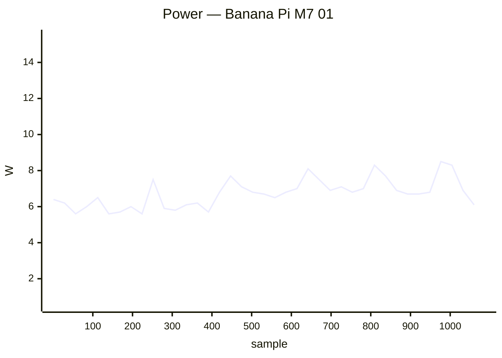
```mermaid
xychart-beta
    title "Power — Banana Pi M7 01"
    x-axis "sample" 1 --> 1088
    y-axis "W" 0.5 --> 15.5
    line [6.4, 6.2, 5.6, 6.0, 6.5, 5.6, 5.7, 6.0, 5.6, 7.5, 5.9, 5.8, 6.1, 6.2, 5.7, 6.8, 7.7, 7.1, 6.8, 6.7, 6.5, 6.8, 7.0, 8.1, 7.5, 6.9, 7.1, 6.8, 7.0, 8.3, 7.7, 6.9, 6.7, 6.7, 6.8, 8.5, 8.3, 6.9, 6.1, 5.9]
```

### ✅ Banana Pi R2 01

`bananapir2` · **inplace** · image `26.11.0-trunk.133` · 16 ✅ · 0 ❌ · 0 ⏭️

| Module | Status | Time | Detail |
|:--|:--:|--:|:--|
| upgrade | ✅ | 84 s | nightly · 26.11.0-trunk.134 → 26.11.0-trunk.134 |
| reboot | ✅ | 70 s | power-cycle · up 35 s |
| kernel-switch | ✅ | 53 s | branch=current · family=mt7623 · installed=26.11.0-trunk.134 · boot_image=/boot/vmlinuz-6.18.63-current-mt7623 · kernel_before=6.18.63-current-mt7623 |
| reboot | ✅ | 108 s | power-cycle · 2/2 boots · up 37 s |
| hw-performance | ✅ | 34 s | AES 25 · mem 1600 · disk W 1 / R 23 MB/s · 55.5 °C · 1300 MHz |
| dvfs | ✅ | 28 s | ondemand · 98–1300 MHz (peak 1300) |
| network-iperf | ✅ | 171 s | lan2 ↑938/↓934 Mbps |
| store-versions | ✅ | 6 s | 26.11.0-trunk.134 · 6.18.63-current-mt7623 |
| kernel-switch | ✅ | 134 s | branch=edge · family=mt7623 · installed=26.11.0-trunk.134 · boot_image=/boot/vmlinuz-7.2.15-edge-mt7623 · kernel_before=6.18.63-current-mt7623 |
| reboot | ✅ | 107 s | power-cycle · 2/2 boots · up 34 s |
| hw-performance | ✅ | 35 s | AES 25 · mem 1600 · disk W 20 / R 21 MB/s · 55.9 °C · 1300 MHz |
| dvfs | ✅ | 30 s | ondemand · 98–1300 MHz (peak 1300) |
| network-iperf | ✅ | 35 s | lan2 ↑933/↓925 Mbps |
| store-versions | ✅ | 6 s | 26.11.0-trunk.134 · 7.2.15-edge-mt7623 |
| kernel-switch | ✅ | 134 s | branch=current · family=mt7623 · installed=26.11.0-trunk.134 · boot_image=/boot/vmlinuz-6.18.63-current-mt7623 · kernel_before=7.2.15-edge-mt7623 |
| reboot | ✅ | 72 s | power-cycle · up 36 s |

**Power** — min 2.6 W · avg 5.2 W · peak 6.9 W · 876 samples

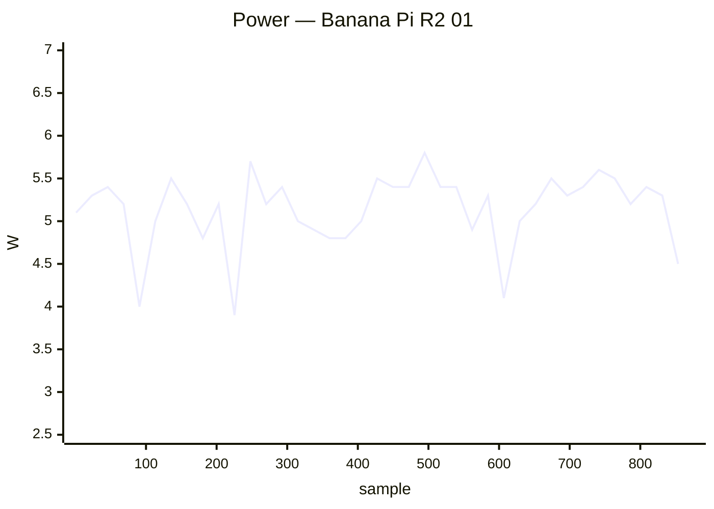
```mermaid
xychart-beta
    title "Power — Banana Pi R2 01"
    x-axis "sample" 1 --> 876
    y-axis "W" 2.5 --> 7.0
    line [5.1, 5.3, 5.4, 5.2, 4.0, 5.0, 5.5, 5.2, 4.8, 5.2, 3.9, 5.7, 5.2, 5.4, 5.0, 4.9, 4.8, 4.8, 5.0, 5.5, 5.4, 5.4, 5.8, 5.4, 5.4, 4.9, 5.3, 4.1, 5.0, 5.2, 5.5, 5.3, 5.4, 5.6, 5.5, 5.2, 5.4, 5.3, 4.5, 5.3]
```

### ✅ Banana Pi R3 Mini 01

`bananapir3mini` · **inplace** · image `26.11.0-trunk.133` · 7 ✅ · 0 ❌ · 1 ⏭️

| Module | Status | Time | Detail |
|:--|:--:|--:|:--|
| upgrade | ✅ | 51 s | nightly · 26.11.0-trunk.134 → 26.11.0-trunk.134 |
| reboot | ✅ | 70 s | power-cycle · up 35 s |
| kernel-switch | ✅ | 33 s | branch=current · family=filogic · installed=26.11.0-trunk.134 · boot_image=/boot/vmlinuz-6.18.63-current-filogic · kernel_before=6.18.63-current-filogic |
| reboot | ✅ | 109 s | power-cycle · 2/2 boots · up 36 s |
| hw-performance | ✅ | 15 s | AES 934 · mem 3200 · disk W 690 / R 660 MB/s · 62.1 °C · None MHz |
| dvfs | ➖ | 2 s | no cpufreq |
| network-iperf | ✅ | 344 s | eth0 ↑2353/↓2354 (2.5GE) · eth1 ↑2349/↓2256 (2.5GE) · wlan0 ↑48/↓53 (Wi-Fi 6) · wlan1 ↑454/↓239 (Wi-Fi 6) Mbps |
| store-versions | ✅ | 4 s | 26.11.0-trunk.134 · 6.18.63-current-filogic |

**Power** — min 0.9 W · avg 8.8 W · peak 13.0 W · 391 samples

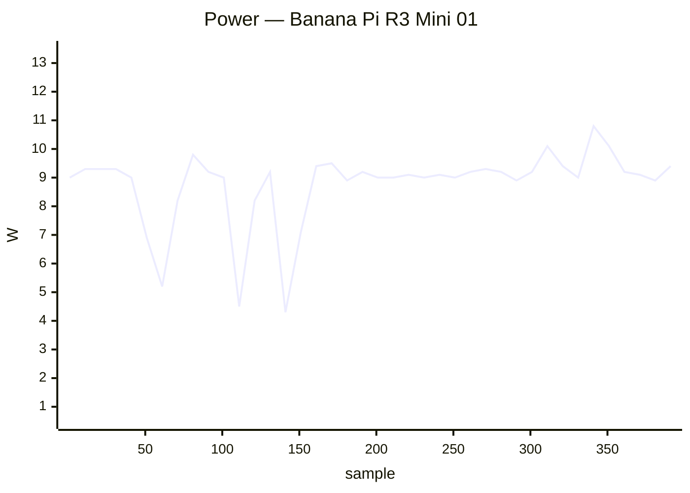
```mermaid
xychart-beta
    title "Power — Banana Pi R3 Mini 01"
    x-axis "sample" 1 --> 391
    y-axis "W" 0.5 --> 13.5
    line [9.0, 9.3, 9.3, 9.3, 9.0, 6.9, 5.2, 8.2, 9.8, 9.2, 9.0, 4.5, 8.2, 9.2, 4.3, 7.1, 9.4, 9.5, 8.9, 9.2, 9.0, 9.0, 9.1, 9.0, 9.1, 9.0, 9.2, 9.3, 9.2, 8.9, 9.2, 10.1, 9.4, 9.0, 10.8, 10.1, 9.2, 9.1, 8.9, 9.4]
```

### ✅ Banana Pi R4 01

`bananapir4` · **inplace** · image `26.11.0-trunk.108` · 8 ✅ · 0 ❌ · 0 ⏭️

| Module | Status | Time | Detail |
|:--|:--:|--:|:--|
| upgrade | ✅ | 159 s | nightly · 26.11.0-trunk.108 → 26.11.0-trunk.110 |
| reboot | ✅ | 62 s | power-cycle · up 34 s |
| kernel-switch | ✅ | 32 s | branch=current · family=filogic · installed=26.11.0-trunk.110 · boot_image=/boot/vmlinuz-6.12.108-current-filogic · kernel_before=6.12.108-current-filogic |
| reboot | ✅ | 84 s | power-cycle · 2/2 boots · up 23 s |
| hw-performance | ✅ | 26 s | AES 1024 · mem 6100 · disk W 20 / R 22 MB/s · 40.6 °C · 1800 MHz |
| dvfs | ✅ | 16 s | schedutil · 800–1800 MHz (peak 1800) |
| network-iperf | ✅ | 75 s | eth2 ↑7538/↓5285 (10GE) · lan2 ↑941/↓941 (1GE) Mbps |
| store-versions | ✅ | 4 s | 26.11.0-trunk.110 · 6.12.108-current-filogic |

### ✅ BananaPi BPI-M4-Zero 01

`bananapim4zero` · **inplace** · image `26.11.0-trunk.133` · 4 ✅ · 0 ❌ · 2 ⏭️

| Module | Status | Time | Detail |
|:--|:--:|--:|:--|
| upgrade | ⏭️ | — | — |
| reboot | ⏭️ | — | reboot |
| hw-performance | ✅ | 38 s | AES 660 · mem 3600 · disk W 13 / R 22 MB/s · 55 °C · 1416 MHz |
| dvfs | ✅ | 20 s | ondemand · 480–1416 MHz (peak 1416) |
| network-iperf | ✅ | 34 s | wlan0 ↑43/↓87 (Wi-Fi 5) Mbps |
| store-versions | ✅ | 5 s | 26.11.0-trunk.134 · 6.18.63-current-sunxi64 |

### ✅ BananaPi M4 01

`bananapim4` · **inplace** · image `26.11.0-trunk.133` · 16 ✅ · 0 ❌ · 0 ⏭️

| Module | Status | Time | Detail |
|:--|:--:|--:|:--|
| upgrade | ✅ | 79 s | nightly · 26.11.0-trunk.134 → 26.11.0-trunk.134 |
| reboot | ✅ | 61 s | power-cycle · up 28 s |
| kernel-switch | ✅ | 53 s | branch=current · family=realtek-rtd129x · installed=26.11.0-trunk.134 · boot_image=/boot/vmlinuz-6.18.63-current-realtek-rtd129x · kernel_before=6.18.63-current-realtek-rtd129x |
| reboot | ✅ | 96 s | power-cycle · 2/2 boots · up 28 s |
| hw-performance | ✅ | 28 s | AES 565 · mem 3300 · disk W 31 / R 38 MB/s · 66.5 °C · 1300 MHz |
| dvfs | ✅ | 24 s | schedutil · 300–1300 MHz (peak 1300) |
| network-iperf | ✅ | 191 s | eth0 ↑85/↓87 (10/100ME) · wlan0 ↑18/↓35 (Wi-Fi 5) Mbps |
| store-versions | ✅ | 6 s | 26.11.0-trunk.134 · 6.18.63-current-realtek-rtd129x |
| kernel-switch | ✅ | 336 s | branch=edge · family=realtek-rtd129x · installed=26.11.0-trunk.134 · boot_image=/boot/vmlinuz-7.3.4-edge-realtek-rtd129x · kernel_before=6.18.63-current-realtek-rtd129x |
| reboot | ✅ | 103 s | power-cycle · 2/2 boots · up 25 s |
| hw-performance | ✅ | 28 s | AES 554 · mem 3300 · disk W 30 / R 39 MB/s · 68.4 °C · 1300 MHz |
| dvfs | ✅ | 28 s | schedutil · 300–1300 MHz (peak 1300) |
| network-iperf | ✅ | 101 s | eth0 ↑84/↓86 (10/100ME) · wlan0 ↑50/↓50 (Wi-Fi 5) Mbps |
| store-versions | ✅ | 6 s | 26.11.0-trunk.134 · 7.3.4-edge-realtek-rtd129x |
| kernel-switch | ✅ | 313 s | branch=current · family=realtek-rtd129x · installed=26.11.0-trunk.134 · boot_image=/boot/vmlinuz-6.18.63-current-realtek-rtd129x · kernel_before=7.3.4-edge-realtek-rtd129x |
| reboot | ✅ | 60 s | power-cycle · up 27 s |

**Power** — min 1.4 W · avg 4.1 W · peak 5.9 W · 1218 samples

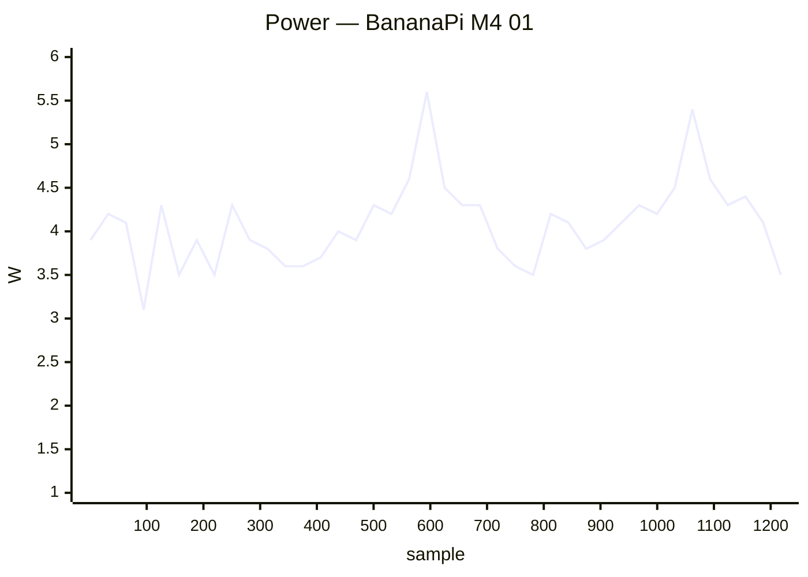
```mermaid
xychart-beta
    title "Power — BananaPi M4 01"
    x-axis "sample" 1 --> 1218
    y-axis "W" 1.0 --> 6.0
    line [3.9, 4.2, 4.1, 3.1, 4.3, 3.5, 3.9, 3.5, 4.3, 3.9, 3.8, 3.6, 3.6, 3.7, 4.0, 3.9, 4.3, 4.2, 4.6, 5.6, 4.5, 4.3, 4.3, 3.8, 3.6, 3.5, 4.2, 4.1, 3.8, 3.9, 4.1, 4.3, 4.2, 4.5, 5.4, 4.6, 4.3, 4.4, 4.1, 3.5]
```

### ✅ BananaPi W2 01

`bananapiw2` · **inplace** · image `26.11.0-trunk.133` · 16 ✅ · 0 ❌ · 0 ⏭️

| Module | Status | Time | Detail |
|:--|:--:|--:|:--|
| upgrade | ✅ | 60 s | nightly · 26.11.0-trunk.134 → 26.11.0-trunk.134 |
| reboot | ✅ | 55 s | power-cycle · up 19 s |
| kernel-switch | ✅ | 37 s | branch=current · family=realtek-rtd129x · installed=26.11.0-trunk.134 · boot_image=/boot/vmlinuz-6.18.63-current-realtek-rtd129x · kernel_before=6.18.63-current-realtek-rtd129x |
| reboot | ✅ | 89 s | power-cycle · 2/2 boots · up 23 s |
| hw-performance | ✅ | 23 s | AES 651 · mem 3600 · disk W 37 / R 116 MB/s · 65.7 °C · 1400 MHz |
| dvfs | ✅ | 20 s | schedutil · 300–1400 MHz (peak 1400) |
| network-iperf | ✅ | 186 s | eth0 ↑941/↓941 (1GE) · eth1 ↑941/↓941 (1GE) Mbps |
| store-versions | ✅ | 5 s | 26.11.0-trunk.134 · 6.18.63-current-realtek-rtd129x |
| kernel-switch | ✅ | 99 s | branch=edge · family=realtek-rtd129x · installed=26.11.0-trunk.134 · boot_image=/boot/vmlinuz-7.3.4-edge-realtek-rtd129x · kernel_before=6.18.63-current-realtek-rtd129x |
| reboot | ✅ | 89 s | power-cycle · 2/2 boots · up 17 s |
| hw-performance | ✅ | 24 s | AES 650 · mem 3600 · disk W 35 / R 126 MB/s · 66.3 °C · 1400 MHz |
| dvfs | ✅ | 23 s | schedutil · 300–1400 MHz (peak 1400) |
| network-iperf | ✅ | 91 s | eth0 ↑941/↓941 (1GE) · eth1 ↑939/↓941 (1GE) Mbps |
| store-versions | ✅ | 5 s | 26.11.0-trunk.134 · 7.3.4-edge-realtek-rtd129x |
| kernel-switch | ✅ | 97 s | branch=current · family=realtek-rtd129x · installed=26.11.0-trunk.134 · boot_image=/boot/vmlinuz-6.18.63-current-realtek-rtd129x · kernel_before=7.3.4-edge-realtek-rtd129x |
| reboot | ✅ | 56 s | power-cycle · up 19 s |

**Power** — min 1.3 W · avg 3.6 W · peak 5.7 W · 761 samples

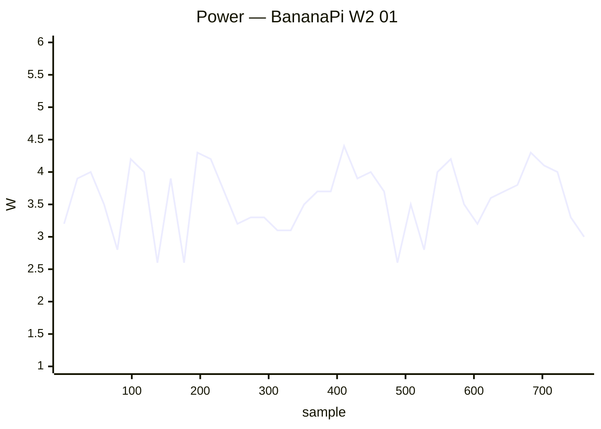
```mermaid
xychart-beta
    title "Power — BananaPi W2 01"
    x-axis "sample" 1 --> 761
    y-axis "W" 1.0 --> 6.0
    line [3.2, 3.9, 4.0, 3.5, 2.8, 4.2, 4.0, 2.6, 3.9, 2.6, 4.3, 4.2, 3.7, 3.2, 3.3, 3.3, 3.1, 3.1, 3.5, 3.7, 3.7, 4.4, 3.9, 4.0, 3.7, 2.6, 3.5, 2.8, 4.0, 4.2, 3.5, 3.2, 3.6, 3.7, 3.8, 4.3, 4.1, 4.0, 3.3, 3.0]
```

### ✅ Cubieboard 1 01

`cubieboard` · **inplace** · image `26.11.0-trunk.128` · 15 ✅ · 0 ❌ · 1 ⏭️

| Module | Status | Time | Detail |
|:--|:--:|--:|:--|
| upgrade | ⏭️ | 46 s | — |
| reboot | ✅ | 90 s | power-cycle · up 51 s |
| kernel-switch | ✅ | 275 s | branch=current · family=sunxi · installed=26.11.0-trunk.128 · boot_image=/boot/vmlinuz-6.18.62-current-sunxi · kernel_before=6.18.62-current-sunxi |
| reboot | ✅ | 163 s | power-cycle · 2/2 boots · up 52 s |
| hw-performance | ✅ | 66 s | AES 15 · mem 1000 · disk W 9 / R 20 MB/s · 43.8 °C · 1008 MHz |
| dvfs | ✅ | 47 s | ondemand · 624–1008 MHz (peak 1008) |
| network-iperf | ✅ | 93 s | end0 ↑85/↓85 (10/100ME) Mbps |
| store-versions | ✅ | 9 s | 26.11.0-trunk.134 · 6.18.62-current-sunxi |
| kernel-switch | ✅ | 665 s | branch=edge · family=sunxi · installed=26.11.0-trunk.134 · boot_image=/boot/vmlinuz-7.3.4-edge-sunxi · kernel_before=6.18.62-current-sunxi |
| reboot | ✅ | 158 s | power-cycle · 2/2 boots · up 48 s |
| hw-performance | ✅ | 66 s | AES 16 · mem 600 · disk W 7 / R 22 MB/s · 42.6 °C · 1008 MHz |
| dvfs | ✅ | 43 s | ondemand · 624–1008 MHz (peak 1008) |
| network-iperf | ✅ | 197 s | end0 ↑91/↓94 (10/100ME) Mbps |
| store-versions | ✅ | 9 s | 26.11.0-trunk.134 · 7.3.4-edge-sunxi |
| kernel-switch | ✅ | 246 s | branch=current · family=sunxi · installed=26.11.0-trunk.134 · boot_image=/boot/vmlinuz-6.18.63-current-sunxi · kernel_before=7.3.4-edge-sunxi |
| reboot | ✅ | 91 s | power-cycle · up 52 s |

### ✅ Cubieboard 4 01

`cubieboard4` · **inplace** · image `26.11.0-trunk` · 4 ✅ · 0 ❌ · 2 ⏭️

| Module | Status | Time | Detail |
|:--|:--:|--:|:--|
| upgrade | ⏭️ | — | — |
| reboot | ⏭️ | — | reboot |
| hw-performance | ✅ | 33 s | AES 43 · mem 3900 · disk W 26 / R 64 MB/s · 47.4 °C · 1200 MHz |
| dvfs | ✅ | 31 s | ondemand · 480–1200 MHz (peak 1200) |
| network-iperf | ✅ | 72 s | end0 ↑933/↓941 (1GE) · wlan0 ↑17/↓15 (Wi-Fi 4) Mbps |
| store-versions | ✅ | 7 s | 26.11.0-trunk · 6.18.57-current-sunxi |

### ✅ Cubietruck 01

`cubietruck` · **inplace** · image `26.11.0-trunk.133` · 16 ✅ · 0 ❌ · 0 ⏭️

| Module | Status | Time | Detail |
|:--|:--:|--:|:--|
| upgrade | ✅ | 127 s | nightly · 26.11.0-trunk.134 → 26.11.0-trunk.134 |
| reboot | ✅ | 63 s | warm · up 43 s |
| kernel-switch | ✅ | 82 s | branch=current · family=sunxi · installed=26.11.0-trunk.134 · boot_image=/boot/vmlinuz-6.18.63-current-sunxi · kernel_before=6.18.63-current-sunxi |
| reboot | ✅ | 116 s | warm · 2/2 boots · up 41 s |
| hw-performance | ✅ | 46 s | AES 19 · mem 1700 · disk W 13 / R 21 MB/s · 52.8 °C · 960 MHz |
| dvfs | ✅ | 36 s | ondemand · 528–960 MHz (peak 960) |
| network-iperf | ✅ | 369 s | end0 ↑703/↓791 (1GE) · wlan0 ↑18/↓23 (Wi-Fi 4) Mbps |
| store-versions | ✅ | 8 s | 26.11.0-trunk.134 · 6.18.63-current-sunxi |
| kernel-switch | ✅ | 221 s | branch=edge · family=sunxi · installed=26.11.0-trunk.134 · boot_image=/boot/vmlinuz-7.3.4-edge-sunxi · kernel_before=6.18.63-current-sunxi |
| reboot | ✅ | 116 s | warm · 2/2 boots · up 39 s |
| hw-performance | ✅ | 45 s | AES 19 · mem 1700 · disk W 13 / R 22 MB/s · 52.6 °C · 960 MHz |
| dvfs | ✅ | 38 s | ondemand · 528–960 MHz (peak 960) |
| network-iperf | ✅ | 113 s | end0 ↑794/↓925 (1GE) · wlan0 ↑19/↓24 (Wi-Fi 4) Mbps |
| store-versions | ✅ | 8 s | 26.11.0-trunk.134 · 7.3.4-edge-sunxi |
| kernel-switch | ✅ | 214 s | branch=current · family=sunxi · installed=26.11.0-trunk.134 · boot_image=/boot/vmlinuz-6.18.63-current-sunxi · kernel_before=7.3.4-edge-sunxi |
| reboot | ✅ | 61 s | warm · up 40 s |

### ✅ Cubox i2eX/i4 01

`cubox-i` · **inplace** · image `26.11.0-trunk.73` · 16 ✅ · 0 ❌ · 0 ⏭️

| Module | Status | Time | Detail |
|:--|:--:|--:|:--|
| upgrade | ✅ | 634 s | nightly · 26.11.0-trunk.73 → 26.11.0-trunk.74 |
| reboot | ✅ | 88 s | power-cycle · up 48 s |
| kernel-switch | ✅ | 72 s | branch=current · family=imx6 · installed=26.11.0-trunk.74 · boot_image=/boot/vmlinuz-6.18.55-current-imx6 · kernel_before=6.18.55-current-imx6 |
| reboot | ✅ | 162 s | power-cycle · 2/2 boots · up 47 s |
| hw-performance | ✅ | 47 s | AES 26 · mem 782 · disk W 19 / R 20 MB/s · 54.3 °C · 996 MHz |
| dvfs | ✅ | 40 s | ondemand · 396–996 MHz (peak 996) |
| network-iperf | ✅ | 305 s | end0 ↑94/↓94 (10/100ME) · wlan0 ↑18/↓16 (Wi-Fi 4) Mbps |
| store-versions | ✅ | 9 s | 26.11.0-trunk.74 · 6.18.55-current-imx6 |
| kernel-switch | ✅ | 298 s | branch=edge · family=imx6 · installed=26.11.0-trunk.74 · boot_image=/boot/vmlinuz-7.1.13-edge-imx6 · kernel_before=6.18.55-current-imx6 |
| reboot | ✅ | 144 s | power-cycle · 2/2 boots · up 46 s |
| hw-performance | ✅ | 47 s | AES 25 · mem 727 · disk W 19 / R 20 MB/s · 56 °C · 996 MHz |
| dvfs | ✅ | 44 s | ondemand · 396–996 MHz (peak 996) |
| network-iperf | ✅ | 160 s | end0 ↑94/↓94 (10/100ME) · wlan0 ↑17/↓17 (Wi-Fi 4) Mbps |
| store-versions | ✅ | 9 s | 26.11.0-trunk.74 · 7.1.13-edge-imx6 |
| kernel-switch | ✅ | 280 s | branch=current · family=imx6 · installed=26.11.0-trunk.74 · boot_image=/boot/vmlinuz-6.18.55-current-imx6 · kernel_before=7.1.13-edge-imx6 |
| reboot | ✅ | 87 s | power-cycle · up 46 s |

**Power** — min 1.8 W · avg 3.0 W · peak 6.1 W · 1937 samples

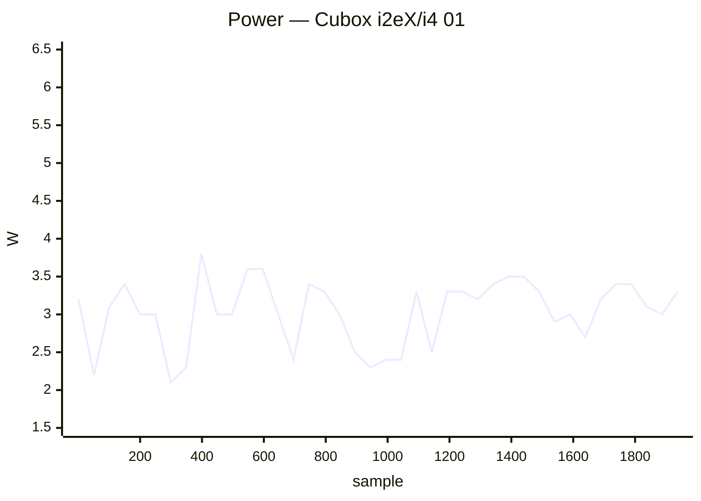
```mermaid
xychart-beta
    title "Power — Cubox i2eX/i4 01"
    x-axis "sample" 1 --> 1937
    y-axis "W" 1.5 --> 6.5
    line [3.2, 2.2, 3.1, 3.4, 3.0, 3.0, 2.1, 2.3, 3.8, 3.0, 3.0, 3.6, 3.6, 3.0, 2.4, 3.4, 3.3, 3.0, 2.5, 2.3, 2.4, 2.4, 3.3, 2.5, 3.3, 3.3, 3.2, 3.4, 3.5, 3.5, 3.3, 2.9, 3.0, 2.7, 3.2, 3.4, 3.4, 3.1, 3.0, 3.3]
```

### ✅ Dragon Q6A 01

`radxa-dragon-q6a` · **inplace** · image `26.11.0-trunk.122` · 16 ✅ · 0 ❌ · 0 ⏭️

| Module | Status | Time | Detail |
|:--|:--:|--:|:--|
| upgrade | ✅ | 27 s | nightly · 26.11.0-trunk.122 → 26.11.0-trunk.122 |
| reboot | ✅ | 144 s | power-cycle · up 106 s |
| kernel-switch | ✅ | 17 s | branch=vendor · family=qcs6490 · installed=26.11.0-trunk.134 · boot_image=/boot/vmlinuz-7.0.11-vendor-qcs6490 · kernel_before=7.0.11-vendor-qcs6490 |
| reboot | ✅ | 251 s | power-cycle · 2/2 boots · up 106 s |
| hw-performance | ✅ | 13 s | AES 1523 · mem 19800 · disk W 232 / R 1136 MB/s · 77.5 °C · 1958 MHz |
| dvfs | ✅ | 14 s | ondemand · 300–1958 MHz (peak 2707) |
| network-iperf | ✅ | 53 s | enp1s0 ↑941/↓941 (1GE) Mbps |
| store-versions | ✅ | 4 s | 26.11.0-trunk.122 · 7.0.11-vendor-qcs6490 |
| kernel-switch | ✅ | 90 s | branch=edge · family=qcs6490 · installed=26.11.0-trunk.134 · boot_image=/boot/vmlinuz-7.3.1-edge-qcs6490 · kernel_before=7.0.11-vendor-qcs6490 |
| reboot | ✅ | 250 s | power-cycle · 2/2 boots · up 106 s |
| hw-performance | ✅ | 13 s | AES 1501 · mem 18300 · disk W 220 / R 1115 MB/s · 78.5 °C · 1958 MHz |
| dvfs | ✅ | 16 s | ondemand · 300–1958 MHz (peak 2707) |
| network-iperf | ✅ | 27 s | enp1s0 ↑940/↓687 (1GE) Mbps |
| store-versions | ✅ | 4 s | 26.11.0-trunk.122 · 7.3.1-edge-qcs6490 |
| kernel-switch | ✅ | 375 s | branch=vendor · family=qcs6490 · installed=26.11.0-trunk.134 · boot_image=/boot/vmlinuz-7.0.11-vendor-qcs6490 · kernel_before=7.3.1-edge-qcs6490 |
| reboot | ✅ | 143 s | power-cycle · up 107 s |

**Power** — min 0.9 W · avg 2.2 W · peak 7.8 W · 1167 samples

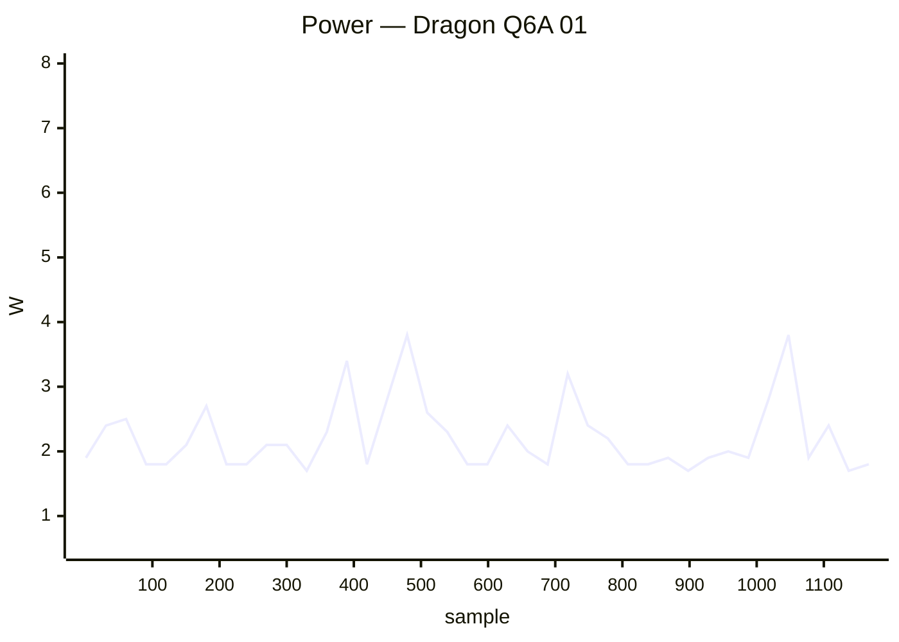
```mermaid
xychart-beta
    title "Power — Dragon Q6A 01"
    x-axis "sample" 1 --> 1167
    y-axis "W" 0.5 --> 8.0
    line [1.9, 2.4, 2.5, 1.8, 1.8, 2.1, 2.7, 1.8, 1.8, 2.1, 2.1, 1.7, 2.3, 3.4, 1.8, 2.8, 3.8, 2.6, 2.3, 1.8, 1.8, 2.4, 2.0, 1.8, 3.2, 2.4, 2.2, 1.8, 1.8, 1.9, 1.7, 1.9, 2.0, 1.9, 2.8, 3.8, 1.9, 2.4, 1.7, 1.8]
```

### ✅ Espressobin 01

`espressobin` · **inplace** · image `26.11.0-trunk.133` · 16 ✅ · 0 ❌ · 0 ⏭️

| Module | Status | Time | Detail |
|:--|:--:|--:|:--|
| upgrade | ✅ | 111 s | nightly · 26.11.0-trunk.134 → 26.11.0-trunk.134 |
| reboot | ✅ | 76 s | power-cycle · up 43 s |
| kernel-switch | ✅ | 69 s | branch=current · family=mvebu64 · installed=26.11.0-trunk.134 · boot_image=/boot/vmlinuz-6.18.63-current-mvebu64 · kernel_before=6.18.63-current-mvebu64 |
| reboot | ✅ | 128 s | power-cycle · 2/2 boots · up 42 s |
| hw-performance | ✅ | 38 s | AES 371 · mem 2000 · disk W 8 / R 133 MB/s · None °C · 800 MHz |
| dvfs | ✅ | 31 s | ondemand · 200–800 MHz (peak 800) |
| network-iperf | ✅ | 377 s | lan0 ↑936/↓741 (1GE) Mbps |
| store-versions | ✅ | 7 s | 26.11.0-trunk.134 · 6.18.63-current-mvebu64 |
| kernel-switch | ✅ | 343 s | branch=edge · family=mvebu64 · installed=26.11.0-trunk.134 · boot_image=/boot/vmlinuz-7.1.13-edge-mvebu64 · kernel_before=6.18.63-current-mvebu64 |
| reboot | ✅ | 129 s | power-cycle · 2/2 boots · up 44 s |
| hw-performance | ✅ | 34 s | AES 371 · mem 2000 · disk W 11 / R 132 MB/s · None °C · 800 MHz |
| dvfs | ✅ | 32 s | ondemand · 200–800 MHz (peak 800) |
| network-iperf | ✅ | 37 s | lan0 ↑936/↓748 (1GE) Mbps |
| store-versions | ✅ | 6 s | 26.11.0-trunk.134 · 7.1.13-edge-mvebu64 |
| kernel-switch | ✅ | 348 s | branch=current · family=mvebu64 · installed=26.11.0-trunk.134 · boot_image=/boot/vmlinuz-6.18.63-current-mvebu64 · kernel_before=7.1.13-edge-mvebu64 |
| reboot | ✅ | 78 s | power-cycle · up 43 s |

### ✅ Helios4 01

`helios4` · **inplace** · image `26.11.0-trunk.133` · 14 ✅ · 0 ❌ · 2 ⏭️

| Module | Status | Time | Detail |
|:--|:--:|--:|:--|
| upgrade | ✅ | 55 s | nightly · 26.11.0-trunk.134 → 26.11.0-trunk.134 |
| reboot | ✅ | 118 s | warm · up 102 s |
| kernel-switch | ✅ | 33 s | branch=current · family=mvebu · installed=26.11.0-trunk.134 · boot_image=/boot/vmlinuz-6.18.63-current-mvebu · kernel_before=6.18.63-current-mvebu |
| reboot | ✅ | 231 s | warm · 2/2 boots · up 102 s |
| hw-performance | ✅ | 27 s | AES 43 · mem 3700 · disk W 21 / R 23 MB/s · 63.2 °C · None MHz |
| dvfs | ➖ | 2 s | no cpufreq |
| network-iperf | ✅ | 154 s | end1 ↑941/↓940 (1GE) Mbps |
| store-versions | ✅ | 4 s | 26.11.0-trunk.134 · 6.18.63-current-mvebu |
| kernel-switch | ✅ | 97 s | branch=edge · family=mvebu · installed=26.11.0-trunk.134 · boot_image=/boot/vmlinuz-7.3.4-edge-mvebu · kernel_before=6.18.63-current-mvebu |
| reboot | ✅ | 231 s | warm · 2/2 boots · up 102 s |
| hw-performance | ✅ | 28 s | AES 43 · mem 3800 · disk W 21 / R 23 MB/s · 61.8 °C · None MHz |
| dvfs | ➖ | 2 s | no cpufreq |
| network-iperf | ✅ | 29 s | end1 ↑940/↓942 (1GE) Mbps |
| store-versions | ✅ | 4 s | 26.11.0-trunk.134 · 7.3.4-edge-mvebu |
| kernel-switch | ✅ | 98 s | branch=current · family=mvebu · installed=26.11.0-trunk.134 · boot_image=/boot/vmlinuz-6.18.63-current-mvebu · kernel_before=7.3.4-edge-mvebu |
| reboot | ✅ | 118 s | warm · up 102 s |

### ✅ K3 Pico-ITX 01

`k3picoitx` · **inplace** · image `26.11.0-trunk.133` · 8 ✅ · 0 ❌ · 0 ⏭️

| Module | Status | Time | Detail |
|:--|:--:|--:|:--|
| upgrade | ✅ | 33 s | nightly · 26.11.0-trunk.134 → 26.11.0-trunk.134 |
| reboot | ✅ | 48 s | power-cycle · up 24 s |
| kernel-switch | ✅ | 20 s | branch=legacy · family=spacemit-k3 · installed=26.11.0-trunk.134 · boot_image=/boot/vmlinuz-6.18.3-legacy-spacemit-k3 · kernel_before=6.18.3-legacy-spacemit-k3 |
| reboot | ✅ | 87 s | power-cycle · 2/2 boots · up 22 s |
| hw-performance | ✅ | 13 s | AES 778 · mem 4100 · disk W 1308 / R 1477 MB/s · 47 °C · 2150 MHz |
| dvfs | ✅ | 15 s | performance · 614–2150 MHz (peak 2150) |
| network-iperf | ✅ | 129 s | eth0 ↑941/↓941 (1GE) · eth1 ↑7678/↓4882 (10GE) · wlan0 ↑20/↓157 (Wi-Fi 6) Mbps |
| store-versions | ✅ | 3 s | 26.11.0-trunk.134 · 6.18.3-legacy-spacemit-k3 |

### ✅ MUSE Book 01

`musebook` · **inplace** · image `26.11.0-trunk` · 5 ✅ · 0 ❌ · 1 ⏭️

| Module | Status | Time | Detail |
|:--|:--:|--:|:--|
| upgrade | ⏭️ | 52 s | — |
| reboot | ✅ | 38 s | warm · up 20 s |
| hw-performance | ✅ | 30 s | AES 29 · mem 5800 · disk W 25 / R 77 MB/s · 51 °C · 1800 MHz |
| dvfs | ✅ | 27 s | performance · 614–1800 MHz (peak 1800) |
| network-iperf | ✅ | 64 s | eth0 ↑94/↓94 (10/100ME) · wlan0 ↑31/↓363 (Wi-Fi 6) Mbps |
| store-versions | ✅ | 6 s | 26.11.0-trunk · 6.18.58-current-spacemit |

### ✅ MusePi Pro 01

`musepipro` · **inplace** · image `26.11.0-trunk.133` · 16 ✅ · 0 ❌ · 0 ⏭️

| Module | Status | Time | Detail |
|:--|:--:|--:|:--|
| upgrade | ✅ | 62 s | nightly · 26.11.0-trunk.134 → 26.11.0-trunk.134 |
| reboot | ✅ | 56 s | power-cycle · up 22 s |
| kernel-switch | ✅ | 40 s | branch=current · family=spacemit · installed=26.11.0-trunk.134 · boot_image=/boot/vmlinuz-6.18.63-current-spacemit · kernel_before=6.18.63-current-spacemit |
| reboot | ✅ | 90 s | power-cycle · 2/2 boots · up 24 s |
| hw-performance | ✅ | 20 s | AES 40 · mem 6600 · disk W 59 / R 80 MB/s · 64 °C · 1800 MHz |
| dvfs | ✅ | 20 s | performance · 614–1800 MHz (peak 1800) |
| network-iperf | ✅ | 89 s | eth0 ↑940/↓940 (1GE) · wlan0 ↑86/↓90 (Wi-Fi 6) Mbps |
| store-versions | ✅ | 5 s | 26.11.0-trunk.134 · 6.18.63-current-spacemit |
| kernel-switch | ✅ | 102 s | branch=edge · family=spacemit · installed=26.11.0-trunk.134 · boot_image=/boot/vmlinuz-7.3.4-edge-spacemit · kernel_before=6.18.63-current-spacemit |
| reboot | ✅ | 254 s | power-cycle · 2/2 boots · up 105 s |
| hw-performance | ✅ | 20 s | AES 36 · mem 3000 · disk W 60 / R 82 MB/s · 56 °C · 1600 MHz |
| dvfs | ✅ | 21 s | performance · 614–1600 MHz (peak 1600) |
| network-iperf | ✅ | 30 s | eth0 ↑941/↓941 (1GE) Mbps |
| store-versions | ✅ | 5 s | 26.11.0-trunk.134 · 7.3.4-edge-spacemit |
| kernel-switch | ✅ | 104 s | branch=current · family=spacemit · installed=26.11.0-trunk.134 · boot_image=/boot/vmlinuz-6.18.63-current-spacemit · kernel_before=7.3.4-edge-spacemit |
| reboot | ✅ | 61 s | power-cycle · up 23 s |

**Power** — min 0.8 W · avg 3.7 W · peak 8.8 W · 765 samples

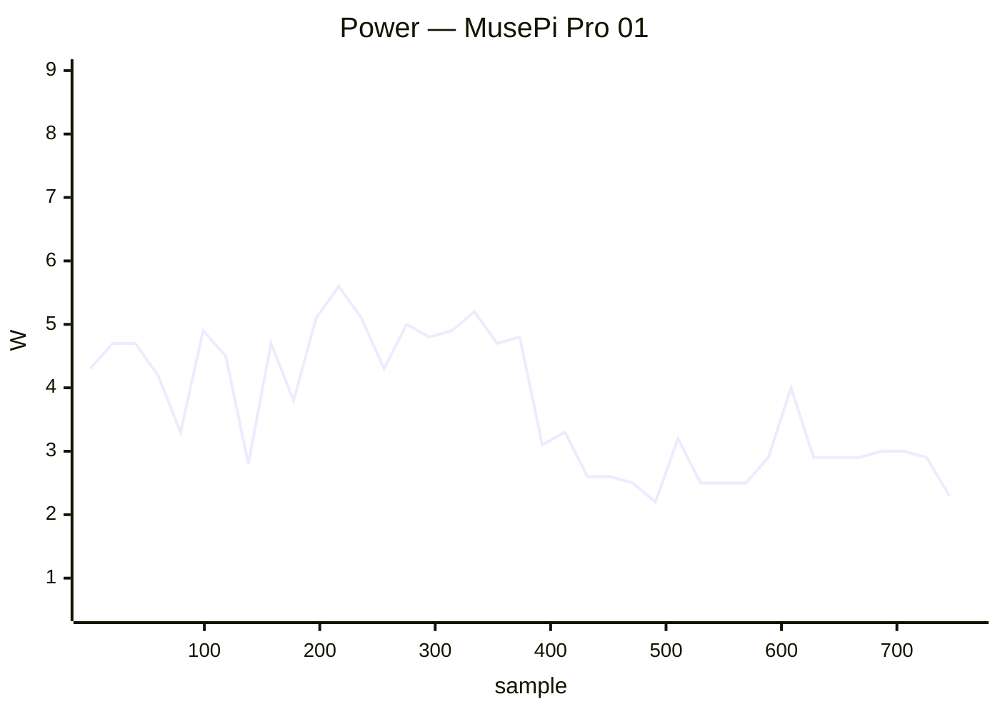
```mermaid
xychart-beta
    title "Power — MusePi Pro 01"
    x-axis "sample" 1 --> 765
    y-axis "W" 0.5 --> 9.0
    line [4.3, 4.7, 4.7, 4.2, 3.3, 4.9, 4.5, 2.8, 4.7, 3.8, 5.1, 5.6, 5.1, 4.3, 5.0, 4.8, 4.9, 5.2, 4.7, 4.8, 3.1, 3.3, 2.6, 2.6, 2.5, 2.2, 3.2, 2.5, 2.5, 2.5, 2.9, 4.0, 2.9, 2.9, 2.9, 3.0, 3.0, 2.9, 2.3, 3.3]
```

### ✅ NanoPC T6 Plus 01

`friendlyelec-rk3588` · **inplace** · image `26.11.0-trunk.133` · 22 ✅ · 0 ❌ · 0 ⏭️

| Module | Status | Time | Detail |
|:--|:--:|--:|:--|
| upgrade | ✅ | 30 s | nightly · 26.11.0-trunk.134 → 26.11.0-trunk.134 |
| reboot | ✅ | 55 s | power-cycle · up 21 s |
| kernel-switch | ✅ | 19 s | branch=vendor · family=rk35xx · installed=26.11.0-trunk.134 · boot_image=/boot/vmlinuz-6.1.172-vendor-rk35xx · kernel_before=6.1.172-vendor-rk35xx |
| reboot | ✅ | 83 s | power-cycle · 2/2 boots · up 21 s |
| hw-performance | ✅ | 14 s | AES 1344 · mem 16300 · disk W 177 / R 271 MB/s · 42.5 °C · 1800 MHz |
| dvfs | ✅ | 16 s | ondemand · 1800–1800 MHz (peak 2400) |
| network-iperf | ✅ | 115 s | lan1 ↑2350/↓2340 (2.5GE) · lan2 ↑2337/↓2353 (2.5GE) · wlP3p49s0 ↑512/↓146 (Wi-Fi 5) Mbps |
| store-versions | ✅ | 4 s | 26.11.0-trunk.134 · 6.1.172-vendor-rk35xx |
| kernel-switch | ✅ | 56 s | branch=current · family=rockchip64 · installed=26.11.0-trunk.134 · boot_image=/boot/vmlinuz-6.18.63-current-rockchip64 · kernel_before=6.1.172-vendor-rk35xx |
| reboot | ✅ | 249 s | power-cycle · 2/2 boots · up 104 s |
| hw-performance | ✅ | 14 s | AES 1325 · mem 10700 · disk W 168 / R 268 MB/s · 45.3 °C · 1800 MHz |
| dvfs | ✅ | 15 s | ondemand · 408–1800 MHz (peak 2400) |
| network-iperf | ✅ | 116 s | lan1 ↑2352/↓2353 (2.5GE) · lan2 ↑2353/↓2351 (2.5GE) Mbps |
| store-versions | ✅ | 4 s | 26.11.0-trunk.134 · 6.18.63-current-rockchip64 |
| kernel-switch | ✅ | 51 s | branch=edge · family=rockchip64 · installed=26.11.0-trunk.134 · boot_image=/boot/vmlinuz-7.3.4-edge-rockchip64 · kernel_before=6.18.63-current-rockchip64 |
| reboot | ✅ | 240 s | power-cycle · 2/2 boots · up 104 s |
| hw-performance | ✅ | 14 s | AES 1324 · mem 5800 · disk W 187 / R 283 MB/s · 46.2 °C · 1800 MHz |
| dvfs | ✅ | 17 s | ondemand · 408–1800 MHz (peak 2400) |
| network-iperf | ✅ | 113 s | lan1 ↑2346/↓2354 (2.5GE) · lan2 ↑2349/↓2351 (2.5GE) Mbps |
| store-versions | ✅ | 4 s | 26.11.0-trunk.134 · 7.3.4-edge-rockchip64 |
| kernel-switch | ✅ | 46 s | branch=vendor · family=rk35xx · installed=26.11.0-trunk.134 · boot_image=/boot/vmlinuz-6.1.172-vendor-rk35xx · kernel_before=7.3.4-edge-rockchip64 |
| reboot | ✅ | 55 s | power-cycle · up 22 s |

**Power** — min 2.8 W · avg 5.3 W · peak 11.2 W · 811 samples

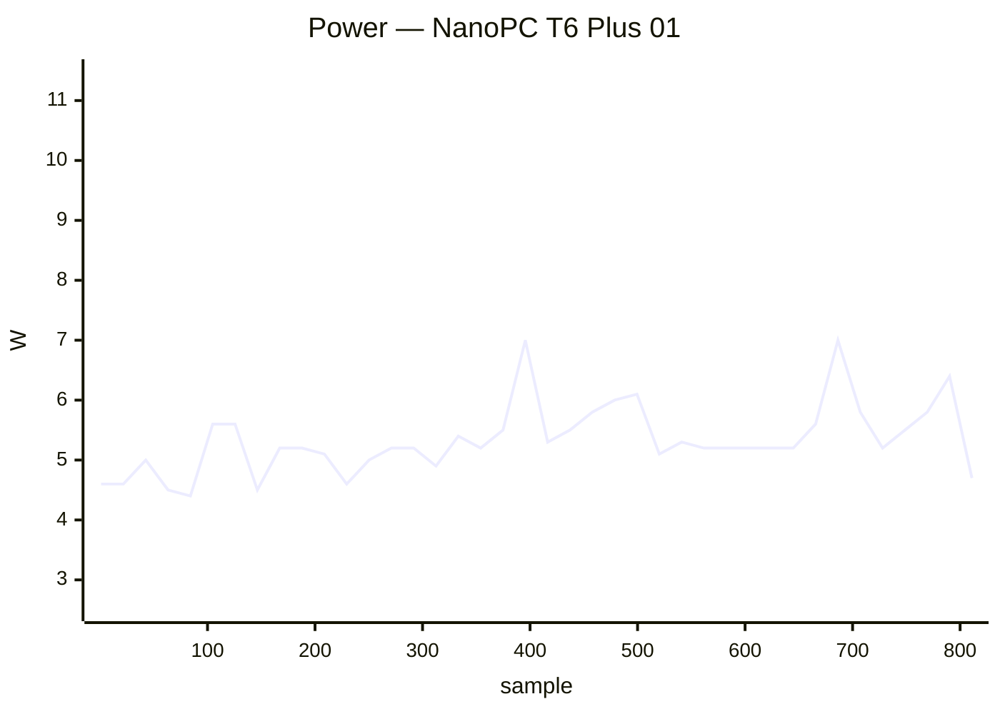
```mermaid
xychart-beta
    title "Power — NanoPC T6 Plus 01"
    x-axis "sample" 1 --> 811
    y-axis "W" 2.5 --> 11.5
    line [4.6, 4.6, 5.0, 4.5, 4.4, 5.6, 5.6, 4.5, 5.2, 5.2, 5.1, 4.6, 5.0, 5.2, 5.2, 4.9, 5.4, 5.2, 5.5, 7.0, 5.3, 5.5, 5.8, 6.0, 6.1, 5.1, 5.3, 5.2, 5.2, 5.2, 5.2, 5.2, 5.6, 7.0, 5.8, 5.2, 5.5, 5.8, 6.4, 4.7]
```

### ✅ NanoPi Fire3 01

`nanopifire3` · **inplace** · image `26.11.0-trunk.133` · 7 ✅ · 0 ❌ · 1 ⏭️

| Module | Status | Time | Detail |
|:--|:--:|--:|:--|
| upgrade | ✅ | 99 s | nightly · 26.11.0-trunk.134 → 26.11.0-trunk.134 |
| reboot | ✅ | 68 s | power-cycle · up 33 s |
| kernel-switch | ✅ | 67 s | branch=edge · family=s5p6818 · installed=26.11.0-trunk.134 · boot_image=/boot/vmlinuz-7.2.15-edge-s5p6818 · kernel_before=7.2.15-edge-s5p6818 |
| reboot | ✅ | 103 s | power-cycle · 2/2 boots · up 32 s |
| hw-performance | ✅ | 33 s | AES 369 · mem 2000 · disk W 20 / R 1 MB/s · 70 °C · None MHz |
| dvfs | ➖ | 3 s | no cpufreq |
| network-iperf | ✅ | 188 s | eth0 ↑94/↓94 (10/100ME) Mbps |
| store-versions | ✅ | 5 s | 26.11.0-trunk.134 · 7.2.15-edge-s5p6818 |

**Power** — min 2.0 W · avg 3.0 W · peak 3.9 W · 460 samples

```mermaid
xychart-beta
    title "Power — NanoPi Fire3 01"
    x-axis "sample" 1 --> 460
    y-axis "W" 1.5 --> 4.0
    line [2.6, 2.9, 3.0, 3.0, 3.0, 2.9, 2.9, 3.0, 2.9, 2.9, 2.9, 3.3, 3.5, 3.1, 3.1, 3.0, 3.0, 2.9, 3.1, 3.8, 3.2, 2.6, 3.0, 3.6, 3.2, 3.0, 3.1, 3.0, 2.9, 2.7, 2.9, 2.7, 2.9, 2.7, 2.9, 2.7, 2.7, 2.8, 2.8, 2.8]
```

### ✅ NanoPi K2 01

`nanopik2-s905` · **inplace** · image `26.11.0-trunk.133` · 16 ✅ · 0 ❌ · 0 ⏭️

| Module | Status | Time | Detail |
|:--|:--:|--:|:--|
| upgrade | ✅ | 68 s | nightly · 26.11.0-trunk.134 → 26.11.0-trunk.134 |
| reboot | ✅ | 36 s | warm · up 20 s |
| kernel-switch | ✅ | 41 s | branch=current · family=meson64 · installed=26.11.0-trunk.134 · boot_image=/boot/vmlinuz-6.18.63-current-meson64 · kernel_before=6.18.63-current-meson64 |
| reboot | ✅ | 65 s | warm · 2/2 boots · up 19 s |
| hw-performance | ✅ | 34 s | AES 51 · mem 3700 · disk W 8 / R 40 MB/s · 65 °C · 2016 MHz |
| dvfs | ✅ | 20 s | ondemand · 500–1536 MHz (peak 1536) |
| network-iperf | ✅ | 208 s | end0 ↑934/↓941 (1GE) · wlan0 ↑15/↓28 (Wi-Fi 4) Mbps |
| store-versions | ✅ | 5 s | 26.11.0-trunk.134 · 6.18.63-current-meson64 |
| kernel-switch | ✅ | 168 s | branch=edge · family=meson64 · installed=26.11.0-trunk.134 · boot_image=/boot/vmlinuz-7.3.4-edge-meson64 · kernel_before=6.18.63-current-meson64 |
| reboot | ✅ | 65 s | warm · 2/2 boots · up 19 s |
| hw-performance | ✅ | 33 s | AES 51 · mem 3800 · disk W 8 / R 42 MB/s · 66 °C · 2016 MHz |
| dvfs | ✅ | 23 s | ondemand · 500–1536 MHz (peak 1536) |
| network-iperf | ✅ | 95 s | end0 ↑936/↓941 (1GE) · wlan0 ↑15/↓28 (Wi-Fi 4) Mbps |
| store-versions | ✅ | 4 s | 26.11.0-trunk.134 · 7.3.4-edge-meson64 |
| kernel-switch | ✅ | 166 s | branch=current · family=meson64 · installed=26.11.0-trunk.134 · boot_image=/boot/vmlinuz-6.18.63-current-meson64 · kernel_before=7.3.4-edge-meson64 |
| reboot | ✅ | 35 s | warm · up 19 s |

### ✅ NanoPi M4 03

`nanopim4` · **inplace** · image `26.11.0-trunk.133` · 16 ✅ · 0 ❌ · 0 ⏭️

| Module | Status | Time | Detail |
|:--|:--:|--:|:--|
| upgrade | ✅ | 41 s | nightly · 26.11.0-trunk.134 → 26.11.0-trunk.134 |
| reboot | ✅ | 50 s | power-cycle · up 17 s |
| kernel-switch | ✅ | 36 s | branch=current · family=rockchip64 · installed=26.11.0-trunk.134 · boot_image=/boot/vmlinuz-6.18.63-current-rockchip64 · kernel_before=6.18.63-current-rockchip64 |
| reboot | ✅ | 78 s | power-cycle · 2/2 boots · up 17 s |
| hw-performance | ✅ | 31 s | AES 1019 · mem 6500 · disk W 9 / R 62 MB/s · 38.1 °C · 1416 MHz |
| dvfs | ✅ | 19 s | ondemand · 408–1416 MHz (peak 1800) |
| network-iperf | ✅ | 449 s | end0 ↑940/↓941 (1GE) · wlan0 ↑21/↓84 (Wi-Fi 5) Mbps |
| store-versions | ✅ | 5 s | 26.11.0-trunk.134 · 6.18.63-current-rockchip64 |
| kernel-switch | ✅ | 140 s | branch=edge · family=rockchip64 · installed=26.11.0-trunk.134 · boot_image=/boot/vmlinuz-7.3.4-edge-rockchip64 · kernel_before=6.18.63-current-rockchip64 |
| reboot | ✅ | 78 s | power-cycle · 2/2 boots · up 17 s |
| hw-performance | ✅ | 36 s | AES 1022 · mem 6600 · disk W 8 / R 60 MB/s · 39.4 °C · 1416 MHz |
| dvfs | ✅ | 21 s | ondemand · 408–1416 MHz (peak 1800) |
| network-iperf | ✅ | 212 s | end0 ↑938/↓941 (1GE) · wlan0 ↑11/↓70 (Wi-Fi 5) Mbps |
| store-versions | ✅ | 5 s | 26.11.0-trunk.134 · 7.3.4-edge-rockchip64 |
| kernel-switch | ✅ | 139 s | branch=current · family=rockchip64 · installed=26.11.0-trunk.134 · boot_image=/boot/vmlinuz-6.18.63-current-rockchip64 · kernel_before=7.3.4-edge-rockchip64 |
| reboot | ✅ | 55 s | power-cycle · up 21 s |

**Power** — min 1.6 W · avg 4.2 W · peak 8.6 W · 1115 samples

```mermaid
xychart-beta
    title "Power — NanoPi M4 03"
    x-axis "sample" 1 --> 1115
    y-axis "W" 1.5 --> 9.0
    line [4.4, 4.4, 4.1, 4.6, 4.5, 4.8, 4.6, 5.3, 3.8, 3.9, 4.0, 3.9, 3.8, 3.9, 3.9, 4.2, 3.8, 3.8, 3.8, 3.7, 4.2, 4.4, 4.1, 4.6, 4.7, 4.4, 5.0, 4.6, 4.3, 3.7, 3.8, 4.4, 4.4, 3.8, 4.4, 4.3, 4.1, 4.6, 4.6, 4.4]
```

### ✅ NanoPi M4V2 01

`nanopim4v2` · **inplace** · image `26.11.0-trunk.133` · 16 ✅ · 0 ❌ · 0 ⏭️

| Module | Status | Time | Detail |
|:--|:--:|--:|:--|
| upgrade | ✅ | 42 s | nightly · 26.11.0-trunk.134 → 26.11.0-trunk.134 |
| reboot | ✅ | 49 s | power-cycle · up 19 s |
| kernel-switch | ✅ | 27 s | branch=current · family=rockchip64 · installed=26.11.0-trunk.134 · boot_image=/boot/vmlinuz-6.18.63-current-rockchip64 · kernel_before=6.18.63-current-rockchip64 |
| reboot | ✅ | 78 s | power-cycle · 2/2 boots · up 18 s |
| hw-performance | ✅ | 18 s | AES 1017 · mem 6500 · disk W 102 / R 155 MB/s · 47.5 °C · 1416 MHz |
| dvfs | ✅ | 19 s | ondemand · 408–1416 MHz (peak 1800) |
| network-iperf | ✅ | 179 s | end0 ↑941/↓941 (1GE) · wlan0 ↑138/↓192 (Wi-Fi 5) · wlx803f5d16af63 ↑131/↓210 (Wi-Fi 5) Mbps |
| store-versions | ✅ | 4 s | 26.11.0-trunk.134 · 6.18.63-current-rockchip64 |
| kernel-switch | ✅ | 80 s | branch=edge · family=rockchip64 · installed=26.11.0-trunk.134 · boot_image=/boot/vmlinuz-7.3.4-edge-rockchip64 · kernel_before=6.18.63-current-rockchip64 |
| reboot | ✅ | 81 s | power-cycle · 2/2 boots · up 21 s |
| hw-performance | ✅ | 19 s | AES 1019 · mem 6600 · disk W 104 / R 156 MB/s · 48.1 °C · 1416 MHz |
| dvfs | ✅ | 22 s | ondemand · 408–1416 MHz (peak 1800) |
| network-iperf | ✅ | 117 s | end0 ↑941/↓941 (1GE) · wlan0 ↑112/↓133 (Wi-Fi 5) · wlx803f5d16af63 ↑134/↓192 (Wi-Fi 5) Mbps |
| store-versions | ✅ | 5 s | 26.11.0-trunk.134 · 7.3.4-edge-rockchip64 |
| kernel-switch | ✅ | 83 s | branch=current · family=rockchip64 · installed=26.11.0-trunk.134 · boot_image=/boot/vmlinuz-6.18.63-current-rockchip64 · kernel_before=7.3.4-edge-rockchip64 |
| reboot | ✅ | 49 s | power-cycle · up 16 s |

**Power** — min 1.3 W · avg 6.3 W · peak 11.9 W · 697 samples

```mermaid
xychart-beta
    title "Power — NanoPi M4V2 01"
    x-axis "sample" 1 --> 697
    y-axis "W" 1.0 --> 12.0
    line [5.2, 6.4, 6.8, 4.5, 6.8, 7.3, 5.1, 6.1, 4.0, 7.9, 7.9, 5.6, 5.4, 5.8, 5.3, 5.3, 5.9, 7.0, 6.9, 6.6, 6.4, 7.6, 7.7, 6.3, 5.6, 5.2, 6.7, 6.9, 8.1, 6.4, 6.4, 6.3, 5.3, 7.0, 7.1, 6.6, 7.2, 7.7, 6.0, 4.5]
```

### ✅ Nanopi M6 01

`friendlyelec-rk3588` · **inplace** · image `26.11.0-trunk.133` · 22 ✅ · 0 ❌ · 0 ⏭️

| Module | Status | Time | Detail |
|:--|:--:|--:|:--|
| upgrade | ✅ | 30 s | nightly · 26.11.0-trunk.134 → 26.11.0-trunk.134 |
| reboot | ✅ | 51 s | power-cycle · up 22 s |
| kernel-switch | ✅ | 21 s | branch=vendor · family=rk35xx · installed=26.11.0-trunk.134 · boot_image=/boot/vmlinuz-6.1.172-vendor-rk35xx · kernel_before=6.1.172-vendor-rk35xx |
| reboot | ✅ | 74 s | power-cycle · 2/2 boots · up 19 s |
| hw-performance | ✅ | 18 s | AES 1260 · mem 13700 · disk W 52 / R 74 MB/s · 41.6 °C · 1800 MHz |
| dvfs | ✅ | 17 s | ondemand · 1800–1800 MHz (peak 2256) |
| network-iperf | ✅ | 55 s | lan ↑941/↓941 (1GE) · wlP3p49s0 ↑58/↓290 (Wi-Fi 5) Mbps |
| store-versions | ✅ | 4 s | 26.11.0-trunk.134 · 6.1.172-vendor-rk35xx |
| kernel-switch | ✅ | 117 s | branch=current · family=rockchip64 · installed=26.11.0-trunk.134 · boot_image=/boot/vmlinuz-6.18.63-current-rockchip64 · kernel_before=6.1.172-vendor-rk35xx |
| reboot | ✅ | 244 s | power-cycle · 2/2 boots · up 105 s |
| hw-performance | ✅ | 19 s | AES 1219 · mem 8000 · disk W 47 / R 56 MB/s · 45.3 °C · 1800 MHz |
| dvfs | ✅ | 16 s | ondemand · 408–1800 MHz (peak 2400) |
| network-iperf | ✅ | 30 s | lan ↑940/↓941 (1GE) Mbps |
| store-versions | ✅ | 4 s | 26.11.0-trunk.134 · 6.18.63-current-rockchip64 |
| kernel-switch | ✅ | 76 s | branch=edge · family=rockchip64 · installed=26.11.0-trunk.134 · boot_image=/boot/vmlinuz-7.3.4-edge-rockchip64 · kernel_before=6.18.63-current-rockchip64 |
| reboot | ✅ | 253 s | power-cycle · 2/2 boots · up 106 s |
| hw-performance | ✅ | 19 s | AES 1218 · mem 7700 · disk W 46 / R 57 MB/s · 45.3 °C · 1800 MHz |
| dvfs | ✅ | 17 s | ondemand · 408–1800 MHz (peak 2400) |
| network-iperf | ✅ | 30 s | lan ↑938/↓941 (1GE) Mbps |
| store-versions | ✅ | 4 s | 26.11.0-trunk.134 · 7.3.4-edge-rockchip64 |
| kernel-switch | ✅ | 75 s | branch=vendor · family=rk35xx · installed=26.11.0-trunk.134 · boot_image=/boot/vmlinuz-6.1.172-vendor-rk35xx · kernel_before=7.3.4-edge-rockchip64 |
| reboot | ✅ | 51 s | power-cycle · up 22 s |

**Power** — min 0.9 W · avg 3.0 W · peak 9.3 W · 962 samples

```mermaid
xychart-beta
    title "Power — Nanopi M6 01"
    x-axis "sample" 1 --> 962
    y-axis "W" 0.5 --> 9.5
    line [2.2, 2.2, 2.8, 3.0, 2.6, 3.1, 4.3, 2.4, 3.0, 3.1, 2.7, 2.4, 2.5, 2.5, 2.7, 2.6, 2.6, 3.1, 2.9, 2.7, 2.8, 5.4, 3.5, 4.3, 3.7, 3.4, 3.0, 2.7, 2.6, 2.6, 2.5, 2.7, 2.7, 2.7, 5.2, 3.2, 3.5, 3.3, 3.6, 3.1]
```

### ✅ Nanopi M6 V2 01

`friendlyelec-rk3588` · **inplace** · image `26.11.0-trunk.133` · 22 ✅ · 0 ❌ · 0 ⏭️

| Module | Status | Time | Detail |
|:--|:--:|--:|:--|
| upgrade | ✅ | 32 s | nightly · 26.11.0-trunk.134 → 26.11.0-trunk.134 |
| reboot | ✅ | 139 s | power-cycle · up 108 s |
| kernel-switch | ✅ | 21 s | branch=vendor · family=rk35xx · installed=26.11.0-trunk.134 · boot_image=/boot/vmlinuz-6.1.172-vendor-rk35xx · kernel_before=6.1.172-vendor-rk35xx |
| reboot | ✅ | 247 s | power-cycle · 2/2 boots · up 108 s |
| hw-performance | ✅ | 17 s | AES 1298 · mem 15800 · disk W 49 / R 73 MB/s · 55.5 °C · 1800 MHz |
| dvfs | ✅ | 16 s | ondemand · 1800–1800 MHz (peak 2304) |
| network-iperf | ✅ | 112 s | eth0 ↑941/↓941 (1GE) · wlP3p49s0 ↑638/↓292 (Wi-Fi 6) Mbps |
| store-versions | ✅ | 4 s | 26.11.0-trunk.134 · 6.1.172-vendor-rk35xx |
| kernel-switch | ✅ | 116 s | branch=current · family=rockchip64 · installed=26.11.0-trunk.134 · boot_image=/boot/vmlinuz-6.18.63-current-rockchip64 · kernel_before=6.1.172-vendor-rk35xx |
| reboot | ✅ | 247 s | power-cycle · 2/2 boots · up 106 s |
| hw-performance | ✅ | 18 s | AES 1241 · mem 10100 · disk W 48 / R 60 MB/s · 61 °C · 1800 MHz |
| dvfs | ✅ | 15 s | ondemand · 408–1800 MHz (peak 2400) |
| network-iperf | ✅ | 58 s | eth0 ↑941/↓941 (1GE) · wlP3p49s0 ↑290/↓370 (Wi-Fi 6) Mbps |
| store-versions | ✅ | 4 s | 26.11.0-trunk.134 · 6.18.63-current-rockchip64 |
| kernel-switch | ✅ | 80 s | branch=edge · family=rockchip64 · installed=26.11.0-trunk.134 · boot_image=/boot/vmlinuz-7.3.4-edge-rockchip64 · kernel_before=6.18.63-current-rockchip64 |
| reboot | ✅ | 253 s | power-cycle · 2/2 boots · up 105 s |
| hw-performance | ✅ | 18 s | AES 1238 · mem 5500 · disk W 47 / R 54 MB/s · 62.8 °C · 1800 MHz |
| dvfs | ✅ | 16 s | ondemand · 408–1800 MHz (peak 2400) |
| network-iperf | ✅ | 55 s | eth0 ↑941/↓941 (1GE) · wlP3p49s0 ↑620/↓275 (Wi-Fi 6) Mbps |
| store-versions | ✅ | 4 s | 26.11.0-trunk.134 · 7.3.4-edge-rockchip64 |
| kernel-switch | ✅ | 73 s | branch=vendor · family=rk35xx · installed=26.11.0-trunk.134 · boot_image=/boot/vmlinuz-6.1.172-vendor-rk35xx · kernel_before=7.3.4-edge-rockchip64 |
| reboot | ✅ | 133 s | power-cycle · up 105 s |

**Power** — min 0.6 W · avg 4.0 W · peak 12.4 W · 1333 samples

```mermaid
xychart-beta
    title "Power — Nanopi M6 V2 01"
    x-axis "sample" 1 --> 1333
    y-axis "W" 0.5 --> 12.5
    line [3.6, 2.9, 3.3, 3.1, 3.7, 3.5, 3.2, 3.0, 3.5, 3.3, 3.3, 5.5, 3.6, 3.6, 4.2, 4.1, 3.9, 4.2, 3.9, 3.7, 4.2, 3.9, 3.8, 5.4, 4.8, 4.6, 5.0, 3.9, 4.0, 3.9, 3.7, 4.0, 4.4, 5.9, 5.4, 5.6, 4.8, 3.5, 3.4, 3.4]
```

### ✅ NanoPi Neo 2 Black 01

`nanopineo2black` · **inplace** · image `26.11.0-trunk.133` · 16 ✅ · 0 ❌ · 0 ⏭️

| Module | Status | Time | Detail |
|:--|:--:|--:|:--|
| upgrade | ✅ | 65 s | nightly · 26.11.0-trunk.134 → 26.11.0-trunk.134 |
| reboot | ✅ | 56 s | power-cycle · up 18 s |
| kernel-switch | ✅ | 42 s | branch=current · family=sunxi64 · installed=26.11.0-trunk.134 · boot_image=/boot/vmlinuz-6.18.63-current-sunxi64 · kernel_before=6.18.63-current-sunxi64 |
| reboot | ✅ | 306 s | power-cycle · 1/2 boots · up 18 s |
| hw-performance | ✅ | 23 s | AES 631 · mem 3500 · disk W 43 / R 44 MB/s · 62.2 °C · 1368 MHz |
| dvfs | ✅ | 22 s | ondemand · 480–1368 MHz (peak 1368) |
| network-iperf | ✅ | 85 s | end0 ↑895/↓937 (1GE) Mbps |
| store-versions | ✅ | 5 s | 26.11.0-trunk.134 · 6.18.63-current-sunxi64 |
| kernel-switch | ✅ | 111 s | branch=edge · family=sunxi64 · installed=26.11.0-trunk.134 · boot_image=/boot/vmlinuz-7.3.4-edge-sunxi64 · kernel_before=6.18.63-current-sunxi64 |
| reboot | ✅ | 301 s | power-cycle · 1/2 boots · up 17 s |
| hw-performance | ✅ | 23 s | AES 627 · mem 3500 · disk W 43 / R 43 MB/s · 67.9 °C · 1368 MHz |
| dvfs | ✅ | 24 s | ondemand · 480–1368 MHz (peak 1368) |
| network-iperf | ✅ | 92 s | end0 ↑883/↓941 (1GE) Mbps |
| store-versions | ✅ | 5 s | 26.11.0-trunk.134 · 7.3.4-edge-sunxi64 |
| kernel-switch | ✅ | 110 s | branch=current · family=sunxi64 · installed=26.11.0-trunk.134 · boot_image=/boot/vmlinuz-6.18.63-current-sunxi64 · kernel_before=7.3.4-edge-sunxi64 |
| reboot | ✅ | 56 s | power-cycle · up 18 s |

**Power** — min 0.9 W · avg 2.5 W · peak 5.7 W · 1047 samples

```mermaid
xychart-beta
    title "Power — NanoPi Neo 2 Black 01"
    x-axis "sample" 1 --> 1047
    y-axis "W" 0.5 --> 6.0
    line [2.3, 2.9, 2.6, 2.8, 3.4, 3.1, 2.5, 1.5, 1.4, 1.4, 1.4, 1.4, 2.9, 2.2, 3.8, 3.4, 2.4, 2.2, 3.1, 3.4, 3.2, 3.0, 3.1, 1.7, 1.5, 1.5, 1.5, 1.4, 1.5, 2.6, 3.6, 3.4, 3.2, 2.0, 2.5, 3.2, 3.4, 3.1, 2.7, 2.5]
```

### ✅ NanoPi Neo 3 01

`nanopineo3` · **inplace** · image `26.11.0-trunk.133` · 16 ✅ · 0 ❌ · 0 ⏭️

| Module | Status | Time | Detail |
|:--|:--:|--:|:--|
| upgrade | ✅ | 84 s | nightly · 26.11.0-trunk.134 → 26.11.0-trunk.134 |
| reboot | ✅ | 66 s | power-cycle · up 29 s |
| kernel-switch | ✅ | 56 s | branch=current · family=rockchip64 · installed=26.11.0-trunk.134 · boot_image=/boot/vmlinuz-6.18.63-current-rockchip64 · kernel_before=6.18.63-current-rockchip64 |
| reboot | ✅ | 99 s | power-cycle · 2/2 boots · up 26 s |
| hw-performance | ✅ | 27 s | AES 595 · mem 2400 · disk W 52 / R 1 MB/s · 80.8 °C · 1296 MHz |
| dvfs | ✅ | 28 s | ondemand · 408–1296 MHz (peak 1296) |
| network-iperf | ✅ | 196 s | end0 ↑900/↓940 (1GE) · wlx7cdd905518f9 ↑37/↓38 (Wi-Fi 4) Mbps |
| store-versions | ✅ | 7 s | 26.11.0-trunk.134 · 6.18.63-current-rockchip64 |
| kernel-switch | ✅ | 173 s | branch=edge · family=rockchip64 · installed=26.11.0-trunk.134 · boot_image=/boot/vmlinuz-7.3.4-edge-rockchip64 · kernel_before=6.18.63-current-rockchip64 |
| reboot | ✅ | 100 s | power-cycle · 2/2 boots · up 27 s |
| hw-performance | ✅ | 27 s | AES 598 · mem 2300 · disk W 52 / R 62 MB/s · 83.5 °C · 1296 MHz |
| dvfs | ✅ | 30 s | ondemand · 408–1296 MHz (peak 1296) |
| network-iperf | ✅ | 140 s | end0 ↑918/↓939 (1GE) · wlx7cdd905518f9 ↑36/↓27 (Wi-Fi 4) Mbps |
| store-versions | ✅ | 6 s | 26.11.0-trunk.134 · 7.3.4-edge-rockchip64 |
| kernel-switch | ✅ | 181 s | branch=current · family=rockchip64 · installed=26.11.0-trunk.134 · boot_image=/boot/vmlinuz-6.18.63-current-rockchip64 · kernel_before=7.3.4-edge-rockchip64 |
| reboot | ✅ | 64 s | power-cycle · up 28 s |

**Power** — min 1.7 W · avg 4.5 W · peak 5.8 W · 1014 samples

```mermaid
xychart-beta
    title "Power — NanoPi Neo 3 01"
    x-axis "sample" 1 --> 1014
    y-axis "W" 1.5 --> 6.0
    line [4.3, 4.6, 4.7, 3.6, 4.5, 4.8, 4.5, 4.4, 4.0, 5.2, 5.0, 4.4, 4.2, 4.9, 4.2, 4.1, 4.0, 4.6, 4.7, 5.0, 4.7, 4.7, 4.6, 4.0, 4.8, 4.4, 5.0, 4.8, 4.3, 4.3, 4.8, 4.1, 4.5, 4.4, 4.8, 4.7, 4.6, 4.7, 4.4, 4.2]
```

### ✅ NanoPi R3S LTS 01

`nanopi-r3s-lts` · **inplace** · image `26.11.0-trunk.133` · 16 ✅ · 0 ❌ · 0 ⏭️

| Module | Status | Time | Detail |
|:--|:--:|--:|:--|
| upgrade | ✅ | 52 s | nightly · 26.11.0-trunk.134 → 26.11.0-trunk.134 |
| reboot | ✅ | 48 s | power-cycle · up 16 s |
| kernel-switch | ✅ | 33 s | branch=current · family=rockchip64 · installed=26.11.0-trunk.134 · boot_image=/boot/vmlinuz-6.18.63-current-rockchip64 · kernel_before=6.18.63-current-rockchip64 |
| reboot | ✅ | 73 s | power-cycle · 2/2 boots · up 16 s |
| hw-performance | ✅ | 17 s | AES 909 · mem 5000 · disk W 152 / R 167 MB/s · 47.8 °C · 1800 MHz |
| dvfs | ✅ | 20 s | ondemand · 408–1800 MHz (peak 1800) |
| network-iperf | ✅ | 91 s | lan ↑941/↓942 (1GE) · wan ↑940/↓942 (1GE) · wlx0087422045f0 ↑24/↓14 (Wi-Fi 4) Mbps |
| store-versions | ✅ | 4 s | 26.11.0-trunk.134 · 6.18.63-current-rockchip64 |
| kernel-switch | ✅ | 97 s | branch=edge · family=rockchip64 · installed=26.11.0-trunk.134 · boot_image=/boot/vmlinuz-7.3.4-edge-rockchip64 · kernel_before=6.18.63-current-rockchip64 |
| reboot | ✅ | 70 s | power-cycle · 2/2 boots · up 17 s |
| hw-performance | ✅ | 18 s | AES 907 · mem 5000 · disk W 153 / R 166 MB/s · 48.9 °C · 1800 MHz |
| dvfs | ✅ | 22 s | ondemand · 408–1800 MHz (peak 1800) |
| network-iperf | ✅ | 258 s | lan ↑941/↓941 (1GE) · wan ↑941/↓941 (1GE) · wlx0087422045f0 ↑28/↓14 (Wi-Fi 4) Mbps |
| store-versions | ✅ | 5 s | 26.11.0-trunk.134 · 7.3.4-edge-rockchip64 |
| kernel-switch | ✅ | 98 s | branch=current · family=rockchip64 · installed=26.11.0-trunk.134 · boot_image=/boot/vmlinuz-6.18.63-current-rockchip64 · kernel_before=7.3.4-edge-rockchip64 |
| reboot | ✅ | 49 s | power-cycle · up 16 s |

### ✅ NanoPi R6S 01

`nanopi-r6s` · **inplace** · image `26.11.0-trunk.83` · 22 ✅ · 0 ❌ · 0 ⏭️

| Module | Status | Time | Detail |
|:--|:--:|--:|:--|
| upgrade | ✅ | 27 s | nightly · 26.11.0-trunk.83 → 26.11.0-trunk.83 |
| reboot | ✅ | 48 s | power-cycle · up 16 s |
| kernel-switch | ✅ | 19 s | branch=vendor · family=rk35xx · installed=26.11.0-trunk.134 · boot_image=/boot/vmlinuz-6.1.172-vendor-rk35xx · kernel_before=6.1.172-vendor-rk35xx |
| reboot | ✅ | 76 s | power-cycle · 2/2 boots · up 15 s |
| hw-performance | ✅ | 14 s | AES 1269 · mem 15300 · disk W 207 / R 273 MB/s · 40.7 °C · 1800 MHz |
| dvfs | ✅ | 16 s | ondemand · 1800–1800 MHz (peak 2256) |
| network-iperf | ✅ | 389 s | lan2 ↑941/↓942 (1GE) · wan ↑2350/↓2328 (2.5GE) Mbps |
| store-versions | ✅ | 4 s | 26.11.0-trunk.83 · 6.1.172-vendor-rk35xx |
| kernel-switch | ✅ | 53 s | branch=current · family=rockchip64 · installed=26.11.0-trunk.134 · boot_image=/boot/vmlinuz-6.18.63-current-rockchip64 · kernel_before=6.1.172-vendor-rk35xx |
| reboot | ✅ | 64 s | power-cycle · 2/2 boots · up 16 s |
| hw-performance | ✅ | 14 s | AES 1274 · mem 10400 · disk W 146 / R 159 MB/s · 42.5 °C · 1800 MHz |
| dvfs | ✅ | 15 s | ondemand · 408–1800 MHz (peak 2400) |
| network-iperf | ✅ | 53 s | lan2 ↑941/↓941 (1GE) · wan ↑2351/↓2293 (2.5GE) Mbps |
| store-versions | ✅ | 4 s | 26.11.0-trunk.83 · 6.18.63-current-rockchip64 |
| kernel-switch | ✅ | 48 s | branch=edge · family=rockchip64 · installed=26.11.0-trunk.134 · boot_image=/boot/vmlinuz-7.3.4-edge-rockchip64 · kernel_before=6.18.63-current-rockchip64 |
| reboot | ✅ | 70 s | power-cycle · 2/2 boots · up 15 s |
| hw-performance | ✅ | 15 s | AES 1274 · mem 8200 · disk W 147 / R 160 MB/s · 42.5 °C · 1800 MHz |
| dvfs | ✅ | 16 s | ondemand · 408–1800 MHz (peak 2400) |
| network-iperf | ✅ | 162 s | lan2 ↑940/↓941 (1GE) · wan ↑2351/↓2272 (2.5GE) Mbps |
| store-versions | ✅ | 4 s | 26.11.0-trunk.83 · 7.3.4-edge-rockchip64 |
| kernel-switch | ✅ | 46 s | branch=vendor · family=rk35xx · installed=26.11.0-trunk.134 · boot_image=/boot/vmlinuz-6.1.172-vendor-rk35xx · kernel_before=7.3.4-edge-rockchip64 |
| reboot | ✅ | 41 s | power-cycle · up 16 s |

**Power** — min 2.3 W · avg 3.6 W · peak 10.1 W · 923 samples

```mermaid
xychart-beta
    title "Power — NanoPi R6S 01"
    x-axis "sample" 1 --> 923
    y-axis "W" 2.0 --> 10.5
    line [3.8, 3.1, 3.5, 3.0, 3.1, 4.4, 3.9, 2.8, 2.8, 3.0, 2.9, 3.2, 3.0, 2.9, 2.8, 2.9, 2.9, 3.5, 2.8, 3.3, 4.2, 4.3, 3.3, 4.5, 5.7, 3.8, 4.2, 4.2, 3.9, 3.5, 3.8, 4.9, 3.4, 3.6, 3.2, 3.3, 3.9, 4.2, 4.8, 3.3]
```

### ✅ Odroid C2 01

`odroidc2` · **inplace** · image `26.11.0-trunk.133` · 16 ✅ · 0 ❌ · 0 ⏭️

| Module | Status | Time | Detail |
|:--|:--:|--:|:--|
| upgrade | ✅ | 55 s | nightly · 26.11.0-trunk.134 → 26.11.0-trunk.134 |
| reboot | ✅ | 34 s | warm · up 16 s |
| kernel-switch | ✅ | 36 s | branch=current · family=meson64 · installed=26.11.0-trunk.134 · boot_image=/boot/vmlinuz-6.18.63-current-meson64 · kernel_before=6.18.63-current-meson64 |
| reboot | ✅ | 61 s | warm · 2/2 boots · up 17 s |
| hw-performance | ✅ | 21 s | AES 51 · mem 3400 · disk W 31 / R 151 MB/s · 49 °C · 1536 MHz |
| dvfs | ✅ | 20 s | ondemand · 500–1536 MHz (peak 1536) |
| network-iperf | ✅ | 60 s | end0 ↑940/↓941 (1GE) Mbps |
| store-versions | ✅ | 5 s | 26.11.0-trunk.134 · 6.18.63-current-meson64 |
| kernel-switch | ✅ | 118 s | branch=edge · family=meson64 · installed=26.11.0-trunk.134 · boot_image=/boot/vmlinuz-7.3.4-edge-meson64 · kernel_before=6.18.63-current-meson64 |
| reboot | ✅ | 62 s | warm · 2/2 boots · up 17 s |
| hw-performance | ✅ | 21 s | AES 50 · mem 3200 · disk W 31 / R 151 MB/s · 51 °C · 1536 MHz |
| dvfs | ✅ | 22 s | ondemand · 500–1536 MHz (peak 1536) |
| network-iperf | ✅ | 36 s | end0 ↑941/↓941 (1GE) Mbps |
| store-versions | ✅ | 5 s | 26.11.0-trunk.134 · 7.3.4-edge-meson64 |
| kernel-switch | ✅ | 116 s | branch=current · family=meson64 · installed=26.11.0-trunk.134 · boot_image=/boot/vmlinuz-6.18.63-current-meson64 · kernel_before=7.3.4-edge-meson64 |
| reboot | ✅ | 33 s | warm · up 16 s |

### ✅ Odroid C4 01

`odroidc4` · **inplace** · image `26.11.0-trunk.133` · 16 ✅ · 0 ❌ · 0 ⏭️

| Module | Status | Time | Detail |
|:--|:--:|--:|:--|
| upgrade | ✅ | 46 s | nightly · 26.11.0-trunk.134 → 26.11.0-trunk.134 |
| reboot | ✅ | 48 s | power-cycle · up 16 s |
| kernel-switch | ✅ | 30 s | branch=current · family=meson64 · installed=26.11.0-trunk.134 · boot_image=/boot/vmlinuz-6.18.63-current-meson64 · kernel_before=6.18.63-current-meson64 |
| reboot | ✅ | 76 s | power-cycle · 2/2 boots · up 16 s |
| hw-performance | ✅ | 22 s | AES 980 · mem 5300 · disk W 25 / R 76 MB/s · 48.9 °C · 2100 MHz |
| dvfs | ✅ | 18 s | ondemand · 1000–2100 MHz (peak 2100) |
| network-iperf | ✅ | 123 s | end0 ↑941/↓940 (1GE) · wlx24050fdd332b ↑63/↓55 (Wi-Fi 4) Mbps |
| store-versions | ✅ | 4 s | 26.11.0-trunk.134 · 6.18.63-current-meson64 |
| kernel-switch | ✅ | 113 s | branch=edge · family=meson64 · installed=26.11.0-trunk.134 · boot_image=/boot/vmlinuz-7.3.4-edge-meson64 · kernel_before=6.18.63-current-meson64 |
| reboot | ✅ | 75 s | power-cycle · 2/2 boots · up 20 s |
| hw-performance | ✅ | 21 s | AES 980 · mem 5200 · disk W 30 / R 63 MB/s · 49.8 °C · 2100 MHz |
| dvfs | ✅ | 20 s | ondemand · 1000–2100 MHz (peak 2100) |
| network-iperf | ✅ | 142 s | end0 ↑941/↓941 (1GE) · wlx24050fdd332b ↑106/↓121 (Wi-Fi 4) Mbps |
| store-versions | ✅ | 4 s | 26.11.0-trunk.134 · 7.3.4-edge-meson64 |
| kernel-switch | ✅ | 109 s | branch=current · family=meson64 · installed=26.11.0-trunk.134 · boot_image=/boot/vmlinuz-6.18.63-current-meson64 · kernel_before=7.3.4-edge-meson64 |
| reboot | ✅ | 49 s | power-cycle · up 17 s |

### ✅ Odroid M1 01

`odroidm1` · **inplace** · image `26.11.0-trunk.133` · 16 ✅ · 0 ❌ · 0 ⏭️

| Module | Status | Time | Detail |
|:--|:--:|--:|:--|
| upgrade | ✅ | 48 s | nightly · 26.11.0-trunk.134 → 26.11.0-trunk.134 |
| reboot | ✅ | 59 s | power-cycle · up 22 s |
| kernel-switch | ✅ | 31 s | branch=current · family=rockchip64 · installed=26.11.0-trunk.134 · boot_image=/boot/vmlinuz-6.18.63-current-rockchip64 · kernel_before=6.18.63-current-rockchip64 |
| reboot | ✅ | 84 s | power-cycle · 2/2 boots · up 19 s |
| hw-performance | ✅ | 16 s | AES 913 · mem 5000 · disk W 1069 / R 1065 MB/s · 37.8 °C · 1992 MHz |
| dvfs | ✅ | 20 s | ondemand · 408–1992 MHz (peak 1992) |
| network-iperf | ✅ | 57 s | eth0 ↑546/↓941 (1GE) Mbps |
| store-versions | ✅ | 4 s | 26.11.0-trunk.134 · 6.18.63-current-rockchip64 |
| kernel-switch | ✅ | 88 s | branch=edge · family=rockchip64 · installed=26.11.0-trunk.134 · boot_image=/boot/vmlinuz-7.3.4-edge-rockchip64 · kernel_before=6.18.63-current-rockchip64 |
| reboot | ✅ | 87 s | power-cycle · 2/2 boots · up 20 s |
| hw-performance | ✅ | 17 s | AES 911 · mem 5000 · disk W 1074 / R 1010 MB/s · 38.3 °C · 1992 MHz |
| dvfs | ✅ | 23 s | ondemand · 408–1992 MHz (peak 1992) |
| network-iperf | ✅ | 33 s | eth0 ↑941/↓941 (1GE) Mbps |
| store-versions | ✅ | 5 s | 26.11.0-trunk.134 · 7.3.4-edge-rockchip64 |
| kernel-switch | ✅ | 91 s | branch=current · family=rockchip64 · installed=26.11.0-trunk.134 · boot_image=/boot/vmlinuz-6.18.63-current-rockchip64 · kernel_before=7.3.4-edge-rockchip64 |
| reboot | ✅ | 60 s | power-cycle · up 22 s |

**Power** — min 2.1 W · avg 5.8 W · peak 10.2 W · 532 samples

```mermaid
xychart-beta
    title "Power — Odroid M1 01"
    x-axis "sample" 1 --> 532
    y-axis "W" 2.0 --> 10.5
    line [5.0, 5.5, 5.7, 4.5, 5.3, 6.8, 6.2, 5.4, 6.4, 6.3, 4.3, 8.1, 5.0, 5.5, 4.8, 4.5, 4.9, 5.7, 6.5, 7.4, 6.2, 5.4, 5.4, 4.2, 7.5, 5.9, 7.0, 6.5, 5.7, 5.2, 5.0, 5.3, 6.5, 7.3, 7.1, 5.4, 5.4, 4.9, 3.8, 6.2]
```

### ✅ Orange Pi 3 01

`orangepi3` · **inplace** · image `26.11.0-trunk.58` · 15 ✅ · 0 ❌ · 1 ⏭️

| Module | Status | Time | Detail |
|:--|:--:|--:|:--|
| upgrade | ⏭️ | 18 s | — |
| reboot | ✅ | 63 s | power-cycle · up 32 s |
| kernel-switch | ✅ | 37 s | branch=current · family=sunxi64 · installed=26.8.0-trunk.61 · boot_image=/boot/vmlinuz-6.18.33-current-sunxi64 · kernel_before=6.18.33-current-sunxi64 |
| reboot | ✅ | 319 s | power-cycle · 1/2 boots · up 25 s |
| hw-performance | ✅ | 28 s | AES 839 · mem 4600 · disk W 17 / R 23 MB/s · 49.2 °C · 1800 MHz |
| dvfs | ✅ | 17 s | ondemand · 480–1800 MHz (peak 1800) |
| network-iperf | ✅ | 57 s | end0 ↑911/↓941 (1GE) · wlan0 ↑9/↓48 (Wi-Fi 5) Mbps |
| store-versions | ✅ | 5 s | 26.11.0-trunk.58 · 6.18.33-current-sunxi64 |
| kernel-switch | ✅ | 102 s | branch=edge · family=sunxi64 · installed=26.8.0-trunk.61 · boot_image=/boot/vmlinuz-7.0.10-edge-sunxi64 · kernel_before=6.18.33-current-sunxi64 |
| reboot | ✅ | 313 s | power-cycle · 1/2 boots · up 24 s |
| hw-performance | ✅ | 27 s | AES 839 · mem 4600 · disk W 21 / R 23 MB/s · 49.2 °C · 1800 MHz |
| dvfs | ✅ | 18 s | ondemand · 480–1800 MHz (peak 1800) |
| network-iperf | ✅ | 198 s | end0 ↑916/↓941 (1GE) · wlan0 ↑54/↓103 (Wi-Fi 5) Mbps |
| store-versions | ✅ | 4 s | 26.11.0-trunk.58 · 7.0.10-edge-sunxi64 |
| kernel-switch | ✅ | 102 s | branch=current · family=sunxi64 · installed=26.8.0-trunk.61 · boot_image=/boot/vmlinuz-6.18.33-current-sunxi64 · kernel_before=7.0.10-edge-sunxi64 |
| reboot | ✅ | 55 s | power-cycle · up 24 s |

### ✅ Orange Pi 4 02

`orangepi4` · **inplace** · image `26.11.0-trunk.133` · 16 ✅ · 0 ❌ · 0 ⏭️

| Module | Status | Time | Detail |
|:--|:--:|--:|:--|
| upgrade | ✅ | 41 s | nightly · 26.11.0-trunk.134 → 26.11.0-trunk.134 |
| reboot | ✅ | 48 s | power-cycle · up 18 s |
| kernel-switch | ✅ | 28 s | branch=current · family=rockchip64 · installed=26.11.0-trunk.134 · boot_image=/boot/vmlinuz-6.18.63-current-rockchip64 · kernel_before=6.18.63-current-rockchip64 |
| reboot | ✅ | 74 s | power-cycle · 2/2 boots · up 18 s |
| hw-performance | ✅ | 19 s | AES 1019 · mem 6500 · disk W 55 / R 257 MB/s · 62.5 °C · 1416 MHz |
| dvfs | ✅ | 20 s | ondemand · 408–1416 MHz (peak 1800) |
| network-iperf | ✅ | 67 s | eth0 ↑941/↓941 (1GE) · wlan0 ↑34/↓43 (Wi-Fi 5) Mbps |
| store-versions | ✅ | 5 s | 26.11.0-trunk.134 · 6.18.63-current-rockchip64 |
| kernel-switch | ✅ | 81 s | branch=edge · family=rockchip64 · installed=26.11.0-trunk.134 · boot_image=/boot/vmlinuz-7.3.4-edge-rockchip64 · kernel_before=6.18.63-current-rockchip64 |
| reboot | ✅ | 69 s | power-cycle · 2/2 boots · up 18 s |
| hw-performance | ✅ | 19 s | AES 1020 · mem 6500 · disk W 54 / R 259 MB/s · 66.1 °C · 1416 MHz |
| dvfs | ✅ | 21 s | ondemand · 408–1416 MHz (peak 1800) |
| network-iperf | ✅ | 93 s | eth0 ↑941/↓941 (1GE) · wlan0 ↑32/↓32 (Wi-Fi 5) Mbps |
| store-versions | ✅ | 5 s | 26.11.0-trunk.134 · 7.3.4-edge-rockchip64 |
| kernel-switch | ✅ | 80 s | branch=current · family=rockchip64 · installed=26.11.0-trunk.134 · boot_image=/boot/vmlinuz-6.18.63-current-rockchip64 · kernel_before=7.3.4-edge-rockchip64 |
| reboot | ✅ | 56 s | power-cycle · up 18 s |

**Power** — min 0.8 W · avg 6.7 W · peak 13.4 W · 570 samples

```mermaid
xychart-beta
    title "Power — Orange Pi 4 02"
    x-axis "sample" 1 --> 570
    y-axis "W" 0.5 --> 13.5
    line [6.0, 7.4, 6.7, 5.0, 7.0, 7.4, 6.8, 6.7, 6.0, 5.9, 6.9, 9.1, 7.8, 6.3, 6.2, 6.2, 6.0, 7.2, 7.3, 7.1, 7.2, 6.1, 6.9, 5.6, 8.5, 7.0, 8.6, 6.0, 6.5, 5.7, 5.5, 6.4, 6.0, 7.2, 9.2, 7.1, 7.5, 5.9, 3.3, 6.0]
```

### ✅ Orange Pi 4 LTS 01

`orangepi4-lts` · **inplace** · image `26.11.0-trunk.133` · 16 ✅ · 0 ❌ · 0 ⏭️

| Module | Status | Time | Detail |
|:--|:--:|--:|:--|
| upgrade | ✅ | 40 s | nightly · 26.11.0-trunk.134 → 26.11.0-trunk.134 |
| reboot | ✅ | 50 s | power-cycle · up 20 s |
| kernel-switch | ✅ | 29 s | branch=current · family=rockchip64 · installed=26.11.0-trunk.134 · boot_image=/boot/vmlinuz-6.18.63-current-rockchip64 · kernel_before=6.18.63-current-rockchip64 |
| reboot | ✅ | 81 s | power-cycle · 2/2 boots · up 23 s |
| hw-performance | ✅ | 21 s | AES 1019 · mem 6600 · disk W 48 / R 63 MB/s · 60.6 °C · 1416 MHz |
| dvfs | ✅ | 19 s | ondemand · 408–1416 MHz (peak 1800) |
| network-iperf | ✅ | 87 s | eth0 ↑941/↓941 (1GE) · wlan0 ↑41/↓31 (Wi-Fi 5) Mbps |
| store-versions | ✅ | 5 s | 26.11.0-trunk.134 · 6.18.63-current-rockchip64 |
| kernel-switch | ✅ | 101 s | branch=edge · family=rockchip64 · installed=26.11.0-trunk.134 · boot_image=/boot/vmlinuz-7.3.4-edge-rockchip64 · kernel_before=6.18.63-current-rockchip64 |
| reboot | ✅ | 78 s | power-cycle · 2/2 boots · up 20 s |
| hw-performance | ✅ | 21 s | AES 1019 · mem 6600 · disk W 48 / R 60 MB/s · 65.6 °C · 1416 MHz |
| dvfs | ✅ | 22 s | ondemand · 408–1416 MHz (peak 1800) |
| network-iperf | ✅ | 59 s | eth0 ↑941/↓941 (1GE) · wlan0 ↑41/↓25 (Wi-Fi 5) Mbps |
| store-versions | ✅ | 5 s | 26.11.0-trunk.134 · 7.3.4-edge-rockchip64 |
| kernel-switch | ✅ | 100 s | branch=current · family=rockchip64 · installed=26.11.0-trunk.134 · boot_image=/boot/vmlinuz-6.18.63-current-rockchip64 · kernel_before=7.3.4-edge-rockchip64 |
| reboot | ✅ | 59 s | power-cycle · up 21 s |

**Power** — min 0.7 W · avg 5.6 W · peak 13.2 W · 613 samples

```mermaid
xychart-beta
    title "Power — Orange Pi 4 LTS 01"
    x-axis "sample" 1 --> 613
    y-axis "W" 0.5 --> 13.5
    line [4.9, 5.7, 4.8, 4.3, 6.7, 6.0, 5.0, 5.7, 4.5, 5.3, 6.0, 7.8, 4.5, 4.1, 5.4, 5.2, 5.3, 5.7, 5.1, 5.8, 6.0, 6.7, 5.3, 5.9, 4.8, 4.9, 7.2, 6.9, 6.1, 6.0, 5.5, 5.3, 5.4, 6.9, 5.2, 6.7, 6.8, 5.0, 3.4, 7.2]
```

### ✅ Orange Pi 5 01

`orangepi5` · **inplace** · image `26.11.0-trunk.83` · 21 ✅ · 0 ❌ · 1 ⏭️

| Module | Status | Time | Detail |
|:--|:--:|--:|:--|
| upgrade | ⏭️ | 8 s | — |
| reboot | ✅ | 58 s | power-cycle · up 22 s |
| kernel-switch | ✅ | 84 s | branch=vendor · family=rk35xx · installed=26.11.0-trunk.90 · boot_image=/boot/vmlinuz-6.1.172-vendor-rk35xx · kernel_before=7.3.0-rc6-edge-rockchip64 |
| reboot | ✅ | 77 s | power-cycle · 2/2 boots · up 22 s |
| hw-performance | ✅ | 25 s | AES 1314 · mem 15900 · disk W 21 / R 23 MB/s · 43.5 °C · 1800 MHz |
| dvfs | ✅ | 16 s | ondemand · 1800–1800 MHz (peak 2304) |
| network-iperf | ✅ | 106 s | end0 ↑941/↓941 (1GE) Mbps |
| store-versions | ✅ | 5 s | 26.11.0-trunk.90 · 6.1.172-vendor-rk35xx |
| kernel-switch | ✅ | 107 s | branch=current · family=rockchip64 · installed=26.11.0-trunk.90 · boot_image=/boot/vmlinuz-6.18.56-current-rockchip64 · kernel_before=6.1.172-vendor-rk35xx |
| reboot | ✅ | 85 s | power-cycle · 2/2 boots · up 23 s |
| hw-performance | ✅ | 26 s | AES 1259 · mem 10200 · disk W 21 / R 22 MB/s · 45.3 °C · 1800 MHz |
| dvfs | ✅ | 15 s | ondemand · 408–1800 MHz (peak 2400) |
| network-iperf | ✅ | 59 s | end0 ↑940/↓941 (1GE) Mbps |
| store-versions | ✅ | 3 s | 26.11.0-trunk.90 · 6.18.56-current-rockchip64 |
| kernel-switch | ✅ | 86 s | branch=edge · family=rockchip64 · installed=26.11.0-trunk.90 · boot_image=/boot/vmlinuz-7.3.0-rc6-edge-rockchip64 · kernel_before=6.18.56-current-rockchip64 |
| reboot | ✅ | 86 s | power-cycle · 2/2 boots · up 22 s |
| hw-performance | ✅ | 26 s | AES 1257 · mem 8000 · disk W 20 / R 22 MB/s · 48.1 °C · 1800 MHz |
| dvfs | ✅ | 17 s | ondemand · 408–1800 MHz (peak 2400) |
| network-iperf | ✅ | 32 s | end0 ↑941/↓941 (1GE) Mbps |
| store-versions | ✅ | 4 s | 26.11.0-trunk.90 · 7.3.0-rc6-edge-rockchip64 |
| kernel-switch | ✅ | 82 s | branch=vendor · family=rk35xx · installed=26.11.0-trunk.90 · boot_image=/boot/vmlinuz-6.1.172-vendor-rk35xx · kernel_before=7.3.0-rc6-edge-rockchip64 |
| reboot | ✅ | 52 s | power-cycle · up 23 s |

**Power** — min 1.5 W · avg 2.8 W · peak 8.6 W · 800 samples

```mermaid
xychart-beta
    title "Power — Orange Pi 5 01"
    x-axis "sample" 1 --> 800
    y-axis "W" 1.0 --> 9.0
    line [2.5, 2.9, 3.3, 3.3, 3.1, 2.8, 2.5, 2.5, 2.3, 4.8, 1.6, 1.6, 1.8, 1.9, 2.3, 2.0, 2.4, 2.3, 2.2, 3.0, 3.1, 2.8, 4.2, 2.8, 2.3, 3.1, 2.9, 2.8, 3.1, 2.6, 2.8, 2.7, 3.0, 5.0, 2.9, 2.9, 2.8, 3.2, 2.5, 2.9]
```

### ✅ Orange Pi 5+ 01

`orangepi5-plus` · **inplace** · image `26.11.0-trunk.133` · 21 ✅ · 1 ❌ · 0 ⏭️

| Module | Status | Time | Detail |
|:--|:--:|--:|:--|
| upgrade | ✅ | 30 s | nightly · 26.11.0-trunk.134 → 26.11.0-trunk.134 |
| reboot | ✅ | 73 s | power-cycle · up 41 s |
| kernel-switch | ✅ | 22 s | branch=vendor · family=rk35xx · installed=26.11.0-trunk.134 · boot_image=/boot/vmlinuz-6.1.172-vendor-rk35xx · kernel_before=6.1.172-vendor-rk35xx |
| reboot | ✅ | 97 s | power-cycle · 2/2 boots · up 28 s |
| hw-performance | ✅ | 17 s | AES 1257 · mem 15200 · disk W 53 / R 62 MB/s · 64.7 °C · 1800 MHz |
| dvfs | ✅ | 16 s | ondemand · 1800–1800 MHz (peak 2256) |
| network-iperf | ❌ | 190 s | enP3p49s0 ↑2352/↓2352 (2.5GE) · enP4p65s0 ↑2350/↓0 (2.5GE) · wlxe0e1a9380c53 ↑686/↓481 (Wi-Fi 6) Mbps |
| store-versions | ✅ | 4 s | 26.11.0-trunk.134 · 6.1.172-vendor-rk35xx |
| kernel-switch | ✅ | 108 s | branch=current · family=rockchip64 · installed=26.11.0-trunk.134 · boot_image=/boot/vmlinuz-6.18.63-current-rockchip64 · kernel_before=6.1.172-vendor-rk35xx |
| reboot | ✅ | 98 s | power-cycle · 2/2 boots · up 26 s |
| hw-performance | ✅ | 18 s | AES 1255 · mem 10200 · disk W 52 / R 58 MB/s · 67.5 °C · 1800 MHz |
| dvfs | ✅ | 15 s | ondemand · 408–1800 MHz (peak 2400) |
| network-iperf | ✅ | 140 s | enP3p49s0 ↑2350/↓2354 (2.5GE) · enP4p65s0 ↑2352/↓2296 (2.5GE) · wlxe0e1a9380c53 ↑160/↓91 (Wi-Fi 6) Mbps |
| store-versions | ✅ | 4 s | 26.11.0-trunk.134 · 6.18.63-current-rockchip64 |
| kernel-switch | ✅ | 70 s | branch=edge · family=rockchip64 · installed=26.11.0-trunk.134 · boot_image=/boot/vmlinuz-7.3.4-edge-rockchip64 · kernel_before=6.18.63-current-rockchip64 |
| reboot | ✅ | 91 s | power-cycle · 2/2 boots · up 29 s |
| hw-performance | ✅ | 19 s | AES 1242 · mem 8000 · disk W 44 / R 57 MB/s · 69.3 °C · 1800 MHz |
| dvfs | ✅ | 17 s | ondemand · 408–1800 MHz (peak 2400) |
| network-iperf | ✅ | 146 s | enP3p49s0 ↑2352/↓2354 (2.5GE) · enP4p65s0 ↑2353/↓2320 (2.5GE) · wlxe0e1a9380c53 ↑102/↓87 (Wi-Fi 6) Mbps |
| store-versions | ✅ | 4 s | 26.11.0-trunk.134 · 7.3.4-edge-rockchip64 |
| kernel-switch | ✅ | 76 s | branch=vendor · family=rk35xx · installed=26.11.0-trunk.134 · boot_image=/boot/vmlinuz-6.1.172-vendor-rk35xx · kernel_before=7.3.4-edge-rockchip64 |
| reboot | ✅ | 64 s | power-cycle · up 34 s |

**Power** — min 0.6 W · avg 7.5 W · peak 14.5 W · 780 samples

```mermaid
xychart-beta
    title "Power — Orange Pi 5+ 01"
    x-axis "sample" 1 --> 780
    y-axis "W" 0.5 --> 15.0
    line [7.6, 5.7, 4.8, 8.0, 4.9, 6.9, 4.7, 8.7, 7.6, 7.1, 8.2, 7.0, 6.6, 7.8, 7.8, 7.5, 7.5, 6.7, 7.0, 4.0, 9.7, 8.2, 7.8, 8.5, 9.0, 8.6, 8.6, 7.4, 6.9, 6.1, 9.7, 8.0, 8.1, 8.2, 8.9, 8.5, 8.6, 8.9, 6.9, 5.5]
```

### ✅ Orange Pi Lite 2 01

`orangepilite2` · **inplace** · image `26.11.0-trunk.108` · 16 ✅ · 0 ❌ · 0 ⏭️

| Module | Status | Time | Detail |
|:--|:--:|--:|:--|
| upgrade | ✅ | 306 s | nightly · 26.11.0-trunk.108 → 26.11.0-trunk.110 |
| reboot | ✅ | 45 s | warm · up 27 s |
| kernel-switch | ✅ | 39 s | branch=current · family=sunxi64 · installed=26.11.0-trunk.110 · boot_image=/boot/vmlinuz-6.18.57-current-sunxi64 · kernel_before=6.18.57-current-sunxi64 |
| reboot | ✅ | 74 s | warm · 2/2 boots · up 24 s |
| hw-performance | ✅ | 29 s | AES 771 · mem 4400 · disk W 22 / R 1 MB/s · 73.9 °C · 1800 MHz |
| dvfs | ✅ | 20 s | ondemand · 480–1704 MHz (peak 1704) |
| network-iperf | ✅ | 37 s | wlan0 ↑5/↓27 (Wi-Fi 5) Mbps |
| store-versions | ✅ | 4 s | 26.11.0-trunk.110 · 6.18.57-current-sunxi64 |
| kernel-switch | ✅ | 118 s | branch=edge · family=sunxi64 · installed=26.11.0-trunk.110 · boot_image=/boot/vmlinuz-7.3.0-edge-sunxi64 · kernel_before=6.18.57-current-sunxi64 |
| reboot | ✅ | 75 s | warm · 2/2 boots · up 25 s |
| hw-performance | ✅ | 31 s | AES 771 · mem 4300 · disk W 14 / R 1 MB/s · 78.2 °C · 1800 MHz |
| dvfs | ✅ | 22 s | ondemand · 480–1704 MHz (peak 1800) |
| network-iperf | ✅ | 37 s | wlan0 ↑9/↓19 (Wi-Fi 5) Mbps |
| store-versions | ✅ | 4 s | 26.11.0-trunk.110 · 7.3.0-edge-sunxi64 |
| kernel-switch | ✅ | 122 s | branch=current · family=sunxi64 · installed=26.11.0-trunk.110 · boot_image=/boot/vmlinuz-6.18.57-current-sunxi64 · kernel_before=7.3.0-edge-sunxi64 |
| reboot | ✅ | 40 s | warm · up 22 s |

### ✅ Orange Pi One+ 01

`orangepioneplus` · **inplace** · image `26.11.0-trunk.133` · 16 ✅ · 0 ❌ · 0 ⏭️

| Module | Status | Time | Detail |
|:--|:--:|--:|:--|
| upgrade | ✅ | 58 s | nightly · 26.11.0-trunk.134 → 26.11.0-trunk.134 |
| reboot | ✅ | 40 s | warm · up 24 s |
| kernel-switch | ✅ | 40 s | branch=current · family=sunxi64 · installed=26.11.0-trunk.134 · boot_image=/boot/vmlinuz-6.18.63-current-sunxi64 · kernel_before=6.18.63-current-sunxi64 |
| reboot | ✅ | 69 s | warm · 2/2 boots · up 20 s |
| hw-performance | ✅ | 27 s | AES 840 · mem 4600 · disk W 21 / R 23 MB/s · 66.3 °C · 1800 MHz |
| dvfs | ✅ | 20 s | ondemand · 480–1800 MHz (peak 1800) |
| network-iperf | ✅ | 119 s | end0 ↑919/↓934 (1GE) · wlx00e04c881724 ↑118/↓131 (Wi-Fi 5) Mbps |
| store-versions | ✅ | 4 s | 26.11.0-trunk.134 · 6.18.63-current-sunxi64 |
| kernel-switch | ✅ | 120 s | branch=edge · family=sunxi64 · installed=26.11.0-trunk.134 · boot_image=/boot/vmlinuz-7.3.4-edge-sunxi64 · kernel_before=6.18.63-current-sunxi64 |
| reboot | ✅ | 67 s | warm · 2/2 boots · up 20 s |
| hw-performance | ✅ | 28 s | AES 795 · mem 4600 · disk W 20 / R 23 MB/s · 68.7 °C · 1800 MHz |
| dvfs | ✅ | 22 s | ondemand · 480–1800 MHz (peak 1800) |
| network-iperf | ✅ | 120 s | end0 ↑913/↓925 (1GE) · wlx00e04c881724 ↑115/↓84 (Wi-Fi 5) Mbps |
| store-versions | ✅ | 5 s | 26.11.0-trunk.134 · 7.3.4-edge-sunxi64 |
| kernel-switch | ✅ | 118 s | branch=current · family=sunxi64 · installed=26.11.0-trunk.134 · boot_image=/boot/vmlinuz-6.18.63-current-sunxi64 · kernel_before=7.3.4-edge-sunxi64 |
| reboot | ✅ | 39 s | warm · up 23 s |

### ✅ Orange Pi Zero2 01

`orangepizero2` · **inplace** · image `26.11.0-trunk.133` · 16 ✅ · 0 ❌ · 0 ⏭️

| Module | Status | Time | Detail |
|:--|:--:|--:|:--|
| upgrade | ✅ | 92 s | nightly · 26.11.0-trunk.134 → 26.11.0-trunk.134 |
| reboot | ✅ | 59 s | power-cycle · up 23 s |
| kernel-switch | ✅ | 72 s | branch=current · family=sunxi64 · installed=26.11.0-trunk.134 · boot_image=/boot/vmlinuz-6.18.63-current-sunxi64 · kernel_before=6.18.63-current-sunxi64 |
| reboot | ✅ | 93 s | power-cycle · 2/2 boots · up 24 s |
| hw-performance | ✅ | 34 s | AES 704 · mem 3000 · disk W 21 / R 23 MB/s · 69.8 °C · 1512 MHz |
| dvfs | ✅ | 28 s | ondemand · 480–1512 MHz (peak 1512) |
| network-iperf | ✅ | 115 s | end0 ↑879/↓942 (1GE) · wlx7c023a625db1 ↑33/↓13 (Wi-Fi 5) Mbps |
| store-versions | ✅ | 7 s | 26.11.0-trunk.134 · 6.18.63-current-sunxi64 |
| kernel-switch | ✅ | 151 s | branch=edge · family=sunxi64 · installed=26.11.0-trunk.134 · boot_image=/boot/vmlinuz-7.3.4-edge-sunxi64 · kernel_before=6.18.63-current-sunxi64 |
| reboot | ✅ | 94 s | power-cycle · 2/2 boots · up 23 s |
| hw-performance | ✅ | 34 s | AES 704 · mem 3000 · disk W 21 / R 22 MB/s · 70.2 °C · 1512 MHz |
| dvfs | ✅ | 30 s | ondemand · 480–1512 MHz (peak 1512) |
| network-iperf | ✅ | 108 s | end0 ↑876/↓941 (1GE) · wlx7c023a625db1 ↑36/↓30 (Wi-Fi 5) Mbps |
| store-versions | ✅ | 7 s | 26.11.0-trunk.134 · 7.3.4-edge-sunxi64 |
| kernel-switch | ✅ | 153 s | branch=current · family=sunxi64 · installed=26.11.0-trunk.134 · boot_image=/boot/vmlinuz-6.18.63-current-sunxi64 · kernel_before=7.3.4-edge-sunxi64 |
| reboot | ✅ | 60 s | power-cycle · up 24 s |

**Power** — min 1.8 W · avg 3.0 W · peak 4.4 W · 889 samples

```mermaid
xychart-beta
    title "Power — Orange Pi Zero2 01"
    x-axis "sample" 1 --> 889
    y-axis "W" 1.5 --> 4.5
    line [2.8, 3.0, 3.0, 2.8, 2.9, 3.0, 3.0, 2.9, 2.9, 2.7, 2.8, 3.1, 3.2, 2.7, 3.3, 2.6, 3.2, 3.0, 2.8, 3.1, 2.9, 2.9, 3.0, 2.7, 3.7, 3.0, 3.0, 3.2, 2.7, 3.2, 3.2, 2.6, 3.1, 3.0, 3.1, 2.9, 2.9, 2.9, 2.6, 2.7]
```

### ✅ OrangePi 3 LTS 01

`orangepi3-lts` · **inplace** · image `26.11.0-trunk.133` · 16 ✅ · 0 ❌ · 0 ⏭️

| Module | Status | Time | Detail |
|:--|:--:|--:|:--|
| upgrade | ✅ | 53 s | nightly · 26.11.0-trunk.134 → 26.11.0-trunk.134 |
| reboot | ✅ | 57 s | power-cycle · up 23 s |
| kernel-switch | ✅ | 93 s | branch=current · family=sunxi64 · installed=26.11.0-trunk.134 · boot_image=/boot/vmlinuz-6.18.63-current-sunxi64 · kernel_before=7.3.4-edge-sunxi64 |
| reboot | ✅ | 91 s | power-cycle · 2/2 boots · up 24 s |
| hw-performance | ✅ | 20 s | AES 750 · mem 4100 · disk W 46 / R 128 MB/s · 73.4 °C · 1608 MHz |
| dvfs | ✅ | 20 s | ondemand · 480–1608 MHz (peak 1608) |
| network-iperf | ✅ | 114 s | end0 ↑919/↓940 (1GE) · wlan0 ↑129/↓134 (Wi-Fi 5) Mbps |
| store-versions | ✅ | 4 s | 26.11.0-trunk.134 · 6.18.63-current-sunxi64 |
| kernel-switch | ✅ | 96 s | branch=edge · family=sunxi64 · installed=26.11.0-trunk.134 · boot_image=/boot/vmlinuz-7.3.4-edge-sunxi64 · kernel_before=6.18.63-current-sunxi64 |
| reboot | ✅ | 95 s | power-cycle · 2/2 boots · up 25 s |
| hw-performance | ✅ | 20 s | AES 749 · mem 4100 · disk W 47 / R 125 MB/s · 73 °C · 1608 MHz |
| dvfs | ✅ | 22 s | ondemand · 480–1608 MHz (peak 1608) |
| network-iperf | ✅ | 171 s | end0 ↑919/↓938 (1GE) · wlan0 ↑134/↓118 (Wi-Fi 5) Mbps |
| store-versions | ✅ | 4 s | 26.11.0-trunk.134 · 7.3.4-edge-sunxi64 |
| kernel-switch | ✅ | 89 s | branch=current · family=sunxi64 · installed=26.11.0-trunk.134 · boot_image=/boot/vmlinuz-6.18.63-current-sunxi64 · kernel_before=7.3.4-edge-sunxi64 |
| reboot | ✅ | 62 s | power-cycle · up 24 s |

**Power** — min 1.0 W · avg 3.3 W · peak 4.8 W · 794 samples

```mermaid
xychart-beta
    title "Power — OrangePi 3 LTS 01"
    x-axis "sample" 1 --> 794
    y-axis "W" 0.5 --> 5.0
    line [3.2, 3.5, 3.6, 3.1, 3.6, 3.5, 3.4, 3.4, 2.5, 3.5, 2.5, 3.9, 3.5, 3.2, 3.0, 3.0, 3.7, 3.6, 3.7, 3.6, 3.6, 3.6, 2.5, 3.5, 2.7, 3.5, 3.8, 3.1, 3.0, 3.0, 3.0, 3.7, 3.1, 3.6, 3.6, 3.7, 3.5, 3.5, 3.0, 2.9]
```

### ✅ Quadra 01

`inovato-quadra` · **inplace** · image `26.11.0-trunk.134` · 16 ✅ · 0 ❌ · 0 ⏭️

| Module | Status | Time | Detail |
|:--|:--:|--:|:--|
| upgrade | ✅ | 58 s | nightly · 26.11.0-trunk.134 → 26.11.0-trunk.134 |
| reboot | ✅ | 57 s | power-cycle · up 24 s |
| kernel-switch | ✅ | 41 s | branch=current · family=sunxi64 · installed=26.11.0-trunk.134 · boot_image=/boot/vmlinuz-6.18.63-current-sunxi64 · kernel_before=6.18.63-current-sunxi64 |
| reboot | ✅ | 87 s | power-cycle · 2/2 boots · up 24 s |
| hw-performance | ✅ | 31 s | AES 710 · mem 2800 · disk W 17 / R 2 MB/s · 70.1 °C · 1704 MHz |
| dvfs | ✅ | 20 s | ondemand · 480–1704 MHz (peak 1704) |
| network-iperf | ✅ | 59 s | eth0 ↑94/↓94 (10/100ME) · wlan0 ↑8/↓8 (Wi-Fi 4) Mbps |
| store-versions | ✅ | 4 s | 26.11.0-trunk.134 · 6.18.63-current-sunxi64 |
| kernel-switch | ✅ | 111 s | branch=edge · family=sunxi64 · installed=26.11.0-trunk.134 · boot_image=/boot/vmlinuz-7.3.4-edge-sunxi64 · kernel_before=6.18.63-current-sunxi64 |
| reboot | ✅ | 88 s | power-cycle · 2/2 boots · up 25 s |
| hw-performance | ✅ | 32 s | AES 721 · mem 2800 · disk W 16 / R 23 MB/s · 71.5 °C · 1704 MHz |
| dvfs | ✅ | 23 s | ondemand · 480–1704 MHz (peak 1704) |
| network-iperf | ✅ | 58 s | eth0 ↑94/↓94 (10/100ME) · wlan0 ↑4/↓16 (Wi-Fi 4) Mbps |
| store-versions | ✅ | 5 s | 26.11.0-trunk.134 · 7.3.4-edge-sunxi64 |
| kernel-switch | ✅ | 115 s | branch=current · family=sunxi64 · installed=26.11.0-trunk.134 · boot_image=/boot/vmlinuz-6.18.63-current-sunxi64 · kernel_before=7.3.4-edge-sunxi64 |
| reboot | ✅ | 59 s | power-cycle · up 24 s |

**Power** — min 2.4 W · avg 4.2 W · peak 6.4 W · 664 samples

```mermaid
xychart-beta
    title "Power — Quadra 01"
    x-axis "sample" 1 --> 664
    y-axis "W" 2.0 --> 6.5
    line [4.1, 4.3, 4.5, 4.2, 3.0, 4.4, 4.3, 3.9, 3.6, 3.9, 3.7, 4.5, 4.3, 4.6, 3.9, 3.8, 4.3, 4.4, 4.6, 4.4, 4.4, 4.2, 3.8, 4.7, 3.9, 3.4, 4.8, 4.0, 4.9, 3.9, 3.8, 4.1, 4.5, 4.5, 4.3, 4.4, 4.3, 4.1, 3.7, 4.1]
```

### ✅ R58S2 01

`mekotronics-r58s2` · **inplace** · image `26.11.0-trunk.133` · 6 ✅ · 0 ❌ · 0 ⏭️

| Module | Status | Time | Detail |
|:--|:--:|--:|:--|
| upgrade | ✅ | 28 s | nightly · 26.11.0-trunk.134 → 26.11.0-trunk.134 |
| reboot | ✅ | 52 s | power-cycle · up 15 s |
| hw-performance | ✅ | 14 s | AES 1273 · mem 14000 · disk W 212 / R 273 MB/s · 43.5 °C · 1800 MHz |
| dvfs | ✅ | 17 s | ondemand · 1800–1800 MHz (peak 2352) |
| network-iperf | ✅ | 54 s | end1 ↑941/↓941 (1GE) · wlan0 ↑44/↓142 (Wi-Fi 5) Mbps |
| store-versions | ✅ | 4 s | 26.11.0-trunk.134 · 6.1.172-vendor-rk35xx |

**Power** — min 2.0 W · avg 3.8 W · peak 10.5 W · 133 samples

```mermaid
xychart-beta
    title "Power — R58S2 01"
    x-axis "sample" 1 --> 133
    y-axis "W" 1.5 --> 11.0
    line [2.5, 2.5, 2.5, 3.5, 4.1, 4.4, 3.5, 4.1, 4.4, 2.5, 2.5, 2.5, 3.5, 2.5, 2.5, 2.8, 3.2, 4.1, 3.3, 3.5, 3.8, 3.5, 7.9, 10.1, 10.5, 5.8, 3.5, 2.8, 3.0, 3.1, 3.1, 3.3, 3.4, 2.7, 3.0, 3.2, 3.4, 3.4, 3.4, 3.1]
```

### ✅ Raspberry Pi 3B

`rpi4b` · **inplace** · image `26.11.0-trunk.133` · 16 ✅ · 0 ❌ · 0 ⏭️

| Module | Status | Time | Detail |
|:--|:--:|--:|:--|
| upgrade | ✅ | 112 s | nightly · 26.11.0-trunk.134 → 26.11.0-trunk.134 |
| reboot | ✅ | 49 s | warm · up 31 s |
| kernel-switch | ✅ | 74 s | branch=current · family=bcm2711 · installed=26.11.0-trunk.134 · boot_image=/boot/vmlinuz-6.18.62-current-bcm2711 · kernel_before=6.18.62-current-bcm2711 |
| reboot | ✅ | 92 s | warm · 2/2 boots · up 30 s |
| hw-performance | ✅ | 40 s | AES 19 · mem 1300 · disk W 20 / R 22 MB/s · 58 °C · 1200 MHz |
| dvfs | ✅ | 33 s | ondemand · 600–1200 MHz (peak 1200) |
| network-iperf | ✅ | 227 s | enxb827eb253a53 ↑94/↓94 (10/100ME) · wlan0 ↑22/↓25 (Wi-Fi 4) Mbps |
| store-versions | ✅ | 7 s | 26.11.0-trunk.134 · 6.18.62-current-bcm2711 |
| kernel-switch | ✅ | 245 s | branch=edge · family=bcm2711 · installed=26.11.0-trunk.134 · boot_image=/boot/vmlinuz-7.2.15-edge-bcm2711 · kernel_before=6.18.62-current-bcm2711 |
| reboot | ✅ | 91 s | warm · 2/2 boots · up 30 s |
| hw-performance | ✅ | 40 s | AES 20 · mem 1400 · disk W 20 / R 22 MB/s · 59.1 °C · 1200 MHz |
| dvfs | ✅ | 33 s | ondemand · 600–1200 MHz (peak 1200) |
| network-iperf | ✅ | 78 s | enxb827eb253a53 ↑94/↓94 (10/100ME) · wlan0 ↑22/↓37 (Wi-Fi 4) Mbps |
| store-versions | ✅ | 8 s | 26.11.0-trunk.134 · 7.2.15-edge-bcm2711 |
| kernel-switch | ✅ | 240 s | branch=current · family=bcm2711 · installed=26.11.0-trunk.134 · boot_image=/boot/vmlinuz-6.18.62-current-bcm2711 · kernel_before=7.2.15-edge-bcm2711 |
| reboot | ✅ | 49 s | warm · up 31 s |

### ✅ Raspberry Pi Zero 2W

`rpi4b` · **inplace** · image `26.11.0-trunk.133` · 16 ✅ · 0 ❌ · 0 ⏭️

| Module | Status | Time | Detail |
|:--|:--:|--:|:--|
| upgrade | ✅ | 94 s | nightly · 26.11.0-trunk.134 → 26.11.0-trunk.134 |
| reboot | ✅ | 40 s | warm · up 22 s |
| kernel-switch | ✅ | 55 s | branch=current · family=bcm2711 · installed=26.11.0-trunk.134 · boot_image=/boot/vmlinuz-6.18.62-current-bcm2711 · kernel_before=6.18.62-current-bcm2711 |
| reboot | ✅ | 81 s | warm · 2/2 boots · up 22 s |
| hw-performance | ✅ | 32 s | AES 33 · mem 2200 · disk W 20 / R 23 MB/s · 56.9 °C · 1000 MHz |
| dvfs | ✅ | 25 s | ondemand · 600–1000 MHz (peak 1000) |
| network-iperf | ✅ | 75 s | wlan0 ↑25/↓41 (Wi-Fi 4) Mbps |
| store-versions | ✅ | 6 s | 26.11.0-trunk.134 · 6.18.62-current-bcm2711 |
| kernel-switch | ✅ | 196 s | branch=edge · family=bcm2711 · installed=26.11.0-trunk.134 · boot_image=/boot/vmlinuz-7.2.15-edge-bcm2711 · kernel_before=6.18.62-current-bcm2711 |
| reboot | ✅ | 77 s | warm · 2/2 boots · up 24 s |
| hw-performance | ✅ | 33 s | AES 33 · mem 2200 · disk W 1 / R 22 MB/s · 58.5 °C · 1000 MHz |
| dvfs | ✅ | 26 s | ondemand · 600–1000 MHz (peak 1000) |
| network-iperf | ✅ | 41 s | wlan0 ↑17/↓23 (Wi-Fi 4) Mbps |
| store-versions | ✅ | 5 s | 26.11.0-trunk.134 · 7.2.15-edge-bcm2711 |
| kernel-switch | ✅ | 212 s | branch=current · family=bcm2711 · installed=26.11.0-trunk.134 · boot_image=/boot/vmlinuz-6.18.62-current-bcm2711 · kernel_before=7.2.15-edge-bcm2711 |
| reboot | ✅ | 44 s | warm · up 24 s |

### ✅ ROCK 2F 01

`rock-2f` · **inplace** · image `26.11.0-trunk.133` · 21 ✅ · 0 ❌ · 1 ⏭️

| Module | Status | Time | Detail |
|:--|:--:|--:|:--|
| upgrade | ⏭️ | 17 s | — |
| reboot | ✅ | 11 s | power-cycle |
| kernel-switch | ✅ | 43 s | branch=vendor · family=rk35xx · installed=26.11.0-trunk.134 · boot_image=/boot/vmlinuz-6.1.172-vendor-rk35xx · kernel_before=6.1.172-vendor-rk35xx |
| reboot | ✅ | 47 s | power-cycle · 1/2 boots · up 24 s |
| hw-performance | ✅ | 29 s | AES 812 · mem 5900 · disk W 2 / R 23 MB/s · 54.9 °C · 2016 MHz |
| dvfs | ✅ | 22 s | ondemand · 408–2016 MHz (peak 2016) |
| network-iperf | ✅ | 37 s | wlan0 ↑214/↓265 (Wi-Fi 6) Mbps |
| store-versions | ✅ | 5 s | 26.11.0-trunk.134 · 6.1.172-vendor-rk35xx |
| kernel-switch | ✅ | 863 s | branch=current · family=rockchip64 · installed=26.11.0-trunk.134 · boot_image=/boot/vmlinuz-6.18.63-current-rockchip64 · kernel_before=6.1.172-vendor-rk35xx |
| reboot | ✅ | 41 s | power-cycle · 1/2 boots · up 19 s |
| hw-performance | ✅ | 28 s | AES 889 · mem 4800 · disk W 21 / R 3 MB/s · 60 °C · 2016 MHz |
| dvfs | ✅ | 20 s | ondemand · 1200–2016 MHz (peak 2016) |
| network-iperf | ✅ | 37 s | wlan0 ↑210/↓263 (Wi-Fi 6) Mbps |
| store-versions | ✅ | 4 s | 26.11.0-trunk.134 · 6.18.63-current-rockchip64 |
| kernel-switch | ✅ | 707 s | branch=edge · family=rockchip64 · installed=26.11.0-trunk.134 · boot_image=/boot/vmlinuz-7.3.4-edge-rockchip64 · kernel_before=6.18.63-current-rockchip64 |
| reboot | ✅ | 49 s | power-cycle · 1/2 boots · up 19 s |
| hw-performance | ✅ | 28 s | AES 887 · mem 4900 · disk W 21 / R 3 MB/s · 61.6 °C · 2016 MHz |
| dvfs | ✅ | 22 s | ondemand · 1200–2016 MHz (peak 2016) |
| network-iperf | ✅ | 35 s | wlan0 ↑214/↓269 (Wi-Fi 6) Mbps |
| store-versions | ✅ | 5 s | 26.11.0-trunk.134 · 7.3.4-edge-rockchip64 |
| kernel-switch | ✅ | 608 s | branch=vendor · family=rk35xx · installed=26.11.0-trunk.134 · boot_image=/boot/vmlinuz-6.1.172-vendor-rk35xx · kernel_before=7.3.4-edge-rockchip64 |
| reboot | ✅ | 10 s | power-cycle |

### ✅ Rock 5B 01

`rock-5b` · **inplace** · image `26.11.0-trunk.133` · 22 ✅ · 0 ❌ · 0 ⏭️

| Module | Status | Time | Detail |
|:--|:--:|--:|:--|
| upgrade | ✅ | 29 s | nightly · 26.11.0-trunk.134 → 26.11.0-trunk.134 |
| reboot | ✅ | 147 s | power-cycle · up 110 s |
| kernel-switch | ✅ | 22 s | branch=vendor · family=rk35xx · installed=26.11.0-trunk.134 · boot_image=/boot/vmlinuz-6.1.172-vendor-rk35xx · kernel_before=6.1.172-vendor-rk35xx |
| reboot | ✅ | 262 s | power-cycle · 2/2 boots · up 110 s |
| hw-performance | ✅ | 19 s | AES 1288 · mem 15600 · disk W 30 / R 74 MB/s · 57.3 °C · 1800 MHz |
| dvfs | ✅ | 18 s | ondemand · 1800–1800 MHz (peak 2352) |
| network-iperf | ✅ | 169 s | enP4p65s0 ↑2351/↓2354 (2.5GE) · wlP2p33s0 ↑351/↓211 (Wi-Fi 6) Mbps |
| store-versions | ✅ | 4 s | 26.11.0-trunk.134 · 6.1.172-vendor-rk35xx |
| kernel-switch | ✅ | 99 s | branch=current · family=rockchip64 · installed=26.11.0-trunk.134 · boot_image=/boot/vmlinuz-6.18.63-current-rockchip64 · kernel_before=6.1.172-vendor-rk35xx |
| reboot | ✅ | 234 s | power-cycle · 2/2 boots · up 99 s |
| hw-performance | ✅ | 19 s | AES 1284 · mem 10400 · disk W 25 / R 87 MB/s · 64.7 °C · 1800 MHz |
| dvfs | ✅ | 15 s | ondemand · 408–1800 MHz (peak 2400) |
| network-iperf | ✅ | 54 s | enP4p65s0 ↑2353/↓2354 (2.5GE) Mbps |
| store-versions | ✅ | 4 s | 26.11.0-trunk.134 · 6.18.63-current-rockchip64 |
| kernel-switch | ✅ | 81 s | branch=edge · family=rockchip64 · installed=26.11.0-trunk.134 · boot_image=/boot/vmlinuz-7.3.4-edge-rockchip64 · kernel_before=6.18.63-current-rockchip64 |
| reboot | ✅ | 240 s | power-cycle · 2/2 boots · up 102 s |
| hw-performance | ✅ | 21 s | AES 1281 · mem 8200 · disk W 24 / R 78 MB/s · 68.4 °C · 1800 MHz |
| dvfs | ✅ | 16 s | ondemand · 408–1800 MHz (peak 2400) |
| network-iperf | ✅ | 29 s | end0 ↑2353/↓2354 Mbps |
| store-versions | ✅ | 4 s | 26.11.0-trunk.134 · 7.3.4-edge-rockchip64 |
| kernel-switch | ✅ | 77 s | branch=vendor · family=rk35xx · installed=26.11.0-trunk.134 · boot_image=/boot/vmlinuz-6.1.172-vendor-rk35xx · kernel_before=7.3.4-edge-rockchip64 |
| reboot | ✅ | 135 s | power-cycle · up 105 s |

**Power** — min 0.8 W · avg 5.0 W · peak 14.0 W · 1038 samples

```mermaid
xychart-beta
    title "Power — Rock 5B 01"
    x-axis "sample" 1 --> 1038
    y-axis "W" 0.5 --> 14.5
    line [4.3, 3.7, 3.2, 3.6, 4.2, 3.4, 3.4, 3.9, 3.3, 3.5, 4.7, 3.7, 3.8, 3.5, 4.3, 4.0, 4.2, 5.3, 5.7, 5.5, 5.7, 5.7, 6.2, 7.3, 6.5, 6.6, 6.8, 5.6, 5.8, 5.9, 5.5, 5.8, 5.9, 7.7, 6.7, 6.7, 6.7, 4.6, 3.4, 3.4]
```

### ✅ Rock 5B 02

`rock-5b` · **inplace** · image `26.11.0-trunk.133` · 22 ✅ · 0 ❌ · 0 ⏭️

| Module | Status | Time | Detail |
|:--|:--:|--:|:--|
| upgrade | ✅ | 23 s | nightly · 26.11.0-trunk.134 → 26.11.0-trunk.134 |
| reboot | ✅ | 145 s | power-cycle · up 110 s |
| kernel-switch | ✅ | 17 s | branch=vendor · family=rk35xx · installed=26.11.0-trunk.134 · boot_image=/boot/vmlinuz-6.1.172-vendor-rk35xx · kernel_before=6.1.172-vendor-rk35xx |
| reboot | ✅ | 258 s | power-cycle · 2/2 boots · up 109 s |
| hw-performance | ✅ | 16 s | AES 1300 · mem 10400 · disk W 65 / R 82 MB/s · 61 °C · 1800 MHz |
| dvfs | ✅ | 16 s | ondemand · 1800–1800 MHz (peak 2352) |
| network-iperf | ✅ | 86 s | enP4p65s0 ↑2353/↓2353 (2.5GE) Mbps |
| store-versions | ✅ | 5 s | 26.11.0-trunk.134 · 6.1.172-vendor-rk35xx |
| kernel-switch | ✅ | 85 s | branch=current · family=rockchip64 · installed=26.11.0-trunk.134 · boot_image=/boot/vmlinuz-6.18.63-current-rockchip64 · kernel_before=6.1.172-vendor-rk35xx |
| reboot | ✅ | 238 s | power-cycle · 2/2 boots · up 102 s |
| hw-performance | ✅ | 17 s | AES 1297 · mem 7300 · disk W 64 / R 73 MB/s · 63.8 °C · 1800 MHz |
| dvfs | ✅ | 15 s | ondemand · 408–1800 MHz (peak 2400) |
| network-iperf | ✅ | 28 s | enP4p65s0 ↑2353/↓2354 (2.5GE) Mbps |
| store-versions | ✅ | 4 s | 26.11.0-trunk.134 · 6.18.63-current-rockchip64 |
| kernel-switch | ✅ | 71 s | branch=edge · family=rockchip64 · installed=26.11.0-trunk.134 · boot_image=/boot/vmlinuz-7.3.4-edge-rockchip64 · kernel_before=6.18.63-current-rockchip64 |
| reboot | ✅ | 245 s | power-cycle · 2/2 boots · up 103 s |
| hw-performance | ✅ | 17 s | AES 1282 · mem 8200 · disk W 62 / R 71 MB/s · 66.5 °C · 1800 MHz |
| dvfs | ✅ | 17 s | ondemand · 408–1800 MHz (peak 2400) |
| network-iperf | ✅ | 29 s | end0 ↑2353/↓2354 Mbps |
| store-versions | ✅ | 4 s | 26.11.0-trunk.134 · 7.3.4-edge-rockchip64 |
| kernel-switch | ✅ | 71 s | branch=vendor · family=rk35xx · installed=26.11.0-trunk.134 · boot_image=/boot/vmlinuz-6.1.172-vendor-rk35xx · kernel_before=7.3.4-edge-rockchip64 |
| reboot | ✅ | 131 s | power-cycle · up 104 s |

**Power** — min 0.6 W · avg 4.6 W · peak 12.7 W · 929 samples

```mermaid
xychart-beta
    title "Power — Rock 5B 02"
    x-axis "sample" 1 --> 929
    y-axis "W" 0.5 --> 13.0
    line [4.8, 3.6, 3.4, 3.3, 4.1, 3.9, 3.4, 3.0, 3.9, 3.4, 3.9, 5.3, 3.4, 3.9, 4.2, 4.2, 5.1, 5.0, 5.1, 4.8, 5.0, 5.0, 6.9, 5.8, 5.9, 5.5, 5.2, 5.0, 5.0, 4.1, 5.0, 5.0, 5.5, 7.0, 5.6, 5.8, 5.0, 4.2, 3.4, 3.5]
```

### ✅ Rock 5T 01

`rock-5t` · **inplace** · image `26.11.0-trunk.133` · 15 ✅ · 0 ❌ · 1 ⏭️

| Module | Status | Time | Detail |
|:--|:--:|--:|:--|
| upgrade | ⏭️ | 9 s | — |
| reboot | ✅ | 58 s | power-cycle · up 23 s |
| kernel-switch | ✅ | 20 s | branch=current · family=rockchip64 · installed=26.11.0-trunk.134 · boot_image=/boot/vmlinuz-6.18.63-current-rockchip64 · kernel_before=6.18.63-current-rockchip64 |
| reboot | ✅ | 84 s | power-cycle · 2/2 boots · up 23 s |
| hw-performance | ✅ | 17 s | AES 1252 · mem 9300 · disk W 65 / R 82 MB/s · 55.5 °C · 1800 MHz |
| dvfs | ✅ | 15 s | ondemand · 408–1800 MHz (peak 2400) |
| network-iperf | ✅ | 77 s | enP3p49s0 ↑2346/↓2278 (2.5GE) · enP4p65s0 ↑2351/↓2352 (2.5GE) · wlP2p33s0 ↑109/↓328 (Wi-Fi 6) Mbps |
| store-versions | ✅ | 4 s | 26.11.0-trunk.134 · 6.18.63-current-rockchip64 |
| kernel-switch | ✅ | 68 s | branch=edge · family=rockchip64 · installed=26.11.0-trunk.134 · boot_image=/boot/vmlinuz-7.3.4-edge-rockchip64 · kernel_before=6.18.63-current-rockchip64 |
| reboot | ✅ | 79 s | power-cycle · 2/2 boots · up 22 s |
| hw-performance | ✅ | 17 s | AES 1246 · mem 7900 · disk W 65 / R 81 MB/s · 57.3 °C · 1800 MHz |
| dvfs | ✅ | 17 s | ondemand · 408–1800 MHz (peak 2400) |
| network-iperf | ✅ | 133 s | end0 ↑2351/↓2354 · end1 ↑2349/↓2290 · wlP2p33s0 ↑722/↓169 (Wi-Fi 6) Mbps |
| store-versions | ✅ | 4 s | 26.11.0-trunk.134 · 7.3.4-edge-rockchip64 |
| kernel-switch | ✅ | 70 s | branch=current · family=rockchip64 · installed=26.11.0-trunk.134 · boot_image=/boot/vmlinuz-6.18.63-current-rockchip64 · kernel_before=7.3.4-edge-rockchip64 |
| reboot | ✅ | 60 s | power-cycle · up 22 s |

**Power** — min 1.8 W · avg 7.1 W · peak 12.7 W · 408 samples

```mermaid
xychart-beta
    title "Power — Rock 5T 01"
    x-axis "sample" 1 --> 408
    y-axis "W" 1.5 --> 13.0
    line [7.2, 4.7, 5.1, 7.7, 7.3, 4.5, 7.3, 4.3, 7.4, 8.1, 8.7, 8.0, 7.8, 7.7, 7.5, 7.5, 7.7, 7.9, 8.0, 4.9, 7.2, 3.8, 7.0, 7.5, 9.8, 7.5, 7.8, 7.5, 7.0, 7.7, 6.8, 8.3, 7.2, 7.8, 7.6, 7.8, 7.9, 6.6, 3.0, 7.1]
```

### ✅ Rockpi 4C 01

`rockpi-4c` · **inplace** · image `26.11.0-trunk.133` · 16 ✅ · 0 ❌ · 0 ⏭️

| Module | Status | Time | Detail |
|:--|:--:|--:|:--|
| upgrade | ✅ | 38 s | nightly · 26.11.0-trunk.134 → 26.11.0-trunk.134 |
| reboot | ✅ | 83 s | power-cycle · up 46 s |
| kernel-switch | ✅ | 29 s | branch=current · family=rockchip64 · installed=26.11.0-trunk.134 · boot_image=/boot/vmlinuz-6.18.63-current-rockchip64 · kernel_before=6.18.63-current-rockchip64 |
| reboot | ✅ | 135 s | power-cycle · 2/2 boots · up 48 s |
| hw-performance | ✅ | 19 s | AES 1022 · mem 6600 · disk W 73 / R 145 MB/s · 59.4 °C · 1416 MHz |
| dvfs | ✅ | 19 s | ondemand · 408–1416 MHz (peak 1800) |
| network-iperf | ✅ | 67 s | end0 ↑941/↓941 (1GE) · wlan0 ↑28/↓121 (Wi-Fi 5) Mbps |
| store-versions | ✅ | 5 s | 26.11.0-trunk.134 · 6.18.63-current-rockchip64 |
| kernel-switch | ✅ | 83 s | branch=edge · family=rockchip64 · installed=26.11.0-trunk.134 · boot_image=/boot/vmlinuz-7.3.4-edge-rockchip64 · kernel_before=6.18.63-current-rockchip64 |
| reboot | ✅ | 176 s | power-cycle · 2/2 boots · up 70 s |
| hw-performance | ✅ | 19 s | AES 1020 · mem 6600 · disk W 72 / R 147 MB/s · 61.9 °C · 1416 MHz |
| dvfs | ✅ | 22 s | ondemand · 408–1416 MHz (peak 1800) |
| network-iperf | ✅ | 66 s | end0 ↑941/↓941 (1GE) · wlan0 ↑36/↓8 (Wi-Fi 5) Mbps |
| store-versions | ✅ | 5 s | 26.11.0-trunk.134 · 7.3.4-edge-rockchip64 |
| kernel-switch | ✅ | 85 s | branch=current · family=rockchip64 · installed=26.11.0-trunk.134 · boot_image=/boot/vmlinuz-6.18.63-current-rockchip64 · kernel_before=7.3.4-edge-rockchip64 |
| reboot | ✅ | 87 s | power-cycle · up 50 s |

**Power** — min 1.7 W · avg 6.3 W · peak 12.4 W · 729 samples

```mermaid
xychart-beta
    title "Power — Rockpi 4C 01"
    x-axis "sample" 1 --> 729
    y-axis "W" 1.5 --> 12.5
    line [6.7, 7.4, 5.1, 4.1, 5.4, 7.6, 5.9, 4.2, 6.2, 5.9, 4.2, 6.7, 8.1, 8.4, 6.7, 6.6, 6.7, 6.9, 8.7, 7.8, 7.3, 4.7, 4.6, 4.5, 6.7, 4.4, 4.3, 5.3, 7.5, 9.4, 6.8, 6.8, 6.2, 6.9, 8.8, 7.7, 7.1, 4.7, 4.2, 5.8]
```

### ✅ Rockpi E 01

`rockpi-e` · **inplace** · image `26.11.0-trunk.133` · 16 ✅ · 0 ❌ · 0 ⏭️

| Module | Status | Time | Detail |
|:--|:--:|--:|:--|
| upgrade | ✅ | 59 s | nightly · 26.11.0-trunk.134 → 26.11.0-trunk.134 |
| reboot | ✅ | 54 s | power-cycle · up 24 s |
| kernel-switch | ✅ | 39 s | branch=current · family=rockchip64 · installed=26.11.0-trunk.134 · boot_image=/boot/vmlinuz-6.18.63-current-rockchip64 · kernel_before=6.18.63-current-rockchip64 |
| reboot | ✅ | 88 s | power-cycle · 2/2 boots · up 24 s |
| hw-performance | ✅ | 29 s | AES 603 · mem 3300 · disk W 21 / R 23 MB/s · 65 °C · 1296 MHz |
| dvfs | ✅ | 22 s | ondemand · 408–1296 MHz (peak 1296) |
| network-iperf | ✅ | 147 s | end0 ↑939/↓941 (1GE) · end1 ↑94/↓94 (10/100ME) · wlx7ca7b020e87c ↑92/↓186 (Wi-Fi 5) Mbps |
| store-versions | ✅ | 5 s | 26.11.0-trunk.134 · 6.18.63-current-rockchip64 |
| kernel-switch | ✅ | 152 s | branch=edge · family=rockchip64 · installed=26.11.0-trunk.134 · boot_image=/boot/vmlinuz-7.3.4-edge-rockchip64 · kernel_before=6.18.63-current-rockchip64 |
| reboot | ✅ | 87 s | power-cycle · 2/2 boots · up 22 s |
| hw-performance | ✅ | 30 s | AES 603 · mem 3300 · disk W 21 / R 23 MB/s · 64.6 °C · 1296 MHz |
| dvfs | ✅ | 25 s | ondemand · 408–1296 MHz (peak 1296) |
| network-iperf | ✅ | 84 s | end0 ↑941/↓941 (1GE) · end1 ↑94/↓94 (10/100ME) · wlx7ca7b020e87c ↑114/↓157 (Wi-Fi 5) Mbps |
| store-versions | ✅ | 5 s | 26.11.0-trunk.134 · 7.3.4-edge-rockchip64 |
| kernel-switch | ✅ | 147 s | branch=current · family=rockchip64 · installed=26.11.0-trunk.134 · boot_image=/boot/vmlinuz-6.18.63-current-rockchip64 · kernel_before=7.3.4-edge-rockchip64 |
| reboot | ✅ | 58 s | power-cycle · up 25 s |

### ✅ Rockpi S 01

`rockpi-s` · **inplace** · image `26.11.0-trunk.133` · 16 ✅ · 0 ❌ · 0 ⏭️

| Module | Status | Time | Detail |
|:--|:--:|--:|:--|
| upgrade | ✅ | 118 s | nightly · 26.11.0-trunk.134 → 26.11.0-trunk.134 |
| reboot | ✅ | 67 s | power-cycle · up 29 s |
| kernel-switch | ✅ | 68 s | branch=current · family=rockchip64 · installed=26.11.0-trunk.134 · boot_image=/boot/vmlinuz-6.18.63-current-rockchip64 · kernel_before=6.18.63-current-rockchip64 |
| reboot | ✅ | 106 s | power-cycle · 2/2 boots · up 31 s |
| hw-performance | ✅ | 37 s | AES 217 · mem 1300 · disk W 21 / R 22 MB/s · 55.5 °C · 1008 MHz |
| dvfs | ✅ | 30 s | ondemand · 408–1008 MHz (peak 1008) |
| network-iperf | ✅ | 207 s | end0 ↑94/↓94 (10/100ME) · wlan0 ↑26/↓10 (Wi-Fi 4) Mbps |
| store-versions | ✅ | 7 s | 26.11.0-trunk.134 · 6.18.63-current-rockchip64 |
| kernel-switch | ✅ | 245 s | branch=edge · family=rockchip64 · installed=26.11.0-trunk.134 · boot_image=/boot/vmlinuz-7.3.4-edge-rockchip64 · kernel_before=6.18.63-current-rockchip64 |
| reboot | ✅ | 105 s | power-cycle · 2/2 boots · up 29 s |
| hw-performance | ✅ | 37 s | AES 218 · mem 1300 · disk W 2 / R 22 MB/s · 56.4 °C · 1008 MHz |
| dvfs | ✅ | 33 s | ondemand · 408–1008 MHz (peak 1008) |
| network-iperf | ✅ | 73 s | end0 ↑94/↓94 (10/100ME) · wlan0 ↑34/↓35 (Wi-Fi 4) Mbps |
| store-versions | ✅ | 7 s | 26.11.0-trunk.134 · 7.3.4-edge-rockchip64 |
| kernel-switch | ✅ | 242 s | branch=current · family=rockchip64 · installed=26.11.0-trunk.134 · boot_image=/boot/vmlinuz-6.18.63-current-rockchip64 · kernel_before=7.3.4-edge-rockchip64 |
| reboot | ✅ | 67 s | power-cycle · up 30 s |

**Power** — min 1.0 W · avg 1.4 W · peak 2.2 W · 1160 samples

```mermaid
xychart-beta
    title "Power — Rockpi S 01"
    x-axis "sample" 1 --> 1160
    y-axis "W" 0.5 --> 2.5
    line [1.4, 1.5, 1.5, 1.3, 1.6, 1.6, 1.4, 1.5, 1.5, 1.7, 1.4, 1.6, 1.5, 1.2, 1.2, 1.2, 1.2, 1.5, 1.4, 1.6, 1.5, 1.4, 1.5, 1.4, 1.3, 1.6, 1.4, 1.5, 1.5, 1.4, 1.5, 1.5, 1.3, 1.7, 1.5, 1.4, 1.4, 1.4, 1.4, 1.6]
```

### ✅ RockPro 64 01

`rockpro64` · **inplace** · image `26.11.0-trunk.133` · 16 ✅ · 0 ❌ · 0 ⏭️

| Module | Status | Time | Detail |
|:--|:--:|--:|:--|
| upgrade | ✅ | 39 s | nightly · 26.11.0-trunk.134 → 26.11.0-trunk.134 |
| reboot | ✅ | 64 s | power-cycle · up 30 s |
| kernel-switch | ✅ | 59 s | branch=current · family=rockchip64 · installed=26.11.0-trunk.134 · boot_image=/boot/vmlinuz-6.18.63-current-rockchip64 · kernel_before=6.18.63-current-rockchip64 |
| reboot | ✅ | 114 s | power-cycle · 2/2 boots · up 28 s |
| hw-performance | ✅ | 49 s | AES 1018 · mem 6600 · disk W 66 / R 124 MB/s · 48.8 °C · 1416 MHz |
| dvfs | ✅ | 23 s | ondemand · 408–1416 MHz (peak 1800) |
| network-iperf | ✅ | 130 s | end0 ↑2/↓94 (1GE) · wlan0 ↑103/↓135 (Wi-Fi 5) Mbps |
| store-versions | ✅ | 5 s | 26.11.0-trunk.134 · 6.18.63-current-rockchip64 |
| kernel-switch | ✅ | 153 s | branch=edge · family=rockchip64 · installed=26.11.0-trunk.134 · boot_image=/boot/vmlinuz-7.3.4-edge-rockchip64 · kernel_before=6.18.63-current-rockchip64 |
| reboot | ✅ | 113 s | power-cycle · 2/2 boots · up 37 s |
| hw-performance | ✅ | 19 s | AES 1016 · mem 6600 · disk W 67 / R 118 MB/s · 51.7 °C · 1416 MHz |
| dvfs | ✅ | 22 s | ondemand · 408–1416 MHz (peak 1800) |
| network-iperf | ✅ | 60 s | end0 ↑94/↓94 (1GE) · wlan0 ↑107/↓125 (Wi-Fi 5) Mbps |
| store-versions | ✅ | 5 s | 26.11.0-trunk.134 · 7.3.4-edge-rockchip64 |
| kernel-switch | ✅ | 105 s | branch=current · family=rockchip64 · installed=26.11.0-trunk.134 · boot_image=/boot/vmlinuz-6.18.63-current-rockchip64 · kernel_before=7.3.4-edge-rockchip64 |
| reboot | ✅ | 69 s | power-cycle · up 34 s |

**Power** — min 1.3 W · avg 4.3 W · peak 9.8 W · 817 samples

```mermaid
xychart-beta
    title "Power — RockPro 64 01"
    x-axis "sample" 1 --> 817
    y-axis "W" 1.0 --> 10.0
    line [4.9, 5.2, 2.9, 5.7, 4.6, 4.0, 3.9, 4.3, 3.6, 2.8, 5.3, 4.3, 4.2, 5.5, 3.7, 3.5, 4.1, 4.5, 4.3, 4.4, 5.4, 4.4, 4.7, 3.8, 4.0, 3.7, 5.5, 3.5, 4.8, 4.5, 5.1, 3.8, 4.6, 4.3, 4.4, 4.2, 5.5, 4.2, 2.8, 4.2]
```

### ✅ Tinker Board 01

`tinkerboard` · **inplace** · image `26.11.0-trunk.133` · 16 ✅ · 0 ❌ · 0 ⏭️

| Module | Status | Time | Detail |
|:--|:--:|--:|:--|
| upgrade | ✅ | 39 s | nightly · 26.11.0-trunk.134 → 26.11.0-trunk.134 |
| reboot | ✅ | 60 s | power-cycle · up 29 s |
| kernel-switch | ✅ | 28 s | branch=current · family=rockchip · installed=26.11.0-trunk.134 · boot_image=/boot/vmlinuz-6.18.63-current-rockchip · kernel_before=6.18.63-current-rockchip |
| reboot | ✅ | 97 s | power-cycle · 2/2 boots · up 29 s |
| hw-performance | ✅ | 26 s | AES 67 · mem 3300 · disk W 13 / R 63 MB/s · 62.5 °C · 1800 MHz |
| dvfs | ✅ | 17 s | ondemand · 600–1800 MHz (peak 1800) |
| network-iperf | ✅ | 56 s | end0 ↑940/↓941 (1GE) · wlan0 ↑16/↓26 (Wi-Fi 4) Mbps |
| store-versions | ✅ | 4 s | 26.11.0-trunk.134 · 6.18.63-current-rockchip |
| kernel-switch | ✅ | 80 s | branch=edge · family=rockchip · installed=26.11.0-trunk.134 · boot_image=/boot/vmlinuz-7.3.4-edge-rockchip · kernel_before=6.18.63-current-rockchip |
| reboot | ✅ | 99 s | power-cycle · 2/2 boots · up 29 s |
| hw-performance | ✅ | 26 s | AES 67 · mem 3300 · disk W 14 / R 63 MB/s · 65.4 °C · 1800 MHz |
| dvfs | ✅ | 20 s | ondemand · 600–1800 MHz (peak 1800) |
| network-iperf | ✅ | 122 s | end0 ↑941/↓941 (1GE) · wlan0 ↑2/↓8 (Wi-Fi 4) Mbps |
| store-versions | ✅ | 4 s | 26.11.0-trunk.134 · 7.3.4-edge-rockchip |
| kernel-switch | ✅ | 81 s | branch=current · family=rockchip · installed=26.11.0-trunk.134 · boot_image=/boot/vmlinuz-6.18.63-current-rockchip · kernel_before=7.3.4-edge-rockchip |
| reboot | ✅ | 66 s | power-cycle · up 28 s |

**Power** — min 1.3 W · avg 3.8 W · peak 7.7 W · 630 samples

```mermaid
xychart-beta
    title "Power — Tinker Board 01"
    x-axis "sample" 1 --> 630
    y-axis "W" 1.0 --> 8.0
    line [4.0, 4.5, 3.5, 2.9, 4.5, 4.2, 3.6, 2.6, 3.0, 2.7, 4.1, 3.9, 5.0, 4.3, 4.4, 4.1, 4.4, 4.0, 4.3, 3.8, 3.2, 3.7, 3.3, 3.2, 4.9, 3.6, 5.2, 3.1, 3.0, 2.8, 4.0, 3.9, 3.7, 4.2, 3.9, 4.2, 4.2, 3.3, 3.5, 3.6]
```

### ✅ Udoo 01

`udoo` · **inplace** · image `26.11.0-trunk.72` · 16 ✅ · 0 ❌ · 0 ⏭️

| Module | Status | Time | Detail |
|:--|:--:|--:|:--|
| upgrade | ✅ | 149 s | nightly · 26.11.0-trunk.72 → 26.11.0-trunk.72 |
| reboot | ✅ | 76 s | power-cycle · up 34 s |
| kernel-switch | ✅ | 79 s | branch=current · family=imx6 · installed=26.11.0-trunk.72 · boot_image=/boot/vmlinuz-6.18.55-current-imx6 · kernel_before=6.18.55-current-imx6 |
| reboot | ✅ | 117 s | power-cycle · 2/2 boots · up 34 s |
| hw-performance | ✅ | 51 s | AES 26 · mem 756 · disk W 13 / R 20 MB/s · 54.9 °C · 996 MHz |
| dvfs | ✅ | 44 s | ondemand · 396–996 MHz (peak 996) |
| network-iperf | ✅ | 93 s | end0 ↑400/↓235 (1GE) · wlx7cdd903aa418 ↑33/↓9 (Wi-Fi 4) Mbps |
| store-versions | ✅ | 10 s | 26.11.0-trunk.72 · 6.18.55-current-imx6 |
| kernel-switch | ✅ | 901 s | branch=edge · family=imx6 · installed=26.11.0-trunk.72 · boot_image=/boot/vmlinuz-7.1.13-edge-imx6 · kernel_before=6.18.55-current-imx6 |
| reboot | ✅ | 138 s | power-cycle · 2/2 boots · up 35 s |
| hw-performance | ✅ | 52 s | AES 26 · mem 704 · disk W 13 / R 20 MB/s · 55.5 °C · 996 MHz |
| dvfs | ✅ | 47 s | ondemand · 396–996 MHz (peak 996) |
| network-iperf | ✅ | 100 s | end0 ↑399/↓228 (1GE) · wlx7cdd903aa418 ↑31/↓20 (Wi-Fi 4) Mbps |
| store-versions | ✅ | 10 s | 26.11.0-trunk.72 · 7.1.13-edge-imx6 |
| kernel-switch | ✅ | 1062 s | branch=current · family=imx6 · installed=26.11.0-trunk.72 · boot_image=/boot/vmlinuz-6.18.55-current-imx6 · kernel_before=7.1.13-edge-imx6 |
| reboot | ✅ | 90 s | power-cycle · up 35 s |

**Power** — min 1.3 W · avg 5.5 W · peak 8.5 W · 2467 samples

```mermaid
xychart-beta
    title "Power — Udoo 01"
    x-axis "sample" 1 --> 2467
    y-axis "W" 1.0 --> 9.0
    line [6.1, 6.1, 5.9, 6.1, 5.7, 6.0, 5.9, 6.2, 5.7, 5.1, 5.0, 5.0, 5.0, 5.0, 5.0, 5.0, 5.0, 6.0, 6.1, 6.0, 5.7, 5.8, 6.1, 5.7, 6.0, 5.4, 5.0, 5.0, 5.0, 5.0, 5.0, 5.0, 5.0, 5.0, 5.0, 5.1, 6.2, 6.0, 6.2, 5.5]
```

### ✅ UEFI arm64 01

`uefi-arm64` · **inplace** · image `26.11.0-trunk.108` · 16 ✅ · 0 ❌ · 0 ⏭️

| Module | Status | Time | Detail |
|:--|:--:|--:|:--|
| upgrade | ✅ | 141 s | nightly · 26.11.0-trunk.108 → 26.11.0-trunk.110 |
| reboot | ✅ | 51 s | warm · up 29 s |
| kernel-switch | ✅ | 16 s | branch=current · family=arm64 · installed=26.11.0-trunk.110 · boot_image=/boot/vmlinuz-6.18.57-current-arm64 · kernel_before=6.18.57-current-arm64 |
| reboot | ✅ | 94 s | warm · 2/2 boots · up 32 s |
| hw-performance | ✅ | 15 s | AES 1402 · mem 12000 · disk W 1544 / R 2096 MB/s · 44 °C · 2600 MHz |
| dvfs | ✅ | 16 s | ondemand · 800–2600 MHz (peak 2600) |
| network-iperf | ✅ | 203 s | enp1s0 ↑8059/↓2692 (10GE) · enp49s0 ↑7826/↓9242 (10GE) · wlp97s0 ↑15/↓64 (Wi-Fi 6) Mbps |
| store-versions | ✅ | 5 s | 26.11.0-trunk.110 · 6.18.57-current-arm64 |
| kernel-switch | ✅ | 72 s | branch=edge · family=arm64 · installed=26.11.0-trunk.110 · boot_image=/boot/vmlinuz-7.3.0-edge-arm64 · kernel_before=6.18.57-current-arm64 |
| reboot | ✅ | 94 s | warm · 2/2 boots · up 30 s |
| hw-performance | ✅ | 16 s | AES 1458 · mem 13000 · disk W 1456 / R 2009 MB/s · 45 °C · 2600 MHz |
| dvfs | ✅ | 21 s | ondemand · 800–2600 MHz (peak 2600) |
| network-iperf | ✅ | 89 s | enp1s0 ↑7399/↓2786 (10GE) · enp49s0 ↑7572/↓8547 (10GE) · wlp97s0 ↑12/↓64 (Wi-Fi 6) Mbps |
| store-versions | ✅ | 5 s | 26.11.0-trunk.110 · 7.3.0-edge-arm64 |
| kernel-switch | ✅ | 79 s | branch=current · family=arm64 · installed=26.11.0-trunk.110 · boot_image=/boot/vmlinuz-6.18.57-current-arm64 · kernel_before=7.3.0-edge-arm64 |
| reboot | ✅ | 56 s | warm · up 35 s |

### ✅ UEFI x86 01

`uefi-x86` · **inplace** · image `26.11.0-trunk.133` · 14 ✅ · 0 ❌ · 2 ⏭️

| Module | Status | Time | Detail |
|:--|:--:|--:|:--|
| upgrade | ✅ | 54 s | nightly · 26.11.0-trunk.134 → 26.11.0-trunk.134 |
| reboot | ✅ | 98 s | power-cycle · up 61 s |
| kernel-switch | ✅ | 34 s | branch=current · family=x86 · installed=26.11.0-trunk.134 · boot_image=/boot/vmlinuz-6.18.63-current-x86 · kernel_before=6.18.63-current-x86 |
| reboot | ✅ | 145 s | power-cycle · 2/2 boots · up 59 s |
| hw-performance | ✅ | 23 s | AES 237 · mem 5300 · disk W 29 / R 109 MB/s · 64 °C · 1920 MHz |
| dvfs | ➖ | 21 s | schedutil · 480–1920 MHz (peak 1680) · max_khz is single-core turbo, not an all-core target |
| network-iperf | ✅ | 174 s | enp1s0 ↑919/↓941 (1GE) · wlan0 ↑36/↓26 (Wi-Fi 5) Mbps |
| store-versions | ✅ | 5 s | 26.11.0-trunk.134 · 6.18.63-current-x86 |
| kernel-switch | ✅ | 182 s | branch=edge · family=x86 · installed=26.11.0-trunk.134 · boot_image=/boot/vmlinuz-7.3.4-edge-x86 · kernel_before=6.18.63-current-x86 |
| reboot | ✅ | 144 s | power-cycle · 2/2 boots · up 58 s |
| hw-performance | ✅ | 23 s | AES 237 · mem 5400 · disk W 25 / R 110 MB/s · 66 °C · 1920 MHz |
| dvfs | ➖ | 24 s | schedutil · 480–1920 MHz (peak 1680) · max_khz is single-core turbo, not an all-core target |
| network-iperf | ✅ | 91 s | enp1s0 ↑903/↓941 (1GE) · wlan0 ↑36/↓37 (Wi-Fi 5) Mbps |
| store-versions | ✅ | 5 s | 26.11.0-trunk.134 · 7.3.4-edge-x86 |
| kernel-switch | ✅ | 187 s | branch=current · family=x86 · installed=26.11.0-trunk.134 · boot_image=/boot/vmlinuz-6.18.63-current-x86 · kernel_before=7.3.4-edge-x86 |
| reboot | ✅ | 94 s | power-cycle · up 56 s |

**Power** — min 2.0 W · avg 3.9 W · peak 7.7 W · 1023 samples

```mermaid
xychart-beta
    title "Power — UEFI x86 01"
    x-axis "sample" 1 --> 1023
    y-axis "W" 1.5 --> 8.0
    line [3.9, 3.9, 4.3, 4.0, 4.6, 3.5, 4.2, 4.3, 4.3, 5.0, 4.6, 3.3, 2.9, 3.6, 2.7, 3.0, 3.3, 3.2, 3.5, 3.8, 4.1, 3.9, 3.9, 4.8, 4.1, 4.1, 4.6, 3.9, 3.4, 3.0, 3.9, 4.0, 3.7, 4.4, 4.3, 4.1, 3.9, 3.7, 4.5, 5.3]
```

### ✅ UNO Q 01

`arduino-uno-q` · **inplace** · image `26.8.3` · 8 ✅ · 0 ❌ · 0 ⏭️

| Module | Status | Time | Detail |
|:--|:--:|--:|:--|
| upgrade | ✅ | 299 s | nightly · 26.8.3 → 26.11.0-trunk.134 |
| reboot | ✅ | 66 s | power-cycle · up 34 s |
| kernel-switch | ✅ | 43 s | branch=edge · family=qrb2210 · installed=26.11.0-trunk.134 · boot_image=? · kernel_before=7.3.1-edge-qrb2210 |
| reboot | ✅ | 111 s | power-cycle · 2/2 boots · up 35 s |
| hw-performance | ✅ | 25 s | AES 939 · mem 5100 · disk W 159 / R 206 MB/s · 45 °C · 2016 MHz |
| dvfs | ✅ | 32 s | schedutil · 300–2016 MHz (peak 2016) |
| network-iperf | ✅ | 47 s | wlan0 ↑23/↓19 (Wi-Fi 5) Mbps |
| store-versions | ✅ | 7 s | 26.11.0-trunk.134 · 7.3.1-edge-qrb2210 |

### ✅ VIM1 01

`khadas-vim1` · **inplace** · image `26.11.0-trunk.133` · 16 ✅ · 0 ❌ · 0 ⏭️

| Module | Status | Time | Detail |
|:--|:--:|--:|:--|
| upgrade | ✅ | 60 s | nightly · 26.11.0-trunk.134 → 26.11.0-trunk.134 |
| reboot | ✅ | 81 s | power-cycle · up 48 s |
| kernel-switch | ✅ | 44 s | branch=current · family=meson64 · installed=26.11.0-trunk.134 · boot_image=/boot/vmlinuz-6.18.63-current-meson64 · kernel_before=6.18.63-current-meson64 |
| reboot | ✅ | 114 s | power-cycle · 2/2 boots · up 35 s |
| hw-performance | ✅ | 30 s | AES 659 · mem 3600 · disk W 19 / R 22 MB/s · 57 °C · 1512 MHz |
| dvfs | ✅ | 21 s | ondemand · 500–1512 MHz (peak 1512) |
| network-iperf | ✅ | 177 s | end0 ↑94/↓94 (10/100ME) · wlan0 ↑40/↓32 (Wi-Fi 5) Mbps |
| store-versions | ✅ | 6 s | 26.11.0-trunk.134 · 6.18.63-current-meson64 |
| kernel-switch | ✅ | 165 s | branch=edge · family=meson64 · installed=26.11.0-trunk.134 · boot_image=/boot/vmlinuz-7.3.4-edge-meson64 · kernel_before=6.18.63-current-meson64 |
| reboot | ✅ | 107 s | power-cycle · 2/2 boots · up 32 s |
| hw-performance | ✅ | 31 s | AES 658 · mem 3600 · disk W 18 / R 22 MB/s · 57 °C · 1512 MHz |
| dvfs | ✅ | 25 s | ondemand · 500–1512 MHz (peak 1512) |
| network-iperf | ✅ | 68 s | end0 ↑94/↓94 (10/100ME) · wlan0 ↑44/↓34 (Wi-Fi 5) Mbps |
| store-versions | ✅ | 5 s | 26.11.0-trunk.134 · 7.3.4-edge-meson64 |
| kernel-switch | ✅ | 151 s | branch=current · family=meson64 · installed=26.11.0-trunk.134 · boot_image=/boot/vmlinuz-6.18.63-current-meson64 · kernel_before=7.3.4-edge-meson64 |
| reboot | ✅ | 70 s | power-cycle · up 32 s |

**Power** — min 1.2 W · avg 2.2 W · peak 3.7 W · 914 samples

```mermaid
xychart-beta
    title "Power — VIM1 01"
    x-axis "sample" 1 --> 914
    y-axis "W" 1.0 --> 4.0
    line [2.2, 2.4, 2.3, 2.0, 2.4, 2.4, 2.0, 2.5, 2.0, 2.2, 2.4, 2.4, 1.9, 1.8, 2.1, 1.8, 1.8, 1.7, 2.1, 2.0, 2.5, 2.4, 2.3, 2.2, 1.9, 2.1, 2.2, 2.5, 2.0, 2.4, 2.0, 2.2, 2.1, 2.2, 2.5, 2.4, 2.3, 2.1, 2.0, 2.8]
```

### ✅ VIM1S 01

`khadas-vim1s` · **inplace** · image `26.11.0-trunk.133` · 7 ✅ · 0 ❌ · 1 ⏭️

| Module | Status | Time | Detail |
|:--|:--:|--:|:--|
| upgrade | ⏭️ | 58 s | — |
| reboot | ✅ | 82 s | power-cycle · up 33 s |
| kernel-switch | ✅ | 108 s | branch=edge · family=meson-s4t7 · installed=26.11.0-trunk.134 · boot_image=/boot/vmlinuz-7.3.4-edge-meson-s4t7 · kernel_before=7.3.4-edge-meson-s4t7 |
| reboot | ✅ | 134 s | power-cycle · 2/2 boots · up 32 s |
| hw-performance | ✅ | 38 s | AES 213 · mem 1500 · disk W 34 / R 121 MB/s · 67.2 °C · 2004 MHz |
| dvfs | ✅ | 30 s | performance · 100–2004 MHz (peak 2004) |
| network-iperf | ✅ | 173 s | eth0 ↑94/↓94 (10/100ME) · wlan0 ↑17/↓58 (Wi-Fi 5) Mbps |
| store-versions | ✅ | 6 s | 26.11.0-trunk.134 · 7.3.4-edge-meson-s4t7 |

**Power** — min 1.1 W · avg 2.8 W · peak 3.9 W · 490 samples

```mermaid
xychart-beta
    title "Power — VIM1S 01"
    x-axis "sample" 1 --> 490
    y-axis "W" 1.0 --> 4.0
    line [2.6, 2.9, 2.6, 2.6, 2.3, 2.9, 2.3, 2.5, 3.2, 3.3, 3.5, 3.5, 3.1, 3.0, 3.0, 2.8, 2.8, 1.9, 2.4, 3.2, 3.2, 1.8, 2.3, 3.1, 3.6, 3.5, 3.1, 3.2, 2.8, 2.8, 2.6, 2.4, 2.4, 2.5, 2.3, 2.5, 2.4, 2.5, 2.7, 2.7]
```

### ✅ VIM2 01

`khadas-vim2` · **inplace** · image `26.11.0-trunk.133` · 16 ✅ · 0 ❌ · 0 ⏭️

| Module | Status | Time | Detail |
|:--|:--:|--:|:--|
| upgrade | ✅ | 71 s | nightly · 26.11.0-trunk.134 → 26.11.0-trunk.134 |
| reboot | ✅ | 41 s | warm · up 23 s |
| kernel-switch | ✅ | 48 s | branch=current · family=meson64 · installed=26.11.0-trunk.134 · boot_image=/boot/vmlinuz-6.18.63-current-meson64 · kernel_before=6.18.63-current-meson64 |
| reboot | ✅ | 74 s | warm · 2/2 boots · up 25 s |
| hw-performance | ✅ | 23 s | AES 658 · mem 3600 · disk W 37 / R 150 MB/s · 64 °C · 1512 MHz |
| dvfs | ✅ | 23 s | ondemand · 500–1512 MHz (peak 1512) |
| network-iperf | ✅ | 130 s | eth0 ↑941/↓941 (1GE) · wlan0 ↑103/↓97 (Wi-Fi 5) Mbps |
| store-versions | ✅ | 5 s | 26.11.0-trunk.134 · 6.18.63-current-meson64 |
| kernel-switch | ✅ | 156 s | branch=edge · family=meson64 · installed=26.11.0-trunk.134 · boot_image=/boot/vmlinuz-7.3.4-edge-meson64 · kernel_before=6.18.63-current-meson64 |
| reboot | ✅ | 69 s | warm · 2/2 boots · up 20 s |
| hw-performance | ✅ | 24 s | AES 658 · mem 3500 · disk W 37 / R 137 MB/s · 65 °C · 1512 MHz |
| dvfs | ✅ | 27 s | ondemand · 500–1512 MHz (peak 1512) |
| network-iperf | ✅ | 64 s | eth0 ↑941/↓941 (1GE) · wlan0 ↑94/↓84 (Wi-Fi 5) Mbps |
| store-versions | ✅ | 5 s | 26.11.0-trunk.134 · 7.3.4-edge-meson64 |
| kernel-switch | ✅ | 155 s | branch=current · family=meson64 · installed=26.11.0-trunk.134 · boot_image=/boot/vmlinuz-6.18.63-current-meson64 · kernel_before=7.3.4-edge-meson64 |
| reboot | ✅ | 37 s | warm · up 20 s |

### ✅ VIM4 01

`khadas-vim4` · **inplace** · image `26.11.0-trunk.133` · 8 ✅ · 0 ❌ · 0 ⏭️

| Module | Status | Time | Detail |
|:--|:--:|--:|:--|
| upgrade | ✅ | 37 s | nightly · 26.11.0-trunk.134 → 26.11.0-trunk.134 |
| reboot | ✅ | 58 s | power-cycle · up 21 s |
| kernel-switch | ✅ | 37 s | branch=edge · family=meson-s4t7 · installed=26.11.0-trunk.134 · boot_image=/boot/vmlinuz-7.3.4-edge-meson-s4t7 · kernel_before=7.3.4-edge-meson-s4t7 |
| reboot | ✅ | 87 s | power-cycle · 2/2 boots · up 23 s |
| hw-performance | ✅ | 18 s | AES 1252 · mem 5600 · disk W 59 / R 128 MB/s · 48 °C · 2208 MHz |
| dvfs | ✅ | 22 s | performance · 500–2208 MHz (peak 2208) |
| network-iperf | ✅ | 65 s | eth0 ↑939/↓941 (1GE) · wlan0 ↑293/↓277 (Wi-Fi 5) Mbps |
| store-versions | ✅ | 4 s | 26.11.0-trunk.134 · 7.3.4-edge-meson-s4t7 |

**Power** — min 1.9 W · avg 4.5 W · peak 9.2 W · 256 samples

```mermaid
xychart-beta
    title "Power — VIM4 01"
    x-axis "sample" 1 --> 256
    y-axis "W" 1.5 --> 9.5
    line [4.0, 4.4, 4.6, 4.8, 4.7, 4.2, 3.9, 4.2, 3.2, 3.8, 4.0, 4.4, 4.5, 4.0, 4.3, 4.8, 4.6, 4.0, 4.2, 4.5, 4.8, 4.1, 3.8, 2.9, 3.9, 4.7, 4.8, 4.6, 4.5, 5.2, 8.4, 4.2, 3.9, 4.6, 4.5, 4.5, 4.6, 5.8, 5.0, 4.6]
```

### ✅ ZeroPi 01

`zeropi` · **inplace** · image `26.11.0-trunk.133` · 16 ✅ · 0 ❌ · 0 ⏭️

| Module | Status | Time | Detail |
|:--|:--:|--:|:--|
| upgrade | ✅ | 95 s | nightly · 26.11.0-trunk.134 → 26.11.0-trunk.134 |
| reboot | ✅ | 58 s | power-cycle · up 23 s |
| kernel-switch | ✅ | 59 s | branch=current · family=sunxi · installed=26.11.0-trunk.134 · boot_image=/boot/vmlinuz-6.18.63-current-sunxi · kernel_before=6.18.63-current-sunxi |
| reboot | ✅ | 94 s | power-cycle · 2/2 boots · up 25 s |
| hw-performance | ✅ | 33 s | AES 25 · mem 1500 · disk W 20 / R 23 MB/s · 49.4 °C · 1296 MHz |
| dvfs | ✅ | 25 s | ondemand · 480–1296 MHz (peak 1296) |
| network-iperf | ✅ | 33 s | end0 ↑695/↓941 (1GE) Mbps |
| store-versions | ✅ | 6 s | 26.11.0-trunk.134 · 6.18.63-current-sunxi |
| kernel-switch | ✅ | 177 s | branch=edge · family=sunxi · installed=26.11.0-trunk.134 · boot_image=/boot/vmlinuz-7.3.4-edge-sunxi · kernel_before=6.18.63-current-sunxi |
| reboot | ✅ | 90 s | power-cycle · 2/2 boots · up 24 s |
| hw-performance | ✅ | 34 s | AES 25 · mem 1600 · disk W 21 / R 22 MB/s · 50.4 °C · 1296 MHz |
| dvfs | ✅ | 29 s | ondemand · 480–1296 MHz (peak 1296) |
| network-iperf | ✅ | 41 s | end0 ↑669/↓941 (1GE) Mbps |
| store-versions | ✅ | 6 s | 26.11.0-trunk.134 · 7.3.4-edge-sunxi |
| kernel-switch | ✅ | 167 s | branch=current · family=sunxi · installed=26.11.0-trunk.134 · boot_image=/boot/vmlinuz-6.18.63-current-sunxi · kernel_before=7.3.4-edge-sunxi |
| reboot | ✅ | 61 s | power-cycle · up 25 s |

**Power** — min 1.1 W · avg 2.2 W · peak 3.5 W · 805 samples

```mermaid
xychart-beta
    title "Power — ZeroPi 01"
    x-axis "sample" 1 --> 805
    y-axis "W" 1.0 --> 4.0
    line [2.0, 2.0, 2.1, 2.2, 1.6, 2.3, 2.4, 2.2, 2.1, 2.5, 2.0, 2.1, 2.3, 2.4, 2.2, 2.5, 2.3, 2.0, 2.3, 2.2, 2.2, 2.2, 2.1, 2.1, 2.6, 2.0, 2.5, 2.1, 2.4, 2.1, 2.5, 2.3, 2.0, 2.6, 2.2, 2.1, 2.2, 2.1, 1.9, 2.3]
```

<!-- FLEET-STOP -->
