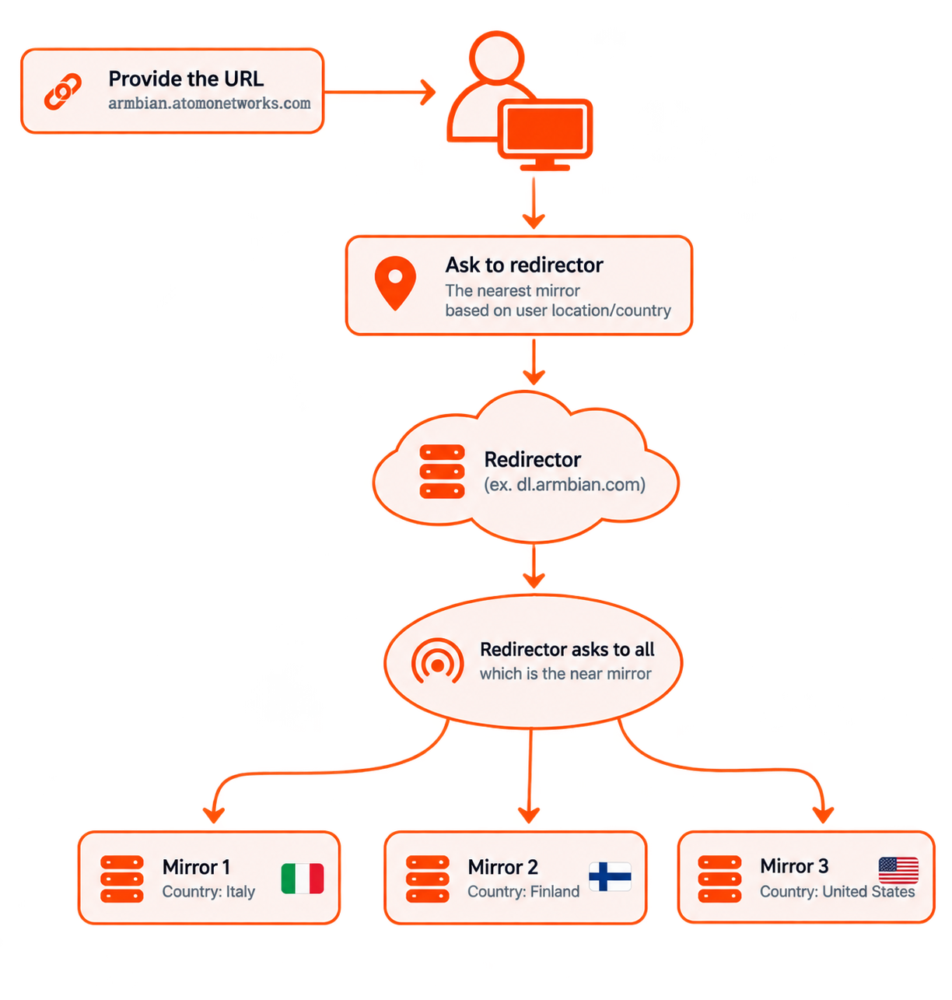

# Mirrors

The [Armbian mirror system](https://github.com/armbian/armbian-router) distributes files efficiently, routing each user to the best available server by geographic proximity and server health. Pick a nearby mirror from the list below, or read on for how the system works. Want to host a mirror? See [**Run a mirror**](/contribute/run-a-mirror/).

<!-- mirrors:start -->
## Current Mirrors

| Site | Flag | Packages | Images | Archive | Rsync |
|:-----|------|:--------:|:------:|:-------:|:-----:|
| [Atomo Networks](https://armbian.atomonetworks.com) |  | :white_check_mark: | :white_check_mark: | :white_check_mark: | :white_check_mark: |
| [Auroradev Chicago](https://armbian.chi.auroradev.org) |  | :white_check_mark: | :white_check_mark: |  |  |
| [Auroradev Las Vegas](https://armbian.lv.auroradev.org) |  | :white_check_mark: | :white_check_mark: | :white_check_mark: | :white_check_mark: |
| [Nardol](https://armbian.nardol.ovh) |  | :white_check_mark: | :white_check_mark: |  |  |
| [Systemonachip](https://armbian.systemonachip.net) |  | :white_check_mark: | :white_check_mark: | :white_check_mark: |  |
| [SBC mirror Australia](https://au.sbcmirror.org) |  | :white_check_mark: | :white_check_mark: | :white_check_mark: |  |
| [Distrohub](https://distrohub.kyiv.ua) |  | :white_check_mark: | :white_check_mark: |  | :white_check_mark: |
| [SBC mirror Spain](https://es.sbcmirror.org) |  | :white_check_mark: | :white_check_mark: | :white_check_mark: |  |
| [Hetzner Germany](https://fi.mirror.armbian.de) |  | :white_check_mark: | :white_check_mark: | :white_check_mark: | :white_check_mark: |
| [Imola](https://imola.armbian.com) |  | :white_check_mark: | :white_check_mark: |  |  |
| [Kspace Estonia](https://k-space.ee.armbian.com) |  | :white_check_mark: | :white_check_mark: | :white_check_mark: |  |
| [Albony](https://mirror.albony.in) |  | :white_check_mark: |  |  |  |
| [Macarne LLC](https://mirror.ams.macarne.com/armbian) |  | :white_check_mark: | :white_check_mark: | :white_check_mark: |  |
| [OSS Planet Finland](https://mirror.eu.ossplanet.net) |  | :white_check_mark: |  |  |  |
| [Hostiko](https://mirror.hostiko.network) |  | :white_check_mark: | :white_check_mark: |  |  |
| [ISCAS](https://mirror.iscas.ac.cn) |  | :white_check_mark: | :white_check_mark: |  |  |
| [OSS Planet Taipei](https://mirror.ossplanet.net) |  | :white_check_mark: |  |  |  |
| [SJTU](https://mirror.sjtu.edu.cn) |  | :white_check_mark: |  |  |  |
| [Digital Streaming Co.](https://mirror.twds.com.tw) |  | :white_check_mark: | :white_check_mark: |  |  |
| [VineHost.NET](https://mirror.vinehost.net/armbian) |  | :white_check_mark: | :white_check_mark: |  |  |
| [Yandex](https://mirror.yandex.ru/mirrors/armbian) |  |  | :white_check_mark: | :white_check_mark: |  |
| [marcusn.net](https://mirror2.marcusn.net/armbian) |  | :white_check_mark: | :white_check_mark: | :white_check_mark: | :white_check_mark: |
| [Alibaba Mirrors](https://mirrors.aliyun.com) |  | :white_check_mark: | :white_check_mark: |  |  |
| [BFSU](https://mirrors.bfsu.edu.cn) |  | :white_check_mark: | :white_check_mark: |  |  |
| [c0urier.net](https://mirrors.c0urier.net) |  | :white_check_mark: | :white_check_mark: | :white_check_mark: |  |
| [CSTCloud](https://mirrors.cstcloud.cn) |  | :white_check_mark: | :white_check_mark: |  |  |
| [dotsrc.org](https://mirrors.dotsrc.org) |  | :white_check_mark: | :white_check_mark: |  |  |
| [Jevin Canders LLC](https://mirrors.jevincanders.net) |  | :white_check_mark: | :white_check_mark: |  |  |
| [Lahansons](https://mirrors.lahansons.com) |  | :white_check_mark: | :white_check_mark: |  |  |
| [Nanjing University](https://mirrors.nju.edu.cn) |  | :white_check_mark: | :white_check_mark: |  |  |
| [Qilu University of Technology](https://mirrors.qlu.edu.cn) |  | :white_check_mark: |  |  |  |
| [Shandong University](https://mirrors.sdu.edu.cn) |  | :white_check_mark: |  |  |  |
| [Shanghai Tech University](https://mirrors.shanghaitech.edu.cn) |  | :white_check_mark: | :white_check_mark: |  |  |
| [SUSTech](https://mirrors.sustech.edu.cn) |  | :white_check_mark: |  |  |  |
| [Tsinghua University](https://mirrors.tuna.tsinghua.edu.cn) |  | :white_check_mark: | :white_check_mark: |  |  |
| [USTC](https://mirrors.ustc.edu.cn) |  | :white_check_mark: | :white_check_mark: |  |  |
| [Zhejiang University](https://mirrors.zju.edu.cn) |  | :white_check_mark: |  |  |  |
| [Netcup Germany](https://netcup-01.armbian.com) |  | :white_check_mark: | :white_check_mark: |  |  |
| [Netcup Germany](https://netcup-02.armbian.com) |  | :white_check_mark: |  |  |  |
| [Netcup Germany](https://netcup-03.armbian.com) |  | :white_check_mark: | :white_check_mark: |  |  |
| [SBC mirror Poland](https://pl.sbcmirror.org) |  | :white_check_mark: | :white_check_mark: |  |  |
| [SBC mirror Sweden](https://se.sbcmirror.org) |  | :white_check_mark: | :white_check_mark: |  |  |
| [SBC mirror Singapore](https://sg.sbcmirror.org) |  | :white_check_mark: | :white_check_mark: |  |  |
| [JetHome](https://stpete-mirror.armbian.com) |  | :white_check_mark: | :white_check_mark: | :white_check_mark: |  |
| [Xogium](https://xogium.performanceservers.nl) |  | :white_check_mark: | :white_check_mark: | :white_check_mark: |  |
<!-- mirrors:end -->

## How it works

1. **Request** — a user starts a download (image, package, ...) from a standard URL such as `https://dl.armbian.com`.
2. **Routing** — the redirector picks the best mirror based on the user's location, each mirror's status and load, and whether it holds the requested file.
3. **Redirect** — the user is sent straight to the chosen mirror.
4. **Download** — the file is served directly from that mirror, keeping downloads fast and taking load off the core infrastructure.

The result is **load balancing** across many servers, **faster downloads** from a nearby mirror, and **redundancy** — if a mirror is unavailable, the redirector automatically routes around it.

## Host a mirror

Want to help serve Armbian's downloads? See [**Run a mirror**](/contribute/run-a-mirror/) for the requirements, the `rsync` sync commands and how to register your server.
